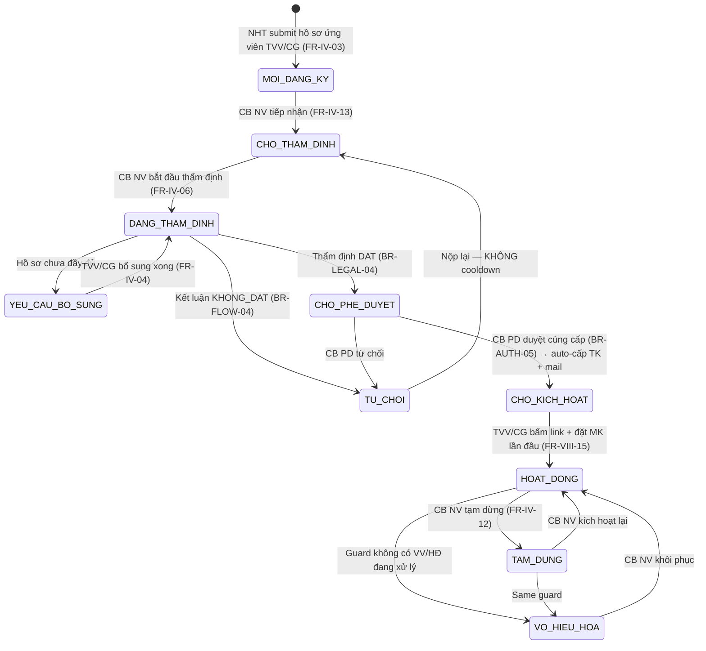
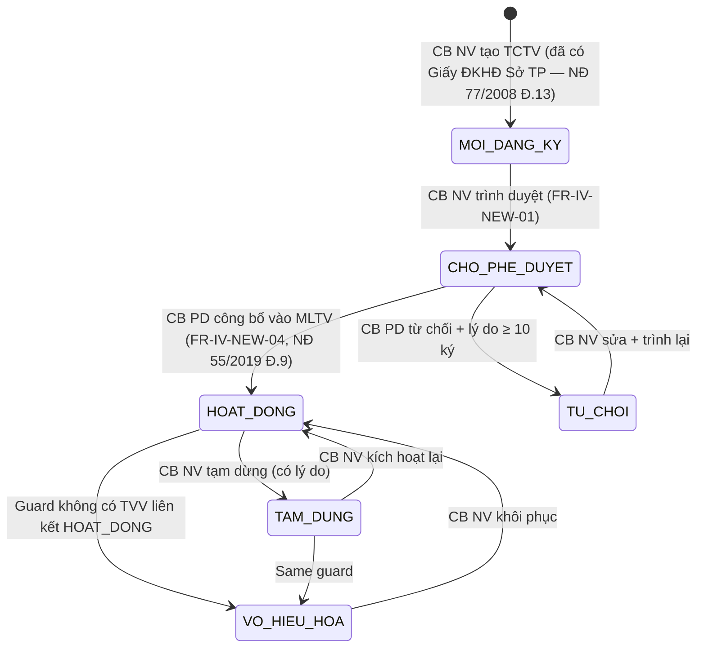
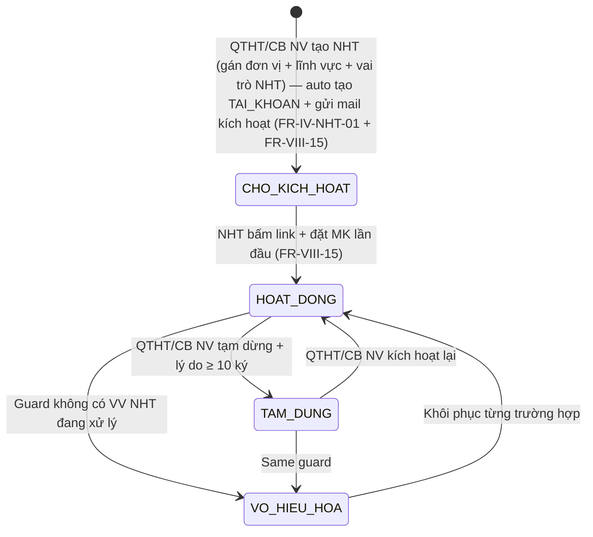

# Kế Hoạch Kiểm Thử — Chuyên gia/TVV/NHT/Tổ chức TV (FR-04, SCR-IV-01..03 + NEW + NHT)

> **Phiên bản**: 1.0
> **Ngày tạo**: 2026-05-12 14:30:00
> **Nguồn dữ liệu**: LOCAL (`input/srs-v3/srs-fr-04-chuyen-gia-tvv.md` baseline + `input/srs-update-2026-5-5/srs-fr-04-chuyen-gia-tvv.md` v3.5 delta — v3.5 thắng khi mâu thuẫn theo `_DELTA-MAP-FR04.md` §5)
> **SRS Reference**: FR-IV-01..13 + FR-IV-NEW-01/02/04 + FR-IV-NHT-01/02/03; SCR-IV-01/02/03 + SCR-IV-NEW-01/02/03 + SCR-IV-NHT-01/02/03

> **Quy trình**: Theo [scaling-test-strategy.md §4.1 Bước 3](../../../output/scaling-test-strategy.md) — trích BR LOCAL + sibling-check ≥2 module (FR-10 quản trị HT + FR-05 vụ việc — consumer chính của entity FR-04) + BA sign-off trước Bước 4.
>
> **v3.0 (2026-04-23)**: Test plan dùng cho **GĐ 3 Functional + Auth + Edge**. GĐ 1 Seed + GĐ 2 Workflow là 2 phase riêng (output `seed-checklist-fr-04.md` + `workflow-test-report-fr-04.md`). TC trong plan này tập trung **negative + edge + auth + cross-module**, happy path đã cover ở workflow phase.

---

## 1. Phạm Vi Kiểm Thử

### 1.1 Chức năng được kiểm thử

- **Phạm vi tổng**: 19 FR (FR-IV-01..13 + FR-IV-CROSS-01 + FR-IV-NEW-01/02/04 + FR-IV-NHT-01/02/03) — UC39..50 + 4 UC mới `[GAP-IV-07/09/10/11]`. Module này thuộc nhóm **A FULL** theo `_DELTA-MAP-FR04.md` §2 — test lại HẾT (workflow + functional + permission) như chưa từng test, do tách entity NHT + TCTV + đổi enum `loai_tvv` + đổi state `DANG_HOAT_DONG` → `HOAT_DONG`.
- **Entity chính** (4 entity, 2 mới):
  1. `TU_VAN_VIEN` (TVV/CG cá nhân ngoài) — `loai_tvv ∈ ('TVV','CG')` v3.5, **bỏ `'NHT'`** khỏi enum (cite `srs-update-2026-5-5/srs-fr-04-chuyen-gia-tvv.md:131` + `:2011`). SM-TVV 10 state (thêm `CHO_KICH_HOAT`).
  2. `NGUOI_HO_TRO` + `NGUOI_HO_TRO_LINH_VUC` (**mới owned + junction** — F-FR04-NEW-02 phương án B+) — 1:1 với `TAI_KHOAN`, theo NĐ 55/2019 Đ.7. SM-NHT 4 state (cite `:2049` + `:2372-2411`).
  3. `TO_CHUC_TU_VAN` (**nâng cấp** từ danh mục → entity owned) — SM-TCTV 6 state (cite `:2200` + `:2323-2369`).
  4. Entity bổ trợ: `TVV_LINH_VUC`, `TVV_TO_CHUC`, `HO_SO_TU_VAN_VIEN`, `DANH_GIA_TU_VAN_VIEN`, `DANH_GIA_SAU_VU_VIEC` (tách từ `DANH_GIA_TVV` v3, thang 1-5 thay vì 0-10).
- **Entity bị xoá**: `TVV_DIA_BAN` (NĐ 77/2008 Đ.19 — TVV scope toàn quốc, bỏ `dia_ban_ids[]`, filter chuyển sang `don_vi_id`).
- **Màn hình**: 9 SCR — SCR-IV-01/02/03 (baseline TVV/CG) + SCR-IV-NEW-01/02/03 (TCTV mới) + SCR-IV-NHT-01/02/03 (NHT mới). Menu đổi tên "Cá nhân tư vấn" → **"Tư vấn viên / Chuyên gia"** + thêm sub-menu **"Người hỗ trợ pháp lý"** + sub-menu **"Tổ chức tư vấn"**.
- **Khung pháp lý**: Luật DNNVV 2017, NĐ 55/2019 Đ.7+9+10, NĐ 77/2008 Đ.13+19+20, **NĐ 121/2025 Đ.39-40** (phân cấp UBND tỉnh công bố MLTV địa phương — đổi từ NĐ 121/2025 Đ.24 v3), QĐ 1322/QĐ-BTP ngày 01/6/2020 Phụ lục 1+2.

### 1.2 Danh sách FR / UC

| # | Mã FR | Use Case | Tên chức năng | Entity | File Test Case |
|---|--------|----------|--------------|--------|----------------|
| 1 | FR-IV-01 | UC39 | Quản lý TVV/CG (CRUD) | `TU_VAN_VIEN` | `01-TC-tvv-cg-crud.md` |
| 2 | FR-IV-02 | UC40 | Tìm kiếm TVV/CG | `TU_VAN_VIEN` | `01-TC-tvv-cg-crud.md` |
| 3 | FR-IV-03 | UC41 | NHT submit hồ sơ ứng viên TVV/CG | `TU_VAN_VIEN` | `02-TC-tvv-cg-register.md` |
| 4 | FR-IV-04 | UC42 | NHT cập nhật năng lực TVV/CG | `HO_SO_TU_VAN_VIEN` | `02-TC-tvv-cg-register.md` |
| 5 | FR-IV-05 | UC43 | Xem chi tiết TVV/CG (5 tab) | `TU_VAN_VIEN` | `03-TC-tvv-cg-detail.md` |
| 6 | FR-IV-06 | UC44 | CB NV thẩm định 4 nhóm tiêu chí | `HO_SO_TU_VAN_VIEN` | `04-TC-tvv-tham-dinh.md` |
| 7 | FR-IV-07 | UC45 | CB PD phê duyệt → `CHO_KICH_HOAT` + auto-cấp TK (FR-VIII-15) | `TU_VAN_VIEN`, `TAI_KHOAN` | `05-TC-tvv-phe-duyet.md` |
| 8 | FR-IV-08 | UC46 | Công khai MLTV lên Cổng PLQG | `TU_VAN_VIEN`, `TO_CHUC_TU_VAN` | `06-TC-cong-khai-mltv.md` |
| 9 | FR-IV-09 | UC47 | Đánh giá TVV sau VV (thang 1-5) | `DANH_GIA_SAU_VU_VIEC` | `07-TC-danh-gia-tvv.md` |
| 10 | FR-IV-10 | UC48 | Xem lịch sử hỗ trợ TVV | `LICH_SU_HO_TRO_TVV` | `03-TC-tvv-cg-detail.md` |
| 11 | FR-IV-11 | UC49 | TVV/CG xem hồ sơ chuyên trang (read-only) | `TU_VAN_VIEN` | `03-TC-tvv-cg-detail.md` |
| 12 | FR-IV-12 | UC50 | Cập nhật trạng thái TVV (TAM_DUNG / VO_HIEU_HOA / khôi phục) | `TU_VAN_VIEN` | `08-TC-tvv-state-update.md` |
| 13 | FR-IV-13 | — | Tiếp nhận + chuyển trạng thái tiền thẩm định | `TU_VAN_VIEN` | `04-TC-tvv-tham-dinh.md` |
| 14 | FR-IV-CROSS-01 | Cross | Tổng hợp `diem_danh_gia_tb` 1.0-5.0 | `TU_VAN_VIEN` | `07-TC-danh-gia-tvv.md` |
| 15 | FR-IV-NEW-01 | UC mới `[GAP-IV-07]` | CRUD Tổ chức TV | `TO_CHUC_TU_VAN` | `09-TC-tctv-crud.md` |
| 16 | FR-IV-NEW-02 | UC mới `[GAP-IV-09]` | Cập nhật trạng thái TCTV | `TO_CHUC_TU_VAN` | `10-TC-tctv-state-update.md` |
| 17 | FR-IV-NEW-04 | UC mới `[GAP-IV-10]` | CB PD công bố TCTV vào MLTV (NĐ 55/2019 Đ.9) | `TO_CHUC_TU_VAN` | `11-TC-tctv-phe-duyet.md` |
| 18 | FR-IV-NHT-01 | UC mới `[GAP-IV-11]` | QTHT/CB NV CRUD NHT + auto cấp TK | `NGUOI_HO_TRO`, `TAI_KHOAN` | `12-TC-nht-crud.md` |
| 19 | FR-IV-NHT-02 | UC mới `[GAP-IV-11]` | Tìm kiếm NHT (phục vụ UC59 phân công VV) | `NGUOI_HO_TRO` | `12-TC-nht-crud.md` |
| 20 | FR-IV-NHT-03 | UC mới `[GAP-IV-11]` | Xem hồ sơ NHT | `NGUOI_HO_TRO` | `13-TC-nht-detail.md` |

### 1.3 Tài khoản & role liên quan

| Role | Cấp | Username (input/users.csv) | Dùng cho TC loại |
|------|-----|-----------------------------|-------------------|
| QTHT | — | `qtht_01` | CRUD admin (primary, cross-cấp). `_02` fallback, `_03` permission test. Riêng NHT: QTHT là 1 trong 2 actor `FR-IV-NHT-01` (cite `:1197+1199`). |
| CB_NV_TW | TW | `cb_nv_tw_01` | Tạo TVV/CG/TCTV cấp TW + thẩm định cấp TW + quản lý NHT cùng đơn vị BTP-TW |
| CB_NV_BN | BN | `cb_nv_bn_01` (BKH) | Tạo TVV/CG/TCTV cấp BN + thẩm định + quản lý NHT cùng đơn vị BKH |
| CB_NV_DP | ĐP | `cb_nv_dp_01` (STP-AG) | Tạo TVV/CG/TCTV cấp ĐP + thẩm định + quản lý NHT cùng đơn vị STP-AG |
| CB_PD_TW | TW | `cb_pd_tw_01` | Phê duyệt TVV cấp TW (FR-IV-07) + phê duyệt TCTV cấp TW (FR-IV-NEW-04) |
| CB_PD_BN | BN | `cb_pd_bn_01` (BKH) | Phê duyệt TVV/TCTV cấp BN |
| CB_PD_DP | ĐP | `cb_pd_dp_01` (STP-AG) | Phê duyệt TVV/TCTV cấp ĐP |
| NHT | ĐP | `nht_01` (STP-AG), `nht_02` (STP-DN), `nht_btp_tw_audit_r30` (BTP-TW) | NHT submit hồ sơ ứng viên (FR-IV-03) + cập nhật năng lực (FR-IV-04). Permission test khác đơn vị. |
| CG | TW | `huongcg` (BTP-TW — TVV-BTP-TW-0030, `loai_tvv=CG`) | TVV/CG xem hồ sơ chuyên trang read-only (FR-IV-11) + permission BR-AUTH-10 (CG chỉ thấy YC TVCS được phân công). **BR-AUTH-10 mở rộng**: NHT + TVV cùng test — NHT thấy VV được phân công (`VU_VIEC.nguoi_ho_tro_id`), TVV thấy VV được phân công (`VU_VIEC.tu_van_vien_id`) — cite v3 `:3963` + `:668`. |
| DN | — | `9999999990`, `9999999991` | Đánh giá TVV sau VV (FR-IV-09) — DANH_GIA_SAU_VU_VIEC |
| Negative — cross-cấp | TW vs ĐP | `cb_pd_tw_01` ↔ hồ sơ cấp ĐP | BR-AUTH-05 violation — CB PD khác cấp không duyệt được |
| Negative — cross-đơn vị | BN BKH vs BN BTC | `cb_nv_bn_01` (BKH) ↔ NHT cấp BTC | BR-AUTH-08 violation — đọc/sửa NHT khác đơn vị |

> Reference: [input/users.csv](../../../input/users.csv) (66 TK active sau 2026-05-08 batch + nht_01/02 + huongcg + nht_btp_tw_audit_r30), [output/permission-matrix.md](../../../output/permission-matrix.md) (sẽ mở rộng 49 → 51 entity sau khi add `NGUOI_HO_TRO` + `TO_CHUC_TU_VAN`).

---

## 2. Quy Tắc Nghiệp Vụ Trích Xuất Từ SRS

### 2.1 Business Rules (BR)

> ⚠️ Cột "Ngoại lệ SRS-quoted" để trống = BR áp dụng 100%. Nếu có ngoại lệ, QUOTE nguyên văn SRS + line.

| Mã | Quy tắc | Nguồn (SRS line LOCAL) | Áp dụng module này? | Ngoại lệ SRS-quoted | TC áp dụng |
|----|---------|------------------------|---------------------|---------------------|-----------|
| BR-AUTH-01 | Xác thực bắt buộc (Tier 1 user/pass + TOTP) | `srs-update-2026-5-5/srs-fr-04-chuyen-gia-tvv.md:2442` | ✅ Yes — toàn bộ FR nhóm IV | API outbound không cần session | Precondition mọi TC |
| BR-AUTH-02 | Phân cấp 3 tầng TW/BN/ĐP | `srs-v3/srs-v3.md:3950` | ✅ Yes | "QTHT thấy tất cả" | TC permission cross-cấp |
| BR-AUTH-03 | Ngang cấp KHÔNG thấy nhau | `srs-v3/srs-v3.md:3951` | ✅ Yes | "QTHT thấy tất cả" | TC permission BN BKH vs BN BTC |
| BR-AUTH-05 | **Phê duyệt cùng cấp** — CB NV cấp X thẩm định → CB PD cùng cấp X duyệt. KHÔNG xuyên cấp. KHÔNG ESCALATE bắt buộc (NĐ 121/2025 Đ.39-40 + NĐ 55/2019 Đ.9 — bỏ ESCALATE so v3 cũ) | `srs-update-2026-5-5/srs-fr-04-chuyen-gia-tvv.md:2448` | ✅ Yes — FR-IV-07, FR-IV-NEW-04 | — | TC `cb_pd_tw_01` duyệt hồ sơ ĐP → 403 (`ERR-PD-TC-02` / `ERR-PD-04`) |
| BR-AUTH-08 | Phân quyền dữ liệu theo `don_vi_id` — CB NV/PD chỉ thấy/sửa entity cùng đơn vị; QTHT thấy tất cả | `srs-update-2026-5-5/srs-fr-04-chuyen-gia-tvv.md:2425` + `srs-v3/srs-v3.md:3958` | ✅ Yes — FR-IV-01/02/06/11/12, NEW-01/02/04 | "QTHT thấy tất cả đơn vị" (`:1211`) | TC data isolation đơn vị + NHT khác đơn vị |
| BR-AUTH-10 | **Lọc kép — CG/TVV/NHT chỉ thấy record được phân công** (Lớp 2 lọc theo `YEU_CAU_TU_VAN.chuyen_gia_id` / `VU_VIEC.tu_van_vien_id` / `VU_VIEC.nguoi_ho_tro_id`) | `srs-v3/srs-v3.md:3963` + `:668` Phụ lục B | ✅ Yes — CG (TVCS), TVV (VV), NHT (VV) | — | TC `huongcg` chuyên trang chỉ thấy TVCS phân công + TC NHT chỉ thấy VV phân công + TC TVV chỉ thấy VV phân công |
| BR-DATA-01 | Soft delete | `srs-update-2026-5-5/srs-fr-04-chuyen-gia-tvv.md:2426` | ✅ Yes — FR-IV-01, FR-IV-NEW-01 | — | TC DELETE TVV/TCTV = UPDATE `is_deleted=1` |
| BR-DATA-03 | Common fields (created_at, updated_at, version, created_by, updated_by) | `srs-update-2026-5-5/srs-fr-04-chuyen-gia-tvv.md:2427` | ✅ Yes — FR-IV-01, FR-IV-NEW-01 | — | TC verify field common ở response |
| BR-DATA-05 | Audit trail CUD | `srs-update-2026-5-5/srs-fr-04-chuyen-gia-tvv.md:2428` | ✅ Yes — toàn bộ CUD | — | TC verify `AUDIT_LOG` INSERT sau mỗi CUD |
| BR-DATA-06 | Export Excel max 10k rows | `srs-v3/srs-v3.md:3977` + apply FR-IV-02 line 241 (Phụ lục 1 QĐ 1322), FR-IV-NEW-01 line 1081 (Phụ lục 2 QĐ 1322) | ✅ Yes — FR-IV-02, FR-IV-NEW-01 | — | TC export 10k boundary + `WRN-TVV-01` khi vượt |
| BR-DATA-07 | Pagination default 20, max 100 | `srs-update-2026-5-5/srs-fr-04-chuyen-gia-tvv.md:2429` | ✅ Yes — FR-IV-02, FR-IV-10, FR-IV-NHT-02 | — | TC pagination boundary |
| BR-FLOW-02 | Phê duyệt hàng loạt / Từ chối từng bản ghi | `srs-update-2026-5-5/srs-fr-04-chuyen-gia-tvv.md:2430` | ✅ Yes — FR-IV-07, SCR-IV-01 batch | — | TC bulk approve TVV ở tab "Chờ phê duyệt" |
| BR-FLOW-03 | Không sửa/xoá sau phê duyệt | `srs-update-2026-5-5/srs-fr-04-chuyen-gia-tvv.md:2431` | ✅ Yes — FR-IV-06 (sau khi gửi KQ thẩm định) | — | TC sửa hồ sơ TVV ở `HOAT_DONG` → reject (chỉ CB NV update năng lực qua FR-IV-04) |
| BR-FLOW-04 | Từ chối yêu cầu lý do (≥10 ký tự) | `srs-update-2026-5-5/srs-fr-04-chuyen-gia-tvv.md:2432` | ✅ Yes — FR-IV-06 KHONG_DAT, FR-IV-07, FR-IV-12, FR-IV-NEW-02/04 | — | TC TU_CHOI thiếu lý do → `ERR-PD-03` / `ERR-TT-03` |
| BR-LEGAL-04 | NĐ 77/2008 — Tư vấn pháp luật (Thẻ TVV toàn quốc Đ.19) | `srs-update-2026-5-5/srs-fr-04-chuyen-gia-tvv.md:2433` + `:42` (bỏ `dia_ban_ids`) | ✅ Yes — FR-IV-01 đến FR-IV-12 | — | TC TVV cấp ĐP search được toàn quốc, không lọc theo địa bàn |
| BR-LEGAL-09 | NĐ 55/2019 Đ.9 — MLTV TVV công khai toàn quốc | `srs-update-2026-5-5/srs-fr-04-chuyen-gia-tvv.md:2434` | ✅ Yes — FR-IV-08, FR-IV-02 | — | TC `cong_khai=1` AND `trang_thai='HOAT_DONG'` → hiện trên Cổng PLQG |
| BR-CALC-06 | Điểm đánh giá TB TVV = AVG(DANH_GIA_SAU_VU_VIEC.diem_trung_binh), thang **1.0-5.0** (đổi từ 0-10 v3) round-half-up 1 chữ số | `srs-update-2026-5-5/srs-fr-04-chuyen-gia-tvv.md:2435` + `:933-934` + `:186` (output 1.0-5.0) | ✅ Yes — FR-IV-09, FR-IV-CROSS-01 | TVV chưa có ĐG → hiển thị "—/5" (cite `:945`) | TC sau khi DN chấm 3 lần → verify `diem_danh_gia_tb` cập nhật + UI hiển thị badge |
| BR-PUBLIC-01 | Công khai TVV/TCTV lên Cổng PLQG: set `cong_khai=1`, `thoi_gian_dang_tai=NOW()`, gọi API Cổng | `srs-update-2026-5-5/srs-fr-04-chuyen-gia-tvv.md:2436` + `:655` (TVV) + `:1075` (TCTV) | ✅ Yes — FR-IV-08, FR-IV-NEW-01 | — | TC công khai khi `trang_thai=CHO_KICH_HOAT` (TVV) hoặc `HOAT_DONG` (TCTV) |
| BR-PUBLIC-02 | Hủy công khai: set `cong_khai=0`, clear `thoi_gian_dang_tai`, gọi API Cổng gỡ. **Giữ lại** `mo_ta_cong_khai` + `file_dinh_kem_cong_khai` để re-publish không nhập lại | `srs-update-2026-5-5/srs-fr-04-chuyen-gia-tvv.md:656` + `:2436` | ✅ Yes — FR-IV-08, FR-IV-NEW-01 | — | TC hủy + republish → form pre-fill |
| BR-PUBLIC-03 | API Cổng PLQG lỗi → retry 3 lần + WRN-TCTV-04 / WRN-CK-01 | `srs-update-2026-5-5/srs-fr-04-chuyen-gia-tvv.md:1702` + `:2436` | ✅ Yes — FR-IV-08, FR-IV-NEW-01 | — | TC mock API Cổng PLQG 500 → verify retry + WRN code |
| BR-EC-01 | Optimistic Locking (`version` mismatch → `ERR-SYS-02` / `ERR-PD-TC-04`) | `srs-v3/srs-v3.md:4066` + `srs-update-2026-5-5/srs-fr-04-chuyen-gia-tvv.md:1175` | ✅ Yes — mọi UPDATE/DELETE (FR-IV-01/12/NEW-02/NEW-04) | — | TC 2 CB PD duyệt cùng TC TV → user thứ 2 nhận `ERR-PD-TC-04` |
| BR-EC-13 | Search sanitize max 200 ký tự | `srs-v3/srs-v3.md:4078` | ✅ Yes — FR-IV-02, FR-IV-NHT-02 | — | TC search SQL/XSS/long query |
| BR-FLOW-NHT-01 | NHT KHÔNG cần workflow thẩm định 4 tiêu chí (NĐ 55/2019 Đ.7 — cán bộ HTPL nội bộ) | `srs-update-2026-5-5/srs-fr-04-chuyen-gia-tvv.md:2049` + `:2411` | ✅ Yes — FR-IV-NHT-01 | — | TC tạo NHT → đi thẳng `CHO_KICH_HOAT` (không qua MOI_DANG_KY/CHO_THAM_DINH/CHO_PHE_DUYET như TVV) |
| BR-FLOW-TCTV-01 | TCTV phải qua phê duyệt CB PD (NĐ 55/2019 Đ.9) trước khi `HOAT_DONG` — KHÔNG tạo trực tiếp `HOAT_DONG` | `srs-update-2026-5-5/srs-fr-04-chuyen-gia-tvv.md:2334` (transition `CHO_PHE_DUYET → HOAT_DONG`) + `:1058` (FR-IV-NEW-01 processing) + `:2328` (pháp lý NĐ 55/2019 Đ.9) | ✅ Yes — FR-IV-NEW-01, FR-IV-NEW-04 | — | TC tạo TCTV → `MOI_DANG_KY` (không phải `HOAT_DONG`) |
| BR-VIRUS-01 | ClamAV scan upload file (PDF/DOCX), timeout 30s, reject khi phát hiện malware | `srs-update-2026-5-5/srs-fr-04-chuyen-gia-tvv.md:150` + `:318` + `:394` | ✅ Yes — FR-IV-01/03/04, FR-IV-NEW-01 | — | TC upload EICAR test file → `ERR-TVV-08` / `ERR-DK-06` |

> **Bổ sung BR specific module**: BR-FLOW-NHT-01 + BR-FLOW-TCTV-01 + BR-VIRUS-01 — 3 BR mới sinh từ v3.5 delta.

### 2.2 Error Codes

Quote nguyên văn message từ SRS update (`srs-update-2026-5-5/srs-fr-04-chuyen-gia-tvv.md`). Khi test negative, expected message match exact — không "close enough".

| Mã lỗi | Điều kiện trigger | Message (SRS-quoted) | Severity | SRS line |
|--------|-------------------|----------------------|----------|----------|
| ERR-TVV-01 | Họ tên trống khi tạo TVV | "Họ tên là bắt buộc" | ERROR | `:194` |
| ERR-TVV-02 | CMND/CCCD trùng toàn hệ thống | "Số Căn cước công dân đã tồn tại" | ERROR | `:195` |
| ERR-TVV-03 | Email không hợp lệ RFC 5322 | "Email không hợp lệ" | ERROR | `:196` |
| ERR-TVV-04 | Tổ chức tư vấn chính không tồn tại | "Tổ chức tư vấn không tồn tại" | ERROR | `:197` |
| ERR-TVV-05 | Xóa TVV có VV chưa hoàn thành | "Tư vấn viên đang có vụ việc chưa hoàn thành" | ERROR | `:198` |
| ERR-TVV-06 | File upload vượt tổng 50MB | "Tổng dung lượng file đính kèm tối đa 50MB" | ERROR | `:199` |
| ERR-TVV-07 | Số file bằng cấp vượt 10 | "Tối đa 10 file bằng cấp" | ERROR | `:200` |
| ERR-TVV-08 | ClamAV phát hiện malware | "File {ten_file} chứa mã độc, bị từ chối" | ERROR | `:201` |
| ERR-TVV-09 | `loai_tvv` không thuộc `('TVV','CG')` | "Loại phải là Tư vấn viên/Chuyên gia" | ERROR | `:202` |
| ERR-DK-01 | NHT submit hồ sơ trùng CCCD đang chờ | "Ứng viên (theo CCCD) đã có hồ sơ đang chờ xử lý" | ERROR | `:327` |
| ERR-DK-09 | Email TVV trùng | "Email này đã được sử dụng bởi tư vấn viên khác" | ERROR | `:335` |
| ERR-PD-TC-02 | CB PD duyệt TCTV khác cấp | "Chỉ phê duyệt Tổ chức tư vấn cùng cấp" | ERROR | `:1173` |
| ERR-PD-TC-03 | TU_CHOI TCTV thiếu lý do | "Lý do từ chối là bắt buộc (≥10 ký tự)" | ERROR | `:1174` |
| ERR-PD-TC-04 | Optimistic lock conflict phê duyệt TCTV | "Tổ chức tư vấn đã được duyệt bởi {nguoi_duyet} lúc {time}, vui lòng tải lại trang" | ERROR | `:1175` |
| ERR-PD-TC-05 | Phê duyệt TCTV thiếu `so_quyet_dinh` | "Số quyết định công bố là bắt buộc khi phê duyệt" | ERROR | `:1176` |
| ERR-TCTV-02 | Xoá TCTV có TVV đang liên kết | "Tổ chức đang có tư vấn viên hoạt động, không thể xóa" | ERROR | `:1104` |
| ERR-TCTV-03 | Công khai TCTV khi `trang_thai != HOAT_DONG` | "Chỉ tổ chức đang hoạt động mới được công khai" | ERROR | `:1105` |
| ERR-CK-01 | Công khai TVV khi không `CHO_KICH_HOAT`/`HOAT_DONG` | "Chỉ tư vấn viên đã được công nhận (Chờ kích hoạt hoặc Đang hoạt động) hoặc tổ chức đang hoạt động mới được công khai" | ERROR | `:672` |
| ERR-TT-01 | Transition không hợp lệ SM-TVV | "Không thể chuyển từ {old} sang {new}" | ERROR | `:906` |
| ERR-TT-02 | VO_HIEU_HOA TVV có VV/HĐ đang xử lý | "Tư vấn viên đang có {N} vụ việc và {M} hỏi đáp chưa hoàn thành, không thể vô hiệu hóa" | ERROR | `:907` |
| ERR-TT-TC-02 | VO_HIEU_HOA TCTV có TVV đang liên kết | "Tổ chức đang có {N} tư vấn viên đang hoạt động liên kết, không thể vô hiệu hóa" | ERROR | `:998` |
| WRN-TVV-01 | Export TVV vượt 10k rows | "Vượt 10.000 dòng — chỉ tải về 10.000 dòng đầu, hãy lọc thêm" | WARNING | `:241` |
| WRN-TCTV-04 | API Cổng PLQG lỗi khi công khai TCTV | "Cập nhật Cổng pháp luật quốc gia thất bại, sẽ thử lại" | WARNING | `:1106` |
| INF-TVV-01 | Search TVV không có kết quả | "Không tìm thấy tư vấn viên phù hợp" | INFO | `:264` |
| INF-TVV-DG-01 | TVV chưa có đánh giá nào | "Chưa có đánh giá" — hiển thị "—/5" thay vì 0 | INFO | `:941` |

### 2.3 Permission Matrix (module-specific)

> Reference đầy đủ: [output/permission-matrix.md](../../../output/permission-matrix.md) (sẽ mở rộng 49 → 51 entity).
> `C` = Create, `R` = Read, `U` = Update, `D` = Delete soft, `Approve` = phê duyệt, `Publish` = công khai Cổng PLQG, `−` = không có quyền, `R-own` = chỉ đọc record của mình, `R-assigned` = chỉ đọc record được phân công.

| Entity / Action | QTHT | CB_NV_TW | CB_NV_BN | CB_NV_DP | CB_PD_TW | CB_PD_BN | CB_PD_DP | NHT | TVV | CG | DN |
|-----------------|:----:|:--------:|:--------:|:--------:|:--------:|:--------:|:--------:|:---:|:---:|:--:|:--:|
| `TU_VAN_VIEN` (TVV/CG cá nhân ngoài) — CRUD list | CRUD all | CRUD cùng đv | CRUD cùng đv | CRUD cùng đv | R cùng cấp | R cùng cấp | R cùng cấp | C+R cùng đv (FR-IV-03/04) | R-own (chuyên trang FR-IV-11) | R-own (chuyên trang FR-IV-11) | − |
| `TU_VAN_VIEN` — Thẩm định 4 tiêu chí (FR-IV-06) | − | U cùng đv | U cùng đv | U cùng đv | − | − | − | − | − | − | − |
| `TU_VAN_VIEN` — Phê duyệt → CHO_KICH_HOAT (FR-IV-07) | − | − | − | − | Approve cùng cấp TW | Approve cùng cấp BN | Approve cùng cấp ĐP | − | − | − | − |
| `TU_VAN_VIEN` — Công khai/Hủy Cổng (FR-IV-08) | − | Publish cùng đv | Publish cùng đv | Publish cùng đv | − | − | − | − | − | − | − |
| `TU_VAN_VIEN` — TAM_DUNG/VO_HIEU_HOA (FR-IV-12) | − | U cùng đv | U cùng đv | U cùng đv | − | − | − | − | − | − | − |
| `TU_VAN_VIEN` — Đánh giá DANH_GIA_SAU_VU_VIEC (FR-IV-09) | − | − | − | − | − | − | − | − | − | − | C (sau VV `HOAN_THANH`) |
| `TO_CHUC_TU_VAN` — CRUD list (FR-IV-NEW-01) | CRUD all | CRUD cùng đv | CRUD cùng đv | CRUD cùng đv | R cùng cấp | R cùng cấp | R cùng cấp | R | R | R | R-public Cổng |
| `TO_CHUC_TU_VAN` — Trình duyệt → CHO_PHE_DUYET (FR-IV-NEW-01) | − | U cùng đv | U cùng đv | U cùng đv | − | − | − | − | − | − | − |
| `TO_CHUC_TU_VAN` — Phê duyệt HOAT_DONG (FR-IV-NEW-04) | − | − | − | − | Approve cùng cấp TW | Approve cùng cấp BN | Approve cùng cấp ĐP | − | − | − | − |
| `TO_CHUC_TU_VAN` — TAM_DUNG/VO_HIEU_HOA (FR-IV-NEW-02) | − | U cùng đv | U cùng đv | U cùng đv | − | − | − | − | − | − | − |
| `TO_CHUC_TU_VAN` — Công khai Cổng (FR-IV-NEW-01) | − | Publish cùng đv | Publish cùng đv | Publish cùng đv | − | − | − | − | − | − | − |
| `NGUOI_HO_TRO` — CRUD list (FR-IV-NHT-01) | CRUD all | C+R+U cùng đv | C+R+U cùng đv | C+R+U cùng đv | R cùng cấp | R cùng cấp | R cùng cấp | R-own | − | − | − |
| `NGUOI_HO_TRO` — Tìm kiếm (FR-IV-NHT-02) — dropdown UC59 | R all | R cùng đv | R cùng đv | R cùng đv | R cùng cấp | R cùng cấp | R cùng cấp | − | − | − | − |
| `NGUOI_HO_TRO` — Xem hồ sơ (FR-IV-NHT-03) | R all | R cùng đv | R cùng đv | R cùng đv | R cùng cấp | R cùng cấp | R cùng cấp | R-own | − | − | − |
| `DANH_GIA_SAU_VU_VIEC` (đánh giá DN → TVV) | R all | R cùng đv | R cùng đv | R cùng đv | R cùng cấp | R cùng cấp | R cùng cấp | R cùng đv | − | − | C (1 lần/VV) |

> **Note bug nguy cơ — đã ghi nhận project memory `qa_htpldn_qtht_permission_bypass`**: BE pass DELETE/PATCH/POST cho QTHT trên `/api/v1/tu-van-viens` (R14 W1). Pattern có thể lặp trên `/nguoi-ho-tros` + `/to-chuc-tu-vans`. **TC P0** phải probe API trước UI khi test permission CG/TVV/NHT/TCTV.

### 2.4 UI Layout

> ⚠️ KHÔNG dùng absence (UI spec không list X) để kết luận "module KHÔNG có X". Feature thiếu trong UI phải đối chiếu §2.1 BR + SRS Phụ lục B + grep `_DELTA-MAP-FR04.md` trước.

**SCR-IV-01 — Danh sách TVV/CG (cite `srs-update-2026-5-5/srs-fr-04-chuyen-gia-tvv.md:1398-1538`):**
- **Toolbar**: Breadcrumb "Tư vấn viên / Chuyên gia" + nút "Thêm mới" + "Xuất Excel" (Phụ lục 1 QĐ 1322) + "Công khai" (bulk) + "Hủy công khai" (bulk)
- **6 tab filter `trang_thai`** (cite `:1416-1421`): Đang hoạt động / Tạm dừng / Mới đăng ký · Chờ thẩm định / Đang thẩm định / Yêu cầu bổ sung / Chờ phê duyệt (hiển thị khi role = CB PD)
- **Filter-bar**: từ khóa (tên/mã/CCCD) / Lĩnh vực PL multi-select / Đơn vị quản lý (thay `dia_ban` v3) / Tổ chức / Trạng thái / Khoảng ngày công nhận
- **Content/Table 10 cột**: Ảnh / Mã TVV / Họ tên / Loại (`TVV`/`CG` — bỏ `NHT`) / Lĩnh vực (tags) / Tổ chức chính / Điểm ĐG (1.0-5.0 badge) / Trạng thái (badge màu SM-TVV) / Ngày công nhận / Hành động (dropdown "..." khi >3 action)

**SCR-IV-02 — Form Thêm/Sửa TVV (5 accordion, cite `:218-227`):** Cá nhân / Nghề nghiệp / Tổ chức & Mạng lưới (bỏ `dia_ban_hoat_dong`, thêm `don_vi_id` lock theo NHT/CB NV đăng nhập) / File đính kèm (PDF max 10MB/file, tổng 50MB, max 10, ClamAV) / Ghi chú max 5000 ký tự.

**SCR-IV-03 — Chi tiết TVV (5 tab, cite `:228-236`):** Hồ sơ / Thẩm định 4 nhóm tiêu chí + nút [Hủy] [Lưu nháp] [Gửi KQ] [Trình duyệt] / Năng lực (inline edit) / Lịch sử hỗ trợ (3 nguồn: VU_VIEC + TU_VAN_CHUYEN_SAU + LICH_SU_HO_TRO_TVV) / Đánh giá (2 section: nội bộ FR-IV-06 + DANH_GIA_SAU_VU_VIEC FR-IV-09).

**SCR-IV-NEW-01 — Danh sách Tổ chức TV (cite `:1546-1637`):** Filter "Trạng thái SM-TCTV" + loại hình (CONG_TY_LUAT/VP_LUAT_SU/TT_TVPL/KHAC) + lĩnh vực + đơn vị. Tab "Chờ phê duyệt" cho CB PD batch approve. Action [Phê duyệt] / [Từ chối] / [Công khai].

**SCR-IV-NEW-02 — Form Thêm/Sửa Tổ chức TV (cite `:1640-1700`):** 17 trường, dropdown `loai_hinh` labels (CONG_TY_LUAT="Công ty luật" / VP_LUAT_SU="Văn phòng luật sư" / TT_TVPL="Trung tâm TVPL" / KHAC="Khác"), file đính kèm 20MB/file.

**SCR-IV-NEW-03 — Chi tiết Tổ chức TV (cite `:1700-1726`):** Header có 3 nút Trình duyệt/Phê duyệt/Từ chối + Công khai. 2 tab: Hồ sơ / TVV thuộc TC TV (link sang SCR-IV-01 filter `to_chuc_chinh_id`).

**SCR-IV-NHT-01 — Danh sách NHT (cite `:1727-1790`):** Filter trạng thái SM-NHT (4 state) + đơn vị + lĩnh vực. Cột: Mã NHT / Họ tên / Đơn vị / Lĩnh vực (tags) / Trạng thái / Hành động.

**SCR-IV-NHT-02 — Form Thêm/Sửa NHT (cite `:1791-1820`):** Form đơn giản 5 trường (ho_ten / email unique / username unique 4-50 / `don_vi_id` lock theo CB NV đăng nhập, QTHT chọn tự do / `linh_vuc_ids[]` ≥1). **KHÔNG có 4 nhóm tiêu chí thẩm định + KHÔNG cần upload bằng cấp** (NĐ 55/2019 Đ.7 — cán bộ nội bộ).

**SCR-IV-NHT-03 — Chi tiết NHT (cite `:1821-1845`):** 2 tab: Hồ sơ / Lịch sử phân công VV (read-only). Action nút [Tạm dừng] [Vô hiệu hóa] [Khôi phục] theo SM-NHT.

**Cross-cutting features MẶC ĐỊNH có (theo BR global):**
- ☑ Nút [Xuất Excel] toolbar SCR-IV-01 (Phụ lục 1 QĐ 1322 — 10 cột cố định, line `:241`) + SCR-IV-NEW-01 (Phụ lục 2 QĐ 1322, line `:1081`) — BR-DATA-06
- ☑ Pagination 20/page default — BR-DATA-07
- ☑ Search sanitize max 200 chars — BR-EC-13
- ☑ Audit log mọi CUD — BR-DATA-05
- ☑ Optimistic lock mọi UPDATE/DELETE — BR-EC-01
- ☑ Bộ ánh xạ enum → label tiếng Việt (cite `§ 3.0` line `:1340-1370`) — màu badge trạng thái theo bảng SM
- ☑ 11 mẫu hộp thoại xác nhận MD-* (cite `§ 3.0b`) — MD-TAM-DUNG / MD-VO-HIEU-HOA / MD-CONG-KHAI / MD-HUY-CONG-KHAI / MD-CONG-KHAI-PARTIAL-FAIL...

**Feature module KHÔNG có (cần QUOTE SRS line):**
- ❌ **Field `dia_ban_ids[]`** trong form SCR-IV-02 — bỏ theo NĐ 77/2008 Đ.19 (`:42` + `:149`). Filter chuyển sang `don_vi_id`.
- ❌ **Loại `NHT` trong dropdown `loai_tvv`** — chỉ còn `('TVV','CG')` (`:131` + `:2011`). NHT entity riêng.
- ❌ **Cooldown 6 tháng** nộp lại sau TU_CHOI — bỏ (BA chốt 2026-05-03, line `:262` + `:314`). KHÔNG có cooldown.
- ❌ **ESCALATE xuyên cấp** phê duyệt TVV — bỏ, mỗi cấp tự công bố theo NĐ 121/2025 Đ.39-40 (`:516` + `:2448`).
- ❌ **Form thẩm định 4 nhóm tiêu chí** cho NHT — NHT KHÔNG cần (BR-FLOW-NHT-01, `:2411`).
- ❌ **Form upload bằng cấp/chứng chỉ** cho NHT — NHT KHÔNG cần (form NHT chỉ 5 field, `:1206-1212`).
- ❌ **ClamAV scan upload cho NHT** — form NHT KHÔNG có file upload field (`:1206-1212`), BR-VIRUS-01 KHÔNG áp dụng. Explicit để tránh tester log false bug "thiếu ClamAV cho NHT".

### 2.5 State Machine

Module có **3 SM cùng tồn tại** — SM-TVV cho TVV/CG cá nhân ngoài + **SM-TCTV mới** cho Tổ chức TV + **SM-NHT mới** cho cán bộ HTPL nội bộ. SM-TCTV + SM-NHT là 2 lifecycle BẮT BUỘC vẽ vì sinh ra từ v3.5 delta.

#### 2.5.1 SM-TVV (10 state — cite `srs-update-2026-5-5/srs-fr-04-chuyen-gia-tvv.md:2260-2321`)



**Đổi tên enum quan trọng**: `DANG_HOAT_DONG` v3 → **`HOAT_DONG`** v3.5 (cite `:2011`). Mọi consumer (FR-05/FR-12/FR-14/FR-16) phải đọc state mới.

#### 2.5.2 SM-TCTV (6 state — cite `srs-update-2026-5-5/srs-fr-04-chuyen-gia-tvv.md:2323-2369`)

**Pháp lý**: NĐ 55/2019 Đ.9 — TCTV phải qua luồng "thông báo + được bộ/cơ quan công bố" trước khi vào MLTV. KHÔNG được tạo trực tiếp `HOAT_DONG`.



**Guard VO_HIEU_HOA**: `COUNT(TVV_TO_CHUC WHERE to_chuc_id=@id AND TU_VAN_VIEN.trang_thai='HOAT_DONG') = 0` — nếu vi phạm → `ERR-TT-TC-02`.

#### 2.5.3 SM-NHT (4 state — cite `srs-update-2026-5-5/srs-fr-04-chuyen-gia-tvv.md:2372-2411`)

**Pháp lý**: NĐ 55/2019 Đ.7 — cán bộ HTPL nội bộ, KHÔNG qua thẩm định 4 nhóm tiêu chí + KHÔNG cần phê duyệt CB PD. Vòng đời gọn: cấp TK → kích hoạt → quản lý hoạt động.



**Guard VO_HIEU_HOA**: `COUNT(VU_VIEC WHERE nguoi_ho_tro_id=@id AND trang_thai NOT IN ('HOAN_THANH','HUY')) = 0` — line `:2407`.

### 2.6 Data dependencies & Seed / Workflow input (v3.0)

| Phase | Input file | Section dùng |
|-------|-----------|--------------|
| **GĐ 1 Seed (pure entry state)** | [`input/data/seed-fixture.yaml`](../../../input/data/seed-fixture.yaml) | `tu_van_vien_variants[1..6]` + `to_chuc_tu_van_variants[1..6]` (mới) + `nguoi_ho_tro_variants[1..6]` (mới) |
| **GĐ 1 click flow** | [`input/flow-module.md`](../../../input/flow-module.md) | §FR-04 (cập nhật theo SRS update để cover SM-NHT + SM-TCTV mới) |
| **GĐ 2 Workflow** | [`input/quy-trinh-nghiep-vu/02-thu-tu-module.md`](../../../input/quy-trinh-nghiep-vu/02-thu-tu-module.md) | §③ FR-04 (line 193-273 — đã update cho v3.5) |
| **Cross-module map** | [`input/data/entity-map.md`](../../../input/data/entity-map.md) | Thêm 2 row entity NGUOI_HO_TRO + TO_CHUC_TU_VAN |

**Upstream dependencies (Tier check theo `02-thu-tu-module.md` Lớp 1/2):**

| Entity của module | Tier | Phụ thuộc entity nào (upstream) | Seed trước tại module |
|-------------------|:----:|----------------------------------|-----------------------|
| `TO_CHUC_TU_VAN` | 1 (Master Data) | `DANH_MUC` (lĩnh vực PL) + `DON_VI` (đơn vị quản lý) | FR-10 Quản trị HT |
| `NGUOI_HO_TRO` | 1 | `DANH_MUC` (lĩnh vực) + `DON_VI` + `TAI_KHOAN` (auto-tạo) + `VAI_TRO 'NHT'` | FR-10 |
| `TU_VAN_VIEN` (TVV/CG) | 2 | `TO_CHUC_TU_VAN` (`to_chuc_chinh_id` FK) + `DANH_MUC` lĩnh vực + `DON_VI` + `NGUOI_HO_TRO` (actor submit FR-IV-03) | FR-04 self + FR-10 |
| `DANH_GIA_SAU_VU_VIEC` | 4 (Derivative) | `VU_VIEC` (`HOAN_THANH`) + `TU_VAN_VIEN` (`HOAT_DONG`) + `DOANH_NGHIEP` (chấm) | FR-05 + FR-07 |

**Downstream consumers** (cite `_DELTA-MAP-FR04.md` §2 — module FK `tu_van_vien_id` / `to_chuc_tu_van_id` / `nguoi_ho_tro_id`):

| Module consumer | Field | Filter state | Hành động cần test cross |
|-----------------|-------|--------------|--------------------------|
| FR-05 Vụ việc | `nguoi_ho_tro_id` (NHT) + dropdown 2 thẻ "Cá nhân"/"Tổ chức TV" (UC59) | NHT `HOAT_DONG` + TVV `HOAT_DONG` AND `cong_khai=1` | TC dropdown phân công VV |
| FR-12 TV chuyên sâu | `chuyen_gia_id` → `TU_VAN_VIEN` | `loai_tvv='CG' AND trang_thai='HOAT_DONG'` | TC dropdown CG ở `TU_VAN_CHUYEN_SAU` (đã rename v3.5) |
| FR-14 Hợp đồng TV | `tu_van_vien_id` | `trang_thai='HOAT_DONG'` | TC dropdown TVV ở form HĐ |
| FR-03 Đào tạo | `tu_van_vien_id` (TVV = giảng viên) | `trang_thai='HOAT_DONG'` | TC dropdown GV |
| FR-02 Hỏi đáp | NHT + TVV (2 dropdown tách) | `trang_thai='HOAT_DONG'` | TC FR-II-06 phân công |
| FR-11 Báo cáo | KPI count TVV/CG/TCTV | `loai_tvv ∈ ('TVV','CG')` — bỏ NHT khỏi count | TC FR-XI-04 (count thay đổi sau khi NHT tách) |
| FR-01 Dashboard | KPI-07 đếm CG/TVV | Same as FR-11 | TC KPI-07 count giảm |
| FR-16 API public | `/api/v1/tu-van-vien` | `trang_thai='HOAT_DONG' AND cong_khai=1` | TC API public visibility |

---

## 3. Cấu Trúc File Test Case

```
fr-04-chuyen-gia-tvv/
├── test-plan.md                              ← File này (00-test-plan-overview)
├── 01-TC-tvv-cg-crud.md                      ← FR-IV-01, FR-IV-02 — CRUD + search TVV/CG (+ TC E1 migration data cũ `loai_tvv='NHT'`)
├── 02-TC-tvv-cg-register.md                  ← FR-IV-03, FR-IV-04 — NHT submit + cập nhật năng lực
├── 03-TC-tvv-cg-detail.md                    ← FR-IV-05, FR-IV-10, FR-IV-11 — Xem chi tiết 5 tab
├── 04-TC-tvv-tham-dinh.md                    ← FR-IV-06, FR-IV-13 — 4 nhóm tiêu chí + tiếp nhận
├── 05-TC-tvv-phe-duyet.md                    ← FR-IV-07 — CB PD duyệt + auto-cấp TK
├── 06-TC-cong-khai-mltv.md                   ← FR-IV-08 — Công khai TVV + TCTV lên Cổng PLQG
├── 07-TC-danh-gia-tvv.md                     ← FR-IV-09, FR-IV-CROSS-01 — Đánh giá DN + tổng hợp 1-5
├── 08-TC-tvv-state-update.md                 ← FR-IV-12 — TAM_DUNG / VO_HIEU_HOA / khôi phục TVV
├── 09-TC-tctv-crud.md                        ← FR-IV-NEW-01 — CRUD Tổ chức TV
├── 10-TC-tctv-state-update.md                ← FR-IV-NEW-02 — Cập nhật trạng thái TCTV
├── 11-TC-tctv-phe-duyet.md                   ← FR-IV-NEW-04 — Phê duyệt TCTV vào MLTV
├── 12-TC-nht-crud.md                         ← FR-IV-NHT-01, FR-IV-NHT-02 — QTHT/CB NV CRUD NHT + search
├── 13-TC-nht-detail.md                       ← FR-IV-NHT-03 — Xem hồ sơ NHT
├── 14-TC-permission-cross-role.md            ← Permission matrix BR-AUTH-05/08/10 — 11 role (+ TC.P0-PROBE-API + TC.N6 NHT + TC.N7 TVV + TC.N8 CG lọc kép)
├── 15-TC-cross-module-impact.md              ← Tác động 8 consumer FR-05/12/14/03/02/11/01/16 — 1 TC/consumer
└── (16-REVIEW-edge-case-hunter.md)           ← Optional review từ bmad-review-edge-case-hunter
```

---

## 4. Tổng Quan Số Lượng Test Cases

| File | Happy | Negative | Edge | Tổng |
|------|------:|---------:|-----:|-----:|
| 01 — TVV/CG CRUD + Search (+ E1 migration `loai_tvv='NHT'`) | 2 | 4 | 3 | **9** |
| 02 — NHT submit hồ sơ + cập nhật năng lực | 1 | 3 | 1 | **5** |
| 03 — Chi tiết TVV/CG 5 tab | 1 | 2 | 1 | **4** |
| 04 — Thẩm định 4 nhóm tiêu chí | 1 | 3 | 1 | **5** |
| 05 — Phê duyệt + auto-cấp TK | 1 | 3 | 1 | **5** |
| 06 — Công khai MLTV Cổng PLQG | 1 | 2 | 1 | **4** |
| 07 — Đánh giá DN + tổng hợp 1-5 | 1 | 2 | 1 | **4** |
| 08 — TVV state update (TAM_DUNG/VHH/khôi phục) | 1 | 2 | 1 | **4** |
| 09 — TCTV CRUD (+ E2 DN view public Cổng PLQG) | 1 | 3 | 2 | **6** |
| 10 — TCTV state update (+ TU_CHOI → CHO_PHE_DUYET re-submit guard `updated_at`) | 1 | 3 | 1 | **5** |
| 11 — TCTV phê duyệt | 1 | 3 | 1 | **5** |
| 12 — NHT CRUD + search | 1 | 3 | 1 | **5** |
| 13 — NHT detail | 1 | 1 | 1 | **3** |
| 14 — Permission cross-role (BR-AUTH-05/08/10 cho CG+TVV+NHT) | 0 | 9 | 2 | **11** |
| 15 — Cross-module impact dropdown 8 module consumer (1 TC/consumer) | 0 | 4 | 4 | **8** |
| **TỔNG** | **14** | **47** | **22** | **83** |

> **TC tổng ≥25**: ✅ Đạt (83 TC). Trong đó ≥27 TC riêng cho entity mới (NHT + TCTV) — `02/09/10/11/12/13` (28 TC).

**Phân bổ priority**:

| Priority | Số TC | % |
|----------|------:|--:|
| P0 (bắt buộc — happy path + permission BR-AUTH-05/08/10 + state machine transition core) | 35 | 42% |
| P1 (quan trọng — negative validation + edge cross-module dropdown + công khai Cổng) | 32 | 39% |
| P2 (nên có — edge boundary file upload, search 200 ký tự, optimistic lock, 10k export, migration) | 16 | 19% |

---

## 5. Tiêu chí đạt/không đạt

> Reference: [output/test-strategy.md §10](../../../output/test-strategy.md)

- ✅ **PASS** (số TC absolute): **P0: 35/35 PASS (100%) | P1: ≥29/32 PASS (≥90%) | P2: ≥12/16 PASS (≥75%)**. **Bắt buộc cover**:
  1. SM-TVV: tạo full lifecycle 1 record TVV `MOI_DANG_KY` → ... → `HOAT_DONG` qua đủ 9 transition (TC1.A1 + TC2.A1 + TC4.A1 + TC5.A1).
  2. SM-TCTV: tạo full lifecycle 1 TCTV `MOI_DANG_KY` → `CHO_PHE_DUYET` → `HOAT_DONG` (TC9.A1 + TC11.A1).
  3. SM-NHT: tạo full lifecycle 1 NHT `CHO_KICH_HOAT` → `HOAT_DONG` (TC12.A1).
  4. Permission BR-AUTH-05 (TC14.N1-N3): `cb_pd_tw_01` không duyệt được hồ sơ ĐP/BN cùng test trên cả TVV + TCTV.
  5. Permission BR-AUTH-08 (TC14.N4-N5): `cb_nv_bn_01` BKH không thấy NHT thuộc BTC + TCTV thuộc BCT.
  6. Cross-module dropdown (TC15.A1-A2): FR-05 UC59 hiển thị 2 thẻ "Cá nhân"/"Tổ chức TV" + FR-12 dropdown CG lọc `loai_tvv='CG' AND trang_thai='HOAT_DONG'`.
- ❌ **FAIL**: bất kỳ P0 nào fail, hoặc P1 pass rate <90%, hoặc lifecycle SM bất kỳ entity không complete được.

---

## 6. Tham chiếu

- [input/srs-v3/srs-fr-04-chuyen-gia-tvv.md](../../../input/srs-v3/srs-fr-04-chuyen-gia-tvv.md) — Baseline v3 (FR-IV-01..12 + FR-IV-CROSS-01).
- [input/srs-update-2026-5-5/srs-fr-04-chuyen-gia-tvv.md](../../../input/srs-update-2026-5-5/srs-fr-04-chuyen-gia-tvv.md) — Delta v3.5 (master spec source — thắng khi conflict).
- [input/srs-update-2026-5-5/_DELTA-MAP-FR04.md](../../../input/srs-update-2026-5-5/_DELTA-MAP-FR04.md) — Bản đồ delta + impact 16 module.
- [input/srs-v3/srs-v3.md Phụ lục B](../../../input/srs-v3/srs-v3.md) — BR cross-cutting (BR-AUTH-01..10, BR-DATA-01..07, BR-EC-01..13, BR-PUBLIC-01..03).
- [input/quy-trinh-nghiep-vu/02-thu-tu-module.md §③ FR-04](../../../input/quy-trinh-nghiep-vu/02-thu-tu-module.md) — Workflow 16 transition SM-TVV.
- [tasks/system-overview.md §4.4 Module 3](../../../tasks/system-overview.md) — Mô tả 3 SCR baseline (sẽ mở rộng cho SCR-IV-NEW + SCR-IV-NHT).
- [input/users.csv](../../../input/users.csv) — 66 account active (sau 2026-05-08 batch + nht_01/02 + huongcg + nht_btp_tw_audit_r30).
- [output/permission-matrix.md](../../../output/permission-matrix.md) — Permission matrix (49 → 51 entity sau update FR-04).
- [output/template/test-case-template.md](../../../output/template/test-case-template.md) — Template TC field-level.
- [output/template/bug-report-template.md](../../../output/template/bug-report-template.md) — Template bug report.
- Memory: `qa_htpldn_qtht_permission_bypass` (R14 W1 — BE pass DELETE/PATCH cho QTHT trên `/api/v1/tu-van-viens`; pattern có thể lặp trên `/nguoi-ho-tros` + `/to-chuc-tu-vans`).

---

## 7. Ambiguity / Mâu thuẫn SRS v3 vs v3.5 — cần BA confirm

> Áp dụng quy tắc tra cứu `_DELTA-MAP-FR04.md` §5: mâu thuẫn → tin **file mới (update)**, log bug SRS contradiction trước, hỏi BA, KHÔNG tự suy luận.

| # | Mục | v3 baseline (`srs-v3/srs-fr-04-chuyen-gia-tvv.md`) | v3.5 (`srs-update-2026-5-5/srs-fr-04-chuyen-gia-tvv.md`) | Quyết định test plan | Owner | Deadline confirm |
|---|-----|---|---|---|---|---|
| 1 | `loai_tvv` enum | `('TVV','CG','NHT')` (line 215 `loai: TVV/CG/NHT`) | `('TVV','CG')` — NHT tách entity (`:131` + `:2011`) | **Theo v3.5** — TC verify enum chỉ 2 giá trị. Migration data cũ `loai_tvv='NHT'` → log bug `SPEC-MIGRATION-IV-01` (xem TC E1 file 01) | BA + dev BE | 2026-05-15 |
| 2 | State enum hoạt động | `DANG_HOAT_DONG` (v3 line 41 SM-TVV) | **`HOAT_DONG`** (v3.5 `:2011` + `:2296`) | **Theo v3.5** — rename. TC verify badge label "Đang hoạt động" + enum DB `HOAT_DONG`. Mọi cross-module FR-05/12/14 phải đổi filter. | dev BE | 2026-05-14 |
| 3 | Thang điểm đánh giá | 0-10 (v3 `:156` `diem_danh_gia_tb: 0-10`) | **1.0-5.0** DECIMAL 1 chữ số (`:186` + `:2435` BR-CALC-06) | **Theo v3.5** — TC verify `—/5` empty state + boundary 1.0/5.0/1.5. | BA | 2026-05-14 |
| 4 | Field địa bàn TVV | `dia_ban_ids[]` array (v3 `:121`) | **Bỏ** — chuyển sang `don_vi_id` đơn vị quản lý (v3.5 `:42` + `:149`) | **Theo v3.5** — TC verify form không có "Địa bàn", filter SCR-IV-01 dùng `don_vi_id`. | BA | 2026-05-14 |
| 5 | Cooldown nộp lại sau TU_CHOI | "6 tháng" (v3) | **Bỏ** — không có cooldown (v3.5 BA chốt 2026-05-03 `:262` + `:314`) | **Theo v3.5** — TC verify TVV TU_CHOI nộp lại NGAY → chấp nhận, không lỗi cooldown. | BA | Confirmed 2026-05-03 |
| 6 | ESCALATE phê duyệt xuyên cấp | Bắt buộc (v3 cũ trích NĐ 121/2025 Đ.24) | **Bỏ** — mỗi cấp tự công bố theo NĐ 121/2025 Đ.39-40 + NĐ 55/2019 Đ.9 (v3.5 `:516` + `:2448`) | **Theo v3.5** — TC verify CB PD cấp ĐP duyệt được hồ sơ ĐP không cần ESCALATE TW. | BA | 2026-05-14 |
| 7 | Entity NHT location | `loai_tvv='NHT'` trong TU_VAN_VIEN (v3) | **Tách entity riêng** NGUOI_HO_TRO 1:1 TAI_KHOAN (v3.5 phương án B+ `:40` + `:1190`) | **Theo v3.5** — TC riêng cho SCR-IV-NHT-01/02/03 + permission NHT. | BA + dev BE | 2026-05-14 |
| 8 | KPI-07 dashboard count CG/TVV | Bao gồm NHT (v3) | **KHÔNG** bao gồm NHT (NHT tách entity, `_DELTA-MAP-FR04.md` §6 q1) | **Theo v3.5** — TC FR-01 verify count giảm sau khi NHT tách. Cross-module impact. | dev BE | 2026-05-15 |
| 9 | Migration data cũ `loai_tvv='NHT'` | SRS không cover (v3 chưa tách entity) | SRS không cover (v3.5 chỉ định nghĩa state mới, không có migration plan) | **TC E1 file 01** probe DB record cũ → verify FE crash / 500 / silent skip → log `SPEC-MIGRATION-IV-01`. Cite `_DELTA-MAP-FR04.md` §7. | dev BE + BA | 2026-05-15 |
| 10 | Field `to_chuc_doi_tac_ids[]` (N:N qua TVV_TO_CHUC) | Có (v3 `:119`) | Giữ nguyên (v3.5 `:147`) | Không mâu thuẫn — verify form SCR-IV-02 accordion 3 có multi-select. | — | N/A (không conflict) |

---

*Test plan generated 2026-05-12 14:30:00 by Plan Drafter — theo template `output/template/test-plan-overview-template.md` v3.0. Subagent compliance: SOURCE MODE LOCAL, cite SRS line đầy đủ với prefix path, không tự suy luận khi conflict.*

*Revised 2026-05-12 15:05:00 by Reviser — apply review REVISE (12 gap + 12 suggestion): (1) Đổi FR-VIII-26 → FR-VIII-15 ở §1.2 + §2.5.1/2.5.3 mermaid; (2) Bump 01-TC 8→9 thêm E1 migration `loai_tvv='NHT'`; (3) Bump 15-TC 4→8 (1 TC/consumer × 8 module); (4) Bump 14-TC 8→11 thêm BR-AUTH-10 cho NHT + TVV (N6/N7/N8); (5) Bump 09-TC 5→6 thêm E2 DN view public TCTV (BR-LEGAL-09); (6) Bump 10-TC 4→5 thêm TC TU_CHOI → CHO_PHE_DUYET guard `updated_at`; (7) BR-AUTH-10 mô tả lọc kép 3 actor + cite `:3963` + `:668`; (8) BR-FLOW-TCTV-01 primary cite chuyển `:2334` + `:1058`; (9) §2.4 thêm ClamAV KHÔNG cho NHT explicit; (10) §5 thêm số TC absolute (P0: 35/35, P1: ≥29/32, P2: ≥12/16); (11) §7 thêm cột Owner + Deadline confirm; (12) §2.3 matrix BR-AUTH-10 đổi "nội bộ" → "chuyên trang FR-IV-11". Tổng TC 73 → 83.*
