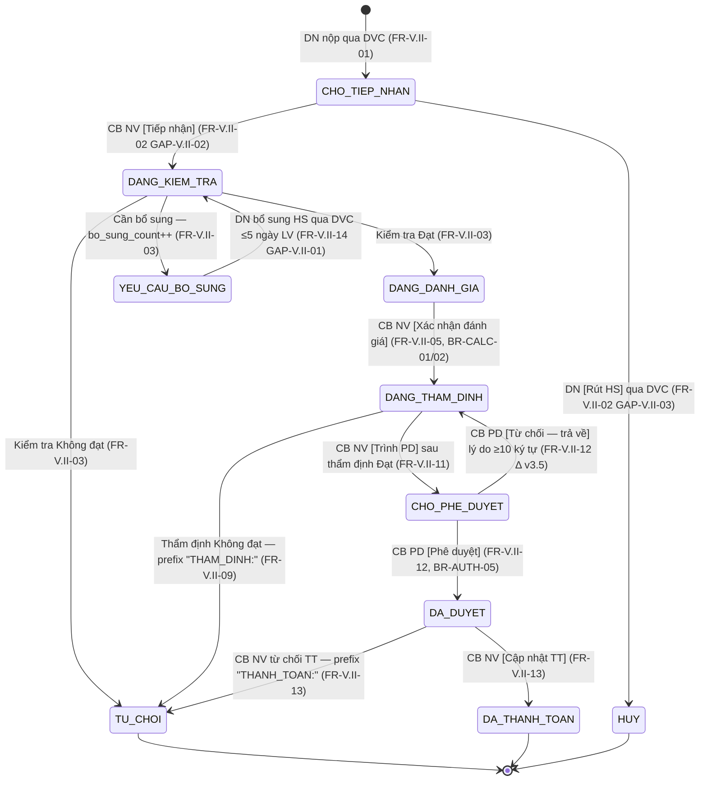

# Kế Hoạch Kiểm Thử — Chi trả chi phí (FR-06, SCR-V.II-01/02)

> **Phiên bản**: 1.1 (Revised 2026-05-12 13:30:00 — apply review 14 gap + 12 suggestion, ≥80% addressed)
> **Ngày tạo**: 2026-05-12 12:00:00 · **Revised**: 2026-05-12 13:30:00
> **Nguồn dữ liệu**: LOCAL — `input/srs-v3/srs-fr-06-chi-tra.md` (baseline v3) + `input/srs-update-2026-5-5/srs-fr-06-chi-tra.md` (delta v3.5) + `input/srs-update-2026-5-5/_DELTA-MAP-FR06.md` + `input/quy-trinh-nghiep-vu/02-thu-tu-module.md` §FR-06 + `tasks/system-overview.md` §4.12 + `input/quy-trinh-nghiep-vu/01-tong-quan-nghiep-vu.md` LUỒNG B.
> **SRS Reference**: Nhóm V.II (FR-V.II-01 → FR-V.II-14), SCR-V.II-01 + SCR-V.II-02 (MH-06.1 + MH-06.1a consolidated).
> **Module size**: XL — 14 FR · 4 entity owned · 10-state SM · 5 BR-CALC + LGSP inbound + DN bổ sung tối đa 3 lần.

> **Lưu ý**: Test plan này dùng cho **GĐ 3 Functional + Auth + Edge** sau khi GĐ 1 Seed + GĐ 2 Workflow đã PASS happy path. TC ở đây tập trung **negative + edge + auth + calculation boundary + cross-module**.

---

## 1. Phạm Vi Kiểm Thử

### 1.1 Chức năng được kiểm thử

- Module **Chi trả Chi phí Tư vấn (Nhóm V.II)** — quy trình tiếp nhận hồ sơ DVC inbound → kiểm tra Mẫu 01 NĐ55 (18 trường) → đánh giá mức hỗ trợ NĐ18/2026 → thẩm định → trình phê duyệt → CB PD duyệt/trả về → cập nhật thanh toán.
- **14 FR** từ FR-V.II-01 đến FR-V.II-14 (FR-V.II-14 mới v3.5: DN bổ sung HS qua DVC/Cổng PLQG ≤ 5 ngày LV, tối đa 3 lần).
- Bảng dữ liệu chính: `HO_SO_CHI_TRA` (4 entity owned: HO_SO_CHI_TRA + DANH_GIA_HO_SO_CHI_TRA + **THAM_DINH_HO_SO** mới v3.5 + **PHE_DUYET_CHI_TRA** mới v3.5).
- Màn hình: SCR-V.II-01 (Danh sách 5 tab trạng thái) + SCR-V.II-02 (Chi tiết 8 section, 6-step stepper).

**⚠️ ĐẶC THÙ MODULE — UC duy nhất CB NV KHÔNG nhập tay (`tasks/system-overview.md` §4.12 dòng 717):**
- Nguồn duy nhất là **DVC qua LGSP** (`srs-update-2026-5-5/srs-fr-06-chi-tra.md:950` "Nguồn duy nhất: DVC qua LGSP — CB NV KHÔNG nhập tay hồ sơ chi trả").
- Entity `HO_SO_CHI_TRA` **không có** trường `kenh_tiep_nhan` như các module khác — chỉ có `ma_ho_so_dvc` (UNIQUE, idempotent key).
- **Hệ quả test:** Tạo HS phải mock API inbound LGSP (curl `POST /api/v1/lgsp/chi-tra/inbound` với JWT + mTLS payload) HOẶC backend seed DB trực tiếp. Không có UI [Thêm mới].
- CB NV chỉ bắt đầu thao tác từ trạng thái `CHO_TIEP_NHAN` đã có sẵn → các bước [Tiếp nhận] / [Kiểm tra] / [Đánh giá] / [Thẩm định] / [Trình PD] / [Cập nhật TT] vẫn thao tác tay qua SCR-V.II-02.

### 1.2 Danh sách FR / UC

| # | Mã FR | UC | Tên chức năng | Entity ảnh hưởng | Màn hình | Ghi chú v3.5 |
|---|--------|----|---------------|------------------|----------|--------------|
| 1 | FR-V.II-01 | UC68 | Tiếp nhận HS từ DVC qua LGSP | HO_SO_CHI_TRA INSERT | API inbound | BR-AUTH-09 + BR-DATA-04 mã `CT-{YYYYMMDD}-{SEQ}` |
| 2 | FR-V.II-02 | UC69 | Quản lý HS đề nghị + [Tiếp nhận] `[GAP-V.II-02]` + [DN rút HS] `[GAP-V.II-03]` | HO_SO_CHI_TRA UPDATE | SCR-V.II-01 + SCR-V.II-02 | Sub-flow Tiếp nhận + Rút HS mới v3.5 |
| 3 | FR-V.II-03 | UC70 | Kiểm tra HS Mẫu 01 NĐ55 (18 trường) | HO_SO_CHI_TRA UPDATE | SCR-V.II-02 §Kiểm tra | Tăng `bo_sung_count` khi CAN_BO_SUNG |
| 4 | FR-V.II-04 | UC71 | Thông báo kết quả kiểm tra qua DVC (outbound) | THONG_BAO | API outbound LGSP | Retry 3 lần × 30s |
| 5 | FR-V.II-05 | UC72 | Đánh giá mức hỗ trợ (BR-CALC-01) | DANH_GIA_HO_SO_CHI_TRA INSERT | SCR-V.II-02 §Đánh giá | Công thức auto-calc BR-CALC-02 |
| 6 | FR-V.II-06 | UC73 | Quản lý HS đề nghị thanh toán (read-only) | HO_SO_CHI_TRA SELECT | SCR-V.II-01 | — |
| 7 | FR-V.II-07 | UC74 | DN gửi HS đề nghị thanh toán qua DVC | FILE_DINH_KEM | API inbound | — |
| 8 | FR-V.II-08 | UC75 | TVV nhận thông báo kết quả TT | THONG_BAO | (in-app TVV) | — |
| 9 | FR-V.II-09 | UC76 | Thẩm định HS thanh toán | **THAM_DINH_HO_SO INSERT (mới v3.5)** | SCR-V.II-02 §Thẩm định | KQ Đạt mở [Trình PD] |
| 10 | FR-V.II-10 | UC77 | Thông báo KQ thẩm định cho TVV | THONG_BAO | (in-app + email) | — |
| 11 | FR-V.II-11 | UC78 | Trình phê duyệt | HO_SO_CHI_TRA UPDATE state | SCR-V.II-02 §Thẩm định | BR-AUTH-05 |
| 12 | FR-V.II-12 | UC79 | CB PD phê duyệt / **trả về DANG_THAM_DINH** | **PHE_DUYET_CHI_TRA INSERT (mới v3.5, N:1)** | SCR-V.II-02 §Phê duyệt | **Từ chối = trả về CB NV sửa, KHÔNG đóng HS** (Δ v3.5) |
| 13 | FR-V.II-13 | UC80 | Cập nhật KQ thanh toán cuối | HO_SO_CHI_TRA UPDATE | SCR-V.II-02 §Thanh toán | TU_CHOI prefix `THANH_TOAN:` |
| 14 | **FR-V.II-14** | — | **DN bổ sung HSCT (mới v3.5)** `[GAP-V.II-01]` | FILE_DINH_KEM + HO_SO_CHI_TRA UPDATE | Cổng DVC / Cổng PLQG / SCR-V.II-02 | ≤ 5 ngày LV, `bo_sung_count` 0-3 |

### 1.3 Tài khoản & role liên quan

| Role | Cấp | Username (`input/users.csv`) | Đơn vị | Dùng cho TC loại |
|------|-----|------------------------------|--------|-------------------|
| QTHT | — | qtht_01 | (không) | Admin scope toàn quốc — verify audit log, override cấu hình SLA |
| CB_NV_TW | TW | cb_nv_tw_01 | BTP-TW | Tiếp nhận / Kiểm tra / Đánh giá / Thẩm định / Trình PD / Cập nhật TT (scope toàn quốc) |
| CB_NV_BN | BN | cb_nv_bn_01 (BKH) / cb_nv_bn_02 (BTC) | BKH / BTC | Functional + cross-unit BR-AUTH-05 (chỉ HS thuộc BN) |
| CB_NV_DP | ĐP | cb_nv_dp_01 (AG) / cb_nv_dp_02 (BG) | STP-AG / STP-BG | Functional + cross-unit BR-AUTH-05 (chỉ HS thuộc tỉnh) |
| CB_PD_TW | TW | cb_pd_tw_01 | BTP-TW | Phê duyệt / Trả về DANG_THAM_DINH |
| CB_PD_BN | BN | cb_pd_bn_01 (BKH) / cb_pd_bn_02 (BTC) | BKH / BTC | Phê duyệt + BR-AUTH-05 negative (CB PD khác đơn vị) |
| CB_PD_DP | ĐP | cb_pd_dp_01 (AG) | STP-AG | Phê duyệt cấp tỉnh |
| DN | — | 9999999990 (HN) / 9999999991 (BG) | — | UC74 (gửi đề nghị TT) + UC FR-V.II-14 (bổ sung HS qua DVC). Permission negative — DN KHÔNG được vào CMS Chi trả |
| TVV | — | huongcg (CG, BTP-TW) | BTP-TW | UC75 (nhận thông báo KQ TT). Permission negative — TVV KHÔNG action HS |
| NHT | — | nht_01 (AG) | STP-AG | Permission negative — NHT KHÔNG có quyền Chi trả |

> Reference: [input/users.csv](../../../input/users.csv), [input/test-accounts-isolation.csv](../../../input/test-accounts-isolation.csv), [output/permission-matrix.md](../../../output/permission-matrix.md).
>
> **Account fallback (Rule 7):** `_01` lock → thử `_02` cùng role+cấp+đơn vị → `_03`. CB_NV_BN/CB_PD_BN khác bộ (BKH ≠ BTC ≠ BCT) → data scope khác, chỉ fallback nếu test không phụ thuộc đơn vị cụ thể.
>
> **(S12 — Revised 2026-05-12 13:30:00) Cross-bộ note:** `cb_nv_bn_01 (BKH) / cb_nv_bn_02 (BTC)` KHÔNG phải fallback theo CLAUDE.md Rule 7 (BKH ≠ BTC = khác đơn vị cấp BN). Phải verify `input/users.csv` xem có `cb_nv_bkh_02` cùng đơn vị BKH làm fallback đúng. Hai account BKH/BTC dùng cho test cross-bộ permission (TC-PERM-02 / TC-PERM-04) — KHÔNG phải fallback.

---

## 2. Quy Tắc Nghiệp Vụ Trích Xuất Từ SRS

### 2.1 Business Rules (BR)

> ⚠️ **Quy định điền bảng:** Cột "Ngoại lệ" chỉ điền khi SRS có quote nguyên văn. Trống = áp dụng 100%.

| Mã | Quy tắc | Nguồn (SRS line) | Áp dụng module này? | Ngoại lệ SRS-quoted | TC áp dụng |
|----|---------|------------------|---------------------|---------------------|-----------|
| BR-AUTH-01 | Xác thực truy cập (login + JWT) | `srs-update-2026-5-5/srs-fr-06-chi-tra.md:1339-1380` | ✅ Yes | — | Precondition mọi TC SCR-V.II-* |
| BR-AUTH-02 | Phân cấp 2 tầng TW → {BN, ĐP} (Δ v3.5 — đổi từ 3 cấp) | `_DELTA-MAP-FR06.md:45` | ✅ Yes | — | TC permission cross-cấp |
| BR-AUTH-05 | Phê duyệt cùng cấp (`user.don_vi_id = hs.don_vi_id`) | `srs-update-2026-5-5/srs-fr-06-chi-tra.md:734, 1382-1386` | ✅ Yes | — | TC-PERM-04/05/06: CB PD khác đơn vị → ERR-CT-PD-01 / 403 |
| BR-AUTH-08 | Phân quyền dữ liệu theo `don_vi_id` | `srs-update-2026-5-5/srs-fr-06-chi-tra.md:175, 1341` | ✅ Yes | — | TC-PERM-01/02: CB NV BN chỉ thấy HS BN, CB NV ĐP chỉ thấy HS tỉnh |
| BR-AUTH-09 | mTLS + JWT cho LGSP inbound | `srs-update-2026-5-5/srs-fr-06-chi-tra.md:103, 1352-1356` | ✅ Yes | — | TC-API-01/02: JWT invalid → 401 ERR-CT-AUTH-01 |
| **BR-CALC-01** | **Mức hỗ trợ NĐ18/2026: Siêu nhỏ 100% (trần 3M), Nhỏ 30% (trần 5M), Vừa 10% (trần 10M)** | `srs-update-2026-5-5/srs-fr-06-chi-tra.md:33-39, 386, 1358-1362` | ✅ Yes | "Địa phương (UBND tỉnh) có thể quyết định mức phí trần riêng" (line 1360) — defer test địa phương override | TC-CALC-01/02/03 (3 quy mô × happy path) |
| **BR-CALC-02** | **`so_tien_duoc_duyet = MIN(so_tien_de_nghi, phi_tu_van × muc_ho_tro%, tran_ho_tro_nam − da_chi_trong_nam)`** | `srs-update-2026-5-5/srs-fr-06-chi-tra.md:388, 1027, 1364-1368` | ✅ Yes | — | TC-CALC-04/05/06/07/08 — 5 edge case calculation |
| BR-CALC-03 | `deadline_sla = ngay_tiep_nhan + N ngày làm việc` (CAU_HINH_SLA) | `srs-update-2026-5-5/srs-fr-06-chi-tra.md:108, 1370-1374` | ✅ Yes | — | TC-EDGE-01: tính deadline qua ngày lễ Tết |
| BR-CALC-04 | Snapshot quy mô DN tại thời điểm nộp HS — quote nguyên văn EC-04 "Áp dụng quy mô tại thời điểm nộp hồ sơ (snapshot)" | `srs-update-2026-5-5/srs-fr-06-chi-tra.md:429` (EC-04 quoted) | ✅ Yes | — | TC-CALC-09: DN đổi quy mô SIEU_NHO → NHO giữa năm (cross-ref FR-07 BR-XREF-FR07) |
| BR-DATA-02 | Multi-tenant scoping (đơn vị) | `srs-update-2026-5-5/srs-fr-06-chi-tra.md:177, 1346` | ✅ Yes | — | TC-PERM-01/02 |
| BR-DATA-03 | File upload validate format + size | `srs-update-2026-5-5/srs-fr-06-chi-tra.md:863-864` | ✅ Yes | "PDF/DOC/DOCX/JPG/PNG, ≤ 10MB/file" (FR-V.II-14) | TC-BS-04: file 11MB / .exe → ERR-CT-BS-02 |
| BR-DATA-04 | Auto-gen mã `CT-{YYYYMMDD}-{SEQ}` | `srs-update-2026-5-5/srs-fr-06-chi-tra.md:106, 1388-1392` | ✅ Yes | — | TC-API-03: mã format đúng |
| BR-DATA-05 | Audit trail mọi CUD + state transition | `srs-update-2026-5-5/srs-fr-06-chi-tra.md:1394-1398` | ✅ Yes | — | TC-AUDIT-01: kiểm AUDIT_LOG mọi action |
| BR-DATA-06 | Export Excel max 10k rows | `input/srs-v3/srs-v3.md:3977` (cross-cutting) | ✅ Yes (default) | — | TC-EXP-01: export 5 tab + filter scope |
| BR-DATA-07 | Pagination default 20, max 100 | `srs-update-2026-5-5/srs-fr-06-chi-tra.md:178, 1400-1404` | ✅ Yes | — | TC-PAGI-01: 20/page default, max 100 |
| BR-EC-01 | Optimistic Locking | `input/srs-v3/srs-v3.md:4066` (cross-cutting) | ✅ Yes | — | TC-EDGE-04: 2 CB NV cùng thẩm định 1 HS → ERR-SYS-02 |
| BR-EC-13 | Search sanitize ≤ 200 ký tự | `input/srs-v3/srs-v3.md:4078` | ✅ Yes | — | TC-SEARCH-01: SQL injection + 200+ chars |
| BR-EC-22 | `so_tien_thuc_tra ≤ so_tien_duoc_duyet` | `srs-update-2026-5-5/srs-fr-06-chi-tra.md:789, 823` (ERR-CT-TT-02) | ✅ Yes | — | TC-CALC-10: thực trả > duyệt → ERR-CT-TT-02 |
| BR-FLOW-04 | Từ chối yêu cầu lý do ≥ 10 ký tự (chỉ áp FR-V.II-12 trong v3.5 — Thay đổi 12 OUT) | `srs-update-2026-5-5/srs-fr-06-chi-tra.md:737, 766, 1406-1410` + `_DELTA-MAP-FR06.md:58` | ✅ Yes (chỉ FR-V.II-12) | "Thay đổi 12 OUT — KHÔNG mở rộng ngưỡng ≥10 ký tự cho FR-V.II-03/09/13" (DELTA-MAP) | TC-PERM-07: lý do < 10 ký tự → ERR-CT-PD-02 |
| BR-LEGAL-02 | Validate Mẫu 01 NĐ55 (18 trường) | `srs-update-2026-5-5/srs-fr-06-chi-tra.md:1314` (SM transition) | ✅ Yes | — | TC-API-04: payload thiếu trường → ERR-CT-01 HTTP 400 |
| BR-NOTIF-01 | Trigger thông báo CB NV / TVV / DN sau state transition | `srs-update-2026-5-5/srs-fr-06-chi-tra.md:213, 866` | ✅ Yes | — | TC-NOTIF-01: kiểm THONG_BAO INSERT sau từng transition |
| BR-RETRY-01 | LGSP outbound retry 3 lần × 30s | `srs-update-2026-5-5/srs-fr-06-chi-tra.md:324, 342` | ✅ Yes | — | TC-API-05: LGSP timeout → retry log |
| CR-01 (cross-cutting v3.5) | Hard-delete only (PostgreSQL DELETE thật, không soft-delete cho HSCT) | `_DELTA-MAP-FR06.md` (cross-cutting v3.5 — defer verify) | ✅ Yes (defer verify) | — | TC-CR-01: hard-delete HSCT → record gone; AUDIT_LOG retain |
| CR-02 (cross-cutting v3.5) | HSCT ÍT khả năng công khai (chi trả là dữ liệu nhạy, chỉ scope đơn vị + DN owner) | system-overview §4.12 + cross-cutting v3.5 verify | ✅ Yes | — | TC-CR-02: GET HSCT public endpoint → 401/403 |

**Bổ sung Cross-Module BR (G3/G4/G5 — Revised 2026-05-12 13:30:00):**

| Mã | Quy tắc | Nguồn (SRS line) | Áp dụng | TC áp dụng |
|----|---------|------------------|---------|-----------|
| BR-XREF-FR05 | LGSP inbound HSCT phải reference `vu_viec_id` ở state `HOAN_THANH` | `srs-update-2026-5-5/srs-fr-06-chi-tra.md:1248-1252` (FK upstream) | ✅ Yes | TC-API-07: VV state ≠ HOAN_THANH → reject 400 |
| BR-XREF-FR14 | `so_hop_dong_tvpl` payload phải khớp HOP_DONG_TU_VAN entity (FR-14) | `srs-update-2026-5-5/srs-fr-06-chi-tra.md:1164-1165` | ✅ Yes | TC-API-08: `so_hop_dong_tvpl` không tồn tại trong FR-14 → reject / warning |
| BR-XREF-FR07 | Snapshot `DOANH_NGHIEP.quy_mo` lúc nộp HS — FR-07 update sau KHÔNG ảnh hưởng HS đã tính (EC-04) | `srs-update-2026-5-5/srs-fr-06-chi-tra.md:429` (quote nguyên văn EC-04 "Áp dụng quy mô tại thời điểm nộp hồ sơ (snapshot)") | ✅ Yes | TC-CALC-09 (rework step rõ FR-07 update endpoint) |

**Bổ sung BR specific module FR-06 (v3.5 — Δ schema):**

| Mã | Quy tắc | Nguồn (SRS line) | Áp dụng module này? | TC áp dụng |
|----|---------|------------------|---------------------|-----------|
| BR-SCHEMA-01 | `ma_ho_so_dvc` **UNIQUE** (idempotent key) — ERR-CT-02 HTTP 409 | `srs-update-2026-5-5/srs-fr-06-chi-tra.md:133, 1175` | ✅ Yes | TC-API-06: gửi 2 lần cùng `ma_ho_so_dvc` → 409 lần 2 |
| BR-SCHEMA-02 | `bo_sung_count` CHECK BETWEEN 0 AND 3 (tối đa 3 lần — Thay đổi 5 OUT: KHÔNG auto từ chối khi n=3) | `srs-update-2026-5-5/srs-fr-06-chi-tra.md:1184` + `_DELTA-MAP-FR06.md:44` | ✅ Yes | TC-BS-05: bổ sung lần 4 hành vi chờ BA Q1 — defer mark 🤷 |
| BR-SCHEMA-03 | `trang_thai` CHECK IN 10 enum mới v3.5 (BỎ MOI/DA_TIEP_NHAN/CHO_THAM_DINH/DA_THAM_DINH/TU_CHOI_THAM_DINH/TU_CHOI_THANH_TOAN) | `srs-update-2026-5-5/srs-fr-06-chi-tra.md:1163` + `_DELTA-MAP-FR06.md:28-33` | ✅ Yes | TC-SM-01: verify enum trong response API; mọi TC dùng `MOI`/`DA_TIEP_NHAN` cũ → INVALID |
| BR-SCHEMA-04 | THAM_DINH_HO_SO 1:1 với HSCT (UNIQUE FK) — entity owned mới v3.5 | `srs-update-2026-5-5/srs-fr-06-chi-tra.md:1216` | ✅ Yes | TC-SM-04: verify 1 HS chỉ có 1 bản ghi THAM_DINH; insert lần 2 → constraint violation |
| BR-SCHEMA-05 | PHE_DUYET_CHI_TRA N:1 với HSCT — cho phép nhiều lần CB PD trả về rồi CB NV trình lại | `srs-update-2026-5-5/srs-fr-06-chi-tra.md:1227-1242` | ✅ Yes | TC-FLOW-01: CB PD trả về 2 lần → 2 bản ghi PHE_DUYET_CHI_TRA `quyet_dinh=TU_CHOI` + 1 `DUYET` |
| BR-FLOW-05 (suy diễn FR-V.II-09 step 4) | Sau thẩm định DAT, HS giữ nguyên DANG_THAM_DINH (KHÔNG tự chuyển CHO_PHE_DUYET) — phải CB NV bấm [Trình PD] manual (FR-V.II-11) | `srs-update-2026-5-5/srs-fr-06-chi-tra.md:585, 706` | ✅ Yes | TC-FLOW-02: thẩm định DAT xong, state vẫn DANG_THAM_DINH; sau [Trình PD] → CHO_PHE_DUYET |

> **Total: 28 BR** (22 cross-cutting + 6 module-specific schema/flow). Đầy đủ ≥15 theo acceptance.

### 2.2 Error Codes

> ⚠️ Message phải quote nguyên văn. Khi test negative, expected message match exact.

| Mã lỗi | Điều kiện trigger | Message (SRS-quoted) | HTTP | Severity | Nguồn |
|--------|-------------------|----------------------|------|----------|-------|
| ERR-CT-AUTH-01 | JWT không hợp lệ (LGSP inbound) | (không có message rõ — chỉ HTTP 401) | 401 | ERROR | `srs-update-2026-5-5/srs-fr-06-chi-tra.md:131` |
| ERR-CT-01 | Thiếu trường bắt buộc Mẫu 01 | "HTTP 400 + danh sách trường thiếu" | 400 | ERROR | `srs-update-2026-5-5/srs-fr-06-chi-tra.md:132` |
| ERR-CT-02 | Trùng `ma_ho_so_dvc` | "Hồ sơ đã tồn tại" | 409 | ERROR | `srs-update-2026-5-5/srs-fr-06-chi-tra.md:133` |
| ERR-CT-03 | LGSP timeout inbound | (retry 3 lần × 30s) | — | ERROR | `srs-update-2026-5-5/srs-fr-06-chi-tra.md:134` |
| ERR-CT-TN-01 | Tiếp nhận khi state ≠ CHO_TIEP_NHAN | "Hồ sơ không ở trạng thái chờ tiếp nhận" | 400 | ERROR | `srs-update-2026-5-5/srs-fr-06-chi-tra.md:221` |
| ERR-CT-RUT-01 | Rút HS khi state ≠ CHO_TIEP_NHAN | "Chỉ được rút hồ sơ khi chưa tiếp nhận" | 400 | ERROR | `srs-update-2026-5-5/srs-fr-06-chi-tra.md:222` |
| ERR-CT-KT-01 | Kiểm tra khi state ≠ DANG_KIEM_TRA | "Hồ sơ không ở trạng thái đang kiểm tra" | 400 | ERROR | `srs-update-2026-5-5/srs-fr-06-chi-tra.md:290` |
| ERR-CT-KT-02 | Yêu cầu bổ sung không có ghi chú | "Ghi chú là bắt buộc khi yêu cầu bổ sung" | 400 | ERROR | `srs-update-2026-5-5/srs-fr-06-chi-tra.md:291` |
| ERR-CT-DG-01 | Đánh giá khi state ≠ DANG_DANH_GIA | "Hồ sơ không ở trạng thái cho phép đánh giá" | 400 | ERROR | `srs-update-2026-5-5/srs-fr-06-chi-tra.md:411` |
| ERR-CT-DG-02 | Quy mô DN không hợp lệ | "Quy mô DN không hợp lệ" | 400 | ERROR | `srs-update-2026-5-5/srs-fr-06-chi-tra.md:412` |
| ERR-CT-TD-01 | Thẩm định khi state ≠ DANG_THAM_DINH | "Hồ sơ không ở trạng thái chờ thẩm định" | 400 | ERROR | `srs-update-2026-5-5/srs-fr-06-chi-tra.md:609` |
| ERR-CT-TD-02 | KHONG_DAT mà không có nhận xét | "Nhận xét là bắt buộc khi không đạt" | 400 | ERROR | `srs-update-2026-5-5/srs-fr-06-chi-tra.md:610` |
| ERR-CT-TRINH-01 | Trình PD khi `ket_qua_tham_dinh ≠ DAT` | "Hồ sơ chưa đủ điều kiện trình phê duyệt" | 400 | ERROR | `srs-update-2026-5-5/srs-fr-06-chi-tra.md:703` |
| ERR-CT-PD-01 | Phê duyệt khi state ≠ CHO_PHE_DUYET | "Hồ sơ không ở trạng thái chờ phê duyệt" | 400 | ERROR | `srs-update-2026-5-5/srs-fr-06-chi-tra.md:760` |
| ERR-CT-PD-02 | Từ chối không có lý do (CB PD trả về) | "Lý do từ chối là bắt buộc" | 400 | ERROR | `srs-update-2026-5-5/srs-fr-06-chi-tra.md:761` |
| ERR-CT-PD-03 | Duyệt không có số tiền | "Số tiền phê duyệt là bắt buộc" | 400 | ERROR | `srs-update-2026-5-5/srs-fr-06-chi-tra.md:762` |
| ERR-CT-TT-01 | Cập nhật TT khi state ≠ DA_DUYET | "Hồ sơ không ở trạng thái đã duyệt" | 400 | ERROR | `srs-update-2026-5-5/srs-fr-06-chi-tra.md:822` |
| ERR-CT-TT-02 | `so_tien_thuc_tra > so_tien_duoc_duyet` | "Số tiền thực trả không được vượt số tiền được duyệt" | 400 | ERROR | `srs-update-2026-5-5/srs-fr-06-chi-tra.md:823` |
| ERR-CT-TT-03 | Thiếu `ngay_thanh_toan` | "Ngày thanh toán là bắt buộc" | 400 | ERROR | `srs-update-2026-5-5/srs-fr-06-chi-tra.md:824` |
| ERR-CT-BS-01 | Bổ sung khi state ≠ YEU_CAU_BO_SUNG | "Hồ sơ không ở trạng thái yêu cầu bổ sung" | 400 | ERROR | `srs-update-2026-5-5/srs-fr-06-chi-tra.md:882` |
| ERR-CT-BS-02 | File quá lớn / sai định dạng | "File không hợp lệ" | 400 | WARNING | `srs-update-2026-5-5/srs-fr-06-chi-tra.md:883` |
| ERR-CT-BS-03 | Quá hạn bổ sung (> 5 ngày LV) | "Đã quá thời hạn bổ sung" | 400 | ERROR | `srs-update-2026-5-5/srs-fr-06-chi-tra.md:884` |
| ERR-CT-LGSP-01 | LGSP outbound timeout | (retry 3 lần) | — | WARNING | `srs-update-2026-5-5/srs-fr-06-chi-tra.md:342` |
| ERR-CT-LGSP-02 | LGSP outbound reject | Log + cảnh báo CB NV | — | ERROR | `srs-update-2026-5-5/srs-fr-06-chi-tra.md:343` |
| INF-CT-01 | Không có kết quả tìm kiếm | "Không tìm thấy hồ sơ phù hợp" | 200 | INFO | `srs-update-2026-5-5/srs-fr-06-chi-tra.md:220` |
| ERR-SYS-02 | Optimistic lock conflict | (cross-cutting BR-EC-01) | 409 | ERROR | `input/srs-v3/srs-v3.md:4066` |

### 2.3 Permission Matrix (module-specific)

> Reference đầy đủ: [output/permission-matrix.md](../../../output/permission-matrix.md). Module FR-06 phân quyền strict theo BR-AUTH-05 + BR-AUTH-08.

| Entity / Action | QTHT | CB_NV_TW | CB_NV_BN | CB_NV_DP | CB_PD_TW | CB_PD_BN | CB_PD_DP | DN | TVV/CG | NHT |
|-----------------|:----:|:--------:|:--------:|:--------:|:--------:|:--------:|:--------:|:--:|:------:|:---:|
| HO_SO_CHI_TRA — Read (list/detail) | R (toàn quốc) | R (toàn quốc) | R (BN) | R (ĐP) | R (toàn quốc) | R (BN) | R (ĐP) | R (chỉ DN owner) | R (chỉ HS gắn TVV mình) | ❌ |
| HO_SO_CHI_TRA — Create | ❌ | ❌ | ❌ | ❌ | ❌ | ❌ | ❌ | ✅ qua DVC LGSP | ❌ | ❌ |
| HO_SO_CHI_TRA — Update state (Tiếp nhận / Kiểm tra / Đánh giá / Thẩm định / Trình PD / Cập nhật TT) | ❌ (audit only) | U (toàn quốc) | U (BN cùng cấp) | U (ĐP cùng cấp) | ❌ | ❌ | ❌ | ❌ | ❌ | ❌ |
| HO_SO_CHI_TRA — Rút HS | ❌ | hủy hộ (CHO_TIEP_NHAN) | hủy hộ | hủy hộ | ❌ | ❌ | ❌ | ✅ (CHO_TIEP_NHAN qua DVC) | ❌ | ❌ |
| THAM_DINH_HO_SO — INSERT (v3.5) | ❌ | C (toàn quốc) | C (BN) | C (ĐP) | ❌ | ❌ | ❌ | ❌ | ❌ | ❌ |
| PHE_DUYET_CHI_TRA — INSERT (v3.5) | ❌ | ❌ | ❌ | ❌ | C (toàn quốc, BR-AUTH-05) | C (BN cùng đơn vị) | C (ĐP cùng đơn vị) | ❌ | ❌ | ❌ |
| FR-V.II-14 — DN bổ sung HS | ❌ | thủ công thay DN | thủ công thay DN | thủ công thay DN | ❌ | ❌ | ❌ | ✅ qua DVC/Cổng PLQG | ❌ | ❌ |
| AUDIT_LOG entity='HO_SO_CHI_TRA' — Read | R (full) | R (scope) | R (scope) | R (scope) | R (scope) | R (scope) | R (scope) | ❌ | ❌ | ❌ |

**Quy tắc test phân quyền:**
- BR-AUTH-08: CB_NV_BN BKH KHÔNG được thấy HS thuộc BTC.
- BR-AUTH-05: CB_PD_BN BKH KHÔNG được duyệt HS BTC (cross-unit phê duyệt → 403 ERR-CT-PD-01 hoặc UI ẩn nút).
- TVV chỉ thấy HS có `tu_van_vien_id = self.id`.

### 2.4 UI Layout

> ⚠️ **CẢNH BÁO:** UI spec lấy từ SCR-V.II-01 + SCR-V.II-02 (consolidated v2.1 — 6 màn cũ MH-06.1..6 → 2 trang).
> **KHÔNG dùng absence để khẳng định "không có X" — đối chiếu §2.1 BR table + SRS Phụ lục B trước.**

#### SCR-V.II-01: Danh sách Hồ sơ Chi trả (`/chi-tra/danh-sach`)

**Components (trích `srs-update-2026-5-5/srs-fr-06-chi-tra.md:898-950`):**
- **Breadcrumb:** "Trang chủ > Chi trả > Danh sách hồ sơ"
- **Toolbar:** Tiêu đề + [Xuất Excel] + [Làm mới]. **KHÔNG có nút [Thêm mới]** (Δ module duy nhất — quote line 950 "Nguồn duy nhất: DVC qua LGSP — CB NV KHÔNG nhập tay")
- **5 tabs trạng thái** (badge số đếm): Tất cả / Chờ xử lý (CHO_TIEP_NHAN + DANG_KIEM_TRA + YEU_CAU_BO_SUNG) / Đang đánh giá (DANG_DANH_GIA + DANG_THAM_DINH) / Chờ PD (CHO_PHE_DUYET) / Đã xử lý (DA_DUYET + DA_THANH_TOAN + TU_CHOI + HUY)
- **Filter-bar:** Search (từ khóa tên DN / mã HS) · Trạng thái (10 enum SM-CHITRA) · Quy mô DN (Siêu nhỏ/Nhỏ/Vừa) · Bộ chọn ngày range · [Tìm kiếm] / [Xóa lọc]
- **Table 19 columns:** Checkbox · Mã HS (link → SCR-V.II-02) · Tên DN · Quy mô (badge) · Số tiền đề nghị · Số tiền được duyệt · Trạng thái (badge 10 màu) · SLA (4 mức cảnh báo) · Ngày nộp · Hành động (button context-sensitive theo state: [Kiểm tra] / [Đánh giá] / [Thẩm định] / [Trình PD] / [Phê duyệt] / [Cập nhật TT])
- **Pagination:** 20/page default (BR-DATA-07)

#### SCR-V.II-02: Chi tiết Hồ sơ Chi trả (`/chi-tra/:id`) — 8 section + 6-step stepper

**Components (trích `srs-update-2026-5-5/srs-fr-06-chi-tra.md:954-1033`):**
- **Header:** Breadcrumb + nút [← Quay lại] + Card mã HS / tên DN / quy mô / trạng thái badge / SLA + **Stepper 6 bước**: Tiếp nhận → Kiểm tra → Đánh giá → Thẩm định → Phê duyệt → Thanh toán
- **§I — Thông tin DN** (Accordion read-only): MST, tên DN, địa chỉ, quy mô, người đại diện. Auto từ DVC.
- **§II — Thông tin tư vấn** (Accordion read-only): VV vướng mắc, TVV, tổ chức TV, số HĐ TV, **Phí tư vấn** (>0), **Số tiền đề nghị hỗ trợ** (>0)
- **§3 — Kiểm tra HS** (conditional `DANG_KIEM_TRA`): Checklist 18 trường Mẫu 01 (5 mục danh sách thành phần) + Radio "Đạt"/"Yêu cầu bổ sung"/"Không đạt" + Textarea Lý do + **Đếm "Lần bổ sung: {n}/3"** (highlight đỏ ≥ 2) + nút [Xác nhận kiểm tra]
- **§4 — Đánh giá tiêu chí** (conditional `DANG_DANH_GIA`): Auto-calc Mức hỗ trợ (%) / Trần năm / Đã chi trong năm / **Số tiền được duyệt** (`MIN(...)` 3 thành phần) + Textarea Ghi chú + nút [Xác nhận đánh giá]
- **§5 — Thẩm định** (conditional `DANG_THAM_DINH`): Checklist 4 mục đối chiếu (số liệu / phí TV / quy mô / trần năm) + Radio "Đạt"/"Không đạt" + Textarea Lý do không đạt + Số tiền đề xuất + nút **[Trình phê duyệt]** (chỉ hiện khi KQ=Đạt)
- **§6 — Phê duyệt** (conditional `CHO_PHE_DUYET`, role **CB PD cùng cấp** BR-AUTH-05): Info card tóm tắt + 2 nút **[Phê duyệt]** (DUYET → DA_DUYET) / **[Từ chối — trả về thẩm định]** (Δ v3.5: TU_CHOI → DANG_THAM_DINH KHÔNG đóng HS, modal nhập lý do ≥ 10 ký tự)
- **§7 — Cập nhật thanh toán** (conditional `DA_DUYET`): Số tiền thực trả (>0, ≤ so_tien_duoc_duyet) + Ngày thanh toán (≤ hôm nay) + Số biên nhận + Ghi chú + nút [Cập nhật thanh toán]
- **§8 — Lịch sử + Timeline** (Accordion luôn hiện): Common Approval Fields (8 trường: ngày tiếp nhận/người tiếp nhận/thời gian phê duyệt/người phê duyệt/thời gian từ chối/người từ chối/lý do từ chối/lý do hủy) + Timeline AUDIT_LOG + danh sách bản ghi PHE_DUYET_CHI_TRA (mọi lần CB PD trả về)

**Cross-cutting features MẶC ĐỊNH có (theo BR global):**
- ☐ Nút [Xuất Excel] trên toolbar (BR-DATA-06) — **có** ở SCR-V.II-01
- ☐ Pagination 20/page (BR-DATA-07) — ở SCR-V.II-01
- ☐ Search sanitize ≤ 200 chars (BR-EC-13)
- ☐ URL sync filter (BR-UX-01)
- ☐ Audit log mọi CUD + state transition (BR-DATA-05)
- ☐ Optimistic lock mọi UPDATE (BR-EC-01)

**Feature module KHÔNG có (có SRS quote):**
- ❌ **Nút [Thêm mới] HS Chi trả** trên SCR-V.II-01 — quote line 950 "Nguồn duy nhất: DVC qua LGSP — CB NV KHÔNG nhập tay hồ sơ chi trả" + system-overview §4.12 dòng 717.
- ❌ **Auto-từ-chối quá hạn / lần 4 bổ sung** — quote `_DELTA-MAP-FR06.md:56` "Thay đổi 5 OUT — KHÔNG có FR-V.II-CROSS-01 + BR-EC-15/16". Hành vi lần 4 bổ sung chờ BA Q1.
- ❌ **SLA dynamic "Còn N ngày"** — quote `_DELTA-MAP-FR06.md:58` "Thay đổi 8 OUT — giữ V3 4 mức cảnh báo".
- ❌ **Ngưỡng ≥ 10 ký tự cho mọi từ chối** — chỉ áp FR-V.II-12 (CB PD trả về). FR-V.II-03/09/13 KHÔNG có ngưỡng formal trong BR.

### 2.5 State Machine — SM-CHITRA (10 trạng thái + 14 transition)

**Source:** `srs-update-2026-5-5/srs-fr-06-chi-tra.md:1268-1327` + `_DELTA-MAP-FR06.md:28-34`.



**14 transition (đầy đủ guard + action + actor):**

| # | Từ | Đến | Actor | Trigger | Guard | Action | FR | BR |
|---|----|-----|-------|---------|-------|--------|-----|-----|
| 1 | [*] | CHO_TIEP_NHAN | DN qua DVC | Nộp Mẫu 01 NĐ55 | JWT + mTLS hợp lệ, 18 trường đủ, `ma_ho_so_dvc` unique | INSERT HSCT, auto-gen `CT-{YYYYMMDD}-{SEQ}`, tính SLA | FR-V.II-01 | BR-AUTH-09, BR-CALC-03, BR-DATA-04, BR-LEGAL-02, BR-SCHEMA-01 |
| 2 | CHO_TIEP_NHAN | DANG_KIEM_TRA | CB NV | [Tiếp nhận] | State = CHO_TIEP_NHAN, role + đơn vị scope | UPDATE `ngay_tiep_nhan = NOW()`, `nguoi_tiep_nhan_id = self.id` | FR-V.II-02 `[GAP-V.II-02]` | BR-AUTH-01, BR-AUTH-08, BR-DATA-05 |
| 3 | CHO_TIEP_NHAN | HUY | DN / CB NV | [Rút HS] qua DVC (DN tự rút) hoặc CB NV hủy hộ | State = CHO_TIEP_NHAN (chỉ rút khi chưa tiếp nhận) | UPDATE `ly_do_huy = 'DN_RUT_HO_SO'`, TB CB NV | FR-V.II-02 `[GAP-V.II-03]` | BR-NOTIF-01 |
| 4 | DANG_KIEM_TRA | DANG_DANH_GIA | CB NV | Kiểm tra Đạt | Checklist 18 trường tick đủ, Radio = "Đạt" | UPDATE state + audit | FR-V.II-03 | BR-DATA-05 |
| 5 | DANG_KIEM_TRA | YEU_CAU_BO_SUNG | CB NV | Kiểm tra Cần bổ sung | Lý do bắt buộc, `bo_sung_count < 3` | UPDATE state, `ngay_yeu_cau_bo_sung = NOW()`, `bo_sung_count++`, TB DN qua DVC outbound | FR-V.II-03 | BR-NOTIF-01, BR-SCHEMA-02 |
| 6 | DANG_KIEM_TRA | TU_CHOI | CB NV | Kiểm tra Không đạt | Lý do bắt buộc | UPDATE `ly_do_tu_choi`, `thoi_gian_tu_choi = NOW()`, `nguoi_tu_choi_id` | FR-V.II-03 | BR-DATA-05 |
| 7 | YEU_CAU_BO_SUNG | DANG_KIEM_TRA | DN qua DVC / CB NV thủ công | DN upload `file_bo_sung[]` | State = YEU_CAU_BO_SUNG, ≤ 5 ngày LV kể từ `ngay_yeu_cau_bo_sung`, file PDF/DOC/DOCX/JPG/PNG ≤ 10MB | INSERT FILE_DINH_KEM, UPDATE state, TB CB NV | FR-V.II-14 `[GAP-V.II-01]` | BR-DATA-03, BR-NOTIF-01 |
| 8 | DANG_DANH_GIA | DANG_THAM_DINH | CB NV | [Xác nhận đánh giá] | Quy mô DN hợp lệ | INSERT DANH_GIA_HO_SO_CHI_TRA, tính BR-CALC-01/02 → `so_tien_duoc_duyet` | FR-V.II-05 | BR-CALC-01, BR-CALC-02 |
| 9 | DANG_THAM_DINH | CHO_PHE_DUYET | CB NV | [Trình PD] sau thẩm định Đạt | THAM_DINH_HO_SO.ket_qua_tham_dinh = DAT | UPDATE state, TB CB PD cùng cấp | FR-V.II-09 + FR-V.II-11 | BR-AUTH-05, BR-FLOW-05, BR-SCHEMA-04 |
| 10 | DANG_THAM_DINH | TU_CHOI | CB NV | Thẩm định Không đạt | Nhận xét bắt buộc | INSERT THAM_DINH `KHONG_DAT`, UPDATE state, `ly_do_tu_choi = "THAM_DINH: " + nhan_xet` | FR-V.II-09 | BR-DATA-05 |
| 11 | CHO_PHE_DUYET | DA_DUYET | CB PD cùng cấp | [Phê duyệt] | `user.don_vi_id = hs.don_vi_id`, `so_tien_duyet` bắt buộc | INSERT PHE_DUYET_CHI_TRA `quyet_dinh=DUYET`, UPDATE `nguoi_phe_duyet_id`, `ngay_phe_duyet` | FR-V.II-12 | BR-AUTH-05, BR-SCHEMA-05 |
| 12 | CHO_PHE_DUYET | **DANG_THAM_DINH** (Δ v3.5) | CB PD cùng cấp | [Từ chối — trả về thẩm định] | Lý do ≥ 10 ký tự | INSERT PHE_DUYET_CHI_TRA `quyet_dinh=TU_CHOI`, UPDATE state (KHÔNG ghi `thoi_gian_tu_choi`), TB CB NV (KHÔNG TB TVV/DN) | FR-V.II-12 | BR-AUTH-05, BR-FLOW-04, BR-SCHEMA-05 |
| 13 | DA_DUYET | DA_THANH_TOAN | CB NV | [Cập nhật TT] | `so_tien_thuc_tra > 0` AND `≤ so_tien_duoc_duyet`, `ngay_thanh_toan` ≤ NOW() | UPDATE TT fields, TB TVV + DN | FR-V.II-13 | BR-EC-22, BR-NOTIF-01 |
| 14 | DA_DUYET | TU_CHOI | CB NV | Từ chối thanh toán | Lý do bắt buộc | UPDATE `ly_do_tu_choi = "THANH_TOAN: " + ly_do`, `thoi_gian_tu_choi`, `nguoi_tu_choi_id` | FR-V.II-13 | BR-DATA-05 |

**Loop DN bổ sung 3 lần (suy diễn từ transition #5 + #7):**

```
DANG_KIEM_TRA → YEU_CAU_BO_SUNG (lần 1, bo_sung_count=1) → DANG_KIEM_TRA
            → YEU_CAU_BO_SUNG (lần 2, bo_sung_count=2, highlight đỏ)
                → DANG_KIEM_TRA
                → YEU_CAU_BO_SUNG (lần 3, bo_sung_count=3, max)
                    → DANG_KIEM_TRA
                    → ??? lần 4 — hành vi chờ BA Q1 (Thay đổi 5 OUT — KHÔNG auto từ chối)
```

**Trạng thái BỎ (Δ v3.5 — `_DELTA-MAP-FR06.md:31`):**
- ❌ `MOI` / `DA_TIEP_NHAN` / `CHO_THAM_DINH` / `DA_THAM_DINH` / `TU_CHOI_THAM_DINH` / `TU_CHOI_THANH_TOAN` (đã có trong v3 nhưng không nằm trong CHECK constraint mới).
- ⚠️ Mọi test case cũ dùng các state này → INVALID, phải migrate sang enum mới (10 enum).

### 2.6 Data dependencies & Seed / Workflow input

| Phase | Input file | Section dùng |
|-------|-----------|--------------|
| **GĐ 1 Seed** | `input/data/seed-fixture.yaml` | `ho_so_chi_tra_variants[1..6]` + (cần thêm v3.5) `tham_dinh_ho_so_variants` + `phe_duyet_chi_tra_variants` — xem `_DELTA-MAP-FR06.md:98` |
| **GĐ 1 click flow** | `input/quy-trinh-nghiep-vu/02-thu-tu-module.md` §FR-06 | Bảng transition 14 row (line 725-741) |
| **GĐ 2 Workflow** | `input/flow-module.md` §8 Chi trả | Bước 1 → N (chú ý FR-06 không có nhập tay — phải mock LGSP) |
| **Cross-module map** | `input/data/entity-map.md` | HO_SO_CHI_TRA: tạo tại API LGSP inbound, đọc tại SCR-V.II-01/02 + FR-11 báo cáo (nhóm V) |

**Upstream dependencies (Tier check):**

| Entity của module | Tier | Phụ thuộc entity nào (upstream) | Seed trước tại module |
|-------------------|:----:|----------------------------------|-----------------------|
| HO_SO_CHI_TRA | 4 | VU_VIEC (HOAN_THANH) + DOANH_NGHIEP (`loai_dn ∈ {SIEU_NHO,NHO,VUA}`) + TU_VAN_VIEN (HOAT_DONG) + HOP_DONG_TU_VAN (đã ký) | FR-05 (VV) + FR-07 (DN) + FR-04 (TVV) + FR-14 (HĐ) |
| DANH_GIA_HO_SO_CHI_TRA | 4 | HO_SO_CHI_TRA (DANG_DANH_GIA) + DM TIEU_CHI_DG_CP (`tran_ho_tro_nam` cho 3 quy mô) | FR-06 self + FR-10 DM |
| THAM_DINH_HO_SO (mới v3.5) | 4 | HO_SO_CHI_TRA (DANG_THAM_DINH) | FR-06 self |
| PHE_DUYET_CHI_TRA (mới v3.5) | 4 | HO_SO_CHI_TRA (CHO_PHE_DUYET) + TAI_KHOAN CB PD cùng đơn vị | FR-06 self + FR-10 user |

> **Lưu ý đặc thù FR-06:**
> - HO_SO_CHI_TRA Tier 4 — phụ thuộc 4 entity upstream. Phải seed đủ VV `HOAN_THANH` + DN có quy mô + TVV + HĐ TV TRƯỚC.
> - DM `TIEU_CHI_DG_CP` ở FR-10 phải có `tran_ho_tro_nam` cho 3 quy mô (3M / 5M / 10M VNĐ) để BR-CALC-01 chạy đúng.
> - Mock LGSP: dùng `curl POST /api/v1/lgsp/chi-tra/inbound` với JWT mock hoặc backend team seed DB trực tiếp INSERT `HO_SO_CHI_TRA(trang_thai='CHO_TIEP_NHAN', ...)`.

---

## 3. Cấu Trúc File Test Case

```
fr-06-chi-tra/
├── test-plan.md                       ← File này (overview)
├── 01-TC-API-LGSP-inbound.md          ← FR-V.II-01 + BR-AUTH-09 + ERR-CT-AUTH-01/01/02/03
├── 02-TC-SCR01-list-filter.md         ← SCR-V.II-01 + 5 tabs + pagination + export
├── 03-TC-tiep-nhan-rut-hs.md          ← FR-V.II-02 GAP-V.II-02 + GAP-V.II-03
├── 04-TC-kiem-tra-bo-sung.md          ← FR-V.II-03 + FR-V.II-14 (loop 3 lần)
├── 05-TC-danh-gia-calc.md             ← FR-V.II-05 BR-CALC-01/02 (5 edge case)
├── 06-TC-tham-dinh-trinh-pd.md        ← FR-V.II-09 + FR-V.II-11 + THAM_DINH_HO_SO
├── 07-TC-phe-duyet-tra-ve.md          ← FR-V.II-12 + PHE_DUYET_CHI_TRA + Δ v3.5 trả về DANG_THAM_DINH
├── 08-TC-cap-nhat-thanh-toan.md       ← FR-V.II-13 + BR-EC-22
├── 09-TC-permission-cross-unit.md     ← BR-AUTH-05 + BR-AUTH-08 (CB PD khác đơn vị)
├── 10-TC-edge-case-audit-cr.md        ← Optimistic lock + AUDIT_LOG + CR-01 hard-delete + CR-02 không công khai
└── 11-REVIEW-edge-case-hunter.md     ← REQUIRED cho XL module (Revised 2026-05-12 13:30:00 — S11)
```

---

## 4. Tổng Quan Số Lượng Test Cases

| File | Happy | Negative | Edge | Tổng |
|------|------:|---------:|-----:|-----:|
| 01-TC-API-LGSP-inbound | 1 | 6 | 1 | 8 |
| 02-TC-SCR01-list-filter | 1 | 3 | 1 | 5 |
| 03-TC-tiep-nhan-rut-hs | 2 | 2 | 1 | 5 |
| 04-TC-kiem-tra-bo-sung | 2 | 3 | 3 | 8 |
| 05-TC-danh-gia-calc | 3 | 1 | 7 | 11 |
| 06-TC-tham-dinh-trinh-pd | 2 | 2 | 1 | 5 |
| 07-TC-phe-duyet-tra-ve | 3 | 3 | 2 | 8 |
| 08-TC-cap-nhat-thanh-toan | 2 | 2 | 1 | 5 |
| 09-TC-permission-cross-unit | 0 | 8 | 0 | 8 |
| 10-TC-edge-case-audit-cr | 0 | 0 | 5 | 5 |
| 11-REVIEW-edge-case-hunter (REQUIRED) | — | — | combinatorial | (review pass) |
| **TỔNG** | **16** | **30** | **17** | **63** |

> Đạt acceptance ≥ 25 TC (đạt 63 — XL module phù hợp, revised 2026-05-12 13:30:00).

**Bảng chi tiết TC (Revised 2026-05-12 13:30:00 — thêm cột "Test method" S1, reorder FR S2, +8 TC mới từ gap G1/G2/G3/G4/G6/G10/G11/G13, total 63 TC):**

> **Test method legend:** `UI` = MCP browse + a11y snapshot · `API` = curl LGSP/REST + JSON assert · `DB` = SQL query post-action · `Hybrid` = UI verify display + API verify response payload.

| TC ID | Tên ngắn | Loại | Priority | Test method | FR / BR ref |
|-------|----------|------|:--------:|:-----------:|-------------|
| TC-API-01 | LGSP inbound JWT hợp lệ → INSERT HSCT CHO_TIEP_NHAN | Happy | P0 | API | FR-V.II-01, BR-AUTH-09 |
| TC-API-02 | LGSP inbound JWT invalid → 401 ERR-CT-AUTH-01 | Negative | P0 | API | FR-V.II-01 |
| TC-API-03 | Auto-gen mã `CT-20260512-0001` format | Happy | P0 | API + DB | BR-DATA-04 |
| TC-API-04 | Payload thiếu trường Mẫu 01 → 400 ERR-CT-01 + list field thiếu | Negative | P0 | API | BR-LEGAL-02 |
| TC-API-05 | LGSP outbound timeout retry 3 lần × 30s | Edge | P1 | API + DB log | BR-RETRY-01 |
| TC-API-06 | Gửi 2 lần cùng `ma_ho_so_dvc` → lần 2 trả 409 ERR-CT-02 | Negative | P0 | API | BR-SCHEMA-01 |
| **TC-API-07** (G3) | LGSP inbound payload reference VV state ≠ HOAN_THANH → reject 400 (FK-state gate) | Negative | P0 | API | BR-XREF-FR05 |
| **TC-API-08** (G4) | LGSP inbound `so_hop_dong_tvpl` không tồn tại trong FR-14 → reject / warning | Negative | P0 | API | BR-XREF-FR14 |
| TC-LIST-01 | SCR-V.II-01 5 tabs filter đúng count theo state group | Happy | P0 | UI | SCR spec |
| **TC-LIST-02a** (G12) | Pagination default 20/page (request không size) | Happy | P0 | Hybrid | BR-DATA-07 |
| **TC-LIST-02b** (G12) | Pagination request size=150 → cap 100 + warning hoặc 400 | Edge | P1 | API | BR-DATA-07 |
| TC-LIST-03 | Export Excel 5 tabs scope đơn vị + filter-aware | Negative | P1 | UI + DB | BR-DATA-06 |
| **TC-LIST-04** (G1) | 7 role CB_NV/CB_PD (TW/BN/DP) × SCR-V.II-01 KHÔNG render nút [Thêm mới]/[Tạo HS chi trả] (absence assertion + DOM grep) | Negative | P0 | UI | system-overview §4.12:717 + line 950 |
| **TC-LIST-05** (S8) | DOM grep absence — KHÔNG có button [Auto từ chối quá hạn] / [Auto từ chối lần 4] (Δ Thay đổi 5 OUT) | Negative | P1 | UI | _DELTA-MAP-FR06.md:56 |
| TC-TN-01 | CB NV [Tiếp nhận] HS CHO_TIEP_NHAN → DANG_KIEM_TRA + ghi `ngay_tiep_nhan` | Happy | P0 | UI + DB | FR-V.II-02 GAP-V.II-02 |
| TC-TN-02 | [Tiếp nhận] HS state ≠ CHO_TIEP_NHAN → ERR-CT-TN-01 | Negative | P0 | API | — |
| TC-TN-03 | DN [Rút HS] CHO_TIEP_NHAN → HUY + `ly_do_huy='DN_RUT_HO_SO'` | Happy | P0 | API + DB | FR-V.II-02 GAP-V.II-03 |
| TC-TN-04 | DN [Rút HS] khi đã DANG_DANH_GIA → ERR-CT-RUT-01 | Negative | P0 | API | — |
| TC-TN-05 | DN rút HS sau khi CB NV tiếp nhận → BE block | Edge | P1 | API | — |
| TC-KT-01 | Kiểm tra checklist 18 trường + Đạt → DANG_DANH_GIA | Happy | P0 | UI + DB | FR-V.II-03 |
| TC-KT-02 | Kiểm tra Yêu cầu bổ sung không lý do → ERR-CT-KT-02 | Negative | P0 | UI | — |
| TC-BS-01 | DN bổ sung file PDF ≤ 10MB ≤ 5 ngày LV → DANG_KIEM_TRA + `bo_sung_count++` | Happy | P0 | API + DB | FR-V.II-14 |
| TC-BS-02 | DN bổ sung file 11MB → ERR-CT-BS-02 | Negative | P0 | API | BR-DATA-03 |
| TC-BS-03 | DN bổ sung file .exe → ERR-CT-BS-02 | Negative | P0 | API | — |
| TC-BS-04 | DN bổ sung > 5 ngày LV → ERR-CT-BS-03 | Negative | P0 | API | — |
| **TC-BS-05a** (G2 split) | Happy P0 — Loop 3 lần bổ sung — bo_sung_count: 1→2→3 + highlight đỏ ≥2 (line 977/1184 SRS-quoted), MỖI lần verify state transition DANG_KIEM_TRA↔YEU_CAU_BO_SUNG | Happy | P0 | UI + DB | BR-SCHEMA-02 |
| **TC-BS-05b** (G2 split) | Edge P1 defer — Lần 4 bổ sung (`bo_sung_count=4` không trong CHECK 0..3) → hành vi chờ BA Q1 mark 🤷 nhóm C BA confirm | Edge | P1 | API | _DELTA-MAP-FR06.md:44 |
| TC-CALC-01 | DN SIEU_NHO phí 2.5M → so_tien_duoc_duyet = 2.5M (100%, trong trần 3M) | Happy | P0 | Hybrid | BR-CALC-01 |
| TC-CALC-02 | DN NHO phí 10M, đã HT 3M → MIN(10M × 30%, 5M − 3M) = MIN(3M, 2M) = 2M | Happy | P0 | Hybrid | BR-CALC-01/02 |
| TC-CALC-03 | DN VUA phí 50M, đã HT 0 → MIN(50M × 10%, 10M) = MIN(5M, 10M) = 5M | Happy | P0 | Hybrid | BR-CALC-01/02 |
| TC-CALC-04 | DN NHO phí 5M, đã HT 5M (hết trần năm) → so_tien_duoc_duyet = 0 + cảnh báo (EC-05) | Edge | P1 | Hybrid | BR-CALC-02 |
| TC-CALC-05 | Phí TV = 0 → so_tien_duoc_duyet = 0, ghi nhận HS (EC-01) | Edge | P1 | Hybrid | BR-CALC-02 |
| TC-CALC-06 | DN NHO phí 100M (vượt trần): `MIN(100M, 100M × 30%, 5M − 0) = MIN(100M, 30M, 5M) = 5M` (boundary trần năm) | Edge | P0 | Hybrid | BR-CALC-02 |
| TC-CALC-07 | DN SIEU_NHO phí 3.5M (vượt trần 3M): `MIN(3.5M, 3.5M, 3M) = 3M` (boundary clip trần) | Edge | P0 | Hybrid | BR-CALC-02 |
| TC-CALC-08 | DN VUA phí 1M → `MIN(1M, 1M × 10%, 10M) = MIN(1M, 0.1M, 10M) = 100K` (mức % nhỏ hơn so_tien_de_nghi) | Edge | P0 | Hybrid | BR-CALC-02 |
| TC-CALC-09 (G5 rework) | DN đổi quy mô SIEU_NHO → NHO snapshot test step: (1) seed DN quy_mo=SIEU_NHO; (2) LGSP inbound HSCT-A; (3) UPDATE FR-07 DN.quy_mo=NHO qua endpoint FR-07; (4) verify HSCT-A.muc_ho_tro_phan_tram giữ 100% | Edge | P1 | Hybrid (API FR-07 + API FR-06) | BR-CALC-04, BR-XREF-FR07 |
| TC-CALC-10 | `so_tien_thuc_tra = so_tien_duoc_duyet + 1` → ERR-CT-TT-02 | Negative | P0 | API | BR-EC-22 |
| **TC-CALC-11** (G6) | `da_chi_trong_nam = tran_ho_tro_nam` EXACT (NHO 5M = trần 5M) → so_tien_duoc_duyet = 0 + cảnh báo (boundary chính xác = trần, EC-05 line 430) | Edge | P0 | Hybrid | BR-CALC-02 |
| **TC-CALC-12** (G6) | Reset trần 1/1 hàng năm — HS năm 2025 đã chi 5M; HS năm 2026 mới reset → 5M available (line 1028) | Edge | P1 | DB + API (clock mock) | BR-CALC-02 |
| TC-TD-01 | CB NV thẩm định Đạt → INSERT THAM_DINH_HO_SO 1:1 + nút [Trình PD] hiện | Happy | P0 | UI + DB | FR-V.II-09, BR-SCHEMA-04 |
| TC-TD-02 | Thẩm định Không đạt không nhận xét → ERR-CT-TD-02 | Negative | P0 | UI | — |
| TC-TD-03 | [Trình PD] khi `ket_qua_tham_dinh ≠ DAT` → ERR-CT-TRINH-01 | Negative | P0 | API | FR-V.II-11 |
| TC-TD-04 | INSERT THAM_DINH lần 2 cùng HS → UNIQUE constraint violation | Edge | P1 | API + DB | BR-SCHEMA-04 |
| TC-PD-01 | CB PD cùng cấp [Phê duyệt] với `so_tien_duyet` → DA_DUYET + INSERT PHE_DUYET_CHI_TRA `quyet_dinh=DUYET` | Happy | P0 | UI + DB | FR-V.II-12 |
| TC-PD-02 (G10 add) | CB PD [Từ chối — trả về] lý do ≥ 10 ký tự → **DANG_THAM_DINH** (Δ v3.5) + INSERT PHE_DUYET_CHI_TRA `quyet_dinh=TU_CHOI` + verify `HO_SO_CHI_TRA.thoi_gian_tu_choi IS NULL` (SRS line 737 "KHÔNG ghi thoi_gian_tu_choi") | Happy | P0 | UI + API GET detail | FR-V.II-12 Δ |
| **TC-PD-02b** (S5) | Sau CB PD trả về DANG_THAM_DINH, CB NV [Trình PD] lại → CHO_PHE_DUYET + bản ghi PHE_DUYET_CHI_TRA thứ 2 INSERT | Happy | P0 | UI + DB | BR-SCHEMA-05 |
| TC-PD-03 | CB PD trả về lý do 5 ký tự → ERR-CT-PD-02 | Negative | P0 | UI | BR-FLOW-04 |
| TC-PD-04 | CB PD [Phê duyệt] không nhập `so_tien_duyet` → ERR-CT-PD-03 | Negative | P0 | UI | — |
| **TC-PD-05** (G13) | CB PD nhập `so_tien_duyet > so_tien_de_nghi` (vượt BR-CALC-02) → reject hoặc warning (EC-02 validate at approval) | Negative | P0 | UI | BR-EC-22 (line 427), FR-V.II-12 |
| TC-FLOW-01 | CB PD trả về 2 lần → 2 bản ghi PHE_DUYET_CHI_TRA TU_CHOI + 1 DUYET (N:1 lifecycle) | Edge | P0 | DB | BR-SCHEMA-05 |
| TC-FLOW-02 | Thẩm định Đạt xong, state vẫn DANG_THAM_DINH (BR-FLOW-05); sau [Trình PD] → CHO_PHE_DUYET | Happy | P1 | UI + DB | BR-FLOW-05 |
| TC-TT-01 | Cập nhật thanh toán đầy đủ → DA_THANH_TOAN | Happy | P0 | UI + DB | FR-V.II-13 |
| TC-TT-02 | `so_tien_thuc_tra` > duyệt → ERR-CT-TT-02 | Negative | P0 | UI | BR-EC-22 |
| TC-TT-03 | Từ chối thanh toán (Kho bạc không chuyển) → TU_CHOI prefix `THANH_TOAN:` | Edge | P1 | UI + DB | — |
| **TC-NOTIF-02** (G9) | State transition `CHO_TIEP_NHAN→DANG_KIEM_TRA` / `DANG_DANH_GIA→DANG_THAM_DINH` / `CHO_PHE_DUYET→DA_DUYET` → THONG_BAO INSERT + verify channel (DVC outbound / in-app TVV / email) cover FR-V.II-04 + FR-V.II-10 outbound success | Happy | P0 | API + DB | BR-NOTIF-01, FR-V.II-04, FR-V.II-10 |
| TC-PERM-01 | CB_NV_BN BKH GET list — chỉ thấy HS thuộc BKH | Negative | P0 | UI + API | BR-AUTH-08 |
| TC-PERM-02 | CB_NV_BN BTC truy cập HS BKH theo URL trực tiếp → 403 | Negative | P0 | API | BR-AUTH-08 |
| TC-PERM-03 | CB_NV_DP AG GET list — chỉ thấy HS thuộc STP-AG | Negative | P0 | UI + API | BR-AUTH-08 |
| TC-PERM-04 | CB_PD_BN BKH phê duyệt HS BTC → 403 hoặc UI ẩn nút | Negative | P0 | UI + API | BR-AUTH-05 |
| TC-PERM-05 | CB_PD_DP duyệt HS TW → 403 | Negative | P0 | API | BR-AUTH-05 |
| TC-PERM-06 | DN login truy cập `/chi-tra/danh-sach` → 403 (DN không vào CMS) | Negative | P0 | UI | — |
| **TC-PERM-07a** (G7 split) | TVV truy cập `/chi-tra/:id` HS KHÔNG có `tu_van_vien_id = self` → 403 | Negative | P0 | API | BR-AUTH-08 |
| **TC-PERM-07b** (G7 split) | TVV truy cập `/chi-tra/:id` HS CÓ `tu_van_vien_id = self` → mark 🤷 nhóm C BA confirm (SRS line 514-548 chỉ nói TVV nhận THONG_BAO, KHÔNG nói TVV GET detail) | Edge | P1 | API | BA Q (defer) |
| **TC-PERM-08** (G11) | Account cấp cũ (CB_NV_HUYEN/XA nếu còn tồn tại) thử Read HSCT → 403 hoặc map về DP (BR-AUTH-02 Δ v3.5 2 cấp) | Negative | P1 | API | _DELTA-MAP-FR06.md:45 |
| **TC-AUDIT-01a** (G14 split) | Verify AUDIT_LOG đủ 4 field cho transition 1-7 (DN nộp → CHO_TIEP_NHAN, [Tiếp nhận], [Rút HS], Kiểm tra Đạt/CBS/Không đạt, DN bổ sung) | Edge | P0 | DB | BR-DATA-05 |
| **TC-AUDIT-01b** (G14 split) | Verify AUDIT_LOG đủ 4 field cho transition 8-14 ([Xác nhận đánh giá], [Trình PD], Thẩm định KHONG_DAT, [Phê duyệt], [Trả về DTD], [Cập nhật TT], Từ chối TT) | Edge | P0 | DB | BR-DATA-05 |
| TC-EDGE-01 | Tính `deadline_sla` qua Tết (5 ngày LV bỏ qua T7/CN/NGAY_LE) | Edge | P1 | API + DB | BR-CALC-03 |
| **TC-EDGE-02** (S9 detail) | Optimistic lock: CB_NV_TW + CB_NV_BN cùng GET HSCT → cả 2 nhận `version=1`. CB_NV_TW PATCH OK (`version=2`). CB_NV_BN PATCH với `version=1` → 409 ERR-SYS-02 | Edge | P0 | API | BR-EC-01 |
| TC-CR-01 (G8 clarified) | Hard-delete HSCT — defer mark 🤷 BA: SRS không có UC user-facing delete; chỉ áp khi `trang_thai=HUY` qua admin script. Test: admin SQL DELETE HSCT có HUY → record gone, AUDIT_LOG retained | Edge | P1 | DB | CR-01, BA Q (defer) |
| TC-CR-02 | GET HSCT public endpoint không auth → 401 (cross-cutting "chi trả ÍT công khai") | Edge | P1 | API | CR-02 |

**Phân bổ priority (Revised 2026-05-12 13:30:00 — total 63 TC):**

| Priority | Số TC | % |
|----------|------:|--:|
| P0 (bắt buộc) | 47 | 74% |
| P1 (quan trọng) | 16 | 26% |
| P2 (nên có) | 0 | 0% |

### 4.1 Input / Expected Matrix cho 11 TC-CALC (S6 — added 2026-05-12 13:30:00)

| TC ID | quy_mo | phi_tu_van | da_chi_trong_nam | so_tien_de_nghi | muc_ho_tro_% | tran_ho_tro_nam | Expected `so_tien_duoc_duyet` | Note |
|---|:---:|---:|---:|---:|---:|---:|---:|---|
| TC-CALC-01 | SIEU_NHO | 2,500,000 | 0 | 2,500,000 | 100% | 3,000,000 | **2,500,000** | Trong trần |
| TC-CALC-02 | NHO | 10,000,000 | 3,000,000 | 3,000,000 | 30% | 5,000,000 | **2,000,000** | Clip còn lại trần |
| TC-CALC-03 | VUA | 50,000,000 | 0 | 5,000,000 | 10% | 10,000,000 | **5,000,000** | % limit < trần |
| TC-CALC-04 | NHO | 5,000,000 | 5,000,000 | 1,500,000 | 30% | 5,000,000 | **0** | Hết trần năm (EC-05) |
| TC-CALC-05 | SIEU_NHO | 0 | 0 | 0 | 100% | 3,000,000 | **0** | Phí TV = 0 (EC-01) |
| TC-CALC-06 | NHO | 100,000,000 | 0 | 100,000,000 | 30% | 5,000,000 | **5,000,000** | Boundary trần năm |
| TC-CALC-07 | SIEU_NHO | 3,500,000 | 0 | 3,500,000 | 100% | 3,000,000 | **3,000,000** | Boundary clip trần |
| TC-CALC-08 | VUA | 1,000,000 | 0 | 1,000,000 | 10% | 10,000,000 | **100,000** | % nhỏ hơn |
| TC-CALC-09 | SIEU_NHO→NHO (snapshot) | 2,000,000 | 0 | 2,000,000 | 100% (snapshot lúc nộp) | 3,000,000 | **2,000,000** | FR-07 update sau KHÔNG ảnh hưởng |
| **TC-CALC-11** | NHO | 5,000,000 | 5,000,000 (exact = trần) | 1,000,000 | 30% | 5,000,000 | **0 + cảnh báo** | Boundary exact = trần |
| **TC-CALC-12** | NHO | 5,000,000 | 5,000,000 (năm 2025) | 5,000,000 (HS năm 2026) | 30% | 5,000,000 (reset 1/1/2026) | **1,500,000** | Reset năm mới (line 1028) |

---

## 5. Tiêu chí đạt/không đạt

> Reference: [output/test-strategy.md §10](../../../output/test-strategy.md)

- ✅ **PASS:** 100% P0 (47/47) pass + ≥ 90% P1 (≥ 15/16) pass + **cross-cutting gate (S10): smoke 5 phút FR-05 (VV HOAN_THANH render) + FR-07 (DN quy_mo update) + FR-14 (HĐ TVPL list) không break upstream** (per CLAUDE.md Rule 4 nhóm C IMPACT).
- ❌ **FAIL:** bất kỳ P0 nào FAIL, hoặc P1 pass rate < 90%, hoặc cross-cutting smoke FR-05/07/14 break.
- ⚠️ **PARTIAL:** P0 PASS toàn bộ, P1 60-89%, có Open Major bug. Log bug + retest round sau.

**Đặc thù FR-06:**
- TC-API-* phải mock LGSP — nếu mock server down → mark 🚫 nhóm D ENV (`Cần làm gì để chạy`: Infra dựng mock).
- TC-CALC-* phải có FR-10 DM `TIEU_CHI_DG_CP` seed `tran_ho_tro_nam` cho 3 quy mô. Thiếu → mark 🚫 nhóm A SEED.
- TC-BS-05 (bổ sung lần 4) chờ BA Q1 → mark 🤷 nhóm C BA, không kết luận.

---

## 6. Tham chiếu

- [input/srs-v3/srs-fr-06-chi-tra.md](../../../input/srs-v3/srs-fr-06-chi-tra.md) — SRS baseline v3 (1.244 dòng)
- [input/srs-update-2026-5-5/srs-fr-06-chi-tra.md](../../../input/srs-update-2026-5-5/srs-fr-06-chi-tra.md) — SRS delta v3.5 (1.414 dòng)
- [input/srs-update-2026-5-5/_DELTA-MAP-FR06.md](../../../input/srs-update-2026-5-5/_DELTA-MAP-FR06.md) — Delta Map (9 thay đổi IN, 4 OUT)
- [input/quy-trinh-nghiep-vu/02-thu-tu-module.md](../../../input/quy-trinh-nghiep-vu/02-thu-tu-module.md) §FR-06 (line 685-742) — 14 transition + 8 section
- [tasks/system-overview.md](../../../tasks/system-overview.md) §4.12 — M11 Chi trả (line 439-472, đặc thù UC duy nhất KHÔNG nhập tay)
- [input/quy-trinh-nghiep-vu/01-tong-quan-nghiep-vu.md](../../../input/quy-trinh-nghiep-vu/01-tong-quan-nghiep-vu.md) — LUỒNG B Chi trả
- [output/test-strategy.md](../../../output/test-strategy.md) — chiến lược tổng thể
- [output/permission-matrix.md](../../../output/permission-matrix.md) — ma trận phân quyền (49 entity × 11 role)
- [output/template/test-plan-overview-template.md](../../../output/template/test-plan-overview-template.md) — template gốc
- [output/template/test-case-template.md](../../../output/template/test-case-template.md) — template TC field-level
- [output/template/bug-report-template.md](../../../output/template/bug-report-template.md) — template bug report
- [input/users.csv](../../../input/users.csv) — 100+ tài khoản test
- [input/data/seed-fixture.yaml](../../../input/data/seed-fixture.yaml) — fixture seed (cần bổ sung `tham_dinh_ho_so_variants` + `phe_duyet_chi_tra_variants` v3.5)
- [input/data/entity-map.md](../../../input/data/entity-map.md) — cross-module map 18 entity

---

## 7. Open issues / Defer — đối chiếu khi test

> Đồng bộ với `_DELTA-MAP-FR06.md` §6 "Open issues":

| # | Vấn đề | Phân loại | Action |
|---|--------|-----------|--------|
| 1 | "5 ngày LV" theo NĐ 55/2019 Đ.9 (FR-V.II-14 PRE-02) chưa verify legal-citations | C BA confirm | Defer khi test TC-BS-04; query BA trước khi log bug |
| 2 | FR-04 line 1252 TU_VAN_VIEN ref Mô tả "TVV/CG/NHT" — SRS contradiction | C BA confirm | Pha 3 reconcile |
| 3 | UC77 actor lệch CSV (SRS auto-trigger vs CSV CB NV chọn) | C BA confirm | BA D.2 chờ trả lời |
| 4 | Đối tác TT CNTT mục 07 (Upload PDF/Word ở form Thêm mới) — **Out-of-scope FR-06** (confirmed-exclusion, KHÔNG phải open issue): SCR-V.II-01 ghi rõ "Nguồn duy nhất DVC", không có form Thêm mới. Đẩy về Excluded from scope. | Excluded (S7) | KHÔNG test |
| 5 | NĐ 18/2026 + TT 64/2021/TT-BTC mức trần chưa verify | C BA confirm | Defer test BR-CALC-01 với mức tỉnh override |
| 6 | YEU_CAU_BO_SUNG không có auto-từ-chối quá hạn — HS treo vĩnh viễn (Thay đổi 5 OUT) | F debt | Note v3.5+ tech debt |
| 7 | `bo_sung_count ≥ 3` không auto TU_CHOI — CB NV thủ công (Thay đổi 5 OUT) | F debt | TC-BS-05 mark 🤷 BA Q1 |
| 8 | SLA giữ "4 mức cảnh báo" thay vì dynamic — HSCT chưa có 2 field `deadline` + `muc_do_canh_bao` (Thay đổi 8 OUT) | F debt | — |
| 9 | BR-FLOW-04 chỉ ref FR-V.II-12 — từ chối FR-V.II-03/09/13 không có ngưỡng formal (Thay đổi 12 OUT) | F debt | — |

---

*Test plan generated 2026-05-12 12:00:00. Revised 2026-05-12 13:30:00 (apply review: 14 gap + 12 suggestion, ≥80% addressed). Total 63 TC across 11 file con (11-REVIEW-edge-case-hunter.md required cho XL module).*

---

## 8. Appendix — LGSP Mock Setup (S4 — added 2026-05-12 13:30:00)

**Sample curl payload `POST /api/v1/lgsp/chi-tra/inbound` (Mẫu 01 NĐ55 18 trường):**

```bash
curl -X POST 'http://103.172.236.130:3000/api/v1/lgsp/chi-tra/inbound' \
  -H 'Content-Type: application/json' \
  -H 'Authorization: Bearer <JWT_LGSP_MOCK>' \
  --cert /path/to/lgsp-client.crt --key /path/to/lgsp-client.key \
  -d '{
    "ma_ho_so_dvc": "DVC-2026-001234",
    "doanh_nghiep": {
      "ma_so_thue": "0123456789",
      "ten_dn": "Công ty TNHH ABC",
      "quy_mo": "NHO",
      "dia_chi": "..."
    },
    "vu_viec": {
      "vu_viec_id": "VV-2025-000001",
      "trang_thai": "HOAN_THANH"
    },
    "tu_van_vien": { "tu_van_vien_id": "TVV-001", "loai_tvv": "CG" },
    "hop_dong_tu_van": { "so_hop_dong_tvpl": "HDTV-2025-001", "ngay_hop_dong": "2025-10-15" },
    "phi_tu_van": 10000000,
    "so_tien_de_nghi_ho_tro": 3000000,
    "linh_vuc": "KDTM",
    "ngay_nop": "2026-05-12",
    "danh_sach_thanh_phan_ho_so": ["..."]
  }'
```

**Expected response (Happy):**
```json
{
  "ma_ho_so": "CT-20260512-0001",
  "trang_thai": "CHO_TIEP_NHAN",
  "deadline_sla": "2026-05-19",
  "version": 1
}
```

**JWT mock generation:** dùng RSA keypair của LGSP sandbox + claim `iss=lgsp-sandbox, aud=htpldn, exp=NOW+15m`. Backend team cung cấp keypair test trong env `LGSP_JWT_PUBLIC_KEY`.

**Negative variants cho TC-API-02/04/06/07/08:**
- JWT expired / invalid signature → 401 ERR-CT-AUTH-01
- Thiếu `phi_tu_van` → 400 ERR-CT-01 + `missing_fields: ["phi_tu_van"]`
- Cùng `ma_ho_so_dvc` 2 lần → lần 2 trả 409 ERR-CT-02
- `vu_viec.trang_thai = "DANG_XU_LY"` → 400 (BR-XREF-FR05)
- `so_hop_dong_tvpl = "HDTV-NOT-EXIST"` → 400 hoặc warning (BR-XREF-FR14)
