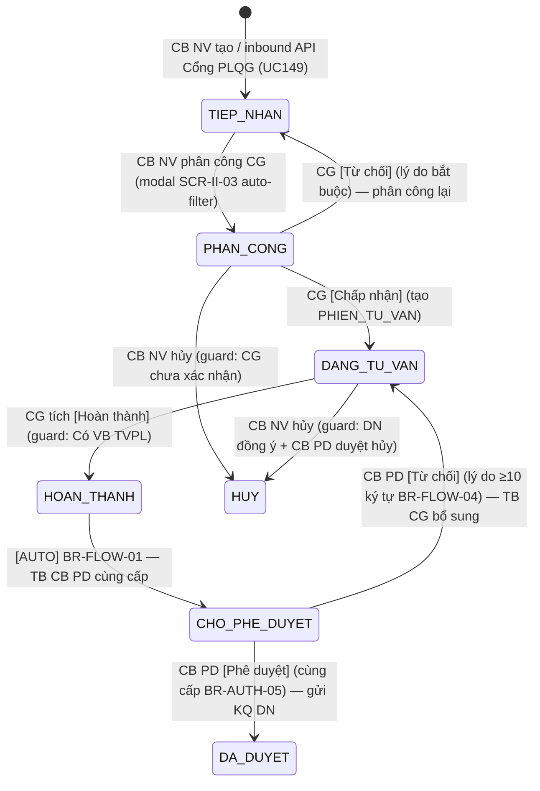
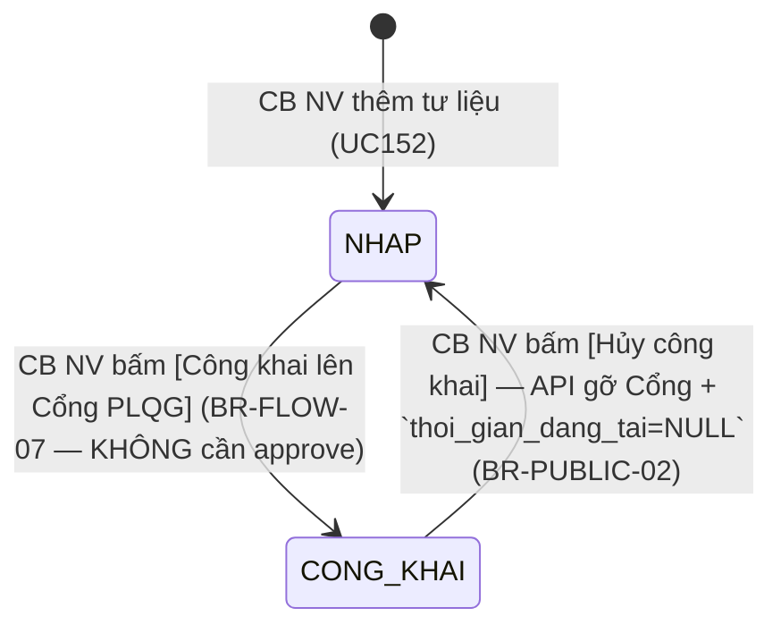

# Kế Hoạch Kiểm Thử — Tư vấn pháp luật chuyên sâu (FR-12, SCR-X1-01/02)

> **Phiên bản:** 1.1 (v3.5 rebase, Revised 2026-05-12 13:00:00)
> **Ngày tạo:** 2026-05-12
> **Revised:** 2026-05-12 13:00:00 — apply review REVISE: fix SM transition table (bỏ row `TIEP_NHAN → HUY` không có SRS, sửa guard `DANG_TU_VAN → HOAN_THANH` thành "Có VB TVPL"), split TVCS-002 thành TVCS-002a..f, tách BR-PUBLIC-01 thành 2 row (TVCS vs TLPL), thêm SM-TLPL diagram, thêm TLPL-006 negative permission CG/NHT publish → 403, thêm TVCS-API-007 boundary 100MB tổng, thêm cột Owner §7, thêm mapping FR ↔ TC ↔ BR.
> **Module:** L (LỚP 3 — GIAO DỊCH LÕI · #⑧ trong thứ tự seed) — Tư vấn pháp luật chuyên sâu (rename từ "Tư vấn chuyên sâu" v3.5)
> **Nguồn dữ liệu (SOURCE MODE = LOCAL):**
> - `input/srs-update-2026-5-5/srs-fr-12-tv-chuyen-sau.md` (1617 dòng, v3.5 active)
> - `input/srs-v3/srs-fr-12-tv-chuyen-sau.md` (1297 dòng, v3.0 baseline)
> - `input/srs-update-2026-5-5/_DELTA-MAP-FR12.md` (delta v3.0 → v3.5)
> - `input/srs-update-2026-5-5/CHANGELOG-v3-to-v3.5.md` §srs-fr-12 (13 thay đổi BA-IN)
> - `input/quy-trinh-nghiep-vu/02-thu-tu-module.md` §⑧ FR-12 (lines 513-575)
> - `input/quy-trinh-nghiep-vu/01-tong-quan-nghiep-vu.md` §LUỒNG C (lines 150-180)
> - `tasks/system-overview.md` §4.9 M8 TVCS (lines 378-390) + Δ v3.5 (line 815)
> - `input/users.csv` (test accounts)
>
> **SRS Reference:** FR-X.1-01 đến FR-X.1-07 (UC147-UC153), SCR-X1-01, SCR-X1-02 (v2.1: SCR-X1-03..07 DEPRECATED).

---

## 0. Tóm tắt thay đổi v3.5 — TRƯỚC khi viết TC

> Đặt block này TRƯỚC §1 vì 13 thay đổi v3.5 ảnh hưởng entity name + state machine + ERD — tester KHÔNG được cite v3.0 enum cũ.

| # | Thay đổi v3.5 | Tác động test |
|:-:|---|---|
| 1 | Rename UC: "Tư vấn chuyên sâu" → "Tư vấn pháp luật chuyên sâu" (`CHANGELOG-v3-to-v3.5.md` §srs-fr-12 Thay đổi 1) | UI breadcrumb + page title BẮT BUỘC = "Tư vấn pháp luật chuyên sâu". Test verify text đúng. |
| 2 | Rename entity: `NOI_DUNG_TU_VAN_CS` → `TU_VAN_CHUYEN_SAU` (Thay đổi 2) | API path = `/api/v1/tu-van-chuyen-sau`. Cite `srs-update-2026-5-5/srs-fr-12-tv-chuyen-sau.md:1182,1198`. |
| 3 | SM-TVCS 7 state v3.5: `TIEP_NHAN / PHAN_CONG / DANG_TU_VAN / HOAN_THANH / CHO_PHE_DUYET / DA_DUYET / HUY` (`srs-update-2026-5-5/srs-fr-12-tv-chuyen-sau.md:1452-1465`) | Test transition theo §5 file SRS — KHÔNG dùng SM 5 state v3.0. |
| 4 | Thêm `don_vi_id` (BR-ROUTE-TVCS-01 — Thay đổi 6, `srs-update-2026-5-5/srs-fr-12-tv-chuyen-sau.md:1298`) | DN gửi từ Cổng → chọn cơ quan; CB nhập tay = đơn vị CB. Test 3 case: hợp lệ / null / sai. |
| 5 | Thêm `hop_dong_tv_id` (Thay đổi 13, link FR-14) `[GAP-X.1-06]` (`srs-update-2026-5-5/srs-fr-12-tv-chuyen-sau.md:1297`) | Test optional FK — null OK. |
| 6 | BỎ field `hinh_thuc_tv` orphan khỏi TU_VAN_CHUYEN_SAU (`_DELTA-MAP-FR12.md` §1, line 1179 ERD đã bỏ) — hình thức TV move sang `PHIEN_TU_VAN.hinh_thuc` | Test API response KHÔNG có field `hinh_thuc_tv`. Migration data cũ open issue. |
| 7 | 5 trường công khai `[CR-01]` áp dụng cả TVCS + TU_LIEU_PHAP_LY_VV: `cong_khai / anh_dai_dien / thoi_gian_dang_tai / mo_ta_cong_khai / file_dinh_kem_cong_khai` (`srs-update-2026-5-5/srs-fr-12-tv-chuyen-sau.md:1299-1303, 1407-1411`) | TVCS công khai chỉ khi DA_DUYET (BR-PUBLIC-01); Tư liệu công khai bất kỳ (BR-FLOW-07). |
| 8 | FR-04 SM-TVV rename `DANG_HOAT_DONG` → `HOAT_DONG` (Δ v3.5 system-overview.md:817) | Dropdown chọn CG TVCS filter `trang_thai = HOAT_DONG` — verify enum mới. |
| 9 | Auto-save draft trao đổi 30s vào `TRAO_DOI_NHAP` (`srs-update-2026-5-5/srs-fr-12-tv-chuyen-sau.md:1496`) | Test auto-save endpoint khi CG soạn — recovery khi session hết hạn. |
| 10 | API outbound FR-XII-13 chỉ trả metadata TVCS HOAN_THANH, KHÔNG trả văn bản chi tiết (`02-thu-tu-module.md:935`) | Test public endpoint `/api/v1/tu-van-chuyen-sau` filter + verify response không có `ket_qua`/`noi_dung` chi tiết. |

**Đặc biệt:** **BR-FLOW-07** phá quy tắc chung BR-PUBLIC-01 — Tư liệu pháp lý đính kèm TVCS **công khai NGAY không cần phê duyệt**, CB NV tự chịu trách nhiệm (`srs-update-2026-5-5/srs-fr-12-tv-chuyen-sau.md:1579-1583`). Trong khi TVCS chính vẫn cần DA_DUYET mới công khai. Tester phải tách 2 TC riêng cho 2 entity.

---

## 1. Phạm Vi Kiểm Thử

### 1.1 Chức năng được kiểm thử

- Module L = Tầng GIAO DỊCH LÕI, #⑧ trong thứ tự seed (LỚP 3 — sau FR-10/FR-07/FR-04/FR-09/FR-15/FR-05/FR-02).
- 7 FR (FR-X.1-01..07) × 4 CMS UC (B-type: UC147/148/150/152) + 3 API inbound UC (M-type: UC149/151/153).
- Entity owned: `TU_VAN_CHUYEN_SAU`, `PHIEN_TU_VAN`, `LICH_SU_TRAO_DOI_TV`, `HO_SO_PHAP_LY_DN`, `TU_LIEU_PHAP_LY_VV` (v3.5 mới `[GAP-X.1-03]`), `DANH_GIA_CHAT_LUONG_TV`.
- Màn hình: SCR-X1-01 (danh sách MH-12.1) + SCR-X1-02 (chi tiết MH-12.2, 5 accordion + action buttons gộp MH-12.3..7 v2.1).
- Inbound API: 3 endpoint `/api/v1/inbound/tu-van-chuyen-sau`, `/api/v1/inbound/ho-so-phap-ly-dn`, `/api/v1/inbound/danh-gia-chat-luong-tv` (X-API-Key, TLS 1.2+).
- Outbound API: 1 endpoint public FR-XII-13 `/api/v1/tu-van-chuyen-sau` filter `trang_thai=HOAN_THANH`, **chỉ metadata** (KHÔNG nội dung VB).

### 1.2 Danh sách FR / UC

| # | Mã FR | UC | Tên chức năng | Loại | Entity owned | File Test Case |
|:-:|---|:-:|---|:-:|---|---|
| 1 | FR-X.1-01 | UC147 | Quản lý nội dung TVCS (CRUD + 7 transition SM-TVCS + công khai chuyên trang) | B | TU_VAN_CHUYEN_SAU | `01-TC-tvcs-crud.md` |
| 2 | FR-X.1-02 | UC148 | Tìm kiếm TVCS (FTS + 6 filter) | B | TU_VAN_CHUYEN_SAU | `02-TC-tvcs-search.md` |
| 3 | FR-X.1-03 | UC149 | API inbound tiếp nhận TVCS từ Cổng PLQG | M | TU_VAN_CHUYEN_SAU | `03-TC-tvcs-inbound-api.md` |
| 4 | FR-X.1-04 | UC150 | Quản lý hồ sơ pháp lý DN (CRUD) | B | HO_SO_PHAP_LY_DN | `04-TC-hspl-crud.md` |
| 5 | FR-X.1-05 | UC151 | API inbound tiếp nhận HSPL từ Cổng PLQG | M | HO_SO_PHAP_LY_DN | `05-TC-hspl-inbound-api.md` |
| 6 | FR-X.1-06 | UC152 | Quản lý tư liệu pháp lý VV (CRUD + công khai BR-FLOW-07) | B | TU_LIEU_PHAP_LY_VV | `06-TC-tlpl-crud.md` |
| 7 | FR-X.1-07 | UC153 | API inbound tiếp nhận đánh giá chất lượng từ Cổng PLQG | M | DANH_GIA_CHAT_LUONG_TV | `07-TC-dgcl-inbound-api.md` |
| 8 | — | — | Cross-module: outbound API FR-XII-13 metadata + permission matrix | — | — | `08-TC-cross-module.md` |

### 1.3 Tài khoản & role liên quan

| Role | Cấp | Username (users.csv) | Dùng cho TC loại |
|---|:-:|---|---|
| QTHT | — | `qtht_01` | Admin: chỉnh `CAU_HINH_SLA`, xem cross-unit. `_02` fallback, `_03` permission test |
| CB_NV_TW | TW | `cb_nv_tw_01` | CRUD TVCS scope TW; phân công CG (modal SCR-II-03 auto-filter 4 tiêu chí) |
| CB_NV_BN | BN | `cb_nv_bn_01` (BKH) | CRUD TVCS scope bộ ngành; data isolation test |
| CB_NV_DP | DP | `cb_nv_dp_01` (STP-AG) | CRUD TVCS scope địa phương (default `don_vi_id` = Sở TP tỉnh DN) |
| CB_PD_TW | TW | `cb_pd_tw_01` | Phê duyệt TVCS cùng cấp (CHO_PHE_DUYET → DA_DUYET/DANG_TU_VAN); BR-FLOW-04 lý do ≥10 ký tự |
| CB_PD_BN | BN | `cb_pd_bn_01` | Phê duyệt scope BN — verify BR-AUTH-05 cùng cấp |
| CB_PD_DP | DP | `cb_pd_dp_01` | Phê duyệt scope DP |
| CG | — | `cg_01..05` (xem users.csv) | Action [Chấp nhận]/[Từ chối] khi PHAN_CONG; soạn nội dung tư vấn (auto-save 30s); tích Hoàn thành |
| NHT | — | `nht_01` | NHT scope theo VV (BR-AUTH-10 lọc kép) — RU* HSPL của DN trong VV phân công, KHÔNG C/D |
| DN (qua API) | — | API key `cong_plqg_dn_test` | Inbound API send TVCS/HSPL/đánh giá (X-API-Key, TLS 1.2+) |
| Public (no auth) | — | — | Outbound API FR-XII-13 — verify metadata only |

> Reference: [input/users.csv](../../../input/users.csv), [output/permission-matrix.md](../../../output/permission-matrix.md).

---

## 2. Quy Tắc Nghiệp Vụ Trích Xuất Từ SRS

### 2.1 Business Rules (BR)

> **Quy định điền bảng:** Cột "Ngoại lệ SRS-quoted" chỉ điền khi có quote nguyên văn. Để trống nếu áp dụng 100%. KHÔNG tự suy luận.

| Mã | Quy tắc | Nguồn (SRS line) | Áp dụng module này? | Ngoại lệ SRS-quoted | TC áp dụng |
|---|---|---|---|---|---|
| BR-AUTH-01 | Xác thực 2-tier (Tier 1 nội bộ user/pass + TOTP, Tier 2 SSO VNeID OIDC). Không có VNPT eKYC | `srs-update-2026-5-5/srs-fr-12-tv-chuyen-sau.md:1529` | ✅ Yes | "API outbound không yêu cầu session (dùng JWT)" — line 1529 | Precondition login mọi TC; outbound FR-XII-13 dùng JWT |
| BR-AUTH-05 | Phê duyệt cùng cấp — CB PD chỉ duyệt TVCS thuộc đơn vị mình | `srs-update-2026-5-5/srs-fr-12-tv-chuyen-sau.md:198,210,1489` | ✅ Yes | — | TC permission CB_PD_TW không duyệt được TVCS DP |
| BR-AUTH-08 | Multi-tenant data scope theo `don_vi_id`. CB NV chỉ thấy TVCS thuộc đơn vị mình | `srs-update-2026-5-5/srs-fr-12-tv-chuyen-sau.md:1535` | ✅ Yes | "QTHT thấy tất cả" — AD-07 | TC data isolation cross-unit |
| BR-AUTH-10 (mở rộng) | NHT thấy HSPL DN trong VV phân công — lọc 2 lớp (`HSPL.don_vi_id=NHT.don_vi_id` AND EXISTS VV mà `vv.doanh_nghiep_id=HSPL.doanh_nghiep_id AND vv.nguoi_ho_tro_id=NHT.tvv_id`) | `srs-update-2026-5-5/srs-fr-12-tv-chuyen-sau.md:669-671` | ✅ Yes | NHT chỉ R+U HSPL, không C/D — line 671 | TC NHT R HSPL trong scope; ngoài scope → 403 |
| BR-DATA-01 | Soft delete `is_deleted=1` | `srs-update-2026-5-5/srs-fr-12-tv-chuyen-sau.md:1541` | ✅ Yes | AUDIT_LOG không xóa | TC DELETE = UPDATE is_deleted |
| BR-DATA-03 | 7 common fields | `srs-update-2026-5-5/srs-fr-12-tv-chuyen-sau.md:1547` | ✅ Yes | AUDIT_LOG khác | Verify DDL |
| BR-DATA-04 | Auto-gen mã `PREFIX-YYYYMMDD-SEQ` (TVCS-, HSPL-) | `srs-update-2026-5-5/srs-fr-12-tv-chuyen-sau.md:1553` | ✅ Yes | — | TC verify uniqueness + format |
| BR-DATA-05 | Audit trail CUD immutable | `srs-update-2026-5-5/srs-fr-12-tv-chuyen-sau.md:1559` | ✅ Yes | — | Verify AUDIT_LOG INSERT-only |
| BR-DATA-06 | Export Excel max 10k rows | `srs-v3.md:3977` + `srs-update-2026-5-5/srs-fr-12-tv-chuyen-sau.md:622` (HSPL 10k explicit) | ✅ Yes | — | TC Export TVCS + HSPL + filter-aware |
| BR-DATA-07 | Pagination default 20, max 100 | `srs-update-2026-5-5/srs-fr-12-tv-chuyen-sau.md:1565` | ✅ Yes | "Dashboard: không phân trang" | TC pagination boundary |
| BR-DATA-08 | FTS tiếng Việt unaccent | `srs-update-2026-5-5/srs-fr-12-tv-chuyen-sau.md:1571` | ✅ Yes (FR-X.1-02, X.1-06) | — | TC search dấu/không dấu |
| BR-EC-01 | Optimistic Locking | `srs-v3.md:4066` | ✅ Yes | — | TC conflict UPDATE TVCS → ERR-SYS-02 |
| BR-EC-13 | Search sanitize max 200 ký tự | `srs-v3.md:4078` | ✅ Yes | — | TC search SQL/XSS/long |
| BR-FLOW-01 | Auto chuyển trạng thái HOAN_THANH → CHO_PHE_DUYET | `srs-update-2026-5-5/srs-fr-12-tv-chuyen-sau.md:191,1488` | ✅ Yes | — | TC CG tích Hoàn thành → auto next |
| BR-FLOW-04 | Phê duyệt từ chối cần lý do min 10 ký tự | `srs-update-2026-5-5/srs-fr-12-tv-chuyen-sau.md:212,1577` | ✅ Yes | — | TC CB PD từ chối không lý do = error |
| **BR-FLOW-07** ⭐ | **Tư liệu PL nhóm X.1 công khai TRỰC TIẾP lên Cổng PLQG, KHÔNG cần phê duyệt. CB NV tự chịu trách nhiệm** | `srs-update-2026-5-5/srs-fr-12-tv-chuyen-sau.md:1583` | ✅ Yes (FR-X.1-06) | — | **TC publish TLPL không qua approve step — phá quy tắc BR-PUBLIC-01 chung** |
| BR-NOTIF-01 | Notification in-app + email khi API inbound + transition SM | `srs-update-2026-5-5/srs-fr-12-tv-chuyen-sau.md:1589` | ✅ Yes (FR-X.1-03, X.1-05, X.1-01 mọi transition) | — | TC verify notification gửi CB NV |
| BR-PUBLIC-01-TVCS | TVCS công khai chỉ khi `trang_thai = DA_DUYET`. HUY / từ chối / mọi state khác: cấm công khai | `srs-update-2026-5-5/srs-fr-12-tv-chuyen-sau.md:1601` | ✅ Yes (FR-X.1-01) | — | TC bật `cong_khai=1` khi TIEP_NHAN → reject (TVCS-007); chỉ DA_DUYET pass (TVCS-006) |
| BR-PUBLIC-01-TLPL | Tư liệu PL VV công khai bất kỳ state nào (NHAP / CONG_KHAI), KHÔNG cần DA_DUYET — exception theo BR-FLOW-07 | `srs-update-2026-5-5/srs-fr-12-tv-chuyen-sau.md:1583,1601` | ✅ Yes (FR-X.1-06) | — | TC TLPL-002 happy + TLPL-006 negative permission CG/NHT |
| BR-PUBLIC-02 | Hủy công khai: clear `thoi_gian_dang_tai=NULL` + API gỡ Cổng PLQG | `srs-update-2026-5-5/srs-fr-12-tv-chuyen-sau.md:1607` | ✅ Yes | — | TC 1→0: verify Cổng nhận lệnh gỡ |
| BR-PUBLIC-03 | `thoi_gian_dang_tai` auto fill lần bật cuối, KHÔNG cho sửa tay | `srs-update-2026-5-5/srs-fr-12-tv-chuyen-sau.md:1613` | ✅ Yes | — | TC bật-tắt-bật: thời điểm = lần bật cuối |
| BR-ROUTE-TVCS-01 | DN gửi Cổng: `don_vi_id` = cơ quan DN chọn (mặc định Sở TP tỉnh DN theo MST). CB nhập tay: = đơn vị CB | `srs-update-2026-5-5/srs-fr-12-tv-chuyen-sau.md:1595` | ✅ Yes (FR-X.1-01, X.1-03) | — | TC inbound API 3 case: hợp lệ / null / sai |
| SM-TVCS | 7 state SM (Section 5) | `srs-update-2026-5-5/srs-fr-12-tv-chuyen-sau.md:1447-1496` | ✅ Yes | — | TC transition + invalid SM → ERR-TVCS-04 |

### 2.2 Error Codes

| Mã lỗi | Điều kiện trigger | Message (SRS-quoted) | Severity | Cite |
|---|---|---|:-:|---|
| ERR-TVCS-01 | Nội dung tư vấn trống | "Nội dung tư vấn là bắt buộc" | ERROR | `srs-update-2026-5-5/srs-fr-12-tv-chuyen-sau.md:302` |
| ERR-TVCS-02 | CG không tồn tại hoặc không HOAT_DONG | "Chuyên gia không hợp lệ hoặc đã ngừng hoạt động" | ERROR | `srs-update-2026-5-5/srs-fr-12-tv-chuyen-sau.md:303` |
| ERR-TVCS-03 | Lĩnh vực không tồn tại | "Lĩnh vực PL không tồn tại" | ERROR | `srs-update-2026-5-5/srs-fr-12-tv-chuyen-sau.md:304` |
| ERR-TVCS-04 | Chuyển trạng thái không hợp lệ (SM-TVCS) | "Không thể chuyển trạng thái từ '{current}' sang '{target}'. Xem SM-TVCS" | ERROR | `srs-update-2026-5-5/srs-fr-12-tv-chuyen-sau.md:305` |
| ERR-TVCS-05 | Mã nội dung trùng | "Mã nội dung '{ma}' đã tồn tại" | ERROR | `srs-update-2026-5-5/srs-fr-12-tv-chuyen-sau.md:306` |
| ERR-TVCS-TK-01 | tu_ngay > den_ngay | "Ngày bắt đầu phải trước ngày kết thúc" | ERROR | `srs-update-2026-5-5/srs-fr-12-tv-chuyen-sau.md:390` |
| ERR-TVCS-API-01 | API key không hợp lệ | HTTP 401 "Unauthorized" | ERROR | `srs-update-2026-5-5/srs-fr-12-tv-chuyen-sau.md:496` |
| ERR-TVCS-API-02 | Cấu trúc dữ liệu inbound không hợp lệ | "Dữ liệu không hợp lệ: {chi_tiet_loi}" | ERROR | `srs-update-2026-5-5/srs-fr-12-tv-chuyen-sau.md:497` |
| ERR-TVCS-API-03 | Trùng `ma_noi_dung_cong` | "Nội dung '{mã}' đã tồn tại (mã: {ma_noi_dung})" | ERROR | `srs-update-2026-5-5/srs-fr-12-tv-chuyen-sau.md:498` |
| ERR-TVCS-API-04 | Rate limit | HTTP 429 + header Retry-After | WARNING | `srs-update-2026-5-5/srs-fr-12-tv-chuyen-sau.md:501` |
| ERR-FILE-SIZE-01 | File inbound vượt 20MB | "Tệp '{ten_file}' vượt quá 20MB" | ERROR | `srs-update-2026-5-5/srs-fr-12-tv-chuyen-sau.md:499` |
| ERR-FILE-02 | File chứa mã độc | "Tệp '{ten_file}' chứa mã độc, không thể tiếp nhận" | ERROR | `srs-update-2026-5-5/srs-fr-12-tv-chuyen-sau.md:500` |
| ERR-HSPL-01..06 | HSPL CRUD errors | (xem SRS lines 652-657) | ERROR | `srs-update-2026-5-5/srs-fr-12-tv-chuyen-sau.md:652-657` |
| ERR-HSPL-API-01..04 | HSPL inbound errors | (xem SRS lines 762-767) | ERROR | `srs-update-2026-5-5/srs-fr-12-tv-chuyen-sau.md:762-767` |
| ERR-TLPL-01..07 | TLPL CRUD errors | (xem SRS lines 935-941) | ERROR/WARNING | `srs-update-2026-5-5/srs-fr-12-tv-chuyen-sau.md:935-941` |
| ERR-DG-API-01..07 | Đánh giá inbound errors | (xem SRS lines 1034-1040) | ERROR/WARNING | `srs-update-2026-5-5/srs-fr-12-tv-chuyen-sau.md:1034-1040` |
| ERR-SYS-02 | Optimistic lock conflict | "Bản ghi đã được cập nhật bởi người khác" | ERROR | `srs-v3.md:4066` |

> Message PHẢI quote nguyên văn. KHÔNG "close enough".

### 2.3 Permission Matrix (module-specific)

> Reference đầy đủ: [output/permission-matrix.md](../../../output/permission-matrix.md).

| Entity / Action | QTHT | CB_NV (TW/BN/DP) | CB_PD (cùng cấp) | NHT | CG | DN (qua API) | Public |
|---|:-:|:-:|:-:|:-:|:-:|:-:|:-:|
| `TU_VAN_CHUYEN_SAU` R | All units | Own unit | Own unit | VV scope | Assigned only | — | Metadata only (HOAN_THANH+) |
| `TU_VAN_CHUYEN_SAU` C | C all | C own unit | — | — | — | C via inbound API | — |
| `TU_VAN_CHUYEN_SAU` U (transition) | All | TIEP_NHAN→PHAN_CONG, hủy | CHO_PHE_DUYET→DA_DUYET/DANG_TU_VAN | — | PHAN_CONG→DANG_TU_VAN/TIEP_NHAN, DANG_TU_VAN→HOAN_THANH | — | — |
| `TU_VAN_CHUYEN_SAU` D | Soft delete | Soft delete own | — | — | — | — | — |
| `TU_VAN_CHUYEN_SAU.cong_khai` switch | All | Own unit khi DA_DUYET | — | — | — | — | — |
| `HO_SO_PHAP_LY_DN` CRUD | All | CRUD own unit | — | RU* in VV scope (BR-AUTH-10) | — | C via inbound API | — |
| `TU_LIEU_PHAP_LY_VV` CRUD + publish | All | CRUD own unit + publish | — | — | — | — | — |
| `DANH_GIA_CHAT_LUONG_TV` R | All | R own unit | R own unit | — | R own evaluations | C via inbound API (idempotency) | — |
| Phân công CG (modal SCR-II-03) | — | TW: all units; BN/DP: own unit | — | — | — | — | — |

### 2.4 UI Layout (SCR-X1-01 + SCR-X1-02)

> ⚠️ KHÔNG dùng absence để khẳng định "module không có X". Mọi feature đối chiếu §2.1 BR + SRS Phụ lục B.

#### SCR-X1-01 — Danh sách Tư vấn pháp luật chuyên sâu (MH-12.1)

**Components (trích `srs-update-2026-5-5/srs-fr-12-tv-chuyen-sau.md:1069-1102`):**

- **Toolbar:** Breadcrumb "Trang chủ > Tư vấn > Tư vấn pháp luật chuyên sâu" + Tiêu đề + [+ Thêm yêu cầu TV] [Xuất Excel] [Làm mới].
- **Filter-bar:** 3 tab (Chờ xử lý / Đang tư vấn / Hoàn thành), Ô tìm kiếm FTS, Dropdown Chuyên gia/DN/Lĩnh vực/Trạng thái, Khoảng ngày.
- **Content table:** Checkbox / Mã (TVCS-YYYYMMDD-SEQ) / DN / CG / Lĩnh vực / Tóm tắt (100 ký tự) / Trạng thái badge SM-TVCS / Ngày tư vấn / Ngày tạo / Hành động (Xem/Sửa/Phân công CG/Hủy).
- **Action-bar (hàng loạt):** [Phân công CG hàng loạt] (TIEP_NHAN only) / [Công khai chuyên trang hàng loạt] + [Hủy công khai hàng loạt] (DA_DUYET only — BR-PUBLIC-01).
- **Footer:** Pagination 20/page default.

#### SCR-X1-02 — Chi tiết Tư vấn pháp luật chuyên sâu (MH-12.2 — gộp MH-12.4/12.5/12.6/12.7 v2.1)

**Components (trích `srs-update-2026-5-5/srs-fr-12-tv-chuyen-sau.md:1119-1140`):**

- **Toolbar:** Breadcrumb + Tiêu đề + Badge trạng thái.
- **Stepper SM-TVCS:** TIEP_NHAN — PHAN_CONG — DANG_TU_VAN — HOAN_THANH — CHO_PHE_DUYET — DA_DUYET (HUY nhánh riêng dấu X đỏ).
- **5 Accordion:**
  1. Thông tin cơ bản (Mã / DN / CG / Lĩnh vực / Cơ quan tiếp nhận `don_vi_id` `[CR-06]` / Ngày tư vấn / Ghi chú max 2000).
  2. Nội dung tư vấn (Rich Text max 50KB + Tóm tắt max 500).
  3. Tư liệu PL liên kết — table inline + [+ Thêm tư liệu] (UC152).
  4. Đánh giá chất lượng — table read-only (UC153 inbound).
  5. Nhật ký thao tác — timeline (chỉ chi tiết mode).
- **Accordion 6 (8b):** Công khai chuyên trang `[CR-01]` — chỉ hiển thị khi `trang_thai=DA_DUYET` (BR-PUBLIC-01). Switch + Mô tả + Ảnh + File đính kèm + Thời gian đăng tải read-only.
- **Action-bar cố định (theo state + role):**
  - TIEP_NHAN: [Hủy][Lưu][Phân công CG →]
  - PHAN_CONG: [Hủy yêu cầu] + CG được phân công: [Chấp nhận][Từ chối]
  - DANG_TU_VAN: [Hủy][Lưu]
  - HOAN_THANH: [Trình phê duyệt] (auto theo BR-FLOW-01)
  - CHO_PHE_DUYET: [Phê duyệt][Từ chối] (CB PD cùng cấp)
  - DA_DUYET: Read-only + [Công khai chuyên trang]/[Hủy công khai]

**Cross-cutting features MẶC ĐỊNH có (BR global):**
- ☑ [Xuất Excel] toolbar (BR-DATA-06, max 10k filter-aware).
- ☑ Pagination 20/page (BR-DATA-07).
- ☑ Search sanitize max 200 (BR-EC-13).
- ☑ Audit log mọi CUD + transition (BR-DATA-05).
- ☑ Optimistic lock mọi UPDATE (BR-EC-01).
- ☑ URL sync filter (BR-UX-01).

**Feature module KHÔNG có (SPEC-CLARIFY hoặc quote):** N/A — chưa có feature absence được quote.

### 2.5 State Machine SM-TVCS (CRITICAL)



**Bảng transition chuẩn — 10 transition (cite `srs-update-2026-5-5/srs-fr-12-tv-chuyen-sau.md:1481-1492`):**

> ⚠️ **Revised 2026-05-12 13:00:00:** v1.0 plan có 11 transition (thừa row `TIEP_NHAN → HUY`) — SRS chỉ liệt kê **10 transition**. Đã bỏ row tự suy luận. Guard `DANG_TU_VAN → HOAN_THANH` sửa từ "`ket_qua` khác rỗng" (sai) → "Có VB TVPL" (SRS:1487).

| # | Từ | Đến | Trigger | Guard | Action | FR | BR |
|:-:|---|---|---|---|---|---|---|
| 1 | `[*]` | TIEP_NHAN | CB NV tạo / UC149 inbound | — | INSERT bản ghi, `nguon=THU_CONG/CONG_PLQG` | FR-X.1-01/03 | — |
| 2 | TIEP_NHAN | PHAN_CONG | CB NV phân công | CG `trang_thai=HOAT_DONG`, chuyên môn khớp | TB CG + SLA 2 ngày LV | FR-X.1-01 | — |
| 3 | PHAN_CONG | DANG_TU_VAN | CG [Chấp nhận] | Là CG được phân công, chưa quá SLA | Tạo PHIEN_TU_VAN, set `ngay_bat_dau=NOW()`, TB DN+CB NV | FR-X.1-01 | — |
| 4 | PHAN_CONG | TIEP_NHAN | CG [Từ chối] | Lý do bắt buộc | Xóa `chuyen_gia_id`, TB CB NV phân công lại | FR-X.1-01 | — |
| 5 | DANG_TU_VAN | HOAN_THANH | CG tích [Hoàn thành] | **Có VB TVPL** (`srs:1487` — văn bản tư vấn pháp lý đính kèm) | Set `ngay_hoan_thanh=NOW()` | FR-X.1-01 | — |
| 6 | HOAN_THANH | CHO_PHE_DUYET | **AUTO** | — | TB CB PD cùng cấp | FR-X.1-01 | **BR-FLOW-01** |
| 7 | CHO_PHE_DUYET | DA_DUYET | CB PD [Phê duyệt] | CB PD cùng cấp đơn vị | Set `nguoi_phe_duyet_id`, gửi KQ DN (Cổng/email), TB DN đánh giá | FR-X.1-01 | BR-AUTH-05 |
| 8 | CHO_PHE_DUYET | DANG_TU_VAN | CB PD [Từ chối] | Lý do ≥10 ký tự | TB CG bổ sung | FR-X.1-01 | **BR-FLOW-04** |
| 9 | PHAN_CONG | HUY | CB NV hủy | CG chưa xác nhận | TB CG | FR-X.1-01 | — |
| 10 | DANG_TU_VAN | HUY | CB NV hủy | DN đồng ý + CB PD duyệt hủy | TB CG+DN | FR-X.1-01 | — |

**SM-TLPL (Tư liệu pháp lý VV) — 2 state, exception BR-FLOW-07:**



**Bảng transition SM-TLPL (cite `srs-update-2026-5-5/srs-fr-12-tv-chuyen-sau.md:1583`):**

| # | Từ | Đến | Trigger | Guard | Action | FR | BR |
|:-:|---|---|---|---|---|---|---|
| 1 | `[*]` | NHAP | CB NV thêm tư liệu gắn TVCS | — | INSERT TU_LIEU_PHAP_LY_VV | FR-X.1-06 | — |
| 2 | NHAP | CONG_KHAI | CB NV bấm [Công khai lên Cổng] | **KHÔNG cần approve** (BR-FLOW-07); CB NV tự chịu trách nhiệm | Push Cổng PLQG, set `thoi_gian_dang_tai=NOW()` | FR-X.1-06 | **BR-FLOW-07** + BR-PUBLIC-01-TLPL |
| 3 | CONG_KHAI | NHAP | CB NV bấm [Hủy công khai] | — | API gỡ Cổng, `thoi_gian_dang_tai=NULL` | FR-X.1-06 | BR-PUBLIC-02 |

> ⚠️ **Permission TLPL publish:** CHỈ `CB_NV` (TW/BN/DP) cùng đơn vị TVCS gốc. CG / NHT / DN qua API → **403** (xem TLPL-006).

> **Timeout phân công CG:** 2 ngày LV (`CAU_HINH_SLA`). Quá → auto-reject về TIEP_NHAN (line 1494).
> **Auto-save DRAFT:** Khi CG soạn, auto-save mỗi 30s vào `TRAO_DOI_NHAP` (`trang_thai=DRAFT`); session hết hạn → khôi phục khi login lại (line 1496).
> **⭐ BR-FLOW-07 NGOẠI LỆ:** Tư liệu PL VV (entity `TU_LIEU_PHAP_LY_VV`, 2 state NHAP/CONG_KHAI) — `NHAP → CONG_KHAI` KHÔNG đi qua approve. CB NV bấm [Công khai lên Cổng PLQG] → push trực tiếp Cổng. Phá quy tắc BR-PUBLIC-01 chung của TVCS. **Tách 2 TC riêng — KHÔNG gộp.**

### 2.6 Data dependencies & Seed / Workflow input

| Phase | Input file | Section |
|---|---|---|
| GĐ 1 Seed (entry state TIEP_NHAN) | `input/data/seed-fixture.yaml` | `tu_van_cs_variants[1..6]` (verify KHÔNG còn ref `hinh_thuc_tv` — `_DELTA-MAP-FR12.md` §4) |
| GĐ 1 click flow | `input/flow-module.md` | §FR-12 Bước 1 (thủ công CB NV nhập tay) |
| GĐ 2 Workflow | `input/flow-module.md` | §FR-12 bảng flow 7 transition + Phụ lục 2 preset + Phụ lục 3 troubleshooting |
| Cross-module map | `input/data/entity-map.md` | TU_VAN_CHUYEN_SAU "Tạo tại" FR-12, "Đọc tại" FR-07 (tab HSPL), FR-11 (BC TT17), FR-16 (API outbound) |

**Upstream dependencies (Tier check theo `02-thu-tu-module.md` LỚP 1→3):**

| Entity của module | Tier | Phụ thuộc entity nào (upstream) | Seed trước tại module |
|---|:-:|---|---|
| TU_VAN_CHUYEN_SAU | 3 | DOANH_NGHIEP (FR-07), TU_VAN_VIEN (FR-04, `trang_thai=HOAT_DONG`), DANH_MUC LINH_VUC_PL (FR-10), DON_VI (FR-10), CAU_HINH_SLA (FR-10) | FR-10 → FR-07 → FR-04 |
| HO_SO_PHAP_LY_DN | 3 | DOANH_NGHIEP, DON_VI, DANH_MUC LINH_VUC_PL | FR-07 |
| TU_LIEU_PHAP_LY_VV | 4 | TU_VAN_CHUYEN_SAU (FK `noi_dung_tv_id`) | FR-12 chính trước |
| DANH_GIA_CHAT_LUONG_TV | 4 | TU_VAN_CHUYEN_SAU (`noi_dung_tv_id`), TU_VAN_VIEN | FR-12 chính trước |
| PHIEN_TU_VAN | 4 | TU_VAN_CHUYEN_SAU (FK `tu_van_cs_id`) | tạo tự động khi CG chấp nhận PHAN_CONG |

> **Lưu ý:** KHÔNG hardcode count "N records". Fixture 6 variants/entity. Workflow advance state thuộc GĐ 2 (workflow-test-report-FR-12.md), không phải precondition test plan.

---

## 3. Cấu Trúc File Test Case

```
docs/todo-test/fr-12-tv-chuyen-sau/
├── test-plan.md                          ← File này (00-test-plan-overview)
├── 01-TC-tvcs-crud.md                    ← UC147 CRUD + 7 transition SM-TVCS + công khai
├── 02-TC-tvcs-search.md                  ← UC148 FTS + 6 filter
├── 03-TC-tvcs-inbound-api.md             ← UC149 API inbound TVCS + BR-ROUTE-TVCS-01
├── 04-TC-hspl-crud.md                    ← UC150 HSPL CRUD + NHT BR-AUTH-10
├── 05-TC-hspl-inbound-api.md             ← UC151 API inbound HSPL
├── 06-TC-tlpl-crud.md                    ← UC152 TLPL CRUD + công khai BR-FLOW-07 ⭐
├── 07-TC-dgcl-inbound-api.md             ← UC153 API inbound đánh giá + idempotency GUI_LAI
├── 08-TC-cross-module.md                 ← Permission matrix + outbound FR-XII-13 metadata + Δ v3.5
└── (09-REVIEW-edge-case-hunter.md)       ← Optional review
```

---

## 4. Tổng Quan Số Lượng Test Cases

| File | TC ID prefix | Happy | Negative | Edge | Tổng |
|---|---|:-:|:-:|:-:|:-:|
| 01-TC-tvcs-crud | TVCS- | 10 (TVCS-002 split 6 sub-TC) | 3 | 2 | **15** |
| 02-TC-tvcs-search | TVCS-SEARCH- | 2 | 2 | 1 | **5** |
| 03-TC-tvcs-inbound-api | TVCS-API- | 2 | 3 | 2 (+ boundary 100MB) | **7** |
| 04-TC-hspl-crud | HSPL- | 2 | 2 | 1 | **5** |
| 05-TC-hspl-inbound-api | HSPL-API- | 1 | 2 | 0 | **3** |
| 06-TC-tlpl-crud | TLPL- | 3 | 2 (+ TLPL-006 negative permission BR-FLOW-07) | 1 | **6** |
| 07-TC-dgcl-inbound-api | DGCL-API- | 2 | 1 | 1 | **4** |
| 08-TC-cross-module | CROSS- | 2 | 2 | 1 | **5** |
| **TỔNG** | | **24** | **17** | **9** | **50** |

> **Revised 2026-05-12 13:00:00** — tổng tăng từ 43 → 50 TC do: (1) TVCS-002 split 6 sub-TC (TVCS-002a..f) cho 6 transition; (2) TLPL-006 negative permission CG/NHT publish → 403; (3) TVCS-API-007 boundary tổng 100MB inbound.

### TC nổi bật (mỗi nhóm pick 1-2 tiêu biểu)

| TC ID | Mô tả ngắn | Priority | Cite SRS |
|---|---|:-:|---|
| TVCS-001 | Happy: CB_NV_DP tạo TVCS thủ công TIEP_NHAN, mã auto TVCS-YYYYMMDD-SEQ | P0 | `srs:1483` (Inputs FR-X.1-01 + auto-gen mã) |
| TVCS-002a | Transition #2 TIEP_NHAN → PHAN_CONG: CB NV phân công CG (guard CG `trang_thai=HOAT_DONG`) → verify DB state + TB CG + AUDIT_LOG row | P0 | `srs:1481-1492` row #2 |
| TVCS-002b | Transition #3 PHAN_CONG → DANG_TU_VAN: CG [Chấp nhận] → verify PHIEN_TU_VAN insert + `ngay_bat_dau=NOW()` + TB DN+CB NV | P0 | `srs:1485` |
| TVCS-002c | Transition #5 DANG_TU_VAN → HOAN_THANH: CG tích [Hoàn thành] với VB TVPL đính kèm → verify `ngay_hoan_thanh=NOW()` (guard "Có VB TVPL" `srs:1487`) | P0 | `srs:1487` |
| TVCS-002d | Transition #6 HOAN_THANH → CHO_PHE_DUYET (AUTO BR-FLOW-01) → verify TB CB PD cùng cấp + DB state auto + AUDIT_LOG | P0 | `srs:1488`, BR-FLOW-01 |
| TVCS-002e | Transition #7 CHO_PHE_DUYET → DA_DUYET: CB PD cùng cấp [Phê duyệt] → verify `nguoi_phe_duyet_id` set + gửi KQ DN (Cổng/email) + TB DN đánh giá | P0 | `srs:1489`, BR-AUTH-05 |
| TVCS-002f | Transition #8 CHO_PHE_DUYET → DANG_TU_VAN: CB PD [Từ chối] với lý do ≥10 ký tự → verify TB CG bổ sung + AUDIT_LOG (BR-FLOW-04) | P0 | `srs:1490`, BR-FLOW-04 |
| TVCS-003 | Negative: chọn CG `NGUNG_HOAT_DONG` (v3.5 enum) → ERR-TVCS-02 | P0 | line 303, Δ v3.5 §8 |
| TVCS-004 | Edge: 2 user UPDATE đồng thời TVCS DANG_TU_VAN → optimistic lock ERR-SYS-02 | P1 | BR-EC-01 |
| TVCS-005 | Negative: CB_PD_BN duyệt TVCS thuộc DP → 403 (BR-AUTH-05 cùng cấp) | P0 | line 198, 1489 |
| TVCS-006 | Happy: CB NV bật `cong_khai=1` khi DA_DUYET — verify API push Cổng PLQG + `thoi_gian_dang_tai=NOW()` | P0 | line 229-238, BR-PUBLIC-01/03 |
| TVCS-007 | Negative: bật `cong_khai=1` khi `trang_thai=TIEP_NHAN` → reject (BR-PUBLIC-01) | P0 | line 1601 |
| TVCS-008 | Edge: bật-tắt-bật → `thoi_gian_dang_tai` = lần bật cuối (BR-PUBLIC-03) | P1 | line 1613 |
| TVCS-009 | Negative: CB PD từ chối phê duyệt không lý do → BR-FLOW-04 error | P0 | line 212, 1577 |
| TVCS-010 | Edge: CG soạn nội dung — auto-save mỗi 30s vào TRAO_DOI_NHAP DRAFT; logout/login khôi phục | P1 | line 1496 |
| TVCS-SEARCH-001 | Happy: FTS tiếng Việt unaccent "tu van" match "tư vấn" | P0 | line 1571 |
| TVCS-SEARCH-002 | Negative: `tu_ngay > den_ngay` → ERR-TVCS-TK-01 | P1 | line 390 |
| TVCS-SEARCH-003 | Edge: query >200 ký tự → sanitize BR-EC-13 | P2 | BR-EC-13 |
| TVCS-API-001 | Happy: POST `/api/v1/inbound/tu-van-chuyen-sau` payload đủ + `don_vi_id` valid → 200 + bản ghi TIEP_NHAN | P0 | line 414-503 |
| TVCS-API-002 | BR-ROUTE-TVCS-01: payload thiếu `don_vi_id` → áp default Sở TP tỉnh DN theo MST | P0 | line 1595 |
| TVCS-API-003 | BR-ROUTE-TVCS-01: `don_vi_id` không tồn tại → reject + áp default | P0 | line 447 |
| TVCS-API-004 | Negative: X-API-Key sai → 401 ERR-TVCS-API-01 | P0 | line 496 |
| TVCS-API-005 | Negative: `ma_noi_dung_cong` trùng → ERR-TVCS-API-03 (echo `ma_noi_dung` cũ) | P1 | line 498 |
| TVCS-API-006 | Edge: rate limit vượt ngưỡng → HTTP 429 + Retry-After | P2 | line 501 |
| TVCS-API-007 | Edge boundary: payload 10 file × 10MB + 1 file 1MB (= 101MB tổng) → reject ràng buộc cấp tổng "Max 10 files, tổng max 100MB" (KHÔNG phải cấp file) | P1 | line 435 |
| HSPL-001 | Happy: CB_NV_DP tạo HSPL gắn DOANH_NGHIEP scope mình; mã HSPL-YYYYMMDD-SEQ | P0 | line 568-577 |
| HSPL-002 | Permission BR-AUTH-10: NHT có VV với DN X → đọc/sửa HSPL của DN X (RU*); KHÔNG được C/D | P0 | line 669-671 |
| HSPL-003 | Negative: NHT ngoài VV scope → 403 | P0 | line 670 |
| HSPL-004 | Edge: Export Excel HSPL với filter — verify max 10k + filter-aware | P1 | line 622 |
| HSPL-005 | Negative: file đính kèm 21MB → ERR-HSPL-03 | P1 | line 654 |
| HSPL-API-001 | Happy: inbound HSPL → upsert DOANH_NGHIEP theo MST; `nguon=CONG_PLQG` | P0 | line 727-738 |
| HSPL-API-002 | Negative: `ma_ho_so_cong` trùng → ERR-HSPL-API-03 | P1 | line 764 |
| HSPL-API-003 | Negative: file mã độc → ERR-FILE-02 + audit | P0 | line 766 |
| TLPL-001 | Happy: CB NV thêm TLPL gắn TVCS — state NHAP | P0 | line 826-833 |
| TLPL-002 ⭐ | **BR-FLOW-07: bấm [Công khai lên Cổng PLQG] khi NHAP (KHÔNG cần approve) → push Cổng + state CONG_KHAI** | P0 | **line 1583** |
| TLPL-003 | Edge: TLPL chỉnh sửa khi `trang_thai=CONG_KHAI` → reject "phải hủy công khai trước" | P1 | line 871 |
| TLPL-004 | Happy: hủy công khai TLPL → API gỡ Cổng + state NHAP + `thoi_gian_dang_tai=NULL` | P0 | BR-PUBLIC-02 |
| TLPL-005 | Negative: công khai TLPL không file → ERR-TLPL-05 | P1 | line 939 |
| TLPL-006 ⭐ | **Negative permission BR-FLOW-07:** CG (`cg_01`) / NHT (`nht_01`) / DN qua API bấm [Công khai lên Cổng PLQG] trên TLPL → **403** (chỉ CB_NV cùng đơn vị TVCS gốc mới publish được) | P0 | `srs:1583`, permission matrix §2.3 |
| DGCL-API-001 | Happy: inbound đánh giá `hanh_dong=TAO_MOI` → tạo bản ghi + cập nhật điểm TB CG | P0 | line 1006-1010 |
| DGCL-API-002 | Idempotency: `hanh_dong=GUI_LAI` 2 lần → không ghi đè, trả success | P0 | line 1008 |
| DGCL-API-003 | Negative: `diem_so=0` → ERR-DG-API-03 | P0 | line 1036 |
| DGCL-API-004 | Edge: cập nhật đánh giá trạng thái không cho phép → ERR-DG-API-06 | P2 | line 1039 |
| CROSS-001 | Outbound FR-XII-13 metadata-only: GET `/api/v1/tu-van-chuyen-sau` (public, no auth, filter `trang_thai=HOAN_THANH`) → **EXPOSE**: `ma_noi_dung`, `doanh_nghiep.ten`, `linh_vuc_pl.ten`, `tom_tat` (≤500), `ngay_hoan_thanh`, `thoi_gian_dang_tai`, `anh_dai_dien` cong khai; **HIDE**: `noi_dung_tu_van` (Rich Text 50KB), `ket_qua`, `tai_lieu_dinh_kem`, `chuyen_gia_id`, `nguoi_phe_duyet_id`, `don_vi_id`, audit fields | P0 | `02-thu-tu-module.md:935`, ERD `srs:1182-1210` |
| CROSS-002 | Δ v3.5: API response body KHÔNG có field `hinh_thuc_tv` (`_DELTA-MAP-FR12.md` §1) | P1 | DELTA §1 |
| CROSS-003 | Δ v3.5 rename: breadcrumb + page title = "Tư vấn pháp luật chuyên sâu" (KHÔNG còn "Tư vấn chuyên sâu") | P1 | CHANGELOG §srs-fr-12 Thay đổi 1 |
| CROSS-004 | Δ v3.5: filter CG ở modal phân công dùng `trang_thai=HOAT_DONG` (rename từ DANG_HOAT_DONG) | P0 | Δ v3.5 §8 |
| CROSS-005 | Permission DN qua API: API key hợp lệ nhưng `don_vi_id` payload thuộc đơn vị khác → áp BR-ROUTE-TVCS-01 default | P1 | line 1595 |

**Phân bổ priority:**

| Priority | Số TC | % |
|---|---:|---:|
| P0 (bắt buộc) | 30 | 60% |
| P1 (quan trọng) | 14 | 28% |
| P2 (nên có) | 6 | 12% |
| **Tổng** | **50** | **100%** |

### 4.1 Mapping FR ↔ TC ↔ BR (audit coverage)

> Mapping bảng dưới giúp audit "BR nào đã có TC, BR nào miss". Mỗi BR tối thiểu 1 TC; BR cốt lõi (BR-FLOW-01/04/07, BR-PUBLIC-01-TVCS/TLPL, BR-PUBLIC-02/03, BR-AUTH-05/10, BR-ROUTE-TVCS-01) ≥2 TC (happy + negative).

| FR / UC | TC chính | BR liên quan |
|---|---|---|
| FR-X.1-01 UC147 (CRUD + transition + công khai) | TVCS-001..010, TVCS-002a..f | BR-DATA-04, BR-FLOW-01, BR-FLOW-04, BR-PUBLIC-01-TVCS, BR-PUBLIC-02, BR-PUBLIC-03, BR-AUTH-05, BR-EC-01, SM-TVCS |
| FR-X.1-02 UC148 (Search) | TVCS-SEARCH-001..003 | BR-DATA-08 (FTS unaccent), BR-EC-13 (sanitize 200) |
| FR-X.1-03 UC149 (Inbound API TVCS) | TVCS-API-001..007 | BR-ROUTE-TVCS-01, BR-NOTIF-01, ERR-TVCS-API-01..04, ERR-FILE-SIZE-01 |
| FR-X.1-04 UC150 (HSPL CRUD) | HSPL-001..005 | BR-AUTH-10 (NHT lọc kép), BR-DATA-04/06, BR-DATA-08 |
| FR-X.1-05 UC151 (Inbound API HSPL) | HSPL-API-001..003 | BR-ROUTE-TVCS-01, ERR-HSPL-API-01..04, ERR-FILE-02 |
| FR-X.1-06 UC152 (TLPL CRUD + publish) | TLPL-001..006 | **BR-FLOW-07** ⭐, BR-PUBLIC-01-TLPL, BR-PUBLIC-02, BR-PUBLIC-03 |
| FR-X.1-07 UC153 (Inbound API đánh giá) | DGCL-API-001..004 | Idempotency `hanh_dong=GUI_LAI`, ERR-DG-API-01..07 |
| Cross-module | CROSS-001..005 | Outbound FR-XII-13 metadata, Δ v3.5 entity rename, permission matrix |

**BR coverage gap check:** N/A — mọi BR §2.1 đều có ≥1 TC. BR-AUTH-10 NHT có 2 case open (VV chuyển CG khác, VV đóng) → defer §7 ambiguity item #7.

---

## 5. Tiêu chí đạt/không đạt

> Reference: [output/test-strategy.md §10](../../../output/test-strategy.md).

- ✅ **PASS:** 100% P0 + ≥90% P1 pass. Mọi BR-FLOW-07 + BR-ROUTE-TVCS-01 + BR-PUBLIC-01/02/03 case pass.
- ⚠️ **CONDITIONAL:** P0 pass 100% + P1 80-89% + có bug log đầy đủ.
- ❌ **FAIL:** bất kỳ P0 FAIL, hoặc P1 pass rate <80%, hoặc rename v3.5 (UI text + entity name + enum) không đồng bộ.

**Defer gates (out-of-scope GĐ 3 functional):**
- Happy-path workflow 7 transition full (cover ở GĐ 2 workflow-report).
- Seed entity 6 variants pure entry state (cover ở GĐ 1 seed-checklist).

---

## 6. Tham chiếu

- [input/srs-update-2026-5-5/srs-fr-12-tv-chuyen-sau.md](../../../input/srs-update-2026-5-5/srs-fr-12-tv-chuyen-sau.md) — SRS v3.5 active (1617 dòng)
- [input/srs-v3/srs-fr-12-tv-chuyen-sau.md](../../../input/srs-v3/srs-fr-12-tv-chuyen-sau.md) — SRS v3.0 baseline (1297 dòng)
- [input/srs-update-2026-5-5/_DELTA-MAP-FR12.md](../../../input/srs-update-2026-5-5/_DELTA-MAP-FR12.md) — Delta v3.0 → v3.5
- [input/srs-update-2026-5-5/CHANGELOG-v3-to-v3.5.md](../../../input/srs-update-2026-5-5/CHANGELOG-v3-to-v3.5.md) §srs-fr-12 — 13 thay đổi BA-IN
- [input/srs-v3/srs-v3.md](../../../input/srs-v3/srs-v3.md) Phụ lục B (line 3939-4088) — BR cross-cutting
- [input/quy-trinh-nghiep-vu/02-thu-tu-module.md](../../../input/quy-trinh-nghiep-vu/02-thu-tu-module.md) §⑧ FR-12 (lines 513-575)
- [input/quy-trinh-nghiep-vu/01-tong-quan-nghiep-vu.md](../../../input/quy-trinh-nghiep-vu/01-tong-quan-nghiep-vu.md) §LUỒNG C (lines 150-180)
- [tasks/system-overview.md](../../../tasks/system-overview.md) §4.9 M8 TVCS (lines 378-390) + Δ v3.5 line 815
- [input/users.csv](../../../input/users.csv) — 34 test accounts
- [output/permission-matrix.md](../../../output/permission-matrix.md) — full matrix 49 entity × 11 role
- [output/template/test-case-template.md](../../../output/template/test-case-template.md)
- [output/template/bug-report-template.md](../../../output/template/bug-report-template.md)

---

## 7. Open issues / Spec-clarify (defer pre-test)

> Phân nhóm A-F theo `output/template/tc-block-classification-template.md`. Cột Owner = role cụ thể (BA / Dev BE / Dev FE / QA seed / Infra). Deadline tham khảo — defer >2 round phải escalate user lead.

| # | Open issue | Nhóm | Owner | Đề xuất hỏi / hành động | Deadline gợi ý |
|:-:|---|:-:|:-:|---|:-:|
| 1 | Migration data cũ — record TU_VAN_CHUYEN_SAU có `hinh_thuc_tv` value: dev migrate sang đâu? Drop column? (`_DELTA-MAP-FR12.md` §6) | C | BA + Dev BE | BA confirm migration strategy + Dev BE viết migration script + verify timeline | trước R+1 round |
| 2 | API client downstream (Cổng PLQG, hệ thống khác) có client nào đọc `hinh_thuc_tv`? Bỏ field = breaking change (`_DELTA-MAP-FR12.md` §6) | C | BA + Dev BE | BA + Dev BE rà soát consumer list, public deprecation notice nếu có client | trước GĐ 3 functional |
| 3 | BC TT17 FR-11 group-by `hinh_thuc_tv` → đổi nguồn `PHIEN_TU_VAN.hinh_thuc` — 1 vụ N phiên có thể tạo N row report (`_DELTA-MAP-FR12.md` §3 #2) | C | BA | BA confirm logic count expectation: aggregate hay distinct | R+1 round |
| 4 | `hop_dong_tv_id` link FR-14 `[GAP-X.1-06]` — FR-14 deploy chưa? Nếu chưa, defer TC này | E | QA seed | Check FR-14 status — nếu chưa deploy, TC liên quan mark 🚫 dependency upstream | depends FR-14 |
| 5 | TLPL công khai BR-FLOW-07 — `mo_ta_cong_khai` bắt buộc khi switch CONG_KHAI? File đính kèm? Có khác TVCS công khai không? | C | BA | BA confirm modal required fields cho TLPL: `mo_ta_cong_khai` mandatory? File required? | trước TLPL-001..006 chạy |
| 6 | Auto-save TRAO_DOI_NHAP DRAFT 30s — endpoint `/trao-doi-nhap` SRS không nêu rõ method/path. Dev BE expose hay chưa? | B | Dev BE | Dev BE confirm endpoint spec: method, path, payload shape. Nếu chưa expose, TVCS-010 mark 🚫 chờ dev | R+1 round |
| 7 | BR-AUTH-10 NHT lọc kép — boundary case: VV chuyển CG khác (NHT cũ mất quyền HSPL?); VV `trang_thai=HOAN_THANH` đóng (NHT còn quyền R?). SRS line 669-671 không nêu rõ | C | BA | BA clarify scope behavior khi VV thay đổi state / re-assign | trước HSPL-002 chạy |
| 8 | Permission matrix §2.3 row "Phân công CG (modal SCR-II-03)" ghi "TW: all units; BN/DP: own unit" — SRS không nêu rõ TW phân công CG cross-unit | C | BA | BA confirm scope phân công TW có cross-unit hay không + cite SRS line | trước TVCS-002a chạy |

> **Special note TVCS-010:** Nếu §7 #6 chưa giải (endpoint auto-save chưa expose), TC này BẮT BUỘC mark `🚫 nhóm B chờ dev BE expose endpoint /trao-doi-nhap` ngay từ đầu round — KHÔNG treat như happy P1.

---

*Test plan generated 2026-05-12 theo template `output/template/test-plan-overview-template.md` + lesson 2026-04-29 A5 (acceptance per-filter) + 2026-05-10 (Bảng Status TC). Module L = #⑧ trong thứ tự seed.*
