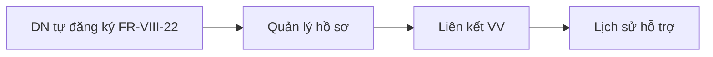
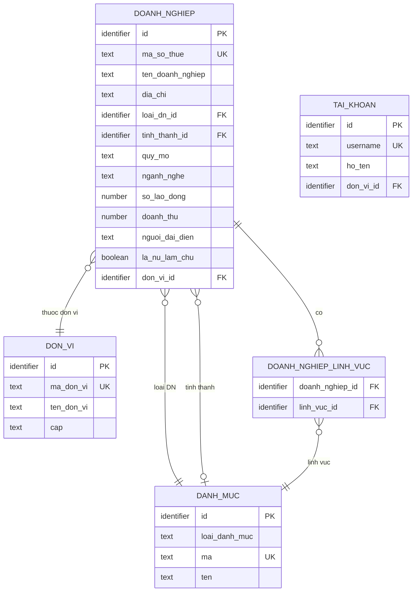

# SRS — Section 3.2.7: Quản lý DN được Hỗ trợ

**Dự án:** Phần mềm hỗ trợ pháp lý doanh nghiệp
**Phiên bản SRS:** 3.5
**Nhóm:** V.III — Quản lý DN được Hỗ trợ
**UC range:** UC 81 – UC 82 + UC phantom (FR-V.III-NEW-02 — DN tự xem/sửa hồ sơ DN của mình — BA chốt 2026-05-13) + UC 81 thao tác "Thêm" (FR-V.III-NEW-03 — CB NV thêm mới DN — STT 39 UAT 2026-05-26)
**Số FR:** 4 (FR-V.III-01 + FR-V.III-02 + FR-V.III-NEW-02 + FR-V.III-NEW-03)
**File chính:** `srs-v3.md` Section 3.2

---

## Lịch sử thay đổi

| Ngày | Tác giả | Mô tả thay đổi |
|------|---------|-----------------|
| 2026-04-03 | SRS Agent | Tạo nhóm V.III từ `srs-v3.md` theo Template v3.0 |
| 2026-05-06 | BA + SRS Agent | **Phiên bản 3.5** — Cherry-pick 10 thay đổi từ srs-v4 lượt 2026-05-06 lần 2 vào v3.5 theo `v3.5-delta-reports/v3.5-delta-fr-07.md`. Bao gồm: bỏ Import DN từ Excel (B2b — UC ngoài CSV), bỏ chế độ "Thêm mới" CMS — chuyển sang DN tự đăng ký FR-VIII-22 (B1), đồng bộ `tinh_thanh_id` FK → DANH_MUC loai='TINH_THANH' mã GSO 01-63 theo QĐ 124/2004/QĐ-TTg (B1), mô tả semantics email DN không UNIQUE + sync TK-first BR-AUTH-EMAIL-01 (B1), sửa DON_VI "3 tầng" → "2 tầng TW → {BN, ĐP} ngang cấp" (B1), thêm Mô tả + URL + Quyền truy cập SCR-01/02 (B1), đồng bộ tên trường Inputs/SCR theo Đối tượng dữ liệu DOANH_NGHIEP — 4 cặp (B1), bổ sung `tong_nguon_von` vào DOANH_NGHIEP + CHECK ≥ 0 (B1), tách Đối tượng dữ liệu DOANH_NGHIEP_LINH_VUC M-N + UI Lĩnh vực KD multi-select (B1), sync nốt vị trí thứ 4 `tinh_thanh_id` ở SCR-V.III-02 dòng 11 (B1). Quyết định CĐT/BA — BỎ chức năng Xuất Excel khỏi FR-V.III-01 (Thay đổi 5 cũ trong delta — đã OUT, không apply vào v3.5). |
| 2026-05-09 | BA + SRS Agent | Đóng câu hỏi BA mở "nguồn `LINH_VUC_KINH_DOANH`" — chốt **VSIC 2025 cấp 4 theo QĐ 36/2025/QĐ-TTg**, đồng bộ chuẩn ĐKKD NĐ 168/2025/NĐ-CP Đ.7. Bổ sung cite VSIC ở 3 vị trí: Inputs FR-V.III-01 row 17, Inputs FR-V.III-02 row 4, Đối tượng dữ liệu DOANH_NGHIEP_LINH_VUC field `linh_vuc_id`. CRUD danh mục ở FR-VIII-31 (srs-fr-10), seed 517 records (22 cấp 1 + 495 cấp 4). |

---

## Mục lục file này

- [1. Tổng quan nhóm](#1-tổng-quan-nhóm)
- [2. Yêu cầu chức năng chi tiết](#2-yêu-cầu-chức-năng-chi-tiết)
- [3. Màn hình chức năng](#3-màn-hình-chức-năng)
- [4. Entity liên quan](#4-entity-liên-quan)
- [5. State Machine liên quan](#5-state-machine-liên-quan)
- [6. Business Rules liên quan](#6-business-rules-liên-quan)

---

## 1. Tổng quan nhóm

**Mục đích:** Quản lý hồ sơ doanh nghiệp nhỏ và vừa (DNNVV) đã/đang được hỗ trợ pháp lý.

**Entity chính:** DOANH_NGHIEP, DOANH_NGHIEP_LINH_VUC, VU_VIEC (liên kết)

**Tác nhân chính:** Cán bộ Nghiệp vụ (CB NV), Cán bộ Phê duyệt (CB PD), Doanh nghiệp (chuyên trang DN — FR-V.III-NEW-02)

**Tiêu chí DNNVV (Luật DNNVV 2017, NĐ80/2021/NĐ-CP):**

| Quy mô | Lao động | Doanh thu/năm | Tổng nguồn vốn |
|--------|---------|---------------|-----------------|
| Siêu nhỏ | ≤ 10 người | ≤ 3 tỷ VND | ≤ 3 tỷ VND |
| Nhỏ | ≤ 50 người | ≤ 50 tỷ VND | ≤ 20 tỷ VND |
| Vừa | ≤ 200 người | ≤ 200 tỷ VND | ≤ 100 tỷ VND |

Tiêu chí phân loại theo ngành: Nông/Lâm/Thủy sản + Công nghiệp/Xây dựng + Thương mại/Dịch vụ (cấu hình tại UC105).

**Liên kết:** 1 DN → nhiều vụ việc. Hiển thị lịch sử hỗ trợ (danh sách VV, tổng số lần, tổng chi phí).

**Quy trình nghiệp vụ tổng quan:**

**UC Coverage:**

| UC | Tên | FR-ID | Priority |
|----|-----|-------|----------|
| UC81 | Quản lý DN được HTPL | FR-V.III-01 | Essential |
| UC82 | Tìm kiếm DN | FR-V.III-02 | Essential |
| — (phantom) | DN xem/cập nhật hồ sơ DN của chính mình | FR-V.III-NEW-02 | Essential |

---

## 2. Yêu cầu chức năng chi tiết

---

### FR-V.III-01: Quản lý Doanh nghiệp được HTPL (UC81)

**UC Reference:** UC 81
**Source:** NĐ55/2019, Luật DNNVV 2017
**Priority:** Essential
**Stability:** High
**Màn hình:** SCR-V.III-01 — [Danh sách Doanh nghiệp](#scr-v-iii-01-danh-sách-doanh-nghiệp), SCR-V.III-02 — [Chi tiết / Chỉnh sửa Doanh nghiệp](#scr-v-iii-02-chi-tiết--chỉnh-sửa-doanh-nghiệp)

**Mô tả:**
Quản lý hồ sơ doanh nghiệp nhỏ và vừa đã/đang được hỗ trợ pháp lý. Hỗ trợ **Thêm mới (FR-V.III-NEW-03)** / Xem / Tìm / Cập nhật / Xóa mềm + xem lịch sử hỗ trợ + xuất Excel. **Sửa theo STT 39 UAT 2026-05-26:** đã bổ sung chức năng "Thêm mới DN" cho CB NV (FR-V.III-NEW-03 + SCR-V.III-03 — đảm bảo CSV UC 81 có thao tác "Thêm" mà SRS v3.5 cũ ghi nhầm là không có). DN có thể đến hệ thống qua 5 kênh: (1) DN tự đăng ký FR-VIII-22; (2) CB NV bấm "Thêm mới" tại SCR-V.III-01 → SCR-V.III-03 (FR-V.III-NEW-03); (3) Modal tạo DN khi nhập vụ việc thủ công (FR-V.I-04); (4) API LGSP từ DVC chi trả (FR-VI-01); (5) Cổng PLQG đẩy sang (FR-XII outbound).

**Tác nhân:** Cán bộ Nghiệp vụ (TW/BN/ĐP)

**Preconditions (Điều kiện tiên quyết):**

- User đã đăng nhập (BR-AUTH-01)
- User có quyền "Quản lý DN" (UC115)
- Phân quyền theo đơn vị áp dụng

**Inputs (Dữ liệu đầu vào):**

| # | Tên field | Kiểu logic | Bắt buộc | Ràng buộc | Mặc định | Nguồn |
|---|----------|-----------|----------|-----------|----------|-------|
| 1 | ma_doanh_nghiep | text | Y (auto) | Auto-gen: DN-{TINH}-{SEQ} | — | Hệ thống |
| 2 | ten_doanh_nghiep | text | Y | Không rỗng (định danh DN) | — | Người dùng |
| 3 | ma_so_thue | text | Y | Unique toàn hệ thống (định danh DN) | — | Người dùng |
| 4 | giay_cn_dkkd | text | N | — | — | Người dùng |
| 5 | dia_chi | text | **N** | **Sửa theo BA chốt 2026-05-30:** Tùy chọn cho 5 kênh không tạo TK (CB NV / API). Bắt buộc khi DN tự đăng ký qua FR-VIII-22 — quy định tại srs-fr-10. | — | Người dùng |
| 6 | tinh_thanh_id | identifier | **N** | FK → DANH_MUC (loai='TINH_THANH'). **Sửa theo BA chốt 2026-05-30:** Tùy chọn — nếu thiếu, hệ thống tự suy diễn theo đơn vị CB NV đăng nhập (BR-AUTH-08) hoặc 2 chữ số đầu MST cho kênh API. Bắt buộc khi DN tự đăng ký (FR-VIII-22). | — | Người dùng |
| 7 | loai_dn_id | identifier | **N** | FK → DANH_MUC (UC105). **Tùy chọn** cho 5 kênh CB NV/API; bắt buộc khi DN tự đăng ký. | — | Người dùng |
| 8 | quy_mo | text | **N** | SIEU_NHO / NHO / VUA. **Tùy chọn** — nếu trống, BR-CALC-07 trả `uu_tien = 1` (FIFO) không chặn. Bắt buộc khi DN tự đăng ký. | — | Người dùng |
| 9 | nganh_nghe | text | **N** | NONG_LAM / CONG_NGHIEP / THUONG_MAI. **Tùy chọn** cho 5 kênh; bắt buộc khi DN tự đăng ký. | — | Người dùng |
| 10 | so_lao_dong | number | N | ≥ 0 | — | Người dùng |
| 11 | doanh_thu_nam | number | N | ≥ 0 | — | Người dùng |
| 12 | tong_nguon_von | number | N | ≥ 0 | — | Người dùng |
| 13 | nguoi_dai_dien | text | **N** | **Tùy chọn** cho 5 kênh; bắt buộc khi DN tự đăng ký. | — | Người dùng |
| 14 | chuc_vu_dai_dien | text | N | — | — | Người dùng |
| 15 | email | text | N | Format email hợp lệ | — | Người dùng |
| 16 | dien_thoai | text | N | — | — | Người dùng |
| 17 | linh_vuc_ids | structured | N | Multi-select FK → DANH_MUC (loai='LINH_VUC_KINH_DOANH', mã VSIC cấp 4 theo QĐ 36/2025/QĐ-TTg, quản lý ở FR-VIII-31); lưu thành DOANH_NGHIEP_LINH_VUC (M-N) | — | Người dùng |
| 18 | ghi_chu | text (long) | N | — | — | Người dùng |
| 19 | file_dinh_kem | structured | N | Upload nhiều file | — | Người dùng |

**Processing (Xử lý):**

**Xem danh sách:**

| Bước | Mô tả xử lý | BR áp dụng |
|------|-------------|-----------|
| 1 | Kiểm tra quyền và phân quyền theo đơn vị | BR-AUTH-01, BR-AUTH-08 |
| 2 | Lấy danh sách DOANH_NGHIEP chưa bị xóa, trong phạm vi đơn vị người dùng | BR-DATA-02 |
| 3 | Kết hợp thông tin VU_VIEC để hiển thị tổng số lần hỗ trợ | — |
| 4 | Phân trang (mặc định 20 bản ghi/trang) | BR-DATA-07 |

**Chỉnh sửa:**

| Bước | Mô tả xử lý | BR áp dụng |
|------|-------------|-----------|
| 1 | Xác nhận dữ liệu đầu vào | — |
| 2 | Cập nhật DOANH_NGHIEP | — |
| 3 | Ghi nhật ký thao tác (giá trị cũ → giá trị mới) | BR-DATA-05 |

**Xóa (xóa mềm):**

| Bước | Mô tả xử lý | BR áp dụng |
|------|-------------|-----------|
| 1 | Kiểm tra DN không có vụ việc đang xử lý | — |
| 2 | Đánh dấu xóa mềm bản ghi | BR-DATA-01 |
| 3 | Ghi nhật ký thao tác | BR-DATA-05 |

**Xem lịch sử hỗ trợ:**

| Bước | Mô tả xử lý | BR áp dụng |
|------|-------------|-----------|
| 1 | Lấy danh sách VU_VIEC thuộc DN | — |
| 2 | Tính tổng: tổng vụ việc, tổng chi phí, số VV hoàn thành | — |
| 3 | Hiển thị danh sách VV kèm thống kê | — |

**Business Rules áp dụng:**
- **BR-AUTH-01**: Kiểm tra quyền truy cập
- **BR-AUTH-08**: Phân quyền theo đơn vị
- **BR-DATA-01**: Xóa mềm (is_deleted)
- **BR-DATA-04**: Tự động sinh mã
- **BR-DATA-05**: Ghi nhật ký thao tác
- **BR-CALC-05**: Kiểm tra quy mô DNNVV theo NĐ80/2021

**Outputs (Dữ liệu đầu ra):**

| # | Tên | Kiểu logic | Điều kiện | Format |
|---|-----|-----------|-----------|--------|
| 1 | id | identifier | Luôn có | — |
| 2 | ma_doanh_nghiep | text | Luôn có | DN-{TINH}-{SEQ} |
| 3 | ten_doanh_nghiep | text | Luôn có | — |
| 4 | ma_so_thue | text | Luôn có | — |
| 5 | quy_mo | text | **Có thể trống** (BA chốt 2026-05-30 — kênh CB NV/API không bắt buộc) | Siêu nhỏ/Nhỏ/Vừa hoặc "—" nếu chưa có |
| 6 | dia_chi | text | **Có thể trống** (kênh CB NV/API không bắt buộc) | — |
| 7 | so_lan_ho_tro | number | Luôn có | — |
| 8 | tong_chi_phi | money | Luôn có | VND, dấu chấm phân cách |
| 9 | total_count | number | Luôn có | — |

**Postconditions (Trạng thái sau thực hiện):**

- Bản ghi DOANH_NGHIEP được tạo/cập nhật/xóa mềm
- Nhật ký thao tác ghi nhận
- Liên kết DN ↔ VU_VIEC bảo toàn

**Error Handling (Xử lý lỗi):**

| # | Điều kiện lỗi | Mã lỗi | Phản hồi hệ thống | Severity |
|---|--------------|--------|-------------------|----------|
| E1 | Tên DN trống | ERR-DN-01 | "Tên doanh nghiệp là bắt buộc" | ERROR |
| E2 | MST trùng (CB NV bấm "Thêm mới" hoặc cập nhật MST) | ERR-DN-DUPLICATE | Modal block: "Doanh nghiệp có mã số thuế '{ma_so_thue}' đã tồn tại trong hệ thống: {ten_dn_hien_co}. Bạn muốn mở chi tiết DN hiện có?" + 2 nút **"Mở chi tiết"** (chuyển SCR-V.III-02) / **"Hủy"**. **Sửa theo STT 39 UAT 2026-05-26 — thay `ERR-DN-02` cũ thành modal hành động.** | ERROR |
| E3 | Quy mô không phù hợp | WRN-DN-01 | "Quy mô {X} không khớp với số liệu lao động/doanh thu. Vẫn lưu?" | WARNING |
| E4 | Xóa DN có VV đang xử lý | ERR-DN-03 | "Không thể xóa DN đang có vụ việc xử lý" | ERROR |

**Acceptance Criteria:**

- **Given** CB NV truy cập "Quản lý DN" **When** hệ thống hiển thị **Then** danh sách DN thuộc đơn vị, phân trang
- **Given** CB NV chỉnh sửa DN **When** nhập đủ trường bắt buộc **Then** kiểm tra quy mô DNNVV + lưu
- **Given** CB NV xem chi tiết DN **When** chọn DN **Then** hiển thị hồ sơ + lịch sử hỗ trợ (danh sách VV, tổng số lần, tổng chi phí)
- **Given** CB NV chỉnh sửa MST trùng DN khác **When** lưu **Then** hệ thống báo lỗi

---

### FR-V.III-02: Tìm kiếm DN (UC82)

**UC Reference:** UC 82
**Source:** NĐ55/2019
**Priority:** Essential
**Stability:** High
**Màn hình:** SCR-V.III-01 — [Danh sách Doanh nghiệp](#scr-v-iii-01-danh-sách-doanh-nghiệp)

**Mô tả:**
Tìm kiếm doanh nghiệp theo nhiều tiêu chí: từ khóa (tên/MST), quy mô, tỉnh thành, lĩnh vực KD, thời gian hỗ trợ.

**Tác nhân:** Cán bộ Nghiệp vụ / Cán bộ Phê duyệt (TW/BN/ĐP)

**Preconditions (Điều kiện tiên quyết):**

- User đã đăng nhập

**Inputs (Dữ liệu đầu vào):**

| # | Tên field | Kiểu logic | Bắt buộc | Ràng buộc | Mặc định | Nguồn |
|---|----------|-----------|----------|-----------|----------|-------|
| 1 | tu_khoa | text | N | Tìm theo tên/MST | — | Người dùng |
| 2 | quy_mo | text | N | SIEU_NHO / NHO / VUA | — | Người dùng |
| 3 | tinh_thanh_id | identifier | N | FK → DANH_MUC (loai='TINH_THANH', mã GSO 01-63) | — | Người dùng |
| 4 | linh_vuc_ids | structured | N | Multi-select FK → DANH_MUC (loai='LINH_VUC_KINH_DOANH', mã VSIC cấp 4 theo QĐ 36/2025/QĐ-TTg, quản lý ở FR-VIII-31) | — | Người dùng |
| 5 | tu_ngay | date | N | Thời gian hỗ trợ từ | — | Người dùng |
| 6 | den_ngay | date | N | Thời gian hỗ trợ đến | — | Người dùng |

**Processing (Xử lý):**

| Bước | Mô tả xử lý | BR áp dụng |
|------|-------------|-----------|
| 1 | Kiểm tra quyền và phân quyền theo đơn vị | BR-AUTH-01, BR-AUTH-08 |
| 2 | Kết hợp tất cả điều kiện lọc có giá trị (AND) | — |
| 3 | Tìm từ khóa trên tên doanh nghiệp và mã số thuế | — |
| 4 | Phân trang (mặc định 20 bản ghi/trang) | BR-DATA-07 |

**Outputs (Dữ liệu đầu ra):**

| # | Tên | Kiểu logic | Điều kiện | Format |
|---|-----|-----------|-----------|--------|
| 1 | id | identifier | Luôn có | — |
| 2 | ma_doanh_nghiep | text | Luôn có | DN-{TINH}-{SEQ} |
| 3 | ten_doanh_nghiep | text | Luôn có | — |
| 4 | ma_so_thue | text | Luôn có | — |
| 5 | quy_mo | text | Luôn có | Siêu nhỏ/Nhỏ/Vừa |
| 6 | dia_chi | text | Luôn có | — |
| 7 | so_lan_ho_tro | number | Luôn có | — |
| 8 | tong_chi_phi | money | Luôn có | VND |
| 9 | total_count | number | Luôn có | — |

**Postconditions (Trạng thái sau thực hiện):**

- Không thay đổi dữ liệu (read-only)

**Error Handling (Xử lý lỗi):**

| # | Điều kiện lỗi | Mã lỗi | Phản hồi hệ thống | Severity |
|---|--------------|--------|-------------------|----------|
| E1 | Không có kết quả | INF-DN-TK-01 | "Không tìm thấy doanh nghiệp phù hợp" | INFO |

**Acceptance Criteria:**

- **Given** CB NV nhập từ khóa **When** tìm kiếm **Then** hiển thị DN phù hợp (tên, MST), phân trang
- **Given** CB NV lọc theo lĩnh vực KD **When** chọn **Then** hiển thị DN thuộc lĩnh vực
- **Given** CB NV lọc theo thời gian hỗ trợ **When** chọn khoảng ngày **Then** hiển thị DN được hỗ trợ trong khoảng
- **Given** CB NV kết hợp nhiều điều kiện **When** tìm kiếm **Then** áp dụng AND

---

### FR-V.III-NEW-03: CB NV thêm mới Doanh nghiệp (UC81 thao tác "Thêm") `[STT 39 UAT 2026-05-26 — mới]`

**UC Reference:** UC 81 (thao tác "Thêm") | **Priority:** Essential | **Stability:** High
**Màn hình:** SCR-V.III-03 — Form Thêm mới Doanh nghiệp (cho CB NV)
**Source:** STT 39 UAT 2026-05-26

**Mô tả:** CB Nghiệp vụ chủ động tạo hồ sơ DN trong các tình huống nghiệp vụ (vd: DN đến trực tiếp nộp Mẫu 01, DN gọi điện thoại, hoặc CB cần tạo trước để chuẩn bị xử lý vụ việc). Form 18 trường (entity DOANH_NGHIEP), **bắt buộc TỐI THIỂU 2 trường định danh**: `ma_so_thue` (10 chữ số TT 105/2020/TT-BTC) + `ten_doanh_nghiep`. **`tinh_thanh_id` tự suy diễn** theo đơn vị CB NV đăng nhập (BR-AUTH-08). 15 trường còn lại tùy chọn — CB NV bổ sung dần khi xử lý nghiệp vụ. **Sửa theo BA chốt 2026-05-30:** FR này CHỈ tạo `DOANH_NGHIEP`, **KHÔNG tạo `TAI_KHOAN`** và không gửi mail kích hoạt. Khi DN muốn theo dõi hồ sơ của mình, DN tự đăng ký TK qua **FR-VIII-22** với MST + dùng **FR-VIII-26 (Quên mật khẩu) làm Claim Flow** khi MST đã tồn tại. Lý do bắt buộc tối thiểu 2 trường: theo CSV UC 120 DN không tương tác phần mềm tại kênh này; không cần email/mật khẩu/đầy đủ hồ sơ để tạo DN — chỉ cần định danh đủ để CB NV làm việc.

**Tác nhân:** Cán bộ Nghiệp vụ (TW/BN/ĐP)

**Preconditions:**
- User đã đăng nhập, có quyền "Quản lý DN" (UC115)
- MST 10 chữ số định dạng hợp lệ (TT 105/2020/TT-BTC Điều 5)

**Inputs:** 18 trường DN như bảng FR-V.III-01 (mục 95–117) — **bắt buộc TỐI THIỂU 2 trường định danh**: `ma_so_thue` + `ten_doanh_nghiep`. **`tinh_thanh_id`**: hệ thống tự suy diễn (default theo đơn vị CB NV đăng nhập); nếu CB NV biết DN ở tỉnh khác thì chọn lại. 15 trường còn lại tùy chọn (CB NV nhập khi có thông tin): `email`, `dia_chi`, `loai_dn_id`, `quy_mo`, `nganh_nghe`, `nguoi_dai_dien`, `so_dien_thoai`, `giay_cn_dkkd`, `chuc_vu_dai_dien`, `so_lao_dong`, `doanh_thu_nam`, `tong_nguon_von`, `linh_vuc_ids`, `ghi_chu`, `file_dinh_kem`.

**Processing:**

| Bước | Mô tả xử lý | BR áp dụng |
|------|-------------|-----------|
| 1 | Kiểm tra quyền | BR-AUTH-01 |
| 2 | Validate 2 trường bắt buộc (`ma_so_thue` + `ten_doanh_nghiep`) + định dạng MST (10 chữ số TT 105/2020). Nếu `tinh_thanh_id` chưa nhập → set default = `tinh_thanh_id` của đơn vị CB NV đăng nhập | — |
| 3 | Lookup MST trong DOANH_NGHIEP. Nếu **đã tồn tại** → trả modal `ERR-DN-DUPLICATE` với nút "Mở chi tiết DN hiện có" (chuyển SCR-V.III-02) / "Hủy". KHÔNG tạo trùng. | — |
| 4 | Tự động sinh `ma_doanh_nghiep`: DN-{TINH}-{SEQ} | BR-DATA-04 |
| 5 | Auto-calc `quy_mo` theo BR-CALC-05 (nếu CB NV không nhập + có đủ 3 trường `so_lao_dong`, `doanh_thu_nam`, `tong_nguon_von`); CB NV có thể override | BR-CALC-05 |
| 6 | Tạo bản ghi `DOANH_NGHIEP`, `is_deleted = false`, `created_by = user.id` | — |
| 7 | ~~Tạo TAI_KHOAN cho DN~~ — **BỎ theo BA chốt 2026-05-30** (override quyết định 2026-05-10). FR này chỉ tạo `DOANH_NGHIEP`, không tạo TK. Khi DN muốn theo dõi hồ sơ → DN tự đăng ký TK qua FR-VIII-22 + dùng FR-VIII-26 (Quên mật khẩu) làm Claim Flow nếu MST đã tồn tại. | — |
| 8 | ~~Gửi mail kích hoạt~~ — **BỎ theo BA chốt 2026-05-30**. Không gửi mail bất ngờ tới DN. | — |
| 9 | Ghi nhật ký thao tác (audit log: hành động = 'CREATE_DN'). **Sửa theo BA chốt 2026-05-30:** không còn ghi "thông tin TK tạo kèm" vì FR này không tạo TK. | BR-DATA-05 |

**Outputs:**

| # | Tên | Kiểu logic | Mô tả |
|---|-----|-----------|-------|
| 1 | doanh_nghiep_id | identifier | ID DN mới |
| 2 | ma_doanh_nghiep | text | Mã DN sinh tự động |
| 3 | ~~tai_khoan_id~~ | — | **BỎ theo BA chốt 2026-05-30** — FR này không tạo TK |
| 4 | ~~da_gui_mail_kich_hoat~~ | — | **BỎ theo BA chốt 2026-05-30** — FR này không gửi mail |

**Postconditions:** DN được tạo. CB NV được redirect về SCR-V.III-01 (theo Phụ lục E §H7). **Không tạo TK, không gửi mail** (override 2026-05-30 theo CSV UC 120).

**Error Handling:**

| # | Điều kiện | Mã lỗi | Phản hồi |
|---|-----------|--------|----------|
| E1 | Thiếu trường bắt buộc | ERR-DN-01..N | Highlight ô thiếu + inline message |
| E2 | MST sai định dạng (≠10 chữ số) | ERR-DN-MST-FORMAT | "Mã số thuế phải gồm 10 chữ số theo Thông tư 105/2020/TT-BTC" |
| E3 | MST đã tồn tại | ERR-DN-DUPLICATE | Modal block với 2 nút "Mở chi tiết" / "Hủy" (xem FR-V.III-01 Error Handling) |
| ~~E4~~ | ~~Email DN trùng TAI_KHOAN.email~~ | ~~ERR-DN-EMAIL-DUP~~ | **BỎ theo BA chốt 2026-05-30** — FR không tạo TK nên không cần check trùng email TK. `DOANH_NGHIEP.email` là email liên hệ DN, có thể dùng chung giữa nhiều DN (vd: email kế toán dịch vụ chung). |
| ~~E5~~ | ~~Gửi mail kích hoạt thất bại~~ | ~~WRN-DN-MAIL-FAIL~~ | **BỎ theo BA chốt 2026-05-30** — FR không gửi mail kích hoạt nữa |

**Acceptance Criteria:**
- **Given** CB NV ở SCR-V.III-01 **When** bấm nút "Thêm mới" **Then** mở SCR-V.III-03
- **Given** CB NV nhập đủ 2 trường bắt buộc tối thiểu (`ma_so_thue` + `ten_doanh_nghiep`) + MST chưa tồn tại **When** lưu **Then** tạo DOANH_NGHIEP (không tạo TK, không gửi mail) + về danh sách
- **Given** CB NV nhập MST đã tồn tại **When** lưu **Then** modal ERR-DN-DUPLICATE
- **Given** Bấm "Mở chi tiết" trong modal trùng MST **When** xác nhận **Then** chuyển SCR-V.III-02 của DN hiện có
- **(BA chốt 2026-05-30 — FR không gửi mail nữa)** **Given** CB NV nhập email DN tùy chọn vào form **When** lưu DN **Then** Email lưu vào `DOANH_NGHIEP.email` để CB NV liên hệ + làm điểm xác minh khi DN sau này tự đăng ký TK qua FR-VIII-22 + Claim Flow FR-VIII-26. KHÔNG gửi mail kích hoạt.

**Cross-ref:** FR-VIII-22 (pattern schema 9 trường + Claim Flow khi DN tự đăng ký với MST đã tồn tại), FR-VIII-26 (Quên mật khẩu — fallback CB NV verify thủ công khi email không khớp), BR-AUTH-USERNAME-01, BR-CALC-05.

---

### FR-V.III-NEW-02: DN xem/cập nhật hồ sơ doanh nghiệp của mình `[v3.5 — BA chốt 2026-05-13, gap SRS]`

**UC Reference:** — (phantom FR, gap SRS phát hiện từ báo cáo review HDSD vs SRS §6.4 #1)
**Source:** BA chốt 2026-05-13
**Priority:** Essential
**Stability:** High
**Màn hình:** SCR-V.III-04 — [Hồ sơ doanh nghiệp của tôi (chuyên trang DN)](#scr-v-iii-04-hồ-sơ-doanh-nghiệp-của-tôi-chuyên-trang-dn)

> **Lưu ý đặt tên:** Tên `FR-V.III-NEW-01` đã từng dùng cho chức năng "Import DN từ Excel" (v3) — đã xoá khỏi v3.5 (CHANGELOG-v3-to-v3.5.md mục 1). Tên `SCR-V.III-03` từng dùng cho Wizard Import. FR/SCR mới dùng `NEW-02` và `-04` để tránh nhầm với history.

**Mô tả:**
Doanh nghiệp tự xem + cập nhật hồ sơ doanh nghiệp của chính mình qua chuyên trang sau khi đăng nhập VNeID Tier 2.

- **Trường định danh (chỉ đọc):** ma_doanh_nghiep, ten_doanh_nghiep, ma_so_thue, giay_cn_dkkd, ngay_cap_dkkd, loai_dn_id, nganh_nghe, tinh_thanh_id — phải đề nghị CB NV sửa qua kênh chính thức (NĐ 168/2025 Đ.7).
- **Trường DN tự cập nhật:** dia_chi, dien_thoai, email, fax, nguoi_dai_dien, chuc_vu_dai_dien, la_nu_lam_chu, so_lao_dong, so_lao_dong_nu, so_lao_dong_khuyet_tat, doanh_thu_nam, tong_nguon_von, linh_vuc_ids (multi-select VSIC cấp 4), ghi_chu.
- **Trường auto-calc:** quy_mo (auto-tính theo BR-CALC-05 NĐ 80/2021 từ so_lao_dong + doanh_thu_nam + tong_nguon_von; DN không sửa trực tiếp). **Persist:** giá trị quy_mo (SIEU_NHO/NHO/VUA) ánh xạ về `DOANH_NGHIEP.loai_dn_id` FK lookup tới DANH_MUC (`loai_danh_muc='LOAI_DOANH_NGHIEP'` theo UC105, AND `ma=<quy_mo>`) — entity DOANH_NGHIEP §3.4.3.3 lưu cột `loai_dn_id` chứ không có cột `quy_mo` riêng; trường `quy_mo` ở Inputs/Outputs là alias UI giữ nhất quán với FR-V.III-01.

**Tác nhân:** Doanh nghiệp (đăng nhập VNeID Tier 2)

**Preconditions (Điều kiện tiên quyết):**

- User đã đăng nhập VNeID Tier 2 (BR-AUTH-01 + FR-VIII-23 + FR-VIII-25)
- User là loại Doanh nghiệp (BR-AUTH-USERNAME-01: username DN = MST)
- Tồn tại bản ghi `DOANH_NGHIEP` có `ma_so_thue` khớp username của user

**Inputs — Cập nhật hồ sơ:**

| # | Tên field | Kiểu logic | Bắt buộc | Ràng buộc | Nguồn |
|---|----------|-----------|----------|-----------|-------|
| 1 | dia_chi | text | Y | Không rỗng | DN nhập |
| 2 | dien_thoai | text | N | — | DN nhập |
| 3 | email | text | N | Format email hợp lệ; không cần OTP đổi (BR-AUTH-EMAIL-01) | DN nhập |
| 4 | fax | text | N | — | DN nhập |
| 5 | nguoi_dai_dien | text | Y | Không rỗng | DN nhập |
| 6 | chuc_vu_dai_dien | text | N | — | DN nhập |
| 7 | la_nu_lam_chu | boolean | N | — | DN chọn |
| 8 | so_lao_dong | number | N | ≥ 0 | DN nhập |
| 9 | so_lao_dong_nu | number | N | ≥ 0; ≤ so_lao_dong | DN nhập |
| 10 | so_lao_dong_khuyet_tat | number | N | ≥ 0; ≤ so_lao_dong | DN nhập |
| 11 | doanh_thu_nam | number | N | ≥ 0 | DN nhập |
| 12 | tong_nguon_von | number | N | ≥ 0 | DN nhập |
| 13 | linh_vuc_ids | structured | N | Multi-select VSIC cấp 4 | DN chọn |
| 14 | ghi_chu | text (long) | N | — | DN nhập |

**Processing:**

| Bước | Mô tả xử lý | BR áp dụng |
|------|-------------|-----------|
| 1 | Kiểm tra quyền DN + Tier 2 + xác định bản ghi DOANH_NGHIEP của user (qua MST) | BR-AUTH-01, BR-AUTH-USERNAME-01 |
| 2 | Validate trường DN edit; chặn payload chứa trường định danh | — |
| 3 | Auto-tính `quy_mo` theo BR-CALC-05 (NĐ 80/2021 Đ.5). Nếu 2 tiêu chí cho mức khác nhau → lấy mức cao hơn | BR-CALC-05 |
| 4 | Cập nhật DOANH_NGHIEP + đồng bộ DOANH_NGHIEP_LINH_VUC | BR-DATA-02 |
| 5 | Ghi nhật ký thao tác | BR-DATA-05 |
| 6 | Nếu `quy_mo` thay đổi: gửi thông báo CB NV phụ trách đơn vị | BR-NOTIF-01 |

**Error Handling:**

| # | Điều kiện lỗi | Mã lỗi | Phản hồi hệ thống | Severity |
|---|--------------|--------|-------------------|----------|
| E1 | Không tìm thấy DOANH_NGHIEP khớp MST | ERR-DN-OWN-01 | "Không tìm thấy hồ sơ doanh nghiệp gắn với tài khoản này. Vui lòng liên hệ quản trị viên." | ERROR |
| E2 | Payload chứa thay đổi trường định danh | ERR-DN-OWN-02 | "Các trường định danh phải đề nghị cán bộ nghiệp vụ sửa qua kênh chính thức." | ERROR |
| E3 | so_lao_dong_nu/khuyet_tat > so_lao_dong | ERR-DN-OWN-03 | "Số lao động nữ/khuyết tật không được vượt số lao động tổng." | ERROR |
| E4 | DN cố truy cập hồ sơ DN khác | ERR-AUTH-FORBIDDEN | "Bạn không có quyền truy cập hồ sơ doanh nghiệp này." | ERROR |

**Acceptance Criteria:**

- **Given** DN đăng nhập VNeID Tier 2 **When** mở "Hồ sơ DN của tôi" **Then** hiển thị 5 tab (Thông tin / Hồ sơ pháp lý / Lịch sử hỗ trợ / Hồ sơ chi trả / Đăng ký đào tạo của tôi — tab cuối render FR-III-NEW-04) với dữ liệu của DN mình
- **Given** DN sửa địa chỉ + số lao động + doanh thu **When** lưu **Then** record cập nhật, `quy_mo` auto-tính, audit log ghi nhận, CB NV phụ trách nhận thông báo nếu `quy_mo` đổi
- **Given** DN cố sửa MST hoặc tên DN qua form **When** gửi **Then** ERR-DN-OWN-02
- **Given** DN A đăng nhập **When** gọi API sửa DN B **Then** ERR-AUTH-FORBIDDEN

**Cross-ref:** Entity DOANH_NGHIEP, DOANH_NGHIEP_LINH_VUC, BR-CALC-05, BR-AUTH-USERNAME-01, BR-AUTH-EMAIL-01, BR-NOTIF-01; SCR-V.III-04.

---

## 3. Màn hình chức năng

### SCR-V.III-01: Danh sách Doanh nghiệp

**Loại màn hình:** Danh sách
**FR sử dụng:** FR-V.III-01, FR-V.III-02
**Mô tả:** Hiển thị danh sách doanh nghiệp được hỗ trợ pháp lý; hỗ trợ tìm kiếm/lọc đa tiêu chí (từ khóa, quy mô, tỉnh/thành, lĩnh vực, khoảng thời gian hỗ trợ). **Sửa theo BA chốt 2026-05-30:** màn hình hỗ trợ thao tác **Thêm mới DN** (FR-V.III-NEW-03 + SCR-V.III-03) + Xem / Tìm / Sửa / Xóa. DN có thể đến hệ thống qua 5 kênh (xem mô tả FR-V.III-01): CB NV bấm "Thêm mới"; Modal tạo DN khi nhập VV; API LGSP từ DVC; Cổng PLQG; DN tự đăng ký FR-VIII-22.
**URL:** `/doanh-nghiep/danh-sach`
**Quyền truy cập:** Cán bộ nghiệp vụ và cán bộ phê duyệt (TW / Bộ ngành / Địa phương). Phạm vi dữ liệu theo BR-AUTH-08 (TW xem toàn quốc; BN/ĐP xem theo `tinh_thanh_id` thuộc đơn vị).

#### Thành phần màn hình

| # | Vùng | Thành phần | Loại | Dữ liệu / Nội dung | Hành vi | Điều kiện hiển thị |
|---|------|-----------|------|--------------------| --------|-------------------|
| 1 | breadcrumb | Breadcrumb | breadcrumb | "Trang chủ > Doanh nghiệp > Danh sách" | navigate | Luôn hiển thị |
| 2 | toolbar | Tiêu đề trang | label | "Quản lý Doanh nghiệp" | — | Luôn hiển thị |
| 3 | toolbar | Nút Thêm mới | button (primary) | "Thêm mới" | click → SCR-V.III-03 (form thêm DN). **Sửa theo BA chốt 2026-05-30** — bổ sung theo CSV UC 81 + FR-V.III-NEW-03. | Luôn hiển thị |
| 5 | toolbar | Nút Xuất Excel | button | "Xuất Excel" | click → export danh sách | Luôn hiển thị |
| 6 | toolbar | Nút Làm mới | button | "Làm mới" | click → reload danh sách | Luôn hiển thị |
| 7 | filter-bar | Từ khóa | search-box | Tìm theo tên DN / MST | change → filter | Luôn hiển thị |
| 8 | filter-bar | Quy mô | select | SIEU_NHO / NHO / VUA | change → filter | Luôn hiển thị |
| 9 | filter-bar | Tỉnh thành | select | Danh mục tỉnh/TP | change → filter | Luôn hiển thị |
| 10 | filter-bar | Lĩnh vực KD | multi-select có search | `linh_vuc_ids` — chọn 1 hoặc nhiều ngành VSIC cấp 4 (FK → DANH_MUC `loai='LINH_VUC_KINH_DOANH'`, quản lý ở FR-VIII-31). Dropdown chỉ cho chọn bản ghi cấp 4 đang `KICH_HOAT`; bản ghi cấp 1 A–V chỉ dùng làm group header, không chọn được. Option cấp 4 hiển thị dạng "mã cấp 4 — tên cấp 4"; header cấp 1 hiển thị dạng "mã cấp 1 — tên cấp 1" theo `danh_muc_cha_id`. Search không phân biệt hoa/thường, hỗ trợ có dấu/không dấu, match theo mã/tên cấp 4 và mã/tên cấp 1 cha; nếu query match cấp 1 cha thì hiển thị toàn bộ cấp 4 con đang `KICH_HOAT` thuộc nhóm đó | change → filter | Luôn hiển thị |
| 11 | filter-bar | Từ ngày | date-picker | Thời gian hỗ trợ từ | change → filter | Luôn hiển thị |
| 12 | filter-bar | Đến ngày | date-picker | Thời gian hỗ trợ đến | change → filter | Luôn hiển thị |
| 13 | filter-bar | Nút Tìm kiếm | button | "Tìm kiếm" | click → query | Luôn hiển thị |
| 14 | filter-bar | Nút Xóa bộ lọc | button | "Xóa bộ lọc" | click → reset filters | Luôn hiển thị |
| 15 | table | Checkbox | checkbox | Chọn dòng | click → select | Luôn hiển thị |
| 16 | table | Mã DN | table-column | DN-{TINH}-{SEQ} | click → SCR-V.III-02 (chi tiết) | Luôn hiển thị |
| 17 | table | Tên DN | table-column | ten_doanh_nghiep | — | Luôn hiển thị |
| 18 | table | MST | table-column | ma_so_thue | — | Luôn hiển thị |
| 19 | table | Quy mô | badge | SIEU_NHO / NHO / VUA | — | Luôn hiển thị |
| 20 | table | Địa chỉ | table-column | dia_chi (cắt 30 ký tự) | — | Luôn hiển thị |
| 21 | table | Số lần hỗ trợ | table-column | Đếm số vụ việc của DN | — | Luôn hiển thị |
| 22 | table | Tổng chi phí | table-column | SUM chi phí (VND) | — | Luôn hiển thị |
| 23 | table | Hành động | icon | Xem / Sửa / Xóa | click → tương ứng | Luôn hiển thị |
| 24 | pagination | Phân trang | pagination | 20 mục/trang | click → chuyển trang | Luôn hiển thị |

#### Quy tắc tương tác

- Sắp xếp mặc định: ngày cập nhật mới nhất trước
- Xóa mềm: chỉ khi DN không có VV đang xử lý
- Quy mô auto-suggest khi nhập số lao động và doanh thu

---

### SCR-V.III-02: Chi tiết / Chỉnh sửa Doanh nghiệp

**Loại màn hình:** Chi tiết (4 tab) / Chỉnh sửa
**FR sử dụng:** FR-V.III-01
**Mô tả:** Xem/chỉnh sửa chi tiết doanh nghiệp với 4 tab — Thông tin cơ bản (28 trường + auto-suggest quy mô NĐ80/2021), Hồ sơ pháp lý DN (CRUD entity HO_SO_PHAP_LY_DN, 5 loại × 3 trạng thái), Lịch sử Hỗ trợ (3 KPI + danh sách vụ việc liên kết), Hồ sơ Chi trả (danh sách hồ sơ chi trả liên kết). **Sửa theo BA chốt 2026-05-30:** Tạo mới DN dùng SCR-V.III-03 riêng (FR-V.III-NEW-03), mở từ nút "Thêm mới" ở SCR-V.III-01.
**URL:** `/doanh-nghiep/:id` (xem chi tiết) HOẶC `/doanh-nghiep/:id/sua` (chỉnh sửa).
**Quyền truy cập:** Cán bộ nghiệp vụ (TW / Bộ ngành / Địa phương) có quyền CRUD doanh nghiệp. Phạm vi dữ liệu theo BR-AUTH-08; BN/ĐP chỉ thao tác DN thuộc `tinh_thanh_id` của đơn vị mình.

#### Thành phần màn hình

| # | Vùng | Thành phần | Loại | Dữ liệu / Nội dung | Hành vi | Điều kiện hiển thị |
|---|------|-----------|------|--------------------| --------|-------------------|
| 1 | tab | Tab Thông tin cơ bản | tab | Form thông tin DN | — | Luôn hiển thị |
| 2 | tab | Tab Hồ sơ PL doanh nghiệp (MỚI v2.1) | tab | CRUD hồ sơ pháp lý DN: GIAY_PHEP / HOP_DONG / GIAY_CN / QUYET_DINH / KHAC. Trạng thái: HIEU_LUC / HET_HAN / THU_HOI. Gộp từ MH-12.3 (Tư vấn CS) | — | Chỉ khi xem chi tiết |
| 3 | tab | Tab Lịch sử Hỗ trợ | tab | Danh sách VV liên kết + thống kê (3 KPI: Tổng VV, VV hoàn thành, Tổng chi phí) | — | Chỉ khi xem chi tiết |
| 4 | tab | Tab Hồ sơ Chi trả | tab | Danh sách HS chi trả liên kết | — | Chỉ khi xem chi tiết |
| 5 | content | Mã DN | text-input (readonly) | Auto-gen: DN-{TINH}-{SEQ} | — | Chỉ khi xem chi tiết |
| 6 | content | Tên DN | text-input | ten_doanh_nghiep | — | Luôn hiển thị |
| 7 | content | Mã số thuế | text-input | ma_so_thue (unique) | — | Luôn hiển thị |
| 8 | content | Giấy CNĐKKD | text-input | giay_cn_dkkd | — | Luôn hiển thị |
| 9 | content | Ngày cấp ĐKKD | date-picker | ngay_cap_dkkd | — | Luôn hiển thị |
| 10 | content | Địa chỉ | text-input | dia_chi | — | Luôn hiển thị |
| 11 | content | Tỉnh thành | select | FK → DANH_MUC (loai='TINH_THANH', mã GSO 01-63) | — | Luôn hiển thị |
| 12 | content | Loại DN | select | FK → DANH_MUC (UC105) | — | Luôn hiển thị |
| 13 | content | Quy mô | select | SIEU_NHO / NHO / VUA | auto-suggest | Luôn hiển thị |
| 14 | content | Ngành nghề | select | NONG_LAM / CONG_NGHIEP / THUONG_MAI | — | Luôn hiển thị |
| 15 | content | Số lao động | text-input | so_lao_dong | change → auto-calc quy mô | Luôn hiển thị |
| 16 | content | Doanh thu năm | text-input | doanh_thu_nam (VND) | change → auto-calc quy mô | Luôn hiển thị |
| 17 | content | Tổng nguồn vốn | text-input | tong_nguon_von (VND) | — | Luôn hiển thị |
| 18 | content | Người đại diện | text-input | nguoi_dai_dien | — | Luôn hiển thị |
| 19 | content | Chức vụ ĐD | text-input | chuc_vu_dai_dien | — | Luôn hiển thị |
| 20 | content | Email | text-input | email | — | Luôn hiển thị |
| 21 | content | SĐT | text-input | dien_thoai | — | Luôn hiển thị |
| 22 | content | Fax | text-input | fax | — | Luôn hiển thị |
| 23 | content | Phụ nữ làm chủ | checkbox | la_nu_lam_chu (NĐ55 Điều 4) | — | Luôn hiển thị |
| 24 | content | Số LĐ nữ | text-input | so_lao_dong_nu | — | Luôn hiển thị |
| 25 | content | Số LĐ khuyết tật | text-input | so_lao_dong_khuyet_tat | — | Luôn hiển thị |
| 26 | content | Lĩnh vực KD | multi-select có search | `linh_vuc_ids` — chọn 1 hoặc nhiều ngành VSIC cấp 4 (DOANH_NGHIEP_LINH_VUC M-N, FK → DANH_MUC `loai='LINH_VUC_KINH_DOANH'`, quản lý ở FR-VIII-31). Dropdown chỉ cho chọn bản ghi cấp 4 đang `KICH_HOAT`; bản ghi cấp 1 A–V chỉ dùng làm group header, không chọn được. Option cấp 4 hiển thị dạng "mã cấp 4 — tên cấp 4" (vd "2610 — Sản xuất linh kiện điện tử"). Header cấp 1 hiển thị dạng "mã cấp 1 — tên cấp 1" (vd "C — Công nghiệp chế biến, chế tạo") theo `danh_muc_cha_id`. Search không phân biệt hoa/thường, hỗ trợ có dấu/không dấu, match theo mã/tên cấp 4 và mã/tên cấp 1 cha; nếu query match cấp 1 cha thì hiển thị toàn bộ cấp 4 con đang `KICH_HOAT` thuộc nhóm đó | — | Luôn hiển thị |
| 27 | content | Ghi chú | textarea | ghi_chu | — | Luôn hiển thị |
| 28 | content | File đính kèm | file-upload | file_dinh_kem | upload nhiều file | Luôn hiển thị |
| 29 | action-bar | Hủy | button | — | click → quay lại | Luôn hiển thị |
| 30 | action-bar | Lưu | button | — | click → validate + lưu | Luôn hiển thị |

#### Quy tắc tương tác

- Auto-suggest quy mô: khi nhập số lao động và doanh thu, hệ thống gợi ý quy mô theo NĐ80/2021
- Nếu 2 tiêu chí cho kết quả khác nhau → lấy mức cao hơn và hiển thị warning
- Tab Hồ sơ PL DN (MỚI v2.1, gộp MH-12.3): CRUD hồ sơ pháp lý DN, phân loại: GIAY_PHEP/HOP_DONG/GIAY_CN/QUYET_DINH/KHAC. Trạng thái: HIEU_LUC/HET_HAN/THU_HOI
- Tab Lịch sử Hỗ trợ hiển thị 3 KPI: Tổng VV, VV hoàn thành, Tổng chi phí
- Tab Hồ sơ Chi trả hiển thị danh sách HS chi trả liên kết

---

### SCR-V.III-04: Hồ sơ doanh nghiệp của tôi (chuyên trang DN) `[v3.5 — BA chốt 2026-05-13]`

**Loại màn hình:** Chi tiết (5 tab) / Chỉnh sửa
**FR sử dụng:** FR-V.III-NEW-02 (Tab 1-4), FR-III-NEW-04 (Tab 5)
**Mô tả:** Chuyên trang DN tự xem + cập nhật hồ sơ doanh nghiệp của chính mình sau khi đăng nhập VNeID Tier 2. Bố cục 4 tab giống SCR-V.III-02 nhưng phân quyền theo nhân thân (chỉ thấy hồ sơ DN có MST khớp username); các trường định danh hiển thị readonly, chỉ các trường DN edit theo FR-V.III-NEW-02 mới chỉnh sửa được.
**URL:** `/doanh-nghiep/ho-so-cua-toi`
**Quyền truy cập:** Doanh nghiệp (Tier 2 VNeID). Phạm vi dữ liệu theo nhân thân — chỉ DOANH_NGHIEP có MST khớp username. Vai trò khác KHÔNG truy cập trang này.

#### Thành phần màn hình

| # | Vùng | Thành phần | Loại | Dữ liệu / Nội dung | Điều kiện hiển thị |
|---|------|-----------|------|--------------------|-------------------|
| 1 | breadcrumb | Breadcrumb | breadcrumb | "Trang chủ > Hồ sơ doanh nghiệp của tôi" | Luôn |
| 2 | toolbar | Tiêu đề + nút Chỉnh sửa | label + button | "Hồ sơ doanh nghiệp của tôi" + [Chỉnh sửa thông tin] | Luôn |
| 3 | tab | Tab 1 — Thông tin doanh nghiệp | tab | Form thông tin DN (trường định danh readonly + trường DN edit) | Luôn |
| 4 | tab | Tab 2 — Hồ sơ pháp lý DN | tab | Read-only danh sách HO_SO_PHAP_LY_DN | Luôn |
| 5 | tab | Tab 3 — Lịch sử hỗ trợ | tab | Read-only: 3 KPI + danh sách VV | Luôn |
| 6 | tab | Tab 4 — Hồ sơ chi trả | tab | Read-only danh sách HO_SO_CHI_TRA | Luôn |
| 6a | tab | Tab 5 — Đăng ký đào tạo của tôi | tab | Render FR-III-NEW-04 (Read-only danh sách DANG_KY_DAO_TAO của DN + bộ lọc trạng thái/ngày + kết quả khi khóa đã công bố) | Luôn |
| 7 | content | Trường định danh (readonly) | text-input (readonly) | Mã DN / Tên DN / MST / Giấy CN ĐKKD / Ngày cấp / Loại DN / Tỉnh thành / Ngành nghề | Tab 1 |
| 8 | content | Quy mô (auto-calc) | badge (readonly) | SIEU_NHO / NHO / VUA — auto-tính theo BR-CALC-05 | Tab 1 |
| 9 | content | Trường DN edit | form fields | Địa chỉ / Điện thoại / Email / Fax / Người ĐD / Chức vụ ĐD / Phụ nữ làm chủ / Số LĐ / Số LĐ nữ / Số LĐ khuyết tật / Doanh thu / Tổng vốn / Lĩnh vực KD multi-select / Ghi chú | Tab 1, edit mode |
| 10 | action-bar | Hủy / Lưu thay đổi | button-group | — | Edit mode |

#### Quy tắc tương tác

- Trường định danh xám + tooltip "Đề nghị cán bộ nghiệp vụ cập nhật qua kênh chính thức"
- Auto-calc quy_mo realtime khi thay đổi so_lao_dong / doanh_thu_nam / tong_nguon_von (BR-CALC-05)
- Khi quy_mo đổi sau Lưu: toast "Quy mô doanh nghiệp đã cập nhật: {cũ} → {mới}. Cán bộ nghiệp vụ phụ trách đã nhận thông báo."
- Tab 2/3/4 read-only — DN không sửa được
- KHÔNG có "Thêm mới" hoặc "Xóa hồ sơ"

---

### SCR-V.III-03: Form Thêm mới Doanh nghiệp (cho CB NV) `[STT 39 UAT 2026-05-26 — mới]`

**Loại màn hình:** Form đầy đủ, mở từ nút "Thêm mới" trên SCR-V.III-01.
**FR sử dụng:** FR-V.III-NEW-03 (Thêm mới DN cho CB NV)
**URL pattern:** `/quan-ly-dn/them-moi`
**Quyền truy cập:** CB Nghiệp vụ (TW/BN/ĐP) có quyền "Quản lý DN" (UC115).

#### Bố cục form

Form 2 cột (1280px+) hoặc 1 cột (mobile/<1024px), gồm 3 nhóm trường:

**Nhóm A — Định danh cơ bản (bắt buộc):**

| # | Trường | Loại | Ràng buộc |
|---|--------|------|-----------|
| 1 | Tên doanh nghiệp | text | **Bắt buộc**, ≤ 500 ký tự |
| 2 | Mã số thuế | text (10 chữ số) | **Bắt buộc**, regex `^[0-9]{10}$` (TT 105/2020/TT-BTC Đ.5), check trùng khi blur |
| 3 | Email doanh nghiệp | text (email) | Tùy chọn. Format email hợp lệ nếu có nhập. **Sửa theo BA chốt 2026-05-30:** Email lưu vào DOANH_NGHIEP để CB NV liên hệ + làm điểm xác minh khi DN sau này tự đăng ký TK qua FR-VIII-22 + dùng FR-VIII-26 Claim Flow. FR này KHÔNG gửi mail. Nếu DN có email nhưng CB không biết → để trống, bổ sung sau qua SCR-V.III-02. |
| 4 | Người đại diện | text | Tùy chọn |
| 5 | Số điện thoại | text | Tùy chọn |

**Nhóm B — Địa lý + Phân loại (tùy chọn, có gợi ý mặc định):**

| # | Trường | Loại | Ràng buộc |
|---|--------|------|-----------|
| 6 | Tỉnh/Thành phố | dropdown searchable | Tùy chọn. FK → DANH_MUC loại `TINH_THANH` (63 tỉnh). **Default tự suy diễn**: theo đơn vị CB NV đăng nhập (BR-AUTH-08). CB NV có thể chỉnh nếu DN ở tỉnh khác. |
| 7 | Địa chỉ chi tiết | text | Tùy chọn, ≤ 500 ký tự |
| 8 | Loại doanh nghiệp | dropdown | Tùy chọn, FK → DANH_MUC (UC105) |
| 9 | Quy mô | dropdown | Tùy chọn, enum SIEU_NHO/NHO/VUA. Auto-suggest theo BR-CALC-05 nếu CB NV nhập đủ Nhóm C, có thể override. Nếu trống → BR-CALC-07 trả `uu_tien = 1` (FIFO) khi phân công VV. |
| 10 | Ngành nghề chính | dropdown | Tùy chọn, enum NONG_LAM/CONG_NGHIEP/THUONG_MAI |

**Nhóm C — Thông tin bổ sung (tùy chọn):**

| # | Trường | Loại | Ghi chú |
|---|--------|------|---------|
| 11 | Chức vụ người đại diện | text | — |
| 12 | Giấy chứng nhận ĐKKD | text | Số GPKD |
| 13 | Số lao động | number | ≥ 0. Dùng cho BR-CALC-05 auto-calc quy_mo + BR-CALC-07 điểm ưu tiên VV |
| 14 | Doanh thu năm gần nhất | money (VNĐ) | ≥ 0. Cho BR-CALC-05 |
| 15 | Tổng nguồn vốn | money (VNĐ) | ≥ 0. Cho BR-CALC-05 |
| 16 | DN do phụ nữ làm chủ | checkbox | BR-CALC-07 ưu tiên +3 nếu tick |
| 17 | Số lao động nữ | number | ≥ 0. BR-CALC-07 ưu tiên +2 nếu vượt ngưỡng |
| 18 | Số lao động khuyết tật | number | ≥ 0. BR-CALC-07 ưu tiên +2 nếu ≥30% `so_lao_dong` |
| 19 | Lĩnh vực kinh doanh (VSIC) | multi-select | FK → DANH_MUC loại `LINH_VUC_KINH_DOANH` (mã VSIC cấp 4 — FR-VIII-31) |
| 20 | Ghi chú | text (long) | Ghi chú nội bộ CB NV |
| 21 | File đính kèm | file[] | Tài liệu pháp lý (Giấy ĐKKD, CMND người đại diện…). PDF/DOC/DOCX/JPG/PNG, max 20MB/file |

> **Lưu ý nguyên tắc bắt buộc (BA chốt 2026-05-30):** Form chỉ yêu cầu **2 trường bắt buộc tối thiểu**: `ma_so_thue` (Nhóm A #2) + `ten_doanh_nghiep` (Nhóm A #1). `tinh_thanh_id` (Nhóm B #6) tự suy diễn theo đơn vị CB NV đăng nhập — CB NV có thể chỉnh nếu cần. **15 trường còn lại tùy chọn** — CB NV nhập khi có thông tin (vd: gọi điện DN biết tên + MST thôi cũng đủ tạo; bổ sung email/địa chỉ/loại DN/ngành nghề/quy mô khi xử lý nghiệp vụ cụ thể qua SCR-V.III-02). Lý do bắt buộc tối thiểu: DN không tương tác phần mềm tại kênh này, không cần đầy đủ hồ sơ để tạo DN — chỉ cần định danh đủ để CB NV làm việc.

#### Thông báo + Hành động

| # | Vùng | Thành phần | Hành vi |
|---|------|-----------|---------|
| 1 | header | Tiêu đề "Thêm mới Doanh nghiệp" + breadcrumb "Quản lý DN > Thêm mới" | — |
| 2 | nhóm A field 2 | Validation realtime MST | Khi blur: nếu chưa đủ 10 chữ số → inline lỗi `ERR-DN-MST-FORMAT`; nếu đủ 10 chữ số → AJAX check trùng → nếu trùng → modal block `ERR-DN-DUPLICATE` (xem dưới) |
| 3 | nhóm B field 9 | Auto-suggest Quy mô | Khi nhập đủ #13 (so_lao_dong) + #14 (doanh_thu_nam) + #15 (tong_nguon_von) → auto-fill `quy_mo` theo BR-CALC-05; hiển thị icon ℹ + tooltip "Hệ thống đề xuất quy mô '{X}' theo Nghị định 80/2021. Bạn có thể chỉnh nếu cần" |
| 4 | footer | Nút "Hủy" | Xác nhận nếu có thay đổi → quay về SCR-V.III-01 |
| 5 | footer | Nút "Lưu" (primary) | Validate đầy đủ → submit FR-V.III-NEW-03 → toast "Đã tạo hồ sơ doanh nghiệp '{ten_dn}' (MST {mst})." → redirect SCR-V.III-01 (theo Phụ lục E §H7). **Sửa theo BA chốt 2026-05-30:** Không tạo TK, không gửi mail kích hoạt. Khi DN muốn theo dõi hồ sơ, DN tự đăng ký TK qua FR-VIII-22. |
| 6 | modal | Modal `ERR-DN-DUPLICATE` | Block khi MST trùng. Nội dung: "Doanh nghiệp có mã số thuế '{mst}' đã tồn tại trong hệ thống: **{ten_dn_hien_co}**. Bạn muốn mở chi tiết DN hiện có?" + 2 nút **"Mở chi tiết"** (chuyển SCR-V.III-02 của DN hiện có) / **"Hủy"** (đóng modal, ở lại form, ô MST highlight đỏ) |
| ~~7~~ | ~~error~~ | ~~Toast cảnh báo WRN-DN-MAIL-FAIL~~ | **BỎ theo BA chốt 2026-05-30** — FR không gửi mail nên không có toast này. |

#### Quy tắc tương tác

- Mặc định CB NV chỉ cần nhập 2 trường bắt buộc (`ma_so_thue` + `ten_doanh_nghiep`); 15 trường còn lại tùy chọn — CB NV nhập khi có thông tin.
- **Sửa theo BA chốt 2026-05-30:** CB NV chỉ tạo hồ sơ DN. KHÔNG tạo TAI_KHOAN. Khi DN cần theo dõi hồ sơ → DN tự đăng ký TK qua FR-VIII-22 với MST; nếu MST đã tồn tại → DN dùng FR-VIII-26 (Quên mật khẩu) làm Claim Flow để nhận lại quyền truy cập.
- Sau khi lưu thành công: redirect về SCR-V.III-01 theo Phụ lục E §H7 ("Sau khi thêm mới quay về danh sách").
- DN mới luôn có `created_by = CB NV.id` để truy vết kênh tạo.

**UX-Spec ref:** `dac-ta-man-hinh-chuc-nang-v3.5.md` — MH-VII-03 (sẽ bổ sung).

---

## 4. Entity liên quan

> **Source of truth:** `srs-v3.md` Section 3.4.3

### Tổng quan entity

| # | Entity | Vai trò | Mô tả |
|---|--------|---------|-------|
| 1 | DOANH_NGHIEP | owned | Hồ sơ DNNVV đã/đang được hỗ trợ pháp lý |
| 2 | DOANH_NGHIEP_LINH_VUC | owned | Bảng nối M-N giữa DOANH_NGHIEP và DANH_MUC (loai='LINH_VUC_KINH_DOANH') — 1 DN có thể thuộc nhiều lĩnh vực |
| 3 | TAI_KHOAN | referenced | Tài khoản người dùng CMS |
| 4 | DON_VI | referenced | Cơ quan/đơn vị (2 tầng: TW → {BN, ĐP} ngang cấp) |
| 5 | DANH_MUC | referenced | Danh mục dùng chung (loại DN, tỉnh/TP, lĩnh vực KD...) |

### ERD nhóm (subset)

### DOANH_NGHIEP (owned)

**Mô tả:** Hồ sơ DNNVV đã/đang được hỗ trợ pháp lý. Entity trung tâm của Nhóm V.III.
**Tham chiếu FR:** FR-V.III-01/02

| Attribute | Kiểu logic | Bắt buộc | Ràng buộc nghiệp vụ | Mặc định | Mô tả |
|-----------|-----------|----------|------------|---------|-------|
| ten_doanh_nghiep | text | Y | | | Tên đầy đủ DN |
| ten_viet_tat | text | N | | | Tên viết tắt |
| ma_so_thue | text | Y | UNIQUE | | Mã số thuế / Mã số DN |
| giay_cn_dkkd | text | N | | | Số giấy CNĐKKD |
| ngay_cap_dkkd | datetime | N | | | Ngày cấp ĐKKD |
| loai_dn_id | identifier | Y | FK → DANH_MUC(id) | | Loại DN: siêu nhỏ/nhỏ/vừa (UC105) |
| dia_chi | text | Y | | | Địa chỉ trụ sở |
| tinh_thanh_id | identifier | N | FK → DANH_MUC(id), loai='TINH_THANH' (mã GSO 01-63 theo QĐ 124/2004/QĐ-TTg) | | Tỉnh/TP |
| dien_thoai | text | N | | | SĐT liên hệ |
| email | text | N | | | Email liên hệ DN — KHÔNG UNIQUE (cùng kế toán dịch vụ có thể là email của nhiều DN). Khi DN tự đăng ký (FR-VIII-22) auto-set bằng `TAI_KHOAN.email`; có thể đổi độc lập sau qua FR-V.III-02 (BR-AUTH-EMAIL-01, không cần OTP). KHÁC `TAI_KHOAN.email` (kênh login + workflow notification) |
| fax | text | N | | | Fax |
| nganh_nghe | text | N | | | Ngành nghề kinh doanh |
| nguoi_dai_dien | text | N | | | Người đại diện pháp luật |
| chuc_vu_dai_dien | text | N | | | Chức vụ người đại diện |
| doanh_thu | number | N | | | Doanh thu (để xác định quy mô) |
| so_lao_dong | number | N | | | Số lao động (để xác định quy mô) |
| tong_nguon_von | number | N | | | Tổng nguồn vốn (để xác định quy mô theo NĐ 80/2021) |
| so_lao_dong_nu | number | N | | | Số LĐ nữ (NĐ55 Điều 4 ưu tiên) |
| so_lao_dong_khuyet_tat | number | N | | | Số LĐ khuyết tật (NĐ55 Điều 4 ưu tiên) |
| la_nu_lam_chu | boolean | N | | 0 | DN do phụ nữ làm chủ (NĐ55 Điều 4 ưu tiên) |
| tong_so_vu_viec | number | N | | 0 | Counter: tổng VV đã hỗ trợ |
| tong_chi_phi_ho_tro | number | N | | 0 | Counter: tổng chi phí đã hỗ trợ |
| ghi_chu | text | N | | | Ghi chú |

**CHECK constraints bổ sung:**
- `CHECK (so_lao_dong >= 0)`
- `CHECK (so_lao_dong_nu >= 0 AND so_lao_dong_nu <= so_lao_dong)`
- `CHECK (so_lao_dong_khuyet_tat >= 0 AND so_lao_dong_khuyet_tat <= so_lao_dong)`
- `CHECK (doanh_thu >= 0)`
- `CHECK (tong_nguon_von >= 0)`
- UNIQUE constraint trên `ma_so_thue` (DB-level)

**Volume & Growth:** ~10,000 records/năm. Tạo qua DN tự đăng ký (FR-VIII-22 ở srs-fr-10).

### DOANH_NGHIEP_LINH_VUC (owned)

**Mô tả:** Bảng nối M-N giữa DOANH_NGHIEP và DANH_MUC (loai='LINH_VUC_KINH_DOANH'). 1 DN có thể thuộc nhiều lĩnh vực kinh doanh (vd: vừa Sản xuất vừa Thương mại).
**Tham chiếu FR:** FR-V.III-01 (Inputs #17 multi-select), FR-V.III-02 (Inputs #4 lọc multi-select)

| Attribute | Kiểu logic | Bắt buộc | Ràng buộc nghiệp vụ | Mặc định | Mô tả |
|-----------|-----------|----------|------------|---------|-------|
| doanh_nghiep_id | identifier | Y | FK → DOANH_NGHIEP(id) | | DN |
| linh_vuc_id | identifier | Y | FK → DANH_MUC(id), loai='LINH_VUC_KINH_DOANH' (mã VSIC cấp 4 theo QĐ 36/2025/QĐ-TTg, 517 records seed khi deploy DDL — 22 cấp 1 + 495 cấp 4 — và UI CRUD ở FR-VIII-31) | | Mã lĩnh vực kinh doanh |
| created_at | datetime | Y | DEFAULT NOW() | NOW() | **Common Field** — Thời điểm tạo bản ghi gán lĩnh vực |
| updated_at | datetime | Y | DEFAULT NOW(), auto-update khi sửa | NOW() | **Common Field** — Thời điểm cập nhật gần nhất |
| created_by | identifier | N | FK → TAI_KHOAN(id), NULL khi import bulk / DN tự đăng ký | | **Common Field** — Người tạo (NULL khi auto từ FR-VIII-22 hoặc job import) |
| updated_by | identifier | N | FK → TAI_KHOAN(id), NULL khi auto-update | | **Common Field** — Người cập nhật gần nhất (NULL khi auto-update không qua user) |
| is_deleted | boolean | Y | | 0 | **Common Field** — Soft delete flag (BR-DATA-01) |
| deleted_at | datetime | N | Chỉ set khi is_deleted=1 | | **Common Field** — Thời điểm xóa mềm |

**CHECK constraints bổ sung:**
- UNIQUE constraint trên cặp (doanh_nghiep_id, linh_vuc_id) — không trùng lặp lĩnh vực cho cùng 1 DN

**Volume & Growth:** ~30.000 records/năm (~3 lĩnh vực/DN trung bình).

### TAI_KHOAN (referenced)

**Mô tả:** Tài khoản đăng nhập hệ thống CMS — xem chi tiết tại `srs-fr-05-vu-viec.md` Section 4.

### DON_VI (referenced)

**Mô tả:** Cơ quan/đơn vị (2 tầng: TW → {BN, ĐP} ngang cấp) — xem chi tiết tại `srs-fr-05-vu-viec.md` Section 4.

### DANH_MUC (referenced)

**Mô tả:** Bảng danh mục dùng chung (key-value) — xem chi tiết tại `srs-fr-05-vu-viec.md` Section 4.

---

## 5. State Machine liên quan

> **Source of truth:** `srs-v3.md` Phụ lục C.

Nhóm này không có state machine. Entity DOANH_NGHIEP không có vòng đời trạng thái (lifecycle) trong SRS. Bản ghi DN được tạo/sửa/xóa mềm trực tiếp.

---

## 6. Business Rules liên quan

> **Source of truth:** `srs-v3.md` Phụ lục B.

### Tổng quan BR sử dụng

| BR ID | Tên | FR áp dụng (trong nhóm này) |
|-------|-----|----------------------------|
| BR-AUTH-01 | Xác thực truy cập | FR-V.III-01, 02 |
| BR-AUTH-08 | Phân quyền theo đơn vị | FR-V.III-01, 02 |
| BR-DATA-01 | Soft delete | FR-V.III-01 |
| BR-DATA-02 | Multi-tenant scoping | FR-V.III-01 |
| BR-DATA-03 | Common fields | FR-V.III-01 |
| BR-DATA-04 | Auto-gen mã | FR-V.III-01 |
| BR-DATA-05 | Audit trail | FR-V.III-01 |
| BR-DATA-07 | Pagination | FR-V.III-01, 02 |
| BR-CALC-05 | Kiểm tra quy mô DNNVV NĐ80/2021 | FR-V.III-01 |

### BR-AUTH-01: Xác thực truy cập

Mọi user phải xác thực trước khi truy cập hệ thống.

**Applied in (nhóm V.III):** FR-V.III-01, FR-V.III-02

### BR-AUTH-08: Phân quyền theo đơn vị

chính sách phân quyền dữ liệu áp dụng cho MỌI bảng có cột `don_vi_id`.

**Applied in (nhóm V.III):** FR-V.III-01, FR-V.III-02

### BR-DATA-01: Soft delete

Mọi thao tác xóa đều là soft delete (set `is_deleted = 1`).

**Applied in (nhóm V.III):** FR-V.III-01

### BR-DATA-02: Multi-tenant scoping

Mọi bản ghi nghiệp vụ PHẢI có `don_vi_id` NOT NULL.

**Applied in (nhóm V.III):** FR-V.III-01

### BR-DATA-03: Common fields

Mọi entity đều có 7 common fields (id, created_at, updated_at, created_by, updated_by, is_deleted, don_vi_id).

**Applied in (nhóm V.III):** FR-V.III-01

### BR-DATA-04: Auto-gen mã

Format: DN-{TINH}-{SEQ}.

**Applied in (nhóm V.III):** FR-V.III-01

### BR-DATA-05: Audit trail

Mọi thao tác CUD + phê duyệt đều ghi vào AUDIT_LOG. Log là immutable.

**Applied in (nhóm V.III):** FR-V.III-01

### BR-DATA-07: Pagination

Default: 20 rows/page, max: 100 rows/page.

**Applied in (nhóm V.III):** FR-V.III-01, FR-V.III-02

### BR-CALC-05: Kiểm tra quy mô DNNVV (NĐ80/2021)

Ưu tiên phân công: (1) DN phụ nữ làm chủ, (2) DN nhiều LĐ nữ, (3) DN ≥30% LĐ khuyết tật, (4) FIFO. Trong nhóm V.III, rule này dùng để kiểm tra quy mô DN phù hợp với số lao động/doanh thu khi cập nhật hồ sơ.

**Applied in (nhóm V.III):** FR-V.III-01

---

**— Hết file FR Group: Quản lý DN được Hỗ trợ —**
