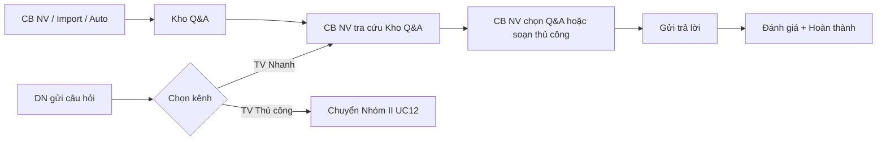
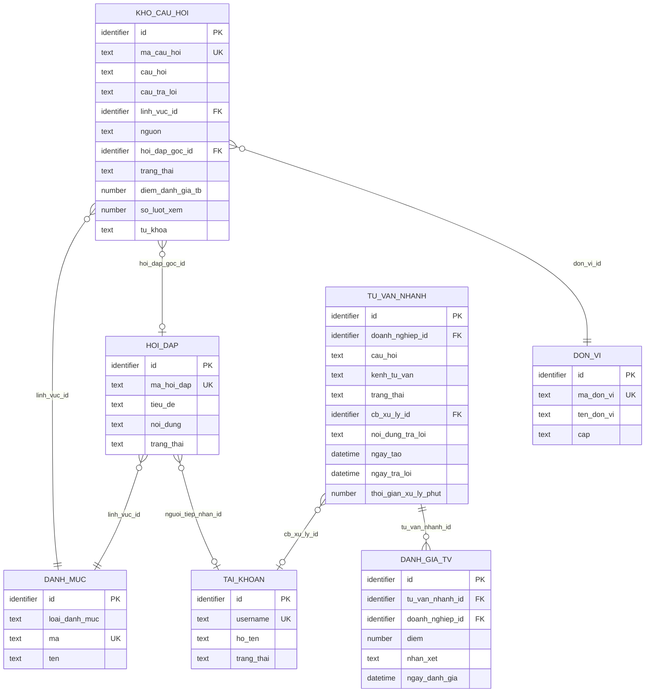
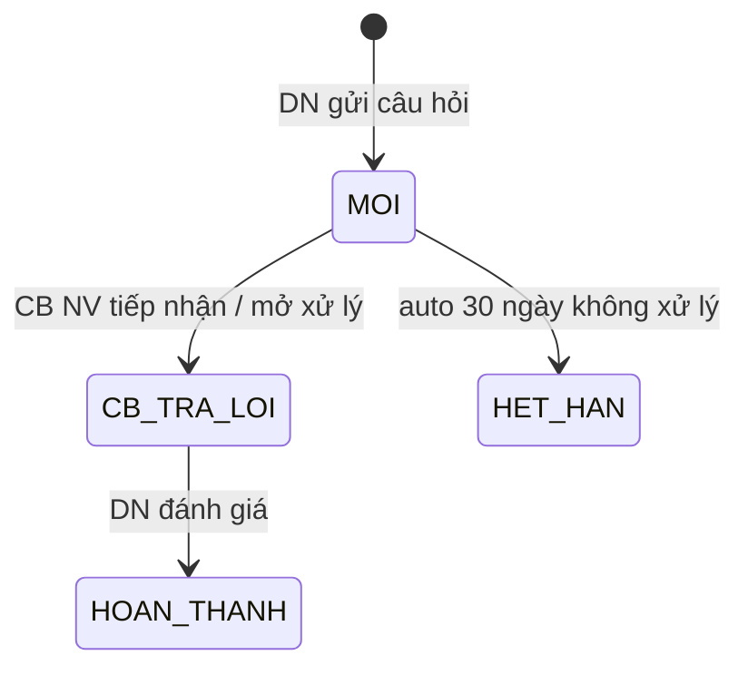

# SRS — Section 3.2.13: Tư vấn Nhanh

**Dự án:** Phần mềm hỗ trợ pháp lý doanh nghiệp
**Phiên bản SRS:** 3.5
**Nhóm:** X.2 — Tư vấn Nhanh
**UC range:** UC 154 – UC 158
**Số FR:** 6
**File chính:** `srs-v3.md` Section 3.2

---

## Mục lục file này

- [1. Tổng quan nhóm](#1-tổng-quan-nhóm)
- [2. Yêu cầu chức năng chi tiết](#2-yêu-cầu-chức-năng-chi-tiết)
- [3. Màn hình chức năng](#3-màn-hình-chức-năng)
- [4. Entity liên quan](#4-entity-liên-quan)
- [5. State Machine liên quan](#5-state-machine-liên-quan)
- [6. Business Rules liên quan](#6-business-rules-liên-quan)

---

## 1. Tổng quan nhóm

**Mục đích:** Hệ thống tra cứu câu hỏi-đáp pháp luật (keyword search, KHÔNG AI) phục vụ DN tự tra cứu trên Cổng.

**Tác nhân chính:** Cán bộ Nghiệp vụ (TW/BN/ĐP), Doanh nghiệp (qua Cổng PLQG)

**3 nguồn bổ sung kho:**
1. Câu hỏi Nhóm II đã duyệt -> tự động đưa vào kho
2. CB NV thêm thủ công -> sau duyệt
3. Import từ file -> sau duyệt

**UC Coverage:**

| UC | Tên | FR-ID | Priority | Ghi chú |
|----|-----|-------|----------|---------|
| UC154 | Quản lý kho câu hỏi/tư vấn (CB NV) | FR-X.2-01 | Essential | Khớp CSV |
| UC155 | Phê duyệt nội dung câu hỏi/tư vấn (CB Phê duyệt) | covered ở FR-X.2-01 | Essential | CSV actor CB Phê duyệt; cover ở Processing step 3 + SCR-X2-01 tab "Chờ duyệt" |
| UC156 | Quản lý công khai câu hỏi/tư vấn (CB NV) | FR-X.2-06 | Essential | Khớp CSV |
| UC157 | Tìm kiếm câu hỏi/tư vấn (CB NV) | covered ở FR-X.2-01 | Essential | CSV actor CB NV; cover ở SCR-X2-01 thanh lọc + tìm kiếm toàn văn |
| UC158 | Tiếp nhận đánh giá chất lượng tư vấn nhanh (Cổng PLQG) | FR-X.2-05 | Essential | Khớp CSV — actor là Cổng PLQG gửi đánh giá qua API inbound |
| (ngoài CSV) | CB NV xử lý phiên tư vấn nhanh (logic nội bộ) | FR-X.2-02 | Essential | Không thuộc UC CSV — luồng nội bộ CMS xử lý phiên TVN |
| (ngoài CSV) | DN gửi câu hỏi qua chuyên trang PLQG | FR-X.2-03 | Essential | Không thuộc UC CSV CMS — luồng chuyên trang DN |
| (ngoài CSV) | DN tìm kiếm phản hồi qua chuyên trang PLQG | FR-X.2-04 | Essential | Không thuộc UC CSV CMS — luồng chuyên trang DN |

**Quy trình nghiệp vụ tổng quan:**



**State Machine: SM-TVNHANH**

```
[MOI] --(DN gửi câu hỏi)--> [CB_TRA_LOI]
[CB_TRA_LOI] --(DN đánh giá)--> [HOAN_THANH]
[MOI] --(auto 30 ngày không xử lý)--> [HET_HAN]
```

---

## 2. Yêu cầu chức năng chi tiết

---

### FR-X.2-01: Quản lý kho câu hỏi/tư vấn (UC154)

**UC Reference:** UC 154, UC 155 (Phê duyệt — cover ở Processing step 3 + SCR-X2-01 tab "Chờ duyệt"), UC 157 (Tìm kiếm CB NV — cover ở SCR-X2-01 thanh lọc + tìm kiếm toàn văn)
**Source:** CĐT xác nhận
**Priority:** Essential
**Stability:** High
**Màn hình:** SCR-X2-01 — [Quản lý Kho Câu hỏi](#scr-x2-01-quản-lý-kho-câu-hỏi) (phê duyệt inline trong SCR-X2-01)

**Mô tả:**
Quản lý kho câu hỏi/trả lời thường gặp phục vụ tư vấn nhanh. Hỗ trợ 3 nguồn: tự động từ hỏi đáp đã duyệt, thủ công, và import Excel. Q&A thủ công/import cần phê duyệt.

**Tác nhân:** Cán bộ Nghiệp vụ (TW/BN/ĐP)

**Preconditions (Điều kiện tiên quyết):**

- User đã đăng nhập (BR-AUTH-01)
- User có quyền "Quản lý tư vấn nhanh"

**Inputs (Dữ liệu đầu vào):**

| # | Tên field | Kiểu logic | Bắt buộc | Ràng buộc | Mặc định | Nguồn |
|---|----------|-----------|----------|-----------|----------|-------|
| 1 | ma_cau_hoi | text | Y (auto) | Format: QA-{YYYYMMDD}-{SEQ} | auto-gen | hệ thống |
| 2 | cau_hoi | text (long) | Y | Không rỗng | — | người dùng nhập |
| 3 | cau_tra_loi | text (long) | Y | Không rỗng | — | người dùng nhập |
| 4 | linh_vuc_id | identifier | Y | FK -> DANH_MUC | — | người dùng chọn |
| 5 | tu_khoa | text | N | Phân cách bằng dấu phẩy | — | người dùng nhập |
| 6 | nguon | text | Y | TU_DONG / THU_CONG / IMPORT | — | hệ thống |
| 7 | trang_thai | text | Y (auto) | NHAP / CHO_DUYET / DA_DUYET / CONG_KHAI / HET_HIEU_LUC | CHO_DUYET | hệ thống |
| 8 | hieu_luc | boolean | Y | true = hiệu lực, false = hết hiệu lực | true | hệ thống |
| 9 | anh_dai_dien | file (ảnh) | N | jpg/png/gif, max 5MB; mặc định ảnh hệ thống | ảnh hệ thống | người dùng upload (cho trường hợp Q&A sẽ công khai) |
| 10 | mo_ta_cong_khai | text (long) | N | — | — | người dùng nhập (mô tả hiển thị trên Cổng PLQG, khác cau_hoi/cau_tra_loi nội bộ) |
| 11 | file_dinh_kem_cong_khai | file[] | N | PDF/DOC/DOCX/XLS/XLSX, max 20MB/file, nhiều file | — | người dùng upload (file đính kèm khi công khai) |

**Processing (Xử lý):**

| Bước | Mô tả xử lý | BR áp dụng |
|------|-------------|-----------|
| 1 | Kiểm tra quyền | BR-AUTH-01 |
| 2 | Nguồn TU_DONG: Khi hỏi đáp (Nhóm II) chuyển DA_DUYET -> tự động tạo bản ghi trong kho (nguồn = TU_DONG, trạng thái = DA_DUYET) | — |
| 3 | Nguồn THU_CONG: CB NV nhập câu hỏi + trả lời -> trạng thái = CHO_DUYET -> CB PD duyệt | — |
| 4 | Nguồn IMPORT: Upload file Excel -> phân tích -> kiểm tra hợp lệ -> trạng thái = CHO_DUYET | — |
| 5 | Lập chỉ mục tìm kiếm toàn văn trên câu hỏi + câu trả lời + từ khóa | BR-DATA-08 |
| 6 | CB NV đánh dấu "Hết hiệu lực" -> cập nhật hiệu lực = false, ẩn khỏi Cổng | — |
| 7 | Ghi nhật ký thao tác | BR-DATA-05 |

**Business Rules áp dụng:**
- **BR-AUTH-01**: Xác thực người dùng -> Xem Phụ lục B (file chính)
- **BR-DATA-05**: Ghi nhật ký thao tác -> Xem Phụ lục B (file chính)
- **BR-DATA-08**: Tìm kiếm toàn văn -> Xem Phụ lục B (file chính)

**Outputs (Dữ liệu đầu ra):**

| # | Tên | Kiểu logic | Điều kiện | Format |
|---|-----|-----------|-----------|--------|
| 1 | ma_cau_hoi | text | luôn | QA-{date}-{seq} |
| 2 | cau_hoi | text | luôn | cắt 100 ký tự (danh sách) |
| 3 | cau_tra_loi | text | luôn | cắt 100 ký tự (danh sách) |
| 4 | linh_vuc | text | luôn | — |
| 5 | tu_khoa | text | luôn | tags |
| 6 | nguon | text | luôn | TU_DONG / THU_CONG / IMPORT |
| 7 | trang_thai | text | luôn | — |
| 8 | hieu_luc | boolean | luôn | toggle |
| 9 | diem_tb | number | luôn | — |

**Postconditions (Trạng thái sau thực hiện):**

- Kho Q&A được bổ sung/cập nhật
- Chỉ mục tìm kiếm toàn văn được cập nhật
- AUDIT_LOG ghi nhận

**Error Handling (Xử lý lỗi):**

| # | Điều kiện lỗi | Mã lỗi | Phản hồi hệ thống | Severity |
|---|--------------|--------|-------------------|----------|
| E1 | Câu hỏi trống | ERR-KHO-01 | "Câu hỏi là bắt buộc" | ERROR |
| E2 | Câu trả lời trống | ERR-KHO-02 | "Câu trả lời là bắt buộc" | ERROR |
| E3 | Lĩnh vực không hợp lệ | ERR-KHO-03 | "Lĩnh vực PL không hợp lệ" | ERROR |
| E4 | File Excel không đúng format | ERR-KHO-04 | "File không đúng định dạng. Tải mẫu Excel" | ERROR |

**Acceptance Criteria:**

- **Given** CB NV truy cập "Kho câu hỏi" **When** hiển thị **Then** DS Q&A, phân trang
- **Given** CB NV thêm mới **When** nhập câu hỏi + trả lời + lĩnh vực **Then** validate + lưu (CHO_DUYET)
- **Given** Q&A nhóm II đã duyệt **When** trigger **Then** tự động thêm vào kho
- **Given** Q&A hết hiệu lực **When** CB NV đánh dấu **Then** ẩn khỏi Cổng

---

### FR-X.2-02: Quản lý tư vấn nhanh (logic nội bộ — ngoài CSV)

**UC Reference:** Logic nội bộ — không gán UC CSV. Đây là luồng nghiệp vụ nội bộ CMS để CB NV xử lý phiên tư vấn nhanh do DN gửi từ chuyên trang. UC155 (Phê duyệt) trong CSV đã được cover ở FR-X.2-01.
**Source:** CĐT xác nhận
**Priority:** Essential
**Stability:** High
**Màn hình:** SCR-X2-03 — [Quản lý Tư vấn Nhanh](#scr-x2-03-quản-lý-tư-vấn-nhanh)

**Mô tả:**
Xử lý luồng tư vấn nhanh: DN gửi câu hỏi -> CB NV mở phiên -> CB NV chủ động tra cứu Kho câu hỏi bằng từ khóa -> chọn Q&A phù hợp hoặc soạn thủ công -> gửi trả lời. Hệ thống không tự động tìm kiếm mặc định và không hiển thị gợi ý tự động.

**Tác nhân:** Cán bộ Nghiệp vụ

**Preconditions (Điều kiện tiên quyết):**

- User đã đăng nhập (BR-AUTH-01)
- User có quyền "Quản lý tư vấn nhanh"
- Kho câu hỏi đã có dữ liệu nếu CB NV muốn chọn câu trả lời từ kho; nếu không có dữ liệu phù hợp, CB NV soạn thủ công

**Inputs (Dữ liệu đầu vào):**

| # | Tên field | Kiểu logic | Bắt buộc | Ràng buộc | Mặc định | Nguồn |
|---|----------|-----------|----------|-----------|----------|-------|
| 1 | cau_hoi_dn | text (long) | Y | Câu hỏi từ DN | — | DN gửi |
| 2 | tu_khoa_tim_kiem | text | N | Min 2 ký tự khi tìm kiếm | — | CB NV nhập |
| 3 | linh_vuc_id | identifier | N | FK -> DANH_MUC | — | CB NV lọc |
| 4 | noi_dung_tra_loi | text (long) | Y | Nội dung trả lời cuối cùng gửi cho DN (có thể copy từ Kho câu hỏi rồi chỉnh sửa hoặc soạn thủ công) | — | CB NV nhập/chọn |

**Processing (Xử lý):**

| Bước | Mô tả xử lý | BR áp dụng |
|------|-------------|-----------|
| 1 | DN gửi câu hỏi -> hệ thống tạo phiên tư vấn nhanh và chuyển cho CB NV xử lý | — |
| 2 | CB NV mở chi tiết phiên; khu vực "Tra cứu Kho câu hỏi" hiển thị ô tìm kiếm rỗng, không tự động tìm kiếm và không prefill từ câu hỏi DN | — |
| 3 | CB NV nhập từ khóa / nội dung câu hỏi / cụm từ pháp lý và nhấn "Tìm kiếm" | — |
| 4 | Hệ thống tìm kiếm toàn văn trong `KHO_CAU_HOI.cau_hoi`, `KHO_CAU_HOI.cau_tra_loi`, `KHO_CAU_HOI.tu_khoa`; điều kiện bắt buộc: `trang_thai IN ('DA_DUYET','CONG_KHAI')` và `hieu_luc = true`; áp dụng phân quyền dữ liệu theo `don_vi_id` nếu có | BR-DATA-08 |
| 5 | Kết quả hiển thị theo điểm relevance giảm dần; CB NV có thể lọc theo lĩnh vực pháp lý | — |
| 6 | CB NV chọn một Q&A phù hợp -> copy `cau_tra_loi` vào ô soạn; CB NV được chỉnh sửa trước khi gửi. Nếu không chọn Q&A, CB NV soạn thủ công | — |
| 7 | Gửi trả lời: lưu `noi_dung_tra_loi` cuối cùng, `cb_xu_ly_id = current_user.id`, `ngay_tra_loi = NOW()`, tự tính `thoi_gian_xu_ly_phut` | — |
| 8 | Tạo/cập nhật bản ghi tư vấn nhanh (liên kết hỏi đáp nếu có) | — |
| 9 | **Đẩy sang Nhóm II giữa chừng (do CB/TVV chủ động):** Nếu CB NV/TVV phát hiện câu hỏi cần xử lý chính thức (cần phê duyệt + cite văn bản pháp luật + công khai lên Cổng PLQG) → click nút "Đẩy sang Nhóm II" → mở modal xác nhận → tạo bản ghi HOI_DAP với `kenh_tiep_nhan = TVN_BRIDGE` + `tu_van_nhanh_goc_id = TU_VAN_NHANH.id` (giữ liên kết phiên gốc); cập nhật trạng thái phiên TV nhanh sang HOAN_THANH với ghi chú "Đã đẩy sang Nhóm II hỏi đáp #{ma_hoi_dap}"; gửi thông báo cho cán bộ Nhóm II tiếp nhận. | — |

**Outputs (Dữ liệu đầu ra):**

| # | Tên | Kiểu logic | Điều kiện | Format |
|---|-----|-----------|-----------|--------|
| 1 | tra_loi_da_gui | text | sau gửi | Nội dung trả lời cuối cùng |
| 2 | hoi_dap_id | identifier | khi Đẩy sang Nhóm II | ID bản ghi HOI_DAP vừa tạo |

**Postconditions (Trạng thái sau thực hiện):**

- Bản ghi TU_VAN_NHANH được tạo
- Trạng thái SM-TVNHANH chuyển sang CB_TRA_LOI (CB NV xử lý/trả lời) HOẶC HOAN_THANH (khi đã Đẩy sang Nhóm II)
- Khi gửi trả lời: lưu `noi_dung_tra_loi` cuối cùng, `cb_xu_ly_id`, `ngay_tra_loi`, `thoi_gian_xu_ly_phut`
- Khi Đẩy sang Nhóm II: bản ghi HOI_DAP mới được tạo với kênh = TVN_BRIDGE + liên kết phiên TV nhanh gốc

**Error Handling (Xử lý lỗi):**

| # | Điều kiện lỗi | Mã lỗi | Phản hồi hệ thống | Severity |
|---|--------------|--------|-------------------|----------|
| E1 | Từ khóa tìm kiếm < 2 ký tự | ERR-TVN-TK-01 | "Từ khóa tìm kiếm phải có ít nhất 2 ký tự" | ERROR |
| E2 | Không có kết quả tìm kiếm | INF-TVN-TK-01 | "Không tìm thấy câu hỏi phù hợp" | INFO |
| E3 | Nội dung trả lời rỗng | ERR-TVN-02 | "Nội dung trả lời là bắt buộc" | ERROR |
| E4 | Đẩy sang Nhóm II khi phiên đã HOAN_THANH | ERR-TVN-03 | "Phiên tư vấn đã kết thúc, không thể đẩy sang Nhóm II" | ERROR |

**Acceptance Criteria:**

- **Given** DN gửi câu hỏi **When** hệ thống nhận **Then** tạo phiên tư vấn nhanh và chuyển cho CB NV xử lý, không tự động tìm kiếm kho
- **Given** CB NV mở chi tiết phiên **When** chưa nhập từ khóa **Then** khu vực Tra cứu Kho câu hỏi hiển thị ô tìm kiếm rỗng và empty state "Nhập từ khóa để tìm trong kho câu hỏi"
- **Given** CB NV nhập từ khóa hợp lệ **When** nhấn "Tìm kiếm" **Then** hệ thống tìm trong `cau_hoi`, `cau_tra_loi`, `tu_khoa` của các Q&A `DA_DUYET`/`CONG_KHAI` và `hieu_luc = true`, hiển thị kết quả theo relevance giảm dần
- **Given** CB NV chọn một Q&A **When** click "Chọn" **Then** copy câu trả lời vào ô soạn và cho phép chỉnh sửa trước khi gửi
- **Given** CB NV gửi trả lời **When** nội dung hợp lệ **Then** chỉ lưu `noi_dung_tra_loi` cuối cùng cùng thông tin CB xử lý/thời điểm trả lời
- **Given** CB NV/TVV đang trả lời phát hiện câu hỏi cần xử lý chính thức **When** click "Đẩy sang Nhóm II" + xác nhận **Then** tạo HOI_DAP với kênh = TVN_BRIDGE + liên kết phiên TV nhanh gốc; phiên TV nhanh đóng với ghi chú đã đẩy sang Nhóm II

---

### FR-X.2-03: DN gửi câu hỏi (chuyên trang DN — ngoài CSV CMS)

**UC Reference:** Chuyên trang DN — không thuộc UC CSV CMS. UC156 trên CMS đã được cover bởi FR-X.2-06 (CB NV công khai). Luồng DN gửi câu hỏi qua chuyên trang Cổng PLQG được mô tả ở đây để làm rõ giao diện đầu vào của hệ thống.
**Source:** CĐT xác nhận (thiết kế ở chuyên trang)
**Priority:** Essential
**Stability:** High
**Màn hình:** SCR-X2-03 — [Quản lý Tư vấn Nhanh](#scr-x2-03-quản-lý-tư-vấn-nhanh) (phân luồng logic)

**Mô tả:**
DN nhập câu hỏi trên chuyên trang và chọn kênh tư vấn (nhanh hoặc thủ công). Hỗ trợ chuyển kênh giữa hai hình thức.

**Tác nhân:** Doanh nghiệp (qua Cổng PLQG)

**Preconditions (Điều kiện tiên quyết):**

- DN truy cập chuyên trang qua Cổng PLQG

**Inputs (Dữ liệu đầu vào):**

| # | Tên field | Kiểu logic | Bắt buộc | Ràng buộc | Mặc định | Nguồn |
|---|----------|-----------|----------|-----------|----------|-------|
| 1 | cau_hoi | text (long) | Y | Không rỗng | — | DN nhập |
| 2 | kenh_tu_van | text | Y | TV_NHANH / TV_THU_CONG | TV_NHANH | DN chọn |

**Processing (Xử lý):**

| Bước | Mô tả xử lý | BR áp dụng |
|------|-------------|-----------|
| 1 | DN nhập câu hỏi trên chuyên trang | — |
| 2 | DN chọn kênh: "TV nhanh" hoặc "TV thủ công" | — |
| 3 | Nếu TV nhanh -> chuyển sang luồng FR-X.2-02 (CB NV tra cứu Kho câu hỏi và trả lời) | — |
| 4 | Nếu TV thủ công -> tạo bản ghi HOI_DAP ở Nhóm II (UC12 tiếp nhận) với **kênh tiếp nhận = TVN_BRIDGE** + lưu **liên kết phiên Tư vấn nhanh gốc** (`HOI_DAP.tu_van_nhanh_goc_id = TU_VAN_NHANH.id`) để cán bộ Nhóm II xem được lịch sử trao đổi gốc giữa Doanh nghiệp và Tư vấn viên. | — |
| 5 | DN chuyển kênh giữa chừng: "Chuyển sang TV thủ công" -> tạo HOI_DAP với kênh = TVN_BRIDGE + liên kết phiên gốc (như bước 4); giữ toàn bộ lịch sử trao đổi để cán bộ Nhóm II có đủ ngữ cảnh. | — |
| 6 | Ghi nhận qua API inbound từ Cổng Pháp luật Quốc gia | — |

**Outputs (Dữ liệu đầu ra):**

| # | Tên | Kiểu logic | Điều kiện | Format |
|---|-----|-----------|-----------|--------|
| 1 | ma_phien | text | luôn | auto-gen |
| 2 | kenh_hien_tai | text | luôn | TV_NHANH / TV_THU_CONG |
| 3 | hoi_dap_id | identifier | khi đẩy sang Nhóm II | ID bản ghi HOI_DAP vừa tạo (để DN tra cứu) |

**Postconditions (Trạng thái sau thực hiện):**

- Phiên tư vấn nhanh được tạo (nếu TV nhanh)
- Hoặc tạo bản ghi HOI_DAP ở Nhóm II với kênh tiếp nhận = TVN_BRIDGE + liên kết phiên Tư vấn nhanh gốc (nếu TV thủ công)

**Error Handling (Xử lý lỗi):**

| # | Điều kiện lỗi | Mã lỗi | Phản hồi hệ thống | Severity |
|---|--------------|--------|-------------------|----------|
| E1 | Câu hỏi trống | ERR-TVN-DN-01 | "Vui lòng nhập câu hỏi" | ERROR |

**Acceptance Criteria:**

- **Given** DN nhập câu hỏi **When** chọn "TV nhanh" **Then** tạo phiên tư vấn nhanh để CB NV xử lý theo luồng tra cứu Kho câu hỏi
- **Given** DN chọn "TV thủ công" **When** xử lý **Then** tạo HOI_DAP với kênh = TVN_BRIDGE + liên kết phiên Tư vấn nhanh gốc; cán bộ Nhóm II tiếp nhận thấy badge "Từ Tư vấn nhanh"
- **Given** DN muốn chuyển kênh giữa chừng **When** nhấn "Chuyển sang TV thủ công" **Then** giữ toàn bộ lịch sử trao đổi + tạo HOI_DAP với liên kết phiên gốc

---

### FR-X.2-04: DN tìm kiếm phản hồi (chuyên trang DN — ngoài CSV CMS)

**UC Reference:** Chuyên trang DN — không thuộc UC CSV CMS. UC157 (Tìm kiếm câu hỏi/tư vấn) trong CSV actor là CB NV, đã được cover bởi FR-X.2-01 (thanh lọc + tìm kiếm toàn văn ở SCR-X2-01). Luồng DN tìm kiếm phản hồi qua chuyên trang được mô tả ở đây để làm rõ giao diện DN tự tra cứu.
**Source:** CĐT xác nhận
**Priority:** Essential
**Stability:** High
**Màn hình:** Cổng PLQG (chuyên trang)

**Mô tả:**
DN tự tìm kiếm câu hỏi/trả lời trong kho Q&A đã duyệt + hiệu lực qua Cổng PLQG.

**Tác nhân:** Doanh nghiệp (qua Cổng PLQG)

**Preconditions (Điều kiện tiên quyết):**

- DN truy cập chuyên trang qua Cổng PLQG

**Inputs (Dữ liệu đầu vào):**

| # | Tên field | Kiểu logic | Bắt buộc | Ràng buộc | Mặc định | Nguồn |
|---|----------|-----------|----------|-----------|----------|-------|
| 1 | tu_khoa | text | Y | Min 2 ký tự | — | DN nhập |

**Processing (Xử lý):**

| Bước | Mô tả xử lý | BR áp dụng |
|------|-------------|-----------|
| 1 | DN nhập từ khóa trên Cổng | — |
| 2 | API inbound -> truy vấn kho Q&A chỉ bản ghi DA_DUYET + hiệu lực | — |
| 3 | Tìm kiếm toàn văn -- keyword tương đối hoặc cụm từ chính xác | BR-DATA-08 |
| 4 | Trả về danh sách Q&A phù hợp, sắp theo điểm relevance giảm dần | — |

**Outputs (Dữ liệu đầu ra):**

| # | Tên | Kiểu logic | Điều kiện | Format |
|---|-----|-----------|-----------|--------|
| 1 | danh_sach_qa | structured | luôn | [{cau_hoi, cau_tra_loi, linh_vuc, relevance_score}] |

**Postconditions (Trạng thái sau thực hiện):**

- Read-only, không thay đổi dữ liệu

**Error Handling (Xử lý lỗi):**

| # | Điều kiện lỗi | Mã lỗi | Phản hồi hệ thống | Severity |
|---|--------------|--------|-------------------|----------|
| E1 | Từ khóa < 2 ký tự | ERR-TVN-TK-01 | "Từ khóa tìm kiếm phải có ít nhất 2 ký tự" | ERROR |
| E2 | Không có kết quả | INF-TVN-TK-01 | "Không tìm thấy câu hỏi phù hợp" | INFO |

**Acceptance Criteria:**

- **Given** DN nhập từ khóa **When** tìm kiếm **Then** hiển thị Q&A phù hợp (keyword search)

---

### FR-X.2-05: Tiếp nhận đánh giá chất lượng tư vấn nhanh (UC158)

**UC Reference:** UC 158
**Source:** CĐT xác nhận
**Priority:** Essential
**Stability:** High
**Màn hình:** SCR-X2-03 — [Tìm kiếm & Kết quả Tư vấn Nhanh](#scr-x2-03-tìm-kiếm--kết-quả-tư-vấn-nhanh) (hiển thị kết quả đánh giá inline trong SCR-X2-03 sau khi đã được Cổng PLQG gửi sang)

**Mô tả:**
Hệ thống CMS tiếp nhận đánh giá chất lượng câu trả lời (điểm 1-5 + nhận xét) do Cổng Pháp luật quốc gia gửi sang qua API inbound. DN thực hiện đánh giá ở giao diện chuyên trang trên Cổng PLQG; Cổng PLQG đóng vai trò trung gian gửi dữ liệu đánh giá vào CSDL CMS. Kết quả phục vụ cải thiện kho và báo cáo. Hỗ trợ gửi lại trong trường hợp đồng bộ thất bại — đảm bảo không tạo bản ghi trùng.

**Tác nhân:** Cổng Pháp luật quốc gia (gửi đánh giá thay DN qua API inbound). Người đánh giá thực sự là Doanh nghiệp.

**API Specification (Inbound):**

| Thuộc tính | Giá trị |
|-----------|---------|
| **Phương thức** | POST |
| **Đường dẫn** | `/api/v1/inbound/danh-gia-tv-nhanh` |
| **Headers bắt buộc** | `Content-Type: application/json`, `Authorization: Bearer {JWT}` (**mTLS + JWT Bearer RS256** — chuẩn hoá theo BR-INTG-02 + FR-XII-19, BA chốt 2026-05-10 C-AUTH-01), `Idempotency-Key: {uuid}` (chống ghi trùng khi Cổng gửi lại) |
| **Dữ liệu gửi** | `tu_van_nhanh_id` (BB), `doanh_nghiep_id` (BB), `diem` (BB, 1-5), `nhan_xet` (KBB) |
| **Phản hồi thành công** | `200 OK` — trả về `danh_gia_id` + `diem_tb_cap_nhat` |
| **Phản hồi lỗi** | `400 Bad Request` (sai dữ liệu) / `409 Conflict` (trùng `Idempotency-Key`, đã xử lý lần trước — trả về kết quả cũ, không tạo bản ghi mới) / `404 Not Found` (`tu_van_nhanh_id` không tồn tại) |
| **Quy tắc chống trùng (Idempotency)** | Hệ thống lưu `Idempotency-Key` đã xử lý trong 24 giờ. Cổng PLQG gửi lại cùng key → trả kết quả của lần xử lý đầu, KHÔNG tạo bản ghi mới. Đảm bảo nguyên tắc CSV UC158 transaction 2: "không ghi đè sai lệch". |

**Preconditions (Điều kiện tiên quyết):**

- DN đã nhận câu trả lời từ phiên tư vấn nhanh

**Inputs (Dữ liệu đầu vào):**

| # | Tên field | Kiểu logic | Bắt buộc | Ràng buộc | Mặc định | Nguồn |
|---|----------|-----------|----------|-----------|----------|-------|
| 1 | tu_van_nhanh_id | identifier | Y | FK -> TU_VAN_NHANH | — | hệ thống |
| 2 | diem | number | Y | 1-5 | — | DN chọn |
| 3 | nhan_xet | text (long) | N | — | — | DN nhập |

**Processing (Xử lý):**

| Bước | Mô tả xử lý | BR áp dụng |
|------|-------------|-----------|
| 0 | Kiểm tra `Idempotency-Key` trong cache 24h. Nếu trùng → trả kết quả lần xử lý trước, dừng xử lý mới (không tạo bản ghi đánh giá thứ hai) | — |
| 1 | Kiểm tra: điểm trong khoảng 1-5 | — |
| 2 | Tạo bản ghi đánh giá tư vấn | — |
| 3 | Cập nhật điểm trung bình của Q&A (nếu đánh giá Q&A cụ thể) | — |
| 4 | Lưu `Idempotency-Key` vào cache 24h để chống ghi trùng nếu Cổng PLQG gửi lại | — |

**Outputs (Dữ liệu đầu ra):**

| # | Tên | Kiểu logic | Điều kiện | Format |
|---|-----|-----------|-----------|--------|
| 1 | ket_qua | text | luôn | THANH_CONG |
| 2 | diem_tb_cap_nhat | number | luôn | — |

**Postconditions (Trạng thái sau thực hiện):**

- DANH_GIA_TV được tạo
- Điểm TB cập nhật

**Error Handling (Xử lý lỗi):**

| # | Điều kiện lỗi | Mã lỗi | Phản hồi hệ thống | Severity |
|---|--------------|--------|-------------------|----------|
| E1 | Điểm ngoài khoảng 1-5 | ERR-DG-TVN-01 | "Điểm đánh giá phải từ 1 đến 5" | ERROR |
| E2 | Phiên TV không tồn tại | ERR-DG-TVN-02 | "Phiên tư vấn không tồn tại" | ERROR |

**Acceptance Criteria:**

- **Given** DN xem câu trả lời **When** đánh giá (điểm + nhận xét) **Then** lưu, phục vụ cải thiện kho + BC
- **Given** Cổng PLQG gửi lại đánh giá với cùng `Idempotency-Key` (do đồng bộ thất bại) **When** hệ thống tiếp nhận **Then** trả kết quả lần xử lý đầu, không tạo bản ghi đánh giá thứ hai

---

### FR-X.2-06: Công khai / Hủy công khai câu hỏi tư vấn nhanh (UC156)

**UC Reference:** UC 156
**Source:** CSV UC/Transaction §X.2 dòng 1415-1419 — UC156 "Quản lý công khai câu hỏi, tư vấn", actor CB Nghiệp vụ TW/BN/ĐP
**Priority:** Essential
**Stability:** Medium
**Màn hình:** SCR-X2-01 — [Quản lý Kho Câu hỏi](#scr-x2-01-quan-ly-kho-cau-hoi) (action trên từng dòng Q&A đã duyệt: nút "Công khai" / "Hủy công khai")

**Mô tả:**
CB Nghiệp vụ thực hiện công khai hoặc hủy công khai câu hỏi/phản hồi đã duyệt lên Cổng Pháp luật quốc gia thông qua API. Khi công khai, dữ liệu được đẩy ra Cổng để DN tra cứu; khi hủy, dữ liệu được gỡ khỏi Cổng. Trạng thái CONG_KHAI là kết quả thành công của lệnh đẩy ra Cổng — KHÔNG phải switch UI nội bộ. Hai biến `cong_khai` (boolean — switch UI nhanh) và `trang_thai='CONG_KHAI'` (kết quả thực sự sau khi gọi API thành công) tách biệt: cong_khai=1 nhưng trang_thai≠CONG_KHAI = đang chờ API; cong_khai=0 nhưng trang_thai=CONG_KHAI = đang chờ hủy.

**Tác nhân:** Cán bộ Nghiệp vụ (TW/BN/ĐP)

**Preconditions (Điều kiện tiên quyết):**

- User đã đăng nhập (BR-AUTH-01)
- User có quyền "Quản lý tư vấn nhanh"
- Câu hỏi/phản hồi đã được phê duyệt (trạng thái = DA_DUYET hoặc đang ở CONG_KHAI nếu là hành động hủy)
- Tuân thủ BR-PUBLIC-01 (chỉ bản ghi đã hoàn thành quy trình phê duyệt mới được công khai)

**Inputs (Dữ liệu đầu vào):**

| # | Tên field | Kiểu logic | Bắt buộc | Ràng buộc | Mặc định | Nguồn |
|---|----------|-----------|----------|-----------|----------|-------|
| 1 | kho_cau_hoi_id | identifier | Y | FK -> KHO_CAU_HOI | — | hệ thống |
| 2 | hanh_dong | text | Y | CONG_KHAI / HUY_CONG_KHAI | — | CB NV chọn |

**Processing — Công khai:**

| Bước | Mô tả xử lý | BR áp dụng |
|------|-------------|-----------|
| 1 | Kiểm tra quyền CB NV + phạm vi phân quyền theo đơn vị | BR-AUTH-01 |
| 2 | Kiểm tra Q&A đang ở trạng thái DA_DUYET (BR-PUBLIC-01: chỉ bản ghi đã duyệt mới được công khai) | BR-PUBLIC-01 |
| 3 | Gọi API ra Cổng Pháp luật quốc gia: đẩy nội dung câu hỏi + phản hồi + ảnh đại diện + mô tả công khai + file đính kèm công khai | BR-FLOW-05 |
| 4 | Nếu API thành công: cập nhật trang_thai = CONG_KHAI, ghi thời gian đăng tải = thời điểm hiện tại (BR-PUBLIC-03) | BR-PUBLIC-03 |
| 5 | Nếu API thất bại: giữ trang_thai = DA_DUYET, trả lỗi ERR-TVN-CK-01 cho người dùng thử lại | — |
| 6 | Ghi nhật ký thao tác (hành động = 'CONG_KHAI') | BR-DATA-05 |

**Processing — Hủy công khai:**

| Bước | Mô tả xử lý | BR áp dụng |
|------|-------------|-----------|
| 1 | Kiểm tra quyền CB NV + phạm vi phân quyền theo đơn vị | BR-AUTH-01 |
| 2 | Kiểm tra Q&A đang ở trạng thái CONG_KHAI | — |
| 3 | Gọi API ra Cổng Pháp luật quốc gia: gỡ nội dung khỏi chuyên trang | BR-FLOW-05 |
| 4 | Nếu API thành công: cập nhật trang_thai = DA_DUYET, xóa thời gian đăng tải (BR-PUBLIC-02) | BR-PUBLIC-02 |
| 5 | Nếu API thất bại: giữ trang_thai = CONG_KHAI, trả lỗi ERR-TVN-CK-02 cho người dùng thử lại | — |
| 6 | Ghi nhật ký thao tác (hành động = 'HUY_CONG_KHAI') | BR-DATA-05 |

**Business Rules áp dụng:**
- **BR-AUTH-01**: Xác thực người dùng — Xem Phụ lục B (file chính)
- **BR-DATA-05**: Ghi nhật ký thao tác — Xem Phụ lục B (file chính)
- **BR-FLOW-05**: Gọi API ra Cổng PLQG — Xem Phụ lục B (file chính)
- **BR-PUBLIC-01**: Điều kiện công khai — chỉ bản ghi đã duyệt mới được công khai. Xem Phụ lục B (file chính)
- **BR-PUBLIC-02**: Hủy công khai — clear thoi_gian_dang_tai khi hủy. Xem Phụ lục B (file chính)
- **BR-PUBLIC-03**: Thời gian đăng tải — auto fill khi công khai thành công. Xem Phụ lục B (file chính)

**Outputs (Dữ liệu đầu ra):**

| # | Tên | Kiểu logic | Điều kiện | Format |
|---|-----|-----------|-----------|--------|
| 1 | ket_qua | text | luôn | THANH_CONG / LOI |
| 2 | trang_thai_moi | text | khi thành công | DA_DUYET / CONG_KHAI |
| 3 | thoi_gian_dang_tai | datetime | khi công khai thành công | dd/mm/yyyy hh:mm |

**Postconditions (Trạng thái sau thực hiện):**

- KHO_CAU_HOI.trang_thai được cập nhật (CONG_KHAI hoặc DA_DUYET)
- Nội dung đã đẩy/gỡ trên Cổng Pháp luật quốc gia
- AUDIT_LOG ghi nhận

**Error Handling (Xử lý lỗi):**

| # | Điều kiện lỗi | Mã lỗi | Phản hồi hệ thống | Severity |
|---|--------------|--------|-------------------|----------|
| E1 | API Cổng PLQG lỗi khi công khai | ERR-TVN-CK-01 | "Lỗi kết nối Cổng PLQG khi công khai. Vui lòng thử lại" | ERROR |
| E2 | API Cổng PLQG lỗi khi hủy công khai | ERR-TVN-CK-02 | "Lỗi kết nối Cổng PLQG khi hủy công khai. Vui lòng thử lại" | ERROR |
| E3 | Trạng thái không hợp lệ cho hành động (vd: muốn công khai bản ghi đang CHO_DUYET) | ERR-TVN-CK-03 | "Không thể thực hiện. Trạng thái hiện tại không cho phép" | ERROR |

**Acceptance Criteria:**

- **Given** CB NV chọn câu hỏi DA_DUYET **When** nhấn "Công khai" **Then** nội dung được đẩy lên Cổng PLQG + trạng thái chuyển CONG_KHAI + ghi thời gian đăng tải
- **Given** CB NV chọn câu hỏi CONG_KHAI **When** nhấn "Hủy công khai" **Then** nội dung được gỡ khỏi Cổng + trạng thái chuyển DA_DUYET + xóa thời gian đăng tải
- **Given** API Cổng PLQG lỗi **When** thực hiện công khai/hủy **Then** giữ trạng thái cũ + hiển thị thông báo lỗi để người dùng thử lại
- **Given** CB NV cố công khai bản ghi CHO_DUYET (chưa duyệt) **When** nhấn "Công khai" **Then** chặn + thông báo "Trạng thái hiện tại không cho phép"

---

---

## 3. Màn hình chức năng

> **Cấu trúc v2.1:** 1 trang, 2 tabs -- Tab "Kho cau hoi" (MH-13.1 + MH-13.2 gop) / Tab "Phien tu van" (MH-13.3 + MH-13.4 gop).

### SCR-X2-01: Quan ly Kho Cau hoi

**Loai man hinh:** Danh sach + Modal + Phe duyet inline + Cong khai / Huy cong khai inline
**FR su dung:** FR-X.2-01, FR-X.2-06 (cong khai / huy cong khai)
**UX-Spec ref:** dac-ta-man-hinh-chuc-nang-v2.md -- MH-13.1

#### Thanh phan man hinh

| # | Vung | Thanh phan | Loai | Du lieu / Noi dung | Hanh vi | Dieu kien hien thi |
|---|------|-----------|------|---------------------|---------|-------------------|
| 1 | toolbar | Breadcrumb | breadcrumb | "Trang chu > Tu van > Kho cau hoi" | navigate | luon hien thi |
| 2 | toolbar | Tieu de + nut | label + button | "Kho Cau hoi Thuong gap" + [+ Them cau hoi] [Nhap Excel] [Lam moi] | click -> action | luon hien thi |
| 3 | filter-bar | Tab phan loai | tab | 3 tab: Tat ca / Da duyet (DA_DUYET + hieu_luc=1) / Cho duyet (CHO_DUYET). Badge so dem | click -> filter | luon hien thi |
| 4 | filter-bar | Thanh loc | form | Full-text GIN index (tsvector: cau_hoi + cau_tra_loi + tu_khoa). Linh vuc. Nguon: TU_DONG/THU_CONG/IMPORT. Trang thai: NHAP/CHO_DUYET/DA_DUYET/CONG_KHAI/HET_HIEU_LUC | change -> filter | luon hien thi |
| 5 | content | Bang kho Q&A | table | Ma (QA-{YYYYMMDD}-{SEQ}) / Cau hoi (cat 100 ky tu) / Cau tra loi (cat 100 ky tu) / Linh vuc / Tu khoa (tags, max 3 + "+N") / Nguon (nhan mau) / Trang thai (C06: CHO_DUYET/DA_DUYET/CONG_KHAI/HET_HIEU_LUC) / Cong khai (badge: "Chua cong khai" hoac "Da cong khai" + thoi_gian_dang_tai dang dd/mm/yyyy hh:mm) / Hieu luc (Toggle) / Diem TB / Ngay tao / Hanh dong (Xem / Sua / Cong khai / Huy cong khai) | click -> action | luon hien thi |
| 6 | content | Nhan nguon | tag | TU_DONG (xanh duong, auto tu HOI_DAP DA_DUYET, khong can duyet them) / THU_CONG (vang, CHO_DUYET) / IMPORT (tim, CHO_DUYET) | -- | luon hien thi |
| 7 | content | Toggle hieu luc | toggle | Tat -> hieu_luc = 0, an khoi Cong. Bat -> hieu_luc = 1 | toggle -> cap nhat | luon hien thi |
| 8 | modal | Form them Q&A | modal (lon) | Cau hoi (textarea, bat buoc) / Cau tra loi (C16 Rich Text, bat buoc) / Linh vuc (dropdown, bat buoc) / Tu khoa (tag input) / Anh dai dien (upload jpg/png/gif, max 5MB, mac dinh anh he thong — phuc vu khi cong khai) / Mo ta cong khai (textarea dai, hien thi tren Cong PLQG, khong bat buoc) / File dinh kem cong khai (upload nhieu file PDF/DOC/DOCX/XLS/XLSX, max 20MB/file, khong bat buoc) / [Huy] [Luu nhap] [Gui duyet] | input -> validate | khi nhan Them |
| 9 | modal | Import Excel | modal (C15) | Upload .xlsx -> validate -> preview 10 dong dau -> ket qua "N thanh cong, M loi". Tat ca -> CHO_DUYET | upload -> process | khi nhan Nhap Excel |
| 10 | content | Duyet don le (v2.1 gop tu MH-13.2) | button-group + modal | Tab "Cho duyet": [Duyet] SET DA_DUYET + hieu_luc=1 + TB CB NV. [Tu choi] modal ly do bat buoc + SET NHAP + TB CB NV | click -> action | tab Cho duyet |
| 11 | content | Duyet hang loat (v2.1 gop tu MH-13.2) | button | [Duyet hang loat] -> modal xac nhan. Khong tu choi hang loat | click -> action | khi >= 1 checkbox trong tab Cho duyet |
| 12 | content | Hanh dong Cong khai / Huy cong khai (FR-X.2-06) | button-group + modal | Tren tung dong Q&A: trang_thai = DA_DUYET -> hien nut [Cong khai]; trang_thai = CONG_KHAI -> hien nut [Huy cong khai]. Click [Cong khai] -> modal xac nhan + hien thi anh dai dien / mo ta cong khai / file dinh kem cong khai sap day; xac nhan -> goi API ra Cong PLQG (BR-FLOW-05); thanh cong -> SET trang_thai = CONG_KHAI + thoi_gian_dang_tai = thoi diem hien tai (BR-PUBLIC-03). Click [Huy cong khai] -> modal xac nhan; xac nhan -> goi API go khoi Cong; thanh cong -> SET trang_thai = DA_DUYET + xoa thoi_gian_dang_tai (BR-PUBLIC-02). Loi API -> giu trang_thai cu + hien thong bao loi. Quy tac BR-PUBLIC-01: chi cho cong khai khi trang_thai = DA_DUYET. | click -> action | trang_thai IN (DA_DUYET, CONG_KHAI) |
| 13 | footer | Phan trang | pagination | 20 muc/trang | click -> chuyen trang | luon hien thi |

#### Quy tac tuong tac

- Q&A nguon TU_DONG: auto tu HOI_DAP da duyet, khong can duyet them
- Q&A nguon THU_CONG va IMPORT: trang thai CHO_DUYET, phe duyet inline trong tab "Cho duyet" (v2.1 -- da gop MH-13.2 vao MH-13.1)
- Chi tiet Q&A: side panel/modal hien thi day du cau hoi, cau tra loi (rich text), linh vuc, tu khoa, nguon, nguoi tao

---

### ~~SCR-X2-02: Phe duyet Kho Q&A~~ (DA GOP -> action trong SCR-X2-01)

> **DEPRECATED v2.1:** Phe duyet Q&A thu cong/nhap = action button/batch trong SCR-X2-01 tab "Cho duyet". Xem #10, #11 trong SCR-X2-01.

---

### SCR-X2-03: Quan ly Tu van Nhanh

**Loai man hinh:** Danh sach + Layout 2 cot (tra loi) + Danh gia inline
**FR su dung:** FR-X.2-02, FR-X.2-03, FR-X.2-05
**UX-Spec ref:** dac-ta-man-hinh-chuc-nang-v2.md -- MH-13.3

#### Thanh phan man hinh

| # | Vung | Thanh phan | Loai | Du lieu / Noi dung | Hanh vi | Dieu kien hien thi |
|---|------|-----------|------|---------------------|---------|-------------------|
| 1 | toolbar | Breadcrumb | breadcrumb | "Trang chu > Tu van > Tu van nhanh" | navigate | luon hien thi |
| 2 | toolbar | Tieu de | label | "Quan ly Tu van Nhanh" + [Lam moi] | -- | luon hien thi |
| 3 | filter-bar | Tab phan loai | tab | 3 tab: Tat ca / Cho xu ly (MOI + CB_TRA_LOI) / Hoan thanh (HOAN_THANH + HET_HAN) | click -> filter | luon hien thi |
| 4 | filter-bar | Thanh loc | form | Tu khoa. Trang thai SM-TVNHANH. Khoang ngay | change -> filter | luon hien thi |
| 5 | content | Bang TV nhanh | table | Ma phien / Cau hoi DN (cat 100 ky tu) / Kenh (TV_NHANH xanh / TV_THU_CONG vang) / CB xu ly / Trang thai SM-TVNHANH (C06) / Ngay gui / Ngay tra loi / Ngay cap nhat / Hanh dong (Xem / Tra loi) | click -> action | luon hien thi |
| 6 | footer | Phan trang | pagination | 20 muc/trang | click -> chuyen trang | luon hien thi |
| 7 | content (tra loi) | Cot trai (40%) | layout | Ma phien + Trang thai (C06/C17). Thong tin DN. Cau hoi DN (card nen nhat). Lich su trao doi (chat bubbles) | -- | mode tra loi |
| 8 | content (tra loi) | Cot phai (60%) | layout | Khu vuc "Tra cuu Kho cau hoi": search input rong (placeholder "Nhap tu khoa, noi dung cau hoi hoac cum tu phap ly"), nut [Tim kiem], filter Linh vuc phap ly. Khong tu dong tim kiem, khong prefill cau hoi DN. Tim tren `KHO_CAU_HOI.cau_hoi`, `KHO_CAU_HOI.cau_tra_loi`, `KHO_CAU_HOI.tu_khoa` bang tsvector/tsquery, relevance DESC. Backend chi tra Q&A `trang_thai IN ('DA_DUYET','CONG_KHAI')` va `hieu_luc=true`; khong hien filter Trang thai/Hieu luc/Cong khai tren UI. Moi ket qua: Ma Q&A / Cau hoi (bold) / Cau tra loi rut gon / Linh vuc / Tu khoa / Diem relevance (%) / [Chon]. Click [Chon] -> copy `cau_tra_loi` vao o soan; o soan C16 Rich Text cho phep chinh sua. [Gui tra loi] -> luu `noi_dung_tra_loi` cuoi cung + `cb_xu_ly_id` + `ngay_tra_loi` + `thoi_gian_xu_ly_phut`. **Them nut phu "Day sang Nhom II"** (button warning, ben canh nut Gui tra loi) — click khi can bo phat hien cau hoi can xu ly chinh thuc; click -> mo modal xac nhan; submit -> tao HOI_DAP voi kenh = TVN_BRIDGE + tu_van_nhanh_goc_id; phien TV nhanh chuyen sang HOAN_THANH voi ghi chu "Da day sang Nhom II hoi dap #{ma_hoi_dap}". | click [Tim kiem] -> search / click [Chon] -> copy vao o soan / click [Gui] -> submit / click [Day sang Nhom II] -> modal xac nhan | mode tra loi |
| 9 | content | Phan luong (chuyen trang DN) | logic | TV Nhanh -> luong noi bo FR-X.2-02 (CB NV tra cuu kho cau hoi va tra loi). TV Thu cong -> UC12 (Nhom II Hoi dap) **với kênh tiếp nhận = TVN_BRIDGE + liên kết phiên Tư vấn nhanh gốc**. Chuyen kenh giua chung: giu lich su trao doi giua 2 kenh. | -- | logic |
| 10 | content | Danh gia (v2.1 gop tu MH-13.4) | section/column | Diem (1-5 sao) / Nhan xet DN / Ngay danh gia. The tong hop: Tong danh gia (COUNT) / Diem TB (AVG) / Phan bo (bar chart mini). [Xuat Excel] | -- | hien thi trong tab Hoan thanh hoac chi tiet phien |

#### Quy tac tuong tac

- Auto het han: MOI > 30 ngay -> HET_HAN + TB CB NV (batch job)
- Bang nhan SM-TVNHANH: MOI (xanh duong, `--color-info`) / CB_TRA_LOI (xanh la nhat, `--color-success-light`) / HOAN_THANH (xanh la, `--color-success`) / HET_HAN (xam, `--color-text-disabled`)
- Danh gia TV nhanh (v2.1 -- da gop MH-13.4 vao MH-13.3): DN danh gia chat luong = section/column trong tab "Phien tu van"

---

### ~~SCR-X2-04: Danh gia Tu van Nhanh~~ (DA GOP -> section trong SCR-X2-03)

> **DEPRECATED v2.1:** DN danh gia chat luong = section/column trong tab "Phien tu van" (SCR-X2-03). Xem #10 trong SCR-X2-03.

---

## 4. Entity liên quan

> **Source of truth:** `srs-v3.md` Section 3.4.

### Tổng quan entity

| # | Entity | Vai trò | Mô tả |
|---|--------|---------|-------|
| 1 | KHO_CAU_HOI | owned | Kho Q&A tư vấn nhanh — entity trung tâm nhóm X.2 |
| 2 | TU_VAN_NHANH | owned | Phiên tư vấn nhanh — DN gửi câu hỏi, CB NV tra cứu kho câu hỏi hoặc soạn thủ công để trả lời |
| 3 | DANH_GIA_TV | owned | Đánh giá chất lượng tư vấn nhanh từ DN (điểm 1-5 + nhận xét) |
| 4 | HOI_DAP | referenced | Hỏi đáp/vướng mắc pháp luật (nguồn tự động cho kho) |
| 5 | TAI_KHOAN | referenced | Tài khoản người dùng (CB NV, CB PD) |
| 6 | DON_VI | referenced | Cơ quan/đơn vị (phân quyền theo đơn vị) |
| 7 | DANH_MUC | referenced | Danh mục dùng chung (lĩnh vực PL) |

### ERD nhóm (subset)



### KHO_CAU_HOI (owned)

**Mô tả:** Kho câu hỏi-đáp cho tính năng tư vấn nhanh (tra cứu theo từ khóa). Entity trung tâm Nhóm X.2.
**Tham chiếu FR:** FR-X.2-01 đến FR-X.2-06

| Attribute | Kiểu logic | Bắt buộc | Ràng buộc nghiệp vụ | Mặc định | Mô tả |
|-----------|-----------|----------|------------|---------|-------|
| cau_hoi | text (long) | Y | | | Nội dung câu hỏi |
| cau_tra_loi | text (long) | Y | | | Nội dung câu trả lời |
| linh_vuc_id | identifier | Y | FK → DANH_MUC(id) | | Lĩnh vực PL |
| nguon | text | Y | CHECK IN ('TU_DONG','THU_CONG','IMPORT') | | Nguồn: tự động từ nhóm II / thủ công / import |
| hoi_dap_goc_id | identifier | N | FK → HOI_DAP(id) | | Liên kết hỏi đáp gốc (nếu nguồn tự động) |
| trang_thai | text | Y | CHECK IN ('CHO_DUYET','DA_DUYET','CONG_KHAI','HET_HIEU_LUC') | 'CHO_DUYET' | Trạng thái — CONG_KHAI là kết quả thành công của lệnh đẩy ra Cổng PLQG ở FR-X.2-06 |
| diem_danh_gia_tb | number | N | | | Điểm đánh giá TB từ DN |
| so_luot_xem | number | N | | 0 | Counter lượt xem |
| tu_khoa | text | N | | | Từ khóa tìm kiếm (phân cách bằng dấu phẩy) |
| cong_khai | boolean | N | | 0 | Switch UI nội bộ (CB NV bật/tắt nhanh trong danh sách). Tách biệt với trang_thai='CONG_KHAI' (là kết quả sau khi gọi API thành công). cong_khai=1 nhưng trang_thai≠CONG_KHAI = đang chờ API xử lý; cong_khai=0 nhưng trang_thai=CONG_KHAI = đang chờ hủy. Tham chiếu CR Item-01 + BR-PUBLIC-01/02. |
| anh_dai_dien | file (ảnh) | N | jpg/png/gif, max 5MB; mặc định ảnh hệ thống | ảnh hệ thống | Ảnh đại diện hiển thị trên Cổng PLQG khi công khai (CR Item-01 INS-17) |
| thoi_gian_dang_tai | datetime | N | | | Thời điểm đăng tải lên Cổng PLQG. Auto fill khi cong_khai=1 và API thành công (BR-PUBLIC-03). Clear khi cong_khai=0 (BR-PUBLIC-02). Định dạng dd/mm/yyyy hh:mm. Không cho phép sửa tay. (CR Item-01 INS-18) |
| mo_ta_cong_khai | text (long) | N | | | Mô tả hiển thị trên chuyên trang Cổng PLQG, khác cau_hoi/cau_tra_loi nội bộ. (CR Item-01 INS-19) |
| file_dinh_kem_cong_khai | file[] | N | PDF/DOC/DOCX/XLS/XLSX, max 20MB/file, nhiều file | | File đính kèm khi công khai. (CR Item-01 INS-20) |

**Volume & Growth:** ~10,000 records/năm. Chỉ mục tìm kiếm toàn văn.

### TU_VAN_NHANH (owned)

**Mô tả:** Phiên tư vấn nhanh — DN gửi câu hỏi qua chuyên trang, CB NV tra cứu Kho câu hỏi hoặc soạn thủ công để trả lời. Entity lưu trạng thái phiên theo SM-TVNHANH.
**Tham chiếu FR:** FR-X.2-02, FR-X.2-03

| Attribute | Kiểu logic | Bắt buộc | Ràng buộc nghiệp vụ | Mặc định | Mô tả |
|-----------|-----------|----------|------------|---------|-------|
| id | identifier | Y | PK | Auto-gen | ID phiên TV nhanh |
| doanh_nghiep_id | identifier | Y | FK → DOANH_NGHIEP(id) | | DN gửi câu hỏi |
| cau_hoi | text (long) | Y | Không rỗng | | Nội dung câu hỏi từ DN |
| kenh_tu_van | text | Y | CHECK IN ('NHANH','THU_CONG') | 'NHANH' | Kênh DN chọn: TV nhanh (CB NV tra cứu Kho câu hỏi) hoặc TV thủ công (chuyển Nhóm II) |
| trang_thai | text | Y | CHECK IN ('MOI','CB_TRA_LOI','HOAN_THANH','HET_HAN') | 'MOI' | Trạng thái theo SM-TVNHANH |
| cb_xu_ly_id | identifier | N | FK → TAI_KHOAN(id) | | CB NV xử lý phiên (gán khi vào CB_TRA_LOI) |
| noi_dung_tra_loi | text (long) | N | | | Nội dung CB NV trả lời cho DN |
| ngay_tao | datetime | Y | | NOW() | Thời điểm DN gửi câu hỏi |
| ngay_tra_loi | datetime | N | | | Thời điểm CB NV gửi trả lời |
| thoi_gian_xu_ly_phut | number | N | Tự tính | | Số phút từ ngay_tao đến ngay_tra_loi (phục vụ báo cáo SLA) |

**Volume & Growth:** ~5,000 records/năm.

### DANH_GIA_TV (owned)

**Mô tả:** Đánh giá chất lượng tư vấn nhanh từ DN (điểm 1-5 + nhận xét). Tiếp nhận qua API inbound từ Cổng PLQG (FR-X.2-05) — Cổng PLQG gửi đánh giá thay DN sau khi DN đánh giá trên chuyên trang.
**Tham chiếu FR:** FR-X.2-05

| Attribute | Kiểu logic | Bắt buộc | Ràng buộc nghiệp vụ | Mặc định | Mô tả |
|-----------|-----------|----------|------------|---------|-------|
| id | identifier | Y | PK | Auto-gen | ID bản ghi đánh giá |
| tu_van_nhanh_id | identifier | Y | FK → TU_VAN_NHANH(id) | | Phiên TV nhanh được đánh giá |
| doanh_nghiep_id | identifier | Y | FK → DOANH_NGHIEP(id) | | DN đánh giá |
| diem | number | Y | CHECK (diem ≥ 1 AND diem ≤ 5) | | Điểm đánh giá (1-5) |
| nhan_xet | text (long) | N | | | Nhận xét từ DN |
| ngay_danh_gia | datetime | Y | | NOW() | Thời điểm Cổng PLQG gửi đánh giá vào CMS |

**Volume & Growth:** ~5,000 records/năm. Tỷ lệ đánh giá ước tính ~60% phiên TVN.

### HOI_DAP (referenced)

**Mô tả:** Lưu trữ yêu cầu hỏi đáp/vướng mắc pháp lý từ doanh nghiệp. Entity trung tâm của Nhóm II.
**Tham chiếu FR:** FR-II-01 đến FR-II-10

| Attribute | Kiểu logic | Bắt buộc | Ràng buộc nghiệp vụ | Mặc định | Mô tả |
|-----------|-----------|----------|------------|---------|-------|
| ma_hoi_dap | text | Y | UNIQUE | Auto-gen | Mã hỏi đáp (format: HD-YYYYMMDD-SEQ) |
| tieu_de | text | Y | | | Tiêu đề câu hỏi |
| noi_dung | text (long) | Y | | | Nội dung câu hỏi |
| linh_vuc_id | identifier | Y | FK → DANH_MUC(id) | | Lĩnh vực pháp lý |
| trang_thai | text | Y | CHECK IN ('MOI','TIEP_NHAN','DANG_XU_LY','DA_TRA_LOI','CHO_PHE_DUYET','DA_DUYET','CONG_KHAI','HOAN_THANH','HUY') | 'MOI' | Trạng thái lifecycle |
| la_cong_khai | boolean | Y | | 0 | Đã công khai lên Cổng PLQG? |

### TAI_KHOAN (referenced)

**Mô tả:** Tài khoản đăng nhập hệ thống CMS.

| Attribute | Kiểu logic | Bắt buộc | Ràng buộc nghiệp vụ | Mặc định | Mô tả |
|-----------|-----------|----------|------------|---------|-------|
| username | text | Y | UNIQUE | | Tên đăng nhập |
| email | text | Y | UNIQUE | | Email |
| ho_ten | text | Y | | | Họ tên đầy đủ |
| trang_thai | text | Y | CHECK IN ('CHO_KICH_HOAT','HOAT_DONG','TAM_KHOA','VO_HIEU_HOA') | 'CHO_KICH_HOAT' | Trạng thái TK |

### DON_VI (referenced)

**Mô tả:** Cơ quan/đơn vị tham gia hệ thống (cấu trúc 2 tầng: TW là parent duy nhất ở cấp 1; BN và ĐP là 2 loại đơn vị ngang cấp song song ở cấp 2; BN không có ĐP trực thuộc — BR-AUTH-02).

| Attribute | Kiểu logic | Bắt buộc | Ràng buộc nghiệp vụ | Mặc định | Mô tả |
|-----------|-----------|----------|------------|---------|-------|
| ma_don_vi | text | Y | UNIQUE | | Mã cơ quan |
| ten_don_vi | text | Y | | | Tên đầy đủ |
| cap | text | Y | CHECK IN ('TW','BN','DP') | | Cấp: TW / BN / ĐP |
| trang_thai | text | Y | CHECK IN ('HOAT_DONG','TAM_DUNG') | 'HOAT_DONG' | Trạng thái |

### DANH_MUC (referenced)

**Mô tả:** Bảng danh mục dùng chung (key-value) cho lĩnh vực PL, loại hình HT, loại DN, v.v.

| Attribute | Kiểu logic | Bắt buộc | Ràng buộc nghiệp vụ | Mặc định | Mô tả |
|-----------|-----------|----------|------------|---------|-------|
| loai_danh_muc | text | Y | | | Loại DM (LINH_VUC_PL, LOAI_DN...) |
| ma | text | Y | UNIQUE per loai_danh_muc | | Mã danh mục |
| ten | text | Y | | | Tên hiển thị |
| trang_thai | text | Y | CHECK IN ('KICH_HOAT','VO_HIEU_HOA') | 'KICH_HOAT' | Trạng thái |

---

## 5. State Machine liên quan

> **Source of truth:** `srs-v3.md` Phụ lục C.

### SM-TVNHANH: Tư vấn Nhanh

> **Lưu ý:** SM-TVNHANH được khai báo tại §3.2.13 (file chính), không tạo appendix riêng vì SM đơn giản.

**Entity:** Phiên tư vấn nhanh (logic entity, liên kết KHO_CAU_HOI + HOI_DAP)
**Tham chiếu FR:** FR-X.2-02, FR-X.2-03, FR-X.2-05



**Bảng trạng thái:**

| Trạng thái | Mã | Mô tả | Màu hiển thị |
|-----------|-----|-------|-------------|
| Mới | MOI | DN vừa gửi câu hỏi | Xanh dương |
| CB trả lời | CB_TRA_LOI | CB NV tra cứu Kho câu hỏi, chọn Q&A hoặc soạn thủ công để trả lời | Xanh lá nhạt |
| Hoàn thành | HOAN_THANH | DN đánh giá, kết thúc phiên | Xanh lá |
| Hết hạn | HET_HAN | Quá 30 ngày không xử lý | Xám |

**Bảng chuyển trạng thái:**

| Từ | Đến | Trigger | Guard | Action | FR Ref |
|----|-----|---------|-------|--------|--------|
| [*] | MOI | DN gửi câu hỏi qua Cổng | — | Tạo phiên TV nhanh | FR-X.2-03 |
| MOI | CB_TRA_LOI | CB NV tiếp nhận / mở xử lý | — | Hiển thị màn chi tiết với khu vực Tra cứu Kho câu hỏi; không tự động tìm kiếm | FR-X.2-02 |
| CB_TRA_LOI | HOAN_THANH | DN đánh giá | Điểm 1-5 | Lưu đánh giá | FR-X.2-05 |
| MOI | HET_HAN | Auto 30 ngày | elapsed > 30 ngày | TB CB NV, batch job | FR-X.2-02 |

---

## 6. Business Rules liên quan

> **Source of truth:** `srs-v3.md` Phụ lục B.

### Tổng quan BR

| BR ID | Tên | FR áp dụng (nhóm này) |
|-------|-----|----------------------|
| BR-AUTH-01 | Xác thực người dùng | FR-X.2-01, FR-X.2-02, FR-X.2-06 |
| BR-DATA-05 | Ghi nhật ký thao tác (audit trail) | FR-X.2-01, FR-X.2-06 |
| BR-DATA-08 | Tìm kiếm toàn văn (Full-text search) | FR-X.2-01, FR-X.2-02, FR-X.2-04 |
| BR-FLOW-05 | Gọi API ra Cổng Pháp luật quốc gia | FR-X.2-06 |
| BR-FLOW-10 | Kho câu hỏi TV nhanh: 3 nguồn bổ sung | FR-X.2-01 |
| BR-PUBLIC-01 | Điều kiện công khai — chỉ bản ghi đã hoàn thành quy trình phê duyệt mới được công khai | FR-X.2-06 |
| BR-PUBLIC-02 | Hủy công khai — clear thoi_gian_dang_tai khi cong_khai = 0 | FR-X.2-06 |
| BR-PUBLIC-03 | Thời gian đăng tải — auto fill khi công khai thành công, không cho phép sửa tay | FR-X.2-06 |

### BR-AUTH-01: Xác thực người dùng

| Thuộc tính | Giá trị |
|-----------|---------|
| **Phát biểu** | Mọi user phải xác thực trước khi truy cập hệ thống. **Mô hình 2-tier:** Tier 1 (nội bộ qua mạng kín) = Username/password + TOTP 2FA qua email, áp cho cán bộ nội bộ (CB NV, CB Phê duyệt, Quản trị viên). Tier 2 (Internet-facing) = SSO VNeID qua OIDC Authorization Code flow (NĐ69/2024/NĐ-CP), áp cho tác nhân bên ngoài (DN, TVV, CG, NHT). **Không có VNPT eKYC.** |
| **Nguồn** | PRD A6, FR-VIII-20, NĐ69/2024 |
| **Applied in (nhóm X.2)** | FR-X.2-01 (quản lý kho), FR-X.2-02 (quản lý phiên TV nhanh), FR-X.2-06 (công khai/hủy công khai) |
| **Ngoại lệ** | API outbound không yêu cầu session (dùng JWT) |
| **Kiểm chứng** | Test đăng nhập Tier 1 + TOTP, test SSO VNeID Tier 2 |

### BR-DATA-05: Ghi nhật ký thao tác

| Thuộc tính | Giá trị |
|-----------|---------|
| **Phát biểu** | Mọi thao tác CUD + phê duyệt + đăng nhập/xuất đều ghi vào AUDIT_LOG. Log là immutable, không sửa/xóa |
| **Nguồn** | NFR-06 |
| **Applied in (nhóm X.2)** | FR-X.2-01 (quản lý kho) |
| **Ngoại lệ** | — |
| **Kiểm chứng** | Verify INSERT-only trên AUDIT_LOG |

### BR-DATA-08: Tìm kiếm toàn văn

| Thuộc tính | Giá trị |
|-----------|---------|
| **Phát biểu** | Hỏi đáp (noi_dung) và Kho câu hỏi (cau_hoi/cau_tra_loi/tu_khoa) hỗ trợ tìm kiếm toàn văn |
| **Nguồn** | FR-II-02, FR-X.1-02, FR-X.2-04 |
| **Applied in (nhóm X.2)** | FR-X.2-01 (lập chỉ mục), FR-X.2-02 (CB NV tra cứu kho), FR-X.2-04 (DN tìm kiếm phản hồi) |
| **Ngoại lệ** | Các entity khác: search by LIKE/index |
| **Kiểm chứng** | Verify chỉ mục tìm kiếm toàn văn |

### BR-FLOW-10: Kho câu hỏi TV nhanh — 3 nguồn bổ sung

| Thuộc tính | Giá trị |
|-----------|---------|
| **Phát biểu** | Kho câu hỏi tư vấn nhanh: 3 nguồn bổ sung: (1) Tự động từ hỏi đáp nhóm II đã duyệt, (2) Thêm thủ công (chờ duyệt), (3) Import (chờ duyệt) |
| **Nguồn** | PRD FR-X.2-01 |
| **Applied in (nhóm X.2)** | FR-X.2-01 (quản lý kho) |
| **Ngoại lệ** | — |
| **Kiểm chứng** | Test auto-import from HOI_DAP |

### BR-FLOW-05: Gọi API ra Cổng Pháp luật quốc gia

| Thuộc tính | Giá trị |
|-----------|---------|
| **Phát biểu** | Khi đẩy/gỡ nội dung công khai, hệ thống CMS gọi API ra Cổng PLQG. Nếu API thất bại, giữ nguyên trạng thái hiện tại và thông báo lỗi cho người dùng thử lại — KHÔNG tự cập nhật trạng thái nội bộ trước khi xác nhận thành công từ Cổng. |
| **Nguồn** | PRD A.7, FR-X.2-06, các FR công khai khác |
| **Applied in (nhóm X.2)** | FR-X.2-06 (công khai/hủy công khai) |
| **Ngoại lệ** | — |
| **Kiểm chứng** | Test fail-API: trạng thái nội bộ giữ nguyên, người dùng nhận thông báo lỗi |

### BR-PUBLIC-01: Điều kiện công khai

| Thuộc tính | Giá trị |
|-----------|---------|
| **Phát biểu** | Entity có quy trình phê duyệt: chỉ bản ghi ở trạng thái cuối (đã duyệt / đã phản hồi / đã hoàn thành) mới được công khai. Bản ghi bị Từ chối / Hủy / đang ở Chờ duyệt KHÔNG được công khai. |
| **Nguồn** | CR Item-01 INS-15 |
| **Applied in (nhóm X.2)** | FR-X.2-06 — chỉ KHO_CAU_HOI ở trang_thai = DA_DUYET mới được chuyển sang CONG_KHAI |
| **Ngoại lệ** | — |
| **Kiểm chứng** | Test cố công khai bản ghi CHO_DUYET → bị chặn |

### BR-PUBLIC-02: Hủy công khai

| Thuộc tính | Giá trị |
|-----------|---------|
| **Phát biểu** | Khi hủy công khai: cong_khai = 0, trang_thai chuyển từ CONG_KHAI về DA_DUYET, xóa thoi_gian_dang_tai, gọi API gỡ khỏi Cổng PLQG. |
| **Nguồn** | CR Item-01 INS-18 |
| **Applied in (nhóm X.2)** | FR-X.2-06 |
| **Ngoại lệ** | — |
| **Kiểm chứng** | Test hủy công khai → thoi_gian_dang_tai = NULL, nội dung không còn trên Cổng |

### BR-PUBLIC-03: Thời gian đăng tải

| Thuộc tính | Giá trị |
|-----------|---------|
| **Phát biểu** | thoi_gian_dang_tai auto fill = thời điểm cong_khai chuyển từ 0 → 1 và API ra Cổng PLQG thành công. Không cho phép người dùng sửa tay. Định dạng dd/mm/yyyy hh:mm. |
| **Nguồn** | CR Item-01 INS-18 |
| **Applied in (nhóm X.2)** | FR-X.2-06 |
| **Ngoại lệ** | — |
| **Kiểm chứng** | Test công khai thành công → thoi_gian_dang_tai được set đúng thời điểm gọi API |

---

**-- Het file FR Group: X.2 -- Tu van Nhanh --**
