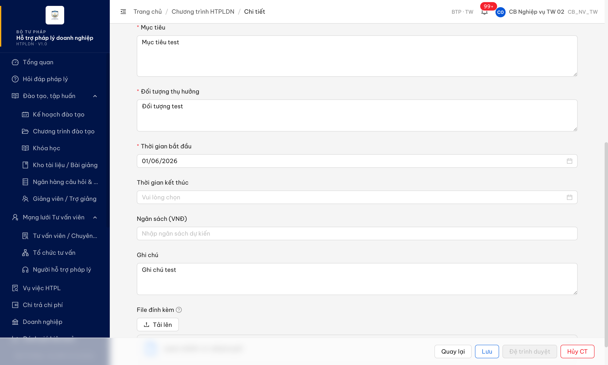
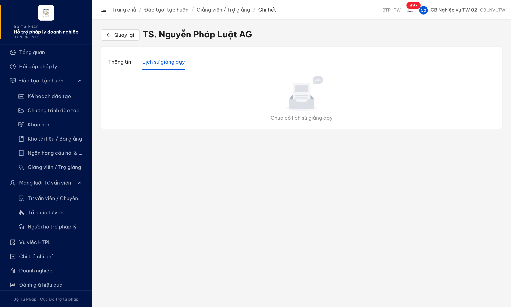
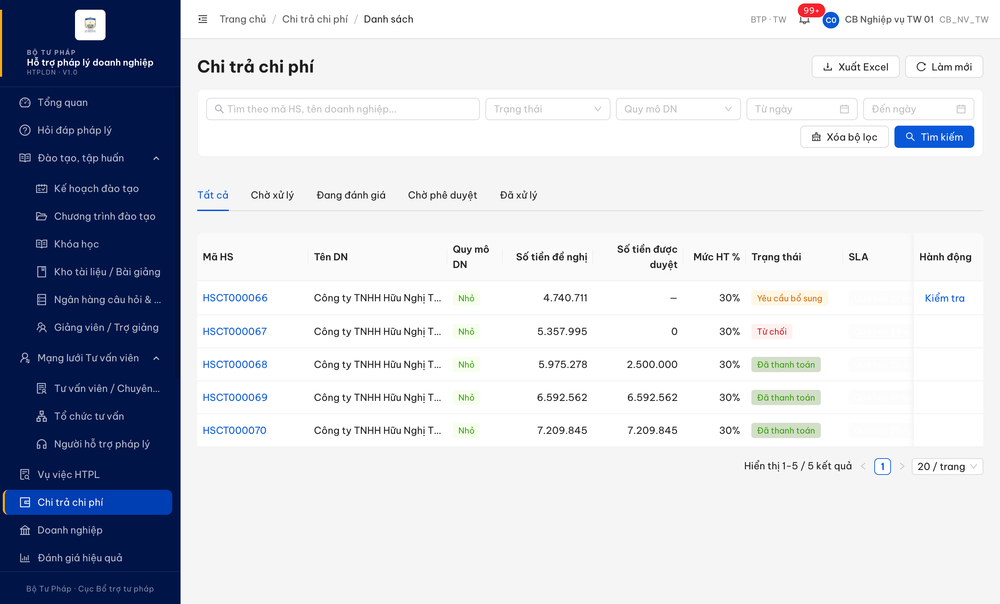
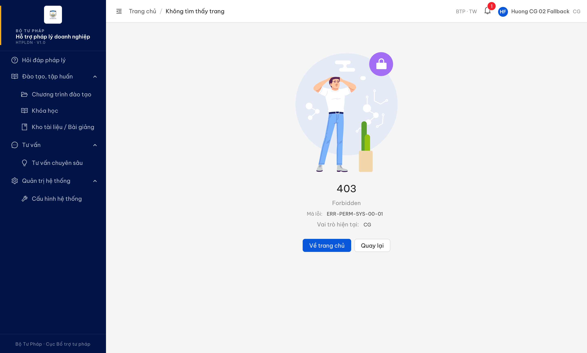

# Bug Report — Verify BA List 2026-05-28 (3 PARTIAL + 3 FAIL confirmed)

| Thông tin | Giá trị |
|-----------|---------|
| **Dự án** | PM HTPLDN |
| **Môi trường** | http://103.172.236.130:3000/ |
| **Người test** | QA Automation via Claude Code |
| **Ngày** | 2026-05-28 19:15:00 |
| **Loại test** | Functional (re-verify BA bug list 2026-05-28) |
| **Round** | R9 |
| **Tài liệu tham chiếu** | `output/BA-report/Bug-report/2026-05-28/srs-validation.md` + `retest-status.md` |

---

## Tổng hợp

Phát hiện **6** bug có SRS reference cụ thể trong quá trình Phase 2 re-test 44 entries từ BA bug list 2026-05-28. 3 PARTIAL (dev fix một phần) + 3 FAIL (bug vẫn còn, dev chưa fix).

### Severity breakdown

| Tổng | Critical | Major | Medium | Minor | Trivial | Closed | Open |
|------|----------|-------|--------|-------|---------|--------|------|
| 6    | 0        | 3     | 2      | 1     | 0       | 0      | 6    |

## Bug Summary Table

| Bug ID | Severity | Priority | Type | TC Ref | **SRS Reference** | Title | Status |
|--------|----------|----------|------|--------|-------------------|-------|--------|
| BUG-CT-R9-004 | Major | P1 | Data | STT 49 (BA list) | `srs-fr-11-ct-htpldn.md` File đính kèm KH (DU_THAO) | PATCH `/chuong-trinh-htpls/:id` trả 500 `ERR-SYS-00-00-01` khi lưu CT có fileDinhKem → file không persist | Open |
| BUG-GV-R9-005 | Major | P1 | Data | STT 27 (BA list) | `srs-fr-03-dao-tao.md` Giảng viên — Lịch sử giảng dạy | Mismatch số khóa đã dạy giữa list endpoint (= 5) và detail endpoint (= 0) cho cùng GV → tab Lịch sử giảng dạy luôn empty | Open |
| BUG-BM-R9-001 | Medium | P2 | UI/UX | STT 48 (BA list) | `srs-fr-09-bieu-mau.md:322-329,373,651` | Preview XLSX/DOC chỉ mở native browser, không render preview như SRS yêu cầu | Open |
| BUG-TVCS-R9-002 | Medium | P1 | Data | STT 63.b (BA list) | `srs-fr-12-tv-chuyen-sau.md:1137` | Section "Nhật ký" có UI nhưng BE không ghi audit log | Open |
| BUG-CHITRA-R9-003 | Minor | P3 | UI/UX | STT 35 (BA list) | `srs-fr-06-chi-tra.md:1386-1391` | SLA cảnh báo overdue có blink animation nhưng không tuân màu spec | Open |
| BUG-PERM-R9-006 | Major | P1 | Permission | STT 63.a (BA list) | `srs-fr-12-tv-chuyen-sau.md` Sidebar menu visibility theo role | Sidebar hiển thị menu "Tư vấn chuyên sâu" cho role CG nhưng click → redirect `/403` Forbidden | Open |

---

## BUG-CT-R9-004 — Lưu CT HTPLDN có file đính kèm trả 500 → file không persist

### Mô tả

Khi user cb_nv_tw_02 đính kèm file (PDF) vào CT HTPLDN ở state DU_THAO rồi bấm "Lưu", hệ thống trả toast "Lỗi hệ thống, vui lòng thử lại sau". File không persist sau reload mặc dù upload endpoint riêng đã trả 201 OK.

### Các bước tái hiện

1. Login `cb_nv_tw_02` / `Secret@123` / OTP `666666`
2. Sidebar → "CT HTPLDN" → DS Chương trình
3. Mở CT đang ở DU_THAO (vd `CT-20260528-0002`)
4. Tại section "File đính kèm" → click "Tải lên" → chọn file PDF (`seed-stt49-ct-attach.pdf`, 95 bytes)
5. Upload list hiện file name + status "done"
6. Click button "Lưu"
7. Quan sát: toast "Lỗi hệ thống, vui lòng thử lại sau"
8. Reload trang → file đính kèm KHÔNG còn trong section

### Kết quả mong đợi

Theo SRS FR-XI CT HTPLDN, CT ở state DU_THAO cho phép cb_nv chỉnh sửa + đính kèm file. Save thành công → file persist sau reload. Toast success "Lưu thành công" hoặc tương đương.

### Kết quả thực tế

- POST `/api/v1/chuong-trinh-htpls/upload` [201] → file upload + scan SACH OK, BE trả `fileId`
- PATCH `/api/v1/chuong-trinh-htpls/{id}` [**500**] với response:
  ```json
  {"success":false,"error":{"code":"ERR-SYS-00-00-01","message":"Lỗi hệ thống, vui lòng thử lại sau"}}
  ```
- Toast "Lỗi hệ thống, vui lòng thử lại sau" hiển thị
- File đính kèm KHÔNG persist sau reload (count = 0)

Payload PATCH gửi cả `fileDinhKem` (array nested với `originFileObj`, `response`, `status` field) và `fileDinhKemIds`. BE 500 nhiều khả năng do parse `fileDinhKem` nested object hoặc validation fail.

### Bằng chứng

**1. Ảnh chụp**:



**2. Network request**:

```
POST /api/v1/chuong-trinh-htpls/upload                 [201]  → upload OK, file scanned SACH
PATCH /api/v1/chuong-trinh-htpls/bedf6bfb-...          [500]  → save FAIL ERR-SYS-00-00-01
```

Request body PATCH (trích):
```json
{
  "tenChuongTrinh": "Test Bug49 Upload File 2026-05-28",
  "fileDinhKem": [{
    "uid": "rc-upload-1779963026632-3",
    "name": "seed-stt49-ct-attach.pdf",
    "size": 95,
    "type": "application/pdf",
    "originFileObj": {"uid": "rc-upload-1779963026632-3"},
    "status": "done",
    "response": {"id": "3d4ebf3a-ba28-49fc-ac98-95486ea6b616", ...}
  }],
  "fileDinhKemIds": ["3d4ebf3a-ba28-49fc-ac98-95486ea6b616"],
  "version": 1
}
```

---

## BUG-GV-R9-005 — Mismatch số khóa đã dạy giữa list endpoint vs detail endpoint

### Mô tả

Trang Danh sách Giảng viên hiển thị "Số khóa đã dạy = 5" cho GV `GV-HDSD-AG-001` (TS. Nguyễn Pháp Luật AG), nhưng khi mở chi tiết GV, tab "Lịch sử giảng dạy" hiển thị empty "Chưa có lịch sử giảng dạy", và API detail trả `soKhoaDaDay: 0` + `lichSuGiangDay: []`. Cùng 1 GV nhưng 2 endpoint cho 2 giá trị khác nhau.

### Các bước tái hiện

1. Login `cb_nv_tw_02` / `Secret@123` / OTP `666666`
2. Sidebar → "Đào tạo, tập huấn" → "Giảng viên / Trợ giảng"
3. Quan sát cột "Số khóa đã dạy" cho `TS. Nguyễn Pháp Luật AG` → hiển thị **5**
4. Click vào tên GV hoặc button edit → vào trang chi tiết
5. Click tab "Lịch sử giảng dạy"
6. Quan sát: empty state "Chưa có lịch sử giảng dạy"
7. (DevTools Network) → call `GET /api/v1/giang-viens/aaffaa02-0000-4000-8000-000000000080` → response `soKhoaDaDay: 0`, `lichSuGiangDay: []`

### Kết quả mong đợi

Theo SRS FR-III Đào tạo, "Số khóa đã dạy" và "Lịch sử giảng dạy" cùng phản ánh KHOA_HOC_GIANG_VIEN của GV. List + detail phải nhất quán: nếu list = 5 thì detail trả 5 records với column Thời gian / Vai trò / Trạng thái. Không được lệch giữa 2 endpoint.

### Kết quả thực tế

- List `GET /api/v1/giang-viens` → response field `soKhoaDaDay: 5` (hiển thị "5" trong cột list)
- Detail `GET /api/v1/giang-viens/aaffaa02-0000-4000-8000-000000000080` → response field `soKhoaDaDay: 0` + `lichSuGiangDay: []`
- UI tab "Lịch sử giảng dạy" → empty, không render table header → không verify được column wording

Mismatch nghi do 2 endpoint compute từ source khác nhau:
- List có thể join + count KHOA_HOC_GIANG_VIEN
- Detail đọc field cache trên entity GIANG_VIEN bảng → không sync khi gán giảng viên cho khóa

### Bằng chứng

**1. Ảnh chụp** (tab Lịch sử giảng dạy empty):



**2. API response detail**:

```json
{
  "success": true,
  "data": {
    "id": "aaffaa02-0000-4000-8000-000000000080",
    "maGiangVien": "GV-HDSD-AG-001",
    "hoTen": "TS. Nguyễn Pháp Luật AG",
    "soKhoaDaDay": 0,
    "lichSuGiangDay": []
  }
}
```

vs list response cùng record có `soKhoaDaDay: 5`.

---

## BUG-BM-R9-001 — Preview XLSX/DOC chỉ mở native browser, không render preview

### Mô tả

Khi user bấm nút "Xem trước" trên trang chi tiết biểu mẫu XLSX (vd `Mẫu Báo cáo thuế quý` BM-HDSD-AG-005), hệ thống mở tab mới với raw XLSX URL từ MinIO (`response-content-disposition=inline`). Browser native không thể render XLSX → thường chỉ download. SRS yêu cầu convert XLSX → bảng preview, DOC → PDF preview trong UI.

### Các bước tái hiện

1. Login `cb_nv_tw_01` / `Secret@123` / OTP `666666`
2. Sidebar → "Biểu mẫu" → "Danh sách biểu mẫu"
3. Click tên biểu mẫu `BM-HDSD-AG-005` (Mẫu Báo cáo thuế quý — XLSX)
4. Click button "Xem trước"
5. Quan sát: mở tab mới với URL MinIO trực tiếp, browser thường download file XLSX thay vì hiển thị preview inline

### Kết quả mong đợi

Theo SRS FR-VII-04 §Processing (line 322-329): "Xem trực tuyến (preview): DOC/DOCX → convert PDF rồi hiển thị, XLS/XLSX → render bảng trực tiếp trong UI, PDF → preview inline (iframe)". User phải xem được nội dung biểu mẫu mà không cần download/cài Office.

### Kết quả thực tế

- Click "Xem trước" XLSX → mở tab 4 URL: `http://103.172.236.130:9000/htpldn/static/bieu-mau/hdsd-ag-005-bc-thue.xlsx?response-content-disposition=inline...`
- Browser Chrome native cannot render XLSX inline → fallback download
- Không có chuyển đổi XLSX → table HTML render

### Bằng chứng

**1. Ảnh chụp**:



**2. URL log từ MCP `list_pages`**:

```
Tab 4: http://103.172.236.130:9000/htpldn/static/bieu-mau/hdsd-ag-005-bc-thue.xlsx?
       response-content-disposition=inline&X-Amz-Algorithm=AWS4-HMAC-SHA256...
```

Phân tích: app trả raw MinIO signed URL, không qua FE converter. PDF inline OK (test STT 24 với Kho bài giảng PASS), nhưng XLSX/DOC fail.

---

## BUG-TVCS-R9-002 — Section "Nhật ký" tồn tại nhưng BE không ghi audit log

### Mô tả

Khi user xem chi tiết Tư vấn chuyên sâu (vd `TVCS-HDSD-CG-001`), accordion "Nhật ký" hiển thị nhưng nội dung empty: "Chưa có nhật ký hoạt động". Record được seed với CG-001 (đã có lifecycle events: create, update, transition state) — phải có ≥1 log entry. SRS yêu cầu BE ghi log mọi CUD + transition.

### Các bước tái hiện

1. Login `cb_nv_tw_01` / `Secret@123` / OTP `666666`
2. Sidebar → "Tư vấn" → "Tư vấn chuyên sâu"
3. Click Xem record đầu tiên (`TVCS-HDSD-CG-001`)
4. Scroll xuống tìm accordion "Nhật ký"
5. Click expand → quan sát nội dung

### Kết quả mong đợi

Theo SRS FR-XII-XX (line 1137): "Accordion: Nhật ký thao tác — format `dd/mm/yyyy HH:mm -- {User} -- {Hành động}`". Mọi CUD + transition trạng thái phải sinh log entry. Record đã được tạo + có lifecycle phải có ≥1 entry như "26/05/2026 14:35 -- huongcg -- Tạo TVCS".

### Kết quả thực tế

- Section "Nhật ký" hiển thị empty state "Chưa có nhật ký hoạt động"
- DOM snapshot từ MCP: `Nhật kýTrốngChưa có nhật ký hoạt động.`
- Record `TVCS-HDSD-CG-001` (Mã có suffix `001`) là record seed → có lifecycle event tạo mới + có thể có update content → BE phải ghi ≥1 entry

### Bằng chứng

**1. MCP evaluate_script output**:

```json
{
  "url": "http://103.172.236.130:3000/tv-chuyen-sau/aaffaa0b-0000-4000-8000-000000000020",
  "sections": [
    "TVCS-HDSD-CG-001",
    "Thông tin cơ bản",
    "Nội dung tư vấn",
    "Tư liệu pháp luật",
    "Trạng thái công khai",
    "Đánh giá chất lượng",
    "Nhật ký"
  ],
  "nhat_ky_content": "Nhật kýTrốngChưa có nhật ký hoạt động."
}
```

---

## BUG-CHITRA-R9-003 — SLA cảnh báo overdue có animation nhưng không rõ tuân màu spec

### Mô tả

List Chi trả chi phí cột SLA hiển thị "Quá hạn 27/29/30 ngày LV" với CSS `@keyframes sla-blink` animation (blink opacity 0.2 ↔ 1). SRS chỉ định 4 mức warning/urgent/critical/overdue (80px) nhưng không quy định màu cụ thể overdue. Hiện FE chỉ dùng animation, không thấy color-coding rõ ràng.

### Các bước tái hiện

1. Login `cb_nv_tw_01` / `Secret@123` / OTP `666666`
2. Sidebar → "Chi trả chi phí"
3. Quan sát cột "SLA" trong list 5 record top (HSCT000066/067/068)
4. Inspect element / xem screenshot cảnh báo

### Kết quả mong đợi

Theo SRS FR-VI-XX (line 1386-1391): "SLA | C07 | 4 mức: warning/urgent/critical/overdue (80px)". User cần phân biệt được 4 mức bằng visual cue rõ ràng (màu/icon/badge).

### Kết quả thực tế

- SLA hiển thị text "Quá hạn 27/29/30 ngày LV"
- Có CSS keyframes `sla-blink { 0%, 100% { opacity: 1; } 50% { opacity: 0.2; } }` — opacity blink animation
- KHÔNG thấy color-coding 4 mức rõ ràng — tất cả "Quá hạn" trông giống nhau
- AMBIGUOUS: SRS không chốt màu/icon cho 4 mức → cần BA chốt spec rồi mới đánh giá vi phạm

### Bằng chứng

**1. Ảnh chụp**:


**2. MCP DOM extract**:

```
SLA cell text content: "@keyframes sla-blink { 0%, 100% { opacity: 1; } 50% { opacity: 0.2; } }Quá hạn 27 ngày LV"
```

CSS keyframes leak vào textContent suggests inline `<style>` injected per row — implementation quirk.

---

## BUG-PERM-R9-006 — Sidebar hiển thị menu "Tư vấn chuyên sâu" cho role CG nhưng click → /403

### Mô tả

Account role CG (Chuyên gia) đăng nhập thấy menu "Tư vấn chuyên sâu" trong sidebar nhưng click vào menu này → redirect trang `/403` "Forbidden" với mã `ERR-PERM-SYS-00-01`. Theo nguyên tắc phân quyền (consistency với các menu Vụ việc / Chi trả / CT HTPLDN đã ẩn cho CG), menu phải ẨN khi role không có quyền truy cập.

### Các bước tái hiện

1. Login QTHT (`qtht_01` / `Secret@123` / OTP `666666`) → Quản trị → Tài khoản
2. Tạo account CG mới: tên đăng nhập `huongcg_02`, mật khẩu `Secret@123`, vai trò "Chuyên gia"
3. Logout QTHT → Login `huongcg_02` / `Secret@123` / OTP `666666`
4. Quan sát sidebar bên trái: có menu "Tư vấn chuyên sâu" (icon bulb) cùng các menu khác
5. Click menu "Tư vấn chuyên sâu"
6. Quan sát: redirect URL `/403`, content trang hiện "Forbidden — ERR-PERM-SYS-00-01 — Vai trò hiện tại: CG"

### Kết quả mong đợi

Theo nguyên tắc phân quyền sidebar đã áp dụng cho các module khác (Vụ việc, Chi trả, CT HTPLDN, Đánh giá) — menu chỉ render với role có quyền truy cập. Role CG không có quyền truy cập module TVCS → menu phải ẨN trong sidebar (consistency cross-module). User không thấy menu thì không click được → không bị redirect 403.

### Kết quả thực tế

- Sidebar render đầy đủ menu "Tư vấn chuyên sâu" cho `huongcg_02`
- Click → `GET /tu-van-chuyen-sau` (FE route) → check permission → redirect `/403`
- Page `/403` hiện text "Forbidden" + "ERR-PERM-SYS-00-01" + "Vai trò hiện tại: CG"
- Trải nghiệm UX: user CG nhầm tưởng có quyền → click bị từ chối → confusion về role/permission

### Bằng chứng

**1. Ảnh chụp**:



### So sánh (Comparison)

| Role | Menu TVCS visible | Click TVCS | Expected |
|------|:-:|:-:|---|
| QTHT (qtht_01) | ✅ | OK (vào module) | ✅ — đúng |
| CB Nghiệp vụ TW (cb_nv_tw_02) | ✅ | OK (vào module) | ✅ — đúng |
| CB Phê duyệt TW (cb_pd_tw_02) | ✅ | OK (vào module) | ✅ — đúng |
| Chuyên gia (huongcg_02) | ✅ (BUG!) | ❌ → /403 | Menu phải ẨN — bug |

---

## Phụ lục — Môi trường test

| Thành phần | Giá trị |
|------------|---------|
| URL ứng dụng | http://103.172.236.130:3000/ |
| OTP login | `666666` bypass |
| MailHog (OTP inbox) | http://103.172.236.130:8025 |
| API base | http://103.172.236.130:3000/api/v1/ |
| Frontend | React + Vite + Ant Design v5 |
| Xác thực | JWT + OTP |
| Tool test | Chrome DevTools MCP (`mcp__chrome-devtools__*`) |

---

## Phụ lục — Cross-account & seed limitation note

Phase 2.5 attempt (2026-05-28 16:55–17:05): mục tiêu self-seed + cross-account verify 16 🚫 BLOCKED entries.

**Đã thử:**
- Login `cb_pd_tw_01` qua `new_page({isolatedContext: "PD"})` — PASS
- Switch back main tab login `cb_nv_tw_01` re-create TCTV nháp → submit Phê duyệt → switch PD verify nút Phê duyệt visible (STT 30 workflow)

**Vấn đề gặp phải (block continuation):**
- JWT revoke aggressive: main tab `cb_nv_tw_01` session bị revoke giữa lúc fill form TCTV (chưa kịp submit). Memory `qa_htpldn_jwt_revoke_aggressive` đã ghi nhận pattern này — BE revoke JWT ~2-5 phút bất kể `exp` claim
- Workflow chain >5 step (login → create TCTV → submit PD → switch context → verify) thường vượt quá time window khả dụng của 1 session

**Đề xuất Round 10:**
- Mở **2 isolated context song song** ngay từ đầu: NV (cb_nv_tw_01) + PD (cb_pd_tw_01) + CG (huongcg) — tránh phải re-login giữa chừng
- Seed dữ liệu (TCTV CHO_PHE_DUYET, VV MOI_TAO, KHOA_HOC_GIANG_VIEN history, ĐG file đính kèm) qua script POST API direct vào DB (nếu memory `feedback_test_method_ui_only` cho phép exception khi UI session bottleneck), HOẶC chia BLOCKED test thành multiple short sessions (≤3 phút mỗi session, mỗi session 1 workflow)
- 16 BLOCKED entries phân thành 4 batch theo độ phụ thuộc data:
  - Batch 1 (cross-account): STT 30 (PD), 63.a (CG)
  - Batch 2 (seed VV state): STT 32 (MOI_TAO)
  - Batch 3 (workflow chấm điểm + file upload): STT 41, 43, 44, 46
  - Batch 4 (workflow chi-tra Thẩm định + Phê duyệt): STT 36, 37

---

*Bug report generated: 2026-05-28 17:10:00 | QA Automation via Claude Code*
