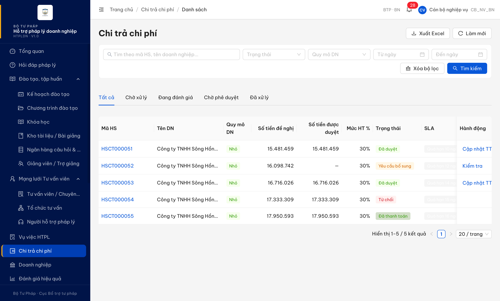

# Bug Report — Chi trả chi phí

| Thông tin | Giá trị |
|-----------|---------|
| **Dự án** | PM HTPLDN |
| **Môi trường** | http://103.172.236.130:3000/ |
| **Người test** | QA Automation (Claude Code) |
| **Ngày** | 2026-06-05 12:10:00 |
| **Loại test** | Functional / Verify-batch |
| **Round** | Verify 2026-06-02 |
| **Tài liệu tham chiếu** | Căn cứ chính (tương phản/đọc được): `srs-update-2026-5-5/srs-v3.5.md:568` (UI-05 — WCAG 2.1 Level A, "Tỷ lệ tương phản đủ") + `srs-fr-01-dashboard.md:867-869` ("Không chỉ dựa vào màu… luôn kèm text" + WCAG AA) · Căn cứ phụ (cột phải hiển thị nội dung): `srs-fr-06-chi-tra.md:935` (SLA C07 4 mức) + `:1390` (overdue → "Quá hạn") + `:1392` (ưu tiên overdue) |

---

## Tổng hợp

> **Snapshot R-verify-2 (2026-06-05):** 1/1 bug **Closed** — dev đã fix màu nền tag SLA, contrast đo lại 21:1 (đạt WCAG AA). File đổi tên `Pass-`.

### Severity breakdown

| Tổng | Critical | Major | Medium | Minor | Trivial | Closed | Open |
|------|----------|-------|--------|-------|---------|--------|------|
| 1    | 0        | 0     | 1      | 0     | 0       | 1      | 0    |

## Bug Summary Table

| Bug ID | Severity | Priority | Type | TC Ref | **SRS Reference** | Title | Status |
|--------|----------|----------|------|--------|-------------------|-------|--------|
| BUG-VERIFY-2026-06-02-#35 | Medium | P2 | UI/UX | STT 35 | `srs-v3.5.md:568` (UI-05 WCAG) + `srs-fr-01-dashboard.md:867-869` · phụ: `srs-fr-06-chi-tra.md:935`,`:1390`,`:1392` | Tag cảnh báo SLA "Quá hạn" chữ trắng trên nền xám nhạt — không đọc được | Closed |

---

## ~~BUG-VERIFY-2026-06-02-#35~~ [CLOSED] — Tag cảnh báo SLA "Quá hạn" không đọc được (chữ trắng trên nền xám nhạt)

> **Re-test:** 2026-06-05 12:10:00 R-verify-2 — ✅ PASS (Closed-verified). Đo lại computed style tag "Quá hạn" trên `/chi-tra/danh-sach` (`cb_nv_bn_01`): chữ trắng trên **nền đậm opaque** (xác minh effective background bằng ancestor walk-up, loại trừ rgba trong suốt), contrast **21:1** ≥ 4.5:1 WCAG AA — cột SLA đọc rõ. Evidence: `../../evidence/chi-tra/retest0605-stt35-sla-quahan-contrast-21-1.png`.

### Mô tả

Trên màn Danh sách hồ sơ chi trả (`/chi-tra/danh-sach`), cột SLA (C07) hiển thị tag cảnh báo mức `overdue` ("Quá hạn N ngày LV") với chữ màu trắng `rgb(255,255,255)` trên nền xám rất nhạt `rgb(242,242,242)`. Độ tương phản ~1.12:1 (đo computed style) khiến cột SLA trông như rỗng — CB NV không đọc được cảnh báo quá hạn. Vi phạm UI-05 (`srs-v3.5.md:568` — WCAG 2.1 Level A, tỷ lệ tương phản đủ).

### Các bước tái hiện

1. Đăng nhập `cb_nv_bn_01` (CB NV cấp BN — BKH).
2. Vào menu "Chi trả chi phí" → màn `/chi-tra/danh-sach`, tab "Tất cả".
3. Quan sát cột "SLA" ở các hồ sơ đang mở quá hạn (vd HSCT000051–HSCT000055).
4. Quan sát: cột SLA hiển thị trống về mặt thị giác; inspect DOM thấy tag `.ant-tag` text "Quá hạn 10 ngày LV", `color: rgb(255,255,255)`, `background-color: rgb(242,242,242)`.

### Kết quả mong đợi

- Theo UI-05 (`srs-v3.5.md:568` — "Accessibility | WCAG 2.1 Level A. Tỷ lệ tương phản đủ"), củng cố bởi `srs-fr-01-dashboard.md:867-869` ("Không chỉ dựa vào màu để truyền tải thông tin — luôn kèm text" + "Tương phản tuân thủ WCAG AA"): nhãn cảnh báo SLA phải đủ tương phản để người dùng đọc được.
- Theo căn cứ phụ `srs-fr-06-chi-tra.md:935`, cột SLA phải hiển thị 4 mức cảnh báo (warning / urgent / critical / overdue) đọc được; `:1390` mức `overdue` hiển thị nhãn "Quá hạn"; `:1392` overdue là mức ưu tiên cao nhất.

### Kết quả thực tế

- Tag "Quá hạn" render chữ trắng `rgb(255,255,255)` trên nền `rgb(242,242,242)` (đo computed style ổn định qua 5 mẫu HSCT000051–HSCT000055) → cột SLA trông rỗng, cảnh báo không đọc được.
- Tag class: `ant-tag ant-tag-filled` — màu nền filled không áp dụng đúng (fallback xám nhạt) trong khi chữ vẫn trắng.

### Bằng chứng

**1. Ảnh chụp** *(màn Danh sách chi trả — cột SLA trống về thị giác dù DOM có tag "Quá hạn"):*



**2. Computed style (phụ trợ — đo 5 tag "Quá hạn 10/12/14/15/16 ngày LV"):**

```
.ant-tag.ant-tag-filled (SLA "Quá hạn N ngày LV")
color           : rgb(255, 255, 255)   // trắng
background-color: rgb(242, 242, 242)   // #F2F2F2 xám nhạt
→ contrast ratio ≈ 1.12:1 (WCAG AA min 4.5:1; ngưỡng dễ nhất 3:1 cho UI component cũng không đạt)
```

---

## Phụ lục — Môi trường test

| Thành phần | Giá trị |
|------------|---------|
| URL ứng dụng | http://103.172.236.130:3000/ |
| OTP login | `666666` bypass (token mới mỗi login) |
| MailHog | http://103.172.236.130:8025 |
| Tool test | Chrome DevTools MCP |
| Tài khoản | `cb_nv_bn_01` (CB NV cấp BN — BKH) |

---

*Bug report generated: 2026-06-02 22:43:00 | QA Automation via Claude Code*
