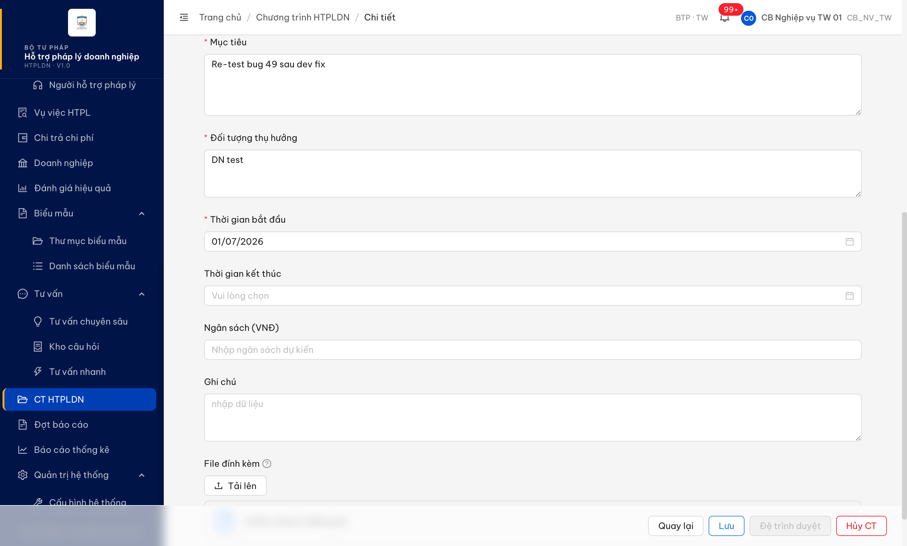

# Bug Report — CT HTPLDN

| Thông tin | Giá trị |
|-----------|---------|
| **Dự án** | PM HTPLDN |
| **Môi trường** | http://103.172.236.130:3000/ |
| **Người test** | QA Automation (Claude Code) |
| **Ngày** | 2026-06-05 13:53:56 |
| **Loại test** | Functional / Verify-batch |
| **Round** | Verify 2026-06-02 |
| **Tài liệu tham chiếu** | `srs-update-2026-5-5/srs-fr-15-ct-htpldn.md:1132` (C15 file-upload khi DU_THAO) · đối chiếu tầng lưu trữ: `srs-fr-15-ct-htpldn.md:127-137` (Inputs FR-XI-01, 9 trường — không có file) + `srs-v3.5.md:3238` (FILE_DINH_KEM CHECK 8 entity_type, không có CHUONG_TRINH_HTPL) + `srs-v3.5.md:2070-2083` (entity CT không có cột file) · `tasks/srs-contradictions.md` SRS-C-006 |

---

## Tổng hợp

> **Snapshot R-verify-2b (2026-06-05 13:53:56):** 1/1 bug **Closed** — lỗi 500 đã hết, file lưu + persist qua API (`entityType=CHUONG_TRINH_HTPL`), app khớp màn hình SRS C15. Mâu thuẫn data-model SRS là việc **sync tài liệu** → theo dõi riêng tại SRS-C-006 (BA), không gate bug app. File đổi tên `Pass-`.

### Severity breakdown

| Tổng | Critical | Major | Medium | Minor | Trivial | Closed | Open |
|------|----------|-------|--------|-------|---------|--------|------|
| 1    | 0        | 0     | 1      | 0     | 0       | 1      | 0    |

## Bug Summary Table

| Bug ID | Severity | Priority | Type | TC Ref | **SRS Reference** | Title | Status |
|--------|----------|----------|------|--------|-------------------|-------|--------|
| BUG-VERIFY-2026-06-02-#49 | Medium | P2 | Functional | STT 49 | `srs-fr-15-ct-htpldn.md:1132` (C15 khi DU_THAO) · đối chiếu `:127-137` + `srs-v3.5.md:3238`,`:2070-2083` · SRS-C-006 | Lưu CT (Dự thảo) kèm file đính kèm trả lỗi hệ thống (500) thay vì lỗi nghiệp vụ rõ ràng | Closed |

---

## ~~BUG-VERIFY-2026-06-02-#49~~ [CLOSED] — Lưu chương trình HTPLDN (Dự thảo) kèm file đính kèm trả lỗi hệ thống (500)

> **Re-test:** 2026-06-05 13:53:56 R-verify-2b — ✅ PASS (Closed-verified). (1) UI: upload PDF → Lưu → `PATCH /chuong-trinh-htpls/:id` có `fileDinhKemIds` = **200**, file hiển thị chi tiết CT-20260604-0001 — evidence `../../evidence/ct-htpldn/retest0605-stt49-patch-file-200-ui.png`. (2) API re-check 13:53: `GET /chuong-trinh-htpls/{id}` → **2 file persist**, `entityType=CHUONG_TRINH_HTPL` — dev đã hiện thực theo phương án (a), khớp màn hình SRS C15 (`srs-fr-15:1133` upload khi DU_THAO) + yêu cầu đối tác. **Lý do đóng dù SRS-C-006 chưa chốt:** defect app (500 + không lưu được) đã hết; phần còn lại là **sync tài liệu SRS** (Inputs FR-XI-01 + entity 3.4.3.10 + CHECK `srs-v3.5.md:3245` chưa có CHUONG_TRINH_HTPL) — track riêng tại SRS-C-006, khuyến nghị BA chốt (a). Nếu BA chốt (b) (gỡ upload) thì là change request mới, không reopen bug này.

### Mô tả

Tại màn Chi tiết Chương trình HTPLDN trạng thái Dự thảo (`/ct-htpldn/:id`), khi CB NV TW tải lên 1 file hợp lệ (PDF) ở trường "File đính kèm" (component C15, SRS:1132) rồi bấm Lưu, hệ thống trả **lỗi hệ thống (500)** và không lưu được. Upload file lên kho thành công (201) nhưng bước lưu chương trình kèm tham chiếu file trả `500 ERR-SYS-00-00-01`. Lưu ý: SRS có mâu thuẫn nội bộ — màn hình prescribe upload file khi DU_THAO (line 1132) nhưng phần Inputs/Entity/ERD của CT HTPLDN không định nghĩa chỗ lưu file (SRS-C-006, chờ BA chốt CT có hỗ trợ file đính kèm hay không). Bất kể BA chốt thế nào, việc BE trả 500 (lỗi hệ thống) cho thao tác người dùng hợp lệ là lỗi xử lý ngoại lệ.

### Các bước tái hiện

1. Đăng nhập `cb_nv_tw_01` (CB NV cấp TW).
2. Mở 1 CT HTPLDN ở trạng thái "Dự thảo" (vd CT-20260602-0001).
3. Ở trường "File đính kèm", bấm "Tải lên" và chọn 1 file PDF hợp lệ (`%PDF` thật) → file lên kho thành công (hiển thị trong danh sách, đã quét sạch).
4. Bấm "Lưu".
5. Quan sát: hệ thống báo lỗi hệ thống; file không được lưu cùng chương trình.

### Kết quả mong đợi

- Khi người dùng thực hiện thao tác hợp lệ (tải file ở trường C15 mà SRS:1132 prescribe cho DU_THAO, rồi bấm Lưu), hệ thống **không được trả lỗi hệ thống (500)**. Lỗi 500 `ERR-SYS` là ngoại lệ không bắt được — luôn là hành vi sai bất kể spec resolve thế nào.
- Vì SRS mâu thuẫn nội bộ (màn hình line 1132 hứa upload, nhưng Inputs FR-XI-01 `:127-137` + entity CT `srs-v3.5.md:2070-2083` + ràng buộc `FILE_DINH_KEM` CHECK `srs-v3.5.md:3238` không định nghĩa chỗ lưu file cho CHUONG_TRINH_HTPL): cần BA chốt (SRS-C-006). Nếu BA xác nhận CT **có** hỗ trợ file đính kèm → file phải lưu thành công. Nếu **không** → BE phải trả lỗi nghiệp vụ rõ ràng (4xx) + màn hình không nên hiện affordance upload.

### Kết quả thực tế

- Bước tải file lên kho thành công (`POST /chuong-trinh-htpls/upload` → **201**).
- Bước lưu chương trình kèm tham chiếu file (`PATCH /chuong-trinh-htpls/:id` có `fileDinhKemIds`) trả **500** `ERR-SYS-00-00-01` "Lỗi hệ thống, vui lòng thử lại sau"; UI hiện toast "Lỗi hệ thống, vui lòng thử lại sau" (bắt qua MutationObserver).
- Đối chứng (cùng phiên, cùng `version`): `PATCH` KHÔNG có `fileDinhKemIds` → **200** (lưu OK). → Lỗi chỉ xảy ra khi payload có `fileDinhKemIds`.

### Bằng chứng

**1. Ảnh chụp** *(màn Chi tiết CT — file đã ở danh sách đính kèm; sau khi bấm Lưu hiện toast "Lỗi hệ thống, vui lòng thử lại sau"):*



**2. API response (phụ trợ — phiên `cb_nv_tw_01`, CT-20260602-0002 `version=1`):**

```json
// POST /api/v1/chuong-trinh-htpls/upload → 201 (file upload OK)

// PATCH /api/v1/chuong-trinh-htpls/82088d58-... (KHÔNG fileDinhKemIds) → 200 { success: true }

// PATCH /api/v1/chuong-trinh-htpls/82088d58-... (có "fileDinhKemIds":["286034b3-..."]) → 500
{ "success": false,
  "error": { "code": "ERR-SYS-00-00-01", "message": "Lỗi hệ thống, vui lòng thử lại sau",
             "requestId": "703cf2ed-000f-4c7a-856a-666cb0392c9d" } }
```

---

## Phụ lục — Môi trường test

| Thành phần | Giá trị |
|------------|---------|
| URL ứng dụng | http://103.172.236.130:3000/ |
| OTP login | `666666` bypass (token mới mỗi login) |
| MailHog | http://103.172.236.130:8025 |
| Tool test | Chrome DevTools MCP |
| Tài khoản | `cb_nv_tw_01` (CB NV cấp TW) |

---

*Bug report generated: 2026-06-02 22:42:00 | QA Automation via Claude Code*
