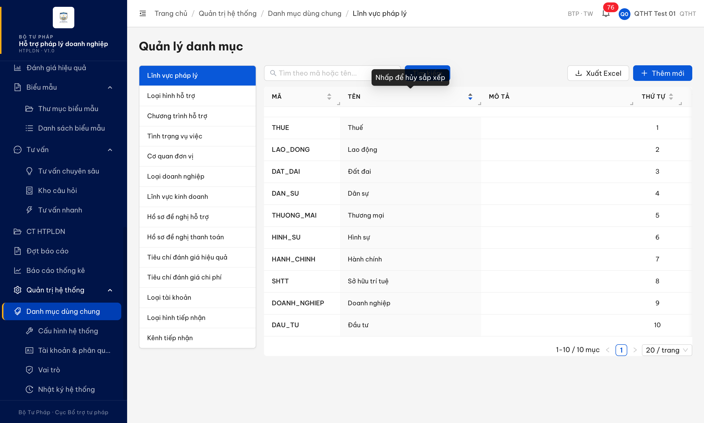

# Bug Report — Quản trị hệ thống · Danh mục dùng chung (SCR-VIII-01)

| Thông tin | Giá trị |
|-----------|---------|
| **Dự án** | PM HTPLDN |
| **Môi trường** | http://103.172.236.130:3000/ |
| **Người test** | QA Automation (Claude Code) |
| **Ngày** | 2026-06-02 22:44:00 |
| **Loại test** | Functional / UI / Verify-batch |
| **Round** | Verify 2026-06-02 |
| **Tài liệu tham chiếu** | `srs-update-2026-5-5/srs-fr-10-quan-tri.md:1609` (Quy tắc tương tác — chỉ "Sắp xếp mặc định theo thu_tu ASC, ten ASC") · `:1572`,`:1573`,`:1575` (cột Mã/Tên/Thứ tự, "Hành vi" = "—") · đối chứng `:1909` (SCR-VIII-09 ghi rõ "sortable") |

---

## Tổng hợp

Verify lại STT 69 → **không phải lỗi nghiệp vụ (false-positive)**. Đã đóng.

> **Ghi chú verify:** SRS SCR-VIII-01 KHÔNG yêu cầu cột có thể sắp xếp tương tác. `srs-fr-10-quan-tri.md:1572/1573/1575` ghi cả 3 cột Mã/Tên/Thứ tự đều có "Hành vi" = "—" (không có tương tác click); `:1609` chỉ quy định "Sắp xếp mặc định theo thu_tu ASC, ten ASC" do BE trả. Đối chứng `:1909` cho thấy khi muốn cột sortable, tác giả SRS ghi rõ "sort"/"sortable DESC" trong cột Hành vi — việc 3 cột SCR-VIII-01 để "—" là chủ ý. NotebookLM cross-check khớp 100%. Vì vậy "nhấp tiêu đề cột → danh sách không sắp lại" là ĐÚNG spec. Việc FE ghi `sortBy/sortOrder` vào URL + đổi `aria-sort` là UI thừa — chỉ ghi observation cho dev gỡ, KHÔNG phải bug vi phạm spec.

### Severity breakdown

| Tổng | Critical | Major | Medium | Minor | Trivial | Closed | Open |
|------|----------|-------|--------|-------|---------|--------|------|
| 1    | 0        | 0     | 0      | 0     | 0       | 1      | 0    |

## Bug Summary Table

| Bug ID | Severity | Priority | Type | TC Ref | **SRS Reference** | Title | Status |
|--------|----------|----------|------|--------|-------------------|-------|--------|
| ~~BUG-VERIFY-2026-06-02-#69~~ | Trivial (Observation) | P4 | UI/UX | STT 69 | `srs-fr-10-quan-tri.md:1609`,`:1572`,`:1573`,`:1575` · đối chứng `:1909` | ~~Nhấp tiêu đề cột sắp xếp ở màn Danh mục chỉ đổi chỉ báo + URL, danh sách không sắp lại~~ | Closed (Không phải lỗi) |

---

## ~~BUG-VERIFY-2026-06-02-#69~~ [CLOSED — Không phải lỗi] — Nhấp tiêu đề cột sắp xếp ở màn Danh mục không sắp lại danh sách

> **Re-test:** 2026-06-02 22:44:00 R-verify — ✅ Đóng (Không phải lỗi · false-positive). SRS SCR-VIII-01 KHÔNG yêu cầu sortable: `srs-fr-10-quan-tri.md:1572/1573/1575` cả 3 cột Hành vi="—", `:1609` chỉ sắp xếp mặc định thu_tu ASC/ten ASC; đối chứng `:1909` (SCR-VIII-09) ghi rõ "sortable" khi thực sự cần. NotebookLM khớp. Hành vi "không sắp lại khi nhấp tiêu đề" là đúng spec. Còn lại: FE để artifact `sortBy/sortOrder` trong URL + toggle `aria-sort` dù không sortable → observation (gợi ý dev gỡ UI thừa), không log thành bug.

### Mô tả

Tại màn Quản lý danh mục (SCR-VIII-01, tab "Lĩnh vực pháp lý"), các cột Mã/Tên/Thứ tự được trình bày dưới dạng có thể sắp xếp (có mũi tên sắp xếp, thuộc tính `aria-sort`). Khi QTHT nhấp tiêu đề cột "Tên", hệ thống đổi chỉ báo sắp xếp (ascending → descending) và ghi `sortBy=ten&sortOrder=DESC` vào URL, nhưng thứ tự các dòng trên bảng **không thay đổi** — vẫn giữ thứ tự mặc định theo `thu_tu`. Sắp xếp tương tác theo cột không có hiệu lực.

### Các bước tái hiện

1. Đăng nhập `qtht_01` (vai trò QTHT).
2. Mở "Quản trị hệ thống" → "Danh mục dùng chung" → tab "Lĩnh vực pháp lý" (`/quan-tri/danh-muc/LINH_VUC_PL`).
3. Quan sát thứ tự mặc định: Thuế(1) · Lao động(2) · Đất đai(3) · Dân sự(4) · Thương mại(5) · Hình sự(6) · Hành chính(7) · Sở hữu trí tuệ(8) · Doanh nghiệp(9) · Đầu tư(10) (theo `thu_tu`).
4. Nhấp tiêu đề cột "Tên" (lần 1 → ascending; lần 2 → descending).
5. Quan sát: chỉ báo sắp xếp trên cột "Tên" đổi (`aria-sort=ascending` → `descending`) và URL thành `...?sortBy=ten&sortOrder=DESC&page=1`, NHƯNG thứ tự dòng giữ nguyên (Thuế/Lao động/Đất đai/Dân sự...).

### Kết quả mong đợi

- Theo `srs-fr-10-quan-tri.md:1609`, SCR-VIII-01 CHỈ yêu cầu "Sắp xếp mặc định theo thu_tu ASC, ten ASC" do BE trả — **không** yêu cầu cột sắp xếp tương tác. `:1572/:1573/:1575` ghi cả 3 cột Mã/Tên/Thứ tự đều có "Hành vi" = "—" (không tương tác click).
- Vì vậy hành vi "nhấp tiêu đề cột → danh sách KHÔNG sắp lại" là **đúng spec**, không phải lỗi.
- Phần đáng gỡ (observation, không phải bug): FE không nên để artifact `sortBy/sortOrder` trong URL + không nên đổi `aria-sort` khi cột không hỗ trợ sắp xếp — gây hiểu nhầm là cột sortable.

### Kết quả thực tế

- Nhấp tiêu đề cột "Tên": chỉ báo sắp xếp đổi (`aria-sort` ascending → descending) và URL ghi `sortBy=ten&sortOrder=DESC`, nhưng thứ tự dòng **không đổi** (vẫn theo `thu_tu`: Thuế → Lao động → Đất đai → Dân sự...). Tái hiện cả 2 chiều ascending/descending.
- Theo dõi mạng: sau khi nhấp tiêu đề cột, FE **không gửi** request danh sách mới kèm tham số sắp xếp. Endpoint duy nhất nạp dữ liệu là `GET /api/v1/danh-muc/tree?loaiDanhMuc=LINH_VUC_PL` (chỉ chạy lúc tải trang, không có `sortBy/sortOrder`), và danh sách cũng không được sắp lại phía client.
- Kết quả: URL + chỉ báo phản ánh trạng thái "đã sắp xếp" trong khi dữ liệu hiển thị không sắp lại → người dùng nhấp sắp xếp nhưng bảng đứng yên.

### Bằng chứng

**1. Ảnh chụp** *(URL = `/quan-tri/danh-muc/LINH_VUC_PL?sortBy=ten&sortOrder=DESC&page=1`, cột "Tên" đang ở trạng thái sắp xếp giảm dần, nhưng danh sách vẫn theo thứ tự mặc định Thuế/Lao động/Đất đai/Dân sự...):*



**2. Mạng (phụ trợ — cùng phiên QTHT `qtht_01`):**

```
GET /api/v1/danh-muc/tree?loaiDanhMuc=LINH_VUC_PL              → 200 (tải trang, KHÔNG kèm sortBy/sortOrder)
[sau khi nhấp tiêu đề cột "Tên" 2 lần]                          → KHÔNG có request danh sách mới
URL thanh địa chỉ: /quan-tri/danh-muc/LINH_VUC_PL?sortBy=ten&sortOrder=DESC&page=1
Thứ tự dòng trước/sau nhấp: THUE → LAO_DONG → DAT_DAI → DAN_SU ... (không đổi)
```

---

## Phụ lục — Môi trường test

| Thành phần | Giá trị |
|------------|---------|
| URL ứng dụng | http://103.172.236.130:3000/ |
| OTP login | `666666` bypass (token mới mỗi login) |
| Tool test | Chrome DevTools MCP |
| Tài khoản | `qtht_01` (QTHT) |

---

*Bug report generated: 2026-06-02 22:44:00 | QA Automation via Claude Code*
