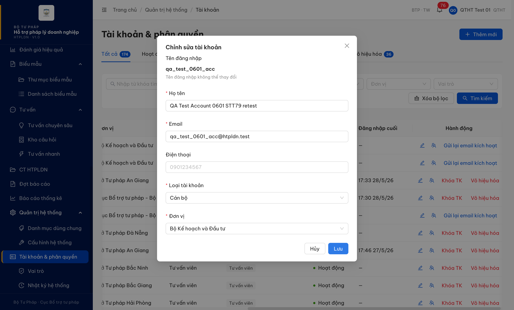

# Bug Report — Quản trị hệ thống · Tài khoản

| Thông tin | Giá trị |
|-----------|---------|
| **Dự án** | PM HTPLDN |
| **Môi trường** | http://103.172.236.130:3000/ |
| **Người test** | QA Automation (Claude Code) |
| **Ngày** | 2026-06-05 12:10:00 |
| **Loại test** | Functional / Verify-batch |
| **Round** | Verify 2026-06-02 |
| **Tài liệu tham chiếu** | `srs-update-2026-5-5/srs-fr-10-quan-tri.md:736` (FR-VIII-15 §Postconditions) |

---

## Tổng hợp

> **Snapshot R-verify-2 (2026-06-05):** 1/1 bug **Closed** — Sửa tài khoản lưu được (PUT 200, version tăng đúng, danh sách cập nhật). File đổi tên `Pass-`.

> **Ghi chú verify:** Mô tả gốc STT 79 ("Sửa mất Loại TK/Đơn vị") KHÔNG tái hiện — form Sửa vẫn điền sẵn đúng Loại TK + Đơn vị và payload `PUT` vẫn gửi kèm 2 trường này. Tuy nhiên việc Sửa tài khoản hiện **không lưu được**: bấm Lưu trả lỗi `version must not be less than 1` và không cập nhật. Bug log dưới mô tả đúng hiện tượng quan sát được.

### Severity breakdown

| Tổng | Critical | Major | Medium | Minor | Trivial | Closed | Open |
|------|----------|-------|--------|-------|---------|--------|------|
| 1    | 0        | 1     | 0      | 0     | 0       | 1      | 0    |

## Bug Summary Table

| Bug ID | Severity | Priority | Type | TC Ref | **SRS Reference** | Title | Status |
|--------|----------|----------|------|--------|-------------------|-------|--------|
| BUG-VERIFY-2026-06-02-#79 | Major | P1 | Data | STT 79 | `srs-fr-10-quan-tri.md:736` (FR-VIII-15 §Postconditions — TAI_KHOAN cập nhật) · SCR-VIII-03 | Sửa tài khoản không lưu được — bấm Lưu báo lỗi "version must not be less than 1", bản ghi không được cập nhật | Closed |

---

## ~~BUG-VERIFY-2026-06-02-#79~~ [CLOSED] — Sửa tài khoản không lưu được (bấm Lưu báo lỗi, không cập nhật)

> **Re-test:** 2026-06-05 12:10:00 R-verify-2 — ✅ PASS (Closed-verified). Sửa `qa_test_0601_acc` (đổi Họ tên → "QA Test Account 0601 RT0605") → bấm Lưu: `PUT /api/v1/tai-khoan/{id}` = **200**, không còn lỗi `version`; modal đóng, danh sách hiển thị Họ tên mới, `version` bản ghi tăng đúng (2→3). Loại TK + Đơn vị giữ nguyên sau lưu. Evidence: `../../evidence/qtht-tai-khoan/retest0605-stt79-edit-save-200.png`.

### Mô tả

Tại màn "Tài khoản & phân quyền" (`/quan-tri/tai-khoan`, SCR-VIII-03), QTHT bấm "Sửa" một tài khoản, đổi một trường (vd Họ tên) rồi bấm "Lưu". Hệ thống hiển thị thông báo lỗi và **không cập nhật** bản ghi: modal vẫn mở, dữ liệu trên danh sách giữ nguyên giá trị cũ. Lỗi lặp lại với mọi tài khoản thử (cả tài khoản "Chờ kích hoạt" lẫn "Hoạt động"), nên tính năng Sửa tài khoản hiện không dùng được.

### Các bước tái hiện

1. Đăng nhập `qtht_01` (Quản trị hệ thống).
2. Mở menu "Quản trị hệ thống" → "Tài khoản & phân quyền".
3. Trên một dòng tài khoản bất kỳ (vd `qa_test_0601_acc`), bấm nút "Sửa" (icon bút).
4. Form "Chỉnh sửa tài khoản" mở ra — Loại tài khoản ("Cán bộ") và Đơn vị ("Bộ Kế hoạch và Đầu tư") đã điền sẵn đúng.
5. Đổi trường "Họ tên" thành giá trị bất kỳ → bấm "Lưu".
6. Quan sát: hiện 2 thông báo lỗi đỏ "version must not be less than 1" và "Đã xảy ra lỗi. Vui lòng thử lại."; modal không đóng; dòng trên danh sách vẫn giữ Họ tên cũ.

### Kết quả mong đợi

- Theo `srs-fr-10-quan-tri.md:736` (FR-VIII-15 §Postconditions: "Bản ghi TAI_KHOAN được tạo/**cập nhật**/khóa/mở khóa"), khi QTHT sửa thông tin tài khoản và bấm Lưu thì bản ghi phải được cập nhật thành công và danh sách phản ánh giá trị mới.

### Kết quả thực tế

- Bấm Lưu → `PUT /api/v1/tai-khoan/{id}` trả **422** `ERR-VAL-SYS-00-01`, field `version`, message "version must not be less than 1" (kèm "version must be an integer number").
- UI hiện 2 toast lỗi: "version must not be less than 1" + "Đã xảy ra lỗi. Vui lòng thử lại."; bản ghi không đổi.
- Nguyên nhân quan sát được: payload `PUT` của form Sửa **không gửi trường `version`** (thực tế bản ghi có `version` hợp lệ trong DB — `qa_test_0601_acc` version=1, `huongcg_02` version=3), nên BE từ chối do thiếu trường kiểm soát phiên bản.
- Màn Chi tiết tài khoản (`/quan-tri/tai-khoan/{id}`) không có form Sửa thay thế (chỉ có nút "Gửi lại email kích hoạt") → không có đường khác để sửa qua UI.

### Bằng chứng

**1. Ảnh chụp** *(form "Chỉnh sửa tài khoản" — Loại TK + Đơn vị điền sẵn đúng; sau khi bấm Lưu hiện 2 toast lỗi "version must not be less than 1" + "Đã xảy ra lỗi. Vui lòng thử lại.", modal không đóng):*



**2. API response (phụ trợ):**

```json
// PUT /api/v1/tai-khoan/c1633cf7-91b2-46f6-a25e-43d28c571390
// Request body (FE gửi — KHÔNG có "version"):
{ "hoTen": "QA Test Account 0601 STT79", "email": "qa_test_0601_acc@htpldn.test",
  "dienThoai": null, "loaiTaiKhoanId": "bbbbbbbb-0000-4000-8000-000000000004",
  "donViId": "00000000-0000-4000-8001-000000000001" }

// Response → 422:
{ "success": false,
  "error": { "code": "ERR-VAL-SYS-00-01", "field": "version",
    "message": "version must not be less than 1",
    "details": [ { "field": "version", "message": "version must not be less than 1" },
                 { "field": "version", "message": "version must be an integer number" } ] } }
```

---

## Phụ lục — Môi trường test

| Thành phần | Giá trị |
|------------|---------|
| URL ứng dụng | http://103.172.236.130:3000/ |
| OTP login | `666666` bypass (token mới mỗi login) |
| MailHog | http://103.172.236.130:8025 |
| Tool test | Chrome DevTools MCP |
| Tài khoản | `qtht_01` (Quản trị hệ thống) |

---

*Bug report generated: 2026-06-02 19:33:31 | QA Automation via Claude Code*
