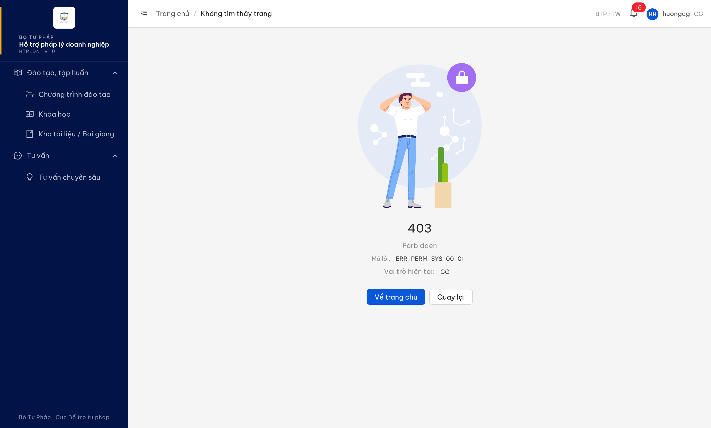

# Bug Report — Tư vấn pháp luật chuyên sâu · Chuyên gia (CG)

| Thông tin | Giá trị |
|-----------|---------|
| **Dự án** | PM HTPLDN |
| **Môi trường** | http://103.172.236.130:3000/ |
| **Người test** | QA Automation (Claude Code) |
| **Ngày** | 2026-06-08 09:25:22 |
| **Loại test** | Functional / Permission / Verify-batch |
| **Round** | Verify 2026-06-02 |
| **Tài liệu tham chiếu** | `input/Input/Danh sách transaction_v1.1_2026-03-27.csv:1307` (STT 147) + `:1321` (STT 148) · `srs-update-2026-5-5/srs-fr-12-tv-chuyen-sau.md:99` (UC147 Tác nhân) + `:330` (UC148 Tác nhân) · `BR-AUTH-10` |

---

## Tổng hợp

Phát hiện **1** lỗi nhất quán FE/phân quyền khi verify lại STT 63 (Danh sách bug 2026-06-02).

> **Snapshot R-verify-5 (2026-06-08 09:25:22 — LATEST):** Dev đã fix → **Closed.** Vai `huongcg`: sidebar nay **không còn** nhóm "Tư vấn" / mục "Tư vấn chuyên sâu" (menu items chỉ còn "Đào tạo, tập huấn") → hết 403 dead-end. Backend vẫn giữ quyền đọc scoped (`read_noi_dung_tu_van_cs`=true, `GET /noi-dung-tu-van-cs` → 200, total=4 vụ được phân công) → fix theo phương án (a) ẩn menu cho CG, không thu hồi quyền đọc hợp lệ. Evidence: `../../evidence/tu-van-chuyen-sau/retest0608-stt63-cg-menu-hidden-fixed.png`.

### Severity breakdown

| Tổng | Critical | Major | Medium | Minor | Trivial | Closed | Open |
|------|----------|-------|--------|-------|---------|--------|------|
| 1    | 0        | 0     | 1      | 0     | 0       | 1      | 0    |

## Bug Summary Table

| Bug ID | Severity | Priority | Type | TC Ref | **SRS Reference** | Title | Status |
|--------|----------|----------|------|--------|-------------------|-------|--------|
| ~~BUG-VERIFY-2026-06-02-#63~~ | Medium | P2 | UI/UX | STT 63 | CSV `transaction_v1.1:1307` (STT147 CB NV) + `:1321` (STT148 CB NV/NHT) · `srs-fr-12-tv-chuyen-sau.md:99,330` · `BR-AUTH-10` | ~~Menu "Tư vấn chuyên sâu" của CG dẫn tới trang 403 — CG có quyền đọc + bản ghi được phân công nhưng không có màn hình xem (menu dead-end)~~ | Closed |

---

## ~~BUG-VERIFY-2026-06-02-#63~~ [CLOSED] — Menu "Tư vấn chuyên sâu" của CG dẫn tới 403 (CG có quyền đọc + bản ghi phân công nhưng không có màn xem)

> **Re-test:** 2026-06-08 09:25:22 R-verify-5 — ✅ PASS (Closed). Vai `huongcg`: sidebar **không còn** nhóm "Tư vấn" / mục "Tư vấn chuyên sâu" (menu items chỉ còn nhóm "Đào tạo, tập huấn") → hết 403 dead-end. Backend giữ quyền đọc scoped (`read_noi_dung_tu_van_cs`=true, `GET /noi-dung-tu-van-cs` → 200 total=4 vụ phân công) → fix theo phương án (a) ẩn menu, không thu hồi quyền hợp lệ. Evidence: `../../evidence/tu-van-chuyen-sau/retest0608-stt63-cg-menu-hidden-fixed.png`. *Phân biệt scope:* phần STT 63 theo BA (CG đọc tài liệu pháp lý + ghi audit) đã đóng ở report 06-04 (BUG-TVCS-063).

### Mô tả

Đăng nhập vai trò Chuyên gia (CG, `huongcg`), sidebar hiển thị menu "Tư vấn chuyên sâu". Khi CG nhấp menu này (route danh sách/quản lý SCR-X1-01), hệ thống điều hướng sang trang **403 Forbidden** (`ERR-PERM-SYS-00-01`). Theo CSV nguồn (STT 147 = chỉ CB NV; STT 148 = CB NV + NHT) và SRS FR-X.1-01/02, **CG không phải tác nhân màn quản lý SCR-X1-01** nên 403 ở route này là đúng. Vấn đề là: backend vẫn cấp CG quyền `read_noi_dung_tu_van_cs` và trả về 4 bản ghi tư vấn được phân công cho chính CG (scoped đúng BR-AUTH-10), đồng thời sidebar vẫn hiện menu "Tư vấn chuyên sâu" cho CG. Kết quả CG có quyền đọc + có dữ liệu vụ được giao nhưng menu dẫn tới **403 dead-end** — không có màn hình nào (scoped) để CG xem các vụ tư vấn của mình.

### Các bước tái hiện

1. **Đăng nhập `huongcg` (vai trò Chuyên gia — CG).** Theo CSV `transaction_v1.1:1307/1321` + `permission-matrix`, CG KHÔNG phải tác nhân màn quản lý/tìm kiếm SCR-X1-01; nhưng backend cấp CG quyền `read_noi_dung_tu_van_cs` (scoped theo vụ được phân công).
2. Quan sát sidebar: nhóm "Tư vấn" → có mục "Tư vấn chuyên sâu" (menu hiện cho CG).
3. Nhấp menu "Tư vấn chuyên sâu".
4. Quan sát: trang chuyển sang `/403` — "403 Forbidden", "Mã lỗi: ERR-PERM-SYS-00-01", "Vai trò hiện tại: CG".
5. (Đối chiếu API, cùng phiên CG) `GET /api/v1/noi-dung-tu-van-cs?pageSize=100` → 200, `total=4`, cả 4 record cùng `chuyenGiaId` = bản ghi chuyên gia của CG (scoped đúng).
6. (Đối chiếu UI) Mở chi tiết một vụ được phân công bằng URL `/tv-chuyen-sau/{id}` → hiển thị bình thường, CG đọc được.

### Kết quả mong đợi

- Theo `input/Input/Danh sách transaction_v1.1_2026-03-27.csv:1307` (STT 147, Tác nhân = "Cán bộ nghiệp vụ TW,BN,ĐP") và `:1321` (STT 148, Tác nhân = "Cán bộ nghiệp vụ TW,BN,ĐP/Người hỗ trợ"), cùng `srs-fr-12-tv-chuyen-sau.md:99` ("Tác nhân: Cán bộ Nghiệp vụ (TW/BN/ĐP)") và `:330` ("Tác nhân: ...Người hỗ trợ"): màn SCR-X1-01 chỉ dành cho CB NV/NHT — CG không phải tác nhân, nên **chặn route quản lý cho CG là đúng**.
- Theo `BR-AUTH-10` + xác nhận NotebookLM: CG xem các vụ tư vấn được phân công qua **màn chi tiết / danh sách công việc cá nhân của CG**, không qua màn quản lý SCR-X1-01.
- Vì vậy hệ thống cần **nhất quán**: hoặc (a) **ẩn menu** "Tư vấn chuyên sâu" với CG (role không phải tác nhân màn này — theo quy ước "UI ẩn" trong permission-matrix), hoặc (b) route menu của CG tới **màn danh sách scoped** hiển thị đúng các vụ CG được phân công. Không nên để menu dẫn tới trang 403 dead-end.

### Kết quả thực tế

- Nhấp menu "Tư vấn chuyên sâu" → điều hướng `/403` (`ERR-PERM-SYS-00-01`, "Vai trò hiện tại: CG"). Tái hiện nhiều lần.
- Backend cấp CG quyền đọc: `auth/me` → `permissions` chứa `read_noi_dung_tu_van_cs`, `create_noi_dung_tu_van_cs`, `update_noi_dung_tu_van_cs`.
- `GET /api/v1/noi-dung-tu-van-cs?pageSize=100` → **200**, `total=4`, 4/4 record cùng `chuyenGiaId=23afb884-...` (scoped đúng theo vụ CG được phân công — KHÔNG phải full-list đơn vị).
- CG mở được chi tiết vụ được phân công qua deep-link, nhưng **menu sidebar dẫn tới 403** → CG không có lối vào UI cho danh sách vụ của mình.

### Bằng chứng

**1. Ảnh chụp** *(CG `huongcg` nhấp menu "Tư vấn chuyên sâu" → trang 403 Forbidden, ERR-PERM-SYS-00-01, Vai trò hiện tại: CG; sidebar vẫn hiện mục "Tư vấn chuyên sâu"):*



**2. API (phụ trợ — cùng phiên CG `huongcg`):**

```
auth/me → vaiTro:["CG"], capDonVi:"TW",
  permissions: [..., "read_noi_dung_tu_van_cs", "create_noi_dung_tu_van_cs",
                "update_noi_dung_tu_van_cs", "read_tu_lieu_phap_ly_vv", ...]

GET /api/v1/noi-dung-tu-van-cs?page=1&pageSize=100 → 200
  total = 4
  4/4 record cùng chuyenGiaId = 23afb884-... (scoped theo vụ CG được phân công, BR-AUTH-10)
```

Backend cấp CG quyền đọc + trả dữ liệu scoped (200), trong khi route FE `/tv-chuyen-sau/danh-sach` (SCR-X1-01) trả `/403` — menu dẫn CG tới dead-end thay vì màn scoped.

### So sánh (phân quyền)

| Vai trò | Tác nhân SCR-X1-01 (CSV/SRS) | Mở menu "Tư vấn chuyên sâu" | Backend `GET /noi-dung-tu-van-cs` |
|---|---|---|---|
| CB Nghiệp vụ TW (`cb_nv_tw_01`) | ✅ Có (STT147/148) | ✅ Vào màn quản lý | ✅ 200 (full theo đơn vị) |
| NHT (`nht_01`) | ✅ Có (STT148, Read-only) | ✅ Vào màn (Read-only) | ✅ 200 (theo đơn vị) |
| CG (`huongcg`) | ❌ KHÔNG phải tác nhân | ⚠️ Menu hiện → click → `/403` dead-end | ✅ 200 (4 record scoped vụ được phân công) |

CG không phải tác nhân màn SCR-X1-01 nên 403 ở route quản lý là đúng; lỗi là menu vẫn hiện cho CG dẫn tới 403 thay vì ẩn menu hoặc route tới màn scoped của CG.

---

## Phụ lục — Môi trường test

| Thành phần | Giá trị |
|------------|---------|
| URL ứng dụng | http://103.172.236.130:3000/ |
| OTP login | `666666` bypass (token mới mỗi login) |
| Tool test | Chrome DevTools MCP |
| Tài khoản | `huongcg` (CG), đối chiếu `cb_nv_tw_01` (CB NV TW) |

---

*Bug report generated: 2026-06-02 22:18:54 | QA Automation via Claude Code*
