# Bug Report — Verify UAT đợt 2 (chốt BA 03/06/2026)

| Thông tin | Giá trị |
|-----------|---------|
| **Dự án** | PM Hỗ trợ Pháp lý Doanh nghiệp (PM-HTPLDN) |
| **Môi trường** | http://103.172.236.130:3000/ |
| **Người test** | QA Automation (Chrome DevTools MCP) |
| **Ngày** | 2026-06-07 18:58:58 |
| **Loại test** | Regression — verify app so với **quyết định BA** (issue-UAT-2026-06-02.md) |
| **Round** | Verify UAT đợt 2 → **re-test R-verify-4** sau dev deploy fix chiều 2026-06-07 |
| **Tài liệu tham chiếu** | [issue-UAT-2026-06-02.md](../issue-UAT-2026-06-02.md) (BA confirm) · [CSV đối tác](../PM_HTPLDN_Danh_sách_tối_ưu_Bug+API_Phần_mềm.csv) (Mong muốn) · SRS v3.5 |

---

## Tổng hợp

> **Tiêu chí chấm (theo yêu cầu):** lấy **file BA confirm + dòng "Mong muốn" đối tác** làm chuẩn.
> - Mục BA **✅ chấp nhận sửa** → app phải làm đúng **yêu cầu đối tác** (CSV) + phương án BA → đúng = ✅, sai = ❌.
> - Mục BA **❌ không sửa / giữ nguyên** → app phải **giữ đúng hành vi BA chốt** → giữ = ✅, đổi = ❌.
> - **⚠️ Một phần:** mục nhiều yêu cầu, app làm đúng phần chính BA chốt nhưng **thiếu 1 sub-part** → đánh dấu ⚠️ và log bug cho phần thiếu.

> **Snapshot R-verify-4 (2026-06-07 18:58:58 — LATEST):** Dev deploy fix chiều 07/06 → re-test 7 bug Open bằng 3 role (`cb_nv_tw_03`, `huongcg` (CG), `admin`), verify 2 method (UI + API/openpyxl). Kết quả: **7/7 bug đóng được — toàn bộ 12 bug Closed.** 060 DANG_TU_VAN đã có nút Sửa + form đủ "Thông tin cơ bản" · 063 Q1 ✅ + Q2 ghi audit `XEM_TU_LIEU` (actor huongcg) · 056 "Mô tả công khai" nay là rich editor · 066b form bài giảng đã có input Ảnh đại diện · 058 điểm phù hợp chuẩn hoá 0–100% (100/84/50/44…) · 085 Excel in "Đơn vị: Toàn quốc" + header 4 dòng + viền · 057 `<body spellcheck=false>` áp toàn cục (combobox search hết bật). Verify 15 mục: ✅ 15 · ⚠️ 0 · ❌ 0.

### Severity breakdown (12 bug)

| Tổng | Critical | Major | Medium | Minor | Trivial | Closed | Open |
|------|----------|-------|--------|-------|---------|--------|------|
| 12   | 0        | 3     | 7      | 2     | 0       | 12     | 0    |

---

## Bảng kết quả verify (15 mục — snapshot R-verify-4 LATEST 2026-06-07 18:58:58)

| STT | Mã R | Loại QĐ BA | Căn cứ verify (chuẩn) | TK test | App thực tế (re-test 07/06 chiều) | Kết quả |
|:-:|:-:|---|---|---|---|:-:|
| 22 | — | ✅ Sửa SRS | Mô tả bài giảng **tùy chọn** (đối tác) | cb_nv_tw_03 | Form Mô tả `required:false` (R1 04/06) | ✅ PASS |
| 56 | R60 | ✅ Sửa SRS (+dev) | Mở đăng ký từ/đến (BA) **+** Mô tả công khai editor (đối tác) | cb_nv_tw_03 | Mở đăng ký ✅; "Mô tả công khai" nay là **rich editor** (toolbar B/I/U/list/link, 0/5000) ở form thêm + sửa | ✅ PASS |
| 57 | R61 | ❌ Dev (khớp SCR-X1-02) | DN dropdown **+** spellcheck=false mọi ô (đối tác) | cb_nv_tw_03 | `<body spellcheck="false">` áp toàn cục → mọi ô (gồm 4 combobox search) `spellcheck=false` | ✅ PASS |
| 58 | R62 | ✅ Sửa SRS nhẹ | Relevance **0–100%** (BA + đối tác) | cb_nv_tw_03 | Chuẩn hoá 0–100%: API `relevanceScore` = 100/84/50/44/44/43/31/31/31/12; UI hiển thị đúng, không clamp | ✅ PASS |
| 59 | R63 | DEV (bug chọn Q&A) | Chọn Q&A từ kho không lỗi + bỏ chọn (đối tác) | cb_nv_tw_03 | Chọn/Gửi OK; có "Bỏ chọn" (R1 04/06) | ✅ PASS |
| 60 | R64 | ❌ Dev (bug form) | Form sửa đủ trường như thêm mới ở TIEP_NHAN/DANG_TU_VAN (SCR-X1-02) | cb_nv_tw_03 | DANG_TU_VAN nay có nút **Sửa** (list + chi tiết); modal đủ nhóm Thông tin cơ bản (DN/Lĩnh vực/Ngày/Chuyên gia), submit "Lưu" | ✅ PASS |
| 63 | R67 | ✅ Sửa SRS | Q1 CG đọc tư liệu (no 403) + Q2 ghi nhật ký (BR-AUTH-14 / BR-DATA-05) | huongcg + admin | Q1 hết 403 ✅; Q2 audit ghi `XEM_TU_LIEU` (actor huongcg, endpoint GET /tu-lieu-phap-ly-vvs, 11:56:45Z) | ✅ PASS |
| 64 | R68 | ❌ Không sửa (giữ duyệt ở chi tiết) | Danh sách **chỉ** "Xem chi tiết", KHÔNG có Phê duyệt/Từ chối inline | cb_pd_tw_03 | Danh sách chỉ còn icon Xem chi tiết; duyệt giữ ở màn chi tiết | ✅ PASS |
| 66 | R70 | ✅ Sửa SRS | Cột Công khai **+** bộ lọc; chi tiết Ảnh đại diện + Ngày công khai (đối tác) | cb_nv_tw_03 | Cột + bộ lọc Công khai ✅; preview có Ngày công khai + Ảnh ✅ (form thiếu input Ảnh → bug mới 066b) | ✅ PASS |
| 68 | R72 | ✅ Đã quyết (gói STT11) | Đổi "Tóm tắt"→"**Tiêu đề**" **bắt buộc** (BA + đối tác) | cb_nv_tw_03 | Nhãn "Tiêu đề" + bắt buộc (dấu `*`, chặn submit khi trống) | ✅ PASS |
| 69 | — | ✅ Đã áp SRS | **Chỉ** cột Tên sortable (BA) | admin | Chỉ còn cột Tên sortable; Mã/Thứ tự đã gỡ control | ✅ PASS |
| 72 | R76 | ❌ Không ẩn | Giữ danh mục VSIC hiển thị (BA) | admin | Vẫn hiển thị, 517 record VSIC (R1 04/06) | ✅ PASS |
| 80 | R84 | ✅ Sửa SRS | Bỏ field MK admin **+** email **link kích hoạt**, KHÔNG gửi MK thô | admin | Email gửi **link kích hoạt** `/auth/kich-hoat?token=…`, không còn MK thô (note wording "7 ngày") | ✅ PASS |
| 85 | R88 | DEV (SRS dòng 1086) | Excel có header (tên BC/kỳ/đơn vị/ngày tạo) + kẻ viền | cb_nv_tw_03 | openpyxl: R1 tên BC · R2 kỳ · R3 **"Đơn vị: Toàn quốc"** (đúng phạm vi không lọc) · R4 ngày tạo; data rows có viền | ✅ PASS |
| 96 | R100 | ✅ Sửa SRS | Bỏ Địa bàn, dùng Đơn vị, bỏ so_nht (BA) | cb_nv_tw_03 | Dùng Đơn vị, không Địa bàn/NHT (R1 04/06) | ✅ PASS |
| **Tổng** | | | | | | ✅15 · ⚠️0 · ❌0 |

---

## Bảng TC chưa đạt — cần làm gì để đạt (phân loại 6 nhóm A–F, R-verify-4)

> Hiện **0 mục chưa đạt** — toàn bộ 7 mục Open từ R-verify-3 đã được dev fix và verify đạt chiều 07/06 (UI + API/openpyxl). Không còn mục nào chờ dev/seed/BA/env.

| STT | Vì sao chưa đạt | Nhóm | Cần làm gì để đạt | Ai làm |
|:-:|---|:-:|---|:-:|
| — | (không còn mục chưa đạt) | — | — | — |

> **Ghi chú phạm vi còn lại (không block đóng bug, theo dõi riêng):**
> - **STT 56:** Editor "Mô tả công khai" đã có; phần *render nội dung lên chuyên trang Cổng PLQG* cần môi trường Cổng để kiểm — theo dõi khi sandbox Cổng sẵn sàng.
> - **STT 63:** Leg **xem** tư liệu đã ghi audit `XEM_TU_LIEU`; leg **tải file** dùng endpoint khác (chưa lộ ở `/tu-lieu-phap-ly-vvs/{id}/file|files|download` → 404) nên chưa kích hoạt riêng để kiểm — theo dõi khi xác định endpoint tải.

---

## Bug Summary Table (12 bug — 12 Closed · 0 Open, R-verify-4 2026-06-07)

| Bug ID | Severity | Priority | Type | STT | **BA / SRS Reference** | Title | Status |
|--------|----------|----------|------|-----|------------------------|-------|--------|
| ~~BUG-QT-080~~ | Major | P0 | Data/Security | 80 | BA dòng 249/262 · `srs-fr-10` FR-VIII-15 | ~~Email tạo TK gửi mật khẩu tạm thô — BA chốt gửi link kích hoạt, KHÔNG gửi MK~~ | Closed |
| ~~BUG-TVCS-064~~ | Major | P1 | Permission/Process | 64 | BA dòng 343/347 · SCR-X1-01/02 dòng 1142 | ~~Danh sách có Phê duyệt/Từ chối inline — BA chốt KHÔNG thêm~~ | Closed |
| ~~BUG-TVCS-060~~ | Major | P1 | Data | 60 | SCR-X1-02 dòng 1136/1142 | ~~Form sửa TVCS (TIEP_NHAN/DANG_TU_VAN) thiếu nhóm "Thông tin cơ bản"~~ | Closed |
| ~~BUG-TVCS-063~~ | Medium | P2 | Data/Security | 63 | BA dòng 175 Q2 · BR-DATA-05 | ~~Hành vi CG xem/tải tư liệu pháp lý không được ghi nhật ký (AUDIT_LOG)~~ | Closed |
| ~~BUG-KH-056~~ | Medium | P2 | UI/UX | 56 | BA dòng 46/68 · `srs-fr-03` `mo_ta_cong_khai` (dòng 131) | ~~Form khóa học thiếu trường "Mô tả công khai" (editor)~~ | Closed |
| ~~BUG-BG-066~~ | Medium | P2 | UI/UX | 66 | BA dòng 100-102 · `srs-fr-03` FR-III-08 / SCR-III-03 | ~~Danh sách bài giảng thiếu cột Công khai; chi tiết thiếu Ảnh/Ngày CK~~ | Closed |
| ~~BUG-BG-066b~~ | Medium | P2 | UI/UX | 66 | `srs-fr-03` FR-III-07 field 7 `anh_dai_dien` (dòng 713) | ~~Form thêm/sửa bài giảng thiếu input "Ảnh đại diện" (chi tiết đã hiển thị)~~ | Closed |
| ~~BUG-TVN-058~~ | Medium | P2 | UI/UX | 58 | BA dòng 355 · `srs-fr-13` FR-X.2-02 | ~~"% phù hợp" hiển thị >100% (268% / 144% / 134%)~~ | Closed |
| ~~BUG-TVCS-068~~ | Medium | P2 | UI/UX | 68 | BA dòng 203-204 (gói STT11) · `srs-fr-12` `tieu_de` | ~~TVCS chưa đổi "Tóm tắt"→"Tiêu đề" + chưa bắt buộc~~ | Closed |
| ~~BUG-BC-085~~ | Medium | P2 | UI/UX | 85 | `srs-fr-11` dòng 1086 + dòng 95 `don_vi_ten` | ~~Excel xuất báo cáo thiếu header (tên BC/kỳ/đơn vị/ngày) + viền~~ | Closed |
| ~~BUG-TVCS-057~~ | Minor | P3 | UI/UX | 57 | BA dòng 127 · SCR-X1-02 dòng 1136 | ~~Ô nhập chưa tắt spellcheck (DN dropdown đã đạt)~~ | Closed |
| ~~BUG-DM-069~~ | Minor | P3 | UI/UX | 69 | BA dòng 319 · `srs-fr-10` SCR-VIII-01 dòng 1573 | ~~Cột Mã + Thứ tự vẫn sortable (BA chốt chỉ "Tên")~~ | Closed |

---

## CHI TIẾT CÁC BUG

## ~~BUG-QT-080~~ [CLOSED] — Email tạo TK gửi mật khẩu tạm thô (BA chốt gửi link kích hoạt, KHÔNG gửi MK)

> **Re-test:** 2026-06-05 12:10:00 R-verify-2 — ✅ PASS (Closed-verified). Tạo TK mới `qa_verify_stt80_0605`: form ghi chú đã đổi sang "gửi link kích hoạt"; email MailHog chỉ chứa link `/auth/kich-hoat?token=…`, **không còn mật khẩu tạm**. Evidence: `image/retest0605-stt80-form-link-kichhoat-note.png`. *Lưu ý wording (không reopen):* email ghi link "có hiệu lực 7 ngày" trong khi SRS quy định token vĩnh viễn cho TK CHO_KICH_HOAT (`srs-fr-10-quan-tri.md:1302`) — đề nghị dev/BA đồng bộ câu chữ hoặc hành vi hết hạn.

### Mô tả

BA chốt: (1) bỏ trường `mat_khau` của admin; (2) user **tự đặt mật khẩu qua link kích hoạt**, email **KHÔNG gửi mật khẩu trực tiếp** (lý do an toàn thông tin). Thực tế: form thêm TK đã bỏ trường mật khẩu (đạt phần 1), NHƯNG email tạo TK **gửi mật khẩu tạm dạng thô** + chỉ kèm link đăng nhập chung (không phải link kích hoạt để user tự đặt MK). App làm **ngược** phần "không gửi MK trực tiếp".

### Các bước tái hiện

1. Đăng nhập role **Quản trị hệ thống** (`admin`, quyền quản lý tài khoản theo FR-VIII-15).
2. **Quản trị hệ thống → Tài khoản & phân quyền → Thêm mới**.
3. Quan sát modal "Thêm tài khoản mới": **không có** trường mật khẩu (đạt) — nhưng có dòng ghi chú *"Hệ thống sẽ tự sinh mật khẩu tạm và gửi tới email người dùng…"*.
4. Mở MailHog (http://103.172.236.130:8025), đọc email gửi tới user vừa tạo (`qa_verify_stt80_0604`).

### Kết quả mong đợi (theo BA)

- Email gửi **link kích hoạt** để user tự đặt mật khẩu lần đầu; **KHÔNG** chứa mật khẩu (BA dòng 262: *"không gửi mật khẩu trực tiếp — lý do an toàn thông tin"*; đồng bộ SM dòng 2224 user đặt MK lần đầu).

### Kết quả thực tế

- Form bỏ trường mật khẩu ✅. NHƯNG ghi chú form + email xác nhận hành vi gửi **mật khẩu tạm thô**.

### Bằng chứng

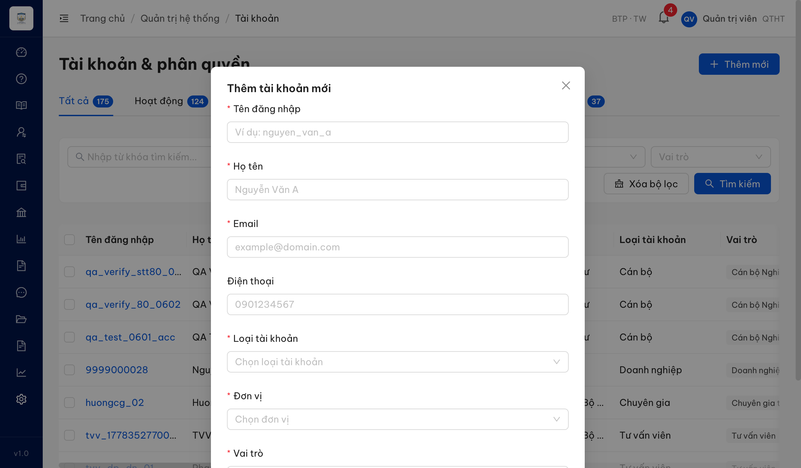
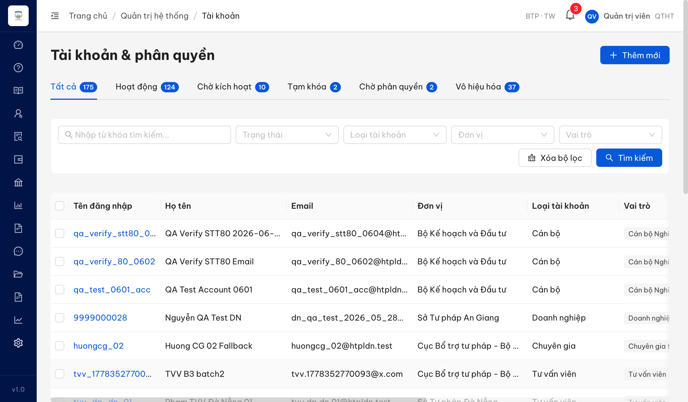

**Email (MailHog, giải mã quoted-printable):**

```
Tiêu đề: Tài khoản hệ thống PM-HTPLDN đã được tạo
Tên đăng nhập: qa_verify_stt80_0604
Mật khẩu tạm: 3rb&V4n!8*i@BG              ← BA chốt KHÔNG gửi MK trực tiếp
Trang đăng nhập: http://103.172.236.130:3000/auth/login   ← link đăng nhập chung, KHÔNG phải link kích hoạt đặt MK
```

---

## ~~BUG-TVCS-064~~ [CLOSED] — Màn danh sách TVCS có nút Phê duyệt/Từ chối inline (BA chốt KHÔNG thêm)

> **Re-test:** 2026-06-05 12:10:00 R-verify-2 — ✅ PASS (Closed-verified). Vai `cb_pd_tw_03`: cột Hành động ở danh sách (gồm bản ghi "Chờ phê duyệt") chỉ còn icon **Xem chi tiết**; nút Phê duyệt/Từ chối chỉ xuất hiện trong màn chi tiết — đúng BA dòng 343/347. Evidence: `image/retest0605-stt64-list-only-eye-cbpd.png`, `image/retest0605-stt64-detail-keeps-pheduyet.png`.

### Mô tả

BA chốt 03/06/2026 **❌ không sửa** — giữ thao tác Phê duyệt/Từ chối ở **màn chi tiết** (chống duyệt hình thức), chỉ thêm icon **"Xem chi tiết"** ở danh sách. App lại hiển thị **cả Phê duyệt + Từ chối inline** ở danh sách; bấm Phê duyệt → hộp xác nhận → duyệt thẳng. App làm **ngược** điều BA chốt.

### Các bước tái hiện

1. Đăng nhập role **CB Phê duyệt TW** (`cb_pd_tw_03`, quyền duyệt TVCS).
2. Vào **Tư vấn → Tư vấn chuyên sâu** (danh sách).
3. Tìm bản ghi "Chờ phê duyệt" (TVCS-20260507-0013).
4. Cột "Hành động": có icon **eye** (Xem chi tiết) + **check** (Phê duyệt) + **close** (Từ chối).
5. Bấm icon check → hộp "Phê duyệt nội dung tư vấn? Bạn xác nhận phê duyệt 'TVCS-20260507-0013'?" với [Hủy] [Phê duyệt] → có thể duyệt ngay từ danh sách.

### Kết quả mong đợi (theo BA)

- Danh sách **chỉ** có icon "Xem chi tiết"; Phê duyệt/Từ chối **chỉ ở màn chi tiết** (BA dòng 343/347; SCR-X1-02 dòng 1142).

### Kết quả thực tế

- Danh sách có Xem chi tiết + **Phê duyệt** + **Từ chối**; hộp xác nhận cho duyệt trực tiếp từ danh sách.

### Bằng chứng

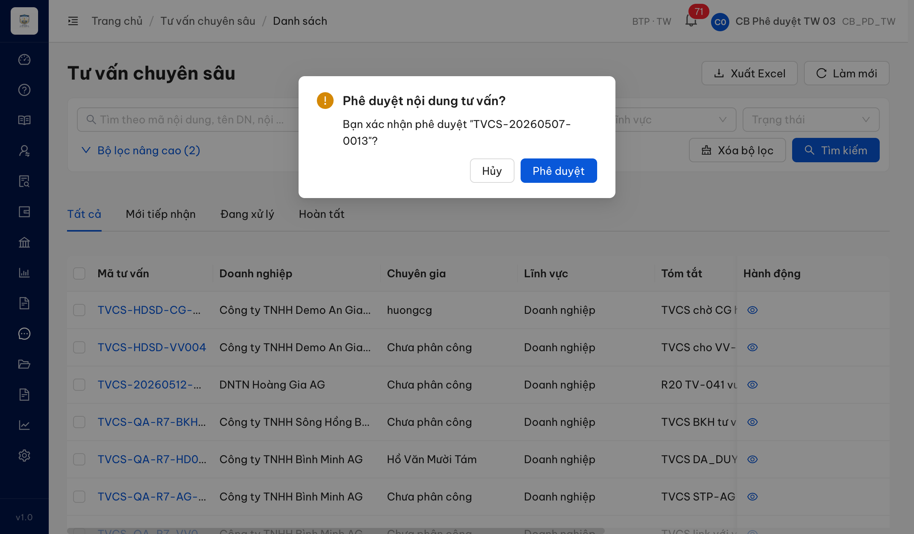

---

## ~~BUG-TVCS-060~~ [CLOSED] — Form sửa TVCS (trạng thái Tiếp nhận/Đang tư vấn) thiếu nhóm "Thông tin cơ bản"

> **Re-test:** 2026-06-07 18:58:58 R-verify-4 — ✅ PASS (Closed). DANG_TU_VAN nay có nút **Sửa** ở cả danh sách (TVCS-HDSD-VV004, TVCS-QA-R7-VV041 có icon edit) lẫn chi tiết (nút "Sửa"); modal "Chỉnh sửa nội dung tư vấn" đủ nhóm Thông tin cơ bản — Doanh nghiệp (required), Lĩnh vực pháp lý (required), Ngày tư vấn (required), Chuyên gia (tùy chọn) + Tiêu đề/Nội dung/Ghi chú, submit "Lưu". Evidence: `image/retest0607pm-stt60-dangtuvan-edit-full-fields.png`.

### Mô tả

BA chốt: ở trạng thái **TIEP_NHAN / DANG_TU_VAN**, form sửa phải có nhóm "Thông tin cơ bản" (DN / Chuyên gia / Lĩnh vực / Ngày tư vấn / Ghi chú) sửa được (SCR-X1-02 dòng 1136/1142). Thực tế modal "Chỉnh sửa nội dung tư vấn" trên bản ghi **Tiếp nhận** chỉ có Nội dung tư vấn / Tóm tắt / Ghi chú — thiếu nhóm Thông tin cơ bản.

### Các bước tái hiện

1. Đăng nhập role **CB Nghiệp vụ TW** (`cb_nv_tw_03`, quyền quản lý nội dung TVCS — UC147).
2. Mở 1 TVCS trạng thái **Tiếp nhận** (sửa được theo BA) → bấm "Sửa".
3. Quan sát các trường trong modal chỉnh sửa.

### Kết quả mong đợi (theo BA)

- Modal sửa (TIEP_NHAN/DANG_TU_VAN) có **đủ trường** gồm nhóm Thông tin cơ bản (DN, Chuyên gia, Lĩnh vực, Ngày tư vấn) sửa được — giống form thêm mới.

### Kết quả thực tế

- Modal chỉ cho sửa Nội dung tư vấn / Tóm tắt / Ghi chú; thiếu hoàn toàn nhóm Thông tin cơ bản (form thêm mới có DN/Lĩnh vực/Ngày tư vấn/Chuyên gia).

### Bằng chứng

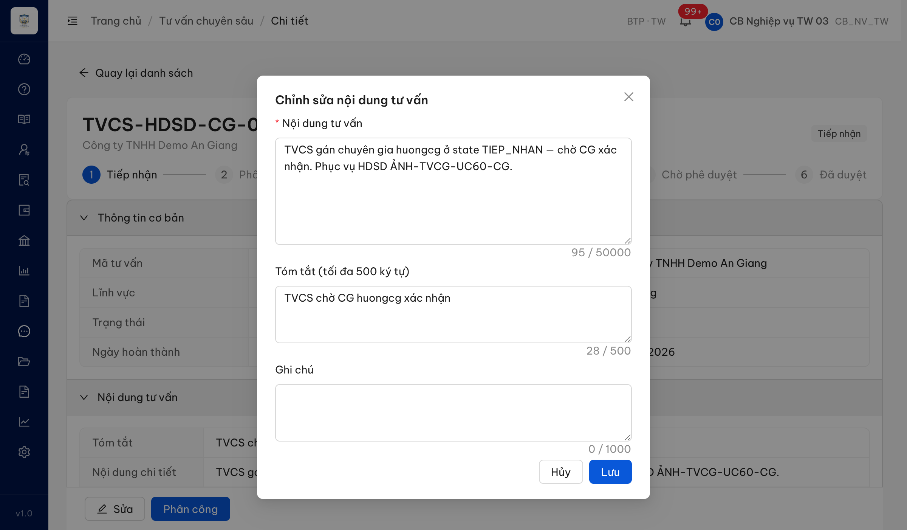

---

## ~~BUG-TVCS-063~~ [CLOSED] — Hành vi Chuyên gia xem/tải tư liệu pháp lý không được ghi nhật ký (AUDIT_LOG)

> **Re-test:** 2026-06-07 18:58:58 R-verify-4 — ✅ PASS (Closed). Q1: vai `huongcg` GET `/tu-lieu-phap-ly-vvs?noiDungTvId=aaffaa0b-…0020` → 200 (1 tư liệu) + GET `/tu-lieu-phap-ly-vvs/db947d21-…fcf6` → 200 (hết 403). Q2: vai `admin` tra `/audit-logs?entityId=<tvcsId>` → **1 entry** `hanhDong=XEM_TU_LIEU`, `nguoiThucHienUsername=huongcg`, `nguoiThucHienVaiTro="Chuyên gia tư vấn"`, `endpoint="GET /tu-lieu-phap-ly-vvs"`, `module=TU_VAN`, `thoiGian=2026-06-07T11:56:45.468Z` — đúng lần CG đọc tư liệu. *Scope còn lại (không block):* leg **tải file** dùng endpoint khác (404 ở /file|files|download) → chưa kích hoạt riêng để kiểm.

### Mô tả

BA chốt 2 quyết định cho STT 63: **Q1** — CG đọc được tư liệu pháp lý của TVCS được phân công (hết 403, R-only); **Q2** — **ghi AUDIT_LOG khi CG truy cập/tải tư liệu pháp lý** (hành vi đọc nhạy cảm của mạng lưới ngoài, phục vụ truy vết — mở rộng BR-DATA-05). Q1 đã đạt (CG đọc tư liệu trả 200, hết 403). NHƯNG Q2 **chưa được hiện thực**: truy cập tư liệu với vai CG nhiều lần không tạo bất kỳ bản ghi nhật ký nào.

### Các bước tái hiện

1. Đăng nhập role **Chuyên gia** (`huongcg`, được phân công TVCS theo BR-AUTH-14).
2. Mở chi tiết TVCS được phân công đích danh (TVCS-HDSD-CG-001) → mở section "Tài liệu pháp luật" + truy cập tư liệu (`GET /api/v1/tu-lieu-phap-ly-vvs?noiDungTvId=...` → 200, có 1 tư liệu; `GET .../{tuLieuId}` → 200).
3. Đăng nhập lại role **admin** → đối chiếu nhật ký: `GET /api/v1/audit-logs` lọc theo id tư liệu / id TVCS / từ khóa "huongcg".

### Kết quả mong đợi (theo BA)

- Mỗi lần CG truy cập/tải tư liệu pháp lý → AUDIT_LOG ghi 1 bản ghi hành vi (BA dòng 175 Q2: *"ghi AUDIT_LOG khi CG truy cập/tải tư liệu pháp lý"*).

### Kết quả thực tế

- AUDIT_LOG lọc theo id tư liệu / id TVCS / "huongcg" = **0 bản ghi**, dù đã truy cập tư liệu nhiều lần với vai CG. Hệ thống nhật ký **vẫn hoạt động** (cùng cửa sổ thời gian ghi `VIEW_REPORT`×6, `EXPORT_REPORT`×4, `GUI_TRA_LOI_TVNHANH`×2, `CREATE`, `UPDATE`) → không phải lỗi nhật ký chung, mà **chưa hiện thực ghi log cho hành vi CG xem/tải tư liệu**.

### Bằng chứng

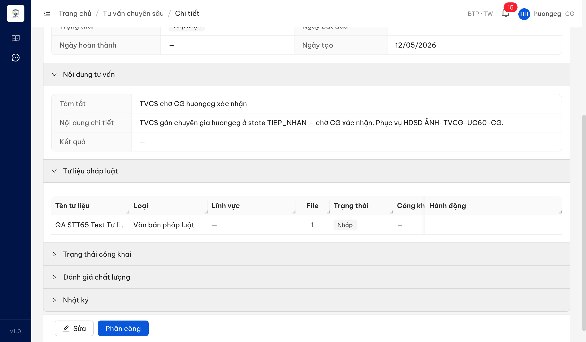

**API/audit (vai admin):**

```
GET /api/v1/tu-lieu-phap-ly-vvs?noiDungTvId=aaffaa0b-...0020  → 200 (1 tư liệu)  [CG đọc OK — Q1 đạt]
GET /api/v1/audit-logs?entityId=<tuLieuId>   → 200, data = []   (0 entry CG xem tư liệu)
GET /api/v1/audit-logs?entityId=<tvcsId>     → 200, data = []
GET /api/v1/audit-logs?search=huongcg        → 200, data = []
GET /api/v1/audit-logs (latest)              → 200; actionTally: LOGIN/LOGOUT/OTP, VIEW_REPORT, EXPORT_REPORT,
                                               GUI_TRA_LOI_TVNHANH, CREATE, UPDATE — KHÔNG có action xem/tải tư liệu của CG
```

---

## ~~BUG-KH-056~~ [CLOSED] — Form tạo khóa học thiếu trường "Mô tả công khai"

> **Re-test:** 2026-06-07 18:58:58 R-verify-4 — ✅ PASS (Closed). Form thêm + sửa khóa học nay có trường "Mô tả công khai" là **rich text editor** (toolbar In đậm/In nghiêng/Gạch chân/Danh sách/Danh sách có số/Chèn liên kết + vùng contenteditable, đếm 0/5000), không bắt buộc — đúng BA dòng 46/68. Evidence: `image/retest0607pm-stt56-khoahoc-mota-rich-editor.png`. *Theo dõi riêng (không block):* render nội dung lên chuyên trang Cổng PLQG cần môi trường Cổng để kiểm.

### Mô tả

BA chốt 2 phần: (1) bổ sung "Mở đăng ký từ/đến" (✅ đã có ở form + chi tiết); (2) trường **Mô tả công khai** (editor, không bắt buộc, đẩy lên chuyên trang — `mo_ta_cong_khai` đã có sẵn trong SRS, BA giao dev verify render). Form + chi tiết khóa học **không có** trường Mô tả công khai.

### Các bước tái hiện

1. Đăng nhập role **CB Nghiệp vụ TW** (`cb_nv_tw_03`, quyền cấu hình khóa học).
2. **Đào tạo → Khóa học → Thêm mới**; rà toàn bộ trường.
3. Mở chi tiết 1 khóa học (KH-HDSD-AG-001), rà các tab Thông tin.

### Kết quả mong đợi (theo BA)

- Form/chi tiết có trường **Mô tả công khai** (editor, không bắt buộc) — `srs-fr-03-dao-tao.md` field 16 `mo_ta_cong_khai` (dòng 131).

### Kết quả thực tế

- Có "Mở đăng ký từ/đến" (đạt). **Không có** trường "Mô tả công khai" — form kết thúc ở "Đối tượng tham gia"; chi tiết không có ô Mô tả nào (`hasEditor=false`, 0 lần xuất hiện "Mô tả").

### Bằng chứng

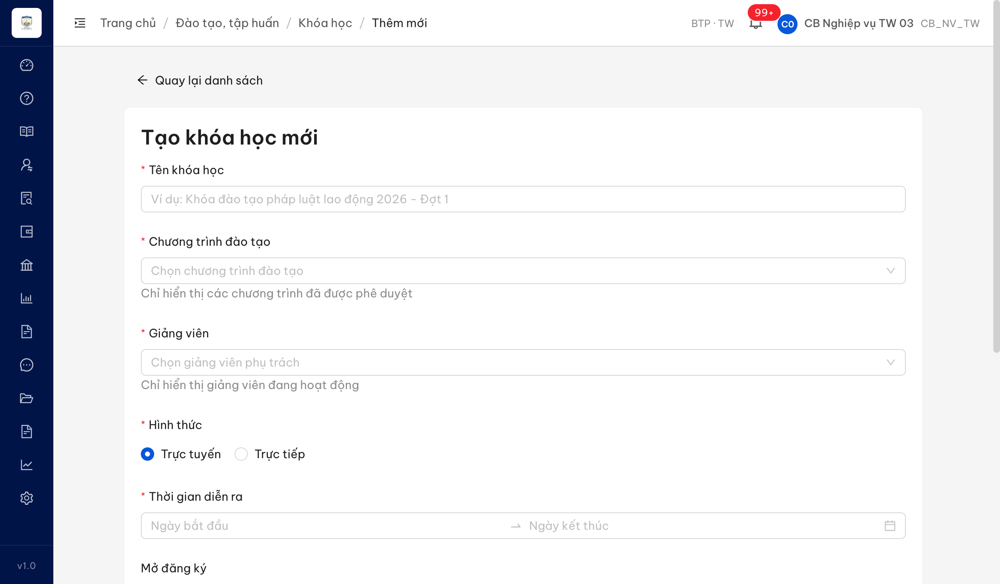
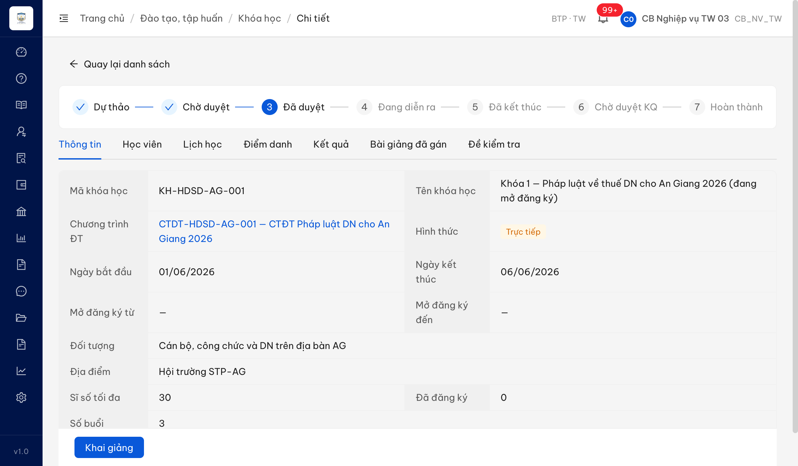

---

## ~~BUG-BG-066~~ [CLOSED] — Danh sách bài giảng thiếu cột "Công khai"; chi tiết thiếu Ảnh đại diện + Ngày công khai

> **Re-test:** 2026-06-05 12:10:00 R-verify-2 — ✅ PASS (Closed-verified). Danh sách bài giảng đã có **cột "Công khai"** (badge) cạnh bộ lọc — `image/retest0605-stt66-baigiang-list-cot-congkhai.png`; drawer xem chi tiết hiển thị **Ngày công khai + Ảnh đại diện** — `image/retest0605-stt66-baigiang-preview-ngaycongkhai-anh.png`. Phần hiển thị theo BA dòng 100-102 đã đủ. Gap còn lại (form không có input Ảnh đại diện) là thiếu sót **khác scope** → tách bug mới [BUG-BG-066b](#bug-bg-066b--form-thêmsửa-bài-giảng-thiếu-input-ảnh-đại-diện) bên dưới.

### Mô tả

BA chốt (screen-spec đã áp): (1) danh sách thêm **cột Công khai** + **bộ lọc Công khai**; (2) chi tiết thêm **Ảnh đại diện** + **Ngày công khai**. Thực tế: danh sách **đã có bộ lọc** "Công khai" nhưng **chưa có cột** "Công khai"; màn xem (preview file) **không hiển thị** Ảnh đại diện / Ngày công khai. Form thêm có toggle "Công khai" (lưu được dữ liệu) nhưng không có trường Ảnh đại diện.

### Các bước tái hiện

1. Đăng nhập role **CB Nghiệp vụ TW** (`cb_nv_tw_03`).
2. **Đào tạo → Kho tài liệu / Bài giảng** (danh sách) — quan sát bộ lọc + cột bảng.
3. Bấm icon "eye" 1 bài giảng → quan sát drawer xem trước.

### Kết quả mong đợi (theo BA)

- Danh sách có **cột "Công khai"** (badge) cạnh bộ lọc; màn chi tiết có **Ảnh đại diện** + **Ngày công khai** (= `thoi_gian_dang_tai`, ngày công khai cuối cùng).

### Kết quả thực tế

- Cột bảng: Tên / Loại tài liệu / Dung lượng / Ngày tạo / Thao tác — **không có** cột "Công khai". Drawer "eye" chỉ là **xem trước file** (PDF iframe), không có Ảnh đại diện / Ngày công khai.

### Bằng chứng

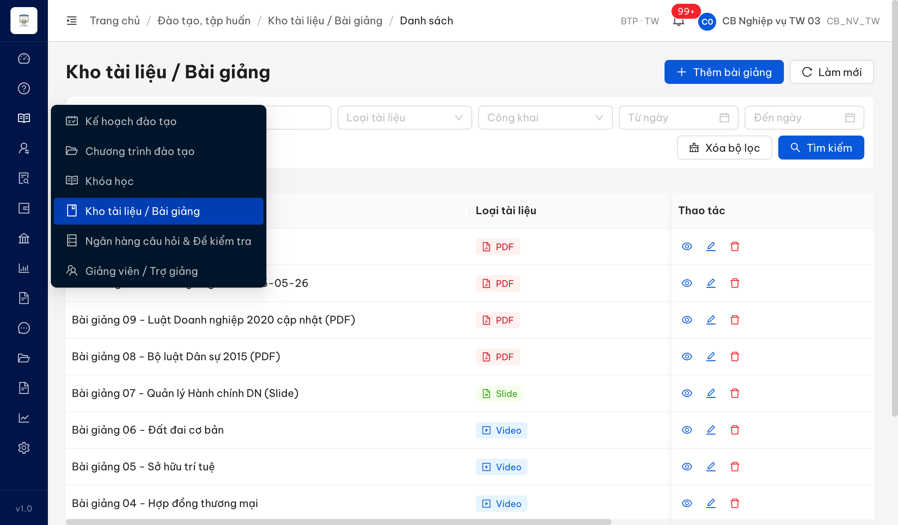

---

## ~~BUG-BG-066b~~ [CLOSED] — Form thêm/sửa bài giảng thiếu input "Ảnh đại diện"

**Phát hiện:** 2026-06-05 R-verify-2 (tách scope từ BUG-BG-066 khi re-test) · **Severity:** Medium · **Status:** Closed

> **Re-test:** 2026-06-07 18:58:58 R-verify-4 — ✅ PASS (Closed). Modal "Thêm bài giảng" nay có field **"Ảnh đại diện"** (upload .jpg,.jpeg,.png,.gif tối đa 5MB) — khớp `srs-fr-03-dao-tao.md:713` field 7 `anh_dai_dien`. Modal "Cập nhật bài giảng" cũng có Ảnh đại diện. Evidence: `image/retest0607pm-stt66b-baigiang-create-anhdaidien.png`.

### Mô tả

SRS quy định form bài giảng có field 7 `anh_dai_dien` — "Ảnh đại diện chuyên trang (đã có v3) — jpg/png/gif, max 5MB" (`srs-fr-03-dao-tao.md:713`, FR-III-07). Màn chi tiết đã hiển thị Ảnh đại diện (fix STT 66), NHƯNG form thêm/sửa bài giảng **không có input tải Ảnh đại diện** → người dùng không có cách nào đặt/đổi ảnh; field chỉ hiển thị được nếu dữ liệu có sẵn từ nguồn khác.

### Các bước tái hiện

1. Đăng nhập role **CB Nghiệp vụ TW** (`cb_nv_tw_03`).
2. **Đào tạo → Bài giảng → Thêm mới** (hoặc Sửa 1 bài giảng) — rà toàn bộ trường trong form.

### Kết quả mong đợi (theo SRS)

- Form có input tải **Ảnh đại diện** (jpg/png/gif, max 5MB, không bắt buộc) theo `srs-fr-03-dao-tao.md:713`.

### Kết quả thực tế

- Form chỉ có Tên / Loại tài liệu / File / Lĩnh vực / Mô tả / toggle Công khai — **không có** input Ảnh đại diện.

### Bằng chứng

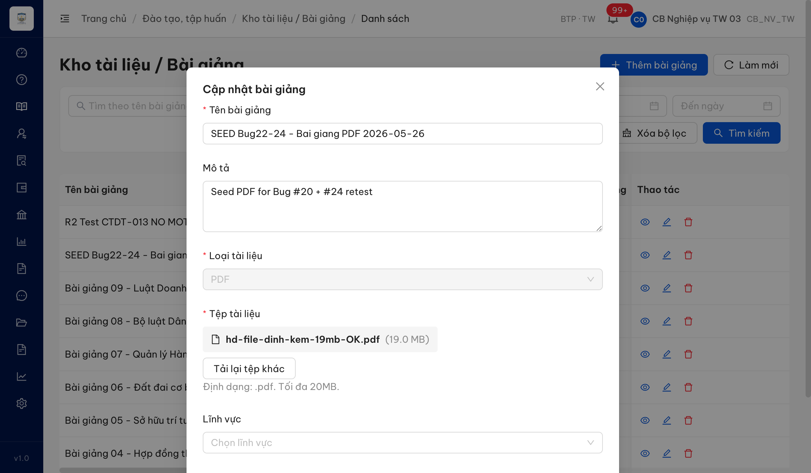

---

## ~~BUG-TVN-058~~ [CLOSED] — "% phù hợp" hiển thị vượt 100%

> **Re-test:** 2026-06-07 18:58:58 R-verify-4 — ✅ PASS (Closed). Tìm "doanh nghiệp" trong Tra cứu Kho câu hỏi (phiên CB trả lời): API `tra-cuu-kho` trả `relevanceScore` = [100, 84, 50, 44, 44, 43, 31, 31, 31, 12] — chuẩn hoá thang 0–100%, top=100%, không clamp/không >100%. UI hiển thị "100% / 84% / 50% / 44% / 43% / 31% / 12% phù hợp" khớp. Evidence: `image/retest0607pm-stt58-relevance-normalized.png`.

### Mô tả

BA chốt: điểm relevance khi tra cứu Kho câu hỏi hiển thị dạng **% chuẩn hoá 0–100%** (FR-X.2-02). Thực tế hiển thị **vượt 100%** (268%, 144%, 134%).

### Các bước tái hiện

1. Đăng nhập role **CB Nghiệp vụ TW** (`cb_nv_tw_03`).
2. **Tư vấn → Tư vấn nhanh**, mở 1 phiên trạng thái "CB trả lời".
3. Panel "Tra cứu Kho câu hỏi" → tìm "lao động" → quan sát cột "% phù hợp".

### Kết quả mong đợi (theo BA)

- Điểm relevance trong khoảng **0–100%** (100% = khớp cao nhất).

### Kết quả thực tế

- Hiển thị **268% phù hợp**, **144% phù hợp**, **134% phù hợp**.

### Bằng chứng

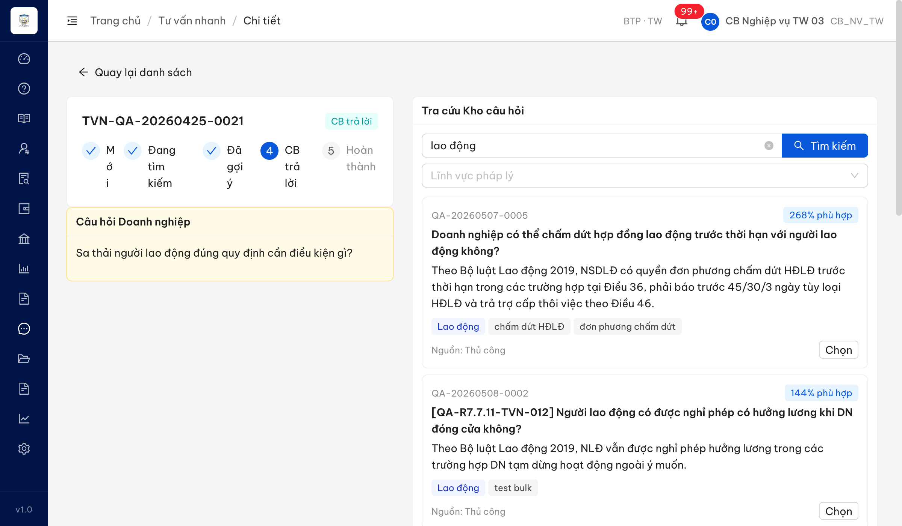

---

## ~~BUG-TVCS-068~~ [CLOSED] — TVCS chưa đổi "Tóm tắt" → "Tiêu đề" + chưa đặt bắt buộc

> **Re-test:** 2026-06-05 12:10:00 R-verify-2 — ✅ PASS (Closed-verified). Form Thêm TVCS: trường đã đổi nhãn **"Tiêu đề"** + **bắt buộc** (dấu `*`, submit trống bị chặn với thông báo lỗi); cột danh sách cũng đổi "Tiêu đề" — `image/retest0605-stt68-57-tieude-required-spellcheck.png`. *Ghi chú scope:* phần BE còn lại của gói STT11 (cột `tieu_de`, backfill dữ liệu cũ) chưa verify riêng ở DB-level — ngoài phạm vi bug UI này.

### Mô tả

BA chốt (gói STT11): chính thức hóa field `tom_tat` → cột **`tieu_de` bắt buộc** (max 255), **đổi nhãn "Tóm tắt" → "Tiêu đề"**. Thực tế form/danh sách TVCS vẫn nhãn **"Tóm tắt"** và **không bắt buộc** (không có dấu `*`).

### Các bước tái hiện

1. Đăng nhập role **CB Nghiệp vụ TW** (`cb_nv_tw_03`).
2. **Tư vấn → Tư vấn chuyên sâu → Thêm mới**.
3. Quan sát trường "Tóm tắt (tối đa 500 ký tự)" (`required:false`); cột danh sách header "Tóm tắt".

### Kết quả mong đợi (theo BA)

- Nhãn **"Tiêu đề"** + trường **bắt buộc** (max 255).

### Kết quả thực tế

- Vẫn "Tóm tắt (tối đa 500 ký tự)", không bắt buộc.

### Bằng chứng

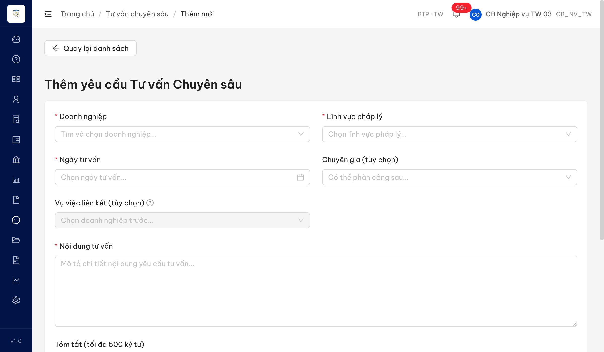

---

## ~~BUG-BC-085~~ [CLOSED] — Excel xuất báo cáo thiếu header + kẻ viền

> **Re-test:** 2026-06-07 18:58:58 R-verify-4 — ✅ PASS (Closed). Export lại (BC_HOI_DAP, kỳ Năm 2026, không lọc đơn vị) + parse openpyxl (`.tmp/r0607pm-stt85-export.xlsx`): R1 "BC Số lượng hỏi đáp/vướng mắc pháp luật" · R2 "Kỳ báo cáo: Năm (từ 01/01/2026 đến 31/12/2026)" · R3 **"Đơn vị: Toàn quốc"** (đúng phạm vi không lọc, theo `srs-fr-11-bao-cao.md:95` `don_vi_ten`) · R4 "Ngày tạo: 07/06/2026"; data rows R6+ có kẻ viền thin.

### Mô tả

BA/SRS (`srs-fr-11-bao-cao.md` dòng 1086): file Excel phải có header gồm **tên báo cáo + kỳ + đơn vị + ngày tạo**, bảng có kẻ viền. Bản chạy chỉ xuất bảng dữ liệu, thiếu toàn bộ header + không kẻ viền.

### Các bước tái hiện

1. Đăng nhập role **CB Nghiệp vụ TW** (`cb_nv_tw_03`).
2. **Báo cáo thống kê** → chọn "BC Số lượng hỏi đáp/vướng mắc pháp luật" + kỳ Năm → "Xuất Excel".
3. Parse file XLSX (openpyxl) — kiểm tra các dòng đầu + border.

### Kết quả mong đợi (theo BA)

- File có header (tên BC + kỳ + đơn vị + ngày tạo) trước bảng dữ liệu; bảng có kẻ viền.

### Kết quả thực tế

- File bắt đầu ngay ở R1 bằng hàng tiêu đề cột bảng dữ liệu ("Lĩnh vực PL | Số lượng"), không có dòng tên BC/kỳ/đơn vị/ngày tạo. Mọi ô `border = None` (không kẻ viền).

### Bằng chứng

**API/parse:** `POST /api/v1/bao-cao/export` (XLSX) → openpyxl:

```
sheet "BC Số lượng hỏi đáp"  dims A1:B8
R1: ['Lĩnh vực PL', 'Số lượng']      ← bắt đầu ngay bằng header cột bảng, KHÔNG có header báo cáo
R2: ['Lao động', '19'] ... R8: ['Đầu tư', '1']
border (A1..B6) = {left:None, right:None, top:None, bottom:None}   ← không kẻ viền
```

---

## ~~BUG-TVCS-057~~ [CLOSED] — Ô nhập chưa tắt spellcheck (DN dropdown đã đạt)

> **Re-test:** 2026-06-07 18:58:58 R-verify-4 — ✅ PASS (Closed). Form TVCS thêm mới: cả 4 combobox search (DN / Lĩnh vực pháp lý / Chuyên gia / Vụ việc liên kết) + Tiêu đề + 2 textarea đều `el.spellcheck === false`. Cơ chế fix: `<body spellcheck="false">` áp toàn cục → mọi ô con kế thừa spellcheck=false (BA dòng 127 "mọi ô nhập"). Evidence: `image/retest0607pm-stt57-tvcs-create-spellcheck-off.png`.

### Mô tả

BA chốt: (1) DN là **dropdown** chọn (✅ đạt — form hiện DN dropdown searchable, bắt buộc); (2) tắt kiểm tra chính tả trình duyệt (`spellcheck=false`) áp chung mọi ô nhập. Thực tế các ô nhập **vẫn bật spellcheck** (thuộc tính không set → mặc định bật → gạch chân đỏ chữ tiếng Việt).

### Các bước tái hiện

1. Đăng nhập role **CB Nghiệp vụ TW** (`cb_nv_tw_03`).
2. **Tư vấn → Tư vấn chuyên sâu → Thêm mới**.
3. DN: là dropdown chọn DN (đạt). Kiểm tra `spellcheck` các textarea (Nội dung tư vấn / Tóm tắt / Ghi chú).

### Kết quả mong đợi (theo BA)

- DN dropdown (đạt) + mọi ô nhập `spellcheck=false`.

### Kết quả thực tế

- DN dropdown OK; các textarea `spellcheck` không set (`spellcheckProp=true` — vẫn bật, còn gạch chân đỏ).

### Bằng chứng


> Kiểm tra DOM: textarea "Nội dung tư vấn" / "Tóm tắt" / "Ghi chú" đều `spellcheck=null` (mặc định bật) — chưa tắt theo BA.

---

## ~~BUG-DM-069~~ [CLOSED] — Cột "Mã" và "Thứ tự" vẫn sortable (BA chốt chỉ "Tên")

> **Re-test:** 2026-06-05 12:10:00 R-verify-2 — ✅ PASS (Closed-verified). Vai `admin`, Danh mục dùng chung → Lĩnh vực pháp lý: **chỉ còn cột "Tên"** có control sắp xếp (`aria-sort` + sorter); Mã / Thứ tự / Mô tả / Trạng thái đã gỡ — đúng BA dòng 319. Evidence: `image/retest0605-stt69-danhmuc-only-ten-sortable.png`.

### Mô tả

BA chốt: ở Quản lý danh mục (SCR-VIII-01) **chỉ cột "Tên"** cho sắp xếp tương tác; **Mã / Mô tả / Thứ tự KHÔNG** (Thứ tự là trường sắp xếp mặc định cố định). Thực tế **Mã + Tên + Thứ tự** đều có control sắp xếp.

### Các bước tái hiện

1. Đăng nhập role **Quản trị hệ thống** (`admin`).
2. **Quản trị hệ thống → Danh mục dùng chung → Lĩnh vực pháp lý**.
3. Kiểm tra trạng thái sortable từng cột header.

### Kết quả mong đợi (theo BA)

- Chỉ cột **Tên** sortable; Mã / Mô tả / Thứ tự không có control sắp xếp.

### Kết quả thực tế

- **Mã** (sortable), **Tên** (sortable), **Thứ tự** (sortable); Mô tả / Trạng thái không sortable. → dư 2 cột (Mã, Thứ tự) so với BA chốt.

### Bằng chứng

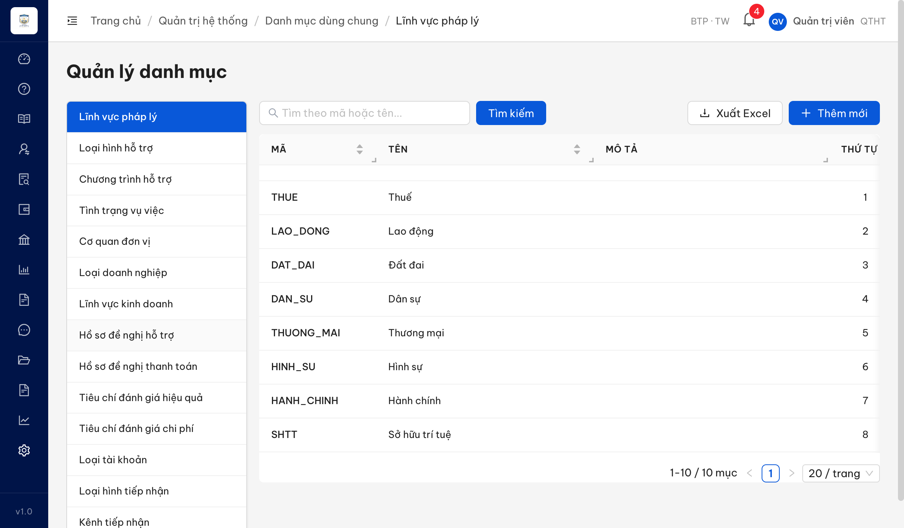

---

## CÁC MỤC ĐẠT (app khớp BA + đối tác)

### STT 22 — Mô tả bài giảng là tùy chọn ✅
- **TK:** `cb_nv_tw_03`. Form "Thêm bài giảng": trường Mô tả `required:false` (không dấu `*`), lưu được khi để trống. Khớp BA + đối tác. 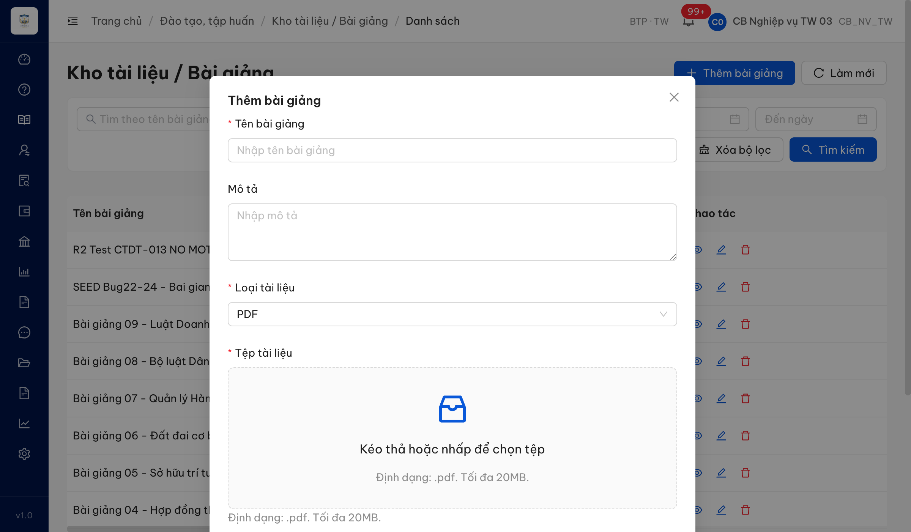

### STT 59 — Chọn câu Q&A từ kho + soạn/gửi trả lời ✅
- **TK:** `cb_nv_tw_03`. Panel Tra cứu Kho câu hỏi → bấm "Chọn" → copy câu trả lời vào ô soạn (no lỗi), có nút **"Bỏ chọn"**; "Gửi trả lời" thành công (timestamp cập nhật, no error). Bug chọn Q&A "Đã duyệt" đã hết. 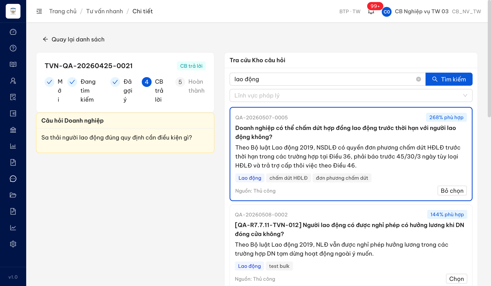

### STT 72 — Không ẩn danh mục Lĩnh vực kinh doanh (VSIC) ✅
- **TK:** `admin`. BA chốt **không ẩn** — danh mục **vẫn hiển thị + navigable** (`/quan-tri/danh-muc/LINH_VUC_KINH_DOANH`), API trả **517 record VSIC** (A/B/C…). App làm đúng BA = PASS. (Cần gửi văn bản trả lời đối tác Đ-1.) 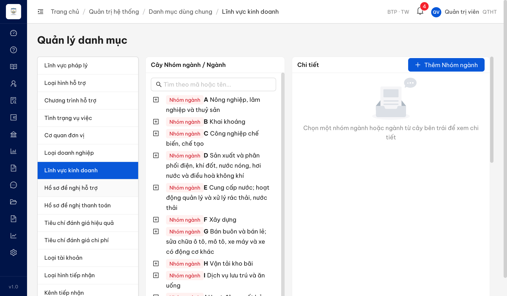

### STT 96 — Báo cáo CG/TVV bỏ "Địa bàn", dùng "Đơn vị", bỏ NHT ✅
- **TK:** `cb_nv_tw_03`. "BC Số lượng CG/TVV": bộ lọc = Đơn vị + Loại TVV + Lĩnh vực CM (**không Địa bàn**); thẻ kết quả = Tổng TVV / Số TVV / Số Chuyên gia (**không NHT**); bảng theo **Đơn vị** (Đơn vị / Số TVV / Số CG / Tổng số). Khớp BA (bỏ Địa bàn, dùng Đơn vị, bỏ `so_nht`). 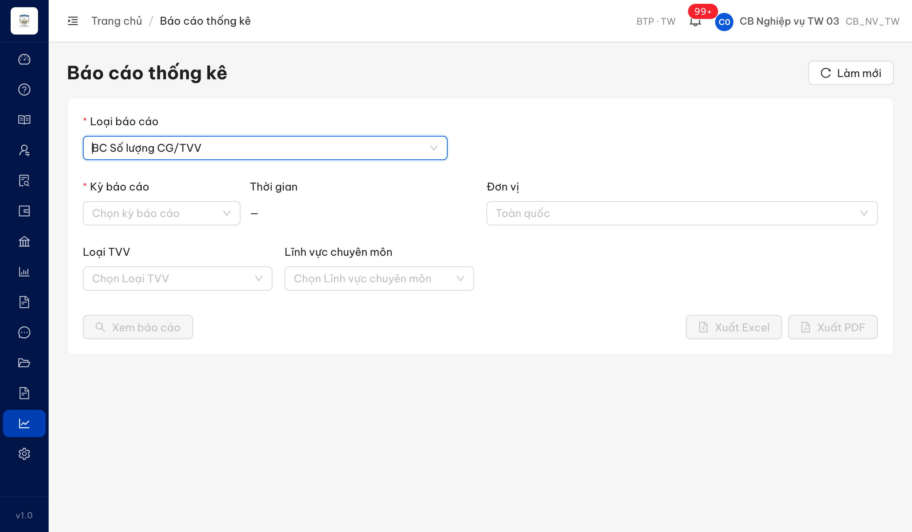

---

## Phụ lục — Môi trường test

| Thành phần | Giá trị |
|------------|---------|
| URL ứng dụng | http://103.172.236.130:3000/ |
| OTP login | `666666` (bypass tạm) |
| MailHog | http://103.172.236.130:8025 |
| API base | http://103.172.236.130:3000/api/v1 |
| Frontend | React + Vite + Ant Design v5 |
| Xác thực | JWT (access_token cookie) + OTP; refresh-token HttpOnly cookie |
| Tool test | Chrome DevTools MCP (viewport 1440x900) |
| TK đã dùng | `cb_nv_tw_03`, `cb_pd_tw_03`, `huongcg` (CG), `admin` (đều [REDACTED] theo users.csv). R-verify-3 (07/06) dùng 3 TK: `cb_nv_tw_03`, `huongcg`, `admin` |
| Phản biện verdict | R1: 15 agent đối chiếu độc lập (14/15 đồng thuận). R-verify-2 (05/06): panel 15 agent + completeness critic — bác 5 verdict FIXED→PARTIAL (060/056/058/085/057), đảo 1 PARTIAL→FIXED (066); 2 verdict bác đã re-probe trên app xác nhận panel đúng (060 DANG_TU_VAN, 058 clamp) |

**Side-effect dữ liệu test trên môi trường (R-verify-2 05/06):** tạo TK `qa_verify_stt80_0605` (CHO_KICH_HOAT — phục vụ verify email kích hoạt, có thể xóa); đổi họ tên TK `qa_test_0601_acc` → "QA Test Account 0601 RT0605" (verify #79, version 2→3); đính kèm 1 file PDF vào CT-20260604-0001 (verify #49, version 1→2).

---

*Bug report generated: 2026-06-04 23:20:00 · Re-test R-verify-3: 2026-06-07 12:02:57 | QA Automation via Claude Code*
