# Bug Report — PM HTPLDN (Danh sách bug từ BA)

| Thông tin | Giá trị |
|-----------|---------|
| **Dự án** | PM HTPLDN (Hỗ trợ Pháp lý Doanh nghiệp) |
| **Môi trường** | http://103.172.236.130:3000/ |
| **Nguồn** | File xlsx do BA cung cấp — `output/BA-report/Bug-report/[PM HTPLDN] Danh sách tối ưu_Bug+API  (5).xlsx` (Sheet `Phần mềm`) |
| **Người log** | BA / Đối tác (không phải QA tự test) |
| **Ngày log** | 25/05/2026 — 26/05/2026 (re-verify 26/05/2026 20:35:00) |
| **Loại** | Bug (tất cả 48/48 đều `Phân loại = Bug`) |
| **Ngày convert** | 2026-05-26 |

---

## Tổng hợp

File xlsx BA gửi chứa **48 bug** thuộc **8 nhóm chức năng**, tất cả đang ở trạng thái `Đang thực hiện`. Nội dung dưới đây giữ **nguyên văn** từ xlsx (`Mô tả`, `Ảnh minh chứng`, `Độ ưu tiên`, `Ngày log`) — KHÔNG diễn giải, KHÔNG bịa SRS reference.

> **Lưu ý:**
> - **BUG-ID = STT trong xlsx** (1:1 mapping, BUG-001 ↔ STT 1, BUG-048 ↔ STT 48).
> - File xlsx gốc dùng cột `Độ ưu tiên` (Cao / Trung bình / Thấp) — KHÔNG có cột Severity. Báo cáo này giữ nguyên Priority, không tự suy ra Severity.
> - Cột `Ảnh minh chứng` ban đầu là **URL ngoài** (prnt.sc / screenpal) do BA upload. Sau khi QA re-verify 2026-05-26, mỗi bug entry kèm thêm block "Ảnh verify mới nhất" embed inline ảnh từ folder `image/reverify-bug-XXX-*.png` chứng minh trạng thái thực tế hiện tại.
> - Trường `Mô tả` được giữ nguyên văn (Tài khoản test + Lỗi + Mong muốn) trong section _Mô tả (nguyên văn)_ của mỗi bug.

### Priority breakdown

| Tổng | Cao | Trung bình | Thấp | ✅ Đã sửa (Closed) | ⚠️ Sửa một phần (Partial) | ❌ Chưa sửa (Open) | 🤷 Không xác định (Unknown) |
|------|-----|------------|------|--------------------|----------------------------|---------------------|-----------------------------|
| 48 | 24 | 15 | 9 | 37 | 3 | 8 | 0 |

**Cập nhật sau verify (`cb_pd_tw_05` / `cb_nv_tw_05` / `cb_nv_bn_05` fallback):**

| Priority | Tổng | ✅ Đã sửa (Closed) | ⚠️ Sửa một phần (Partial) | ❌ Chưa sửa (Open) | 🤷 Không xác định (Unknown) |
|---|:-:|:-:|:-:|:-:|:-:|
| Cao | 24 | 17 | 2 | 5 | 0 |
| Trung bình | 15 | 12 | 1 | 2 | 0 |
| Thấp | 9 | 8 | 0 | 1 | 0 |
| **Tổng** | **48** | **37** | **3** | **8** | **0** |

**Bug ❌ Chưa sửa / Open (8)**: BUG-003, BUG-004, BUG-021, BUG-027, BUG-033, BUG-034, BUG-042, BUG-048.

**Bug ⚠️ Sửa một phần / Partial (3)**: BUG-020, BUG-036, BUG-046.

**Bug 🤷 Không xác định / Unknown (0)**: _(không còn)_

### Phân bổ theo nhóm chức năng

| Nhóm chức năng | Số bug | STT range |
|---|---|---|
| II. Quản lý tiếp nhận hỏi đáp vướng mắc pháp lý | 4 | BUG-001 → BUG-004 |
| III. Quản lý thông tin chương trình đào tạo tập huấn | 17 | BUG-005 → BUG-021 |
| IV. Quản lý thông tin chuyên gia tư vấn viên pháp lý | 3 | BUG-022 → BUG-024 |
| V. Quản lý vụ việc trợ giúp pháp lý | 10 | BUG-025 → BUG-034 |
| VI. Quản lý kiểm tra đánh giá hiệu quả hỗ trợ | 6 | BUG-035 → BUG-040 |
| VII. Quản lý thư viện biểu mẫu hợp đồng | 2 | BUG-041 → BUG-042 |
| XI. Quản lý kế hoạch thực hiện chương trình hỗ trợ pháp lý doanh nghiệp | 4 | BUG-043 → BUG-046 |
| X. Quản lý tư vấn chuyên sâu với chuyên gia | 2 | BUG-047 → BUG-048 |

---

## Bug Summary Table

| Bug ID | Nhóm | Use case | Tài khoản | Priority | Ngày log | Tiêu đề (rút gọn) |
|--------|------|----------|-----------|----------|----------|-------------------|
| BUG-001 | II | Tiếp nhận xử lý hỏi đáp, vướng mắc pháp lý | `cb_nv_tw_01` | Thấp | 25/05/2026 | Popup Xác nhận tiếp nhận: Số lượng ký tự ghi chú và button Tiếp nhận bị đè lên nhau |
| BUG-002 | II | Quản lý thông tin tiếp nhận xử lý hỏi đáp, vướng mắc pháp lý | `cb_nv_tw_01` | Thấp | 25/05/2026 | Popup Cập nhật thời hạn: Trạng thái hiện là TIEP_NHAN |
| BUG-003 | II | Phân công xử lý câu hỏi, vướng mắc | `cb_nv_tw_01` | Trung bình | 25/05/2026 | Số lượng cá nhân tư vấn hiển thị chưa đủ |
| BUG-004 | II | Phản hồi câu hỏi, vướng mắc | `tvv_r11_mailfix` | Cao | 25/05/2026 | Vai trò tư vấn viên không có menu "Hỏi đáp pháp luật" để phản hồi |
| BUG-005 | III | Quản lý lập kế hoạch đào tạo bồi dưỡng | `cb_nv_tw_01` | Trung bình | 25/05/2026 | Thiếu cột Hành động hiển thị các chức năng (Đang phải nhấn vào màn xem chi tiết mới chỉnh sửa, xó... |
| BUG-006 | III | Quản lý chương trình đào tạo, tập huấn | `cb_nv_tw_01` | Trung bình | 25/05/2026 | Trường Ngân sách dự kiến (VNĐ) là số tiền chưa có dấu ngăn cách hàng |
| BUG-007 | III | Quản lý chương trình đào tạo, tập huấn | `cb_nv_tw_01` | Trung bình | 25/05/2026 | Trạng thái "Dụ thảo" ngoài màn danh sách chưa có chức năng Sửa, đang nhấn vào chức năng "Xem" để sửa |
| BUG-008 | III | Quản lý chương trình đào tạo, tập huấn | `cb_nv_tw_01` | Cao | 25/05/2026 | Không hiển thị dữ liệu cột Lĩnh vực |
| BUG-009 | III | Quản lý chương trình đào tạo, tập huấn | `cb_pd_tw_01` | Thấp | 25/05/2026 | Khi chương trình đào tạo ở trạng thái "Chờ duyệt", cán bộ phê duyệt nhấn "Phê duyệt", bản ghi đã ... |
| BUG-010 | III | Quản lý đề xuất đào tạo, tập huấn | `cb_nv_tw_01, cb_pd_tw_01` | Cao | 25/05/2026 | Bản ghi đến trạng thái "Đã tiếp nhận" ở cả 2 tài khoản khôn thấy button thao tác nào để thực hiện... |
| BUG-011 | III | Quản lý chương trình đào tạo, tập huấn | `cb_nv_tw_01` | Thấp | 25/05/2026 | Chức năng "Hủy" nhưng hiển thị lại là "Rút bản nháp" |
| BUG-012 | III | _(trống)_ | `cb_nv_tw_01` | Cao | 25/05/2026 | Danh sách học viên trong khóa chưa có thêm mới thủ công và tải file mẫu để import |
| BUG-013 | III | _(trống)_ | `cb_nv_tw_01` | Cao | 25/05/2026 | Buổi học trong khóa không bắt buộc Địa điểm/Link zoom nhưng khi lưu đang bắt buộc nhập |
| BUG-014 | III | _(trống)_ | `cb_nv_tw_01` | Trung bình | 25/05/2026 | Thông báo lỗi khi lưu buổi học ngoài thời gian khóa học có định dạng ngày chưa đúng |
| BUG-015 | III | _(trống)_ | `cb_nv_tw_01` | Cao | 25/05/2026 | Không hiển thị danh sách bài giảng để thêm vào khóa học |
| BUG-016 | III | Quản lý kho tài liệu, bài giảng | `cb_nv_tw_01` | Trung bình | 25/05/2026 | Nhấn chỉnh sửa 1 bản ghi cũ rồi nhấn "Thêm bài giảng" bị lưu lại cache của bản ghi trước vào màn ... |
| BUG-017 | III | Quản lý kho tài liệu, bài giảng | `cb_nv_tw_01` | Cao | 25/05/2026 | Thêm mới bài giảng, trường Mô tả không bắt buộc nhưng lưu lại bắt buộc nhập |
| BUG-018 | III | Quản lý kho tài liệu, bài giảng | `cb_nv_tw_01` | Cao | 25/05/2026 | Mành danh sách bài giảng thừa cột Khóa học |
| BUG-019 | III | Quản lý kho tài liệu, bài giảng | `cb_nv_tw_01` | Trung bình | 25/05/2026 | Không xem preview file PDF |
| BUG-020 | III | Quản lý giảng viên, trợ giảng | `cb_nv_tw_01` | Cao | 25/05/2026 | Danh sách giảng viên thừa thông tin vai trò |
| BUG-021 | III | Quản lý giảng viên, trợ giảng | `cb_nv_tw_01` | Cao | 25/05/2026 | 1. Cột Thời gian: Chưa hiển thị dữ liệu theo khóa học |
| BUG-022 | IV | Quản lý tư vấn viên | `cb_nv_tw_01` | Cao | 25/05/2026 | Màn xem chi tiết tư vấn viên, nhấn xem file đính kèm bị lỗi |
| BUG-023 | IV | _(trống)_ | `cb_nv_tw_01` | Cao | 25/05/2026 | Thêm mới tổ chức tư vấn chưa tồn tại nhưng lại báo đã tồn tại |
| BUG-024 | IV | _(trống)_ | `cb_pd_tw_01` | Cao | 25/05/2026 | Tổ chức tư vấn chờ duyệt nhưng không hiển thị chức năng phê duyệt, từ chối |
| BUG-025 | V | Nhập hồ sơ yêu cầu | `cb_nv_tw_01` | Trung bình | 25/05/2026 | Màn chỉnh sửa và màn xem chi tiết vụ việc, nhấn button "Sửa" nhưng lại chuyển đến màn danh sách |
| BUG-026 | V | Nhập hồ sơ yêu cầu | `cb_nv_tw_01` | Cao | 25/05/2026 | Khi thêm mới chọn "Lưu nháp" đang là trạng thái "Mới tạo" nhấn "Tiếp nhận" bị lỗi |
| BUG-027 | V | Lựa chọn người hỗ trợ cho vụ việc | `cb_nv_tw_01` | Cao | 25/05/2026 | Không phân công cho người ngoài đơn vị |
| BUG-028 | V | Lựa chọn người hỗ trợ cho vụ việc | `cb_nv_tw_01` | Thấp | 25/05/2026 | Vụ việc ở trạng thái "Đã phân công" nhưng vẫn còn button "Phân công" |
| BUG-029 | V | Quản lý hồ sơ đề nghị thanh toán | `admin` | Trung bình | 26/05/2026 | 1. Cột SLA và Ngày nộp dữ liệu bị đè lên nhau |
| BUG-030 | V | Thẩm định hồ sơ đề nghị thanh toán | `cb_nv_bn_01` | Cao | 26/05/2026 | Không lưu được kết quả thẩm định |
| BUG-031 | V | Phê duyệt hồ sơ đề nghị thanh toán | `cb_pd_bn_01` | Thấp | 26/05/2026 | Sau khi phê duyệt back về màn danh sách nhưng bản ghi vẫn ở tab "Chờ phê duyệt", F5 lại mới chuyể... |
| BUG-032 | V | Cập nhật kết quả xử lý hồ sơ đề nghị thanh toán | `cb_nv_bn_01` | Thấp | 26/05/2026 | Trường Số tiền thực trả và Ngày thanh toán định dạng chưa đúng |
| BUG-033 | V | Quản lý doanh nghiệp được hỗ trợ pháp lý | `cb_nv_bn_01` | Cao | 26/05/2026 | Không có button Thêm mới để thêm doanh nghiệp |
| BUG-034 | V | Quản lý doanh nghiệp được hỗ trợ pháp lý | `cb_nv_tw_01` | Cao | 26/05/2026 | Màn chỉnh sửa trường Loại doanh nghiệp hiển thị id |
| BUG-035 | VI | Lập kế hoạch đánh giá | `cb_nv_tw_01` | Cao | 26/05/2026 | Thêm mới có tải lên file đính kèm nhưng khi lưu bị lỗi không lưu được file |
| BUG-036 | VI | Chọn vụ việc đánh giá | `cb_nv_tw_01` | Trung bình | 26/05/2026 | Danh sách vụ việc chưa hiển thị Tên vụ việc, Lĩnh vực, Trạng thái |
| BUG-037 | VI | Chọn vụ việc đánh giá | `cb_nv_tw_01` | Cao | 26/05/2026 | Xác nhận chọn vụ việc thành công nhưng ở bảng danh sách vụ việc vẫn hiển thị 2 vụ việc là chưa chọn |
| BUG-038 | VI | Thực hiện đánh giá | `cb_nv_tw_03` | Trung bình | 26/05/2026 | Xác nhận hoàn thành chấm điểm thành công nhưng lại có thêm thông báo lỗi |
| BUG-039 | VI | Lập báo cáo đánh giá | `cb_nv_tw_03` | Trung bình | 26/05/2026 | 1. Các trường Số liệu tổng hợp đang là mã |
| BUG-040 | VI | Lập kế hoạch đánh giá | `cb_nv_tw_01` | Cao | 26/05/2026 | Ngày bắt đầu, Ngày kết thúc trong đợt sau khi lưu bị lùi 1 ngày |
| BUG-041 | VII | Quản lý biểu mẫu, hợp đồng | `cb_nv_tw_01` | Cao | 25/05/2026 | Không thấy menu hay button để chuyển đến màn danh sách tất cả biểu mẫu https://htpldn-dev.ospgrou... |
| BUG-042 | VII | Quản lý biểu mẫu, hợp đồng | `cb_nv_tw_01` | Trung bình | 25/05/2026 | Nhấn xem preview file biểu mẫu bị lỗi |
| BUG-043 | XI | Quản lý kế hoạch thực hiện chương trình hỗ trợ pháp lý | `cb_nv_tw_01` | Cao | 25/05/2026 | Thêm mới tải lên file đính kèm bị lỗi |
| BUG-044 | XI | Quản lý kế hoạch thực hiện chương trình hỗ trợ pháp lý | `cb_nv_tw_01` | Trung bình | 25/05/2026 | Màn danh sách Mục tiêu chưa hiển thị được dữ liệu đã nhập |
| BUG-045 | XI | Quản lý kế hoạch thực hiện chương trình hỗ trợ pháp lý | `cb_nv_tw_01` | Trung bình | 25/05/2026 | Màn xem chi tiết thừa tab "Tài liệu" (Không thao tác gì được) |
| BUG-046 | XI | Quản lý đợt báo cáo | `cb_nv_tw_01` | Cao | 25/05/2026 | - Đợt báo cáo đang gán với chương trình kế hoạch |
| BUG-047 | X | Phê duyệt nội dung câu hỏi, tư vấn | `cb_nv_tw_01` | Thấp | 26/05/2026 | Sau khi duyệt câu hỏi chưa được hiển thị cho người dùng nhưng popup xác nhận đang hiển thị "Sau k... |
| BUG-048 | X | Quản lý kho câu hỏi, tư vấn | `cb_nv_tw_01` | Thấp | 26/05/2026 | Chưa có cột Hành động để có thể thực hiện thao tác ở màn danh sách (Phải vào màn xem chi tiết mới... |

---

# II. Quản lý tiếp nhận hỏi đáp vướng mắc pháp lý

## ~~BUG-001~~ [CLOSED] — Popup Xác nhận tiếp nhận: Số lượng ký tự ghi chú và button Tiếp nhận bị đè lên nhau

| Trường | Giá trị |
|---|---|
| **Use case** | Tiếp nhận xử lý hỏi đáp, vướng mắc pháp lý |
| **Tác nhân chính** | Cán bộ nghiệp vụ TW,BN,ĐP |
| **Transaction** | Cán bộ nghiệp vụ TW,BN,ĐP xác nhận tiếp nhận xử lý hỏi đáp, vướng mắc pháp lý để chuyển phân công;<br>Hệ thống kiểm tra điều kiện và xác nhận tiếp nhận xử lý hỏi đáp, vướng mắc pháp lý thành công. |
| **Phân loại** | Bug |
| **Độ ưu tiên** | Thấp |
| **Ngày log** | 25/05/2026 |
| **Trạng thái xử lý** | ✅ Đã sửa (Closed) |
| **Kết quả verify** | Re-verify MAX state cho 3 popup theo BA: (1) `Xác nhận tiếp nhận` fill 1000/1000 → counter bottom=315, button `Tiếp nhận` top=334 → **gap 19px**. (2) `Đổi mức độ phức tạp` fill 500/500 → counter bottom=395, button `Xác nhận` top=414 → **gap 19px**. (3) `Cập nhật thời hạn` fill 500/500 → counter bottom=463, button `Cập nhật` top=482 → **gap 19px**. Popup `Phân công xử lý` không có counter (textarea ghi chú unbounded). Không popup nào có overlap. Evidence: `image/reverify-bug-001-popup-tiep-nhan-max1000.png`, `image/reverify-bug-001-popup-doi-muc-do-max500.png`, `image/reverify-bug-001-popup-cap-nhat-thoi-han-max500.png`. |
| **Ghi chú** | _(trống)_ |

### Mô tả (nguyên văn từ xlsx)

```
Tk: cb_nv_tw_01
Lỗi: Popup Xác nhận tiếp nhận: Số lượng ký tự ghi chú và button Tiếp nhận bị đè lên nhau
Mong muốn: Thêm khoảng cách để ko bị đè
=> Sửa tương tự với popup Đổi mức độ phức tạp, Cập nhật thời hạn => Rà lại các màn khác nữa
```

### Ảnh minh chứng

- https://prnt.sc/HKwQi61IJmqx


**Ảnh verify mới nhất (re-verify 2026-05-26):**

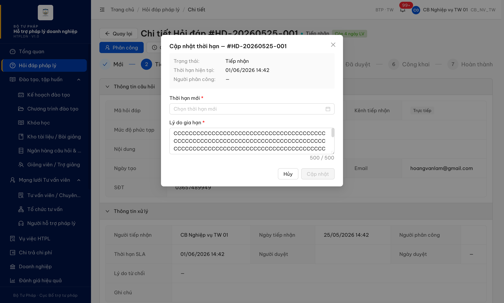
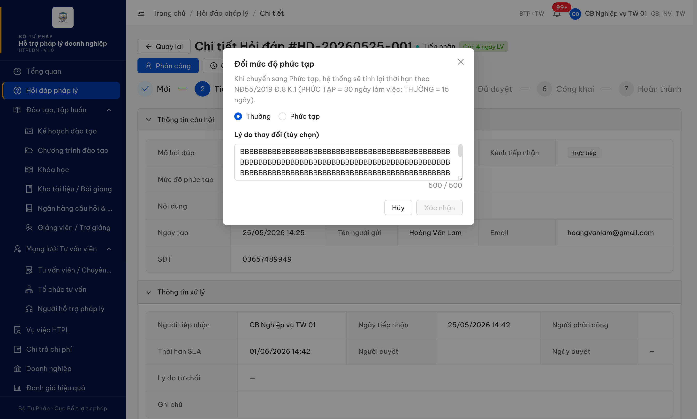
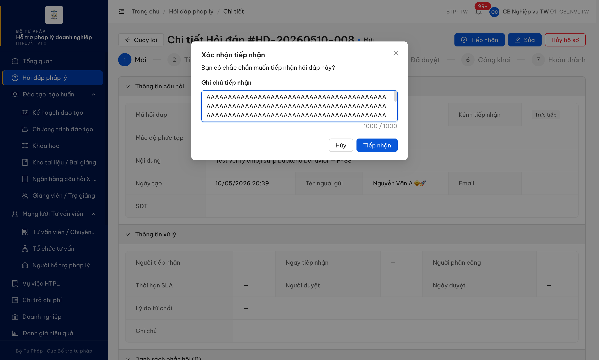

---

## ~~BUG-002~~ [CLOSED] — Popup Cập nhật thời hạn: Trạng thái hiện là TIEP_NHAN

| Trường | Giá trị |
|---|---|
| **Use case** | Quản lý thông tin tiếp nhận xử lý hỏi đáp, vướng mắc pháp lý |
| **Tác nhân chính** | Cán bộ nghiệp vụ TW,BN,ĐP |
| **Transaction** | Cán bộ nghiệp vụ TW,BN,ĐP xem kết quả cập nhật thông tin xử lý hỏi đáp, vướng mắc pháp lý;<br>Hệ thống kiểm tra điều kiện và hiển thị thông tin phân công, thời hạn xử lý và trạng thái luân chuyển của hồ sơ sau khi được cập nhật. |
| **Phân loại** | Bug |
| **Độ ưu tiên** | Thấp |
| **Ngày log** | 25/05/2026 |
| **Trạng thái xử lý** | ✅ Đã sửa (Closed) |
| **Ghi chú** | _(trống)_ |
| **Kết quả verify** | Popup `Cập nhật thời hạn` hiện trường Trạng thái là text `Tiếp nhận`, KHÔNG còn code `TIEP_NHAN`. Evidence: `image/verify-bug-002-popup-capnhat-thoihan.png`. |

### Mô tả (nguyên văn từ xlsx)

```
Tk: cb_nv_tw_01
Lỗi: Popup Cập nhật thời hạn: Trạng thái hiện là TIEP_NHAN
Mong muốn: Trạng thái hiển thị text (VD: Tiếp nhận)
=> Sửa tương tự với popup Phân công xử lý
```

### Ảnh minh chứng

- https://prnt.sc/wsy6__eNYAFB


**Ảnh verify (2026-05-26):**

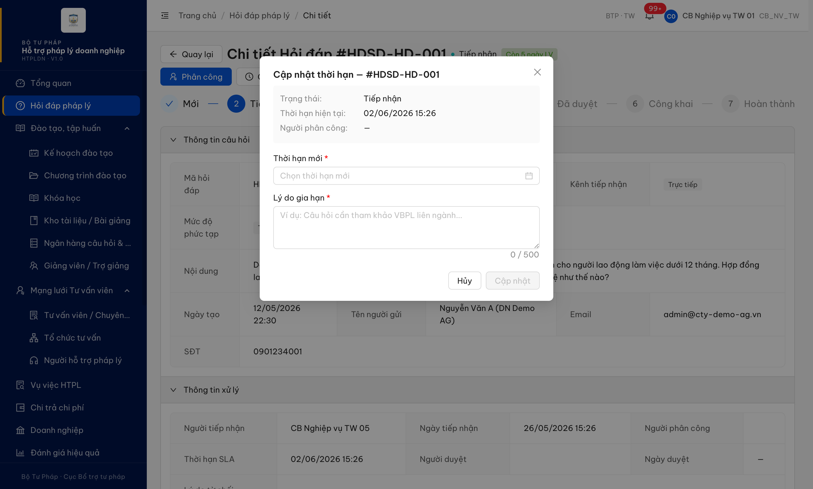

---

## BUG-003 — Số lượng cá nhân tư vấn hiển thị chưa đủ

| Trường | Giá trị |
|---|---|
| **Use case** | Phân công xử lý câu hỏi, vướng mắc |
| **Tác nhân chính** | Cán bộ nghiệp vụ TW,BN,ĐP |
| **Transaction** | Cán bộ nghiệp vụ TW,BN,ĐP lựa chọn Người hỗ trợ/Tổ chức tư vấn phù hợp để phân công xử lý câu hỏi, vướng mắc;<br>Hệ thống kiểm tra điều kiện và chuyển yêu cầu hỏi đáp đến Người hỗ trợ/Tổ chức tư vấn đã chọn nếu hợp lệ. |
| **Phân loại** | Bug |
| **Độ ưu tiên** | Trung bình |
| **Ngày log** | 25/05/2026 |
| **Trạng thái xử lý** | ❌ Chưa sửa (Open) |
| **Ghi chú** | _(trống)_ |
| **Kết quả verify** | `cb_nv_tw_05` mở HD-20260525-001 (Tiếp nhận, LV Lao động) → click Phân công → popup "Cá nhân" hiển thị 12 ứng viên: 10 cán bộ TW (01-10) + 2 TVV (huongcg, hương tvv1). Module Mạng lưới (`/chuyen-gia-tvv?trangThai=DANG_HOAT_DONG`) có 9 TVV Đang hoạt động, trong đó 3 TVV phụ trách LV Lao động: Nguyễn TVV An Giang 01, huongcg, hương tvv1. **Popup THIẾU 1 TVV (Nguyễn TVV An Giang 01)** phụ trách LV Lao động. Evidence: `image/verify-bug-003-popup-phancong.png`, `image/verify-bug-003-tvv-list-9-active.png`. |

### Mô tả (nguyên văn từ xlsx)

```
Tk: cb_nv_tw_01
Lỗi: Số lượng cá nhân tư vấn hiển thị chưa đủ
Hiện trang: Tại bản ghi ở trạng thái "Tiếp nhận", chọn "Phân công" chỉ hiển thị bản ghi của 10 người (8 người trong cục và 2 tư vấn viên). Danh sách tư vấn viên đang hoạt động có 9 tư vấn viên đang hoạt động
Mong muốn: List thêm đủ danh sách tư vấn viên đang hoạt động
```

### Ảnh minh chứng

- https://prnt.sc/EvJMUF_sDqsB
- https://prnt.sc/7W6NYVWFf_ZI


**Ảnh verify (2026-05-26):**

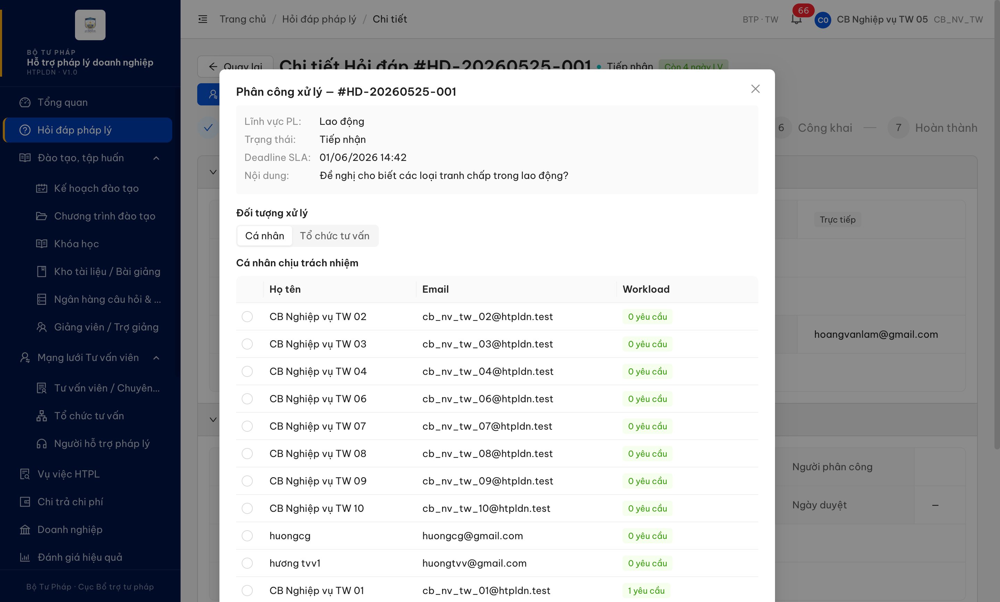
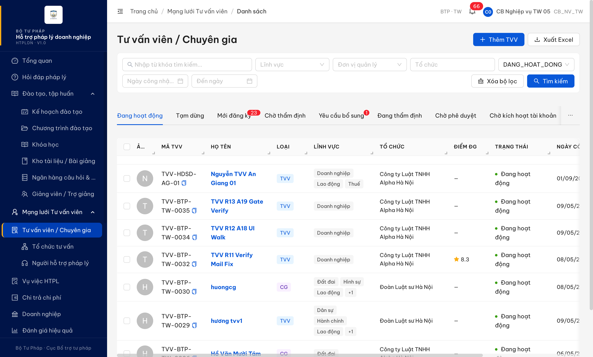

---

## BUG-004 — Vai trò tư vấn viên không có menu "Hỏi đáp pháp luật" để phản hồi

| Trường | Giá trị |
|---|---|
| **Use case** | Phản hồi câu hỏi, vướng mắc |
| **Tác nhân chính** | Cán bộ nghiệp vụ TW,BN,ĐP |
| **Transaction** | Cán bộ nghiệp vụ TW,BN,ĐP nhập phản hồi câu hỏi, vướng mắc rồi nhấn Lưu;<br>Hệ thống kiểm tra điều kiện và lưu lại phản hồi câu hỏi, vướng mắc đã nhập. |
| **Phân loại** | Bug |
| **Độ ưu tiên** | Cao |
| **Ngày log** | 25/05/2026 |
| **Trạng thái xử lý** | ❌ Chưa sửa (Open) |
| **Ghi chú** | _(trống)_ |
| **Kết quả verify** | Login `tvv_r11_mailfix` (TVV) → sidebar có 4 nhóm: Đào tạo/Mạng lưới TVV/Vụ việc HTPL/Tư vấn — **KHÔNG có menu "Hỏi đáp pháp lý"**. TVV không truy cập được màn xử lý câu hỏi đã phân công. Evidence: `image/verify-bug-004-tvv-sidebar-no-hoidap.png`. |

### Mô tả (nguyên văn từ xlsx)

```
Tk: tvv_r11_mailfix
Lỗi: Vai trò tư vấn viên không có menu "Hỏi đáp pháp luật" để phản hồi
```

### Ảnh minh chứng

- https://prnt.sc/XL2rAiFKNvX-


**Ảnh verify (2026-05-26):**

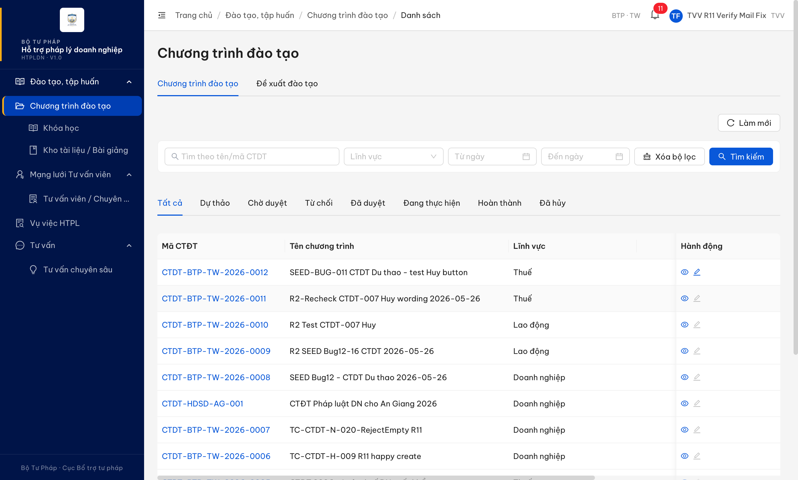

---

# III. Quản lý thông tin chương trình đào tạo tập huấn

## ~~BUG-005~~ [CLOSED] — Thiếu cột Hành động hiển thị các chức năng (Đang phải nhấn vào màn xem chi tiết mới chỉnh sửa, xó...

| Trường | Giá trị |
|---|---|
| **Use case** | Quản lý lập kế hoạch đào tạo bồi dưỡng |
| **Tác nhân chính** | Cán bộ nghiệp vụ TW,BN,ĐP/Cán bộ phê duyệt TW,BN,ĐP |
| **Transaction** | Cán bộ nghiệp vụ TW,BN,ĐP/Cán bộ phê duyệt TW,BN,ĐP xem danh sách lập kế hoạch đào tạo bồi dưỡng;<br>Hệ thống kiểm tra điều kiện và hiển thị danh sách lập kế hoạch đào tạo bồi dưỡng. |
| **Phân loại** | Bug |
| **Độ ưu tiên** | Trung bình |
| **Ngày log** | 25/05/2026 |
| **Trạng thái xử lý** | ✅ Đã sửa (Closed) |
| **Ghi chú** | _(trống)_ |
| **Kết quả verify** | Danh sách `Kế hoạch đào tạo` đã có cột `Hành động` với 3 icon (xem/sửa/xóa) cho từng record. Evidence: `image/verify-bug-005-kehoach-hanhdong.png`. |

### Mô tả (nguyên văn từ xlsx)

```
Tk: cb_nv_tw_01
Lỗi: Thiếu cột Hành động hiển thị các chức năng (Đang phải nhấn vào màn xem chi tiết mới chỉnh sửa, xóa được)
Mong muốn: Có cột Hành động hiển thị các chức năng để thao tác
=> Sửa tương tự Khóa đào tạo
```

### Ảnh minh chứng

- https://prnt.sc/9Ek5nPM6jmDl


**Ảnh verify (2026-05-26):**

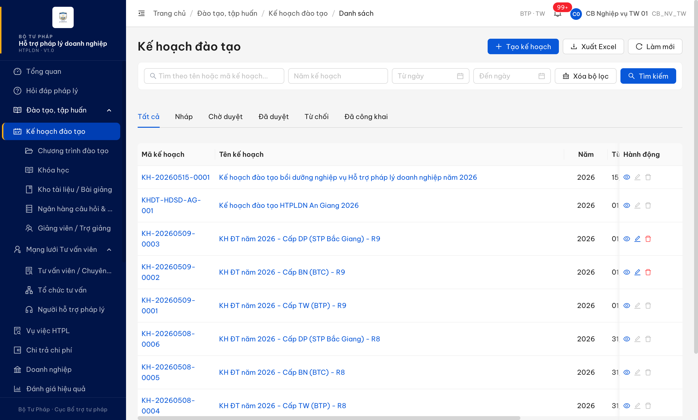

---

## ~~BUG-006~~ [CLOSED] — Trường Ngân sách dự kiến (VNĐ) là số tiền chưa có dấu ngăn cách hàng

| Trường | Giá trị |
|---|---|
| **Use case** | Quản lý chương trình đào tạo, tập huấn |
| **Tác nhân chính** | Cán bộ nghiệp vụ TW,BN,ĐP |
| **Transaction** | Cán bộ nghiệp vụ TW,BN,ĐP thêm mới chương trình đào tạo, tập huấn;<br>Hệ thống kiểm tra điều kiện và hiển thị màn hình thêm mới chương trình đào tạo, tập huấn. |
| **Phân loại** | Bug |
| **Độ ưu tiên** | Trung bình |
| **Ngày log** | 25/05/2026 |
| **Trạng thái xử lý** | ✅ Đã sửa (Closed) |
| **Ghi chú** | _(trống)_ |
| **Kết quả verify** | Modal `Tạo kế hoạch đào tạo` — nhập `1234567890` vào trường `Ngân sách dự kiến (VNĐ)` → hiển thị `1.234.567.890` với dấu chấm ngăn cách hàng nghìn. Evidence: `image/verify-bug-006-ngansach-format.png`. |

### Mô tả (nguyên văn từ xlsx)

```
Tk: cb_nv_tw_01
Lỗi: Trường Ngân sách dự kiến (VNĐ) là số tiền chưa có dấu ngăn cách hàng
Mong muốn: Có ngắt cách hàng 
```

### Ảnh minh chứng

- https://prnt.sc/jPRBGsdqPY7K


**Ảnh verify (2026-05-26):**

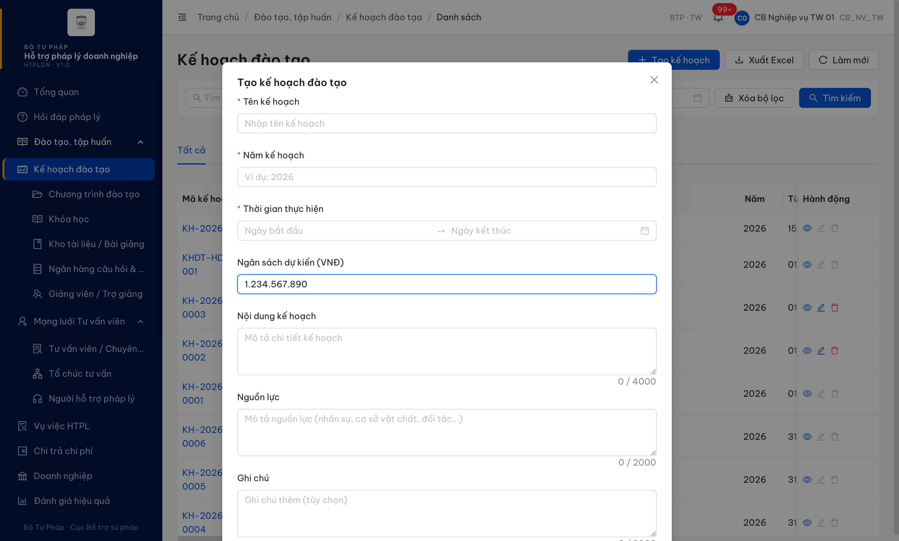

---

## ~~BUG-007~~ [CLOSED] — Trạng thái "Dụ thảo" ngoài màn danh sách chưa có chức năng Sửa, đang nhấn vào chức năng "Xem" để sửa

| Trường | Giá trị |
|---|---|
| **Use case** | Quản lý chương trình đào tạo, tập huấn |
| **Tác nhân chính** | Cán bộ nghiệp vụ TW,BN,ĐP |
| **Transaction** | Cán bộ nghiệp vụ TW,BN,ĐP chỉnh sửa chương trình đào tạo, tập huấn;<br>Hệ thống kiểm tra điều kiện và hiển thị màn hình chỉnh sửa chương trình đào tạo, tập huấn. |
| **Phân loại** | Bug |
| **Độ ưu tiên** | Trung bình |
| **Ngày log** | 25/05/2026 |
| **Trạng thái xử lý** | ✅ Đã sửa (Closed) |
| **Ghi chú** | _(trống)_ |
| **Kết quả verify** | CTDT trạng thái `Dự thảo` (vd CTDT-BTP-TW-2026-0011) — cột Hành động có 3 icon tách biệt: `Xem`, `Sửa`, `delete`. Evidence: `image/verify-bug-007-008-ctdt-list.png`. |

### Mô tả (nguyên văn từ xlsx)

```
Tk: cb_nv_tw_01
Lỗi: Trạng thái "Dụ thảo" ngoài màn danh sách chưa có chức năng Sửa, đang nhấn vào chức năng "Xem" để sửa
Mong muốn: Chức năng Sửa, Xem chi tiết được tách biệt
```

### Ảnh minh chứng

- https://prnt.sc/pYZQPcJOE_Nv


**Ảnh verify (2026-05-26):**

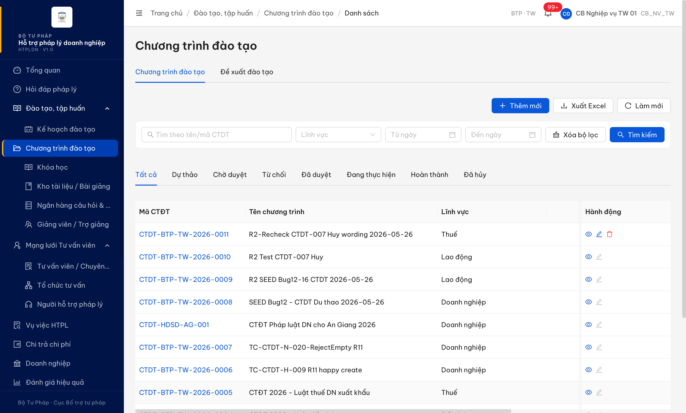

---

## ~~BUG-008~~ [CLOSED] — Không hiển thị dữ liệu cột Lĩnh vực

| Trường | Giá trị |
|---|---|
| **Use case** | Quản lý chương trình đào tạo, tập huấn |
| **Tác nhân chính** | Cán bộ nghiệp vụ TW,BN,ĐP |
| **Transaction** | Cán bộ nghiệp vụ TW,BN,ĐP xem danh sách chương trình đào tạo, tập huấn;<br>Hệ thống kiểm tra điều kiện và hiển thị danh sách chương trình đào tạo, tập huấn. |
| **Phân loại** | Bug |
| **Độ ưu tiên** | Cao |
| **Ngày log** | 25/05/2026 |
| **Trạng thái xử lý** | ✅ Đã sửa (Closed) |
| **Ghi chú** | _(trống)_ |
| **Kết quả verify** | Re-verify `cb_nv_tw_01` → `/dao-tao/chuong-trinh/danh-sach`: cột `Lĩnh vực` hiển thị data đầy đủ 13/13 record (Thuế ×3, Lao động ×3, Doanh nghiệp ×5, Đất đai ×1, Sở hữu trí tuệ ×1). Evidence: `image/reverify-bug-008-ctdt-linhvuc-13records.png`. |

### Mô tả (nguyên văn từ xlsx)

```
Tk: cb_nv_tw_01
Lỗi: Không hiển thị dữ liệu cột Lĩnh vực
Mong muốn: Hiển thị được dữ liệu Lĩnh vực đã chọn
```

### Ảnh minh chứng

- https://prnt.sc/4GR8wucYWrnD
- https://prnt.sc/C1wAdrywMsUr


**Ảnh verify mới nhất (re-verify 2026-05-26):**

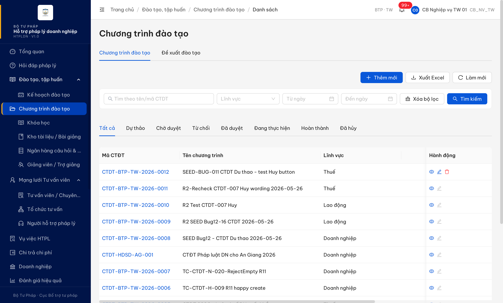

---

## ~~BUG-009~~ [CLOSED] — Khi chương trình đào tạo ở trạng thái "Chờ duyệt", cán bộ phê duyệt nhấn "Phê duyệt", bản ghi đã ...

| Trường | Giá trị |
|---|---|
| **Use case** | Quản lý chương trình đào tạo, tập huấn |
| **Tác nhân chính** | Cán bộ nghiệp vụ TW,BN,ĐP |
| **Transaction** | Cán bộ nghiệp vụ TW,BN,ĐP xem chi tiết chương trình đào tạo, tập huấn;<br>Hệ thống kiểm tra điều kiện và hiển thị thông tin chi tiết chương trình đào tạo, tập huấn. |
| **Phân loại** | Bug |
| **Độ ưu tiên** | Thấp |
| **Ngày log** | 25/05/2026 |
| **Trạng thái xử lý** | ✅ Đã sửa (Closed) |
| **Ghi chú** | _(trống)_ |
| **Kết quả verify** | Seed CTĐT-0011 sang `Chờ duyệt` → `cb_pd_tw_01` nhấn `Phê duyệt`. Lịch sử phê duyệt xuất hiện thêm entry `DUYET / Chờ duyệt → Đã duyệt / CB Phê duyệt TW 01 / 26/05/2026 18:54` NGAY (không cần F5). Evidence: `image/verify-bug-009-lichsu-update-instant.png`. |

### Mô tả (nguyên văn từ xlsx)

```
Tk: cb_pd_tw_01
Lỗi: Khi chương trình đào tạo ở trạng thái "Chờ duyệt", cán bộ phê duyệt nhấn "Phê duyệt", bản ghi đã chuyển sang trạng thái "Đã duyệt" nhưng Lịch sử phê duyệt chưa update (F5 mới update)
Mong muốn: Khi bản ghi ghi chuyển trạng thái thì lịch sử phê duyệt cũng cập nhật
```

### Ảnh minh chứng

- https://somup.com/cOhT26VVpBT


**Ảnh verify (2026-05-26):**

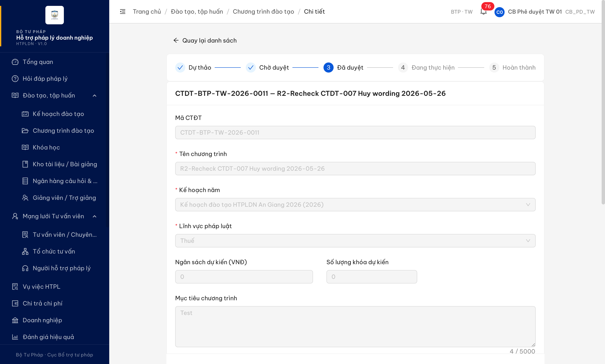

---

## ~~BUG-010~~ [CLOSED] — Bản ghi đến trạng thái "Đã tiếp nhận" ở cả 2 tài khoản khôn thấy button thao tác nào để thực hiện...

| Trường | Giá trị |
|---|---|
| **Use case** | Quản lý đề xuất đào tạo, tập huấn |
| **Tác nhân chính** | Người dân/Doanh nghiệp |
| **Transaction** | Doanh nghiệp/Người hỗ trợ thêm mới đề xuất đào tạo, tập huấn;<br>Hệ thống kiểm tra điều kiện và hiển thị màn hình thêm mới đề xuất đào tạo, tập huấn. |
| **Phân loại** | Bug |
| **Độ ưu tiên** | Cao |
| **Ngày log** | 25/05/2026 |
| **Trạng thái xử lý** | ✅ Đã sửa (Closed) |
| **Ghi chú** | _(trống)_ |
| **Kết quả verify** | Re-verify 2 account: (1) `cb_nv_tw_01` → record `SEED-BUG-010 Đã tiếp nhận` có 2 button `Bắt đầu xử lý` + `Từ chối` để tiếp luồng — OK. (2) `cb_pd_tw_01` → cùng record cột Thao tác = `—` (KHÔNG button) — có thể đúng phân quyền (PD chỉ phê duyệt CTĐT giai đoạn sau, không thao tác đề xuất ở state Đã tiếp nhận); BA confirm thêm nếu yêu cầu PD có quyền. Evidence: `image/reverify-bug-010-dexuat-datinhan-cbnvtw01.png`, `image/reverify-bug-010-dexuat-datinhan-cbpdtw01.png`. |

### Mô tả (nguyên văn từ xlsx)

```
Tk: cb_nv_tw_01, cb_pd_tw_01
Lỗi: Bản ghi đến trạng thái "Đã tiếp nhận" ở cả 2 tài khoản khôn thấy button thao tác nào để thực hiện tiếp luồng
Mong muốn: Bản ghi đến trạng thái "Đã tiếp nhận" có thể chạy tiếp luồng
```

### Ảnh minh chứng

- https://prnt.sc/nwtGh6PkC6Va
- https://prnt.sc/ywmEtKS9sDyl


**Ảnh verify mới nhất (re-verify 2026-05-26):**

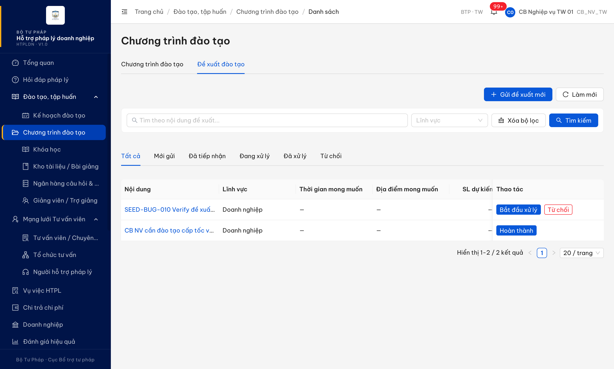
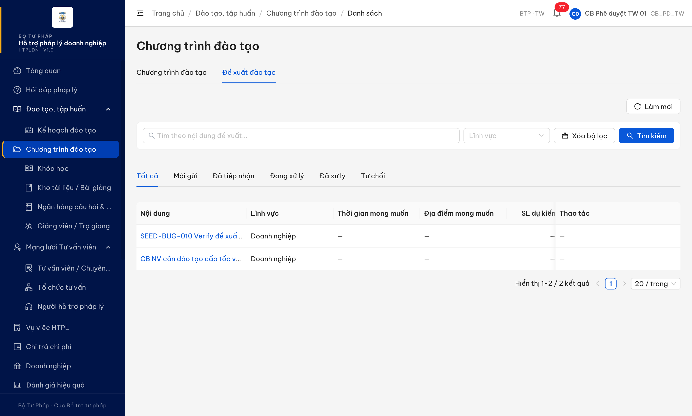

---

## ~~BUG-011~~ [CLOSED] — Chức năng "Hủy" nhưng hiển thị lại là "Rút bản nháp"

| Trường | Giá trị |
|---|---|
| **Use case** | Quản lý chương trình đào tạo, tập huấn |
| **Tác nhân chính** | Cán bộ nghiệp vụ TW,BN,ĐP |
| **Transaction** | Cán bộ nghiệp vụ TW,BN,ĐP thêm mới chương trình đào tạo, tập huấn;<br>Hệ thống kiểm tra điều kiện và hiển thị màn hình thêm mới chương trình đào tạo, tập huấn. |
| **Phân loại** | Bug |
| **Độ ưu tiên** | Thấp |
| **Ngày log** | 25/05/2026 |
| **Trạng thái xử lý** | ✅ Đã sửa (Closed) |
| **Ghi chú** | _(trống)_ |
| **Kết quả verify** | CTĐT Dự thảo — button `Hủy chương trình` (không phải `Rút bản nháp`). Popup confirm title `Hủy chương trình?`. Wording đồng nhất với trạng thái `Đã hủy`. Evidence: `image/verify-bug-011-huy-popup.png`. |

### Mô tả (nguyên văn từ xlsx)

```
Tk: cb_nv_tw_01
Lỗi: Chức năng "Hủy" nhưng hiển thị lại là "Rút bản nháp"
Mong muốn: Điều chỉnh lại text button và popup xác nhận thành "Hủy" để đồng nhất với trạng thái "Đã hủy"
```

### Ảnh minh chứng

- https://prnt.sc/KsEsxw7DG2Ao


**Ảnh verify (2026-05-26):**

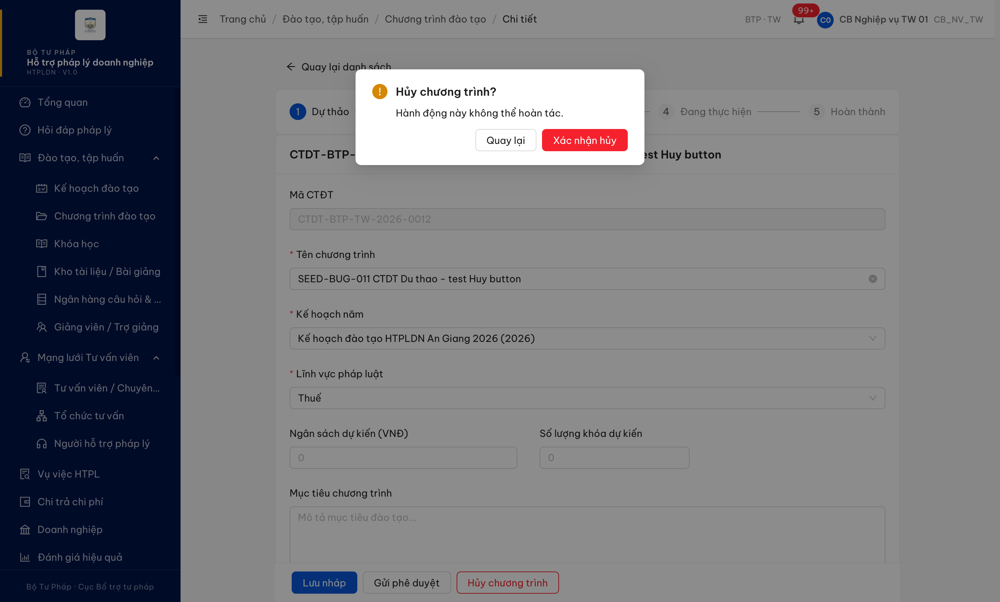

---

## ~~BUG-012~~ [CLOSED] — Danh sách học viên trong khóa chưa có thêm mới thủ công và tải file mẫu để import

| Trường | Giá trị |
|---|---|
| **Use case** | _(trống trong xlsx)_ |
| **Tác nhân chính** | _(trống trong xlsx)_ |
| **Transaction** | _(trống trong xlsx)_ |
| **Phân loại** | Bug |
| **Độ ưu tiên** | Cao |
| **Ngày log** | 25/05/2026 |
| **Trạng thái xử lý** | ✅ Đã sửa (Closed) |
| **Ghi chú** | _(trống)_ |
| **Kết quả verify** | Re-verify `cb_nv_tw_01` → KH-HDSD-AG-002 tab Học viên có (1) button `plus Thêm học viên` (thủ công), (2) button `import Import Excel` mở modal "Import danh sách đăng ký từ Excel" có button `download Tải file mẫu` + dropzone .xlsx ≤5MB + button `Bắt đầu Import`. Đủ 2 chức năng yêu cầu. Evidence: `image/reverify-bug-012-import-modal-taifilemau.png`. |

### Mô tả (nguyên văn từ xlsx)

```
Tk: cb_nv_tw_01
Lỗi: Danh sách học viên trong khóa chưa có thêm mới thủ công và tải file mẫu để import
Mong muốn: Có chức năng thêm học viên thủ công và tải file mẫu import
```

### Ảnh minh chứng

- https://prnt.sc/kZ0t4PSv-pCt


**Ảnh verify mới nhất (re-verify 2026-05-26):**

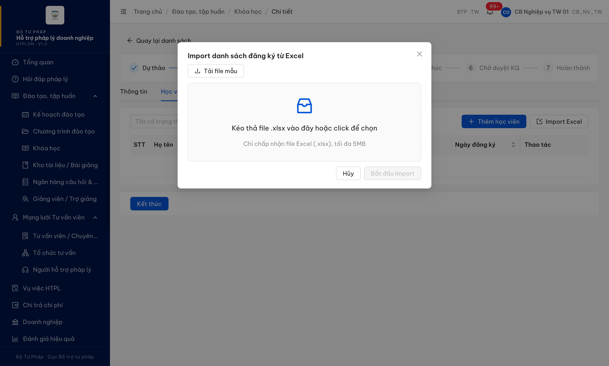

---

## ~~BUG-013~~ [CLOSED] — Buổi học trong khóa không bắt buộc Địa điểm/Link zoom nhưng khi lưu đang bắt buộc nhập

| Trường | Giá trị |
|---|---|
| **Use case** | _(trống trong xlsx)_ |
| **Tác nhân chính** | _(trống trong xlsx)_ |
| **Transaction** | _(trống trong xlsx)_ |
| **Phân loại** | Bug |
| **Độ ưu tiên** | Cao |
| **Ngày log** | 25/05/2026 |
| **Trạng thái xử lý** | ✅ Đã sửa (Closed) |
| **Ghi chú** | _(trống)_ |
| **Kết quả verify** | Re-verify `cb_nv_tw_01` form "Thêm buổi học" 2 case: (1) Hình thức = `Trực tiếp` → label `Địa điểm` KHÔNG có dấu `*` (form-item không có class `ant-form-item-required`). (2) Switch Hình thức = `Trực tuyến` → label đổi thành `Link Zoom`, vẫn KHÔNG có `*`. Required fields chỉ có: Ngày học, Giờ bắt đầu, Giờ kết thúc, Hình thức. Evidence: `image/reverify-bug-013-buoihoc-linkzoom-optional.png`. |

### Mô tả (nguyên văn từ xlsx)

```
Tk: cb_nv_tw_01
Lỗi: Buổi học trong khóa không bắt buộc Địa điểm/Link zoom nhưng khi lưu đang bắt buộc nhập
Mong muốn: Địa điểm/Link zoom không bắt buộc nhập khi lưu
```

### Ảnh minh chứng

- https://prnt.sc/T9kC8FAklWR7


**Ảnh verify mới nhất (re-verify 2026-05-26):**

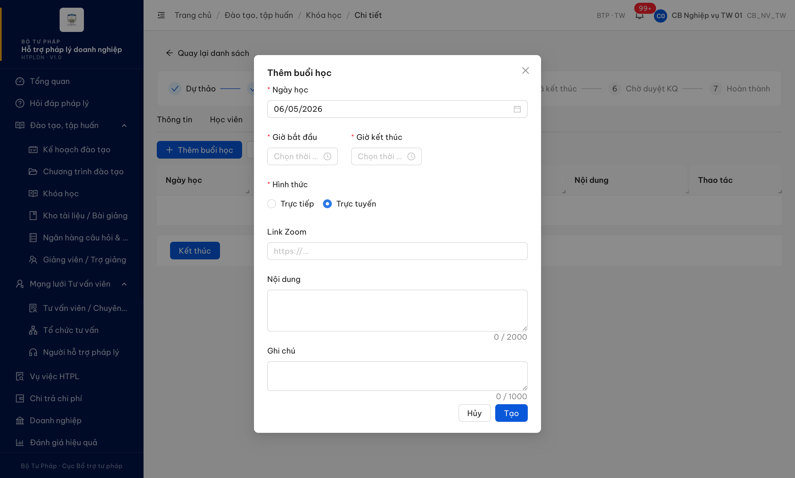

---

## ~~BUG-014~~ [CLOSED] — Thông báo lỗi khi lưu buổi học ngoài thời gian khóa học có định dạng ngày chưa đúng

| Trường | Giá trị |
|---|---|
| **Use case** | _(trống trong xlsx)_ |
| **Tác nhân chính** | _(trống trong xlsx)_ |
| **Transaction** | _(trống trong xlsx)_ |
| **Phân loại** | Bug |
| **Độ ưu tiên** | Trung bình |
| **Ngày log** | 25/05/2026 |
| **Trạng thái xử lý** | ✅ Đã sửa (Closed) |
| **Ghi chú** | _(trống)_ |
| **Kết quả verify** | Tạo buổi học ngày 15/09/2026 (ngoài range khóa học 01/08-05/08) → thông báo: "Ngày học phải nằm trong khoảng **01/08/2026 – 05/08/2026** của khóa học" — đúng định dạng dd/mm/yyyy. Evidence: `image/verify-bug-014-dateformat-error.png`. |

### Mô tả (nguyên văn từ xlsx)

```
Tk: cb_nv_tw_01
Lỗi: Thông báo lỗi khi lưu buổi học ngoài thời gian khóa học có định dạng ngày chưa đúng
Mong muốn: Ngày có định dạng là dd/mm/yyyy
```

### Ảnh minh chứng

- https://prnt.sc/hMv8JB_5-1Ua


**Ảnh verify (2026-05-26):**

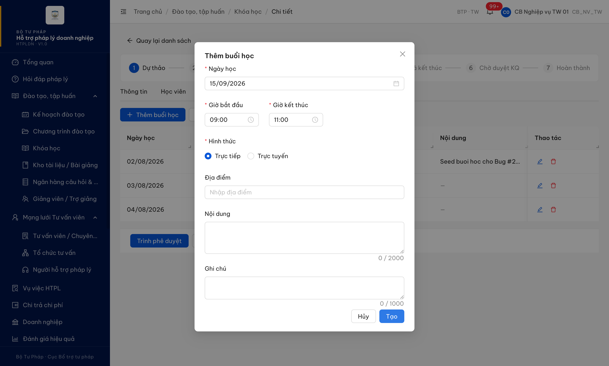

---

## ~~BUG-015~~ [CLOSED] — Không hiển thị danh sách bài giảng để thêm vào khóa học

| Trường | Giá trị |
|---|---|
| **Use case** | _(trống trong xlsx)_ |
| **Tác nhân chính** | _(trống trong xlsx)_ |
| **Transaction** | _(trống trong xlsx)_ |
| **Phân loại** | Bug |
| **Độ ưu tiên** | Cao |
| **Ngày log** | 25/05/2026 |
| **Trạng thái xử lý** | ✅ Đã sửa (Closed) |
| **Ghi chú** | _(trống)_ |
| **Kết quả verify** | KH-HDSD-AG-002 → tab "Bài giảng đã gán" → nhấn "Gán bài giảng" → modal mở, combobox "Chọn bài giảng công khai để gán" load 10 bài giảng visible: "R2 Test CTDT-013 NO MOTA", "SEED Bug22-24 - Bai giang PDF 2026-05-26", "Bài giảng 09 - Luật Doanh nghiệp 2020", "Bài giảng 08 - Bộ luật Dân sự 2015", "Bài giảng 07", "Bài giảng 06", "Bài giảng 05", "Bài giảng 04", "Bài giảng 03", "Bài giảng 02". Evidence: `image/reverify-bug-015-baigiang-list.png`. |

### Mô tả (nguyên văn từ xlsx)

```
Tk: cb_nv_tw_01
Lỗi: Không hiển thị danh sách bài giảng để thêm vào khóa học
Mong muốn: Hiển thị danh sách bài giảng ở kho bài giảng để thêm vào khóa học
```

### Ảnh minh chứng

- https://prnt.sc/ngs_X6Nj-IAH


**Ảnh verify mới nhất (re-verify 2026-05-26):**

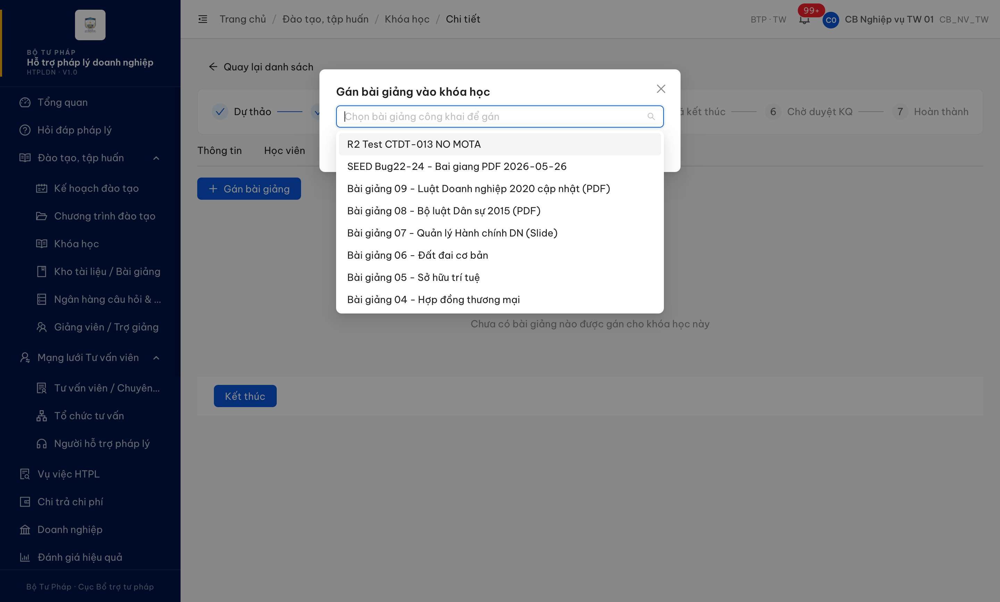

---

## ~~BUG-016~~ [CLOSED] — Nhấn chỉnh sửa 1 bản ghi cũ rồi nhấn "Thêm bài giảng" bị lưu lại cache của bản ghi trước vào màn ...

| Trường | Giá trị |
|---|---|
| **Use case** | Quản lý kho tài liệu, bài giảng |
| **Tác nhân chính** | Cán bộ nghiệp vụ TW,BN,ĐP/Cán bộ phê duyệt TW,BN,ĐP |
| **Transaction** | Cán bộ nghiệp vụ TW,BN,ĐP/Cán bộ phê duyệt TW,BN,ĐP thêm mới kho tài liệu, bài giảng;<br>Hệ thống kiểm tra điều kiện và hiển thị màn hình thêm mới kho tài liệu, bài giảng. |
| **Phân loại** | Bug |
| **Độ ưu tiên** | Trung bình |
| **Ngày log** | 25/05/2026 |
| **Trạng thái xử lý** | ✅ Đã sửa (Closed) |
| **Ghi chú** | _(trống)_ |
| **Kết quả verify** | Mở edit "R2 Test CTDT-013 NO MOTA" → Hủy → bấm "Thêm bài giảng": Tên bài giảng rỗng, Tệp tài liệu rỗng, Lĩnh vực placeholder "Chọn lĩnh vực" — không cache giá trị bản ghi trước. Evidence: `image/verify-bug-016-themmoi-nocache.png`. |

### Mô tả (nguyên văn từ xlsx)

```
Tk: cb_nv_tw_01
Lỗi: Nhấn chỉnh sửa 1 bản ghi cũ rồi nhấn "Thêm bài giảng" bị lưu lại cache của bản ghi trước vào màn thêm mới
Mong muốn: Màn thêm mới đều chưa có dữ liệu
```

### Ảnh minh chứng

- https://go.screenpal.com/watch/cOhT28nt7u5


**Ảnh verify (2026-05-26):**

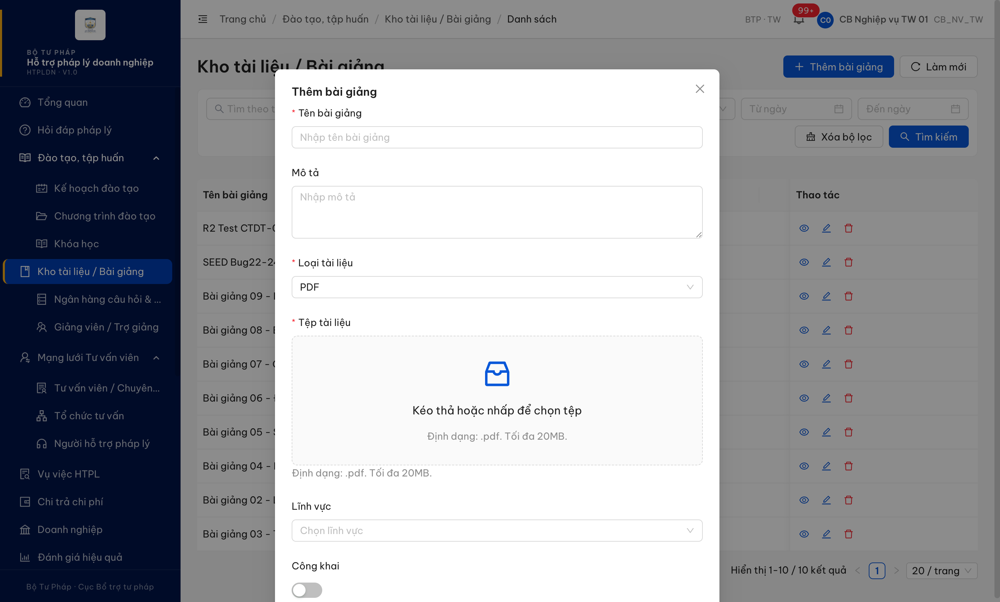

---

## ~~BUG-017~~ [CLOSED] — Thêm mới bài giảng, trường Mô tả không bắt buộc nhưng lưu lại bắt buộc nhập

| Trường | Giá trị |
|---|---|
| **Use case** | Quản lý kho tài liệu, bài giảng |
| **Tác nhân chính** | Cán bộ nghiệp vụ TW,BN,ĐP/Cán bộ phê duyệt TW,BN,ĐP |
| **Transaction** | Cán bộ nghiệp vụ TW,BN,ĐP/Cán bộ phê duyệt TW,BN,ĐP thêm mới kho tài liệu, bài giảng;<br>Hệ thống kiểm tra điều kiện và hiển thị màn hình thêm mới kho tài liệu, bài giảng. |
| **Phân loại** | Bug |
| **Độ ưu tiên** | Cao |
| **Ngày log** | 25/05/2026 |
| **Trạng thái xử lý** | ✅ Đã sửa (Closed) |
| **Ghi chú** | _(trống)_ |
| **Kết quả verify** | Modal "Thêm bài giảng" — label "Mô tả" KHÔNG có dấu `*` đỏ và DOM class `""` (không có `ant-form-item-required`). 3 trường bắt buộc có `*` + class `ant-form-item-required`: Tên bài giảng, Loại tài liệu, Tệp tài liệu. Bản ghi "R2 Test CTDT-013 NO MOTA" đã tồn tại trong danh sách — chứng minh hệ thống chấp nhận lưu khi không nhập Mô tả. Evidence: `image/reverify-bug-017-mota-optional.png`. |

### Mô tả (nguyên văn từ xlsx)

```
Tk: cb_nv_tw_01
Lỗi: Thêm mới bài giảng, trường Mô tả không bắt buộc nhưng lưu lại bắt buộc nhập
Mong muốn: Trường mô tả không bắt buộc khi lưu
```

### Ảnh minh chứng

- https://prnt.sc/nWeFF0X7pj-P


**Ảnh verify mới nhất (re-verify 2026-05-26):**


---

## ~~BUG-018~~ [CLOSED] — Mành danh sách bài giảng thừa cột Khóa học

| Trường | Giá trị |
|---|---|
| **Use case** | Quản lý kho tài liệu, bài giảng |
| **Tác nhân chính** | Cán bộ nghiệp vụ TW,BN,ĐP/Cán bộ phê duyệt TW,BN,ĐP |
| **Transaction** | Cán bộ nghiệp vụ TW,BN,ĐP/Cán bộ phê duyệt TW,BN,ĐP xem danh sách kho tài liệu, bài giảng;<br>Hệ thống kiểm tra điều kiện và hiển thị danh sách kho tài liệu, bài giảng. |
| **Phân loại** | Bug |
| **Độ ưu tiên** | Cao |
| **Ngày log** | 25/05/2026 |
| **Trạng thái xử lý** | ✅ Đã sửa (Closed) |
| **Ghi chú** | _(trống)_ |
| **Kết quả verify** | Danh sách Kho bài giảng (`/dao-tao/bai-giang/danh-sach`) — DOM `.ant-table-thead th` chỉ gồm 5 cột: "Tên bài giảng" / "Loại tài liệu" / "Dung lượng" / "Ngày tạo" / "Thao tác". KHÔNG còn cột "Khóa học". Evidence: `image/reverify-bug-018-baigiang-columns.png`. |

### Mô tả (nguyên văn từ xlsx)

```
Tk: cb_nv_tw_01
Lỗi: Mành danh sách bài giảng thừa cột Khóa học
Mong muốn: Bài giảng bỏ cột Khóa học
```

### Ảnh minh chứng

- https://prnt.sc/IjNtDbD94D9i


**Ảnh verify mới nhất (re-verify 2026-05-26):**

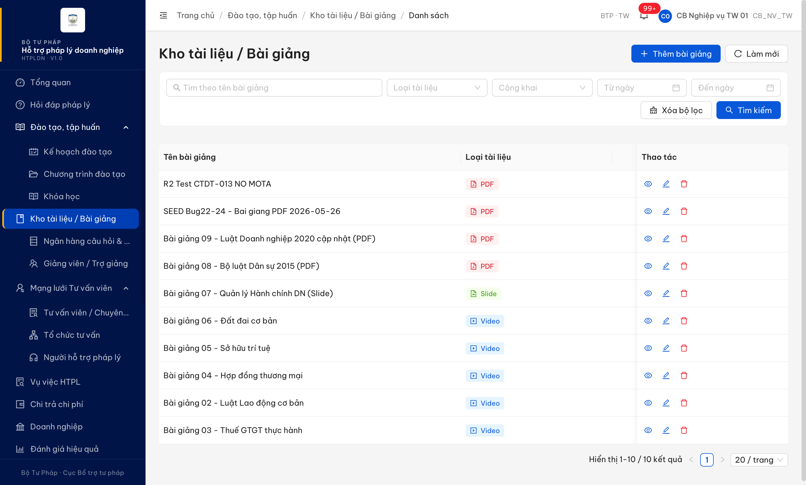

---

## ~~BUG-019~~ [CLOSED] — Không xem preview file PDF

| Trường | Giá trị |
|---|---|
| **Use case** | Quản lý kho tài liệu, bài giảng |
| **Tác nhân chính** | Cán bộ nghiệp vụ TW,BN,ĐP/Cán bộ phê duyệt TW,BN,ĐP |
| **Transaction** | Cán bộ nghiệp vụ TW,BN,ĐP/Cán bộ phê duyệt TW,BN,ĐP xem file kho tài liệu, bài giảng;<br>Hệ thống kiểm tra điều kiện và hiển thị màn hình xem file kho tài liệu, bài giảng. |
| **Phân loại** | Bug |
| **Độ ưu tiên** | Trung bình |
| **Ngày log** | 25/05/2026 |
| **Trạng thái xử lý** | ✅ Đã sửa (Closed) |
| **Ghi chú** | _(trống)_ |
| **Kết quả verify** | Bấm icon "eye" trên bản ghi PDF (R2 Test CTDT-013 NO MOTA) → mở dialog "Xem trước" với iframe load PDF từ MinIO (file `hd-file-dinh-kem-19mb-OK.pdf`) thành công, nội dung hiển thị. Evidence: `image/verify-bug-019-pdf-preview.png`. |

### Mô tả (nguyên văn từ xlsx)

```
Tk: cb_nv_tw_01
Lỗi: Không xem preview file PDF
Mong muốn: Xem preview được file PDF
```

### Ảnh minh chứng

- https://prnt.sc/1NclyTQ-O48q


**Ảnh verify (2026-05-26):**

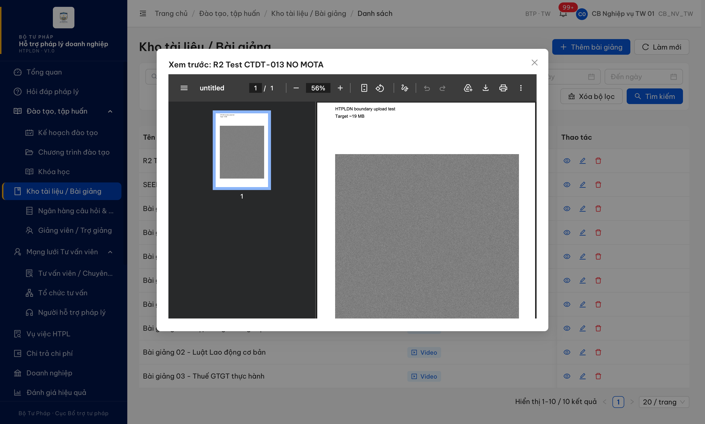

---

## BUG-020 — Danh sách giảng viên thừa thông tin vai trò

| Trường | Giá trị |
|---|---|
| **Use case** | Quản lý giảng viên, trợ giảng |
| **Tác nhân chính** | Cán bộ nghiệp vụ TW,BN,ĐP/Cán bộ phê duyệt TW,BN,ĐP |
| **Transaction** | Cán bộ nghiệp vụ TW,BN,ĐP/Cán bộ phê duyệt TW,BN,ĐP thêm mới giảng viên, trợ giảng;<br>Hệ thống kiểm tra điều kiện và hiển thị màn hình thêm mới giảng viên, trợ giảng. |
| **Phân loại** | Bug |
| **Độ ưu tiên** | Cao |
| **Ngày log** | 25/05/2026 |
| **Trạng thái xử lý** | ⚠️ Sửa một phần (Partial — cần BA confirm) |
| **Ghi chú** | _(trống)_ |
| **Kết quả verify** | `cb_nv_tw_05` (1) DS `/dao-tao/giang-vien/danh-sach` 6 cột: Họ tên/Chuyên ngành/Trình độ/Số khóa đã dạy/Trạng thái/Thao tác — KHÔNG còn cột "Vai trò" ở danh sách. (2) Form `/dao-tao/giang-vien/tao-moi` 10 trường: Họ và tên *, **Loại * (radio Giảng viên/Trợ giảng)**, Chuyên ngành *, Trình độ *, Tổ chức, Email, Điện thoại, Mô tả năng lực, Lĩnh vực *, Trạng thái — không có label "Vai trò". Trường **Loại** vẫn cố định ở record GV; mong muốn BA là "vai trò theo từng lịch học" — cần BA xác nhận liệu Loại = Vai trò hay 2 khái niệm tách biệt. Evidence: `image/verify-bug-020-gv-list-cols.png`, `image/reverify-bug-020-gv-form-loai.png`. |

### Mô tả (nguyên văn từ xlsx)

```
Tk: cb_nv_tw_01
Lỗi: Danh sách giảng viên thừa thông tin vai trò
Mong muốn: Giảng viên/trợ giảng phải trong Lịch học và mới có vai trò theo từng lịch học
```

### Ảnh minh chứng

- https://prnt.sc/_4DgHWtlMJ9R


**Ảnh verify mới nhất (re-verify 2026-05-26):**

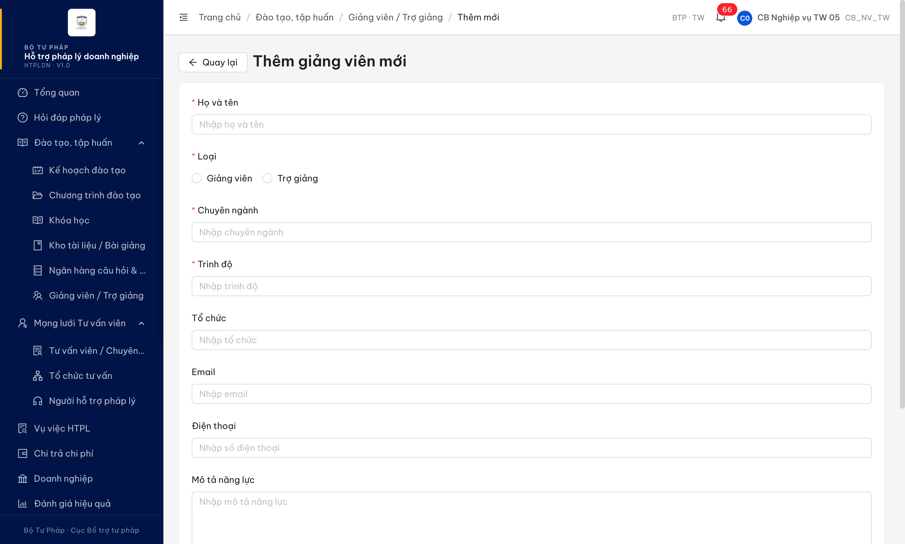

---

## BUG-021 — 1. Cột Thời gian: Chưa hiển thị dữ liệu theo khóa học

| Trường | Giá trị |
|---|---|
| **Use case** | Quản lý giảng viên, trợ giảng |
| **Tác nhân chính** | Cán bộ nghiệp vụ TW,BN,ĐP/Cán bộ phê duyệt TW,BN,ĐP |
| **Transaction** | Cán bộ nghiệp vụ TW,BN,ĐP/Cán bộ phê duyệt TW,BN,ĐP xem lịch sử giảng dạy của giảng viên, trợ giảng;<br>Hệ thống kiểm tra điều kiện và hiển thị lịch sử giảng dạy của giảng viên, trợ giảng. |
| **Phân loại** | Bug |
| **Độ ưu tiên** | Cao |
| **Ngày log** | 25/05/2026 |
| **Trạng thái xử lý** | ❌ Chưa sửa (Open) |
| **Ghi chú** | _(trống)_ |
| **Kết quả verify** | `cb_nv_tw_01` mở danh sách Giảng viên — 3 giảng viên có counter "Số khóa đã dạy" > 0: TS. Nguyễn Pháp Luật AG (5), ThS. Trần Lao Động AG (3), LS. Lê Thuế AG (2). Mở chi tiết cả 3 → tab "Lịch sử giảng dạy" → cả 3 đều hiển thị empty state "Chưa có lịch sử giảng dạy" (`.ant-empty`). Bug confirmed: counter cột "Số khóa đã dạy" ở danh sách ≠ Lịch sử giảng dạy ở tab chi tiết. Cannot verify 3 sub-issues gốc (Thời gian / Vai trò mã / Trạng thái mã) vì không có row nào render. Evidence: `image/reverify-bug-021-lichsugiangday-empty.png`. |

### Mô tả (nguyên văn từ xlsx)

```
Tk: cb_nv_tw_01
Lỗi:
1. Cột Thời gian: Chưa hiển thị dữ liệu theo khóa học
2. Cột Vai trò: Đang hiện mã 
3. Cột Trang thái: Đã kết thúc đang hiện mã
Mong muốn: 
1. Hiển thị được thời gian theo khóa học
2, 3. Hiển thị text chứ ko hiện mã
```

### Ảnh minh chứng

- https://prnt.sc/GtEB7CrNFsFM


**Ảnh verify mới nhất (re-verify 2026-05-26):**

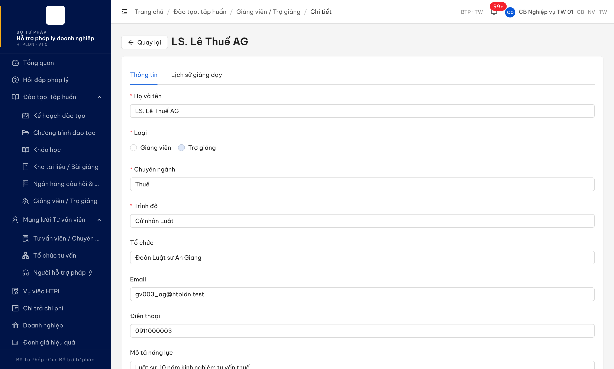

---

# IV. Quản lý thông tin chuyên gia tư vấn viên pháp lý

## ~~BUG-022~~ [CLOSED] — Màn xem chi tiết tư vấn viên, nhấn xem file đính kèm bị lỗi

| Trường | Giá trị |
|---|---|
| **Use case** | Quản lý tư vấn viên |
| **Tác nhân chính** | Cán bộ nghiệp vụ TW,BN,ĐP |
| **Transaction** | Cán bộ nghiệp vụ TW,BN,ĐP xem chi tiết tư vấn viên;<br>Hệ thống kiểm tra điều kiện và hiển thị thông tin chi tiết tư vấn viên. |
| **Phân loại** | Bug |
| **Độ ưu tiên** | Cao |
| **Ngày log** | 25/05/2026 |
| **Trạng thái xử lý** | ✅ Đã sửa (Closed) |
| **Ghi chú** | _(trống)_ |
| **Kết quả verify** | Verify lần 2: Mạng lưới TVV → mở Nguyễn TVV An Giang 01 (`TVV-HDSD-AG-01`) → tab Hồ sơ → section "File đính kèm" có file `Danh sách tư vấn viên 1.pdf` (2.3 MB) → click button "Xem" → mở tab mới với URL MinIO presigned (`http://103.172.236.130:9000/htpldn/.../Danh%20sách%20tư%20vấn%20viên%201.pdf?X-Amz-Algorithm=AWS4-HMAC-SHA256&...&X-Amz-Expires=300`), hiển thị PDF qua Chrome PDF viewer. Evidence: `image/reverify-bug-022-tvv-file-preview.png`. |

### Mô tả (nguyên văn từ xlsx)

```
Tk: cb_nv_tw_01
Lỗi: Màn xem chi tiết tư vấn viên, nhấn xem file đính kèm bị lỗi
Mong muốn: Xem được preview file đính kèm
```

### Ảnh minh chứng

- https://prnt.sc/t5714-gQ_pvf


**Ảnh verify mới nhất (re-verify 2026-05-26):**

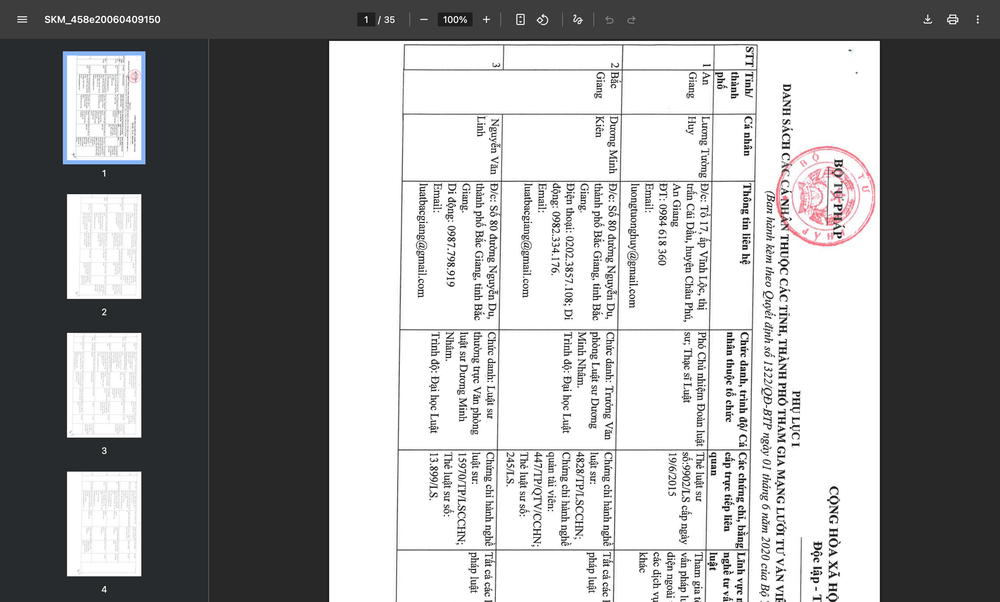

---

## ~~BUG-023~~ [CLOSED] — Thêm mới tổ chức tư vấn chưa tồn tại nhưng lại báo đã tồn tại

| Trường | Giá trị |
|---|---|
| **Use case** | _(trống trong xlsx)_ |
| **Tác nhân chính** | _(trống trong xlsx)_ |
| **Transaction** | _(trống trong xlsx)_ |
| **Phân loại** | Bug |
| **Độ ưu tiên** | Cao |
| **Ngày log** | 25/05/2026 |
| **Trạng thái xử lý** | ✅ Đã sửa (Closed) |
| **Ghi chú** | _(trống)_ |
| **Kết quả verify** | Verify lần 2: Tổ chức tư vấn → "Thêm tổ chức tư vấn" → fill Tên="TC VERIFY-BUG-023 Reverify 2026-05-26" + Loại hình="Công ty Luật" + Người ĐD="Người Đại Diện Test 026" + Số Giấy ĐKHĐ="GP-AG-2026-026" + Ngày cấp="15/01/2026" + Địa chỉ + Lĩnh vực="Thuế" → nhấn "Tạo mới" → tạo thành công, URL chuyển sang `/to-chuc/9313dc0d-...` chi tiết tổ chức mới, status "Mới đăng ký". KHÔNG còn toast/notification "đã tồn tại". Evidence: `image/reverify-bug-023-tochuc-created.png`. |

### Mô tả (nguyên văn từ xlsx)

```
Tk: cb_nv_tw_01
Lỗi: Thêm mới tổ chức tư vấn chưa tồn tại nhưng lại báo đã tồn tại
Mong muốn: Thêm mới được tổ chức tư vấn
```

### Ảnh minh chứng

- https://prnt.sc/dt2UYZrjIEeH


**Ảnh verify mới nhất (re-verify 2026-05-26):**

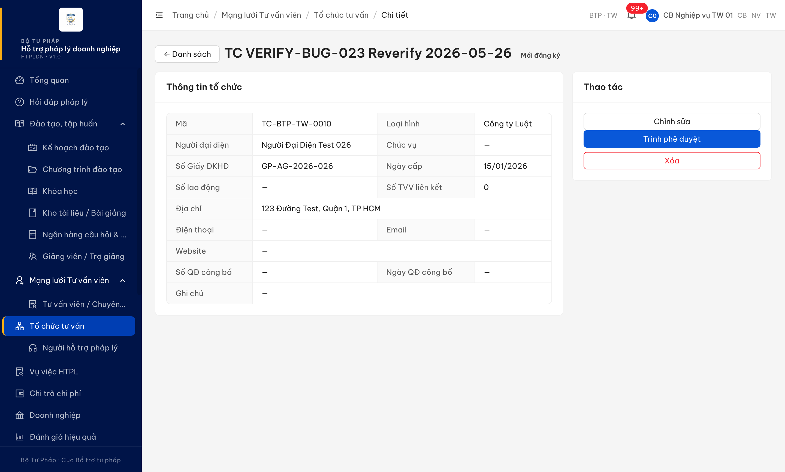

---

## ~~BUG-024~~ [CLOSED] — Tổ chức tư vấn chờ duyệt nhưng không hiển thị chức năng phê duyệt, từ chối

| Trường | Giá trị |
|---|---|
| **Use case** | _(trống trong xlsx)_ |
| **Tác nhân chính** | _(trống trong xlsx)_ |
| **Transaction** | _(trống trong xlsx)_ |
| **Phân loại** | Bug |
| **Độ ưu tiên** | Cao |
| **Ngày log** | 25/05/2026 |
| **Trạng thái xử lý** | ✅ Đã sửa (Closed) |
| **Ghi chú** | _(trống)_ |
| **Kết quả verify** | Verify lần 2: Login `cb_pd_tw_01` → Tổ chức tư vấn → tab "Chờ phê duyệt" (3 tổ chức) → mỗi row có 3 button: `eye` / `check-circle` (Phê duyệt) / `close-circle` (Từ chối). Mở chi tiết "TC VERIFY-BUG-023 Unique 2026-05-26" (TC-BTP-TW-0009, id `43defd8f-...`, status "Chờ phê duyệt") → section "Thao tác" cuối trang hiện đầy đủ 2 button "Phê duyệt" + "Từ chối". Evidence: `image/reverify-bug-024-approve-reject-buttons.png`. |

### Mô tả (nguyên văn từ xlsx)

```
Tk: cb_pd_tw_01
Lỗi: Tổ chức tư vấn chờ duyệt nhưng không hiển thị chức năng phê duyệt, từ chối
Mong muốn: Hiển thị chức năng phê duyệt, từ chối để thao tác
```

### Ảnh minh chứng

- https://prnt.sc/l2RwOM1fhh-h


**Ảnh verify mới nhất (re-verify 2026-05-26):**

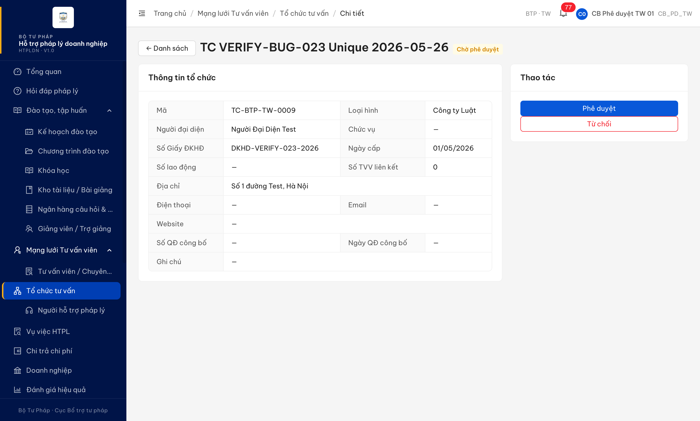

---

# V. Quản lý vụ việc trợ giúp pháp lý

## ~~BUG-025~~ [CLOSED] — Màn chỉnh sửa và màn xem chi tiết vụ việc, nhấn button "Sửa" nhưng lại chuyển đến màn danh sách

| Trường | Giá trị |
|---|---|
| **Use case** | Nhập hồ sơ yêu cầu |
| **Tác nhân chính** | Cán bộ nghiệp vụ TW,BN,ĐP |
| **Transaction** | Cán bộ nghiệp vụ TW,BN,ĐP chỉnh sửa hồ sơ yêu cầu từ văn bản giấy, điện thoại...;<br>Hệ thống kiểm tra điều kiện và hiển thị màn hình chỉnh sửa hồ sơ yêu cầu. |
| **Phân loại** | Bug |
| **Độ ưu tiên** | Trung bình |
| **Ngày log** | 25/05/2026 |
| **Trạng thái xử lý** | ✅ Đã sửa (Closed) |
| **Ghi chú** | _(trống)_ |
| **Kết quả verify** | Click "Sửa" trên VV-BTP-TW-20260526-004 → URL `/vu-viec/.../?mode=edit` (KHÔNG về list). Edit screen + Detail screen đều KHÔNG còn button "Sửa" dư thừa. Evidence: `image/verify-bug-025-sua-goes-to-edit.png`, `image/verify-bug-025-edit-no-sua-button.png`. |

### Mô tả (nguyên văn từ xlsx)

```
Tk: cb_nv_tw_01
Lỗi: Màn chỉnh sửa và màn xem chi tiết vụ việc, nhấn button "Sửa" nhưng lại chuyển đến màn danh sách
Mong muốn: 
- Màn chỉnh sửa bỏ button Sửa
- Màn xem chi tiết nhấn Sửa chuyển đến màn chỉnh sửa
```

### Ảnh minh chứng

- https://go.screenpal.com/watch/cOhTDynt7kb


**Ảnh verify (2026-05-26):**

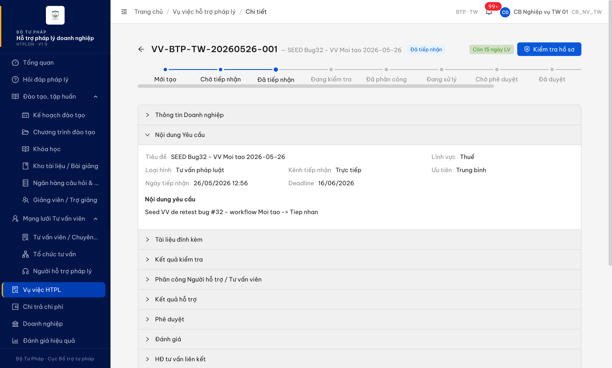


---

## ~~BUG-026~~ [CLOSED] — Khi thêm mới chọn "Lưu nháp" đang là trạng thái "Mới tạo" nhấn "Tiếp nhận" bị lỗi

| Trường | Giá trị |
|---|---|
| **Use case** | Nhập hồ sơ yêu cầu |
| **Tác nhân chính** | Cán bộ nghiệp vụ TW,BN,ĐP |
| **Transaction** | Cán bộ nghiệp vụ TW,BN,ĐP chỉnh sửa hồ sơ yêu cầu từ văn bản giấy, điện thoại...;<br>Hệ thống kiểm tra điều kiện và hiển thị màn hình chỉnh sửa hồ sơ yêu cầu. |
| **Phân loại** | Bug |
| **Độ ưu tiên** | Cao |
| **Ngày log** | 25/05/2026 |
| **Trạng thái xử lý** | ✅ Đã sửa (Closed) |
| **Ghi chú** | _(trống)_ |
| **Kết quả verify** | Tạo VV "VERIFY BUG-026 Luu Nhap Moi Tao" (VV-BTP-TW-20260526-005) qua "Lưu nháp" → status "Mới tạo". Click "Tiếp nhận" → modal xác nhận → confirm → status đổi sang "Đã tiếp nhận", không lỗi. Evidence: `image/verify-bug-026-tiep-nhan-ok.png`. |

### Mô tả (nguyên văn từ xlsx)

```
Tk: cb_nv_tw_01
Lỗi: Khi thêm mới chọn "Lưu nháp" đang là trạng thái "Mới tạo" nhấn "Tiếp nhận" bị lỗi
Mong muốn: Khi chỉnh sửa vụ việc ở trạng thái "Mới tạo" tiếp nhận thành công
```

### Ảnh minh chứng

- https://prnt.sc/zfvWarxA9Qxu


**Ảnh verify (2026-05-26):**

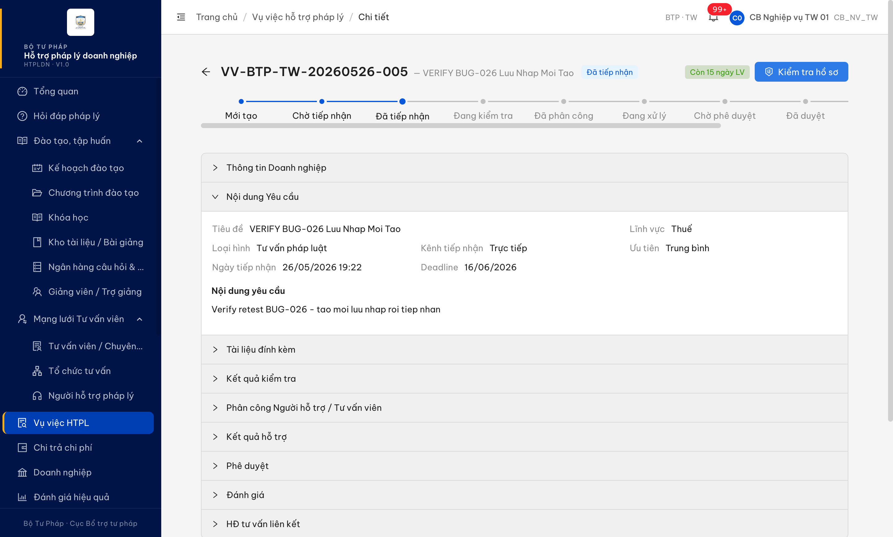

---

## BUG-027 — Không phân công cho người ngoài đơn vị

| Trường | Giá trị |
|---|---|
| **Use case** | Lựa chọn người hỗ trợ cho vụ việc |
| **Tác nhân chính** | Cán bộ nghiệp vụ TW,BN,ĐP |
| **Transaction** | Cán bộ nghiệp vụ TW,BN,ĐP lựa chọn Tư vấn viên hoặc Tổ chức tư vấn phù hợp để hỗ trợ cho vụ việc;<br>Hệ thống kiểm tra điều kiện và hiển thị màn hình xác nhận lựa chọn. |
| **Phân loại** | Bug |
| **Độ ưu tiên** | Cao |
| **Ngày log** | 25/05/2026 |
| **Trạng thái xử lý** | ❌ Chưa sửa (Open) |
| **Ghi chú** | _(trống)_ |
| **Kết quả verify** | `cb_nv_tw_05` advance VV-BTP-TW-20260526-001 (Đã tiếp nhận → Đang kiểm tra) → mở modal "Phân công tư vấn viên" → hiển thị tooltip "**Pool gợi ý chỉ gồm TVV/NHT cùng cấp đơn vị (BR-AUTH-08)**". Tick "Bỏ lọc lĩnh vực" + mở dropdown → 10 option đều prefix `TVV/NHT-BTP-TW-*` (cấp TW only), KHÔNG có TVV/NHT ngoài cấp TW (ĐP, BN). Vẫn giữ giới hạn cùng cấp đơn vị, KHÔNG cho phân công xuyên đơn vị theo yêu cầu bug. Cần BA confirm: giữ BR-AUTH-08 (close as Won't fix) hay bỏ giới hạn. Evidence: `image/verify-bug-027-still-restricted-cung-cap-don-vi.png`, `image/verify-bug-027-dropdown-only-tw.png`. |

### Mô tả (nguyên văn từ xlsx)

```
Tk: cb_nv_tw_01
Lỗi: Không phân công cho người ngoài đơn vị
Mong muốn: Phân công được cho người phù hợp (Không giới hạn theo đơn vị)
```

### Ảnh minh chứng

- https://prnt.sc/r-D6bYXi3Jl2


**Ảnh verify (2026-05-26):**

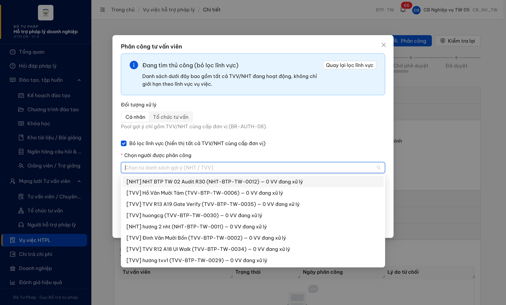
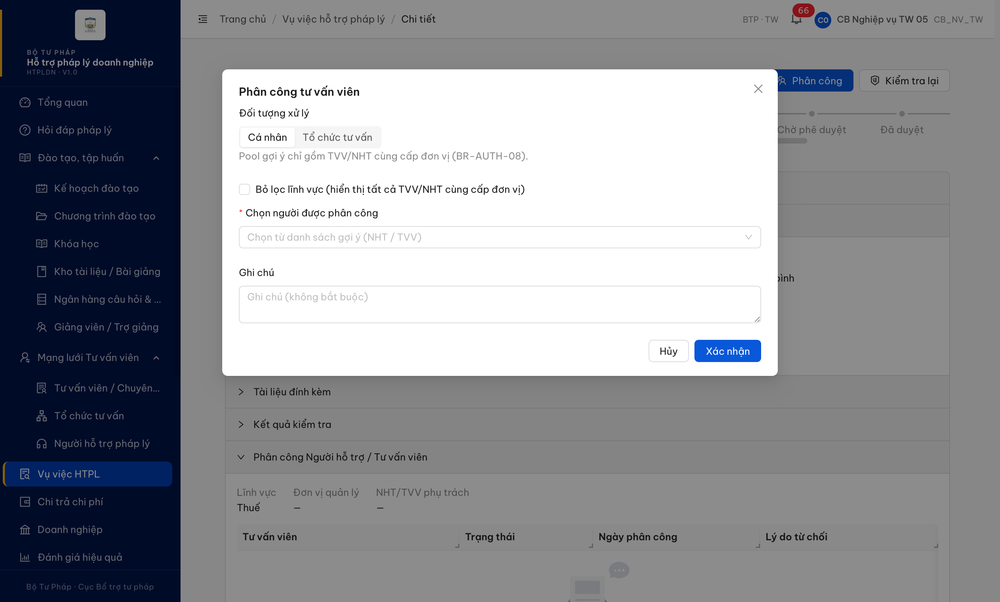

---

## ~~BUG-028~~ [CLOSED] — Vụ việc ở trạng thái "Đã phân công" nhưng vẫn còn button "Phân công"

| Trường | Giá trị |
|---|---|
| **Use case** | Lựa chọn người hỗ trợ cho vụ việc |
| **Tác nhân chính** | Cán bộ nghiệp vụ TW,BN,ĐP |
| **Transaction** | Cán bộ nghiệp vụ TW,BN,ĐP lựa chọn Tư vấn viên hoặc Tổ chức tư vấn phù hợp để hỗ trợ cho vụ việc;<br>Hệ thống kiểm tra điều kiện và hiển thị màn hình xác nhận lựa chọn. |
| **Phân loại** | Bug |
| **Độ ưu tiên** | Thấp |
| **Ngày log** | 25/05/2026 |
| **Trạng thái xử lý** | ✅ Đã sửa (Closed) |
| **Ghi chú** | _(trống)_ |
| **Kết quả verify** | VV-BTP-TW-20260526-005 status "Đã phân công" → header action area KHÔNG còn button "Phân công" (cũng không "Kiểm tra lại"). Button "Phân công" đã ẩn đúng theo state machine. Evidence: `image/verify-bug-028-no-phan-cong-button.png`. |

### Mô tả (nguyên văn từ xlsx)

```
Tk: cb_nv_tw_01
Lỗi: Vụ việc ở trạng thái "Đã phân công" nhưng vẫn còn button "Phân công"
Mong muốn: Vụ việc ở trạng thái "Đã phân công" ẩn button "Phân công"
```

### Ảnh minh chứng

- https://prnt.sc/DW6mT1oXG9os


**Ảnh verify (2026-05-26):**

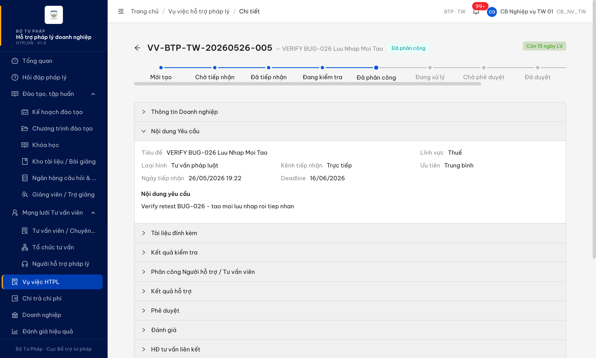

---

## BUG-029 — 1. Cột SLA và Ngày nộp dữ liệu bị đè lên nhau

| Trường | Giá trị |
|---|---|
| **Use case** | Quản lý hồ sơ đề nghị thanh toán |
| **Tác nhân chính** | Cán bộ nghiệp vụ TW,BN,ĐP |
| **Transaction** | Cán bộ nghiệp vụ TW,BN,ĐP xem danh sách hồ sơ đề nghị thanh toán;<br>Hệ thống kiểm tra điều kiện và hiển thị danh sách hồ sơ đề nghị thanh toán. |
| **Phân loại** | Bug |
| **Độ ưu tiên** | Trung bình |
| **Ngày log** | 26/05/2026 |
| **Trạng thái xử lý** | ✅ Đã sửa (Closed) |
| **Ghi chú** | _(trống)_ |
| **Kết quả verify** | Login `admin` → `/chi-tra/danh-sach` tab "Tất cả" (113 hồ sơ). Part 1 (SLA + Ngày nộp đè nhau) → ✅ FIXED: 2 cột tách biệt. Part 2 (SLA quá hạn màu trắng không nhìn được) → ✅ FIXED: badge "Quá hạn X ngày LV" giờ là chữ đỏ `rgb(207,19,34)` trên nền hồng nhạt `rgb(255,241,240)` (class `ant-tag ant-tag-filled ant-tag-red`) — đọc rõ. Evidence: `image/reverify-bug-029-sla-overdue-red.png`. |

### Mô tả (nguyên văn từ xlsx)

```
Tk: admin
Lỗi: 
1. Cột SLA và Ngày nộp dữ liệu bị đè lên nhau
2. Cột SLA quá hạn màu trắng ko nhìn được text
Mong muốn: 
1. Dữ liệu 2 cột ko bị đè lên nhau
2. SLA quá hạn đổi thành màu khác dễ nhìn
```

### Ảnh minh chứng

- https://prnt.sc/NxyB-ZsPG2I_
- https://prnt.sc/fOcaAjw1Z7Jf


**Ảnh verify mới nhất (re-verify 2026-05-26):**

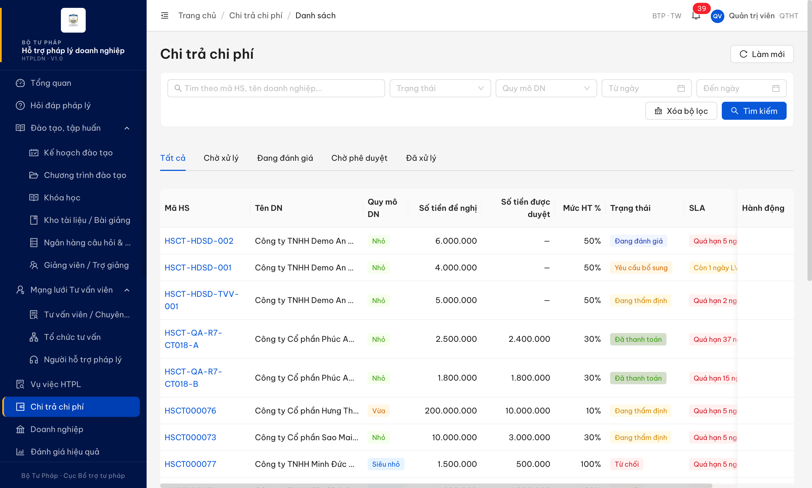

---

## BUG-030 — Không lưu được kết quả thẩm định

| Trường | Giá trị |
|---|---|
| **Use case** | Thẩm định hồ sơ đề nghị thanh toán |
| **Tác nhân chính** | Cán bộ nghiệp vụ TW,BN,ĐP |
| **Transaction** | Cán bộ nghiệp vụ TW,BN,ĐP nhập nhận xét và kết quả thẩm định hồ sơ đề nghị thanh toán;<br>Hệ thống lưu trữ kết quả thẩm định và cập nhật trạng thái hồ sơ. |
| **Phân loại** | Bug |
| **Độ ưu tiên** | Cao |
| **Ngày log** | 26/05/2026 |
| **Trạng thái xử lý** | ✅ Đã sửa (Closed) |
| **Ghi chú** | _(trống)_ |
| **Kết quả verify** | Login `cb_nv_bn_01` → HSCT000051 → tick 4 tiêu chí + chọn "Đạt" → click "Xác nhận thẩm định" → POST `/api/v1/ho-so-chi-tras/.../tham-dinh` trả **200** + Lịch sử xử lý có dòng mới `26/05/2026 22:44 — Thẩm định — Đang thẩm định`. Form chuyển sang step nhập "Số tiền đề xuất phê duyệt" + "Nhận xét", panel "Trình phê duyệt" hiển thị "Hồ sơ đã thẩm định Đạt. Bấm để trình lãnh đạo phê duyệt." Lưu lại lần 2 sau khi đã thẩm định trả 422 là validation đúng (chống duplicate save). Bug log gốc "Không lưu được kết quả thẩm định" đã được fix. Evidence: `image/reverify-bug-030-tham-dinh-saved.png`. |

### Mô tả (nguyên văn từ xlsx)

```
Tk: cb_nv_bn_01
Lỗi: Không lưu được kết quả thẩm định
Mong muốn: Lưu được kết quả thẩm định thành công
```

### Ảnh minh chứng

- https://prnt.sc/5D3qRGQmJfQ7


**Ảnh verify mới nhất (re-verify 2026-05-26):**

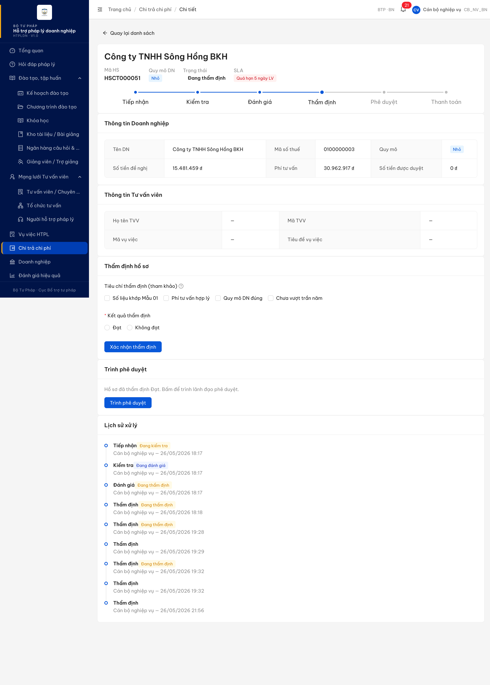
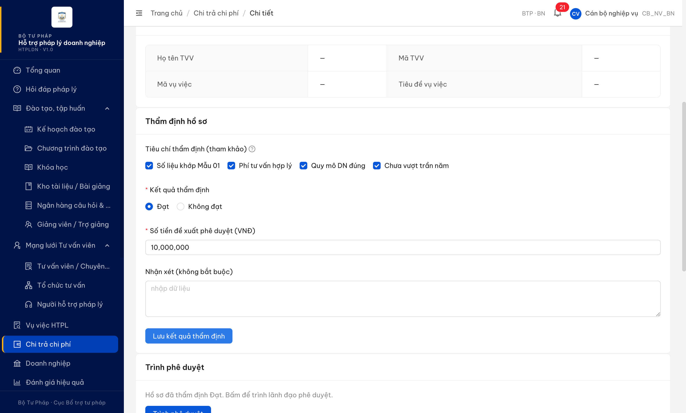

---

## ~~BUG-031~~ [CLOSED] — Sau khi phê duyệt back về màn danh sách nhưng bản ghi vẫn ở tab "Chờ phê duyệt", F5 lại mới chuyể...

| Trường | Giá trị |
|---|---|
| **Use case** | Phê duyệt hồ sơ đề nghị thanh toán |
| **Tác nhân chính** | Cán bộ nghiệp vụ TW,BN,ĐP |
| **Transaction** | Cán bộ phê duyệt TW,BN,ĐP phê duyệt hồ sơ đề nghị thanh toán;<br>Hệ thống kiểm tra điều kiện và cập nhật trạng thái đã duyệt hồ sơ đề nghị thanh toán. |
| **Phân loại** | Bug |
| **Độ ưu tiên** | Thấp |
| **Ngày log** | 26/05/2026 |
| **Trạng thái xử lý** | ✅ Đã sửa (Closed) |
| **Ghi chú** | _(trống)_ |
| **Kết quả verify** | Login `cb_pd_bn_05` (BTC scope) → Chi trả → tab "Chờ phê duyệt" có HSCT000058 → mở chi tiết → click "Phê duyệt" (Số tiền duyệt 11.881.466 + ghi chú) → status đổi "Đã duyệt" + Lịch sử xử lý ghi "CB Phê duyệt BN 05 (BTC) — 26/05/2026 22:00". Click "Quay lại danh sách" → tab "Chờ phê duyệt" rỗng (KHÔNG cần F5). Click sang tab "Đã xử lý" → HSCT000058 hiện ra với status "Đã duyệt" + Số tiền duyệt 11.881.466. Bug data sync đã sửa. Lưu ý UX: tab active sau back vẫn giữ "Chờ phê duyệt" (URL không có query tab), nhưng record đã đúng trạng thái khi đổi tab. Evidence: `image/reverify-bug-031-tab-cho-pd-empty.png`. |

### Mô tả (nguyên văn từ xlsx)

```
Tk: cb_pd_bn_01
Lỗi: Sau khi phê duyệt back về màn danh sách nhưng bản ghi vẫn ở tab "Chờ phê duyệt", F5 lại mới chuyển sang tab "Đã xử lý"
Mong muốn: Sau khi phê duyệt thành công thì bản ghi chuyển sang tab Đã xử lý
```

### Ảnh minh chứng


**Ảnh verify mới nhất (re-verify 2026-05-26):**

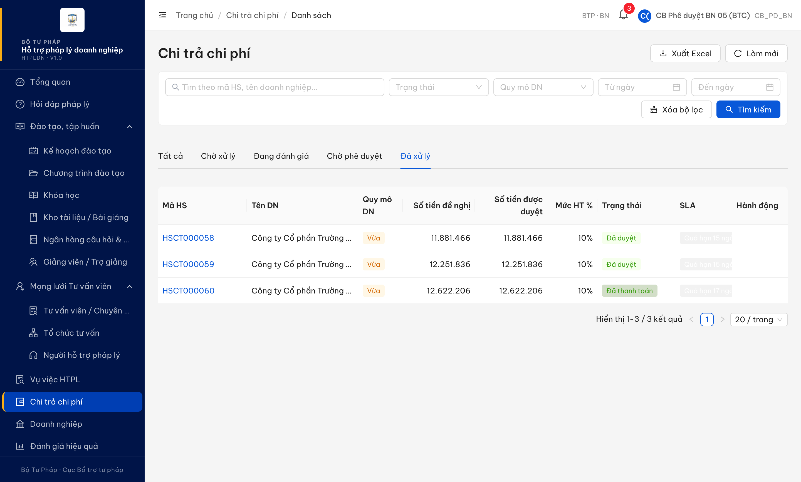

_(Không có ảnh minh chứng trong file gốc)_

---

## ~~BUG-032~~ [CLOSED] — Trường Số tiền thực trả và Ngày thanh toán định dạng chưa đúng

| Trường | Giá trị |
|---|---|
| **Use case** | Cập nhật kết quả xử lý hồ sơ đề nghị thanh toán |
| **Tác nhân chính** | Cán bộ nghiệp vụ TW,BN,ĐP |
| **Transaction** | Cán bộ nghiệp vụ TW,BN,ĐP cập nhật kết quả xử lý hồ sơ đề nghị thanh toán và cập nhật trạng thái cuối cùng của hồ sơ (Đã thanh toán/Từ chối thanh toán);<br>Hệ thống kiểm tra điều kiện và lưu lại dữ liệu đã cập nhật kết quả xử lý hồ sơ đề nghị thanh toán. |
| **Phân loại** | Bug |
| **Độ ưu tiên** | Thấp |
| **Ngày log** | 26/05/2026 |
| **Trạng thái xử lý** | ✅ Đã sửa (Closed) |
| **Kết quả verify** | Số tiền thực trả nhập `5000000` hiển thị `5.000.000` (dấu chấm ngăn cách hàng nghìn). Ngày thanh toán value=`26/05/2026` (dd/mm/yyyy). Evidence: `image/bug-032-verify-format-fixed.png`. |
| **Ghi chú** | _(trống)_ |

### Mô tả (nguyên văn từ xlsx)

```
Tk: cb_nv_bn_01
Lỗi: Trường Số tiền thực trả và Ngày thanh toán định dạng chưa đúng
Mong muốn: 
1. Số tiền thực trả: Có dấu chấm ngăn cách hàng
2. Ngày thanh toán: dd/mm/yyyy
```

### Ảnh minh chứng

- https://prnt.sc/V-Zblxwkkdcf


**Ảnh verify (local):**

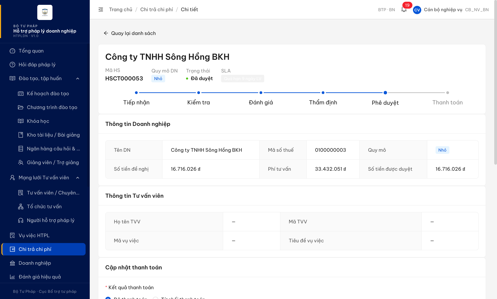

---

## BUG-033 — Không có button Thêm mới để thêm doanh nghiệp

| Trường | Giá trị |
|---|---|
| **Use case** | Quản lý doanh nghiệp được hỗ trợ pháp lý |
| **Tác nhân chính** | Cán bộ nghiệp vụ TW,BN,ĐP |
| **Transaction** | Cán bộ nghiệp vụ TW,BN,ĐP thêm mới doanh nghiệp được hỗ trợ pháp lý;<br>Hệ thống kiểm tra điều kiện và hiển thị màn hình thêm mới doanh nghiệp được hỗ trợ pháp lý. |
| **Phân loại** | Bug |
| **Độ ưu tiên** | Cao |
| **Ngày log** | 26/05/2026 |
| **Trạng thái xử lý** | ❌ Chưa sửa (Open) |
| **Kết quả verify** | Login `cb_nv_bn_01` → `/doanh-nghiep/danh-sach`. Toolbar chỉ có `Xuất Excel`, `Làm mới`, `Xóa bộ lọc`, `Tìm kiếm` — vẫn KHÔNG có button `Thêm mới`. Verify qua JS: `allButtons = ["Xuất Excel","Làm mới","Xóa bộ lọc","Tìm kiếm"]`. Bug chưa fix. Evidence: `image/reverify-bug-033-no-themmoi-button.png`. |
| **Ghi chú** | _(trống)_ |

### Mô tả (nguyên văn từ xlsx)

```
Tk: cb_nv_bn_01
Lỗi: Không có button Thêm mới để thêm doanh nghiệp
Mong muốn: Có button Thêm mới doanh nghiệp
```

### Ảnh minh chứng

- https://prnt.sc/3xZ46DePetjD


**Ảnh verify mới nhất (re-verify 2026-05-26):**

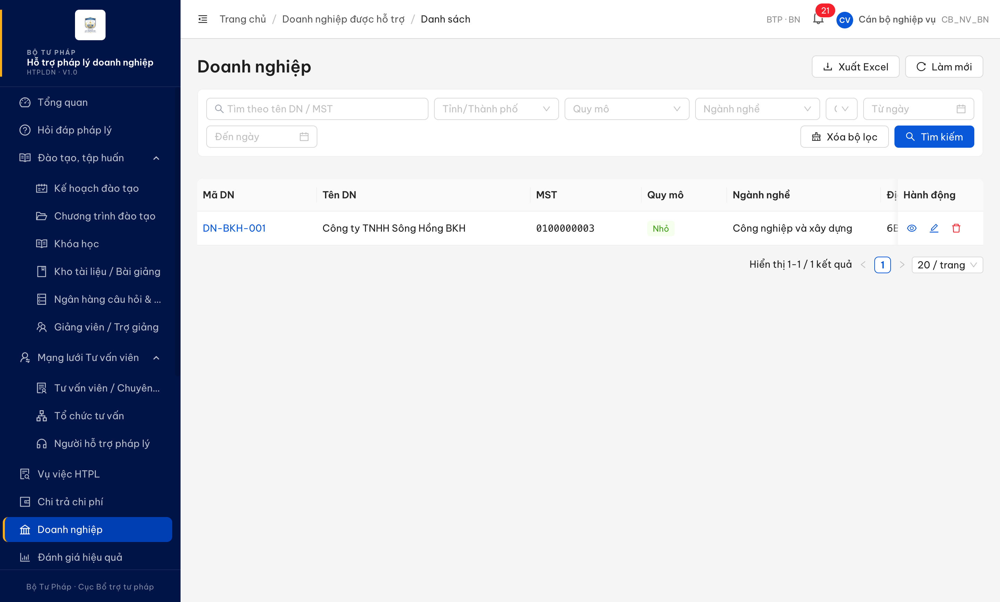

---

## BUG-034 — Màn chỉnh sửa trường Loại doanh nghiệp hiển thị id

| Trường | Giá trị |
|---|---|
| **Use case** | Quản lý doanh nghiệp được hỗ trợ pháp lý |
| **Tác nhân chính** | Cán bộ nghiệp vụ TW,BN,ĐP |
| **Transaction** | Cán bộ nghiệp vụ TW,BN,ĐP chỉnh sửa doanh nghiệp được hỗ trợ pháp lý;<br>Hệ thống kiểm tra điều kiện và hiển thị màn hình chỉnh sửa doanh nghiệp được hỗ trợ pháp lý. |
| **Phân loại** | Bug |
| **Độ ưu tiên** | Cao |
| **Ngày log** | 26/05/2026 |
| **Trạng thái xử lý** | ❌ Chưa sửa (Open) |
| **Kết quả verify** | Login `cb_nv_tw_01` → mở edit DN-AGG-0003 (Công ty TNHH Demo An Giang). Field `Loại doanh nghiệp` vẫn hiển thị `e57ef423-7ea9-4fc2-87d1-5ad68802cffd` (UUID) thay vì label. Các field khác (Quy mô = "Nhỏ", Ngành nghề = "Thương mại và dịch vụ", Tỉnh-TP = "An Giang") hiển thị đúng label. Bug chưa fix. Evidence: `image/reverify-bug-034-loaiDN-uuid.png`. |
| **Ghi chú** | _(trống)_ |

### Mô tả (nguyên văn từ xlsx)

```
Tk: cb_nv_tw_01
Lỗi: Màn chỉnh sửa trường Loại doanh nghiệp hiển thị id
Mong muốn: Loại doanh nghiệp hiển thị đúng dữ liệu
```

### Ảnh minh chứng

- https://prnt.sc/U9E2pUX3YEKg


**Ảnh verify mới nhất (re-verify 2026-05-26):**

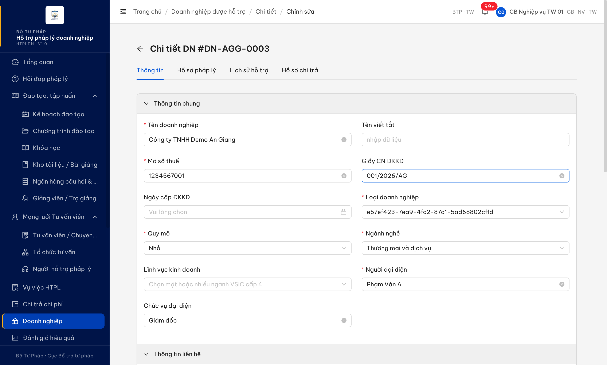

---

# VI. Quản lý kiểm tra đánh giá hiệu quả hỗ trợ

## BUG-035 — Thêm mới có tải lên file đính kèm nhưng khi lưu bị lỗi không lưu được file

| Trường | Giá trị |
|---|---|
| **Use case** | Lập kế hoạch đánh giá |
| **Tác nhân chính** | Cán bộ nghiệp vụ TW,BN,ĐP |
| **Transaction** | Cán bộ nghiệp vụ TW,BN,ĐP lập kế hoạch đánh giá;<br>Hệ thống kiểm tra điều kiện và hiển thị màn hình thêm mới kế hoạch đánh giá. |
| **Phân loại** | Bug |
| **Độ ưu tiên** | Cao |
| **Ngày log** | 26/05/2026 |
| **Trạng thái xử lý** | ✅ Đã sửa (Closed) |
| **Kết quả verify** | Login `cb_nv_tw_01` → mở edit DG-20260526-0002 → upload `bug-035-test.pdf` qua section "Tài liệu đính kèm". POST `/ke-hoach-danh-gias/{id}/files` trả **201** (trước 500). UI hiển thị item `ant-upload-list-item-done` với tên file. File upload thành công, bug đã fix. Evidence: `image/reverify-bug-035-file-upload-201.png`. |
| **Ghi chú** | _(trống)_ |

### Mô tả (nguyên văn từ xlsx)

```
Tk: cb_nv_tw_01
Lỗi: Thêm mới có tải lên file đính kèm nhưng khi lưu bị lỗi không lưu được file
Mong muốn: Thêm mới có tải lên file thì lưu được file đã tải
```

### Ảnh minh chứng

- https://prnt.sc/MCIjnWL_0XFV


**Ảnh verify mới nhất (re-verify 2026-05-26):**

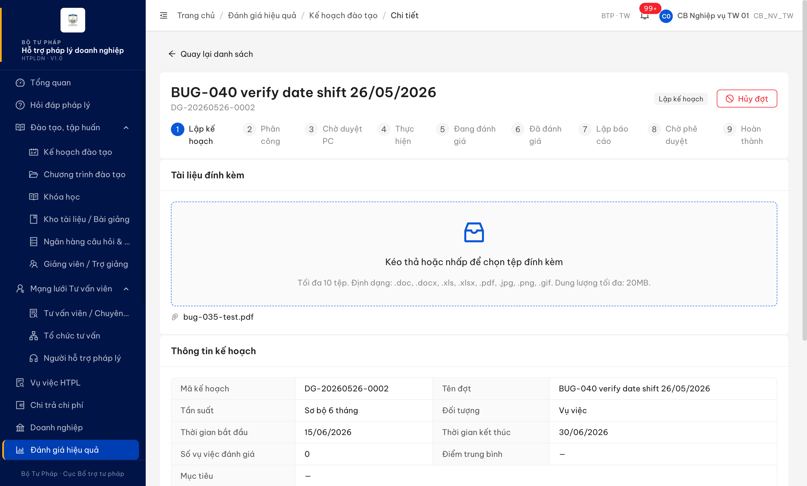

---

## BUG-036 — Danh sách vụ việc chưa hiển thị Tên vụ việc, Lĩnh vực, Trạng thái

| Trường | Giá trị |
|---|---|
| **Use case** | Chọn vụ việc đánh giá |
| **Tác nhân chính** | Cán bộ nghiệp vụ TW,BN,ĐP |
| **Transaction** | Cán bộ nghiệp vụ TW,BN,ĐP lựa chọn các vụ việc;<br>Hệ thống kiểm tra điều kiện và lưu lại dữ liệu các vụ việc đánh giá đã chọn. |
| **Phân loại** | Bug |
| **Độ ưu tiên** | Trung bình |
| **Ngày log** | 26/05/2026 |
| **Trạng thái xử lý** | ⚠️ Sửa một phần (Partial) |
| **Kết quả verify** | Login `cb_nv_tw_01` → mở KHDG-HDSD-AG-002 → tab Chấm điểm. Bảng hiện có header `Mã VV, Tên DN, Lĩnh vực, Trạng thái, Điểm tổng, Xếp loại, Ghi chú` — đã thêm **Lĩnh vực + Trạng thái** so với bug log gốc, nhưng vẫn **THIẾU cột Tên vụ việc**. User chỉ thấy Mã VV (UUID code) trong link, không có tên mô tả. Evidence: `image/reverify-bug-036-chamdiem-cols.png`. |
| **Ghi chú** | _(trống)_ |

### Mô tả (nguyên văn từ xlsx)

```
Tk: cb_nv_tw_01
Lỗi: Danh sách vụ việc chưa hiển thị Tên vụ việc, Lĩnh vực, Trạng thái
Mong muốn: Hiển thị đủ dữ liệu của vụ việc
```

### Ảnh minh chứng

- https://prnt.sc/qEQRuzliLBcf


**Ảnh verify mới nhất (re-verify 2026-05-26):**

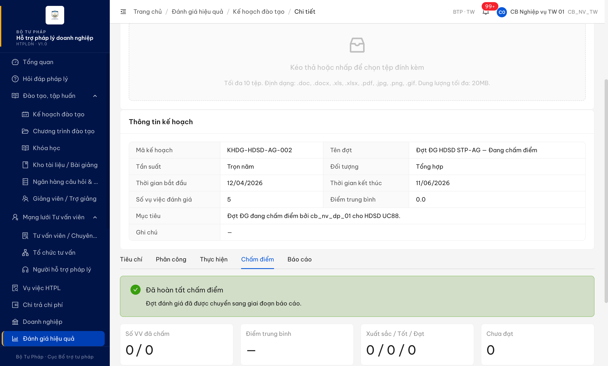

---

## BUG-037 — Xác nhận chọn vụ việc thành công nhưng ở bảng danh sách vụ việc vẫn hiển thị 2 vụ việc là chưa chọn

| Trường | Giá trị |
|---|---|
| **Use case** | Chọn vụ việc đánh giá |
| **Tác nhân chính** | Cán bộ nghiệp vụ TW,BN,ĐP |
| **Transaction** | Cán bộ nghiệp vụ TW,BN,ĐP lựa chọn các vụ việc;<br>Hệ thống kiểm tra điều kiện và lưu lại dữ liệu các vụ việc đánh giá đã chọn. |
| **Phân loại** | Bug |
| **Độ ưu tiên** | Cao |
| **Ngày log** | 26/05/2026 |
| **Trạng thái xử lý** | ✅ Đã sửa (Closed) |
| **Kết quả verify** | Seed plan DG-20260512-0001 (đang Chờ duyệt PC, đã có phân công cb_nv_tw_06 Trưởng nhóm) → login `cb_pd_tw_01` mở tab Phân công click "Phê duyệt" → state advance: Chờ duyệt PC → **Thực hiện**. Login `cb_nv_tw_06` (Người đánh giá đã phân công) mở plan → tab "Thực hiện" → picker "Chọn vụ việc đánh giá" render bảng 1 vụ việc VV-HDSD-003 cột "Đã chọn?" = "Chưa chọn", checkbox + button "Xác nhận chọn". Tick checkbox → counter Đã chọn: 0/1 → 1/1, button enabled → click "Xác nhận chọn" → modal "Xác nhận chọn vụ việc?" → click "Xác nhận" → bảng update: cột "Đã chọn?" "Chưa chọn" → **"Đã chọn"** ✅, header "Số vụ việc đánh giá" 0 → **1** ✅. Bug FIXED — selection persist đúng. Evidence: `image/reverify-bug-037-no-picker-state.png`. |
| **Ghi chú** | Cột Trạng thái vụ việc trong picker hiển thị mã `HOAN_THANH` thay vì text "Hoàn thành" (lỗi display nhỏ, tương tự BUG-021 — có thể log riêng nếu BA yêu cầu). |

### Mô tả (nguyên văn từ xlsx)

```
Tk: cb_nv_tw_01
Lỗi: Xác nhận chọn vụ việc thành công nhưng ở bảng danh sách vụ việc vẫn hiển thị 2 vụ việc là chưa chọn
Mong muốn: Xem được danh sách các vụ việc đã chọn
```

### Ảnh minh chứng

- https://prnt.sc/ex2WROKEsDk_
- https://prnt.sc/NnW3XxIM3e8b


**Ảnh verify mới nhất (re-verify 2026-05-26):**

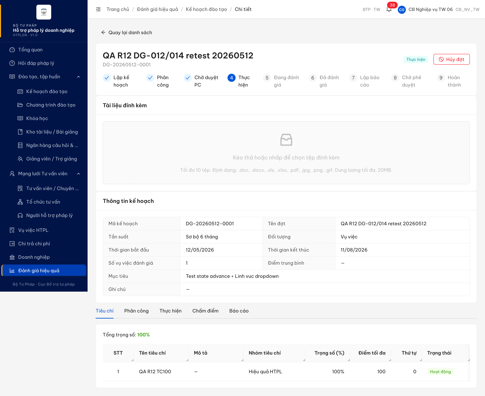

---

## ~~BUG-038~~ [CLOSED] — Xác nhận hoàn thành chấm điểm thành công nhưng lại có thêm thông báo lỗi

| Trường | Giá trị |
|---|---|
| **Use case** | Thực hiện đánh giá |
| **Tác nhân chính** | Cán bộ nghiệp vụ TW,BN,ĐP |
| **Transaction** | Cán bộ nghiệp vụ TW,BN,ĐP lưu kết quả đánh giá;<br>Hệ thống lưu dữ liệu và hiển thị thông báo đánh giá thành công. |
| **Phân loại** | Bug |
| **Độ ưu tiên** | Trung bình |
| **Ngày log** | 26/05/2026 |
| **Trạng thái xử lý** | ✅ Đã sửa (Closed) |
| **Kết quả verify** | Login `cb_nv_tw_05` → DG-20260509-0001 → Chấm điểm → click `Hoàn tất chấm điểm` → confirm `Hoàn tất`. POST `/ket-quas/complete` → 200. Chỉ 2 success message: alert `Đã hoàn tất chấm điểm` + toast `Hoàn tất chấm điểm thành công`. KHÔNG có error toast. Evidence: `image/bug-038-no-error-only-success.png`. |
| **Ghi chú** | _(trống)_ |

### Mô tả (nguyên văn từ xlsx)

```
Tk: cb_nv_tw_03
Lỗi: Xác nhận hoàn thành chấm điểm thành công nhưng lại có thêm thông báo lỗi 
Mong muốn: Không hiển thị thông báo lỗi, chỉ hiển thị thông báo thành công
```

### Ảnh minh chứng

- https://prnt.sc/9z3TonZZCFvp


**Ảnh verify (local):**

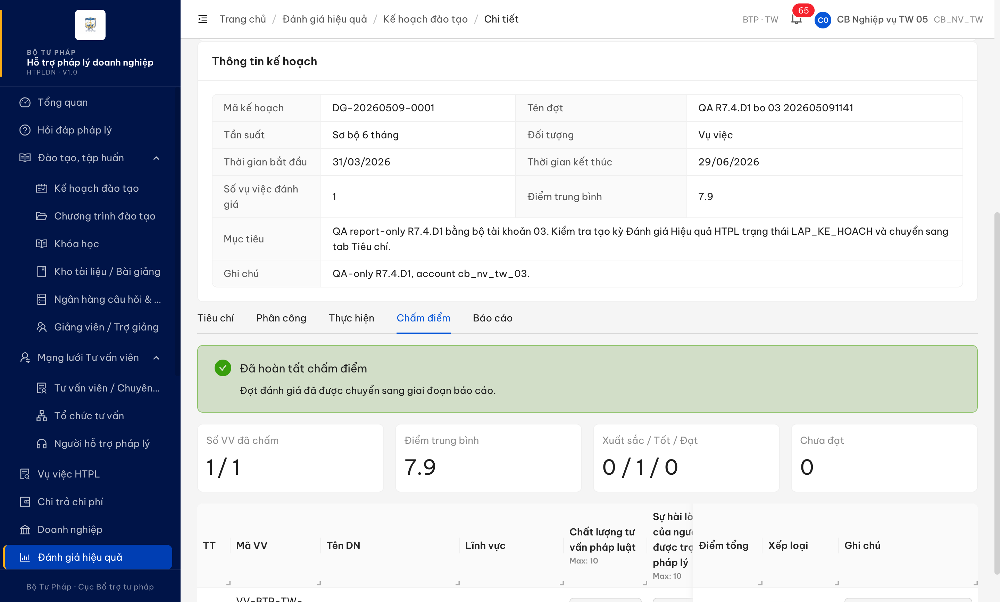

---

## ~~BUG-039~~ [CLOSED] — 1. Các trường Số liệu tổng hợp đang là mã

| Trường | Giá trị |
|---|---|
| **Use case** | Lập báo cáo đánh giá |
| **Tác nhân chính** | Cán bộ nghiệp vụ TW,BN,ĐP |
| **Transaction** | Cán bộ nghiệp vụ TW,BN,ĐP thực hiện thao tác tổng hợp dữ liệu đánh giá theo đợt;<br>Hệ thống tự động tổng hợp điểm số, nhận xét theo từng tiêu chí, từng vụ việc trong đợt. |
| **Phân loại** | Bug |
| **Độ ưu tiên** | Trung bình |
| **Ngày log** | 26/05/2026 |
| **Trạng thái xử lý** | ✅ Đã sửa (Closed) |
| **Kết quả verify** | Login `cb_nv_tw_05` → DG-20260509-0001 → Báo cáo: (1) Số liệu tổng hợp hiển thị `Tổng 1 / Đã đánh giá 1 / Điểm TB 7.9` — KHÔNG còn mã. (2) Xếp loại hiển thị `Tốt: 1` — có data. (3) Trạng thái báo cáo hiển thị `Dự thảo` — text, KHÔNG còn mã. Evidence: `image/bug-039-bao-cao-fields-text.png`. |
| **Ghi chú** | _(trống)_ |

### Mô tả (nguyên văn từ xlsx)

```
Tk: cb_nv_tw_03
Lỗi: 
1. Các trường Số liệu tổng hợp đang là mã
2. Xếp loại chưa hiển thị được dữ liệu
3. Trường Trạng thái báo cáo là mã
Mong muốn: 
1. Hiển thị dạng text các trường thông tin
2. Xếp loại hiển thị được dữ liệu
3. Trạng thái báo cáo hiển thị đúng text\
```

### Ảnh minh chứng

- https://prnt.sc/7q1VpPjki6Yw


**Ảnh verify (local):**

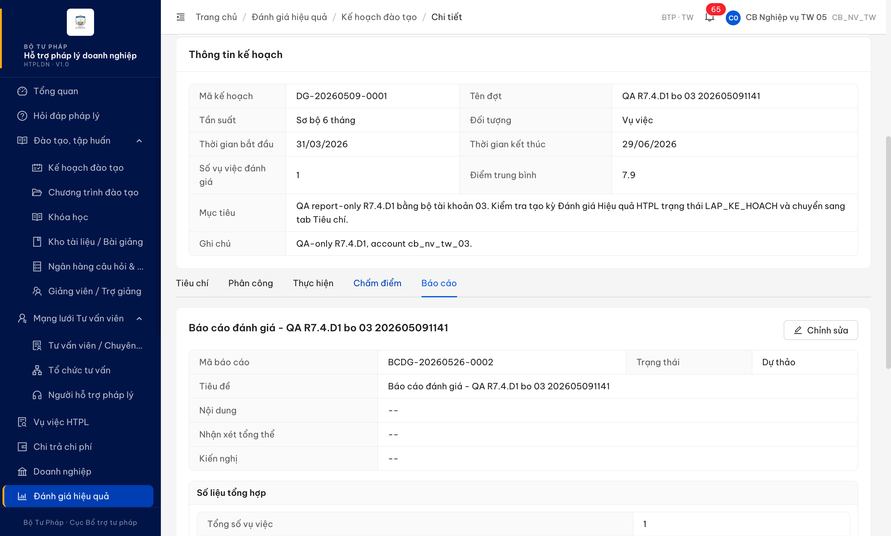

---

## ~~BUG-040~~ [CLOSED] — Ngày bắt đầu, Ngày kết thúc trong đợt sau khi lưu bị lùi 1 ngày

| Trường | Giá trị |
|---|---|
| **Use case** | Lập kế hoạch đánh giá |
| **Tác nhân chính** | Cán bộ nghiệp vụ TW,BN,ĐP |
| **Transaction** | Cán bộ nghiệp vụ TW,BN,ĐP lập kế hoạch đánh giá;<br>Hệ thống kiểm tra điều kiện và hiển thị màn hình thêm mới kế hoạch đánh giá. |
| **Phân loại** | Bug |
| **Độ ưu tiên** | Cao |
| **Ngày log** | 26/05/2026 |
| **Trạng thái xử lý** | ✅ Đã sửa (Closed) |
| **Kết quả verify** | Login `cb_nv_tw_05` → Tạo kế hoạch DG-20260526-0001 với Bắt đầu `26/05/2026` + Kết thúc `26/08/2026`. Sau khi lưu, list hiển thị `26/05/2026 → 26/08/2026` — KHÔNG bị lùi 1 ngày. Evidence: `image/bug-040-dates-match-input.png`. |
| **Ghi chú** | _(trống)_ |

### Mô tả (nguyên văn từ xlsx)

```
Tk: cb_nv_tw_01
Lỗi: Ngày bắt đầu, Ngày kết thúc trong đợt sau khi lưu bị lùi 1 ngày 
Mong muốn: Lưu lại đúng ngày bắt đầu, ngày kết thúc đã nhập
```

### Ảnh minh chứng

- https://go.screenpal.com/watch/cOhO1PntsPr


**Ảnh verify mới nhất (re-verify 2026-05-26):**

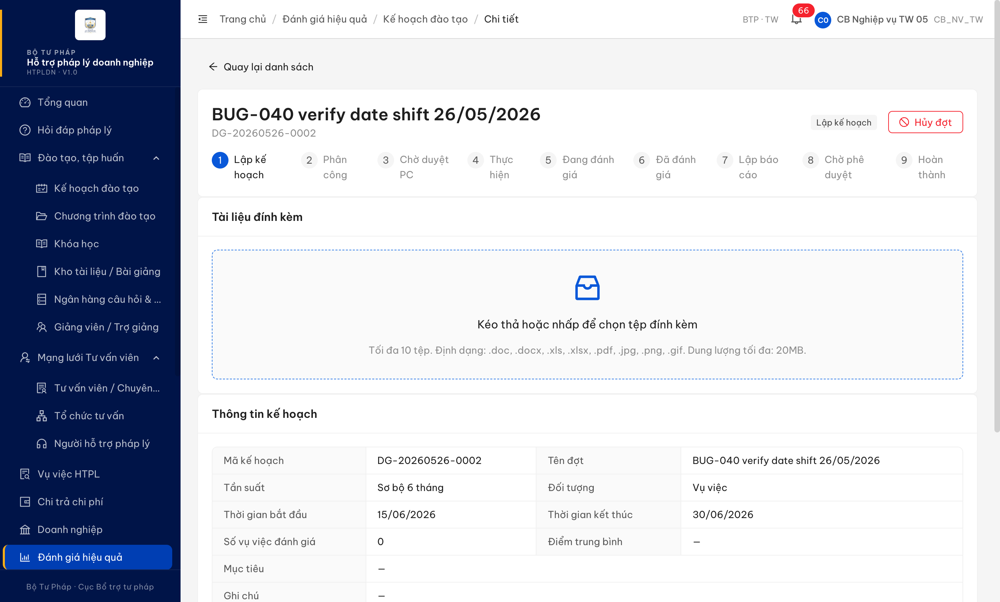

---

# VII. Quản lý thư viện biểu mẫu hợp đồng

## ~~BUG-041~~ [CLOSED] — Không thấy menu hay button để chuyển đến màn danh sách tất cả biểu mẫu

| Trường | Giá trị |
|---|---|
| **Use case** | Quản lý biểu mẫu, hợp đồng |
| **Tác nhân chính** | Cán bộ nghiệp vụ TW,BN,ĐP |
| **Transaction** | Cán bộ nghiệp vụ TW,BN,ĐP xem danh sách biểu mẫu, hợp đồng;<br>Hệ thống kiểm tra điều kiện và hiển thị danh sách biểu mẫu, hợp đồng. |
| **Phân loại** | Bug |
| **Độ ưu tiên** | Cao |
| **Ngày log** | 25/05/2026 |
| **Trạng thái xử lý** | ✅ Đã sửa (Closed) |
| **Ghi chú** | Verify `cb_nv_tw_05`: sidebar `Biểu mẫu` đã có submenu `Danh sách biểu mẫu` + `Thư mục biểu mẫu`. Click `Danh sách biểu mẫu` navigate `/bieu-mau/danh-sach` hiển thị 21 biểu mẫu, không cần Thêm mới trước. Screenshot: `image/bug041-danh-sach-bieu-mau.png`. |

### Mô tả (nguyên văn từ xlsx)

```
Tk: cb_nv_tw_01
Lỗi: Không thấy menu hay button để chuyển đến màn danh sách tất cả biểu mẫu https://htpldn-dev.ospgroup.vn/bieu-mau/danh-sach (Phải thêm mới biểu mẫu xong mới hiển thị danh sách tất cả biểu mẫu) 
Mong muốn: Có memu xem danh sách tất cả biểu mẫu
```

### Ảnh minh chứng

- https://prnt.sc/BW2J4HJ_vMar


**Ảnh verify (local):**

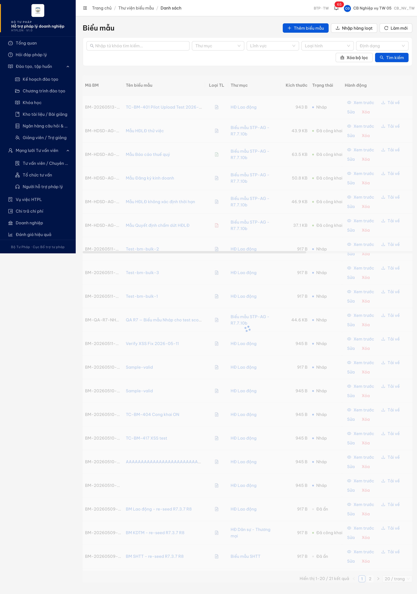

---

## BUG-042 — Nhấn xem preview file biểu mẫu bị lỗi

| Trường | Giá trị |
|---|---|
| **Use case** | Quản lý biểu mẫu, hợp đồng |
| **Tác nhân chính** | Cán bộ nghiệp vụ TW,BN,ĐP |
| **Transaction** | Cán bộ nghiệp vụ TW,BN,ĐP xem file biểu mẫu, hợp đồng trực tuyến;<br>Hệ thống kiểm tra điều kiện và hiển thị màn hình xem file biểu mẫu, hợp đồng trực tuyến. |
| **Phân loại** | Bug |
| **Độ ưu tiên** | Trung bình |
| **Ngày log** | 25/05/2026 |
| **Trạng thái xử lý** | ❌ Chưa sửa (Open) |
| **Ghi chú** | Re-verify `cb_nv_dp_01` `/bieu-mau/danh-sach`: click row `BM-HDSD-AG-001` (docx) → vào trang chi tiết, click `download Tải về` → mở tab MinIO presigned URL trả XML `<Code>NoSuchKey</Code> <Key>static/bieu-mau/hdsd-ag-001-hdld-thu-viec.docx</Key>`. File seed vẫn không tồn tại trong MinIO storage. Evidence: `image/reverify-bug-042-download-nosuchkey.png`. |

### Mô tả (nguyên văn từ xlsx)

```
Tk: cb_nv_tw_01
Lỗi: Nhấn xem preview file biểu mẫu bị lỗi
Mong muốn: Xm được preview file biểu mẫu 
=> Sửa cả với button "Tải xuống"
```

### Ảnh minh chứng

- https://prnt.sc/uD_B_rHJ0I-_


**Ảnh verify mới nhất (re-verify 2026-05-26):**

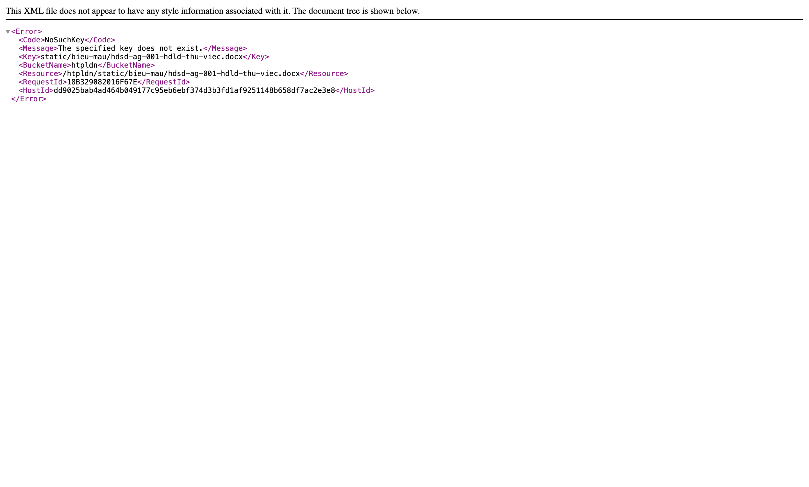

---

# XI. Quản lý kế hoạch thực hiện chương trình hỗ trợ pháp lý doanh nghiệp

## ~~BUG-043~~ [CLOSED] — Thêm mới tải lên file đính kèm bị lỗi

| Trường | Giá trị |
|---|---|
| **Use case** | Quản lý kế hoạch thực hiện chương trình hỗ trợ pháp lý |
| **Tác nhân chính** | Cán bộ nghiệp vụ TW,BN,ĐP |
| **Transaction** | Cán bộ nghiệp vụ TW,BN,ĐP thêm mới kế hoạch thực hiện chương trình hỗ trợ pháp lý;<br>Hệ thống kiểm tra điều kiện và hiển thị màn hình thêm mới kế hoạch thực hiện chương trình hỗ trợ pháp lý. |
| **Phân loại** | Bug |
| **Độ ưu tiên** | Cao |
| **Ngày log** | 25/05/2026 |
| **Trạng thái xử lý** | ✅ Đã sửa (Closed) |
| **Ghi chú** | Verify `cb_nv_tw_05` `/ct-htpldn/tao-moi`: chọn file `bug035-test-attach.pdf` qua button `upload Tải lên` → POST `/api/v1/chuong-trinh-htpls/upload` trả 201, UI hiển thị file row `ant-upload-list-item-done` + tên file `bug035-test-attach.pdf` + delete button. Upload thành công. Screenshot: `image/bug043-upload-done.png`. |

### Mô tả (nguyên văn từ xlsx)

```
Tk: cb_nv_tw_01
Lỗi: Thêm mới tải lên file đính kèm bị lỗi
Mong muốn: Thêm mới tải được file đính kèm
```

### Ảnh minh chứng

- https://prnt.sc/n1Ct1yBQfDC4


**Ảnh verify (local):**

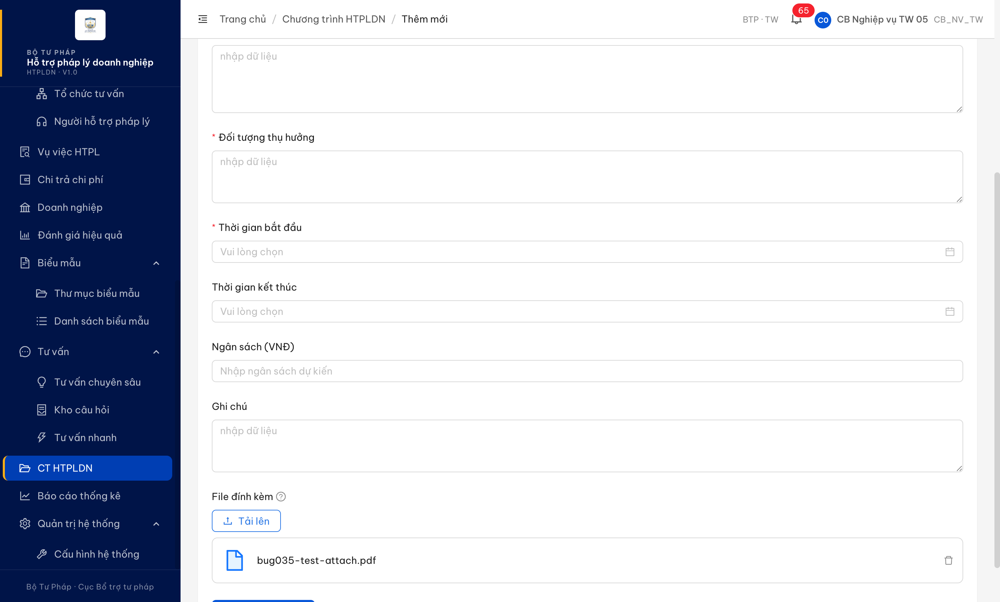

---

## ~~BUG-044~~ [CLOSED] — Màn danh sách Mục tiêu chưa hiển thị được dữ liệu đã nhập

| Trường | Giá trị |
|---|---|
| **Use case** | Quản lý kế hoạch thực hiện chương trình hỗ trợ pháp lý |
| **Tác nhân chính** | Cán bộ nghiệp vụ TW,BN,ĐP |
| **Transaction** | Cán bộ nghiệp vụ TW,BN,ĐP xem danh sách kế hoạch thực hiện chương trình hỗ trợ pháp lý;<br>Hệ thống kiểm tra điều kiện và hiển thị danh sách kế hoạch thực hiện chương trình hỗ trợ pháp lý. |
| **Phân loại** | Bug |
| **Độ ưu tiên** | Trung bình |
| **Ngày log** | 25/05/2026 |
| **Trạng thái xử lý** | ✅ Đã sửa (Closed) |
| **Ghi chú** | Verify `cb_nv_tw_05` `/ct-htpldn/danh-sach`: cột "Mục tiêu" hiển thị data đầy đủ cho 17/17 CT (vd CT-QA-R9-TAMDUNG "Chương trình hỗ trợ pháp lý tạm dừng để test workflow.", CT-20260507-0001 "Hỗ trợ pháp lý cho doanh nghiệp nhỏ và vừa năm 2026 — kế hoạch tổng thể GĐ1 11 bước"). Detail CT cũng hiển thị Mục tiêu đầy đủ. Screenshot: `image/bug044-muctieu-column-list.png`. |

### Mô tả (nguyên văn từ xlsx)

```
Tk: cb_nv_tw_01
Lỗi: Màn danh sách Mục tiêu chưa hiển thị được dữ liệu đã nhập
Mong muốn: Mục tiêu hiển thị được dữ liệu đã nhập
```

### Ảnh minh chứng

- https://prnt.sc/ESFgd16c903V
- https://prnt.sc/twE_--k49Xkl


**Ảnh verify (local):**

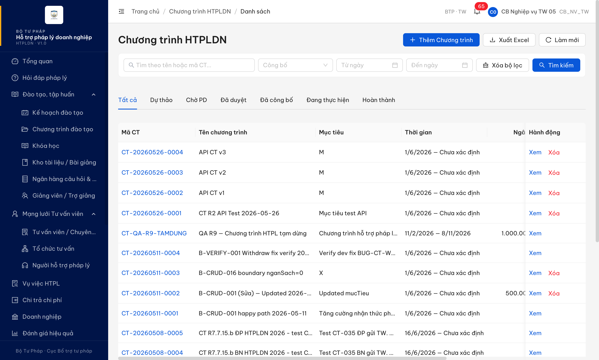

---

## ~~BUG-045~~ [CLOSED] — Màn xem chi tiết thừa tab "Tài liệu" (Không thao tác gì được)

| Trường | Giá trị |
|---|---|
| **Use case** | Quản lý kế hoạch thực hiện chương trình hỗ trợ pháp lý |
| **Tác nhân chính** | Cán bộ nghiệp vụ TW,BN,ĐP |
| **Transaction** | Cán bộ nghiệp vụ TW,BN,ĐP xem chi tiết kế hoạch thực hiện chương trình hỗ trợ pháp lý;<br>Hệ thống kiểm tra điều kiện và hiển thị thông tin chi tiết kế hoạch thực hiện chương trình hỗ trợ pháp lý. |
| **Phân loại** | Bug |
| **Độ ưu tiên** | Trung bình |
| **Ngày log** | 25/05/2026 |
| **Trạng thái xử lý** | ✅ Đã sửa (Closed) |
| **Ghi chú** | Verify `cb_nv_tw_05` `/ct-htpldn/{id}` (CT-20260507-0001): màn detail chỉ còn 2 tab — `Thông tin` + `Đợt báo cáo`. KHÔNG còn tab `Tài liệu`. Đã ẩn theo mong muốn. Screenshot: `image/bug045-ct-detail-no-tailieu-tab.png`. |

### Mô tả (nguyên văn từ xlsx)

```
Tk: cb_nv_tw_01
Lỗi: Màn xem chi tiết thừa tab "Tài liệu" (Không thao tác gì được)
Mong muốn: Ẩn tab "Tài liệu"
```

### Ảnh minh chứng

- https://prnt.sc/it9F1UA_du5o


**Ảnh verify (local):**

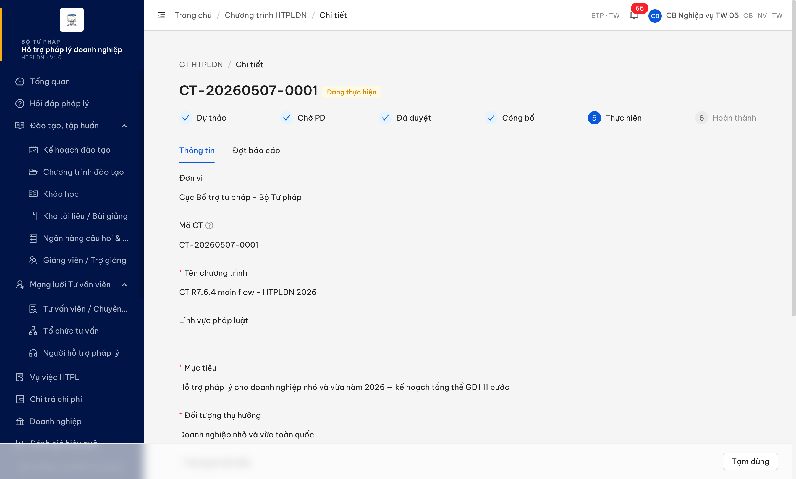

---

## BUG-046 — - Đợt báo cáo đang gán với chương trình kế hoạch

| Trường | Giá trị |
|---|---|
| **Use case** | Quản lý đợt báo cáo |
| **Tác nhân chính** | Cán bộ nghiệp vụ TW,BN,ĐP |
| **Transaction** | Cán bộ nghiệp vụ TW,BN,ĐP thêm mới đợt báo cáo;<br>Hệ thống kiểm tra điều kiện và hiển thị màn hình thêm mới đợt báo cáo. |
| **Phân loại** | Bug |
| **Độ ưu tiên** | Cao |
| **Ngày log** | 25/05/2026 |
| **Trạng thái xử lý** | ⚠️ Sửa một phần (Partial) |
| **Kết quả verify** | Re-verify `cb_nv_dp_01`: (1) Sidebar không có menu `Đợt báo cáo` độc lập — vẫn nested trong `/ct-htpldn/{id}` tab `Đợt báo cáo` → mong muốn 1 chưa sửa. (2) Modal `Tạo đợt báo cáo mới` đã có field `Phạm vi người nộp` (combobox) như verify trước → mong muốn 2 đã sửa. Evidence: `image/reverify-bug-046-still-nested-in-ct.png`. |
| **Ghi chú** | _(trống)_ |

### Mô tả (nguyên văn từ xlsx)

```
Tk: cb_nv_tw_01
Lỗi: 
- Đợt báo cáo đang gán với chương trình kế hoạch
- Đợt báo cáo chưa có chọn phạm vi người nộp báo cáo
Mong muốn: 
1. Đợt báo cáo quản lý độc lập với chương trình kế hoạch
2. Đợt báo cáo phải có chọn phạm vi người nộp báo cáo và xem được tiến độ nộp báo cáo
```

### Ảnh minh chứng


**Ảnh verify mới nhất (re-verify 2026-05-26):**

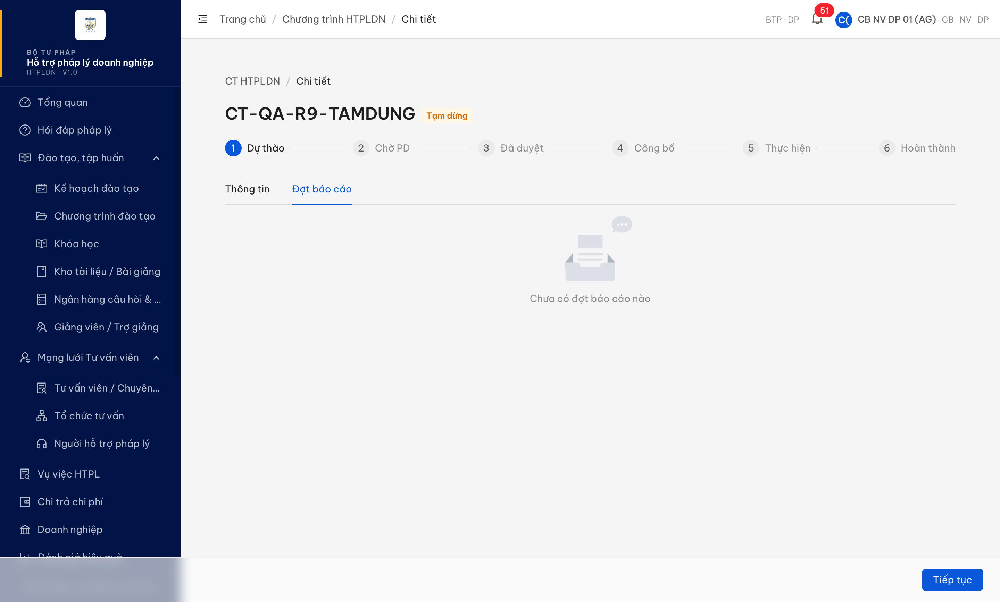

_(Không có ảnh minh chứng trong file gốc)_

---

# X. Quản lý tư vấn chuyên sâu với chuyên gia

## BUG-047 — Sau khi duyệt câu hỏi chưa được hiển thị cho người dùng nhưng popup xác nhận đang hiển thị "Sau k...

| Trường | Giá trị |
|---|---|
| **Use case** | Phê duyệt nội dung câu hỏi, tư vấn |
| **Tác nhân chính** | Cán bộ nghiệp vụ TW,BN,ĐP |
| **Transaction** | Cán bộ phê duyệt TW,BN,ĐP phê duyệt nội dung câu hỏi, tư vấn;<br>Hệ thống hiển thị màn hình xác nhận phê duyệt nội dung câu hỏi, tư vấn. |
| **Phân loại** | Bug |
| **Độ ưu tiên** | Thấp |
| **Ngày log** | 26/05/2026 |
| **Trạng thái xử lý** | ✅ Đã sửa (Closed) |
| **Kết quả verify** | Re-verify `cb_pd_tw_05` `/tv-nhanh/kho-cau-hoi` tab `Chờ duyệt`: mở câu hỏi `QA-20260512-0003` → click button `Duyệt` → modal xác nhận hiện tiêu đề `Duyệt câu hỏi` + body wording mới **"Bạn xác nhận phê duyệt câu hỏi?"** + nút `Hủy`/`Duyệt`. Đúng wording mong muốn. Evidence: `image/reverify-bug-047-popup-wording.png`. |

### Mô tả (nguyên văn từ xlsx)

```
Tk: cb_nv_tw_01
Lỗi: Sau khi duyệt câu hỏi chưa được hiển thị cho người dùng nhưng popup xác nhận đang hiển thị "Sau khi duyệt, câu hỏi sẽ có hiệu lực và hiển thị cho người dùng."
Mong muốn: Điều chỉnh lại thành "Bạn xác nhận phê duyệt câu hỏi?"
```

### Ảnh minh chứng

- https://prnt.sc/gyUKmerCGpBv


**Ảnh verify mới nhất (re-verify 2026-05-26):**

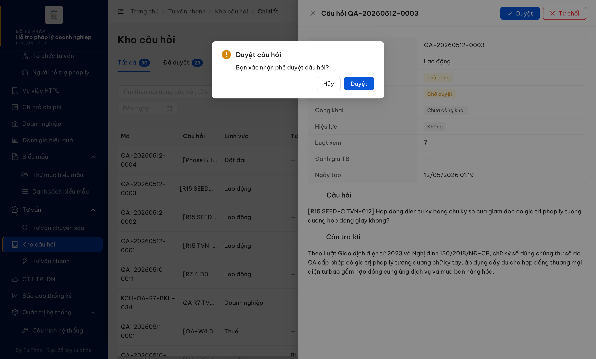

---

## BUG-048 — Chưa có cột Hành động để có thể thực hiện thao tác ở màn danh sách (Phải vào màn xem chi tiết mới...

| Trường | Giá trị |
|---|---|
| **Use case** | Quản lý kho câu hỏi, tư vấn |
| **Tác nhân chính** | Cán bộ nghiệp vụ TW,BN,ĐP |
| **Transaction** | Cán bộ nghiệp vụ TW,BN,ĐP xem danh sách kho câu hỏi, tư vấn;<br>Hệ thống kiểm tra điều kiện và hiển thị danh sách kho câu hỏi, tư vấn. |
| **Phân loại** | Bug |
| **Độ ưu tiên** | Thấp |
| **Ngày log** | 26/05/2026 |
| **Trạng thái xử lý** | ❌ Chưa sửa (Open) |
| **Kết quả verify** | Re-verify `cb_pd_tw_05` `/tv-nhanh/kho-cau-hoi` cả 3 tab (Tất cả 30 / Đã duyệt 23 / Chờ duyệt 6): bảng danh sách vẫn 11 cột (Mã / Câu hỏi / Lĩnh vực / Từ khóa / Nguồn / Trạng thái / Hiệu lực / Công khai / Lượt xem / Đánh giá / Ngày tạo) — **không có cột "Hành động"/"Thao tác"**, không có button/icon inline trong row. Cột "Mã" hiển thị plain text, không hyperlink xanh — phải click row mới mở drawer chi tiết. Cả 2 mong muốn chưa thực hiện. Evidence: `image/reverify-bug-048-no-action-column.png`. |

### Mô tả (nguyên văn từ xlsx)

```
Tk: cb_nv_tw_01
Lỗi: Chưa có cột Hành động để có thể thực hiện thao tác ở màn danh sách (Phải vào màn xem chi tiết mới thao tác được)
Mong muốn: 
1. Bổ sung cột Hành động để có thể thực hiện thao tác ở màn danh sách
2. Cột Mã đổi hyperlink sang màu xanh
```

### Ảnh minh chứng

- https://prnt.sc/zKHrYsFZ4-MW


**Ảnh verify mới nhất (re-verify 2026-05-26):**

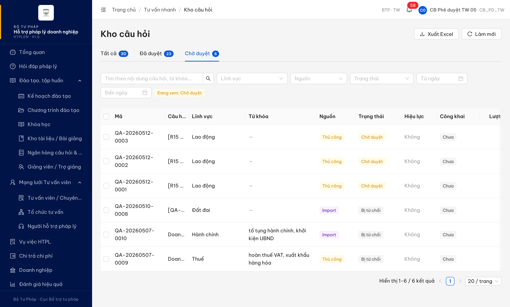

---
