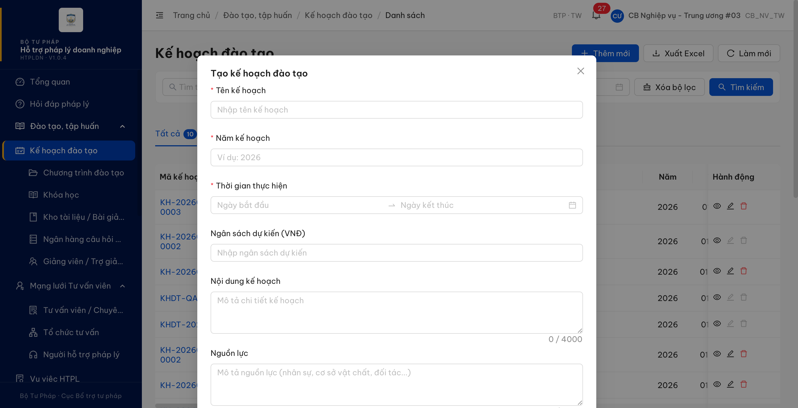
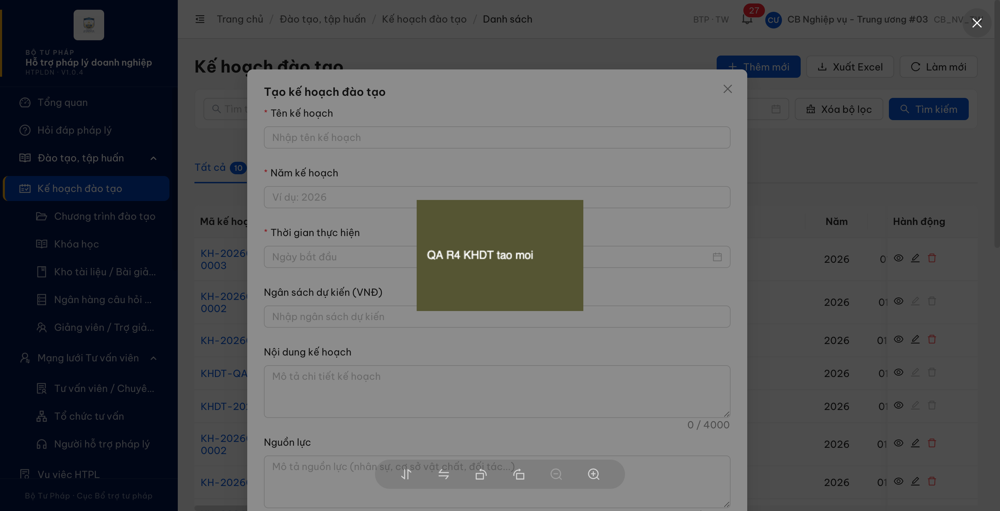
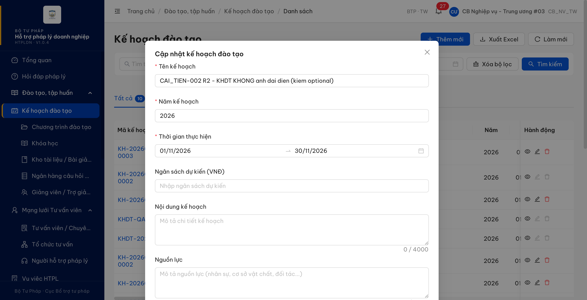
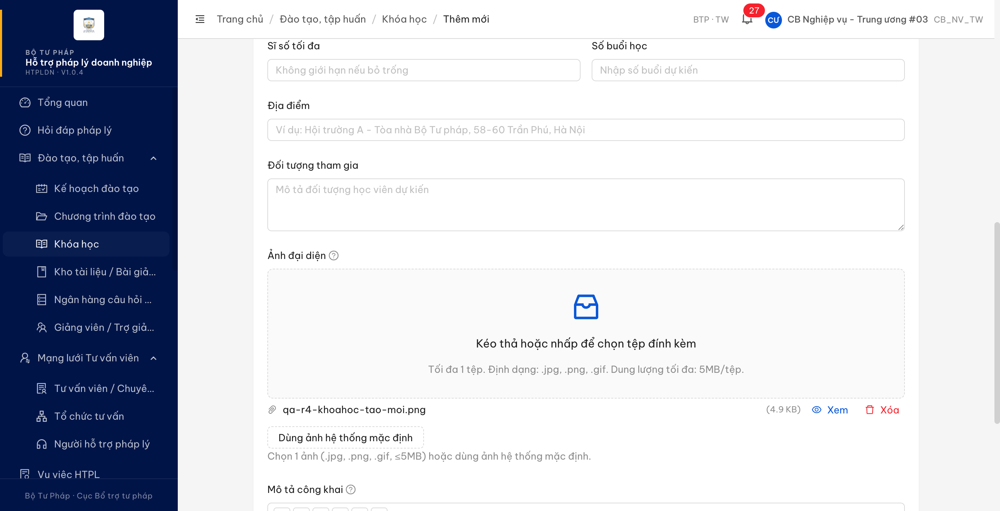
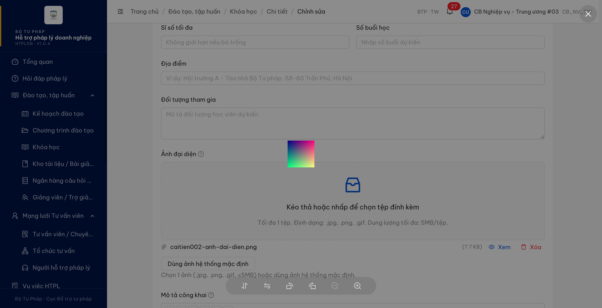
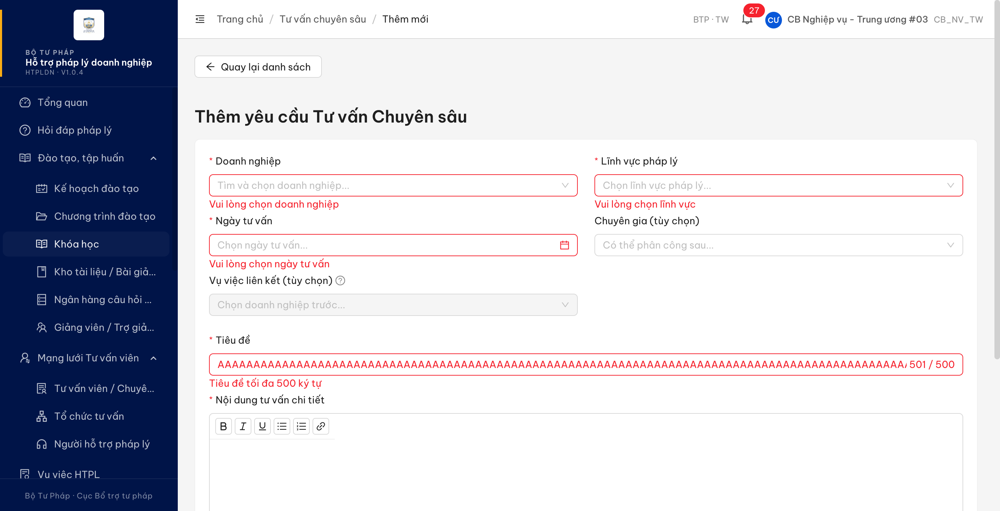

# Re-verify Task cải tiến — lượt 5 (2026-08-01), sau dev fix lần 5

Nguồn: Google Sheet "UAT-PM HTPLDN" (`1OKBN2otlmdZ44THkmhtsn-_63M2Boh7zQwearwjYR3s`), tab **`Task-cải tiến`** (gid `965008318`).

- Môi trường: **DEV** — `https://18.143.165.120.nip.io` (HTPLDN · **V1.0.4**), nơi dev triển khai bản fix.
  **Không phải môi trường UAT của đối tác** (`https://htpldn-uat.ospgroup.vn`). Lượt này **chỉ kiểm trên DEV** theo yêu cầu.
- **Bản dựng giao diện đã đo:** `assets/index-DyCeOp-A.js`, đẩy lên **01/08 22:42:23**. Trang được **tải lại từ đầu** (bỏ qua bộ nhớ đệm) trước khi đo, và tên tệp bản dựng được đọc lại từ trong trang để chắc chắn không đo nhầm mã cũ.
- Tài khoản: `cbnv_tw_03` (CB Nghiệp vụ - Trung ương / `CB_NV_TW`) — đúng tài khoản ghi trong ô "Kết quả mong đợi" của CAI_TIEN-001.
- Công cụ: Chrome DevTools MCP
- SRS đối chiếu: `Docs-PM-HTPLDN/_bmad-output/planning-artifacts/srs-v3.5/` — bản 3.5.7, cập nhật 01/08/2026 lúc 14:58
- Phiếu BA: [`../reverify-week-4/phan-hoi-AI_TIEN-002-anh-dai-dien-va-hop-thoai-cong-khai.md`](../../reverify-week-4/phan-hoi-AI_TIEN-002-anh-dai-dien-va-hop-thoai-cong-khai.md)

## Kết quả (LATEST — lượt 5)

| Mã TC | Cải tiến | L1 | L2 | L3 | L4 | **Lượt 5** | Căn cứ |
|---|---|:--:|:--:|:--:|:--:|:--:|---|
| CAI_TIEN-001 | TVCS — form Thêm mới/Sửa bổ sung trường **Tiêu đề**: bắt buộc, textbox, tối đa 500 ký tự | Pass | Pass | Pass | Pass | **Pass** (hồi quy, không suy giảm) | `srs-fr-12-tv-chuyen-sau.md:114 · :325 · :1157 · :1318` |
| CAI_TIEN-002 | Đào tạo — form Kế hoạch đào tạo + Khóa học + Chương trình đào tạo bổ sung trường **Ảnh đại diện**: không bắt buộc, cho phép tải ảnh | Reopen | Reopen | Reopen | Reopen | **Pass** (6/6 lỗi đã đóng) | `srs-fr-03-dao-tao.md:111 · :1254 · :1256 · :1263 · :1790 · :1795-1803 · :1870` |

> **Đính chính lượt 4 — lỗi đo của QA, không phải lỗi phần mềm.** Lượt 4 ghi `-004` vẫn FAIL. Xác minh lại: tệp giao diện `index-DnQQPwHf.js` (bản fix lần 4) đã lên lúc **18:25**, nhưng tab trình duyệt dùng để đo mở từ **trước** mốc đó và chưa tải lại, nên phép đo lúc **18:49** vẫn chạy mã cũ trong bộ nhớ tab. Kiểm lại đúng bản 18:25 vào lúc **22:33** thì thao tác đã đúng — nghĩa là `-004` thực tế **đã được sửa từ bản fix lần 4**, không cần đến bản fix lần 5. Cần chuyển thông tin này cho dev để tránh họ sửa tiếp một chỗ vốn không hỏng.
>
> Từ lượt này, quy trình verify bắt buộc thêm 2 bước trước khi đo: (1) tải lại trang bỏ qua bộ nhớ đệm; (2) đọc tên tệp bản dựng đang chạy trong trang và ghi vào báo cáo.

## Lượt 5 — kết quả từng ý

| Điểm kiểm | Căn cứ | Kết quả |
|---|---|---|
| `-004` Bấm **Xem** ảnh vừa tải ở form **Thêm mới** Chương trình đào tạo | `:1870` · `:111` | ✅ ảnh mở ngay trong biểu mẫu, vẫn ở `/dao-tao/chuong-trinh/tao-moi`, dữ liệu đã nhập còn nguyên. `POST …/chuong-trinh-dao-taos/upload` **201** → `GET …/chuong-trinh-dao-taos/anh-dai-dien/{fileId}/download` **200**; không còn lượt gọi nào tới đường chung `/api/v1/files/…`, không còn 403 |
| `-001` Hồi quy 4 vị trí Ảnh đại diện | `:1790` · `:1893` | ✅ 4/4 — lập/sửa Kế hoạch đào tạo, thêm mới/sửa Khóa học đều có ô ảnh và bấm "Xem" mở tại chỗ |
| `-002` Ô Ảnh đại diện ở Chương trình đào tạo | `:111` · `:1870` | ✅ có ở **cả** form Thêm mới lẫn form Sửa, đúng ràng buộc (tùy chọn, `.jpg/.png/.gif`, tối đa 1 tệp, ≤5MB) |
| `-003` Hộp thoại Công khai của Kế hoạch đào tạo | `:1795-1803` | ✅ đủ 3 ô: Mô tả công khai, Ảnh đại diện, File đính kèm công khai; bấm "Xem" trong hộp thoại mở ảnh tại chỗ, hộp thoại không đóng, nội dung đã gõ còn nguyên |
| `-005` Công khai kế hoạch — lưu đủ 3 trường | `:1256` · `:1263` | ✅ `KHDT-2026-001` công khai với đủ 3 trường → sang **"Đã công khai"**, `congKhai: true`, có `thoiGianDangTai`, lưu đủ cả 3 |
| `-005` Hủy công khai — giữ nguyên giá trị | `:1254` (BR-PUBLIC-02) | ✅ về **"Đã duyệt"**, `congKhai: false`, `thoiGianDangTai` bị xóa, **giữ nguyên cả 3 trường** |
| `-006` Chương trình đào tạo có đủ **5 trường công khai chuyên trang** | `:1870` · `srs-v3.5.md:1005` `:1019` | ✅ đủ 5 ở **cả** form Thêm mới lẫn form Sửa: Công khai lên Cổng PLQG (công tắc) · Thời gian đăng tải (chỉ đọc, *"Tự động điền khi bật Công khai"* — đúng BR-PUBLIC-03) · Ảnh đại diện · Mô tả công khai · File đính kèm công khai |
| Hồi quy CAI_TIEN-001 | `srs-fr-12-tv-chuyen-sau.md:114` · `:325` | ✅ Tiêu đề bắt buộc (*"Tiêu đề là bắt buộc"*), `maxlength=500`, vượt 500 → *"Tiêu đề tối đa 500 ký tự"* |


## Lượt 5 — dữ liệu QA tạo thêm / trả lại nguyên trạng

| Bản ghi | Module | Việc đã làm | Trạng thái cuối |
|---|---|---|---|
| `KHDT-2026-001` | Kế hoạch đào tạo | Công khai kèm 3 trường → hủy công khai (kiểm `:1254` / `:1256`) | Đã hủy công khai — về **Đã duyệt** như trước |
| `KHDT-QAW7-01` | Kế hoạch đào tạo | nt (kiểm trên bản dựng trước đó) | Đã hủy công khai — về **Đã duyệt** như trước |
| `KH-20260731-0002` | Kế hoạch đào tạo | Từ lượt 4 | **Đã công khai** (giữ lại làm bằng chứng) |
| `CTDT-BTP-TW-2026-0005` | Chương trình đào tạo | Từ lượt 4 | Bản nháp (giữ lại làm bằng chứng) |

> Các biểu mẫu Thêm mới dùng để kiểm nút "Xem" (Chương trình đào tạo, Kế hoạch đào tạo, Khóa học, Tư vấn chuyên sâu) đều **thoát ra không lưu** — không phát sinh bản ghi rác.

---

## Lượt 4 (2026-08-01, sau dev fix lần 4) — giữ để tra cứu

> ⚠️ Verdict lượt 4 (`CAI_TIEN-002 = Reopen`) đã bị **đính chính**: xem ô đính chính ở phần Kết quả phía trên. Nội dung dưới đây giữ nguyên như lúc ghi, để đối chiếu.

### Lượt 4 — đã đạt những gì

| Điểm kiểm | Kết quả |
|---|---|
| **Công khai** kế hoạch đào tạo | ✅ hết lỗi 502 — trả 200, trạng thái sang **"Đã công khai"**, thông báo *"Đã công khai lên Cổng PLQG"* |
| `:1256` — lưu 3 trường khi công khai | ✅ đọc lại bản ghi có đủ `moTaCongKhai` + `anhDaiDien` + `fileDinhKemCongKhai`, `congKhai: true`, có `thoiGianDangTai` |
| `:1254` — **hủy công khai giữ nguyên** giá trị đã lưu | ✅ hủy → về "Đã duyệt", `congKhai: false`, xóa `thoiGianDangTai` (BR-PUBLIC-02), **giữ nguyên cả 3 trường** |
| `:1256` — "để trống thì giữ giá trị cũ" | ✅ công khai lại chỉ gửi Mô tả → ảnh + tệp đính kèm cũ vẫn còn |
| Độ ổn định của thao tác công khai | ✅ đúng trên **3 kế hoạch** khác nhau (`KH-20260731-0002`, `KHDT-QAW7-01`, `KHDT-2026-001`) |
| Bấm "Xem" **bên trong** hộp thoại Công khai | ✅ mở ảnh tại chỗ, hộp thoại không đóng, nội dung đã gõ còn nguyên |
| Form Chương trình đào tạo có đủ **5 trường công khai chuyên trang** (`:1870`) | ✅ Công khai lên Cổng PLQG (công tắc) · Thời gian đăng tải (chỉ đọc, *"Tự động điền khi bật Công khai"* — đúng BR-PUBLIC-03) · Ảnh đại diện · Mô tả công khai · File đính kèm công khai |
| Hồi quy 4 vị trí Ảnh đại diện (lập/sửa Kế hoạch, thêm mới/sửa Khóa học) | ✅ đều còn ô ảnh, bấm "Xem" mở ảnh trong biểu mẫu, không rời trang |
| Hồi quy ô Ảnh đại diện ở form Chương trình đào tạo | ✅ còn ở cả Thêm mới lẫn Sửa; tạo `CTDT-BTP-TW-2026-0005`, ảnh lưu và đọc lại đúng tên tệp |
| Hồi quy CAI_TIEN-001 | ✅ form Thêm mới **và** form Sửa TVCS: Tiêu đề bắt buộc (*"Tiêu đề là bắt buộc"*), `maxlength=500`, vượt 500 → *"Tiêu đề tối đa 500 ký tự"* |


### Lượt 4 — chỗ ghi FAIL (sau xác minh là do QA đo nhầm trên mã cũ)

**[`BUG-CAITIEN-002-004`](bug-reports/dao-tao/Pass-bug-report-caitien-002-anh-dai-dien.md) — Major — bấm "Xem" ảnh vừa tải ở form THÊM MỚI Chương trình đào tạo thì bị đẩy sang trang 403.**
Tải ảnh lên xong (`201`), bấm "Xem" cạnh tên tệp → phần mềm rời biểu mẫu, chuyển sang `/403`; dữ liệu đang nhập không còn trên màn. Tái hiện **2/2** ở lượt 4 (tổng 4/4 qua hai bản fix).

Khoanh vùng — đã **loại trừ dứt điểm** khả năng "tệp chưa gắn bản ghi nên chặn là đúng". Tải một tệp mới hoàn toàn (`entityType: null`, `entityId: null` — đúng tình huống form Thêm mới) rồi đọc **cùng một `fileId`** bằng hai đường:

| Đường đọc | HTTP |
|---|---|
| `GET /api/v1/files/{fileId}` — đường chung | ❌ 403 `ERR-PERM-FILE-03` *"Tệp chưa gắn với đối tượng — bản ghi cũ, cần backfill"* |
| `GET /api/v1/chuong-trinh-dao-taos/anh-dai-dien/{fileId}/download` — đường riêng cùng module | ✅ 200, trả `downloadUrl` ký sẵn |

Tức đường riêng **đọc được cả tệp chưa gắn bản ghi** — đúng chỗ màn Thêm mới cần dùng, và đúng đường mà 5 biểu mẫu còn lại đang dùng:

| Vị trí bấm "Xem" | Lượt 4 |
|---|---|
| Form lập Kế hoạch đào tạo (chưa lưu) | ✅ mở ảnh trong biểu mẫu |
| Form sửa Kế hoạch đào tạo | ✅ nt |
| Form Thêm mới Khóa học (chưa lưu) | ✅ nt |
| Form Sửa Khóa học | ✅ nt |
| Form **Sửa** Chương trình đào tạo | ✅ nt |
| **Form Thêm mới Chương trình đào tạo** | ❌ bị đẩy sang `/403` |

Ghi nhận công bằng cho dev: sau khi bị đẩy sang `/403`, bấm nút **Quay lại** của trình duyệt thì trình duyệt khôi phục lại được trang đang nhập dở nhờ bộ nhớ đệm của nó — nhưng trong phần mềm không có đường quay lại chỗ đang nhập, nên người dùng đi tiếp trong phần mềm thì vẫn phải nhập lại từ đầu.


### Lượt 4 — hồi quy 4 vị trí Ảnh đại diện + CAI_TIEN-001













### Lượt 4 — dữ liệu QA tạo thêm / trả lại nguyên trạng

| Bản ghi | Module | Việc đã làm | Trạng thái cuối |
|---|---|---|---|
| `CTDT-BTP-TW-2026-0005` | Chương trình đào tạo | Tạo mới để kiểm ô Ảnh đại diện + nút "Xem" ở cả 2 màn | Bản nháp (giữ lại làm bằng chứng) |
| `KH-20260731-0002` | Kế hoạch đào tạo | Công khai → hủy → công khai lại (kiểm `:1254` / `:1256`) | **Đã công khai** (giữ lại làm bằng chứng) |
| `KHDT-QAW7-01` | Kế hoạch đào tạo | Mượn để đối chứng thao tác công khai | Đã hủy công khai — về **Đã duyệt** như trước |
| `KHDT-2026-001` | Kế hoạch đào tạo | nt | Đã hủy công khai — về **Đã duyệt** như trước |

---

## Lượt 3 (2026-08-01, sau dev fix lần 3) — giữ để tra cứu

> Verdict lượt 3: CAI_TIEN-001 `Pass` · CAI_TIEN-002 `Reopen`, căn cứ ở `-004` + `-005`; `-006` ghi nhận ngoài phạm vi. Lượt 4 đã đóng `-005` và `-006`.

### Kết quả lượt 3

| Mã TC | Cải tiến | Lượt 1 | Lượt 2 | **Lượt 3** | Căn cứ |
|---|---|:--:|:--:|:--:|---|
| CAI_TIEN-001 | TVCS — form Thêm mới/Sửa bổ sung trường **Tiêu đề**: bắt buộc, textbox, tối đa 500 ký tự | Pass | Pass | **Pass** (hồi quy lại lần 2, không suy giảm) | `srs-fr-12-tv-chuyen-sau.md:114 · :325 · :1157 · :1318` |
| CAI_TIEN-002 | Đào tạo — form Kế hoạch đào tạo + Khóa học + Chương trình đào tạo bổ sung trường **Ảnh đại diện**: không bắt buộc, cho phép tải ảnh | Reopen | Reopen | **Reopen** | `srs-fr-03-dao-tao.md:111 · :1238 · :1254 · :1256 · :1263 · :1265 · :1790 · :1795-1803 · :1870 · :2224` |

> Lượt 3 vẫn `Reopen`, căn cứ gói gọn ở **2 lỗi**: (a) **fix đẻ ra lỗi mới cùng luồng** — bấm "Xem" ở form Thêm mới CTDT nhảy `/403` làm mất dữ liệu đang nhập, đúng lỗi gốc lặp lại trên chính ô vừa bổ sung (`-004`); (b) không công khai được kế hoạch (502 "Cổng PLQG chưa được cấu hình", `-005`) → **chặn** việc nghiệm thu phần lưu 3 trường công khai (`:1256`) và quy tắc giữ giá trị khi hủy công khai (`:1254`).
>
> **Đã tách khỏi căn cứ Reopen:** 4 trường công khai còn lại của form CTDT (`-006`). Phiếu cải tiến chỉ yêu cầu **ô Ảnh đại diện**, và phiếu BA 01/08 Mục 1 kết luận đúng chừng đó — dev đã làm xong. Bốn trường kia là khoảng trống SRS riêng của module, ghi lại để dev xử một lượt nhưng **không tính vào phán quyết CAI_TIEN-002**.

### Lượt 3 — đã đạt những gì

| Điểm kiểm | Kết quả |
|---|---|
| Form **Thêm mới** Chương trình đào tạo có ô Ảnh đại diện | ✅ mới có ở bản fix lần 3 |
| Form **Sửa** Chương trình đào tạo có ô Ảnh đại diện | ✅ nt |
| Ràng buộc ô ảnh CTDT | ✅ không bắt buộc, `.jpg/.png/.gif`, 1 tệp, ≤5MB, có nút "Dùng ảnh hệ thống mặc định" |
| Tải ảnh CTDT → lưu → đọc lại | ✅ tạo `CTDT-BTP-TW-2026-0004`; ảnh trả về **819 byte `image/png`, SHA-256 trùng khít tệp gốc** |
| Màn Sửa CTDT hiện tên tệp gốc + bấm Xem | ✅ `qa-ctdt-r3.png (819 B)`, mở ảnh ngay trong biểu mẫu, không rời trang |
| Hộp thoại **Công khai** Kế hoạch đào tạo đủ 3 ô | ✅ Mô tả công khai (đếm `0/5000`) · Ảnh đại diện (`.jpg/.png/.gif`, ≤5MB) · File đính kèm công khai (`.pdf/.doc/.docx/.xls/.xlsx`) + nút Công khai/Hủy — khớp `:1795-1803` |
| Quy tắc "dùng chung một trường `anh_dai_dien`" (`:1790`) — **chiều đọc** | ✅ mở hộp thoại Công khai của `KH-20260731-0002` thì ô ảnh **nạp sẵn** đúng tệp đã lưu từ form lập (`caitien002-anh-dai-dien.png`, 7.7 KB) |
| Bấm "Xem" bên trong hộp thoại Công khai | ✅ mở ảnh mà không phải đóng hộp thoại |
| 4 vị trí đã nghiệm thu ở lượt 2 (lập/sửa Kế hoạch, thêm/sửa Khóa học) | ✅ kiểm lại, không suy giảm |
| Hồi quy CAI_TIEN-001 | ✅ cả form Thêm mới lẫn form Sửa TVCS vẫn có Tiêu đề bắt buộc, `maxlength=500`, vượt quá → "Tiêu đề tối đa 500 ký tự" |


### Lượt 3 — 2 lỗi là căn cứ Reopen

**[`BUG-CAITIEN-002-004`](bug-reports/dao-tao/Pass-bug-report-caitien-002-anh-dai-dien.md) — Major — bấm "Xem" ở form THÊM MỚI Chương trình đào tạo làm mất toàn bộ dữ liệu đang nhập.**
Tải ảnh lên xong, bấm "Xem" cạnh tên tệp → phần mềm rời biểu mẫu, nhảy sang `/403` *"Tệp chưa gắn với đối tượng — bản ghi cũ, cần backfill"* (`ERR-PERM-FILE-03`); mọi trường đã nhập mất sạch. **Đúng là lỗi gốc của cải tiến này, nay lặp lại trên màn vừa bổ sung.** Tái hiện 2/2.
Khoanh vùng: phần máy chủ đã xong, và **đã loại trừ** khả năng "tệp chưa gắn bản ghi nên chặn là đúng". Tải lên một tệp hoàn toàn mới (`entityType: null`, `entityId: null` — đúng tình huống form Thêm mới) rồi đọc cùng `fileId` bằng 3 đường:

| Đường đọc | HTTP |
|---|---|
| `GET /api/v1/files/{fileId}/download` — đường chung, màn Thêm mới đang dùng | ❌ 403 `ERR-PERM-FILE-03` |
| `GET /api/v1/chuong-trinh-dao-taos/anh-dai-dien/{fileId}/download` | ✅ 200 |
| `GET /api/v1/ke-hoach-dao-taos/anh-dai-dien/{fileId}/download` | ✅ 200 |

Tức đường riêng đọc được cả tệp chưa gắn bản ghi — đúng chỗ màn Thêm mới cần dùng. Form Sửa CTDT và cả 4 vị trí Kế hoạch/Khóa học đều gọi đúng đường riêng. Lỗi này **mới xuất hiện ở bản fix lần 3** vì ô Ảnh đại diện của CTDT trước đó chưa tồn tại.


**[`BUG-CAITIEN-002-005`](bug-reports/dao-tao/Pass-bug-report-caitien-002-anh-dai-dien.md) — Major — không công khai được kế hoạch: "Cổng PLQG chưa được cấu hình".**
Nhập đủ 3 ô rồi bấm **Công khai** → `POST /api/v1/ke-hoach-dao-taos/{id}/publish` trả **502 `ERR-SYS-III-16-01`**. Kế hoạch giữ nguyên "Đã duyệt", **cả 3 trường vừa nhập đều không được lưu**. Không kế hoạch nào ở trạng thái "Đã công khai" (6 Nháp + 4 Đã duyệt); 1 bản ghi seed mang sẵn cờ `congKhai: true` nhưng trạng thái vẫn "Đã duyệt" — cờ do dữ liệu mẫu đặt, không phải kết quả thao tác. Tái hiện 4/4 trên 2 kế hoạch, cả trên giao diện lẫn gọi thẳng dịch vụ.

> **Đã loại trừ giả thuyết "chỉ là env chưa cấu hình"** — phép so cùng phiên đăng nhập, cách nhau ~15 giây:
> ```text
> POST /api/v1/kho-cau-hois/{id}/cong-khai      → 200   trangThai: DA_DUYET → CONG_KHAI
> POST /api/v1/ke-hoach-dao-taos/{id}/publish   → 502   ERR-SYS-III-16-01
> ```
> Đã lặp lại phép so này **trên giao diện** (không chỉ gọi dịch vụ) và chụp cả hai thông báo — xem 3 ảnh dưới. Nếu Cổng PLQG chưa cấu hình là nguyên nhân dùng chung thì cả hai phải cùng hỏng. Vậy ràng buộc "phải cấu hình Cổng" chỉ tồn tại riêng ở bước xử lý công khai của kế hoạch đào tạo. *(Bản ghi Kho câu hỏi đã hủy công khai ngay sau đó, trả env về nguyên trạng.)* Lưu ý công bằng cho dev: **chưa có bằng chứng** thao tác Công khai từng chạy được trước bản fix lần 3 — ghi nhận là lỗi **đang chặn nghiệm thu**, không khẳng định do bản fix lần 3 sinh ra.

Căn cứ — đặc tả nói công khai chạy theo **mô hình KÉO**, phần mềm chỉ đặt cờ + lưu 3 trường + chuyển trạng thái, Cổng tự kéo định kỳ; **không gọi API đồng bộ nên không có nhánh lỗi API**:
- `srs-fr-03-dao-tao.md:1238` — FR-III-16 mô tả mô hình KÉO.
- `:1256` — Processing: nếu `CONG_KHAI` thì lưu `mo_ta_cong_khai` + `anh_dai_dien` + `file_dinh_kem_cong_khai`, đặt cờ, chuyển trạng thái.
- `:1263` — AC: chọn KH đã duyệt, nhấn "Công khai" → trạng thái sang "Đã công khai".
- `:1265` — *"Mô hình KÉO không gọi API đồng bộ nên KHÔNG có nhánh lỗi API"*; 2 mã lỗi gọi Cổng cũ đã bị loại bỏ.
- `:2224` — BR-FLOW-05 *"Công khai theo mô hình KÉO (Cổng PLQG tự kéo)"*.
- Mã `ERR-SYS-III-16-01` **không tồn tại ở bất kỳ đâu trong SRS v3.5**.


Nội dung 2 toast bắt bằng `MutationObserver` cài **trước** khi bấm (không poll DOM):

```text
Kế hoạch đào tạo  → "Cổng PLQG chưa được cấu hình"   (nền đỏ)
Kho câu hỏi       → "Đã công khai câu hỏi"            (nền xanh)
```

### Lượt 3 — còn thiếu & chưa kiểm được

**Ngoài phạm vi phiếu cải tiến → [`BUG-CAITIEN-002-006`](bug-reports/dao-tao/Pass-bug-report-caitien-002-anh-dai-dien.md) (Open, KHÔNG tính vào phán quyết):** form Chương trình đào tạo nay có Ảnh đại diện nhưng **mới 1/5 trường công khai chuyên trang**. Bốn trường còn lại vẫn không có ô nhập: bật/tắt `cong_khai`, `thoi_gian_dang_tai`, `mo_ta_cong_khai`, `file_dinh_kem_cong_khai` — trong khi máy chủ đã trả về sẵn đủ bốn trường. Căn cứ `srs-fr-03-dao-tao.md:1870` (SCR-III-01 Thành phần 6, nguyên nhóm 5 CPF) · `srs-v3.5.md:1005` (CTDT thêm đủ 5 CPF) · `srs-v3.5.md:1019` (CTDT thuộc kiểu (1) "nhập ngay ở form thêm/sửa", nên không chuyển sang màn khác được).
Đã tách ra khỏi `BUG-CAITIEN-002-002` — bug đó (thiếu ô Ảnh đại diện ở form CTDT) **đã đóng** vì đúng phần phiếu cải tiến + phiếu BA Mục 1 yêu cầu.

**Chưa kiểm được (bị `-005` chặn):**

| Ý đặc tả | Vì sao chưa kiểm được |
|---|---|
| `:1256` — bước lưu 3 trường công khai | Không đưa được kế hoạch nào sang "Đã công khai" |
| `:1254` — Hủy công khai **giữ nguyên** giá trị đã lưu để tái công khai không phải nhập lại | nt — chưa có kế hoạch nào ở trạng thái công khai để hủy |

Hai ý này kiểm lại ngay khi `-005` được sửa.

### Lượt 3 — dữ liệu QA tạo thêm

| Bản ghi | Module | Trạng thái | Mục đích |
|---|---|---|---|
| `CTDT-BTP-TW-2026-0004` | Chương trình đào tạo | Bản nháp | Kiểm ô Ảnh đại diện mới thêm: tải lên → lưu → đọc lại (SHA-256) |
| `KH-20260731-0002` | Kế hoạch đào tạo | Nháp → Chờ duyệt → **Đã duyệt** | Đẩy trạng thái để mở được hộp thoại Công khai |

---

## Lượt 2 (2026-08-01, sau dev fix lần 2 + phiếu BA) — giữ để tra cứu

> Verdict lượt 2: CAI_TIEN-001 `Pass` · CAI_TIEN-002 `Reopen` (fix một phần, còn 2 việc). Phiếu BA ngày 01/08 xếp cả hai việc là **Loại 1 — lỗi phần mềm, dev sửa theo SRS**, nên đã bỏ nhãn `BA confirm` khỏi verdict.

## Lượt 2 — CAI_TIEN-002 đã đạt những gì

| Điểm kiểm | Kết quả |
|---|---|
| Bấm **Xem** ở form **lập** Kế hoạch đào tạo | ✅ mở ảnh ngay trong biểu mẫu, không rời trang |
| Bấm **Xem** ở form **sửa** Kế hoạch đào tạo | ✅ nt |
| Bấm **Xem** ở form **thêm mới** Khóa học | ✅ nt |
| Bấm **Xem** ở form **sửa** Khóa học | ✅ nt (lượt 1 chưa kiểm được — thiếu CTDT "Đã duyệt") |
| Ảnh trả về đúng tệp đã tải, không phải ảnh mặc định | ✅ 7 858 byte `image/png`, SHA-256 `0785a2c4…690b` **trùng tệp gốc** |
| Đường đọc ảnh riêng của BE | ✅ `GET /api/v1/{ke-hoach-dao-taos\|khoa-hocs}/anh-dai-dien/{fileId}/download` → 200, trả JSON `{downloadUrl (ký sẵn), tenFile, dungLuong, expiresAt}` |
| Màn Sửa hiện **tên tệp gốc** thay cho chuỗi định danh | ✅ `caitien002-anh-dai-dien.png (7.7 KB)` |
| Bản ghi tạo **trước** bản fix (`KH-20260731-0001`) | ✅ cũng xem được ảnh, **không cần backfill** |
| Không bắt buộc | ✅ `KH-20260731-0003` lưu được với ô ảnh bỏ trống |
| Ràng buộc định dạng/dung lượng | ✅ `.jpg/.png/.gif`, 1 tệp, ≤5MB, có nút "Dùng ảnh hệ thống mặc định" |

Ghi nhận thêm (không phải lỗi): `anhDaiDien` trong dữ liệu bản ghi vẫn chỉ lưu `{fileId}`, không kèm `tenFile` như trường File đính kèm — tên tệp nay đọc qua đường `/anh-dai-dien/{fileId}/download` nên giao diện vẫn hiện đúng.

## Lượt 2 — 2 việc dev còn phải làm (BA đã chốt đều là lỗi)

**Việc 1 → [`BUG-CAITIEN-002-002`](bug-reports/dao-tao/Pass-bug-report-caitien-002-anh-dai-dien.md):** form **Thêm mới lẫn form Sửa** Chương trình đào tạo đều chỉ có 9 trường, **0/5 trường công khai chuyên trang**, không có ô Ảnh đại diện; ô tải tệp duy nhất nhận `.pdf,.doc,.docx,.xls,.xlsx`. Đã soát thêm màn danh sách, chi tiết và hành động trên hàng — không có nơi nào khác nhập được. Căn cứ:
- `srs-fr-03-dao-tao.md:1870` — SCR-III-01 **Thành phần 6 "Form lập / chỉnh sửa CTDT"** liệt kê nhóm *"Trường công khai chuyên trang (5 CPF) … bật/tắt cong_khai + **ảnh đại diện** + thời gian đăng tải (auto) + mô tả công khai + file đính kèm công khai"*.
- `srs-fr-03-dao-tao.md:111` — FR-III-01 Inputs (Chương trình đào tạo) trường 11 `anh_dai_dien`.
- `CHANGELOG-v3-to-v3.5.md:3719` — *"10 entity công khai khác **giữ nguyên cách bố trí**"*: cách bố trí đã đặc tả cho CTDT (nhập ngay trên biểu mẫu) vẫn hiệu lực, không bị hoãn.
- Phần máy chủ đã xong: bản ghi CTDT trả về sẵn `congKhai`/`anhDaiDien`/`moTaCongKhai`/`fileDinhKemCongKhai`; `Create`/`UpdateChuongTrinhDaoTaoDto` đều có `anhDaiDien`. Chỉ thiếu ô nhập trên giao diện.

**Việc 2 → [`BUG-CAITIEN-002-003`](bug-reports/dao-tao/Pass-bug-report-caitien-002-anh-dai-dien.md):** **Hộp thoại Công khai của Kế hoạch đào tạo** đo thực tế chỉ là hộp xác nhận — *"Công khai kế hoạch? Kế hoạch sẽ được công khai lên Cổng Pháp luật quốc gia."* + nút Hủy/Công khai, **0 ô nhập**. Trong khi `srs-fr-03-dao-tao.md:1795-1803` (SCR-III-00 Thành phần 5) yêu cầu 3 ô: Mô tả công khai, Ảnh đại diện, File đính kèm công khai; `:1790` nói ô ảnh ở form lập **dùng chung một trường `anh_dai_dien`** với ô trong hộp thoại này; `CHANGELOG:3719` chốt 31/07 ghi *"Bốn trường công khai còn lại của Kế hoạch đào tạo năm giữ nguyên ở Hộp thoại công khai"*. Dev đã tự khai đây là chỗ "SRS lệch code". **Phiếu BA bác hướng "sửa SRS theo code"** bằng lập luận quyết định: form lập kế hoạch năm **không có** ô Mô tả công khai và **không có** ô File đính kèm công khai, nên bỏ hộp thoại thành hộp xác nhận thì hai trường này **không nhập được ở bất kỳ màn nào** — mất vĩnh viễn, trong khi Mô tả công khai chính là nội dung hiển thị trên Cổng PLQG. Riêng ô Ảnh đại diện thì lập luận của dev đứng vững vì `:1790` cho phép dùng chung một trường.

## Phiếu BA 01/08/2026 — đã kiểm chéo, đồng ý toàn bộ

| Mục | BA kết luận | Đối chiếu của QA |
|---|---|---|
| 1 — ô Ảnh đại diện ở form Chương trình đào tạo | Loại 1 — lỗi phần mềm, dev sửa | ✅ khớp đúng phần QA tự đính chính |
| 2 — hộp thoại Công khai Kế hoạch đào tạo | Loại 1 — lỗi phần mềm, dev sửa | ✅ nâng từ "cần BA" lên bug; lập luận "mất 2 trường vĩnh viễn" QA chưa nghĩ tới |

**Không mục nào cần BA quyết thêm** → đã bỏ nhãn `BA confirm` khỏi `Q3`.

BA đồng thời **áp luôn 3 điểm dọn đặc tả vào SRS** (01/08 14:58, bản 3.5.7): (A) FR-III-16 §Inputs từ 2 trường → bảng 5 trường + §Processing thêm bước lưu 3 trường công khai (`:1250-1252`); (B) FR-III-14 §Inputs bổ sung `anh_dai_dien` (`:1097`); (C) bản đồ CPF `srs-v3.5.md:1019` chuyển `KE_HOACH_DAO_TAO` từ kiểu (2) sang kiểu (3) "tách đôi". Nhờ (A) mà 3 ô ở hộp thoại nay **có bước xử lý bám vào** — trước đó màn vẽ ô mà không FR nào nhận.

> **Cần báo BA sửa:** phiếu viết mã là `AI_TIEN-002` (thiếu chữ C), và lỗi này đã lọt vào các dòng chú thích vừa thêm trong SRS. Grep `CAI_TIEN-002` sau này sẽ **không** ra những chú thích đó.

## Đính chính — 2 chỗ tôi ghi sai trong chính lượt 2

**1. Điểm Chương trình đào tạo: ghi nhầm thành "cần BA xác nhận phạm vi", thực chất là điểm chưa đạt.**
Bản ghi đầu của lượt 2 chỉ trích `CHANGELOG:3719` ("phạm vi TOIUU-112 cố ý giữ hẹp") rồi kết luận đây là câu hỏi phạm vi cho BA, và chấm `Pass, BA confirm`. Soát lại thì **thiếu bước mở phần màn hình SCR-III-01 của Chương trình đào tạo**: dòng `:1870` đã liệt kê rõ nhóm 5 CPF gồm ảnh đại diện ngay trên form lập/chỉnh sửa CTDT, và `:111` liệt kê `anh_dai_dien` trong Inputs. Tức SRS đã trả lời sẵn, không cần BA. Đã sửa verdict `Pass, BA confirm` → `Reopen` và log `BUG-CAITIEN-002-002`. Phiếu BA ngày 01/08 xác nhận đúng hướng đính chính này.

**2. Bản ghi cũ `KH-20260731-0001`**

— lượt 1 kết luận *"vẫn 403 `ERR-PERM-FILE-03`, chưa backfill"*. **Kiểm lại trực tiếp thì sai:** bản ghi cũ nay bấm Xem mở đúng ảnh, không 403; gọi API `/anh-dai-dien/{fileId}/download` cho `fileId` của bản ghi cũ cũng trả 200 và tải về đúng tệp gốc (cùng SHA-256). Đã sửa lại kết luận trong bug report + nội dung ghi sheet trước khi ghi, không để cảnh báo sai đến tay dev.

---

## Lượt 1 (2026-07-31) — giữ để tra cứu

## CAI_TIEN-001 — Pass

| Điểm kiểm | Kết quả |
|---|---|
| Form Thêm mới có trường Tiêu đề | ✅ `<input id="tieuDe" type="text">`, có dấu `*` |
| Bắt buộc | ✅ Bỏ trống + bấm Lưu → *"Tiêu đề là bắt buộc"* (khớp `ERR-TVCS-06`, `srs-fr-12:324`) |
| Kiểu control | ✅ textbox 1 dòng (SRS `:1157` ghi kiểu `text`) |
| Tối đa 500 ký tự (FE) | ✅ `maxlength="500"`, bộ đếm `0 / 500` |
| Lưu đủ 500 ký tự (BE) | ✅ Tạo `TVCS-20260731-0001`, đọc lại `tieuDe.length = 500` |
| Chặn vượt 500 (BE) | ✅ Gửi 501 ký tự → 422, message *"Tiêu đề tối đa 500 ký tự"* (khớp `ERR-TVCS-07`, `srs-fr-12:325`) |
| Form Sửa | ✅ Có Tiêu đề `*`, `maxlength=500`, đếm `500 / 500`; sửa thành chuỗi 500 ký tự khác → lưu lại vẫn đủ 500 |
| Cột Tiêu đề ở danh sách | ✅ Có (`srs-fr-12:1112`) |

Bằng chứng:


> **Đối chiếu note dev:** note ở cột R viết *"VIỆC SẼ FIX (110-b, nâng 500…)"* ở thì tương lai trong khi cột P đã là `dev done`. Thực tế đo trên môi trường UAT: việc nâng 500 **đã có mặt đầy đủ** ở cả FE (2 màn) lẫn BE (lưu + chặn biên). Không cần chờ thêm.

## CAI_TIEN-002 — Reopen

Phần **đã đạt**:

| Điểm kiểm | Kết quả |
|---|---|
| Form lập/sửa **Kế hoạch đào tạo** có ô Ảnh đại diện | ✅ (SRS `:1790` — SCR-III-00 Thành phần 4) |
| Form Thêm mới **Khóa học** có ô Ảnh đại diện | ✅ (SRS `:1893` — SCR-III-02 Tab 1) |
| Không bắt buộc | ✅ Nhãn không có dấu `*`; lưu được khi bỏ trống |
| Định dạng + dung lượng | ✅ `accept=".jpg,.png,.gif"`, chú thích *"Tối đa 1 tệp… ≤5MB"* — khớp SRS `:1790`, `:1893`, `:2046` |
| Có lựa chọn ảnh mặc định hệ thống | ✅ Nút *"Dùng ảnh hệ thống mặc định"* (SRS: để trống/tải lỗi → dùng ảnh mặc định) |
| Lưu xuống bản ghi | ✅ `KH-20260731-0001` có `anhDaiDien: {fileId: …}` |

Phần **chưa đạt** → lý do Reopen:

1. **Ảnh tải lên xong không đọc lại được** — bấm *Xem* → app nhảy sang trang `/403` (`ERR-PERM-FILE-03`), mất dữ liệu đang nhập; màn chi tiết kế hoạch cũng không hiển thị ảnh. Xảy ra ở **cả 2 màn**. ĐÃ FIX ở lượt 2 → chi tiết: [`bug-reports/dao-tao/Pass-bug-report-caitien-002-anh-dai-dien.md`](bug-reports/dao-tao/Pass-bug-report-caitien-002-anh-dai-dien.md).

2. **Chưa có ô Ảnh đại diện ở hộp thoại Công khai của Kế hoạch đào tạo** — SRS `:1787` liệt kê ô này trong Thành phần 5, và `:1790` nói rõ hai nơi *"dùng chung một trường `anh_dai_dien`… không nhân bản dữ liệu"*. Dev đã tự khai trong note cột R là cố ý không làm ("SRS lệch code"), nhưng SRS bản BA duyệt 31/07 vẫn đang yêu cầu. **Chưa kiểm được trực tiếp** vì kế hoạch vừa tạo ở trạng thái Nháp, hộp thoại Công khai chỉ mở khi kế hoạch "Đã duyệt" → điểm này cần BA chốt hoặc kiểm lại sau khi có kế hoạch đã duyệt.

Ghi nhận thêm (không dùng làm căn cứ Reopen):

- Form **Chương trình đào tạo** không có ô Ảnh đại diện. Theo `CHANGELOG-v3-to-v3.5.md:3719`, phạm vi TOIUU-112 *"cố ý giữ hẹp"* — chỉ 2 màn Khóa học và Kế hoạch đào tạo. Nếu câu "Chương trình kế hoạch" trong ô Kết quả mong đợi có ý bao gồm cả màn này thì cần BA chốt phạm vi.
- Form Thêm mới Khóa học có thêm ô **"Mô tả công khai"**, trong khi SRS `:1893` ghi 4 trường công khai còn lại của `KHOA_HOC` *"chưa đưa vào tab này"* ở lượt chốt 31/07. Thừa so với SRS, không gây hại — nêu để BA biết.
- Không tạo được Khóa học mới trong lượt kiểm này vì **không có Chương trình đào tạo nào ở trạng thái "Đã duyệt"** (dropdown rỗng — thiếu dữ liệu tiền đề, không phải lỗi). Đã đo trường Ảnh đại diện của Khóa học trực tiếp trên form Thêm mới + đường đọc tệp.

## Dữ liệu QA tạo ra

| Bản ghi | Module | Trạng thái | Lượt | Mục đích |
|---|---|---|:--:|---|
| `TVCS-20260731-0001` | Tư vấn chuyên sâu | Tiếp nhận | 1 | Kiểm Tiêu đề 500 ký tự (tạo + sửa) |
| `KH-20260731-0001` | Kế hoạch đào tạo | Nháp | 1 | Kiểm Ảnh đại diện lưu + đọc lại; lượt 2 dùng làm phép thử "dữ liệu cũ có cần backfill không" |
| `KH-20260731-0002` | Kế hoạch đào tạo | Nháp | 2 | Bản ghi MỚI sau fix — kiểm Xem ảnh + SHA-256 |
| `KH-20260731-0003` | Kế hoạch đào tạo | Nháp | 2 | Bỏ trống ảnh — chứng minh trường không bắt buộc |
| `CTDT-BTP-TW-2026-0002` | Chương trình đào tạo | Đã duyệt | 2 | Seed để mở đường tạo Khóa học (lượt 1 bị kẹt vì dropdown rỗng) |
| `KH-20260801-001` | Khóa học | Dự thảo | 2 | Kiểm Ảnh đại diện ở cả màn thêm mới và màn sửa |

## Ghi sheet

Tab `Task-cải tiến` **không có cột "lần 3"** — vòng 3 vì vậy ghi đè lên đúng bộ ô của vòng 2, theo kỷ luật re-test của dự án: mỗi ô giữ **duy nhất trạng thái mới nhất**, lịch sử đã nằm ở cột `Trạng thái` + bug report.

**Lượt 3 (LATEST)** — 3 lần ghi nối tiếp, mỗi lần ghi đè lần trước: [`sheet_caitien_r3_write.py`](../../tools/sheet_caitien_r3_write.py) (bản đầu) → [`sheet_caitien_r3b_write.py`](../../tools/sheet_caitien_r3b_write.py) (sửa cách gọi tên môi trường + tách phần ngoài phạm vi ra khỏi căn cứ Reopen) → [`sheet_caitien_r3c_write.py`](../../tools/sheet_caitien_r3c_write.py) (bổ sung 3 ảnh bằng chứng chụp trên giao diện). Log tương ứng `sheet_caitien_r3{,b,c}_write.log`:

| Ô | Nội dung ghi | Đọc lại sau khi ghi |
|---|---|---|
| `Q3` (Verify) | giữ **`Reopen`** | ✅ 6 ký tự |
| `S3` (Kết quả thực tế lần 2) | **Ghi đè** bằng kết quả lượt 3, chia mục A–G: môi trường DEV + khoảng cách với env đối tác · đã fix · 2 lỗi là căn cứ Reopen (kèm trích dẫn SRS + phép thử loại trừ) · phần ngoài phạm vi · chưa kiểm được · hồi quy · dữ liệu QA tạo | ✅ 9 746 ký tự |
| `T3` (Ảnh/video 2) | Thay bằng **11 hyperlink** bằng chứng lượt 3 (8 ảnh đợt đầu + 3 ảnh chụp bổ sung) | ✅ 11/11 link gắn đúng |
| `T2` (Ảnh/video 2) | **Giữ nguyên 3 link cũ**, thêm 1 link ảnh hồi quy CAI_TIEN-001 lượt 3 → 4 link | ✅ 4/4 link gắn đúng |

**Lượt 2** — [`sheet_caitien_r2_write.py`](../../tools/sheet_caitien_r2_write.py) (Q3 → `Pass, BA confirm`, S3 ghi đè, T3 7 link, T2 thêm 1 link) rồi [`sheet_caitien_r2c_write.py`](../../tools/sheet_caitien_r2c_write.py) (đính chính Q3 về `Reopen` sau khi đọc kỹ `:1870`).

**Lượt 1** — [`sheet_caitien_verify_write.py`](../../tools/sheet_caitien_verify_write.py) (Q2 `Pass`, Q3 `Reopen`), [`sheet_caitien_ketqua_lan2_write.py`](../../tools/sheet_caitien_ketqua_lan2_write.py) (S3 nội dung reopen), [`sheet_caitien_evidence_write.py`](../../tools/sheet_caitien_evidence_write.py) (T2/T3 + thay đường dẫn local trong S3 bằng link Drive).

KHÔNG đụng cột P (`Trạng thái dev fix 1`), cột R (note của dev), cột L (Kết quả thực tế lần 1) — đã đọc lại xác nhận sau khi ghi.

### Ảnh bằng chứng cho dev

Ô `S3` từng chỉ liệt kê đường dẫn file trên máy QA (`bug-reports/dao-tao/image/*.png`) — dev mở
sheet không mở được, coi như không có bằng chứng. Ảnh nay nằm trên Google Drive và gắn bằng link
xem trực tiếp, đúng cơ chế bằng chứng vòng 1 vẫn gắn ở cột `Ảnh/vieo 1`.

- Thư mục Drive: `UAT HTPLDN - bang chung QA - reverify Task-cai-tien 2026-07-31`
- Chia sẻ: **ai có đường liên kết đều xem được** (reader). Đã kiểm bằng request không kèm token —
  lượt 1: 5/5 link; lượt 2: 8/8 link; lượt 3: **12/12 link** (9 đợt đầu + 3 bổ sung) trả về đúng
  PNG, tức người ngoài bấm là xem được.
- Tool: [`drive_upload_evidence.py`](../../tools/drive_upload_evidence.py) — scope `drive.file`
  (chỉ đụng được file do chính script tạo, không nhìn thấy file khác trong Drive). Token riêng
  `token_drive.json`, không đụng `token.json`. Link lưu ở `evidence_drive_links.json` (lượt 1),
  `evidence_drive_links_r2.json` (lượt 2), `evidence_drive_links_r3.json` +
  `evidence_drive_links_r3b.json` (lượt 3), gộp lại ở `evidence_drive_links_r3_all.json` để ghi sheet.
- Tải bổ sung ảnh mới mà không phá link cũ: `--append` (chỉ tải ảnh chưa có trong file link).
- Thu hồi chia sẻ: `python3 drive_upload_evidence.py --unshare [--batch r2|r3|r3b]`
- Trước khi đính: `md5 -q *.png | sort | uniq -d` phải rỗng. Lượt 2: 8 ảnh, 0 trùng. Lượt 3 bổ sung: 3 ảnh, 0 trùng. Lượt 3: 9 ảnh,
  0 trùng. Lượt 3 bổ sung: 3 ảnh, 0 trùng.

> **Đã gỡ 1 ảnh trùng:** `caitien002-04-khoahoc-xem-anh-403.png` và
> `caitien002-03-kehoach-xem-anh-403.png` trùng md5 hoàn toàn (`87a90e67…`) — cùng một ảnh nhưng
> hai chú thích khác nhau, do trang 403 không cho biết người dùng đến từ màn nào nên hai lần chụp
> ra file y hệt. Đã xóa file `-04`, giữ 1 ảnh với chú thích đúng, và ghi rõ trong bug report +
> ô `S3` rằng bằng chứng phân biệt hai màn là hai `fileId` khác nhau cùng trả 403.

> **Ghi nhận vệ sinh dữ liệu (chưa sửa, chờ ý kiến):** ô `X3` (`DEV phản hồi lần 2`) của dòng CAI_TIEN-002 đang chứa đúng chuỗi tiêu đề cột `"DEV phản hồi lần 2"` — nhiều khả năng là text tiêu đề lọt xuống dòng dữ liệu khi dựng tab. Không đụng vào vì đó là cột của dev.
