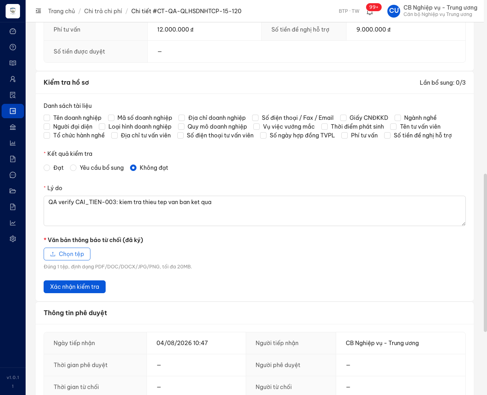
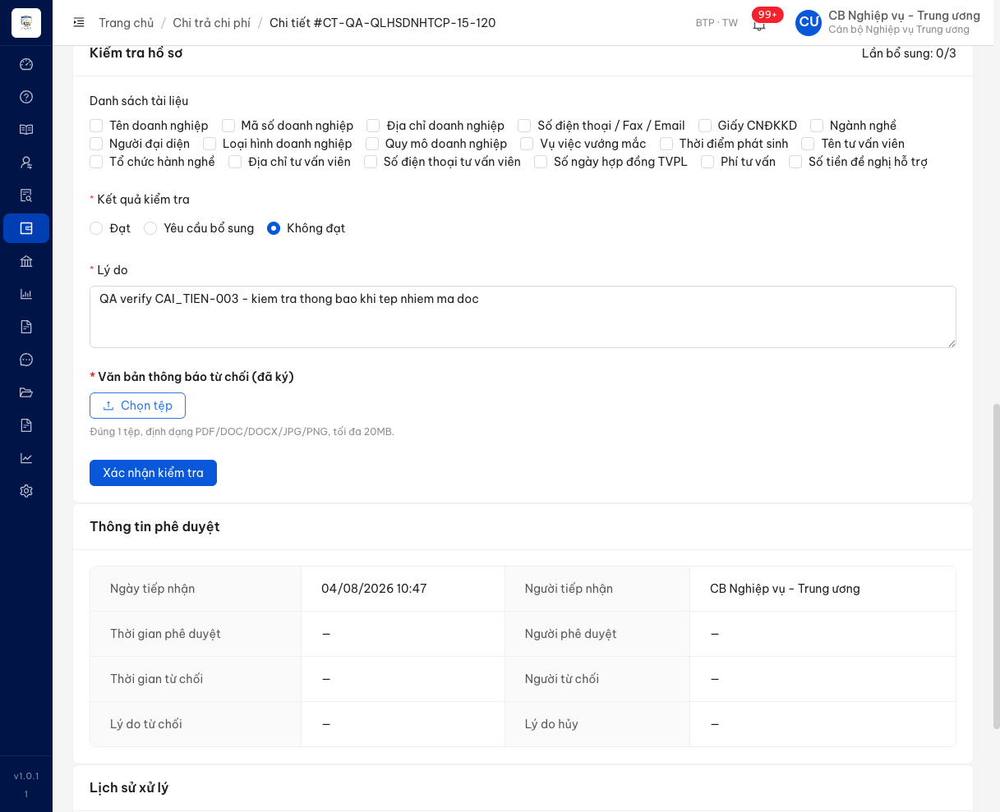
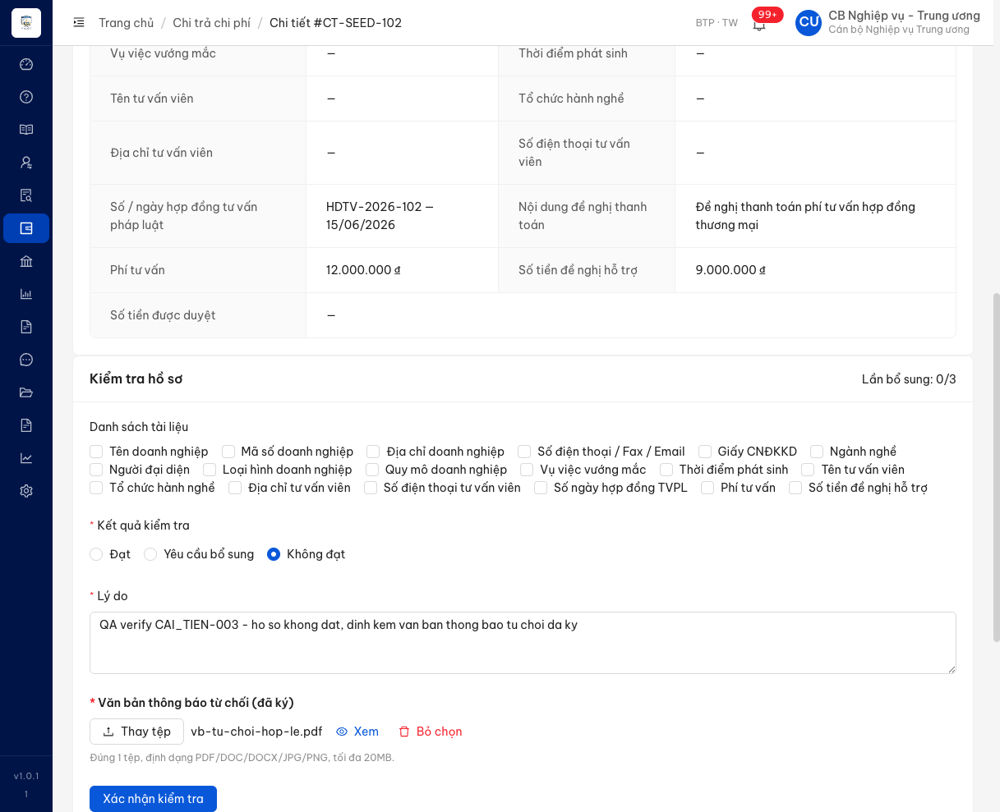
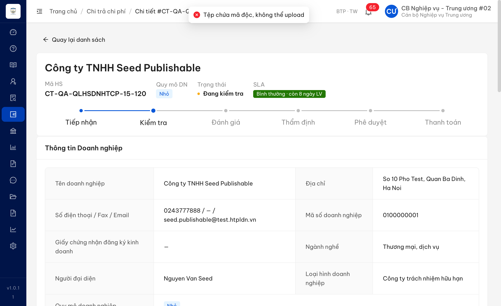
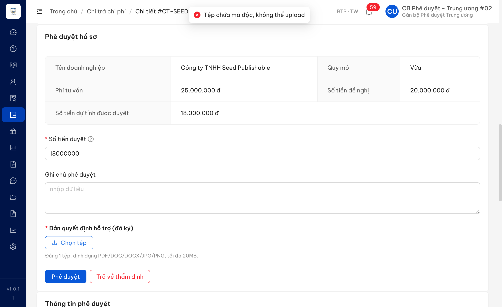
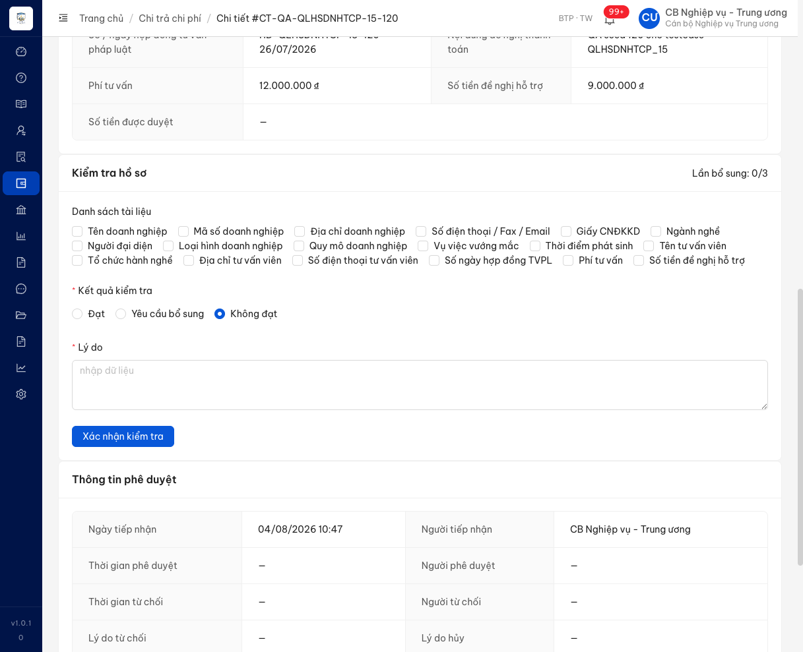

# Bug Report — CAI_TIEN-003 · V.II Chi trả chi phí tư vấn pháp luật (tải lên văn bản kết quả)

> ⚠️ **Lượt đo này chạy trên MÔI TRƯỜNG PHÁT TRIỂN `18.143.165.120.nip.io`.** Bản đo lại trên **môi
> trường nghiệm thu của đối tác** (`htpldn-uat.ospgroup.vn`) ngày 11/08/2026 nằm ở
> [`../../../reverify-caitien003-ospgroup-2026-08-11/verify-CAI_TIEN-003-ospgroup-2026-08-11.md`](../../../../reverify-caitien003-ospgroup-2026-08-11/verify-CAI_TIEN-003-ospgroup-2026-08-11.md)
> — đó mới là bản khớp với ô sheet `CAI_TIEN-003`. Đọc file này chỉ để tra lịch sử, đừng lấy làm căn cứ nghiệm thu.

| Thông tin | Giá trị |
|-----------|---------|
| **Dự án** | PM HTPLDN — UAT đối tác |
| **Môi trường** | https://18.143.165.120.nip.io — FE bản dựng `index-D3YnanYb.js` (lượt verify 2, 10/08/2026 chiều) · trước đó `index-Vkn4Aity.js` (lượt verify 1, 16:06) · BE cùng mốc |
| **Người test** | QA Automation (Chrome DevTools MCP + gọi API trực tiếp) |
| **Ngày** | 2026-08-10 18:57:00 |
| **Loại test** | Functional + Negative + Permission (verify cải tiến sau dev fix) |
| **Round** | Lượt verify 2 (CAI_TIEN-003) — sau khi dev báo đã fix + đã seed dữ liệu mục 6 |
| **Tài liệu tham chiếu** | `Docs-PM-HTPLDN/_bmad-output/planning-artifacts/srs-v3.5/srs-fr-06-chi-tra.md` (commit `b067649`) · phiếu chốt 16 mục [`phan-hoi-CR-upload-van-ban-chi-tra-2026-08-09.md`](../../../../reverify-week-5/ba-confirm/phan-hoi-CR-upload-van-ban-chi-tra-2026-08-09.md) |

---

## Tổng hợp

> **Lượt verify 2 — 10/08/2026 18:40–18:57, đo trên bản dựng FE `index-D3YnanYb.js`.** Đối chiếu 16 mục BA chốt ngày 09/08: **✅ 12 đạt · ❌ 0 lỗi · 🚫 2 chưa đo được · ➖ 2 thuộc tài liệu.** So với lượt 1: mục 5 đã được sửa (nay có báo cho người dùng khi tệp nhiễm mã độc — đo ở **cả** bước Kiểm tra lẫn bước Phê duyệt) và mục 6 đã đo được sau khi dev lùi ngày yêu cầu bổ sung + chạy tác vụ nền. Hai mục còn lại (4 và 16) vẫn kẹt ở khoá tích hợp Cổng Dịch vụ công. Tổng: 1 lỗi — **0 Open, 1 Closed**.
>
> ⚠️ **Bẫy phải biết khi verify môi trường này — nhãn phiên bản KHÔNG đổi khi có bản dựng mới.** Góc dưới thanh menu vẫn hiện `v1.0.11` ở cả bản có lỗi lẫn bản đã fix; chỉ tên tệp bản dựng đổi (`index-Vkn4Aity.js` → `index-D3YnanYb.js`). Đối chiếu nhãn phiên bản để kết luận "đã đo bản mới" là **sai** — phải đọc tên tệp bản dựng đang chạy trong trang. Lượt 1 còn gặp bẫy khác: bản dựng bị thay giữa lúc đang đo (phiên 16:06–16:12 chạy `index-LoDAkSbB.js` chưa có ô tải), số liệu phiên đó đã bị huỷ và đo lại; ảnh giữ lại làm bằng chứng hiện trạng TRƯỚC fix (xem mục "Ghi chú").

### Severity breakdown

| Tổng | Critical | Major | Medium | Minor | Trivial | Closed | Open |
|------|----------|-------|--------|-------|---------|--------|------|
| 1    | 0        | 1     | 0      | 0     | 0       | 1      | 0    |

## Bug Summary Table

| Bug ID | Severity | Priority | Type | TC Ref | **SRS Reference** | Title | Status |
|--------|----------|----------|------|--------|-------------------|-------|--------|
| ~~BUG-CT-001~~ | Major | P1 | Negative | CAI_TIEN-003 | `srs-fr-06-chi-tra.md:371` (FR-V.II-03 §Error Handling E4) · `:902` (FR-V.II-12 §Error Handling E5 — cùng yêu cầu ở bước Phê duyệt) · `:990` (quét mã độc, vế tệp cán bộ tải lên) · `srs-v3.5.md:865` (EC-FILE-SCAN) | Tải tệp nhiễm mã độc vào ô "Văn bản thông báo từ chối": hệ thống chặn nhưng màn hình không hiển thị bất kỳ thông báo nào | Closed |

---

## ~~BUG-CT-001~~ [CLOSED] — Tệp nhiễm mã độc bị chặn nhưng màn hình im lặng, cán bộ không biết vì sao không đính kèm được

> **Re-test:** 2026-08-10 18:57:00 Lượt verify 2 — ✅ PASS (Closed-verified) trên bản dựng `index-D3YnanYb.js`. Chọn tệp nhiễm mã độc ở ô "Văn bản thông báo từ chối (đã ký)" (bước Kiểm tra) và ô "Bản quyết định hỗ trợ (đã ký)" (bước Phê duyệt) đều hiện thông báo *"Tệp chứa mã độc, không thể upload"* — đếm đúng **1** thông báo mỗi lần, tệp không được gắn vào ô, hồ sơ giữ nguyên trạng thái; ba phép đối chứng (tệp hợp lệ / sai định dạng / quá 20MB) vẫn giữ hành vi cũ nên bản sửa không chặn lố.

### Mô tả

Ở bước Kiểm tra hồ sơ chi trả, khi cán bộ nghiệp vụ chọn kết quả "Không đạt" rồi tải lên một tệp nhiễm mã độc vào ô "Văn bản thông báo từ chối (đã ký)", máy chủ từ chối đúng (`ERR-FILE-02`) nhưng **màn hình không hiện thông báo nào**: không có thông báo nổi, không có dòng lỗi dưới ô tải, tệp cũng không được gắn vào. Cán bộ chỉ thấy bấm "Chọn tệp" xong không có gì xảy ra, không biết tệp bị từ chối hay thao tác bị treo. So sánh: hai trường hợp còn lại của cùng ô tải (sai định dạng, vượt 20MB) đều hiện thông báo rõ ràng.

### Các bước tái hiện

1. Đăng nhập tài khoản `cbnv_tw` — vai trò Cán bộ Nghiệp vụ Trung ương (theo `SCR-V.II-02` dòng Quyền truy cập: CB NV cùng đơn vị được thao tác bước Kiểm tra và được tải lên văn bản do cơ quan ban hành).
2. Mở chi tiết hồ sơ đang ở trạng thái "Đang kiểm tra": `/chi-tra/a15d0002-0000-4000-8000-202608050015` (mã `CT-QA-QLHSDNHTCP-15-120`). Tải lại trang từ đầu để chắc chắn chạy bản dựng mới nhất.
3. Ở khối "Kiểm tra hồ sơ", chọn kết quả **"Không đạt"** → ô "Văn bản thông báo từ chối (đã ký)" hiện ra. Nhập một dòng bất kỳ vào ô "Lý do".
4. Bấm "Chọn tệp", chọn tệp thử nhiễm mã độc [`vb-eicar.pdf`](../../testdata/ct003/vb-eicar.pdf) (chuỗi thử chuẩn EICAR đặt trong tệp PDF, 84 byte).
5. Quan sát màn hình trong 7 giây kể từ lúc chọn tệp.

### Kết quả mong đợi

- Theo `srs-fr-06-chi-tra.md:371` (FR-V.II-03 §Error Handling E4): tệp văn bản chứa mã độc hoặc không quét được thì hệ thống phải **phản hồi cho người dùng** bằng câu chuẩn của `ERR-FILE-02` — *"Tệp chứa mã độc, không thể upload"*.
- Theo `srs-fr-06-chi-tra.md:990`: tệp cán bộ tải lên áp đủ quy ước chung `EC-FILE-SCAN`, và *"Thao tác 'Xác nhận kiểm tra' / 'Phê duyệt' phải hiển thị trạng thái đang quét trong thời gian chờ"* — tức người dùng phải nhận được tín hiệu về việc quét và kết quả quét.
- Cùng ô tải này đã hiển thị thông báo cho hai trường hợp từ chối khác, nên người dùng có cơ sở mong đợi trường hợp thứ ba cũng được báo.

**Nói gọn — cần sửa thành:** sau khi cán bộ chọn phải tệp nhiễm mã độc, màn hình **phải báo cho cán bộ biết** với nội dung *"Tệp chứa mã độc, không thể upload"*; tệp **không** được gắn vào ô; hồ sơ **giữ nguyên** trạng thái Đang kiểm tra.

- **Hiển thị bằng cách nào là do dev chọn** — thông báo nổi, dòng đỏ dưới ô tải, hay hộp thoại đều được. Đặc tả không quy định vị trí ở bất kỳ dòng lỗi nào, nên đây không phải chỗ SRS còn thiếu. Cách gọn nhất: làm giống hệt cách ô này đang báo cho tệp sai định dạng và tệp quá 20MB — hai trường hợp đó đang hiển thị tốt.
- **Câu chữ không cần đúng từng chữ**, miễn người dùng hiểu là "tệp có mã độc nên không tải lên được".
- **Áp cho cả bước Phê duyệt.** `srs-fr-06-chi-tra.md:902` (FR-V.II-12 §Error Handling E5) đặt đúng yêu cầu đó cho ô "Bản quyết định hỗ trợ (đã ký)". Lượt verify 1 chưa đo được vế này; lượt verify 2 đã đo và **cả hai chỗ đều đã báo đúng**.

### Kết quả thực tế

- Máy chủ từ chối đúng: `POST /api/v1/ho-so-chi-tras/{id}/kiem-tra/van-ban-ket-qua` trả **HTTP 400** với `ERR-FILE-02` và đúng câu chuẩn. Tệp không được lưu.
- Màn hình **không hiện gì**: đếm được **0** thông báo nổi, **0** dòng lỗi dưới ô tải (bộ theo dõi cài trên `document.body` bắt mọi nút được thêm vào trang trong 7 giây, không lọc trùng). Ô tải vẫn giữ nguyên chữ "Chọn tệp", không có tên tệp, không có trạng thái đang quét.
- Tái hiện **2/2 lần**: một lần trên trang đang mở, một lần sau khi tải lại trang bỏ qua bộ nhớ đệm (cùng bản dựng `index-Vkn4Aity.js`).
- Đối chiếu hành vi cùng ô tải, cùng phiên:

| Tệp thử | Máy chủ | Màn hình báo gì |
|---|---|---|
| `vb-sai-dinh-dang.txt` (sai định dạng) | chặn tại trình duyệt | ✅ "Tệp không đúng định dạng. Đúng 1 tệp, định dạng PDF/DOC/DOCX/JPG/PNG, tối đa 20MB." |
| `vb-qua-20mb.pdf` (21 MB) | chặn tại trình duyệt | ✅ "Tệp vượt dung lượng cho phép. Đúng 1 tệp, định dạng PDF/DOC/DOCX/JPG/PNG, tối đa 20MB." |
| `vb-eicar.pdf` (nhiễm mã độc) | HTTP 400 `ERR-FILE-02` | ❌ **không có thông báo nào** |
| `vb-tu-choi-hop-le.pdf` (hợp lệ) | HTTP 200 | ✅ hiện tên tệp + nút "Xem" / "Bỏ chọn" |

### Bằng chứng

**1. Ảnh chụp:**







**2. Ảnh chụp sau khi dev fix (lượt verify 2, bản dựng `index-D3YnanYb.js`):**





**3. Phản hồi máy chủ:**

```json
{
  "success": false,
  "error": {
    "code": "ERR-FILE-02",
    "message": "Tệp chứa mã độc, không thể upload",
    "timestamp": "2026-08-10T09:18:54.282Z",
    "requestId": "369270c9-9139-4902-9d9b-c5dba042bf0e"
  }
}
```

---

## Ghi chú — kết quả kiểm chứng 16 mục chốt của phiếu

Bảng dưới đối chiếu từng mục trong phiếu chốt ngày 09/08/2026. Ký hiệu: ✅ đạt · ❌ lỗi (đã log ở trên) · 🚫 chưa đo được trên môi trường này · ➖ thuộc tài liệu, không có gì chạy trên phần mềm để đo.

| # | Nội dung chốt | Kết quả | Đo bằng gì |
|---|---|---|---|
| 1 | Ô tải đặt đúng 2 chỗ: Kiểm tra–Không đạt và Phê duyệt | ✅ | Ô "Văn bản thông báo từ chối (đã ký)" chỉ hiện khi chọn "Không đạt"; ô "Bản quyết định hỗ trợ (đã ký)" hiện ở khối Phê duyệt. Hai kết quả kiểm tra còn lại: không có ô tải nào trên trang |
| 2 | Tệp bắt buộc, chặn nút xác nhận khi chưa đính kèm | ✅ | Giao diện chặn kèm thông báo, không gửi yêu cầu nào. Gọi thẳng API bỏ qua giao diện cũng bị chặn: `ERR-CT-KT-03` và `ERR-CT-PD-04`, hồ sơ **giữ nguyên trạng thái** |
| 3 | Không thêm ô số và ngày văn bản | ✅ | Cả hai biểu mẫu đều không có ô nhập số / ngày văn bản |
| 4 | Gửi văn bản kèm sang Cổng Dịch vụ công cho doanh nghiệp | 🚫 | Không quan sát được: 14/14 hồ sơ trong môi trường đều **không có mã hồ sơ bên Cổng**, và không có đầu Cổng để nhận. Các lối vào phía Cổng đều đòi xác thực riêng của trục liên thông (`ERR-CT-AUTH-01`) |
| 5 | Không kiểm chữ ký số, chỉ quét mã độc | ✅ | Có quét thật (tệp sạch được đánh dấu đã quét; tệp nhiễm bị chặn `ERR-FILE-02`), không đòi chữ ký số. Lượt 2: tệp nhiễm nay **có** báo cho người dùng — *"Tệp chứa mã độc, không thể upload"*, đo ở cả bước Kiểm tra lẫn bước Phê duyệt (BUG-CT-001 đã đóng) |
| 6 | Nhánh hệ thống tự từ chối khi quá hạn bổ sung: miễn tệp | ✅ | Dev lùi `ngayYeuCauBoSung` của `CT-QAW7-OVERDUE` về **05/08/2026** rồi chạy tác vụ nền. Kết quả: hồ sơ sang **Từ chối**, lý do *"Quá hạn bổ sung hồ sơ (1 ngày làm việc)"*, người từ chối là tài khoản hệ thống (`00000000-…-000000000000`) và **0 tệp văn bản kết quả** ⇒ đúng là miễn tệp. Chống pass oan: nhật ký thao tác ghi `TU_CHOI_AUTO_QUA_HAN` / `CHI_TRA_BO_SUNG_TIMEOUT_JOB`, `nguoiThucHienId`, `endpoint`, `ipAddress` đều rỗng ⇒ do tác vụ nền làm, không phải sửa tay dưới cơ sở dữ liệu. `CT-SEED-103` (thiếu ngày yêu cầu bổ sung) **không** bị đụng. Cấu hình `soNgayBoSungToiDa` đã trả về **5**. Ghi chú: SRS dòng 7 tự nhận `FR-V.II-CROSS-01` (tác vụ này) **chưa có mục đặc tả riêng** |
| 7 | Sửa câu quy tắc nguồn dữ liệu | ➖ | Việc của đặc tả, đã xong ở commit `b067649` |
| 8 | Không gửi văn bản cho tư vấn viên | ✅ | Đo từ phía người nhận: tài khoản tư vấn viên `qa_tvvseed28` bị chặn ở cả 4 lối vào (`ERR-PERM-SYS-00-01`) — xem hồ sơ, tải văn bản kết quả, tải qua `files/download`, xem danh sách. 20 thông báo trong ứng dụng của tư vấn viên: 0 cái nhắc hồ sơ vừa từ chối. Hộp thư môi trường: 0 thư gửi tư vấn viên sau thao tác, trong khi cùng khung giờ hệ thống vẫn gửi được thư nghiệp vụ khác ⇒ không gửi thật, không phải kênh thư hỏng. Chưa phủ: biến thể hồ sơ CÓ gắn tư vấn viên (không hồ sơ nào trong môi trường có) |
| 9 | Bước từ chối thanh toán sau khi đã duyệt: không có ô tải | ✅ | Mở hồ sơ "Đã duyệt" (CT-SEED-107), chọn "Từ chối thanh toán" → chỉ hiện ô "Lý do từ chối thanh toán", không có ô tải nào |
| 10 | Xem/tải được; tách nhóm hiển thị; đúng người được xem | ✅ | Vùng Tài liệu đính kèm tách 2 nhóm rõ. Nhóm "Giấy tờ doanh nghiệp nộp" hiện chú thích mã tệp bên Cổng; nhóm "Văn bản của cơ quan" hiện "Người tải: … · Thời điểm tải: …". Cán bộ nghiệp vụ và cán bộ phê duyệt cùng đơn vị đều tải được, tệp tải về **khớp nguyên vẹn** bản gốc; cán bộ khác đơn vị bị chặn |
| 11 | Khoá sửa/xoá sau khi đã gửi | ✅ | Sau khi hồ sơ sang "Từ chối": giao diện chỉ còn xem/tải kèm dòng "Văn bản do cơ quan ban hành: chỉ xem và tải, không sửa và không xoá". Chặn cả ở tầng thao tác — xoá tệp bị từ chối, tải tệp khác đè lên cũng bị từ chối |
| 12 | Rà lại nhóm chi trả theo Điều 9 hiện hành | ➖ | Đã treo lại thành việc riêng, ngoài phạm vi lượt này |
| 13 | Đúng 1 tệp · PDF/DOC/DOCX/JPG/PNG · tối đa 20MB | ✅ | Ô tải chỉ nhận 1 tệp và chỉ nhận đúng bộ định dạng đó; tệp .txt bị từ chối, tệp 21MB bị từ chối, cả hai đều kèm thông báo. Đo lại ở lượt 2 sau bản sửa mã độc: **không suy giảm** — tệp hợp lệ vẫn gắn được (HTTP 201, hiện tên tệp + nút Xem/Bỏ chọn), hai trường hợp từ chối vẫn báo đúng câu cũ và **giữ nguyên** tệp hợp lệ đang đính kèm |
| 14 | Nhánh "Từ chối — trả về thẩm định": không đòi tệp | ✅ | Thực hiện được khi ô tải để trống, hồ sơ trả về đúng "Đang thẩm định" |
| 15 | Nhánh "Cần bổ sung": không đòi tệp | ✅ | Giao diện không hiện ô tải; gọi API không kèm tệp vẫn chuyển đúng sang "Yêu cầu bổ sung" |
| 16 | Nhánh bổ sung 3 lần không đạt: miễn tệp | 🚫 | Cần `soLanBoSung ≥ 3`; số này chỉ tăng khi doanh nghiệp bổ sung qua Cổng (`POST /ho-so-chi-tras/bo-sung-dvc`), mà lối vào đòi khoá tích hợp — trả `ERR-CT-AUTH-01`, không đoán khoá. Chung nút thắt với mục 4 |

**Hiện trạng TRƯỚC khi có bản fix — đóng điểm `[CHỜ BẰNG CHỨNG]` của phiếu.** Câu (1) của phiếu ghi *"hiện trạng phần mềm mới lấy từ lời đối tác — chưa mở môi trường, chưa có ảnh chụp"*. Phiên đo 16:06–16:12 ngày 10/08 chạy đúng bản dựng cũ `v1.0.10` (`index-LoDAkSbB.js`, 07/08/2026) và đã chụp lại được: chọn "Không đạt" chỉ hiện ô "Lý do", **không có ô tải nào** trên toàn trang. Lời đối tác là đúng với bản trước fix.



**Bằng chứng bản mới đã có đủ hai ô tải:**


---

## Ghi chú — quan sát ngoài phạm vi CAI_TIEN-003

Ghi lại để không thất lạc, **không tính vào kết quả của phiếu cải tiến này**:

1. **Không phê duyệt được bất kỳ hồ sơ nào trong môi trường (chặn ở bước tính tiền, không liên quan cải tiến).** Cả 14 hồ sơ đều thuộc cùng một doanh nghiệp và doanh nghiệp đó đã dùng hết trần hỗ trợ trong năm, nên thao tác Phê duyệt luôn dừng ở quy tắc tính mức hỗ trợ. Hệ quả cho kiểm thử: **không chạy được nhánh "Phê duyệt thành công có kèm quyết định"** — cần seed một hồ sơ của doanh nghiệp khác còn hạn mức thì mới đo trọn được mục 4 và mục 10 ở bước Phê duyệt.
2. **Thông báo lỗi lộ mã quy tắc nội bộ ra người dùng cuối:** khi phê duyệt vượt trần, màn hình hiện *"Mức chi vượt giới hạn BR-CALC-01 cho doanh nghiệp này."* — `BR-CALC-01` là mã quy tắc nội bộ. `srs-fr-06-chi-tra.md:1196` (SCR-V.II-02 §Quy tắc tương tác) yêu cầu *"Tất cả label, button, badge, radio, message hiển thị bằng tiếng Việt chuẩn (không viết tắt, không dùng enum/field code như `DANG_KIEM_TRA`, `so_tien_de_nghi`)"*. Ví dụ trong đặc tả mới liệt kê enum và tên trường, **chưa nói tới mã quy tắc**, nên chưa log thành lỗi — cần BA xác nhận mã quy tắc có thuộc diện cấm hiển thị hay không.
3. **Tài khoản `cbpd_tw` đang bị khoá 30 phút** (`ERR-AUTH-LOCKED-01`) ngay từ lần đăng nhập đầu tiên của lượt đo — không do lượt đo này gây ra. Đã đổi sang tài khoản cùng vai trò cùng cấp `cbpd_tw_01` theo quy tắc thay tài khoản.
4. **Có người khác dùng chung tài khoản `cbnv_tw` trong lúc đo (lượt 2).** Phiên đăng nhập của QA bị đá ra `/login` hai lần chỉ sau ~2 phút: `GET /api/v1/thong-baos/unread-count` trả 401 rồi ứng dụng tự gọi đăng xuất. Hộp thư môi trường cho thấy có mã xác thực gửi cho `cbnv_tw` lúc 11:47 và 11:51 (giờ máy chủ) **không phải do QA yêu cầu** — mỗi lần đăng nhập mới thu hồi phiên cũ. Đã chuyển sang `cbnv_tw_02` / `cbpd_tw_02` thì phiên chạy trọn lượt đo. Không phải lỗi phần mềm, nhưng ai đo tiếp trên môi trường này nên tránh tài khoản gốc `cbnv_tw` / `cbpd_tw`.
5. **Dữ liệu QA đụng vào ở lượt 2 và đã trả về nguyên trạng.** `CT-QA-QLHSDNHTCP-15-120`: có tải 1 tệp hợp lệ lên ô văn bản để đối chứng, đã bấm "Bỏ chọn" — đọc lại còn `Đang kiểm tra`, **0** tệp văn bản kết quả. `CT-SEED-106`: đẩy sang "Chờ phê duyệt" để mở được biểu mẫu Phê duyệt, sau đó "Trả về thẩm định" — đọc lại còn `Đang thẩm định` như trước. Cấu hình `soNgayBoSungToiDa` đã về **5**. Riêng `CT-QAW7-OVERDUE` **giữ nguyên trạng thái Từ chối** vì đó chính là bằng chứng của mục 6.

---

## Phụ lục — Môi trường test

| Thành phần | Giá trị |
|------------|---------|
| URL ứng dụng | https://18.143.165.120.nip.io |
| Bản dựng lúc đo | Lượt 2: `index-D3YnanYb.js` · lượt 1: `index-Vkn4Aity.js` (10/08 16:06) · trước fix: `index-LoDAkSbB.js` (07/08). ⚠️ Nhãn phiên bản góc dưới thanh menu hiện `v1.0.11` ở **cả ba** bản — không dùng nhãn này để phân biệt bản dựng |
| OTP login | Lấy từ MailHog của môi trường |
| MailHog (OTP inbox) | http://18.143.165.120:8025 |
| API base | https://18.143.165.120.nip.io/api/v1 |
| Tài khoản dùng | `cbnv_tw`, `cbnv_tw_01`, **`cbnv_tw_02`** (Cán bộ Nghiệp vụ TW) · `cbpd_tw_01`, **`cbpd_tw_02`** (Cán bộ Phê duyệt TW — thay cho `cbpd_tw` đang bị khoá) · `cbnv_dp_01` (đối chứng khác đơn vị) · `qa_tvvseed28` (tư vấn viên, đo mục 8) · `admin` (đọc nhật ký thao tác). Lượt 2 dùng bộ `_02` vì tài khoản gốc bị người khác dùng song song |
| Hồ sơ dùng | `CT-QA-QLHSDNHTCP-15-120`, `CT-SEED-102`, `CT-QAW7-OVERDUE`, `CT-QAW7-NORMAL` (bước Kiểm tra) · `CT-SEED-106` (bước Phê duyệt) · `CT-SEED-107` (bước Thanh toán) |
| Tool test | Chrome DevTools MCP + gọi API trực tiếp bằng curl |

---

*Bug report generated: 2026-08-10 18:57:00 | QA Automation via Claude Code*
