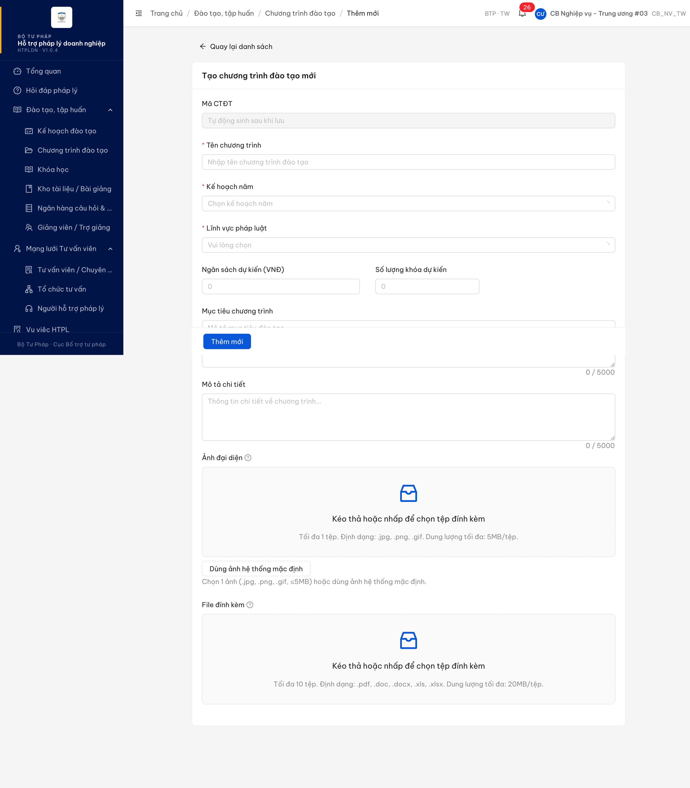
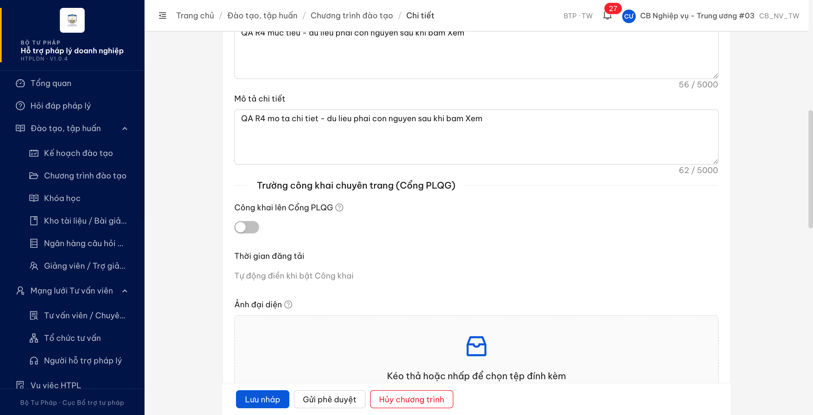
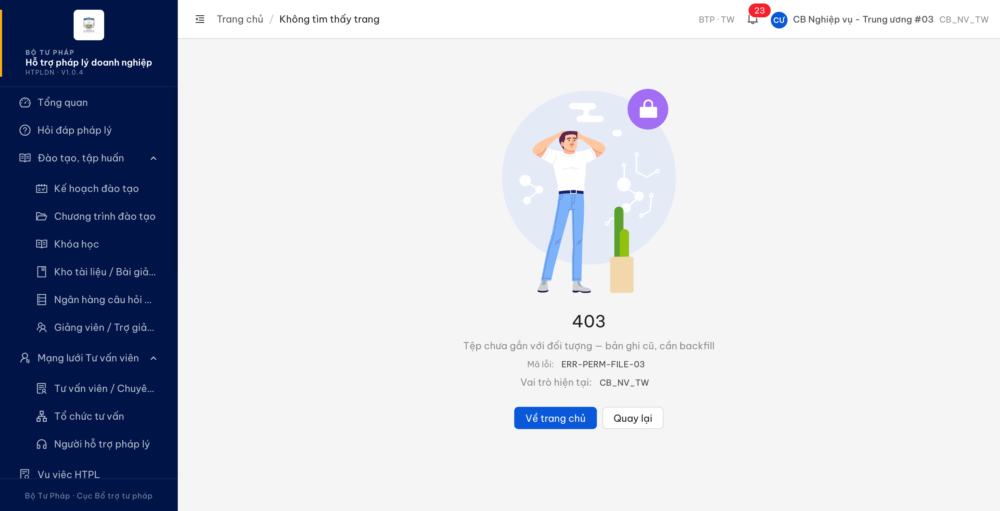
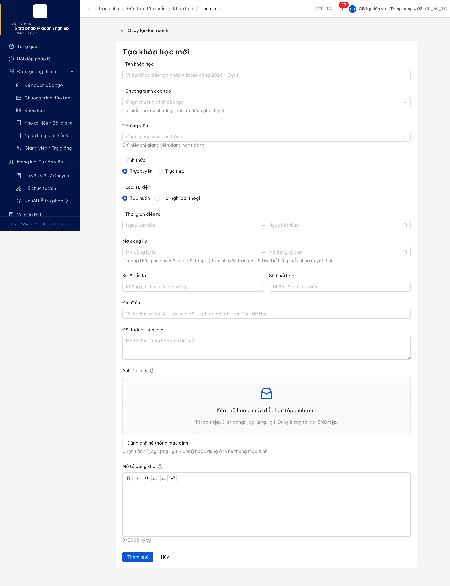
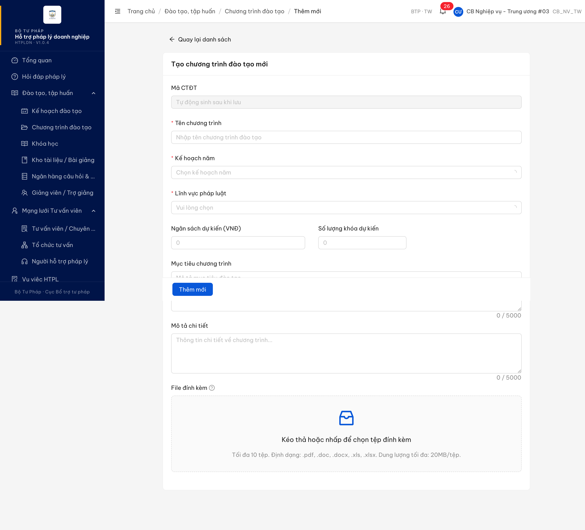
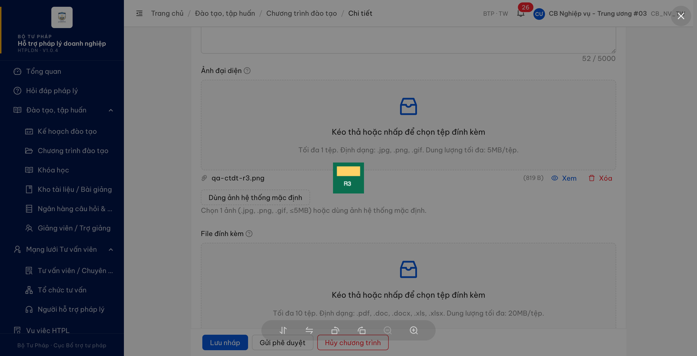
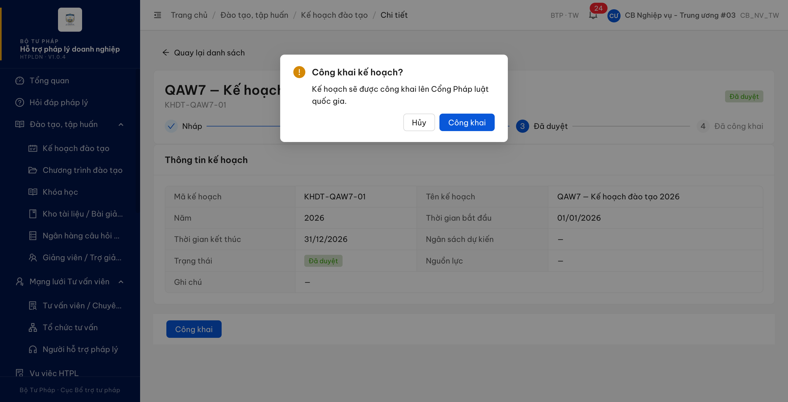
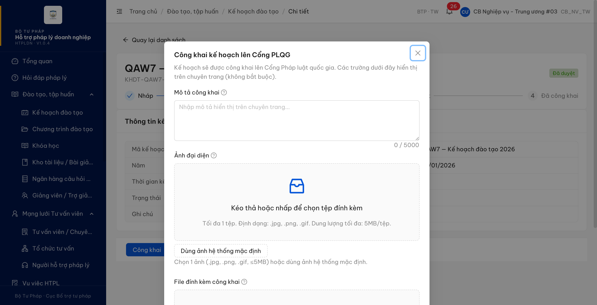

# Bug Report — Đào tạo, tập huấn (Ảnh đại diện — CAI_TIEN-002)

| Thông tin | Giá trị |
|-----------|---------|
| **Dự án** | PM HTPLDN |
| **Môi trường** | **Môi trường DEV** — `https://18.143.165.120.nip.io` (HTPLDN · V1.0.4). **KHÔNG phải môi trường UAT của đối tác** (`https://htpldn-uat.ospgroup.vn`): hai nơi đang chạy hai bản dựng khác nhau và bản fix lần 3 mới chỉ có ở môi trường DEV — xem §Phụ lục |
| **Người test** | QA Automation via Claude Code |
| **Ngày** | 2026-08-01 22:55:00 |
| **Loại test** | Functional — re-verify Task cải tiến |
| **Round** | Verify Task-cải tiến R5 (sau dev fix lần 5) |
| **Tài liệu tham chiếu** | `Docs-PM-HTPLDN/_bmad-output/planning-artifacts/srs-v3.5/srs-fr-03-dao-tao.md` (**bản 3.5.7, cập nhật 2026-08-01** — số dòng đã dịch ~+13 so với bản trước) · phiếu BA `reverify-week-4/phan-hoi-AI_TIEN-002-anh-dai-dien-va-hop-thoai-cong-khai.md` · sheet "UAT-PM HTPLDN" tab `Task-cải tiến` dòng 3 |

---

## Tổng hợp

Re-verify cải tiến **CAI_TIEN-002** (bổ sung ô Ảnh đại diện cho màn thêm mới/chỉnh sửa Kế hoạch đào tạo, Khóa học và Chương trình đào tạo) trên **môi trường DEV**. **Lượt 5 (01/08/2026 22:47–22:55, trên bản dựng giao diện `index-DyCeOp-A.js` đẩy lên lúc 22:42):** kiểm lại toàn bộ 6 lỗi — **cả 6 đều đã hết**, phiếu đóng hoàn toàn. Lỗi cuối cùng `-004` (bấm **Xem** ảnh vừa tải ở form Thêm mới Chương trình đào tạo) nay mở ảnh ngay trong biểu mẫu, dữ liệu đang nhập còn nguyên; phần mềm đọc ảnh qua đường riêng của module và trả 200, không còn chạm đường chung.

**Đính chính lượt 4:** kết luận *"`-004` vẫn lỗi"* ở lượt 4 là **sai do lỗi đo của QA**, không phải do phần mềm. Tệp giao diện `index-DnQQPwHf.js` đã lên lúc **18:25**, nhưng tab trình duyệt dùng để đo mở từ trước đó và chưa tải lại, nên phép đo lúc **18:49** vẫn chạy mã cũ trong bộ nhớ tab. Kiểm lại trên chính bản 18:25 (lúc 22:33) thì thao tác đã đúng. Từ lượt này, mỗi lần verify đều tải lại trang từ đầu và ghi lại tên tệp bản dựng trước khi đo. Tổng **6** lỗi, **0** Open.

### Severity breakdown

| Tổng | Critical | Major | Medium | Minor | Trivial | Closed | Open |
|------|----------|-------|--------|-------|---------|--------|------|
| 6    | 0        | 6     | 0      | 0     | 0       | 6      | 0    |

## Bug Summary Table

| Bug ID | Severity | Priority | Type | TC Ref | **SRS Reference** | Title | Status |
|--------|----------|----------|------|--------|-------------------|-------|--------|
| ~~BUG-CAITIEN-002-004~~ | Major | P1 | Functional | CAI_TIEN-002 | `srs-fr-03-dao-tao.md:1870` (SCR-III-01 Thành phần 6) · `:111` (FR-III-01 Inputs trường 11) | Bấm "Xem" ảnh vừa tải ở form Thêm mới Chương trình đào tạo → bị đẩy sang trang 403, rời khỏi biểu mẫu đang nhập dở | Closed |
| ~~BUG-CAITIEN-002-005~~ | Major | P1 | Functional | CAI_TIEN-002 | `srs-fr-03-dao-tao.md:1238` · `:1256` (FR-III-16 §Processing) · `:1263` `:1265` (Acceptance Criteria) · `:2224` (BR-FLOW-05) | Công khai kế hoạch đào tạo thất bại — trả 502 "Cổng PLQG chưa được cấu hình", trạng thái không đổi và 3 trường công khai không được lưu | Closed |
| ~~BUG-CAITIEN-002-006~~ | Major | P1 | UI | — (ngoài phạm vi CAI_TIEN-002) | `srs-fr-03-dao-tao.md:1870` (SCR-III-01 Thành phần 6 — nhóm "Trường công khai chuyên trang (5 CPF)") · `srs-v3.5.md:1005` (CTDT thêm đủ 5 CPF) · `srs-v3.5.md:1019` (CTDT thuộc kiểu (1) — nhập ngay ở form thêm/sửa) | Form lập/chỉnh sửa Chương trình đào tạo còn thiếu 4/5 trường công khai chuyên trang | Closed |
| ~~BUG-CAITIEN-002-001~~ | Major | P1 | Data | CAI_TIEN-002 | `srs-fr-03-dao-tao.md:1790` (SCR-III-00 Thành phần 4) · `:1893` (SCR-III-02 Tab 1) · `:2046` entity `anh_dai_dien` | Ảnh đại diện tải lên xong không xem/hiển thị được — bấm "Xem" nhảy sang trang 403 (ERR-PERM-FILE-03) | Closed |
| ~~BUG-CAITIEN-002-002~~ | Major | P1 | UI | CAI_TIEN-002 | `srs-fr-03-dao-tao.md:111` (FR-III-01 Inputs Chương trình đào tạo trường 11 `anh_dai_dien`) · `:1870` (SCR-III-01 Thành phần 6) | Form lập/chỉnh sửa Chương trình đào tạo thiếu ô Ảnh đại diện | Closed |
| ~~BUG-CAITIEN-002-003~~ | Major | P1 | UI | CAI_TIEN-002 | `srs-fr-03-dao-tao.md:1795-1803` (SCR-III-00 Thành phần 5 — Hộp thoại công khai) · `:1250-1252` (FR-III-16 §Inputs) · `:1790` (dùng chung trường `anh_dai_dien`) | Hộp thoại Công khai của Kế hoạch đào tạo chỉ là hộp xác nhận — thiếu ô Mô tả công khai, Ảnh đại diện, File đính kèm công khai | Closed |

---

## ~~BUG-CAITIEN-002-004~~ [CLOSED] — Bấm "Xem" ảnh vừa tải ở form Thêm mới Chương trình đào tạo → bị đẩy sang trang 403, rời khỏi biểu mẫu đang nhập dở

> **Re-test:** 2026-08-01 22:49:00 R5 — ✅ PASS (đóng). Trên bản dựng giao diện `index-DyCeOp-A.js` (đẩy lên 22:42, đã tải lại trang từ đầu trước khi đo): form **Thêm mới** Chương trình đào tạo — nhập Tên chương trình, chọn tệp ảnh bằng đúng hộp thoại chọn tệp của trình duyệt, bấm **Xem** → ảnh mở ngay trong biểu mẫu, địa chỉ trang vẫn là `/dao-tao/chuong-trinh/tao-moi`, Tên chương trình đã nhập còn nguyên. Chuỗi request: `POST …/chuong-trinh-dao-taos/upload` **201** → `GET …/chuong-trinh-dao-taos/anh-dai-dien/{fileId}/download` **200**; không còn lượt gọi nào tới đường chung `/api/v1/files/…` và không còn 403. **Đính chính:** kết quả FAIL ghi ở lượt 4 là do QA đo trên mã cũ còn trong bộ nhớ tab (bản fix đã lên lúc 18:25, phép đo lúc 18:49 nhưng tab mở từ trước và chưa tải lại) — kiểm lại chính bản 18:25 lúc 22:33 thì thao tác đã đúng, tức lỗi này thực tế đã được sửa từ bản fix lần 4.

### Mô tả

Ô Ảnh đại diện mới bổ sung cho Chương trình đào tạo lặp lại đúng lỗi gốc của cải tiến này ở **form Thêm mới**: sau khi tải ảnh lên thành công, bấm nút **Xem** cạnh tên tệp thì ứng dụng rời khỏi biểu mẫu và chuyển sang trang **403 — "Tệp chưa gắn với đối tượng — bản ghi cũ, cần backfill" (ERR-PERM-FILE-03)**, toàn bộ dữ liệu đang nhập dở mất hết và phải nhập lại từ đầu. Cùng thao tác đó ở form **Sửa** (bản ghi đã lưu) thì chạy đúng, và bốn vị trí của Kế hoạch đào tạo / Khóa học cũng chạy đúng — nên đây là thiếu sót riêng của màn Thêm mới Chương trình đào tạo.

### Các bước tái hiện

1. Đăng nhập role **CB_NV_TW** (tài khoản `cbnv_tw_03`).
2. Vào **Đào tạo, tập huấn → Chương trình đào tạo → [Thêm mới]**.
3. Nhập Tên chương trình (ví dụ *"QA R3 - chung minh mat du lieu khi bam Xem"*).
4. Ở ô **Ảnh đại diện**, tải lên một ảnh `.png` hợp lệ. Quan sát: tệp lên thành công, hiện tên tệp + kích thước + hai nút **Xem / Xóa**.
5. Bấm **Xem**.
6. Quan sát địa chỉ trang và nội dung biểu mẫu.

### Kết quả mong đợi

- Người dùng bấm xem ảnh mình vừa tải lên thì phải xem được ảnh đó, và thao tác xem **không được làm rời khỏi biểu mẫu đang nhập dở**, không làm mất dữ liệu chưa lưu.
- Ô Ảnh đại diện của Chương trình đào tạo là ô đặc tả tại `srs-fr-03-dao-tao.md:1870` (SCR-III-01 Thành phần 6) và `:111` (FR-III-01 Inputs trường 11) — đã bổ sung ở bản fix lần 3 thì phải dùng được trọn vẹn, không chỉ tải lên được.
- Cùng một hành vi với bốn vị trí đã được nghiệm thu ở lượt 2 (lập/sửa Kế hoạch đào tạo, thêm mới/sửa Khóa học): bấm Xem mở ảnh ngay trong biểu mẫu.

### Kết quả thực tế

- Tải ảnh: `POST /api/v1/chuong-trinh-dao-taos/upload` → **201**, trả `fileId`.
- Bấm **Xem**: ứng dụng gọi `GET /api/v1/files/{fileId}/download` → **403 `ERR-PERM-FILE-03`** → điều hướng sang `/403`. Biểu mẫu biến mất, ô Tên chương trình đã nhập không còn, ảnh vừa tải cũng mất.
- Đường đọc riêng cho Chương trình đào tạo **đã có sẵn và chạy đúng**: gọi thẳng `GET /api/v1/chuong-trinh-dao-taos/anh-dai-dien/{fileId}/download` với cùng `fileId` trả **200**, kèm `downloadUrl` ký sẵn + `tenFile` + `dungLuong`; tải theo `downloadUrl` được đúng 819 byte `image/png`, SHA-256 trùng tệp đã gửi. Tức phần máy chủ đã xong, chỉ màn Thêm mới đang đọc ảnh bằng đường chung.
- Đối chiếu trong cùng lượt kiểm: form **Sửa** Chương trình đào tạo, form lập và form sửa Kế hoạch đào tạo, form Thêm mới và form Sửa Khóa học — cả năm đều đọc ảnh qua đường riêng theo module và trả **200**, bấm Xem mở ảnh tại chỗ.
- **Phép thử loại trừ "tệp chưa gắn bản ghi nên chặn là đúng":** tải lên một tệp mới hoàn toàn qua `POST /api/v1/chuong-trinh-dao-taos/upload` (bản ghi trả về `entityType: null`, `entityId: null` — đúng tình huống của form Thêm mới), rồi đọc cùng `fileId` bằng hai đường: đường chung `GET /api/v1/files/{fileId}/download` → **403**; đường riêng `GET /api/v1/chuong-trinh-dao-taos/anh-dai-dien/{fileId}/download` → **200** kèm `downloadUrl` ký sẵn. Tức đường riêng đọc được cả tệp **chưa gắn bản ghi** — đúng chỗ màn Thêm mới cần dùng, không phải giới hạn nghiệp vụ.
- **Quan hệ với lỗi gốc:** cùng triệu chứng với `BUG-CAITIEN-002-001` — đã sửa cho Kế hoạch đào tạo và Khóa học ở lượt 2, còn sót đúng màn Chương trình đào tạo (màn này trước lượt 3 chưa có ô ảnh nên chưa quan sát được).
- **Đo lại lượt 4 (01/08 18:49, sau bản fix lần 4):** tái hiện thêm **2/2** lần. Chạy lại phép thử loại trừ trên một tệp mới tinh (`fileId 591a4992-54da-4c1a-aa31-64847c711d8f`, bản ghi trả về `entityType: null`, `entityId: null` — đúng tình huống form Thêm mới): đường riêng `GET /api/v1/chuong-trinh-dao-taos/anh-dai-dien/{fileId}/download` → **200** kèm `downloadUrl` ký sẵn; đường chung `GET /api/v1/files/{fileId}` → **403 `ERR-PERM-FILE-03`**. Ngay sau đó, form **Sửa** của bản ghi vừa tạo bằng chính biểu mẫu này (`CTDT-BTP-TW-2026-0005`) bấm "Xem" thì mở ảnh tại chỗ, gọi đúng đường riêng và trả 200.
- Sau khi bị đẩy sang `/403`, dữ liệu đang nhập **không còn trên biểu mẫu**. Trong phiên kiểm thử, bấm nút **Quay lại** của trình duyệt thì trình duyệt khôi phục lại được trang đang nhập dở nhờ bộ nhớ đệm của nó; nhưng phần mềm không có đường quay lại chỗ đang nhập, nên nếu người dùng đi tiếp trong phần mềm thì phải nhập lại từ đầu.
- Tái hiện tổng cộng 4/4 lần qua hai bản fix (lần 3 và lần 4), trên các phiên nhập khác nhau.

### Bằng chứng


**Dữ liệu test kèm theo:** [`image/qa-r4-du-lieu-test-anh-gay-loi.png`](image/qa-r4-du-lieu-test-anh-gay-loi.png) — đúng tệp đã tải lên lúc tái hiện, kéo về từ kho tệp của máy chủ DEV (3 236 byte, SHA-256 `3c2fc805…1314`, PNG 200×120, CRC 4/4 chunk hợp lệ). Nội dung ảnh **không phải** nguyên nhân: đã tái hiện với 3 tệp `.png` khác nhau.


Chuỗi request khi bấm **Xem** ở form Thêm mới:

```text
POST /api/v1/chuong-trinh-dao-taos/upload                              201
GET  /api/v1/files/b833d8af-faaa-4b35-adee-50b3513dce60/download       403
GET  /403                                                              200
```

Nội dung lỗi trả về:

```json
{
  "success": false,
  "error": {
    "code": "ERR-PERM-FILE-03",
    "message": "Tệp chưa gắn với đối tượng — bản ghi cũ, cần backfill"
  }
}
```

Cùng `fileId` đọc bằng đường riêng của Chương trình đào tạo:

```json
{
  "success": true,
  "data": {
    "downloadUrl": "https://18.143.165.120.nip.io/htpldn/…/qa-ctdt-r3.png?X-Amz-…",
    "tenFile": "qa-ctdt-r3.png",
    "loaiFile": "image/png",
    "dungLuong": 819
  }
}
```

### So sánh

| Vị trí bấm "Xem" | Lượt 3 | Lượt 5 (bản 22:42) |
|---|---|---|
| Form lập Kế hoạch đào tạo (chưa lưu) | ✅ mở ảnh trong biểu mẫu | ✅ |
| Form sửa Kế hoạch đào tạo | ✅ mở ảnh trong biểu mẫu | ✅ |
| Form Thêm mới Khóa học (chưa lưu) | ✅ mở ảnh trong biểu mẫu | ✅ |
| Form Sửa Khóa học | ✅ mở ảnh trong biểu mẫu | ✅ |
| Form Sửa Chương trình đào tạo (đã lưu) | ✅ mở ảnh trong biểu mẫu | ✅ |
| **Form Thêm mới Chương trình đào tạo (chưa lưu)** | ❌ nhảy `/403`, mất dữ liệu | ✅ mở ảnh trong biểu mẫu |

Đọc **cùng một `fileId` chưa gắn bản ghi** bằng ba đường khác nhau:

| Đường đọc | HTTP lượt 3 | HTTP lượt 4 |
|---|---|---|
| `GET /api/v1/files/{fileId}` (và `/download`) — đường chung | ❌ 403 `ERR-PERM-FILE-03` | ❌ 403 `ERR-PERM-FILE-03` |
| `GET /api/v1/chuong-trinh-dao-taos/anh-dai-dien/{fileId}/download` — đường riêng cùng module | ✅ 200 | ✅ 200 |
| `GET /api/v1/ke-hoach-dao-taos/anh-dai-dien/{fileId}/download` — đường riêng module khác | ✅ 200 | — |

---

## ~~BUG-CAITIEN-002-005~~ [CLOSED] — Công khai kế hoạch đào tạo thất bại: trả 502 "Cổng PLQG chưa được cấu hình", trạng thái không đổi và 3 trường công khai không được lưu

> **Re-test:** 2026-08-01 22:52:00 R5 — ✅ PASS (giữ Closed). Kiểm lại trên bản dựng `index-DyCeOp-A.js`: công khai `KHDT-2026-001` với đủ 3 trường (Mô tả công khai + Ảnh đại diện + File đính kèm công khai) → kế hoạch sang **"Đã công khai"**, đọc lại bản ghi có `congKhai: true`, có `thoiGianDangTai`, lưu đủ cả ba trường — nghiệm thu `:1256` và `:1263`. **Hủy công khai** → về **"Đã duyệt"**, `congKhai: false`, `thoiGianDangTai` bị xóa (BR-PUBLIC-02) và **giữ nguyên cả ba trường** — đúng `:1254`. Đã thử trên tổng cộng **3 kế hoạch** (`KH-20260731-0002`, `KHDT-QAW7-01`, `KHDT-2026-001`); hai kế hoạch mượn để đối chứng đã hủy công khai, trả môi trường về nguyên trạng.

### Mô tả

Sau khi hộp thoại Công khai được bổ sung đủ ba ô, thao tác **Công khai** vẫn không hoàn tất được: bấm nút Công khai thì hệ thống báo lỗi *"Cổng PLQG chưa được cấu hình"*, kế hoạch giữ nguyên trạng thái "Đã duyệt" và cả ba trường vừa nhập (Mô tả công khai, Ảnh đại diện, File đính kèm công khai) đều không được lưu. Theo đặc tả, công khai chạy theo **mô hình KÉO**: phần mềm chỉ đặt cờ công khai và đổi trạng thái, còn Cổng Pháp luật quốc gia tự kéo dữ liệu định kỳ — nên thao tác này không phụ thuộc vào việc Cổng đã được cấu hình hay chưa. Lỗi này chặn luôn việc nghiệm thu phần lưu ba trường công khai của cải tiến CAI_TIEN-002. *(Chưa có bằng chứng thao tác Công khai từng chạy được trước bản fix lần 3 — nên ghi nhận đây là lỗi đang chặn nghiệm thu, không khẳng định là lỗi do bản fix lần 3 sinh ra.)*

### Các bước tái hiện

1. Đăng nhập role **CB_NV_TW** (tài khoản `cbnv_tw_03`).
2. Vào **Đào tạo, tập huấn → Kế hoạch đào tạo**, mở **[Xem]** một kế hoạch ở trạng thái "Đã duyệt".
3. Bấm **[Công khai]**.
4. Nhập Mô tả công khai, tải một ảnh `.png` vào ô Ảnh đại diện, tải một tệp `.pdf` vào ô File đính kèm công khai.
5. Bấm nút **[Công khai]** trong hộp thoại.
6. Quan sát thông báo, trạng thái kế hoạch trên màn chi tiết, và dữ liệu bản ghi sau đó.

### Kết quả mong đợi

- Theo `srs-fr-03-dao-tao.md:1238` — *"Công khai/hủy công khai kế hoạch đào tạo lên Cổng PLQG theo mô hình KÉO — phần mềm đặt cờ + trạng thái; Cổng PLQG tự kéo định kỳ."*
- Theo `srs-fr-03-dao-tao.md:1256` (FR-III-16 §Processing) — *"nếu CONG_KHAI: lưu `mo_ta_cong_khai`, `anh_dai_dien`, `file_dinh_kem_cong_khai` … → đặt cờ công khai + chuyển trạng thái (DA_CONG_KHAI/DA_DUYET) → Ghi nhật ký."*
- Theo `srs-fr-03-dao-tao.md:1263` — *"Given CB NV chọn KH đã duyệt When nhấn 'Công khai' Then trạng thái → DA_CONG_KHAI."*
- Theo `srs-fr-03-dao-tao.md:1265` — *"hiển thị Toast success … Mô hình KÉO không gọi API đồng bộ nên KHÔNG có nhánh lỗi API / nút 'Thử lại' (mã `ERR-CK-API-01/02` đã RETIRE)."*
- Theo `srs-fr-03-dao-tao.md:2224` — BR-FLOW-05: *"Công khai theo mô hình KÉO (Cổng PLQG tự kéo)"*.

### Kết quả thực tế

- Bấm **[Công khai]** → `POST /api/v1/ke-hoach-dao-taos/{id}/publish` trả **502** với mã `ERR-SYS-III-16-01`, thông điệp *"Cổng PLQG chưa được cấu hình"*; giao diện hiện toast đỏ đúng nội dung đó.
- Kế hoạch giữ nguyên `trangThai: "DA_DUYET"`, `congKhai: false`; `moTaCongKhai`, `fileDinhKemCongKhai` vẫn `null`. Không kế hoạch nào trong môi trường ở trạng thái "Đã công khai" (đếm phân bố: 6 Nháp + 4 Đã duyệt, 0 Đã công khai). Có **1** bản ghi seed mang cờ `congKhai: true` nhưng trạng thái vẫn là "Đã duyệt" — cờ này do dữ liệu mẫu đặt sẵn, không phải kết quả của thao tác Công khai.
- Dữ liệu gửi lên đã đúng và đủ — hộp thoại truyền cả ba trường cùng `version`, nên lỗi nằm ở bước xử lý phía sau chứ không phải ở hộp thoại.
- Tái hiện **4/4 lần** trên **2 kế hoạch khác nhau** (`KHDT-QAW7-01` và `KH-20260731-0002`), cả khi bấm trên giao diện lẫn khi gọi thẳng API.
- Không có mục cấu hình Cổng PLQG nào trong danh sách API của hệ thống, nên người dùng không có cách tự khắc phục.
- **Phép thử loại trừ "chỉ là môi trường chưa cấu hình":** trong **cùng một phiên đăng nhập, cách nhau khoảng 15 giây**, công khai một bản ghi Kho câu hỏi (`POST /api/v1/kho-cau-hois/{id}/cong-khai`) trả **200** và trạng thái chuyển sang `CONG_KHAI` bình thường, trong khi công khai kế hoạch đào tạo trả **502**. Nếu Cổng PLQG chưa cấu hình là nguyên nhân dùng chung, cả hai phải cùng hỏng. Vậy ràng buộc "phải cấu hình Cổng" chỉ tồn tại riêng ở bước xử lý công khai của kế hoạch đào tạo, ngược với mô hình KÉO ở `:1238` / `:1265`. *(Bản ghi Kho câu hỏi đã được hủy công khai ngay sau đó để trả môi trường về nguyên trạng.)*
- Mã lỗi `ERR-SYS-III-16-01` **không xuất hiện ở bất kỳ vị trí nào trong SRS v3.5**.
- **Hệ quả với nghiệm thu:** không kiểm chứng được bước lưu ba trường công khai (`:1256`), cũng không kiểm được quy tắc *"khi HUY_CONG_KHAI thì bỏ qua, giữ nguyên giá trị đã lưu"* (`:1254`) vì không đưa được kế hoạch nào sang "Đã công khai".

### Bằng chứng


Nội dung toast bắt được bằng `MutationObserver` cài trước khi bấm (không phải poll DOM):

```text
Kế hoạch đào tạo  → "Cổng PLQG chưa được cấu hình"   (toast lỗi, nền đỏ)
Kho câu hỏi       → "Đã công khai câu hỏi"            (toast thành công, nền xanh)
```

Dữ liệu hộp thoại gửi lên:

```json
{
  "version": 1,
  "moTaCongKhai": "QA R3 - mo ta cong khai kiem tra hop thoai Cong khai (CAI_TIEN-002)",
  "anhDaiDien": { "fileId": "3d7f7eea-9125-43a7-9bdb-274a0ba5b26c" },
  "fileDinhKemCongKhai": [ { "fileId": "dd62e5c2-39fb-454f-aea6-0a7aa55ed7e8" } ]
}
```

Phản hồi của máy chủ (`POST /api/v1/ke-hoach-dao-taos/{id}/publish` → HTTP 502):

```json
{
  "success": false,
  "error": {
    "code": "ERR-SYS-III-16-01",
    "message": "Cổng PLQG chưa được cấu hình"
  }
}
```

So sánh cùng phiên — hai thao tác công khai trên cùng môi trường, cả khi gọi thẳng dịch vụ (17:05) lẫn khi bấm trên giao diện (17:27 và 17:29):

```text
POST /api/v1/kho-cau-hois/8da01f51-…/cong-khai       200   trangThai: DA_DUYET → CONG_KHAI
POST /api/v1/ke-hoach-dao-taos/dca135fe-…/publish    502   ERR-SYS-III-16-01 "Cổng PLQG chưa được cấu hình"
```

Trạng thái bản ghi sau thao tác — không có gì thay đổi:

```json
{
  "maKeHoach": "KH-20260731-0002",
  "trangThai": "DA_DUYET",
  "congKhai": false,
  "moTaCongKhai": null,
  "fileDinhKemCongKhai": null
}
```

---

## ~~BUG-CAITIEN-002-006~~ [CLOSED] — Form lập/chỉnh sửa Chương trình đào tạo còn thiếu 4/5 trường công khai chuyên trang

> **Re-test:** 2026-08-01 22:50:00 R5 — ✅ PASS (giữ Closed). Trên bản dựng `index-DyCeOp-A.js`, **cả form Thêm mới lẫn form Sửa** Chương trình đào tạo đều có đủ nhóm **5 trường công khai chuyên trang** mà `:1870` liệt kê: **"Công khai lên Cổng PLQG"** (công tắc), **"Thời gian đăng tải"** (chỉ đọc, ghi *"Tự động điền khi bật Công khai"* — khớp BR-PUBLIC-03 "không cho sửa tay"), **"Ảnh đại diện"**, **"Mô tả công khai"** (đếm ký tự 0/5000), **"File đính kèm công khai"** (`.pdf/.doc/.docx/.xls/.xlsx`, ≤10 tệp). Ghi nhận ở lượt 4 rằng màn Thêm mới chỉ có ô Ảnh đại diện là **do đo trên mã cũ còn trong bộ nhớ tab**, nay không còn đúng nữa.

> **Phạm vi:** lỗi này **nằm ngoài phiếu cải tiến CAI_TIEN-002** (phiếu chỉ yêu cầu ô Ảnh đại diện) và **không được dùng làm căn cứ cho phán quyết CAI_TIEN-002**. Tách ra khỏi `BUG-CAITIEN-002-002` ngày 01/08/2026 để phần thuộc phiếu cải tiến đóng được đúng lúc. Ghi ở đây vì cùng biểu mẫu, tiện cho dev xử một lượt.

### Mô tả

Sau bản fix lần 3, form lập/chỉnh sửa Chương trình đào tạo đã có ô Ảnh đại diện nhưng vẫn thiếu bốn trường còn lại của nhóm "Trường công khai chuyên trang (5 CPF)" mà đặc tả màn hình liệt kê: bật/tắt Công khai, Thời gian đăng tải, Mô tả công khai, File đính kèm công khai. Máy chủ đã sẵn sàng cho cả bốn — bản ghi Chương trình đào tạo trả về đủ `congKhai`, `thoiGianDangTai`, `moTaCongKhai`, `fileDinhKemCongKhai` — nên hiện không có đường nào để người dùng nhập chúng.

### Các bước tái hiện

1. Đăng nhập role **CB_NV_TW** (tài khoản `cbnv_tw_03`).
2. Vào **Đào tạo, tập huấn → Chương trình đào tạo → [Thêm mới]**. Liệt kê các trường trên biểu mẫu.
3. Tạo một chương trình ở trạng thái Bản nháp, rồi mở **[Sửa]**. Liệt kê lần nữa.
4. Mở màn chi tiết một chương trình "Đã duyệt" và soát các nút hành động trên màn danh sách: có nơi nào khác nhập được bốn trường đó không.

### Kết quả mong đợi

- `srs-fr-03-dao-tao.md:1870` — SCR-III-01 **Thành phần 6 "Form lập / chỉnh sửa CTDT"** liệt kê nhóm *"Trường công khai chuyên trang (5 CPF) … bật/tắt cong_khai + ảnh đại diện + thời gian đăng tải (auto) + mô tả công khai + file đính kèm công khai"* — người dùng phải nhập được **cả năm** trường trên biểu mẫu này.
- `srs-v3.5.md:1005` — bảng "Áp dụng cho 12 entity" ghi `CHUONG_TRINH_DAO_TAO` được thêm đủ **5 CPF**.
- `srs-v3.5.md:1019` — rà soát 31/07/2026 xếp `CHUONG_TRINH_DAO_TAO` vào **kiểu (1) — nhập ngay ở form thêm/sửa** (khác kiểu (2) nhập ở hộp thoại công khai), nên không thể chuyển bốn trường này sang màn khác.

### Kết quả thực tế

- Đếm phần tử theo từng trường công khai trên biểu mẫu Thêm mới: `anh_dai_dien` **có**; `cong_khai`, `thoi_gian_dang_tai`, `mo_ta_cong_khai`, `file_dinh_kem_cong_khai` đều **không có** — 1/5.
- Form Sửa (mở lại `CTDT-BTP-TW-2026-0004`) có cùng bộ trường, cũng 1/5.
- Không có hộp thoại hay màn phụ nào khác trong luồng Chương trình đào tạo cho phép nhập bốn trường còn lại (đã soát danh sách, chi tiết và hành động trên hàng).
- Bản ghi trả về từ máy chủ đã có sẵn đủ bốn trường đó — phần dữ liệu đã xong, chỉ thiếu ô nhập trên giao diện.

### Bằng chứng





Đo trên biểu mẫu Thêm mới sau bản fix lần 3:

```json
{
  "nhan": ["Mã CTĐT","Tên chương trình","Kế hoạch năm","Lĩnh vực pháp luật","Ngân sách dự kiến (VNĐ)",
           "Số lượng khóa dự kiến","Mục tiêu chương trình","Mô tả chi tiết","Ảnh đại diện","File đính kèm"],
  "o_tai_anh": {"accept": ".jpg,.png,.gif", "multiple": false, "batBuoc": false},
  "truong_cong_khai": {
    "cong_khai": false, "anh_dai_dien": true, "thoi_gian_dang_tai": false,
    "mo_ta_cong_khai": false, "file_dinh_kem_cong_khai": false
  }
}
```

Dữ liệu bản ghi `CTDT-BTP-TW-2026-0004` tạo qua biểu mẫu — ảnh đã lưu, bốn trường còn lại vẫn trống vì không có ô nhập:

```json
{
  "maCtdt": "CTDT-BTP-TW-2026-0004",
  "trangThai": "DU_THAO",
  "anhDaiDien": { "fileId": "0912d9f6-38ea-42f8-8675-9b847f91ca74" },
  "congKhai": false,
  "thoiGianDangTai": null,
  "moTaCongKhai": null,
  "fileDinhKemCongKhai": null
}
```

---

## ~~BUG-CAITIEN-002-001~~ [CLOSED] — Ảnh đại diện tải lên xong không xem/hiển thị được, bấm "Xem" nhảy sang trang 403

> **Re-test:** 2026-08-01 22:51:00 R5 — ✅ PASS (giữ Closed). Kiểm lại đủ 4 vị trí gốc trên bản dựng `index-DyCeOp-A.js`: form lập Kế hoạch đào tạo, form sửa Kế hoạch đào tạo, form Thêm mới Khóa học, form Sửa Khóa học (`/dao-tao/khoa-hoc/{id}/chinh-sua`) — cả 4 đều còn ô Ảnh đại diện và bấm "Xem" mở ảnh ngay trong biểu mẫu, không rời trang, không còn 403. Không suy giảm.

### Mô tả

Ở màn **Thêm mới/Chỉnh sửa Kế hoạch đào tạo** và **Thêm mới Khóa học**, trường "Ảnh đại diện" tải tệp lên thành công và lưu được vào bản ghi, nhưng ảnh đó không đọc lại được: bấm nút **Xem** cạnh tên tệp thì ứng dụng rời khỏi biểu mẫu và chuyển sang trang **403 — "Tệp chưa gắn với đối tượng — bản ghi cũ, cần backfill" (ERR-PERM-FILE-03)**, đồng thời mất toàn bộ dữ liệu đang nhập dở. Ảnh cũng không hiển thị ở màn chi tiết kế hoạch. Trường "File đính kèm" nằm ngay trên cùng biểu mẫu thì tải xuống bình thường, nên đây là vấn đề riêng của trường mới bổ sung.

### Các bước tái hiện

1. Đăng nhập role **CB_NV_TW** (tài khoản `cbnv_tw_03` — vai trò được phép lập và sửa kế hoạch đào tạo, khóa học theo SCR-III-00 / SCR-III-02).
2. Vào **Đào tạo, tập huấn → Kế hoạch đào tạo → [Thêm mới]**.
3. Nhập Tên kế hoạch, Năm kế hoạch `2026`, Thời gian thực hiện `01/09/2026 – 30/09/2026`.
4. Ở ô **Ảnh đại diện**, tải lên một ảnh `.png` hợp lệ (~7.7 KB). Quan sát: tệp lên thành công, hiện tên tệp + hai liên kết **Xem / Xóa**.
5. Bấm **[Thêm mới]** để lưu. Quan sát: kế hoạch tạo thành công (`KH-20260731-0001`).
6. Mở lại **[Sửa]** kế hoạch vừa tạo → ô Ảnh đại diện hiện tệp đã lưu, nhưng **tên tệp là một chuỗi định danh** (`7bce9b1b-78fb-4c0c-b793-9c3f41cc0e71`) chứ không phải tên tệp gốc.
7. Bấm **Xem**. Quan sát: ứng dụng chuyển sang trang **403**, biểu mẫu đóng lại.
8. Mở **Đào tạo, tập huấn → Khóa học → [Thêm mới]**, tải một ảnh vào ô Ảnh đại diện rồi bấm **Xem** ngay (chưa cần lưu). Quan sát: cũng nhảy sang trang **403**.
9. Mở màn **chi tiết** kế hoạch `KH-20260731-0001`. Quan sát: không có mục Ảnh đại diện, không có ảnh nào được hiển thị.

### Kết quả mong đợi

- Theo `srs-fr-03-dao-tao.md:1893`, ảnh đại diện của Khóa học là ảnh **được hiển thị cho bản ghi trên chuyên trang Cổng PLQG khi khóa được công khai** — nên ảnh đã lưu phải đọc lại và hiển thị được, không chỉ tải lên được.
- Theo `srs-fr-03-dao-tao.md:1790`, ô Ảnh đại diện ở form lập kế hoạch và ô ở hộp thoại Công khai **dùng chung một trường `anh_dai_dien`**, hai nơi cùng đọc và ghi trên một trường — điều này chỉ đúng khi giá trị đã lưu đọc lại được.
- Người dùng bấm xem ảnh mình vừa tải lên thì phải xem được ảnh đó, và thao tác xem không được làm rời khỏi biểu mẫu đang nhập dở.

### Kết quả thực tế

- Bấm **Xem** → ứng dụng gọi `GET /api/v1/files/{fileId}/download` → **403**, rồi điều hướng sang `/403`; biểu mẫu đang nhập bị đóng, dữ liệu chưa lưu mất hết.
- Ảnh không đọc lại được bằng bất kỳ đường nào đã thử:
  - đường chung `GET /api/v1/files/{fileId}` và `GET /api/v1/files/{fileId}/download` → **403 `ERR-PERM-FILE-03`** — *"Tệp chưa gắn với đối tượng — bản ghi cũ, cần backfill"*;
  - đường theo module `GET /api/v1/ke-hoach-dao-taos/{id}/files/{fileId}/download` → **404 `ERR-VAL-FILE-08`** — *"File không tồn tại"*.
- Đối chiếu trên cùng bản ghi/cùng biểu mẫu: **File đính kèm** (trường có sẵn từ trước) tải xuống **200 OK** qua `GET /api/v1/ke-hoach-dao-taos/{id}/files/{fileId}/download`, và dữ liệu của nó lưu kèm tên tệp gốc (`tenFile: "qa-test-attach.xlsx"`). Trong khi `anhDaiDien` chỉ lưu `{"fileId": "..."}` — không có tên tệp, và tệp không được gắn vào bản ghi.
- Hệ quả phụ: ở màn Sửa, ô Ảnh đại diện hiển thị chuỗi định danh thay cho tên tệp gốc; màn chi tiết kế hoạch không hiển thị ảnh.

### Bằng chứng

**1. Ảnh chụp**







> **Lưu ý về ảnh trang 403:** trang 403 mà ứng dụng chuyển tới **không hiển thị nguồn gốc** (không cho biết người dùng đến từ màn nào), nên ảnh chụp lúc bấm Xem ở Kế hoạch đào tạo và lúc bấm Xem ở Khóa học ra kết quả giống hệt nhau — chỉ đính **một** ảnh, không đính hai ảnh trùng nội dung. Bằng chứng phân biệt hai màn nằm ở phần API bên dưới: mỗi màn gọi `download` với một `fileId` khác nhau và cùng trả 403 `ERR-PERM-FILE-03`.

**2. API response / log**

Đọc ảnh đại diện bằng đường chung:

```json
{
  "success": false,
  "error": {
    "code": "ERR-PERM-FILE-03",
    "message": "Tệp chưa gắn với đối tượng — bản ghi cũ, cần backfill"
  }
}
```

Đọc ảnh đại diện bằng đường theo module:

```json
{
  "success": false,
  "error": {
    "code": "ERR-VAL-FILE-08",
    "message": "File không tồn tại"
  }
}
```

Dữ liệu bản ghi `KH-20260731-0001` sau khi lưu — `anhDaiDien` chỉ có `fileId`, trong khi `fileDinhKem` của bản ghi khác có đủ thông tin tệp:

```json
{
  "anhDaiDien": { "fileId": "7bce9b1b-78fb-4c0c-b793-9c3f41cc0e71" },
  "fileDinhKem_bản_ghi_khác": [
    {
      "id": "4b897060-f02b-4ef9-a64e-590aa29355cb",
      "entityType": "KE_HOACH_DAO_TAO",
      "entityId": "0495854e-8ead-4089-ab55-a15d447aae35",
      "tenFile": "qa-test-attach.xlsx",
      "trangThaiQuet": "SACH"
    }
  ]
}
```

---

## ~~BUG-CAITIEN-002-002~~ [CLOSED] — Form lập/chỉnh sửa Chương trình đào tạo thiếu ô Ảnh đại diện

> **Re-test:** 2026-08-01 22:50:00 R5 — ✅ PASS (giữ Closed). Ô **Ảnh đại diện** vẫn có ở cả form Thêm mới lẫn form Sửa Chương trình đào tạo trên bản dựng `index-DyCeOp-A.js`, đúng ràng buộc (tùy chọn, `.jpg/.png/.gif`, tối đa 1 tệp, ≤5MB, kèm nút "Dùng ảnh hệ thống mặc định"); mở lại `CTDT-BTP-TW-2026-0005` thì ảnh đã lưu đọc về bình thường và bấm "Xem" mở tại chỗ. Đúng kết luận Mục 1 phiếu BA 01/08. Phần nút "Xem" ở form Thêm mới (`BUG-CAITIEN-002-004`) nay cũng đã hết lỗi.

### Mô tả

Cải tiến CAI_TIEN-002 yêu cầu bổ sung trường **Ảnh đại diện** cho màn thêm mới/chỉnh sửa Kế hoạch đào tạo, Khóa học và Chương trình đào tạo. Ở lượt 1 và lượt 2, riêng màn Chương trình đào tạo không có ô này ở cả form Thêm mới lẫn form Sửa, và cũng không có màn phụ nào khác nhập được.

### Các bước tái hiện

1. Đăng nhập role **CB_NV_TW** (tài khoản `cbnv_tw_03`).
2. Vào **Đào tạo, tập huấn → Chương trình đào tạo → [Thêm mới]**. Quan sát danh sách trường.
3. Tạo một chương trình ở trạng thái Bản nháp, rồi mở **[Sửa]** chương trình đó. Quan sát lần nữa.
4. Tải một ảnh `.png` vào ô Ảnh đại diện, lưu, mở lại bản ghi và đọc dữ liệu ảnh trả về.

### Kết quả mong đợi

- Theo `srs-fr-03-dao-tao.md:111` — FR-III-01 Inputs (Chương trình đào tạo) trường 11 `anh_dai_dien`: tùy chọn, jpg/png/gif tối đa 5MB, để trống thì dùng ảnh mặc định hệ thống.
- Theo `srs-fr-03-dao-tao.md:1870` — SCR-III-01 Thành phần 6 liệt kê ảnh đại diện trong nhóm trường công khai chuyên trang của form lập/chỉnh sửa CTDT.
- Ảnh tải lên phải lưu được vào bản ghi và đọc lại đúng tệp đã gửi.

### Kết quả thực tế

- **Lượt 1 / lượt 2:** form Thêm mới và form Sửa chỉ có 9 trường, không có ô Ảnh đại diện; ô tải tệp duy nhất chỉ nhận `.pdf,.doc,.docx,.xls,.xlsx`.
- **Lượt 3 (sau bản fix lần 3):** form Thêm mới có 10 nhãn trường — Mã CTĐT, Tên chương trình, Kế hoạch năm, Lĩnh vực pháp luật, Ngân sách dự kiến, Số lượng khóa dự kiến, Mục tiêu chương trình, Mô tả chi tiết, **Ảnh đại diện**, File đính kèm. Ô ảnh: `accept=".jpg,.png,.gif"`, 1 tệp, ≤5MB, không bắt buộc, có nút "Dùng ảnh hệ thống mặc định". Form Sửa có cùng bộ trường.
- Lưu và đọc lại: `CTDT-BTP-TW-2026-0004` có `anhDaiDien.fileId`; tải theo `downloadUrl` được đúng 819 byte `image/png`, SHA-256 trùng tệp đã gửi.

### Bằng chứng







---

## ~~BUG-CAITIEN-002-003~~ [CLOSED] — Hộp thoại Công khai của Kế hoạch đào tạo chỉ là hộp xác nhận, thiếu cả ba ô nhập

> **Re-test:** 2026-08-01 22:52:00 R5 — ✅ PASS (giữ Closed). Trên bản dựng `index-DyCeOp-A.js`, hộp thoại Công khai của Kế hoạch đào tạo vẫn đủ **3 ô** theo `:1795-1803`: Mô tả công khai, Ảnh đại diện (`.jpg/.png/.gif`), File đính kèm công khai (`.pdf/.doc/.docx/.xls/.xlsx`). Bấm "Xem" **bên trong** hộp thoại mở ảnh tại chỗ, hộp thoại không đóng, nội dung Mô tả đã gõ còn nguyên. Quy tắc dùng chung trường `anh_dai_dien` (`:1790`, `:1251`) vẫn đúng: ảnh nộp qua hộp thoại được ghi vào bản ghi.

### Mô tả

Khi công khai một Kế hoạch đào tạo năm ở trạng thái "Đã duyệt", hệ thống chỉ hiện một hộp xác nhận gồm một câu hỏi và hai nút Hủy / Công khai, **không có ô nhập nào**. Theo đặc tả, hộp thoại này phải có ba ô: Mô tả công khai, Ảnh đại diện, File đính kèm công khai. Hệ quả nghiêm trọng hơn việc thiếu ô: form lập kế hoạch năm **không** có ô Mô tả công khai và **không** có ô File đính kèm công khai, nên khi hộp thoại rỗng thì hai trường này không nhập được ở bất kỳ màn nào — trong đó Mô tả công khai chính là nội dung hiển thị của kế hoạch trên Cổng Pháp luật quốc gia.

### Các bước tái hiện

1. Đăng nhập role **CB_NV_TW** (tài khoản `cbnv_tw_03`).
2. Vào **Đào tạo, tập huấn → Kế hoạch đào tạo**, mở **[Xem]** một kế hoạch ở trạng thái "Đã duyệt" (dùng `KHDT-QAW7-01`).
3. Bấm nút **[Công khai]** trên màn chi tiết.
4. Quan sát hộp thoại hiện ra.

### Kết quả mong đợi

- Theo `srs-fr-03-dao-tao.md:1795-1803` — SCR-III-00 **Thành phần 5 "Hộp thoại công khai"** (hiển thị khi CB nhấn "Công khai" trên KH ở "Đã duyệt") gồm: **Mô tả công khai** (`:1799` — vùng nhập văn bản dài, hiển thị trên Cổng PLQG), **Ảnh đại diện** (`:1800` — tải ảnh JPG/PNG/GIF ≤ 5MB, mặc định ảnh hệ thống), **File đính kèm công khai** (`:1801` — PDF/DOC/DOCX/XLS/XLSX ≤ 20MB/file), cùng nút "Công khai" và nút "Hủy".
- Theo `srs-fr-03-dao-tao.md:1250-1252` — FR-III-16 §Inputs nhận `mo_ta_cong_khai`, `anh_dai_dien`, `file_dinh_kem_cong_khai` (đều tùy chọn, chỉ nhận khi `hanh_dong = CONG_KHAI`); §Processing lưu ba trường này trước khi đặt cờ công khai.
- Theo `srs-fr-03-dao-tao.md:1790` — ô Ảnh đại diện ở form lập kế hoạch **dùng chung một trường `anh_dai_dien`** với ô tại Thành phần 5; sửa ở màn nào cũng ghi vào cùng một chỗ, không nhân bản dữ liệu.
- `CHANGELOG-v3-to-v3.5.md:3719` (chốt 2026-07-31): *"Bốn trường công khai còn lại của Kế hoạch đào tạo năm **giữ nguyên ở Hộp thoại công khai**"* — tức hướng "bỏ hộp thoại, đưa hết lên form" đã bị loại.

### Kết quả thực tế

- Hộp thoại chỉ chứa: tiêu đề *"Công khai kế hoạch?"*, dòng mô tả *"Kế hoạch sẽ được công khai lên Cổng Pháp luật quốc gia."*, nút **Hủy**, nút **Công khai**. Đếm được **0** ô nhập và **0** ô tải tệp.
- Form lập/chỉnh sửa kế hoạch năm (Thành phần 4) có Mã kế hoạch, Tên, Năm, Thời gian, Ngân sách, Nội dung, Nguồn lực, Ghi chú, File đính kèm, Ảnh đại diện, Thanh hành động — **không có** Mô tả công khai, **không có** File đính kèm công khai.
- Kết hợp hai điểm trên: `mo_ta_cong_khai` và `file_dinh_kem_cong_khai` của Kế hoạch đào tạo hiện **không có đường nhập nào** trên toàn phần mềm.

### Bằng chứng



Link xem trực tiếp (không cần đăng nhập): https://drive.google.com/file/d/1BUkdELB_Tqa4pgNftWmI236m8in8qXhZ/view?usp=drivesdk

Nội dung đọc được từ hộp thoại:

```text
Công khai kế hoạch?
Kế hoạch sẽ được công khai lên Cổng Pháp luật quốc gia.
Hủy
Công khai
```

Sau bản fix lần 3 — hộp thoại đã đủ 3 ô, và ô ảnh nạp sẵn tệp đã lưu từ form lập:




### So sánh

Dev đã khai ở phản hồi lần 1 rằng đây là chỗ "SRS lệch code" và cố ý chỉ đặt ô ảnh ở form lập. Phiếu phân tích của BA ngày 01/08/2026 (`reverify-week-4/phan-hoi-AI_TIEN-002-anh-dai-dien-va-hop-thoai-cong-khai.md`) kết luận: riêng ô **Ảnh đại diện** thì lập luận của dev đứng vững vì `:1790` cho phép dùng chung một trường; nhưng hai ô **Mô tả công khai** và **File đính kèm công khai** thì bắt buộc phải có ở hộp thoại, vì không màn nào khác nhập được. BA xếp mục này **Loại 1 — lỗi phần mềm, dev sửa theo SRS**, không cần BA quyết thêm. Bản fix lần 3 đã làm đúng theo kết luận này.

---

## Phụ lục — Môi trường test

| Thành phần | Giá trị |
|------------|---------|
| URL ứng dụng | `https://18.143.165.120.nip.io` — **môi trường DEV**, nơi dev triển khai bản fix |
| OTP login | OTP 6 số lấy từ MailHog |
| MailHog (OTP inbox) | http://18.143.165.120:8025 |
| API base | https://18.143.165.120.nip.io/api/v1 |
| Frontend | React + Ant Design (HTPLDN · V1.0.4) |
| Xác thực | JWT (cookie) + OTP qua email |
| Tool test | Chrome DevTools MCP |
| Môi trường UAT của đối tác | `https://htpldn-uat.ospgroup.vn` — **không dùng cho lượt kiểm này** |
| Khác biệt hai bản dựng (đo 01/08/2026) | Bản trên môi trường UAT đối tác **chưa có** bản fix: không tồn tại đường `…/anh-dai-dien/{fileId}/download` cho bất kỳ module nào (môi trường DEV có 3), và `POST /api/v1/ke-hoach-dao-taos/{id}/publish` vẫn nhận `SubmitKeHoachDto` (không có 3 trường công khai) thay vì `PublishKeHoachDto`. Kết luận trong báo cáo này **chỉ chứng minh mã nguồn đã sửa trên môi trường DEV**, chưa chứng minh bản sửa đã lên môi trường UAT đối tác |
| Tài khoản dùng | `cbnv_tw_03` (CB Nghiệp vụ - Trung ương, CB_NV_TW); `cbpd_tw_01` (CB_PD_TW) chỉ để duyệt kế hoạch lấy dữ liệu kiểm hộp thoại Công khai |
| Dữ liệu tạo ra khi test | Lượt 1: `KH-20260731-0001` (Kế hoạch, Nháp). Lượt 2: `KH-20260731-0002` + `KH-20260731-0003` (Kế hoạch), `CTDT-BTP-TW-2026-0002` (CTDT, Đã duyệt), `KH-20260801-001` (Khóa học, Dự thảo), `CTDT-BTP-TW-2026-0003` (CTDT, Bản nháp). Lượt 3: `CTDT-BTP-TW-2026-0004` (CTDT, Bản nháp — có ảnh đại diện); `KH-20260731-0002` được đẩy từ Nháp → Chờ duyệt → **Đã duyệt** để kiểm hộp thoại Công khai |

---

*Bug report generated: 2026-07-31 22:44:00 | Cập nhật lượt 3: 2026-08-01 17:45:00 | QA Automation via Claude Code*
