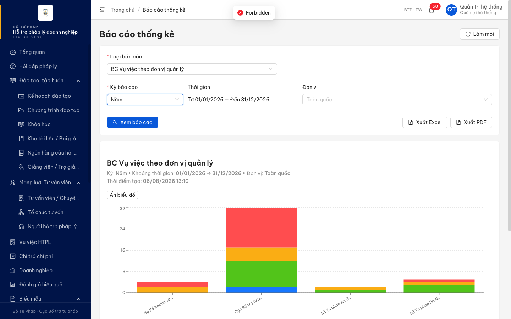
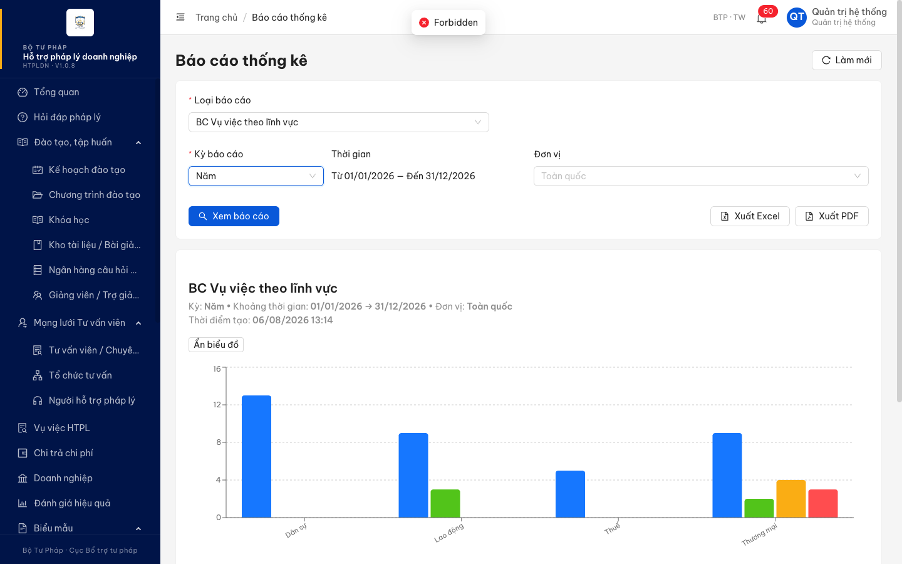
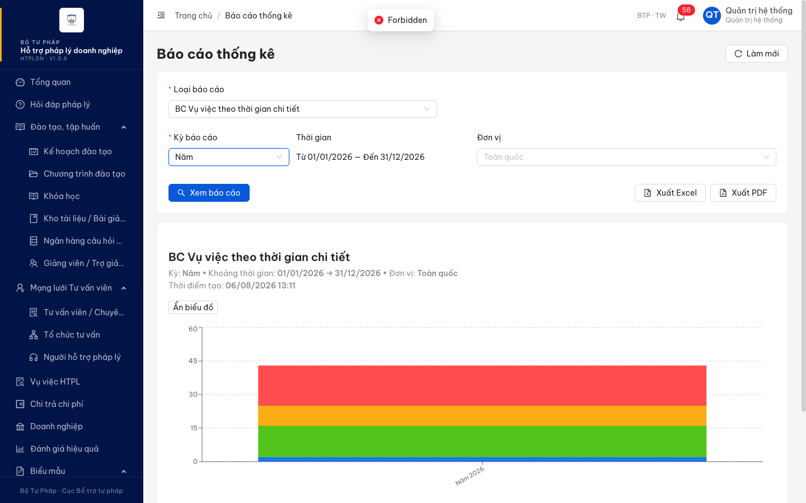

# Bug Report — Báo cáo thống kê (nhóm B2 — xuất tệp .xlsx)

| Thông tin | Giá trị |
|-----------|---------|
| **Dự án** | PM HTPLDN — UAT đối tác |
| **Môi trường** | https://18.143.165.120.nip.io — bản dựng **HTPLDN · V1.0.8** (`assets/index-CNwX9JjX.js`) |
| **Người test** | QA Automation (Chrome DevTools MCP) |
| **Ngày** | 2026-08-06 13:22:00 |
| **Loại test** | Re-verify bug dev báo đã fix (nhóm B2 — 5 phiếu, lỗi xuất tệp) |
| **Round** | Verify 2026-08-06 |
| **Tài liệu tham chiếu** | `../tieuchi/` (5 file tiêu chí viết trước khi mở màn) · `Docs-PM-HTPLDN/_bmad-output/planning-artifacts/srs-v3.5/srs-fr-11-bao-cao.md` |

---

## Tổng hợp

Đo lại 5 phiếu B2 (VVDHTHT_06 · VVTDVQL_06 · VVTLV_05 · VVTLHDN_05 · VVTTGCT_05) trên V1.0.8, mỗi phiếu 3 dạng dữ liệu (vai trò QTHT · vai trò CB_NV_TW · đổi bộ lọc).

Kết quả tách bạch được hai chuyện mà các vòng trước gộp làm một:

- Với **vai trò đặc tả nêu đích danh** (CB Nghiệp vụ TW): xuất tệp **chạy đúng và đủ** ở cả 5 loại báo cáo — tệp về máy, tên tệp đúng khuôn, 4 mục đầu tệp đủ, số liệu khớp màn hình, tệp bám bộ lọc hiện tại.
- Với **vai trò đối tác đã dùng** (QTHT — cả 10 ảnh bằng chứng đều ghi *Quản trị viên · QTHT*): cả 5 loại báo cáo đều bị máy chủ từ chối `HTTP 403 / ERR-PERM-SYS-00-01 / "Forbidden"`, không có tệp nào về máy.

⇒ 5 phiếu B2 chấm **cần BA** (câu hỏi ở [`ba-confirm/cau-hoi-BA.md`](../../reverify-week-5/ba-confirm/cau-hoi-BA.md)), **không** chấm Pass và **không** chấm Reopen.

Trong lúc đo phát sinh **1 lỗi có SRS reference cụ thể**, đúng đặc tả bị vi phạm bất kể BA chốt hướng nào — log dưới đây.

### Severity breakdown

| Tổng | Critical | Major | Medium | Minor | Trivial | Closed | Open |
|------|----------|-------|--------|-------|---------|--------|------|
| 1    | 0        | 0     | 1      | 0     | 0       | 0      | 1    |

## Bug Summary Table

| Bug ID | Severity | Priority | Type | TC Ref | **SRS Reference** | Title | Status |
|--------|----------|----------|------|--------|-------------------|-------|--------|
| BUG-BCTK-QA01 | Medium | P2 | UI/UX | VVDHTHT_06, VVTDVQL_06, VVTLV_05, VVTLHDN_05, VVTTGCT_05 | `srs-fr-11-bao-cao.md:117` (E7 · ERR-RPT-05) | Bị từ chối quyền khi xuất báo cáo thì màn hình chỉ hiện chữ tiếng Anh `Forbidden`, không phải câu thông báo tiếng Việt mà đặc tả quy định | Open |

---

## BUG-BCTK-QA01 — Từ chối quyền khi xuất báo cáo hiện chữ tiếng Anh `Forbidden` thay cho câu thông báo tiếng Việt theo đặc tả

### Mô tả

Trên màn **Báo cáo thống kê**, khi máy chủ từ chối thao tác **[Xuất Excel]** vì lý do quyền, giao diện hiện đúng một chữ tiếng Anh **`Forbidden`**. Đặc tả `srs-fr-11-bao-cao.md:117` quy định tình huống *"Không có quyền"* của màn này phải báo cho người dùng bằng câu tiếng Việt cho biết họ không có quyền xem báo cáo. Người dùng cuối là cán bộ nghiệp vụ, đọc `Forbidden` không hiểu chuyện gì xảy ra và cũng không biết phải làm gì tiếp.

### Các bước tái hiện

1. Đăng nhập tài khoản `admin` — vai trò **QTHT**, cấp TW, đơn vị Cục Bổ trợ tư pháp. Theo ma trận quyền `Docs-PM-HTPLDN/_bmad-output/planning-artifacts/srs-v3.5/srs-v3.5.md:1335`, QTHT có quyền `R` trên thực thể `BAO_CAO` — tức **được xem** màn báo cáo; phần mềm cũng cho vào màn và render báo cáo bình thường.
2. Vào **Báo cáo thống kê** (`/bao-cao`).
3. Chọn *Loại báo cáo* = **BC Vụ việc đã hoàn thành**, *Kỳ báo cáo* = **Năm** (tự điền 01/01/2026 – 31/12/2026), *Đơn vị* = **Cục Bổ trợ tư pháp - Bộ Tư pháp (BTP-TW)**.
4. Bấm **[Xem báo cáo]** — báo cáo render đầy đủ, nút **[Xuất Excel]** bật lên.
5. Bấm **[Xuất Excel]**.
6. Quan sát: khung thông báo hiện `Đang tạo file...` rồi đổi thành **`Forbidden`**; không có tệp nào tải về.

*(Tái hiện y hệt ở cả 5 loại báo cáo nhóm vụ việc: theo đơn vị quản lý · theo lĩnh vực · theo loại hình DN · theo thời gian chi tiết.)*

### Kết quả mong đợi

- Theo `srs-fr-11-bao-cao.md:117` (E7 — *Không có quyền*, mã `ERR-RPT-05`), khi thao tác bị từ chối vì lý do quyền, hệ thống phải báo cho người dùng bằng **tiếng Việt**, nội dung cho biết họ **không có quyền xem báo cáo này**.
- Câu thông báo phải nói được **lý do** để người dùng biết đây là vấn đề phân quyền chứ không phải lỗi hệ thống, và không cần thử lại vô ích.

### Kết quả thực tế

- Giao diện hiện đúng chữ **`Forbidden`** (tiếng Anh, một từ, không có ngữ cảnh).
- Máy chủ trả `HTTP 403` với thân phản hồi:

```json
{"success":false,"error":{"code":"ERR-PERM-SYS-00-01","message":"Forbidden","timestamp":"2026-08-06T06:20:00.981Z","requestId":"5d4d56a6-affb-4826-bdcc-adbed65cb6fc"}}
```

- Mã lỗi trả về là `ERR-PERM-SYS-00-01`. Tra toàn bộ thư mục đặc tả `Docs-PM-HTPLDN/_bmad-output/planning-artifacts/srs-v3.5/` **không có** mã này; mã mà đặc tả dành cho tình huống không có quyền ở màn báo cáo là `ERR-RPT-05` (`srs-fr-11-bao-cao.md:117`).
- Chữ trên khung thông báo được đọc trực tiếp từ DOM (`.ant-message-notice-wrapper` đang hiện trên màn) ngay tại thời điểm lỗi, không suy đoán từ mã HTTP.

### Bằng chứng

**1. Ảnh chụp**








**2. API response**

```
POST /api/v1/bao-cao/export   →   403
Request body: {"loaiBaoCao":"BC_VU_VIEC_THEO_LOAI_DN","kyBaoCao":"NAM","tuNgay":"2026-01-01","denNgay":"2026-12-31","filterDacThu":{},"formatXuat":"XLSX"}
Response body: {"success":false,"error":{"code":"ERR-PERM-SYS-00-01","message":"Forbidden",...}}
```

Thẻ đăng nhập kèm request (giải mã từ cookie `access_token`): `vaiTro:["QTHT"]`, `donViId:"00000000-0000-4000-8000-000000000001"`, `capDonVi:"TW"`.

**3. Dòng đã ghi lên bảng theo dõi**

Lỗi này không map được vào phiếu nào của đối tác (5 phiếu B2 nói về việc *xuất được hay không*, không nói về câu chữ khi từ chối) nên đã mở dòng mới ở tab `bug`:

| Mục | Giá trị |
|---|---|
| Dòng | **363** |
| Mã TC | `BCTK_QA01` |
| Tên chức năng | Báo cáo thống kê |
| Trạng thái | `Fail` · Dopai `bug` |
| Ảnh/vieo 1 | [ảnh 1 — BC Vụ việc đã hoàn thành](https://drive.google.com/file/d/1KHP-kpQKSir16lLO1EILicbASxx1mMqB/view?usp=drivesdk) · [ảnh 2 — BC theo đơn vị quản lý](https://drive.google.com/file/d/1albyXqamUBgsdLg-CwJ4anwViOwhuZi7/view?usp=drivesdk) |

### So sánh (Comparison)

| Vai trò | Vào màn `/bao-cao` | [Xem báo cáo] | [Xuất Excel] |
|---|---|---|---|
| CB_NV_TW (`cbnv_tw_02`) | ✅ | ✅ | ✅ tải được tệp .xlsx, tên tệp đúng khuôn |
| QTHT (`admin`) | ✅ | ✅ | ❌ 403 `ERR-PERM-SYS-00-01` — chữ hiện ra: `Forbidden` |

> Việc **QTHT có được phép xuất hay không** là câu hỏi riêng đang chờ BA ([`ba-confirm/cau-hoi-BA.md`](../../reverify-week-5/ba-confirm/cau-hoi-BA.md)) — lỗi log ở đây chỉ nói về **câu chữ khi từ chối**, đúng sai của việc từ chối không ảnh hưởng tới lỗi này: nếu BA chốt QTHT không được xuất thì câu từ chối vẫn phải theo `:117`; nếu BA chốt QTHT được xuất thì câu `Forbidden` vẫn sai với mọi vai trò khác thật sự không có quyền trên `BAO_CAO` (DN · NHT · TVV · CG — `srs-v3.5.md:1335` ghi `—`).

---

## Phụ lục — Môi trường test

| Thành phần | Giá trị |
|------------|---------|
| URL ứng dụng | https://18.143.165.120.nip.io |
| OTP login | Lấy từ MailHog (không có mã bypass trên env này) |
| MailHog (OTP inbox) | http://18.143.165.120:8025 |
| API base | https://18.143.165.120.nip.io/api/v1 |
| Frontend | React + Ant Design (v6 DOM: `.ant-select-content` / `.ant-select-input`) |
| Xác thực | JWT (cookie `access_token`) + OTP qua email |
| Tool test | Chrome DevTools MCP |
| Tài khoản dùng | `admin` / `Secret@123` (QTHT) · `cbnv_tw_02` / `Test@1234` (CB_NV_TW) |

---

*Bug report generated: 2026-08-06 13:22:00 | QA Automation via Claude Code*
