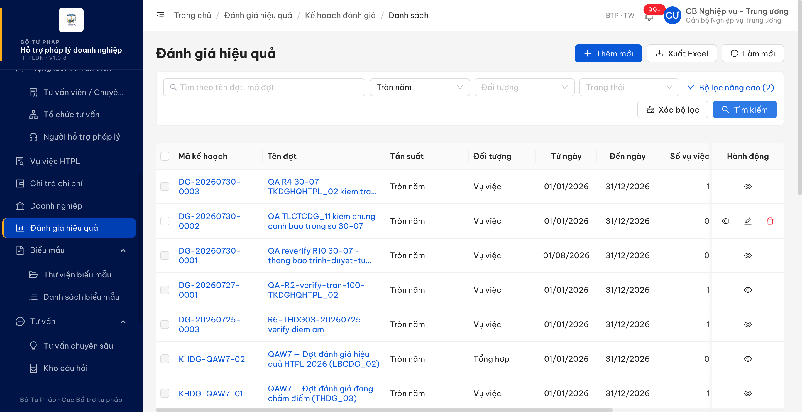
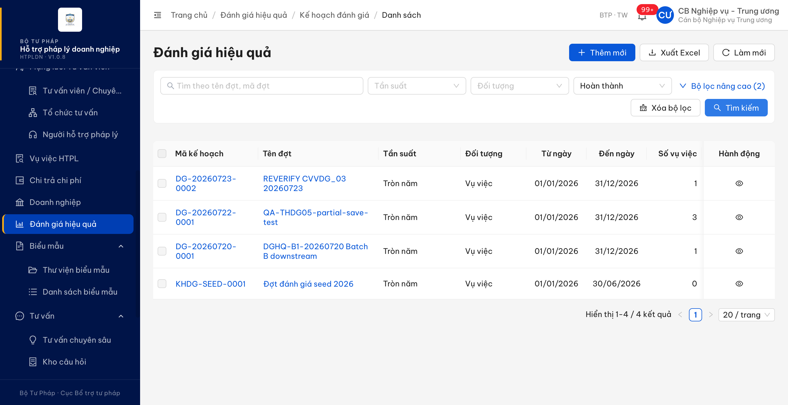
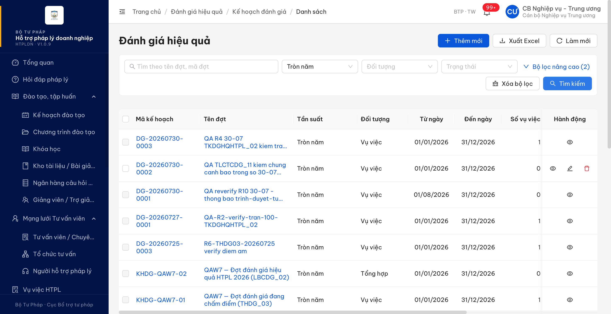
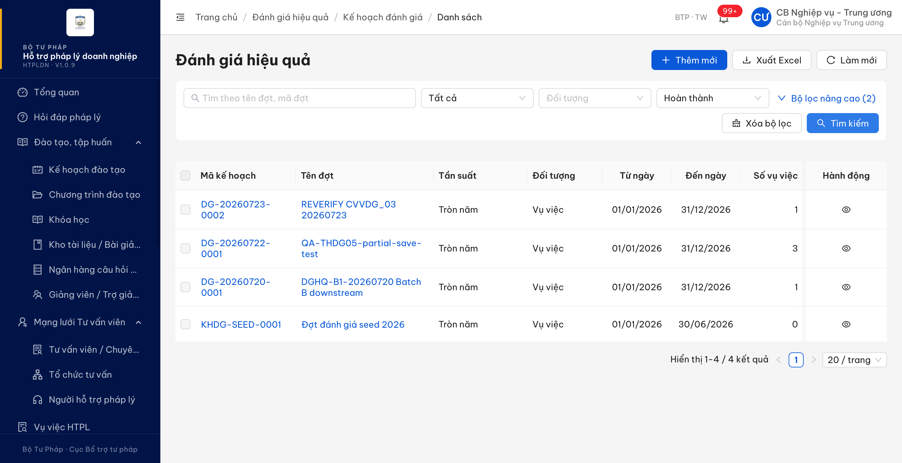
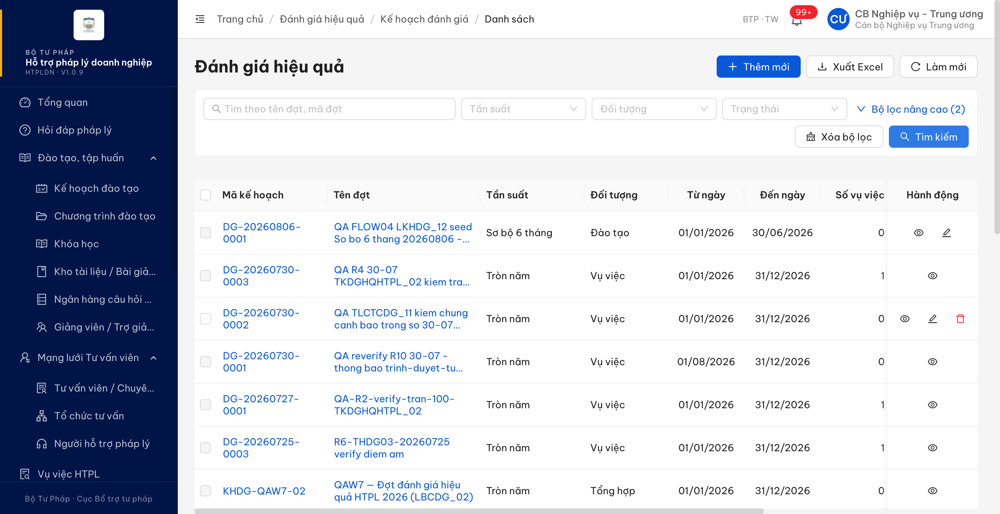
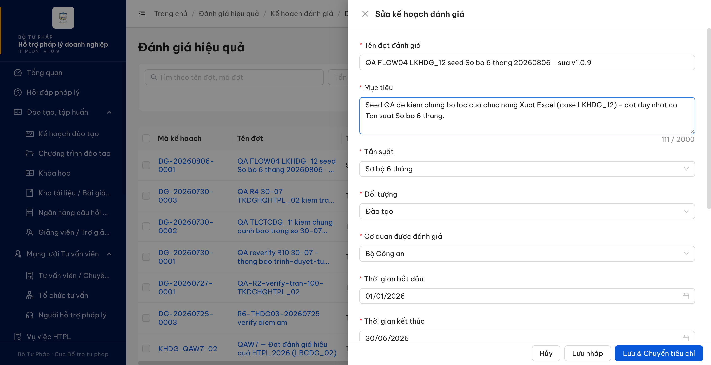
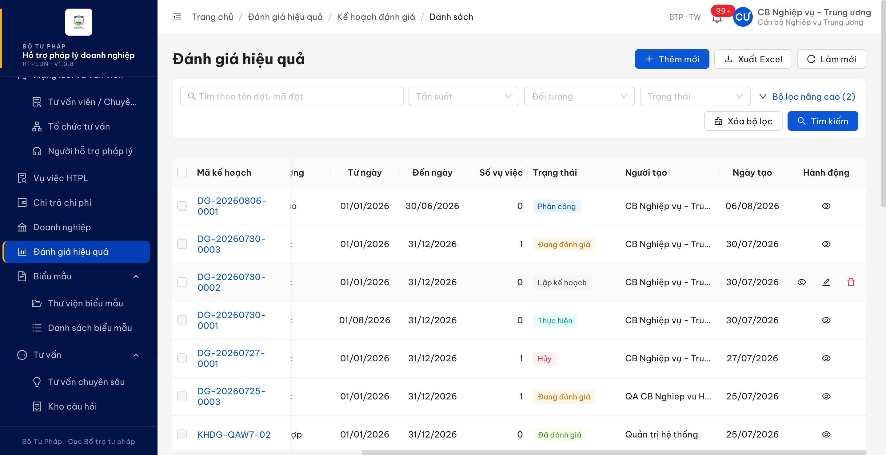

# Bug Report — LKHDG (Đánh giá hiệu quả · Kế hoạch đánh giá)

| Thông tin | Giá trị |
|-----------|---------|
| **Dự án** | PM HTPLDN |
| **Môi trường** | https://18.143.165.120.nip.io — **R3 (07/08)** đo trên bản dựng **HTPLDN · V1.0.9**, gói mã `assets/index-DsMHK7Dp.js` (`GET /` last-modified `Thu, 06 Aug 2026 18:51:25 GMT`, etag `W/"6a74d7ad-428"`). Vòng 06/08 đo trên **V1.0.8** / `assets/index-DThrFe1_.js` |
| **Người test** | QA Automation (Chrome DevTools MCP) |
| **Ngày** | 2026-08-07 02:21:00 |
| **Loại test** | Re-verify sau dev fix (FLOW 04) |
| **Round** | Đợt verify bug `Dopai=dev done` + `Trạng thái dev fix=Fixed` |
| **Tài liệu tham chiếu** | `Docs-PM-HTPLDN/_bmad-output/planning-artifacts/srs-v3.5/` · tiêu chí `../tieuchi/LKHDG_12.md` + `../tieuchi/LKHDG_16.md` · bảng `1OKBN2otlmdZ44…` tab `bug` dòng 126 + 127 |

> 🔴 **Hiệu lực:** đo trên **env dev**, không phải env nghiệm thu của đối tác (`htpldn-uat.ospgroup.vn`, bản
> dựng V1.0 trong bằng chứng). Vế nào ghi "đã hết lỗi" thì mới chỉ hết **trên bản dựng V1.0.8 của env dev** —
> chưa có hiệu lực cho tới khi bản dựng này lên env đối tác.

---

## Tổng hợp

> **Snapshot LATEST — R3 · 2026-08-07 · bản dựng V1.0.9 / `assets/index-DsMHK7Dp.js`:** cả **2/2** bug **ĐÃ ĐÓNG**.
> `LKHDG_12` — tệp xuất nay đúng tập đã lọc (19 dòng ↔ màn 19 · 4 dòng ↔ màn 4, trùng khít từng mã, 2 tệp khác kích thước).
> `LKHDG_16` — đợt *Phân công* nay có lối vào sửa, lưu thật và `PATCH` trả 200 (vòng trước 409); 2 mục BA chốt 06/08
> (`:852` Cơ quan được đánh giá, `:854` Tài liệu đính kèm có [Xem] [Xóa]) vẫn đủ, không hồi quy vế (a)(b)(c).
> Bảng GAP trống ở cả 2 case. **Open 0 · Closed 2.** Nhật ký đo: `../../reverify-week-5/F3-devfix-2026-08-07/do/`.

### Severity breakdown

| Tổng | Critical | Major | Medium | Minor | Trivial | Closed | Open |
|------|----------|-------|--------|-------|---------|--------|------|
| 2    | 0        | 2     | 0      | 0     | 0       | **2**  | **0** |

## Bug Summary Table

| Bug ID | Severity | Priority | Type | TC Ref | **SRS Reference** | Title | Status |
|--------|----------|----------|------|--------|-------------------|-------|--------|
| ~~BUG-LKHDG-EXPORT-FILTER~~ | Major | P1 | Data | LKHDG_12 (dòng 126) | `srs-v3.5.md:5570` (BR-DATA-06) · `srs-fr-08-danh-gia.md:823` | Xuất Excel danh sách đợt đánh giá không áp bộ lọc đang bật | **Closed** |
| ~~BUG-LKHDG-SUA-PHANCONG~~ | Major | P2 | Function | LKHDG_16 (dòng 127) | `srs-fr-08-danh-gia.md:839` · `:161` · `:852` · `:854` | Không sửa được kế hoạch đánh giá khi đợt ở trạng thái Phân công | **Closed** |

---

## ~~BUG-LKHDG-EXPORT-FILTER~~ [CLOSED] — Xuất Excel danh sách đợt đánh giá không áp bộ lọc đang bật

> **Re-test:** 2026-08-07 02:12:30 R3 — ✅ PASS (Closed-verified) trên bản dựng `assets/index-DsMHK7Dp.js` (deploy 07/08 01:51 giờ VN; sidebar hiển thị V1.0.9 nhưng **nhãn này không dùng làm định danh được** — bó mã này MỚI HƠN bó mã của bản gắn nhãn V1.0.10). Lọc Tần suất *Tròn năm*: màn 19 → tệp **19 dòng**, trùng khít 19/19 mã, 8440 byte. Lọc Trạng thái *Hoàn thành* (URL `?trangThai=HOAN_THANH&page=1`, không còn `tanSuat=`): màn 4 → tệp **4 dòng**, trùng khít 4/4 mã, 7195 byte — **2 tệp khác kích thước**. Đường đo thứ hai: `GET` 4/19/20 bản ghi ↔ `POST …/export` 7195/8439/8559 byte (vòng trước đứng yên 8519/8519/8519). N = 20 · M = 5/5 dạng · bảng GAP trống. Nhật ký: `../../reverify-week-5/F3-devfix-2026-08-07/do/LKHDG_12.md`.

### Mô tả

Trên màn **Đánh giá hiệu quả → Kế hoạch đánh giá → Danh sách**, sau khi áp bộ lọc, nút **[Xuất Excel]** tạo tệp
chứa **toàn bộ** danh sách thay vì tập đã lọc. Giao diện gửi tham số lọc đi đúng (`?tanSuat=…` / `?trangThai=…`
nằm trong đường dẫn của yêu cầu xuất) nhưng tệp trả về không phản ánh tham số đó — sai lệch diễn ra **âm thầm**,
không có cảnh báo nào, nên người dùng rất dễ lấy nhầm số liệu vào báo cáo.

### Các bước tái hiện

1. Đăng nhập **`cbnv_tw`** — vai trò *CB Nghiệp vụ Trung ương*, có quyền "Quản lý đánh giá" theo
   `srs-fr-08-danh-gia.md:100`. Vào **Đánh giá hiệu quả** → danh sách hiện **20 kết quả**.
2. Chọn **Tần suất = "Tròn năm"** → bấm **[Tìm kiếm]**. Chân bảng báo **"Hiển thị 1-19 / 19 kết quả"**,
   URL `…/danh-gia/ke-hoach/danh-sach?tanSuat=TRON_NAM&page=1`.
3. Bấm **[Xuất Excel]** → mở tệp, đếm số dòng dữ liệu và liệt kê cột "Mã KH".
4. Bấm **[Xóa bộ lọc]**, rồi lọc ở **cột khác**: **Trạng thái = "Hoàn thành"** → **[Tìm kiếm]**.
   Chân bảng báo **"Hiển thị 1-4 / 4 kết quả"**. Bấm **[Xuất Excel]**, đếm lại.
5. Quan sát: cả 2 lượt tệp đều **20 dòng** và **cùng kích thước byte**.

### Kết quả mong đợi

- Theo **BR-DATA-06** (`srs-v3.5.md:5570` — *"File xuất theo bộ lọc hiện tại"*, áp dụng *"Toàn bộ CRUD list"*,
  ngoại lệ chỉ nêu báo cáo nhóm IX), tệp xuất phải chứa **đúng tập bản ghi đang hiển thị sau khi lọc**.
- Lượt 1 (`tanSuat=TRON_NAM`): tệp phải có **19** dòng dữ liệu, trùng khít 19 mã trên màn.
- Lượt 2 (`trangThai=HOAN_THANH`): tệp phải có **4** dòng dữ liệu — `DG-20260723-0002`, `DG-20260722-0001`,
  `DG-20260720-0001`, `KHDG-SEED-0001`.

### Kết quả thực tế

- **Lượt 1** — màn 19 kết quả, tệp **20 dòng**, có `DG-20260806-0001` (Tần suất *Sơ bộ 6 tháng*) là mã **không
  thuộc** tập sau lọc. Cột Tần suất trong tệp chứa cả 2 giá trị `["Sơ bộ 6 tháng","Tròn năm"]`. Tệp 8520 byte.
- **Lượt 2** — màn 4 kết quả, tệp vẫn **20 dòng**, cột Trạng thái trong tệp chứa **đủ 7 giá trị**
  `["Lập kế hoạch","Đang đánh giá","Thực hiện","Hủy","Đã đánh giá","Chờ phê duyệt","Hoàn thành"]`.
  Tệp **8520 byte — y hệt lượt 1**.
- **Đối chứng bằng phương pháp thứ hai** (gọi thẳng API cùng chuỗi truy vấn): danh sách lọc **đúng** nhưng tệp
  xuất **không đổi** ở cả 3 trường hợp, kể cả khi không lọc:

  | Chuỗi truy vấn | `GET /ke-hoach-danh-gias` | `POST /ke-hoach-danh-gias/export` |
  |---|---:|---:|
  | `?trangThai=HOAN_THANH&page=1&pageSize=20` | 200 · **4** bản ghi | 200 · **8519 byte** |
  | `?tanSuat=TRON_NAM&page=1&pageSize=20` | 200 · **19** bản ghi | 200 · **8519 byte** |
  | `?page=1&pageSize=20` (không lọc) | 200 · **20** bản ghi | 200 · **8519 byte** |

- **Hai vế còn lại đã hết lỗi** (ghi nhận, không tính vào verdict vì đặc tả im lặng — xem `../tieuchi/LKHDG_12.md`
  mục 2 và 4): tiêu đề tệp nay đủ **10 cột** `Mã KH · Tên đợt · Tần suất · Đối tượng · **Số vụ việc** · Từ ngày ·
  Đến ngày · Trạng thái · **Người tạo** · **Ngày tạo**`, và nhãn ghi tiếng Việt có dấu (`"Sơ bộ 6 tháng"`,
  `"Lập kế hoạch"`, `"Vụ việc"`) thay cho mã enum thô `SO_BO_6_THANG` / `LAP_KE_HOACH` / `VU_VIEC`.

### Bằng chứng

**1. Ảnh chụp**:





**2. Nội dung tệp xuất đã đọc** — giải nén tệp `.xlsx` ngay trong trang (EOCD + `DecompressionStream`), đọc
`xl/worksheets/sheet1.xml` + `xl/sharedStrings.xml`:

**3. Bằng chứng vòng R3 (2026-08-07, V1.0.9) — đã hết lỗi:**





```json
{
  "R3_2026-08-07_V109_luot1_tanSuat_TRON_NAM": { "manHinh": 19, "tepDataRows": 19, "bytes": 8440,
    "tanSuatTrongTep": ["Tròn năm"], "maThua": [] },
  "R3_2026-08-07_V109_luot2_trangThai_HOAN_THANH": { "manHinh": 4, "tepDataRows": 4, "bytes": 7195,
    "maTrongTep": ["DG-20260723-0002","DG-20260722-0001","DG-20260720-0001","KHDG-SEED-0001"] }
}
```

---

**Số đo vòng 06/08 (V1.0.8) — giữ để đối chiếu:**

```json
{
  "luot1_tanSuat_TRON_NAM": { "manHinh": 19, "tepDataRows": 20, "bytes": 8520,
    "tanSuatTrongTep": ["Sơ bộ 6 tháng", "Tròn năm"],
    "maThua": ["DG-20260806-0001"] },
  "luot2_trangThai_HOAN_THANH": { "manHinh": 4, "tepDataRows": 20, "bytes": 8520,
    "trangThaiTrongTep": ["Lập kế hoạch","Đang đánh giá","Thực hiện","Hủy","Đã đánh giá","Chờ phê duyệt","Hoàn thành"] },
  "header": ["Mã KH","Tên đợt","Tần suất","Đối tượng","Số vụ việc","Từ ngày","Đến ngày","Trạng thái","Người tạo","Ngày tạo"]
}
```

---

## ~~BUG-LKHDG-SUA-PHANCONG~~ [CLOSED] — Không sửa được kế hoạch đánh giá khi đợt ở trạng thái Phân công

> **Re-test:** 2026-08-07 02:21:00 R3 — ✅ PASS (Closed-verified) trên bản dựng `assets/index-DsMHK7Dp.js` (deploy 07/08 01:51 giờ VN; sidebar hiển thị V1.0.9 nhưng **nhãn này không dùng làm định danh được** — bó mã này MỚI HƠN bó mã của bản gắn nhãn V1.0.10). Đợt *Phân công* `DG-20260806-0001` nay có thao tác **Sửa** trên danh sách (2 thao tác, không Xóa — đúng `:839`); mở khung Sửa đổi Ghi chú → lưu → **mở lại thấy giá trị mới** `QA-LKHDG16-PC-20260807-0215`, đợt vẫn ở `PHAN_CONG`, tệp đính kèm không mất. Đường đo thứ hai: `PATCH /api/v1/ke-hoach-danh-gias/{id}` trả **200**, `version` 5→6 (vòng trước **409** `ERR-BIZ-XI-01-02`) ⇒ **UI và máy chủ cùng thông**, không phải fix nửa vời. Không hồi quy vế (a)(b)(c) ở *Lập kế hoạch*; 2 mục BA chốt 06/08 (`:852`, `:854` có [Xem] [Xóa]) vẫn đủ. Đo cả `LAP_KE_HOACH` và `PHAN_CONG`; M = 2/3 dạng (**có dạng 3 quyết định**; thiếu dạng 1 *LKH·đúng 1 tệp* — không tạo GAP, xem nhật ký §7). Bảng GAP trống. Nhật ký: `../../reverify-week-5/F3-devfix-2026-08-07/do/LKHDG_16.md`.

### Mô tả

Đặc tả cho phép sửa kế hoạch đánh giá ở **hai** trạng thái *Lập kế hoạch* và *Phân công*. Trên bản dựng V1.0.8,
khi đợt chuyển sang **Phân công** thì mọi lối vào chỉnh sửa đều biến mất: hàng trong danh sách chỉ còn thao tác
xem, màn chi tiết không có ô nhập nào cho khối thông tin kế hoạch, và yêu cầu cập nhật gửi thẳng tới máy chủ bị
từ chối. Vì luồng trạng thái không có đường quay ngược *Phân công → Lập kế hoạch*, một sai sót nhỏ trong thông
tin kế hoạch (tên đợt, mục tiêu, thời gian, tệp đính kèm) trở nên **không sửa được nữa** sau khi đã phân công —
người dùng chỉ còn cách hủy cả đợt và lập lại.

### Các bước tái hiện

1. Đăng nhập **`cbnv_tw`** (*CB Nghiệp vụ Trung ương*, `BTP · TW`). Vào **Đánh giá hiệu quả → Kế hoạch đánh giá**.
2. Mở một đợt đang ở **Lập kế hoạch** (dùng `DG-20260806-0001`), tab **Tiêu chí** → *Nhập từ danh mục* → chọn
   nhóm "Hiệu quả HTPL" (4 tiêu chí, tổng trọng số 100%) → đặt **Điểm tối đa = 100** cho từng tiêu chí → **[Lưu]**.
3. Sang tab **Phân công** → **[Thêm người đánh giá]** → chọn 1 người, vai trò *Trưởng nhóm* → **[Thêm mới]**.
   Đợt chuyển sang trạng thái **Phân công**.
4. Quay lại **Danh sách**, tìm đúng đợt đó, xem cột **Hành động**.
5. Mở **Xem chi tiết** của đợt, tìm lối vào chỉnh sửa khối "Thông tin kế hoạch".
6. Đối chứng bằng phương pháp thứ hai: gửi yêu cầu cập nhật đợt thẳng tới máy chủ
   (`PATCH /api/v1/ke-hoach-danh-gias/{id}`) với một thay đổi hợp lệ ở trường Ghi chú.

### Kết quả mong đợi

- Theo `srs-fr-08-danh-gia.md:839` — *"| 18 | table | Hành động | icon-group | Xem / **Sửa (chỉ
  LAP_KE_HOACH/PHAN_CONG)** / Xóa (chỉ LAP_KE_HOACH) | click → tương ứng | Luôn |"* — đợt ở trạng thái **Phân
  công** vẫn phải có lối vào chỉnh sửa như đợt ở *Lập kế hoạch*.
- Theo `srs-fr-08-danh-gia.md:161` — *"**Given** CB NV chỉnh sửa KH **chưa duyệt** **When** thay đổi **Then**
  validate + lưu"*. Đợt ở *Phân công* là đợt **chưa duyệt** (việc duyệt phân công diễn ra ở bước *Chờ duyệt PC →
  Thực hiện*, `srs-fr-08-danh-gia.md:1193`), nên vẫn thuộc diện được sửa.
- Đây cũng đúng bằng kỳ vọng đối tác ghi ở cột "Kết quả mong đợi" của chính phiếu `LKHDG_16`: *"Chỉ hiển thị khi
  đợt đang ở trạng thái 'Lập kế hoạch' **hoặc 'Phân công'**, và Cán bộ nghiệp vụ thuộc đơn vị sở hữu đợt."*

### Kết quả thực tế

Đợt `DG-20260806-0001` sau khi chuyển sang **Phân công** (vẫn thuộc đơn vị của tài khoản, vẫn còn 1 tệp đính kèm):

| Nơi kiểm tra | Đợt *Lập kế hoạch* (`DG-20260730-0002`) | Đợt *Phân công* (`DG-20260806-0001`) |
|---|---|---|
| Cột **Hành động** trên danh sách | Xem · **Sửa** · Xóa | **chỉ Xem** |
| Màn **Xem chi tiết** | không có lối sửa (sửa vốn mở từ danh sách) | không có lối sửa; nút duy nhất là **[Hủy đợt]**; **0** ô nhập cho khối "Thông tin kế hoạch" |
| `PATCH /api/v1/ke-hoach-danh-gias/{id}` | lưu được (đã dùng ở phần đo vế (a)) | **HTTP 409** · `ERR-BIZ-XI-01-02` · *"Không thể cập nhật kế hoạch ở trạng thái 'PHAN_CONG'"* |

- Giao diện và máy chủ **thống nhất với nhau** (không phải lỗi ẩn nút): máy chủ chặn theo trạng thái, giao diện
  giấu nút theo đúng cách chặn đó. Nghĩa là cả hệ thống đang áp một luật *"chỉ sửa được ở Lập kế hoạch"* — khác
  với luật ghi trong đặc tả.
- Mã lỗi `ERR-BIZ-XI-01-02` **không tồn tại trong đặc tả v3.5** (đã grep toàn thư mục
  `Docs-PM-HTPLDN/_bmad-output/planning-artifacts/srs-v3.5/`, không có chuỗi `ERR-BIZ-XI`).
- Đặc tả **không tự mâu thuẫn** ở điểm này: chỉ có 2 dòng nói về việc sửa kế hoạch (`:839` và `:161`), và cả hai
  đều cho phép sửa ở *Phân công*. Không có dòng nào giới hạn việc sửa vào riêng *Lập kế hoạch*.
- Luồng trạng thái `SM-DANHGIA` — bảng chuyển trạng thái đầy đủ ở `srs-fr-08-danh-gia.md:1190-1199` — **không có**
  đường *Phân công → Lập kế hoạch*. Đường duy nhất rời khỏi *Phân công* mà không đi tiếp là hủy cả đợt (`:1199`),
  nên không có cách nào lùi về trạng thái sửa được.

### Bằng chứng

**Vòng R3 (2026-08-07, V1.0.9) — đã hết lỗi:**



![LKHDG_16 R3 — khung Sửa của đợt Phân công: có mục "Cơ quan được đánh giá" (Bộ Công an) và "Tài liệu đính kèm" liệt kê QA-LKHDG16-ke-hoach.pdf (398 B) kèm [Xem] [Xóa]](image/LKHDG_16-R3-02-drawer-sua-dot-PhanCong-co-CoQuanDG-va-tep-dinh-kem-V109.png)



![LKHDG_16 R3 — khung Sửa đợt Lập kế hoạch DG-20260730-0002: 2 tệp khác định dạng .docx + .pdf, mỗi tệp có [Xem] [Xóa]](image/LKHDG_16-R3-04-drawer-sua-dot-LapKeHoach-2tep-khac-dinh-dang-V109.png)

Phản hồi máy chủ vòng R3 khi gửi yêu cầu cập nhật ở trạng thái `PHAN_CONG` (cùng phiên đăng nhập `cbnv_tw`):

```json
{"success":true,"data":{"id":"a7d1b311-0a3e-4cd9-bb6b-fb92437df902","version":6,
 "trangThai":"PHAN_CONG","maKeHoach":"DG-20260806-0001",
 "ghiChu":"QA-LKHDG16-PC-API-20260807-0218"}}
```

**Ảnh lỗi cũ vòng 06/08 (V1.0.8) — giữ để đối chiếu:**



Phản hồi máy chủ khi gửi yêu cầu cập nhật (phương pháp thứ hai, cùng phiên đăng nhập `cbnv_tw`):

```json
{"success":false,"error":{"code":"ERR-BIZ-XI-01-02",
 "message":"Không thể cập nhật kế hoạch ở trạng thái 'PHAN_CONG'",
 "timestamp":"2026-08-06T01:30:21.600Z","requestId":"af4af97e-f6ab-40bb-9985-b2d615ef5cb3"}}
```

### So sánh với ba vế đối tác nêu (đo trên trạng thái *Lập kế hoạch*)

| Vế đối tác nêu | Hiện trạng V1.0.8 | Bằng chứng |
|---|---|---|
| (a) "Các trường thông tin không được chỉnh sửa" | **Hết lỗi.** [Sửa] mở khung nhập với đủ 9 mục, tất cả nhập/đổi được và đã nạp sẵn giá trị cũ; đổi rồi lưu thì mở lại thấy giá trị mới (bản ghi lên `version` 3, dấu `QA-LKHDG16-EDIT-20260806-0830`) | `image/LKHDG_16-B-drawer-sua-6-truong-nhap-duoc-da-nap-san-V108.png` · `image/LKHDG_16-C-drawer-sua-dot-1-tep-ghichu-da-luu-V108.png` |
| (b) "Breadcrumb hiển thị … / Chi tiết" | **Hết lỗi.** [Sửa] không còn rời màn Danh sách — đường dẫn giữ nguyên *"Trang chủ / Đánh giá hiệu quả / Kế hoạch đánh giá / Danh sách"*, khung nhập ghi rõ tiêu đề *"Sửa kế hoạch đánh giá"* | ảnh (b), (c) ở trên |
| (c) "Không hiển thị danh sách các tệp đính kèm mặc dù tồn tại dữ liệu" | **Hết lỗi.** Khung Sửa liệt kê đủ tệp kèm kích thước và thao tác [Xem] [Xóa] — đo trên cả đợt 1 tệp và đợt 2 tệp khác định dạng. Lưu form (không đụng vùng đính kèm) **không làm mất tệp**: sau lưu vẫn đủ `.docx` + `.pdf` | `image/LKHDG_16-A-man-chitiet-co-2-tep-dinh-kem-V108.png` · `image/LKHDG_16-C-drawer-sua-dot-1-tep-ghichu-da-luu-V108.png` |

---

## Khối CÁCH VERIFY sau Dev fix — `LKHDG_12`

```
── CÁCH VERIFY sau Dev fix ──
Precondition: tài khoản `cbnv_tw` (CB Nghiệp vụ Trung ương, Test@1234) + màn
  https://18.143.165.120.nip.io/danh-gia/ke-hoach/danh-sach.
  Danh sách phải có ≥2 giá trị khác nhau ở cột định lọc (nếu mọi đợt cùng Tần suất thì phải
  tạo thêm 1 đợt khác Tần suất, nếu không thì phép đo vô nghĩa).
1) Ghi lại tổng số kết quả khi CHƯA lọc (đọc ở chân bảng "Hiển thị 1-N / N kết quả").
2) Chọn Tần suất = "Tròn năm" → bấm [Tìm kiếm]. Ghi lại số kết quả sau lọc = n_lọc (phải < tổng).
3) Bấm [Xuất Excel] → mở tệp, đếm số dòng dữ liệu (không kể dòng tiêu đề) và liệt kê cột "Mã KH".
4) Lặp lại bước 2-3 với cột lọc KHÁC: [Xóa bộ lọc] rồi Trạng thái = "Hoàn thành".
✅ PASS khi: cả 2 lượt, số dòng dữ liệu trong tệp = đúng n_lọc của lượt đó, VÀ tập "Mã KH"
   trong tệp trùng khít tập mã đang hiện trên màn (so từng mã, không chỉ so số lượng).
❌ FAIL nếu: tệp chứa ≥1 mã không thuộc tập sau lọc, hoặc số dòng ≠ n_lọc, hoặc 2 lượt lọc
   khác nhau lại cho 2 tệp cùng kích thước byte.
⚠️ Đừng chấm Fail vì tệp thiếu cột hay vì định dạng nhãn — đặc tả không quy định tập cột của
   tệp xuất; chỉ chấm đúng phần "theo bộ lọc hiện tại" của BR-DATA-06.
⚠️ Đừng kết luận "đã fix" khi chỉ thấy đường dẫn yêu cầu xuất CÓ mang tham số lọc — giao diện
   gửi đúng tham số ngay cả khi đang lỗi (lượt này URL có `?trangThai=HOAN_THANH` mà tệp vẫn
   20 dòng); phải mở tệp đếm dòng.
Ảnh lỗi cũ: image/LKHDG_12-luot1-man-loc-TronNam-19ketqua-V108.png
            image/LKHDG_12-luot2-man-loc-HoanThanh-4ketqua-V108.png
```

**Chủ việc tiếp theo:** — (bug đã đóng R3 2026-08-07 trên bản dựng V1.0.9; còn cần xác nhận lại khi bản dựng lên env nghiệm thu của đối tác).

---

## Khối CÁCH VERIFY sau Dev fix — `LKHDG_16`

```
── CÁCH VERIFY sau Dev fix ──
Precondition: tài khoản `cbnv_tw` (CB Nghiệp vụ Trung ương, Test@1234) + màn
  https://18.143.165.120.nip.io/danh-gia/ke-hoach/danh-sach.
  Cần MỘT đợt ở trạng thái "Phân công" thuộc đơn vị của tài khoản và có >=1 tệp đính kèm.
  Chưa có thì tự dựng (đây là tiền đề TẠO ĐƯỢC, không phải blocker):
    a) mở đợt "Lập kế hoạch" -> tab Tiêu chí -> [Nhập từ danh mục] -> chọn nhóm "Hiệu quả HTPL"
       (4 tiêu chí, tổng trọng số 100%) -> sửa cột "Điểm tối đa" = 100 cho từng dòng -> [Lưu];
    b) tab Phân công -> [Thêm người đánh giá] -> chọn 1 người + vai trò -> [Thêm mới].
  Nếu bỏ bước (a) thì bước (b) bị chặn bởi guard "tổng điểm tối đa có trọng số phải = 100".
1) Ở màn Danh sách, tìm đợt đang "Lập kế hoạch": ghi lại cột Hành động có mấy thao tác.
2) Tìm đợt đang "Phân công": ghi lại cột Hành động có mấy thao tác. So với bước 1.
3) Mở [Sửa] của đợt "Phân công" (nếu có): đổi 1 trường bất kỳ rồi lưu, sau đó MỞ LẠI đối chiếu.
4) Đối chứng bằng đường thứ hai: gửi PATCH /api/v1/ke-hoach-danh-gias/{id} đổi trường Ghi chú,
   ghi lại mã HTTP + error.code.
✅ PASS khi: đợt "Phân công" vào được chế độ sửa, đổi rồi lưu thì mở lại thấy giá trị mới,
   VÀ yêu cầu cập nhật ở bước 4 không bị từ chối vì lý do trạng thái.
❌ FAIL nếu: đợt "Phân công" không có lối vào sửa, hoặc lưu xong mở lại vẫn giá trị cũ,
   hoặc bước 4 trả 409 kèm thông điệp từ chối theo trạng thái.
⚠️ Đừng chấm Fail vì CHUỖI breadcrumb khác một mẫu cụ thể — đặc tả im lặng về breadcrumb màn Sửa;
   chỉ chấm "có rời khỏi ngữ cảnh Sửa hay không".
⚠️ Đừng kết luận "đã fix" khi chỉ thấy nút [Sửa] xuất hiện trở lại — phải bấm vào, đổi, lưu,
   rồi MỞ LẠI đối chiếu; và phải đo trên CẢ HAI trạng thái Lập kế hoạch và Phân công.
⚠️ Cảnh báo dụng cụ đo: bản dựng V1.0.8 dùng lớp CSS riêng (.ant-drawer-section, .ant-select-content,
   danh sách tệp KHÔNG dùng .ant-upload-list-item). Kịch bản đọc DOM theo tên lớp chuẩn sẽ báo
   "trống"/"0 tệp" ở chỗ THỰC TẾ CÓ dữ liệu -> luôn chốt bằng ảnh chụp đã mở xem + đọc lại bản ghi.
Ảnh lỗi cũ: image/LKHDG_16-D-hang-PhanCong-chi-con-nut-Xem-V108.png
```

**Chủ việc tiếp theo:** — (bug đã đóng R3 2026-08-07: máy chủ đã gỡ chặn cập nhật ở `PHAN_CONG` và giao diện đã hiện lại thao tác Sửa, đúng `:839` + `:161`. Còn cần xác nhận lại khi bản dựng lên env nghiệm thu của đối tác).

---

## Phụ lục — Môi trường test

| Thành phần | Giá trị |
|------------|---------|
| URL ứng dụng | https://18.143.165.120.nip.io |
| Bản dựng | HTPLDN · V1.0.8 · `assets/index-DThrFe1_.js` |
| OTP login | MailHog http://18.143.165.120:8025 |
| API base | https://18.143.165.120.nip.io/api/v1 |
| Tài khoản | `cbnv_tw` / `Test@1234` (CB_NV_TW, BTP · TW) |
| Khung nhìn | 1440×900 |
| Tool test | Chrome DevTools MCP |

---

*Bug report generated: 2026-08-06 08:50:00 · cập nhật R3: 2026-08-07 02:21:00 | QA Automation via Claude Code*
