# Bug Report — UAT Tuần 1 (vòng đầu, 5 phiếu Fail của đối tác + 1 dòng QA tự mở)

| Thông tin | Giá trị |
|-----------|---------|
| **Dự án** | PM HTPLDN — Trợ giúp pháp lý Doanh nghiệp |
| **Môi trường** | https://18.143.165.120.nip.io |
| **Người test** | QA Automation (Claude Code) |
| **Ngày** | 2026-07-31 00:52:00 |
| **Loại test** | Verify bug đối tác (vòng đầu) — Workflow / Validation |
| **Round** | Tuần 1 · vòng đầu |
| **Tài liệu tham chiếu** | [QA_VERIFY_PROTOCOL.md](../../QA_VERIFY_PROTOCOL.md) · SRS v3.5 `Docs-PM-HTPLDN/_bmad-output/planning-artifacts/srs-v3.5/` |

---

## Tổng hợp

Verify 5 phiếu tab `UAT_TGPL Doanh Nghiệp-tuần 1` có `Trạng thái 1 = Fail` và `Trạng thái dev fix 1` còn trống. Bảng dưới cập nhật dần theo tiến độ.

> **⚠️ Hệ thống được triển khai bản mới GIỮA phiên UAT.** Thanh bên đổi từ `HTPLDN · V1.0.2` → `HTPLDN · V1.0.3` lúc ~11:05 ngày 30/07/2026 (kèm 502 tạm thời ở request nền `/thong-baos/unread-count` và 1 lần phiên bị đưa về `/login`); 3 chương trình đào tạo có sẵn đều bị cập nhật hàng loạt cùng mốc `04:05:47.809Z` (UTC). Vì verdict ghi trước mốc đó dựa trên bản CŨ, **cả 5 phiếu đã được đo lại trên V1.0.3**: `BUG-TTCTDTTH_16` và `BUG-TTCTDTTH_17` **đã hết lỗi** (chuyển `Verify = Pass`, `Trạng thái dev fix 1 = dev done`); 3 bug còn lại **vẫn tái hiện nguyên**. Đề nghị thông báo trước khi deploy trong giờ UAT.

> **1 dòng QA tự mở ngoài phạm vi phiếu đối tác**: `TMHDVMPL_OOS_01` — tệp đính kèm **trùng tên không được tự đổi tên** `{tên}_1.{ext}` (`srs-fr-02-hoi-dap.md:108, :1070, :1125`). Nay đã lập thành bug entry đầy đủ trong bảng dưới; re-test 30/07 23:30 trên V1.0.3 → **đã hết lỗi**, verdict `Pass`.

### Severity breakdown

| Tổng | Critical | Major | Medium | Minor | Trivial | Closed | Open |
|------|----------|-------|--------|-------|---------|--------|------|
| 6    | 0        | 6     | 0      | 0     | 0       | 6      | 0    |

## Bug Summary Table

| Bug ID | Severity | Priority | Type | TC Ref | **SRS Reference** | Title | Status |
|--------|----------|----------|------|--------|-------------------|-------|--------|
| ~~BUG-TTCTDTTH_16~~ | Major | P1 | Workflow | TTCTDTTH_16 (row 236) | `srs-fr-03-dao-tao.md:2128, :2144` (SM-CTDT) · `FR-III-01 (UC20)` | Chương trình đào tạo không tự chuyển sang "Đang thực hiện" khi đã có khóa học con "Đang diễn ra" | Closed (dev fix trên V1.0.3, QA verify 30/07 11:30) |
| ~~BUG-TTCTDTTH_17~~ | Major | P1 | Workflow | TTCTDTTH_17 (row 237) | `srs-fr-03-dao-tao.md:2129, :2145, :2119` (SM-CTDT) · `FR-III-01 (UC20)` | Chương trình đào tạo không tự chuyển sang "Hoàn thành" khi mọi khóa học con đã "Hoàn thành" (cùng gốc BUG-TTCTDTTH_16) | Closed (dev fix trên V1.0.3, QA verify 30/07 11:30) |
| ~~BUG-QLDKDTTH_06~~ | Major | P1 | Validation | QLDKDTTH_06 (row 272) | `srs-fr-03-dao-tao.md:385, :426` · `:452` (định nghĩa "đang nhận đăng ký") · `FR-III-03 (UC22)` | Duyệt được đăng ký học viên dù khóa học đã đóng cửa sổ đăng ký — không có chốt kiểm nào chạy | Closed (dev fix, QA verify 30/07 22:52 trên bản triển khai mới) |
| ~~BUG-TMHDVMPL_12~~ | Major | P1 | Validation | TMHDVMPL_12 (row 277) | `srs-fr-02-hoi-dap.md:108, :1070, :1125` · `FR-II-01 (UC10)` / `SCR-II-01` | Ô "File đính kèm" của form Thêm mới hỏi đáp nhận tệp `.jpg` (và khai `.png`) ngoài danh sách định dạng đặc tả cho phép | Closed (dev fix, QA verify 30/07 23:12 trên V1.0.3) |
| ~~BUG-TMHDVMPL_16~~ | Major | P1 | Validation | TMHDVMPL_16 (row 278) | `srs-fr-02-hoi-dap.md:108, :1070, :1125` · `FR-II-01 (UC10)` / `SCR-II-01` | Không có chốt kiểm tổng dung lượng 100MB cho tệp đính kèm hỏi đáp — lưu được hồ sơ 159MB, và không hiển thị chỉ số tổng | Closed (dev fix, QA verify 30/07 23:25 trên V1.0.3) |
| ~~BUG-TMHDVMPL_OOS_01~~ | Major | P2 | Validation | TMHDVMPL_OOS_01 (row 279) | `srs-fr-02-hoi-dap.md:108, :1070, :1125` · `FR-II-01 (UC10)` / `SCR-II-01` | Tệp đính kèm trùng tên không được tự động đổi tên `{name}_1.{ext}` (dòng QA tự mở ngoài phạm vi phiếu đối tác) | Closed (dev fix, QA verify 30/07 23:30 trên V1.0.3) |

---

## ~~BUG-TTCTDTTH_16~~ [CLOSED] — Chương trình đào tạo không tự chuyển sang "Đang thực hiện" khi đã có khóa học con "Đang diễn ra"
> **Re-test:** 2026-07-30 11:30 trên bản **V1.0.3** — ✅ PASS (Closed-verified). Dựng CTDT mới `CTDT-BTP-TW-2026-0001` đi trọn luồng rồi khai giảng khóa học con `KH-20260730-002`: chương trình cha **tự** chuyển `DA_DUYET` → `DANG_THUC_HIEN` (`04:28:57.365Z` → `04:30:19.207Z`), thanh tiến trình bật bước *Đang thực hiện*, thẻ đếm danh sách hiện *Đang thực hiện 2* / *Hoàn thành 2* (bug gốc: cả hai = 0). Đã loại giả thuyết "chỉ di trú dữ liệu" — bản ghi tạo SAU lượt cập nhật hàng loạt vẫn tự chuyển đúng. Ảnh: `../reverify-audit/TTCTDTTH_16/06-PASS-V1.0.3-the-dang-thuc-hien-2-hoan-thanh-2.png`.


### Mô tả

Cán bộ Nghiệp vụ Trung ương khai giảng một khóa học thuộc chương trình đào tạo đang ở trạng thái "Đã duyệt". Khóa học chuyển sang "Đang diễn ra" đúng như mong đợi, nhưng chương trình đào tạo cha **vẫn đứng ở "Đã duyệt"** — bước "Đang thực hiện" trên thanh tiến trình không được kích hoạt, và thẻ đếm "Đang thực hiện" trên danh sách chương trình vẫn bằng 0. Hệ quả là chương trình không bao giờ tới được "Đang thực hiện", và vì "Hoàn thành" chỉ đi tiếp từ "Đang thực hiện" nên hai trạng thái cuối của máy trạng thái SM-CTDT trở thành không thể đạt.

### Các bước tái hiện

1. Đăng nhập `cbnv_tw` — **CB Nghiệp vụ - Trung ương (CB_NV_TW)**, phạm vi BTP · TW (vai trò có quyền tạo/quản lý Chương trình đào tạo và Khóa học theo FR-III-01/FR-III-06). Đây đúng vai trò và cấp mà đối tác dùng trong video bằng chứng.
2. Vào **Đào tạo, tập huấn → Chương trình đào tạo**: ghi nhận nền trước thao tác — 3 chương trình, thẻ **Đã duyệt 3**, thẻ **Đang thực hiện** và **Hoàn thành** không có số.
3. Vào **Đào tạo, tập huấn → Khóa học** → mở khóa học `KH-QAW7-HOINGHI` (*QAW7 — Hội nghị đối thoại DN 2026*), thuộc chương trình `CTDT-QAW7-01`. Khóa học đang ở "Đã duyệt".
4. Bấm **[Khai giảng]** → xác nhận trong hộp thoại *"Khai giảng khóa học?"*. Khóa học chuyển sang bước **4 Đang diễn ra**, hiện thông báo *"Đã khai giảng khóa học"* (1 request `POST /api/v1/khoa-hocs/{id}/start`, 1 khung thông báo).
5. Bấm vào liên kết chương trình `CTDT-QAW7-01` ngay trên trang chi tiết khóa học để mở chi tiết chương trình.
6. Quan sát: thanh tiến trình của chương trình vẫn ở bước **3 Đã duyệt**; bước **4 Đang thực hiện** còn xám.

### Kết quả mong đợi

- Theo `srs-fr-03-dao-tao.md:2128` (SM-CTDT) — *"DA_DUYET --> DANG_THUC_HIEN : Có ≥1 KHOA_HOC con DA_CONG_KHAI / DANG_DIEN_RA"* — và `:2144` — *"| DA_DUYET | DANG_THUC_HIEN | Auto khi có ≥1 KHOA_HOC con DA_CONG_KHAI / DANG_DIEN_RA | — | (auto) |"*: khi một khóa học con chuyển sang "Đã công khai" hoặc "Đang diễn ra", hệ thống phải tự chuyển chương trình cha từ "Đã duyệt" sang "Đang thực hiện", không cần người dùng thao tác thêm.
- Danh sách chương trình phải đếm chương trình đó vào thẻ "Đang thực hiện".

### Kết quả thực tế

- Chương trình `CTDT-QAW7-01` vẫn ở **"Đã duyệt"** sau khi khóa học con đã sang "Đang diễn ra".
- Bản ghi chương trình đọc lại: `trangThai = "DA_DUYET"`, `ngayCapNhat = "2026-07-25T03:23:52.370Z"` — **không đổi so với trước thao tác** ⇒ không phải lỗi hiển thị, hệ thống thật sự không xử lý trạng thái chương trình.
- Không phải chuyện "chạy theo lịch nên phải chờ": chương trình `CTDT-SEED-0001` ở "Đã duyệt" từ 30/06/2026 có khóa học con `DDD-KH-011` ở "Đang diễn ra" (cập nhật 16/07/2026) — tới 30/07/2026 vẫn chưa chuyển.
- Không phải chuyện thẻ lọc hỏng: lọc theo trạng thái cho "Đã duyệt" = 3 bản ghi, "Đang thực hiện" = 0, "Hoàn thành" = 0 ⇒ bộ lọc hoạt động, rỗng vì không có bản ghi ở trạng thái đó.

### Bằng chứng

**1. Ảnh chụp**:

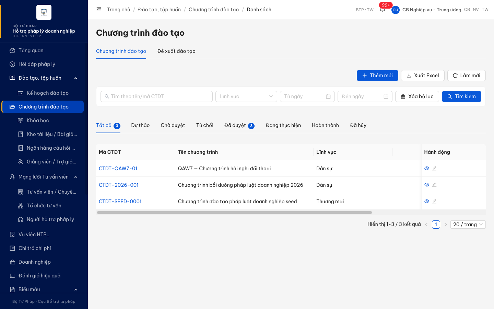

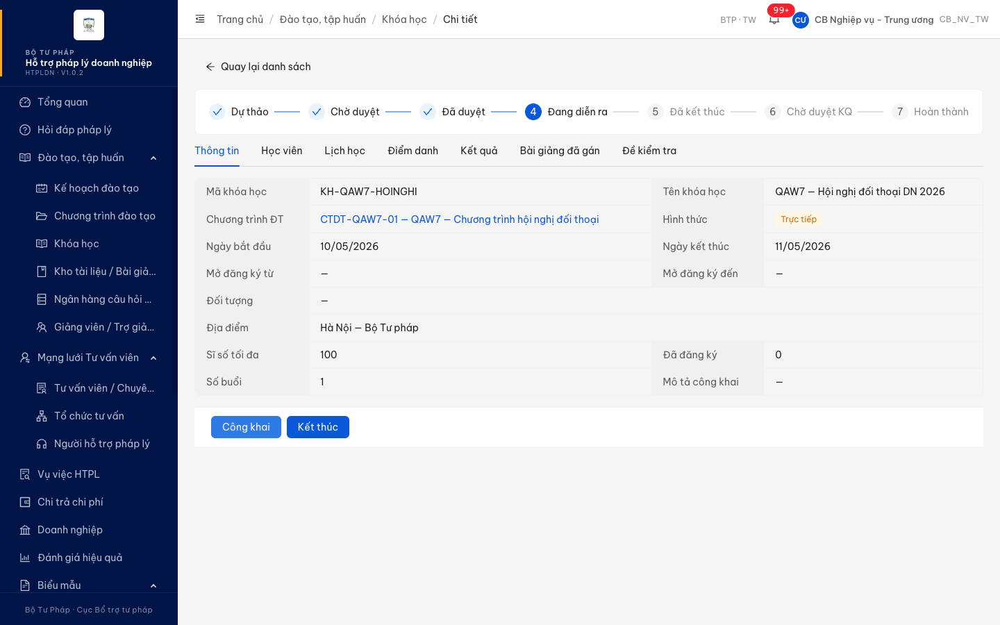

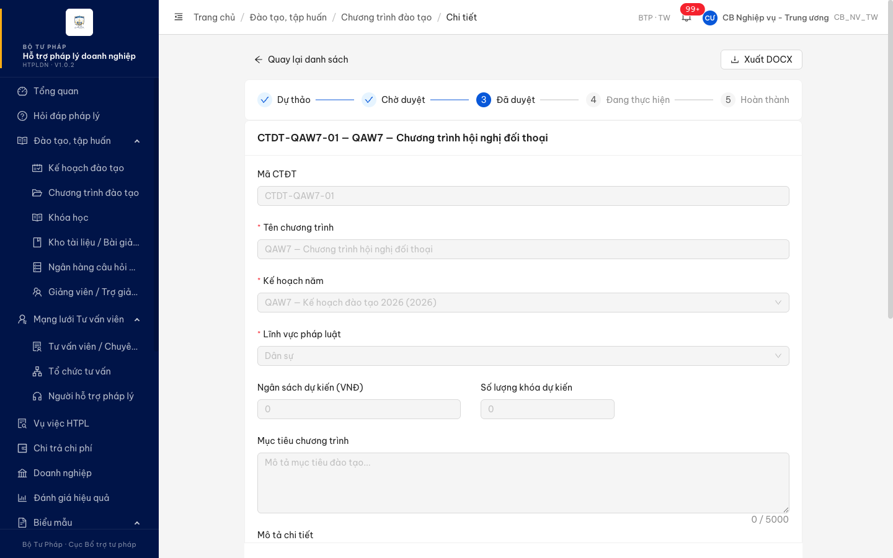

**2. API response / log** *(phụ trợ)*:

```json
{
  "thao_tac": "POST /api/v1/khoa-hocs/a7480002-0000-4000-8000-000000000002/start",
  "so_request": 1,
  "so_khung_thong_bao": 1,
  "thong_bao": "Đã khai giảng khóa học",
  "khoa_hoc_sau_thao_tac": { "ma": "KH-QAW7-HOINGHI", "trangThai": "DANG_DIEN_RA" },
  "chuong_trinh_cha_sau_thao_tac": {
    "ma": "CTDT-QAW7-01",
    "trangThai": "DA_DUYET",
    "ngayCapNhat": "2026-07-25T03:23:52.370Z"
  },
  "loc_theo_trang_thai": { "DA_DUYET": 3, "DANG_THUC_HIEN": 0, "HOAN_THANH": 0 }
}
```

---

## ~~BUG-TTCTDTTH_17~~ [CLOSED] — Chương trình đào tạo không tự chuyển sang "Hoàn thành" khi mọi khóa học con đã "Hoàn thành"
> **Re-test:** 2026-07-31 00:52 trên bản **V1.0.3** — ✅ PASS (Closed-verified). Hoàn thành khóa học con duy nhất (`finish` → `submit-result` → `approve-result`): chương trình cha **tự** chuyển `DANG_THUC_HIEN` → `HOAN_THANH` (`04:30:19.207Z` → `04:30:43.659Z`), thanh tiến trình hiện bước **5 Hoàn thành**. **Bổ sung 31/07 00:52 — đã đo nốt nhánh chống chuyển sớm** (lượt trước tôi tự khai là *chưa kiểm*): trên `CTDT-SEED-0001` có **9 khóa con**, đăng nhập `cbpd_tw_03` bấm **[Duyệt KQ]** đưa khóa con `KH-20260716-002` sang *Hoàn thành* (thông báo *"Đã phê duyệt kết quả thành công"*) → mở lại chương trình cha: **vẫn ở bước 4 Đang thực hiện**, với **4/9** con hoàn thành và 5 con chưa xong ⇒ hệ thống **không** chuyển sớm, khớp `srs-fr-03-dao-tao.md:2129`/`:2145` và loại được giả thuyết dev sửa quá tay. Chi tiết: [cond/TTCTDTTH_17-reverify-V103.md](../cond/TTCTDTTH_17-reverify-V103.md) §Đo bổ sung. Ảnh: `../reverify-audit/TTCTDTTH_17/07-PASS-V1.0.3-ctdt-tu-chuyen-hoan-thanh.png` · `image/BUG-TTCTDTTH_17-r6-khong-chuyen-som-4-tren-9-khoa-con-hoan-thanh.png`.


### Mô tả

Khi **toàn bộ** khóa học thuộc một chương trình đào tạo đã ở trạng thái "Hoàn thành", chương trình đào tạo vẫn đứng ở "Đã duyệt" thay vì chuyển sang "Hoàn thành". Cùng gốc với `BUG-TTCTDTTH_16`: vòng đời của chương trình đào tạo bị cắt ở "Đã duyệt" — hệ thống hiện **không có đường nào** (tự động hay thủ công) để đưa chương trình sang "Đang thực hiện" hoặc "Hoàn thành", nên 2 trong 7 trạng thái của SM-CTDT không thể đạt.

### Các bước tái hiện

1. Đăng nhập `cbnv_tw` — **CB Nghiệp vụ - Trung ương (CB_NV_TW)**, phạm vi BTP · TW (đúng vai trò và cấp đối tác dùng trong video bằng chứng).
2. Vào **Đào tạo, tập huấn → Chương trình đào tạo** → mở `CTDT-2026-001` (*Chương trình bồi dưỡng pháp luật doanh nghiệp 2026*, đang ở "Đã duyệt"). Bảng "Khóa học thuộc chương trình" có 2 khóa: `KH-2026-001` = Hoàn thành, `KH-2026-002` = Đã kết thúc.
3. Mở khóa học `KH-2026-002` → bấm **[Gửi duyệt KQ]** → xác nhận *"Trình duyệt"*. Khóa học sang bước **6 Chờ duyệt KQ**.
4. Đăng nhập `cbpd_tw_01` — **CB Phê duyệt - Trung ương (CB_PD_TW)** → mở lại `KH-2026-002` → bấm **[Duyệt KQ]** → xác nhận *"Phê duyệt KQ"*. Khóa học sang bước **7 Hoàn thành**. Tại đây **mọi** khóa học của `CTDT-2026-001` đều "Hoàn thành".
5. Đăng nhập lại `cbnv_tw` → mở chi tiết `CTDT-2026-001`.
6. Quan sát: thanh tiến trình của chương trình vẫn ở bước **3 Đã duyệt**; bước **4 Đang thực hiện** và **5 Hoàn thành** đều xám. Trang chỉ có [Quay lại danh sách], [Xuất DOCX], [Tạo khóa học] — không có nút nào để đưa chương trình đi tiếp.

### Kết quả mong đợi

- Theo `srs-fr-03-dao-tao.md:2129` (SM-CTDT) — *"DANG_THUC_HIEN --> HOAN_THANH : Tất cả KHOA_HOC con HOAN_THANH / DA_HUY"* — và `:2145` — *"| DANG_THUC_HIEN | HOAN_THANH | Auto khi tất cả KHOA_HOC con HOAN_THANH / DA_HUY | — | (auto) |"*: khi mọi khóa học con đã hoàn thành (hoặc đã hủy), hệ thống phải tự chuyển chương trình sang "Hoàn thành".
- `:2119` liệt kê 7 trạng thái của chương trình đào tạo — cả 7 phải đạt được qua nghiệp vụ.

### Kết quả thực tế

- `CTDT-2026-001` vẫn ở **"Đã duyệt"** dù cả `KH-2026-001` và `KH-2026-002` đều "Hoàn thành".
- Đọc lại bản ghi: chương trình `trangThai = "DA_DUYET"`, `ngayCapNhat = "2026-07-25T03:23:52.082Z"` — **không đổi**; trong khi khóa học `KH-2026-002` có `ngayCapNhat = "2026-07-30T03:11:51.907Z"` đúng thời điểm duyệt kết quả ⇒ hệ thống cập nhật khóa học nhưng không chạm tới chương trình.
- Không có đường thủ công thay thế: nhóm thao tác máy chủ mở cho chương trình đào tạo chỉ gồm *gửi duyệt · phê duyệt · từ chối · hủy*; cập nhật trạng thái trực tiếp bị chặn với **409** `ERR-STATE-SYS-00-01` — *"ERR-BIZ-III-01-03: Chỉ được cập nhật chương trình ở trạng thái DU_THAO hoặc TU_CHOI (hiện tại: DA_DUYET)"*.

### Bằng chứng

**1. Ảnh chụp**:

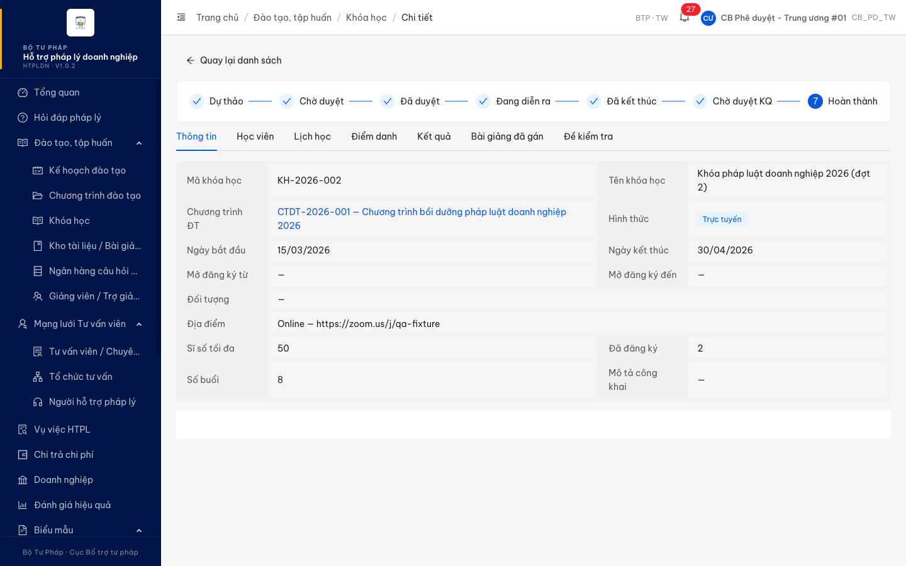

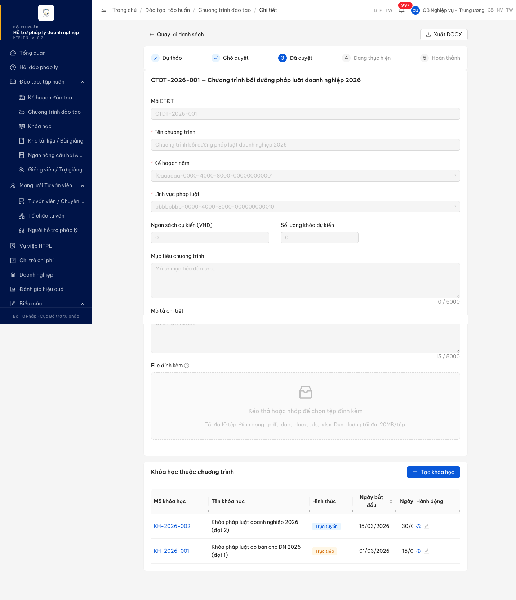

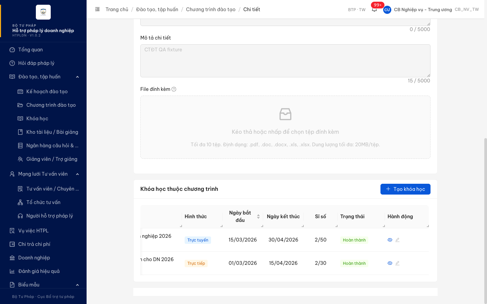

**2. API response / log** *(phụ trợ)*:

```json
{
  "thao_tac_1": "POST /api/v1/khoa-hocs/f0cccccc-0000-4000-8000-000000000002/submit-result → 1 request, 1 thông báo \"Đã trình duyệt kết quả thành công\"",
  "thao_tac_2": "POST /api/v1/khoa-hocs/f0cccccc-0000-4000-8000-000000000002/approve-result → 1 request, 1 thông báo \"Đã phê duyệt kết quả thành công\"",
  "khoa_hoc_con": [
    { "ma": "KH-2026-001", "trangThai": "HOAN_THANH", "ngayCapNhat": "2026-07-25T03:23:52.118Z" },
    { "ma": "KH-2026-002", "trangThai": "HOAN_THANH", "ngayCapNhat": "2026-07-30T03:11:51.907Z" }
  ],
  "chuong_trinh_cha": { "ma": "CTDT-2026-001", "trangThai": "DA_DUYET", "ngayCapNhat": "2026-07-25T03:23:52.082Z" },
  "thao_tac_may_chu_co_cho_CTDT": ["submit", "approve", "reject", "huy"],
  "thu_cap_nhat_truc_tiep": "PATCH /api/v1/chuong-trinh-dao-taos/{id} → 409 ERR-STATE-SYS-00-01 (ERR-BIZ-III-01-03)"
}
```

---

## ~~BUG-QLDKDTTH_06~~ [CLOSED] — Duyệt được đăng ký học viên dù khóa học đã đóng cửa sổ đăng ký
> **Re-test:** 2026-07-31 00:20 (`cbnv_tw_03`, CB_NV_TW · BTP·TW, bản **V1.0.3**) — ✅ PASS (Closed-verified). Bấm **[Phê duyệt]** hồ sơ *Chờ duyệt* trên khóa học **không đang nhận đăng ký** → hệ thống **từ chối**, thông báo đỏ *"Khóa học đã đóng đăng ký"* (trùng nguyên văn E1 `srs-fr-03-dao-tao.md:428`), máy chủ trả **422**, đọc lại hồ sơ vẫn `CHO_DUYET`; tái hiện **2/2** trên 2 hồ sơ. **Đối chứng ngược**: trên khóa *đang* nhận đăng ký thì duyệt vẫn chạy đúng (**201**, hồ sơ sang *Đã duyệt*) ⇒ không phải chặn mù. **Đã rà soát lại 31/07 00:20** để dựng nốt nhánh *"trạng thái hợp lệ nhưng cửa sổ đăng ký hết hạn"*: quét **toàn bộ 13 khóa học** trong env → chỉ `KH-QAW7-HOINGHI` có hồ sơ *Chờ duyệt* và khóa này **không đặt cửa sổ**; **không khóa nào có thao tác sửa** (dòng danh sách chỉ có [Xem]; trang chi tiết chỉ có [Công khai/Gỡ công khai] [Khai giảng/Kết thúc]) nên không đặt được cửa sổ; và **không dựng được hồ sơ đăng ký mới** ([Thêm học viên] đã gỡ theo BA chốt `:445`, tab Học viên không có nút nhập tệp, vai trò **DN** đăng nhập kiểm chứng cũng **không có bất kỳ thao tác tự đăng ký nào**). ⇒ 2 nhánh **chưa đo được vì môi trường**, đã khai báo rõ ở [cond/QLDKDTTH_06-r5-reverify.md](../cond/QLDKDTTH_06-r5-reverify.md) §Giới hạn. Ảnh: `image/BUG-QLDKDTTH_06-r5-V103-PASS-toast-khoa-hoc-da-dong-dang-ky.png` · `image/BUG-QLDKDTTH_06-r5-V103-doi-chung-khoa-con-nhan-dang-ky-duyet-thanh-cong.png` · `image/BUG-QLDKDTTH_06-r5-V103-tien-de-cua-so-dang-ky-da-dong.png`.


### Mô tả

Khóa học đang ở trạng thái "Đã duyệt" (chưa Công khai, chưa Khai giảng) và cửa sổ mở đăng ký đã đóng từ 27 ngày trước. Trên tab **Học viên**, Cán bộ Nghiệp vụ bấm **[Phê duyệt]** một hồ sơ đang ở "Chờ duyệt" thì hệ thống **duyệt thành công**: hiện thông báo *"Đã phê duyệt đăng ký"*, hồ sơ chuyển sang "Đã duyệt". Không có bất kỳ chốt kiểm nào về cửa sổ đăng ký hay trạng thái khóa học. Đã tái hiện **2/2** trên hai hồ sơ khác nhau.

### Các bước tái hiện

1. Đăng nhập `cbnv_tw` — **CB Nghiệp vụ - Trung ương (CB_NV_TW)**, phạm vi BTP · TW (đúng vai trò và cấp đối tác dùng trong video bằng chứng).
2. Vào **Đào tạo, tập huấn → Khóa học** → mở khóa học `KH-20260730-001` (thuộc `CTDT-SEED-0001`). Tab **Thông tin**: trạng thái **3 Đã duyệt**, **Mở đăng ký từ 01/07/2026 · Mở đăng ký đến 03/07/2026**, sĩ số tối đa 5, đã đăng ký 0. Ngày test 30/07/2026 ⇒ cửa sổ đăng ký đã đóng.
3. Sang tab **Học viên** → bấm **[Thêm học viên]** → nhập Họ tên / Email / SĐT → **[Thêm mới]**. Hồ sơ được tạo ở trạng thái **"Chờ duyệt"**, cột Hành động có **[Phê duyệt] [Từ chối]**.
4. Bấm **[Phê duyệt]** trên dòng hồ sơ đó (không có hộp thoại xác nhận).
5. Quan sát: thông báo xanh *"Đã phê duyệt đăng ký"*; cuộn ngang tới cột **Trạng thái** → thẻ xanh **"Đã duyệt"**; cột Hành động thành **—**.
6. Lặp lại bước 3–5 với một hồ sơ thứ hai → kết quả y hệt (2/2).

### Kết quả mong đợi

- Theo `srs-fr-03-dao-tao.md:385` (FR-III-03 *Quản lý đăng ký đào tạo*, UC22) — tiền đề **PRE-02: *"Khóa học tồn tại, đang mở đăng ký"*** — và `:426` — *"| E1 | Khóa học đã đóng đăng ký | ERR-DKDT-01 | \"Khóa học đã đóng đăng ký\" | ERROR |"*: khi khóa học đã đóng đăng ký, hệ thống phải **từ chối** thao tác duyệt và nêu lý do cho người dùng.
- Hồ sơ đăng ký phải **giữ nguyên** ở "Chờ duyệt" sau thao tác bị từ chối.
- Định nghĩa "đang nhận đăng ký" ở `:452` — *"Khóa học đang nhận đăng ký: trạng thái ∈ **{DA_CONG_KHAI, DANG_DIEN_RA}** VÀ (nếu có cửa sổ) `NOW ∈ [mo_dang_ky_tu, mo_dang_ky_den]`"*: khóa học trong phép thử **không thỏa cả hai** điều kiện (đang "Đã duyệt", và 30/07/2026 nằm ngoài 01/07 → 03/07/2026).

### Kết quả thực tế

- Hồ sơ được duyệt bình thường: `POST /api/v1/dang-ky-dao-taos/{id}/approve` trả **201**, 1 khung thông báo *"Đã phê duyệt đăng ký"* (1 request ↔ 1 thông báo, không lặp).
- Đọc lại dữ liệu sau thao tác: hồ sơ `913bca7d-…` có `trangThai = "DA_DUYET"` ⇒ **trạng thái đã ghi thật vào dữ liệu**, không phải lỗi hiển thị tạm.
- Không có dấu hiệu "chặn nhưng mất thông báo lỗi": mạng **không có phản hồi 4xx nào**, `.ant-form-item-explain-error` rỗng, bảng điều khiển trình duyệt **0 dòng lỗi** ⇒ hệ thống không hề thực hiện chốt kiểm.
- Đã loại các nguyên nhân khác: lớp còn chỗ (5/0 lúc bắt đầu) nên không vướng sức chứa; tài khoản `cbnv_tw` thao tác được cả thêm và duyệt nên không vướng phân quyền.

### Bằng chứng

**1. Ảnh chụp**:

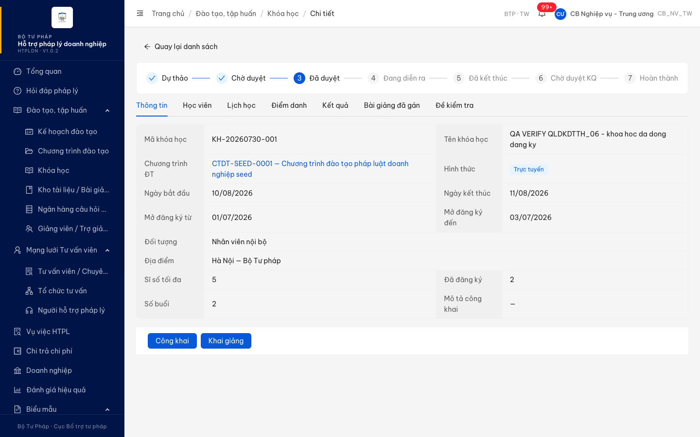

![BUG-QLDKDTTH_06 — Bước 3: hồ sơ học viên vừa thêm ở "Chờ duyệt", có hành động [Phê duyệt] [Từ chối]](image/BUG-QLDKDTTH_06-ho-so-cho-duyet.png)

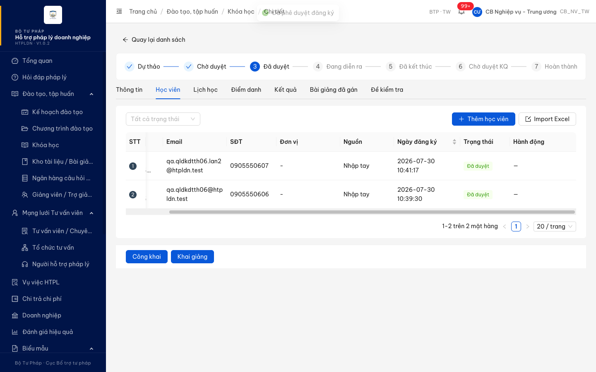

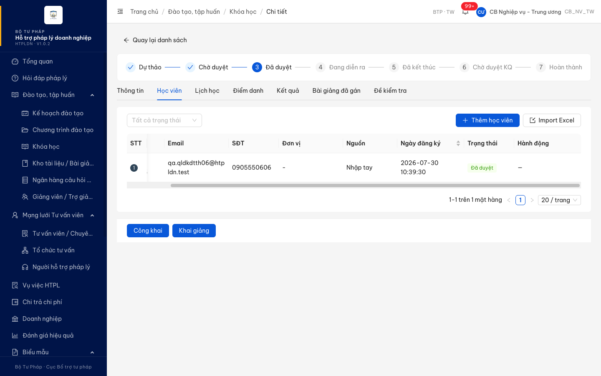

**2. API response / log** *(phụ trợ)*:

```json
{
  "khoa_hoc_truoc_thao_tac": {
    "ma": "KH-20260730-001",
    "trangThai": "DA_DUYET",
    "moDangKyTuNgay": "2026-07-01",
    "moDangKyDenNgay": "2026-07-03",
    "soLuongToiDa": 5,
    "ngay_test": "2026-07-30"
  },
  "lan_1": {
    "them_hoc_vien": "POST /api/v1/khoa-hocs/8a76ced0-…/dang-ky-dao-taos → 201, 1 thông báo \"Đã thêm học viên\"",
    "phe_duyet": "POST /api/v1/dang-ky-dao-taos/913bca7d-…/approve → 201, 1 thông báo \"Đã phê duyệt đăng ký\""
  },
  "lan_2": {
    "them_hoc_vien": "POST /api/v1/khoa-hocs/8a76ced0-…/dang-ky-dao-taos → 201, 1 thông báo \"Đã thêm học viên\"",
    "phe_duyet": "POST /api/v1/dang-ky-dao-taos/6c7be07a-…/approve → 201, 1 thông báo \"Đã phê duyệt đăng ký\""
  },
  "doc_lai_ho_so_sau_thao_tac": { "id": "913bca7d-…", "trangThai": "DA_DUYET" },
  "so_phan_hoi_4xx": 0,
  "so_dong_loi_console": 0,
  "explain_errors": [],
  "tu_kiem_bo_do": "soObserverDangSong = 1"
}
```

---

## ~~BUG-TMHDVMPL_12~~ [CLOSED] — Ô "File đính kèm" của form Thêm mới hỏi đáp nhận tệp `.jpg` ngoài danh sách định dạng cho phép
> **Re-test:** 2026-07-31 00:05 (`cbnv_tw_03`, CB_NV_TW · BTP·TW, bản **V1.0.3**) — ✅ PASS (Closed-verified). Đi trọn luồng trên **bản ghi tạo mới** `HD-20260730-005`: nạp tệp `.jpg` của phiếu gốc (JPEG thật 400×300, 2 529 B) vào ô **File đính kèm** của form *Thêm mới* → **bị từ chối**, thông báo *"…: Định dạng không được hỗ trợ. Chấp nhận: .pdf, .doc, .docx, .xls, .xlsx"*, danh sách rỗng, *Tổng dung lượng 0 B / 100MB*, **0** request tải tệp. **Bổ sung 31/07 00:05**: thử nốt định dạng ảnh còn lại `.png` (PNG thật 40×30, 170 B) → **cũng bị từ chối** cùng thông báo, danh sách vẫn rỗng ⇒ chặn cả 2 định dạng ảnh mà dòng gợi ý cũ liệt kê sai, không chỉ riêng `.jpg`. **Đối chứng ngược**: `.docx` hợp lệ vẫn nạp và **[Lưu]** được; mở lại bản ghi chỉ có `QA-r5-hople.docx` (0.9 KB), không có tệp ảnh. Dòng gợi ý dưới ô tải tệp đã sửa đúng 5 định dạng + nêu *"tổng 100MB"* (`srs-fr-02-hoi-dap.md:1070`). Chi tiết: [cond/TMHDVMPL_12-r5-reverify.md](../cond/TMHDVMPL_12-r5-reverify.md). Ảnh: `image/BUG-TMHDVMPL_12-r5-PASS-jpg-bi-tu-choi-dinh-dang.png` · `image/BUG-TMHDVMPL_12-r5-PASS-ban-ghi-moi-chi-luu-docx.png`.


### Mô tả

Trên màn **Quản lý hỏi đáp, vướng mắc pháp lý** (SCR-II-01) → **[Thêm mới]** → mục **File đính kèm**, hệ thống nhận tệp `.jpg` mà không báo lỗi. Bấm **[Lưu]** thì bản ghi được tạo và tệp ảnh **được lưu xuống máy chủ** (kiểu `image/jpeg`), hiển thị trong hồ sơ kèm nút *Xem / Tải*. Đặc tả chỉ cho phép 5 định dạng tài liệu (`doc/docx/xls/xlsx/pdf`) cho ô này. Ngoài hành vi, **dòng gợi ý hiển thị dưới ô tải tệp cũng sai** — đang ghi *".pdf, .doc, .docx, .xls, .xlsx, .jpg, .png"*.

### Các bước tái hiện

1. Đăng nhập `cbnv_tw` — **CB Nghiệp vụ - Trung ương (CB_NV_TW)**, phạm vi BTP · TW (đúng lớp tác nhân đặc tả quy định tại `srs-fr-02-hoi-dap.md:89`).
2. Vào **Hỏi đáp pháp lý** → bấm **[Thêm mới]** → panel *"Thêm mới hỏi đáp"* mở ra.
3. Cuộn tới mục **File đính kèm** — đọc dòng gợi ý: *"Tối đa 10 tệp. Định dạng: .pdf, .doc, .docx, .xls, .xlsx, .jpg, .png. Dung lượng tối đa: 20MB/tệp."*
4. Chọn **duy nhất 1 tệp `.jpg`** (ảnh JPEG thật 400×300, 2,5 KB) — chỉ 1 tệp để cô lập biến.
5. Quan sát: tệp vào danh sách kèm nút *Xem / Xóa*, **không** có dòng lỗi, **không** có thông báo, **0 request** lúc chọn tệp.
6. Nhập các trường bắt buộc (Nội dung câu hỏi · Lĩnh vực *Thương mại* · Kênh *Trực tiếp*) → bấm **[Lưu]**.
7. Mở lại bản ghi vừa tạo (`HD-20260730-001`) → mục **File đính kèm** vẫn có tệp `.jpg` với nút *Xem / Tải*.

### Kết quả mong đợi

- Theo `srs-fr-02-hoi-dap.md:108` (FR-II-01 *Quản lý thông tin hỏi đáp, vướng mắc pháp luật*, UC10 — Inputs, trường 9 `file_dinh_kem`): *"File đính kèm. Tối đa 10 file/upload, tổng max 100MB, mỗi file max 20MB. **Định dạng: doc/docx/xls/xlsx/pdf.**"* ⇒ tệp ngoài 5 định dạng này phải bị **từ chối** kèm thông báo nêu lý do; hồ sơ không được lưu tệp đó.
- Theo `:1070` (SCR-II-01, thành phần 45 *File đính kèm*): dòng gợi ý hiển thị cho người dùng phải nêu *"Định dạng: doc/docx/xls/xlsx/pdf"*.
- `:1125` (thành phần 23 *File đính kèm phản hồi*) ghi cùng danh sách 5 định dạng — đặc tả nhất quán ở cả 3 chỗ, không chỗ nào có `jpg`/`png`.

### Kết quả thực tế

- Tệp `.jpg` được nhận: **0 request**, **0 khung thông báo**, `.ant-form-item-explain-error` **rỗng** lúc chọn tệp.
- Lưu thành công: `POST /api/v1/hoi-daps` → **201** và `POST /api/v1/hoi-daps/{id}/files` → **201**, 1 thông báo *"Tạo hỏi đáp thành công. Mã: HD-20260730-001"*. **Không có phản hồi 4xx nào.**
- Đọc lại bản ghi trên máy chủ: `fileDinhKem = [{ ten: "QA-TMHDVMPL_12-test.jpg", loai: "image/jpeg" }]` ⇒ tệp ảnh **đã vào hồ sơ thật**, không phải hiển thị tạm ở giao diện.
- Thuộc tính lọc tệp của chính ô tải lên: `accept = ".pdf,.doc,.docx,.xls,.xlsx,.jpg,.png"` ⇒ `.jpg`/`.png` được đưa vào danh sách cho phép **có chủ đích**, không phải lọt ngẫu nhiên.
- Đã xác nhận tệp là JPEG thật (`file(1)`: *"JPEG image data, JFIF standard 1.01 … 400x300"*), không phải tệp đổi tên; máy chủ cũng nhận diện `image/jpeg`.
- Phân biệt để không sửa nhầm: đặc tả **có** cho phép ảnh `jpg/png/gif` ở ô **Ảnh đại diện** khi công khai lên Cổng PLQG (`:656`, `:1355` — *"Upload 1 file, jpg/png/gif, max 5MB"*), nhưng **File đính kèm công khai** vẫn chỉ `PDF/DOC/DOCX/XLS/XLSX` (`:658`, `:1358`). Bug này chỉ nói về ô **File đính kèm** của form Thêm mới.

### Bằng chứng

**1. Ảnh chụp**:

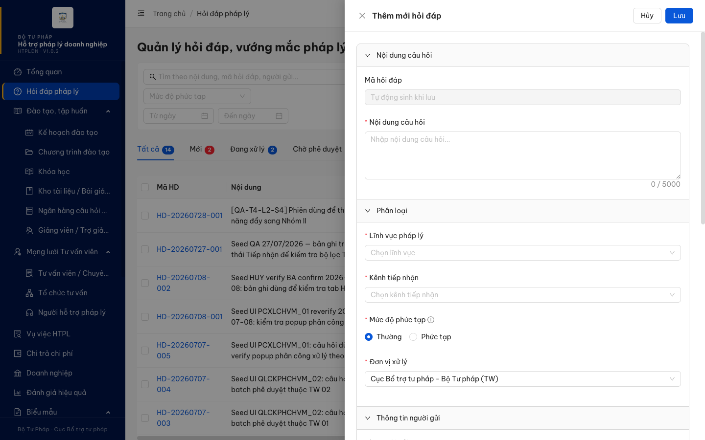

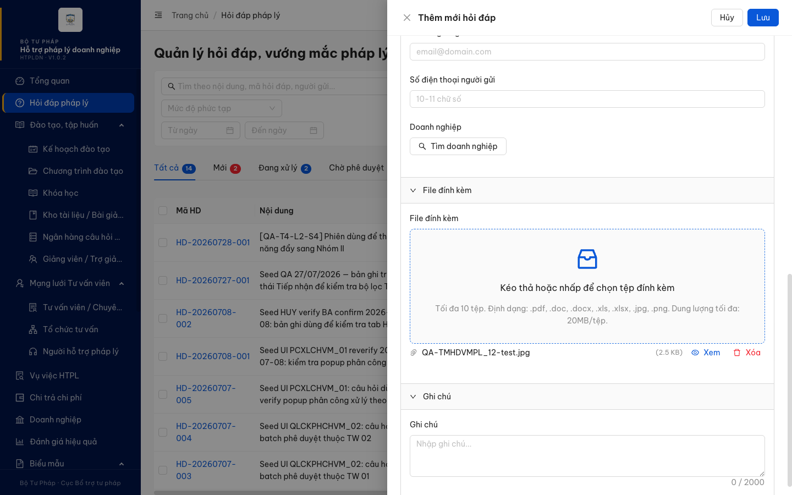

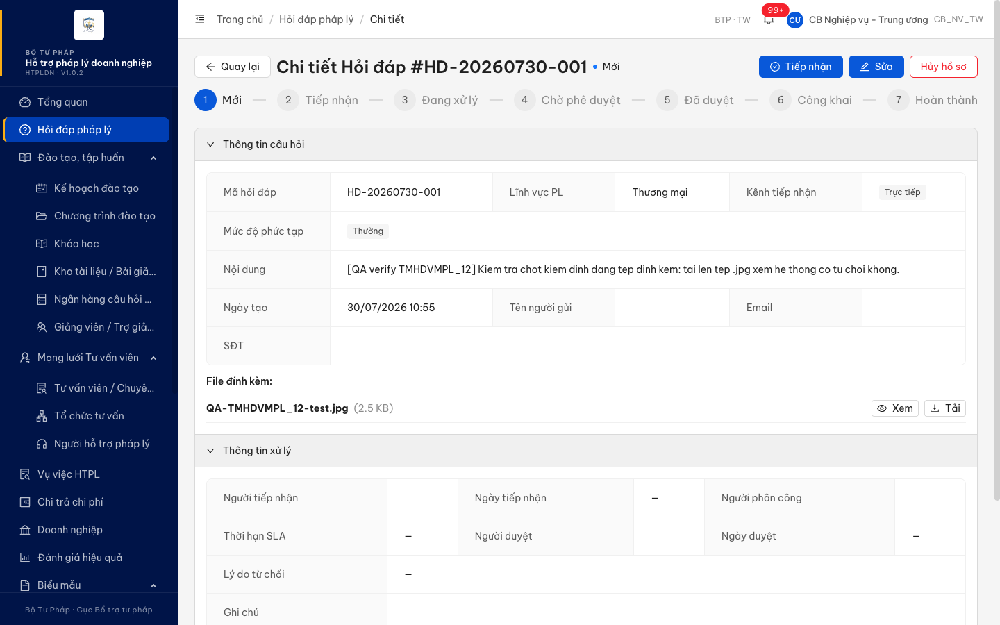

**2. API response / log** *(phụ trợ)*:

```json
{
  "goi_y_hien_thi_tren_UI": "Tối đa 10 tệp. Định dạng: .pdf, .doc, .docx, .xls, .xlsx, .jpg, .png. Dung lượng tối đa: 20MB/tệp.",
  "accept_cua_o_chon_tep": ".pdf,.doc,.docx,.xls,.xlsx,.jpg,.png",
  "luc_chon_tep": { "so_request": 0, "so_khung_thong_bao": 0, "explain_errors": [] },
  "luc_bam_luu": {
    "request": [
      "POST /api/v1/hoi-daps → 201",
      "POST /api/v1/hoi-daps/d3031a32-35a8-4c14-b2a7-bed3555a47cb/files → 201"
    ],
    "so_khung_thong_bao": 1,
    "chu": "Tạo hỏi đáp thành công. Mã: HD-20260730-001",
    "so_phan_hoi_4xx": 0
  },
  "doc_lai_ban_ghi": {
    "maHoiDap": "HD-20260730-001",
    "trangThai": "MOI",
    "fileDinhKem": [{ "ten": "QA-TMHDVMPL_12-test.jpg", "loai": "image/jpeg" }]
  },
  "kiem_tra_tep_nguon": "file(1) → JPEG image data, JFIF standard 1.01, baseline, precision 8, 400x300, components 3",
  "tu_kiem_bo_do": "soObserverDangSong = 1"
}
```

---

## ~~BUG-TMHDVMPL_16~~ [CLOSED] — Không có chốt kiểm tổng dung lượng 100MB cho tệp đính kèm hỏi đáp
> **Re-test:** 2026-07-31 00:12 (`cbnv_tw_03`, CB_NV_TW · BTP·TW, bản **V1.0.3**) — ✅ PASS (Closed-verified). Chốt kiểm **tổng 100MB** đã có và chạy đúng ngưỡng: 6 tệp = **95.6 MB** → nhận, chỉ số *"Tổng dung lượng 95.6 MB / 100MB"* hiện đúng; nạp tệp thứ 7 cỡ 15.9 MB (tổng ~111.5 MB) → **từ chối**, *"Tổng dung lượng tệp vượt quá giới hạn 100MB."*, danh sách giữ **6 tệp**. **Bổ sung 31/07 00:12 — ép sát mốc**: thêm 1 tệp **4 MiB** → tổng **99.6 MB / 100MB**, **7 tệp, vẫn được nhận**; nạp tiếp 1 tệp **1 MiB** (tổng ~100.6 MB) → **bị chặn**. Tệp thứ 8 này dưới cả trần 20MB/tệp lẫn trần 10 tệp ⇒ **chỉ có thể** do phép kiểm tổng, và ngưỡng nằm trong khoảng ~1 MiB quanh mốc 100MB — không phải chặn ước lượng. **[Lưu]** rồi mở lại `HD-20260730-006`: đúng **6 tệp** dưới trần, không có tệp bị chặn (bug gốc: lưu 10 tệp ~159 MB). Chi tiết: [cond/TMHDVMPL_16-r5-reverify.md](../cond/TMHDVMPL_16-r5-reverify.md). Ảnh: `image/BUG-TMHDVMPL_16-r5-doi-chung-6tep-95.6MB-duoc-nhan.png` · `image/BUG-TMHDVMPL_16-r5-bien-99.6MB-nhan-them-1MB-bi-chan.png` · `image/BUG-TMHDVMPL_16-r5-PASS-ban-ghi-moi-chi-luu-6tep-duoi-tran.png`.


### Mô tả

Trên màn **Quản lý hỏi đáp, vướng mắc pháp lý** (SCR-II-01) → **[Thêm mới]** → mục **File đính kèm**, hệ thống nhận 10 tệp `.docx` với **tổng 159 MB** (mỗi tệp 15,9 MB — đều dưới trần 20MB/tệp) mà **không báo lỗi** và **không hiển thị tổng dung lượng**. Bấm **[Lưu]** thì hồ sơ được tạo và **cả 10 tệp lưu xuống máy chủ** — đọc lại hồ sơ thấy tổng thật `167.015.490` byte. Đặc tả quy định trần **tổng 100MB** ở 3 chỗ trong cùng FR/màn hình, kèm yêu cầu hiển thị chỉ số *"Tổng dung lượng {total} / 100MB"*. Phép đối chứng cho thấy trần **20MB/tệp có chạy** — thiếu đúng một phép kiểm là **tổng của cả danh sách**.

### Các bước tái hiện

1. Đăng nhập `cbnv_tw` — **CB Nghiệp vụ - Trung ương (CB_NV_TW)**, phạm vi BTP · TW (đúng lớp tác nhân đặc tả quy định tại `srs-fr-02-hoi-dap.md:89`).
2. Vào **Hỏi đáp pháp lý** → bấm **[Thêm mới]** → panel *"Thêm mới hỏi đáp"* mở ra → cuộn tới mục **File đính kèm**.
3. Đưa vào **6 tệp** `.docx` cỡ 15,9 MB (tổng 95,4 MB — dưới trần): hệ thống im lặng, đúng.
4. Đưa thêm **tệp thứ 7** → tổng **111,3 MB**, đã vượt trần 100MB. Quan sát: **không** dòng lỗi, **không** thông báo, **0 request**, `.ant-form-item-explain-error` **rỗng**.
5. Đưa tiếp cho đủ **10 tệp** → tổng **159,0 MB**. Vẫn không lỗi; **không có** chỗ nào hiển thị tổng dung lượng.
6. Nhập các trường bắt buộc (Nội dung câu hỏi · Lĩnh vực *Thương mại* · Kênh *Trực tiếp*) → bấm **[Lưu]**.
7. Mở lại bản ghi vừa tạo (`HD-20260730-002`) → mục **File đính kèm** có đủ 10 tệp với nút *Xem / Tải*.
8. **Phép đối chứng** (xác định phép kiểm nào đang chạy): mở lại form, đưa vào **1 tệp `.docx` 21,9 MB** → hệ thống **từ chối ngay**, danh sách tệp rỗng, có thông báo *"…: Kích thước vượt quá giới hạn 20MB."*

### Kết quả mong đợi

- Theo `srs-fr-02-hoi-dap.md:108` (FR-II-01 *Quản lý thông tin hỏi đáp, vướng mắc pháp luật*, UC10 — Inputs, trường 9 `file_dinh_kem`): *"File đính kèm. Tối đa 10 file/upload, **tổng max 100MB**, mỗi file max 20MB."* ⇒ khi tổng dung lượng danh sách tệp vượt 100MB, hệ thống phải **từ chối** và nêu lý do cho người dùng; hồ sơ không được lưu vượt trần.
- Theo `:1070` (SCR-II-01, thành phần 45 *File đính kèm*): *"tổng tối đa 100MB … **Tổng dung lượng hiển thị "{total} / 100MB"**"* ⇒ giao diện phải cho người dùng thấy tổng đang dùng so với trần.
- `:1125` (thành phần 23 *File đính kèm phản hồi*) ghi cùng trần tổng 100MB — đặc tả nhất quán ở cả 3 chỗ.
- Bảng Error Handling của FR-II-01 (`:189`–`:196`) **chưa có** mã lỗi cho tình huống này ⇒ dev tự chọn cách hiện thực. Tham khảo mã sẵn có cho tình huống tương tự ở module khác: `srs-fr-06-chi-tra.md:606` — `ERR-CT-DNT-03` *"Vượt giới hạn 10 file/lần hoặc tổng 100MB"*; `srs-fr-05-vu-viec.md:483` — `ERR-FILE-03`.

### Kết quả thực tế

- **Không có phép kiểm tổng nào chạy**, kể cả tại điểm vừa vượt trần: 7 tệp = **111,3 MB** → `{ soTep: 7, tongMB: 111.3, VUOT_100MB: true, toast: [], soRequest: 0, err: [] }`. 10 tệp = **159,0 MB** → cùng kết quả, kèm `coHienTongTren100 = false`.
- **Lưu thành công 159MB**: 11 request — `POST /api/v1/hoi-daps` → **201** và 10 × `POST /api/v1/hoi-daps/1d11e715-…/files` → **201**; **không có phản hồi 4xx nào**; panel đóng lại.
- **Đọc lại hồ sơ trên máy chủ**: `{ ma: "HD-20260730-002", trangThai: "MOI", soTep: 10, tongByte: 167015490 }`, mỗi tệp `dungLuong: 16701549`, `loaiFile` docx ⇒ thiếu chốt kiểm ở **cả giao diện lẫn máy chủ**, không phải giao diện hiển thị tạm rồi bị chặn khi lưu.
- **Phần chữ hiển thị cũng thiếu**: dòng gợi ý chỉ ghi *"Tối đa 10 tệp. Định dạng: .pdf, .doc, .docx, .xls, .xlsx, .jpg, .png. Dung lượng tối đa: 20MB/tệp."* — **không nhắc trần tổng 100MB**, và không có chỉ số *"Tổng dung lượng {total} / 100MB"*. Ảnh của đối tác cho thấy đúng như vậy.
- **Phép đối chứng — phần đang chạy đúng (để không sửa quá phạm vi)**: 1 tệp 21,9 MB bị **từ chối** kèm thông báo *"QA-kiem-gioi-han-1tep-22MB.docx: Kích thước vượt quá giới hạn 20MB."* ⇒ cơ chế kiểm dung lượng **và** đường báo lỗi cho người dùng đều đã có; chỉ thiếu phép cộng tổng cả danh sách. Trần 10 tệp cũng được nêu đúng trong gợi ý, và lưu hồ sơ sinh mã `HD-YYYYMMDD-SEQ` đúng `:117`.

### Bằng chứng

**1. Ảnh chụp**:

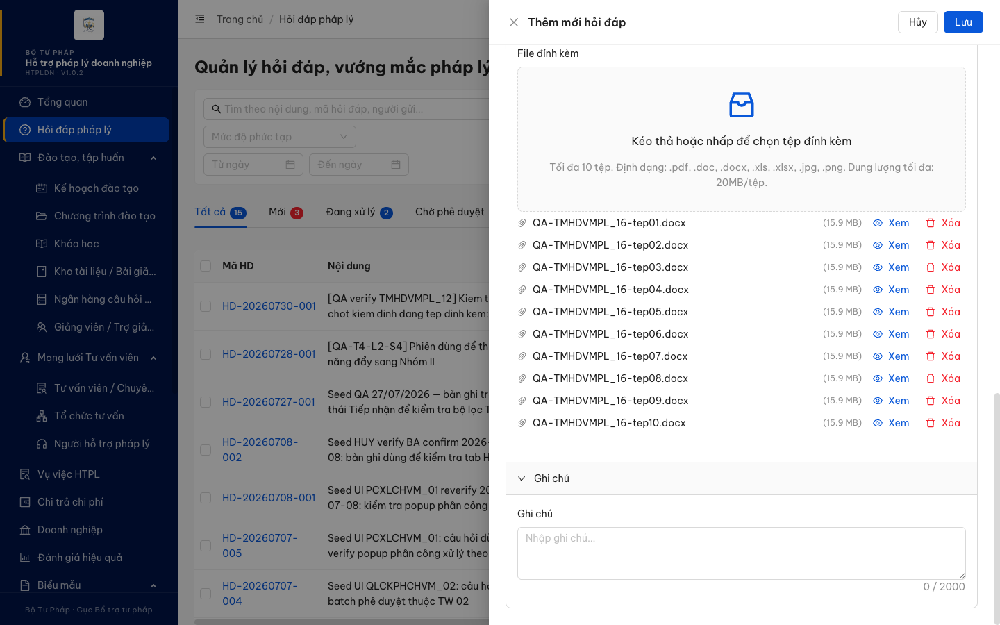

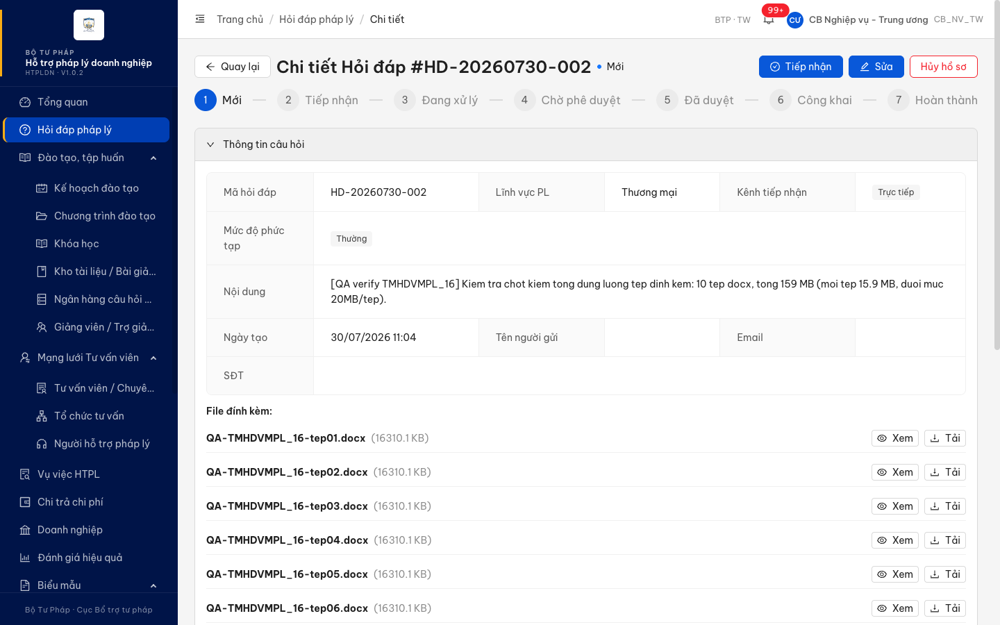

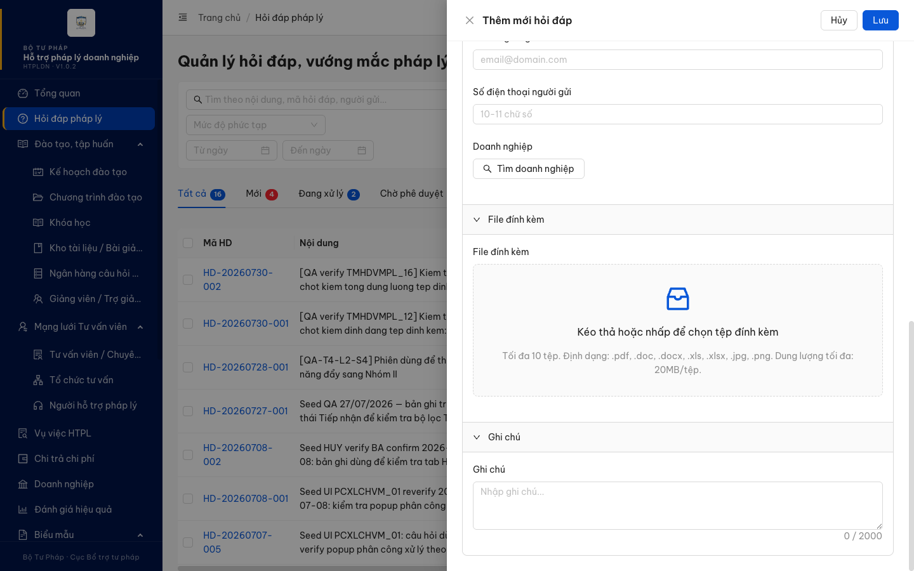

**2. API response / log** *(phụ trợ)*:

```json
{
  "goi_y_hien_thi_tren_UI": "Tối đa 10 tệp. Định dạng: .pdf, .doc, .docx, .xls, .xlsx, .jpg, .png. Dung lượng tối đa: 20MB/tệp.",
  "thieu_tren_UI": ["tran tong 100MB khong duoc neu", "khong co chi so 'Tong dung luong {total} / 100MB'"],
  "do_tai_diem_giao_tran": { "soTep": 7, "tongMB": 111.3, "VUOT_100MB": true, "toast": [], "soRequest": 0, "err": [] },
  "do_tai_moc_doi_tac": { "soTep": 10, "tongMB": 159.0, "toast": [], "soRequest": 0, "err": [], "coHienTongTren100": false },
  "luc_bam_luu": {
    "request": [
      "POST /api/v1/hoi-daps → 201",
      "POST /api/v1/hoi-daps/1d11e715-5232-4559-973f-8f683ca7310a/files → 201  (x10)"
    ],
    "so_phan_hoi_4xx": 0
  },
  "doc_lai_ban_ghi": {
    "ma": "HD-20260730-002",
    "trangThai": "MOI",
    "soTep": 10,
    "tongByte": 167015490,
    "dungLuong_moi_tep": 16701549,
    "loaiFile": "docx"
  },
  "phep_doi_chung_1tep_22MB": {
    "dungLuong": "21.94 MiB",
    "ket_qua": "bi tu choi, danh sach tep rong (soTep = 0)",
    "toast": "QA-kiem-gioi-han-1tep-22MB.docx: Kích thước vượt quá giới hạn 20MB.",
    "ket_luan": "tran 20MB/tep CO chay -> thieu dung phep kiem TONG cua ca danh sach"
  },
  "tu_kiem_bo_do": "soObserverDangSong = 1"
}
```

---

## ~~BUG-TMHDVMPL_OOS_01~~ [CLOSED] — Tệp đính kèm trùng tên không được tự động đổi tên `{name}_1.{ext}`
> **Re-test:** 2026-07-31 00:35 (`cbnv_tw_03`, CB_NV_TW · BTP·TW, bản **V1.0.3**) — ✅ PASS (Closed-verified). Đi trọn luồng trên **bản ghi tạo mới** `HD-20260730-007`: nạp **cùng một tệp** `QA-trung-ten.docx` (201 489 B, đúng tệp của phiếu gốc) **3 lần** → danh sách hiện 3 tên riêng `QA-trung-ten.docx` · `QA-trung-ten_1.docx` · `QA-trung-ten_2.docx`, đánh số tăng dần đúng dạng `{tên}_{n}.{ext}` (`srs-fr-02-hoi-dap.md:1070`), không thông báo lỗi. **[Lưu]** rồi mở lại hồ sơ: **3 tên khác nhau** y như trên (bug gốc: 2 bản ghi cùng tên). **Bổ sung 31/07 00:35 — đo nốt bước tải về** (hệ quả mà phiếu gốc nêu nhưng chưa đo): bấm **[Tải]** ngay trên dòng `QA-trung-ten_1.docx` → tệp về mang đúng tên `QA-trung-ten_1.docx`; bấm **[Tải]** trên dòng tệp gốc → tên `QA-trung-ten.docx` ⇒ 2 mẫu tương phản, tên đã đổi **đi theo tới lúc tải xuống**, không còn cảnh 2 tệp trùng tên trong cùng thư mục. Đo thêm ở màn **Chỉnh sửa**: tệp thứ 4 thành `_3` ⇒ quy tắc đánh số nhất quán, không phải vá cứng cho trường hợp 2 tệp. Trong lúc đo có phát hiện **1 lỗi khác ngoài phạm vi phiếu** (bấm [Hủy] ở màn Chỉnh sửa nhưng tệp vừa nạp vẫn lưu vào hồ sơ) — ghi ở [cond/TMHDVMPL_OOS_01-r5-reverify.md](../cond/TMHDVMPL_OOS_01-r5-reverify.md) §Ngoài tiêu chí phiếu, đề xuất mở phiếu riêng, không dùng để mở lại phiếu này. Ảnh: `image/BUG-TMHDVMPL_OOS_01-r5-PASS-tu-doi-ten-_1-_2.png` · `image/BUG-TMHDVMPL_OOS_01-r5-PASS-ban-ghi-moi-luu-3-ten-khac-nhau.png` · `image/BUG-TMHDVMPL_OOS_01-r6-ngoai-pham-vi-huy-chinh-sua-van-luu-tep.png`.


### Mô tả

Trên màn **Quản lý hỏi đáp, vướng mắc pháp lý** (SCR-II-01) → **[Thêm mới]** → mục **File đính kèm**, đưa **cùng một tệp** vào danh sách 2 lần thì hệ thống nhận cả 2 và **giữ nguyên tên trùng nhau** — không tệp nào được đổi thành `{tên}_1.{phần mở rộng}` như đặc tả quy định. Bấm **[Lưu]** thì hồ sơ lưu 2 bản ghi tệp cùng tên, cùng dung lượng. Đây là dòng **QA tự mở ngoài phạm vi phiếu đối tác**, phát sinh khi verify `TMHDVMPL_16`; tách riêng để dev không lẫn với 2 vấn đề khác của cùng ô File đính kèm.

### Các bước tái hiện

1. Đăng nhập `cbnv_tw` — **CB Nghiệp vụ - Trung ương (CB_NV_TW)**, phạm vi BTP · TW.
2. Vào **Hỏi đáp pháp lý** → bấm **[Thêm mới]** → panel *"Thêm mới hỏi đáp"* mở ra → cuộn tới mục **File đính kèm**.
3. Chọn tệp `QA-trung-ten.docx` (201 489 byte ≈ 196,8 KB, docx hợp lệ, cỡ nhỏ để loại biến dung lượng).
4. Chọn **LẠI đúng tệp đó** lần thứ hai.
5. Quan sát tên của 2 dòng trong danh sách tệp.
6. Nhập các trường bắt buộc (Nội dung câu hỏi · Lĩnh vực *Thương mại* · Kênh *Trực tiếp*) → bấm **[Lưu]**.
7. Mở lại hồ sơ vừa tạo (`HD-20260730-003`) → đọc tên tệp trong mục **File đính kèm**.

### Kết quả mong đợi

- Theo `srs-fr-02-hoi-dap.md:108` (FR-II-01 *Quản lý thông tin hỏi đáp, vướng mắc pháp luật*, UC10 — Inputs, trường 9 `file_dinh_kem`): *"Trùng tên: auto-rename `{name}_1.{ext}`"*.
- Theo `:1070` (SCR-II-01, thành phần 45 *File đính kèm*): *"Trùng tên: tự động đổi tên `{name}_1.{ext}`"*.
- `:1125` (thành phần 23 *File đính kèm phản hồi*) ghi cùng yêu cầu — đặc tả nhất quán ở cả 3 chỗ, không có ngoại lệ.
- Bảng Error Handling của FR-II-01 (`:189`–`:196`) **không có** mã lỗi cho tình huống trùng tên ⇒ đặc tả chọn xử lý **im lặng bằng đổi tên**, không chặn người dùng.

### Kết quả thực tế

- **Trên giao diện**: danh sách hiện 2 dòng `QA-trung-ten.docx (196.8 KB)` **giống hệt nhau**, không dòng nào thành `_1`. Không thông báo, không dòng lỗi.
- **Đọc lại hồ sơ trên máy chủ**: `HD-20260730-003` có **2 bản ghi tệp cùng tên** `QA-trung-ten.docx`, cùng dung lượng 201 489 byte; không bản nào tên `QA-trung-ten_1.docx` ⇒ thiếu chốt xử lý ở **cả giao diện lẫn máy chủ**, không phải giao diện hiển thị nhầm.
- Cùng hiện tượng thấy trong ảnh của đối tác ở phiếu `TMHDVMPL_16`: 10 dòng cùng một tên tệp, không dòng nào được đổi tên.
- **Phạm vi để dev không sửa nhầm**: dòng này CHỈ nói về việc **đặt tên khi trùng**. Thiếu chốt kiểm tổng dung lượng 100MB nằm ở `TMHDVMPL_16`; ô File đính kèm nhận `.jpg`/`.png` ngoài danh sách định dạng nằm ở `TMHDVMPL_12`. Cả 3 cùng một ô File đính kèm nên nên sửa cùng lượt.

### Bằng chứng

**1. Ảnh chụp**:

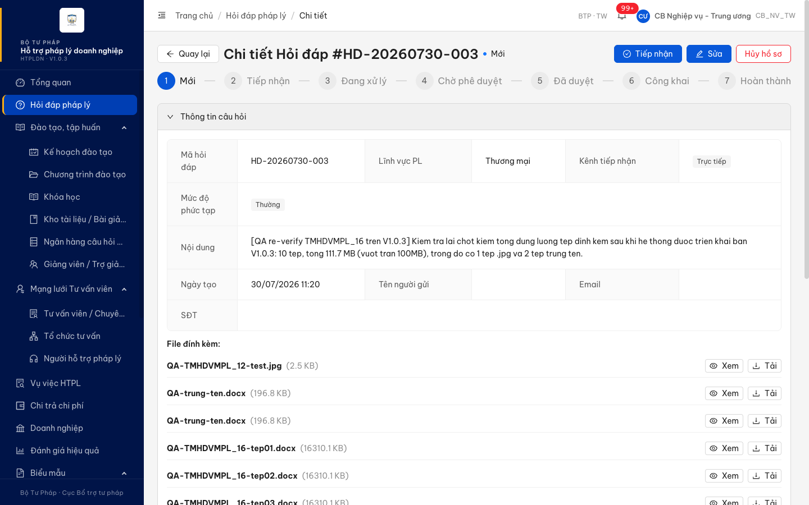

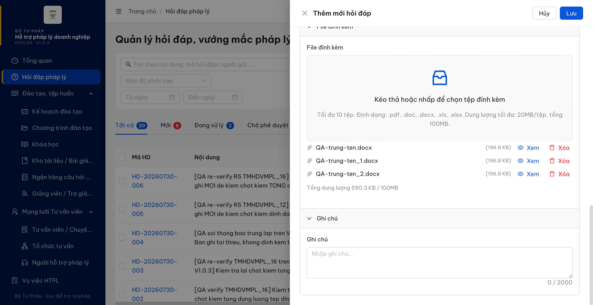

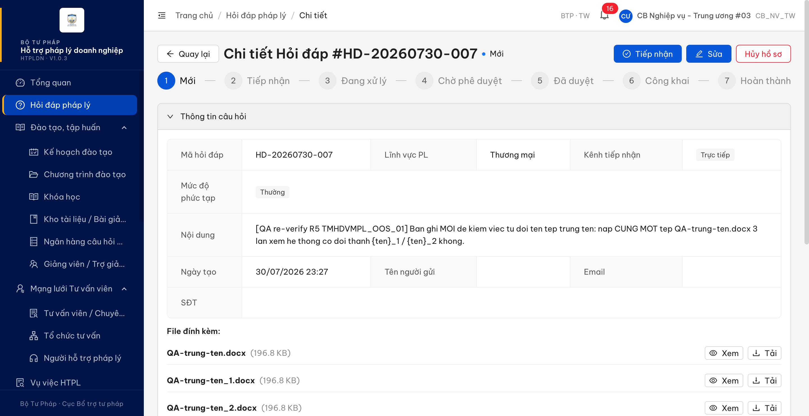

**2. API response / log** *(phụ trợ)*:

```json
{
  "bug_goc_V1.0.3_11h20": {
    "tep_dua_vao": "QA-trung-ten.docx (201489 byte) x 2 lan",
    "ten_tren_giao_dien": ["QA-trung-ten.docx", "QA-trung-ten.docx"],
    "doc_lai_ban_ghi": { "ma": "HD-20260730-003", "soTep": 2, "ten": ["QA-trung-ten.docx", "QA-trung-ten.docx"] }
  },
  "sau_khi_sua_30-07_23h30": {
    "tep_dua_vao": "QA-trung-ten.docx (201489 byte) x 3 lan",
    "ten_tren_giao_dien": ["QA-trung-ten.docx", "QA-trung-ten_1.docx", "QA-trung-ten_2.docx"],
    "tong_dung_luong_hien_thi": "590.3 KB / 100MB",
    "doc_lai_ban_ghi": { "ma": "HD-20260730-007", "soTep": 3, "ten": ["QA-trung-ten.docx", "QA-trung-ten_1.docx", "QA-trung-ten_2.docx"] },
    "man_chinh_sua_nap_them_lan_4": "QA-trung-ten_3.docx (da huy, khong luu)",
    "so_thong_bao_loi": 0
  }
}
```

---

## Phụ lục — Môi trường test

| Thành phần | Giá trị |
|------------|---------|
| URL ứng dụng | https://18.143.165.120.nip.io |
| OTP login | OTP thật lấy từ MailHog |
| MailHog (OTP inbox) | http://18.143.165.120:8025 |
| API base | https://18.143.165.120.nip.io/api/v1 |
| Frontend | React + Ant Design v5 |
| Xác thực | JWT + OTP email |
| Tool test | Chrome DevTools MCP |
| Phiên bản khi test | **V1.0.2** (verdict vòng đầu 09:5x–11:05) → **V1.0.3** (deploy ~11:05, mọi phiếu đã đo lại) |

---

*Bug report generated: 2026-07-30 11:35:00 · cập nhật lần cuối 2026-07-31 00:52:00 | QA Automation via Claude Code*
