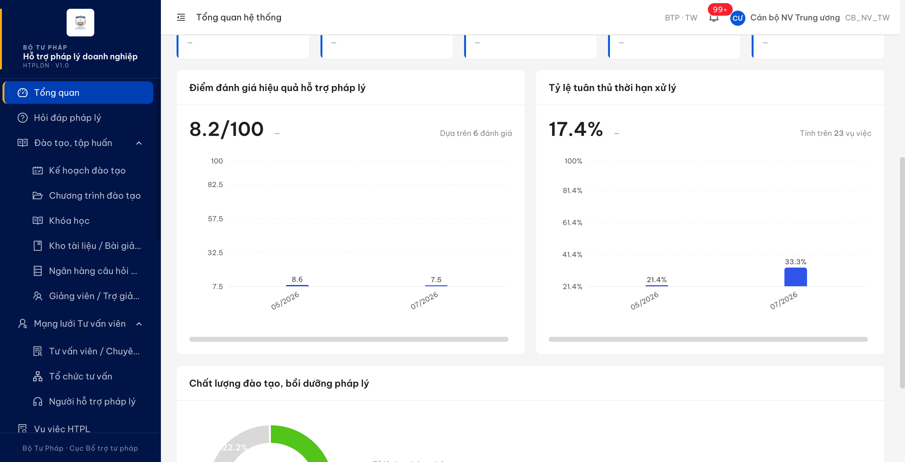
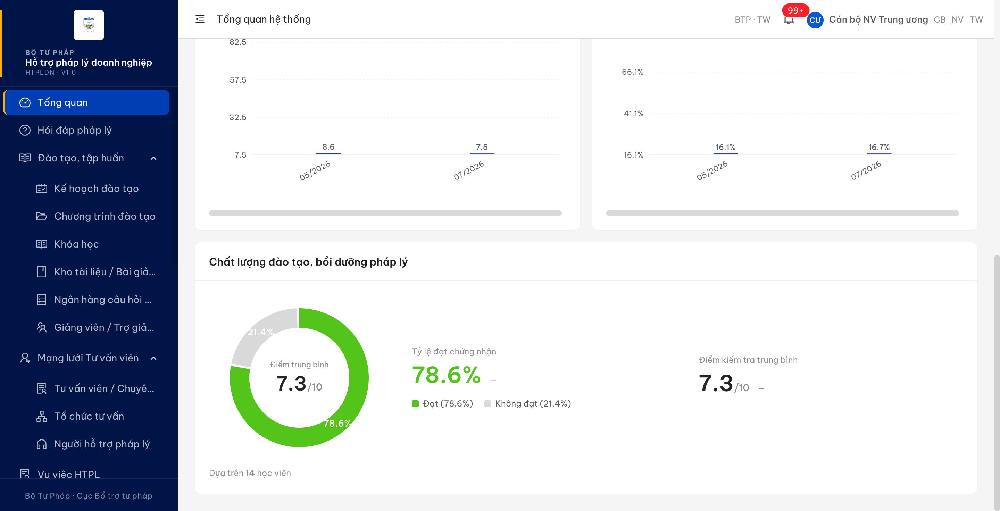
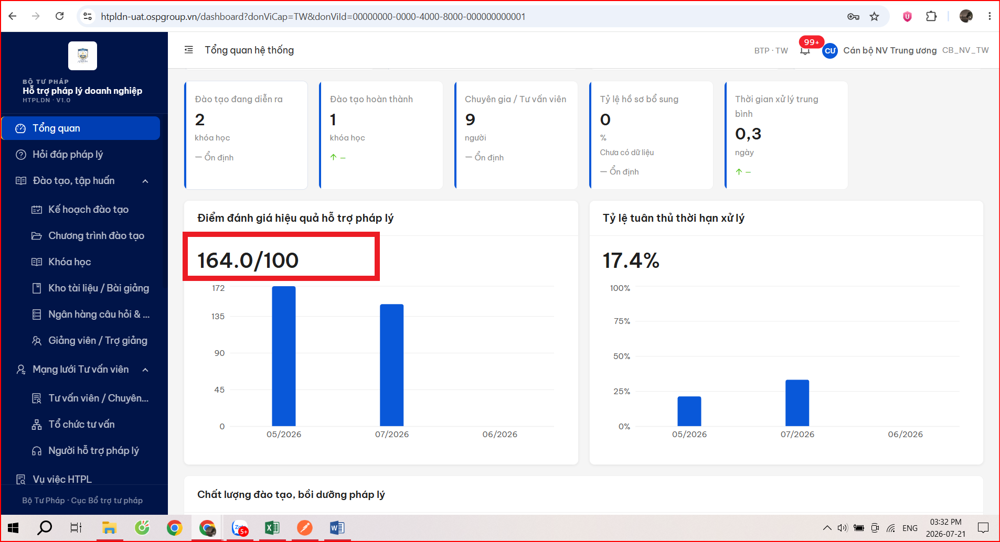
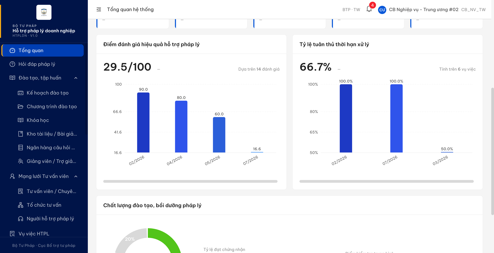

# Bug Report — Tổng quan hệ thống (Dashboard) — thẻ "Điểm đánh giá hiệu quả hỗ trợ pháp lý"

| Thông tin | Giá trị |
|-----------|---------|
| **Dự án** | PM HTPLDN |
| **Môi trường** | https://htpldn-uat.ospgroup.vn (env đối tác) · https://18.143.165.120.nip.io (env được giao) |
| **Người test** | QA Automation |
| **Ngày** | 2026-07-27 17:22:00 |
| **Loại test** | Functional — verify phản ánh vòng 2 của đối tác |
| **Round** | Vòng 2 — tab `UAT_TGPL Doanh Nghiệp-tuần 1` |
| **Tài liệu tham chiếu** | `Docs-PM-HTPLDN/_bmad-output/planning-artifacts/srs-v3.5/srs-fr-01-dashboard.md` · `srs-fr-08-danh-gia.md` · [QA_VERIFY_PROTOCOL.md](../../../QA_VERIFY_PROTOCOL.md) · [audit TKDGHQHTPL_02](../../reverify-audit/TKDGHQHTPL_02/audit.md) · [SRS-C-009](../../../../../tasks/srs-contradictions.md) · [phiếu BA confirm](../../ba-confirmation-needed-TKDGHQHTPL_02-r2.md) |

---

## Tổng hợp

Verify phản ánh vòng 2 của đối tác ở case `TKDGHQHTPL_02` ("số liệu hiển thị vượt quá 100"). Triệu chứng vượt trần **đã hết**, nhưng cùng thẻ đó phát hiện **2** lỗi khác có SRS reference cụ thể.

> **R3 27/07/2026 17:22 — Open 1 · Closed 1.** `BUG-TKDGHQ-KPI-LOC` (dòng TKDGHQHTPL_OOS_01) đã ✅ PASS trên env được giao. `BUG-TKDGHQ-THANG-DIEM` (dòng TKDGHQHTPL_02) **vẫn Open** — chờ BA/CĐT chốt 2 điểm ở SRS-C-009, chưa re-verify.

> Cả 2 lỗi đều nằm trên thẻ "Điểm đánh giá hiệu quả hỗ trợ pháp lý" (FR-I-08 / UC 8) nhưng **khác bản chất**: BUG-TKDGHQ-THANG-DIEM là sai **thang đo**, BUG-TKDGHQ-KPI-LOC là sai **tập bản ghi đầu vào**. Tách riêng để dev không sửa gộp.

### Severity breakdown

| Tổng | Critical | Major | Medium | Minor | Trivial | Closed | Open |
|------|----------|-------|--------|-------|---------|--------|------|
| 2    | 0        | 2     | 0      | 0     | 0       | 1      | 1    |

## Bug Summary Table

| Bug ID | Severity | Priority | Type | TC Ref | **SRS Reference** | Title | Status |
|--------|----------|----------|------|--------|-------------------|-------|--------|
| BUG-TKDGHQ-THANG-DIEM | Major | P1 | Data | TKDGHQHTPL_02 (tuần 1, dòng 47) | `FR-I-08 (UC8) §Mô tả` (srs-fr-01-dashboard.md:416) · `§Outputs row 1` (:450) · `BR-CALC-04` (srs-fr-08-danh-gia.md:1239) · `§Data row 6` (:1100) · `§Inputs row 3` (:479) · `SCR-VI-01 Tab 3 row 43` (:874) | Thẻ điểm đánh giá dán nhãn "/100" trong khi điểm tổng chỉ đạt trần 10 — kết quả "Xuất sắc" 10/10 hiển thị như đạt một phần mười | Open |
| ~~BUG-TKDGHQ-KPI-LOC~~ | Major | P1 | Data | TKDGHQHTPL_OOS_01 (tuần 1, dòng 276) | `FR-I-08 §Processing bước 2` (srs-fr-01-dashboard.md:441) · `§Outputs row 3` (:452) · `§Preconditions` (:425) · `KET_QUA_DANH_GIA.trang_thai` (srs-fr-08-danh-gia.md:1052) · `SM-DANHGIA → HUY` (:1183, :1168) · `BR-RPT-01` (srs-v3.5.md:5608) | Thẻ điểm đánh giá gộp cả kết quả chưa chấm và kết quả của kế hoạch đã hủy vào trung bình lẫn cỡ mẫu | Closed |

---

## BUG-TKDGHQ-THANG-DIEM — Thẻ "Điểm đánh giá hiệu quả" dán nhãn "/100" nhưng điểm tổng chỉ đạt trần 10

### Mô tả

Trên màn **Tổng quan hệ thống**, thẻ **"Điểm đánh giá hiệu quả hỗ trợ pháp lý"** hiển thị giá trị kèm mẫu số cứng **"/100"** và vẽ biểu đồ trên trục 0–100. Nhưng điểm tổng của một kết quả đánh giá chỉ có thể đạt tối đa **10** (mỗi tiêu chí điểm tối đa mặc định 10, tổng trọng số 100%). Hậu quả: một kết quả **10,00 điểm được hệ thống xếp loại "Xuất sắc"** — tức đạt trần tuyệt đối — vẫn bị hiển thị như chỉ đạt khoảng một phần mười, và mọi cột biểu đồ bị vẽ dẹt sát đáy nên không đọc được xu hướng.

### Các bước tái hiện

1. Đăng nhập role **`CB_NV_TW`** (tài khoản `cbnv_tw`, "Cán bộ NV Trung ương", đơn vị Cục Bổ trợ tư pháp — BTP · TW). Đây là tác nhân được SRS giao quyền màn này: `srs-fr-01-dashboard.md:421` — *"**Tác nhân:** CB Nghiệp vụ (TW/BN/ĐP), CB Phê duyệt (TW/BN/ĐP), QTHT (mọi cấp)"*.
2. Ở màn **Tổng quan hệ thống**, đặt bộ lọc **Cấp đơn vị = "Trung ương"** và **Đơn vị = "Cục Bổ trợ tư pháp - Bộ Tư pháp"**, bấm **Áp dụng**.
3. Đọc thẻ **"Điểm đánh giá hiệu quả hỗ trợ pháp lý"**: giá trị lớn, mẫu số, chú thích cỡ mẫu, và nhãn trục Y của biểu đồ.
4. Cuộn xuống thẻ **"Chất lượng đào tạo, bồi dưỡng pháp lý"** ngay bên dưới, đọc mẫu số của "Điểm trung bình" và "Điểm kiểm tra trung bình".
5. Mở menu **Đánh giá hiệu quả**, vào một kế hoạch đã hoàn thành, đọc **điểm tối đa của từng tiêu chí** và **điểm tổng + xếp loại** của các kết quả trong kế hoạch đó.
6. So sánh mẫu số ở bước 3 với trần điểm thực tế đọc được ở bước 5.

### Kết quả mong đợi

- Con số và thang đo trên thẻ phải phản ánh đúng mức độ đạt được thực tế của kỳ, để cán bộ nhìn vào biết đang tốt hay kém. Một kết quả đạt trần và được xếp loại "Xuất sắc" không được hiển thị như một mức rất thấp.
- `srs-fr-01-dashboard.md:416` — FR-I-08 §Mô tả: *"Biểu đồ trái — Điểm đánh giá hiệu quả hỗ trợ pháp lý (biểu đồ cột, **thang 0-100** theo điểm tổng đánh giá `KET_QUA_DANH_GIA.diem_tong` — ràng buộc 0-100)"*; `:450` — §Outputs row 1: `diem_hai_long_tb` format *"thang **0-100**"*.
- Nhưng cách tính điểm lại cho trần khác: `srs-fr-08-danh-gia.md:1239` — BR-CALC-04: *"Điểm tổng = SUM(diem_i * trong_so_i / 100)"*; `:1100` — §Data row 6: `diem_toi_da` mặc định **10**; `:479` — §Inputs row 3: *"0 ≤ diem ≤ diem_toi_da"*. Với tổng trọng số 100% thì điểm tổng chỉ đạt tối đa **10**.
- `srs-fr-08-danh-gia.md:874` — SCR-VI-01 Tab 3 row 43 quy định xếp loại theo **tỷ lệ phần trăm**: *">=90% Xuất sắc / >=70% Tốt / >=50% Đạt / <50% Chưa đạt"* — tức trần là mốc quy chiếu, không phải con số 100 cố định.

**Phạm vi sửa — thuộc nhóm VI Đánh giá, KHÔNG phải Dashboard.** Thẻ Dashboard đang hiển thị đúng như `:416` mô tả (thang 0-100 theo `diem_tong`); chỗ không thoả đặc tả là **cấu hình tiêu chí để `diem_tong` đạt trần 100**. Đối chiếu 3 hướng xử lý với toàn bộ dòng đặc tả liên quan, chỉ còn một hướng thoả hết:

| Hướng | `:416` thang 0-100 theo `diem_tong` | `:1049` CHECK 0-100 | `:874` xếp loại % | `CHANGELOG:1729` đối chiếu được với màn chi tiết | Cộng TB chéo kế hoạch |
|---|:-:|:-:|:-:|:-:|:-:|
| Dashboard quy đổi sang % | ✗ | ✓ | ✓ | **✗** | ✓ |
| Giữ số thô, mẫu số theo trần từng kế hoạch | ✗ | ✓ | ✓ | ✓ | **✗** |
| **Ràng buộc cấu hình để trần = 100** | ✓ | ✓ | ✓ | ✓ | ✓ |

- Hướng "quy đổi ở Dashboard" bị loại vì `srs-fr-08-danh-gia.md:873` — màn chi tiết hiển thị *"Điểm tổng (tự tính = tổng điểm x trọng số / 100)"*, tức **số thô** 8,6; quy đổi Dashboard sang % ⇒ Dashboard **86** vs chi tiết **8,6** cho cùng một vụ. Đó đúng là tình huống `CHANGELOG-v3-to-v3.5.md:1729` đã chủ động sửa: *"Cán bộ nghiệp vụ nhìn biểu đồ Dashboard hiển thị '3.5' trong khi báo cáo chi tiết hiển thị '70' cho cùng một vụ, **không cách nào đối chiếu**"*.
- Hướng "mẫu số theo trần từng kế hoạch" bị loại vì mỗi kế hoạch một trần khác nhau ⇒ không cộng trung bình chéo kế hoạch được, mà đó là việc chính của thẻ.
- Củng cố hướng còn lại: dữ liệu đời trước `KHDG-SEED-0001` mang điểm **80 / 60 / 90** — đã ở thang 0-100 từ trước ⇒ 0-100 nhiều khả năng luôn là thiết kế gốc, còn `diem_toi_da` mặc định **10** (`:1100`) mới là chỗ lệch.

**Cần BA/CĐT chốt trước khi sửa — 2 điểm hẹp** (đã ghi ở [`tasks/srs-contradictions.md` §SRS-C-009](../../../../../tasks/srs-contradictions.md)):

1. Bổ sung ràng buộc còn thiếu `Σ (diem_toi_da_i × trong_so_i / 100) = 100`. Hiện `:191` chỉ ghi `diem_toi_da` — *"> 0, số nguyên dương"*, `:850` UI cũng chỉ *"number > 0"*, **không dòng nào ràng buộc tổng** (riêng trọng số đã bị ép SUM = 100% ở `:850` + BR-CALC-04). Đây là **thêm luật nghiệp vụ mới** nên dev không tự quyết được.
2. Duyệt cách xử lý kế hoạch đã cấu hình `diem_toi_da = 10` và đã chấm xong — quy đổi hay chấp nhận lệch. Đụng kết quả đã chấm nên cần thẩm quyền duyệt.
3. Ghi chú: `srs-fr-01-dashboard.md:410` vẫn ghi FR-I-08 có *"công thức tính chờ CĐT review"* — phần này chưa được ký chính thức.

**Lỗ hổng độc lập phát hiện kèm:** `diem_toi_da` để tự do (`:191`) trong khi `diem_tong` bị chặn `CHECK BETWEEN 0 AND 100` (`:1049`). Cấu hình `diem_toi_da = 200` rồi chấm 150 ⇒ `diem_tong = 150`, **vi phạm chính ràng buộc đó** — đã dựng thử kế hoạch `diem_toi_da = 200` trên env được giao và hệ thống chấp nhận. Điểm 1 ở trên nếu được duyệt sẽ bịt luôn lỗ hổng này.

### Kết quả thực tế

- Thẻ hiển thị **8.2/100**, trục Y chạy 7.5 → 100, hai cột **8.6** (05/2026) và **7.5** (07/2026) bị vẽ dẹt sát đáy.
- Toàn bộ 6 kết quả đã chấm của env này đều nằm trong khoảng 0–10, và hệ thống tự xếp loại theo phần trăm trên trần 10:

  | `diemTong` | Trần kế hoạch | % | `xepLoai` hệ thống trả |
  |---:|:-:|:-:|---|
  | **10,00** | 10 | 100% | **Xuất sắc** |
  | 9,50 | 10 | 95% | Xuất sắc |
  | 8,90 | 10 | 89% | Tốt |
  | 8,00 | 10 | 80% | Tốt |
  | 7,90 | 10 | 79% | Tốt |
  | 5,00 | 10 | 50% | Đạt |

- Đối chiếu số học loại trừ nhầm lẫn: tổng 6 điểm = **49,30**; chia 6 = **8,216** → khớp con số **8.2** đang hiển thị.
- Ngay trên cùng một viewport, thẻ "Chất lượng đào tạo, bồi dưỡng pháp lý" hiển thị **"Điểm trung bình 7.3/10"** và **"Điểm kiểm tra trung bình 7.3/10"** — cùng độ lớn con số nhưng khác mẫu số với thẻ đánh giá.
- Ghi nhận nguồn gốc: `CHANGELOG-v3-to-v3.5.md:1729` — *"v3 ghi điểm đánh giá theo thang 1-5 trong khi nhóm dữ liệu kết quả đánh giá thực tế lưu thang 0-100 — **lệch nhau 20 lần**"*; `:1734` — *"v4 sửa Outputs về thang 0-100 để đồng nhất với nhóm dữ liệu nguồn"*. Thang của thẻ được sửa lên 0-100 căn cứ **ràng buộc lưu trữ** `diem_tong CHECK BETWEEN 0 AND 100` (`srs-fr-08-danh-gia.md:1049`) — vốn chỉ là khoảng giá trị hợp lệ, không phải thang chấm.
- Bản build đối tác test ngày 21/07 còn mang đúng hệ số **×20** đó: thẻ hiện **164.0/100**, trục 0→172, hai cột **172** và **150**. So với hôm nay: `172 ÷ 8.6 = 20` và `150 ÷ 7.5 = 20`. Cùng bộ lọc, thẻ "Tỷ lệ tuân thủ thời hạn xử lý" bên cạnh vẫn là **17.4%** ở cả hai lần đo — xác nhận cùng tập dữ liệu, chỉ riêng con số điểm đổi.

### Bằng chứng

**1. Ảnh chụp:**







**2. Số liệu (phụ trợ):**

```
GET /api/v1/ke-hoach-danh-gias  +  /{keHoachId}/ket-quas  +  /{keHoachId}/tieu-chis
    (env đối tác, 27/07/2026 14:12)

15 kế hoạch · 10 kết quả · 6 kết quả trạng thái DA_DANH_GIA (có điểm)

diemTong : 10.00  9.50  8.90  8.00  7.90  5.00
xepLoai  : XUAT_SAC  XUAT_SAC  TOT  TOT  TOT  DAT
tieuChi  : mọi tiêu chí diemToiDa = 10, tổng trọng số = 100%  →  trần đạt được = 10

tổng 49.30 ÷ 6 = 8.216   →  thẻ hiển thị "8.2/100"
```

---

## ~~BUG-TKDGHQ-KPI-LOC~~ [CLOSED] — Thẻ "Điểm đánh giá hiệu quả" gộp cả kết quả chưa chấm và kế hoạch đã hủy vào chỉ số

> **Re-test:** 2026-07-27 17:22 R3 — ✅ PASS (Closed-verified) trên env được giao `18.143.165.120.nip.io`. Thẻ nay **8.2/100 · "Dựa trên 10 đánh giá"** (trước 29.5/100 · 14). 10 = 11 kết quả `DA_DANH_GIA` − 1 của kế hoạch `HUY`; tổng 82,40 ÷ 10 = **8,24** → khớp 8.2, đúng bằng con số bug-report đã dự đoán. 3 cột 90/80/60 từ bản ghi `CHUA_DANH_GIA` đã biến mất. **Tiền đề gây lỗi còn nguyên** (3 bản ghi `CHUA_DANH_GIA` mang điểm + kế hoạch `DG-20260727-0001` `HUY` có kết quả 100,00) ⇒ sửa logic, không phải dọn dữ liệu. Đo lặp bằng `cbpd_tw` cho cùng kết quả. [Bảng điều kiện](../../cond/TKDGHQHTPL_OOS_01-r3-reverify.md)

> **⚠️ Tiền đề để tái hiện:** lỗi chỉ lộ ra khi trong kỳ có đồng thời (a) ≥1 kết quả đánh giá còn ở trạng thái "Chưa đánh giá" nhưng đã có sẵn điểm tổng, và (b) ≥1 kế hoạch đánh giá trạng thái "Hủy" mà kết quả của nó đã có điểm. Tại 27/07/2026, **env đối tác `htpldn-uat.ospgroup.vn` KHÔNG thoả tiền đề này** (6 kết quả có điểm thì cả 6 đều đã "Đã đánh giá"; không có kế hoạch "Hủy" nào có kết quả mang điểm) → mở Dashboard ở đó sẽ không thấy lỗi, và đó **không** phải bằng chứng đã sửa. Bug này đo trên env được giao `18.143.165.120.nip.io`.

### Mô tả

Trên màn **Tổng quan hệ thống**, thẻ **"Điểm đánh giá hiệu quả hỗ trợ pháp lý"** lấy mọi bản ghi kết quả đánh giá có điểm để tính trung bình và đếm cỡ mẫu, **không loại** bản ghi còn ở trạng thái "Chưa đánh giá", cũng **không loại** bản ghi thuộc kế hoạch đánh giá đã bị hủy. Hậu quả: chú thích cỡ mẫu báo nhiều hơn số đánh giá thực tế, và các cột cao nhất của biểu đồ lại đến từ dữ liệu chưa được chấm.

### Các bước tái hiện

1. Đăng nhập role **`CB_NV_TW`** (tài khoản `cbnv_tw_02`, "Cán bộ NV Trung ương", đơn vị Cục Bổ trợ tư pháp — BTP · TW). Tác nhân theo `srs-fr-01-dashboard.md:421`.
2. Bảo đảm dữ liệu trong kỳ thoả **cả hai tiền đề** nêu ở đầu bug (a) và (b).
3. Mở màn **Tổng quan hệ thống**, giữ bộ lọc mặc định (Năm 2026, Tháng "Cả năm").
4. Cuộn tới thẻ **"Điểm đánh giá hiệu quả hỗ trợ pháp lý"**, đọc con số trung bình và dòng chú thích cỡ mẫu **"Dựa trên N đánh giá"** ở góc phải thẻ.
5. Đọc giá trị từng cột trên biểu đồ.
6. Mở menu **Đánh giá hiệu quả** → danh sách kế hoạch đánh giá, đếm số kết quả thực sự ở trạng thái **"Đã đánh giá"** và ghi nhận kế hoạch nào đang ở trạng thái **"Hủy"**.
7. So sánh cỡ mẫu ở bước 4 với số đếm ở bước 6.

### Kết quả mong đợi

- Chỉ số và cỡ mẫu của thẻ phải phản ánh các đánh giá thực sự đã được chấm và còn hiệu lực trong kỳ.
- `srs-fr-01-dashboard.md:441` — FR-I-08 §Processing bước 2: *"Tính điểm đánh giá hiệu quả hỗ trợ pháp lý trung bình từ **kết quả đánh giá** thuộc phạm vi"*; `:452` — §Outputs row 3: `so_luong_danh_gia` = *"tổng số **đánh giá** trong kỳ + phạm vi đã lọc"*; `:425` — §Preconditions: *"Có dữ liệu đánh giá trong kỳ (Nhóm VI)"*.
- `srs-fr-08-danh-gia.md:1052` — nhóm dữ liệu Kết quả đánh giá: `trang_thai` *"CHECK IN ('CHUA_DANH_GIA','DA_DANH_GIA')"*, mặc định `'CHUA_DANH_GIA'` — bản ghi chưa chấm chưa phải là một đánh giá đã hoàn tất.
- `srs-fr-08-danh-gia.md:1183` — chuyển trạng thái sang `HUY` có hệ quả *"Audit, soft-delete"*; `:1168` — trạng thái `HUY` = *"Đợt đánh giá bị hủy"*.
- `srs-v3.5.md:5608` — BR-RPT-01 đã nêu nguyên tắc này: *"Bản ghi `DU_THAO`, `CHO_PHE_DUYET`, `TU_CHOI`, `DA_HUY` **KHÔNG** được tính vào số liệu thống kê"*. Tuy nhiên cột phạm vi áp dụng của quy tắc mới liệt kê **`FR-IX-01..23` (nhóm Báo cáo)**, chưa gồm Dashboard — nếu đội phát triển cho rằng Dashboard không chịu ràng buộc này thì cần BA bổ sung phạm vi thay vì sửa code.

### Kết quả thực tế

- Thẻ hiển thị **29.5/100** kèm chú thích **"Dựa trên 14 đánh giá"**, trong khi số kết quả thực sự đã chấm chỉ có **11**.
- Đếm thừa 3 bản ghi: `14 = 11 kết quả "Đã đánh giá" + 3 kết quả vẫn ở "Chưa đánh giá" nhưng đã có sẵn điểm` (80,00 / 60,00 / 90,00 — thuộc kế hoạch cũ `KHDG-SEED-0001`, 0 tiêu chí). Chính 3 bản ghi chưa chấm này lại là **3 cột cao nhất** của biểu đồ: 02/2026 = 90.0 · 04/2026 = 80.0 · 05/2026 = 60.0.
- Kế hoạch đã hủy vẫn được tính: kế hoạch **`DG-20260727-0001`** ở trạng thái **"Hủy"** nhưng kết quả **100,00** của nó vẫn vào trung bình chung và vào cột 07/2026. Bỏ riêng bản ghi này ra thì cột 07/2026 là **8,24** thay vì **16.6** — một bản ghi của kế hoạch đã hủy làm cột này tăng gấp đôi.
- Đối chiếu số học loại trừ nhầm lẫn: cộng điểm của đúng 14 bản ghi được đếm ra **412,40**; chia 14 được **29,457** → khớp con số **29.5** hiển thị trên thẻ. Nghĩa là thẻ lấy toàn bộ bản ghi có điểm, không lọc theo trạng thái kết quả và cũng không loại kế hoạch đã hủy.

### Bằng chứng

**1. Ảnh chụp:**



**2. Số liệu (phụ trợ):**

```
GET /api/v1/ke-hoach-danh-gias  +  /{keHoachId}/ket-quas  +  /{keHoachId}/tieu-chis
    (env được giao 18.143.165.120.nip.io, 27/07/2026)

16 kế hoạch · 16 kết quả · 11 DA_DANH_GIA · 5 CHUA_DANH_GIA · 14 bản ghi có diemTong

Nhóm bản ghi được thẻ đếm (14):
  11 bản thang trần 10  : 8.40  8.00  8.00  8.60  7.90  7.70  8.90  8.00  8.90  8.00  (+1)
   1 bản thang trần 200 : 100.00   ← kế hoạch DG-20260727-0001 trạng thái HUY
   3 bản dữ liệu cũ     : 80.00  60.00  90.00   ← trạng thái kết quả = CHUA_DANH_GIA

tổng 412.40 ÷ 14 = 29.457   →  thẻ hiển thị "29.5/100"  ·  chú thích "Dựa trên 14 đánh giá"
```

---

## Phụ lục — Môi trường test

| Thành phần | Giá trị |
|------------|---------|
| URL env đối tác | https://htpldn-uat.ospgroup.vn |
| URL env được giao | https://18.143.165.120.nip.io |
| Tài khoản | `cbnv_tw` / `cbnv_tw_02` — `Test@1234` (CB_NV_TW, Cục Bổ trợ tư pháp — BTP · TW) |
| MailHog (OTP inbox) | https://htpldn-uat.ospgroup.vn/mailhog/api/v2/messages · http://18.143.165.120:8025 |
| Frontend | React + Ant Design |
| Xác thực | JWT + OTP qua email |
| Tool test | Chrome DevTools MCP |

> **Dữ liệu QA tự tạo trên env được giao (không xoá được, đừng nhầm là dữ liệu thật):** kế hoạch **`DG-20260727-0001`** (`b217202c-de53-4f6b-a3f9-6ec911f2dfe0`, trạng thái `HUY`, 1 tiêu chí `diemToiDa=200`, 1 kết quả `diemTong=100.00`). **Không** seed bất kỳ dữ liệu nào lên env đối tác.

---

*Bug report generated: 2026-07-27 14:20:00 | QA Automation via Claude Code*
