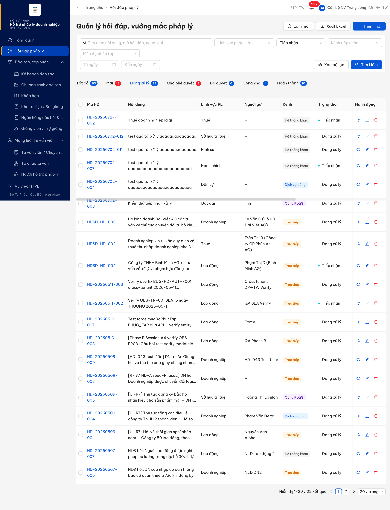
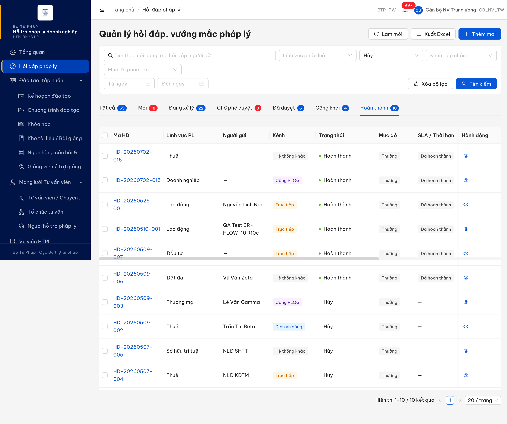
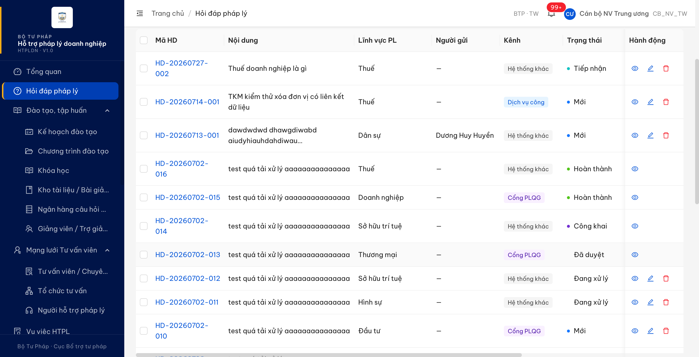
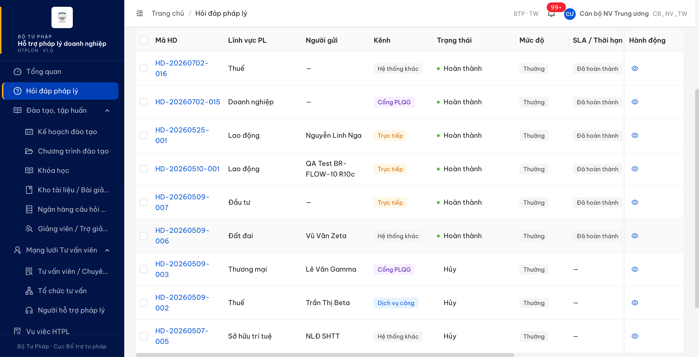

# Bug Report — Hỏi đáp pháp lý (verify phản ánh vòng 2 của đối tác)

| Thông tin | Giá trị |
|-----------|---------|
| **Dự án** | PM HTPLDN |
| **Môi trường** | https://htpldn-uat.ospgroup.vn (env đối tác) |
| **Người test** | QA Automation |
| **Ngày** | 2026-07-27 17:33:00 |
| **Loại test** | Functional — verify bug đối tác (vòng 2) |
| **Round** | Vòng 2 — tab `UAT_TGPL Doanh Nghiệp-tuần 1` |
| **Tài liệu tham chiếu** | `Docs-PM-HTPLDN/_bmad-output/planning-artifacts/srs-v3.5/srs-fr-02-hoi-dap.md` · [QA_VERIFY_PROTOCOL.md](../../../QA_VERIFY_PROTOCOL.md) · [audit](../../reverify-audit/TKHDVMTH_07/audit.md) |

---

## Tổng hợp

Verify phản ánh vòng 2 (`Trạng thái 2` = Fail) của đối tác trên module Hỏi đáp pháp lý. Phát hiện **2** lỗi có SRS reference cụ thể; cả 2 phản ánh của đối tác đều ĐÚNG.

> **R3 27/07/2026 17:33 — ✅ 2/2 bug CLOSED.** Re-verify sau khi dev báo fix: cả 2 lỗi đều đã hết trên env được giao `18.143.165.120.nip.io`. Breakdown: **Open 0 · Closed 2**.
> ⚠️ **Phạm vi:** R3 chỉ đo trên env được giao, **KHÔNG** đo lại trên env đối tác `htpldn-uat.ospgroup.vn` (phạm vi do người phụ trách chốt). Kết luận chứng minh mã nguồn đã sửa, **chưa** chứng minh bản sửa đã triển khai lên env đối tác — dev cần tự xác nhận.

### Severity breakdown

| Tổng | Critical | Major | Medium | Minor | Trivial | Closed | Open |
|------|----------|-------|--------|-------|---------|--------|------|
| 2    | 0        | 2     | 0      | 0     | 0       | 2      | 0    |

## Bug Summary Table

| Bug ID | Severity | Priority | Type | TC Ref | **SRS Reference** | Title | Status |
|--------|----------|----------|------|--------|-------------------|-------|--------|
| ~~BUG-TKHDVMTH_07~~ | Major | P1 | Data | TKHDVMTH_07 (row 123, tuần 1) | `FR-II-05 (UC14) §Acceptance Criteria` (srs-fr-02-hoi-dap.md:466) · `SCR-II-01 thành phần 17` (:1032) · `thành phần 14` (:1028) · `thẻ Đang xử lý` (:1021) · `thẻ Hoàn thành` (:1025) | Danh sách hỏi đáp: bộ lọc "Trạng thái" bị bỏ qua khi đứng ở thẻ gộp nhiều trạng thái — kết quả trả về nguyên tập của thẻ | Closed |
| ~~BUG-QLCHVMDXL-COT-NOIDUNG~~ | Major | P2 | UI | QLCHVMDXL_06 (row 201, tuần 1) | `SCR-II-01 thành phần 21` (srs-fr-02-hoi-dap.md:1036) · `thẻ Đã duyệt` (:1023) · `thẻ Công khai` (:1024) · `thẻ Hoàn thành` (:1025) | Danh sách hỏi đáp: cột "Nội dung" bị co về 0px ở 3 thẻ "Đã duyệt" / "Công khai" / "Hoàn thành" — dữ liệu vẫn có nhưng người dùng không nhìn thấy | Closed |

---

## ~~BUG-TKHDVMTH_07~~ [CLOSED] — Bộ lọc "Trạng thái" không kết hợp AND với điều kiện của thẻ, trả về nguyên tập của thẻ

> **Re-test:** 2026-07-27 17:33 R3 — ✅ PASS (Closed-verified) trên env được giao `18.143.165.120.nip.io`. Đã seed 1 bản ghi `TIEP_NHAN` (`HD-20260727-001`) để thẻ "Đang xử lý" có đủ 2 trạng thái đúng tiền đề bug gốc. Thẻ "Đang xử lý" (2 bản ghi) + lọc "Tiếp nhận" → **1** đúng bản ghi Tiếp nhận; thẻ "Hoàn thành" (2) + lọc "Đã hủy" → **1**; + lọc "Hoàn thành" → **1** bản ghi KHÁC. Phép đo quyết định: `trangThai=X&tab=Y` nay **khác** `tab=Y` đứng một mình (1 vs 2) — trước đây trùng khít. Nhãn `HUY` trong ô lọc cũng đã sửa thành "Đã hủy" đúng SRS. ⚠️ Chưa đo lại trên env đối tác. [Bảng điều kiện](../../cond/TKHDVMTH_07-r3-reverify2.md)

### Mô tả

Ở màn **Quản lý hỏi đáp, vướng mắc pháp lý** (`/hoi-dap`), khi Cán bộ nghiệp vụ chọn ô lọc **Trạng thái** rồi bấm **Tìm kiếm**, hệ thống chỉ áp điều kiện trạng thái **của thẻ (tab)** đang đứng và **bỏ qua giá trị người dùng chọn**. Hai thẻ gộp 2 trạng thái làm lỗi lộ ra: chọn "Tiếp nhận" → trả 22 bản ghi gồm cả "Đang xử lý"; chọn "Hủy" → trả 10 bản ghi gồm cả "Hoàn thành". Các thẻ chỉ chứa 1 trạng thái che được lỗi vì kết quả tình cờ trùng đáp án đúng.

### Các bước tái hiện

1. Đăng nhập role **`CB_NV_TW`** (tài khoản `cbnv_tw`, "Cán bộ NV Trung ương", đơn vị Cục Bổ trợ tư pháp — BTP · TW). Đây là tác nhân được SRS giao quyền màn này: `srs-fr-02-hoi-dap.md:438` "**Tác nhân:** Cán bộ Nghiệp vụ (TW/BN/ĐP), Cán bộ Phê duyệt (TW/BN/ĐP)"; `:1009` quyền `HOI_DAP_CREATE/UPDATE/DELETE` trên dữ liệu cùng đơn vị.
2. Vào menu **Hỏi đáp pháp lý**.
3. Mở ô lọc **Trạng thái**, chọn **"Tiếp nhận"** → bấm **Tìm kiếm**.
4. Quan sát: hệ thống chuyển sang thẻ **"Đang xử lý"**, chân bảng ghi "Hiển thị 1-20 / **22** kết quả", cột Trạng thái lẫn cả "Tiếp nhận" và "Đang xử lý".
5. Lặp lại với ô lọc **Trạng thái = "Hủy"** → bấm **Tìm kiếm**.
6. Quan sát: hệ thống chuyển sang thẻ **"Hoàn thành"**, "Hiển thị 1-10 / **10** kết quả", gồm 6 dòng "Hoàn thành" + 4 dòng "Hủy".

### Kết quả mong đợi

- Điều kiện của thẻ và giá trị ở ô lọc phải kết hợp theo **AND**: `srs-fr-02-hoi-dap.md:466` — FR-II-05 (UC14) §Acceptance Criteria: *"**Given** CB kết hợp nhiều điều kiện **When** tìm kiếm **Then** kết quả AND logic"*; `:1032` — SCR-II-01 thành phần 17 nút Tìm kiếm: *"AND logic, đồng bộ URL"*.
- Cụ thể: thẻ "Đang xử lý" có điều kiện cứng `trang_thai IN ('TIEP_NHAN','DANG_XU_LY')` (`:1021`, `:436`, `:440`) → kết hợp AND với "Tiếp nhận" phải ra **4** bản ghi, tất cả trạng thái "Tiếp nhận".
- Tương tự, thẻ "Hoàn thành" có điều kiện cứng `trang_thai IN ('HOAN_THANH','HUY')` (`:1025`) → kết hợp AND với "Hủy" phải ra **4** bản ghi trạng thái "Hủy".
- `srs-fr-02-hoi-dap.md:1028` — SCR-II-01 thành phần 14 quy định các cặp `TIEP_NHAN` → "Tiếp nhận", `DANG_XU_LY` → "Đang xử lý", `HOAN_THANH` → "Hoàn thành", `HUY` → "Đã hủy" là các lựa chọn **tách biệt**; chọn một giá trị không được kéo theo giá trị khác. *(Ghi nhận thêm cùng dòng SRS này: nhãn của `HUY` trên web đang là "Hủy" thay vì "Đã hủy".)*

### Kết quả thực tế

- Chọn "Tiếp nhận" → **22** bản ghi: 4 "Tiếp nhận" + 18 "Đang xử lý".
- Chọn "Hủy" → **10** bản ghi: 4 "Hủy" + 6 "Hoàn thành". Chọn "Hoàn thành" cho ra **đúng cùng 10 bản ghi đó**.
- Đo tách bạch chứng minh tham số bị bỏ qua chứ không phải hiển thị nhầm nhãn:

  | Truy vấn | Số bản ghi | Phân bố trạng thái |
  |---|---|---|
  | chỉ `trangThai=TIEP_NHAN` | 4 | TIEP_NHAN 4 ✅ |
  | `trangThai=TIEP_NHAN` + `tab=DANG_XU_LY` | 22 | TIEP_NHAN 4 · DANG_XU_LY 18 ❌ |
  | chỉ `tab=DANG_XU_LY` | 22 | TIEP_NHAN 4 · DANG_XU_LY 18 → **trùng khít** dòng trên |
  | chỉ `trangThai=HUY` | 4 | HUY 4 ✅ |
  | `trangThai=HUY` + `tab=HOAN_THANH` | 10 | HOAN_THANH 6 · HUY 4 ❌ |
  | `trangThai=TIEP_NHAN` + `tab=TAT_CA` | 4 | TIEP_NHAN 4 ✅ (thẻ "Tất cả" không có điều kiện cứng) |

- Giao diện **có** gửi tham số trạng thái lên — chuỗi thực tế của lần bấm Tìm kiếm: `/api/v1/hoi-daps?trangThai=TIEP_NHAN&tab=DANG_XU_LY&page=1&pageSize=20&sortBy=ngayTao&sortOrder=DESC` — nhưng máy chủ trả nguyên tập của `tab`.

### Bằng chứng

**1. Ảnh chụp:**





**2. Số liệu API (phụ trợ):**

```
GET /api/v1/hoi-daps?trangThai=TIEP_NHAN&page=1&limit=50
    → 4 bản ghi  { TIEP_NHAN: 4 }

GET /api/v1/hoi-daps?trangThai=TIEP_NHAN&tab=DANG_XU_LY&page=1&limit=50
    → 20 bản ghi (tổng 22) { TIEP_NHAN: 4, DANG_XU_LY: 16 }

GET /api/v1/hoi-daps?tab=DANG_XU_LY&page=1&limit=50
    → 20 bản ghi (tổng 22) { TIEP_NHAN: 4, DANG_XU_LY: 16 }   ← trùng khít truy vấn trên

GET /api/v1/hoi-daps?trangThai=HUY&page=1&limit=50
    → 4 bản ghi  { HUY: 4 }

GET /api/v1/hoi-daps?trangThai=HUY&tab=HOAN_THANH&page=1&limit=50
    → 10 bản ghi { HOAN_THANH: 6, HUY: 4 }
```

---

## ~~BUG-QLCHVMDXL-COT-NOIDUNG~~ [CLOSED] — Cột "Nội dung" co về 0px ở 3 thẻ "Đã duyệt" / "Công khai" / "Hoàn thành"

> **Re-test:** 2026-07-27 17:33 R3 — ✅ PASS (Closed-verified) trên env được giao `18.143.165.120.nip.io`, đo bằng cả `cbpd_tw` (vai trò đối tác) lẫn `cbnv_tw` — số liệu giống hệt. Cột "Nội dung" nay **303 px** ở cả 7 thẻ, gồm 3 thẻ trước đây 0 px. Tiền đề gây lỗi **còn nguyên** (3 thẻ vẫn 13 cột, tổng 1950 px > khung 1136 px) — bảng nay **cuộn ngang** thay vì bóp cột về 0, đúng yêu cầu ở §Kết quả mong đợi. ⚠️ Chưa đo lại trên env đối tác. [Bảng điều kiện](../../cond/QLCHVMDXL_06-r3-reverify2.md)

### Mô tả

Ở màn **Quản lý hỏi đáp, vướng mắc pháp lý** (`/hoi-dap`), cột **"Nội dung"** biến mất khỏi bảng khi người dùng đứng ở 3 thẻ **"Đã duyệt"**, **"Công khai"**, **"Hoàn thành"** — đúng 3 thẻ đối tác phản ánh. Ở 4 thẻ còn lại (Tất cả / Mới / Đang xử lý / Chờ phê duyệt) cột này hiển thị bình thường. Người dùng ở 3 thẻ đó chỉ còn nhìn thấy Mã HD và Lĩnh vực, phải mở từng bản ghi mới biết nội dung câu hỏi.

Đây là **lỗi phát sinh sau khi sửa vòng 1**: vòng 1 đối tác báo thiếu 2 cột "Người duyệt" / "Ngày duyệt"; nay 2 cột đó đã có (ghi nhận đã sửa xong), nhưng chính 3 thẻ được bổ sung 2 cột này lại mất cột "Nội dung".

### Các bước tái hiện

1. Đăng nhập role **`CB_PD_TW`** (tài khoản `cbpd_tw`, "Cán bộ PD Trung ương", đơn vị Cục Bổ trợ tư pháp — BTP · TW) — đúng vai trò đối tác dùng khi chụp bằng chứng. Tác nhân theo `srs-fr-02-hoi-dap.md:438`. *(Đã đo lặp lại bằng `CB_NV_TW` — kết quả y hệt, lỗi không phụ thuộc quyền.)*
2. Vào menu **Hỏi đáp pháp lý**.
3. Đứng ở thẻ mặc định **"Tất cả"**, đọc tiêu đề bảng — ghi nhận có cột **"Nội dung"** nằm ngay sau "Mã HD".
4. Bấm sang thẻ **"Đã duyệt"**, đọc lại tiêu đề bảng.
5. Lặp lại với thẻ **"Công khai"** và thẻ **"Hoàn thành"**.

### Kết quả mong đợi

- Cột "Nội dung" phải hiển thị được ở mọi thẻ của danh sách. `srs-fr-02-hoi-dap.md:1036` — SCR-II-01 thành phần 21: *"| 21 | content | **Cột Nội dung** | table-column | Truncate 200 ký tự + "…". Hover → tooltip (500 ký tự) | hover → tooltip | **luôn hiển thị** |"*. Cột không đặt điều kiện hiển thị theo thẻ.
- 3 thẻ bị lỗi đều là thẻ của cùng danh sách SCR-II-01, chỉ khác điều kiện lọc trạng thái: `:1023` thẻ "Đã duyệt" (`trang_thai = 'DA_DUYET'`), `:1024` thẻ "Công khai" (`trang_thai = 'CONG_KHAI'`), `:1025` thẻ "Hoàn thành" (`trang_thai IN ('HOAN_THANH','HUY')`) — không dòng nào cho phép bỏ bớt cột.
- Bảng phải sắp xếp được các cột trong khung nhìn: khi bổ sung thêm cột cho một số thẻ, tổng bề rộng các cột không được đẩy một cột về 0.

### Kết quả thực tế

- Cột "Nội dung" **vẫn tồn tại trong bảng và vẫn mang dữ liệu**, nhưng bề rộng bị đặt bằng **0 px** ở đúng 3 thẻ đối tác phản ánh → người dùng không nhìn thấy.
- Đo bề rộng khai báo của từng cột trên chính env đối tác, 27/07/2026:

  | Thẻ | Số cột | Bề rộng cột "Nội dung" | Người dùng thấy? |
  |---|:-:|:-:|:-:|
  | Tất cả | 11 | 268 px | ✅ |
  | Mới | 11 | 268 px | ✅ |
  | Đang xử lý | 11 | 268 px | ✅ |
  | Chờ phê duyệt | 11 | 268 px | ✅ |
  | **Đã duyệt** | **13** | **0 px** | ❌ |
  | **Công khai** | **13** | **0 px** | ❌ |
  | **Hoàn thành** | **13** | **0 px** | ❌ |

- Đúng 3 thẻ hỏng là 3 thẻ có **13 cột** — nhiều hơn 2 cột so với các thẻ còn lại, chính là 2 cột **"Người duyệt"** + **"Ngày duyệt"** bổ sung sau vòng 1. Tổng bề rộng khai báo của 13 cột là **1632 px** trong khi khung bảng chỉ rộng **1128 px**.
- Bảng **không** bị cuộn ngang lệch (vị trí cuộn = 0) — tức không phải cột nằm ngoài khung nhìn, mà là bề rộng bằng 0.
- Dữ liệu không mất: ô nội dung của các dòng vẫn chứa văn bản (ví dụ thẻ "Đã duyệt": `HD-20260702-013` → "test quá tải xử lý aaaaaaaaaaaaaaa"; `HD-QA-R7-064` → "QA R7 HD-064: Yêu cầu tư vấn pháp luật doanh nghiệp cấp ĐP STP-AG…").
- Ghi nhận kèm — phần vòng 1 **đã sửa xong**: 3 thẻ này nay đã có đủ 2 cột "Người duyệt" + "Ngày duyệt" (ví dụ `HD-20260702-013` → "Cán bộ PD Trung ương" · 21/07/2026 17:17).

### Bằng chứng

**1. Ảnh chụp:**






**2. Số liệu đo (phụ trợ):**

```
Env đối tác https://htpldn-uat.ospgroup.vn/hoi-dap — 27/07/2026
Đo 2 lần, bằng CB_PD_TW (vai trò đối tác) và CB_NV_TW — SỐ LIỆU GIỐNG HỆT NHAU.
Bề rộng khai báo của từng cột trong bảng (đơn vị px), theo thứ tự cột trái → phải:

Thẻ Tất cả / Mới / Đang xử lý / Chờ phê duyệt (11 cột):
  32 | 150 | 268(Nội dung) | 160 | 140 | 130 | 170 | 110 | 170 | 150 | 120     → tổng 1600

Thẻ Đã duyệt / Công khai / Hoàn thành (13 cột):
  32 | 150 |   0(Nội dung) | 160 | 140 | 130 | 170 | 110 | 170 | 150 | 150 | 150 | 120   → tổng 1632
                    ▲ hai cột 150 thêm vào = "Người duyệt" + "Ngày duyệt"

Bề rộng khung bảng khả dụng = 1128 px  ·  vị trí cuộn ngang = 0 (không phải do cuộn)
```

---

## Phụ lục — Môi trường test

| Thành phần | Giá trị |
|------------|---------|
| URL ứng dụng | https://htpldn-uat.ospgroup.vn |
| Tài khoản | `cbnv_tw` · `cbpd_tw` / `Test@1234` (CB_NV_TW · CB_PD_TW, Cục Bổ trợ tư pháp — BTP · TW) |
| OTP login | MailHog env đối tác |
| MailHog (OTP inbox) | https://htpldn-uat.ospgroup.vn/mailhog/api/v2/messages |
| API base | https://htpldn-uat.ospgroup.vn/api/v1 |
| Frontend | React + Ant Design |
| Xác thực | JWT + OTP qua email |
| Tool test | Chrome DevTools MCP |

---

> **Ghi chú tài khoản (Rule 7):** tài khoản `cbnv_tw_02` (bộ 02 theo `input/input.md`) **không tồn tại trên env đối tác** — máy chủ trả `ERR-AUTH-LOGIN-01` "Tên đăng nhập hoặc mật khẩu không đúng". Đã tự chuyển sang tài khoản cùng vai trò + cùng đơn vị `cbnv_tw` (đăng nhập 200 OK). Không đổi vai trò, không đổi cấp.

---

*Bug report generated: 2026-07-27 15:20:00 | QA Automation via Claude Code*
