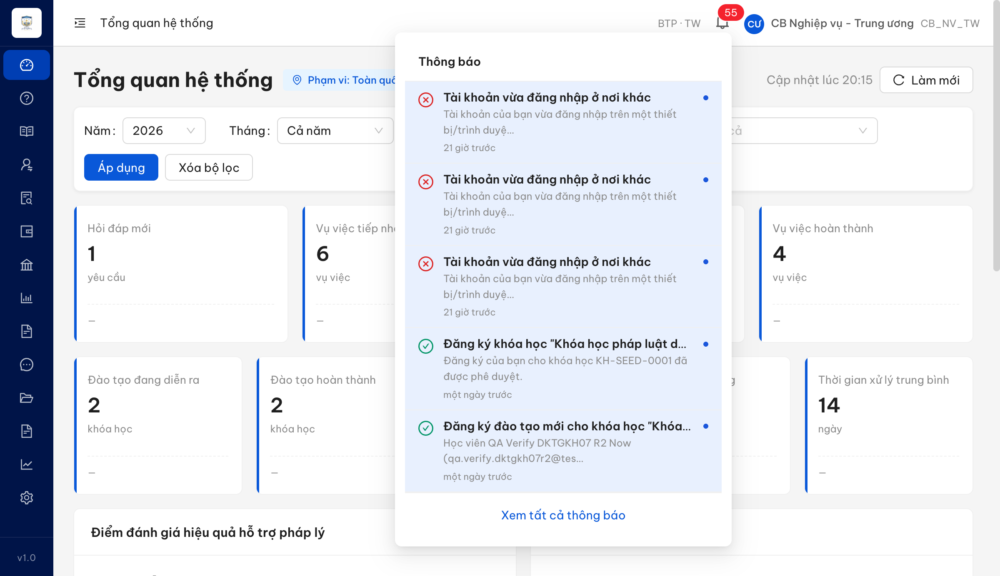
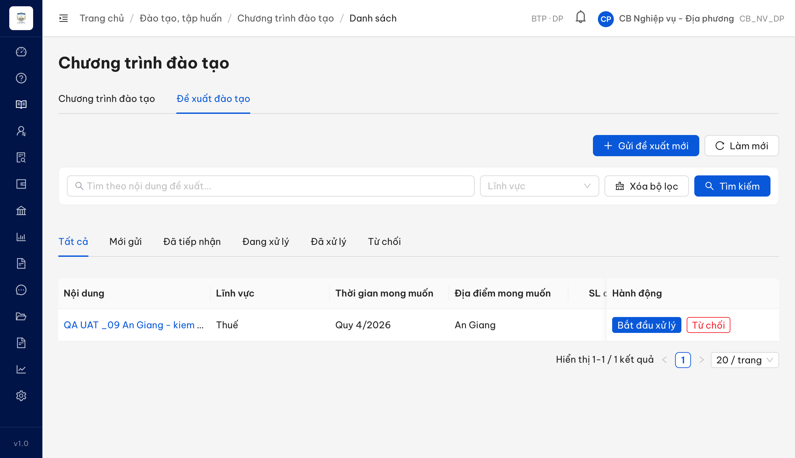
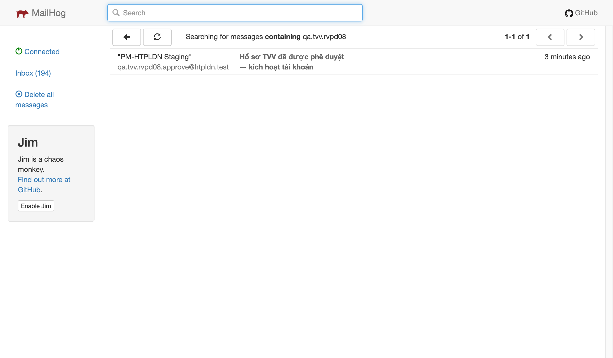
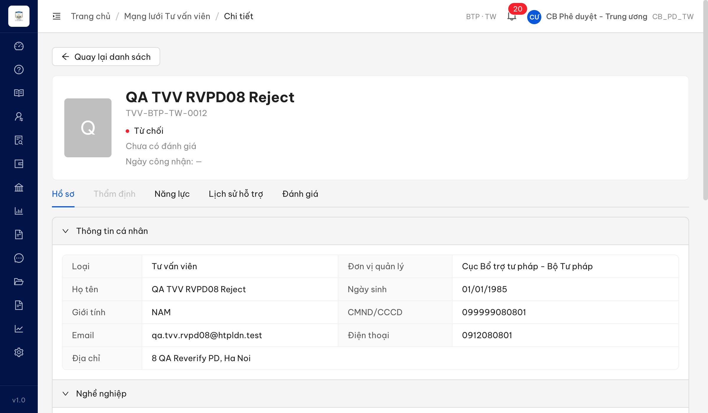
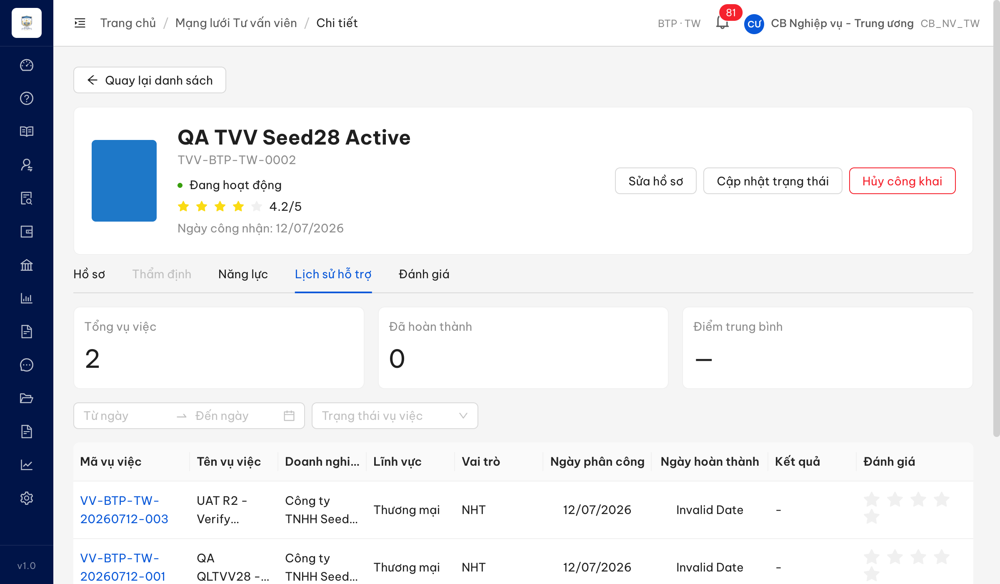

# Báo lỗi UAT tuần 2 — 3 lỗi còn lại (ĐÃ ĐÓNG sau dev fix lần 2)

> **Ngày:** 2026-07-15 · **Người kiểm thử:** QA · **Môi trường:** http://18.143.165.120 (UAT_TGPL Doanh nghiệp — tuần 2)
> **Phạm vi:** 3 lỗi còn lại sau đợt dev fix lần 1. Đợt dev fix lần 2 → re-verify **3/3 PASS (đã đóng)** — chi tiết từng lỗi ở dòng Re-test dưới mỗi mục.

## Tóm tắt

| # | Mã lỗi | Tiêu đề ngắn | Trạng thái | Chức năng (SRS) |
|:-:|---|---|:-:|---|
| 1 | QLDXDTTH_09 | CB Nghiệp vụ không nhận thông báo khi Doanh nghiệp gửi đề xuất đào tạo | ✅ Đã đóng (re-verify PASS 15/07) | FR-III-13 (UC32) |
| 2 | PDHSTVV_08 | Từ chối hồ sơ TVV: chủ hồ sơ không nhận được thông báo kèm lý do | ✅ Đã đóng (re-verify PASS 15/07) | FR-IV-07 (UC45) |
| 3 | QLLSHTCTVV_01 | Cột "Ngày hoàn thành" hiển thị "Invalid Date" cho vụ việc chưa hoàn thành | ✅ Đã đóng (re-verify PASS 15/07) | FR-IV-10 (UC48) |

**Tài khoản dùng để kiểm thử:** `admin/Secret@123`; các tài khoản nghiệp vụ `cbnv_dp`, `cbnv_tw`, `cbpd_tw` mật khẩu `Test@1234`; tài khoản DN `0209888006`.

---

# 1. ~~QLDXDTTH_09~~ [CLOSED] — CB Nghiệp vụ không nhận thông báo khi Doanh nghiệp gửi đề xuất đào tạo

**Trạng thái:** ✅ Closed (re-verify PASS) · **Chức năng:** FR-III-13 (UC32) — Quản lý đề xuất đào tạo

> **Re-test:** 2026-07-15 R2 (chiều) — ✅ PASS (Closed-verified). Tạo đề xuất đào tạo mới route Sở Tư pháp An Giang (dùng NHT An Giang `nht_ag_uat2` — đường DN cần VNeID không truy cập được; thông báo sinh khi tạo đề xuất, không phụ thuộc loại người gửi). Đăng nhập `cbnv_dp` (CB NV An Giang) → chuông hiển thị thông báo **"Đề xuất đào tạo mới — Có đề xuất đào tạo mới từ người dùng QA NHT An Giang UAT2 — một phút trước"**. Hook thông báo cho sự kiện tạo đề xuất nay đã chạy đúng.

> **Lưu ý phạm vi cho Dev:** File này chỉ báo chiều **DN → CB** (khi DN gửi đề xuất thì CB Nghiệp vụ phải nhận thông báo — SRS **bắt buộc**). Chiều ngược lại (CB đổi trạng thái đề xuất thì DN có được báo không) SRS UC32 **không quy định**, đang chờ BA xác nhận — **không nằm trong phạm vi fix lần này**, tránh sửa dư.

### Mô tả

Theo SRS FR-III-13 (UC32), khi Doanh nghiệp/Người hỗ trợ gửi 1 đề xuất đào tạo, hệ thống phải sinh thông báo cho Cán bộ Nghiệp vụ của đơn vị quản lý. Thực tế: sau khi DN gửi đề xuất mới, **không có thông báo nào được sinh cho CB Nghiệp vụ** — cả CB đúng đơn vị lẫn CB cấp toàn quốc đều nhận 0 thông báo về đề xuất. Hệ thống thông báo vẫn hoạt động cho các sự kiện đào tạo khác (ví dụ đăng ký khóa học), nên đây là lỗi riêng của hook thông báo cho sự kiện **tạo đề xuất**.

*Phạm vi đã kiểm:* vai trò CB_NV_DP (đúng đơn vị) + CB_NV_TW (toàn quốc). Chưa kiểm CB_PD/QTHT và chưa kiểm đường tạo đề xuất qua chuyên trang DN đăng nhập VNeID — Dev đối chiếu thêm khi fix.

### Các bước tái hiện

1. Đăng nhập vai trò **DN** (tài khoản `0209888006` — DN thuộc đơn vị Sở Tư pháp An Giang). Vào **Đào tạo, tập huấn → Chương trình đào tạo → tab "Đề xuất đào tạo" → "Gửi đề xuất mới"** → chọn Lĩnh vực + nhập Nội dung → **Gửi đề xuất**. Đề xuất tạo thành công (trạng thái "Mới gửi").
2. Đăng nhập vai trò **CB_NV_DP** (`cbnv_dp`, quyền `read_de_xuat_dao_tao`, **cùng đơn vị Sở Tư pháp An Giang**). Mở chuông **"Thông báo"** trên thanh trên cùng.
3. Kiểm chéo: đăng nhập vai trò **CB_NV_TW** (`cbnv_tw`, phạm vi toàn quốc). Mở chuông **"Thông báo"**.
4. Quan sát: không có thông báo nào về đề xuất đào tạo mới ở cả 2 tài khoản (kiểm cả UI chuông lẫn API danh sách thông báo, lặp nhiều lần trong ~46 giây để loại trừ độ trễ).

### Kết quả mong đợi

- Theo SRS FR-III-13 (UC32) — **Processing (dòng 1019):** *"Validate → Tạo DE_XUAT_DAO_TAO (MOI) → **Thông báo CB NV** → Ghi nhật ký"*; **Postconditions (dòng 1023):** *"Đề xuất được tạo/cập nhật/xóa mềm. **CB NV nhận thông báo**."*
- Khi DN gửi đề xuất, CB Nghiệp vụ của đơn vị quản lý phải nhận được 1 thông báo báo có đề xuất mới cần tiếp nhận.

### Kết quả thực tế

- **CB_NV_DP** (đúng đơn vị Sở Tư pháp An Giang): **0 thông báo** — kiểm 3 mẫu trong 46 giây (loại trừ độ trễ async).
- **CB_NV_TW** (toàn quốc): có sẵn 55 thông báo thuộc các loại `HE_THONG` / `PHE_DUYET` / `PHAN_CONG` / `SLA_CANH_BAO` (kể cả thông báo đào tạo khác như *"Đăng ký đào tạo mới cho khóa học…"*) nhưng **không có thông báo loại "đề xuất đào tạo" nào**, và **không sinh thông báo mới** cho đề xuất vừa tạo.
- ⇒ Hệ thống thông báo hoạt động bình thường cho sự kiện khác; riêng hook thông báo cho sự kiện **tạo đề xuất đào tạo** không chạy.

### Bằng chứng





**Dữ liệu API (phụ trợ):**

```jsonc
// CB_NV_DP (đúng đơn vị An Giang) sau khi DN gửi đề xuất mới (13:06:14 GMT) — 3 mẫu/46s
[{"at":"13:06:36","unread":{"count":0},"total":0,"titles":[]},
 {"at":"13:06:48","unread":{"count":0},"total":0,"titles":[]},
 {"at":"13:07:00","unread":{"count":0},"total":0,"titles":[]}]

// CB_NV_TW (toàn quốc): 55 thông báo, các loại có mặt — KHÔNG có loại/nội dung "đề xuất"
{"unread":{"count":55},"total":55,
 "loaiTypes":["HE_THONG","PHE_DUYET","PHAN_CONG","SLA_CANH_BAO"],
 "dexuatRelated_count":0,
 "recent_after_1250_today":[]}
```

---

# 2. ~~PDHSTVV_08~~ [CLOSED] — Từ chối hồ sơ TVV: chủ hồ sơ KHÔNG nhận được thông báo kèm lý do

**Trạng thái:** ✅ Closed (re-verify PASS) · **Chức năng:** FR-IV-07 (UC45) — Phê duyệt hồ sơ TVV

> **Re-test:** 2026-07-15 R2 (chiều) — ✅ PASS (Closed-verified). CB Phê duyệt (`cbpd_dp`, đúng đơn vị hồ sơ) từ chối hồ sơ TVV-STP-AG-0002 (Chờ phê duyệt) kèm lý do hợp lệ → hồ sơ chuyển "Từ chối" + hộp thư MailHog của chủ hồ sơ `qa.tvv.rv18.dp@htpldn.test` **nhận mail "Hồ sơ TVV bị từ chối" kèm đúng lý do** ("Lý do: ..."). Nhánh từ chối nay đã gửi thông báo kèm lý do cho chủ hồ sơ.

### Mô tả

Cán bộ Phê duyệt từ chối hồ sơ TVV kèm lý do hợp lệ. Hệ thống chuyển trạng thái "Từ chối" và ghi nhận người từ chối / thời điểm / lý do vào hồ sơ **đúng**, nhưng **không gửi bất kỳ thông báo nào cho chủ hồ sơ** — trong khi SRS yêu cầu gửi thông báo kèm lý do. Đối chứng ngay trong cùng phiên: thao tác **phê duyệt** trên hồ sơ khác **có** gửi mail cho chủ hồ sơ ⇒ kênh gửi mail hoạt động bình thường, chỉ **nhánh từ chối** bị thiếu. Hệ quả: ứng viên bị từ chối không biết mình bị từ chối và không biết lý do để bổ sung, nộp lại.

### Các bước tái hiện (đợt kiểm lại 2026-07-15)

1. Đăng nhập `cbpd_tw` — **CB Phê duyệt - Trung ương (CB_PD_TW)**, có quyền phê duyệt / từ chối hồ sơ TVV cùng đơn vị (SCR-IV-03 nút "Từ chối", `srs-fr-04` dòng 1546).
2. Vào **Mạng lưới Tư vấn viên → Tư vấn viên / Chuyên gia** → thẻ **"Chờ phê duyệt"** → mở hồ sơ `TVV-BTP-TW-0012` (chủ hồ sơ `qa.tvv.rvpd08@htpldn.test`).
3. Bấm **"Từ chối"** → nhập lý do hợp lệ (98 ký tự) → bấm **"Xác nhận từ chối"**. Kết quả: toast *"Đã từ chối hồ sơ TVV"*, hồ sơ chuyển trạng thái **"Từ chối"** ✅.
4. **Đối chứng cùng phiên:** phê duyệt hồ sơ khác `TVV-BTP-TW-0013` (chủ hồ sơ `qa.tvv.rvpd08.approve@htpldn.test`).
5. Mở hộp thư MailHog của cả 2 chủ hồ sơ. Quan sát: chủ hồ sơ **được phê duyệt** nhận mail *"Hồ sơ TVV đã được phê duyệt"* trong vài giây; chủ hồ sơ **bị từ chối** chờ >9 giây vẫn **0 mail**.

### Kết quả mong đợi

- Theo **FR-IV-07 (UC45) §Processing bước 4** (`srs-fr-04` dòng 593): *"Gửi thông báo **TVV/CG (chủ hồ sơ)** qua email đã khai"* — áp dụng cho cả nhánh phê duyệt **và** từ chối.
- Theo **§Acceptance Criteria** (dòng 627): *"**Given** CB PD từ chối **When** nhập lý do **Then** TVV → TU_CHOI, **gửi thông báo TVV/CG (chủ hồ sơ)**"*.
- Theo **§3.0b MD-TU-CHOI** (dòng 1398): *"Vui lòng nhập lý do (tối thiểu 10 ký tự) — **lý do sẽ được gửi đến chủ hồ sơ**"*.

### Kết quả thực tế

- Toast *"Đã từ chối hồ sơ TVV"*; hồ sơ chuyển **"Từ chối"**; hồ sơ **có** ghi nhận người từ chối + thời điểm + lý do đúng (phần ghi nhận ĐẠT).
- **Chủ hồ sơ không nhận được gì:** hộp thư MailHog của `qa.tvv.rvpd08@htpldn.test` **không có mail nào** sau thao tác từ chối (chờ >9 giây).
- **Đối chứng chạy tốt:** chủ hồ sơ được phê duyệt (`qa.tvv.rvpd08.approve@htpldn.test`) **nhận** mail *"Hồ sơ TVV đã được phê duyệt"* trong vài giây ⇒ kênh mail hoạt động, riêng **nhánh từ chối** không gửi.

### Bằng chứng





---

# 3. ~~QLLSHTCTVV_01~~ [CLOSED] — Cột "Ngày hoàn thành" hiển thị "Invalid Date" cho vụ việc chưa hoàn thành

**Trạng thái:** ✅ Closed (re-verify PASS) · **Chức năng:** FR-IV-10 (UC48) — Lịch sử hỗ trợ của Tư vấn viên

> **Re-test:** 2026-07-15 R2 (chiều) — ✅ PASS (Closed-verified). Đăng nhập `cbnv_tw` → chi tiết TVV-BTP-TW-0002 → thẻ "Lịch sử hỗ trợ" (không đặt bộ lọc). 3 vụ việc chưa hoàn thành (gồm VV-BTP-TW-20260712-001 "Đã phân công"), cột "Ngày hoàn thành" nay hiển thị **"—"** cho cả 3 — không còn "Invalid Date" (quét toàn thẻ: 0 chuỗi "Invalid Date").

> **Bối cảnh:** Lỗi gốc (*thẻ "Lịch sử hỗ trợ" luôn rỗng, Tổng vụ việc = 0*) đã được **fix** — nay thẻ hiển thị đúng danh sách vụ việc đã phân công + Tổng vụ việc. **Tuy nhiên** cùng luồng này phát sinh 1 lỗi hiển thị mới cần Dev xử lý.

### Mô tả

Trên thẻ **"Lịch sử hỗ trợ"** của chi tiết Tư vấn viên, cột **"Ngày hoàn thành"** hiển thị chuỗi **"Invalid Date"** cho các vụ việc **chưa hoàn thành** (mới ở trạng thái "Đã phân công" / "Đang xử lý"). Với vụ việc chưa hoàn thành, ô này phải để **trống** hoặc hiển thị **"—"**, không được hiển thị "Invalid Date".

### Các bước tái hiện

1. Đăng nhập vai trò **Cán bộ Nghiệp vụ Trung ương (CB_NV_TW)** — tài khoản `cbnv_tw`.
2. Điều kiện tiền đề: có vụ việc **VV-BTP-TW-20260712-001** ở trạng thái **"Đã phân công"** (chưa hoàn thành), người xử lý = **"QA TVV Seed28 Active"** (`TVV-BTP-TW-0002`).
3. Vào **Mạng lưới Tư vấn viên → Tư vấn viên / Chuyên gia** → mở chi tiết `TVV-BTP-TW-0002` (Đang hoạt động).
4. Chọn thẻ **"Lịch sử hỗ trợ"** (không đặt bộ lọc nào).
5. Quan sát cột **"Ngày hoàn thành"** của dòng vụ việc chưa hoàn thành.

### Kết quả mong đợi

- Theo SCR-IV-03 cell 22 (`srs-fr-04` dòng 1567): bảng lịch sử hiển thị Mã vụ việc + Tên + Doanh nghiệp + Lĩnh vực + Vai trò + Ngày phân công + **Ngày hoàn thành** + Kết quả + Đánh giá.
- Với vụ việc **chưa hoàn thành**, cột "Ngày hoàn thành" chưa có giá trị ⇒ phải hiển thị **trống** hoặc **"—"**.
- Không được hiển thị chuỗi lỗi **"Invalid Date"** (kết quả của việc format một giá trị ngày null/rỗng).

### Kết quả thực tế

- Thẻ "Lịch sử hỗ trợ" hiển thị đúng danh sách vụ việc + Tổng vụ việc (lỗi rỗng cũ đã hết).
- Cột **"Ngày hoàn thành"** của vụ việc `VV-BTP-TW-20260712-001` (đang ở "Đã phân công", chưa hoàn thành) hiển thị **"Invalid Date"** thay vì để trống/"—".

### Bằng chứng


