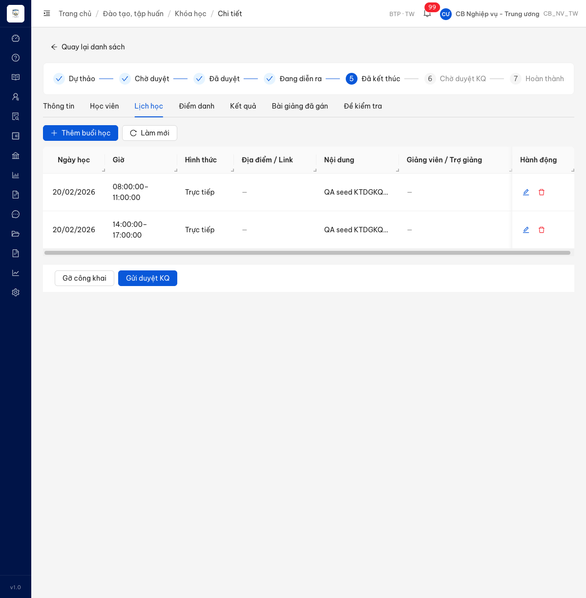

# Bug Report — Điểm danh khóa học (KTDGKQHT_03)

| Thông tin | Giá trị |
|-----------|---------|
| **Dự án** | Phần mềm Hỗ trợ pháp lý doanh nghiệp (PM HTPLDN) |
| **Môi trường** | http://18.143.165.120 |
| **Người test** | QA Automation (Claude Code) |
| **Ngày** | 2026-07-17 |
| **Loại test** | Functional — UAT Tuần 2 (verify bug đối tác) |
| **Round** | Vòng 1 (phát hiện 2026-07-16) — đóng sau khi dev fix, re-test 2026-07-17 |
| **Tài liệu tham chiếu** | `srs-v3.5/srs-fr-03-dao-tao.md` — FR-III-05 (UC24) · SCR-III-02 Tab 4 |

---

## Tổng hợp

**Đã đóng toàn bộ — 1/1 bug Closed.** Phát hiện **1** lỗi có SRS reference cụ thể khi verify TC **KTDGKQHT_03** (Nhập điểm danh thủ công) ngày 16/07/2026; dev fix, re-test 17/07/2026 → PASS.

Tài khoản verify: `cbnv_tw` (CB_NV_TW — quyền quản lý kết quả đào tạo).
Khóa dùng để tái hiện: `5eed0002-0000-4000-8000-000000000001` — "Khóa học pháp luật doanh nghiệp seed" (trạng thái **Đã kết thúc**, có học viên đăng ký **Đã duyệt**).

> **Không thuộc file này:** lần re-test 17/07 phát hiện thêm 1 lỗi khác ở **cùng tab Điểm danh** (buổi học chưa điểm danh nhưng màn hình tự tick sẵn "Vắng không phép" dù dữ liệu lưu là rỗng) — đã tách sang TC riêng **QLKH_03**, theo dõi ở đó.

### Severity breakdown

| Tổng | Critical | Major | Medium | Minor | Trivial | Closed | Open |
|------|----------|-------|--------|-------|---------|--------|------|
| 1    | 0        | 1     | 0      | 0     | 0       | 1      | 0    |

## Bug Summary Table

| Bug ID | Severity | Priority | Type | TC Ref | **SRS Reference** | Title | Status |
|--------|----------|----------|------|--------|-------------------|-------|--------|
| ~~BUG-KTDGKQHT_03~~ | Major | P1 | Workflow | KTDGKQHT_03 | `FR-III-05 (UC24) Inputs dòng 538, 540` · `SCR-III-02 Tab 4 dòng 1822` | Màn Điểm danh không cho chọn buổi học → khóa có nhiều buổi trong cùng 1 ngày thì không lưu được điểm danh (hệ thống từ chối, báo lỗi kỹ thuật) | Closed |

---

## ~~BUG-KTDGKQHT_03~~ [CLOSED] — Không chọn được buổi học khi điểm danh, khóa có nhiều buổi cùng ngày thì không điểm danh được

> **Re-test:** 2026-07-17 vòng 1 (sau khi dev báo fix) — ✅ PASS (Closed-verified). Tab Điểm danh nay dùng **bộ chọn buổi học** (Ngày · Khung giờ · Nội dung) thay ô chọn ngày, kèm dòng hướng dẫn "Vui lòng chọn buổi học để bắt đầu điểm danh"; 2 buổi cùng ngày 20/02/2026 lưu **tách bạch, dữ liệu độc lập**, không còn bị từ chối lưu. Verify bằng `cbnv_tw` trên khóa KH-SEED-0001. Nội dung bên dưới giữ nguyên làm hồ sơ lỗi gốc.

### Mô tả

Ở tab **Điểm danh** (Đào tạo, tập huấn → Khóa học → chi tiết → tab "Điểm danh"), người dùng chỉ chọn được **NGÀY** (ô "Chọn ngày điểm danh"); **không có** chỗ chọn **buổi học**, và bảng điểm danh **không có** cột "Buổi học".

Theo SRS, điểm danh phải gắn với **một buổi học cụ thể** (`lich_hoc_id`), ngày điểm danh chỉ là giá trị suy ra từ buổi. Hệ quả của việc màn hình chỉ neo theo ngày:

- Khóa có **1 buổi trong ngày** → lưu điểm danh **bình thường** (hệ thống tự xác định được buổi duy nhất).
- Khóa có **từ 2 buổi trở lên trong cùng 1 ngày** (ví dụ buổi sáng + buổi chiều) → bấm "Lưu điểm danh" thì hệ thống **từ chối lưu**, báo lỗi *"Có nhiều buổi học cùng ngày — cần truyền lichHocId"*. **Không có cách nào điểm danh được** cho ngày đó, cũng không ghi được "Có mặt buổi sáng, Vắng buổi chiều".

> **2 buổi cùng ngày là tình huống hợp lệ** (không phải dữ liệu bịa): FR-III-22 ràng buộc `ngay_hoc` (dòng 1522) chỉ yêu cầu *"trong khoảng [ngay_bat_dau, ngay_ket_thuc]"*; Processing "Thêm mới buổi" (dòng 1535–1540) và Error Handling (dòng 1584–1589) **không có** bước kiểm tra hay mã lỗi nào cho việc trùng ngày. Thực tế hệ thống cũng cho tạo (trả 201), và chính máy chủ có mã lỗi riêng `ERR-BIZ-III-05-04` *"Có nhiều buổi học cùng ngày"* — tức hệ thống công nhận đây là trạng thái hợp lệ cần xử lý.

Hai điểm phụ ghi nhận cùng lỗi này:
1. Thông báo lỗi hiển thị cho người dùng cuối là **thông điệp kỹ thuật** (*"cần truyền lichHocId"*) — người dùng nghiệp vụ không hiểu và không biết phải làm gì.
2. Phía máy chủ **đã hỗ trợ** việc gắn điểm danh theo buổi (chủ động yêu cầu `lichHocId` và trả về danh sách buổi của ngày đó); phần còn thiếu nằm ở **màn hình điểm danh** — chưa cho chọn buổi và chưa gửi buổi đã chọn khi lưu.

> **Lưu ý (không phải lỗi):** bảng học viên trống cho tới khi người dùng chọn là đúng thiết kế; bảng cũng chỉ hiện học viên có đăng ký **"Đã duyệt"** (khóa test có 8 đăng ký nhưng chỉ 1 "Đã duyệt" → bảng hiện đúng 1 học viên).

### Các bước tái hiện

1. Đăng nhập **`cbnv_tw`** (vai trò **CB_NV_TW** — có quyền "Quản lý kết quả ĐT" theo FR-III-05 PRE-01).
2. Vào **Đào tạo, tập huấn → Khóa học** → mở khóa **"Khóa học pháp luật doanh nghiệp seed"** (`5eed0002-0000-4000-8000-000000000001`, trạng thái **Đã kết thúc**, có 1 học viên đăng ký **Đã duyệt**).
3. Tab **"Lịch học"** → **Thêm buổi học**: ngày **20/02/2026**, giờ **08:00–11:00** (buổi sáng).
4. Tab **"Điểm danh"** → chọn ngày **20/02/2026** → danh sách học viên hiện ra → chọn **"Có mặt"** → bấm **"Lưu điểm danh"**.
   → Quan sát: lưu **thành công**, hiện thông báo *"Đã lưu điểm danh"* (vì ngày này mới chỉ có 1 buổi).
5. Quay lại tab **"Lịch học"** → **Thêm buổi học** thứ 2 **cùng ngày**: **20/02/2026**, giờ **14:00–17:00** (buổi chiều).
6. Sang tab **"Điểm danh"** → chọn lại ngày **20/02/2026**.
   → Quan sát: vẫn chỉ **một** bảng, **một** dòng cho mỗi học viên; **không** có chỗ chọn buổi sáng/chiều; **không** có cột "Buổi học".
7. Đổi trạng thái học viên sang **"Vắng không phép"** → bấm **"Lưu điểm danh"**.
   → Quan sát: thông báo lỗi + hệ thống không lưu.

### Kết quả mong đợi

Theo SRS `srs-fr-03-dao-tao.md`:

- **FR-III-05 (UC24) — Inputs, dòng 538:** `lich_hoc_id` là trường **bắt buộc** — *"Buổi học cụ thể (FK → LICH_HOC, xem FR-III-22) — điểm danh phải gắn với 1 buổi cụ thể"*.
- **FR-III-05 (UC24) — Inputs, dòng 540:** `ngay_diem_danh` — *"Ngày điểm danh (derived từ lich_hoc_id)"* — tức ngày điểm danh **lấy theo buổi đã xác định**; buổi là cái xác định bản ghi, ngày chỉ là hệ quả.
- **FR-III-22, dòng 1506:** *"FR này là prerequisite cho FR-III-05 'Điểm danh' — điểm danh phải gắn với một buổi cụ thể (`lich_hoc_id`)"*.
- **SCR-III-02 Tab 4 (Điểm danh), dòng 1822:** bảng điểm danh có cột *"Buổi học (FK lich_hoc_id)"*.

Vì vậy:

- **Given** người dùng vào tab Điểm danh **When** thực hiện điểm danh **Then** phải xác định được **buổi học cụ thể** đang điểm danh, và bảng hiển thị cột "Buổi học".
- **Given** khóa có 2 buổi cùng ngày 20/02/2026 **When** điểm danh buổi sáng rồi lưu **Then** hệ thống lưu thành công, điểm danh gắn với **buổi sáng**.
- **When** chuyển sang buổi chiều **Then** điểm danh buổi chiều **độc lập** với buổi sáng.
- **When** một học viên "Có mặt" buổi sáng và "Vắng không phép" buổi chiều **Then** hệ thống lưu được **2 trạng thái khác nhau** cho cùng học viên trong cùng ngày.

> **Giới hạn của spec (QA ghi nhận, không suy diễn thêm):** FR-III-05 **không có** section "Inputs — Bộ lọc" (khác FR-III-02 dòng 318, FR-III-06 dòng 631, FR-III-08 dòng 780, FR-III-10 dòng 916 — các FR này đều đặc tả bộ lọc riêng). SCR-III-02 Tab 4 (dòng 1822) chỉ đặc tả **danh sách cột**, không đặc tả điều khiển/bộ lọc. UX-Spec `dac-ta-man-hinh-chuc-nang-v3.5.md — MH-03.2` (SRS dòng 1828 trỏ tới) **không có trong bộ tài liệu bàn giao**.
> → Phạm vi bug này chỉ gồm **2 điểm SRS quy định rõ**: (1) điểm danh phải gắn `lich_hoc_id`; (2) bảng Tab 4 có cột "Buổi học". **Bố cục màn hình / trường bộ lọc nằm ngoài phạm vi bug** — QA không đề xuất phương án bố trí. Lưu ý ô "Chọn ngày điểm danh" hiện có trên UI cũng **không** thuộc đặc tả SRS.

### Kết quả thực tế

- Tab "Điểm danh" chỉ có ô **"Chọn ngày điểm danh"**; **không** có chỗ chọn buổi học. Bảng có các cột: STT · Họ tên · Email · Số điện thoại · Đơn vị · Trạng thái · Ghi chú → **thiếu cột "Buổi học"** (SRS dòng 1822).
- Ngày 20/02/2026 có **2 buổi** (08:00–11:00 và 14:00–17:00) nhưng bảng vẫn chỉ hiện **một** dòng cho mỗi học viên → không phân biệt được buổi sáng / buổi chiều.
- Bấm "Lưu điểm danh" (bước 7) → hệ thống **từ chối lưu**, hiện thông báo đỏ: **"Có nhiều buổi học cùng ngày — cần truyền lichHocId"**. Kiểm tra lại dữ liệu: bản ghi vẫn giữ trạng thái "Có mặt" của lần lưu trước → **thay đổi không được ghi nhận**.
- Tầng API — dữ liệu màn hình gửi đi khi lưu (thiếu buổi học):

```json
POST /api/v1/khoa-hocs/5eed0002-0000-4000-8000-000000000001/diem-danhs/batch-update
{
  "ngayDiemDanh": "2026-02-20",
  "diemDanhs": [ { "hocVienId": "6f32b686-cc04-4b73-b92f-ad211845d642", "trangThai": "VANG_KHONG_PHEP" } ]
}
```

- Phản hồi của máy chủ (HTTP **422**) — máy chủ **đã** hỗ trợ gắn theo buổi và chủ động đòi `lichHocId`:

```json
{
  "success": false,
  "error": {
    "code": "ERR-BIZ-III-05-04",
    "message": "Có nhiều buổi học cùng ngày — cần truyền lichHocId",
    "ngayDiemDanh": "2026-02-20",
    "lichHocIds": ["e2d8044a-b8a3-4b0b-9300-73eea8af0f0c", "5e3767c0-a5f2-4210-a5f4-53893d56ba93"]
  }
}
```

- Đối chiếu: khi ngày **chỉ có 1 buổi** (bước 4), cùng màn hình đó gửi payload cũng **không** có `lichHocId` nhưng máy chủ vẫn lưu được (tự suy ra buổi duy nhất) → trả 200, thông báo *"Đã lưu điểm danh"*. → Lỗi **chỉ lộ ra** khi một ngày có từ 2 buổi trở lên.

### Bằng chứng

**1. Ảnh chụp**




**2. API response / log** *(phụ trợ)*

Log đầy đủ 2 bước (1 buổi → lưu OK 200 · 2 buổi → 422 chặn): [`../reverify-audit/KTDGKQHT_03-PROOF-api-fe-thieu-lichHocId.txt`](../reverify-audit/KTDGKQHT_03-PROOF-api-fe-thieu-lichHocId.txt)

---

## Phụ lục — Môi trường test

| Thành phần | Giá trị |
|------------|---------|
| URL ứng dụng | http://18.143.165.120 |
| OTP login | Lấy từ MailHog |
| MailHog (OTP inbox) | http://18.143.165.120:8025 |
| API base | http://18.143.165.120/api/v1 |
| Frontend | React + Ant Design |
| Xác thực | JWT + OTP |
| Tool test | Chrome DevTools MCP |

> **Ghi chú dữ liệu seed (QA tạo để tái hiện, có thể xóa sau khi dev tiếp nhận):** 2 buổi học ngày 20/02/2026 trên khóa `5eed0002-0000-4000-8000-000000000001` (sáng `e2d8044a-b8a3-4b0b-9300-73eea8af0f0c`, chiều `5e3767c0-a5f2-4210-a5f4-53893d56ba93`) + 1 bản ghi điểm danh "Có mặt" của học viên "QA Import Reverify12 OK".

---

*Bug report generated: 2026-07-16 · Closed 2026-07-17 | QA Automation via Claude Code*
