# Bug Report — UAT Tuần 2 (verify bug đối tác)

| Thông tin | Giá trị |
|-----------|---------|
| **Dự án** | Phần mềm Hỗ trợ pháp lý doanh nghiệp (PM HTPLDN) |
| **Môi trường** | http://18.143.165.120 (env được giao). Đối tác log trên `htpldn-uat.ospgroup.vn` — đã đối chiếu, cùng giao diện/cột. |
| **Người test** | QA Automation (Claude Code) |
| **Ngày** | 2026-07-15 (R2-reverify) |
| **Loại test** | Verify bug đối tác (vòng đầu) |
| **Round** | Tuần 2 |
| **Tài liệu tham chiếu** | SRS v3.5 `srs-fr-03-dao-tao.md` · Sheet UAT_TGPL Doanh Nghiệp-tuần 2 · Video đối tác (Drive) |

---

## Tổng hợp

**Snapshot LATEST (R2-reverify 2026-07-15 chiều):** 74 bug UAT Tuần 2. Sau vòng re-verify dev-fix lần 2: **74/74 Closed** · **0 chưa đóng**. 3 bug còn lại từ đợt trước (`QLDXDTTH_09` Open, `PDHSTVV_08` + `QLLSHTCTVV_01` Reopen) nay dev đã fix → re-verify **3/3 PASS**: (1) tạo đề xuất đào tạo → CB NV nhận thông báo; (2) từ chối hồ sơ TVV → chủ hồ sơ nhận mail kèm lý do; (3) cột "Ngày hoàn thành" hiển thị "—" (hết "Invalid Date").

### Severity breakdown

| Tổng | Critical | Major | Medium | Minor | Trivial | Closed | Open |
|------|----------|-------|--------|-------|---------|--------|------|
| 74   | 2        | 20    | 35     | 17    | 0       | 74     | 0    |

## Bug Summary Table

| Bug ID | Severity | Priority | Type | TC Ref | **SRS Reference** | Title | Status |
|--------|----------|----------|------|--------|-------------------|-------|--------|
| BUG-KTDGKQHT_01 | Medium | P2 | UI/UX | KTDGKQHT_01 | `FR-III-05 §Outputs (srs-fr-03 dòng 574-590)` | Tab "Kết quả" & "Điểm danh" thiếu cột hiển thị (Email/SĐT/Đơn vị/Xếp loại) theo SRS | Closed |
| BUG-TTKTDGKQHT_01 | Medium | P2 | UI/UX | TTKTDGKQHT_01 | `FR-III-06 Tìm kiếm kết quả (srs-fr-03 dòng 616-635)` | Tab "Kết quả kiểm tra" thiếu bộ lọc tìm kiếm kết quả (tên HV/khóa/kết quả) theo SRS | Closed |
| BUG-QLNHCH_08 | Major | P1 | UI/UX | QLNHCH_08 | `FR-III-09 (UC28 – CRUD câu hỏi, srs-fr-03 dòng 823-828)` · thiết kế MH-03.4 | Danh sách Ngân hàng câu hỏi thiếu chức năng Xem chi tiết câu hỏi (chỉ có Sửa/Xóa) | Closed |
| BUG-TKNHCH_05 | Major | P1 | Workflow | TKNHCH_05 | `FR-III-10 (UC29 – Tìm kiếm NHCH, srs-fr-03 dòng 945-948)` | Tìm kiếm câu hỏi theo từ khóa không lọc — không khớp vẫn trả toàn bộ bản ghi | Closed |
| BUG-QLGVTG_02 | Medium | P2 | UI/UX | QLGVTG_02 | `FR-III-11 (UC30 – Outputs, srs-fr-03 dòng 954-969)` | Bảng danh sách Giảng viên/Trợ giảng thiếu cột Vai trò và Lĩnh vực | Closed |
| BUG-TKGVTG_02 | Medium | P2 | UI/UX | TKGVTG_02 | `FR-III-12 (UC31 – Inputs, srs-fr-03 dòng 981-992)` | Thanh tìm kiếm Giảng viên/Trợ giảng thiếu bộ lọc Vai trò | Closed |
| BUG-QLGVTG_03 | Medium | P2 | UI/UX | QLGVTG_03 | `FR-III-11 (UC30 – Inputs, srs-fr-03 dòng 965)` | Biểu mẫu Thêm mới giảng viên thiếu trường "Tệp đính kèm" | Closed |
| BUG-QLGVTG_09 | Minor | P3 | UI/UX | QLGVTG_09 | `FR-III-11 (UC30 – Error Handling, srs-fr-03 dòng 973)` | Màn Sửa giảng viên: thông báo lỗi trường Lĩnh vực hiển thị 2 lần (trùng lặp) | Closed |
| BUG-QLLKHDTBD_06 | Critical | P0 | Workflow | QLLKHDTBD_06 | `FR-III-14 (UC33 – Processing Thêm mới, srs-fr-03 dòng 1082-1088)` | Tạo mới Kế hoạch đào tạo trả lỗi 500 (ERR-SYS-00-00-01) — không tạo được kế hoạch | Closed-verified |
| BUG-PDKQDTTH_01 | Medium | P2 | Workflow | PDKQDTTH_01 | `FR-III-18 (UC37 – Processing + Postconditions, srs-fr-03 dòng 1261, 1265)` | Phê duyệt kết quả đào tạo: không gửi thông báo cho CB Nghiệp vụ | Closed |
| BUG-PDKQDTTH_05 | Medium | P2 | Workflow | PDKQDTTH_05 | `FR-III-18 (UC37 – Processing + Postconditions, srs-fr-03 dòng 1261, 1265)` | Từ chối kết quả đào tạo: không gửi thông báo cho CB Nghiệp vụ (cùng root cause BUG-PDKQDTTH_01) | Closed |
| BUG-QLDXDTTH_09 | Major | P2 | Workflow | QLDXDTTH_09 | `FR-III-13 (UC32 – Processing dòng 1019, Postconditions dòng 1023)` | CB NV không nhận thông báo khi DN gửi đề xuất đào tạo (chiều DN→CB; SRS bắt buộc) | Closed |
| BUG-QLTVV_02 | Minor | P3 | UI/UX | QLTVV_02 | `FR-IV-01 (UC39) · SCR-IV-01 (srs-fr-04 dòng 1442, 1445) · §3.0 (dòng 1337, 1379-1384)` | Danh sách TVV: cột "Loại" hiển thị mã viết tắt "TVV"/"CG" + cột "Điểm ĐG" sai format thiết kế | Closed |
| BUG-QLTVV_04 | Medium | P2 | UI/UX | QLTVV_04 | `FR-IV-05 (UC43) · SCR-IV-03 tab Hồ sơ (srs-fr-04 dòng 1554) · header (dòng 1541) · FR-IV-01 Outputs (dòng 188)` | Chi tiết TVV: nhóm Nghề nghiệp thiếu "Chứng chỉ hành nghề" + "Mô tả kinh nghiệm" (+ Chức vụ, Nơi công tác); cá nhân thiếu Loại + Đơn vị quản lý; điểm ĐG hiển thị /10 thay vì /5 | Closed |
| BUG-QLTVV_10 | Medium | P2 | Data | QLTVV_10 | `FR-IV-02 (UC40 §Processing bước 4, srs-fr-04 dòng 243) · SCR-IV-01 (dòng 1453)` | Xuất Excel Phụ lục 1: cột "Chứng chỉ (tên + ngày cấp)" thiếu ngày cấp (chỉ hiển thị mã số thẻ) — model không có trường chứng chỉ kèm ngày cấp | Closed |
| BUG-QLTVV_12 | Medium | P2 | Data | QLTVV_12 | `FR-IV-02 (UC40 §Processing bước 4, srs-fr-04 dòng 243) · SCR-IV-01 (dòng 1453)` | Xuất Excel Phụ lục 1 khi CÓ bộ lọc: cột "Chứng chỉ (tên + ngày cấp)" vẫn thiếu ngày cấp (cùng root cause BUG-QLTVV_10) | Closed |
| BUG-QLTVV_13 | Minor | P3 | UI/UX | QLTVV_13 | `FR-IV-03 (UC41) · SCR-IV-02 cell 3.7 (srs-fr-04 dòng 1502)` | Form "Thêm mới Tư vấn viên" thiếu trường "Mô tả kinh nghiệm" (đối tác báo thêm "Chứng chỉ hành nghề" — thực tế có ở "Chứng chỉ chi tiết") | Closed |
| BUG-QLTVV_18 | Minor | P3 | Negative | QLTVV_18 | `SCR-IV-02 mục 5.1 (srs-fr-04 dòng 1508) · FR-IV-01 ERR-TVV-07 (dòng 202)` | Upload "File đính kèm" vượt 10 tệp: hệ thống lặng lẽ bỏ tệp thứ 11, KHÔNG hiển thị thông báo lỗi theo SRS | Closed |
| BUG-QLTVV_20 | Minor | P3 | UI/UX | QLTVV_20 | `SCR-IV-02 mục 5.3 (srs-fr-04 dòng 1510)` | Danh sách tệp đã tải thiếu dung lượng (kích thước) + nút "Xem" (chỉ có tên + nút Xóa) | Closed |
| BUG-QLTVV_21 | Major | P1 | Data | QLTVV_21 | `SCR-IV-02 mục 2.3 (srs-fr-04 dòng 1484) · mục 5.1 (dòng 1681) · SCR-IV-03 tab Hồ sơ (dòng 1554)` | Thêm mới TVV hợp lệ: Ảnh chân dung (.png) bị từ chối "Chỉ chấp nhận file PDF" + File đính kèm không gắn vào hồ sơ + Số QĐ không hiển thị | Closed |
| BUG-QLTVV_22 | Medium | P2 | Workflow | QLTVV_22 | `SCR-IV-02 mục 7 thanh hành động (srs-fr-04 dòng 1512) · quy ước hộp thoại xác nhận (dòng 1392)` | Hủy khi có thay đổi chưa lưu: chọn "Ở lại" (giữ form) lại XÓA sạch dữ liệu đã nhập | Closed |
| BUG-QLTVV_23 | Minor | P3 | UI/UX | QLTVV_23 | `SCR-IV-02 cell 3.7 (srs-fr-04 dòng 1502)` | Form "Chỉnh sửa Tư vấn viên" (màn Sửa) thiếu trường "Mô tả kinh nghiệm" (cùng root cause BUG-QLTVV_13; "Chứng chỉ hành nghề" thực tế có ở "Chứng chỉ chi tiết") | Closed |
| BUG-QLTVV_24 | Major | P1 | Workflow | QLTVV_24 | `SCR-IV-02 mục 2.3 (srs-fr-04 dòng 1484)` | Sửa hồ sơ TVV có Ảnh chân dung (.png hợp lệ): bấm Lưu báo "Chỉ chấp nhận file PDF" và chặn luôn việc lưu (cùng root cause BUG-QLTVV_21) | Closed-verified |
| BUG-TKTVV_02 | Medium | P2 | UI/UX | TKTVV_02 | `FR-IV-02 (UC40 §Inputs, srs-fr-04 dòng 230) · SCR-IV-01 (dòng 1432, 1434, 1435)` | Bộ lọc danh sách TVV: "Tổ chức" là ô nhập chữ thay vì danh sách chọn; "Trạng thái" không ẩn khi đang ở thẻ cụ thể; "Lĩnh vực" chỉ chọn được 1 giá trị | Closed |
| BUG-TKTVV_04 | Major | P1 | Workflow | TKTVV_04 | `FR-IV-02 (UC40 §Processing bước 2, srs-fr-04 dòng 241) · §Acceptance Criteria (dòng 271) · §Inputs #4-#5 (dòng 232-233)` | Tìm kiếm TVV: bộ lọc "Tổ chức" và "Trạng thái" bị bỏ qua — trả về bản ghi không khớp tiêu chí đã chọn | Closed |
| BUG-DKTGMLTVV_02 | Minor | P3 | UI/UX | DKTGMLTVV_02 | `SCR-IV-02 mục 2.6 (srs-fr-04 dòng 1487) · mục 2.3 (dòng 1484)` | Form Thêm mới TVV nhóm "Thông tin cá nhân": Giới tính là dropdown 3 giá trị (thừa "Khác") thay vì radio Nam/Nữ; ảnh chân dung không có khu vực xem trước 120x160 | Closed |
| BUG-DKTGMLTVV_03 | Medium | P2 | UI/UX | DKTGMLTVV_03 | `SCR-IV-02 mục 3.2 (srs-fr-04 dòng 1497) · mục 3.7 (dòng 1502)` | Form Thêm mới TVV nhóm "Nghề nghiệp" thiếu 2 trường: "Chứng chỉ hành nghề" và "Mô tả kinh nghiệm" (cùng gốc BUG-QLTVV_13/_23) | Closed |
| BUG-DKTGMLTVV_11 | Minor | P3 | Negative | DKTGMLTVV_11 | `FR-IV-01 §Error Handling E7 / ERR-TVV-07 (srs-fr-04 dòng 202) · SCR-IV-02 mục 5.1 (dòng 1508)` | Tải >10 tệp đính kèm: hệ thống lặng lẽ bỏ tệp thứ 11, không hiển thị thông báo "Tối đa 10 file bằng cấp" (nhánh sai định dạng + vượt dung lượng vẫn báo đúng) | Closed |
| BUG-DKTGMLTVV_14 | Medium | P2 | Workflow | DKTGMLTVV_14 | `SCR-IV-02 mục 7 thanh hành động (srs-fr-04 dòng 1512) · §3.0b quy ước hộp thoại xác nhận (dòng 1392)` | Bấm "Hủy" XÓA TRẮNG biểu mẫu ngay lập tức (trước cả khi hộp thoại hiện) → chọn "Ở lại" không cứu được dữ liệu (cùng gốc BUG-QLTVV_22) | Closed |
| BUG-CNHSNLTVV_02 | Medium | P2 | UI/UX | CNHSNLTVV_02 | `FR-IV-04 (UC42) §Inputs (srs-fr-04 dòng 376-388) · SCR-IV-03 tab Năng lực (dòng 1566)` | Biểu mẫu "Cập nhật năng lực" chỉ có 6/11 trường — thiếu Bằng cấp chi tiết, Chứng chỉ chi tiết, Trình độ, Số năm kinh nghiệm, Số thẻ hành nghề | Closed |
| BUG-QLHSTVV_03 | Minor | P3 | UI/UX | QLHSTVV_03 | `FR-IV-05 (UC43) · SCR-IV-03 thẻ Hồ sơ (srs-fr-04 dòng 1554)` | Thẻ "Hồ sơ" sai bố cục nhóm: "Lĩnh vực" bị gộp vào nhóm Tổ chức thay vì nhóm riêng; thừa nhóm "Ghi chú"; thiếu nhóm "Thông tin công khai" | Closed |
| BUG-QLHSTVV_05 | Major | P1 | Permission | QLHSTVV_05 | `FR-IV-05 (UC43) · SCR-IV-03 thẻ Thẩm định — Điều kiện hiển thị (srs-fr-04 dòng 1555)` | Vai trò Người hỗ trợ (NHT) vẫn thấy thẻ "Thẩm định" và mở được biểu mẫu chấm điểm nội bộ 4 nhóm (TVV Mới đăng ký) | Closed |
| BUG-QLHSTVV_06 | Medium | P2 | UI/UX | QLHSTVV_06 | `FR-IV-05 (UC43) · SCR-IV-03 thẻ Năng lực (srs-fr-04 dòng 1566) · SCR-IV-02 mục 3.3-3.4 (dòng 1498-1499)` | Thẻ "Năng lực": trường "Bằng cấp" in JSON thô ra màn hình; trường "Chứng chỉ" hiển thị "—" dù dữ liệu đã lưu | Closed |
| BUG-TDHSTVV_02 | Minor | P3 | UI/UX | TDHSTVV_02 | `FR-IV-06 (UC44) · SCR-IV-03 tab Thẩm định, Nhóm 1 (srs-fr-04 dòng 1556)` | Nhóm 1 — Pháp lý: mục kiểm tra thứ 4 hiển thị "Không có vi phạm đạo đức nghề nghiệp" thay vì "Không vi phạm" theo SRS | Closed |
| BUG-TDHSTVV_04 | Minor | P3 | UI/UX | TDHSTVV_04 | `FR-IV-06 (UC44) · SCR-IV-03 tab Thẩm định, Nhóm 3 (srs-fr-04 dòng 1558)` | Nhóm 3 — Hiệu quả & uy tín: hộp tích hiển thị "N/A — TVV mới, chưa có lịch sử hỗ trợ" thay vì "Không áp dụng (tư vấn viên mới)"; lẫn viết tắt tiếng Anh | Closed |
| BUG-TDHSTVV_08 | Major | P1 | Workflow | TDHSTVV_08 | `FR-IV-06 (UC44) · SCR-IV-03 nút Lưu nháp (srs-fr-04 dòng 1563) · ô Nhận xét Nhóm 2/3/4 (dòng 1557-1559) · UI-04 (srs-v3.5 dòng 571)` | "Lưu nháp": không hiển thị thông báo; 3 ô Nhận xét không được gửi lên máy chủ (mất dữ liệu); nháp không nạp lại sau khi tải lại trang | Closed |
| BUG-TDHSTVV_12 | Minor | P3 | UI/UX | TDHSTVV_12 | `FR-IV-06 (UC44) · SCR-IV-03 nút Gửi kết quả thẩm định (srs-fr-04 dòng 1564)` | Nút "Gửi KQ" vẫn bật khi chưa chọn "Kết luận thẩm định" (SRS: điều kiện hiển thị = "kết luận đã chọn"); nút "Trình duyệt" cạnh bên khóa đúng | Closed |
| BUG-TDHSTVV_13 | Medium | P2 | UI/UX | TDHSTVV_13 | `UI-04 (srs-v3.5 dòng 571 — "Toast notification cho thao tác thành công") · FR-IV-06 (UC44) · SCR-IV-03 dòng 1564` | "Gửi KQ" kết luận "Yêu cầu bổ sung": đổi trạng thái + lưu lý do ĐÚNG nhưng không hiển thị thông báo thành công nào | Closed |
| BUG-TDHSTVV_14 | Major | P1 | Workflow | TDHSTVV_14 | `FR-IV-06 (UC44) §Preconditions (srs-fr-04 dòng 495) · SCR-IV-03 tab Thẩm định (dòng 1555) · UI-04 (srs-v3.5 dòng 571)` | Thẩm định ở trạng thái không hợp lệ: máy chủ báo ERR-STATE-IV-TD-01 ("sai trạng thái") nhưng giao diện hiện nhầm "Dữ liệu đã bị thay đổi, vui lòng tải lại" → tải lại vô ích | Closed |
| BUG-TDHSTVV_17 | Major | P1 | Workflow | TDHSTVV_17 | `FR-IV-06 (UC44) §Processing bước 4 (srs-fr-04 dòng 518) · §AC (dòng 551) · SCR-IV-03 nút Trình phê duyệt (dòng 1565) + MD-TRINH-DUYET (dòng 1396) · UI-04 (srs-v3.5 dòng 571)` | Trình phê duyệt (CB NV cấp TW): CB Phê duyệt cùng đơn vị KHÔNG nhận được thông báo; mất toàn bộ Nhận xét; không có thông báo thành công; thiếu hộp thoại xác nhận | Closed |
| BUG-TDHSTVV_18 | Major | P1 | Workflow | TDHSTVV_18 | `FR-IV-06 (UC44) §Processing bước 4 (srs-fr-04 dòng 518) · §AC (dòng 551) · §Tác nhân phê duyệt (dòng 570) · SCR-IV-03 nút Trình phê duyệt (dòng 1565) + MD-TRINH-DUYET (dòng 1396) · UI-04 (srs-v3.5 dòng 571)` | Trình phê duyệt (CB NV cấp **Địa phương**): CB Phê duyệt cùng đơn vị KHÔNG nhận được thông báo dù hồ sơ đã vào đúng hàng chờ của họ; không có thông báo thành công; thiếu hộp thoại xác nhận | Closed |
| BUG-PDHSTVV_02 | Medium | P2 | UI/UX | PDHSTVV_02 | `FR-IV-05 (UC43) §Outputs #7 (srs-fr-04 dòng 468) · SCR-IV-03 thẻ Hồ sơ nhóm (e) (dòng 1554) · thẻ Năng lực (dòng 1566)` | Màn Phê duyệt hồ sơ TVV: thẻ Hồ sơ không hiển thị tệp thẻ hành nghề đã lưu ("Chưa có file đính kèm"); thẻ Năng lực in JSON thô ở trường "Bằng cấp" (cùng gốc BUG-QLHSTVV_06) | Closed |
| BUG-PDHSTVV_03 | Minor | P3 | Negative | PDHSTVV_03 | `FR-IV-07 (UC45) §Inputs #4 (srs-fr-04 dòng 581)` | Hộp thoại Phê duyệt: ô "Số quyết định công nhận" cho phép 200 ký tự (SRS: tối đa 100) — nhập 150 ký tự vẫn nhận, không báo lỗi | Closed |
| BUG-PDHSTVV_05 | Major | P1 | Negative | PDHSTVV_05 | `FR-IV-07 (UC45) §Inputs #4 (srs-fr-04 dòng 581) · TU_VAN_VIEN.so_quyet_dinh_cong_nhan (dòng 2025)` | Phê duyệt TVV với Số quyết định SAI MẪU (`A1000@`): hệ thống vẫn duyệt thành công, đổi trạng thái + lưu giá trị sai vào hồ sơ, không báo lỗi | Closed |
| BUG-PDHSTVV_08 | Major | P1 | Workflow | PDHSTVV_08 | `FR-IV-07 (UC45) §Processing bước 4 (srs-fr-04 dòng 593) · §AC (dòng 627) · MD-TU-CHOI (dòng 1398)` | Từ chối hồ sơ TVV: **chủ hồ sơ KHÔNG nhận được thông báo kèm lý do** (luồng phê duyệt cùng phiên vẫn gửi mail bình thường) | Closed |
| BUG-CNDSMLTVV_05 | Critical | P0 | Workflow | CNDSMLTVV_05 | `FR-IV-08 (UC46) §Mô tả [CR-02] (srs-fr-04 dòng 638) · §Processing bước 2 (dòng 657) · §Error Handling (dòng 674-675)` | **Không công khai được TVV lên Cổng PLQG**: backend gọi ra Cổng (mô hình ĐẨY) → 502 `ERR-SYS-IV-CK-02` → rollback. SRS quy định mô hình KÉO, thao tác phải nội bộ hoàn toàn | Closed |
| BUG-DGTVV_03 | Medium | P2 | UI/UX | DGTVV_03 | `FR-IV-09 (UC47) · SCR-IV-03 cell 23c (srs-fr-04 dòng 1570) · quy ước nhận dạng vụ việc: cell 22 (dòng 1567)` | Danh sách đánh giá: cột "Vụ việc" hiển thị mã định danh nội bộ (UUID) thay vì mã/tên vụ việc | Closed |
| BUG-QLLSHTCTVV_01 | Major | P1 | Data | QLLSHTCTVV_01 | `FR-IV-10 (UC48) §Processing bước 1-2 (srs-fr-04 dòng 772-773) · §AC (dòng 801) · SCR-IV-03 cell 22 + 22c (dòng 1567, 1569)` | Tab "Lịch sử hỗ trợ" luôn rỗng (Tổng vụ việc = 0) dù tư vấn viên **đã được phân công vụ việc** — toàn bộ chức năng theo dõi lịch sử không dùng được | Closed |
| BUG-CNTTTVV_06 | Minor | P3 | UI/UX | CNTTTVV_06 | `SCR-IV-02 §Tham chiếu nội bộ (srs-fr-04 dòng 1519 — ERR-CN-02, BR-AUTH-08) · FR-IV-11 (UC49) §Error Handling E2 (dòng 854) · FR-IV-04 §Error Handling E1 (dòng 420)` | Sửa hồ sơ TVV khác đơn vị: thông báo lỗi hiển thị **2 lần trùng lặp** + nội dung không nêu rõ "không có quyền cập nhật hồ sơ" như SRS | Closed |
| BUG-CNTTTVV_07 | Medium | P2 | UI/UX | CNTTTVV_07 | `SCR-IV-02 cell 7 (srs-fr-04 dòng 1512) · MD-XOA (dòng 1404) · SCR-IV-03 cell 20a (dòng 1562)` | Sửa hồ sơ TVV: bấm "Hủy" khi có thay đổi chưa lưu → dữ liệu đang nhập **bị hủy ngay trước khi người dùng xác nhận**; chọn "Ở lại" cũng **không giữ được** dữ liệu (cùng gốc BUG-QLTVV_22 / BUG-DKTGMLTVV_14) | Closed |
| BUG-CNTTHDCTVV_02 | Medium | P2 | UI/UX | CNTTHDCTVV_02 | `FR-IV-12 (UC50) §Error Handling E2 — ERR-TT-02 (srs-fr-04 dòng 914) · §Processing bước 2 (dòng 892) · §AC (dòng 925)` | Vô hiệu hóa TVV còn vụ việc chưa hoàn thành: giao diện hiện **"Có lỗi xảy ra"** trong khi backend đã trả đúng thông báo nghiệp vụ ("đang có 1 vụ việc và 0 hỏi đáp chưa hoàn thành") | Closed |
| BUG-QLTNVV_02 | Minor | P3 | UI/UX | QLTNVV_02 | `FR-V.I-01 (UC51) · SCR-V.I-01 §Thành phần màn hình (srs-fr-05 dòng 1637-1638)` | Danh sách Vụ việc HTPL: 2 cột cuối hiển thị nhãn "Deadline thời hạn" / "Cảnh báo thời hạn" thay vì "Deadline SLA" / "Cảnh báo SLA" theo SRS | Closed |
| BUG-QLTNVV_06 | Medium | P2 | Data | QLTNVV_06 | `BA chốt 2026-07-12 (Excel = đúng tập cột màn hình, đúng tên cột; cột màn hình theo SRS)` · `FR-V.I-01 (UC51) · SCR-V.I-01 (srs-fr-05 dòng 1620, 1630-1638)` | Xuất Excel không khớp tập cột màn hình: **6/9 cột đặt tên khác** ("Cảnh báo thời hạn"→"Mức cảnh báo", "Deadline thời hạn"→"Deadline", "Tên DN"→"Doanh nghiệp"…) + **thừa 2 cột** "Tiêu đề", "Ưu tiên" | Closed |
| BUG-QLTNVV_08 | Major | P1 | UI/UX | QLTNVV_08 | `FR-V.I-01 (UC51) · SCR-V.I-01 §Quy tắc tương tác (srs-fr-05 dòng 1647)` | Danh sách Vụ việc HTPL **không hỗ trợ sắp xếp theo cột**: 10/10 cột không có nút sắp xếp, bấm tiêu đề cột không đổi thứ tự và không gửi tham số sắp xếp | Closed-verified |
| BUG-NHSYC_02 | Medium | P2 | UI/UX | NHSYC_02 | `FR-V.I-04 (UC54) · SCR-V.I-02 §Thành phần màn hình row 30 (srs-fr-05 dòng 1691)` | Form Nhập thủ công — nhóm "Thông tin Tiếp nhận" thiếu trường **"Ngày tiếp nhận"** (SRS: DatePicker bắt buộc, mặc định ngày hiện tại) | Closed |
| BUG-NHSYC_05 | Medium | P2 | Negative | NHSYC_05 | `FR-V.I-04 (UC54) §Inputs #6 (srs-fr-05 dòng 317) · SCR-V.I-02 row 20 (dòng 1681)` | Form Nhập thủ công: "Nội dung yêu cầu" khai trần **50.000 ký tự** (SRS: tối đa 10.000); nhập 10.050 ký tự vẫn nhận, không báo lỗi | Closed |
| BUG-NHSYC_06 | Medium | P2 | Negative | NHSYC_06 | `FR-V.I-04 (UC54) §Inputs #9 (srs-fr-05 dòng 320) · §Error Handling E3 — ERR-NH-03 (dòng 355)` | Tệp đính kèm: vượt **10 tệp** → lặng lẽ bỏ tệp thứ 11 không báo lỗi; vượt **tổng 100MB** (108MB) → không chặn, không báo lỗi (nhánh sai định dạng + vượt 20MB/tệp vẫn báo đúng) | Closed |
| BUG-KTHSYCHTPL_02 | Minor | P3 | UI/UX | KTHSYCHTPL_02 | `FR-V.I-07 (UC57) · SCR-V.I-03 §Thành phần màn hình row 3 (srs-fr-05 dòng 1718)` | Thanh tiến trình màn Chi tiết vụ việc: bước đã hoàn thành **không có dấu ✓** (chỉ là chấm tròn) | Closed |
| BUG-KTHSYCHTPL_02b | Medium | P2 | UI/UX | KTHSYCHTPL_02 | `FR-V.I-07 (UC57) · SCR-V.I-01 §Mức cảnh báo thời hạn (srs-fr-05 dòng 1494-1501, 1646) · BR-SLA-02 (dòng 2416)` | Cảnh báo thời hạn mức "Quá hạn nghiêm trọng": thẻ **nhấp nháy vô hạn**, đáy nhịp mờ còn ~20% độ đậm → **chữ chìm vào nền, không đọc được**. Thiết kế chỉ quy định màu tĩnh. Kèm: **ngưỡng cảnh báo bị cố định trong giao diện** (50/100/200%) thay vì đọc từ cấu hình SLA | Closed |
| BUG-KTHSYCHTPL_03 | Major | P1 | Data | KTHSYCHTPL_03 | `FR-V.I-07 (UC57) · SCR-V.I-03 §Thành phần màn hình row 4 — Accordion 1 (srs-fr-05 dòng 1719)` | Nhóm "Thông tin Doanh nghiệp": **không hiển thị dữ liệu DN** (in "—" dù DB có dữ liệu — API trả `doanhNghiep: null`) + **thiếu 5/9 trường** (Tỉnh/Thành, Loại DN, Quy mô, Người đại diện, SĐT) + thiếu link chi tiết DN | Closed |
| BUG-KTHSYCHTPL_11 | Medium | P2 | Data | KTHSYCHTPL_11 | `FR-V.I-06 (UC56) · SCR-V.I-03 §Thành phần màn hình row 7 — Accordion 4 (srs-fr-05 dòng 1722)` | Kết quả kiểm tra: **không ghi người kiểm tra + ngày kiểm tra**; ô kết luận in chuỗi placeholder **"đã có dữ liệu"** thay vì kết luận thực (Đạt/Không đạt/YCBS) | Closed-verified |
| BUG-KTHSYCHTPL_15 | Medium | P2 | UI/UX | KTHSYCHTPL_15 | `FR-V.I-06 (UC56) · SCR-V.I-03 §Thông báo người dùng chung (srs-fr-05 dòng 1577) · mẫu ERR-PC-05 (dòng 773)` | Cán bộ khác đơn vị kiểm tra hồ sơ: **chặn đúng** nhưng thông báo **sai vai trò** ("người phê duyệt" cho thao tác kiểm tra) + jargon "bản ghi" + **lặp 2 lần** | Closed |
| BUG-KTHSYCHTPL_16 | Medium | P2 | Workflow | KTHSYCHTPL_16 | `FR-V.I-07 (UC57) · SCR-V.I-03 §Thành phần màn hình row 8 — Accordion 5 (srs-fr-05 dòng 1723)` | Nhóm "Phân công Người hỗ trợ / Tư vấn viên" hiển thị ở vụ việc **chưa qua "Đã phân công"** (gốc chung: màn chi tiết bỏ qua điều kiện hiển thị theo trạng thái) | Closed |
| BUG-KTHSYCHTPL_17 | Medium | P2 | Workflow | KTHSYCHTPL_17 | `FR-V.I-07 (UC57) · SCR-V.I-03 §Thành phần màn hình row 9 — Accordion 6 (srs-fr-05 dòng 1724)` | Nhóm "Kết quả hỗ trợ" hiển thị ở vụ việc **chưa qua "Đang xử lý"** (cùng gốc BUG-KTHSYCHTPL_16) | Closed |
| BUG-KTHSYCHTPL_18 | Medium | P2 | Workflow | KTHSYCHTPL_18 | `FR-V.I-07 (UC57) · SCR-V.I-03 §Thành phần màn hình row 10 — Accordion 7 (srs-fr-05 dòng 1725)` | Nhóm "Phê duyệt" hiển thị ở vụ việc **chưa qua "Chờ phê duyệt"** (cùng gốc BUG-KTHSYCHTPL_16) | Closed |
| BUG-KTHSYCHTPL_19 | Medium | P2 | Workflow | KTHSYCHTPL_19 | `FR-V.I-07 (UC57) · SCR-V.I-03 §Thành phần màn hình row 11 — Accordion 8 (srs-fr-05 dòng 1726)` | Nhóm "Đánh giá" hiển thị ở vụ việc **chưa ở "Hoàn thành"/"Đã đánh giá"** (cùng gốc BUG-KTHSYCHTPL_16) | Closed |
| BUG-QLHSVV_02 | Major | P1 | Workflow | QLHSVV_02 | `FR-V.I-07 (UC57 – Processing bước 2, srs-fr-05 dòng 593) · SCR-V.I-01 #21 (dòng 1631) · E1 (dòng 620)` | Danh sách VV: trạng thái "Đang kiểm tra" + "Đang xử lý" **không có nút Sửa** dù SRS chỉ cấm sửa ở "Hoàn thành"/"Đã đánh giá" | Closed |
| BUG-QLHSVV_03 | Major | P1 | UI/UX | QLHSVV_03 | `FR-V.I-07 (UC57 – Inputs, srs-fr-05 dòng 586) · SCR-V.I-01 #21 (dòng 1631) → SCR-V.I-02 #21/#22/#24 (dòng 1673-1676)` | Biểu mẫu Sửa vụ việc: **Lĩnh vực + Loại hình bị khóa** (chữ tĩnh) và **thiếu hẳn trường Ghi chú** | Closed |
| BUG-QLHSVV_05 | Major | P1 | Workflow | QLHSVV_05 | `SCR-V.I-03 #6 — Accordion 3 (srs-fr-05 dòng 1721) · FR-V.I-07 (UC57 – Inputs dòng 585, Processing dòng 595, AC dòng 625)` | Nhóm "Tài liệu đính kèm" **không có nút [+ Thêm tài liệu]** → không upload được tài liệu bổ sung (cả chế độ sửa lẫn xem) | Closed |
| BUG-TKHSYCHTPL_06 | Minor | P3 | UI/UX | TKHSYCHTPL_06 | `FR-V.I-08 (UC58 – Error Handling E1, srs-fr-05 dòng 685; lặp ở dòng 144)` | Tìm kiếm không có kết quả: hiển thị **"Trống"** thay vì **"Không tìm thấy hồ sơ phù hợp"** (INF-VV-TK-01) | Closed |
| BUG-LCNHTCVV_02 | Medium | P2 | UI/UX | LCNHTCVV_02 | `FR-V.I-09 (UC59 – Outputs, srs-fr-05 dòng 750-758) · §Processing BR-CALC-07 (dòng 735-741)` | Gợi ý phân công (thẻ "Cá nhân") là dropdown chuỗi chữ gộp, **thiếu Lĩnh vực chuyên môn + Đơn vị quản lý + Điểm ưu tiên** | Closed |
| BUG-LCNHTCVV_05 | Medium | P2 | Validation | LCNHTCVV_05 | `FR-V.I-09 (UC59 – Inputs dòng 5, srs-fr-05 dòng 720)` | Ghi chú phân công bị chặn cứng ở **500 ký tự** thay vì **1.000** theo SRS; không có bộ đếm ký tự | Closed |
| BUG-LCNHTCVV_07 | Medium | P2 | UI/UX | LCNHTCVV_07 | `FR-V.I-09 (UC59 – Error Handling E4, srs-fr-05 dòng 773)` | Phân công VV khác đơn vị: thông báo **sai vai trò** ("người phê duyệt") + **hiển thị lặp 2 lần** (cùng gốc BUG-KTHSYCHTPL_15) | Closed |
| BUG-LCNHTCVV_08 | Major | P1 | Workflow | LCNHTCVV_08 | `SCR-V.I-03 §Thông báo riêng (srs-fr-05 dòng 1768) · FR-V.I-09 (UC59 – Error Handling E1, dòng 770)` | Phân công **thành công** nhưng hệ thống hiện **đồng thời** thông báo thành công **và** thông báo lỗi "ERR-STATE-VI-10-01: Vụ việc không ở trạng thái cho phép phân công" | Closed |

---

## ~~BUG-KTDGKQHT_01~~ [CLOSED] — Tab "Kết quả" và "Điểm danh" của Khóa học thiếu cột hiển thị so với SRS

> **Re-test:** 2026-07-14 reverify-devfix — ✅ PASS (Closed). Tab Kết quả có đủ cột Email/SĐT/Đơn vị/Xếp loại; tab Điểm danh có Email/SĐT.

### Mô tả

Trong màn Chi tiết khóa học, tab **"Kết quả"** và tab **"Điểm danh"** hiển thị thiếu một số cột mà SRS FR-III-05 (phần Outputs) quy định. Cụ thể tab "Kết quả" thiếu các cột **Email, Số điện thoại, Đơn vị, Xếp loại**; tab "Điểm danh" thiếu cột **Email, Số điện thoại**. Đây là các trường SRS ghi rõ theo "Yêu cầu đối tác mục 05/05b". Đối tác log là "màn hình các tab không giống với thiết kế".

### Các bước tái hiện

1. Đăng nhập role **Cán bộ nghiệp vụ** (tài khoản `cbnv_tw` — CB_NV_TW, có quyền "Quản lý kết quả ĐT" theo FR-III-05 PRE-01).
2. Vào **Đào tạo, tập huấn → Khóa học**, mở chi tiết một khóa có học viên (vd `AAA-KH-TW`).
3. Mở tab **"Kết quả"** → xem các cột của bảng danh sách học viên.
4. Mở tab **"Điểm danh"** → chọn ngày buổi học → xem các cột bảng điểm danh.
5. Quan sát: các cột hiển thị.

### Kết quả mong đợi

- Theo **SRS FR-III-05 §Outputs (srs-fr-03 dòng 574-590)**, danh sách kết quả học tập phải hiển thị đủ các trường, trong đó có **Email, Số điện thoại, Đơn vị** (dòng 580-582, ghi chú "join HOC_VIEN — Yêu cầu đối tác mục 05/05b") và **Xếp loại** (dòng 589, field 12: Giỏi/Khá/Trung bình/Không đạt).

### Kết quả thực tế

- Tab **"Kết quả"** chỉ có 6 cột: `STT, Họ tên, Chuyên cần, Điểm kiểm tra, Kết quả, Ghi chú` → **thiếu Email, SĐT, Đơn vị, Xếp loại**.
- Tab **"Điểm danh"** có 5 cột: `STT, Họ tên, Đơn vị, Trạng thái, Ghi chú` → **thiếu Email, SĐT**.
- Giao diện trên env được giao (`18.143.165.120`) trùng với env đối tác log (`htpldn-uat.ospgroup.vn`) → bug tái hiện trên cả hai.

### Bằng chứng

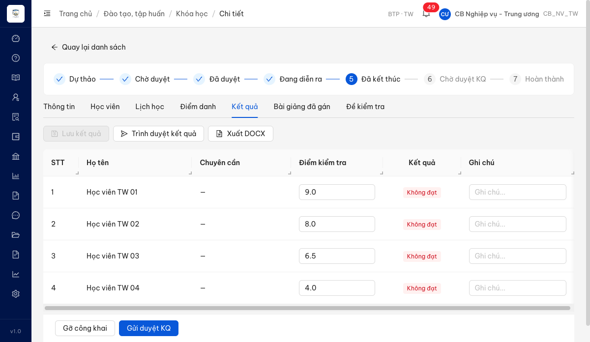

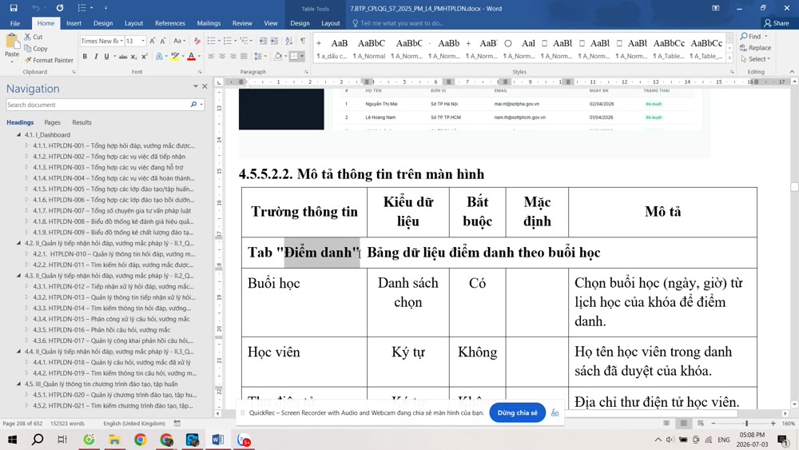

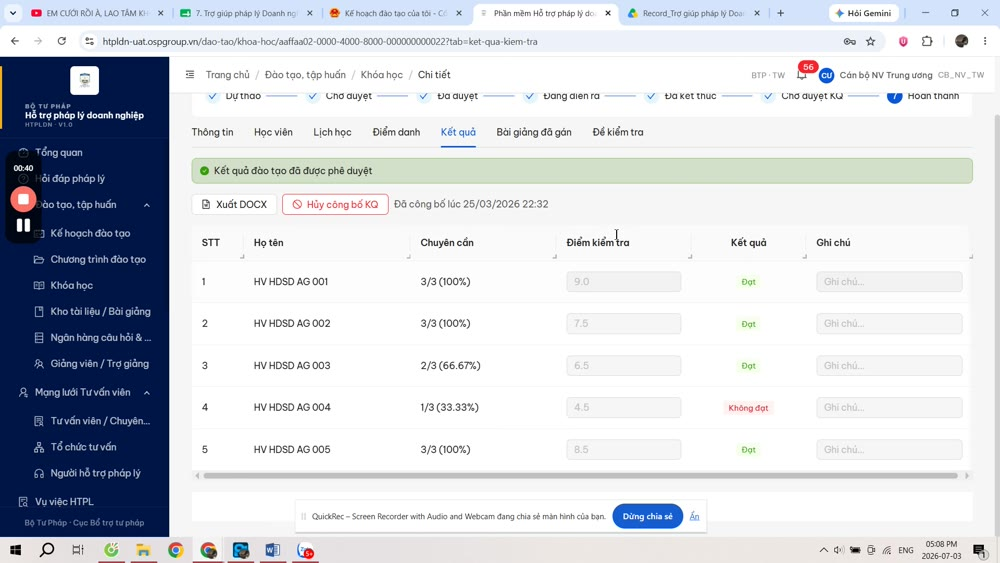

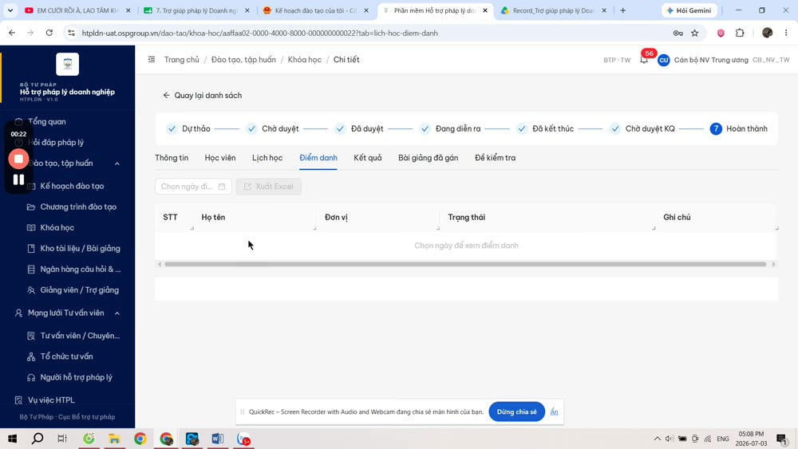

---

## ~~BUG-TTKTDGKQHT_01~~ [CLOSED] — Tab "Kết quả kiểm tra" thiếu bộ lọc tìm kiếm kết quả theo SRS FR-III-06

> **Re-test:** 2026-07-14 reverify-devfix — ✅ PASS (Closed). Tab Kết quả có ô tìm "tên học viên" + lọc "Kết quả"; gõ "TW 03" → lọc còn 1 dòng.

### Mô tả

Trong màn Chi tiết khóa học, tab **"Kết quả kiểm tra"** không hiển thị bất kỳ trường tìm kiếm / bộ lọc nào. SRS FR-III-06 "Tìm kiếm kết quả" (UC25) quy định màn SCR-III-02 tab này phải cho phép tìm kiếm/lọc kết quả đào tạo theo **tên học viên**, **khóa học**, **kết quả (Đạt/Không đạt)**. Đối tác log "Hệ thống không hiển thị các trường thông tin tìm kiếm".

### Các bước tái hiện

1. Đăng nhập role **Cán bộ nghiệp vụ** (tài khoản `cbnv_tw` — CB_NV_TW).
2. Vào **Đào tạo, tập huấn → Khóa học**, mở chi tiết một khóa có kết quả đã công bố (vd `AAA-KH-BN`, trạng thái "Hoàn thành").
3. Mở tab **"Kết quả kiểm tra"**.
4. Quan sát khu vực phía trên bảng danh sách.

### Kết quả mong đợi

- Theo **SRS FR-III-06 §Inputs (srs-fr-03 dòng 616–635)**, tab có bộ lọc tìm kiếm: `tu_khoa` (tìm theo tên học viên), `khoa_hoc_id` (khóa học), `ket_qua` (Đạt/Không đạt) + kết quả phân trang. AC: "CB NV nhập từ khóa → tìm kiếm → hiển thị kết quả phù hợp, phân trang".

### Kết quả thực tế

- Tab "Kết quả kiểm tra" chỉ có: nút **Xuất DOCX**, **Hủy công bố KQ**, bảng danh sách HV + ô **Ghi chú**. **Không có trường tìm kiếm / bộ lọc nào.**
- Tái hiện trên env được giao (`18.143.165.120`, khóa "Hoàn thành") — trùng trạng thái khóa đối tác log.

### Bằng chứng

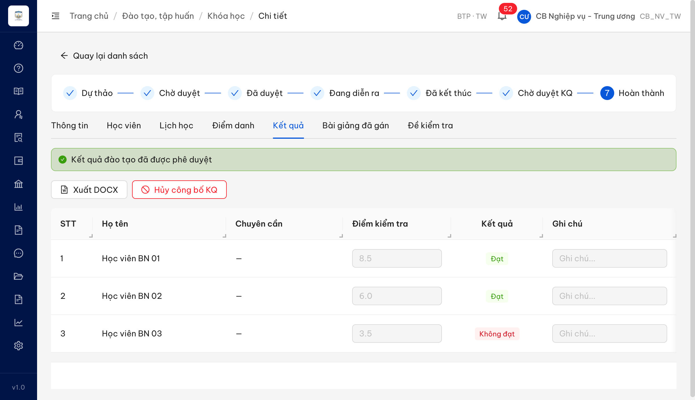

---

## ~~BUG-QLNHCH_08~~ [CLOSED] — Danh sách Ngân hàng câu hỏi thiếu chức năng Xem chi tiết câu hỏi

> **Re-test:** 2026-07-14 reverify-devfix — ✅ PASS (Closed). Cột Hành động có nút Xem → mở modal "Chi tiết câu hỏi" chế độ chỉ đọc.

### Mô tả

Trong màn **Đào tạo, tập huấn → Ngân hàng câu hỏi & Đề kiểm tra**, tab **"Câu hỏi"**, mỗi dòng câu hỏi ở cột "Hành động" chỉ có nút **Sửa** và **Xóa**, không có chức năng **Xem chi tiết** (chỉ đọc). Bấm vào nội dung câu hỏi ở cột đầu cũng không mở màn chi tiết. Danh sách chỉ hiển thị nội dung tóm tắt nên người dùng không có đường nào để xem đầy đủ nội dung câu hỏi, các lựa chọn và đáp án đúng ở chế độ chỉ xem. Thiết kế màn hình nội bộ MH-03.4 (component `CauHoiTab`) có nút "Xem chi tiết" (icon con mắt) + cho bấm nội dung để mở chi tiết, nhưng bản build hiện tại thiếu cả hai. Đối tác log "Màn hình không có nút chức năng Xem".

### Các bước tái hiện

1. Đăng nhập role **Cán bộ nghiệp vụ** (tài khoản `cbnv_tw` — CB_NV_TW, có quyền "Quản lý ngân hàng câu hỏi" theo FR-III-09 PRE-01 — quyền đầy đủ, không phải giới hạn phân quyền).
2. Vào **Đào tạo, tập huấn → Ngân hàng câu hỏi & Đề kiểm tra**, tab **"Câu hỏi"**.
3. Đảm bảo có ít nhất 1 câu hỏi trong danh sách (đã tạo mới 1 câu hỏi trạng thái Kích hoạt để kiểm tra).
4. Xem cột **"Hành động"** của dòng câu hỏi.
5. Bấm vào **nội dung câu hỏi** ở cột đầu tiên.
6. Quan sát: cột Hành động chỉ có Sửa + Xóa; bấm nội dung không mở gì.

### Kết quả mong đợi

- Theo **SRS FR-III-09 (UC28 — CRUD câu hỏi, srs-fr-03 dòng 823-828)**, chức năng "Read" (xem chi tiết) là một phần của CRUD; kết hợp Outputs chỉ hiển thị "Nội dung tóm tắt (200 ký tự)" (dòng 873) nên phải có màn xem chi tiết để đọc đầy đủ.
- Theo **thiết kế màn hình MH-03.4**, mỗi dòng câu hỏi phải có chức năng **Xem chi tiết** hiển thị đầy đủ nội dung câu hỏi, các lựa chọn và đáp án đúng ở chế độ chỉ xem.

### Kết quả thực tế

- Cột "Hành động" mỗi dòng câu hỏi chỉ có **2 nút: Sửa (edit) + Xóa (delete)** — **không có nút Xem chi tiết**.
- Nội dung câu hỏi ở cột đầu là văn bản thuần (`<span>`), **bấm vào không mở** drawer/modal chi tiết nào.
- Không có đường nào để xem chi tiết câu hỏi ở chế độ chỉ đọc (chỉ có thể mở "Sửa" để thấy nội dung — không phải chức năng xem).

### Bằng chứng

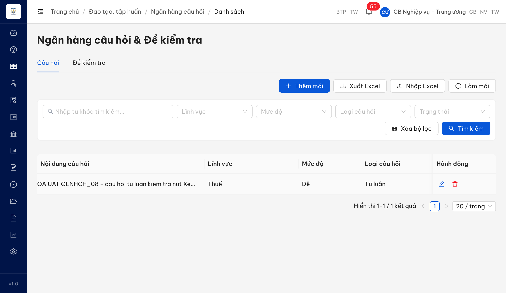

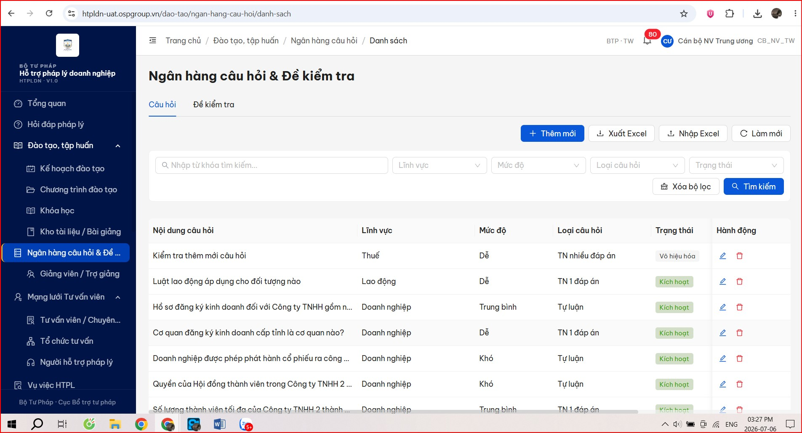

---

## ~~BUG-TKNHCH_05~~ [CLOSED] — Tìm kiếm câu hỏi theo từ khóa không lọc, không khớp vẫn trả toàn bộ

> **Re-test:** 2026-07-14 reverify-devfix — ✅ PASS (Closed). FE gửi param `keyword`; từ khóa không khớp → list 0 dòng + "Không có câu hỏi nào phù hợp".

### Mô tả

Trong màn **Đào tạo, tập huấn → Ngân hàng câu hỏi & Đề kiểm tra**, tab **"Câu hỏi"**, khi nhập từ khóa tìm kiếm không khớp với bản ghi nào rồi bấm "Tìm kiếm", hệ thống **vẫn hiển thị toàn bộ danh sách câu hỏi** thay vì trạng thái không có kết quả. Nguyên nhân từ phía FE: FE gọi API danh sách với tham số `search=<từ khóa>`, nhưng BE lọc theo tham số `keyword` — nên BE bỏ qua `search` và trả về tất cả bản ghi. (Xác nhận qua API: `?search=zzzznomatch999` → total=1 (trả record); `?keyword=zzzznomatch999` → total=0 (lọc đúng).) Đối tác log "Tìm kiếm không có kết quả → hệ thống hiển thị toàn bộ bản ghi".

### Các bước tái hiện

1. Đăng nhập role **Cán bộ nghiệp vụ** (tài khoản `cbnv_tw` — CB_NV_TW, có quyền "Quản lý ngân hàng câu hỏi").
2. Vào **Đào tạo, tập huấn → Ngân hàng câu hỏi & Đề kiểm tra**, tab **"Câu hỏi"** (danh sách có ≥1 câu hỏi).
3. Nhập vào ô "Nhập từ khóa tìm kiếm..." một chuỗi chắc chắn không khớp (VD: `zzzznomatch123khongtontai`) → bấm **Tìm kiếm**.
4. Quan sát danh sách và số kết quả.

### Kết quả mong đợi

- Theo **SRS FR-III-10 (UC29, srs-fr-03 dòng 945-948)**, tìm theo từ khóa phải trả về đúng câu hỏi phù hợp; khi không có câu hỏi khớp thì danh sách rỗng (0 kết quả).

### Kết quả thực tế

- Danh sách **vẫn hiển thị toàn bộ câu hỏi** (total giữ nguyên), từ khóa không được áp dụng lọc.
- API: `GET /api/v1/ngan-hang-cau-hois?search=<từ khóa>` trả về toàn bộ bản ghi (tham số `search` bị BE bỏ qua; BE lọc theo `keyword`).

### Bằng chứng

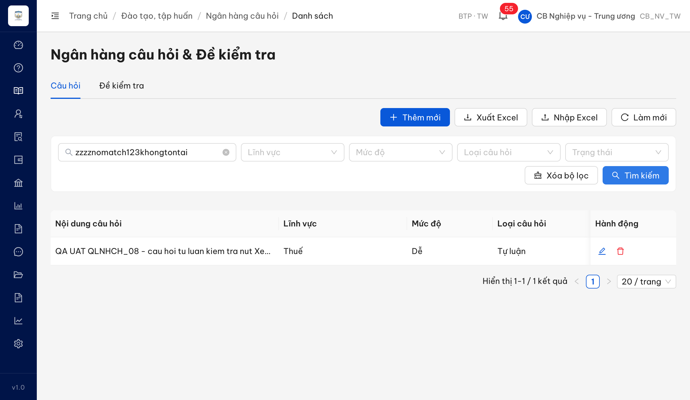

---

## ~~BUG-QLGVTG_02~~ [CLOSED] — Bảng danh sách Giảng viên/Trợ giảng thiếu cột Vai trò và Lĩnh vực

> **Re-test:** 2026-07-14 reverify-devfix — ✅ PASS (Closed). Bảng GV có cột Vai trò + Lĩnh vực.

### Mô tả

Trong màn **Đào tạo, tập huấn → Giảng viên / Trợ giảng**, bảng danh sách hiển thị các cột: Họ tên, Chuyên ngành, Trình độ, Số khóa đã dạy, Trạng thái, Hành động. **Thiếu cột "Vai trò"** (Giảng viên / Trợ giảng) và **cột "Lĩnh vực"** so với SRS. Đối tác log "Bảng danh sách hiển thị thiếu cột thông tin Vai trò, Lĩnh vực pháp lý".

### Các bước tái hiện

1. Đăng nhập role **Cán bộ nghiệp vụ** (tài khoản `cbnv_tw` — CB_NV_TW, có quyền "Quản lý giảng viên").
2. Vào **Đào tạo, tập huấn → Giảng viên / Trợ giảng**.
3. Quan sát các cột của bảng danh sách.

### Kết quả mong đợi

- Theo **SRS FR-III-11 (UC30) §Outputs (srs-fr-03 dòng 954-969)**, danh sách GV có các trường: ho_ten, chuyen_nganh, **vai_tro**, so_khoa_da_day, **linh_vuc** → bảng phải có cột **Vai trò** và **Lĩnh vực**.

### Kết quả thực tế

- Bảng có 6 cột: Họ tên, Chuyên ngành, Trình độ, Số khóa đã dạy, Trạng thái, Hành động.
- **Thiếu cột "Vai trò"** và **cột "Lĩnh vực"**.

### Bằng chứng

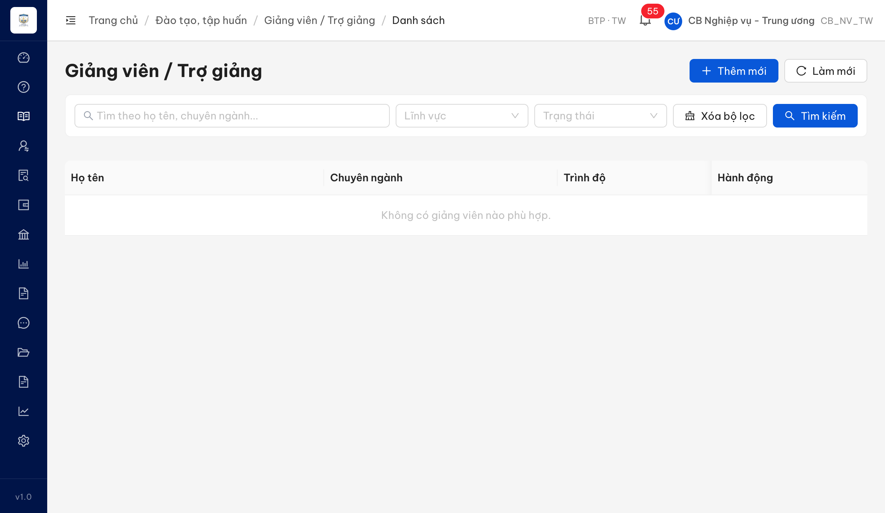

---

## ~~BUG-TKGVTG_02~~ [CLOSED] — Thanh tìm kiếm Giảng viên/Trợ giảng thiếu bộ lọc Vai trò

> **Re-test:** 2026-07-14 reverify-devfix — ✅ PASS (Closed). Thanh tìm kiếm GV có bộ lọc Vai trò.

### Mô tả

Trong màn **Đào tạo, tập huấn → Giảng viên / Trợ giảng**, thanh tìm kiếm hiển thị: ô từ khóa (Tìm theo họ tên, chuyên ngành...), bộ lọc **Lĩnh vực**, bộ lọc **Trạng thái**. **Thiếu bộ lọc "Vai trò"** (Giảng viên / Trợ giảng) so với SRS. Đối tác log "Hệ thống hiển thị thiếu tiêu chí tìm kiếm theo Vai trò".

### Các bước tái hiện

1. Đăng nhập role **Cán bộ nghiệp vụ** (tài khoản `cbnv_tw` — CB_NV_TW, có quyền "Quản lý giảng viên").
2. Vào **Đào tạo, tập huấn → Giảng viên / Trợ giảng**.
3. Quan sát các tiêu chí trên thanh tìm kiếm.

### Kết quả mong đợi

- Theo **SRS FR-III-12 (UC31) §Inputs (srs-fr-03 dòng 981-992)**, tìm kiếm GV có các bộ lọc: tu_khoa, linh_vuc_id, **vai_tro (GIANG_VIEN / TRO_GIANG)** → thanh tìm kiếm phải có bộ lọc **Vai trò**.

### Kết quả thực tế

- Thanh tìm kiếm có: ô từ khóa, bộ lọc Lĩnh vực, bộ lọc Trạng thái.
- **Thiếu bộ lọc "Vai trò"**.

### Bằng chứng


---

## ~~BUG-QLGVTG_03~~ [CLOSED] — Biểu mẫu Thêm mới giảng viên thiếu trường "Tệp đính kèm"

> **Re-test:** 2026-07-14 reverify-devfix — ✅ PASS (Closed). Form Thêm GV có trường Tệp đính kèm (upload ≤10 tệp).

### Mô tả

Trong màn **Đào tạo, tập huấn → Giảng viên / Trợ giảng → Thêm mới**, biểu mẫu tạo giảng viên hiển thị 9 trường: Họ và tên, Chuyên ngành, Trình độ, Tổ chức, Email, Điện thoại, Mô tả năng lực, Lĩnh vực, Trạng thái. **Thiếu trường "Tệp đính kèm"** (upload tệp) so với SRS. Đối tác log "Biểu mẫu thêm mới thiếu trường thông tin Tệp đính kèm".

### Các bước tái hiện

1. Đăng nhập role **Cán bộ nghiệp vụ** (tài khoản `cbnv_tw` — CB_NV_TW, có quyền "Quản lý giảng viên").
2. Vào **Đào tạo, tập huấn → Giảng viên / Trợ giảng**.
3. Bấm **Thêm mới**.
4. Quan sát các trường trên biểu mẫu.

### Kết quả mong đợi

- Theo **SRS FR-III-11 (UC30) §Inputs (srs-fr-03 dòng 965)**, biểu mẫu quản lý giảng viên có các trường nhập, trong đó có **file_dinh_kem (structured, N)** → biểu mẫu phải có trường **"Tệp đính kèm"** (không bắt buộc nhập).

### Kết quả thực tế

- Biểu mẫu có 9 trường: Họ và tên, Chuyên ngành, Trình độ, Tổ chức, Email, Điện thoại, Mô tả năng lực, Lĩnh vực, Trạng thái.
- **Không có trường "Tệp đính kèm"** — không có ô upload tệp nào (kiểm tra DOM: 0 input file, 0 upload widget).

### Bằng chứng

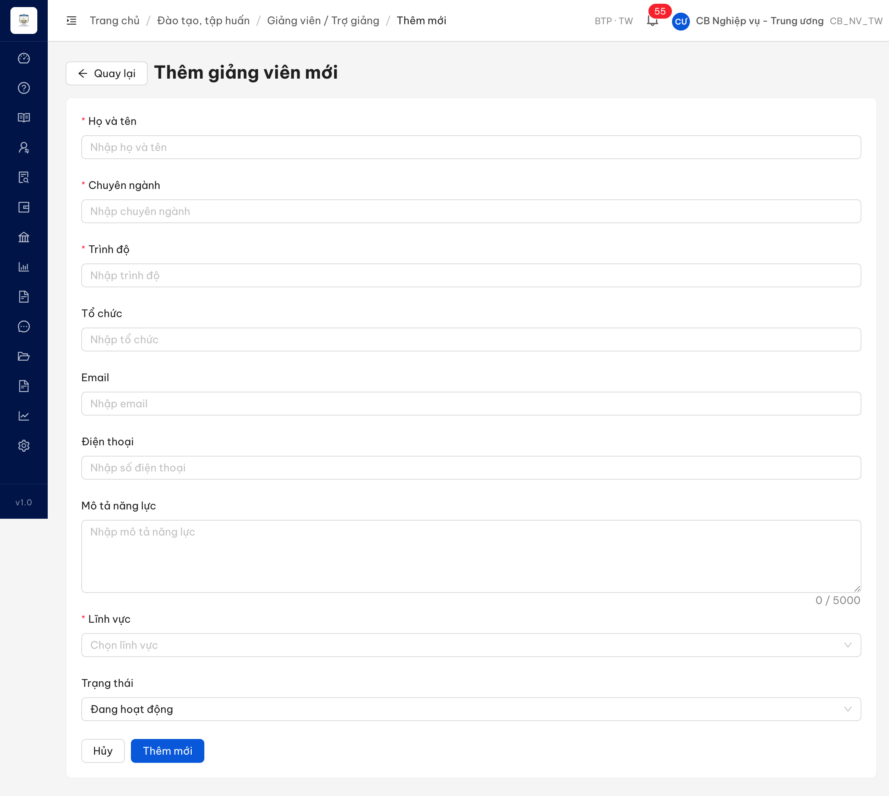

---

## ~~BUG-QLGVTG_09~~ [CLOSED] — Màn Sửa giảng viên: thông báo lỗi trường Lĩnh vực hiển thị 2 lần (trùng lặp)

> **Re-test:** 2026-07-14 reverify-devfix — ✅ PASS (Closed). Sửa GV, xóa Lĩnh vực → Lưu → lỗi hiển thị đúng 1 lần.

### Mô tả

Trong màn **Đào tạo, tập huấn → Giảng viên / Trợ giảng → Sửa** (chi tiết giảng viên, chế độ chỉnh sửa), khi trường bắt buộc **Lĩnh vực** bị bỏ trống (xóa giá trị đang có) và người dùng lưu, hệ thống hiển thị thông báo lỗi **"Vui lòng chọn ít nhất 1 lĩnh vực" 2 lần** (2 dòng đỏ trùng nhau) dưới ô Lĩnh vực. Đối tác log "Thông báo lỗi của trường Lĩnh vực bị duplicate".

### Các bước tái hiện

1. Đăng nhập role **Cán bộ nghiệp vụ** (tài khoản `cbnv_tw` — CB_NV_TW, có quyền "Quản lý giảng viên").
2. Vào **Đào tạo, tập huấn → Giảng viên / Trợ giảng**, bấm **Sửa** một giảng viên đang có Lĩnh vực.
3. Bỏ chọn (xóa) toàn bộ Lĩnh vực → bấm **Lưu**.
4. Quan sát thông báo lỗi dưới ô Lĩnh vực.

### Kết quả mong đợi

- Theo **SRS FR-III-11 (UC30 — Error Handling, srs-fr-03 dòng 973)**, khi trường bắt buộc không hợp lệ, hệ thống hiển thị **một** thông báo lỗi tương ứng cho trường đó.

### Kết quả thực tế

- Thông báo **"Vui lòng chọn ít nhất 1 lĩnh vực"** render **2 element lỗi** (`.ant-form-item-explain-error` × 2) → hiện 2 dòng trùng nhau dưới ô Lĩnh vực.
- Đối chiếu: cùng lỗi bỏ trống Lĩnh vực ở màn **Thêm mới** (bỏ trống từ đầu) chỉ hiển thị **1** dòng → lỗi trùng lặp chỉ xảy ra ở màn **Sửa** khi xóa Lĩnh vực đang có giá trị.
- Trường Điện thoại nhập sai định dạng không báo lỗi — đúng đặc tả (so_dien_thoai là text, không bắt buộc, không ràng buộc định dạng; dòng 965) → không tính là lỗi.

### Bằng chứng

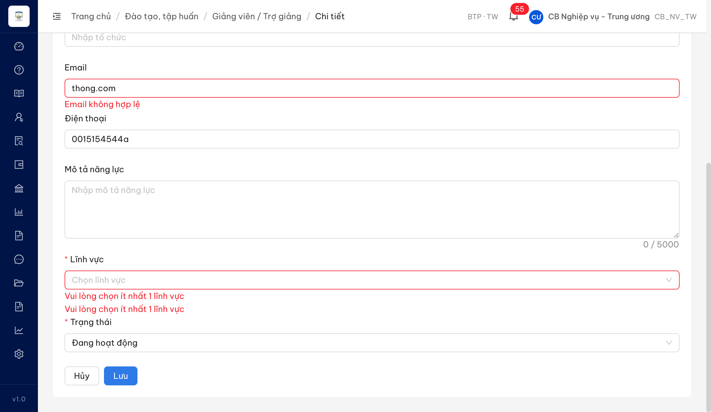

---

## BUG-QLLKHDTBD_06 [CLOSED-VERIFIED] — Tạo mới Kế hoạch đào tạo bỏ trống Ngân sách đã tạo thành công

> **Re-test mới nhất:** 2026-07-15 rv3 — ✅ PASS (Closed-verified). Tạo mới kế hoạch bằng `cbnv_tw`, nhập đủ trường bắt buộc và để trống **Ngân sách dự kiến** → `POST /api/v1/ke-hoach-dao-taos` trả `201`, payload `nganSachDuKien: null`; hệ thống tạo `KH-20260715-0002`, trạng thái Nháp, danh sách hiển thị Ngân sách `—`. Evidence: `image/rv3-QLLKHDTBD_06-reopen-bo-trong-ngan-sach.png`; điều kiện: `../reverify-audit/rv3-conditions/QLLKHDTBD_06.md`.

> **Re-test:** 2026-07-14 reverify-devfix — 🔴 REOPEN (fix một phần). Có nhập "Ngân sách dự kiến" → tạo OK (POST 201); bỏ trống Ngân sách (trường KHÔNG bắt buộc) → vẫn 500 "Lỗi hệ thống" (POST 500).

### Mô tả

Trong màn **Đào tạo, tập huấn → Kế hoạch đào tạo → Thêm mới**, khi nhập đủ các trường bắt buộc (Tên kế hoạch, Năm, Thời gian thực hiện) và bấm **"Thêm mới"**, hệ thống hiển thị toast **"Lỗi hệ thống, vui lòng thử lại sau."** và không tạo được kế hoạch. Nguyên nhân từ máy chủ: `POST /api/v1/ke-hoach-dao-taos` trả **HTTP 500** với mã lỗi `ERR-SYS-00-00-01`. Lỗi xảy ra cả khi CÓ và KHÔNG có tệp đính kèm — bước upload tệp thành công (`POST .../upload` → 201) nhưng bước tạo bản ghi kế hoạch lỗi. Đối tác log "Hệ thống hiển thị thông báo lỗi: Lỗi hệ thống, vui lòng thử lại sau." khi thêm mới hợp lệ.

### Các bước tái hiện

1. Đăng nhập role **Cán bộ nghiệp vụ** (tài khoản `cbnv_tw` — CB_NV_TW, có quyền "Quản lý kế hoạch đào tạo năm" theo FR-III-14 PRE-02).
2. Vào **Đào tạo, tập huấn → Kế hoạch đào tạo**, bấm **Thêm mới**.
3. Nhập: Tên kế hoạch, Năm = 2026, Thời gian thực hiện 01/01/2026 → 31/12/2026 (có thể nhập thêm Nội dung, Nguồn lực, Ghi chú, tệp đính kèm).
4. Bấm **"Thêm mới"**.
5. Quan sát: toast lỗi + kiểm tra network tab.

### Kết quả mong đợi

- Theo **SRS FR-III-14 (UC33) §Processing – Thêm mới (srs-fr-03 dòng 1082-1088)**: khi nhập hợp lệ đủ trường bắt buộc, hệ thống đặt trạng thái = **NHAP**, tạo bản ghi `KE_HOACH_DAO_TAO` + ghi nhật ký, và báo tạo thành công (đối tác kỳ vọng toast "Đã tạo kế hoạch đào tạo").

### Kết quả thực tế

- Toast **"Lỗi hệ thống, vui lòng thử lại sau."** (captured qua MutationObserver: `.ant-message` + `.ant-message-notice-wrapper`). Không có bản ghi mới được tạo.
- `POST /api/v1/ke-hoach-dao-taos` → **500** `{"success":false,"error":{"code":"ERR-SYS-00-00-01","message":"Lỗi hệ thống, vui lòng thử lại sau"}}`.
- Probe qua API cùng payload nhưng **bỏ tệp đính kèm** (`fileDinhKemIds:[]`) → vẫn **500** cùng mã lỗi → lỗi ở endpoint tạo kế hoạch, không phải do tệp.
- Tái hiện trên env được giao (`18.143.165.120`) — trùng triệu chứng đối tác log trên `htpldn-uat.ospgroup.vn`.

### Bằng chứng

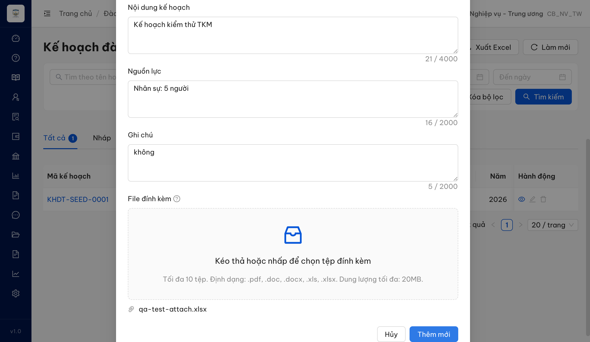

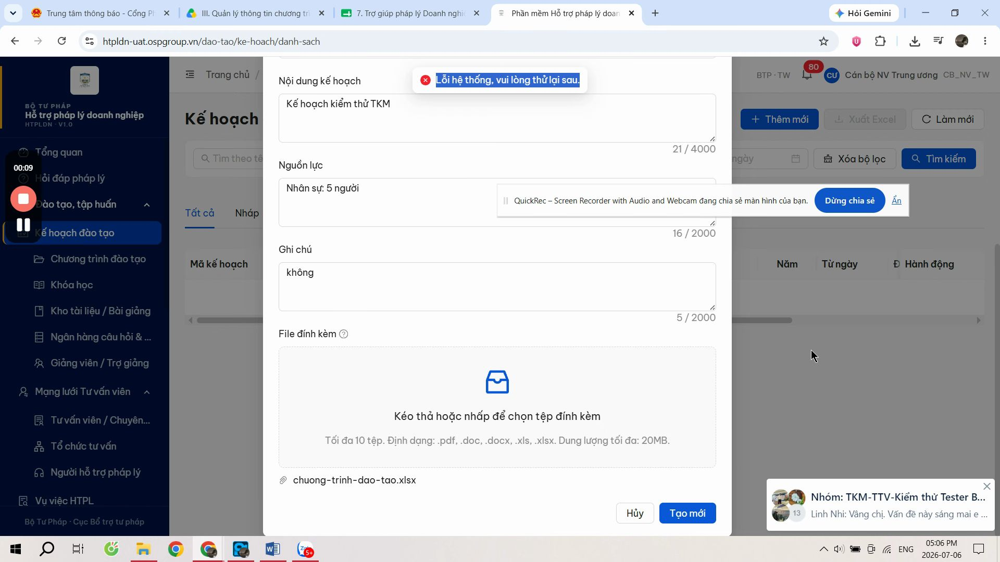

**API response (POST tạo kế hoạch):**

```json
{
  "success": false,
  "error": {
    "code": "ERR-SYS-00-00-01",
    "message": "Lỗi hệ thống, vui lòng thử lại sau",
    "timestamp": "2026-07-11T14:12:25.894Z",
    "requestId": "a1801ec8-cf9b-4ffc-bd44-27d25636096d"
  }
}
```

---

## ~~BUG-PDKQDTTH_01~~ [CLOSED] — Phê duyệt kết quả đào tạo không gửi thông báo cho CB Nghiệp vụ

> **Re-test:** 2026-07-14 reverify-devfix — ✅ PASS (Closed). Tạo cặp TK Sở Tư pháp Hà Nội; cbnv_hn trình duyệt AAA-KH-DP → cbpd_hn duyệt KQ → cbnv_hn NHẬN thông báo "Kết quả khóa học... đã được phê duyệt. Mã: AAA-KH-DP" (2 phút trước).

### Mô tả

Khi **CB Phê duyệt** phê duyệt kết quả đào tạo của một khóa học (khóa chuyển từ "Chờ duyệt kết quả" → "Hoàn thành"), hệ thống **không gửi thông báo cho CB Nghiệp vụ**. Bản thân thao tác phê duyệt thành công (khóa → HOAN_THANH, API `approve-result` trả 200), nhưng bước "Thông báo CB NV" trong quy trình không được thực hiện. Hệ thống thông báo vẫn hoạt động cho CB NV (nhận được các thông báo đăng ký khóa học khác) → thiếu riêng loại thông báo "phê duyệt kết quả đào tạo". Đối tác log "Cán bộ nghiệp vụ không nhận được thông báo".

### Các bước tái hiện

1. Đăng nhập **CB Nghiệp vụ** (`cbnv_tw` — CB_NV_TW). Mở một khóa học "Đã kết thúc" đã nhập đủ kết quả (vd AAA-KH-TW), bấm **"Gửi duyệt KQ"** → khóa chuyển "Chờ duyệt kết quả".
2. Đăng nhập **CB Phê duyệt cùng đơn vị** (`cbpd_tw` — CB_PD_TW, theo BR-FLOW-03). Mở khóa đó, bấm **"Duyệt KQ"** → xác nhận → khóa chuyển "Hoàn thành".
3. Đăng nhập lại **CB Nghiệp vụ** (`cbnv_tw`). Mở chuông **Thông báo** + danh sách thông báo (`GET /api/v1/thong-baos`).
4. Quan sát: có thông báo nào về việc kết quả khóa vừa duyệt đã được phê duyệt không.

### Kết quả mong đợi

- Theo **SRS FR-III-18 (UC37) §Processing (srs-fr-03 dòng 1261)**: "...→ Duyệt: HOAN_THANH → **Thông báo CB NV** → Ghi nhật ký."
- Theo **§Postconditions (dòng 1265)**: "Khóa học HOAN_THANH... **CB NV nhận thông báo**."
- → Sau khi CB PD phê duyệt, CB NV phải nhận được thông báo về việc kết quả đã được phê duyệt.

### Kết quả thực tế

- Thao tác phê duyệt thành công: `POST /api/v1/khoa-hocs/{id}/approve-result` → **200**, khóa chuyển HOAN_THANH.
- Danh sách thông báo của CB NV (`GET /api/v1/thong-baos`, cache-busted, 20 mục mới nhất) **không có** thông báo nào về "phê duyệt kết quả đào tạo" cho khóa vừa duyệt — mục mới nhất đều là "Tài khoản đăng nhập nơi khác" và "đăng ký khóa học" từ hôm trước.
- Chuông thông báo UI: mọi mục "một ngày trước", không có mục "vài giây trước" ứng với lần duyệt.
- CB NV đã là người **trình duyệt kết quả** (submit) + cùng đơn vị khóa học → là người nhận thông báo hợp lý; hệ thống thông báo tới CB NV vẫn hoạt động cho sự kiện khác → xác nhận thiếu riêng thông báo phê duyệt kết quả.
- Tái hiện trên env được giao (`18.143.165.120`), trùng triệu chứng đối tác log trên `htpldn-uat.ospgroup.vn`.

### Bằng chứng

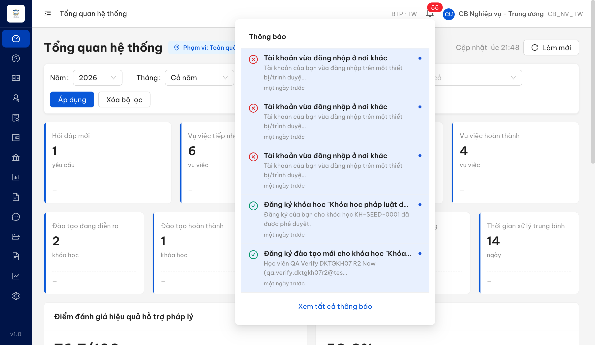

---

## ~~BUG-PDKQDTTH_05~~ [CLOSED] — Từ chối kết quả đào tạo không gửi thông báo cho CB Nghiệp vụ

> **Re-test:** 2026-07-14 23:35 R2 — ✅ PASS (Closed-verified, chạy trực tiếp nhánh từ chối). Seed DDD-KH-012 (Hà Nội) tới "Chờ duyệt KQ" do cbnv_hn trình → cbpd_hn bấm "Từ chối KQ" + nhập lý do → khóa về "Đã kết thúc". cbnv_hn NHẬN thông báo "Kết quả khóa học ... bị từ chối. Mã: DDD-KH-012. Lý do: ..." (23:35, kèm nguyên văn lý do từ chối).

### Mô tả

Cùng root cause với **BUG-PDKQDTTH_01**: cơ chế "Thông báo CB NV" khi CB Phê duyệt xử lý kết quả đào tạo không hoạt động — áp dụng cho **cả** phê duyệt (khóa → "Hoàn thành") **lẫn** từ chối (khóa → "Đã kết thúc" kèm lý do). SRS mô tả 2 nhánh này trong cùng một Processing + cùng một Postcondition "CB NV nhận thông báo". Đối tác log riêng cho luồng từ chối: "Cán bộ nghiệp vụ không nhận được thông báo".

### Các bước tái hiện

1. Đăng nhập **CB Phê duyệt** (`cbpd_tw` — CB_PD_TW). Mở một khóa học ở trạng thái "Chờ duyệt kết quả", bấm **"Từ chối KQ"**, nhập lý do → xác nhận → khóa chuyển "Đã kết thúc".
2. Đăng nhập **CB Nghiệp vụ** (`cbnv_tw` — CB_NV_TW). Mở chuông **Thông báo** + danh sách thông báo.
3. Quan sát: có thông báo về việc kết quả bị từ chối (kèm lý do) không.

### Kết quả mong đợi

- Theo **SRS FR-III-18 (UC37) §Processing (srs-fr-03 dòng 1261)**: "...→ Từ chối: DA_KET_THUC → **Thông báo CB NV** → Ghi nhật ký."
- Theo **§Postconditions (dòng 1265)**: "Khóa học ... DA_KET_THUC (từ chối). **CB NV nhận thông báo**." Kèm lý do từ chối để CB NV rà soát, bổ sung.

### Kết quả thực tế

- Cơ chế thông báo quyết định kết quả đào tạo tới CB NV không phát sinh thông báo nào — xác nhận qua luồng phê duyệt (BUG-PDKQDTTH_01): sau khi CB PD xử lý kết quả, CB NV không nhận thông báo nào về quyết định kết quả, dù các loại thông báo khác vẫn tới CB NV bình thường.
- Danh sách thông báo CB NV không có bất kỳ thông báo loại "phê duyệt/từ chối kết quả đào tạo" nào.
- Đối tác log trên `htpldn-uat.ospgroup.vn` cho luồng từ chối: CB NV không nhận thông báo (video có dialog "Từ chối kết quả" + chuông CB NV không có mục tương ứng).
- *Ghi chú kiểm thử:* trên env được giao, không seed được thêm một khóa "Chờ duyệt kết quả" thứ hai để bấm "Từ chối KQ" trực tiếp (khóa seed có KQ đã dùng cho test phê duyệt; khóa khác thiếu dữ liệu kết quả để trình duyệt). Kết luận dựa trên: cùng cơ chế thông báo đã chứng minh không hoạt động ở nhánh phê duyệt + cùng Postcondition SRS + evidence đối tác.

### Bằng chứng

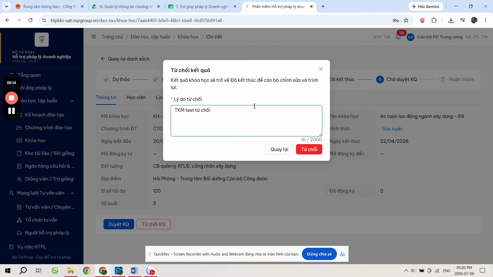

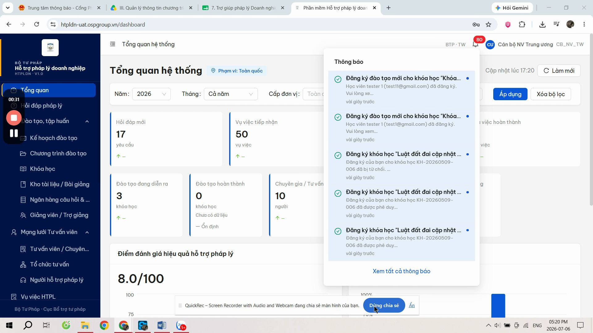


---

## ~~BUG-QLDXDTTH_09~~ [CLOSED] — CB NV không nhận thông báo khi DN gửi đề xuất đào tạo

> **Re-test:** 2026-07-15 R2 (chiều) — ✅ PASS (Closed-verified). Tạo đề xuất đào tạo mới route Sở Tư pháp An Giang (dùng NHT An Giang `nht_ag_uat2` — đường DN cần VNeID không truy cập được; thông báo sinh khi tạo đề xuất, không phụ thuộc loại người gửi) → đăng nhập `cbnv_dp` (CB NV An Giang) thấy chuông có thông báo **"Đề xuất đào tạo mới — Có đề xuất đào tạo mới từ người dùng QA NHT An Giang UAT2 — một phút trước"**. Hook thông báo sự kiện tạo đề xuất nay đã chạy.

> **Nguồn phát hiện:** phát sinh khi verify QLDXDTTH_09. Ý đối tác báo (chiều **CB→DN**: DN không nhận thông báo khi đề xuất đổi trạng thái) → SRS UC32 không quy định → **BA confirm** (xem `ba-confirmation-needed-week-2.md`). Khi kiểm ngược **chiều DN→CB** thì phát hiện thông báo mà SRS **bắt buộc** cho CB NV cũng không sinh → log thành bug Dev này (Open). *(Trước khi gộp có ID tạm `BUG-DEXUAT-NOTIF-CB-01`.)*

### Mô tả

Theo SRS FR-III-13 (UC32), khi Doanh nghiệp/Người hỗ trợ gửi 1 đề xuất đào tạo, hệ thống phải sinh thông báo cho Cán bộ nghiệp vụ của đơn vị quản lý. Thực tế: sau khi DN gửi đề xuất mới, **không có thông báo nào được sinh cho CB NV** — cả CB NV đúng đơn vị lẫn CB NV cấp toàn quốc đều nhận 0 thông báo về đề xuất. Hệ thống thông báo vẫn hoạt động cho các sự kiện đào tạo khác (vd đăng ký khóa học), nên đây là lỗi riêng của hook thông báo sự kiện *tạo đề xuất*.

*Phạm vi đã verify:* role CB_NV_DP (đúng đơn vị) + CB_NV_TW (toàn quốc). Chưa kiểm CB_PD/QTHT và chưa kiểm đường tạo đề xuất qua chuyên trang DN đăng nhập VNeID — Dev đối chiếu thêm khi fix.

### Các bước tái hiện

1. Đăng nhập role **DN** (tài khoản `0209888006` — DN thuộc đơn vị Sở Tư pháp An Giang). Vào **Đào tạo, tập huấn → Chương trình đào tạo → tab "Đề xuất đào tạo" → "Gửi đề xuất mới"** → chọn Lĩnh vực + nhập Nội dung → **Gửi đề xuất**. Đề xuất tạo thành công (trạng thái "Mới gửi").
2. Đăng nhập role **CB_NV_DP** (`cbnv_dp`, quyền `read_de_xuat_dao_tao`, **cùng đơn vị Sở Tư pháp An Giang** — đúng CB NV tiếp nhận đề xuất này). Mở chuông **"Thông báo"** trên thanh trên cùng.
3. Cross-check: đăng nhập role **CB_NV_TW** (`cbnv_tw`, phạm vi toàn quốc). Mở chuông **"Thông báo"**.
4. Quan sát: không có thông báo nào về đề xuất đào tạo mới ở cả 2 tài khoản (kiểm cả UI chuông lẫn API danh sách thông báo, lặp nhiều lần trong ~46s để loại trừ độ trễ).

### Kết quả mong đợi

- Theo SRS FR-III-13 (UC32) — **Processing (dòng 1019):** "Validate → Tạo DE_XUAT_DAO_TAO (MOI) → **Thông báo CB NV** → Ghi nhật ký"; **Postconditions (dòng 1023):** "Đề xuất được tạo/cập nhật/xóa mềm. **CB NV nhận thông báo**."
- Khi DN gửi đề xuất, CB NV của đơn vị quản lý phải nhận được 1 thông báo báo có đề xuất mới cần tiếp nhận.

### Kết quả thực tế

- **CB_NV_DP** (đúng đơn vị Sở Tư pháp An Giang): **0 thông báo** — kiểm 3 mẫu trong 46s (loại trừ độ trễ async).
- **CB_NV_TW** (toàn quốc): có sẵn 55 thông báo thuộc các loại `HE_THONG` / `PHE_DUYET` / `PHAN_CONG` / `SLA_CANH_BAO` (kể cả thông báo đào tạo khác như "Đăng ký đào tạo mới cho khóa học…") nhưng **không có thông báo loại "đề xuất đào tạo" nào**, và **không sinh thông báo mới** cho đề xuất vừa tạo.
- ⇒ Hệ thống thông báo hoạt động bình thường cho sự kiện khác; riêng hook thông báo cho sự kiện **tạo đề xuất đào tạo** không chạy.

### Bằng chứng

**1. Ảnh chụp:**


**2. API response (phụ trợ):**

```jsonc
// CB_NV_DP (đúng đơn vị An Giang) sau khi DN gửi đề xuất mới (13:06:14 GMT) — 3 mẫu/46s
[{"at":"13:06:36","unread":{"count":0},"total":0,"titles":[]},
 {"at":"13:06:48","unread":{"count":0},"total":0,"titles":[]},
 {"at":"13:07:00","unread":{"count":0},"total":0,"titles":[]}]

// CB_NV_TW (toàn quốc): 55 thông báo, các loại có mặt — KHÔNG có loại/nội dung "đề xuất"
{"unread":{"count":55},"total":55,
 "loaiTypes":["HE_THONG","PHE_DUYET","PHAN_CONG","SLA_CANH_BAO"],
 "dexuatRelated_count":0,
 "recent_after_1250_today":[]}
```

---

## ~~BUG-QLTVV_02~~ [CLOSED] — Danh sách Tư vấn viên: cột "Loại" hiển thị mã viết tắt + cột "Điểm ĐG" sai format thiết kế

> **Re-test:** 2026-07-14 22:15:58 R2 — ✅ PASS (Closed-verified). Cột "Loại" nay hiển thị "Tư vấn viên" (nhãn đầy đủ, hết mã viết tắt); cột "Điểm ĐG" hiển thị "4.2/5" + 5 sao cho TVV có đánh giá và "—/5" cho TVV chưa đánh giá (đúng thang /5 + sao).

### Mô tả

Tại màn **Mạng lưới Tư vấn viên → Tư vấn viên / Chuyên gia** (danh sách chính), 2 cột hiển thị sai so với đặc tả: (1) cột **"Loại"** hiển thị mã enum viết tắt **"TVV"/"CG"** thay vì nhãn tiếng Việt đầy đủ; (2) cột **"Điểm ĐG"** chỉ hiển thị **"—"**, không theo format "điểm/5 + sao" mà thiết kế quy định. Đối tác log là "Trường Điểm đánh giá không giống thiết kế" + "Trường Loại viết tắt". (Ý thứ 3 của đối tác — không sắp xếp mặc định theo ngày công nhận — không tính lỗi vì SRS không quy định thứ tự sắp xếp mặc định cho danh sách này.)

### Các bước tái hiện

1. Đăng nhập role **Cán bộ Nghiệp vụ** (`cbnv_tw` — CB_NV_TW, có quyền "Quản lý tư vấn viên" theo FR-IV-01 Preconditions).
2. Vào **Mạng lưới Tư vấn viên → Tư vấn viên / Chuyên gia** (`/chuyen-gia-tvv/danh-sach`).
3. Quan sát cột **"Loại"** và cột **"Điểm ĐG"** của bảng danh sách.

### Kết quả mong đợi

- Cột **"Loại"**: theo **SRS §3.0 bảng ánh xạ Loại (srs-fr-04 dòng 1379-1384)** — TVV → "Tư vấn viên", CG → "Chuyên gia"; và quy ước "**KHÔNG hiển thị mã enum DB cho người dùng cuối**" (dòng 1337). SCR-IV-01 cột "Loại" (dòng 1442) cũng ghi badge "Tư vấn viên"/"Chuyên gia".
- Cột **"Điểm đánh giá"**: theo **SCR-IV-01 (srs-fr-04 dòng 1445)** — hiển thị "số điểm + sao" (vd "4.5/5" + 5 sao); khi chưa có đánh giá hiển thị "—/5".

### Kết quả thực tế

- Cột **"Loại"** hiển thị badge **"TVV"** / **"CG"** (mã enum DB viết tắt).
- Cột **"Điểm ĐG"**: khi TVV chưa có đánh giá → chỉ "—" (không "/5", không sao); khi TVV **có** đánh giá → hiển thị số thô theo thang **/10** kèm 1 sao (evidence đối tác: TVV "TVV R11 Verify Mail Fix" hiện **"8.3"** — vượt 5, không đúng thang "x.x/5 + 5 sao" theo thiết kế).
- Tái hiện trên env được giao `18.143.165.120` (3 bản ghi, Loại="TVV", Điểm ĐG="—" vì chưa có đánh giá) và trùng với evidence đối tác `htpldn-uat.ospgroup.vn` (Loại badge "TVV"/"CG", điểm "8.3" cho TVV có đánh giá).

### Bằng chứng

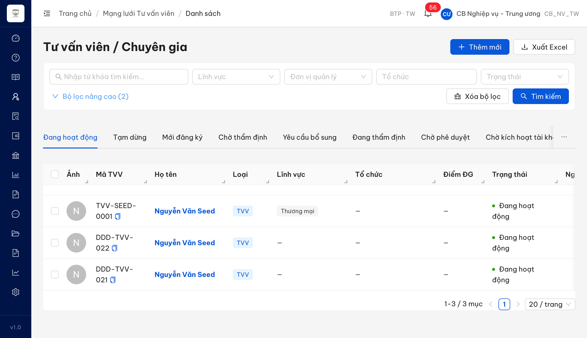

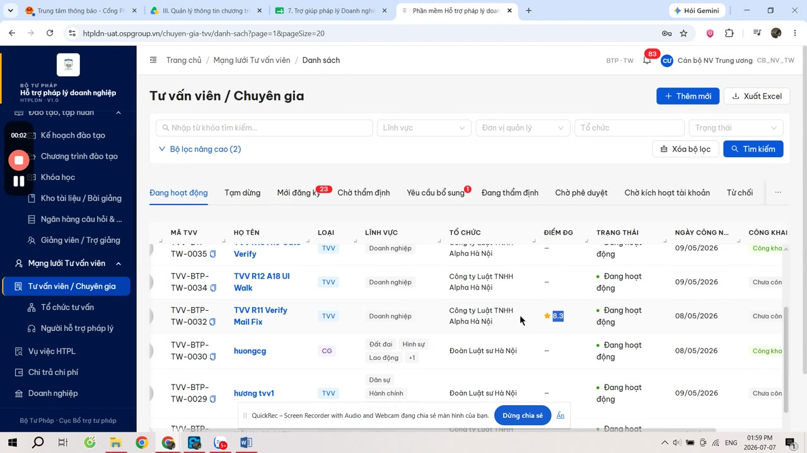

---

## ~~BUG-QLTVV_04~~ [CLOSED] — Chi tiết Tư vấn viên: tab Hồ sơ thiếu trường Chứng chỉ hành nghề / Mô tả kinh nghiệm + Loại / Đơn vị quản lý; điểm đánh giá sai thang

> **Re-test:** 2026-07-14 22:15:58 R2 — ✅ PASS (Closed-verified). Tab Hồ sơ nay có đủ: nhóm Thông tin cá nhân có "Loại" + "Đơn vị quản lý"; nhóm Nghề nghiệp có "Chứng chỉ hành nghề", "Mô tả kinh nghiệm", "Chức vụ", "Nơi công tác"; header điểm ĐG hiển thị "4.2/5" (đúng thang /5).

### Mô tả

Tại màn **Chi tiết Tư vấn viên** (`/chuyen-gia-tvv/:id`, tab **"Hồ sơ"**), một số trường mà SRS SCR-IV-03 (tab Hồ sơ) quy định không hiển thị: nhóm **"Nghề nghiệp"** thiếu **"Chứng chỉ hành nghề"** và **"Mô tả kinh nghiệm"** (cùng "Chức vụ", "Nơi công tác"); nhóm **"Thông tin cá nhân"** thiếu **"Loại"** và **"Đơn vị quản lý"**. Ngoài ra điểm đánh giá trung bình ở đầu trang hiển thị theo thang **/10** (evidence đối tác: "8.3/10") trong khi SRS quy định thang **/5**. Đối tác log: "thẻ giới thiệu thiếu Loại/Tổ chức/Lĩnh vực + điểm ĐG TB không đúng; Nhóm Nghề nghiệp thiếu Mô tả kinh nghiệm, Chứng chỉ hành nghề; thiếu Nhóm Lĩnh vực". *(Làm rõ: "Lĩnh vực" và "Tổ chức" thực tế CÓ hiển thị trong nhóm "Tổ chức & Mạng lưới" — không thiếu; header không bắt buộc chứa các trường này theo SRS.)*

### Các bước tái hiện

1. Đăng nhập role **Cán bộ Nghiệp vụ** (`cbnv_tw` — CB_NV_TW, quyền xem hồ sơ TVV theo FR-IV-05).
2. Vào **Mạng lưới Tư vấn viên → Tư vấn viên / Chuyên gia**, mở **Chi tiết** một TVV (vd `TVV-SEED-0001`).
3. Ở tab **"Hồ sơ"**, xem nhóm **"Thông tin cá nhân"** và nhóm **"Nghề nghiệp"**.
4. Quan sát: các trường hiển thị (field rỗng vẫn render "—" nên field thiếu là do template không có).

### Kết quả mong đợi

- Theo **SRS SCR-IV-03 tab "Hồ sơ" (srs-fr-04 dòng 1554)**: nhóm Nghề nghiệp gồm **chức vụ + nơi công tác + trình độ + chứng chỉ (hành nghề) + số thẻ + kinh nghiệm (mô tả)**; nhóm Thông tin cá nhân gồm **loại + ... + đơn vị quản lý**.
- Theo **SCR-IV-03 header (dòng 1541)** + **FR-IV-01 Outputs #6 (dòng 188)**: điểm đánh giá trung bình theo thang **1.0–5.0** (hiển thị "x.x/5" + sao).

### Kết quả thực tế

- Nhóm **"Nghề nghiệp"** chỉ có: Trình độ (`THAC_SI` — hiển thị mã enum), Chuyên ngành, Số thẻ hành nghề, Số quyết định → **thiếu "Chứng chỉ hành nghề", "Mô tả kinh nghiệm", "Chức vụ", "Nơi công tác"**.
- Nhóm **"Thông tin cá nhân"** thiếu **"Loại"** và **"Đơn vị quản lý"**.
- Đầu trang: điểm đánh giá theo thang **/10** (evidence đối tác "8.3/10") — env được giao chưa có TVV nào có đánh giá để tái hiện số cụ thể, ghi nhận theo evidence + SRS scale.

### Bằng chứng

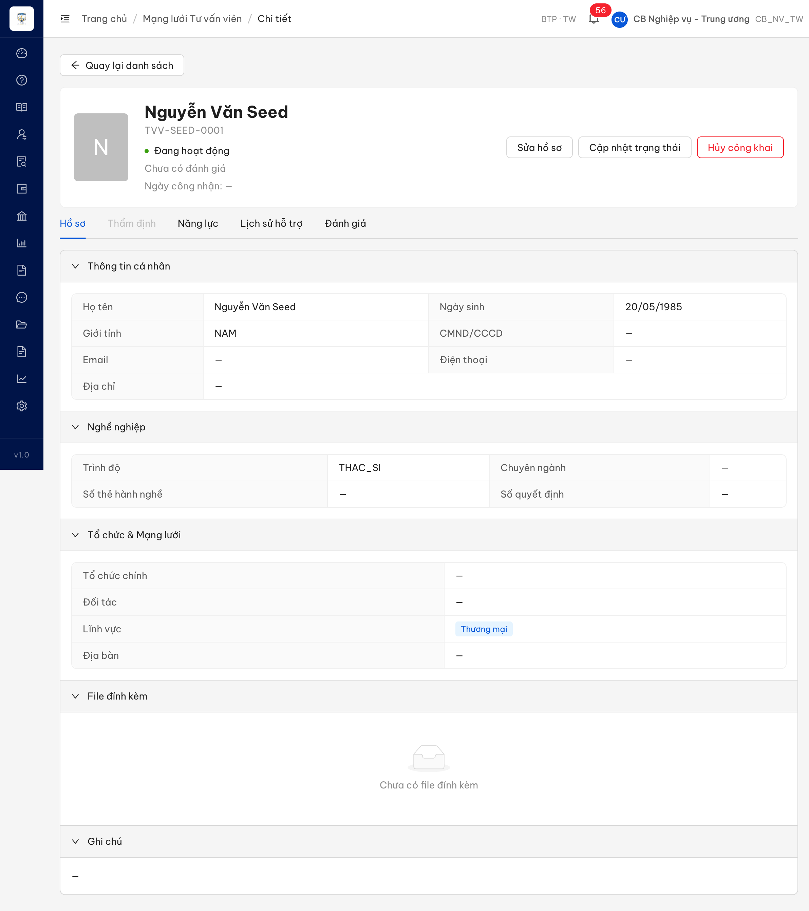


---

## ~~BUG-QLTVV_10~~ [CLOSED] — Xuất Excel Phụ lục 1: cột "Chứng chỉ (tên + ngày cấp)" thiếu ngày cấp

> **Re-test:** 2026-07-14 22:15:58 R2 — ✅ PASS (Closed-verified). File Excel xuất (không lọc): cột "Chứng chỉ (tên + ngày cấp)" nay = "Chung chi hanh nghe Luat su (15/3/2012)" — có tên chứng chỉ kèm ngày cấp (dev đã bổ sung trường Chứng chỉ chi tiết có ngày cấp vào mô hình dữ liệu).

### Mô tả

Khi xuất danh sách Tư vấn viên ra Excel theo **Phụ lục 1 — QĐ 1322/QĐ-BTP** (nút "Xuất Excel" trên màn danh sách, không áp dụng bộ lọc), cột số 7 **"Chứng chỉ (tên + ngày cấp)"** chỉ hiển thị mã/số thẻ hành nghề, **KHÔNG có ngày cấp**. Nguyên nhân gốc: mô hình dữ liệu TVV hiện không có trường lưu chứng chỉ chi tiết kèm ngày cấp (chỉ có "số thẻ hành nghề" là một chuỗi mã đơn) — không tồn tại nguồn dữ liệu ngày cấp để đưa vào file.

### Các bước tái hiện

1. Đăng nhập role **Cán bộ Nghiệp vụ** (`cbnv_tw` — CB_NV_TW, quyền xuất Excel theo FR-IV-02).
2. Vào **Mạng lưới Tư vấn viên → Tư vấn viên / Chuyên gia**.
3. Bấm **"Xuất Excel"** (không áp dụng bộ lọc). Mở file `.xlsx`.
4. Xem cột 7 **"Chứng chỉ (tên + ngày cấp)"** cho các TVV có chứng chỉ/số thẻ.

### Kết quả mong đợi

- Theo **SRS FR-IV-02 §Processing bước 4 (srs-fr-04 dòng 243)** và **SCR-IV-01 (dòng 1453)**: file Excel gồm 10 cột cố định, trong đó cột "Chứng chỉ" phải chứa **tên chứng chỉ + ngày cấp**.

### Kết quả thực tế

- Cột "Chứng chỉ (tên + ngày cấp)" chỉ có mã/số thẻ, **không có ngày cấp**.
- Tái hiện real-data trên env được giao: seed 1 TVV (`TVV-SEED-0001`) có "số thẻ hành nghề" = `STHN-QA-TEST-2243` → xuất Excel → cột "Chứng chỉ (tên + ngày cấp)" chỉ ra `STHN-QA-TEST-2243`, không ngày cấp — giống hệt evidence đối tác ("THE-TVV-AG-01", "STHN-2344/2243"). (Đã hoàn tác seed sau kiểm thử.)
- Kiểm mô hình dữ liệu qua API `GET /api/v1/tu-van-viens/:id`: không có trường chứng chỉ chi tiết / ngày cấp chứng chỉ (chỉ `soTheHanhNghe`).

### Bằng chứng

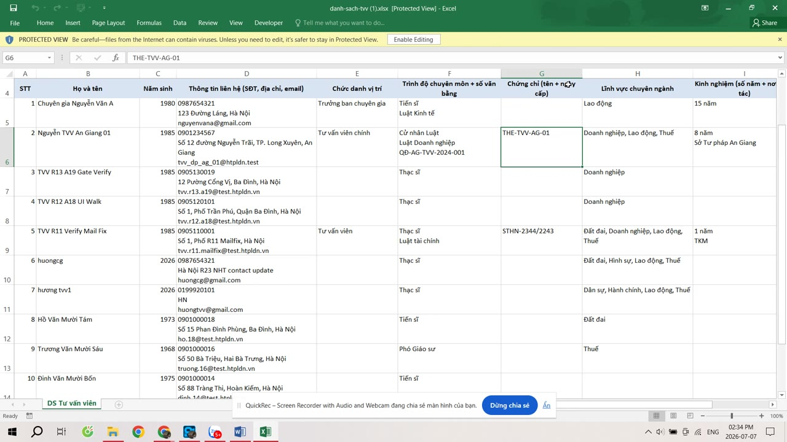

*(File tái hiện trên env được giao: `reverify-audit/QLTVV_10-web-export-seeded-chungchi.xlsx` — cột 7 = "STHN-QA-TEST-2243", không ngày cấp.)*

---

## ~~BUG-QLTVV_12~~ [CLOSED] — Xuất Excel Phụ lục 1 (có bộ lọc): cột "Chứng chỉ (tên + ngày cấp)" vẫn thiếu ngày cấp

> **Re-test:** 2026-07-14 22:15:58 R2 — ✅ PASS (Closed-verified). File Excel xuất khi CÓ bộ lọc (từ khóa "Seed28", 1 record): cột "Chứng chỉ (tên + ngày cấp)" = "Chung chi hanh nghe Luat su (15/3/2012)" — có tên + ngày cấp (cùng fix với QLTVV_10).

### Mô tả

Giống BUG-QLTVV_10 nhưng cho trường hợp **có áp dụng bộ lọc** trước khi xuất. Cột **"Chứng chỉ (tên + ngày cấp)"** trong file Excel xuất theo Phụ lục 1 (QĐ 1322/QĐ-BTP) chỉ hiển thị mã/số thẻ, **không có ngày cấp**. Cùng nguyên nhân gốc: mô hình dữ liệu TVV không có trường lưu chứng chỉ kèm ngày cấp.

### Các bước tái hiện

1. Đăng nhập role **Cán bộ Nghiệp vụ** (`cbnv_tw` — CB_NV_TW).
2. Vào **Mạng lưới Tư vấn viên → Tư vấn viên / Chuyên gia**, chọn 1 tiêu chí lọc có kết quả.
3. Bấm **"Xuất Excel"**. Mở file, xem cột "Chứng chỉ (tên + ngày cấp)".

### Kết quả mong đợi

- Theo **SRS FR-IV-02 §Processing bước 4 (srs-fr-04 dòng 243)** + **SCR-IV-01 (dòng 1453)**: cột "Chứng chỉ" phải chứa tên chứng chỉ + ngày cấp (áp dụng cho cả khi có bộ lọc).

### Kết quả thực tế

- Cột "Chứng chỉ (tên + ngày cấp)" chỉ có mã/số thẻ, **không ngày cấp**.
- Tái hiện real-data trên env được giao: seed số thẻ `STHN-QA-TEST-2243` cho `TVV-SEED-0001` → xuất Excel với bộ lọc → cột 7 = `STHN-QA-TEST-2243`, không ngày cấp. (Đã hoàn tác seed.)

### Bằng chứng

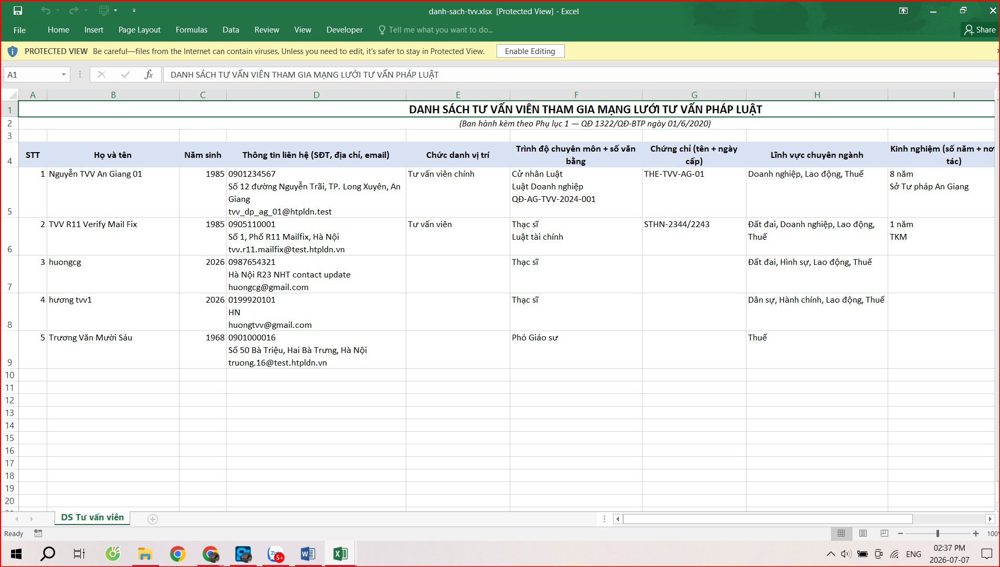

*(File tái hiện env được giao: `reverify-audit/QLTVV_12-web-export-filtered-seeded.xlsx`.)*

---

## ~~BUG-QLTVV_13~~ [CLOSED] — Form "Thêm mới Tư vấn viên" thiếu trường "Mô tả kinh nghiệm"

> **Re-test:** 2026-07-14 22:15:58 R2 — ✅ PASS (Closed-verified). Form Thêm mới TVV nhóm "Nghề nghiệp" nay có trường "Mô tả kinh nghiệm" (textarea đa dòng, bộ đếm 0/5000 ký tự) + "Chứng chỉ hành nghề".

### Mô tả

Biểu mẫu **"Thêm mới Tư vấn viên"** (`/chuyen-gia-tvv/tao-moi`), nhóm **"Nghề nghiệp"**, **không có trường "Mô tả kinh nghiệm"** mà SRS SCR-IV-02 (cell 3.7) quy định. Đối tác báo thêm "thiếu Chứng chỉ hành nghề" — nhưng thực tế form CÓ mục **"Chứng chỉ chi tiết"** (bảng tên chứng chỉ + ngày cấp + nơi cấp), nên phần này không thiếu. *(Đối tác không đính kèm ảnh/video cho case QLTVV_13; kết luận dựa trên verify trực tiếp trên web đối chiếu SRS, + evidence case liên quan QLTVV_23 form Sửa cùng field.)*

### Các bước tái hiện

1. Đăng nhập role **Cán bộ Nghiệp vụ** (`cbnv_tw` — CB_NV_TW, quyền quản lý TVV theo FR-IV-01/03).
2. Vào **Mạng lưới Tư vấn viên → Tư vấn viên / Chuyên gia**, bấm **"+ Thêm mới"**.
3. Mở nhóm **"Nghề nghiệp"**, xem các trường.

### Kết quả mong đợi

- Theo **SRS SCR-IV-02 cell 3.7 (srs-fr-04 dòng 1502)**: nhóm Thông tin nghề nghiệp phải có trường **"Mô tả kinh nghiệm"** (ô văn bản dài, tối đa 5000 ký tự).

### Kết quả thực tế

- Nhóm "Nghề nghiệp" gồm: Trình độ học vấn, Chuyên ngành, Chức vụ, Nơi công tác, Số năm kinh nghiệm, Số thẻ hành nghề, File thẻ hành nghề, Bằng cấp chi tiết, Chứng chỉ chi tiết.
- **Không có trường "Mô tả kinh nghiệm"** (chỉ có "Số năm kinh nghiệm" là số + "Ghi chú" chung ở nhóm khác — không thay thế được).

### Bằng chứng

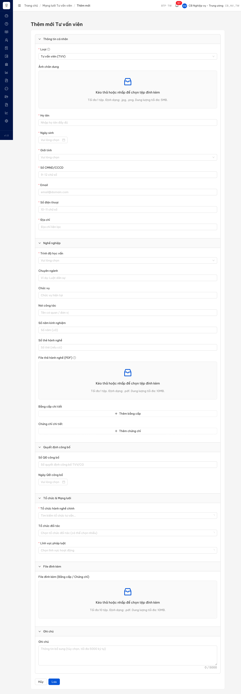

---

## ~~BUG-QLTVV_18~~ [CLOSED] — Upload "File đính kèm" vượt 10 tệp không hiển thị thông báo lỗi

> **Re-test:** 2026-07-14 22:15:58 R2 — ✅ PASS (Closed-verified). Khi đã đủ 10 tệp và thêm tệp thứ 11 (hoặc chọn 11 tệp cùng lúc): hệ thống chặn tệp thừa (danh sách giữ 10) và hiển thị thông báo "Chỉ được tải tối đa 10 tệp.".

### Mô tả

Ở form Thêm mới Tư vấn viên, mục **"File đính kèm (Bằng cấp / Chứng chỉ)"** (giới hạn tối đa 10 tệp PDF), khi tải lên **vượt quá 10 tệp** hệ thống **lặng lẽ bỏ qua tệp thứ 11** (danh sách dừng ở 10) mà **không hiển thị bất kỳ thông báo lỗi nào**. Người dùng không được báo là tệp bị loại.

### Các bước tái hiện

1. Đăng nhập role **Cán bộ Nghiệp vụ** (`cbnv_tw` — CB_NV_TW).
2. Vào **Thêm mới Tư vấn viên**, mở nhóm **"File đính kèm"**.
3. Tải lên lần lượt **11 tệp PDF hợp lệ**.
4. Quan sát: sau tệp thứ 11.

### Kết quả mong đợi

- Theo **SRS SCR-IV-02 mục 5.1 (srs-fr-04 dòng 1508)** ("Vượt giới hạn → lỗi cụ thể") và **FR-IV-01 ERR-TVV-07 (dòng 202)** ("Tối đa 10 file bằng cấp"): hệ thống phải hiển thị thông báo lỗi khi vượt số lượng tệp cho phép.

### Kết quả thực tế

- Danh sách tệp dừng ở **10** (tệp thứ 11 `test-11.pdf` bị bỏ), **không có toast / thông báo lỗi nào** (đã kiểm bằng MutationObserver + `.ant-message` + `.ant-form-item-explain-error` — đều rỗng).

### Bằng chứng

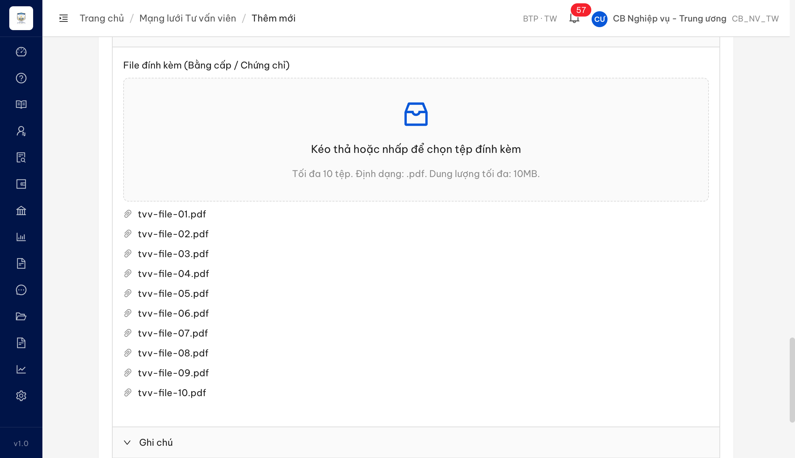

*(Evidence đối tác: `../partner-evidence/QLTVV_18.webm` — chọn nhiều file vượt số lượng, không hiện thông báo lỗi.)*

---

## ~~BUG-QLTVV_20~~ [CLOSED] — Danh sách tệp đã tải thiếu dung lượng và nút "Xem"

> **Re-test:** 2026-07-14 22:15:58 R2 — ✅ PASS (Closed-verified). Dòng tệp đã tải nay hiển thị tên + kích thước ("test-01.pdf (237 B)") + nút "Xem" + nút Xóa, đúng SRS SCR-IV-02 mục 5.3.

### Mô tả

Trong mục **"File đính kèm (Bằng cấp / Chứng chỉ)"** ở form Thêm/Sửa Tư vấn viên, mỗi dòng tệp đã tải lên **chỉ hiển thị tên tệp + nút Xóa** ("Gỡ bỏ tập tin"). **Thiếu dung lượng (kích thước) tệp** và **thiếu nút "Xem"** mà SRS SCR-IV-02 (mục 5.3) quy định. *(Đối tác báo thêm thiếu nút "Tải lại" — nút này chỉ có trong bản thiết kế đối tác, KHÔNG có trong SRS nên không tính là lỗi.)*

### Các bước tái hiện

1. Đăng nhập role **Cán bộ Nghiệp vụ** (`cbnv_tw` — CB_NV_TW).
2. Vào **Thêm mới Tư vấn viên**, mở nhóm **"File đính kèm"**.
3. Tải lên 1 tệp PDF hợp lệ.
4. Quan sát dòng tệp trong danh sách đã tải.

### Kết quả mong đợi

- Theo **SRS SCR-IV-02 mục 5.3 (srs-fr-04 dòng 1510)**: "Danh sách file đã tải — mỗi dòng: **tên file + kích thước + nút 'Xem' / 'Xóa'**".

### Kết quả thực tế

- Dòng tệp chỉ có **icon paper-clip + tên tệp + nút Xóa** ("Gỡ bỏ tập tin"). **Không có kích thước** (kiểm DOM: không có chuỗi KB/MB cho tệp) và **không có nút "Xem"**.

### Bằng chứng


*(Evidence đối tác: `../partner-evidence/QLTVV_20.webm`.)*

---

## ~~BUG-QLTVV_21~~ [CLOSED] — Thêm mới TVV hợp lệ: ảnh chân dung bị từ chối + file đính kèm & số quyết định không lưu/hiển thị

> **Re-test:** 2026-07-14 22:15:58 R2 — ✅ PASS (Closed-verified). Tạo TVV-BTP-TW-0009 với Ảnh chân dung .png + File đính kèm .pdf + Số QĐ: ảnh .png được chấp nhận (không còn "Chỉ chấp nhận file PDF") và lưu vào hồ sơ; File đính kèm "test-02.pdf" gắn vào hồ sơ; Số QĐ "SQDCB-QA-2100/2126" hiển thị đúng.

### Mô tả

Khi **Thêm mới Tư vấn viên** với dữ liệu hợp lệ (đủ trường bắt buộc, Ảnh chân dung `.png`, File thẻ hành nghề `.pdf`, File đính kèm `.pdf`, có nhập Số QĐ công bố) rồi bấm **Lưu**: hệ thống tạo hồ sơ thành công nhưng hiển thị thông báo **"Tạo hồ sơ TVV thành công nhưng không tải lên được: {tên ảnh}"**. Trên hồ sơ vừa tạo phát sinh cùng lúc **3 lỗi**: (a) Ảnh chân dung không được lưu; (b) File đính kèm không gắn vào hồ sơ; (c) Số quyết định đã nhập không hiển thị. Trùng khớp mô tả của đối tác.

### Các bước tái hiện

1. Đăng nhập role **Cán bộ Nghiệp vụ** (`cbnv_tw` — CB_NV_TW).
2. Vào **Mạng lưới Tư vấn viên → Thêm mới**.
3. Nhập đầy đủ trường bắt buộc; **Ảnh chân dung**: tải 1 ảnh `.png`; **File thẻ hành nghề (PDF)**: tải 1 `.pdf`; **File đính kèm**: tải 1 `.pdf`; **Số QĐ công bố**: nhập một giá trị (vd `SQĐCB-QA-2100/2126`).
4. Bấm **Lưu**.
5. Quan sát thông báo; sau đó mở **chi tiết** hồ sơ vừa tạo (tab Hồ sơ).

### Kết quả mong đợi

- Theo **SRS SCR-IV-02 mục 2.3 (srs-fr-04 dòng 1484)**: Ảnh chân dung chấp nhận định dạng **.jpg / .png** (tối đa 5MB) → ảnh phải được tải lên & lưu vào hồ sơ.
- Theo **SRS SCR-IV-03 tab Hồ sơ (dòng 1554)**: nhóm "File đính kèm" phải hiển thị danh sách file đã đính kèm → file `.pdf` vừa tải phải hiện trong hồ sơ.
- Theo **SRS SCR-IV-02 mục 5.1 (dòng 1681)**: Số quyết định công bố đã nhập phải được lưu & hiển thị ở màn chi tiết.
- Tổng thể: tạo mới hợp lệ không được mất dữ liệu ảnh/file/số QĐ đã nhập.

### Kết quả thực tế

- Toast sau khi Lưu: **"Tạo hồ sơ TVV thành công nhưng không tải lên được: avatar-test.png"** — hồ sơ tạo thành công nhưng ảnh chân dung KHÔNG tải lên được.
- Hệ thống **từ chối ảnh chân dung** với thông báo **"Chỉ chấp nhận file PDF"** → ảnh `.png` không được lưu (hồ sơ không có ảnh, hiển thị ảnh mặc định chữ cái).
- **File đính kèm** `.pdf` tải lên xong nhưng **không gắn vào hồ sơ** — màn chi tiết hiển thị **"Chưa có file đính kèm"**.
- **Số quyết định** đã nhập không hiển thị — màn chi tiết hiện **"Số quyết định: —"**.

### Bằng chứng

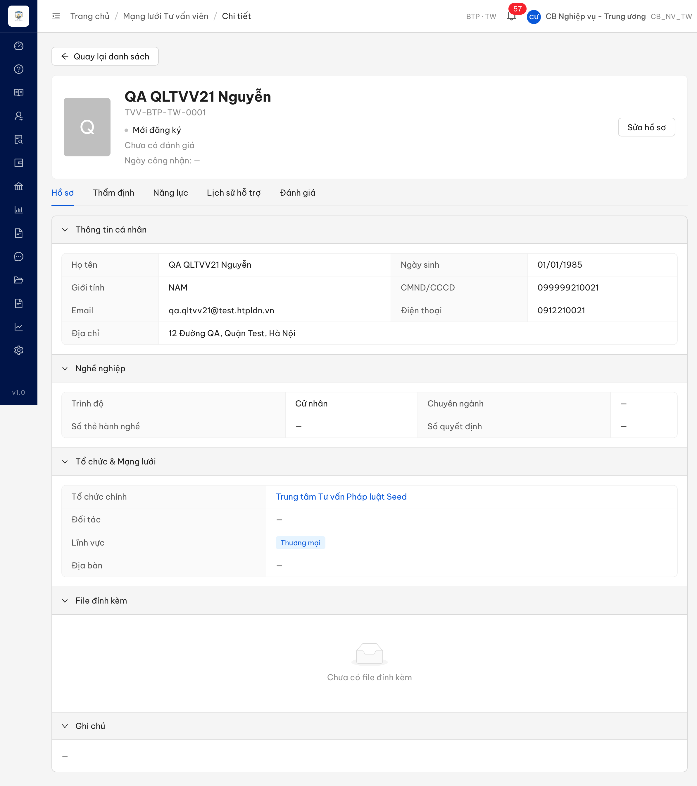

- Diễn biến quan sát khi Lưu: hệ thống tạo hồ sơ (thành công) → tải ảnh chân dung `.png` bị hệ thống trả về lỗi "Chỉ chấp nhận file PDF" (`ERR-VAL-FILE-03`) → 2 file `.pdf` tải lên phản hồi thành công, nhưng chỉ File thẻ hành nghề được gắn; File đính kèm không xuất hiện trong hồ sơ.
- Kiểm tra dữ liệu hồ sơ vừa tạo (`TVV-BTP-TW-0001`): ảnh chân dung = trống; danh sách file đính kèm = rỗng; Số QĐ công bố đã lưu ở dữ liệu nhưng màn chi tiết không hiển thị.

*(Evidence đối tác: `../partner-evidence/QLTVV_21.webm`.)*

---

## ~~BUG-QLTVV_22~~ [CLOSED] — Hủy có thay đổi chưa lưu: chọn "Ở lại" lại xóa sạch dữ liệu đã nhập

> **Re-test:** 2026-07-14 22:15:58 R2 — ✅ PASS (Closed-verified). Bấm Hủy → hộp "Bạn có thay đổi chưa được lưu" → chọn "Ở lại": vẫn ở biểu mẫu và dữ liệu đã nhập được giữ nguyên (Họ tên, CMND, Số QĐ, Giới tính).

### Mô tả

Ở form **Thêm mới Tư vấn viên**, khi đã nhập dữ liệu rồi bấm **Hủy**, hệ thống hiển thị hộp xác nhận **"Bạn có thay đổi chưa được lưu. Nếu tiếp tục, các thay đổi sẽ bị mất. Bạn có muốn tiếp tục?"** với 2 nút **"Ở lại"** và **"Tiếp tục"**. Khi chọn **"Ở lại"** (ý nghĩa: hủy thao tác Hủy, tiếp tục ở lại biểu mẫu): hộp thoại đóng và vẫn ở lại form, **nhưng toàn bộ dữ liệu đã nhập bị xóa sạch**. Trùng khớp mô tả của đối tác.

### Các bước tái hiện

1. Đăng nhập role **Cán bộ Nghiệp vụ** (`cbnv_tw` — CB_NV_TW).
2. Vào **Mạng lưới Tư vấn viên → Thêm mới**.
3. Nhập một số trường (vd Họ tên, Số CMND/CCCD, Số QĐ công bố, Giới tính).
4. Bấm **Hủy** → xuất hiện hộp xác nhận.
5. Bấm **"Ở lại"**.
6. Quan sát các ô đã nhập ở bước 3.

### Kết quả mong đợi

- Theo **SRS SCR-IV-02 mục 7 (srs-fr-04 dòng 1512)**: Hủy khi có thay đổi chưa lưu → mở hộp xác nhận; theo **quy ước hộp thoại xác nhận (dòng 1392)**, hành động phụ (ở lại/hủy bỏ thao tác) phải quay lại biểu mẫu **giữ nguyên dữ liệu đang nhập** — chỉ khi xác nhận rời đi mới bỏ thay đổi.
- Chính nội dung hộp thoại cũng ngụ ý chỉ khi **"Tiếp tục"** thì thay đổi mới bị mất → chọn **"Ở lại"** phải giữ nguyên dữ liệu.

### Kết quả thực tế

- Chọn **"Ở lại"**: hộp thoại đóng, vẫn ở lại form (đúng), nhưng **toàn bộ dữ liệu đã nhập bị xóa** — các ô trở về rỗng.
- Kiểm tra trực tiếp: trước khi bấm Hủy có 3 ô đang có giá trị (Họ tên, CMND/CCCD, Số QĐ công bố); sau khi chọn "Ở lại" cả 3 ô đều rỗng.

### Bằng chứng

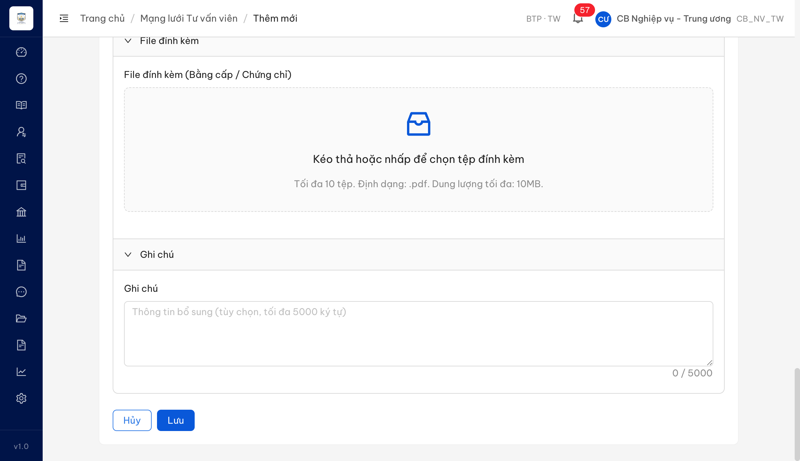

*(Evidence đối tác: `../partner-evidence/QLTVV_22.webm`.)*

---

## ~~BUG-QLTVV_23~~ [CLOSED] — Form "Chỉnh sửa Tư vấn viên" thiếu trường "Mô tả kinh nghiệm"

> **Re-test:** 2026-07-15 reverify-devfix — ✅ PASS (Closed). Nhóm "Nghề nghiệp" của form Sửa nay có trường "Mô tả kinh nghiệm" (ô văn bản dài, 0/5000) — nhập được + lưu được, hiển thị lại ở màn Chi tiết. "Chứng chỉ hành nghề" cũng đã có.

### Mô tả

Ở form **"Chỉnh sửa Tư vấn viên"** (màn Sửa), nhóm **"Nghề nghiệp"** **thiếu trường "Mô tả kinh nghiệm"** mà SRS SCR-IV-02 (cell 3.7) quy định. Form Sửa hiện chỉ có "Số năm kinh nghiệm" (ô số) — không có ô "Mô tả kinh nghiệm" (văn bản dài). Đây là **cùng root cause với BUG-QLTVV_13** (form Thêm mới) — màn Thêm mới và Chỉnh sửa dùng chung thành phần. *(Đối tác báo thêm thiếu "Chứng chỉ hành nghề" — thực tế form CÓ mục "Chứng chỉ chi tiết" (bảng: tên chứng chỉ + ngày cấp + nơi cấp) + "Số thẻ hành nghề", đầy đủ hơn một ô "Chứng chỉ hành nghề" đơn.)*

### Các bước tái hiện

1. Đăng nhập role **Cán bộ Nghiệp vụ** (`cbnv_tw` — CB_NV_TW).
2. Vào **Mạng lưới Tư vấn viên**, mở một Tư vấn viên đang hoạt động.
3. Bấm **Sửa** → mở form "Chỉnh sửa Tư vấn viên".
4. Mở nhóm **"Nghề nghiệp"** → xem các trường.

### Kết quả mong đợi

- Theo **SRS SCR-IV-02 cell 3.7 (srs-fr-04 dòng 1502)**: nhóm Nghề nghiệp có **"Mô tả kinh nghiệm"** (ô văn bản dài, tối đa 5000 ký tự). Màn này (Thêm mới/Chỉnh sửa) dùng chung nên áp dụng cho cả form Sửa.

### Kết quả thực tế

- Nhóm "Nghề nghiệp" của form Sửa chỉ có: Trình độ học vấn, Chuyên ngành, Chức vụ, Nơi công tác, **Số năm kinh nghiệm**, Số thẻ hành nghề, File thẻ hành nghề, Bằng cấp chi tiết, Chứng chỉ chi tiết. **Không có "Mô tả kinh nghiệm".**

### Bằng chứng

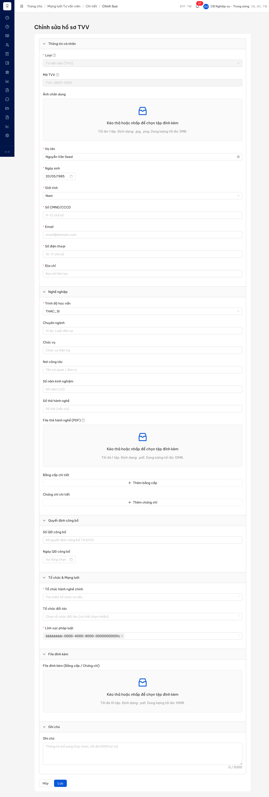

*(Evidence đối tác: `../partner-evidence/QLTVV_23.webm`.)*

---

## BUG-QLTVV_24 [CLOSED-VERIFIED] — Ảnh chân dung PNG đã lưu, hiển thị và download được

> **Re-test mới nhất:** 2026-07-15 rv3 — ✅ PASS (Closed-verified). Sửa `TVV-BTP-TW-0002` bằng `cbnv_tw`, upload ảnh `.png` hợp lệ (`anh-chan-dung-qa.png`, 429 B, 120×160) vào **Ảnh chân dung** rồi bấm **Lưu** → PATCH hồ sơ trả `200`; chi tiết hiển thị ảnh bằng `` natural `120×160`; endpoint download `files/71bcd8f1-8e6e-4b45-a9ca-887552ecaf5e/download` trả `200`. Evidence: `image/rv3-QLTVV_24-after-save-avatar-png.png`; điều kiện: `../reverify-audit/rv3-conditions/QLTVV_24.md`.

> **Re-test:** 2026-07-15 reverify-devfix — ⚠️ REOPEN (fix một phần). Lỗi gốc đã hết: ảnh `.png` được chấp nhận (POST `/files?kind=avatar` → 201), bấm Lưu thành công (PATCH → 200, hồ sơ cập nhật). NHƯNG phát sinh cùng luồng: ảnh chân dung đã lưu KHÔNG hiển thị — màn Chi tiết vẫn là chữ viết tắt "Q"; GET `.../files/71bcd8f1…/download` → 404 (tái hiện sau reload).

### Mô tả

Khi **Sửa (Chỉnh sửa) hồ sơ Tư vấn viên** với dữ liệu hợp lệ, trong đó Ảnh chân dung là ảnh **.png** (đúng định dạng cho phép của trường này), rồi bấm **Lưu**: hệ thống hiển thị lỗi **"Chỉ chấp nhận file PDF"** và **không lưu được thay đổi**. Trùng khớp mô tả của đối tác ("file tải lên đúng định dạng quy định" vẫn bị báo chỉ nhận PDF). Đây là **cùng root cause với BUG-QLTVV_21**: ảnh chân dung bị gửi tới endpoint tải file vốn chỉ nhận PDF.

### Các bước tái hiện

1. Đăng nhập role **Cán bộ Nghiệp vụ** (`cbnv_tw` — CB_NV_TW).
2. Vào **Mạng lưới Tư vấn viên**, mở một Tư vấn viên, bấm **Sửa**.
3. Ở nhóm "Thông tin cá nhân", **Ảnh chân dung** tải 1 ảnh định dạng **.png** (định dạng field cho phép).
4. Bấm **Lưu**.
5. Quan sát thông báo và kết quả lưu.

### Kết quả mong đợi

- Theo **SRS SCR-IV-02 mục 2.3 (srs-fr-04 dòng 1484)**: Ảnh chân dung chấp nhận **.jpg / .png** (tối đa 5MB) → ảnh đúng định dạng phải được chấp nhận và hồ sơ được cập nhật thành công.

### Kết quả thực tế

- Bấm Lưu → hệ thống báo **"Chỉ chấp nhận file PDF"** → **không lưu được** thay đổi.
- Kiểm tra trực tiếp: khi Lưu, hệ thống gửi ảnh chân dung (.png) tới endpoint tải file và bị trả lỗi (`ERR-VAL-FILE-03` — "Chỉ chấp nhận file PDF"); ở luồng Sửa, lỗi này chặn luôn thao tác cập nhật (không có yêu cầu cập nhật hồ sơ được gửi).

### Bằng chứng

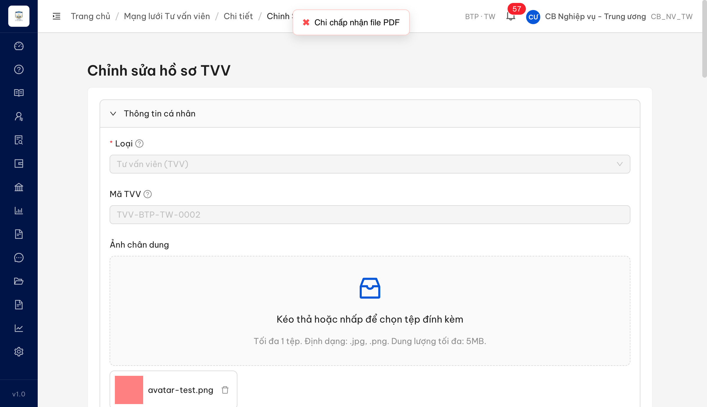

*(Evidence đối tác: `../partner-evidence/QLTVV_24.webm`.)*

---

## ~~BUG-TKTVV_02~~ [CLOSED] — Bộ lọc danh sách TVV: "Tổ chức" không phải danh sách chọn, "Trạng thái" không ẩn theo thẻ, "Lĩnh vực" chỉ chọn 1 giá trị

> **Re-test:** 2026-07-15 reverify-devfix — ✅ PASS (Closed). "Tổ chức" nay là dropdown (ant-select); "Trạng thái" ẩn khi ở tab cụ thể; "Lĩnh vực" chọn được nhiều giá trị (đã chọn Thuế + Thương mại đồng thời). Ý mặc định "Tất cả" vẫn thuộc BA confirm.

### Mô tả

Tại màn **Tư vấn viên / Chuyên gia** (danh sách), thanh bộ lọc hiển thị sai kiểu dữ liệu so với SRS ở 3 trường:

1. **Tổ chức** — render là ô nhập chữ tự do (`<input placeholder="Tổ chức">`, không phải component danh sách chọn), trong khi SRS quy định là danh sách chọn có tìm kiếm lấy từ danh mục Tổ chức tư vấn đang hoạt động.
2. **Trạng thái** — vẫn hiển thị khi người dùng đang đứng ở một thẻ trạng thái cụ thể (vd thẻ "Đang hoạt động"), trong khi SRS quy định ẩn trong trường hợp này.
3. **Lĩnh vực** — là danh sách chọn **1 giá trị** (`ant-select-single`) và không có tùy chọn "Tất cả", trong khi SRS quy định chọn nhiều lĩnh vực.

### Các bước tái hiện

1. Đăng nhập `cbnv_tw` (CB_NV_TW) — cùng vai trò đối tác dùng khi log lỗi.
2. Vào **Mạng lưới Tư vấn viên → Tư vấn viên / Chuyên gia** (`/chuyen-gia-tvv/danh-sach`).
3. Giữ nguyên thẻ mặc định **"Đang hoạt động"**, quan sát thanh bộ lọc.
4. Bấm vào trường **Tổ chức** → gõ chữ được, không có danh sách gợi ý nào bung ra.
5. Bấm vào trường **Lĩnh vực** → chọn 1 lĩnh vực thì danh sách đóng lại, không chọn thêm được lĩnh vực thứ hai.

### Kết quả mong đợi

- **SCR-IV-01 dòng 1434:** "Tổ chức | dropdown có tìm kiếm | Danh sách tổ chức tư vấn đang hoạt động | Lọc theo tổ chức".
- **SCR-IV-01 dòng 1435:** "Trạng thái | dropdown chọn nhiều | 10 trạng thái theo bảng ánh xạ § 3.0; **ẩn khi đang ở tab cụ thể**".
- **SCR-IV-01 dòng 1432:** "Lĩnh vực | **dropdown chọn nhiều** | Danh mục Lĩnh vực pháp luật", nhất quán với **FR-IV-02 §Inputs dòng 230**: `linh_vuc_ids | identifier[] | Chọn nhiều lĩnh vực`.

### Kết quả thực tế

- Trường **Tổ chức**: kiểm tra DOM cho thấy đây là `<input placeholder="Tổ chức">` thuần, không được bọc trong component `ant-select` như 3 trường còn lại (Lĩnh vực / Đơn vị quản lý / Trạng thái đều là `ant-select`). Trên giao diện, Tổ chức là ô duy nhất không có mũi tên xổ danh sách.
- Trường **Trạng thái**: thẻ đang kích hoạt là "Đang hoạt động" (`.ant-tabs-tab-active` = "Đang hoạt động") nhưng bộ lọc Trạng thái vẫn hiển thị đầy đủ trên thanh lọc.
- Trường **Lĩnh vực**: component là `ant-select-single` (chọn 1), danh sách xổ ra 10 lĩnh vực (Thuế, Lao động, Đất đai, Dân sự, Thương mại, Hình sự, Hành chính, Sở hữu trí tuệ, Doanh nghiệp, Đầu tư) và **không có** tùy chọn "Tất cả".

> **Lưu ý gửi BA:** riêng ý "giá trị mặc định của Lĩnh vực phải là **Tất cả**" mà đối tác nêu — SRS SCR-IV-01 chỉ quy định kiểu dữ liệu (chọn nhiều), **không** quy định giá trị mặc định hiển thị. Ý này cần BA chốt, đã ghi vào `ba-confirmation-needed-week-2.md`. Phần "chọn nhiều" thì SRS có quy định rõ nên vẫn tính là lỗi.

### Bằng chứng

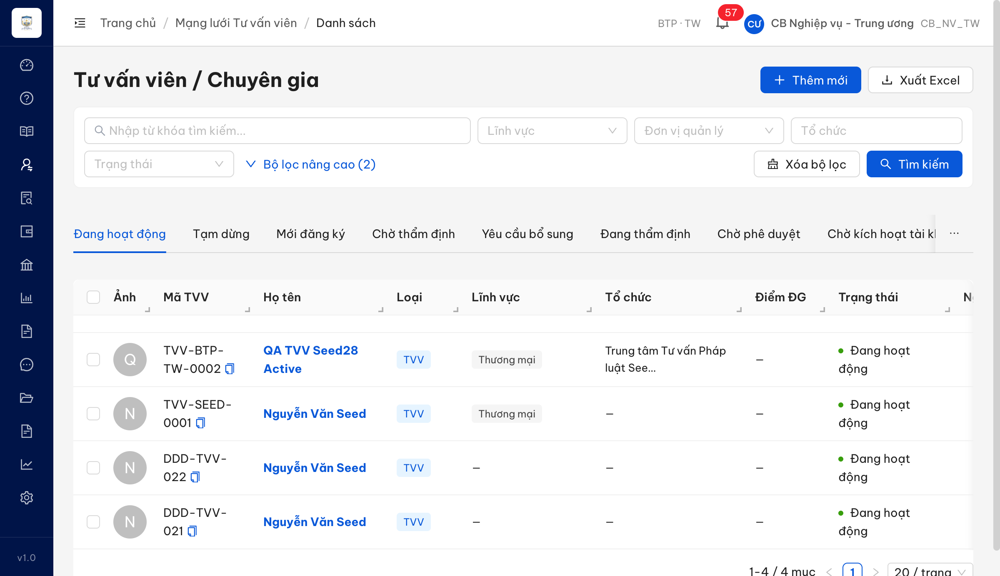

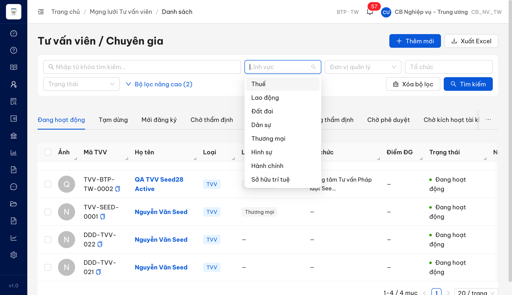

*(Evidence đối tác: `../partner-evidence/TKTVV_02.webm` — đoạn đầu quay tài liệu thiết kế HTPLDN-040 §4.6.2, đoạn cuối quay thanh bộ lọc trên web.)*

---

## ~~BUG-TKTVV_04~~ [CLOSED] — Tìm kiếm TVV: bộ lọc "Tổ chức" và "Trạng thái" bị bỏ qua, trả về bản ghi không khớp tiêu chí

> **Re-test:** 2026-07-15 reverify-devfix — ✅ PASS (Closed). Lọc Tổ chức khớp → đúng 1 bản ghi (TVV-BTP-TW-0002); org không khớp → 0 bản ghi ("Không tìm thấy tư vấn viên phù hợp"); tham số gửi lên là `toChucId=<UUID>` thật. Trạng thái lọc qua tab (ẩn ở tab cụ thể).

### Mô tả

Tại màn **Tư vấn viên / Chuyên gia**, hai tiêu chí lọc **Tổ chức** và **Trạng thái** không có tác dụng lên kết quả tìm kiếm. Hệ thống trả về nguyên danh sách của thẻ đang đứng, bất kể người dùng nhập/chọn tiêu chí gì.

- **Tổ chức:** giá trị nhập được đẩy lên URL dưới dạng `toChucId=<chuỗi chữ>` (vd `?toChucId=Alpha`) — tức chuỗi chữ tự do được gán vào tham số vốn là định danh (id) của tổ chức. Kết quả: điều kiện lọc không được áp dụng.
- **Trạng thái:** giá trị chọn được đẩy lên URL (`?trangThai=TAM_DUNG`) nhưng thẻ (tab) đang đứng vẫn quyết định kết quả — danh sách trả về vẫn là các bản ghi của thẻ cũ, và ô chọn Trạng thái bị xóa trắng sau khi bấm Tìm kiếm.

### Các bước tái hiện

1. Đăng nhập `cbnv_tw` (CB_NV_TW).
2. Vào **Mạng lưới Tư vấn viên → Tư vấn viên / Chuyên gia**, giữ thẻ mặc định **"Đang hoạt động"** → ghi nhận baseline: **4 bản ghi** (1 bản ghi thuộc tổ chức "Trung tâm Tư vấn Pháp luật Seed…", 3 bản ghi không có tổ chức).
3. Nhập **Tổ chức = "Alpha"** (không bản ghi nào trong thẻ thuộc tổ chức này) → bấm **Tìm kiếm**.
4. Xóa bộ lọc, nhập **Tổ chức = "Trung tâm"** (đúng 1 bản ghi khớp) → bấm **Tìm kiếm**.
5. Xóa bộ lọc, chọn **Trạng thái = "Tạm dừng"** (trong khi vẫn đứng ở thẻ "Đang hoạt động") → bấm **Tìm kiếm**.

### Kết quả mong đợi

- **FR-IV-02 §Processing bước 2 (srs-fr-04 dòng 241):** "Kết hợp tất cả điều kiện lọc có giá trị (**AND**)".
- **FR-IV-02 §Acceptance Criteria (dòng 271):** "**Given** user lọc theo nhiều điều kiện **When** tìm kiếm **Then** áp dụng AND tất cả".
- **FR-IV-02 §Inputs (dòng 232-233):** `to_chuc_id` (Tổ chức tư vấn) và `trang_thai` (SM-TVV) là tiêu chí lọc hợp lệ.
- Theo đó: bước 3 phải trả **0 bản ghi**; bước 4 phải trả **1 bản ghi**; bước 5 phải trả các bản ghi **Tạm dừng** (hoặc không cho phép chọn Trạng thái khi đang ở thẻ cụ thể — xem SCR-IV-01 dòng 1435).

### Kết quả thực tế

| Bước | Tiêu chí lọc | Kỳ vọng | Thực tế |
|---|---|---|---|
| Baseline | (không lọc), thẻ "Đang hoạt động" | 4 bản ghi | 4 bản ghi ✅ |
| 3 | Tổ chức = "Alpha" | 0 bản ghi | **4/4 bản ghi** ❌ (3 bản ghi không có tổ chức, 1 bản ghi thuộc "Trung tâm Tư vấn Pháp luật Seed…") |
| 4 | Tổ chức = "Trung tâm" | 1 bản ghi | **4/4 bản ghi** ❌ |
| 5 | Trạng thái = "Tạm dừng" | bản ghi Tạm dừng | **4 bản ghi đều "Đang hoạt động"** ❌; thẻ vẫn là "Đang hoạt động"; ô chọn Trạng thái bị xóa trắng sau khi tìm |

⇒ Hai tiêu chí lọc này hoàn toàn không ảnh hưởng đến kết quả trả về (thử cả giá trị khớp lẫn không khớp đều ra cùng một danh sách).

> **Ghi chú cho dev:** ý "không tự động chuyển thẻ theo tiêu chí Trạng thái" mà đối tác nêu có cùng gốc với **BUG-TKTVV_02** ý (2) — theo SCR-IV-01 dòng 1435, bộ lọc Trạng thái phải **ẩn** khi đang ở thẻ cụ thể, nên tình huống xung đột thẻ ↔ bộ lọc lẽ ra không tồn tại. Sửa BUG-TKTVV_02 có thể giải quyết luôn ý này.

### Bằng chứng

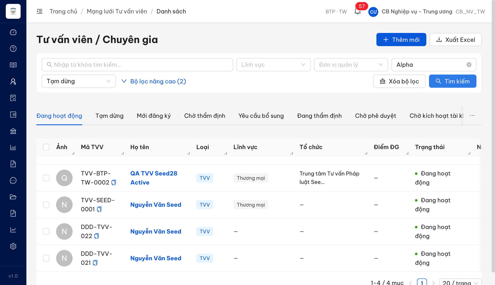

**Evidence đối tác** (`../partner-evidence/TKTVV_04.webm`) — độc lập tái hiện cùng 2 lỗi:

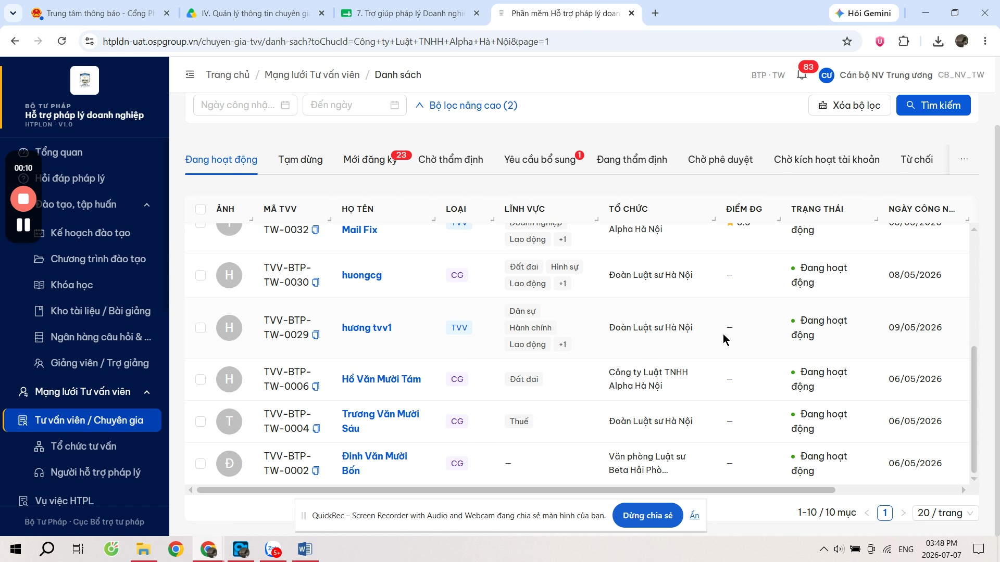

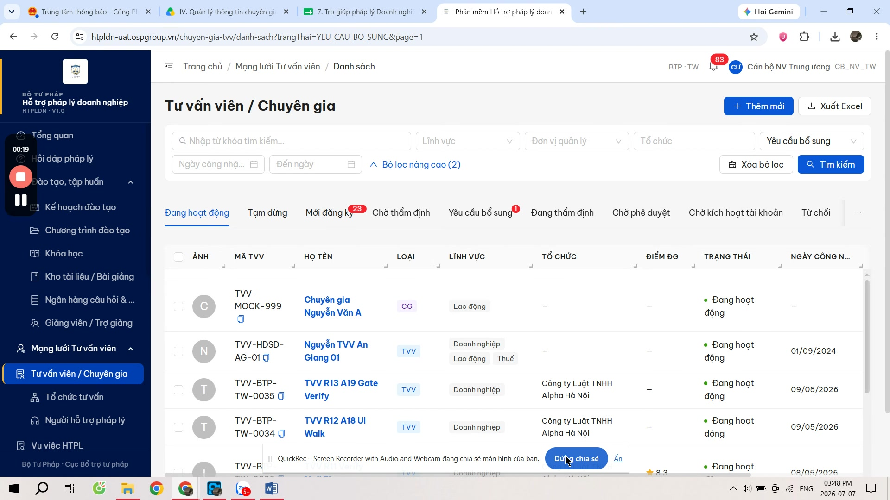

---

## ~~BUG-DKTGMLTVV_02~~ [CLOSED] — Form Thêm mới TVV (nhóm Thông tin cá nhân): Giới tính sai kiểu + thừa giá trị; Ảnh chân dung không có khu vực xem trước

> **Re-test:** 2026-07-15 reverify-devfix — ✅ PASS (Closed). Giới tính nay là radio đúng 2 giá trị Nam/Nữ (bỏ "Khác"); Ảnh chân dung sau khi tải hiển thị khu xem trước 120×160 (ant-image render 118×160).

### Mô tả

Tại biểu mẫu **Thêm mới Tư vấn viên** (`/chuyen-gia-tvv/tao-moi`), nhóm 1 "Thông tin cá nhân" có 2 trường sai so với SRS:

1. **Giới tính** — render là **danh sách chọn (dropdown) với 3 giá trị "Nam / Nữ / Khác"**, trong khi SRS quy định là **nút chọn (radio) với đúng 2 giá trị "Nam" / "Nữ"**. Sai cả kiểu điều khiển lẫn tập giá trị (thừa "Khác").
2. **Ảnh chân dung** — sau khi tải ảnh lên, hệ thống chỉ hiển thị **ảnh thu nhỏ ~48×48 px** trong dòng danh sách tệp (`.ant-upload-list-picture`), **không có khu vực xem trước 120×160** như SRS yêu cầu.

> Ý thứ 3 của case (đối tác cho rằng trường **Loại** phải có 3 giá trị, thêm "Người hỗ trợ") **KHÔNG log bug**: web hiện có đúng 2 giá trị "Tư vấn viên (TVV)" / "Chuyên gia (CG)" — khớp SCR-IV-02 mục 2.2 (dòng 1483 "dropdown 2 lựa chọn"). SRS mô hình hóa Người hỗ trợ pháp lý thành đối tượng riêng (FR-IV-NHT-01, màn "Người hỗ trợ pháp lý"), không phải một giá trị của trường Loại. Mâu thuẫn thiết kế ↔ SRS → đã chuyển BA (`ba-confirmation-needed-week-2.md`).

### Các bước tái hiện

1. Đăng nhập `cbnv_tw` (CB_NV_TW).
2. Vào **Mạng lưới Tư vấn viên → Tư vấn viên / Chuyên gia** → bấm **+ Thêm mới** (`/chuyen-gia-tvv/tao-moi`).
3. Mở danh sách **Giới tính** → quan sát kiểu điều khiển + các giá trị.
4. Tải 1 ảnh `.jpg` hợp lệ (<5MB) vào **Ảnh chân dung** → quan sát vùng hiển thị sau khi tải.

### Kết quả mong đợi

- **SCR-IV-02 mục 2.6 (srs-fr-04 dòng 1487):** `| 2.6 | nhóm 1 | Giới tính * | radio | "Nam" / "Nữ" |` → nút chọn, đúng 2 giá trị.
- **SCR-IV-02 mục 2.3 (dòng 1484):** `| 2.3 | nhóm 1 | Ảnh chân dung | tải ảnh | Tối đa 5MB, định dạng .jpg / .png; hiển thị xem trước 120x160 | Chọn file → xem trước |`.

### Kết quả thực tế

| Trường | SRS | Web |
|---|---|---|
| Giới tính | radio, 2 giá trị: Nam / Nữ | **dropdown**, **3 giá trị**: Nam / Nữ / **Khác** |
| Ảnh chân dung (sau khi tải) | khu vực xem trước **120×160** | ảnh thu nhỏ **48×48** trong dòng tên tệp, không có khu vực xem trước |

- Kiểm DOM: ô Giới tính là `.ant-select` (không phải `.ant-radio-group`); danh sách xổ ra đúng 3 mục `["Nam","Nữ","Khác"]`.
- Sau khi tải `anh-chan-dung-test.jpg`: `.ant-upload-list` có class `ant-upload-list-picture`, thẻ `` render kích thước thực đo được **48×48 px**.
- Trường **Loại** (không phải lỗi): danh sách xổ ra đúng 2 mục `["Tư vấn viên (TVV)","Chuyên gia (CG)"]`, mặc định "Tư vấn viên (TVV)" — khớp SRS.

> **Điều kiện verify — đã khớp vai trò đối tác:** đối tác quay bằng vai trò **Người hỗ trợ pháp lý (NHT)**. File account ban đầu không có vai trò này → QA đã **tạo tài khoản NHT mới** (`nht_qa_01`, đơn vị Sở Tư pháp An Giang, banner `BTP · DP` — trùng cấp đối tác) và verify lại bằng chính vai trò đó. Kết quả với NHT: Loại = `["Tư vấn viên (TVV)","Chuyên gia (CG)"]` · Giới tính = dropdown `["Nam","Nữ","Khác"]` · ảnh chân dung sau khi tải = `` **48×48 px** trong `.ant-upload-list-picture`. **Trùng khớp hoàn toàn** kết quả chạy bằng `cbnv_tw` ⇒ lỗi không phụ thuộc vai trò.

### Bằng chứng

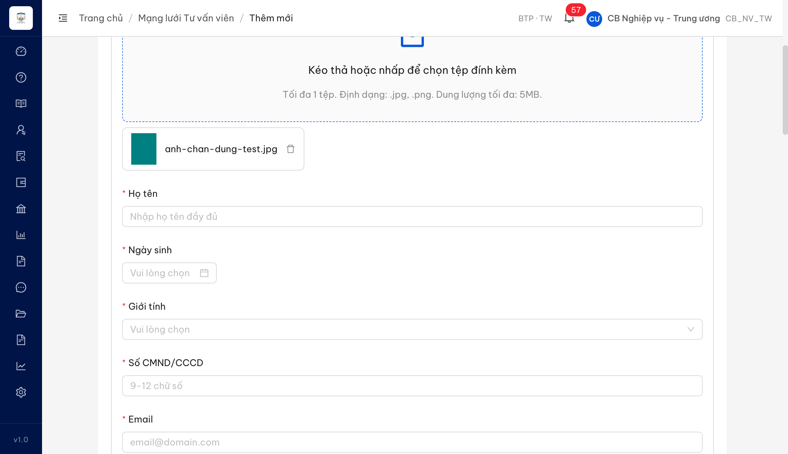

*(Evidence đối tác: `../partner-evidence/DKTGMLTVV_02.webm` — frame 00:02 (danh sách Loại 2 giá trị) và 01:04 (Giới tính 3 giá trị + tệp ảnh đã tải).)*

---

## ~~BUG-DKTGMLTVV_03~~ [CLOSED] — Form Thêm mới TVV (nhóm Nghề nghiệp) thiếu 2 trường: "Chứng chỉ hành nghề" và "Mô tả kinh nghiệm"

> **Re-test:** 2026-07-15 reverify-devfix — ✅ PASS (Closed). Nhóm "Nghề nghiệp" form Thêm mới nay có đủ cả "Chứng chỉ hành nghề" (ô văn bản) và "Mô tả kinh nghiệm" (ô văn bản dài 0/5000).

### Mô tả

Nhóm **"Nghề nghiệp"** (nhóm 2) của biểu mẫu Thêm mới Tư vấn viên thiếu 2 trường mà SCR-IV-02 quy định:

- **Chứng chỉ hành nghề** (mục 3.2, ô văn bản)
- **Mô tả kinh nghiệm** (mục 3.7, ô văn bản dài, tối đa 5000 ký tự)

> **⚠️ Đính chính bug cũ:** BUG-QLTVV_13 và BUG-QLTVV_23 (lô trước) ghi chú rằng *"Chứng chỉ hành nghề thực tế có ở 'Chứng chỉ chi tiết'"* — **nhận định này KHÔNG chính xác**. SCR-IV-02 liệt kê **3 dòng riêng biệt**: mục 3.2 "Chứng chỉ hành nghề" (ô văn bản, dòng 1497), mục 3.4 "Chứng chỉ chi tiết" (bảng lặp dòng: tên chứng chỉ / ngày cấp / nơi cấp, dòng 1499), mục 3.5 "Số thẻ hành nghề" (ô văn bản, dòng 1500). Web có 3.4 và 3.5 nhưng **thiếu 3.2**. Vậy cả 2 trường đối tác báo đều thiếu thật.

### Các bước tái hiện

1. Đăng nhập `nht_qa_01` (vai trò **NHT — Người hỗ trợ pháp lý**, đúng vai trò đối tác dùng). Đã kiểm chéo cả `cbnv_tw` (CB_NV_TW) — kết quả như nhau.
2. Vào **Mạng lưới Tư vấn viên → Tư vấn viên / Chuyên gia** → **+ Thêm mới** (`/chuyen-gia-tvv/tao-moi`).
3. Mở nhóm **"Nghề nghiệp"** → liệt kê toàn bộ trường.

### Kết quả mong đợi

Theo **SCR-IV-02 §Thành phần màn hình — nhóm 2 (srs-fr-04 dòng 1493-1502)**, nhóm Nghề nghiệp phải có đủ: Chức vụ (3.0a) · Nơi công tác (3.0b) · Trình độ (3.1) · **Chứng chỉ hành nghề (3.2 — dòng 1497)** · Bằng cấp chi tiết (3.3) · Chứng chỉ chi tiết (3.4) · Số thẻ hành nghề (3.5) · File thẻ hành nghề (3.6) · **Mô tả kinh nghiệm (3.7 — dòng 1502, "ô văn bản dài, tối đa 5000 ký tự")**.

### Kết quả thực tế

Nhóm "Nghề nghiệp" trên web chỉ có 9 trường: `Trình độ học vấn · Chuyên ngành · Chức vụ · Nơi công tác · Số năm kinh nghiệm · Số thẻ hành nghề · File thẻ hành nghề (PDF) · Bằng cấp chi tiết · Chứng chỉ chi tiết` — **giống hệt nhau ở cả 2 vai trò** `nht_qa_01` (NHT) và `cbnv_tw` (CB_NV_TW).

- **Thiếu "Chứng chỉ hành nghề"** — kiểm toàn bộ nội dung form (`form.innerText`): không xuất hiện chuỗi "Chứng chỉ hành nghề".
- **Thiếu "Mô tả kinh nghiệm"** — không xuất hiện chuỗi "Mô tả kinh nghiệm"; chỉ có "Số năm kinh nghiệm" (ô số), không phải ô văn bản dài mô tả.
- (Web có thừa trường "Chuyên ngành" — không nằm trong SCR-IV-02 nhóm 2; ghi nhận, chưa tính lỗi.)

### Bằng chứng

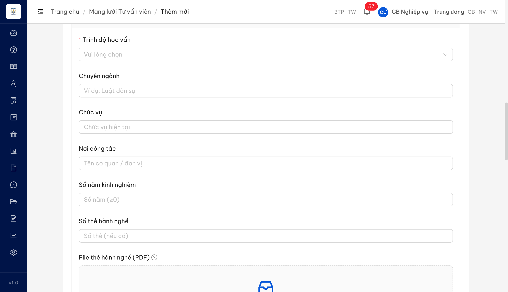

*(Evidence đối tác: `../partner-evidence/DKTGMLTVV_03.webm` — frame ~00:18 quay bảng thiết kế nhóm 2, đối tác tô vàng dòng "Mô tả kinh nghiệm".)*

---

## ~~BUG-DKTGMLTVV_11~~ [CLOSED] — Tải quá 10 tệp đính kèm: hệ thống lặng lẽ bỏ tệp thừa, không hiển thị thông báo ERR-TVV-07

> **Re-test:** 2026-07-15 reverify-devfix — ✅ PASS (Closed). Chọn 11 tệp .pdf vào "File đính kèm" nay hiển thị thông báo "Chỉ được tải tối đa 10 tệp." (bắt qua MutationObserver + message notice) — không còn lặng lẽ bỏ tệp thứ 11.

### Mô tả

Ở biểu mẫu Thêm mới Tư vấn viên, trường **"File đính kèm (Bằng cấp / Chứng chỉ)"** giới hạn 10 tệp. Khi người dùng chọn nhiều hơn 10 tệp, hệ thống **âm thầm cắt bỏ các tệp vượt quá** và giữ đúng 10 tệp đầu — **không hiển thị bất kỳ thông báo nào**, nên người dùng không biết tệp của mình đã bị loại.

**Khoanh vùng chính xác:** trong 3 nhánh ràng buộc của trường tải tệp, chỉ nhánh **số lượng** là thiếu thông báo. Hai nhánh còn lại đã báo lỗi đúng.

### Các bước tái hiện

1. Đăng nhập `nht_qa_01` (vai trò **NHT — Người hỗ trợ pháp lý**, đúng vai trò đối tác dùng). Đã kiểm chéo cả `cbnv_tw` (CB_NV_TW) — kết quả như nhau.
2. Vào **Mạng lưới Tư vấn viên → Tư vấn viên / Chuyên gia** → **+ Thêm mới**.
3. Cuộn tới nhóm **"File đính kèm"** → chọn **11 tệp `.pdf`** hợp lệ cùng lúc.
4. Quan sát danh sách tệp + mọi thông báo (toast / dòng lỗi dưới ô / console).

### Kết quả mong đợi

- **FR-IV-01 §Error Handling E7 (srs-fr-04 dòng 202):** `| E7 | Số file vượt 10 | ERR-TVV-07 | "Tối đa 10 file bằng cấp" | ERROR |` → hệ thống phải **hiển thị thông báo lỗi** cho người dùng.
- **SCR-IV-02 mục 5.1 (dòng 1508):** "...tối đa 10 file. | **Vượt giới hạn → lỗi cụ thể**".

### Kết quả thực tế

| Nhánh ràng buộc | Thao tác | Thông báo hiển thị |
|---|---|---|
| **Số lượng** (tối đa 10 tệp) | chọn 11 tệp .pdf | ❌ **KHÔNG có thông báo nào** — danh sách dừng ở 10 tệp, tệp 11 biến mất |
| Sai định dạng (chỉ .pdf) | tải `sai-dinh-dang.jpg` | ✅ "sai-dinh-dang.jpg: Định dạng không được hỗ trợ. Chấp nhận: .pdf" |
| Vượt dung lượng (tối đa 10MB) | tải PDF 11MB | ✅ "qua-dung-luong-11mb.pdf: Kích thước vượt quá giới hạn 10MB." |

**Chứng minh "không có thông báo" (không phải do đo sai):**
- Cài `MutationObserver` trên `document.body` **trước** khi chọn tệp → sau thao tác bắt được **10 node** thêm vào DOM, **tất cả đều là dòng tên tệp**, **0 node** khớp mẫu chữ lỗi (`tối đa|vượt|quá|giới hạn|lỗi|error`).
- `.ant-message-notice-wrapper` / `.ant-notification-notice` = **0**; `.ant-form-item-explain-error` = **0**; `[role=alert]` = **0**; console không có error/warning.
- **Kiểm chứng ngược (control):** cùng bộ đo đó **có bắt được toast** ở 2 nhánh sai định dạng và vượt dung lượng ⇒ việc không bắt được gì ở nhánh số lượng là **thiếu thông báo thật**, không phải lỗi phương pháp đo.
- **Chạy lại bằng đúng vai trò đối tác (`nht_qa_01` — NHT):** kết quả y hệt — chọn 11 tệp → nhận 10, `toast = 0`, `explain-error = 0`, `[role=alert] = 0`, observer **0 node lỗi**.

### Bằng chứng

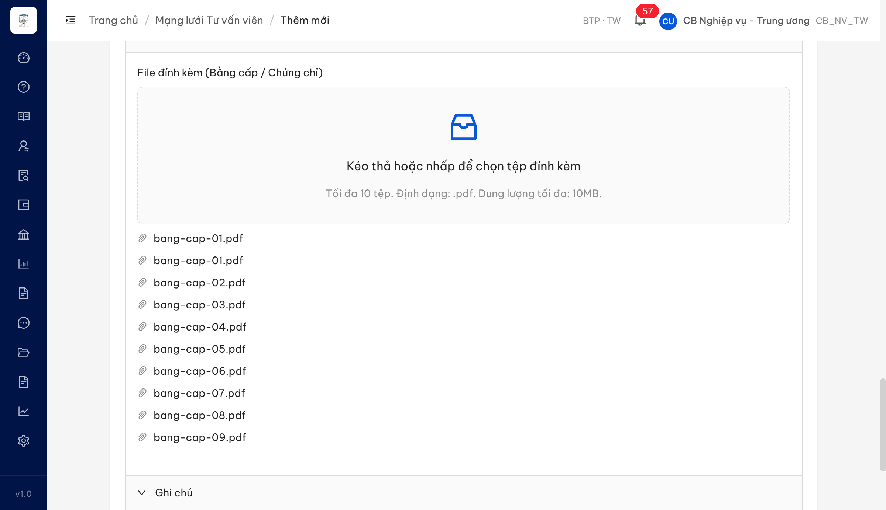

*(Evidence đối tác: `../partner-evidence/DKTGMLTVV_11.webm` — frame ~00:13: danh sách 10 tệp .pdf sau khi chọn nhiều hơn, không có thông báo.)*

---

## ~~BUG-DKTGMLTVV_14~~ [CLOSED] — Hủy khi có thay đổi chưa lưu: chọn "Ở lại" lại xóa trắng toàn bộ dữ liệu đã nhập

> **Re-test:** 2026-07-15 reverify-devfix — ✅ PASS (Closed). Đo 3 mốc: bấm "Hủy" → dialog hiện, 5 trường GIỮ NGUYÊN; chọn "Ở lại" → 5 trường vẫn GIỮ NGUYÊN, ở lại /tao-moi. Không còn xóa trắng form tại thời điểm mở hộp thoại.

### Mô tả

Ở biểu mẫu Thêm mới Tư vấn viên, khi có thay đổi chưa lưu và người dùng bấm **"Hủy"**, hệ thống mở hộp thoại xác nhận **"Bạn có thay đổi chưa được lưu"** với 2 nút: **"Ở lại"** (phụ) và **"Tiếp tục"** (chính). Chọn **"Ở lại"** — tức người dùng **từ chối** rời khỏi và muốn tiếp tục nhập — hệ thống giữ đúng người dùng ở lại trang **nhưng biểu mẫu đã bị xóa trắng toàn bộ các trường đã nhập**.

Hậu quả: người dùng chọn "Ở lại" chính vì **không muốn mất dữ liệu**, nhưng kết quả nhận được lại đúng bằng hậu quả của việc chọn "Tiếp tục" — mất sạch dữ liệu đã nhập.

> **🔍 Root cause chính xác (đo bằng 3 mốc thời điểm):** biểu mẫu **bị xóa NGAY tại thời điểm bấm nút "Hủy"** — tức **trước khi** hộp thoại kịp hiện ra và **trước khi** người dùng chọn bất cứ nút nào. Không phải nhánh "Ở lại" xóa dữ liệu. Xem bảng 3 mốc ở §Kết quả thực tế. ⇒ Nút "Hủy" đang reset biểu mẫu trước rồi mới mở hộp thoại xác nhận; đúng ra phải mở hộp thoại trước, và **chỉ** reset khi người dùng chọn "Tiếp tục".

### Các bước tái hiện

1. Đăng nhập `nht_qa_01` (vai trò **NHT — Người hỗ trợ pháp lý**, đúng vai trò đối tác dùng). Đã kiểm chéo cả `cbnv_tw` (CB_NV_TW) — kết quả như nhau.
2. Vào **Mạng lưới Tư vấn viên → Tư vấn viên / Chuyên gia** → **+ Thêm mới**.
3. Nhập dữ liệu: Họ tên `NHT Test Huy O Lai` · Số CMND/CCCD `088776655443` · Email `nht.huy.olai@test.vn` · Số điện thoại `0987654321` · Địa chỉ `So 2 Le Loi, An Giang`; tải 1 ảnh chân dung + 10 tệp đính kèm.
4. **Xác nhận các trường đang có giá trị** (đọc lại `value` của từng ô).
5. Bấm nút **"Hủy"** ở thanh hành động cuối form → **ngay khi hộp thoại vừa hiện, đọc lại `value` các ô phía sau** (bước then chốt — nếu chỉ đo sau khi bấm "Ở lại" sẽ quy sai nguyên nhân cho nút "Ở lại").
6. Bấm **"Ở lại"** → đọc lại `value` các ô lần nữa.

### Kết quả mong đợi

- **SCR-IV-02 mục 7 — thanh hành động (srs-fr-04 dòng 1512):** "Hủy: nếu có thay đổi chưa lưu → ... xác nhận".
- **§3.0b Quy ước hộp thoại xác nhận (dòng 1392):** hộp thoại gồm nút chính (thực hiện hành động) + nút phụ (**không** thực hiện hành động). Nút phụ "Ở lại" ⇒ **đóng hộp thoại và giữ nguyên biểu mẫu cùng toàn bộ dữ liệu đã nhập**; chỉ nút chính "Tiếp tục" mới được phép bỏ các thay đổi.

### Kết quả thực tế

Đo `value` của từng ô tại **3 mốc thời điểm** (vai trò NHT — `nht_qa_01`):

| Trường | ① Trước khi bấm "Hủy" | ② Ngay khi hộp thoại vừa hiện (chưa bấm gì) | ③ Sau khi chọn **"Ở lại"** |
|---|---|---|---|
| Họ tên | `NHT Test Huy O Lai` | **rỗng** ❌ | rỗng |
| Số CMND/CCCD | `088776655443` | **rỗng** ❌ | rỗng |
| Email | `nht.huy.olai@test.vn` | **rỗng** ❌ | rỗng |
| Số điện thoại | `0987654321` | **rỗng** ❌ | rỗng |
| Địa chỉ | `So 2 Le Loi, An Giang` | **rỗng** ❌ | rỗng |
| Ngày sinh / Giới tính | đã chọn | **rỗng** ❌ | rỗng |
| Ảnh chân dung | 1 tệp | 1 tệp | 1 tệp (vẫn còn) |
| File đính kèm | 10 tệp | 10 tệp | 10 tệp (vẫn còn) |

**Đọc bảng:** dữ liệu đã mất ở **mốc ②** — tức ngay khi bấm "Hủy", trước khi người dùng kịp chọn "Ở lại" hay "Tiếp tục". Nút "Ở lại" (mốc ③) không làm mất thêm gì; nó chỉ **không khôi phục lại được** dữ liệu đã bị xóa ở mốc ②.

- Hộp thoại hiển thị đúng: tiêu đề "Bạn có thay đổi chưa được lưu", nội dung "Nếu tiếp tục, các thay đổi sẽ bị mất. Bạn có muốn tiếp tục?", nút phụ "Ở lại" + nút chính "Tiếp tục".
- Sau khi bấm "Ở lại": URL vẫn là `/chuyen-gia-tvv/tao-moi` (đúng — có giữ người dùng ở lại) và hộp thoại đã đóng (đúng), **nhưng biểu mẫu đã trắng** (sai).
- **Gợi ý cho dev:** handler nút **"Hủy"** đang reset biểu mẫu (gọi `form.resetFields()` / remount form) **trước** khi mở hộp thoại xác nhận. Đúng ra: bấm "Hủy" chỉ mở hộp thoại; chỉ nhánh **"Tiếp tục"** mới được bỏ thay đổi + điều hướng; nhánh **"Ở lại"** chỉ đóng hộp thoại, không đụng vào biểu mẫu. Dữ liệu tệp (ảnh + đính kèm) nằm ở state riêng nên không bị ảnh hưởng — đúng như quan sát.

### Bằng chứng

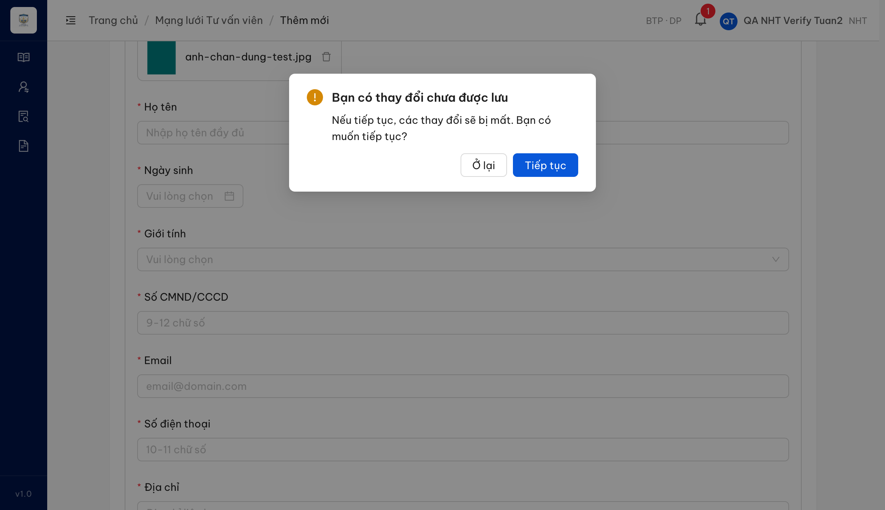

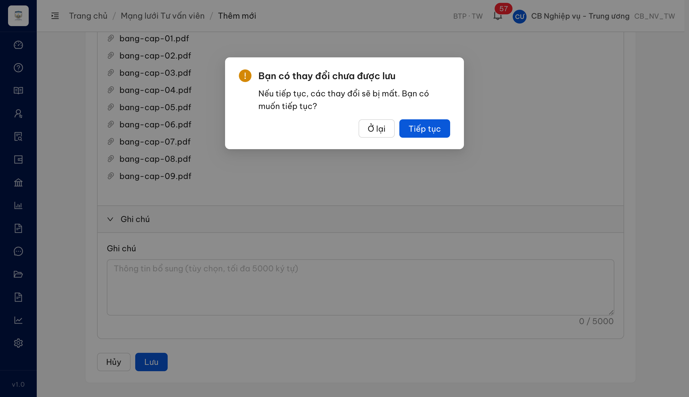

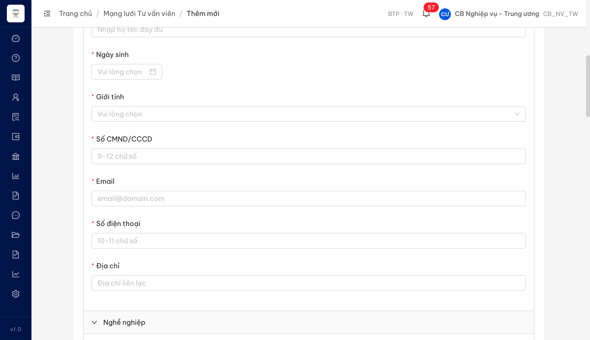

*(Evidence đối tác: `../partner-evidence/DKTGMLTVV_14.webm` — frame 00:37 form còn đầy dữ liệu, frame 00:45 form trắng sau thao tác Hủy → Ở lại.)*

---

## ~~BUG-CNHSNLTVV_02~~ [CLOSED] — Biểu mẫu "Cập nhật năng lực" (thẻ Năng lực) thiếu 5 trường so với SRS, trong đó có chính Bằng cấp / Chứng chỉ chi tiết mà thẻ đó đang hiển thị

> **Re-test:** 2026-07-15 reverify-devfix — ✅ PASS (Closed). Biểu mẫu "Cập nhật năng lực" (vai trò NHT) nay có 11 trường — đã bổ sung đủ 5 trường trước đây thiếu: Bằng cấp chi tiết, Chứng chỉ chi tiết, Trình độ, Số năm kinh nghiệm, Số thẻ hành nghề.

### Mô tả

Người hỗ trợ (NHT) mở Chi tiết tư vấn viên → thẻ "Năng lực" → bấm "Cập nhật năng lực". Biểu mẫu sửa nhanh chỉ có 6 trường (Kinh nghiệm tư vấn, Chuyên ngành, Lĩnh vực pháp luật, Chứng chỉ hiện có ở chế độ chỉ đọc, Thêm chứng chỉ mới, Ghi chú cập nhật), trong khi SRS quy định 11 trường đầu vào. Nghịch lý ngay trong cùng một thẻ: thẻ Năng lực **có hiển thị** dòng "Bằng cấp" và "Chứng chỉ", nhưng nút "Cập nhật năng lực" của chính thẻ đó **không cho nhập/sửa** hai mục này — muốn sửa phải sang màn "Sửa hồ sơ".

### Các bước tái hiện

1. Đăng nhập vai trò **Người hỗ trợ pháp lý (NHT)** — tài khoản `nht_qa_tw`, đơn vị Cục Bổ trợ tư pháp (quyền `update_tu_van_vien`, cập nhật TVV cùng đơn vị theo FR-IV-04 §Preconditions, srs-fr-04 dòng 372).
2. Vào menu "Mạng lưới Tư vấn viên" → "Tư vấn viên / Chuyên gia".
3. Mở chi tiết một tư vấn viên cùng đơn vị (đã thử `TVV-BTP-TW-0002` — Đang hoạt động, và `TVV-BTP-TW-0003` — Mới đăng ký).
4. Chọn thẻ "Năng lực" → bấm nút "Cập nhật năng lực".
5. Quan sát danh sách trường của biểu mẫu.

### Kết quả mong đợi

- Theo FR-IV-04 (UC42) §Inputs (srs-fr-04 dòng 376–388), biểu mẫu cập nhật năng lực phải cho nhập đủ 11 trường: Trình độ, Số năm kinh nghiệm, Chuyên ngành, **Bằng cấp chi tiết**, **Chứng chỉ chi tiết**, Chứng chỉ mới (tệp), Số thẻ hành nghề, File thẻ hành nghề, Lĩnh vực pháp luật, Mô tả kinh nghiệm, Ghi chú cập nhật.
- Theo SCR-IV-03 thẻ Năng lực (dòng 1566), thẻ này gồm Bằng cấp chi tiết, Chứng chỉ chi tiết, Kinh nghiệm chi tiết, kèm nút "Cập nhật năng lực" mở biểu mẫu sửa nhanh — tức phải sửa được đúng các mục thẻ đang hiển thị.

### Kết quả thực tế

- Biểu mẫu chỉ có 6 trường: Kinh nghiệm tư vấn (5000 ký tự), Chuyên ngành (200 ký tự), Lĩnh vực pháp luật, "Chứng chỉ hiện có" (chỉ đọc), "Thêm chứng chỉ mới" (tải tệp), Ghi chú cập nhật (2000 ký tự) + 2 nút Làm lại / Lưu.
- **Thiếu:** Bằng cấp chi tiết, Chứng chỉ chi tiết, Trình độ, Số năm kinh nghiệm, Số thẻ hành nghề / File thẻ hành nghề.
- Kết quả giống nhau trên cả 2 trạng thái tư vấn viên (Đang hoạt động và Mới đăng ký) → không phụ thuộc trạng thái.

### Bằng chứng

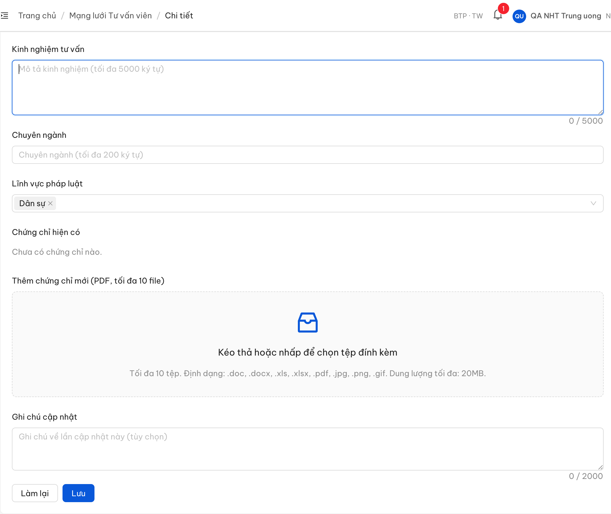

*(Evidence đối tác: `../partner-evidence/CNHSNLTVV_02.webm` — frame 00:00–00:03 biểu mẫu 6 trường; frame 00:08+ đối tác mở thiết kế §4.6.4.2.2 (HTPLDN-042) bôi đậm 2 dòng "Bằng cấp chi tiết" và "Chứng chỉ chi tiết".)*

---

## ~~BUG-QLHSTVV_03~~ [CLOSED] — Thẻ "Hồ sơ" sai bố cục nhóm: "Lĩnh vực" bị gộp vào nhóm Tổ chức, thừa nhóm "Ghi chú", thiếu nhóm "Thông tin công khai"

> **Re-test:** 2026-07-15 reverify-devfix — ✅ PASS (Closed). "Lĩnh vực pháp luật" nay là nhóm riêng; không còn nhóm "Ghi chú" thừa; với TVV đã công khai (TVV-SEED-0001) hiển thị thêm nhóm "Thông tin công khai" (Mô tả công khai / File đính kèm công khai / Thời gian đăng tải).

### Mô tả

Trên màn Chi tiết tư vấn viên, thẻ "Hồ sơ" (nội dung chỉ đọc) chia thành 5 nhóm thu gọn: Thông tin cá nhân / Nghề nghiệp / Tổ chức & Mạng lưới / File đính kèm / Ghi chú. SRS quy định 6 nhóm, trong đó **"Lĩnh vực" là nhóm riêng** — web đang gộp Lĩnh vực vào nhóm "Tổ chức & Mạng lưới", thêm nhóm "Ghi chú" không có trong đặc tả, và không có nhóm "Thông tin công khai" (nhóm chỉ hiển thị khi hồ sơ đã công khai).

### Các bước tái hiện

1. Đăng nhập vai trò **Cán bộ Nghiệp vụ Trung ương (CB_NV_TW)** — tài khoản `cbnv_tw` (quyền xem chi tiết TVV cùng đơn vị theo SCR-IV-03 §Quyền truy cập, srs-fr-04 dòng 1529).
2. Vào "Mạng lưới Tư vấn viên" → "Tư vấn viên / Chuyên gia" → mở chi tiết một TVV cùng đơn vị (`TVV-BTP-TW-0002`, Đang hoạt động — có sẵn Tổ chức chính và Lĩnh vực).
3. Ở thẻ "Hồ sơ", đếm và đối chiếu các nhóm thu gọn.
4. Lặp lại với `TVV-SEED-0001` (Đang hoạt động + **đã công khai**) để kiểm tra nhóm "Thông tin công khai".

### Kết quả mong đợi

- Theo SCR-IV-03 thẻ "Hồ sơ" (srs-fr-04 dòng 1554), thẻ này có **6 nhóm** thu gọn, chỉ đọc: (a) Thông tin cá nhân, (b) Nghề nghiệp, (c) Tổ chức, (d) **Lĩnh vực (dạng thẻ)**, (e) File đính kèm, (f) **Thông tin công khai** — chỉ hiển thị khi hồ sơ đã công khai (mô tả công khai + file đính kèm công khai + ngày đăng tải).

### Kết quả thực tế

- Web chỉ có 5 nhóm: Thông tin cá nhân / Nghề nghiệp / **Tổ chức & Mạng lưới** / File đính kèm / **Ghi chú**.
- "Lĩnh vực" nằm bên trong nhóm "Tổ chức & Mạng lưới" (cùng Tổ chức chính, Đối tác, Địa bàn) — không phải nhóm riêng theo SRS (d).
- Nhóm "Ghi chú" xuất hiện dù SRS không liệt kê.
- Với `TVV-SEED-0001` (`laCongKhai = true` xác nhận qua API): thẻ Hồ sơ vẫn chỉ có 5 nhóm, **không có** nhóm "Thông tin công khai" theo SRS (f).
- Đã loại trừ nguyên nhân thiếu dữ liệu: TVV thử nghiệm có đủ Tổ chức chính (Trung tâm Tư vấn Pháp luật Seed) và Lĩnh vực (Thương mại).

### Bằng chứng

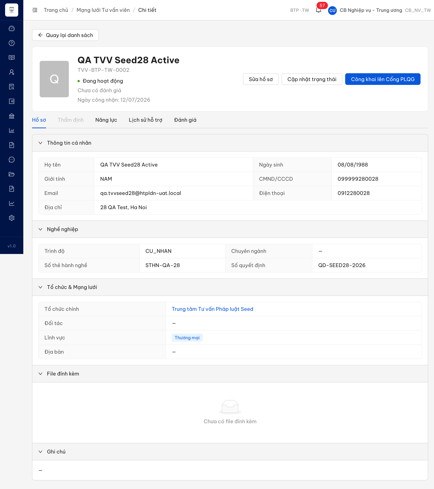

*(Evidence đối tác: `../partner-evidence/QLHSTVV_03.webm` — frame 00:00–00:20 thẻ Hồ sơ 5 nhóm; frame 00:14+ đối tác mở thiết kế HTPLDN-043 §4.6.5, trong đó "Nhóm 4 – Lĩnh vực pháp luật" là nhóm tách riêng.)*

*Ghi chú: các trường còn thiếu bên trong nhóm (Loại, Đơn vị quản lý, Chức vụ, Nơi công tác, Chứng chỉ hành nghề, Mô tả kinh nghiệm) đã ghi ở **BUG-QLTVV_04**, không lặp lại tại bug này.*

---

## ~~BUG-QLHSTVV_05~~ [CLOSED] — Vai trò Người hỗ trợ (NHT) vẫn thấy thẻ "Thẩm định" và mở được biểu mẫu chấm điểm nội bộ

> **Re-test:** 2026-07-15 reverify-devfix — ✅ PASS (Closed). Với vai trò NHT (nht_qa_tw), thẻ "Thẩm định" bị ẩn hoàn toàn ở cả TVV "Mới đăng ký" (TVV-BTP-TW-0009) lẫn TVV "Đang hoạt động" (TVV-BTP-TW-0002) — thanh thẻ chỉ còn Hồ sơ/Năng lực/Lịch sử hỗ trợ/Đánh giá.

### Mô tả

Theo SRS, thẻ "Thẩm định" trên màn Chi tiết tư vấn viên chỉ hiển thị cho Cán bộ Nghiệp vụ hoặc Cán bộ Phê duyệt cùng đơn vị, và chỉ khi hồ sơ ở trạng thái "Đang thẩm định" / "Chờ phê duyệt". Thực tế đăng nhập vai trò **Người hỗ trợ pháp lý (NHT)** thì thẻ này vẫn hiển thị; với tư vấn viên ở trạng thái **"Mới đăng ký"**, NHT còn **mở được** thẻ và thấy toàn bộ biểu mẫu chấm điểm 4 nhóm + Kết luận thẩm định — là nhận xét nội bộ của cán bộ.

### Các bước tái hiện

1. Đăng nhập vai trò **Người hỗ trợ pháp lý (NHT)** — tài khoản `nht_qa_tw`, đơn vị Cục Bổ trợ tư pháp. Theo SCR-IV-03 §Quyền truy cập (srs-fr-04 dòng 1528–1531), NHT **không** nằm trong danh sách vai trò được xem thẻ Thẩm định.
2. Vào "Mạng lưới Tư vấn viên" → "Tư vấn viên / Chuyên gia".
3. Mở chi tiết một tư vấn viên cùng đơn vị đang ở trạng thái **"Mới đăng ký"** (`TVV-BTP-TW-0003`).
4. Quan sát thanh thẻ → bấm vào thẻ "Thẩm định".

### Kết quả mong đợi

- Theo SCR-IV-03 cell 13 (srs-fr-04 dòng 1555), thẻ "Thẩm định" chỉ hiển thị khi: vai trò = Cán bộ Nghiệp vụ HOẶC Cán bộ Phê duyệt cùng đơn vị, **và** trạng thái ∈ {Đang thẩm định, Chờ phê duyệt}.
- Vai trò NHT không thuộc danh sách trên → thẻ "Thẩm định" phải **ẩn hoàn toàn**, không render trên thanh thẻ.

### Kết quả thực tế

- Thẻ "Thẩm định" **vẫn hiển thị** trên thanh thẻ với vai trò NHT.
- Với TVV trạng thái "Mới đăng ký": thẻ **không bị khóa**, bấm vào mở ra đầy đủ biểu mẫu thẩm định — Nhóm 1 Pháp lý (4 mục kiểm + radio Đạt/Không đạt), Nhóm 2 Năng lực chuyên môn (điểm 1–5 + nhận xét), Nhóm 3 Hiệu quả & uy tín, Nhóm 4 Mạng lưới, và phần Kết luận thẩm định (ĐẠT / KHÔNG ĐẠT / YÊU CẦU BỔ SUNG).
- Với TVV trạng thái "Đang hoạt động": thẻ hiển thị ở dạng bị khóa (disabled) — vẫn render, chưa ẩn theo SRS.

### Bằng chứng

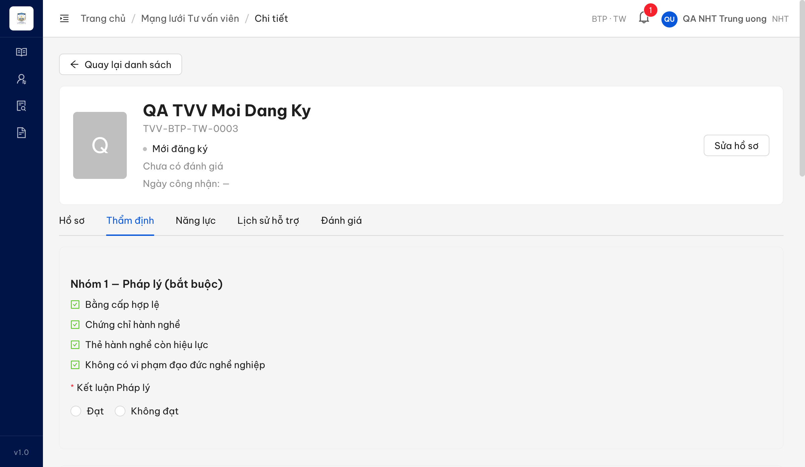

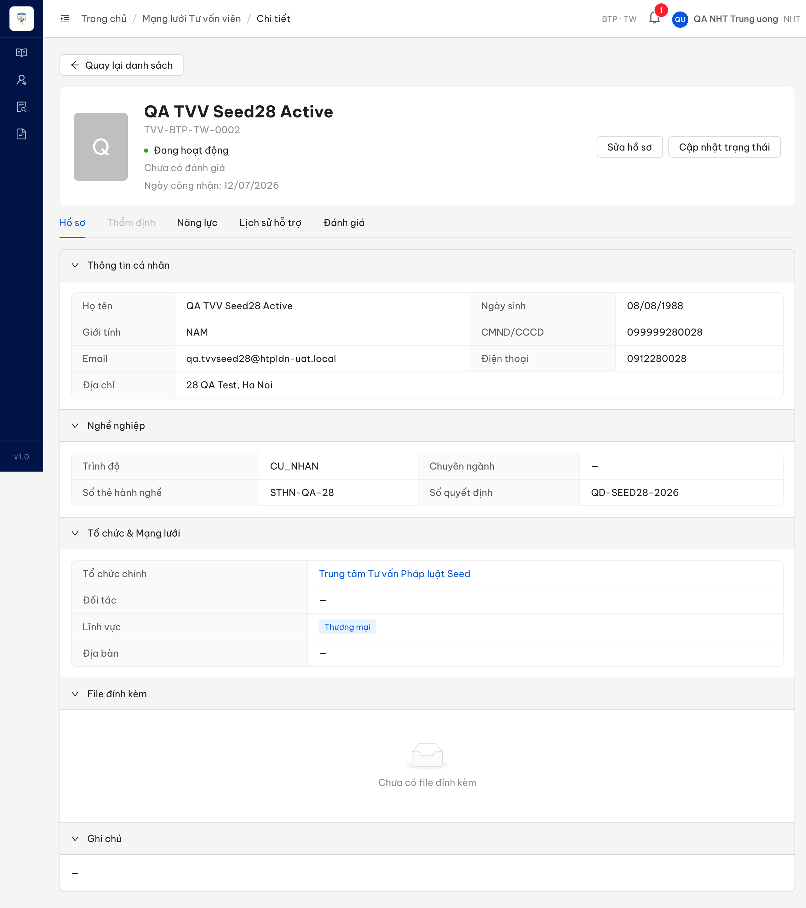

*(Evidence đối tác: `../partner-evidence/QLHSTVV_05.jpg` — banner "hương 3 NHT / NHT", TVV-STP-HN-0003 trạng thái "Mới đăng ký", thẻ "Thẩm định" đang active hiển thị Nhóm 1 — Pháp lý. Trùng khớp với kết quả tái hiện.)*

---

## ~~BUG-QLHSTVV_06~~ [CLOSED] — Thẻ "Năng lực": trường "Bằng cấp" in JSON thô ra màn hình, trường "Chứng chỉ" hiển thị "—" dù dữ liệu đã lưu

> **Re-test:** 2026-07-15 reverify-devfix — ✅ PASS (Closed). Thẻ "Năng lực" nay hiển thị Bằng cấp định dạng đọc được ("Luat Kinh te — Dai hoc Luat Ha Noi — Năm tốt nghiệp 2010", không còn JSON thô); Chứng chỉ hiển thị đúng dữ liệu ("Chung chi hanh nghe Luat su — Bo Tu phap — cấp 15/03/2012", không còn "—").

### Mô tả

Trên màn Chi tiết tư vấn viên → thẻ "Năng lực", trường **Bằng cấp** hiển thị nguyên chuỗi JSON thô (`{"tenTruong":"...","chuyenNganh":"...","namTotNghiep":2010}`) thay vì trình bày thành bảng tên trường / năm tốt nghiệp / chuyên ngành. Cùng thẻ đó, trường **Chứng chỉ** hiển thị "—" mặc dù hồ sơ đã có dữ liệu chứng chỉ chi tiết được lưu thành công.

### Các bước tái hiện

1. Đăng nhập vai trò **Cán bộ Nghiệp vụ Trung ương (CB_NV_TW)** — tài khoản `cbnv_tw` (quyền xem chi tiết TVV cùng đơn vị, SCR-IV-03 dòng 1529).
2. Mở chi tiết `TVV-BTP-TW-0002` (Đang hoạt động) → bấm "Sửa hồ sơ" → nhóm Nghề nghiệp → thêm 1 dòng **Bằng cấp chi tiết** (Dai hoc Luat Ha Noi / 2010 / Luat Kinh te) và 1 dòng **Chứng chỉ chi tiết** (Chung chi hanh nghe Luat su / 15/03/2012 / Bo Tu phap) → Lưu.
3. Quay lại Chi tiết → chọn thẻ **"Năng lực"**.
4. Quan sát 2 dòng "Bằng cấp" và "Chứng chỉ".

### Kết quả mong đợi

- Theo SCR-IV-03 thẻ Năng lực (srs-fr-04 dòng 1566), thẻ hiển thị Bằng cấp chi tiết, Chứng chỉ chi tiết, Kinh nghiệm chi tiết — trình bày đúng cấu trúc từng mục theo SCR-IV-02 mục 3.3–3.4 (dòng 1498–1499): bằng cấp gồm **tên trường / năm tốt nghiệp / chuyên ngành**; chứng chỉ gồm **tên chứng chỉ / ngày cấp / nơi cấp**.
- Dữ liệu đã lưu phải hiển thị đầy đủ, không để "—".

### Kết quả thực tế

- **Bằng cấp:** in nguyên JSON thô ra giao diện — `{"tenTruong":"Dai hoc Luat Ha Noi","chuyenNganh":"Luat Kinh te","namTotNghiep":2010}`.
- **Chứng chỉ:** hiển thị "—" dù dữ liệu đã lưu thành công (xác nhận `hoSo.chungChiChiTiet` có 1 phần tử: `{"noiCap":"Bo Tu phap","ngayCap":"2012-03-15","tenChungChi":"Chung chi hanh nghe Luat su"}`).
- Biểu mẫu "Cập nhật năng lực" trong cùng thẻ cũng hiển thị "Chưa có chứng chỉ nào." dù dữ liệu tồn tại.

### Bằng chứng

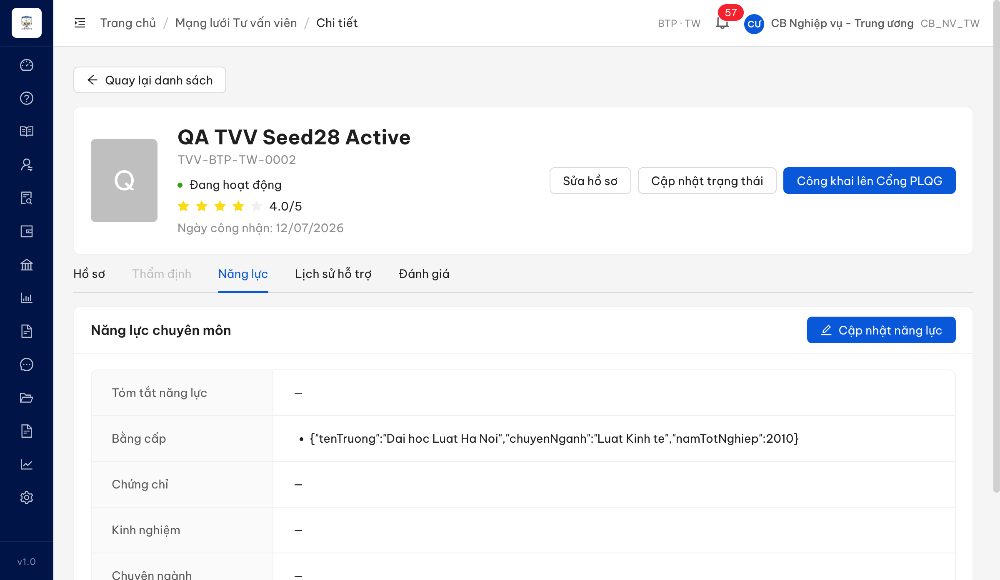

**Dữ liệu đã lưu (đọc lại từ hồ sơ tư vấn viên):**

```json
{
  "bangCapChiTiet": [{"tenTruong": "Dai hoc Luat Ha Noi", "chuyenNganh": "Luat Kinh te", "namTotNghiep": 2010}],
  "chungChiChiTiet": [{"noiCap": "Bo Tu phap", "ngayCap": "2012-03-15", "tenChungChi": "Chung chi hanh nghe Luat su"}]
}
```

*(Evidence đối tác: `../partner-evidence/QLHSTVV_06.webm` — frame 00:04, thẻ Năng lực của TVV-BTP-TW-0032 hiển thị "Bằng cấp: {"tenTruong":"Đại học Bách Khoa","chuyenNganh":"CNTT","namTotNghiep":2000}". Ý thứ hai của case (thẻ "Lịch sử hỗ trợ" / "Đánh giá" thiếu số đếm bản ghi cạnh tên thẻ) không có trong SRS → đã tách sang `ba-confirmation-needed-week-2.md`.)*

---

## ~~BUG-TDHSTVV_02~~ [CLOSED] — Nhóm 1 "Pháp lý": mục kiểm tra thứ 4 đặt tên "Không có vi phạm đạo đức nghề nghiệp" thay vì "Không vi phạm"

> **Re-test:** 2026-07-15 reverify-devfix2 — ✅ PASS (Closed). Tab Thẩm định (vai trò CB_NV_TW `cbnv_tw`, TVV-BTP-TW-0009): Nhóm 1 mục 4 hiển thị đúng "Không vi phạm".

### Mô tả

Trên màn Chi tiết tư vấn viên → tab **"Thẩm định"** → **Nhóm 1 — Pháp lý (bắt buộc)**, danh sách kiểm tra gồm 4 mục. Ba mục đầu hiển thị đúng tên theo đặc tả, riêng **mục thứ 4** hiển thị **"Không có vi phạm đạo đức nghề nghiệp"** trong khi SRS quy định mục này tên là **"Không vi phạm"**.

Việc thu hẹp tên mục thành "vi phạm đạo đức nghề nghiệp" còn làm hẹp phạm vi tiêu chí pháp lý mà cán bộ phải xác nhận (SRS để phạm vi rộng: mọi vi phạm, không giới hạn ở đạo đức nghề nghiệp).

### Các bước tái hiện

1. Đăng nhập vai trò **Cán bộ Nghiệp vụ Trung ương (CB_NV_TW)** — tài khoản `cbnv_tw`.
2. Vào menu "Mạng lưới Tư vấn viên" → "Tư vấn viên / Chuyên gia".
3. Mở chi tiết hồ sơ `TVV-BTP-TW-0003` (QA TVV Moi Dang Ky).
4. Chọn tab **"Thẩm định"**.
5. Quan sát 4 mục kiểm tra trong khối "Nhóm 1 — Pháp lý (bắt buộc)".

### Kết quả mong đợi

Theo **FR-IV-06 (UC44)** · **SCR-IV-03** tab "Thẩm định", ô Nhóm 1 (`srs-fr-04-chuyen-gia-tvv.md` dòng 1556), danh sách kiểm tra Nhóm 1 phải gồm đúng 4 mục:

> ☐ Bằng cấp hợp lệ ☐ Chứng chỉ hành nghề ☐ Thẻ hành nghề còn hiệu lực ☐ **Không vi phạm**

### Kết quả thực tế

Mục thứ 4 hiển thị **"Không có vi phạm đạo đức nghề nghiệp"** — sai tên so với SRS. Đối chiếu 1:1:

| # | SRS (dòng 1556) | Web hiển thị | Khớp |
|:-:|---|---|:-:|
| 1 | Bằng cấp hợp lệ | Bằng cấp hợp lệ | ✅ |
| 2 | Chứng chỉ hành nghề | Chứng chỉ hành nghề | ✅ |
| 3 | Thẻ hành nghề còn hiệu lực | Thẻ hành nghề còn hiệu lực | ✅ |
| 4 | **Không vi phạm** | **Không có vi phạm đạo đức nghề nghiệp** | ❌ |

3/4 mục khớp SRS nguyên văn → cột "Label / Dữ liệu hiển thị" của SRS đúng là đặc tả nhãn hiển thị, không phải cách viết rút gọn; mục 4 lệch là lỗi thật.

### Bằng chứng

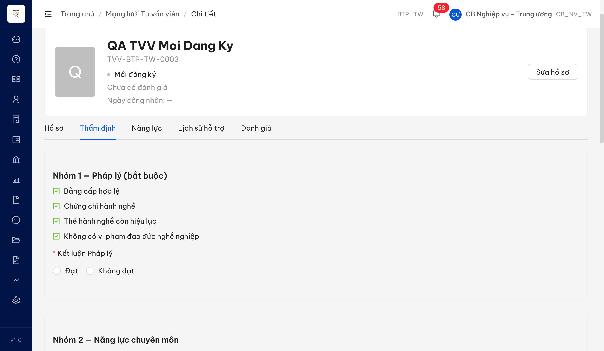

*(Evidence đối tác: `../partner-evidence/TDHSTVV_02.webm` — frame 00:21, đối tác bôi đen đúng dòng "Không có vi phạm đạo đức nghề nghiệp" trên tab Thẩm định. Lỗi tái hiện y hệt trên env được giao.)*

---

## ~~BUG-TDHSTVV_04~~ [CLOSED] — Nhóm 3 "Hiệu quả & uy tín": hộp tích đặt tên "N/A — TVV mới, chưa có lịch sử hỗ trợ" thay vì "Không áp dụng (tư vấn viên mới)"

> **Re-test:** 2026-07-15 reverify-devfix2 — ✅ PASS (Closed). Tab Thẩm định (CB_NV_TW `cbnv_tw`, TVV-BTP-TW-0009): Nhóm 3 hộp tích hiển thị đúng "Không áp dụng (tư vấn viên mới)".

### Mô tả

Trên màn Chi tiết tư vấn viên → tab **"Thẩm định"** → **Nhóm 3 — Hiệu quả & uy tín**, hộp tích cho phép bỏ qua nhóm này hiển thị tên **"N/A — TVV mới, chưa có lịch sử hỗ trợ"**, trong khi SRS quy định tên hộp tích là **"Không áp dụng (tư vấn viên mới)"**.

Nhãn hiện tại còn dùng viết tắt tiếng Anh **"N/A"** và viết tắt nội bộ **"TVV"** ngay trên giao diện người dùng — không đồng nhất ngôn ngữ hiển thị tiếng Việt với các nhãn còn lại của biểu mẫu.

### Các bước tái hiện

1. Đăng nhập vai trò **Cán bộ Nghiệp vụ Trung ương (CB_NV_TW)** — tài khoản `cbnv_tw`.
2. Vào menu "Mạng lưới Tư vấn viên" → "Tư vấn viên / Chuyên gia".
3. Mở chi tiết hồ sơ `TVV-BTP-TW-0003` (QA TVV Moi Dang Ky).
4. Chọn tab **"Thẩm định"** → cuộn tới khối "Nhóm 3 — Hiệu quả & uy tín".
5. Quan sát tên hộp tích phía trên thanh "Điểm (1–5)".

### Kết quả mong đợi

Theo **FR-IV-06 (UC44)** · **SCR-IV-03** tab "Thẩm định", ô Nhóm 3 (`srs-fr-04-chuyen-gia-tvv.md` dòng 1558):

> Nhóm 3 — Hiệu quả & uy tín | Chấm điểm thang 1–5 sao + ô nhận xét. Tích hộp **"Không áp dụng (tư vấn viên mới)"** → bỏ qua nhóm này

Nhãn hiển thị phải là "Không áp dụng (tư vấn viên mới)", tiếng Việt đầy đủ.

### Kết quả thực tế

Hộp tích hiển thị **"N/A — TVV mới, chưa có lịch sử hỗ trợ"** — sai tên so với SRS, đồng thời lẫn viết tắt tiếng Anh "N/A" và viết tắt nội bộ "TVV" trên giao diện.

### Bằng chứng

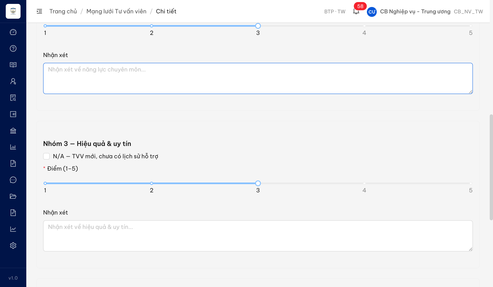

*(Evidence đối tác: `../partner-evidence/TDHSTVV_04.webm` — frame 00:10, đối tác bôi đen đúng dòng "N/A — TVV mới, chưa có lịch sử hỗ trợ". Lỗi tái hiện y hệt trên env được giao. Cùng nhóm nguyên nhân với BUG-TDHSTVV_02 — nhãn tab Thẩm định không khớp đặc tả.)*

---

## ~~BUG-TDHSTVV_08~~ [CLOSED] — "Lưu nháp" kết quả thẩm định: không có thông báo, mất toàn bộ nội dung Nhận xét, nháp không nạp lại sau khi tải lại trang

> **Re-test:** 2026-07-15 reverify-devfix2 — ✅ PASS (Closed). Lưu nháp (CB_NV_TW `cbnv_tw`, TVV-BTP-TW-0009): toast "Đã lưu kết quả thẩm định" hiện; sau khi tải lại trang, cả 3 ô Nhận xét (Nhóm 2/3/4) + Kết luận Pháp lý (Đạt) + Kết luận thẩm định (ĐẠT) đều nạp lại đầy đủ.

### Mô tả

Trên tab **"Thẩm định"**, nút **"Lưu nháp"** hỏng ở 3 điểm:

1. **Không phản hồi:** bấm "Lưu nháp" → giao diện im lặng hoàn toàn, không thông báo thành công/thất bại, dù yêu cầu lưu đã chạy và máy chủ trả **200 OK**.
2. **Mất dữ liệu Nhận xét:** nội dung 3 ô "Nhận xét" (Nhóm 2, Nhóm 3, Nhóm 4) **không được gửi lên máy chủ** — không có trong dữ liệu yêu cầu → mất vĩnh viễn.
3. **Nháp không nạp lại:** tải lại trang → 3 ô Nhận xét trống, radio "Kết luận Pháp lý" và "Kết luận thẩm định" không được chọn lại, dù máy chủ đã lưu `nhom1KetQua=true` và `ketLuan=DAT`.

Hệ quả: chức năng "Lưu nháp" mất hoàn toàn tác dụng nghiệp vụ — cán bộ **không thể quay lại hoàn thiện sau** (đúng mục đích mà SRS đặt ra cho nút này).

### Các bước tái hiện

1. Đăng nhập vai trò **Cán bộ Nghiệp vụ Trung ương (CB_NV_TW)** — tài khoản `cbnv_tw`.
2. Mở chi tiết `TVV-BTP-TW-0003` ở trạng thái **"Đang thẩm định"** → tab **"Thẩm định"**.
3. Điền biểu mẫu: "Kết luận Pháp lý" = Đạt; nhập nội dung vào **cả 3 ô "Nhận xét"** (Nhóm 2, Nhóm 3, Nhóm 4); "Kết luận thẩm định" = ĐẠT.
4. Bấm **"Lưu nháp"** → quan sát giao diện (theo dõi DOM liên tục 3,5 giây).
5. **Tải lại trang** (bỏ qua bộ nhớ đệm) → mở lại tab "Thẩm định" → quan sát các trường vừa nhập.

### Kết quả mong đợi

Theo **FR-IV-06 (UC44)** · **SCR-IV-03** tab "Thẩm định" (`srs-fr-04-chuyen-gia-tvv.md` dòng 1563):

> Nút **Lưu nháp** — "Lưu kết quả thẩm định tạm, không chuyển trạng thái"

Kết quả thẩm định gồm cả **ô nhận xét** của Nhóm 2 (dòng 1557: "Chấm điểm thang 1–5 sao + ô nhận xét (tối đa 5000 ký tự)"), Nhóm 3 (dòng 1558) và ghi chú Nhóm 4 (dòng 1559). Vì vậy: nội dung nhận xét phải được lưu, phải nạp lại được khi cán bộ quay lại, và hệ thống phải phản hồi cho người dùng biết thao tác lưu đã thành công.

### Kết quả thực tế

- **Không có thông báo:** MutationObserver cài **trước** cú bấm, theo dõi 3,5 giây → `addedNodes = 0`; không tồn tại `.ant-message-notice-wrapper` / `.ant-notification-notice` / `[role="alert"]`.
- **Yêu cầu lưu vẫn chạy:** `POST /api/v1/tu-van-viens/{id}/tham-dinh` → **200 OK** ⇒ im lặng là do giao diện không phản hồi, không phải do lỗi mạng.
- **Dữ liệu gửi lên thiếu Nhận xét:**

```json
{"nhom1KetQua":true,"nhom2Diem":3,"nhom3Diem":3,"nhom4ThamGia":false,"ketLuan":"DAT","version":2,"trinhDuyet":false}
```

  → không có trường nào chứa nội dung 3 ô Nhận xét đã nhập. Bản ghi thẩm định máy chủ trả về cũng chỉ có `nhom1KetQua / nhom2Diem / nhom3Diem / nhom4ThamGia / ketLuan / lyDo` — **không có chỗ lưu nhận xét**.
- **Sau khi tải lại trang:** 3 ô Nhận xét trống; "Kết luận Pháp lý" và "Kết luận thẩm định" không được chọn lại (dù máy chủ đã lưu `nhom1KetQua=true`, `ketLuan=DAT`).

### Bằng chứng

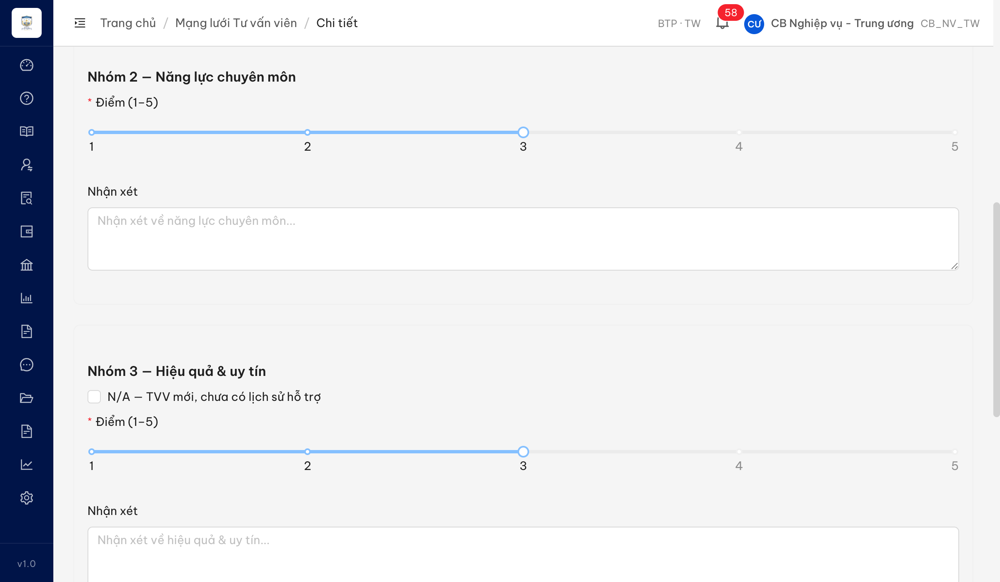

Bảng đối chiếu điều kiện đầy đủ: `../reverify-audit/conditions/TDHSTVV_08.md` (0 GAP — đúng vai trò CB_NV_TW + đúng trạng thái "Đang thẩm định" của đối tác).

*(Evidence đối tác: `../partner-evidence/TDHSTVV_08.webm` — frame 00:13 bấm "Lưu nháp", frame 00:16 không có thông báo; frame 00:18 lộ hồ sơ `TVV-BTP-TW-0011` trạng thái "Đang thẩm định". Trích dày 2 fps suốt 8 giây sau cú bấm → không frame nào có thông báo.)*

---

## ~~BUG-TDHSTVV_12~~ [CLOSED] — Nút "Gửi kết quả thẩm định" vẫn bật khi chưa chọn "Kết luận thẩm định"

> **Re-test:** 2026-07-15 reverify-devfix2 — ✅ PASS (Closed). Tab Thẩm định (CB_NV_TW `cbnv_tw`, TVV-BTP-TW-0009): chưa chọn Kết luận → "Gửi KQ" `disabled=true` (khóa đúng); chọn Kết luận thẩm định → "Gửi KQ" `disabled=false` (mở đúng). Gating chuẩn SRS dòng 1564.

### Mô tả

Trên tab **"Thẩm định"**, nút **"Gửi KQ"** luôn ở trạng thái bật (bấm được) **kể cả khi người dùng chưa chọn "Kết luận thẩm định"**. Theo SRS, nút này chỉ khả dụng khi kết luận **đã được chọn**.

Đáng chú ý: nút anh em **"Trình duyệt"** (cùng hàng, cùng bảng đặc tả) **đã được cài đúng** — bị khóa khi chưa chọn kết luận. Cho thấy đây là thiếu sót cài đặt riêng cho nút "Gửi KQ", không phải cách hiểu khác về đặc tả.

### Các bước tái hiện

1. Đăng nhập vai trò **Cán bộ Nghiệp vụ Trung ương (CB_NV_TW)** — tài khoản `cbnv_tw`.
2. Mở chi tiết `TVV-BTP-TW-0003` ở trạng thái **"Đang thẩm định"** → tab **"Thẩm định"**.
3. **Không chọn** bất kỳ lựa chọn nào ở "Kết luận thẩm định" (để trống cả ĐẠT / KHÔNG ĐẠT / YÊU CẦU BỔ SUNG).
4. Quan sát hàng nút cuối biểu mẫu: "Hủy" · "Lưu nháp" · "Gửi KQ" · "Trình duyệt".

### Kết quả mong đợi

Theo **FR-IV-06 (UC44)** · **SCR-IV-03** tab "Thẩm định", ô 20c (`srs-fr-04-chuyen-gia-tvv.md` dòng 1564):

> Nút **Gửi kết quả thẩm định** — Điều kiện hiển thị: **Tab Thẩm định, kết luận đã chọn**

⇒ Chưa chọn "Kết luận thẩm định" thì nút "Gửi KQ" phải bị khóa; chọn rồi mới mở.

### Kết quả thực tế

Đọc trực tiếp thuộc tính `disabled` của các nút khi **chưa chọn Kết luận**:

- "Hủy" → `disabled = false`
- "Lưu nháp" → `disabled = false`
- **"Gửi KQ" → `disabled = false`** ⇒ **bấm được — sai SRS dòng 1564**
- "Trình duyệt" → `disabled = true` ⇒ khóa đúng SRS dòng 1565

Bấm thử "Gửi KQ" lúc chưa chọn kết luận → biểu mẫu báo lỗi tại chỗ ("Vui lòng chọn kết quả pháp lý" / "Vui lòng chọn kết luận") và **không** đổi trạng thái hồ sơ. Nghĩa là **dữ liệu không bị hỏng**, nhưng trạng thái bật/tắt của nút vẫn sai đặc tả (người dùng bị dẫn dụ bấm một nút lẽ ra phải khóa).

### Bằng chứng

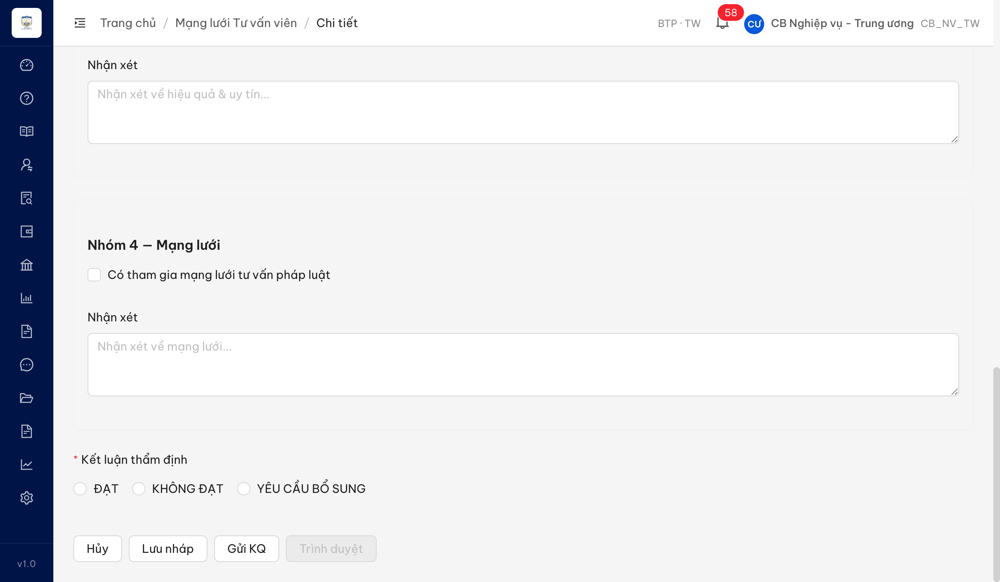

Bảng đối chiếu điều kiện: `../reverify-audit/conditions/TDHSTVV_12.md` (0 GAP).

*(Evidence đối tác: `../partner-evidence/TDHSTVV_12.jpg` — cùng hiện tượng trên hồ sơ `TVV-BTP-TW-0011`: Kết luận thẩm định để trống, "Gửi KQ" bấm được, "Trình duyệt" xám.)*

---

## ~~BUG-TDHSTVV_13~~ [CLOSED] — "Gửi kết quả thẩm định" với kết luận "Yêu cầu bổ sung": không hiển thị thông báo thành công

> **Re-test:** 2026-08-03 18:49 R2 — ✅ PASS (Closed-verified, build HTPLDN V1.0.4). Chạy lại trên dữ liệu MỚI: `nht_tc001_btp_tw` (NHT) tạo hồ sơ TVV-BTP-TW-0068 → `cbnv_tw` bắt đầu thẩm định → kết luận "YÊU CẦU BỔ SUNG" + lý do mốc `RV2-0308-BOSUNG…` → Gửi KQ. Đủ CẢ 4 ý Kết quả mong đợi: (1) hồ sơ chuyển "Yêu cầu bổ sung"; (2) Người hỗ trợ nhận thông báo trong phần mềm (chuông 3→4, mục "Yêu cầu bổ sung hồ sơ TVV" nhóm "Thẩm định", CHỨA nguyên văn lý do) + thư điện tử, chủ hồ sơ nhận thư riêng không bị thay thế; (3) Nhật ký hệ thống ghi 18:49:01 thao tác "Thẩm định" trên TU_VAN_VIEN `c19568f0…`; (4) toast đúng nguyên văn **"Đã gửi yêu cầu bổ sung đến Người hỗ trợ"** — không còn là "Đã lưu kết quả thẩm định". Bằng chứng: `../../reverify-week-4/reverify-round-2026-08-03/evidence/TDHSTVV_13-thong-bao-kem-ly-do.png`.

### Mô tả

Trên tab **"Thẩm định"**, chọn Kết luận thẩm định = **"YÊU CẦU BỔ SUNG"**, nhập Lý do rồi bấm **"Gửi KQ"**:

- **Phần nghiệp vụ chạy ĐÚNG:** hồ sơ chuyển trạng thái sang "Yêu cầu bổ sung", lý do được lưu đầy đủ.
- **Nhưng giao diện im lặng hoàn toàn:** không hiển thị bất kỳ thông báo thành công nào cho cán bộ vừa thao tác.

Đây là biểu hiện của cùng một nhóm nguyên nhân với **BUG-TDHSTVV_08**: biểu mẫu Thẩm định **không phản hồi kết quả thao tác** cho người dùng.

### Các bước tái hiện

1. Đăng nhập vai trò **Cán bộ Nghiệp vụ Trung ương (CB_NV_TW)** — tài khoản `cbnv_tw`.
2. Mở chi tiết `TVV-BTP-TW-0003` ở trạng thái **"Đang thẩm định"** → tab **"Thẩm định"**.
3. Chọn "Kết luận Pháp lý" = Đạt.
4. Chọn "Kết luận thẩm định" = **"YÊU CẦU BỔ SUNG"** → ô "Lý do" hiện ra → nhập lý do (≥ 10 ký tự).
5. Bấm **"Gửi KQ"** → theo dõi giao diện liên tục 4 giây.

### Kết quả mong đợi

- Theo **UI-04** — Đặc điểm logic UI áp dụng **toàn hệ thống** (`srs-v3.5.md` dòng 571):

  > "Kiểm tra thời gian thực + viền đỏ + thông báo lỗi dưới ô nhập. Popup xác nhận trước xóa. **Toast notification cho thao tác thành công**"

  ⇒ Thao tác thành công **bắt buộc** phải có thông báo phản hồi cho người dùng.
- Theo **FR-IV-06 (UC44)** · **SCR-IV-03** ô 20c (`srs-fr-04-chuyen-gia-tvv.md` dòng 1564): kết luận "Yêu cầu bổ sung" → đặt trạng thái Yêu cầu bổ sung + thông báo chủ hồ sơ.

### Kết quả thực tế

- **Không có thông báo nào:** MutationObserver cài **trước** cú bấm, theo dõi 4 giây → `addedNodes = 0`; không tồn tại `.ant-message-notice-wrapper` / `.ant-notification-notice`.
- **Nghiệp vụ vẫn chạy đúng:** `POST /api/v1/tu-van-viens/{id}/tham-dinh` → **200 OK**; máy chủ trả `trangThai: DANG_THAM_DINH → YEU_CAU_BO_SUNG`, bản ghi thẩm định lưu đúng `ketLuan: "YEU_CAU_BO_SUNG"` + `lyDo`.
- ⇒ Lỗi **chỉ ở tầng phản hồi giao diện**, không phải lỗi nghiệp vụ.

### Bằng chứng

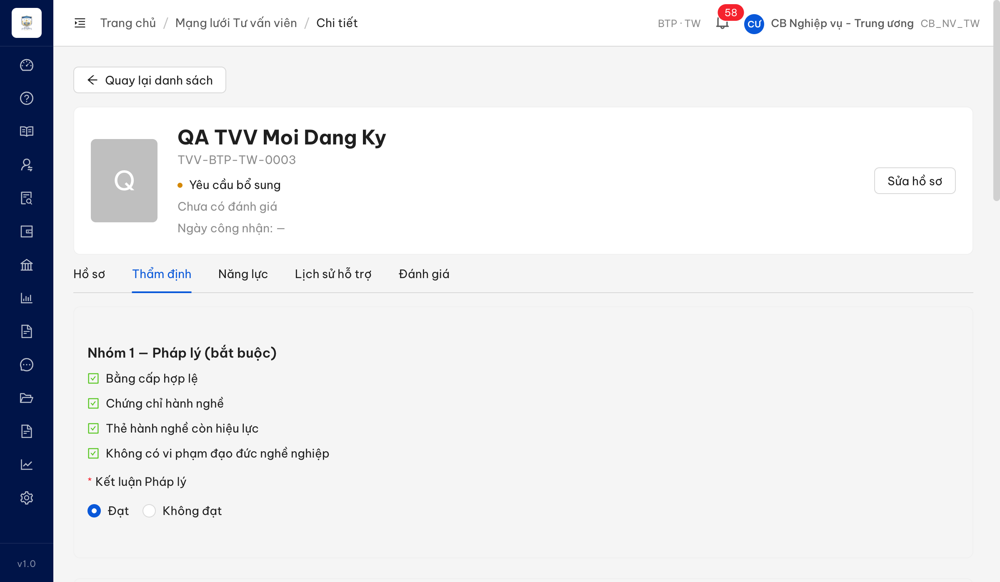

Bảng đối chiếu điều kiện: `../reverify-audit/conditions/TDHSTVV_13.md` (0 GAP).

> **Lưu ý cho BA/dev — không áp đặt câu chữ:** câu thông báo mà đối tác kỳ vọng ("Đã gửi yêu cầu bổ sung đến **Người hỗ trợ**") **không có trong SRS**; SRS dòng 519 và 1564 quy định thông báo gửi đến **chủ hồ sơ (TVV/CG)**, không phải "Người hỗ trợ". Bug này vì vậy chỉ nêu **yêu cầu phải có thông báo cho thao tác thành công** (UI-04), dev tự chọn câu chữ phù hợp SRS.

*(Evidence đối tác: `../partner-evidence/TDHSTVV_13.webm` — frame 00:45: `TVV-BTP-TW-0011` đã chuyển "Yêu cầu bổ sung" (nghiệp vụ chạy được), khiếu nại duy nhất trong sheet là "Hệ thống không hiển thị thông báo".)*

---

## ~~BUG-TDHSTVV_14~~ [CLOSED] — Thẩm định ở trạng thái không hợp lệ: giao diện hiện SAI thông báo lỗi ("Dữ liệu đã bị thay đổi") thay vì lý do thật ("sai trạng thái"); thao tác từ chối thành công cũng không có thông báo

> **Re-test:** 2026-07-15 reverify-devfix2 — ✅ PASS (Closed). Vai trò CB_NV_TW. **Lỗi 1:** hồ sơ trạng thái "Yêu cầu bổ sung" → tab "Thẩm định" nay bị vô hiệu hóa, không vào được biểu mẫu thẩm định sai trạng thái → không còn thông báo lỗi sai bản chất. **Lỗi 2:** tạo hồ sơ mới `TVV-BTP-TW-0011` (Mới đăng ký, hợp lệ) → Kết luận Pháp lý Đạt + Kết luận thẩm định KHÔNG ĐẠT + Lý do → "Gửi KQ": trạng thái chuyển "Từ chối" ✅ VÀ hiện toast thành công "Đã lưu kết quả thẩm định" (MutationObserver bắt được, trước đây addedNodes=0). Ảnh: `image/TDHSTVV_14-reverify-loi2-tuchoi-toast-thanhcong.png`.

### Mô tả

Case này lộ **2 lỗi tách biệt**:

**Lỗi 1 — Thông báo lỗi sai bản chất (chính).** Khi hồ sơ ở trạng thái **"Yêu cầu bổ sung"**, tab "Thẩm định" vẫn mở được và nút "Gửi KQ" vẫn bấm được. Bấm "Gửi KQ" với kết luận "KHÔNG ĐẠT" → máy chủ trả **HTTP 409** với mã **`ERR-STATE-IV-TD-01`** — *"TVV không ở trạng thái hợp lệ để thẩm định"*. Nhưng giao diện lại hiển thị **"Dữ liệu đã bị thay đổi, vui lòng tải lại"** — thông báo của tình huống **xung đột chỉnh sửa đồng thời**, hoàn toàn khác bản chất lỗi.

Hệ quả: cán bộ tải lại trang (đúng như thông báo hướng dẫn) nhưng **dữ liệu vẫn y nguyên**, thao tác vẫn hỏng, và không bao giờ biết lý do thật. Lỗi xảy ra **ngay cả trên trang vừa tải mới hoàn toàn** ⇒ không phải do giao diện giữ phiên bản dữ liệu cũ.

**Lỗi 2 — Từ chối thành công nhưng không có thông báo.** Trên hồ sơ ở trạng thái **hợp lệ**, "Gửi KQ" + "KHÔNG ĐẠT" chuyển trạng thái sang "Từ chối" **đúng nghiệp vụ**, nhưng **không hiển thị thông báo thành công nào** (Kết quả mong đợi: "Đã từ chối hồ sơ").

### Các bước tái hiện

**Lỗi 1 (đúng điều kiện đối tác):**
1. Đăng nhập **Cán bộ Nghiệp vụ Trung ương (CB_NV_TW)** — `cbnv_tw`.
2. Mở hồ sơ `TVV-BTP-TW-0003` đang ở trạng thái **"Yêu cầu bổ sung"** → **tải lại trang** (bỏ qua bộ nhớ đệm).
3. Vào tab **"Thẩm định"** (tab vẫn mở được dù trạng thái không hợp lệ).
4. Chọn "Kết luận Pháp lý" = Đạt; "Kết luận thẩm định" = **KHÔNG ĐẠT**; nhập Lý do ≥ 10 ký tự.
5. Bấm **"Gửi KQ"** → quan sát thông báo + mở tab Network xem phản hồi máy chủ.

**Lỗi 2 (đường đi hợp lệ):**
1. Tạo hồ sơ TVV mới (`TVV-BTP-TW-0004`) — trạng thái "Mới đăng ký" (**hợp lệ** theo SRS dòng 495).
2. Tab "Thẩm định" → KHÔNG ĐẠT + Lý do → **"Gửi KQ"** → quan sát thông báo.

### Kết quả mong đợi

- Theo **FR-IV-06 (UC44) §Preconditions** (`srs-fr-04-chuyen-gia-tvv.md` dòng 495): TVV phải ở trạng thái MOI_DANG_KY hoặc DANG_THAM_DINH mới thẩm định được.
- Theo **SCR-IV-03** ô 13 (dòng 1555): tab "Thẩm định" **chỉ hiển thị khi trạng thái ∈ {Đang thẩm định, Chờ phê duyệt}** ⇒ ở "Yêu cầu bổ sung", hệ thống **không được** dẫn người dùng vào biểu mẫu thẩm định.
- Khi hệ thống từ chối một thao tác, thông báo hiển thị phải **phản ánh đúng lý do từ chối** (ở đây: sai trạng thái), để người dùng biết cách xử lý — không được hướng dẫn sai ("tải lại trang") cho một lỗi mà tải lại không giải quyết được.
- Theo **UI-04** (`srs-v3.5.md` dòng 571): "**Toast notification cho thao tác thành công**" ⇒ từ chối hồ sơ thành công phải có thông báo.

### Kết quả thực tế

**Lỗi 1** — `POST /api/v1/tu-van-viens/{id}/tham-dinh` → **409**:

```json
{"success": false,
 "error": {"code": "ERR-STATE-IV-TD-01",
           "message": "TVV không ở trạng thái hợp lệ để thẩm định"}}
```

Giao diện hiển thị: **"Dữ liệu đã bị thay đổi, vui lòng tải lại"** (bắt được bằng MutationObserver, đúng nguyên văn). Trạng thái hồ sơ không đổi (vẫn "Yêu cầu bổ sung"). Tải lại trang → không thay đổi gì.
⇒ Giao diện đang ánh xạ **mọi** lỗi 409 thành thông báo "xung đột dữ liệu", nuốt mất `error.message` thật mà máy chủ đã trả về.

**Lỗi 2** — trên `TVV-BTP-TW-0004` (trạng thái hợp lệ): "Gửi KQ" + KHÔNG ĐẠT → máy chủ trả `trangThai = TU_CHOI`, giao diện hiện huy hiệu "Từ chối" ✅, nhưng MutationObserver ghi nhận `addedNodes = 0` ⇒ **không có thông báo thành công nào**.

### Bằng chứng


Bảng đối chiếu điều kiện + phản hồi máy chủ đầy đủ: `../reverify-audit/conditions/TDHSTVV_14.md` (0 GAP).

*(Evidence đối tác: `../partner-evidence/TDHSTVV_14.webm` — frame 00:41 toast "Dữ liệu đã bị thay đổi, vui lòng tải lại"; frame 00:46 hồ sơ `TVV-BTP-TW-0011` ở trạng thái "Yêu cầu bổ sung" — đối tác chạy case này ngay trên hồ sơ vừa bị TDHSTVV_13 đẩy sang trạng thái đó.)*

---

## ~~BUG-TDHSTVV_17~~ [CLOSED] — Trình phê duyệt: Cán bộ Phê duyệt cùng đơn vị KHÔNG nhận được thông báo; mất toàn bộ Nhận xét; không có thông báo thành công; thiếu hộp thoại xác nhận

> **Re-test:** 2026-07-15 reverify-devfix2 — ✅ PASS (Closed). cbnv_tw thẩm định ĐẠT + 3 Nhận xét trên TVV-BTP-TW-0010 → Trình duyệt: (4) hộp thoại xác nhận "Trình phê duyệt hồ sơ thẩm định" hiện; (3) toast "Đã trình hồ sơ lên cấp phê duyệt"; (2) sau reload 3 Nhận xét nạp lại đầy đủ; (1) đăng nhập cbpd_tw cùng đơn vị → NHẬN thông báo "Hồ sơ TVV QA TVV RV17 TrinhDuyet đã được thẩm định và chờ phê duyệt" (2 phút trước).

### Mô tả

Trên tab **"Thẩm định"**, Cán bộ Nghiệp vụ cấp Trung ương kết luận **ĐẠT** rồi bấm **"Trình duyệt"**. Trạng thái hồ sơ chuyển sang **"Chờ phê duyệt"** đúng nghiệp vụ, nhưng có **4 lỗi**:

1. **Cán bộ Phê duyệt cùng đơn vị KHÔNG nhận được thông báo** (lỗi nặng nhất — hồ sơ nằm im trong hàng chờ, không ai biết để duyệt).
2. **Mất toàn bộ nội dung "Nhận xét"** của Nhóm 2 / 3 / 4 — tải lại trang thì cả 3 ô đều trống.
3. **Không hiển thị thông báo thành công** nào cho cán bộ vừa thao tác.
4. **Không có hộp thoại xác nhận** trước khi trình (SRS yêu cầu MD-TRINH-DUYET).

### Các bước tái hiện

1. Đăng nhập **Cán bộ Nghiệp vụ Trung ương (CB_NV_TW)** — `cbnv_tw`.
2. Mở hồ sơ `TVV-BTP-TW-0005` ("QA TVV Trinh Duyet R17") → tab **"Thẩm định"**.
3. Điền: "Kết luận Pháp lý" = Đạt; **nhập nội dung vào cả 3 ô "Nhận xét"** (Nhóm 2, 3, 4); "Kết luận thẩm định" = **ĐẠT**.
4. Bấm **"Trình duyệt"** → quan sát hộp thoại xác nhận + thông báo (theo dõi giao diện 4 giây).
5. **Tải lại trang** → mở lại tab "Thẩm định" → quan sát 3 ô Nhận xét.
6. Đăng nhập **`cbpd_tw`** (Cán bộ Phê duyệt **cùng đơn vị** BTP·TW) → mở hộp Thông báo.

### Kết quả mong đợi

- **FR-IV-06 (UC44) §Processing bước 4** (`srs-fr-04-chuyen-gia-tvv.md` dòng 518): trình duyệt → chuyển `CHO_PHE_DUYET` + **gửi thông báo CB_PD cùng đơn vị với CB NV thẩm định**.
- **§Acceptance Criteria** (dòng 551): *"**Given** CB NV kết luận ĐẠT **When** nhấn 'Trình duyệt' **Then** TVV → CHO_PHE_DUYET, **CB PD nhận thông báo**"*.
- **SCR-IV-03** ô 20d (dòng 1565): Click → **MD-TRINH-DUYET** → đặt trạng thái Chờ phê duyệt + thông báo CB Phê duyệt cùng đơn vị. Nội dung hộp thoại tại dòng 1396: *"Xác nhận trình phê duyệt? — Bạn đang trình hồ sơ **{tên}** lên Cán bộ Phê duyệt. Sau khi trình, bạn không thể chỉnh sửa kết quả thẩm định…"*.
- **SCR-IV-03** ô 15–17 (dòng 1557–1559): Nhóm 2/3/4 có **ô nhận xét** — là một phần kết quả thẩm định, phải được lưu.
- **UI-04** (`srs-v3.5.md` dòng 571): "**Toast notification cho thao tác thành công**".

### Kết quả thực tế

| # | Hạng mục | Thực tế |
|:-:|---|---|
| 1 | Thông báo cho CB Phê duyệt | **KHÔNG có** — xem chi tiết dưới |
| 2 | Nhận xét Nhóm 2/3/4 sau khi tải lại | **"-" (trống)** — mất hết |
| 3 | Thông báo thành công cho CB Nghiệp vụ | **KHÔNG có** (`addedNodes = 0`) |
| 4 | Hộp thoại xác nhận MD-TRINH-DUYET | **KHÔNG có** — chuyển trạng thái ngay |
| — | Chuyển trạng thái → "Chờ phê duyệt" | ✅ đúng |
| — | Ghi nhận người trình / ngày trình | `nguoiGuiDuyetId = null`, `ngayGuiDuyet = null` |

**Chi tiết lỗi 1** — đăng nhập `cbpd_tw` (CB_PD_TW, **cùng đơn vị** `00000000-…-0001` với `cbnv_tw`) ngay sau thao tác:

- Hồ sơ `TVV-BTP-TW-0005` **CÓ** trong hàng chờ "Chờ phê duyệt" của tài khoản này ⇒ đúng thẩm quyền, lẽ ra phải được báo.
- Quét **50 thông báo** gần nhất → **0** thông báo liên quan tư vấn viên / thẩm định / trình duyệt. Thông báo mới nhất là "19 giờ trước" và "2 ngày trước".
- Cơ chế thông báo **vẫn hoạt động bình thường** cho luồng khác (đào tạo, hỏi đáp chờ phê duyệt vẫn có thông báo) ⇒ thiếu sót nằm **riêng ở luồng trình duyệt hồ sơ TVV**.

**Chi tiết lỗi 2** — cùng gốc với **BUG-TDHSTVV_08**: giao diện **không gửi** nội dung Nhận xét lên máy chủ (dữ liệu gửi lên chỉ có `nhom1KetQua / nhom2Diem / nhom3Diem / nhom4ThamGia / ketLuan / lyDo`).

### Bằng chứng


Bảng đối chiếu điều kiện đầy đủ: `../reverify-audit/conditions/TDHSTVV_17.md` (0 GAP — verify bằng đúng vai trò CB_NV_TW cấp TW + kiểm thông báo bằng đúng tài khoản CB Phê duyệt cùng đơn vị).

*(Evidence đối tác: `../partner-evidence/TDHSTVV_17.webm` — hồ sơ `TVV-BTP-TW-0007`, sau "Trình duyệt" chuyển "Chờ phê duyệt", mở lại tab Thẩm định thì ô Nhận xét trống.)*

---

## ~~BUG-TDHSTVV_18~~ [CLOSED] — Trình phê duyệt ở cấp Địa phương: Cán bộ Phê duyệt cùng đơn vị KHÔNG nhận được thông báo; không có thông báo thành công; thiếu hộp thoại xác nhận

> **Re-test:** 2026-07-15 reverify-devfix2 — ✅ PASS (Closed). Tự seed `TVV-STP-AG-0002` "QA TVV RV18 DiaPhuong" (cấp ĐP) → cbnv_dp thẩm định ĐẠT → "Trình duyệt". Cả 3 thiếu sót đã fix: (1) **hộp thoại xác nhận** MD-TRINH-DUYET hiện ("Bạn xác nhận trình phê duyệt?"); (2) **toast thành công** "Đã trình hồ sơ lên cấp phê duyệt"; (3) **cbpd_dp cùng đơn vị NHẬN thông báo** "Hồ sơ TVV QA TVV RV18 DiaPhuong đã được thẩm định và chờ phê duyệt" (chuông 1 chưa đọc). Hồ sơ chuyển "Chờ phê duyệt" đúng. Ảnh: `image/TDHSTVV_18-reverify-cbpd-dp-nhan-thong-bao-trinh-duyet.png`, `image/TDHSTVV_18-reverify-cbnvdp-trinh-duyet-chophe-duyet.png`.

### Mô tả

Cán bộ Nghiệp vụ **cấp Địa phương** thẩm định hồ sơ TVV của đơn vị mình, kết luận **ĐẠT** rồi bấm **"Trình duyệt"**. Trạng thái hồ sơ chuyển sang **"Chờ phê duyệt"** đúng nghiệp vụ và hồ sơ nằm đúng hàng chờ của Cán bộ Phê duyệt cùng đơn vị, nhưng **không một thông báo nào được phát ra** — cả cho người thao tác lẫn cho người phải duyệt. Lỗi trùng khớp với **BUG-TDHSTVV_17** (cùng luồng, cấp Trung ương) ⇒ thiếu sót ở luồng trình duyệt hồ sơ TVV, **không phụ thuộc cấp đơn vị**.

### Các bước tái hiện

1. Đăng nhập **Cán bộ Nghiệp vụ Địa phương (CB_NV_DP)** — `cbnv_dp`.
2. Mở hồ sơ TVV của đơn vị mình đang ở trạng thái **"Đang thẩm định"** (`TVV-STP-AG-0001` — "QA TVV Dia Phuong R18") → tab **"Thẩm định"**.
3. Điền: "Kết luận Pháp lý" = Đạt; Nhóm 2/3/4; "Kết luận thẩm định" = **ĐẠT**.
4. Bấm **"Trình duyệt"** → quan sát hộp thoại xác nhận + thông báo trên màn hình (theo dõi giao diện 4 giây).
5. Đăng nhập **`cbpd_dp`** (Cán bộ Phê duyệt **cùng đơn vị** với người thẩm định) → mở hộp Thông báo, đối chiếu với thẻ "Chờ phê duyệt".

### Kết quả mong đợi

- **FR-IV-06 (UC44) §Processing bước 4** (`srs-fr-04-chuyen-gia-tvv.md` dòng 518): trình duyệt → chuyển `CHO_PHE_DUYET` + **gửi thông báo CB_PD cùng đơn vị với CB NV thẩm định**. Dòng 570 xác định rõ với hồ sơ cấp ĐP: *"CB_PD_ĐP duyệt hồ sơ do CB_NV_ĐP thẩm định"*.
- **§Acceptance Criteria** (dòng 551): *"**Given** CB NV kết luận ĐẠT **When** nhấn 'Trình duyệt' **Then** TVV → CHO_PHE_DUYET, **CB PD nhận thông báo**"*.
- **SCR-IV-03** ô 20d (dòng 1565): Click → **MD-TRINH-DUYET** → đặt trạng thái Chờ phê duyệt + thông báo Cán bộ Phê duyệt cùng đơn vị. Nội dung hộp thoại tại dòng 1396.
- **UI-04** (`srs-v3.5.md` dòng 571): "**Toast notification cho thao tác thành công**".

### Kết quả thực tế

| # | Hạng mục | Thực tế |
|:-:|---|---|
| 1 | Thông báo cho Cán bộ Phê duyệt cùng đơn vị (`cbpd_dp`) | **KHÔNG có** — hộp thông báo hiển thị "Không có thông báo mới", số chưa đọc = 0, tổng thông báo = 0 |
| 2 | Thông báo thành công cho Cán bộ Nghiệp vụ | **KHÔNG có** — theo dõi giao diện 4 giây sau cú bấm: 0 phần tử thông báo (3 phần tử mới chỉ là biểu mẫu chuyển sang chỉ đọc) |
| 3 | Hộp thoại xác nhận MD-TRINH-DUYET | **KHÔNG có** — chuyển trạng thái ngay khi bấm |
| — | Chuyển trạng thái → "Chờ phê duyệt" | ✅ đúng |
| — | Hồ sơ vào hàng chờ đúng người duyệt | ✅ đúng — `cbpd_dp` thấy hồ sơ ở thẻ "Chờ phê duyệt" (1/1 mục) |
| — | Ghi nhận người trình / ngày trình | `nguoiGuiDuyetId = null`, `ngayGuiDuyet = null` |

**Điểm mấu chốt của lỗi 1:** cùng một màn hình vừa cho thấy hồ sơ **đang chờ chính tài khoản này duyệt**, vừa cho thấy hộp thông báo **rỗng hoàn toàn** ⇒ hồ sơ nằm im trong hàng chờ, người có thẩm quyền không hề được báo. Cơ chế thông báo của hệ thống vẫn chạy ở luồng khác (kiểm chứng tại BUG-TDHSTVV_17: tài khoản Cán bộ Phê duyệt có thông báo đào tạo / hỏi đáp).

### Bằng chứng

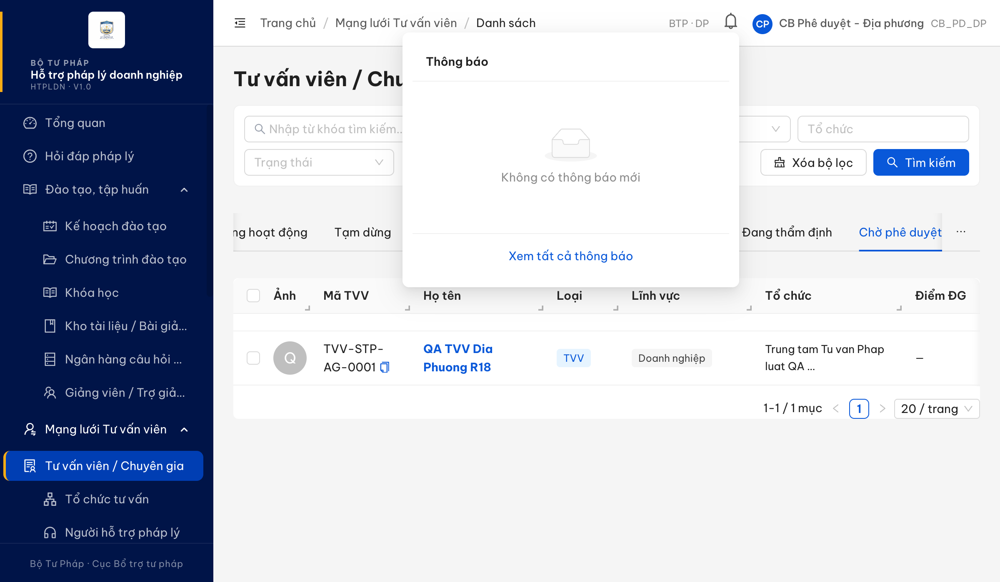

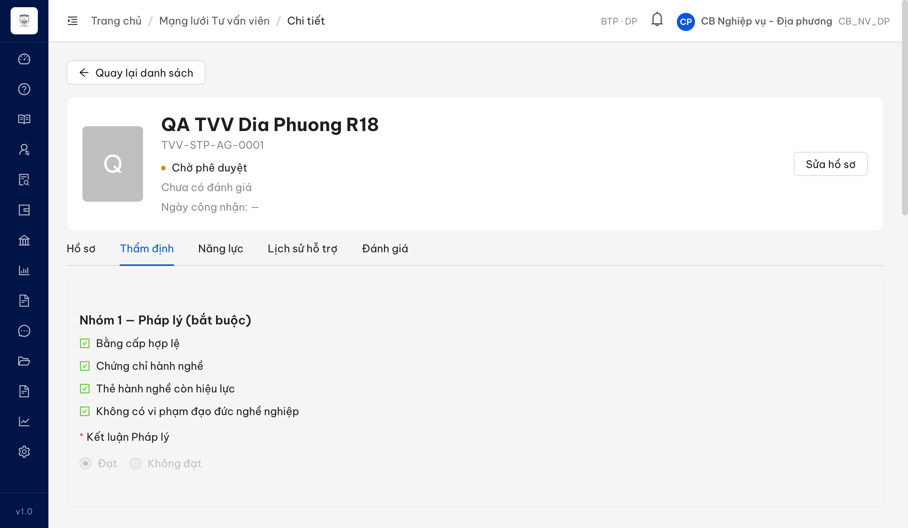

Bảng đối chiếu điều kiện đầy đủ: `../reverify-audit/conditions/TDHSTVV_18.md` (0 GAP — verify bằng đúng vai trò CB_NV_DP cấp Địa phương + kiểm thông báo bằng đúng tài khoản Cán bộ Phê duyệt cùng đơn vị).

*(Evidence đối tác: `../partner-evidence/TDHSTVV_18.webm` — hồ sơ `TVV-STP-HN-0001`, vai trò CB_NV_DP; sau "Trình duyệt" chuyển "Chờ phê duyệt" mà không có thông báo nào.)*

> **Ghi chú cho BA/dev:** phần **"Kết quả mong đợi" của test case** ("hệ thống tự động chuyển hồ sơ lên cấp Bộ/Ngành theo lĩnh vực chuyên môn") **trái với SRS** — dòng 80 (BR-FLOW-03 "KHÔNG xuyên cấp"), dòng 518 ("KHÔNG có ESCALATE bắt buộc — mỗi cấp tự công bố"), dòng 570 (CB_PD_ĐP duyệt hồ sơ do CB_NV_ĐP thẩm định). Web giữ hồ sơ ở đơn vị Địa phương — **đúng SRS**, không tính là lỗi. Đã tách sang `../ba-confirmation-needed-week-2.md` §TDHSTVV_18.

---

## ~~BUG-PDHSTVV_02~~ [CLOSED] — Màn phê duyệt hồ sơ TVV: thẻ "Hồ sơ" không hiển thị tệp thẻ hành nghề đã lưu; thẻ "Năng lực" in JSON thô ở trường "Bằng cấp"

> **Re-test:** 2026-07-15 reverify-devfix2 — ✅ PASS (Closed). cbpd_tw mở hồ sơ "Chờ phê duyệt" TVV-BTP-TW-0010: thẻ Hồ sơ HIỂN THỊ tệp đính kèm (tên + dung lượng + Xem/Tải), không còn "Chưa có file". Thẻ Năng lực (TVV-BTP-TW-0002 có bằng cấp) render dạng đọc được "Luật Kinh tế — ĐH Luật Hà Nội — Năm tốt nghiệp 2010", KHÔNG còn JSON thô (cùng gốc BUG-QLHSTVV_06 đã Closed).

### Mô tả

Cán bộ Phê duyệt mở hồ sơ tư vấn viên ở trạng thái "Chờ phê duyệt" để xem trước khi quyết định duyệt/từ chối. Thẻ "Hồ sơ" hiển thị "Chưa có file đính kèm" mặc dù hồ sơ **đang có tệp thẻ hành nghề đã lưu** (biểu mẫu Chỉnh sửa vẫn liệt kê tệp; máy chủ vẫn trả `fileTheHanhNgheId`). Thẻ "Năng lực" in nguyên chuỗi dữ liệu thô (JSON) ở trường "Bằng cấp" thay vì Tên trường / Chuyên ngành / Năm tốt nghiệp. Cán bộ Phê duyệt do đó không xem được minh chứng — trong khi đây chính là căn cứ để duyệt.

### Các bước tái hiện

1. Đăng nhập `cbpd_tw` — **CB Phê duyệt - Trung ương (CB_PD_TW)**, có quyền xem + phê duyệt hồ sơ TVV cùng đơn vị (SCR-IV-03 §Quyền truy cập, `srs-fr-04` dòng 1530).
2. Vào **Mạng lưới Tư vấn viên → Tư vấn viên / Chuyên gia** → thẻ **"Chờ phê duyệt"** → mở TVV-BTP-TW-0005 "QA TVV Trinh Duyet R17" (`/chuyen-gia-tvv/e6fdc062-d77d-4e45-9076-58a00b8ac068`). Hồ sơ đã có: tệp thẻ hành nghề, Bằng cấp chi tiết (Đại học Luật Hà Nội / Luật / 2005), Số thẻ STHN-QA-2026/001.
3. Ở thẻ **"Hồ sơ"** → cuộn tới nhóm **"File đính kèm"**. Quan sát: hiển thị trạng thái rỗng "Chưa có file đính kèm".
4. Chuyển sang thẻ **"Năng lực"** → xem dòng **"Bằng cấp"**. Quan sát: in chuỗi `{"tenTruong":"Đại học Luật Hà Nội","chuyenNganh":"Luật","namTotNghiep":2005}`.

### Kết quả mong đợi

- Theo **FR-IV-05 (UC43) §Outputs #7** (`srs-fr-04` dòng 468) và **SCR-IV-03 thẻ Hồ sơ nhóm (e)** (dòng 1554): thẻ Hồ sơ phải liệt kê tệp đính kèm của hồ sơ kèm **tên + kích thước + nút "Xem" (mở hộp xem PDF) + "Tải xuống"**. Hồ sơ có tệp thì không được hiển thị trạng thái rỗng.
- Theo **SCR-IV-03 thẻ Năng lực** (dòng 1566): hiển thị **Bằng cấp chi tiết** ở dạng thông tin đọc được cho người dùng cuối, không phải chuỗi dữ liệu thô.

### Kết quả thực tế

- Thẻ "Hồ sơ" → nhóm "File đính kèm": hiển thị **"Chưa có file đính kèm"**, trong khi máy chủ trả `fileTheHanhNgheId: "f7f09870-edc1-40aa-a7ee-53d02c2b406d"` cho chính hồ sơ này. Tệp tồn tại nhưng không hiển thị ở bất kỳ vị trí nào trên màn chi tiết.
- Thẻ "Năng lực" → "Bằng cấp": in `{"tenTruong":"Đại học Luật Hà Nội","chuyenNganh":"Luật","namTotNghiep":2005}` (cùng gốc **BUG-QLHSTVV_06**).
- Ghi nhận thêm khi nạp tiền đề: tải tệp PDF vào ô "File đính kèm (Bằng cấp / Chứng chỉ)" rồi bấm Lưu → máy chủ vẫn trả `fileDinhKems: []` (tệp không gắn được vào hồ sơ) — trùng gốc **BUG-QLTVV_21**.
- Ý thứ 3 đối tác nêu ("thẻ Đánh giá dùng thang điểm 10") **không tái hiện** trên môi trường được giao: thẻ Đánh giá hiển thị "—/5" và "0.0/5" — đúng SCR-IV-03 dòng 1570-1572.

### Bằng chứng

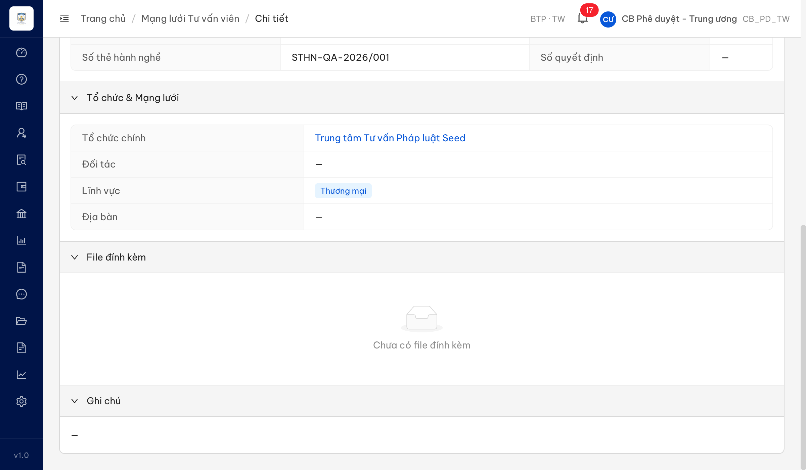

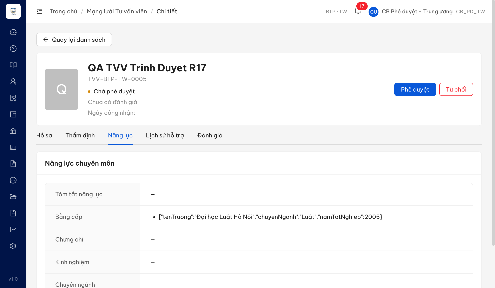

API (phụ trợ) — `GET /api/v1/tu-van-viens/e6fdc062-d77d-4e45-9076-58a00b8ac068`:

```json
{
  "trangThai": "CHO_PHE_DUYET",
  "soTheHanhNghe": "STHN-QA-2026/001",
  "fileTheHanhNgheId": "f7f09870-edc1-40aa-a7ee-53d02c2b406d",
  "fileDinhKems": [],
  "hoSo": { "bangCapChiTiet": [{ "tenTruong": "Đại học Luật Hà Nội", "chuyenNganh": "Luật", "namTotNghiep": 2005 }] }
}
```

Bảng đối chiếu điều kiện đầy đủ: `../reverify-audit/conditions/PDHSTVV_02.md` (0 GAP — verify bằng đúng vai trò CB Phê duyệt cấp TW + hồ sơ "Chờ phê duyệt" có sẵn tệp thẻ hành nghề + bằng cấp như evidence đối tác).

*(Evidence đối tác: `../partner-evidence/PDHSTVV_02.webm` — hồ sơ `TVV-BTP-TW-0055` "Tester TKM", vai trò CB_PD_TW; frame 00:16 cho thấy tệp "Thẻ hành nghề.pdf" đã lưu, frame 00:25 cho thấy thẻ Hồ sơ báo "Chưa có file đính kèm".)*

---

## ~~BUG-PDHSTVV_03~~ [CLOSED] — Hộp thoại "Xác nhận phê duyệt": ô "Số quyết định công nhận" cho phép 200 ký tự thay vì tối đa 100 theo SRS

> **Re-test:** 2026-07-15 reverify-devfix2 — ✅ PASS (Closed). Modal "Xác nhận phê duyệt" (cbpd_tw, TVV-BTP-TW-0010): ô "Số quyết định công nhận" `maxlength=100`, bộ đếm "0 / 100" (đúng SRS dòng 581); ô Ý kiến `maxlength=2000`.

### Mô tả

Trong hộp thoại "Xác nhận phê duyệt" (Cán bộ Phê duyệt duyệt hồ sơ TVV), ô bắt buộc "Số quyết định công nhận" đang giới hạn **200 ký tự** (bộ đếm hiển thị "0 / 200"). SRS quy định trường này tối đa **100 ký tự**. Nhập chuỗi 150 ký tự → hệ thống nhận đủ, không báo lỗi, nút "Phê duyệt" vẫn bật.

### Các bước tái hiện

1. Đăng nhập `cbpd_tw` — **CB Phê duyệt - Trung ương (CB_PD_TW)**, có quyền phê duyệt hồ sơ TVV cùng đơn vị (SCR-IV-03 nút "Phê duyệt", `srs-fr-04` dòng 1545).
2. Vào **Mạng lưới Tư vấn viên → Tư vấn viên / Chuyên gia** → thẻ **"Chờ phê duyệt"** → mở TVV-BTP-TW-0005 "QA TVV Trinh Duyet R17".
3. Bấm nút **"Phê duyệt"** ở header → hộp thoại "Xác nhận phê duyệt" mở ra. Quan sát bộ đếm ô "Số quyết định công nhận": **"0 / 200"**.
4. Nhập chuỗi 150 ký tự (`QĐ-` + 140 ký tự + `/QĐ-BTP`) vào ô đó. Quan sát: bộ đếm "150 / 200", không có thông báo lỗi, nút "Phê duyệt" vẫn bật.

### Kết quả mong đợi

- Theo **FR-IV-07 (UC45) §Inputs #4** (`srs-fr-04` dòng 581): `so_quyet_dinh` — "Bắt buộc nếu PHE_DUYET. Format: QĐ-{số}/QĐ-{đơn_vị}, **max 100 ký**". Hệ thống phải giới hạn ô nhập ở 100 ký tự và từ chối giá trị vượt quá.

### Kết quả thực tế

- Ô "Số quyết định công nhận" có `maxlength = 200`, bộ đếm hiển thị "x / 200".
- Nhập 150 ký tự → ô nhận đủ 150 ký tự, bộ đếm "150 / 200", không có thông báo lỗi (`.ant-form-item-explain-error` rỗng), nút "Phê duyệt" ở trạng thái bật (không bị khóa).
- Ô "Ý kiến phê duyệt (tùy chọn)" có `maxlength = 2000` → đúng SRS §Inputs #5 (dòng 582).

### Bằng chứng

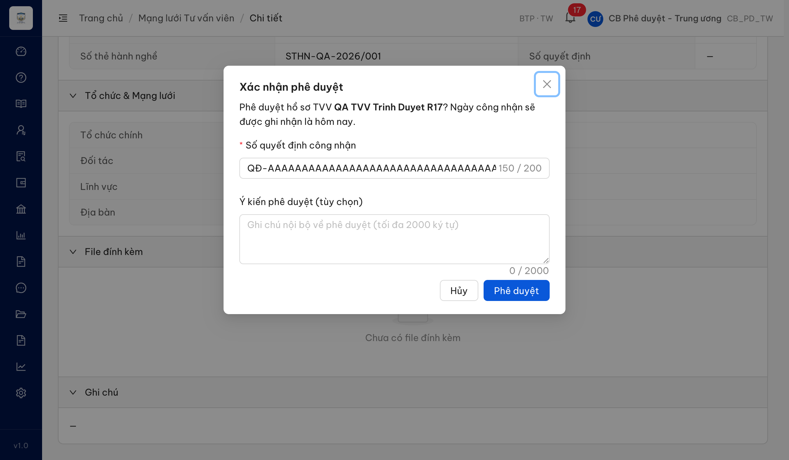

Bảng đối chiếu điều kiện đầy đủ: `../reverify-audit/conditions/PDHSTVV_03.md` (0 GAP).

*(Evidence đối tác: `../partner-evidence/PDHSTVV_03.jpg` — cùng hộp thoại, cùng vai trò CB_PD_TW, bộ đếm "0 / 200".)*

---

## ~~BUG-PDHSTVV_05~~ [CLOSED] — Phê duyệt TVV với Số quyết định công nhận SAI MẪU vẫn thành công: hệ thống đổi trạng thái + lưu giá trị sai, không báo lỗi

> **Re-test:** 2026-07-15 reverify-devfix2 — ✅ PASS (Closed). Phê duyệt với số QĐ sai mẫu "A1000@" (cbpd_tw, TVV-BTP-TW-0010): hệ thống CHẶN — báo lỗi "Số quyết định phải theo mẫu QĐ-{số}/QĐ-{đơn vị}", modal không đóng, hồ sơ giữ nguyên "Chờ phê duyệt" (KHÔNG duyệt, KHÔNG lưu giá trị sai).

### Mô tả

Cán bộ Phê duyệt nhập Số quyết định công nhận **không đúng mẫu** (`A1000@` — không theo mẫu `QĐ-{số}/QĐ-{đơn vị}`) rồi bấm "Phê duyệt". Hệ thống **không kiểm tra định dạng**: hiển thị "Phê duyệt TVV thành công", chuyển hồ sơ sang "Chờ kích hoạt tài khoản", ghi Ngày công nhận và **lưu luôn giá trị sai** vào hồ sơ. Quyết định công nhận tư vấn viên là văn bản pháp lý — số quyết định rác được ghi nhận vĩnh viễn vào hồ sơ mạng lưới.

### Các bước tái hiện

1. Đăng nhập `cbpd_tw` — **CB Phê duyệt - Trung ương (CB_PD_TW)**, có quyền phê duyệt hồ sơ TVV cùng đơn vị (SCR-IV-03 nút "Phê duyệt", `srs-fr-04` dòng 1545).
2. Vào **Mạng lưới Tư vấn viên → Tư vấn viên / Chuyên gia** → thẻ **"Chờ phê duyệt"** → mở TVV-BTP-TW-0005 "QA TVV Trinh Duyet R17" (trạng thái "Chờ phê duyệt").
3. Bấm **"Phê duyệt"** → nhập Số quyết định công nhận = **`A1000@`** (giá trị y hệt đối tác dùng), Ý kiến phê duyệt bất kỳ → bấm **"Phê duyệt"** trong hộp thoại.
4. Quan sát thông báo, trạng thái hồ sơ và giá trị "Số quyết định" ở thẻ Hồ sơ.

### Kết quả mong đợi

- Theo **FR-IV-07 (UC45) §Inputs #4** (`srs-fr-04` dòng 581): Số quyết định công nhận bắt buộc khi phê duyệt và phải **theo mẫu `QĐ-{số}/QĐ-{đơn_vị}`** (tối đa 100 ký tự); entity `TU_VAN_VIEN.so_quyet_dinh_cong_nhan` (dòng 2025) cũng ràng buộc đúng mẫu này.
- Khi giá trị nhập không đúng mẫu, hệ thống phải **từ chối thao tác phê duyệt**, hiển thị thông báo lỗi và **giữ nguyên** trạng thái hồ sơ ở "Chờ phê duyệt".

### Kết quả thực tế

- Toast hiển thị **"Phê duyệt TVV thành công"** (bắt bằng MutationObserver); không có bất kỳ thông báo lỗi nào (`.ant-form-item-explain-error` rỗng).
- Hồ sơ chuyển sang **"Chờ kích hoạt tài khoản"**, Ngày công nhận 12/07/2026.
- Giá trị sai được **lưu vào hồ sơ**: thẻ Hồ sơ hiển thị "Số quyết định: **A1000@**".

### Bằng chứng

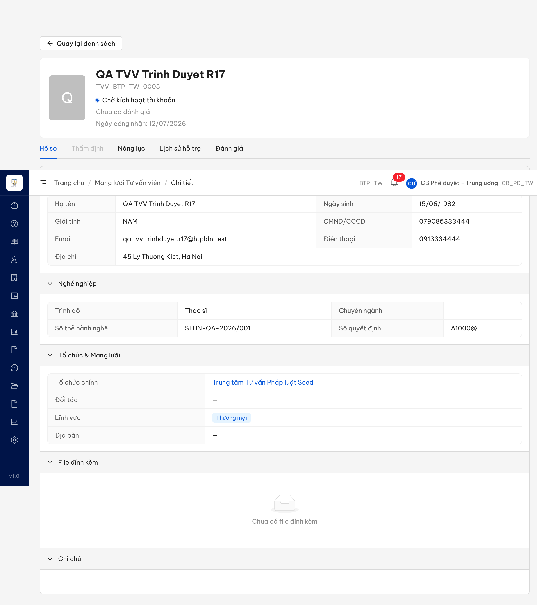

API (phụ trợ) — `GET /api/v1/tu-van-viens/e6fdc062-d77d-4e45-9076-58a00b8ac068` sau thao tác:

```json
{
  "trangThai": "CHO_KICH_HOAT",
  "soQuyetDinh": "A1000@",
  "ngayCongNhan": "2026-07-12",
  "ngayDuyet": "2026-07-12T10:23:57.561Z"
}
```

Bảng đối chiếu điều kiện đầy đủ: `../reverify-audit/conditions/PDHSTVV_05.md` (0 GAP — cùng vai trò, cùng trạng thái, **cùng giá trị nhập** `A1000@` như đối tác).

*(Evidence đối tác: `../partner-evidence/PDHSTVV_05.webm` — frame 00:16 nhập `A1000@`, frame 00:18 toast "Phê duyệt TVV thành công" + badge "Chờ kích hoạt tài khoản".)*

---

## ~~BUG-PDHSTVV_08~~ [CLOSED] — Từ chối hồ sơ TVV: chủ hồ sơ KHÔNG nhận được thông báo kèm lý do (luồng phê duyệt vẫn gửi mail bình thường)

> **Re-test:** 2026-07-15 R2 (chiều) — ✅ PASS (Closed-verified). CB Phê duyệt (`cbpd_dp`, đúng đơn vị hồ sơ) từ chối hồ sơ TVV-STP-AG-0002 (Chờ phê duyệt) kèm lý do hợp lệ → toast "Đã từ chối hồ sơ TVV", hồ sơ chuyển "Từ chối". Hộp thư MailHog của chủ hồ sơ `qa.tvv.rv18.dp@htpldn.test` **nhận mail "Hồ sơ TVV bị từ chối" (một phút sau) kèm đúng lý do** ("Hồ sơ tư vấn viên của bạn bị từ chối. Lý do: ..."). Nhánh từ chối nay đã gửi thông báo kèm lý do cho chủ hồ sơ. Ảnh: `image/PDHSTVV_08-reverify2-mailhog-mail-tuchoi-kem-lydo.png`, `image/PDHSTVV_08-reverify2-web-hoso-da-tu-choi.png`.

### Mô tả

Cán bộ Phê duyệt từ chối hồ sơ TVV kèm lý do hợp lệ. Hệ thống chuyển trạng thái "Từ chối" và ghi nhận người từ chối / thời điểm / lý do vào hồ sơ **đúng**, nhưng **không gửi bất kỳ thông báo nào cho chủ hồ sơ** — trong khi SRS yêu cầu gửi thông báo kèm lý do. Đối chứng ngay trong cùng phiên: thao tác **phê duyệt** trên hồ sơ khác **có** gửi mail cho chủ hồ sơ ⇒ kênh gửi mail hoạt động bình thường, chỉ **nhánh từ chối** bị thiếu. Hệ quả: ứng viên bị từ chối không biết mình bị từ chối và không biết lý do để bổ sung, nộp lại.

### Các bước tái hiện

1. Đăng nhập `cbpd_tw` — **CB Phê duyệt - Trung ương (CB_PD_TW)**, có quyền phê duyệt / từ chối hồ sơ TVV cùng đơn vị (SCR-IV-03 nút "Từ chối", `srs-fr-04` dòng 1546).
2. Vào **Mạng lưới Tư vấn viên → Tư vấn viên / Chuyên gia** → thẻ **"Chờ phê duyệt"** → mở TVV-BTP-TW-0007 "QA TVV PheDuyet W2 B" (email chủ hồ sơ: `qa.tvv.pheduyet.b@htpldn.test`).
3. Bấm **"Từ chối"** → nhập lý do hợp lệ 83 ký tự → bấm **"Xác nhận từ chối"**.
4. Mở hộp thư của **chủ hồ sơ** (MailHog) và chuông **Thông báo** của tài khoản `cbnv_tw` (Cán bộ Nghiệp vụ đã thẩm định hồ sơ này). Quan sát: không có thông báo/mail nào về việc từ chối.

### Kết quả mong đợi

- Theo **FR-IV-07 (UC45) §Processing bước 4** (`srs-fr-04` dòng 593): "Gửi thông báo **TVV/CG (chủ hồ sơ)** qua email đã khai" — áp dụng cho cả nhánh phê duyệt và từ chối.
- Theo **§Acceptance Criteria** (dòng 627): "**Given** CB PD từ chối **When** nhập lý do **Then** TVV → TU_CHOI, **gửi thông báo TVV/CG (chủ hồ sơ)**".
- Theo **§3.0b MD-TU-CHOI** (dòng 1398): "Vui lòng nhập lý do (tối thiểu 10 ký tự) — **lý do sẽ được gửi đến chủ hồ sơ**".

### Kết quả thực tế

- Toast "Đã từ chối hồ sơ TVV"; hồ sơ chuyển **"Từ chối"**; hồ sơ **có** ghi nhận `ngayDuyet = 2026-07-12T10:38:37`, người từ chối và `ghiChuPheDuyet` = đúng lý do đã nhập (phần ghi nhận ĐẠT).
- **Chủ hồ sơ không nhận được gì:** hộp thư MailHog (115 mail) **không có mail nào** gửi tới `qa.tvv.pheduyet.b@htpldn.test` sau thao tác từ chối. Mail mới nhất trong hộp thư vẫn là mail **phê duyệt** của hồ sơ khác (`qa.tvv.pheduyet.a@htpldn.test`, 10:33:18) ⇒ chứng minh kênh mail hoạt động, nhánh từ chối không gửi.
- Cán bộ Nghiệp vụ đã thẩm định cũng không nhận thông báo (số chưa đọc giữ nguyên 58) — trùng phản ánh của đối tác; tuy nhiên SRS FR-IV-07 **không quy định** thông báo cho Cán bộ Nghiệp vụ ở bước này nên ý đó đã tách sang `../ba-confirmation-needed-week-2.md`, không tính là lỗi.

### Bằng chứng

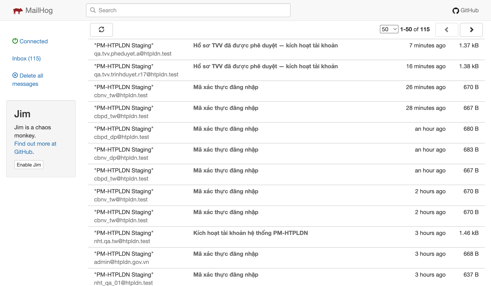

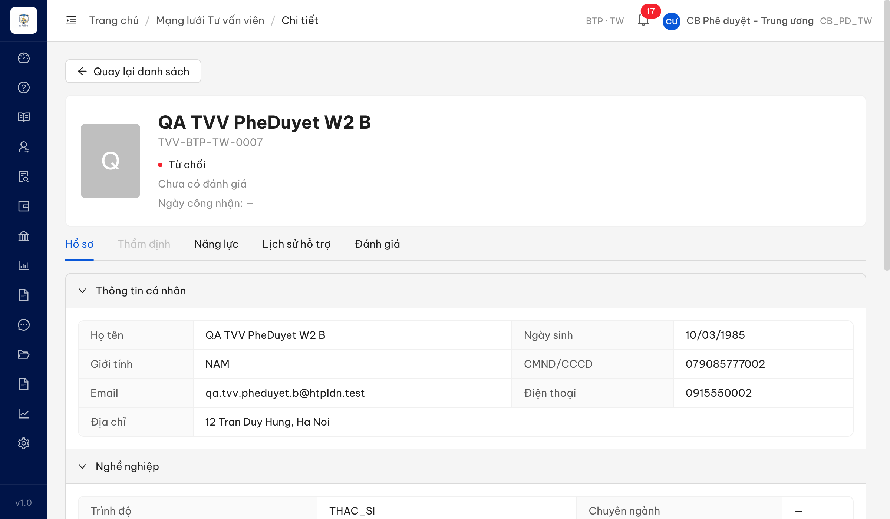

Bảng đối chiếu điều kiện đầy đủ: `../reverify-audit/conditions/PDHSTVV_08.md` (0 GAP — đúng vai trò CB_PD_TW, hồ sơ "Chờ phê duyệt", lý do hợp lệ như đối tác).

*(Evidence đối tác: `../partner-evidence/PDHSTVV_08.webm` — frame 00:19 toast "Đã từ chối hồ sơ TVV" + badge "Từ chối"; frame 00:37 chuông Thông báo của CB_NV_TW không có thông báo từ chối.)*

---

## ~~BUG-CNDSMLTVV_05~~ [CLOSED] — Không công khai được Tư vấn viên lên Cổng PLQG: hệ thống gọi ra Cổng (mô hình ĐẨY) → lỗi kết nối → rollback toàn bộ thao tác

> **Re-test:** 2026-07-15 R2 — ✅ PASS (Closed-verified). Công khai TVV-BTP-TW-0002 (Đang hoạt động, chưa công khai) thành công: toast "Đã công khai lên Cổng PLQG", nút đổi thành "Hủy công khai", hồ sơ hiện "Thông tin công khai" (đăng tải 15/07/2026); `POST .../cong-khai` → **200** (trước **502** ERR-SYS-IV-CK-02). Dev đã chuyển sang mô hình KÉO nội bộ (đặt cờ + đổi trạng thái, không gọi ra Cổng). Evidence: `image/BUG-CNDSMLTVV_05-reverify-pass-cong-khai-ok.png`.

### Mô tả

Cán bộ Nghiệp vụ công khai một tư vấn viên **đủ điều kiện** (Đang hoạt động, chưa công khai, đã nhập Mô tả công khai) lên Cổng pháp luật quốc gia. Hệ thống báo lỗi và **không công khai được** — hồ sơ giữ nguyên trạng thái chưa công khai. Nguyên nhân: backend **gọi ra Cổng PLQG** trong lúc xử lý; kết nối thất bại (502 `ERR-SYS-IV-CK-02`) nên **rollback toàn bộ**. Theo SRS, công khai là thao tác **nội bộ hoàn toàn** (chỉ đặt cờ + đổi trạng thái), Cổng PLQG **tự kéo** dữ liệu sau — nên không được phụ thuộc kết nối ra Cổng. Hệ quả: **toàn bộ chức năng công khai mạng lưới TVV không dùng được**, chặn nghiệp vụ chính của FR-IV-08.

### Các bước tái hiện

1. Đăng nhập `cbnv_tw` — **CB Nghiệp vụ - Trung ương (CB_NV_TW)**, có quyền "Công khai mạng lưới tư vấn viên" (FR-IV-08 §Tác nhân, `srs-fr-04` dòng 640; SCR-IV-03 nút Công khai, dòng 1547).
2. Vào **Mạng lưới Tư vấn viên → Tư vấn viên / Chuyên gia** → mở TVV-BTP-TW-0002 "QA TVV Seed28 Active" — trạng thái **Đang hoạt động**, **chưa công khai** (đủ điều kiện theo dòng 656).
3. Bấm **"Công khai lên Cổng PLQG"** → nhập **Mô tả công khai** (70 ký tự) + đính kèm 1 tệp PDF → bấm **"Công khai"**.
4. Quan sát thông báo, trạng thái công khai của hồ sơ và request `POST .../cong-khai` trong Network.

### Kết quả mong đợi

- Theo **FR-IV-08 (UC46) §Processing bước 2** (`srs-fr-04` dòng 657): hệ thống **lưu mô tả + tệp đính kèm, đặt `cong_khai = 1`, chuyển trạng thái CONG_KHAI, ghi thời gian đăng tải** — thao tác thành công ngay.
- Theo **§Mô tả `[CR-02]`** (dòng 638): mô hình **KÉO (PULL)** — *"phần mềm chỉ đặt cờ … Cổng PLQG tự kéo dữ liệu công khai định kỳ … **Phần mềm KHÔNG đẩy trực tiếp, KHÔNG gọi API ra Cổng**"*. Việc công khai **không được phụ thuộc** kết nối tới Cổng PLQG.
- **§Error Handling** (dòng 674-675) chỉ có 2 lỗi hợp lệ: **ERR-CK-01** (TVV sai trạng thái) và **ERR-CK-02** (thiếu mô tả công khai) — không có lỗi kết nối Cổng.

### Kết quả thực tế

- Toast lỗi: **"Lỗi kết nối Cổng PLQG khi công khai tư vấn viên"** (trên môi trường đối tác hiện "Không thể công khai. Vui lòng thử lại." — cùng bản chất, khác câu chữ theo build).
- Network của chính thao tác: `POST /api/v1/tu-van-viens/{id}/cong-khai` → **502**, body `{"code":"ERR-SYS-IV-CK-02","message":"Lỗi kết nối Cổng PLQG khi công khai tư vấn viên"}`. (Tệp đính kèm upload thành công: `POST .../cong-khai/files` → 201.)
- **Đã cô lập nguyên nhân:** chạy lại đúng thao tác **không kèm tệp đính kèm** → **vẫn 502, cùng mã lỗi** ⇒ lỗi **không phải** do tệp đính kèm.
- Hồ sơ **không thay đổi**: `laCongKhai = false`, `moTaCongKhai = null`, `thoiGianDangTai = null`; nút "Công khai lên Cổng PLQG" vẫn còn ⇒ luồng hợp lệ bị chặn hoàn toàn.
- Hộp thoại trên giao diện ghi *"Sau khi công khai, dữ liệu sẽ được đồng bộ tới Cổng PLQG. Nếu đồng bộ thất bại, hệ thống sẽ rollback và TVV vẫn ở trạng thái chưa công khai"* — xác nhận web đang cài theo **mô hình ĐẨY**, trái `[CR-02]`.

### Bằng chứng

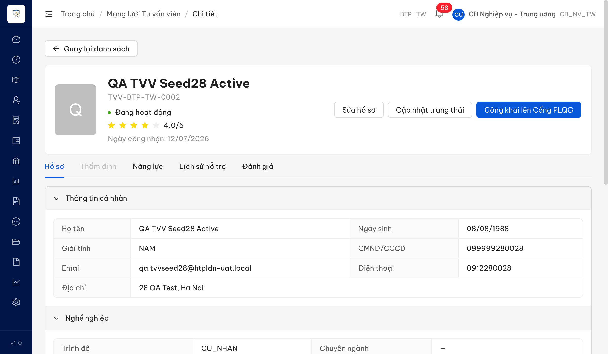

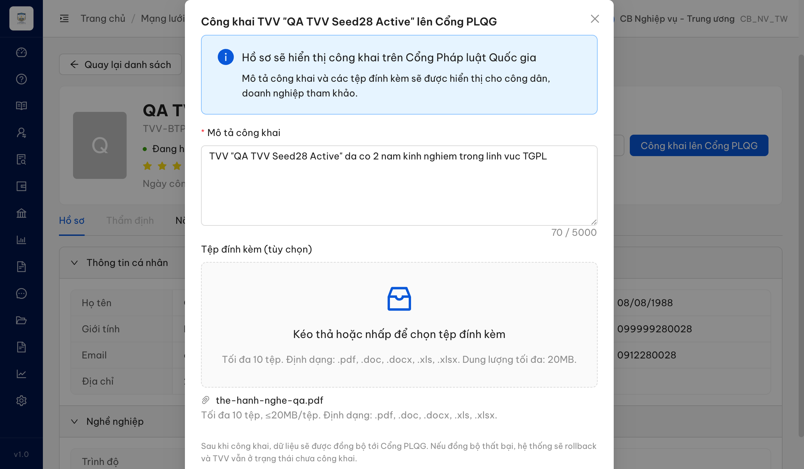

API response (`POST .../cong-khai`) — log đầy đủ: `../reverify-audit/CNDSMLTVV_05/api-cong-khai-502.log`

```json
{
  "success": false,
  "error": {
    "code": "ERR-SYS-IV-CK-02",
    "message": "Lỗi kết nối Cổng PLQG khi công khai tư vấn viên",
    "timestamp": "2026-07-12T10:48:25.250Z"
  }
}
```

Bảng đối chiếu điều kiện đầy đủ: `../reverify-audit/conditions/CNDSMLTVV_05.md` (0 GAP — đúng vai trò CB Nghiệp vụ, đúng trạng thái "Đang hoạt động" + chưa công khai, có mô tả + tệp đính kèm như đối tác).

*(Evidence đối tác: `../partner-evidence/CNDSMLTVV_05.webm` — frame 00:49 toast đỏ "Không thể công khai. Vui lòng thử lại." trên hộp thoại công khai.)*

> **Ghi chú cho BA/dev:** phần **"Kết quả mong đợi" của test case** ("Gọi giao diện tích hợp **đẩy** dữ liệu lên Cổng PLQG" · toast "Đã đẩy tư vấn viên lên Cổng pháp luật quốc gia" · "Dữ liệu được tiếp nhận bởi Cổng PLQG **trong lần gọi đầu tiên**") mô tả theo **mô hình ĐẨY**, trái SRS v3.5 `[CR-02]` (mô hình **KÉO**). Đã tách sang `../ba-confirmation-needed-week-2.md`. Verdict Open của bug này **không phụ thuộc** điểm đó — lỗi chính là **luồng công khai bị chặn**.

---

## ~~BUG-DGTVV_03~~ [CLOSED] — Danh sách đánh giá: cột "Vụ việc" hiển thị mã định danh nội bộ (UUID) thay vì mã/tên vụ việc

> **Re-test:** 2026-07-15 R2 — ✅ PASS (Closed-verified). Tab "Đánh giá" của TVV-BTP-TW-0002: cột "Vụ việc" nay hiển thị link `VV-BTP-TW-20260712-001` + tên "QA QLTVV28 - seed vu viec phan cong TVV" (không còn UUID `8e259653…`); đánh giá không liên kết VV hiện "—" đúng. Evidence: `image/BUG-DGTVV_03-reverify-pass-cot-vuviec-ma-ten.png`.

### Mô tả

Trên màn Chi tiết tư vấn viên → thẻ **"Đánh giá"** → bảng **Danh sách đánh giá**, cột **"Vụ việc"** hiển thị chuỗi mã định danh nội bộ dạng `8e259653-e0a5-49e8-ae7c-5fb07734ce09` thay vì thông tin nhận dạng vụ việc theo nghiệp vụ (mã vụ việc `VV-BTP-TW-20260712-001` và/hoặc tên vụ việc). Người dùng không thể biết đánh giá đó thuộc vụ việc nào.

### Các bước tái hiện

1. Đăng nhập vai trò **Cán bộ Nghiệp vụ Trung ương (CB_NV_TW)** — tài khoản `cbnv_tw`.
2. Vào **Mạng lưới Tư vấn viên → Tư vấn viên / Chuyên gia** → mở chi tiết `TVV-BTP-TW-0002` ("QA TVV Seed28 Active", Đang hoạt động).
3. Điều kiện tiền đề: tư vấn viên có ít nhất **1 đánh giá đã liên kết vụ việc** (vụ việc `VV-BTP-TW-20260712-001`, trạng thái Đã phân công, người hỗ trợ = chính tư vấn viên này).
4. Chọn thẻ **"Đánh giá"** → quan sát cột **"Vụ việc"** trong bảng Danh sách đánh giá.

### Kết quả mong đợi

- Theo SCR-IV-03 cell 23c (srs-fr-04 dòng 1570), danh sách đánh giá gồm: Người đánh giá + **Vụ việc** + Ngày + 3 điểm thành phần + Nhận xét.
- Cột "Vụ việc" phải cho người dùng nhận dạng được vụ việc theo nghiệp vụ — nhất quán với cách hệ thống nhận dạng vụ việc ở thẻ "Lịch sử hỗ trợ" (SCR-IV-03 cell 22, dòng 1567: "**Mã vụ việc (đường liên kết) + Tên vụ việc**").

### Kết quả thực tế

- Cột "Vụ việc" in ra **mã định danh nội bộ**: `8e259653-e0a5-49e8-ae7c-5fb07734ce09`.
- Mã vụ việc nghiệp vụ (`VV-BTP-TW-20260712-001`) và tên vụ việc ("QA QLTVV28 - seed vu viec phan cong TVV") đều **không** được hiển thị; chuỗi cũng không phải đường liên kết mở vụ việc.
- Đánh giá không liên kết vụ việc hiển thị "-" (đúng, vì trường này không bắt buộc — FR-IV-09 §Inputs #2, dòng 702).

### Bằng chứng

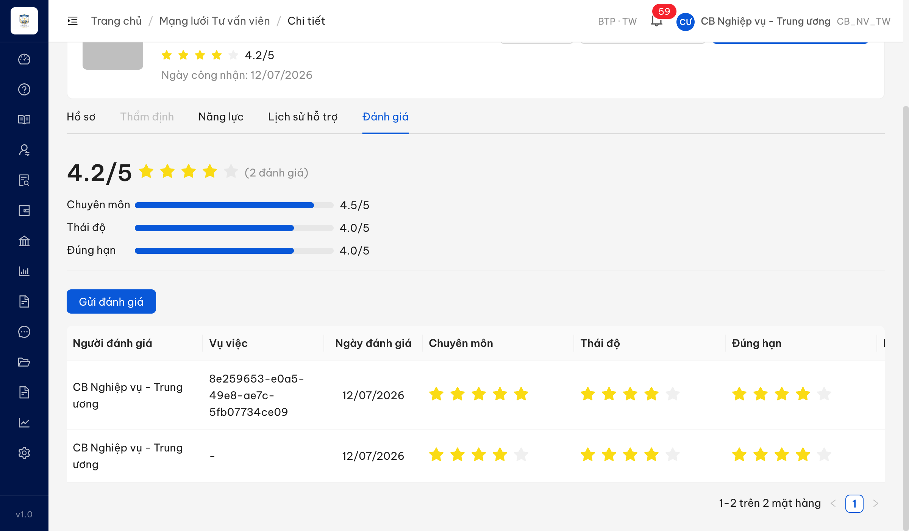

Vụ việc thực tế tương ứng với mã định danh trên:

```json
{
  "id": "8e259653-e0a5-49e8-ae7c-5fb07734ce09",
  "maVuViec": "VV-BTP-TW-20260712-001",
  "tieuDe": "QA QLTVV28 - seed vu viec phan cong TVV",
  "trangThai": "DA_PHAN_CONG",
  "tenNguoiHoTro": "QA TVV Seed28 Active"
}
```

Bảng đối chiếu điều kiện đầy đủ: `../reverify-audit/conditions/DGTVV_03.md` (0 GAP — đúng vai trò CB Nghiệp vụ TW, đúng trạng thái TVV "Đang hoạt động", đã seed đánh giá có vụ việc liên kết như điều kiện đối tác).

*(Evidence đối tác: `../partner-evidence/DGTVV_03.jpg` — cột "Vụ việc" hiển thị `8d074115-4da5-427c-af55-3909f1e4e675`. Hai ý còn lại của case đã tách: **"Thiếu trường Điểm tổng"** → `../ba-confirmation-needed-week-2.md` (SRS dòng 1570 không quy định cột này trong danh sách); **"thang điểm 1–10"** → không tái hiện trên env được giao (web hiển thị 4.2/5 + 5 sao).)*

> **Ghi chú cho dev:** dropdown "Vụ việc liên kết" trong hộp thoại **Gửi đánh giá** hiện **rỗng với mọi tư vấn viên** (không phát sinh lệnh gọi dữ liệu nào khi mở hộp thoại) — nên không thể tạo đánh giá gắn vụ việc từ giao diện. Bản ghi dùng để tái hiện bug này được tạo sẵn ở tầng dữ liệu. Điểm này liên quan trực tiếp tới BUG-QLLSHTCTVV_01 (lịch sử hỗ trợ rỗng).

---

## ~~BUG-QLLSHTCTVV_01~~ [CLOSED] — Tab "Lịch sử hỗ trợ" luôn rỗng (Tổng vụ việc = 0) dù tư vấn viên đã được phân công vụ việc

> **Re-test:** 2026-07-15 R2 (chiều) — ✅ PASS (Closed-verified). Đăng nhập `cbnv_tw` → chi tiết TVV-BTP-TW-0002 → thẻ "Lịch sử hỗ trợ" (không đặt bộ lọc): hiển thị 3 vụ việc chưa hoàn thành (gồm VV-BTP-TW-20260712-001 "Đã phân công"), Đã hoàn thành = 0. Cột "Ngày hoàn thành" nay hiển thị **"—"** cho cả 3 vụ việc chưa hoàn thành — không còn "Invalid Date" (quét toàn thẻ: 0 chuỗi "Invalid Date"). Cả lỗi gốc (lịch sử rỗng) và lỗi hiển thị Invalid Date đều đã fix. Evidence: `image/QLLSHTCTVV_01-reverify2-ngayhoanthanh-dash-khong-invalid-date.png`.

### Mô tả

Trên màn Chi tiết tư vấn viên → thẻ **"Lịch sử hỗ trợ"**, hệ thống luôn hiển thị **Tổng vụ việc = 0**, **Đã hoàn thành = 0**, **Điểm trung bình = "—"** và trạng thái rỗng *"Tư vấn viên chưa tham gia hỗ trợ vụ việc nào"* — kể cả khi tư vấn viên **đã được phân công vụ việc** và vụ việc đó hiển thị bình thường ở màn "Vụ việc HTPL". Toàn bộ chức năng "Ghi nhận và theo dõi lịch sử tham gia hỗ trợ vụ việc của từng Tư vấn viên" không dùng được.

### Các bước tái hiện

1. Đăng nhập vai trò **Cán bộ Nghiệp vụ Trung ương (CB_NV_TW)** — tài khoản `cbnv_tw`.
2. Điều kiện tiền đề: có vụ việc **VV-BTP-TW-20260712-001** (Công ty TNHH Seed Publishable, lĩnh vực Thương mại) ở trạng thái **"Đã phân công"**, **người xử lý = "QA TVV Seed28 Active"** (`TVV-BTP-TW-0002`), ngày phân công **12/07/2026**. Kiểm chứng tại **Vụ việc HTPL → Danh sách** (xem ảnh 2).
3. Vào **Mạng lưới Tư vấn viên → Tư vấn viên / Chuyên gia** → mở chi tiết `TVV-BTP-TW-0002` (Đang hoạt động).
4. Chọn thẻ **"Lịch sử hỗ trợ"** (không đặt bộ lọc nào).

### Kết quả mong đợi

- Theo FR-IV-10 (UC48) §Processing bước 1-2 (srs-fr-04 dòng 772-773): hệ thống lấy danh sách vụ việc liên kết với tư vấn viên **qua bản ghi phân công** và tính thống kê (tổng vụ việc, hoàn thành, điểm trung bình).
- Theo §Acceptance Criteria (dòng 801): chọn thẻ "Lịch sử" → hiển thị **danh sách vụ việc + thống kê**.
- Theo SCR-IV-03 cell 22 (dòng 1567): bảng hiển thị Mã vụ việc + Tên vụ việc + Doanh nghiệp + Lĩnh vực + Vai trò + Ngày phân công + Ngày hoàn thành + Kết quả + Đánh giá; thống kê "Tổng vụ việc: {N}".
- ⇒ Phải hiển thị **1 dòng** vụ việc `VV-BTP-TW-20260712-001` và **Tổng vụ việc = 1**.
- Dòng "Tư vấn viên chưa tham gia hỗ trợ vụ việc nào" chỉ được hiển thị **khi chưa có vụ việc** (cell 22c, dòng 1569).

### Kết quả thực tế

- Thẻ "Lịch sử hỗ trợ": **Tổng vụ việc = 0** · **Đã hoàn thành = 0** · **Điểm trung bình = "—"**; bảng rỗng, hiện *"Tư vấn viên chưa tham gia hỗ trợ vụ việc nào"* (và *"Tư vấn viên chưa có hợp đồng tư vấn nào"*).
- Kiểm chứng bằng phương pháp thứ hai trên cùng dữ liệu: `GET /api/v1/tu-van-viens/98cfd963-3cd3-4c8a-bfa9-625460824d6d/lich-su-ho-tro` → `{"data": [], "meta": {"total": 0}}` (UI và API **trùng khớp**, không mâu thuẫn).
- Bộ lọc (Từ ngày / Đến ngày / Trạng thái vụ việc) để trống → không phải do lọc.

### Bằng chứng

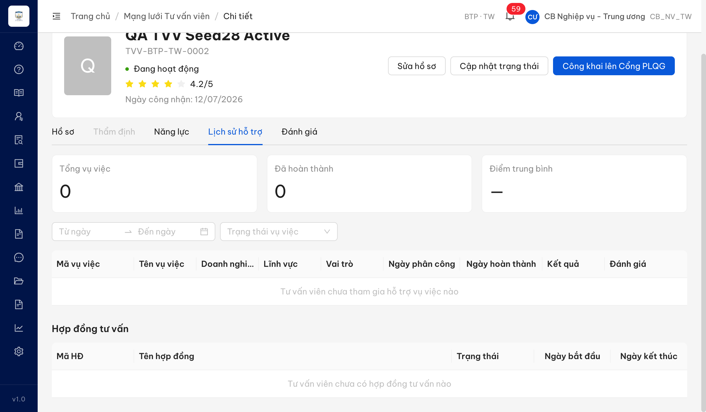

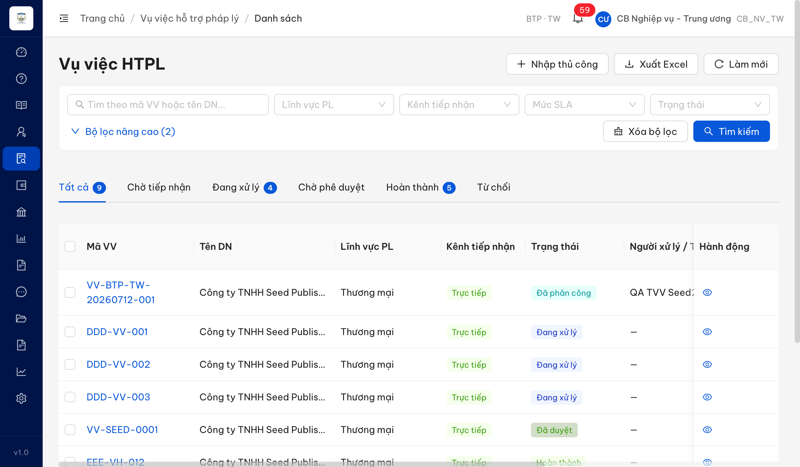

**Dữ liệu liên kết (đọc lại từ vụ việc và hồ sơ tư vấn viên) — cho thấy 2 bản ghi trỏ đúng vào nhau:**

```json
// GET /api/v1/vu-viecs/8e259653-e0a5-49e8-ae7c-5fb07734ce09
{ "maVuViec": "VV-BTP-TW-20260712-001", "trangThai": "DA_PHAN_CONG",
  "loaiDoiTuongXuLy": "CA_NHAN",
  "nguoiXuLyId": "5432719c-c542-4a5d-8c3a-db1b8a918bbf",
  "ngayPhanCong": "2026-07-12T00:23:01.882Z" }

// GET /api/v1/tu-van-viens/98cfd963-3cd3-4c8a-bfa9-625460824d6d
{ "hoTen": "QA TVV Seed28 Active", "trangThai": "HOAT_DONG",
  "taiKhoanId": "5432719c-c542-4a5d-8c3a-db1b8a918bbf" }   // ← trùng nguoiXuLyId ở trên
```

> **Gợi ý điều tra cho dev (không ràng buộc cách sửa):** vụ việc lưu người xử lý theo **id tài khoản** (`nguoiXuLyId` = `taiKhoanId` của tư vấn viên), trong khi truy vấn lịch sử đang tra theo **id hồ sơ tư vấn viên** — hai id này khác nhau nên không khớp bản ghi nào. Cùng nguyên nhân này khiến dropdown "Vụ việc liên kết" ở hộp thoại Gửi đánh giá rỗng với mọi tư vấn viên (xem ghi chú BUG-DGTVV_03).

Bảng đối chiếu điều kiện đầy đủ: `../reverify-audit/conditions/QLLSHTCTVV_01.md` (0 GAP — đúng vai trò CB Nghiệp vụ TW, đúng trạng thái TVV "Đang hoạt động", đúng tiền đề "TVV đã tham gia vụ việc", không đặt bộ lọc).

*(Evidence đối tác: `../partner-evidence/QLLSHTCTVV_01.webm` — khung 00:09 (t=9.2s): thẻ "Lịch sử hỗ trợ" của TVV-BTP-TW-0032 hiển thị Tổng vụ việc 0 + "Tư vấn viên chưa tham gia hỗ trợ vụ việc nào", trong khi khung t=5.5s cho thấy chính tư vấn viên đó có 2 đánh giá gắn vụ việc `8d074115-4da5-427c-af55-3909f1e4e675`. Khung hình đã trích: `../reverify-audit/QLLSHTCTVV_01/frames/`.)*

---

## ~~BUG-CNTTTVV_06~~ [CLOSED] — Sửa hồ sơ TVV khác đơn vị: thông báo lỗi hiển thị 2 lần trùng lặp + không nêu rõ "không có quyền cập nhật hồ sơ"

> **Re-test:** 2026-07-15 R2 — ✅ PASS (Closed-verified). Sửa TVV-STP-AG-0001 (khác đơn vị) → Lưu: nay chỉ **1 toast** (đo MutationObserver, trước 2) với wording **"Bạn không có quyền cập nhật hồ sơ tư vấn viên này (khác đơn vị)"** — đúng FR-IV-11 E2 (dòng 854); `PATCH .../4c1d3aab…` → 403, chặn đúng. Evidence: `image/BUG-CNTTTVV_06-reverify-pass-1-toast-wording-dung.png`.

### Mô tả

Khi Cán bộ Nghiệp vụ mở màn **"Chỉnh sửa hồ sơ TVV"** của một tư vấn viên **không thuộc đơn vị mình** rồi bấm **Lưu**, hệ thống chặn thao tác (đúng) nhưng hiển thị **2 thông báo lỗi giống hệt nhau xếp chồng** — cùng nội dung *"Đơn vị của bạn khác đơn vị của tư vấn viên"*. Ngoài ra nội dung thông báo không nêu rõ người dùng **không có quyền cập nhật hồ sơ** như SRS quy định cho màn này.

### Các bước tái hiện

1. Đăng nhập vai trò **Cán bộ Nghiệp vụ Trung ương (CB_NV_TW)** — tài khoản `cbnv_tw` (đơn vị BTP · TW).
2. Mở màn **Chỉnh sửa hồ sơ** của tư vấn viên **khác đơn vị**: `TVV-STP-AG-0001` — "QA TVV Dia Phuong R18" (đơn vị `…8002-000000000006`), đường dẫn `/chuyen-gia-tvv/4c1d3aab-db59-40f8-9a58-b8637c42d8ab/chinh-sua`.
3. Giữ nguyên dữ liệu, bấm **Lưu**.
4. Quan sát vùng thông báo phía trên màn hình.

### Kết quả mong đợi

- Theo SCR-IV-02 §Tham chiếu nội bộ (srs-fr-04 dòng 1519), màn Sửa hồ sơ TVV áp dụng quy tắc **BR-AUTH-08 (phân quyền theo đơn vị)** và dùng thông báo lỗi **ERR-CN-02**.
- Theo FR-IV-11 (UC49) §Error Handling E2 (dòng 854) — và cùng câu chữ ở FR-IV-04 §Error Handling E1 (dòng 420): khi người dùng **không cùng đơn vị** với tư vấn viên, hệ thống từ chối và hiển thị thông báo nêu rõ **không có quyền cập nhật hồ sơ tư vấn viên này (khác đơn vị)**.
- Thông báo lỗi hiển thị **một lần duy nhất** cho một lần thao tác.

### Kết quả thực tế

- Hệ thống chặn lưu (đúng), giữ nguyên màn sửa.
- ❌ Thông báo hiển thị **2 lần trùng lặp** — kiểm đếm DOM tại thời điểm bấm Lưu: **2** phần tử `.ant-message-notice-wrapper`, nội dung giống hệt nhau.
- ❌ Nội dung thông báo là *"Đơn vị của bạn khác đơn vị của tư vấn viên"* — chỉ nêu tình trạng khác đơn vị, **không nêu rõ người dùng không có quyền cập nhật hồ sơ** như thông báo SRS quy định cho màn này (dòng 854 / 420).

### Bằng chứng

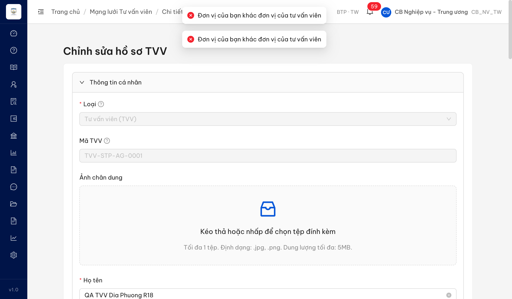

**Kiểm đếm DOM tại thời điểm hiển thị thông báo:**

```json
{ "soLuongToast": 2,
  "noiDung": ["Đơn vị của bạn khác đơn vị của tư vấn viên",
              "Đơn vị của bạn khác đơn vị của tư vấn viên"] }
```

Bảng đối chiếu điều kiện đầy đủ: `../reverify-audit/conditions/CNTTTVV_06.md` (0 GAP — đúng vai trò CB Nghiệp vụ TW, đúng tiền đề "hồ sơ tư vấn viên khác đơn vị", đúng thao tác bấm Lưu trên màn Chỉnh sửa).

*(Evidence đối tác: `../partner-evidence/CNTTTVV_06.jpg` — 2 toast đỏ giống hệt nhau cùng nội dung "Đơn vị của bạn khác đơn vị của tư vấn viên" trên màn `/chuyen-gia-tvv/b8b5e09c…/chinh-sua`. Cùng hiện tượng thông báo lặp 2 lần đã ghi nhận ở BUG-QLGVTG_09 — dev có thể xem xét chung một nguyên nhân.)*

---

## ~~BUG-CNTTTVV_07~~ [CLOSED] — Sửa hồ sơ TVV: bấm "Hủy" là mất ngay dữ liệu đang nhập (trước khi người dùng xác nhận); chọn "Ở lại" cũng không giữ được

> **Re-test:** 2026-07-15 R2 — ✅ PASS (Closed-verified). Sửa TVV-BTP-TW-0002 (SĐT→0909111222, Địa chỉ→99 Pho Moi) → Hủy: B2 hộp thoại mở, dữ liệu **VẪN giữ** (không revert ngay như trước); B3 chọn "Ở lại" → dữ liệu **còn nguyên**. Đúng SRS dòng 1512/1562. Evidence: `image/BUG-CNTTTVV_07-reverify-pass-o-lai-giu-du-lieu.png`.

### Mô tả

Trên màn **"Chỉnh sửa hồ sơ TVV"**, khi có thay đổi chưa lưu và người dùng bấm **Hủy**, hệ thống có hiện hộp thoại xác nhận *"Bạn có thay đổi chưa được lưu — Nếu tiếp tục, các thay đổi sẽ bị mất. Bạn có muốn tiếp tục?"* ("Ở lại" / "Tiếp tục"). Tuy nhiên **toàn bộ dữ liệu đang nhập đã bị đưa về giá trị cũ NGAY tại thời điểm bấm "Hủy"** — tức là **trước khi người dùng kịp chọn**. Hệ quả: chọn **"Ở lại"** vẫn mất trắng dữ liệu vừa nhập, hộp thoại xác nhận mất ý nghĩa.

### Các bước tái hiện

1. Đăng nhập vai trò **Cán bộ Nghiệp vụ Trung ương (CB_NV_TW)** — tài khoản `cbnv_tw`.
2. Mở **Chỉnh sửa hồ sơ** của tư vấn viên `TVV-BTP-TW-0002` ("QA TVV Seed28 Active", Đang hoạt động): `/chuyen-gia-tvv/98cfd963-3cd3-4c8a-bfa9-625460824d6d/chinh-sua`.
3. Sửa dữ liệu hợp lệ ở 2 trường: **Số điện thoại** `0912280028` → `0909111222`; **Địa chỉ** `28 QA Test, Ha Noi` → `99 Pho Moi, Ha Noi`.
4. Bấm **Hủy** → hộp thoại xác nhận hiện ra.
5. Quan sát các trường **ngay khi hộp thoại còn đang mở** (chưa bấm nút nào).
6. Chọn **"Ở lại"** → quan sát lại các trường.

### Kết quả mong đợi

- Theo SCR-IV-02 cell 7 (srs-fr-04 dòng 1512): *"Hủy: nếu có thay đổi chưa lưu → **MD-XOA xác nhận**"* — phải có bước xác nhận **trước khi** bỏ thay đổi; và theo quy ước cùng loại ở SCR-IV-03 cell 20a (dòng 1562): *"click **'Đồng ý' → bỏ thay đổi**"*.
- ⇒ Thay đổi **chỉ được bỏ khi người dùng xác nhận**. Khi hộp thoại đang mở, dữ liệu người dùng nhập dở **phải còn nguyên**; khi chọn nhánh **ở lại màn nhập liệu**, hệ thống phải **giữ nguyên toàn bộ dữ liệu đang nhập** để người dùng nhập tiếp.

### Kết quả thực tế

- **B1 — sau khi nhập, trước khi bấm Hủy:** Số điện thoại = `0909111222`, Địa chỉ = `99 Pho Moi, Ha Noi`.
- **B2 — ngay khi hộp thoại hiện, CHƯA bấm nút nào:** các trường **đã bị đưa về giá trị cũ** — Số điện thoại = `0912280028`, Địa chỉ = `28 QA Test, Ha Noi`. ⇒ Thay đổi bị hủy **trước khi người dùng xác nhận**.
- **B3 — sau khi chọn "Ở lại":** vẫn ở màn nhập liệu (đúng) nhưng dữ liệu vừa nhập **đã mất** — Số điện thoại = `0912280028`, Địa chỉ = `28 QA Test, Ha Noi`.
- ⇒ Người dùng lỡ tay bấm "Hủy" thì **không có đường quay lại**: cả hai nhánh của hộp thoại đều đã mất dữ liệu.

### Bằng chứng

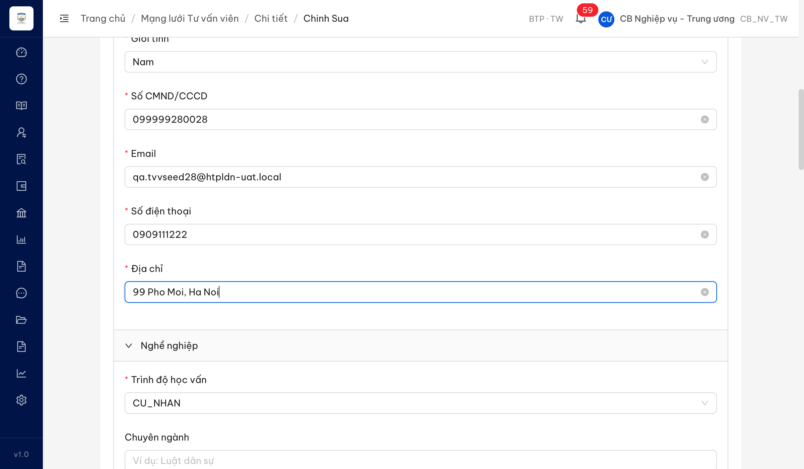

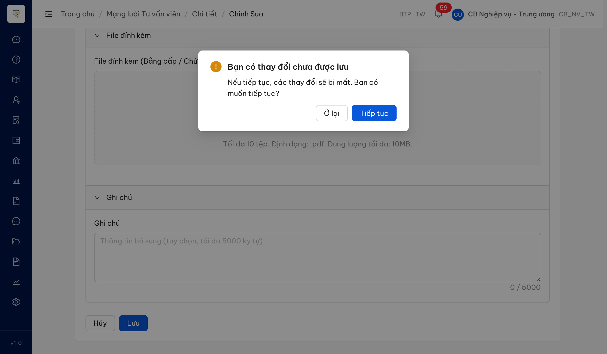

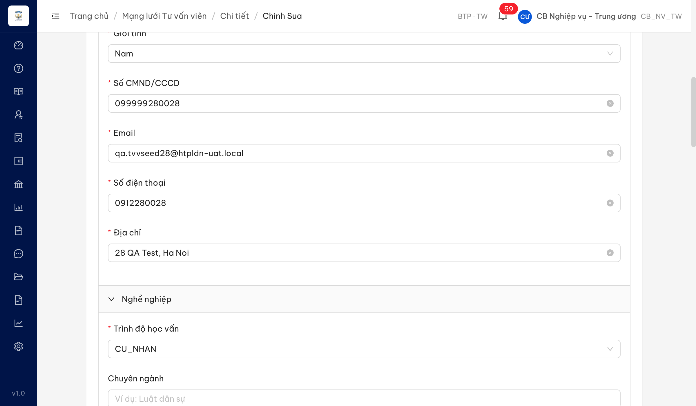

Bảng đối chiếu điều kiện đầy đủ: `../reverify-audit/conditions/CNTTTVV_07.md` (0 GAP — đúng vai trò CB Nghiệp vụ TW, đúng màn Chỉnh sửa hồ sơ, đúng tiền đề "có thay đổi chưa lưu", đúng thao tác Hủy → "Ở lại").

> **Ghi chú cho dev:** dữ liệu mất **ngay ở thao tác bấm "Hủy"** (bước B2), **không phải** ở nhánh "Ở lại" — nên sửa ở chỗ *chỉ hoàn tác biểu mẫu SAU KHI người dùng xác nhận*. Cùng nguyên nhân với **BUG-QLTVV_22** (màn Thêm mới TVV) và **BUG-DKTGMLTVV_14** (màn Đăng ký tham gia mạng lưới) — dev nên xử lý chung một lần cho cả 3 màn.

> **Ghi chú về bằng chứng đối tác:** video `../partner-evidence/CNTTTVV_07.webm` (21.19s, đã trích 11 khung → `../reverify-audit/CNTTTVV_07/frames/`) **chỉ ghi cảnh cuộn xem biểu mẫu**, **không** ghi lại thao tác bấm "Hủy", hộp thoại, hay trạng thái sau khi chọn "Ở lại". Bug này được xác nhận bằng **QA tự chạy lại đúng các bước đối tác mô tả** trên môi trường được giao (3 ảnh B1/B2/B3 ở trên), không suy đoán từ video.

---

## ~~BUG-CNTTHDCTVV_02~~ [CLOSED] — Vô hiệu hóa TVV còn vụ việc chưa hoàn thành: giao diện hiện "Có lỗi xảy ra" thay vì thông báo nghiệp vụ mà backend đã trả về

> **Re-test:** 2026-07-15 R2 — ✅ PASS (Closed-verified). Vô hiệu hóa TVV-BTP-TW-0002 (còn vụ việc chưa hoàn thành): giao diện nay hiển thị đúng **"Tư vấn viên đang có 2 vụ việc và 0 hỏi đáp chưa hoàn thành, không thể vô hiệu hóa"** — không còn "Có lỗi xảy ra"; `POST .../cap-nhat-trang-thai` → 422 (ERR-STATE-IV-TT-02), đúng SRS dòng 914/925. Evidence: `image/BUG-CNTTHDCTVV_02-reverify-pass-thongbao-nghiepvu-dung.png`.

### Mô tả

Khi Cán bộ Nghiệp vụ vô hiệu hóa một tư vấn viên **đang còn vụ việc chưa hoàn thành**, hệ thống từ chối đúng (không đổi trạng thái) nhưng giao diện chỉ hiển thị banner đỏ chung chung **"Có lỗi xảy ra"**. Trong khi đó **backend đã trả về đúng thông báo nghiệp vụ theo SRS**: *"Tư vấn viên đang có 1 vụ việc và 0 hỏi đáp chưa hoàn thành, không thể vô hiệu hóa"*. Cán bộ không biết vì sao thao tác bị chặn và cần xử lý gì tiếp.

### Các bước tái hiện

1. Đăng nhập vai trò **Cán bộ Nghiệp vụ Trung ương (CB_NV_TW)** — tài khoản `cbnv_tw`.
2. Điều kiện tiền đề: tư vấn viên `TVV-BTP-TW-0002` ("QA TVV Seed28 Active", **Đang hoạt động**) đang có **1 vụ việc chưa hoàn thành** — `VV-BTP-TW-20260712-001` (Đã phân công).
3. Mở chi tiết tư vấn viên → bấm **"Cập nhật trạng thái"**.
4. Chọn **Trạng thái mới = "Vô hiệu hóa"**, nhập **Lý do thay đổi** hợp lệ (≥ 10 ký tự) → bấm **"Xác nhận"**.

### Kết quả mong đợi

- Theo FR-IV-12 (UC50) §Processing bước 2 (srs-fr-04 dòng 892) + §Error Handling **E2 — ERR-TT-02** (dòng 914) + §Acceptance Criteria (dòng 925): hệ thống **từ chối** thao tác và hiển thị cho người dùng thông báo nêu rõ lý do — *"Tư vấn viên đang có **{N} vụ việc và {M} hỏi đáp chưa hoàn thành**, không thể vô hiệu hóa"*.

### Kết quả thực tế

- Hệ thống **có từ chối** thao tác (hộp thoại không đóng, tư vấn viên vẫn "Đang hoạt động") — phần nghiệp vụ **đúng**.
- ❌ Giao diện chỉ hiển thị banner đỏ **"Có lỗi xảy ra"** (đo DOM: 1 phần tử `.ant-alert-error` với đúng nội dung đó) — **mất hoàn toàn** thông tin "{N} vụ việc và {M} hỏi đáp chưa hoàn thành".
- Backend **đã trả về đúng** thông báo cần hiển thị (xem response bên dưới) ⇒ đây là lỗi ở **tầng hiển thị của giao diện** (không đọc `message` trong phản hồi), không phải lỗi nghiệp vụ.

### Bằng chứng

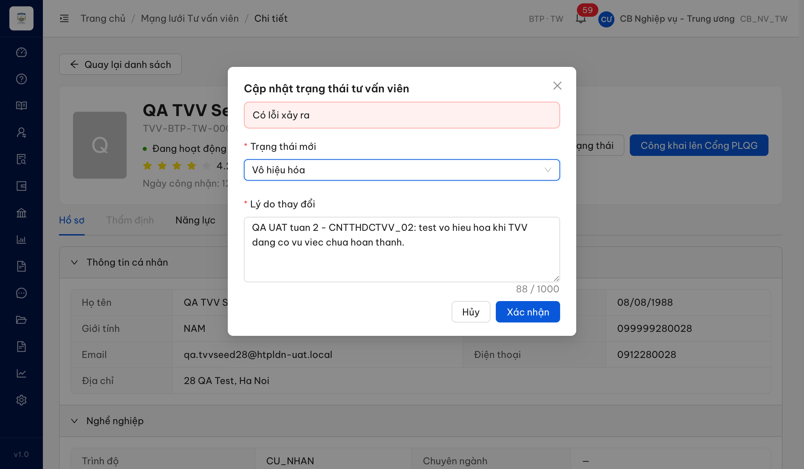

**Phản hồi của chính thao tác "Xác nhận" đó — backend trả đúng thông báo SRS, giao diện không dùng:**

```json
// POST /api/v1/tu-van-viens/98cfd963-3cd3-4c8a-bfa9-625460824d6d/cap-nhat-trang-thai  → HTTP 422
// request: {"trangThaiMoi":"VO_HIEU_HOA","lyDo":"...","version":6}
{
  "success": false,
  "error": {
    "code": "ERR-STATE-IV-TT-02",
    "message": "Tư vấn viên đang có 1 vụ việc và 0 hỏi đáp chưa hoàn thành, không thể vô hiệu hóa",
    "timestamp": "2026-07-12T11:43:32.490Z"
  }
}
```

Bảng đối chiếu điều kiện đầy đủ: `../reverify-audit/conditions/CNTTHDCTVV_02.md` (0 GAP — đúng vai trò CB Nghiệp vụ TW, đúng trạng thái TVV "Đang hoạt động", đúng tiền đề "TVV còn vụ việc chưa hoàn thành" — chính backend xác nhận đếm được 1 vụ việc).

*(Evidence đối tác: `../partner-evidence/CNTTHDCTVV_02.webm` — khung 00:31 (t=32s) hộp thoại "Cập nhật trạng thái tư vấn viên" với Trạng thái mới "Vô hiệu hóa" + lý do "TKM test vô hiệu hóa khi đag xử lý vụ việc", đang bấm "Xác nhận"; khung 00:35 (t=35.8s) hộp thoại hiện banner đỏ "Có lỗi xảy ra". Khung hình đã trích: `../reverify-audit/CNTTHDCTVV_02/frames/`.)*

---

## ~~BUG-QLTNVV_02~~ [CLOSED] — Danh sách Vụ việc HTPL: 2 cột thời hạn hiển thị sai nhãn so với SRS ("Deadline thời hạn" / "Cảnh báo thời hạn")

> **Re-test:** 2026-07-14 reverify-devfix — ✅ PASS (Closed). Danh sách Vụ việc HTPL hiện đúng 2 cột **Deadline SLA** và **Cảnh báo SLA**. Phần thẻ cảnh báo SLA nhấp nháy/màu chữ chìm là bug riêng `BUG-KTHSYCHTPL_02b` và đã được re-test riêng.

### Mô tả

Bảng danh sách màn "Vụ việc HTPL" đặt tên 2 cột cuối là **"Deadline thời hạn"** và **"Cảnh báo thời hạn"**, trong khi SRS quy định 2 cột này phải mang nhãn **"Deadline SLA"** và **"Cảnh báo SLA"**. 7 cột còn lại của bảng đều đúng nhãn SRS, cho thấy tên cột trong SRS chính là nhãn hiển thị mà dev phải theo.

### Các bước tái hiện

1. Đăng nhập vai trò **CB Nghiệp vụ - Trung ương** (`cbnv_tw`) — có quyền "Quản lý vụ việc" theo SCR-V.I-01.
2. Vào menu **Vụ việc HTPL** → màn `/vu-viec/danh-sach`.
3. Đọc hàng tiêu đề của bảng danh sách (cuộn ngang tới 2 cột cuối trước cột "Hành động").
4. Quan sát nhãn 2 cột thời hạn.

### Kết quả mong đợi

- Theo SRS FR-V.I-01 (UC51) — SCR-V.I-01 §Thành phần màn hình (`srs-fr-05-vu-viec.md` dòng 1637-1638), cột thứ 19 phải hiển thị nhãn **"Deadline SLA"** và cột thứ 20 phải hiển thị nhãn **"Cảnh báo SLA"**.

### Kết quả thực tế

- Hàng tiêu đề bảng trả về: `Mã VV · Tên DN · Lĩnh vực PL · Kênh tiếp nhận · Trạng thái · Người xử lý / Tổ chức · Ngày tiếp nhận · **Deadline thời hạn** · **Cảnh báo thời hạn** · Hành động`.
- 2 cột cuối lệch nhãn so với SRS; 7 cột còn lại khớp SRS nguyên văn.
- Nhãn đối tác ghi nhận trên bản dựng của họ ("Thời hạn xử lý") khác với bản dựng hiện tại ("Deadline thời hạn") — cả hai đều lệch SRS, nên lỗi vẫn tồn tại dù chuỗi hiển thị đã đổi giữa 2 bản dựng.

### Bằng chứng

**1. Ảnh chụp:**

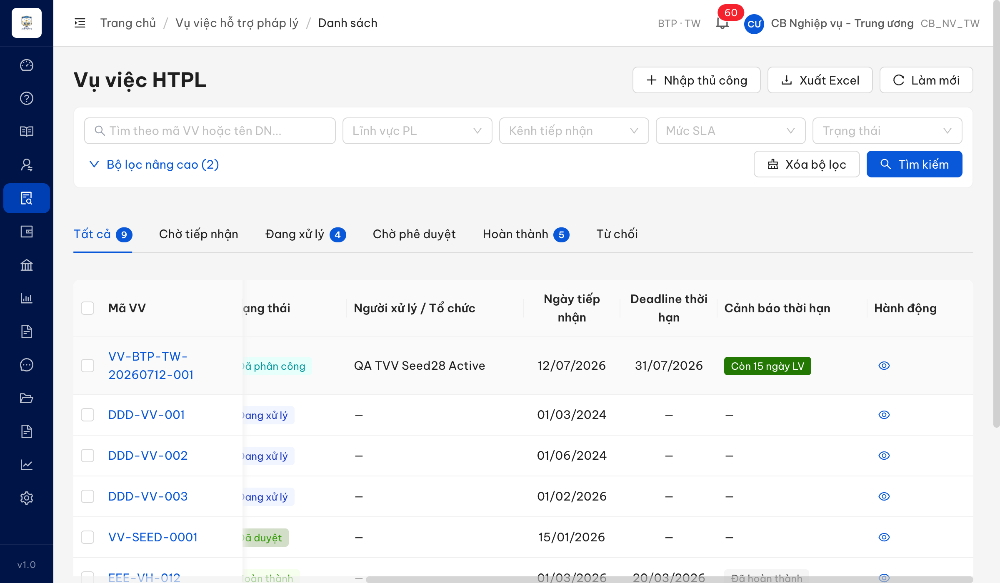

**2. Hàng tiêu đề đọc trực tiếp từ DOM:**

```json
["", "Mã VV", "Tên DN", "Lĩnh vực PL", "Kênh tiếp nhận", "Trạng thái",
 "Người xử lý / Tổ chức", "Ngày tiếp nhận", "Deadline thời hạn", "Cảnh báo thời hạn", "Hành động"]
```

*(Evidence đối tác: `../partner-evidence/QLTNVV_02.jpg` — ảnh chụp màn `/vu-viec/danh-sach` vai trò CB_NV_TW ngày 09/07/2026; bảng bị cắt ngang trước 2 cột tranh chấp nên nhãn cột không nhìn thấy trong ảnh → đã verify trực tiếp trên web thay vì dựa vào ảnh.)*

---

## ~~BUG-QLTNVV_06~~ [CLOSED] — Xuất Excel: 6/9 cột sai tên so với màn hình danh sách + thừa 2 cột không có trên màn hình

> **Re-test:** 2026-07-14 reverify-devfix — ✅ PASS (Closed). Xuất Excel từ danh sách Vụ việc tải file `vu-viec-export.xlsx`; file có đúng 9 cột dữ liệu và tên cột khớp màn hình/SRS, không còn thừa "Tiêu đề" hoặc "Ưu tiên".

### Mô tả

File Excel xuất ra từ màn "Vụ việc HTPL" **không khớp tập cột đang hiển thị trên màn hình danh sách**, sai ở 2 điểm: (1) **6/9 cột đặt tên khác** nhãn cột trên màn hình; (2) **thừa 2 cột** ("Tiêu đề", "Ưu tiên") vốn không hiển thị trên màn hình. Riêng việc lệch tên khiến người dùng dò theo tên cột trên màn hình thì **không tìm thấy** và tưởng file bị thiếu cột — chính đối tác đã hiểu nhầm "thiếu cột Cảnh báo thời hạn", trong khi cột đó có thật dưới tên "Mức cảnh báo".

### Các bước tái hiện

1. Đăng nhập vai trò **CB Nghiệp vụ - Trung ương** (`cbnv_tw`) — có quyền "Quản lý vụ việc" theo SCR-V.I-01.
2. Vào **Vụ việc HTPL** → màn `/vu-viec/danh-sach`. Ghi lại 9 nhãn cột đang hiển thị trên bảng.
3. Nhập từ khóa tìm kiếm cho ra kết quả (vd "EEE" → 4 kết quả), bấm **"Xuất Excel"**.
4. Mở file Excel vừa tải, đọc hàng tiêu đề, đối chiếu với 9 nhãn cột ở bước 2.

### Kết quả mong đợi

- Theo **quyết định BA ngày 12/07/2026**: *màn hình danh sách hiển thị cột nào thì file Excel chỉ có **đúng những cột đó**, và phải **đúng tên cột tương ứng**; màn hình hiển thị cột nào thì theo SRS.*
- ⇒ Tập cột file Excel = **đúng 9 cột dữ liệu** của SCR-V.I-01 (`srs-fr-05-vu-viec.md` dòng 1630-1638): `Mã VV` · `Tên DN` · `Lĩnh vực PL` · `Kênh tiếp nhận` · `Trạng thái` · `Người xử lý / Tổ chức` · `Ngày tiếp nhận` · `Deadline SLA` · `Cảnh báo SLA` — không thừa, không thiếu, tên cột trùng khớp nhãn trên màn hình.
- Cột chọn dòng (checkbox) và cột **"Hành động"** trên bảng là thành phần điều khiển giao diện, không chứa dữ liệu ⇒ **không** xuất ra Excel.

### Kết quả thực tế

**Lỗi 1 — 6/9 cột lệch tên** giữa màn hình và file Excel:

| Cột trên MÀN HÌNH | Cột trong FILE EXCEL | Khớp? |
|---|---|:-:|
| Mã VV | Mã vụ việc | ❌ LỆCH |
| Tên DN | Doanh nghiệp | ❌ LỆCH |
| Lĩnh vực PL | Lĩnh vực | ❌ LỆCH |
| Kênh tiếp nhận | Kênh tiếp nhận | ✅ |
| Trạng thái | Trạng thái | ✅ |
| Người xử lý / Tổ chức | Người hỗ trợ | ❌ LỆCH |
| Ngày tiếp nhận | Ngày tiếp nhận | ✅ |
| Deadline thời hạn | Deadline | ❌ LỆCH |
| Cảnh báo thời hạn | Mức cảnh báo | ❌ LỆCH |

**Lỗi 2 — thừa 2 cột:** file Excel có thêm **"Tiêu đề"** và **"Ưu tiên"**, hai cột này **không hiển thị** trên màn hình danh sách và **không nằm trong** SCR-V.I-01 (`srs-fr-05-vu-viec.md` dòng 1630-1638) ⇒ theo quyết định BA ngày 12/07/2026 phải **bỏ** khỏi file Excel.

- **Lưu ý thứ tự fix:** nhãn cột trên màn hình **hiện cũng đang sai SRS** (xem `BUG-QLTNVV_02` — SRS dòng 1637-1638 quy định "Deadline SLA" / "Cảnh báo SLA"). Cần sửa nhãn màn hình theo SRS **trước**, rồi mới đồng bộ tên cột Excel theo nhãn đã đúng — nếu đồng bộ Excel theo nhãn hiện tại sẽ phải sửa lại lần 2.

### Bằng chứng

**1. Ảnh chụp — bảng đối chiếu dựng từ chính file Excel do web sinh ra:**

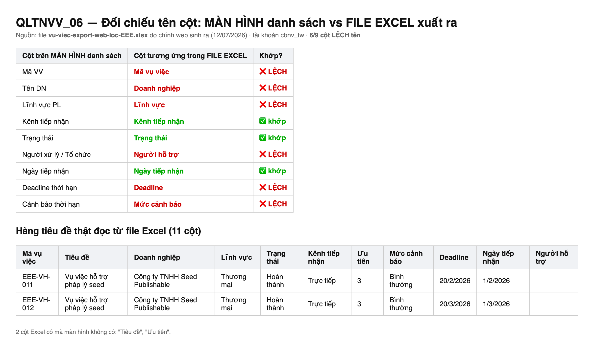

**2. Hàng tiêu đề thật đọc từ file Excel (`openpyxl`):**

```json
["Mã vụ việc", "Tiêu đề", "Doanh nghiệp", "Lĩnh vực", "Trạng thái", "Kênh tiếp nhận",
 "Ưu tiên", "Mức cảnh báo", "Deadline", "Ngày tiếp nhận", "Người hỗ trợ"]
```

**3. File Excel gốc do web sinh ra (đính kèm):** `../reverify-audit/QLTNVV_06/vu-viec-export-web-loc-EEE.xlsx` (lọc 4 kết quả → file đúng 4 dòng) và `vu-viec-export-web.xlsx` (không lọc → 9 dòng).

*(Ghi chú bằng chứng: máy QA không cài Excel/LibreOffice nên không chụp được ảnh giao diện Excel; ảnh trên là **bảng đối chiếu render trực tiếp từ dữ liệu đọc ra bằng `openpyxl` từ chính file .xlsx web sinh ra** — file gốc đính kèm ở mục 3 để dev/BA tự mở kiểm chứng. Evidence đối tác: `../partner-evidence/QLTNVV_06.webm`, khung t=24s cho thấy file `vu-viec-export.xlsx` trên env đối tác **cũng có cột "Mức cảnh báo"** — tức lỗi lệch tên cột tồn tại trên cả 2 bản dựng.)*

---

## BUG-QLTNVV_08 [CLOSED-VERIFIED] — Danh sách Vụ việc HTPL đã sắp xếp được theo cột

> **Re-test mới nhất:** 2026-07-15 rv3 — ✅ PASS (Closed-verified). Danh sách Vụ việc HTPL bằng `cbnv_tw`, tab Tất cả có 17 bản ghi; các cột dữ liệu có icon/class sort. Bấm cột **Mã VV** gửi `sortBy=maVuViec&sortOrder=DESC/ASC`, thứ tự danh sách đổi và header có `aria-sort`. Evidence: `image/rv3-QLTNVV_08-before-sort.png`, `image/rv3-QLTNVV_08-sort-ma-vv-asc.png`, `image/rv3-QLTNVV_08-sort-ma-vv-desc.png`; điều kiện: `../reverify-audit/rv3-conditions/QLTNVV_08.md`.

> **Re-test:** 2026-07-14 reverify-devfix — 🔴 REOPEN (fix một phần). Các cột Mã VV/Trạng thái/Ngày tiếp nhận/Deadline SLA đã sort được, nhưng Tên DN/Lĩnh vực PL/Kênh tiếp nhận/Người xử lý hoặc Tổ chức/Cảnh báo SLA vẫn không có sort; chưa đạt yêu cầu "sort theo từng cột".

### Mô tả

Bảng danh sách màn "Vụ việc HTPL" **không có cơ chế sắp xếp trên bất kỳ cột nào**. Bấm vào tiêu đề cột không đổi thứ tự bản ghi, không hiện biểu tượng sắp xếp, và không gửi tham số sắp xếp nào xuống máy chủ. SRS yêu cầu danh sách phải hỗ trợ sắp xếp theo từng cột.

### Các bước tái hiện

1. Đăng nhập vai trò **CB Nghiệp vụ - Trung ương** (`cbnv_tw`) — có quyền "Quản lý vụ việc" theo SCR-V.I-01.
2. Vào menu **Vụ việc HTPL** → màn `/vu-viec/danh-sach` (thẻ "Tất cả", 9 bản ghi).
3. Ghi lại thứ tự cột "Mã VV" hiện tại.
4. Bấm vào tiêu đề cột **"Mã VV"**, rồi **"Ngày tiếp nhận"**, rồi **"Deadline thời hạn"** (mỗi lần chờ ~1 giây).
5. Đối chiếu lại thứ tự bản ghi.

### Kết quả mong đợi

- Theo SRS FR-V.I-01 (UC51) — SCR-V.I-01 §Quy tắc tương tác (`srs-fr-05-vu-viec.md` dòng 1647): *"Sắp xếp mặc định: ngày cập nhật DESC. **Hỗ trợ sort theo từng cột**"*.
- Bấm tiêu đề cột phải sắp xếp danh sách theo cột đó, luân phiên tăng dần / giảm dần qua mỗi lần bấm.

### Kết quả thực tế

Không có sắp xếp — xác nhận bằng **3 cách độc lập**:

1. **Giao diện:** 10/10 cột không có class `ant-table-column-has-sorters`, không có icon `.ant-table-column-sorter`, không có `aria-sort`.
2. **Hành vi:** sau khi bấm tiêu đề 3 cột, thứ tự bản ghi **giữ nguyên y hệt** — `VV-BTP-TW-20260712-001, DDD-VV-001, DDD-VV-002, DDD-VV-003, VV-SEED-0001, EEE-VH-012, EEE-VH-013, EEE-VH-014, EEE-VH-011` (nếu có sắp xếp theo "Mã VV" thì phải đảo về thứ tự A→Z hoặc Z→A).
3. **Mạng:** không request nào chứa tham số `sort`/`order`; bấm tiêu đề cột không phát sinh request mới.

### Bằng chứng

**1. Ảnh chụp:**

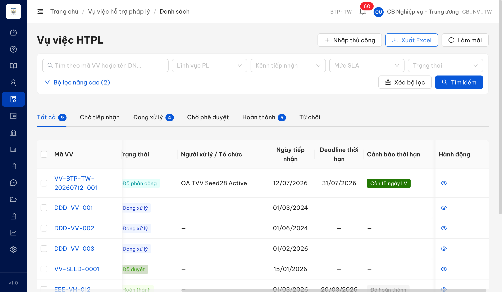

**2. Log quan sát (thứ tự trước / sau khi bấm 3 tiêu đề cột):**

```json
{
  "clickedHeaders": ["Mã VV", "Ngày tiếp nhận", "Deadline thời hạn"],
  "orderBefore": ["VV-BTP-TW-20260712-001","DDD-VV-001","DDD-VV-002","DDD-VV-003","VV-SEED-0001","EEE-VH-012","EEE-VH-013","EEE-VH-014","EEE-VH-011"],
  "orderAfter":  ["VV-BTP-TW-20260712-001","DDD-VV-001","DDD-VV-002","DDD-VV-003","VV-SEED-0001","EEE-VH-012","EEE-VH-013","EEE-VH-014","EEE-VH-011"],
  "orderChanged": false,
  "anySortParamInNetwork": false
}
```

*(Evidence đối tác: `../partner-evidence/QLTNVV_08.webm` — khung 00:06 (t=6s) đang bấm vào vùng tiêu đề cột trên bảng, danh sách 51 bản ghi giữ nguyên thứ tự, tiêu đề cột không có biểu tượng sắp xếp. Khung hình đã trích: `../reverify-audit/QLTNVV_08/frames/`. Chi tiết quan sát: `../reverify-audit/QLTNVV_08/observation.md`.)*

---

## ~~BUG-NHSYC_02~~ [CLOSED] — Form Nhập thủ công: nhóm "Thông tin Tiếp nhận" thiếu trường bắt buộc "Ngày tiếp nhận"

> **Re-test:** 2026-08-03 19:02 R2 — ✅ PASS (Closed-verified, build HTPLDN V1.0.4). Không dừng ở quan sát form: nhóm "Thông tin Tiếp nhận" có "Ngày tiếp nhận" (chọn ngày, bắt buộc) cạnh "Kênh tiếp nhận" + "Người tiếp nhận"; nhập 02/08/2026 rồi bấm "Lưu & Tiếp nhận" → tạo được **VV-BTP-TW-20260803-002**; mở lại chi tiết vụ việc hiển thị "Ngày tiếp nhận 02/08/2026 07:00" và "Kênh tiếp nhận Điện thoại" — nhập/lưu/hiển thị lại khớp. Bằng chứng: `../../reverify-week-4/reverify-round-2026-08-03/evidence/NHSYC_02-vu-viec-ngay-tiep-nhan.png`.

### Mô tả

Trên form "Nhập thủ công" hồ sơ vụ việc, nhóm 4 "Thông tin Tiếp nhận" **chỉ có 2 trường**: "Kênh tiếp nhận" và "Người tiếp nhận" (bị khóa, tự điền). **Không có trường "Ngày tiếp nhận"**, trong khi SRS quy định đây là trường **bắt buộc**, dạng chọn ngày, mặc định là ngày hiện tại, luôn hiển thị. Hệ quả: CB NV không nhập được ngày tiếp nhận thực tế của hồ sơ (vd hồ sơ nhận qua bưu chính từ vài ngày trước), và deadline SLA tính từ ngày tiếp nhận cũng không phản ánh đúng thực tế.

### Các bước tái hiện

1. Đăng nhập vai trò **CB Nghiệp vụ - Trung ương** (`cbnv_tw`) — có quyền "Nhập hồ sơ VV" theo FR-V.I-04 PRE-01.
2. Vào menu **Vụ việc HTPL** → bấm nút **"Nhập thủ công"** (màn `/vu-viec/tao-moi`).
3. Cuộn xuống nhóm 4 **"Thông tin Tiếp nhận"**.
4. Liệt kê các trường trong nhóm này.

### Kết quả mong đợi

- Theo SRS FR-V.I-04 (UC54) — SCR-V.I-02 §Thành phần màn hình row 30 (`srs-fr-05-vu-viec.md` dòng 1691): trường `ngay_tiep_nhan` dạng **DatePicker**, **Bắt buộc**, mặc định = ngày hiện tại, điều kiện hiển thị **"Luôn"**.
- CB NV phải nhập/chỉnh được ngày tiếp nhận hồ sơ (mặc định hôm nay, cho phép sửa).

### Kết quả thực tế

- Nhóm "Thông tin Tiếp nhận" chỉ trả về 2 trường: `["Kênh tiếp nhận", "Người tiếp nhận"]`.
- Không tìm thấy trường "Ngày tiếp nhận" nào trong toàn bộ form (kiểm tra cả 4 nhóm).
- Trường "Người tiếp nhận" hiển thị đúng (khóa, tự điền "CB Nghiệp vụ - Trung ương") — đúng SRS row 31, chứng tỏ nhóm này đã được dựng nhưng **bỏ sót** trường ngày.

### Bằng chứng

**1. Ảnh chụp:**

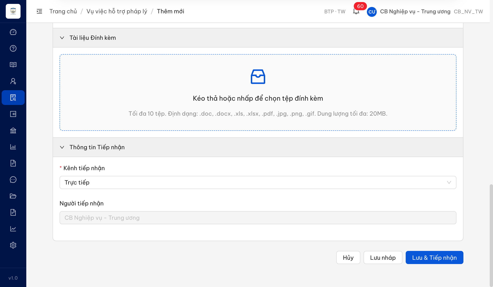

**2. Đọc trực tiếp từ DOM (nhóm "Thông tin Tiếp nhận"):**

```json
{
  "group4Fields": ["Kênh tiếp nhận", "Người tiếp nhận"],
  "hasNgayTiepNhan": false
}
```

*(Evidence đối tác: `../partner-evidence/NHSYC_02.webm` — khung 00:44 (t=44s) cuộn qua nhóm "Thông tin Tiếp nhận" trên env đối tác, cũng chỉ thấy "Kênh tiếp nhận". Khung hình đã trích: `../reverify-audit/NHSYC_02/frames/`. Case này đối tác gộp 8 ý; 7 ý còn lại là bất đồng đặc tả / SRS im lặng / SRS mâu thuẫn nội bộ → đã tách sang `ba-confirmation-needed-week-2.md`, chi tiết đối chiếu từng ý ở `../reverify-audit/NHSYC_02/observation.md`.)*

---

## ~~BUG-NHSYC_05~~ [CLOSED] — Form Nhập thủ công: "Nội dung yêu cầu" cho phép 50.000 ký tự (SRS: tối đa 10.000), nhập vượt không báo lỗi

> **Re-test:** 2026-07-14 reverify-devfix — ✅ PASS (Closed). Ô "Nội dung yêu cầu" đã giới hạn `maxlength=10000`; nhập/paste 10.050 ký tự chỉ nhận 10.000 và bộ đếm hiển thị `10000 / 10000`.

### Mô tả

Trường "Nội dung yêu cầu" trên form Nhập thủ công khai trần **50.000 ký tự** (bộ đếm hiển thị "0 / 50000", thuộc tính `maxlength="50000"`), gấp 5 lần giới hạn SRS. Nhập 10.050 ký tự — vượt giới hạn SRS 10.000 — hệ thống vẫn nhận, không hiển thị bất kỳ thông báo lỗi hay cảnh báo nào.

### Các bước tái hiện

1. Đăng nhập vai trò **CB Nghiệp vụ - Trung ương** (`cbnv_tw`) — có quyền "Nhập hồ sơ VV" theo FR-V.I-04 PRE-01.
2. Vào menu **Vụ việc HTPL** → bấm **"Nhập thủ công"** (màn `/vu-viec/tao-moi`).
3. Quan sát bộ đếm ký tự dưới ô "Nội dung yêu cầu" → hiển thị "0 / 50000".
4. Nhập vào ô "Nội dung yêu cầu" một chuỗi **10.050 ký tự** (vượt giới hạn SRS 10.000).
5. Rời khỏi ô (blur) để kích hoạt kiểm tra dữ liệu.

### Kết quả mong đợi

- Theo SRS FR-V.I-04 (UC54) §Inputs #6 (`srs-fr-05-vu-viec.md` dòng 317): `noi_dung_yeu_cau` — **max 10.000 ký tự**.
- SCR-V.I-02 §Thành phần màn hình row 20 (dòng 1681): *"Bắt buộc. **Tối đa 10.000 ký tự**"*.
- Hệ thống phải giới hạn ở 10.000 ký tự, hoặc hiển thị cảnh báo khi người dùng nhập vượt.

### Kết quả thực tế

- Bộ đếm hiển thị **"10050 / 50000"** — hệ thống nhận đủ 10.050 ký tự.
- **Không có thông báo lỗi nào** (`.ant-form-item-explain-error` rỗng).
- Trần khai báo của trường là **50.000**, không phải 10.000.

### Bằng chứng

**1. Ảnh chụp:**

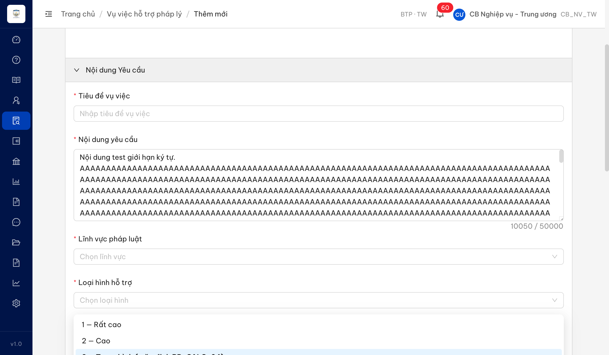

**2. Log quan sát:**

```json
{
  "maxlengthAttr": "50000",
  "nhap_10050_ky_tu": {
    "acceptedLength": 10050,
    "counter": "10050 / 50000",
    "validationError": []
  }
}
```

*(Evidence đối tác: `../partner-evidence/NHSYC_05.jpg` — ảnh chụp form `/vu-viec/tao-moi` vai trò CB_NV_TW ngày 09/07/2026, đối tác **tô vàng** đúng bộ đếm "0 / 50000" dưới ô "Nội dung yêu cầu". Ghi nhận trùng khớp với env được giao.)*

---

## ~~BUG-NHSYC_06~~ [CLOSED] — Tệp đính kèm: vượt số lượng 10 tệp và vượt tổng dung lượng 100MB đều KHÔNG bị chặn/báo lỗi

> **Re-test:** 2026-07-15 reverify-devfix — ✅ PASS (Closed). Chạy lại trên form `/vu-viec/tao-moi` bằng `cbnv_tw` với PDF hợp lệ. Nhánh vượt 10 tệp: sau 10 file, upload file thứ 11 bị chặn và hiện thông báo **"Chỉ được tải tối đa 10 tệp."** Nhánh vượt tổng 100MB: upload 6 file x 18MB (=108MB) chỉ nhận 5 file (=90MB), file thứ 6 bị chặn và hiện thông báo **"Tổng dung lượng tệp vượt quá giới hạn 100MB."** Chú thích trên màn cũng đã có **"tổng 100MB"**.

### Mô tả

SRS quy định 4 ràng buộc cho tệp đính kèm (định dạng · 20MB/tệp · **tối đa 10 tệp** · **tổng tối đa 100MB**) và bắt buộc hiển thị thông báo từ chối khi vi phạm (ERR-NH-03). Tự chạy đủ 4 nhánh vi phạm cho thấy **2 nhánh đầu ĐẠT**, nhưng **2 nhánh sau đều lỗi**: tệp thứ 11 bị **bỏ im lặng không thông báo**, và tổng dung lượng 108MB **không bị chặn**.

### Các bước tái hiện

1. Đăng nhập vai trò **CB Nghiệp vụ - Trung ương** (`cbnv_tw`) — có quyền "Nhập hồ sơ VV" theo FR-V.I-04 PRE-01.
2. Vào **Vụ việc HTPL** → **"Nhập thủ công"** (`/vu-viec/tao-moi`) → nhóm **"Tài liệu Đính kèm"**.
3. **Nhánh vượt số lượng:** tải lên 10 tệp PDF hợp lệ (mỗi tệp ~1KB) → tải tiếp **tệp thứ 11** (`hople-11.pdf`, PDF hợp lệ). Quan sát thông báo và danh sách tệp.
4. **Nhánh vượt tổng dung lượng:** xóa hết tệp, tải lên **6 tệp PDF, mỗi tệp 18MB** (từng tệp đều dưới trần 20MB nên không phạm ràng buộc/tệp) → **tổng = 108MB**, vượt trần 100MB. Quan sát thông báo và danh sách tệp.

### Kết quả mong đợi

- Theo SRS FR-V.I-04 (UC54) §Inputs #9 (`srs-fr-05-vu-viec.md` dòng 320): tệp đính kèm — **max 20MB/file, tổng 100MB, max 10 file**.
- Theo §Error Handling E3 (dòng 355) — `ERR-NH-03`: khi tệp vi phạm ràng buộc, hệ thống phải **dừng lại và hiển thị thông báo** *"File vượt quá dung lượng/số lượng cho phép hoặc sai định dạng"* (severity ERROR).
- Người dùng phải biết tệp của mình bị từ chối và vì sao — không được bỏ tệp im lặng.

### Kết quả thực tế

| Nhánh vi phạm | Hệ thống chặn? | Thông báo | Kết quả |
|---|:-:|---|:-:|
| Sai định dạng (`.txt`) | ✅ Có | *"Định dạng không được hỗ trợ. Chấp nhận: .doc, .docx, .xls, .xlsx, .pdf, .jpg, .png, .gif"* | ✅ ĐẠT |
| Vượt 20MB/tệp (PDF 25MB) | ✅ Có | *"Kích thước vượt quá giới hạn 20MB."* | ✅ ĐẠT |
| **Vượt 10 tệp (tệp thứ 11)** | Có bỏ tệp | **KHÔNG có thông báo nào** — danh sách vẫn 10 tệp, `hople-11.pdf` biến mất im lặng | ❌ **LỖI** |
| **Vượt tổng 100MB (6 × 18MB = 108MB)** | **KHÔNG chặn** | **KHÔNG có thông báo nào** — nhận đủ 6/6 tệp | ❌ **LỖI** |

- Ngoài ra, **chú thích trên màn hình không nêu trần tổng 100MB** (chỉ ghi "Tối đa 10 tệp… Dung lượng tối đa: 20MB") → người dùng không có cách nào biết ràng buộc này tồn tại.

### Bằng chứng

**1. Ảnh chụp — 6 tệp × 18MB = 108MB được nhận hết, không báo lỗi:**

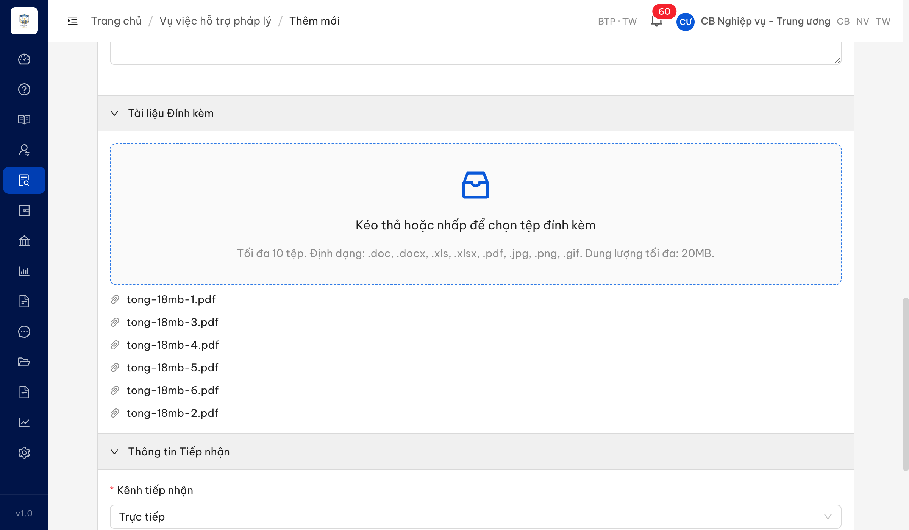

**2. Log quan sát (toast bắt bằng MutationObserver, cài TRƯỚC khi tải tệp):**

```json
{
  "nhanh_vuot_10_tep": {
    "toastsAfter11th": [],
    "fileCountAfter11th": 10,
    "has11thInList": false
  },
  "nhanh_vuot_tong_100mb": {
    "toasts": ["tong-18mb-2.pdf"],
    "fileCount": 6,
    "tongDungLuongMB": 108
  }
}
```

*(Evidence đối tác: `../partner-evidence/NHSYC_06.jpg` — ảnh chụp vùng "Tài liệu Đính kèm" trên env đối tác, chỉ thể hiện **chú thích ràng buộc**, không thấy đối tác tải tệp vi phạm nào. Vì vậy QA đã **tự chạy đủ 4 nhánh vi phạm** bằng tệp thật thay vì kết luận theo ảnh. Chi tiết: `../reverify-audit/NHSYC_06/observation.md`; tệp test: `../reverify-audit/NHSYC_06/upload-test/`.)*

---

## ~~BUG-KTHSYCHTPL_02~~ [CLOSED] — Thanh tiến trình màn Chi tiết vụ việc: bước đã hoàn thành không có dấu ✓

> **Re-test:** 2026-07-14 reverify-devfix — ✅ PASS (Closed). Thanh tiến trình màn Chi tiết vụ việc đã hiển thị dấu ✓ cho các bước hoàn thành.

### Mô tả

Màn **Chi tiết vụ việc** (SCR-V.I-03) có thanh tiến trình 10 bước theo vòng đời vụ việc. SRS yêu cầu bước **đã hoàn thành phải có dấu ✓** để phân biệt với bước chưa tới. Thực tế thanh tiến trình chỉ vẽ **chấm tròn** cho mọi bước — bước đã hoàn thành và bước chưa tới chỉ khác nhau ở màu, không có dấu tích nào.

### Các bước tái hiện

1. Đăng nhập vai trò **CB Nghiệp vụ - Trung ương** (`cbnv_tw`) — đúng vai trò đối tác dùng khi log lỗi.
2. Vào **Vụ việc HTPL** → mở chi tiết một vụ việc ở trạng thái **"Đã tiếp nhận"** (dùng `VV-BTP-TW-20260712-003`; đối tác dùng `VV-QA-R9-DVC-001`, cùng trạng thái).
3. Quan sát thanh tiến trình ở đầu màn hình, cụ thể 2 bước đã hoàn thành: **"Mới tạo"** và **"Chờ tiếp nhận"**.

### Kết quả mong đợi

Theo **FR-V.I-07 (UC57)** · **SCR-V.I-03 §Thành phần màn hình row 3 — Thanh tiến trình (Stepper)** (`srs-fr-05-vu-viec.md` dòng 1718):

> "10 bước chính SM-VUVIEC: Mới tạo → Chờ tiếp nhận → Đã tiếp nhận → … **Bước hiện tại nổi bật, hoàn thành có dấu ✓**."

→ 2 bước "Mới tạo" và "Chờ tiếp nhận" phải hiển thị dấu ✓.

### Kết quả thực tế

- Bước hiện tại ("Đã tiếp nhận") **có** nổi bật — phần này đạt.
- 2 bước đã hoàn thành **chỉ là chấm tròn, KHÔNG có dấu ✓**. Kiểm tra DOM: các bước này có đúng class trạng thái hoàn thành (`ant-steps-item-finish`) nhưng ô icon **rỗng hoàn toàn** — không có `.ant-steps-finish-icon`, không có `.anticon-check`, không có `svg`.

### Bằng chứng

**1. Ảnh chụp web (`cbnv_tw`, VV-BTP-TW-20260712-003 — "Đã tiếp nhận"):**

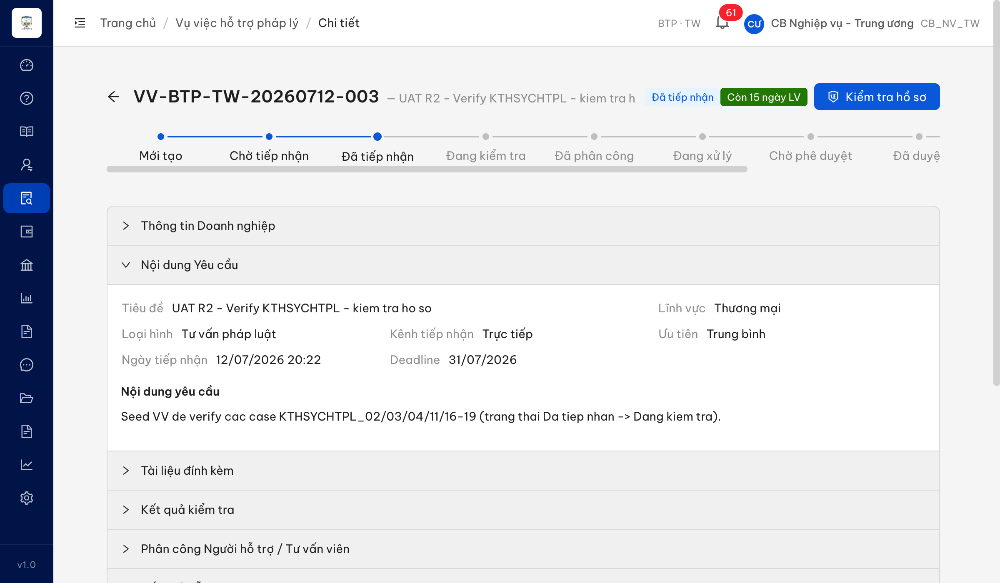

**2. Log DOM thanh tiến trình:**

```json
[{"title":"Mới tạo","state":"ant-steps-item-finish","iconOuter":"<div class=\"ant-steps-item-icon ant-wave-target\"></div>","hasCheckIcon":false},
 {"title":"Chờ tiếp nhận","state":"ant-steps-item-finish","iconOuter":"<div class=\"ant-steps-item-icon ant-wave-target\"></div>","hasCheckIcon":false},
 {"title":"Đã tiếp nhận","state":"ant-steps-item-process ant-steps-item-active","hasCheckIcon":false}]
```

*(Evidence đối tác: `../partner-evidence/KTHSYCHTPL_02.webm` frame 00m25s. Ý thứ 2 của case — "mức cảnh báo quá hạn" — tách thành bug riêng **BUG-KTHSYCHTPL_02b** ngay dưới. Chi tiết: `../reverify-audit/KTHSYCHTPL_02/condition-table.md`.)*

---

## ~~BUG-KTHSYCHTPL_02b~~ [CLOSED] — Cảnh báo thời hạn mức "Quá hạn nghiêm trọng": thẻ nhấp nháy liên tục và mờ tới mức gần như không đọc được

> **Re-test:** 2026-07-14 reverify-devfix — ✅ PASS (Closed). Verify bằng vai trò `cbnv_dp` trên danh sách Vụ việc HTPL với dữ liệu `VV-STP-AG-20260712-001/-002/-003` (ngày tiếp nhận 12/07/2026, deadline 31/07/2026) và giả lập ngày máy trạm 15/09/2026 để đạt mức 307% thời hạn đã dùng. UI hiển thị `Quá hạn 31 ngày LV`, nền đen `rgb(0, 0, 0)`, chữ trắng `rgb(255, 255, 255)`, opacity giữ `1`, `animationName=none` trong 13 mẫu đo liên tiếp/1.2s; không còn nhấp nháy và chữ không còn chìm.

### Mô tả

Cột **"Cảnh báo thời hạn"** (màn Danh sách vụ việc) hiển thị mức cảnh báo SLA bằng một thẻ màu. Ở mức **"Quá hạn nghiêm trọng"** (đã dùng > 200% thời hạn), thẻ này **tự nhấp nháy liên tục không dừng**, và ở đáy mỗi nhịp nháy thẻ mờ chỉ còn ~20% độ đậm nên **chữ trắng gần như chìm hẳn vào nền trang**, người dùng rất khó đọc. Thiết kế chỉ quy định **màu** cho 4 mức cảnh báo, **không có** hiệu ứng nhấp nháy hay làm mờ.

### Các bước tái hiện

1. Đăng nhập vai trò **CB Nghiệp vụ - Địa phương** (`cbnv_dp`).
2. Vào **Vụ việc HTPL** → xem cột **"Cảnh báo thời hạn"** của một vụ việc **chưa kết thúc** mà đã **quá hạn hơn 2 lần thời hạn cho phép** (dùng `VV-STP-AG-20260712-001` / `-002`, ngày tiếp nhận 12/07/2026, hạn 31/07/2026 — quan sát tại thời điểm đã dùng 307% thời hạn).
3. Quan sát thẻ cảnh báo trong khoảng vài giây.

> **Cách tạo tiền đề (minh bạch cho dev):** hệ thống hiện **không có bất kỳ đường nào** để tạo vụ việc quá hạn — hạn xử lý luôn do máy chủ tự tính (ngày tiếp nhận + N ngày làm việc, N ≥ 1) và **không API/màn hình nào nhận `ngayTiepNhan` hoặc `deadline`** (đã đối chiếu hợp đồng OpenAPI của chính hệ thống: `POST /vu-viecs/manual`, `POST /vu-viecs/{id}/tiep-nhan`, `PATCH /vu-viecs/{id}`, `tiep-nhan-dvc`, `tiep-nhan-he-thong` đều không có 2 trường này). Vì vậy tester **giữ nguyên bản ghi thật và hạn thật do máy chủ sinh**, chỉ **tua đồng hồ của trình duyệt** tới 15/09/2026 — đúng như khi người dùng thật mở màn hình này vào ngày đó. Mức cảnh báo được giao diện tính hoàn toàn từ giờ máy trạm, nên kết quả quan sát là kết quả thật của sản phẩm.

### Kết quả mong đợi

Theo **FR-V.I-07 (UC57)** · **SCR-V.I-01 §Mức cảnh báo thời hạn** (`srs-fr-05-vu-viec.md` dòng 1494–1501) và **BR-SLA-02** (dòng 2416):

> | Mã DB | Nhãn UI | Màu |
> | `BINH_THUONG` | Bình thường | Xanh lá |
> | `SAP_HET` | Sắp hết hạn | Vàng |
> | `QUA_HAN` | Quá hạn | Đỏ |
> | `QUA_HAN_NGHIEM_TRONG` | Quá hạn nghiêm trọng | Đen |

→ Mỗi mức chỉ được phân biệt bằng **màu tĩnh**. Thiết kế **không quy định** hiệu ứng nhấp nháy, và thẻ phải **đọc được rõ ràng** ở mọi thời điểm.

Ngoài ra dòng 1646 yêu cầu **ngưỡng các mức cảnh báo phải lấy từ cấu hình SLA** (MH-10.7 tab SLA — UC108), tức người quản trị đổi ngưỡng thì giao diện phải đổi theo.

### Kết quả thực tế

- Mức **"Quá hạn"** (đã dùng 167% thời hạn): thẻ nền **đỏ** `rgb(207,19,34)`, không nhấp nháy → **đúng thiết kế**.
- Mức **"Quá hạn nghiêm trọng"** (đã dùng 307% thời hạn): thẻ nền **đen** `rgb(0,0,0)` (màu đúng thiết kế) nhưng **được gắn thêm hiệu ứng nhấp nháy chạy vô hạn** (`animation: sla-blink 1s ease-in-out infinite`). Đo độ đậm thực tế của thẻ trong 1,2 giây: dao động **1.0 → 0.20 → 1.0** mỗi giây — tại đáy nhịp, thẻ chỉ còn ~20% độ đậm nên **chữ gần như biến mất trên nền trang**. Đây đúng là hiện tượng đối tác phản ánh.
- **Ngưỡng cảnh báo bị cố định trong giao diện** (50% / 100% / 200%) thay vì đọc từ cấu hình SLA → quản trị viên đổi "Ngưỡng cảnh báo 1/2" hay "Hệ số quá hạn" ở màn Cấu hình hệ thống thì giao diện **không thay đổi theo**, trái dòng 1646.

### Bằng chứng

**1. Thẻ ở đáy nhịp nháy — chữ chìm vào nền (`cbnv_dp`, VV-STP-AG-20260712-001/-002, 307% thời hạn):**

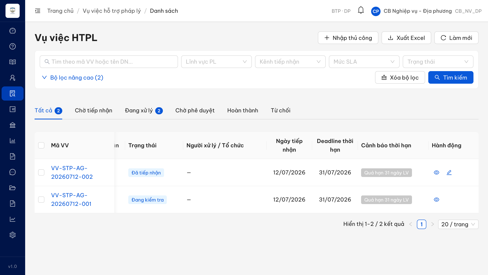

**2. Cùng thẻ đó ở pha hiện rõ (nền đen) — để đối chiếu 2 pha của cùng một hiệu ứng nhấp nháy:**

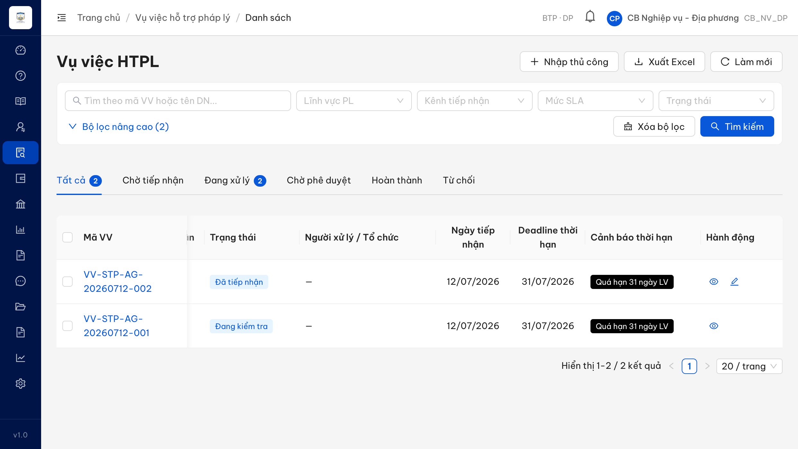

**3. Đo độ đậm (opacity) của thẻ theo thời gian — 13 mẫu cách nhau 100ms:**

```json
[{"ms":0,"opacity":0.88},{"ms":100,"opacity":1.00},{"ms":200,"opacity":0.96},{"ms":300,"opacity":0.80},
 {"ms":400,"opacity":0.53},{"ms":500,"opacity":0.30},{"ms":600,"opacity":0.20},{"ms":700,"opacity":0.24},
 {"ms":800,"opacity":0.40},{"ms":900,"opacity":0.69},{"ms":1000,"opacity":0.91},{"ms":1100,"opacity":1.00},
 {"ms":1200,"opacity":0.96}]
```

**4. Kiểu hiển thị thực tế của thẻ ở 2 mức (đọc từ trình duyệt):**

```json
{"mức 167%": {"nhãn":"Quá hạn 10 ngày LV","nền":"rgb(207,19,34)","nhấp nháy":"không"},
 "mức 307%": {"nhãn":"Quá hạn 31 ngày LV","nền":"rgb(0,0,0)","nhấp nháy":"sla-blink 1s vô hạn",
              "keyframes":"0%,100% { opacity: 1 }  50% { opacity: 0.2 }"}}
```

*(Evidence đối tác: `../partner-evidence/KTHSYCHTPL_02.webm` + ghi chú của đối tác: "cảnh báo quá hạn nhấp nháy và màu chữ gần như chìm vào nền, rất khó nhìn". Vụ việc trong evidence của đối tác là `VV-QA-R7-SLA-QHNT` — đúng mức "Quá hạn nghiêm trọng". Chi tiết: `../reverify-audit/KTHSYCHTPL_02/condition-table.md`.)*

---

## ~~BUG-KTHSYCHTPL_03~~ [CLOSED] — Nhóm 1 "Thông tin Doanh nghiệp": không hiển thị dữ liệu DN + thiếu 5/9 trường theo SRS

> **Re-test:** 2026-07-14 reverify-devfix — ✅ PASS (Closed). Nhóm "Thông tin Doanh nghiệp" đã hiển thị đủ Tên DN/MST/Địa chỉ/Tỉnh thành/Loại DN/Quy mô/Người đại diện/SĐT/Email và link chi tiết DN.

### Mô tả

Nhóm **"Thông tin Doanh nghiệp"** (Accordion 1) ở màn Chi tiết vụ việc phải hiển thị 9 trường thông tin DN (chỉ đọc) + link sang màn chi tiết DN. Thực tế nhóm này **chỉ render 5 ô**, trong đó **4 ô dữ liệu DN đều in "—"** dù doanh nghiệp liên kết đã có đủ dữ liệu trong hệ thống, và **thiếu hẳn 5 trường** SRS yêu cầu.

### Các bước tái hiện

1. Đăng nhập vai trò **CB Nghiệp vụ - Trung ương** (`cbnv_tw`) — đúng vai trò đối tác dùng khi log lỗi.
2. Chuẩn bị dữ liệu: vào **Doanh nghiệp** → mở `DN-SEED-0001` → nhập đủ **Tên DN, Mã số thuế, Địa chỉ, Người đại diện, Điện thoại, Email, Quy mô, Ngành nghề, Loại DN, Tỉnh/Thành** → **Lưu** → tải lại trang, xác nhận dữ liệu đã lưu.
3. Vào **Vụ việc HTPL** → mở chi tiết vụ việc gắn với DN đó (`VV-BTP-TW-20260712-003`, trạng thái **"Đang kiểm tra"** — trùng trạng thái đối tác).
4. Mở nhóm **"Thông tin Doanh nghiệp"**.

### Kết quả mong đợi

Theo **FR-V.I-07 (UC57)** · **SCR-V.I-03 §Thành phần màn hình row 4 — Accordion 1 "Thông tin DN"** (`srs-fr-05-vu-viec.md` dòng 1719), điều kiện hiển thị **"Luôn"**:

> "ten_doanh_nghiep, ma_so_thue, dia_chi, tinh_thanh, loai_dn, quy_mo, nguoi_dai_dien, email, SDT. **Link sang chi tiết DN (MH-07.2)**"

→ Phải hiển thị **đủ 9 trường** kèm **dữ liệu thực** của DN + link sang chi tiết DN.

### Kết quả thực tế

| Trường theo SRS | Có ô hiển thị? | Giá trị hiển thị | Dữ liệu trong hệ thống |
|---|:-:|---|---|
| Tên doanh nghiệp | ✅ | **—** | "Công ty TNHH Seed Publishable" |
| Mã số thuế | ✅ | **—** | "0100000001" |
| Địa chỉ | ✅ | **—** | "So 10 Pho Test, Quan Ba Dinh, Ha Noi" |
| Email | ✅ | **—** | "seed.publishable@test.htpldn.vn" |
| Tỉnh/Thành | ❌ **thiếu ô** | — | Hà Nội |
| Loại doanh nghiệp | ❌ **thiếu ô** | — | Công ty TNHH |
| Quy mô doanh nghiệp | ❌ **thiếu ô** | — | Siêu nhỏ |
| Người đại diện | ❌ **thiếu ô** | — | "Nguyen Van Seed" |
| Số điện thoại | ❌ **thiếu ô** | — | "0243777888" |
| Link sang chi tiết DN | ❌ **thiếu** | — | — |

- Ngoài ra nhóm còn hiển thị **1 trường KHÔNG có trong SRS**: "Người tiếp nhận".
- **Loại trừ giả thuyết "DN rỗng nên hiển thị đúng —":** danh sách Vụ việc HTPL vẫn hiện đúng cột "Tên DN" = *Công ty TNHH Seed Publishable* cho chính vụ việc này, và màn Doanh nghiệp sau reload vẫn giữ đủ dữ liệu → **dữ liệu tồn tại, chỉ màn chi tiết vụ việc không hiển thị**.

### Bằng chứng

**1. Ảnh chụp web (`cbnv_tw`, VV-BTP-TW-20260712-003 — "Đang kiểm tra"):**

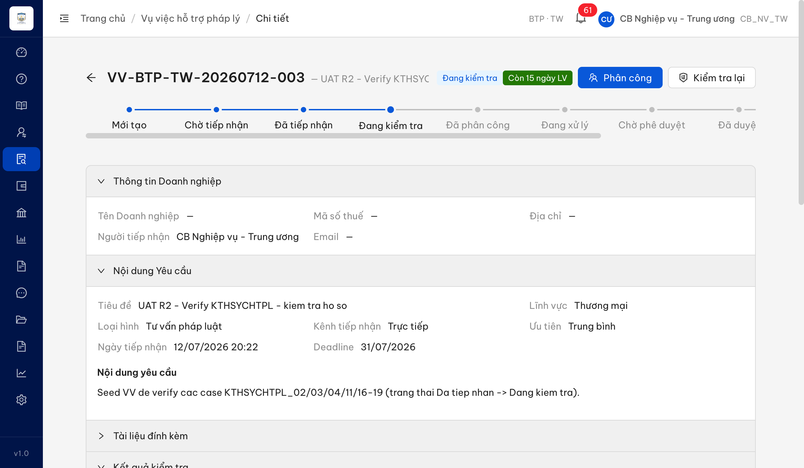

**2. Nội dung nhóm "Thông tin Doanh nghiệp" đọc từ giao diện:**

```json
{"stateNow":"Đang kiểm tra","cellCount":5,"hasLinkToDNDetail":false,
 "dnCells":[{"label":"Tên Doanh nghiệp","value":"—"},
            {"label":"Mã số thuế","value":"—"},
            {"label":"Địa chỉ","value":"—"},
            {"label":"Người tiếp nhận","value":"CB Nghiệp vụ - Trung ương"},
            {"label":"Email","value":"—"}]}
```

**3. Phản hồi API chi tiết vụ việc `GET /api/v1/vu-viecs/{id}` (200) — có `doanhNghiepId` nhưng `doanhNghiep` rỗng:**

```json
"doanhNghiepId": "5eed0010-0000-4000-8000-000000000001",
"doanhNghiep": null,
"nguoiTiepNhan": { "id": "f2e93500-…", "hoTen": "CB Nghiệp vụ - Trung ương" }
```

*(Evidence đối tác: `../partner-evidence/KTHSYCHTPL_03.webm` frame 00m22s — nhóm DN mở ra với đúng 5 ô, các giá trị đều "—". Chi tiết: `../reverify-audit/KTHSYCHTPL_03/condition-table.md`.)*

---

## BUG-KTHSYCHTPL_11 [CLOSED-VERIFIED] — Kết quả kiểm tra đã hiển thị kết luận thực, người kiểm tra và ngày kiểm tra

> **Re-test mới nhất:** 2026-07-15 rv3 — ✅ PASS (Closed-verified). Mở `VV-STP-AG-20260712-001` bằng `cbnv_dp` ở trạng thái **Đang kiểm tra**; nhóm **Kết quả kiểm tra** hiển thị đủ C01-C06 `✓`, `Kết luận: Đạt`, `Người kiểm tra: CB Nghiệp vụ - Địa phương`, `Ngày kiểm tra: 12/07/2026 20:46`; timeline có sự kiện `Kiểm tra`. Không còn placeholder `đã có dữ liệu`. Evidence: `image/rv3-KTHSYCHTPL_11-detail-ketqua-kiemtra.png`; điều kiện: `../reverify-audit/rv3-conditions/KTHSYCHTPL_11.md`.

> **Re-test:** 2026-07-14 reverify-devfix — 🔴 REOPEN. Nhóm "Kết quả kiểm tra" vẫn hiển thị bảng 6 hạng mục và dòng "Kết luận: đã có dữ liệu"; chưa hiển thị kết luận thực tế, lý do, người kiểm tra và ngày/giờ kiểm tra.

### Mô tả

Sau khi CB Nghiệp vụ kiểm tra hồ sơ (tick đủ 6 hạng mục checklist + chọn kết luận **Đạt**), nhóm **"Kết quả kiểm tra"** (Accordion 4) phải lưu và hiển thị **kết luận + lý do + người kiểm tra + ngày kiểm tra**. Thực tế nhóm này **chỉ hiển thị bảng 6 hạng mục**, còn ô kết luận in **chuỗi placeholder "đã có dữ liệu"**, và **không có người kiểm tra, không có ngày/giờ kiểm tra**.

### Các bước tái hiện

1. Đăng nhập vai trò **CB Nghiệp vụ - Địa phương** (`cbnv_dp`) — đúng vai trò đối tác dùng khi log lỗi (CB_NV_DP).
2. Vào **Vụ việc HTPL** → **"Nhập thủ công"** → chọn DN `DN-AGG-0001` → lưu & tiếp nhận (vụ việc `VV-STP-AG-20260712-001`, trạng thái "Đã tiếp nhận").
3. Bấm **[Kiểm tra hồ sơ]** → tick **đủ 6/6 hạng mục = Đạt** → chọn kết luận **"Đạt — chuyển sang phân công"** → **[Xác nhận]**.
4. Vụ việc chuyển sang trạng thái **"Đang kiểm tra"** (trùng trạng thái đối tác). Mở nhóm **"Kết quả kiểm tra"**.

### Kết quả mong đợi

Theo **FR-V.I-06 (UC56)** · **SCR-V.I-03 §Thành phần màn hình row 7 — Accordion 4 "Kết quả Kiểm tra"** (`srs-fr-05-vu-viec.md` dòng 1722):

> "Checklist 6 hạng mục (ĐẠT/KHÔNG_ĐẠT) từ UC106 + **kết luận** + **lý do** + **người kiểm tra** + **ngày**"

Kết quả mong đợi của chính test case cũng ghi: *"Ghi người kiểm tra và thời điểm kiểm tra"*.

### Kết quả thực tế

| Thông tin SRS yêu cầu | Hiển thị trên web |
|---|---|
| Checklist 6 hạng mục | ✅ Có — C01→C06 đều ✓ Đạt |
| **Kết luận** (Đạt / Không đạt / Yêu cầu bổ sung) | ❌ In chuỗi **"Kết luận: đã có dữ liệu"** — không phải kết luận thực |
| **Lý do** | ❌ Không có |
| **Người kiểm tra** | ❌ **Không có** |
| **Ngày kiểm tra** | ❌ **Không có** |

- Chuỗi *"đã có dữ liệu"* là **chuỗi mặc định/placeholder** lọt ra giao diện, không mang thông tin nghiệp vụ nào cho cán bộ.

### Bằng chứng

**1. Ảnh chụp web (`cbnv_dp`, VV-STP-AG-20260712-001 — "Đang kiểm tra", đã tick đủ 6/6 hạng mục):**

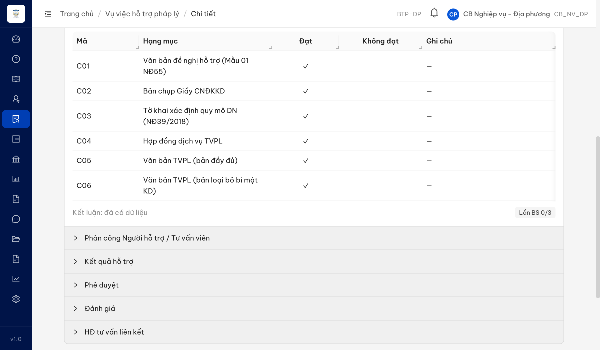

**2. Nội dung nhóm "Kết quả kiểm tra" đọc từ giao diện:**

```
C01  Văn bản đề nghị hỗ trợ (Mẫu 01 NĐ55)      ✓   —
C02  Bản chụp Giấy CNĐKKD                       ✓   —
C03  Tờ khai xác định quy mô DN (NĐ39/2018)     ✓   —
C04  Hợp đồng dịch vụ TVPL                      ✓   —
C05  Văn bản TVPL (bản đầy đủ)                  ✓   —
C06  Văn bản TVPL (bản loại bỏ bí mật KD)       ✓   —
Kết luận: đã có dữ liệu                             Lần BS 0/3
```

*(Evidence đối tác: `../partner-evidence/KTHSYCHTPL_11.jpg` — VV-QA-R7-SLA-QHNT, "Đang kiểm tra", tài khoản CB_NV_DP. Ý còn lại của case — "không có nút Hoàn tất kiểm tra, chỉ có Kiểm tra lại" — **tách sang BA confirm** vì SRS tự mâu thuẫn giữa dòng 1736 và dòng 2280; xem `../ba-confirmation-needed-week-2.md`. Chi tiết: `../reverify-audit/KTHSYCHTPL_11/condition-table.md`.)*

---

## ~~BUG-KTHSYCHTPL_15~~ [CLOSED] — Cán bộ khác đơn vị kiểm tra hồ sơ: thông báo từ chối sai vai trò ("người phê duyệt") + hiển thị lặp 2 lần

> **Re-test:** 2026-07-15 R2-reverify — ✅ PASS (Closed). `cbnv_tw` (khác đơn vị) bấm Kiểm tra hồ sơ trên VV-STP-AG-20260712-002 (An Giang), 6/6 Đạt → Xác nhận: hệ thống chặn đúng (giữ "Đã tiếp nhận") + thông báo nay là **"Bạn không có quyền kiểm tra vụ việc của đơn vị khác"** (đúng thao tác, tiếng Việt thuần) và **chỉ hiện 1 lần** (đếm bằng MutationObserver). Sửa cả 3 điểm: nội dung/vai trò + bỏ jargon + hết lặp.

### Mô tả

Khi Cán bộ Nghiệp vụ **không cùng đơn vị** với hồ sơ bấm kiểm tra hồ sơ, hệ thống **chặn đúng** (vụ việc giữ nguyên trạng thái) — phần này ĐẠT. Nhưng **nội dung thông báo từ chối sai**: hệ thống báo *"Đơn vị của **người phê duyệt** khác đơn vị của **bản ghi**"*, trong khi thao tác đang thực hiện là **kiểm tra hồ sơ** của **Cán bộ Nghiệp vụ** (không có bước phê duyệt nào). Thông báo còn **hiển thị lặp 2 lần** cho 1 lần thao tác.

### Các bước tái hiện

1. Đăng nhập **CB Nghiệp vụ - Địa phương** (`cbnv_dp`, Sở Tư pháp An Giang) → **Vụ việc HTPL** → **"Nhập thủ công"** → chọn DN `DN-AGG-0001` → **Lưu & Tiếp nhận** → tạo được `VV-STP-AG-20260712-002` (trạng thái "Đã tiếp nhận", thuộc đơn vị An Giang).
2. Đăng xuất, đăng nhập **CB Nghiệp vụ - Trung ương** (`cbnv_tw`) — **khác đơn vị** với hồ sơ trên (đúng vai trò đối tác dùng khi log lỗi: CB_NV_TW).
3. Mở chi tiết chính vụ việc `VV-STP-AG-20260712-002` → bấm **[Kiểm tra hồ sơ]** (nút vẫn hiển thị).
4. Tick đủ **6/6 hạng mục = Đạt** → chọn kết luận **"Đạt — chuyển sang phân công"** → bấm **[Xác nhận]** **đúng 1 lần**.

### Kết quả mong đợi

Theo **FR-V.I-06 (UC56)**:

- §Processing bước 1 (`srs-fr-05-vu-viec.md` dòng 533): "Kiểm tra quyền + **phân quyền theo đơn vị**" (BR-AUTH-01) → hệ thống phải **từ chối** thao tác. ✅ Web làm đúng.
- §**Thông báo người dùng chung** của module (`srs-fr-05-vu-viec.md` dòng 1577): *"Không có quyền truy cập | Toast error | **'Bạn không có quyền thực hiện thao tác này'**"*. Các chức năng khác cùng module đều theo mẫu **nêu rõ người dùng + hành động bị chặn** — ví dụ dòng 773 (ERR-PC-05): *"Bạn không có quyền phân công VV của đơn vị khác"*.

→ Thông báo phải cho cán bộ biết **họ không có quyền kiểm tra vụ việc của đơn vị khác**, bằng tiếng Việt thuần, và **hiển thị 1 lần**.

### Kết quả thực tế

| Điểm | Thực tế |
|---|---|
| Hệ thống có chặn không? | ✅ **Có** — vụ việc giữ nguyên "Đã tiếp nhận", không chuyển trạng thái |
| Nội dung thông báo | ❌ *"Đơn vị của **người phê duyệt** khác đơn vị của **bản ghi**"* |
| Sai vai trò | ❌ Gọi người thao tác là **"người phê duyệt"** — thực tế là **Cán bộ Nghiệp vụ đang kiểm tra hồ sơ** |
| Từ ngữ | ❌ Dùng từ kỹ thuật **"bản ghi"** (trái quy ước "tiếng Việt thuần, không jargon" — `srs-fr-02-hoi-dap.md` dòng 21) |
| Số lần hiển thị | ❌ **Lặp 2 lần** cho 1 lần bấm Xác nhận (trùng pattern `BUG-CNTTTVV_06`) |

### Bằng chứng

**1. Ảnh chụp web (`cbnv_tw` thao tác trên vụ việc của đơn vị An Giang — 2 thông báo từ 1 lần bấm):**

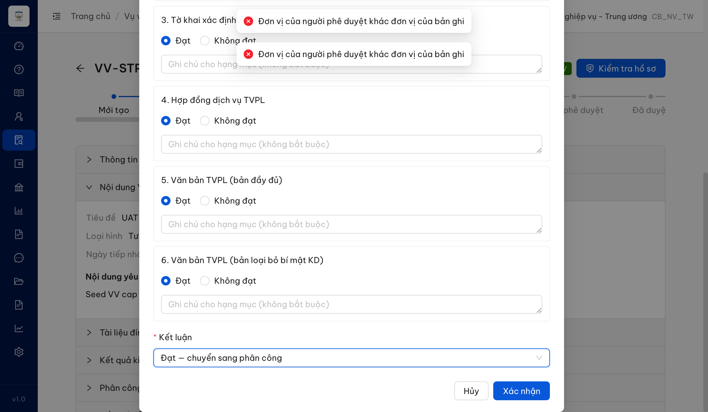

**2. Log thông báo bắt bằng MutationObserver (cài TRƯỚC khi bấm, bấm Xác nhận đúng 1 lần):**

```json
{"toastCountFromOneClick": 2,
 "toasts": ["Đơn vị của người phê duyệt khác đơn vị của bản ghi",
            "Đơn vị của người phê duyệt khác đơn vị của bản ghi"],
 "stateAfter": "Đã tiếp nhận"}
```

**3. Thông tin thêm giúp dev khoanh vùng:** cùng câu thông báo này (`ERR-AUTH-VPD-00-03`) còn xuất hiện ở **các thao tác hoàn toàn không liên quan tới phê duyệt** — ví dụ khi gọi mở lại vụ việc hoặc cập nhật vụ việc của đơn vị khác. Tức là hệ thống đang dùng **chung một câu từ chối "người phê duyệt"** cho mọi thao tác bị chặn vì lệch đơn vị, thay vì câu phù hợp với từng thao tác.

*(Evidence đối tác: `../partner-evidence/KTHSYCHTPL_15.jpg` — cũng thấy rõ **2 thông báo** cùng nội dung. Chi tiết: `../reverify-audit/KTHSYCHTPL_15/condition-table.md`.)*

---

## ~~BUG-KTHSYCHTPL_16~~ [CLOSED] — Màn Chi tiết vụ việc hiển thị TẤT CẢ các nhóm ở mọi trạng thái (bỏ qua điều kiện hiển thị theo trạng thái)

> **Re-test:** 2026-07-15 R2-reverify — ✅ PASS (Closed). Nhóm 5 "Phân công" ẩn đúng ở VV "Đã tiếp nhận" (VV-STP-AG-20260712-002 chỉ render 4 nhóm: TT Doanh nghiệp / Nội dung YC / Tài liệu / HĐ tư vấn) và hiện đúng khi VV "Đang xử lý" (VV-STP-AG-20260712-003, đã qua Đã phân công). Fix đã áp điều kiện hiển thị theo trạng thái.

> **Gốc chung của 4 bug:** `BUG-KTHSYCHTPL_16` (Nhóm 5 — Phân công) · `BUG-KTHSYCHTPL_17` (Nhóm 6 — Kết quả hỗ trợ) · `BUG-KTHSYCHTPL_18` (Nhóm 7 — Phê duyệt) · `BUG-KTHSYCHTPL_19` (Nhóm 8 — Đánh giá). Cùng 1 nguyên nhân, fix 1 lần là đóng cả 4.

### Mô tả

SRS quy định 4 nhóm cuối của màn Chi tiết vụ việc **chỉ hiển thị khi vụ việc đã đạt trạng thái tương ứng**. Thực tế màn chi tiết **render tất cả các nhóm ở mọi trạng thái** — vụ việc vừa "Đã tiếp nhận" (chưa phân công, chưa xử lý, chưa duyệt, chưa đánh giá) vẫn hiện đủ Nhóm 5/6/7/8 với nội dung rỗng ("Chưa có thông tin").

### Các bước tái hiện

1. Đăng nhập vai trò **CB Nghiệp vụ - Địa phương** (`cbnv_dp`) — đúng vai trò đối tác dùng khi log lỗi (CB_NV_DP).
2. Vào **Vụ việc HTPL** → **"Nhập thủ công"** → chọn DN `DN-AGG-0001` → **Lưu & Tiếp nhận** → tạo `VV-STP-AG-20260712-002` (trạng thái **"Đã tiếp nhận"**).
3. Mở chi tiết vụ việc đó → quan sát danh sách các nhóm hiển thị.

### Kết quả mong đợi

Theo **FR-V.I-07 (UC57)** · **SCR-V.I-03 §Thành phần màn hình**, cột **"Điều kiện hiển thị"** (`srs-fr-05-vu-viec.md`):

| Nhóm | SRS dòng | Điều kiện hiển thị theo SRS | TC |
|---|:-:|---|---|
| Nhóm 5 — Phân công xử lý | 1723 | Khi VV **đã qua DA_PHAN_CONG** ("Đã phân công") | KTHSYCHTPL_16 |
| Nhóm 6 — Kết quả Hỗ trợ | 1724 | Khi VV **đã qua DANG_XU_LY** ("Đang xử lý") | KTHSYCHTPL_17 |
| Nhóm 7 — Phê duyệt | 1725 | Khi VV **đã qua CHO_PHE_DUYET** ("Chờ phê duyệt") | KTHSYCHTPL_18 |
| Nhóm 8 — Đánh giá | 1726 | Khi VV **ở HOAN_THANH hoặc DA_DANH_GIA** | KTHSYCHTPL_19 |

→ Vụ việc ở "Đã tiếp nhận" **chưa đạt bất kỳ trạng thái nào** trong 4 điều kiện trên ⇒ cả 4 nhóm **phải ẩn**.

### Kết quả thực tế

Vụ việc ở **"Đã tiếp nhận"** vẫn render **đủ 4 nhóm**:

| Nhóm | Hiển thị? | Nội dung thực tế |
|---|:-:|---|
| Nhóm 5 — "Phân công Người hỗ trợ / Tư vấn viên" | ❌ **Có hiện** | Bảng "Lĩnh vực / Đơn vị quản lý / NHT-TVV phụ trách" (giá trị "—") + bảng Tư vấn viên rỗng |
| Nhóm 6 — "Kết quả hỗ trợ" | ❌ **Có hiện** | "Chưa có kết quả hỗ trợ" |
| Nhóm 7 — "Phê duyệt" | ❌ **Có hiện** | "Chưa có thông tin" |
| Nhóm 8 — "Đánh giá" | ❌ **Có hiện** | "Chưa có thông tin" |

**Quan sát bổ sung (cùng gốc, đối tác chưa log):**
- Nhóm **"Kết quả kiểm tra"** (Accordion 4, SRS dòng 1722 — điều kiện "Khi VV đã qua DANG_KIEM_TRA") **cũng hiển thị** ở trạng thái "Đã tiếp nhận" → cùng lỗi bỏ qua điều kiện hiển thị.
- Màn còn có nhóm **"HĐ tư vấn liên kết"** không nằm trong 8 nhóm SRS quy định cho SCR-V.I-03.

### Bằng chứng

**1. Ảnh chụp toàn trang (`cbnv_dp`, VV-STP-AG-20260712-002 — "Đã tiếp nhận"):**

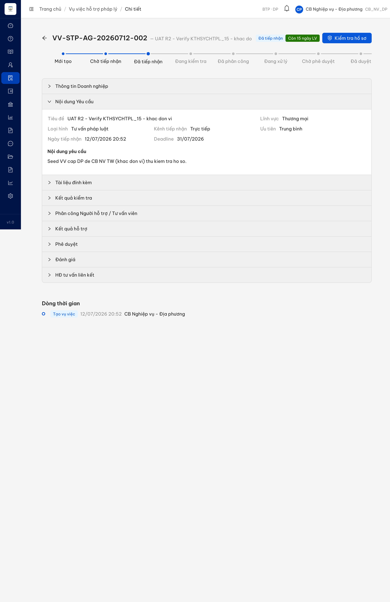

**2. Danh sách nhóm render thực tế + nội dung 4 nhóm tranh chấp:**

```json
{"role":"CB_NV_DP","maVV":"VV-STP-AG-20260712-002","state":"Đã tiếp nhận",
 "accordionsRendered":["Thông tin Doanh nghiệp","Nội dung Yêu cầu","Tài liệu đính kèm","Kết quả kiểm tra",
   "Phân công Người hỗ trợ / Tư vấn viên","Kết quả hỗ trợ","Phê duyệt","Đánh giá","HĐ tư vấn liên kết"],
 "disputedGroups":{
   "Phân công Người hỗ trợ / Tư vấn viên":"Lĩnh vực | Thương mại | Đơn vị quản lý | — | NHT/TVV phụ trách | —",
   "Kết quả hỗ trợ":"Chưa có kết quả hỗ trợ",
   "Phê duyệt":"Chưa có thông tin",
   "Đánh giá":"Chưa có thông tin"}}
```

*(Evidence đối tác: `../partner-evidence/KTHSYCHTPL_16.jpg`, `_17.jpg`, `_18.jpg`, `_19.jpg` — cùng vụ việc VV-STP-AG-20260709-001 ở "Đã tiếp nhận", tài khoản CB_NV_DP. **Lưu ý:** `KTHSYCHTPL_18.jpg` và `KTHSYCHTPL_19.jpg` là **cùng một ảnh** (trùng MD5 `419907519bb4ae3b58ad0c54deaa2c36`) — ảnh này thấy rõ cả nhóm "Phê duyệt" lẫn nhóm "Đánh giá" nên vẫn đủ căn cứ cho cả 2 case. Chi tiết: `../reverify-audit/KTHSYCHTPL_16/` … `_19/condition-table.md`.)*

---

## ~~BUG-KTHSYCHTPL_17~~ [CLOSED] — Nhóm 6 "Kết quả hỗ trợ" hiển thị khi vụ việc chưa qua "Đang xử lý"

> **Re-test:** 2026-07-15 R2-reverify — ✅ PASS (Closed). Nhóm 6 "Kết quả hỗ trợ" ẩn đúng ở VV "Đã tiếp nhận" (VV-STP-AG-20260712-002) và hiện đúng khi VV đã qua "Đang xử lý" (VV-STP-AG-20260712-003). Fix áp điều kiện hiển thị theo trạng thái.

### Mô tả

Nhóm **"Kết quả hỗ trợ"** hiển thị trên màn Chi tiết vụ việc ngay cả khi vụ việc **chưa qua trạng thái "Đang xử lý"**. **Cùng nguyên nhân gốc với `BUG-KTHSYCHTPL_16`** (màn chi tiết bỏ qua điều kiện hiển thị theo trạng thái) — fix chung 1 lần.

### Các bước tái hiện

Như `BUG-KTHSYCHTPL_16` (đăng nhập `cbnv_dp` → tạo `VV-STP-AG-20260712-002` ở trạng thái "Đã tiếp nhận" → mở chi tiết).

### Kết quả mong đợi

**FR-V.I-07 (UC57)** · **SCR-V.I-03 §Thành phần màn hình row 9 — Accordion 6 "Kết quả Hỗ trợ"** (`srs-fr-05-vu-viec.md` dòng **1724**), cột "Điều kiện hiển thị": **"Khi VV đã qua DANG_XU_LY"** → vụ việc ở "Đã tiếp nhận" thì nhóm này phải **ẩn**.

### Kết quả thực tế

Nhóm **"Kết quả hỗ trợ"** vẫn hiển thị, nội dung **"Chưa có kết quả hỗ trợ"**.

### Bằng chứng


*(Evidence đối tác: `../partner-evidence/KTHSYCHTPL_17.jpg`. Chi tiết: `../reverify-audit/KTHSYCHTPL_17/condition-table.md`.)*

---

## ~~BUG-KTHSYCHTPL_18~~ [CLOSED] — Nhóm 7 "Phê duyệt" hiển thị khi vụ việc chưa qua "Chờ phê duyệt"

> **Re-test:** 2026-07-15 R2-reverify — ✅ PASS (Closed). Nhóm 7 "Phê duyệt" ẩn đúng ở VV "Đã tiếp nhận" (VV-STP-AG-20260712-002) và vẫn ẩn ở VV "Đang xử lý" (VV-STP-AG-20260712-003) vì chưa qua "Chờ phê duyệt". Fix áp điều kiện hiển thị theo trạng thái.

### Mô tả

Nhóm **"Phê duyệt"** hiển thị trên màn Chi tiết vụ việc ngay cả khi vụ việc **chưa qua trạng thái "Chờ phê duyệt"**. **Cùng nguyên nhân gốc với `BUG-KTHSYCHTPL_16`** — fix chung 1 lần.

### Các bước tái hiện

Như `BUG-KTHSYCHTPL_16` (đăng nhập `cbnv_dp` → tạo `VV-STP-AG-20260712-002` ở trạng thái "Đã tiếp nhận" → mở chi tiết).

### Kết quả mong đợi

**FR-V.I-07 (UC57)** · **SCR-V.I-03 §Thành phần màn hình row 10 — Accordion 7 "Phê duyệt"** (`srs-fr-05-vu-viec.md` dòng **1725**), cột "Điều kiện hiển thị": **"Khi VV đã qua CHO_PHE_DUYET"** → vụ việc ở "Đã tiếp nhận" thì nhóm này phải **ẩn**.

### Kết quả thực tế

Nhóm **"Phê duyệt"** vẫn hiển thị, nội dung **"Chưa có thông tin"**.

### Bằng chứng


*(Evidence đối tác: `../partner-evidence/KTHSYCHTPL_18.jpg` — **trùng mã băm MD5 với `KTHSYCHTPL_19.jpg`** (cùng 1 ảnh cho 2 case); ảnh thấy rõ cả nhóm "Phê duyệt" lẫn "Đánh giá". Chi tiết: `../reverify-audit/KTHSYCHTPL_18/condition-table.md`.)*

---

## ~~BUG-KTHSYCHTPL_19~~ [CLOSED] — Nhóm 8 "Đánh giá" hiển thị khi vụ việc chưa ở "Hoàn thành"/"Đã đánh giá"

> **Re-test:** 2026-07-15 R2-reverify — ✅ PASS (Closed). Nhóm 8 "Đánh giá" ẩn đúng ở VV "Đã tiếp nhận" (VV-STP-AG-20260712-002) và vẫn ẩn ở VV "Đang xử lý" (VV-STP-AG-20260712-003) vì chưa ở "Hoàn thành"/"Đã đánh giá". Fix áp điều kiện hiển thị theo trạng thái.

### Mô tả

Nhóm **"Đánh giá"** hiển thị trên màn Chi tiết vụ việc ngay cả khi vụ việc **chưa ở trạng thái "Hoàn thành" hoặc "Đã đánh giá"**. **Cùng nguyên nhân gốc với `BUG-KTHSYCHTPL_16`** — fix chung 1 lần.

### Các bước tái hiện

Như `BUG-KTHSYCHTPL_16` (đăng nhập `cbnv_dp` → tạo `VV-STP-AG-20260712-002` ở trạng thái "Đã tiếp nhận" → mở chi tiết).

### Kết quả mong đợi

**FR-V.I-07 (UC57)** · **SCR-V.I-03 §Thành phần màn hình row 11 — Accordion 8 "Đánh giá"** (`srs-fr-05-vu-viec.md` dòng **1726**), cột "Điều kiện hiển thị": **"Khi VV ở HOAN_THANH hoặc DA_DANH_GIA"** → vụ việc ở "Đã tiếp nhận" thì nhóm này phải **ẩn**.

### Kết quả thực tế

Nhóm **"Đánh giá"** vẫn hiển thị, nội dung **"Chưa có thông tin"**.

### Bằng chứng


*(Evidence đối tác: `../partner-evidence/KTHSYCHTPL_19.jpg` — **trùng mã băm MD5 với `KTHSYCHTPL_18.jpg`**. Chi tiết: `../reverify-audit/KTHSYCHTPL_19/condition-table.md`.)*

---

## ~~BUG-QLHSVV_02~~ [CLOSED] — Danh sách vụ việc: trạng thái "Đang kiểm tra" và "Đang xử lý" không có nút Sửa

> **Re-test:** 2026-07-15 R2-reverify — ✅ PASS (Closed). `cbnv_dp` màn Danh sách: VV "Đang kiểm tra" (VV-...-001) và "Đang xử lý" (VV-...-003) nay đều có nút ✏ Sửa ở cột Hành động. Click Sửa VV-001 → mở form `?mode=edit` sửa được (6 input + 2 dropdown + Lưu). Hết chặn rộng hơn SRS.

### Mô tả

Trên màn **Danh sách Vụ việc HTPL**, cột "Hành động" của vụ việc ở trạng thái **"Đang kiểm tra"** và **"Đang xử lý"** chỉ hiển thị nút **👁 Xem**, **KHÔNG có nút ✏ Sửa**. Cán bộ Nghiệp vụ do đó không chỉnh sửa được hồ sơ ở 2 trạng thái này, dù SRS quy định chỉ cấm chỉnh sửa khi vụ việc đã ở "Hoàn thành" hoặc "Đã đánh giá".

### Các bước tái hiện

1. Đăng nhập `cbnv_dp` (CB Nghiệp vụ - Địa phương, Sở Tư pháp An Giang).
2. Mở menu **Vụ việc HTPL** → màn Danh sách.
3. Quan sát cột "Hành động" của các dòng theo từng trạng thái:
   - `VV-STP-AG-20260712-002` — "Đã tiếp nhận"
   - `VV-STP-AG-20260712-001` — "Đang kiểm tra"
   - `VV-STP-AG-20260712-003` — "Đang xử lý" (seed: tạo VV → Kiểm tra hồ sơ kết luận Đạt → Phân công NHT → NHT chấp nhận)

### Kết quả mong đợi

- **FR-V.I-07 (UC57) §Processing bước 2** (`srs-fr-05-vu-viec.md` dòng **593**): *"Kiểm tra trạng thái cho phép sửa (**NOT HOAN_THANH, DA_DANH_GIA**)"* → "Đang kiểm tra" và "Đang xử lý" **phải cho phép chỉnh sửa**.
- **SCR-V.I-01 §Thành phần màn hình #21** (dòng **1631**), cột "Hành động": *"👁 Xem → MH-05.3 / ✏ Sửa → MH-05.2 / 🗑 Xóa"* — Điều kiện hiển thị: **"Luôn"**.
- **FR-V.I-07 §Error Handling E1** (dòng **620**): chỉ chặn với ERR-VV-02 *"Không thể chỉnh sửa vụ việc đã hoàn thành"*.

### Kết quả thực tế

| Mã VV | Trạng thái | Nút ở cột "Hành động" |
|---|---|---|
| VV-STP-AG-20260712-002 | Đã tiếp nhận | 👁 Xem + ✏ Sửa |
| VV-STP-AG-20260712-001 | **Đang kiểm tra** | **chỉ 👁 Xem** |
| VV-STP-AG-20260712-003 | **Đang xử lý** | **chỉ 👁 Xem** |

Web đang chặn chỉnh sửa **rộng hơn** SRS: chặn thêm 2 trạng thái mà SRS cho phép.

### Bằng chứng

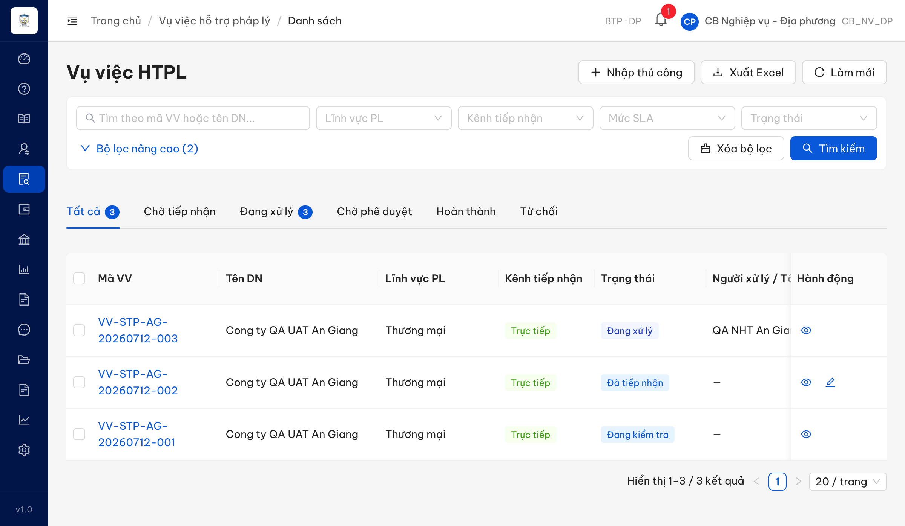

*(Evidence đối tác gắn ở dòng 102 là `../partner-evidence/QLHSVV_01.jpg` — đối tác gắn **nhầm file của TC khác** (ảnh chụp màn Chi tiết `VV-HDSD-003` trạng thái "Hoàn thành"), không chứa khoảnh khắc lỗi. Verdict dựa trên test thật do QA tự chạy đúng vai trò CB_NV_DP + đủ 2 trạng thái đối tác nêu. Chi tiết: `../reverify-audit/QLHSVV_02/condition-table.md`.)*

---

## ~~BUG-QLHSVV_03~~ [CLOSED] — Biểu mẫu Sửa vụ việc: Lĩnh vực + Loại hình bị khóa, thiếu hẳn trường Ghi chú

> **Re-test:** 2026-07-15 R2-reverify — ✅ PASS (Closed). Form Sửa `cbnv_tw` VV-BTP-TW-20260712-005 ("Đã tiếp nhận") nay có: **Lĩnh vực** = dropdown (13 option, chọn được), **Loại hình** = dropdown, **Ghi chú** = textbox (counter 0/2000). Chạy full flow: nhập Ghi chú → Lưu → toast "Cập nhật vụ việc thành công" → reload giữ nguyên giá trị (BE persist OK).

### Mô tả

Ở chế độ **Sửa** vụ việc (`/vu-viec/{id}?mode=edit`), Nhóm 2 **"Nội dung Yêu cầu"** chỉ cho nhập **3 trường**: Tiêu đề, Nội dung yêu cầu, Vướng mắc. **Lĩnh vực** và **Loại hình** hiển thị dạng **chữ tĩnh** (không phải danh sách chọn) → không sửa được. Trường **Ghi chú KHÔNG tồn tại** trong biểu mẫu.

### Các bước tái hiện

1. Đăng nhập `cbnv_tw` (CB Nghiệp vụ - Trung ương).
2. Mở **Vụ việc HTPL** → danh sách → bấm **✏ Sửa** ở dòng `VV-BTP-TW-20260712-006` (trạng thái "Đã tiếp nhận", đã có sẵn Lĩnh vực "Thương mại" + Loại hình "Tư vấn pháp luật").
3. Quan sát các trường của Nhóm 2 "Nội dung Yêu cầu".

### Kết quả mong đợi

- **FR-V.I-07 (UC57) §Inputs** (`srs-fr-05-vu-viec.md` dòng **586**): `ghi_chu` là **trường nhập hợp lệ** của chức năng chỉnh sửa vụ việc → phải sửa được.
- **SCR-V.I-01 §Thành phần #21** (dòng **1631**): nút **"✏ Sửa → MH-05.2"** ⇒ mở biểu mẫu MH-05.2.
- **SCR-V.I-02 §Thành phần #21/#22/#24** (dòng **1673-1676**): `linh_vuc_id` (Dropdown, **Bắt buộc**), `loai_hinh_ht_id` (Dropdown, **Bắt buộc**), `ghi_chu` (Textarea) đều là trường nhập → cả 3 trường phải sửa được.

### Kết quả thực tế

Chỉ 3 ô nhập: `tieuDe`, `moTa` (Nội dung yêu cầu), `vuViecVuongMac` (Vướng mắc).

| Trường (theo SRS phải sửa được) | Thực tế web |
|---|---|
| Lĩnh vực pháp luật | Chữ tĩnh "Thương mại" — **không có dropdown** |
| Loại hình hỗ trợ | Chữ tĩnh "Tư vấn pháp luật" — **không có dropdown** |
| Ghi chú | **Không tồn tại trong biểu mẫu** |

### Bằng chứng

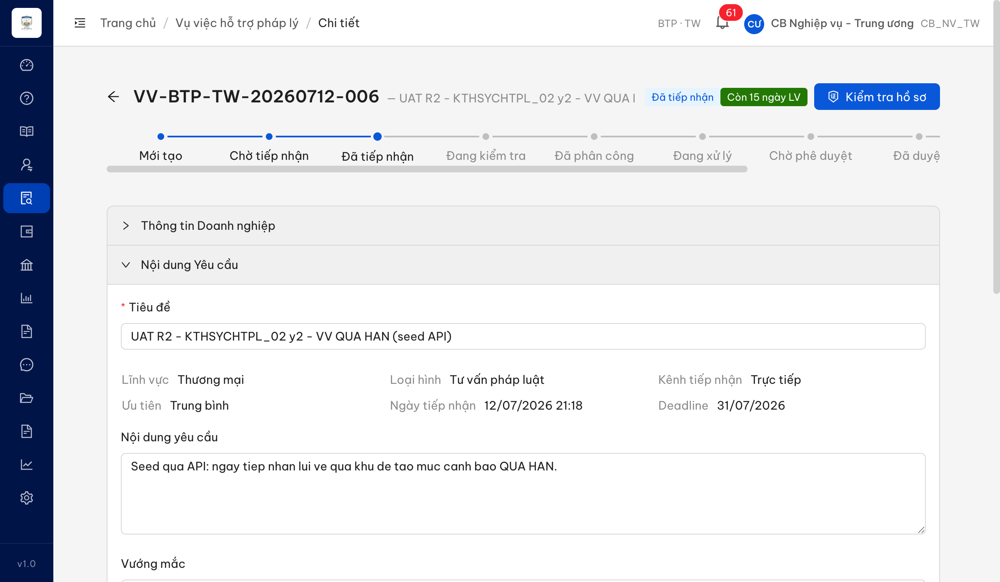

*(Evidence đối tác: `../partner-evidence/QLHSVV_03.jpg` — khớp hoàn toàn (cùng vai trò CB_NV_TW, cùng 3 ô nhập). Chi tiết: `../reverify-audit/QLHSVV_03/condition-table.md`. SRS chưa thống nhất phạm vi trường được sửa giữa FR-V.I-07 §Inputs và SCR-V.I-01 #21 → đã ghi `ba-confirmation-needed-week-2.md`.)*

---

## ~~BUG-QLHSVV_05~~ [CLOSED] — Nhóm "Tài liệu đính kèm" không có nút [+ Thêm tài liệu] → không upload được tài liệu bổ sung

> **Re-test:** 2026-07-15 R2-reverify — ✅ PASS (Closed). `cbnv_tw` VV-BTP-TW-20260712-005 ("Đã tiếp nhận") nay có nút **[+ Thêm tài liệu]** → mở dialog "Thêm tài liệu bổ sung" (file input + kéo-thả + rule ≤10 tệp/≤20MB). Chạy full flow: chọn tệp PNG → Tải lên → toast **"Đã tải lên 1 tệp"** → tệp vào bảng (BO_SUNG, quét virus "Sạch"). BE persist thật.

### Mô tả

Trên màn **Chi tiết vụ việc**, nhóm **"Tài liệu đính kèm"** chỉ hiển thị bảng danh sách (Tên tài liệu · Loại · Định dạng · Kích thước · Trạng thái quét · Ngày tải) và trạng thái rỗng *"Chưa có tài liệu"*. **KHÔNG có nút [+ Thêm tài liệu]**, không có vùng kéo-thả / chọn tệp (`input[type=file]` = 0), kể cả khi vụ việc đang ở trạng thái cho phép sửa. Cán bộ Nghiệp vụ không có đường nào để upload tài liệu bổ sung.

### Các bước tái hiện

1. Đăng nhập `cbnv_tw` (CB Nghiệp vụ - Trung ương).
2. Mở **Vụ việc HTPL** → `VV-BTP-TW-20260712-006` (trạng thái **"Đã tiếp nhận"** — trạng thái cho phép sửa).
3. Mở nhóm **"Tài liệu đính kèm"**. Thử ở **cả 2 chế độ**: chế độ sửa (`?mode=edit`) và chế độ xem.

### Kết quả mong đợi

- **SCR-V.I-03 §Thành phần màn hình #6 — Accordion 3 "Tài liệu Đính kèm"** (`srs-fr-05-vu-viec.md` dòng **1721**): *"Danh sách file: ... nút [Xem] [Tải]. **Nút [+ Thêm tài liệu]**"* — Điều kiện hiển thị: *"Luôn. **[+ Thêm] chỉ khi trạng thái cho phép sửa**"*.
- **FR-V.I-07 (UC57)**: §Inputs dòng **585** — trường `file_bo_sung` (FILE[], *"Upload tài liệu bổ sung"*); §Processing bước 4 dòng **595** — *"Lưu tài liệu bổ sung"*; §AC dòng **625** — *"Given CB NV chỉnh sửa When upload tài liệu bổ sung Then validate + lưu, ghi audit"*.
- Theo kỳ vọng của case: sau khi chọn tệp hợp lệ → thông báo *"Đã tải lên {số tệp} tệp"*.

### Kết quả thực tế

| Chế độ | Nút [+ Thêm tài liệu] | Vùng upload | `input[type=file]` |
|---|---|---|---|
| Sửa (`?mode=edit`) | **Không có** | Không có | 0 |
| Xem | **Không có** | Không có | 0 |

Toàn màn chỉ có 3 nút: [Kiểm tra hồ sơ] [Lưu] [Hủy]. Chức năng upload tài liệu bổ sung **chưa được hiện thực** → không kiểm tra được thông báo *"Đã tải lên {số tệp} tệp"*.

### Bằng chứng

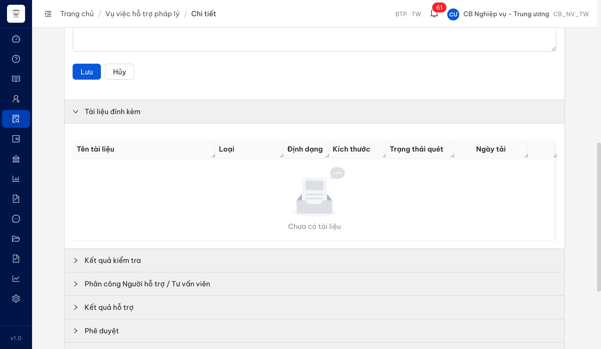

*(Evidence đối tác: `../partner-evidence/QLHSVV_05.jpg` — khớp hoàn toàn (cùng vai trò CB_NV_TW, cùng chế độ `?mode=edit`, cùng bảng rỗng không nút thêm). Chi tiết: `../reverify-audit/QLHSVV_05/condition-table.md`.)*

---

## ~~BUG-TKHSYCHTPL_06~~ [CLOSED] — Tìm kiếm không có kết quả: hiển thị "Trống" thay vì "Không tìm thấy hồ sơ phù hợp"

> **Re-test:** 2026-07-15 R2-reverify — ✅ PASS (Closed). `cbnv_tw` tìm `ZZZKHONGTONTAI999` → 0 kết quả: vùng rỗng nay hiển thị mô tả **"Không tìm thấy hồ sơ phù hợp"** (đúng INF-VV-TK-01); "Trống" chỉ còn là alt-text ảnh minh họa.

### Mô tả

Khi tìm kiếm vụ việc **không ra kết quả**, vùng danh sách chỉ hiển thị icon rỗng + chữ **"Trống"**. Người dùng dễ hiểu nhầm là hệ thống **chưa có dữ liệu**, thay vì hiểu là **không có hồ sơ khớp tiêu chí tìm kiếm** (thực tế hệ thống vẫn có 17 vụ việc khi bỏ bộ lọc).

### Các bước tái hiện

1. Đăng nhập `cbnv_tw` (CB Nghiệp vụ - Trung ương).
2. Mở **Vụ việc HTPL** → danh sách (không lọc: **17 kết quả**).
3. Áp bộ lọc để ra 0 kết quả — đã thử **2 truy vấn**:
   - từ khóa không tồn tại: `ZZZKHONGTONTAI999`
   - tổ hợp giống đối tác: từ khóa `001` + Kênh tiếp nhận **Dịch vụ công** + Mức SLA **Bình thường**
4. Quan sát vùng danh sách rỗng.

### Kết quả mong đợi

**FR-V.I-08 (UC58) §Error Handling — dòng E1** (`srs-fr-05-vu-viec.md` dòng **685**): điều kiện *"Không có kết quả"* (mã **INF-VV-TK-01**) → hệ thống hiển thị **"Không tìm thấy hồ sơ phù hợp"** (mức INFO).
Cùng thông điệp được quy định lại ở dòng **144** (INF-VV-01) ⇒ chuẩn thống nhất của module Vụ việc.

### Kết quả thực tế

Cả 2 truy vấn: `0 dòng` · empty state = **"Trống"** · chuỗi *"Không tìm thấy hồ sơ phù hợp"* **không xuất hiện** ở bất kỳ đâu trên trang.

### Bằng chứng

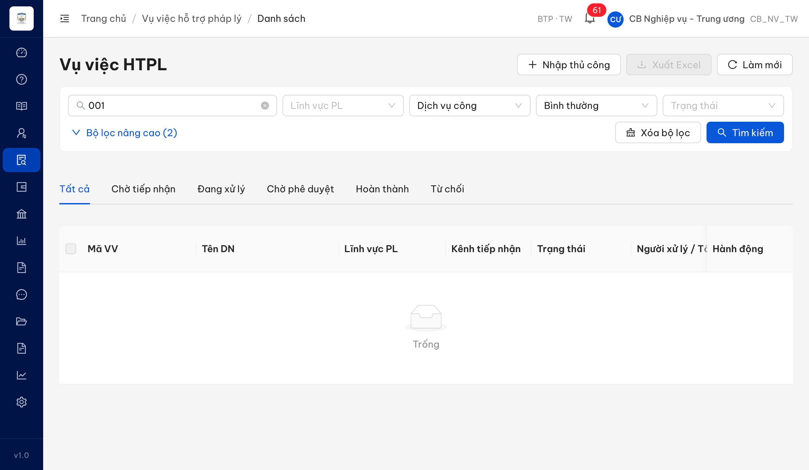

*(Evidence đối tác: `../partner-evidence/TKHSYCHTPL_06.jpg` — khớp hoàn toàn (cùng vai trò CB_NV_TW, cùng empty state "Trống"). Chi tiết: `../reverify-audit/TKHSYCHTPL_06/condition-table.md`.)*

---

## ~~BUG-LCNHTCVV_02~~ [CLOSED] — Gợi ý phân công (thẻ "Cá nhân"): thiếu Lĩnh vực chuyên môn, Đơn vị quản lý, Điểm ưu tiên

> **Re-test:** 2026-07-15 R2-reverify — ✅ PASS (Closed). `cbnv_tw` mở cửa sổ Phân công (thẻ Cá nhân): mỗi dòng gợi ý nay có đủ **LV** (Lĩnh vực chuyên môn), **ĐVQL** (Đơn vị quản lý), **Ưu tiên** (Điểm ưu tiên) — kèm workload + ĐG. Đã bổ sung cả 3 trường trước thiếu.

### Mô tả

Trong cửa sổ **"Phân công tư vấn viên"** → thẻ **"Cá nhân"**, vùng gợi ý người xử lý được render là **1 dropdown**, mỗi dòng là **một chuỗi chữ gộp** (`[TVV] Họ tên (Mã) — N VV đang xử lý — ĐG: x.x`) thay vì bảng có cột. **Thiếu 3 trường thông tin SRS quy định**: Lĩnh vực chuyên môn · Đơn vị quản lý · Điểm ưu tiên.

### Các bước tái hiện

1. Đăng nhập `cbnv_tw` (CB Nghiệp vụ - Trung ương).
2. Mở `VV-BTP-TW-20260712-003` — trạng thái **"Đang kiểm tra"** (checklist 6/6 ✓, đã kết luận Đạt).
3. Bấm **[Phân công]** → cửa sổ "Phân công tư vấn viên" mở, thẻ **"Cá nhân"** được chọn mặc định.
4. Mở danh sách **"Chọn người được phân công"** (pool có sẵn 2 TVV).

### Kết quả mong đợi

**FR-V.I-09 (UC59) §Outputs** (`srs-fr-05-vu-viec.md` dòng **750-758**) — danh sách gợi ý phải hiển thị:

| # | Dòng SRS | Trường | Web |
|---|---|---|---|
| 3 | 752 | Họ tên người xử lý | ✔ Có |
| 5 | **754** | **Lĩnh vực chuyên môn** | ✘ **Thiếu** |
| 6 | **755** | **Đơn vị quản lý** (Sở TP / Bộ ngành công nhận) | ✘ **Thiếu** |
| 7 | 756 | Số VV đang xử lý (workload) | ✔ Có |
| 8 | 757 | Điểm đánh giá TB (thang 1.0–5.0) | ◐ Chỉ hiện khi TVV có điểm |
| 9 | **758** | **Điểm ưu tiên tính toán** | ✘ **Thiếu** |

Ngoài ra §Processing — Gợi ý người xử lý (BR-CALC-07, dòng **735-741**) quy định danh sách sắp xếp theo **điểm ưu tiên DN (NĐ55 Điều 4) → workload → điểm ĐG**.

### Kết quả thực tế

```
[TVV] QA TVV Seed28 Active (TVV-BTP-TW-0002) — 0 VV đang xử lý — ĐG: 4.2
[TVV] Nguyễn Văn Seed (TVV-SEED-0001) — 0 VV đang xử lý
```

Không có bảng cột. Cán bộ **không thấy** lĩnh vực chuyên môn của người được gợi ý (không biết có khớp lĩnh vực vụ việc không), **không thấy** đơn vị quản lý, và **không thấy** điểm ưu tiên (không có căn cứ đối chiếu thứ tự sắp xếp theo BR-CALC-07).

### Bằng chứng

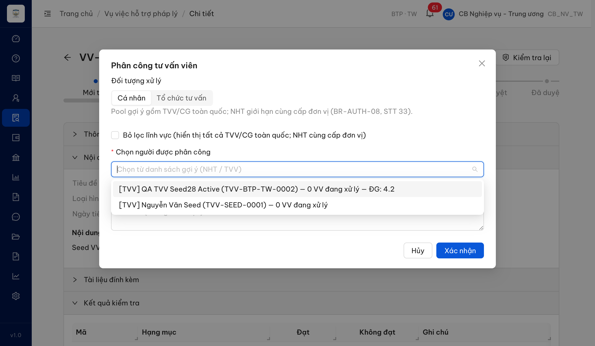

*(Evidence đối tác: `../partner-evidence/LCNHTCVV_02.jpg` — khớp (cùng vai trò CB_NV_TW, cùng dropdown chuỗi chữ gộp). Chi tiết `../reverify-audit/LCNHTCVV_02/condition-table.md`. Lưu ý: chi tiết "ĐG: 8.3" trong ảnh đối tác — vượt thang 1.0–5.0 của SRS dòng 757 — **không tái hiện** trên env được giao (hiển thị 4.2, đúng thang) nên không log ở lượt này.)*

---

## ~~BUG-LCNHTCVV_05~~ [CLOSED] — Ghi chú phân công bị chặn ở 500 ký tự thay vì 1.000 ký tự

> **Re-test:** 2026-07-15 R2-reverify — ✅ PASS (Closed). Ô Ghi chú phân công nay maxlength=**1000** + có bộ đếm "0/1000". Gõ thật bằng bàn phím 570 ký tự (>500) → nhận đủ, counter "570/1000". Cap 500 đã bỏ.

### Mô tả

Ô **"Ghi chú"** trong cửa sổ **Phân công tư vấn viên** đặt `maxlength = 500` → chặn cứng ở **500 ký tự**, trong khi SRS quy định **tối đa 1.000 ký tự**. Ô cũng **không có bộ đếm ký tự**, nên khi nội dung bị cắt người dùng không nhận được phản hồi nào.

### Các bước tái hiện

1. Đăng nhập `cbnv_tw` (CB Nghiệp vụ - Trung ương).
2. Mở `VV-BTP-TW-20260712-003` (trạng thái **"Đang kiểm tra"**, checklist 6/6 ✓) → bấm **[Phân công]**.
3. Ở ô **"Ghi chú"**: dán **700 ký tự** → rồi gõ thêm **400 ký tự** nữa.
4. Lặp lại ở **cả 2 thẻ**: "Cá nhân" và "Tổ chức tư vấn".

### Kết quả mong đợi

**FR-V.I-09 (UC59) §Inputs — dòng 5** (`srs-fr-05-vu-viec.md` dòng **720**): trường `ghi_chu_phan_cong` — ràng buộc ***"max 1000 ký tự**, lưu vào PHAN_CONG_VU_VIEC.ghi_chu"* → ô Ghi chú phải nhận tối đa **1.000 ký tự**.

### Kết quả thực tế

| Thao tác | Kết quả |
|---|---|
| Thuộc tính `maxlength` của ô Ghi chú | **500** (cả thẻ "Cá nhân" lẫn thẻ "Tổ chức tư vấn") |
| Dán 700 ký tự | Ô chỉ nhận **500**, phần còn lại bị cắt |
| Gõ thêm 400 ký tự nữa | Vẫn đứng ở **500** — không nhập thêm được |
| Bộ đếm ký tự | **Không có** |

### Bằng chứng

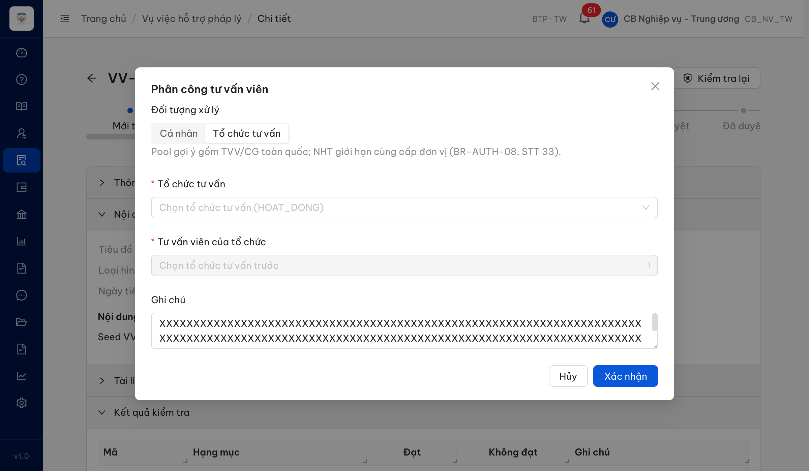

*(Evidence đối tác: `../partner-evidence/LCNHTCVV_05.jpg` — khớp (cùng vai trò CB_NV_TW, cùng thẻ "Tổ chức tư vấn", nội dung Ghi chú bị cắt cụt giữa chừng). Chi tiết: `../reverify-audit/LCNHTCVV_05/condition-table.md`.)*

---

## ~~BUG-LCNHTCVV_07~~ [CLOSED] — Phân công VV khác đơn vị: thông báo sai vai trò + hiển thị lặp 2 lần

> **Re-test:** 2026-07-15 R2-reverify — ✅ PASS (Closed). `cbnv_tw` phân công VV-STP-AG-001 (An Giang, khác đơn vị) → Xác nhận: chặn đúng (giữ "Đang kiểm tra") + thông báo nay **"Bạn không có quyền phân công vụ việc của đơn vị khác"** (đúng thao tác, tiếng Việt thuần) và **chỉ 1 lần** (đếm MutationObserver). Sửa cả 2 điểm (cùng gốc KTHSYCHTPL_15).

### Mô tả

Khi cán bộ phân công một vụ việc **không thuộc đơn vị mình**, hệ thống **chặn đúng** (trạng thái VV không đổi) nhưng:

1. **Nội dung thông báo sai:** hiển thị *"Đơn vị của người phê duyệt khác đơn vị của bản ghi"* — thao tác đang thực hiện là **phân công** do **Cán bộ Nghiệp vụ** làm, **không phải phê duyệt** → cán bộ đọc không hiểu mình sai ở đâu.
2. **Thông báo lặp:** chỉ bấm [Xác nhận] **1 lần** nhưng hiện **2 toast lỗi giống hệt nhau**, trong khi backend chỉ trả **1** response.

### Các bước tái hiện

1. Đăng nhập `cbnv_tw` (CB Nghiệp vụ - Trung ương, `donViId` = đơn vị TW).
2. Mở `VV-STP-AG-20260712-001` — vụ việc thuộc **Sở Tư pháp An Giang** (**khác đơn vị** người đăng nhập), trạng thái **"Đang kiểm tra"**.
3. Bấm **[Phân công]** → chọn người được phân công (`[TVV] QA TVV Seed28 Active`) → bấm **[Xác nhận]**.

### Kết quả mong đợi

**FR-V.I-09 (UC59) §Error Handling — dòng E4** (`srs-fr-05-vu-viec.md` dòng **773**): khi *"VV không thuộc đơn vị user"* → hệ thống từ chối và hiển thị thông báo **"Bạn không có quyền phân công VV của đơn vị khác"** (ERROR), hiển thị **1 lần**.

### Kết quả thực tế

```
Số toast hiện ra : 2  (giống hệt nhau, xếp chồng)
Nội dung toast   : "Đơn vị của người phê duyệt khác đơn vị của bản ghi"  ×2
Network          : POST /api/v1/vu-viecs/5ac43102-.../phan-cong → 403
                   { "code": "ERR-AUTH-VPD-00-03",
                     "message": "Đơn vị của người phê duyệt khác đơn vị của bản ghi" }
Trạng thái VV    : "Đang kiểm tra" (KHÔNG đổi — phần CHẶN là đúng)
```

Backend trả **1** response nhưng UI render **2** toast.

### Bằng chứng

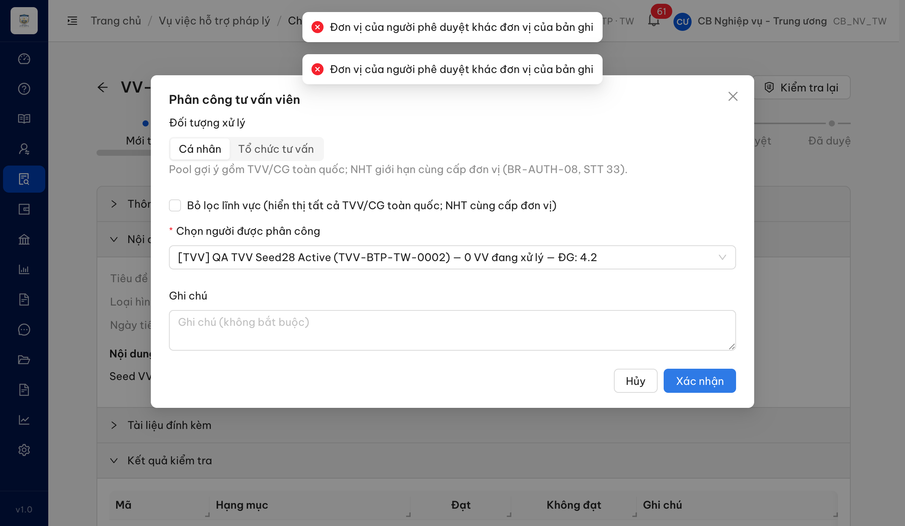

*(Evidence đối tác: `../partner-evidence/LCNHTCVV_07.jpg` — khớp hoàn toàn (cùng vai trò CB_NV_TW, cùng 2 toast đỏ y hệt). Chi tiết: `../reverify-audit/LCNHTCVV_07/condition-table.md`. **Cùng gốc `BUG-KTHSYCHTPL_15`** — thông báo chặn theo đơn vị cũng sai vai trò "người phê duyệt" + cũng lặp 2 lần → đề nghị fix chung 1 lần cho mã `ERR-AUTH-VPD-00-03`.)*

---

## ~~BUG-LCNHTCVV_08~~ [CLOSED] — Phân công thành công nhưng hệ thống hiện đồng thời thông báo thành công và thông báo lỗi

> **Re-test:** 2026-07-15 R2-reverify — ✅ PASS (Closed). `cbnv_tw` phân công VV cùng đơn vị (Đang kiểm tra) → chỉ **1 toast success** kèm tên người: "Đã phân công vụ việc cho QA TVV Seed28 Active. Hệ thống đã gửi thông báo." (đúng SRS dòng 1768). Hết toast lỗi ERR-STATE-VI-10-01 — request phụ /goi-y-tvv vẫn 409 nội bộ nhưng FE không bắn ra người dùng.

| | |
|---|---|
| **Mã TC** | LCNHTCVV_08 |
| **Severity** | Major (P1) |
| **Phân loại** | Workflow |
| **Ngày** | 2026-07-12 |
| **SRS** | `srs-fr-05-vu-viec.md` — SCR-V.I-03 §Thông báo riêng **dòng 1768**; FR-V.I-09 (UC59) §Error Handling **dòng 770** |
| **Tài khoản** | `cbnv_tw` — CB Nghiệp vụ - Trung ương (CB_NV_TW) |

### Mô tả

Cán bộ Nghiệp vụ phân công vụ việc cho người xử lý. Thao tác **thành công** (vụ việc chuyển sang trạng thái "Đã phân công"), nhưng ngay sau khi bấm [Xác nhận], màn hình hiện **cùng lúc 2 thông báo trái ngược nhau**:

- thông báo xanh **"Đã phân công"**, và
- thông báo đỏ **"ERR-STATE-VI-10-01: Vụ việc không ở trạng thái cho phép phân công"**.

Cán bộ không biết mình phân công được hay chưa: nhìn thông báo đỏ sẽ tưởng thất bại và bấm lại / báo lỗi lên cấp trên, trong khi vụ việc đã chuyển người xử lý.

### Bước tái hiện

1. Đăng nhập `cbnv_tw` (CB Nghiệp vụ - Trung ương).
2. Mở vụ việc thuộc **cùng đơn vị** đang ở trạng thái **"Đang kiểm tra"** (đã kết luận kiểm tra Đạt) — VD `VV-BTP-TW-20260712-003`.
3. Bấm **[Phân công]** → cửa sổ "Phân công tư vấn viên" mở ra.
4. Ở thẻ **"Cá nhân"**, chọn người được phân công (VD `[TVV] QA TVV Seed28 Active (TVV-BTP-TW-0002)`).
5. Bấm **[Xác nhận]** → quan sát vùng thông báo.

### Kết quả mong đợi

Theo `srs-fr-05-vu-viec.md:1768` (SCR-V.I-03 §Thông báo riêng), khi phân công **thành công**, hệ thống hiển thị **duy nhất 1 thông báo thành công**: *"Đã phân công vụ việc cho {tên người được phân công}. Hệ thống đã gửi thông báo."*

Câu *"Vụ việc không ở trạng thái cho phép phân công"* — `srs-fr-05-vu-viec.md:770` (FR-V.I-09 §Error Handling, dòng E1, mã `ERR-PC-01`) — chỉ được hiển thị khi thao tác phân công **bị chặn**. Thao tác thành công thì không được hiện thông báo lỗi này.

### Kết quả thực tế

```
Số thông báo hiện ra : 2  (cùng lúc)
  ✅ xanh : "Đã phân công"
  ❌ đỏ   : "ERR-STATE-VI-10-01: Vụ việc không ở trạng thái cho phép phân công"

Trạng thái VV sau thao tác : "Đã phân công"  ⇒ PHÂN CÔNG ĐÃ THÀNH CÔNG THẬT
Thanh tiến trình           : sáng đến bước "Đã phân công"

Nguyên nhân gốc (network):
  1. Gửi lệnh phân công                            → THÀNH CÔNG (201)
  2. Màn hình tự tải lại danh sách gợi ý người xử lý → BỊ TỪ CHỐI (409)
     phản hồi: "ERR-STATE-VI-10-01: Vụ việc không ở trạng thái cho phép phân công"
     vì VV vừa chuyển sang "Đã phân công" nên không còn được gợi ý người xử lý nữa
     → lỗi của lệnh phụ này bị bắn thẳng ra thông báo cho người dùng cuối
```

Ngoài ra, thông báo thành công trên web chỉ là **"Đã phân công"**, thiếu tên người được phân công so với câu SRS dòng 1768 quy định. Mã `ERR-STATE-VI-10-01` **không tồn tại trong SRS v3.5**.

### Bằng chứng

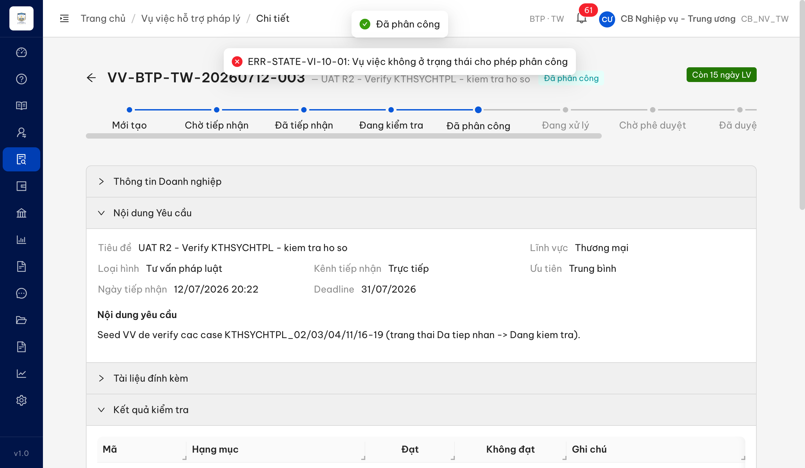

*(Evidence đối tác: `../partner-evidence/LCNHTCVV_08.webm` — khoảnh khắc lỗi ở giây **12,55–14,06**, khớp hoàn toàn (cùng vai trò CB_NV_TW, cùng 2 thông báo y hệt). Khung hình đã bóc: `../reverify-audit/LCNHTCVV_08/partner-frame-12s-14s-2-thong-bao.jpg`. Chi tiết: `../reverify-audit/LCNHTCVV_08/condition-table.md`.)*

---

*Bug report generated: 2026-07-10 | QA Automation via Claude Code*
*Cập nhật: 2026-07-11 — thêm BUG-QLNHCH_08, BUG-TKNHCH_05, BUG-QLGVTG_02, BUG-TKGVTG_02, BUG-QLGVTG_03, BUG-QLGVTG_09 (verify UAT Tuần 2 lô 2)*
*Cập nhật: 2026-07-11 — thêm BUG-QLLKHDTBD_06 (Critical — create Kế hoạch đào tạo 500)*
*Cập nhật: 2026-07-11 — thêm BUG-PDKQDTTH_01 + BUG-PDKQDTTH_05 (Medium — phê duyệt/từ chối KQ không thông báo CB NV)*
*Cập nhật: 2026-07-12 — bắt đầu lô QLTVV (Mạng lưới Tư vấn viên, srs-fr-04); thêm BUG-QLTVV_02 (Minor), BUG-QLTVV_04 (Medium), BUG-QLTVV_10 + BUG-QLTVV_12 (Medium — export thiếu ngày cấp chứng chỉ), BUG-QLTVV_13 (Minor — form Thêm thiếu Mô tả kinh nghiệm)*
*Cập nhật: 2026-07-12 — thêm BUG-QLTVV_18 (Minor — upload vượt 10 tệp không báo lỗi), BUG-QLTVV_20 (Minor — file đã tải thiếu dung lượng + nút Xem), BUG-QLTVV_21 (Major — thêm mới hợp lệ mất ảnh chân dung + file đính kèm + số QĐ không hiển thị)*
*Cập nhật: 2026-07-12 — thêm BUG-QLTVV_22 (Medium — Hủy có thay đổi chưa lưu, chọn "Ở lại" lại xóa sạch dữ liệu form)*
*Cập nhật: 2026-07-12 — thêm BUG-QLTVV_23 (Minor — form Sửa thiếu Mô tả kinh nghiệm, cùng root cause BUG-QLTVV_13)*
*Cập nhật: 2026-07-12 — thêm BUG-QLTVV_24 (Major — Sửa TVV có ảnh chân dung .png báo "Chỉ chấp nhận file PDF", chặn lưu; cùng root cause BUG-QLTVV_21)*
*Cập nhật: 2026-07-12 — QLTVV_28 verdict **Reject** (không phải bug): đã seed 1 TVV đang hoạt động có vụ việc chưa hoàn thành rồi bấm Xóa → hệ thống hiển thị đúng thông báo nghiệp vụ cụ thể "Không thể xóa: TVV còn vụ việc đang xử lý" (không phải thông báo chung chung). Gỡ khỏi bug-report, lưu evidence audit. Hoàn tất lô QLTVV (13/13 case verify).*
*Cập nhật: 2026-07-12 — bắt đầu lô TKTVV/DKTGMLTVV (tìm kiếm + đăng ký mạng lưới TVV); thêm BUG-TKTVV_02 (Medium — bộ lọc sai kiểu dữ liệu: Tổ chức là ô nhập chữ, Trạng thái không ẩn theo thẻ, Lĩnh vực chỉ chọn 1)*
*Cập nhật: 2026-07-12 — thêm BUG-TKTVV_04 (Major — bộ lọc Tổ chức + Trạng thái bị bỏ qua, trả bản ghi không khớp tiêu chí)*
*Cập nhật: 2026-07-12 — thêm BUG-DKTGMLTVV_02 (Minor — Giới tính dropdown 3 giá trị thay vì radio Nam/Nữ; ảnh chân dung không có khu xem trước 120x160)*
*Cập nhật: 2026-07-12 — thêm BUG-DKTGMLTVV_14 (Medium — Hủy khi có thay đổi: chọn "Ở lại" lại xóa trắng toàn bộ trường đã nhập; cùng gốc BUG-QLTVV_22). Hoàn tất lô TKTVV + DKTGMLTVV (7/7 case).*
*Cập nhật: 2026-07-12 — bắt đầu lô CNHSNLTVV/QLHSTVV (cập nhật hồ sơ năng lực + hồ sơ chi tiết TVV); thêm BUG-CNHSNLTVV_02 (Medium — biểu mẫu "Cập nhật năng lực" chỉ 6/11 trường, thiếu cả Bằng cấp/Chứng chỉ chi tiết mà thẻ đang hiển thị)*
*Cập nhật: 2026-07-12 — thêm BUG-QLHSTVV_03 (Minor — thẻ Hồ sơ sai bố cục nhóm: Lĩnh vực gộp vào Tổ chức, thừa nhóm Ghi chú, thiếu nhóm Thông tin công khai). QLHSTVV_02 verdict BA confirm (thẻ đầu trang thiếu Loại/Tổ chức/Lĩnh vực — SRS dòng 1541 không quy định 3 trường này).*
*Cập nhật: 2026-07-12 — thêm BUG-QLHSTVV_05 (Major — vai trò NHT vẫn thấy thẻ Thẩm định, mở được biểu mẫu chấm điểm nội bộ trên TVV Mới đăng ký). QLHSTVV_04 verdict BA confirm (Quay lại danh sách không giữ bộ lọc — SRS im lặng).*
*Cập nhật: 2026-07-12 — thêm BUG-QLHSTVV_06 (Medium — thẻ Năng lực in JSON thô ở trường Bằng cấp; Chứng chỉ hiện "—" dù data đã lưu). Ý phụ của case (thiếu số đếm cạnh tên thẻ Lịch sử hỗ trợ / Đánh giá) tách sang BA confirm. Hoàn tất lô CNHSNLTVV + QLHSTVV (6/6 case).*
*Cập nhật: 2026-07-12 (bổ sung sau phản hồi) — (1) TKTVV_04: đối tác gắn lại bằng chứng đúng (`TKTVV_04.webm`), 2 frame xác nhận cả 2 lỗi ngay trên env đối tác → verdict Open giữ nguyên, bổ sung ảnh vào bug. (2) Tạo tài khoản NHT (`nht_qa_01`) và verify LẠI 4 case DKTGMLTVV_02/_03/_11/_14 bằng ĐÚNG vai trò đối tác — kết quả trùng khớp hoàn toàn với lần chạy bằng cbnv_tw. (3) BUG-DKTGMLTVV_14: xác định root cause chính xác hơn — biểu mẫu bị xóa ngay khi bấm "Hủy", TRƯỚC khi hộp thoại hiện, không phải do nhánh "Ở lại".*
*Cập nhật: 2026-07-12 — thêm BUG-TDHSTVV_18 (Major — trình phê duyệt ở cấp Địa phương: CB Phê duyệt cùng đơn vị không nhận thông báo dù hồ sơ đã vào đúng hàng chờ; không có thông báo thành công; thiếu hộp thoại xác nhận; cùng gốc BUG-TDHSTVV_17). Ý "tự động chuyển lên cấp Bộ/Ngành" trong Kết quả mong đợi của case trái SRS v3.5 (bỏ ESCALATE) → tách sang BA confirm. Hoàn tất lô TDHSTVV (9/9 case).*
*Cập nhật: 2026-07-12 — lô QLTNVV/NHSYC (Vụ việc HTPL, srs-fr-05); verify 8 case → **6 Open + 2 BA confirm**. Thêm BUG-QLTNVV_02 (Minor — 2 cột thời hạn sai nhãn SRS), BUG-QLTNVV_06 (Medium — file Excel sai tên 6/9 cột + thừa 2 cột), BUG-QLTNVV_08 (Major — danh sách không hỗ trợ sắp xếp theo cột), BUG-NHSYC_02 (Medium — form Nhập thủ công thiếu trường bắt buộc "Ngày tiếp nhận"), BUG-NHSYC_05 (Medium — "Nội dung yêu cầu" cho 50.000 ký tự thay vì 10.000), BUG-NHSYC_06 (Medium — vượt 10 tệp + vượt tổng 100MB đều không báo lỗi).*
*Cập nhật: 2026-07-12 — 2 case verdict **BA confirm** (không log bug): NHSYC_07 (web redirect chi tiết VV sau Lưu nháp là **ĐÚNG SRS dòng 342** — kỳ vọng "giữ nguyên màn hình" của test case trái SRS); NHSYC_08 (SRS im lặng về hộp thoại xác nhận khi bấm Hủy; phát hiện module TVV và module Vụ việc hành xử KHÁC NHAU ở cùng thao tác). Ngoài ra phát hiện **3 chỗ SRS tự mâu thuẫn** (trường nhóm DN inline vs modal 2 trường; Kênh tiếp nhận 3 vs 5 giá trị; danh sách định dạng tệp đính kèm khác nhau ở 3 dòng) → đã ghi vào `ba-confirmation-needed-week-2.md`.*
*Cập nhật: 2026-07-12 (BA chốt) — QLTNVV_06 chuyển từ BA confirm → **Open**: BA chốt "màn hình hiển thị cột nào thì file Excel chỉ có đúng cột đó, đúng tên cột; cột hiển thị theo SRS" ⇒ web sai 2 điểm (6/9 cột lệch tên + thừa "Tiêu đề"/"Ưu tiên") → đã log BUG-QLTNVV_06.*
*Cập nhật: 2026-07-12 — lô KTHSYCHTPL (Kiểm tra hồ sơ yêu cầu HTPL, srs-fr-05); verify 9 case → **8 Open + 1 BA confirm** (trong đó KTHSYCHTPL_11 vừa Open vừa cần BA confirm). Thêm BUG-KTHSYCHTPL_02 (Minor — stepper thiếu dấu ✓), BUG-KTHSYCHTPL_02b (Medium — ý thứ 2 của case _02: thẻ cảnh báo mức "Quá hạn nghiêm trọng" nhấp nháy vô hạn + mờ còn 20% độ đậm → chữ chìm vào nền; ngưỡng cảnh báo hardcode trong FE thay vì đọc cấu hình SLA), BUG-KTHSYCHTPL_03 (Major — nhóm Thông tin DN in "—" dù DB có dữ liệu, API trả `doanhNghiep: null`; thiếu 5/9 trường), BUG-KTHSYCHTPL_11 (Medium — Kết quả kiểm tra không ghi người kiểm tra + ngày, kết luận in placeholder "đã có dữ liệu"), BUG-KTHSYCHTPL_15 (Medium — chặn đúng nhưng thông báo sai vai trò "người phê duyệt" + lặp 2 lần), BUG-KTHSYCHTPL_16/_17/_18/_19 (Medium — 4 nhóm cuối hiển thị ở mọi trạng thái, bỏ qua điều kiện hiển thị SRS; cùng 1 gốc, fix 1 lần đóng cả 4). KTHSYCHTPL_04 verdict **BA confirm** (nhãn "Deadline" tiếng Anh — SRS mâu thuẫn: srs-fr-05 dòng 1637 đặt nhãn "Deadline SLA" trong khi BA chốt quy ước "tiếng Việt thuần"; lưu ý BUG-QLTNVV_02 đang kéo dev về hướng NGƯỢC LẠI). Ý phụ KTHSYCHTPL_11 (không có nút "Hoàn tất kiểm tra") tách sang BA confirm — SRS tự mâu thuẫn dòng 1736 vs 2280.*
*Cập nhật: 2026-07-12 — lô QLHSVV/TKHSYCHTPL/LCNHTCVV (Vụ việc HTPL, srs-fr-05); verify 10 case → **7 Open + 2 Reject + 1 BA confirm**. Thêm BUG-QLHSVV_02 (Medium — danh sách: trạng thái "Đang kiểm tra"/"Đang xử lý" không có nút Sửa dù SRS cho sửa tới trước Hoàn thành), BUG-QLHSVV_03 (Medium — biểu mẫu Sửa khóa Lĩnh vực + Loại hình, thiếu hẳn trường Ghi chú), BUG-QLHSVV_05 (Major — nhóm Tài liệu đính kèm không có nút [+ Thêm tài liệu] ⇒ không nộp được tài liệu bổ sung), BUG-TKHSYCHTPL_06 (Minor — tìm không ra kết quả hiện "Trống" thay vì "Không tìm thấy hồ sơ phù hợp"), BUG-LCNHTCVV_02 (Medium — gợi ý phân công thiếu Lĩnh vực chuyên môn + Đơn vị quản lý + Điểm ưu tiên), BUG-LCNHTCVV_05 (Medium — Ghi chú phân công chặn ở 500 ký tự thay vì 1.000), BUG-LCNHTCVV_07 (Medium — phân công VV khác đơn vị: thông báo sai vai trò + lặp 2 lần, cùng gốc BUG-KTHSYCHTPL_15), BUG-LCNHTCVV_08 (Major — phân công THÀNH CÔNG nhưng hiện đồng thời thông báo thành công + thông báo lỗi "ERR-STATE-VI-10-01"; gốc: màn hình tải lại danh sách gợi ý sau khi phân công xong, lệnh này bị từ chối 409 và lỗi bị bắn ra cho người dùng). **Reject:** TKHSYCHTPL_04 (bộ lọc khoảng ngày CHẠY ĐÚNG — đã chứng minh bằng 3 truy vấn thu hẹp 17→4→2 bản ghi; đối tác đối chiếu nhầm cột "Deadline" trong khi bộ lọc lọc theo "Ngày tiếp nhận"). **BA confirm:** TKHSYCHTPL_02 (cấp Trung ương xem vụ việc toàn quốc nhưng thanh lọc không có trường "Đơn vị" — SRS dòng 1622-1628 liệt kê đúng 6 trường, KHÔNG có Đơn vị ⇒ web đúng SRS, cần BA chốt có bổ sung không). Tạo mới tài khoản NHT `nht_ag_uat2` (Sở Tư pháp An Giang) để lấp pool phân công.*
*Cập nhật: 2026-07-15 — re-verify lại 4 bug reopen gửi dev (`BUG-QLLKHDTBD_06`, `BUG-QLTVV_24`, `BUG-QLTNVV_08`, `BUG-KTHSYCHTPL_11`) → cả 4 Closed-verified/Pass; Google Sheet đã cập nhật `Verify = Pass` ở rows 32, 47, 87, 96.*
