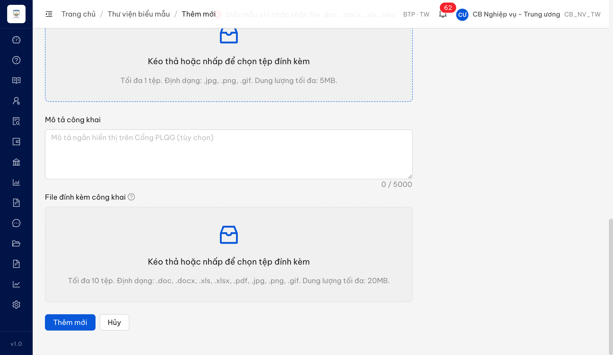
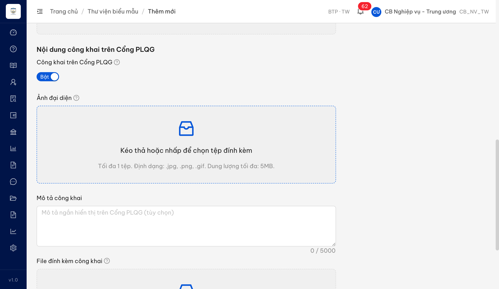

# Bug Report — Biểu mẫu / Nội dung công khai (đối tác báo qua chat 13/07/2026)

| Thông tin | Giá trị |
|-----------|---------|
| **Dự án** | Phần mềm Hỗ trợ pháp lý doanh nghiệp (PM HTPLDN) |
| **Môi trường** | http://18.143.165.120 (env được giao) |
| **Người test** | QA Automation (Claude Code) |
| **Ngày** | 2026-07-13 17:10:00 |
| **Loại test** | Verify bug đối tác báo ngoài sheet UAT |
| **Round** | Tuần 2 — bổ sung |
| **Tài liệu tham chiếu** | SRS v3.5 `input/srs-update-2026-5-5/srs-fr-09-bieu-mau.md` |

> **File riêng, tách khỏi [`Pass-bug-report-UAT-tuan-2.md`]** vì dev đang fix dở lô bug tuần 2 — không chèn thêm bug vào file đang xử lý.

---

## Tổng hợp

Đối tác báo qua chat (không nằm trong sheet UAT): *"Phần biểu mẫu hiện không có api update avatar, bạn báo dev check giúp mình chỗ này với nhé, trên domain dev hiện đang thấy gọi api upload cho phần avatar nhưng code thì chặn không cho up ảnh"*.

**Kết luận verify ban đầu: bug ĐÚNG, đã tái hiện.** Phạm vi thực tế **rộng hơn** đối tác mô tả — không chỉ ảnh đại diện, mà cả ô "File đính kèm công khai" (kể cả file PDF là định dạng SRS cho phép) đều bị chặn.

**Re-verify 2026-07-14 19:26 +07 qua Chrome DevTools MCP: Closed-verified.** Login UI `cbnv_tw`, lấy OTP qua MailHog UI, vào **Biểu mẫu → Danh sách biểu mẫu → Thêm biểu mẫu**, bật **Công khai trên Cổng PLQG**. Upload PNG ở **Ảnh đại diện** và PDF ở **File đính kèm công khai** đều được UI nhận, hiển thị file trong danh sách với nút **Xem/Xóa**, không còn toast *"Biểu mẫu chỉ chấp nhận file .doc, .docx, .xls, .xlsx"*. Network xác nhận endpoint đã tách theo loại: `POST /api/v1/bieu-maus/upload?loai=anh-dai-dien` → `201`; `POST /api/v1/bieu-maus/upload?loai=dinh-kem-cong-khai` → `201`.

### Severity breakdown

| Tổng | Critical | Major | Medium | Minor | Trivial | Closed | Open |
|------|----------|-------|--------|-------|---------|--------|------|
| 1    | 0        | 1     | 0      | 0     | 0       | 1      | 0    |

## Bug Summary Table

| Bug ID | Severity | Priority | Type | TC Ref | **SRS Reference** | Title | Status |
|--------|----------|----------|------|--------|-------------------|-------|--------|
| BUG-BM-CONGKHAI-UPLOAD | Major | P1 | Workflow | — (đối tác báo qua chat 13/07/2026) | `FR-IX §Inputs dòng 301, 303 · SCR-IX #17/#19 (dòng 654, 656) · §Processing dòng 312 · §Error Handling E1 (dòng 342)` | Khối "Nội dung công khai": không upload được **Ảnh đại diện** (jpg/png/gif) lẫn **File đính kèm công khai** (pdf) — mọi tệp bị từ chối bằng thông báo dành cho file biểu mẫu chính | Closed-verified |

---

## BUG-BM-CONGKHAI-UPLOAD — Biểu mẫu: khối "Nội dung công khai" không nhận được Ảnh đại diện và File đính kèm công khai

### Mô tả

Ở màn **Biểu mẫu → Thêm biểu mẫu**, khi bật Switch **"Công khai trên Cổng PLQG"**, form hiện 2 ô tải tệp theo SRS: **"Ảnh đại diện"** (UI ghi rõ: *Định dạng: .jpg, .png, .gif — tối đa 5MB*) và **"File đính kèm công khai"** (*.doc, .docx, .xls, .xlsx, .pdf, .jpg, .png, .gif — tối đa 20MB*).

Thực tế **không tệp nào trong 2 ô này được chấp nhận**. Mỗi lần chọn tệp, hệ thống gửi tệp lên **cùng một điểm tiếp nhận với file biểu mẫu chính** và bị từ chối bằng thông báo dành riêng cho file biểu mẫu chính: *"Biểu mẫu chỉ chấp nhận file .doc, .docx, .xls, .xlsx"* (HTTP 400, mã `ERR-VAL-FILE-03`). Kết quả: **ảnh đại diện không bao giờ tải lên được**, và file đính kèm công khai dạng **PDF** — định dạng SRS cho phép — cũng bị chặn.

### Các bước tái hiện

1. Đăng nhập role **Cán bộ nghiệp vụ** (tài khoản `cbnv_tw` — CB_NV_TW).
2. Vào **Biểu mẫu → Danh sách biểu mẫu** → bấm **[Thêm biểu mẫu]**.
3. Bật Switch **"Công khai trên Cổng PLQG"** → form hiện ô **"Ảnh đại diện"** và **"File đính kèm công khai"**.
4. Ở ô **"Ảnh đại diện"**, chọn một tệp **.png** hợp lệ (đã dùng: 120×120px, 29KB — dưới hạn mức 5MB rất xa).
5. Quan sát danh sách tệp đã tải + thông báo hệ thống.
6. Lặp lại bước 4 với ô **"File đính kèm công khai"**, lần lượt bằng tệp **.png** và tệp **.pdf**.

### Kết quả mong đợi

- Theo **SRS FR-IX §Inputs dòng 301**: `anh_dai_dien` — *"Ảnh đại diện (jpg/png/gif, max 5MB). Mặc định ảnh hệ thống"*; **SCR-IX #17 (dòng 654)**: *"Ảnh đại diện công khai | image-upload | jpg/png/gif, max 5MB"* → ô này phải **nhận** tệp ảnh jpg/png/gif ≤ 5MB.
- Theo **SRS FR-IX §Inputs dòng 303** và **SCR-IX #19 (dòng 656)**: `file_dinh_kem_cong_khai` — *"File đính kèm công khai (PDF/DOC/DOCX/XLS/XLSX, max 20MB/file)"* → ô này phải **nhận** tệp PDF.
- Ràng buộc *"Kiểm tra file: định dạng thuộc (doc, docx, xls, xlsx)"* (**§Processing dòng 312**) và thông báo **ERR-BM-01** *"Chỉ chấp nhận file doc, docx, xls, xlsx"* (**§Error Handling E1, dòng 342**) chỉ áp cho **file biểu mẫu chính** (`file` — §Inputs dòng 296), **không** áp cho ảnh đại diện và file đính kèm công khai.

### Kết quả thực tế

- Ô **"Ảnh đại diện"** + tệp `.png` (29KB): tệp bị loại, danh sách tệp rỗng, hệ thống hiện thông báo *"Biểu mẫu chỉ chấp nhận file .doc, .docx, .xls, .xlsx"*.
- Ô **"File đính kèm công khai"** + tệp `.png`: cùng thông báo lỗi, tệp bị loại.
- Ô **"File đính kèm công khai"** + tệp `.pdf`: **cũng** cùng thông báo lỗi, tệp bị loại — dù PDF là định dạng SRS cho phép và chính UI cũng ghi chấp nhận `.pdf`.
- Quan sát tầng mạng: cả 3 lần đều là `POST /api/v1/bieu-maus/upload` → **HTTP 400**, thân phản hồi:
  `{"success":false,"error":{"code":"ERR-VAL-FILE-03","message":"Biểu mẫu chỉ chấp nhận file .doc, .docx, .xls, .xlsx"}}`
- Hệ quả: tính năng **"Nội dung công khai trên Cổng PLQG"** không dùng được đúng thiết kế — biểu mẫu công khai luôn phải dùng ảnh hệ thống mặc định và không kèm được tài liệu PDF.

### Bằng chứng

Thông tin tầng mạng để dev truy vết: `POST /api/v1/bieu-maus/upload` — request `multipart/form-data`, `filename="avatar-test.png"`, `Content-Type: image/png` → response `400` `ERR-VAL-FILE-03`.

### Re-test 2026-07-14 — Closed-verified

**Cách verify:** Chrome DevTools MCP, thao tác qua browser UI. Login `cbnv_tw / Test@1234`, lấy OTP mới trong MailHog UI `http://18.143.165.120:8025/`, vào `http://18.143.165.120/bieu-mau/them-moi`, bật switch **Công khai trên Cổng PLQG**.

**Kết quả:**

- **Ảnh đại diện**: upload `bm-avatar-test.png` (`image/png`, 88 B) thành công. UI hiển thị file trong danh sách, có nút **Xem** và **Gỡ bỏ tập tin**. Network DevTools: `reqid=108 POST /api/v1/bieu-maus/upload?loai=anh-dai-dien` → `201`.
- **File đính kèm công khai**: upload `bm-public-attach-test.pdf` (`application/pdf`, 118 B) thành công. UI hiển thị file trong danh sách, có nút **Xem** và **Gỡ bỏ tập tin**. Network DevTools: `reqid=113 POST /api/v1/bieu-maus/upload?loai=dinh-kem-cong-khai` → `201`.
- Không còn tái hiện lỗi cũ `ERR-VAL-FILE-03` / toast *"Biểu mẫu chỉ chấp nhận file .doc, .docx, .xls, .xlsx"* cho hai ô nội dung công khai.

**Verdict:** `BUG-BM-CONGKHAI-UPLOAD` **Closed-verified**. Fix đã tách luồng upload cho ảnh đại diện và file đính kèm công khai, đồng thời chấp nhận đúng định dạng PNG/PDF theo SRS.

### Negative constraints re-test 2026-07-14

**Cách verify:** Chrome DevTools MCP trên cùng màn `Biểu mẫu → Thêm biểu mẫu`, switch **Công khai trên Cổng PLQG** đang bật. Các file test được chọn qua browser context, quan sát UI message và Network DevTools.

| Case | Input | Kết quả UI | Network | Verdict |
|---|---|---|---|---|
| NEG-01 | `Ảnh đại diện` upload `avatar-wrong.pdf` (`application/pdf`) | Chặn, hiện `avatar-wrong.pdf: Định dạng không được hỗ trợ. Chấp nhận: .jpg, .png, .gif` | Không phát sinh request upload | Pass |
| NEG-02 | `Ảnh đại diện` upload `avatar-over-5mb.png` (>5MB) | Chặn, hiện `avatar-over-5mb.png: Kích thước vượt quá giới hạn 5MB.` | Không phát sinh request upload | Pass |
| NEG-03 | `File đính kèm công khai` upload `public-wrong.png` (`image/png`) | Chặn, hiện `public-wrong.png: Định dạng không được hỗ trợ. Chấp nhận: .pdf, .doc, .docx, .xls, .xlsx` | Không phát sinh request upload | Pass |
| NEG-04 | `File đính kèm công khai` upload `public-over-20mb.pdf` (>20MB) | Chặn, hiện `public-over-20mb.pdf: Kích thước vượt quá giới hạn 20MB.` | Không phát sinh request upload | Pass |
| NEG-05 | `File đính kèm công khai` upload 11 file PDF hợp lệ | UI chỉ nhận 10 file (`public-01.pdf` → `public-10.pdf`), hiện `Chỉ được tải tối đa 10 tệp.` | 10 request `POST /api/v1/bieu-maus/upload?loai=dinh-kem-cong-khai` (`reqid=248`→`257`) đều `201`; không upload file thứ 11 | Pass |

**Kết luận ràng buộc:** Định dạng, dung lượng và số lượng file của 2 trường nội dung công khai đều hoạt động đúng theo UI/SRS. Các negative case bị chặn trước upload, riêng case quá 10 file chỉ upload đúng 10 file hợp lệ và cảnh báo file vượt giới hạn.
