# Re-verify — lô 16 case BA chốt chuyển Dev (UAT Tuần 2)

| Thông tin | Giá trị |
|-----------|---------|
| **Dự án** | Phần mềm Hỗ trợ pháp lý doanh nghiệp (PM HTPLDN) |
| **Môi trường** | `18.143.165.120` (env được giao). **Lưu ý:** env đã chuyển sang HTTPS chứng chỉ tự ký — `http://` nay 301 sang `https://`, trình duyệt cảnh báo `ERR_CERT_AUTHORITY_INVALID` phải bấm "Proceed" mới vào được. |
| **Người test** | QA Automation (Claude Code) |
| **Ngày** | 2026-07-16 |
| **Loại test** | Re-verify sau khi dev claim fix (`Trạng thái dev fix 1` = `dev done`) |
| **Phạm vi** | **16 case** có `Trạng thái dev fix 1` = `dev done` + cột `Verify` TRỐNG, note ghi BA chốt "LÀ LỖI / duyệt bổ sung — chuyển Dev" (15–16/07/2026). Gồm 14 case của đợt quét buổi sáng + 2 case row 5/6 user giao thêm buổi chiều. Trong đó **4 case Reopen ở vòng 1 đã được chạy lại vòng 2** sau khi dev báo fix |
| **Cột ghi sheet** | Pass → `Verify` (Q) = `Pass`. Reopen → `Trạng thái dev fix 1` (P) = `Reopen` + `Verify` (Q) = `Reopen` + note đè cột R. |

> **Vì sao lô này tách khỏi `Pass-bug-report-UAT-tuan-2.md`:** 74 bug trong file đó đã Closed + `Verify` = `Pass` từ 15/07. 14 case ở đây là việc BA vừa chốt 15–16/07 và chuyển cho Dev, chưa từng có bug entry riêng.

---

## Bảng trạng thái re-verify (snapshot LATEST 2026-07-16)

| # | Row | Mã TC | Việc BA giao Dev | Verify | Ghi chú |
|:-:|---|---|---|:-:|---|
| 1 | 12 | TTKTLBG_02 | Bộ lọc "Lĩnh vực pháp lý" màn kho bài giảng | ✅ Pass | Lọc đúng theo lĩnh vực, đã ghi sheet |
| 2 | 20 | QLGVTG_05 | Validate SĐT giảng viên `^0\d{9,10}$` | ✅ Pass | Chặn đúng 2 nhánh sai, giữ không bắt buộc, nhận cả 10 & 11 số |
| 3 | 21 | QLGVTG_06 | Sắp xếp mặc định theo cập nhật mới nhất | ✅ Pass | Hết A→Z; sửa bản ghi cũ nhất → nhảy lên đầu |
| 4 | 22 | QLGVTG_07 | Nút 👁 Xem cột Hành động | ✅ Pass | Mở đúng màn chi tiết, cả 2 tab hoạt động |
| 5 | 23 | QLGVTG_08 | Breadcrumb "Chỉnh sửa" khi bấm Sửa | ✅ Pass | Sửa → "Chỉnh sửa"; bấm tên → "Chi tiết" |
| 6 | 25 | QLGVTG_12 | CB TW xóa GV tỉnh + cảnh báo WRN-GV-01 | ✅ Pass | Hết chặn đơn vị; cảnh báo "đang dạy 1 khóa" + bắt xác nhận |
| 7 | 28 | QLDXDTTH_03 | DN/NHT xem đề xuất đào tạo của mình | ✅ Pass | Vòng 1 Reopen → **vòng 2 dev fix xong**: chi tiết ở vai trò DN hết nút của cán bộ |
| 8 | 29 | QLDXDTTH_06 | Thông báo khi DN xóa đề xuất | ✅ Pass | Vòng 1 Reopen → **vòng 2 dev fix xong**: DN đã có nút Xóa, xóa xong hiện "Đã xóa đề xuất" |
| 9 | 59 | QLHSTVV_04 | Giữ bộ lọc khi "Quay lại danh sách" | ✅ Pass | Quay lại giữ nguyên thẻ trạng thái + từ khóa + lọc nâng cao + kết quả |
| 10 | 65 | TDHSTVV_09 | Lưu nháp mất kết nối phải báo lỗi | ✅ Pass | Vòng 1 Reopen 2/3 → **vòng 2 dev fix xong**: có nút [Thử lại] chạy thật, thông báo không tự tắt |
| 11 | 74 | PDHSTVV_06 | Mã TVV trong mail kích hoạt + câu chữ thông báo | ✅ Pass | Vòng 1 Reopen 0/2 → **vòng 2 dev fix xong**: mail có mã TVV + thông báo "Đã công nhận tư vấn viên" |
| 12 | 92 | NHSYC_08 | Hộp thoại xác nhận rời form vụ việc | ✅ Pass | Hỏi đúng nguyên văn; ở lại giữ nguyên dữ liệu; form trống thì không hỏi |
| 13 | 95 | KTHSYCHTPL_04 | Nhãn "Deadline" → "Thời hạn xử lý" | ✅ Pass | Cả màn chi tiết lẫn danh sách đều dùng "Thời hạn xử lý"; hết chữ "Deadline" |
| 14 | 105 | TKHSYCHTPL_02 | Bộ lọc "Đơn vị" màn danh sách VV (chỉ TW) | ✅ Pass | TW có + lọc đúng (17→3); Bộ ngành và Địa phương đều không thấy |
| 15 | 5 | KTDGKQHT_03 | Điểm danh theo buổi học (bộ chọn + dòng nhắc) | ✅ **Pass** | **rv7:** 4/4 ý BA — ý 4 đã fix, khóa "Đã kết thúc" chỉ đọc thật (mất nút Lưu + ô xám mờ + **máy chủ chặn 403**) |
| 16 | 6 | KTDGKQHT_08 | Nhập điểm kiểm tra 0–10 + mở tab Kết quả khi đang diễn ra | ✅ **Pass** | **rv7:** 4/5 ý BA — ý 2 đã fix, có khung vàng "Kết quả tạm tính" + câu giải thích. Ý 4 (Excel) là **câu hỏi đặc tả cho BA**, không phải lỗi dev |
| 17 | 112 | QLKH_01 | Xóa khóa học báo lỗi hệ thống (QA mở mới) | ✅ **Pass** | **rv7 (verify lần đầu):** xóa chạy đúng **9/9 lần**, máy chủ trả 204 thay vì 500. Đã dọn sạch 5 khóa rác rv5 để lại |
| 18 | 113 | QLKH_02 | Tạo khóa học hiện 2 thông báo trùng (QA mở mới) | ✅ **Pass** | **rv7 (verify lần đầu):** dev fix thật — 3 phép đo sạch đều **1 request → 1 thông báo**. ⚠️ rv7 ban đầu kết luận Reopen; **kết luận đó SAI do lỗi bộ đo của QA, đã thu hồi cùng ngày** (mục 18) |
| 19 | 114 | **QLKH_03** | **[MỚI]** Buổi chưa điểm danh tự tick "Vắng không phép" | 🔴 **Open** | **rv7 — lỗi HỎNG NGƯỢC do build 17/07**, QA phát hiện khi verify KTDGKQHT_03. Dữ liệu lưu rỗng nhưng màn hình tick sẵn "Vắng không phép" |

**Tiến độ:** ✅ **19/19 — XONG** · Pass 18 · 🔴 Open 1 (lỗi mới)

> ### Vòng rv7 (17/07) — dev fix lần 3: **lần này dev CÓ triển khai thật**
>
> Khác hẳn 2 vòng trước: tôi kiểm mã băm (hash) gói giao diện — `use-khoa-hoc-queries-**pqfbh4Ty**.js` → `use-khoa-hoc-queries-**OBoex2nl**.js`. Vòng rv6 hash **y nguyên** nên hành vi không đổi (dev báo fix nhưng chưa deploy lên env này); vòng này **hash đổi và hành vi cũng đổi thật**.
>
> **Kết quả 4 case:** KTDGKQHT_03 ✅ Pass · KTDGKQHT_08 ✅ Pass · QLKH_01 ✅ Pass · QLKH_02 ✅ Pass · **+1 lỗi mới QLKH_03** (hỏng ngược do chính build này).
>
> ⚠️ **Tự thu hồi 1 kết luận sai của chính vòng này (17/07):** QLKH_02 ban đầu bị kết luận **Reopen** kèm "quy luật tái hiện 100%". Kiểm lại bằng phép đo sạch thì **lỗi nằm ở bộ đo của QA** (`toast-capture.js` cài chồng `MutationObserver` mà không ngắt cái cũ → 1 toast thật bị đếm N lần), **không phải ở app**. Dev đã fix thật. Đã sửa verdict, sửa sheet, vá gốc bộ đo — chi tiết ở mục 18.

> **Vòng 2 (chiều 16/07) — 4 case Reopen dev báo đã fix, chạy lại: cả 4 đều PASS.** Tôi đã nói trước là nghi ngờ việc dev sửa xong 4 bug trong chưa đầy một tiếng — nghi ngờ đó **sai**, chạy lại đủ luồng thì cả 4 đều fix thật (không phải chỉ sửa giao diện). Chi tiết ở các mục 7 / 8 / 10 / 11 bên dưới.
>
> **2 case bổ sung (row 5, 6):** user giao thêm 2 case `dev done` + `Verify` trống là **KTDGKQHT_03** và **KTDGKQHT_08**. ⚠️ Hai dòng này **không có** trong đợt quét `dev done + Verify trống` buổi sáng (các dòng quét được: 3, 12, 13, 14, 20, 21, 22, 23, 25, 27, 28, 29, 35, 38, 51, 57, 59, 65, 74, 76, 80, 91, 92, 95, 105) → sheet đã có người sửa trong lúc tôi chạy.

### Bug Summary Table

| Bug ID | Severity | Priority | Type | TC Ref | SRS Reference | Title | Status |
|--------|----------|----------|------|--------|---------------|-------|--------|
| **BUG-DD-VANG-MA** | Major | P1 | Frontend | **QLKH_03** *(dòng 114 — QA mở mới 17/07)* | `FR-III-05 · BR-KQ-02` | **[MỚI — hỏng ngược do build 17/07]** Buổi học **chưa hề điểm danh** thì màn hình **tự tick sẵn "Vắng không phép"**, dù dữ liệu lưu là rỗng | Open |
| ~~BUG-FE-TOAST-LAP~~ | Minor | P3 | Frontend | **QLKH_02** *(dòng 113 — QA mở mới)* | `UI-04 (srs-v3.5.md:571)` | Tạo khóa học hiện **2 thông báo giống hệt nhau**, dù chỉ gửi máy chủ 1 lần và chỉ tạo 1 bản ghi (build cũ, rv5). **rv7: đã fix** — 3 phép đo sạch đều 1 request → 1 thông báo | **Closed** |
| ~~BUG-KTDGKQHT_03~~ | Major | P1 | Business Logic | KTDGKQHT_03 | `BA chốt 16/07/2026 (row 5) · FR-III-05 PRE-03 (srs-fr-03:533) · SM-KHOAHOC (srs-v3.5:5759)` | Khóa học "Đã kết thúc" vẫn sửa và lưu được điểm danh — tab Điểm danh không chỉ đọc, máy chủ không chặn | **Closed** |
| ~~BUG-KTDGKQHT_08~~ | Minor | P3 | Content | KTDGKQHT_08 | `BA chốt 16/07/2026 (row 6) · UC24 · UC36 / FR-III-17` | Khóa học chưa kết thúc: tab Kết quả thiếu nhãn "Kết quả tạm tính" nên không phân biệt được số liệu chưa chính thức với kết quả cuối | **Closed** |
| ~~BUG-KH-XOA-500~~ | Major | P2 | Backend | **QLKH_01** *(dòng 112 — QA mở mới)* | `UI-04 (srs-v3.5.md:571) — thao tác phải cho kết quả đúng` | Xóa khóa học luôn thất bại: máy chủ trả lỗi hệ thống `ERR-SYS-00-00-01`, cán bộ không xóa được khóa học nào kể cả bản nháp mình vừa tạo | **Closed** |
| ~~BUG-QLDXDTTH_03~~ | Major | P1 | Permission | QLDXDTTH_03 | `BA chốt 15/07/2026 (row 28) · FR-III-13 · SCR-III-01 Thành phần 8 (srs-fr-03:1017, :1800)` | Màn chi tiết đề xuất đào tạo ở vai trò DN không chỉ đọc — DN tự tiếp nhận/từ chối được đề xuất của chính mình | Closed |
| ~~BUG-QLDXDTTH_06~~ | Medium | P2 | Permission | QLDXDTTH_06 | `BA chốt (row 29) · Mô tả case row 29 · UI-04 (srs-v3.5.md:571)` | Doanh nghiệp không xóa được đề xuất của chính mình ở trạng thái Mới — thiếu hẳn nút Xóa (vai trò NHT thì có) | Closed |
| ~~BUG-TDHSTVV_09~~ | Medium | P2 | Usability | TDHSTVV_09 | `BA chốt 15/07/2026 (row 65) · quy ước lỗi mất kết nối nâng thành quy ước chung (srs-fr-05-vu-viec.md:1567, :1574) · module IV thiếu (srs-fr-04:539-541)` | Lưu nháp thẩm định thất bại do mất kết nối: đã báo lỗi và đã dừng spinner, nhưng không có cách thử lại ngay tại thông báo lỗi | Closed |
| ~~BUG-PDHSTVV_06~~ | Medium | P2 | Content | PDHSTVV_06 | `BA chốt (row 74) · KQ mong đợi case row 74 · cơ chế "Chờ kích hoạt" đúng SRS (srs-fr-04:591, :619-620)` | Sau phê duyệt TVV: mail kích hoạt gửi chủ hồ sơ không có mã số tư vấn viên, và thông báo trên màn vẫn là "Phê duyệt TVV thành công" | Closed |

> **Nhận định "2 bug Reopen cùng một gốc" ở vòng 1 đã được Dev xử đúng như đề nghị:** bộ nút hành động của vai trò **DN** trên module Đề xuất đào tạo đã được rà lại cả cụm — DN hết nút của cán bộ ([Tiếp nhận]/[Bắt đầu xử lý]/[Từ chối]) và có lại nút của chính mình ([Chỉnh sửa]/[Xóa]).

---

## 1. TTKTLBG_02 (row 12) — ✅ PASS

> **Re-test:** 2026-07-16 rv4 — ✅ PASS. Thanh tìm kiếm kho bài giảng đã có bộ lọc "Lĩnh vực pháp lý" và lọc ra đúng bài giảng theo lĩnh vực.

### Việc BA giao Dev

BA duyệt bổ sung 15/07/2026: thêm bộ lọc **"Lĩnh vực pháp lý"** vào màn tìm kho tài liệu / bài giảng (bài giảng đã có sẵn trường lĩnh vực khi tạo). Owner: BA sửa SRS FR-III-08 §Đầu vào (`srs-fr-03:782-788`) → Dev FE + BE.

**Tiêu chí nghiệm thu (BA ghi):** thanh tìm kiếm có bộ lọc Lĩnh vực pháp lý → lọc ra đúng bài giảng theo lĩnh vực.

### Các bước đã chạy

1. Đăng nhập `cbnv_tw` (CB_NV_TW) → **Đào tạo, tập huấn → Kho tài liệu / Bài giảng**.
2. Quan sát thanh tìm kiếm: có bộ lọc **"Lĩnh vực pháp lý"**, dropdown 10 giá trị (Thuế, Lao động, Đất đai, Dân sự, Thương mại, Hình sự, Hành chính, Sở hữu trí tuệ, Doanh nghiệp, Đầu tư).
3. **Seed tiền đề:** cả 3 bài giảng sẵn có đều chưa gán Lĩnh vực → không chứng minh được lọc đúng. Dùng form **Sửa** gán: `QLKTLBG_08b` = **Thuế**, `QLKTLBG_08` = **Lao động**, để `QLKTLBG_08c` trống. Lưu thành công.
4. Lọc **Thuế** → bấm Tìm kiếm.
5. Lọc **Lao động** → bấm Tìm kiếm.
6. Lọc **Hình sự** (không bài giảng nào) → bấm Tìm kiếm.

### Kết quả mong đợi

Bộ lọc "Lĩnh vực pháp lý" hiện trên thanh tìm kiếm; chọn một lĩnh vực thì danh sách chỉ còn bài giảng thuộc lĩnh vực đó.

### Kết quả thực tế — đạt

| Lọc | Kết quả | Đúng? |
|---|---|:-:|
| Thuế | 1 bản ghi: `QA UAT Bài giảng Công khai QLKTLBG_08b` — "Hiển thị 1-1 / 1 kết quả" | ✅ |
| Lao động | 1 bản ghi **khác**: `QA UAT Bài giảng Test QLKTLBG_08` — "Hiển thị 1-1 / 1 kết quả" | ✅ |
| Hình sự (không có dữ liệu) | 0 bản ghi | ✅ |

Hai lĩnh vực khác nhau trả về hai tập kết quả khác nhau, lĩnh vực không có dữ liệu trả rỗng → bộ lọc lọc thật, không phải chỉ hiển thị ô lọc.

### Bằng chứng

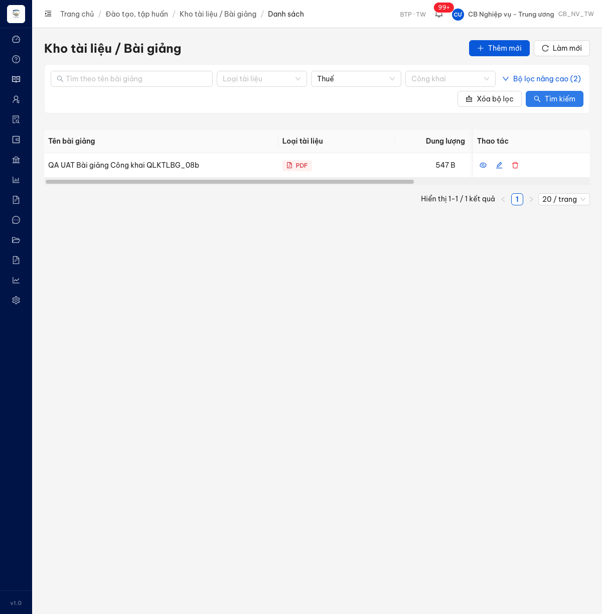

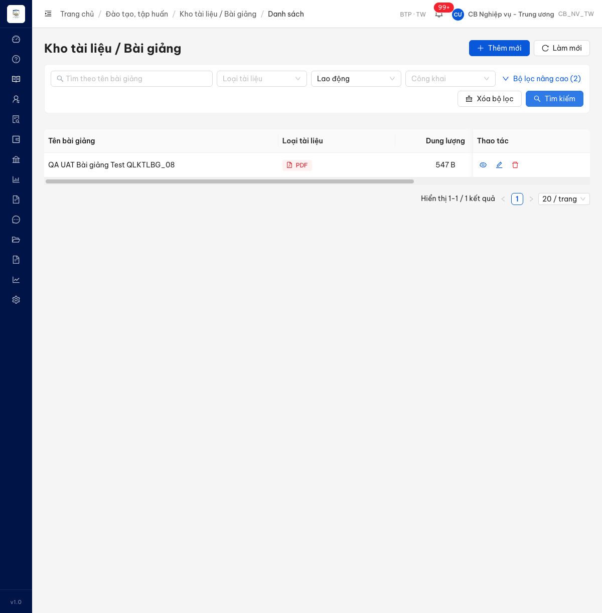

Bảng đối chiếu điều kiện: [`../../reverify-audit/rv4-conditions/TTKTLBG_02.md`](../../reverify-audit/rv4-conditions/TTKTLBG_02.md)

**Đã ghi sheet:** row 12 → `Verify` (Q) = `Pass`; giữ nguyên cột `Trạng thái dev fix 1` và `DEV phản hồi lần 1`.

---

## 2. QLGVTG_05 (row 20) — ✅ PASS

> **Re-test:** 2026-07-16 rv4 — ✅ PASS. Đã kiểm tra định dạng SĐT giảng viên đúng chuẩn `^0\d{9,10}$`, chặn cả nhánh "không bắt đầu bằng 0" lẫn "sai độ dài", vẫn giữ trường không bắt buộc, và không loại nhầm số cố định 11 chữ số.

### Việc BA giao Dev

BA duyệt bổ sung 15/07/2026: bổ sung kiểm tra định dạng SĐT giảng viên, **vẫn để không bắt buộc**. Chuẩn: bắt đầu bằng 0, gồm 10 chữ số (di động) hoặc 11 chữ số (cố định) — quy tắc gợi ý `^0\d{9,10}$`. BA cảnh báo rõ: **không bắt "đúng 10 số"** vì số cố định là 11 số, bắt 10 sẽ loại nhầm. Owner: BA bổ sung ràng buộc + mã lỗi vào FR-III-11 §Đầu vào (`srs-fr-03:965`) và §Lỗi (`:973`) → Dev FE (+ BE nếu kiểm ở máy chủ).

**Tiêu chí nghiệm thu (BA ghi):** nhập SĐT sai (không bắt đầu bằng 0 / sai độ dài) → báo lỗi; để trống → vẫn lưu được.

### Các bước đã chạy

Đăng nhập `cbnv_tw` (CB_NV_TW) → **Đào tạo, tập huấn → Giảng viên / Trợ giảng → Thêm mới**. Chạy 5 nhánh, mỗi lần nhập đủ trường bắt buộc (Họ tên, Chuyên ngành, Trình độ, Lĩnh vực) rồi bấm **Thêm mới**.

> **Lưu ý kỹ thuật khi test lại:** công cụ điền form của MCP **nối thêm** vào giá trị cũ chứ không thay thế, nên 2 lượt thử đầu bị nhiễm (ô Điện thoại thành `123456789001234`). Đã phát hiện khi đối chiếu giá trị thật của ô và chạy lại bằng cách set giá trị trực tiếp. Kết quả dưới đây là của lượt chạy sạch.

### Kết quả mong đợi

Trường "Điện thoại" không bắt buộc; nhập sai định dạng thì báo lỗi và không tạo; để trống thì vẫn tạo được; số hợp lệ 10 và 11 chữ số đều được chấp nhận.

### Kết quả thực tế — đạt cả 5 nhánh

- Trường **"Điện thoại" không có dấu `*`** → đúng yêu cầu "vẫn để không bắt buộc".
- `1234567890` (10 số, không bắt đầu bằng 0) → toast **"Số điện thoại không hợp lệ (bắt đầu bằng 0, 10 chữ số di động hoặc 11 chữ số cố định)"**, không gửi request nào, không tạo. ✅
- `01234` (bắt đầu bằng 0 nhưng quá ngắn) → cùng thông báo lỗi, không tạo. ✅
- **(để trống)** → toast **"Tạo giảng viên thành công"**, tạo được bản ghi `QA RV4 GV SDT Trong`. ✅
- `0912345678` (10 số di động) → tạo thành công. ✅
- `02412345678` (11 số cố định) → **tạo thành công, không bị loại nhầm** — đúng điều BA cảnh báo. ✅

### Bằng chứng


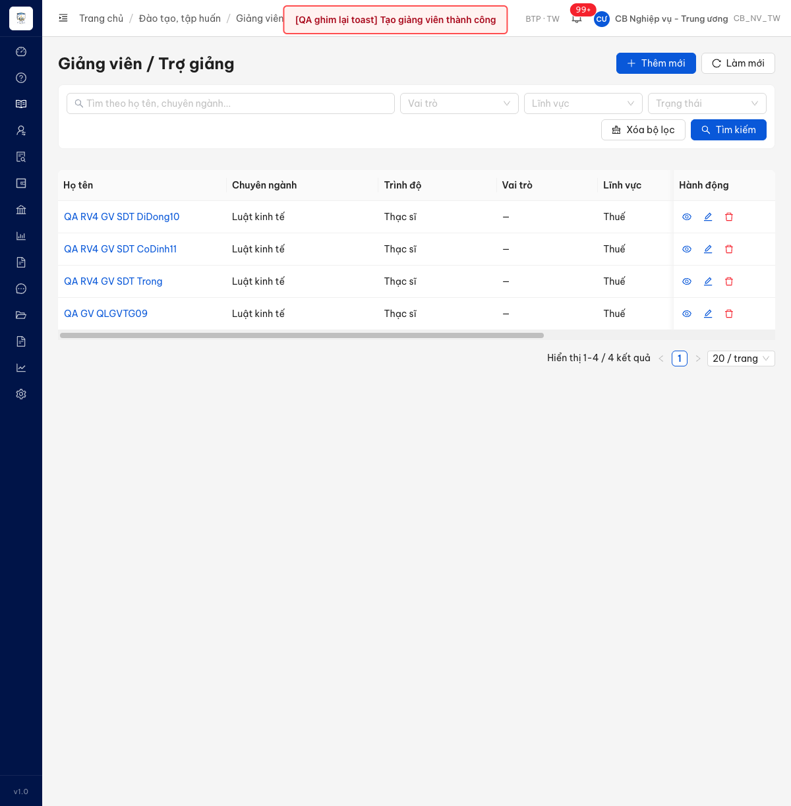

Bảng đối chiếu điều kiện: [`../../reverify-audit/rv4-conditions/QLGVTG_05.md`](../../reverify-audit/rv4-conditions/QLGVTG_05.md)

**Đã ghi sheet:** row 20 → `Verify` (Q) = `Pass`; giữ nguyên cột `Trạng thái dev fix 1` và `DEV phản hồi lần 1`.

---

## 3. QLGVTG_06 (row 21) — ✅ PASS

> **Re-test:** 2026-07-16 rv4 — ✅ PASS. Danh sách giảng viên hết sắp A→Z; bản ghi mới nằm đầu danh sách, và bản ghi cũ sau khi sửa cũng nhảy lên đầu (đúng "thời gian cập nhật mới nhất" theo DG-06).

### Việc BA giao Dev

BA chốt **LÀ LỖI**: danh sách giảng viên đang sắp theo tên A→Z, vi phạm quy ước dùng chung **DG-06** — *"sắp xếp mặc định theo thời gian cập nhật mới nhất"* (`srs-v3.5.md:919`). Quy ước nằm ở mục dùng chung nên phiếu QA đã bỏ sót. Verdict đổi từ "BA confirm" sang Open.

**Tiêu chí nghiệm thu (BA ghi):** thêm 1 giảng viên → bản ghi mới nằm ở đầu danh sách.

### Các bước đã chạy

1. Đăng nhập `cbnv_tw` → **Đào tạo, tập huấn → Giảng viên / Trợ giảng** (không dùng bộ lọc, không bấm tiêu đề cột → xem thứ tự mặc định).
2. **Nhánh (a) — thêm mới:** tạo giảng viên đặt tên **`ZZZ Cuoi Bang Chu Cai - GV Sort Test`**. Tên bắt đầu bằng "ZZZ" là cố ý: dưới sắp xếp A→Z nó phải nằm **cuối**, dưới sắp xếp mới-nhất-trước nó phải nằm **đầu** → phép thử có sức phân biệt.
3. **Nhánh (b) — phân biệt "ngày tạo" vs "ngày cập nhật":** mở **Sửa** bản ghi **cũ nhất** (`QA GV QLGVTG09`, đang đứng cuối), đổi trường Tổ chức, bấm Lưu, quay lại danh sách.

### Kết quả mong đợi

Thứ tự mặc định theo thời gian cập nhật mới nhất: bản ghi vừa thêm hoặc vừa sửa phải nằm đầu danh sách, bất kể tên xếp thế nào theo bảng chữ cái.

### Kết quả thực tế — đạt

- **Trước khi thêm:** thứ tự là `DiDong10` / `CoDinh11` / `Trong` / `QA GV QLGVTG09` = mới → cũ. Nếu còn A→Z thì `QA GV QLGVTG09` đã phải đứng đầu. → đã hết A→Z.
- **Nhánh (a):** sau khi tạo, `ZZZ Cuoi Bang Chu Cai - GV Sort Test` nằm **vị trí 1/5** dù tên xếp cuối bảng chữ cái. ✅ đạt đúng tiêu chí BA.
- **Nhánh (b):** sau khi sửa, `QA GV QLGVTG09` nhảy từ **vị trí 5/5 lên vị trí 1/5**. Thứ tự mới: `QA GV QLGVTG09` / `ZZZ…` / `DiDong10` / `CoDinh11` / `Trong`. ✅ → sắp theo **thời gian cập nhật** thật, không phải chỉ theo ngày tạo — đúng nguyên văn DG-06.

### Bằng chứng


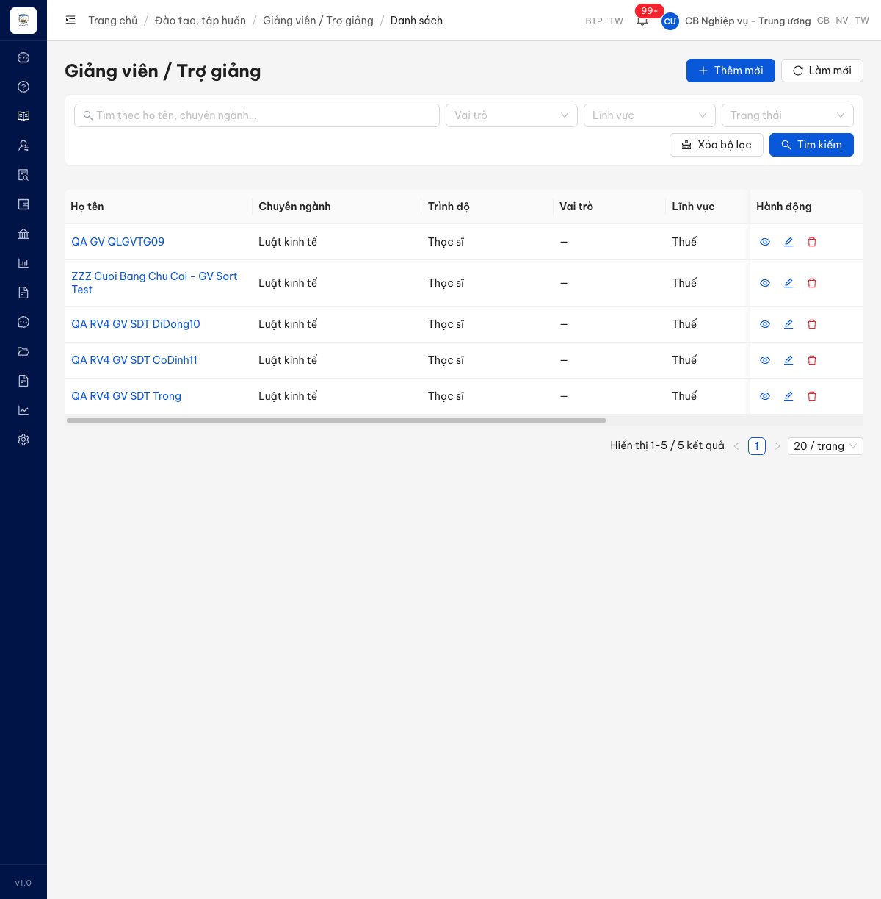

Bảng đối chiếu điều kiện: [`../../reverify-audit/rv4-conditions/QLGVTG_06.md`](../../reverify-audit/rv4-conditions/QLGVTG_06.md)

**Đã ghi sheet:** row 21 → `Verify` (Q) = `Pass`; giữ nguyên cột `Trạng thái dev fix 1` và `DEV phản hồi lần 1`.

---

## 4. QLGVTG_07 (row 22) — ✅ PASS

> **Re-test:** 2026-07-16 rv4 — ✅ PASS. Cột Hành động màn Giảng viên đã có nút 👁 Xem, bấm mở đúng màn chi tiết 2 tab và cả 2 tab đều nạp dữ liệu.

### Việc BA giao Dev

BA duyệt bổ sung 15/07/2026 (Dev FE): thêm nút **👁 Xem** vào cột Hành động màn Giảng viên (SCR-III-05, `srs-fr-03:1852`), mở màn chi tiết 2 tab **sẵn có**. Chỉ là hiển thị — dữ liệu và màn chi tiết đã có. Lý do: hầu hết màn danh sách nghiệp vụ đều đã có nút Xem riêng (Hỏi đáp, Doanh nghiệp, Vụ việc, Đào tạo, Quản trị user); màn giảng viên đang là ngoại lệ lệch chuẩn.

**Tiêu chí nghiệm thu (BA ghi):** cột Hành động có 👁 Xem → bấm mở đúng màn chi tiết 2 tab.

### Các bước đã chạy

1. Đăng nhập `cbnv_tw` → **Đào tạo, tập huấn → Giảng viên / Trợ giảng**.
2. Quan sát cột **Hành động**.
3. Bấm nút **👁** ở dòng `QA GV QLGVTG09`.
4. Bấm lần lượt cả 2 tab trên màn mở ra.

### Kết quả mong đợi

Cột Hành động có nút Xem; bấm vào mở màn chi tiết giảng viên gồm 2 tab.

### Kết quả thực tế — đạt

- Cột Hành động có **3 nút**: 👁 Xem · ✏️ Sửa · 🗑 Xóa (trước đây chỉ có Sửa/Xóa).
- Bấm 👁 → mở màn chi tiết `/dao-tao/giang-vien/{id}`, breadcrumb kết thúc bằng **"Chi tiết"**, tiêu đề là tên giảng viên.
- Màn có **đúng 2 tab**: **"Thông tin"** (hiện đủ Họ tên, Chuyên ngành, Trình độ, Tổ chức, Email, Điện thoại, Mô tả năng lực, Lĩnh vực, Tệp đính kèm, Trạng thái) và **"Lịch sử giảng dạy"**.
- Bấm sang tab "Lịch sử giảng dạy" → nạp và hiển thị "Chưa có lịch sử giảng dạy" (empty state hợp lệ vì giảng viên này 0 khóa đã dạy) → tab hoạt động thật, không phải tab chết.

**Ghi nhận thêm (không ảnh hưởng verdict):** màn "Chi tiết" mở từ nút 👁 vẫn là form sửa được, còn nút Lưu/Hủy — tức nút Xem và nút Sửa dùng chung một màn, chỉ khác breadcrumb. Đây đúng là "màn chi tiết sẵn có" mà BA yêu cầu tái dùng nên không tính lệch yêu cầu. Nếu BA muốn chế độ Xem chỉ-đọc thì đó là yêu cầu mới, cần BA chốt riêng.

### Bằng chứng

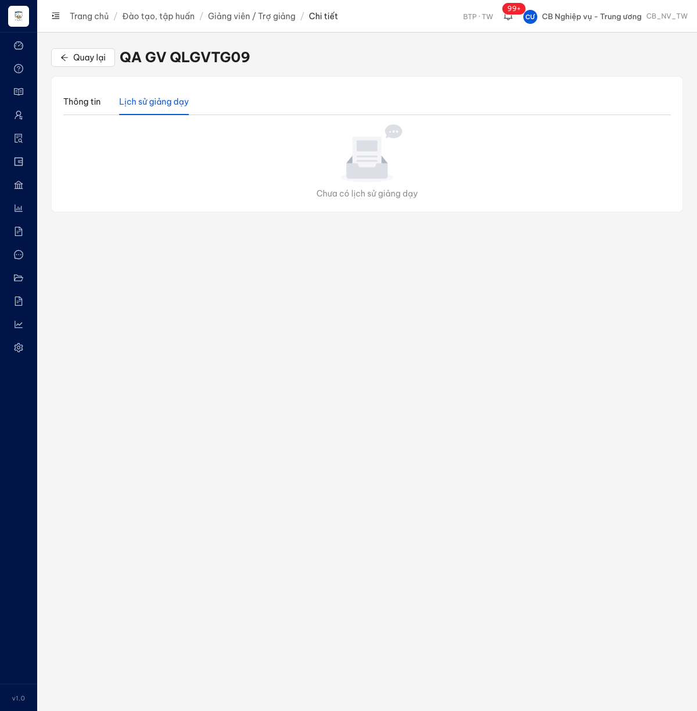

Bảng đối chiếu điều kiện: [`../../reverify-audit/rv4-conditions/QLGVTG_07.md`](../../reverify-audit/rv4-conditions/QLGVTG_07.md)

**Đã ghi sheet:** row 22 → `Verify` (Q) = `Pass`; giữ nguyên cột `Trạng thái dev fix 1` và `DEV phản hồi lần 1`.

---

## 5. QLGVTG_08 (row 23) — ✅ PASS

> **Re-test:** 2026-07-16 rv4 — ✅ PASS. Bấm Sửa cho breadcrumb kết thúc "Chỉnh sửa", bấm tên giảng viên cho breadcrumb kết thúc "Chi tiết" — phân biệt rõ 2 chế độ.

### Việc BA giao Dev

BA duyệt 15/07/2026 (Dev FE): bấm **"Sửa"** thì breadcrumb/tiêu đề phải ghi **"Chỉnh sửa"**, phân biệt với **"Chi tiết"** (xem). Tiền lệ: module Tư vấn viên đã làm đúng — bấm Sửa ghi "Chỉnh sửa [Họ tên]" (`srs-fr-04:1480`). Kèm: bổ sung quy ước chung về nhãn đường dẫn theo chế độ (Xem chi tiết / Chỉnh sửa / Thêm mới) để đồng bộ các module.

**Tiêu chí nghiệm thu (BA ghi):** bấm Sửa → breadcrumb "Chỉnh sửa"; bấm tên giảng viên → breadcrumb "Chi tiết".

### Các bước đã chạy

Đăng nhập `cbnv_tw` → **Đào tạo, tập huấn → Giảng viên / Trợ giảng**. Chạy cả 2 nhánh trên **cùng một bản ghi** (`QA GV QLGVTG09`) để so sánh trực tiếp:

1. Bấm **tên giảng viên** → đọc breadcrumb.
2. Quay lại danh sách, bấm nút **Sửa** cùng bản ghi đó → đọc breadcrumb.

### Kết quả mong đợi

Hai chế độ có nhãn đường dẫn khác nhau: xem = "Chi tiết", sửa = "Chỉnh sửa".

### Kết quả thực tế — đạt

| Thao tác | URL | Breadcrumb |
|---|---|---|
| Bấm **tên** giảng viên | `/dao-tao/giang-vien/{id}` | Trang chủ / Đào tạo, tập huấn / Giảng viên / Trợ giảng / **Chi tiết** ✅ |
| Bấm nút **Sửa** | `/dao-tao/giang-vien/{id}/chinh-sua` | Trang chủ / Đào tạo, tập huấn / Giảng viên / Trợ giảng / Chi tiết / **Chỉnh sửa** ✅ |

**Ghi nhận thêm (không ảnh hưởng verdict):** breadcrumb chế độ sửa là chuỗi `… / Chi tiết / Chỉnh sửa` (giữ "Chi tiết" làm cấp cha điều hướng) chứ không thay thế hẳn — vẫn phân biệt đúng như BA yêu cầu. Tiền lệ TVV ghi "Chỉnh sửa [Họ tên]" kèm tên; ở đây tên giảng viên hiện ở **tiêu đề màn** chứ không ghép vào breadcrumb — vẫn truyền đạt đủ thông tin.

### Bằng chứng

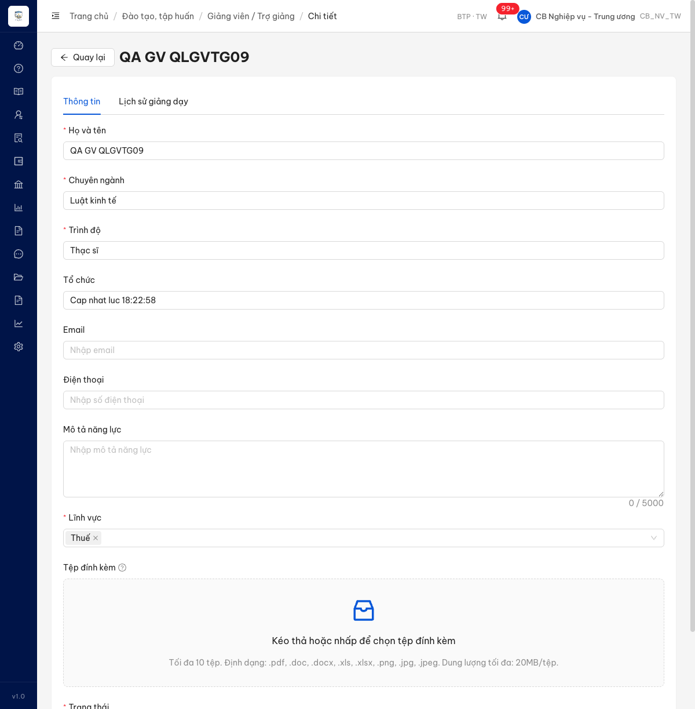

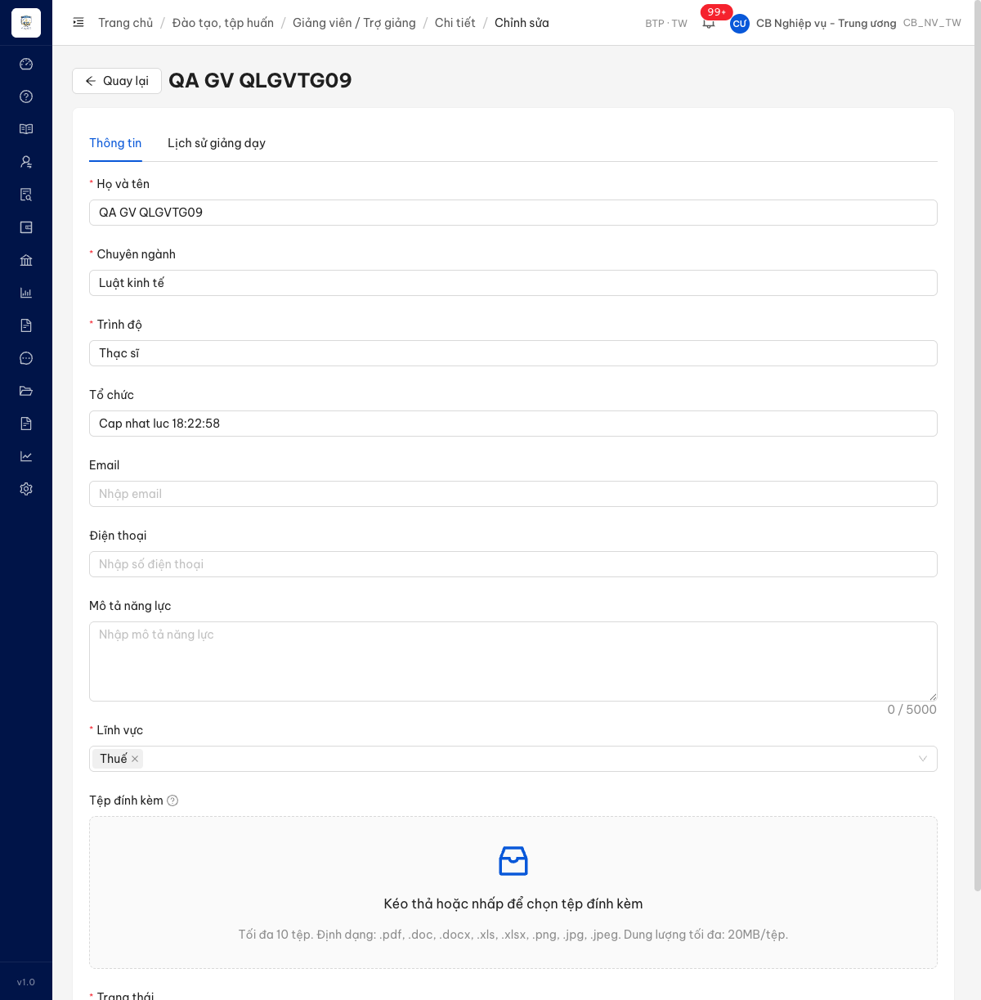

Bảng đối chiếu điều kiện: [`../../reverify-audit/rv4-conditions/QLGVTG_08.md`](../../reverify-audit/rv4-conditions/QLGVTG_08.md)

**Đã ghi sheet:** row 23 → `Verify` (Q) = `Pass`; giữ nguyên cột `Trạng thái dev fix 1` và `DEV phản hồi lần 1`.

---

## 6. QLGVTG_12 (row 25) — ✅ PASS

> **Re-test:** 2026-07-16 rv4 — ✅ PASS. CB Trung ương xóa được giảng viên tỉnh khác, không còn báo lỗi đơn vị; giảng viên đang được phân công thì hiện cảnh báo "đang được phân công dạy 1 khóa" kèm bắt xác nhận.

### Việc BA giao Dev

BA chốt **LÀ LỖI** (Dev BE): phần mềm đang so khớp đơn vị bằng nhau tuyệt đối nên chặn CB Trung ương xóa giảng viên tỉnh. Căn cứ: giảng viên **có** phân quyền theo đơn vị (`srs-v3.5.md:2534, :1256`), **nhưng** cán bộ Trung ương là **ngoại lệ** được thao tác toàn quốc (BR-AUTH-08, `srs-fr-05:2350`). Việc cần làm: bỏ so khớp đơn vị tuyệt đối — Trung ương thao tác toàn quốc, Bộ ngành/Địa phương chỉ trong đơn vị mình. Khi giảng viên đang được phân công thì hiện cảnh báo **WRN-GV-01** "đang dạy N khóa" (`srs-fr-03:973, :967`) và bắt xác nhận trước khi xóa.

**Tiêu chí nghiệm thu (BA ghi):** CB Trung ương xóa giảng viên tỉnh khác → không báo lỗi đơn vị; nếu đang dạy N khóa thì hiện cảnh báo WRN-GV-01 + hỏi xác nhận.

### Seed tiền đề (§Nguyên tắc 4 — thiếu tiền đề thì tự tạo)

Case này cần 2 tiền đề mà dữ liệu sẵn có không có:

1. **Giảng viên thuộc tỉnh khác:** danh sách GV không có cột Đơn vị và form chỉ có "Tổ chức" (chữ tự do) — đơn vị được gán ngầm theo tài khoản tạo. Nên tôi đăng nhập `cbnv_dp` (CB_NV_DP — Sở Tư pháp An Giang) trong **context trình duyệt riêng** rồi tạo `QA RV4 GV Tinh An Giang`. Xác nhận scoping có thật: `cbnv_dp` chỉ thấy đúng 1 giảng viên này, `cbnv_tw` thấy cả 6.
2. **Giảng viên đang được phân công:** mọi GV đều 0 khóa. Pool giảng viên của khóa học nạp từ **form tạo khóa học** (trường "Giảng viên" bắt buộc). Tạo khóa `KH-20260716-001` ("QA RV4 Khoa hoc de test WRN-GV-01", 01/09–30/09/2026) với giảng viên phụ trách `GV-BTP-TW-0007 — ZZZ Cuoi Bang Chu Cai - GV Sort Test`.

### Kết quả mong đợi

CB TW xóa giảng viên tỉnh không bị chặn vì lý do đơn vị; giảng viên đang được phân công thì hệ thống cảnh báo số khóa và bắt xác nhận lại.

### Kết quả thực tế — đạt cả 2 nhánh

**Nhánh (a) — CB TW xóa giảng viên tỉnh:**
- `cbnv_tw` **nhìn thấy** `QA RV4 GV Tinh An Giang` (đúng BR-AUTH-08 — phạm vi toàn quốc).
- Bấm Xóa → hộp thoại "Xác nhận xóa" → xác nhận → toast **"Đã xóa giảng viên"**, bản ghi biến mất.
- **Không có bất kỳ thông báo lỗi đơn vị nào.** ✅ đã bỏ so khớp đơn vị tuyệt đối.

**Nhánh (b) — cảnh báo WRN-GV-01:**
- Bấm Xóa giảng viên `ZZZ Cuoi Bang Chu Cai - GV Sort Test` (đang phụ trách `KH-20260716-001`).
- Bước 1: hộp thoại "Xác nhận xóa" thông thường.
- Bước 2 (sau khi xác nhận): hiện hộp thoại **"Cảnh báo — Giảng viên đang được phân công dạy 1 khóa. Bạn vẫn muốn xóa?"** kèm 2 nút **[Hủy] / [Xác nhận xóa]**. ✅ đúng nội dung WRN-GV-01, **đếm N=1 chính xác**, và có bắt xác nhận.
- Bấm **[Hủy]** → giảng viên vẫn còn, không có request xóa nào → cảnh báo hoạt động thật, không phải thông báo trang trí.

**Ghi nhận thêm (không ảnh hưởng verdict):** cột "Số khóa đã dạy" của giảng viên này vẫn hiện `0` vì khóa diễn ra 01/09–30/09/2026 (tương lai, chưa dạy). Nhưng cảnh báo vẫn đếm đúng "1 khóa" — tức đếm theo **phân công** chứ không theo khóa đã dạy xong. Đây là hành vi đúng theo yêu cầu BA ("khi giảng viên **đang được phân công**").

### Bằng chứng

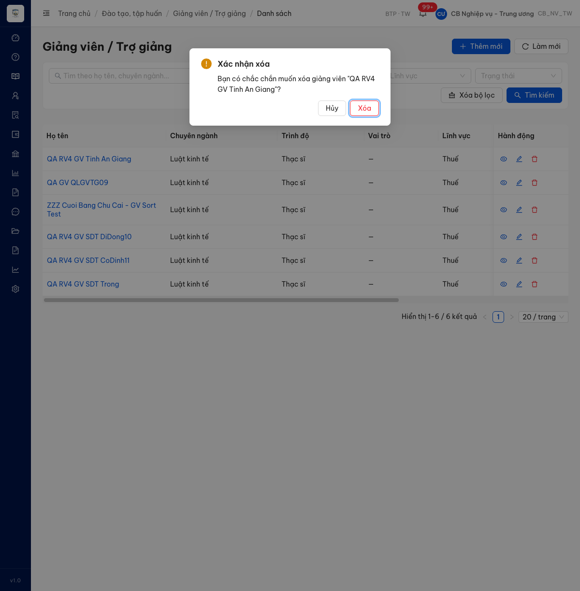


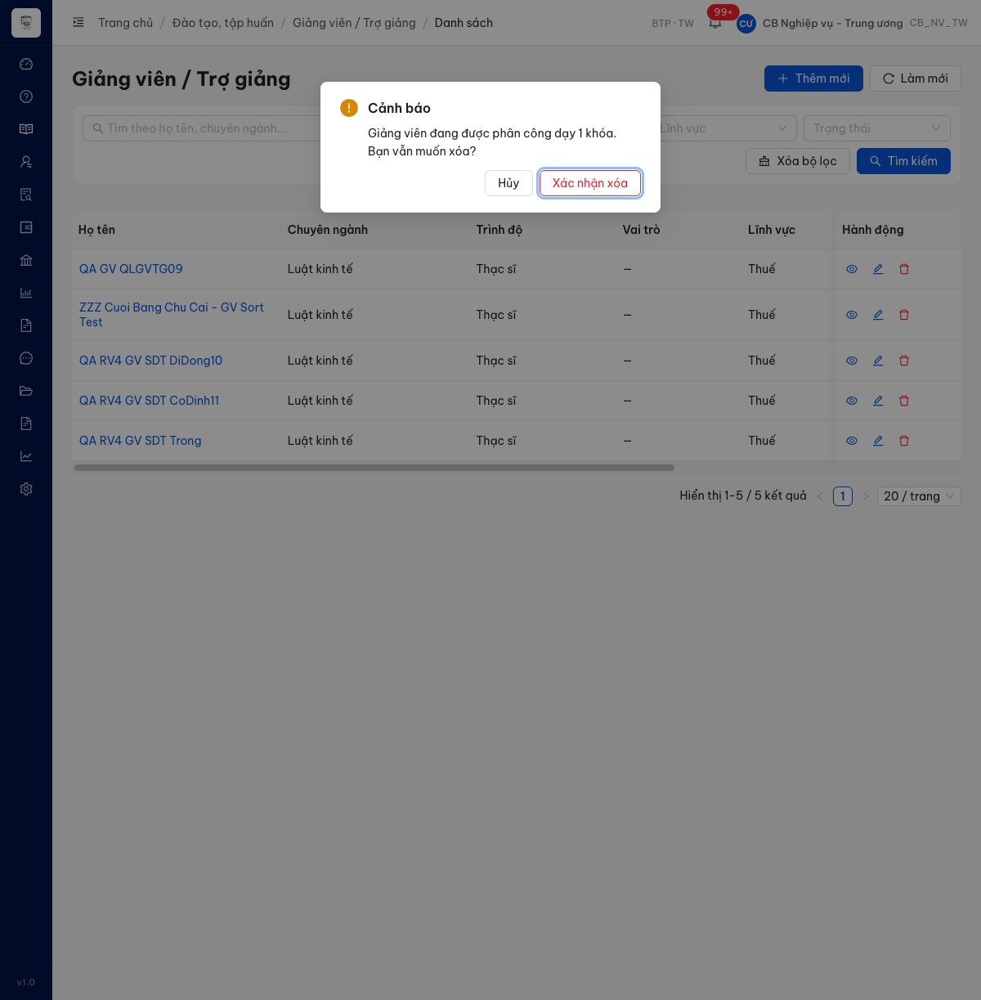

Bảng đối chiếu điều kiện: [`../../reverify-audit/rv4-conditions/QLGVTG_12.md`](../../reverify-audit/rv4-conditions/QLGVTG_12.md)

**Đã ghi sheet:** row 25 → `Verify` (Q) = `Pass`; giữ nguyên cột `Trạng thái dev fix 1` và `DEV phản hồi lần 1`.

---

## 7. QLDXDTTH_03 (row 28) — ✅ PASS — ~~BUG-QLDXDTTH_03~~ [CLOSED]

> **Re-test:** 2026-07-16 rv5 (vòng 2, sau dev fix) — ✅ PASS (Closed-verified). Ở vai trò DN, màn chi tiết đề xuất **hết sạch nút của cán bộ**: bản ghi "Mới gửi" chỉ còn [Quay lại danh sách] [Chỉnh sửa] [Xóa], bản ghi "Đã tiếp nhận" chỉ còn [Quay lại danh sách]; 0 ô nhập được. Phạm vi vẫn đúng (DN chỉ thấy 2 đề xuất của chính mình). Xem "Kết quả vòng 2" dưới.

### Việc BA giao Dev

BA chốt **LÀ LỖI** 15/07/2026 (Dev FE): DN/NHT được xem đề xuất đào tạo của mình, cả danh sách lẫn chi tiết. Căn cứ: CSV baseline dòng 287-288 tách "xem danh sách" và "xem chi tiết" thành 2 thao tác riêng của DN (SRS FR-III-13 ghi thiếu so với CSV). Cách làm: thêm DN/NHT vào làm người xem của màn chi tiết sẵn có (SCR-III-01 Thành phần 8) — **chỉ đọc**, chỉ thấy đề xuất của mình. Không dựng màn mới. Owner: BA sửa SRS (`srs-fr-03:1017, :1800`) → Dev FE.

**Tiêu chí nghiệm thu (BA ghi):** DN mở đề xuất của mình → hiện màn chi tiết **chỉ đọc**; không xem được đề xuất của DN khác.

### Mô tả

Ở vai trò **Doanh nghiệp**, màn chi tiết đề xuất đào tạo hiển thị đầy đủ các nút thao tác xử lý vốn thuộc về cán bộ nghiệp vụ (**[Chỉnh sửa]**, **[Tiếp nhận]**; sau khi tiếp nhận thì thêm **[Bắt đầu xử lý]**, **[Từ chối]**). Các nút này không chỉ hiển thị nhầm mà **thực thi được**: máy chủ chấp nhận thao tác và đổi trạng thái đề xuất. Kết quả là doanh nghiệp tự tiếp nhận — và tự từ chối — được đề xuất do chính mình gửi lên, trong khi BA chốt màn này ở vai trò DN phải là chỉ đọc.

### Các bước tái hiện

1. Đăng nhập vai trò **Doanh nghiệp** — tài khoản `0109998887` ("QA UAT Kiem Thu DN", thuộc DN-HNI-0001, Hà Nội).
2. Vào **Đào tạo, tập huấn → Chương trình đào tạo → tab "Đề xuất đào tạo"**.
3. Bấm vào nội dung đề xuất của chính mình (`QA UAT verify - de xuat dao tao kiem thu chuc nang Xem chi tiet va Xoa (row28/29)`, trạng thái **Mới gửi**) → mở màn chi tiết.
4. Quan sát các nút ở cuối màn chi tiết.
5. Bấm **[Tiếp nhận]** → xác nhận trong hộp thoại.

### Kết quả mong đợi

Theo kết luận BA ngày 15/07/2026 (row 28), ở vai trò DN/NHT màn chi tiết đề xuất chỉ hiển thị thông tin. Doanh nghiệp không thực hiện được các thao tác xử lý thuộc thẩm quyền cán bộ trên đề xuất của mình.

### Kết quả thực tế (vòng 1 — sáng 16/07, lúc còn lỗi)

- **Phần đạt:** DN thấy **đúng 1 đề xuất** của mình, trong khi `cbnv_tw` thấy 4 → 3 đề xuất của DN An Giang không lộ sang. Màn chi tiết mở được, breadcrumb "… / Đề xuất đào tạo / Chi tiết", các trường dữ liệu hiển thị dạng chữ tĩnh (0 ô nhập được).
- **Phần sai:** màn chi tiết hiện nút **[Chỉnh sửa]** và **[Tiếp nhận]** cho vai trò DN. Bấm [Tiếp nhận] → hộp thoại *"Tiếp nhận đề xuất? Đề xuất sẽ chuyển sang trạng thái 'Đã tiếp nhận'."* → xác nhận → toast **"Đã tiếp nhận đề xuất"**, trạng thái đổi **"Mới gửi" → "Đã tiếp nhận"**. **Máy chủ không chặn.**
- Sau khi tiếp nhận, màn hiện tiếp **[Bắt đầu xử lý]** và **[Từ chối]** → DN tự từ chối được đề xuất của chính mình.

### Kết quả vòng 2 (chiều 16/07, sau khi dev báo fix) — đạt

Chạy lại đúng vai trò DN (`0109998887`), trên **cả hai** trạng thái, trong đó có **chính bản ghi `d3e209a9-…`** đã dùng làm bằng chứng lỗi vòng 1:

- **Danh sách:** DN vẫn thấy **đúng 2 bản ghi** của DN-HNI-0001, không lộ đề xuất của DN An Giang. Cột Hành động: bản ghi "Mới gửi" hiện **[Sửa] [Xóa]** — **hết [Tiếp nhận]**; bản ghi "Đã tiếp nhận" hiện **"—"** (không nút nào).
- **Màn chi tiết bản ghi "Mới gửi"** (`350bdf68-…`): chỉ còn **[Quay lại danh sách] [Chỉnh sửa] [Xóa]**. Không còn [Tiếp nhận] / [Bắt đầu xử lý] / [Từ chối]. Số ô nhập được = **0**.
- **Màn chi tiết bản ghi "Đã tiếp nhận"** (`d3e209a9-…`): chỉ còn **[Quay lại danh sách]**. Số ô nhập được = **0**.
- → Lỗi vòng 1 (DN tự tiếp nhận/từ chối được đề xuất của chính mình) **đã hết trên giao diện**. Việc DN vẫn có [Chỉnh sửa]/[Xóa] với đề xuất của mình khi còn "Mới" là **đúng** — QLDXDTTH_06 (row 29) BA chốt DN **phải** xóa được; hai quyết định của BA phải đọc cùng nhau.

**Giới hạn đã nói rõ, không giấu:** vòng 1 tôi chứng minh được **máy chủ không chặn** bằng cách bấm thật nút [Tiếp nhận]. Vòng 2 nút đã bị gỡ khỏi giao diện nên **không còn đường nào qua giao diện** để thử thực thi lại thao tác đó — mà yêu cầu là **không verify qua API**. Vì vậy kết luận "máy chủ đã chặn chưa" nằm ngoài phạm vi kiểm được bằng giao diện ở vòng này. Nếu cần chắc chắn, đề nghị cho phép gọi API trực tiếp hoặc để dev cung cấp bằng chứng kiểm thử phía máy chủ.

### Bằng chứng

![Vòng 2 — vai trò DN, đề xuất của chính mình trạng thái "Mới gửi": màn chi tiết chỉ còn [Quay lại danh sách] [Chỉnh sửa] [Xóa]](image/rv5-QLDXDTTH_03-dn-chi-tiet-het-nut-can-bo.png)

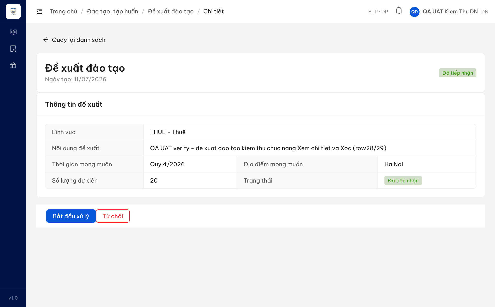

Bảng đối chiếu điều kiện: vòng 2 [`../../reverify-audit/rv5-conditions/QLDXDTTH_03.md`](../../reverify-audit/rv5-conditions/QLDXDTTH_03.md) · vòng 1 [`../../reverify-audit/rv4-conditions/QLDXDTTH_03.md`](../../reverify-audit/rv4-conditions/QLDXDTTH_03.md)

> ⚠️ **Trạng thái dữ liệu:** đề xuất `d3e209a9-12b9-4adf-8f7d-5adac62c6a91` vẫn đang ở **"Đã tiếp nhận"** do bước kiểm thử vòng 1 (đó là bằng chứng lỗi). Vòng 2 không đổi được nữa vì nút đã gỡ. Cần DBA reset về "Mới gửi" nếu muốn dùng lại từ trạng thái gốc.

**Đã ghi sheet:** row 28 → `Verify` (Q) = `Pass` (Pass thì không đụng cột P/R theo quy ước).

---

## 8. QLDXDTTH_06 (row 29) — ✅ PASS — ~~BUG-QLDXDTTH_06~~ [CLOSED]

> **Re-test:** 2026-07-16 rv5 (vòng 2, sau dev fix) — ✅ PASS (Closed-verified). Vai trò **DN** đã có nút [Xóa]; xóa thật đề xuất của chính mình (trạng thái "Mới gửi") → hộp xác nhận "Xóa đề xuất?" → thông báo **"Đã xóa đề xuất"** (đúng nguyên văn KQ mong đợi) → danh sách 2 → 1. Vế còn thiếu của vòng 1 đã fix. Xem "Kết quả vòng 2" dưới.

### Việc BA giao Dev

BA chốt **LÀ LỖI** (Dev FE): xóa đề xuất thành công phải có thông báo. Căn cứ: quy ước **UI-04** "thao tác thành công phải có thông báo" (`srs-v3.5.md:571`). Luồng tạo đề xuất đã có thông báo, luồng xóa thì không. Phạm vi giao diện DN đã được BA chốt từ 02/05/2026 → không còn vướng câu hỏi phạm vi. Verdict đổi từ "BA confirm" sang Open.

**Tiêu chí nghiệm thu (BA ghi):** **DN** xóa 1 đề xuất → hiện thông báo xóa thành công + danh sách cập nhật.

**Case gốc (row 29):** Mô tả = *"Xóa đề xuất ở trạng thái 'Mới' và do chính **Doanh nghiệp hoặc Người hỗ trợ** đang đăng nhập đã tạo"*. KQ mong đợi = *"Hệ thống hiển thị hộp xác nhận. Hệ thống xóa mềm đề xuất và hiển thị thông báo 'Đã xóa đề xuất'."*

### Mô tả

Lỗi gốc đối tác báo (xóa xong không có thông báo) **đã được sửa** — kiểm chứng bằng vai trò Người hỗ trợ. Nhưng ở vai trò **Doanh nghiệp**, đề xuất do chính DN tạo và còn ở trạng thái "Mới gửi" **không có nút Xóa** ở bất kỳ đâu (danh sách, màn chi tiết, form chỉnh sửa) — nên doanh nghiệp không xóa được đề xuất của chính mình, trái với mô tả của case.

### Các bước tái hiện

**Nhánh NHT (đạt):**
1. Đăng nhập `nht_qa_tw` ("QA NHT Trung uong", vai trò NHT).
2. **Đào tạo, tập huấn → Chương trình đào tạo → tab "Đề xuất đào tạo" → [Gửi đề xuất mới]** → tạo đề xuất (lĩnh vực Thuế).
3. Trên dòng vừa tạo (trạng thái **Mới gửi**), bấm **[Xóa]** → xác nhận.

**Nhánh DN (không đạt):**
1. Đăng nhập `0109998887` ("QA UAT Kiem Thu DN", vai trò DN).
2. Tab "Đề xuất đào tạo" → **[Gửi đề xuất mới]** → tạo đề xuất (lĩnh vực Lao động) → trạng thái **Mới gửi**.
3. Quan sát cột Hành động của dòng vừa tạo; mở màn chi tiết; mở form Chỉnh sửa.

### Kết quả mong đợi

Doanh nghiệp xóa được đề xuất của chính mình khi còn ở trạng thái Mới; hệ thống hiện hộp xác nhận rồi báo "Đã xóa đề xuất" và cập nhật danh sách.

### Kết quả thực tế

**Nhánh NHT — đạt đầy đủ:**
- Dòng vừa tạo (Mới gửi) có **3 nút: [Tiếp nhận] [Sửa] [Xóa]**.
- Bấm [Xóa] → hộp thoại **"Xóa đề xuất? Hành động này không thể hoàn tác."** ✅
- Xác nhận → toast **"Đã xóa đề xuất"** — **đúng nguyên văn** chuỗi trong KQ mong đợi ✅
- Bản ghi biến mất khỏi danh sách ✅
- → Lỗi gốc "không hiển thị thông báo xóa thành công" **đã hết**.

**Nhánh DN — không đạt:**
- Dòng đề xuất do chính DN tạo, trạng thái Mới gửi → chỉ có **2 nút: [Tiếp nhận] [Sửa]**. **Không có [Xóa].**
- Màn chi tiết: chỉ có [Quay lại danh sách] [Chỉnh sửa] [Tiếp nhận] → không có Xóa.
- Form "Cập nhật đề xuất đào tạo": chỉ có [Hủy] [Lưu] → không có Xóa.

**Bất nhất — cùng gốc với BUG-QLDXDTTH_03:** cùng một loại bản ghi, cùng trạng thái Mới gửi, cùng là chủ sở hữu, nhưng DN **có** nút [Tiếp nhận] (thao tác của cán bộ, không thuộc DN) và **không có** nút [Xóa] (thao tác của chính DN). Bộ nút của vai trò DN đang bị gán ngược.

### Kết quả vòng 2 (chiều 16/07, sau khi dev báo fix) — đạt

Chạy lại đúng vai trò **DN** mà BA đích danh, trên chính đề xuất do tài khoản DN này tạo ở vòng 1 (trạng thái **"Mới gửi"**):

- **Nút [Xóa] đã có:** cột Hành động hiện **[Sửa] [Xóa]** (vòng 1 là [Tiếp nhận] [Sửa]). Màn chi tiết cũng có [Xóa].
- **Chạy hết luồng, đủ 3 vế của KQ mong đợi:**
  1. Bấm [Xóa] → hộp thoại **"Xóa đề xuất? / Hành động này không thể hoàn tác."** + [Hủy] [Xóa] ✅
  2. Xác nhận → thông báo **"Đã xóa đề xuất"** — **đúng nguyên văn** chuỗi trong KQ mong đợi ✅
  3. Danh sách cập nhật ngay: **2 bản ghi → còn 1**, bản ghi vừa xóa biến mất hoàn toàn ✅
- → Luồng xóa của **DN** giờ giống hệt luồng của **NHT** (vốn đã đạt từ vòng 1). Vế còn thiếu **đã được fix**.

### Bằng chứng

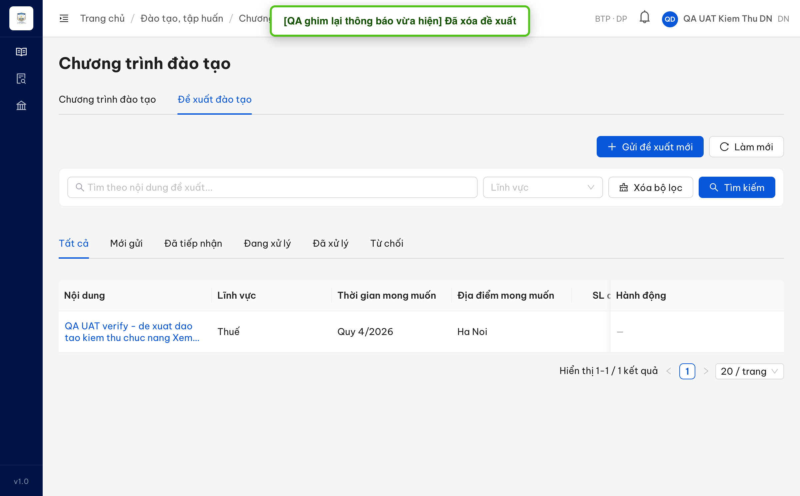

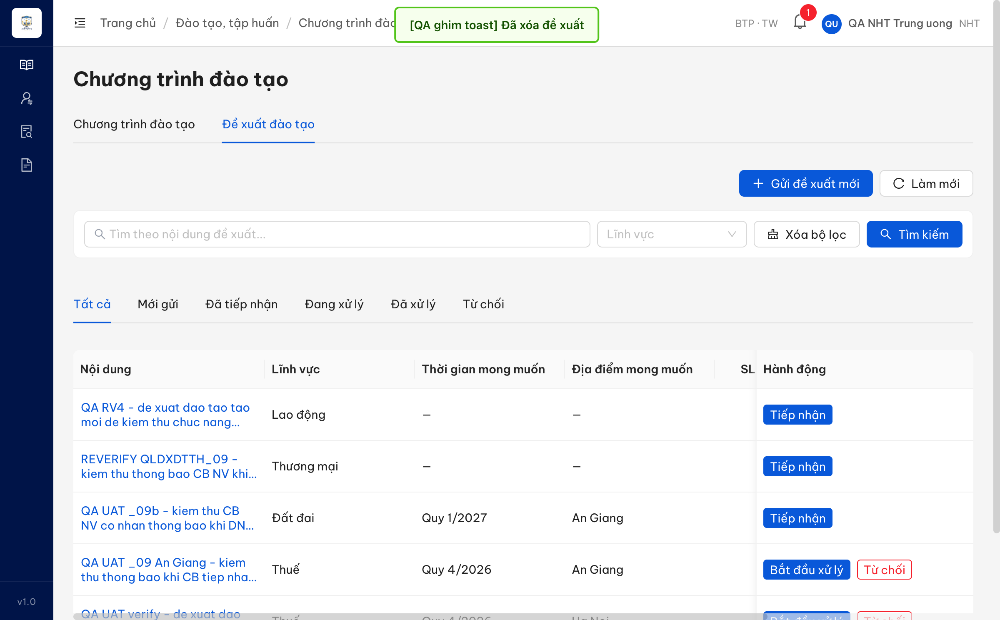

![Vòng 1 (lúc còn lỗi) — vai trò DN, đề xuất của chính mình trạng thái "Mới gửi" chỉ có [Tiếp nhận] [Sửa], không có [Xóa]](image/rv4-QLDXDTTH_06-dn-khong-co-nut-xoa.png)

Bảng đối chiếu điều kiện: vòng 2 [`../../reverify-audit/rv5-conditions/QLDXDTTH_06.md`](../../reverify-audit/rv5-conditions/QLDXDTTH_06.md) · vòng 1 [`../../reverify-audit/rv4-conditions/QLDXDTTH_06.md`](../../reverify-audit/rv4-conditions/QLDXDTTH_06.md)

**Đã ghi sheet:** row 29 → `Verify` (Q) = `Pass` (Pass thì không đụng cột P/R theo quy ước).

---

## 9. QLHSTVV_04 (row 59) — ✅ PASS

> **Re-test:** 2026-07-16 rv4 — ✅ PASS. Bấm "Quay lại danh sách" từ màn chi tiết tư vấn viên nay giữ nguyên thẻ trạng thái, từ khóa và bộ lọc nâng cao đang áp dụng; danh sách trả về đúng kết quả đã lọc trước đó.

### Việc BA giao Dev

BA duyệt 15/07/2026 — chuyển Dev FE: giữ bộ lọc khi bấm "Quay lại danh sách" từ màn chi tiết. Phạm vi giữ: **thẻ trạng thái + từ khóa + bộ lọc nâng cao + số trang**. SRS chỉ quy định nút Quay lại về mặt điều hướng, không nơi nào yêu cầu ghi nhớ bộ lọc (`srs-fr-04:1540`, `:1452-1459`) → khoảng trống SRS, BA quyết bổ sung và nâng thành quy ước chung áp mọi màn danh sách.

**Tiêu chí nghiệm thu (BA ghi):** lọc danh sách → mở chi tiết → Quay lại → bộ lọc, từ khóa và số trang giữ nguyên.

### Các bước đã chạy

Vai trò `cbnv_tw` (CB Nghiệp vụ - Trung ương), màn **Mạng lưới Tư vấn viên → Tư vấn viên / Chuyên gia**.

1. Chọn thẻ trạng thái **"Chờ kích hoạt tài khoản"** — cố tình chọn thẻ **không phải** thẻ mặc định ("Đang hoạt động") để nếu màn hình nhảy về mặc định là phát hiện được ngay.
2. Nhập từ khóa **"PheDuyet"**.
3. Mở **Bộ lọc nâng cao (2)** → đặt **Ngày công nhận từ 12/07/2026 đến 13/07/2026**.
4. Bấm **[Tìm kiếm]** → danh sách còn **2 mục**: TVV-BTP-TW-0008 (PheDuyet W2 C) + TVV-BTP-TW-0006 (PheDuyet W2 A). Bộ lọc ăn đúng: bản ghi TVV-BTP-TW-0013 bị loại vì ngày công nhận 15/07, TVV-BTP-TW-0005 bị loại vì không khớp từ khóa.
5. Bấm **[Xem]** trên TVV-BTP-TW-0008 → mở màn chi tiết.
6. Bấm **[Quay lại danh sách]** trên màn chi tiết.

### Kết quả mong đợi

Về đúng màn Danh sách tư vấn viên và giữ nguyên các bộ lọc đang áp dụng trước đó.

### Kết quả thực tế — đạt

Sau khi Quay lại, cả 3 chiều đều y nguyên: thẻ trạng thái vẫn là **"Chờ kích hoạt tài khoản"**, ô từ khóa vẫn là **"PheDuyet"**, bộ lọc nâng cao vẫn là **12/07/2026 – 13/07/2026**, và danh sách vẫn là đúng **2 mục** cũ. Lỗi đối tác báo ("không giữ nguyên các bộ lọc đang áp dụng trước đó") đã hết.

**Số trang — đã chạy đến mức dữ liệu cho phép.** Số trang đi theo đường dẫn y hệt các bộ lọc đã xác nhận ở trên, và phần mềm có đọc số trang từ đường dẫn khi vào màn danh sách: mở thẳng trang 2 của một thẻ chỉ có 6 bản ghi thì danh sách hiện rỗng (đúng), chứ không mặc kệ nhảy về trang 1. Nhưng **không thể đẩy danh sách sang trang 2 thật**: thẻ nhiều bản ghi nhất chỉ có 6 TVV, trong khi ô chọn số bản ghi mỗi trang chỉ cho 10/20/50/100. Muốn có trang 2 phải thêm 5–7 hồ sơ TVV mới (form 11 trường bắt buộc mỗi hồ sơ) → đổ rác vào môi trường đối tác nên không làm; ghi nhận giới hạn thay vì kết luận bừa.

**Quan sát phụ, ngoài phạm vi case (không dùng để ra verdict):** ô **"số bản ghi mỗi trang"** không tự phục hồi — đổi sang 10/trang rồi mở chi tiết rồi Quay lại thì đường dẫn vẫn giữ `pageSize=10` nhưng ô chọn hiện lại "20 / trang". Đây không phải bộ lọc, không phải số trang, không nằm trong Kết quả mong đợi của case, và cũng không phải lỗi mới do bản fix này đẻ ra (trước fix thì không giữ gì cả) → không tính Reopen. Chỉ ghi lại để dev/BA biết: nếu cán bộ đang ở 10/trang và đang ở trang 2 rồi quay lại, danh sách có thể về trang trống. Nên dev kiểm thêm.

### Bằng chứng

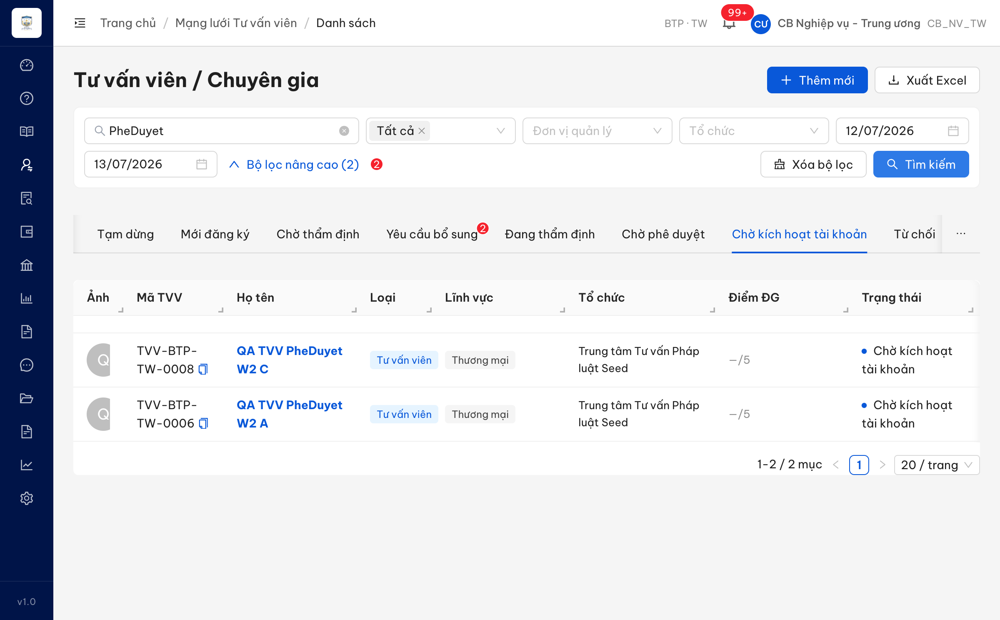

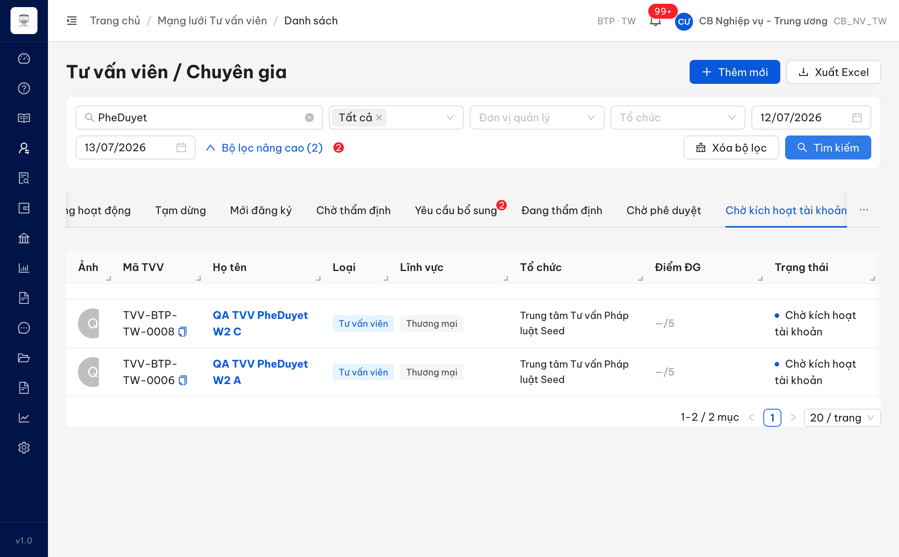

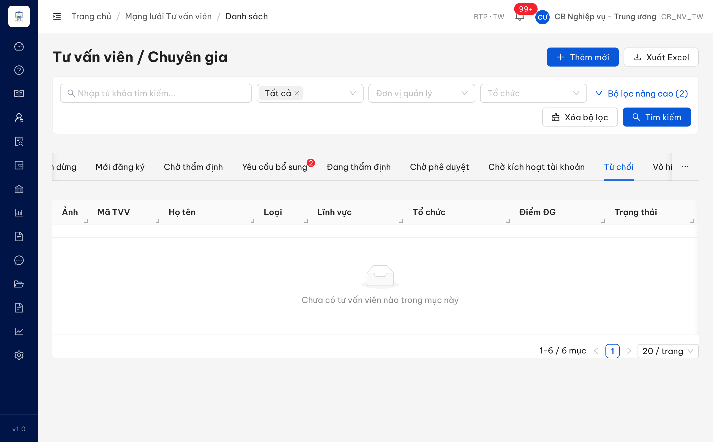

Bảng đối chiếu điều kiện: [`../../reverify-audit/rv4-conditions/QLHSTVV_04.md`](../../reverify-audit/rv4-conditions/QLHSTVV_04.md)

**Đã ghi sheet:** row 59 → `Verify` (Q) = `Pass` (không đụng cột khác).

---

## 10. TDHSTVV_09 (row 65) — ✅ PASS — ~~BUG-TDHSTVV_09~~ [CLOSED]

> **Re-test:** 2026-07-16 rv5 (vòng 2, sau dev fix) — ✅ PASS (Closed-verified), đạt cả 3/3 tiêu chí BA chốt. Mất mạng bấm Lưu nháp → hiện **"Lưu thất bại. Vui lòng kiểm tra kết nối và thử lại."** (đúng nguyên văn mẫu BA dẫn) + spinner dừng + **có nút [Thử lại] chạy thật**; thông báo đổi sang dạng không tự tắt (đo lại sau 11 giây vẫn còn). Xem "Kết quả vòng 2" dưới.

### Việc BA giao Dev

BA duyệt 15/07/2026 — chuyển Dev FE. Trước fix, hệ thống **nuốt lỗi trong im lặng**: bấm Lưu nháp khi mất mạng thì không báo gì, nút quay vòng mãi không dừng, bản nháp thực ra đã hỏng → cán bộ tưởng đã lưu. BA nâng quy ước báo lỗi mất kết nối của module Vụ việc (`srs-fr-05-vu-viec.md:1567`, `:1574`) thành **quy ước chung** áp mọi module — module IV hiện chỉ liệt kê 3 lỗi nghiệp vụ (`srs-fr-04:539-541`). Cùng gốc với `BUG-TDHSTVV_08`.

**Tiêu chí nghiệm thu (BA ghi):** ngắt mạng → bấm Lưu nháp → **hiện thông báo lỗi** + **spinner dừng** + **có nút Thử lại**.

### Tạo tiền đề (thẻ "Đang thẩm định" đang rỗng)

Bug gốc xảy ra ở hồ sơ trạng thái **"Đang thẩm định"**, nhưng thẻ đó và thẻ "Chờ thẩm định" hiện đều **rỗng**, còn 2 hồ sơ ở "Yêu cầu bổ sung" thì tab Thẩm định bị **khóa**. Nên tôi tự tạo tiền đề: thêm mới 1 hồ sơ TVV qua nút **[Thêm mới]** (11 trường bắt buộc + file thẻ hành nghề PDF) → hồ sơ **TVV-BTP-TW-0014 "QA TVV RV4 Tham Dinh Offline"** vào thẻ "Mới đăng ký"; bấm **[Lưu nháp]** lần đầu **khi còn mạng** → hệ thống báo "Đã lưu kết quả thẩm định" và chuyển hồ sơ **Mới đăng ký → Đang thẩm định**. Đến đây mới đúng trạng thái bug gốc.

### Các bước đã chạy

Vai trò `cbnv_tw` (CB Nghiệp vụ - Trung ương, BTP · TW), hồ sơ TVV-BTP-TW-0014 trạng thái **Đang thẩm định**, tab **Thẩm định**.

1. Điền biểu mẫu: Kết luận Pháp lý = **Đạt**, 3 ô Nhận xét (Nhóm 2/3/4) có nội dung, Kết luận thẩm định = **ĐẠT**.
2. **Ngắt mạng thật** — bật chế độ Offline của trình duyệt. Kiểm chứng ngay trong cùng phiên: `navigator.onLine = false` và mọi yêu cầu ra máy chủ ném `TypeError: Failed to fetch`.
3. Bấm **[Lưu nháp]**. Quan sát bằng MutationObserver cài **trước** cú bấm (thông báo tự tắt sau ~3 giây nên không thể dò sau).

### Kết quả mong đợi

Hiện thông báo lỗi mất kết nối, spinner dừng, và có cách thử lại ngay tại chỗ báo lỗi.

### Kết quả thực tế — đạt 2/3

| Tiêu chí BA | Kết quả |
|---|---|
| Hiện thông báo lỗi mất kết nối | ✅ Toast **"Không kết nối được máy chủ."** — trước đây im lặng hoàn toàn |
| Spinner dừng | ✅ Sau cú bấm, **không nút nào** còn trạng thái đang tải; 3 nút Lưu nháp / Gửi KQ / Trình duyệt đều nhả ra — trước đây kẹt quay vòng vô hạn |
| Có nút Thử lại | ❌ **Không có** nút/liên kết "Thử lại" nào trên toàn trang. Thông báo lỗi chỉ là một dòng chữ trong toast, không kèm thao tác nào, và **tự tắt sau ~3 giây** (đo lại sau 6 giây: không còn toast nào trên màn) |

Mẫu BA dẫn (`srs-fr-05-vu-viec.md:1574`): *"Lưu thất bại. Vui lòng kiểm tra kết nối và thử lại."* + nút **[Thử lại]**. Phần mềm chưa có vế nút/thao tác thử lại này. Cán bộ nhìn đi chỗ khác vài giây là mất hẳn dấu vết, không còn gì nhắc là vừa lưu hỏng.

**Điểm giảm nhẹ (ghi cho dev):** dữ liệu **không mất**. Sau khi báo lỗi, 3 ô Nhận xét + 2 radio kết luận vẫn còn nguyên trên biểu mẫu; bật mạng lại rồi bấm Lưu nháp thì lưu được ngay ("Đã lưu kết quả thẩm định"). Tức chỉ thiếu đường dẫn thử lại ngay tại chỗ báo lỗi, không phải mất trắng dữ liệu như trước.

### Kết quả vòng 2 (chiều 16/07, sau khi dev báo fix) — đạt 3/3

Thẻ "Đang thẩm định" lại rỗng (hồ sơ TVV-BTP-TW-0014 của vòng 1 đã đi tiếp sang "Chờ kích hoạt"), nên tự tạo lại tiền đề: hồ sơ mới **TVV-BTP-TW-0015 "QA TVV RV5 Tham Dinh Offline 2"** → [Lưu nháp] khi còn mạng → chuyển **Đang thẩm định**. Rồi ngắt mạng thật (chế độ Offline của trình duyệt, `navigator.onLine = false`, mọi yêu cầu ném `TypeError: Failed to fetch`) → bấm [Lưu nháp].

| Tiêu chí BA | Vòng 1 | Vòng 2 |
|---|---|---|
| Hiện thông báo lỗi mất kết nối | ✅ nhưng khác câu chữ mẫu ("Không kết nối được máy chủ.") | ✅ **"Lưu thất bại. Vui lòng kiểm tra kết nối và thử lại."** — **đúng nguyên văn** mẫu BA dẫn ở `srs-fr-05-vu-viec.md:1574` |
| Spinner dừng | ✅ | ✅ Không nút nào còn trạng thái đang tải |
| Có nút Thử lại | ❌ không có | ✅ **Có nút [Thử lại]** ngay trong khung báo lỗi |

**Đã kiểm nút có chạy thật không, không chỉ "có vẻ là nút":** bật mạng lại → bấm **chính nút [Thử lại]** → hệ thống báo **"Đã lưu kết quả thẩm định"**, khung báo lỗi biến mất, 3 ô Nhận xét vẫn còn nguyên dữ liệu. Nút thực sự thực thi lại thao tác, không phải nút trang trí.

**Đã khắc phục đúng điểm tôi nêu ở vòng 1:** dev đổi từ toast (`ant-message`, tự tắt ~3 giây) sang **notification** (`ant-notification-topRight`) — đo lại sau **11 giây**: thông báo **vẫn còn** trên màn, nút [Thử lại] vẫn còn. Hết cảnh "cán bộ nhìn đi chỗ khác vài giây là mất hẳn dấu vết".

### Bằng chứng

![Vòng 2 — mất mạng bấm Lưu nháp: khung "Lưu thất bại. Vui lòng kiểm tra kết nối và thử lại." kèm nút [Thử lại]; 3 nút Lưu nháp/Gửi KQ/Trình duyệt không còn quay vòng](image/rv5-TDHSTVV_09-bao-loi-co-nut-thu-lai.png)

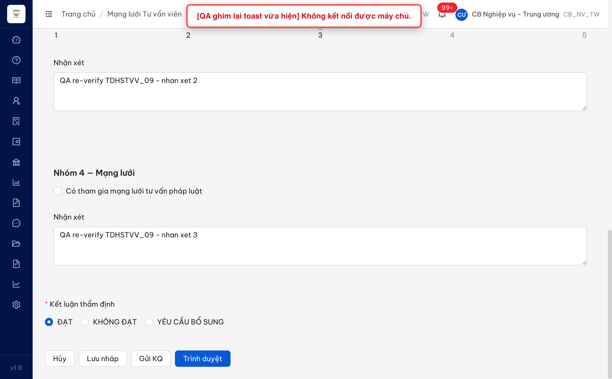

Bảng đối chiếu điều kiện: vòng 2 [`../../reverify-audit/rv5-conditions/TDHSTVV_09.md`](../../reverify-audit/rv5-conditions/TDHSTVV_09.md) · vòng 1 [`../../reverify-audit/rv4-conditions/TDHSTVV_09.md`](../../reverify-audit/rv4-conditions/TDHSTVV_09.md)

**Đã ghi sheet:** row 65 → `Verify` (Q) = `Pass` (Pass thì không đụng cột P/R theo quy ước).

---

## 11. PDHSTVV_06 (row 74) — ✅ PASS — ~~BUG-PDHSTVV_06~~ [CLOSED]

> **Re-test:** 2026-07-16 rv5 (vòng 2, sau dev fix) — ✅ PASS (Closed-verified), đạt cả 2/2 điều chỉnh BA chuyển Dev. Mail kích hoạt gửi chủ hồ sơ nay có dòng **"Hồ sơ của bạn đã được công nhận, mã số tư vấn viên: TVV-BTP-TW-0015."** (đúng nguyên văn KQ mong đợi, mã đúng của hồ sơ vừa duyệt), và thông báo trên màn đã là **"Đã công nhận tư vấn viên"**. Xem "Kết quả vòng 2" dưới.

> ⚠️ **Lưu ý về ô sheet (giữ lại để người phụ trách sheet biết):** ở vòng 1, lúc tôi ghi `Reopen` thì ô `Verify` (Q74) đang có sẵn giá trị **`Pass`** chứ không trống — khác với lúc tôi lọc danh sách 14 case buổi sáng (khi đó Q74 trống). Tức có người đánh `Pass` vào ô này trong lúc tôi đang chạy. Vòng 2 chạy lại thì kết quả **đúng là Pass** thật, nhưng việc ô bị sửa song song vẫn nên được xác nhận lại.

### Việc BA giao Dev

BA chốt ý chính là **không phải lỗi**: sau phê duyệt, hồ sơ chuyển "Chờ kích hoạt tài khoản" là **đúng cơ chế** (hệ thống tự tạo tài khoản + gửi mail kích hoạt; TVV kích hoạt xong mới sang "Đang hoạt động") — đặc tả xử lý đã ghi đúng (`srs-fr-04:591`, `:619-620`), 2 dòng mô tả màn hình còn ghi "Đang hoạt động" (`:1545`, `:1582`) là câu chữ sót của bản cũ do **BA dọn**.

**Kèm 2 điều chỉnh nhỏ chuyển Dev — đây là phần re-verify:**
1. Bổ sung **mã số TVV** vào nội dung mail kích hoạt.
2. Đổi câu chữ thông báo thành **"Đã công nhận tư vấn viên"** cho khớp tài liệu bàn giao.

Chỉ gửi chủ hồ sơ — PDHSTVV_08 đã chốt không thêm người nhận.

### Tạo tiền đề

Thẻ "Chờ phê duyệt" chỉ có 1 bản ghi seed sẵn (giữ nguyên, không đụng). Thay vào đó dùng chính hồ sơ **TVV-BTP-TW-0014** tôi tạo ở case TDHSTVV_09: `cbnv_tw` bấm **[Trình duyệt]** trên tab Thẩm định (kết luận ĐẠT) → xác nhận → hồ sơ chuyển **Đang thẩm định → Chờ phê duyệt**. Rồi đăng nhập `cbpd_tw` ở phiên riêng để phê duyệt.

### Các bước đã chạy

1. Đăng nhập **`cbpd_tw`** (CB Phê duyệt - Trung ương, badge CB_PD_TW).
2. Mở hồ sơ **TVV-BTP-TW-0014** trạng thái **"Chờ phê duyệt"** → có nút **[Phê duyệt]** / [Từ chối].
3. Bấm **[Phê duyệt]** → điền Số quyết định `QĐ-1607/QĐ-BTP` → xác nhận. Quan sát thông báo bằng MutationObserver cài trước cú bấm.
4. Mở hộp thư (MailHog) đọc mail thực tế gửi ra — cả bản HTML lẫn bản chữ thuần.

### Kết quả mong đợi

Mail gửi chủ hồ sơ có nội dung "Hồ sơ của bạn đã được công nhận, mã số tư vấn viên: {mã}"; thông báo trên màn là "Đã công nhận tư vấn viên".

### Kết quả thực tế — 0/2 điều chỉnh được làm

| Điều chỉnh BA giao Dev | Kết quả |
|---|---|
| Bổ sung mã số TVV vào mail kích hoạt | ❌ Mail có gửi đúng chủ hồ sơ (`qa.tvv.rv4.thamdinh@htpldn.test`, tiêu đề *"Hồ sơ TVV đã được phê duyệt — kích hoạt tài khoản"*), nội dung gồm lời chào + câu báo đã phê duyệt + link kích hoạt. Quét cả bản HTML lẫn bản chữ thuần: **không có** `TVV-BTP-TW-0014`, không có mã tư vấn viên nào, cũng không có cụm "mã số" |
| Đổi câu chữ thành "Đã công nhận tư vấn viên" | ❌ Thông báo hiện ra vẫn nguyên văn **"Phê duyệt TVV thành công"** |

**Các ý khác — đúng, không phải lỗi (khớp kết luận BA):** hồ sơ chuyển **"Chờ kích hoạt tài khoản"**, ghi nhận **Ngày công nhận 16/07/2026**, hệ thống tự tạo tài khoản và gửi mail kích hoạt cho chủ hồ sơ.

### Kết quả vòng 2 (chiều 16/07, sau khi dev báo fix) — đạt 2/2

Hồ sơ vòng 1 đã phê duyệt rồi nên không dùng lại được → tạo lại tiền đề: hồ sơ **TVV-BTP-TW-0015** (chính hồ sơ dùng ở case TDHSTVV_09) → [Trình duyệt] → chuyển **"Chờ phê duyệt"** → đăng nhập `cbpd_tw` ở phiên riêng → bấm **[Phê duyệt]** thật, Số quyết định `QĐ-1607b/QĐ-BTP`.

| Điều chỉnh BA giao Dev | Vòng 1 | Vòng 2 |
|---|---|---|
| Bổ sung mã số TVV vào mail kích hoạt | ❌ mail chỉ có lời chào + câu báo đã phê duyệt + link kích hoạt, không có mã nào | ✅ Mail gửi đúng chủ hồ sơ (`qa.tvv.rv5.thamdinh@htpldn.test`), tiêu đề *"Hồ sơ TVV đã được phê duyệt — kích hoạt tài khoản"*, **có dòng "Hồ sơ của bạn đã được công nhận, mã số tư vấn viên: TVV-BTP-TW-0015."** — đúng **nguyên văn** câu trong KQ mong đợi, mã đúng của hồ sơ vừa duyệt |
| Đổi câu chữ thành "Đã công nhận tư vấn viên" | ❌ vẫn là "Phê duyệt TVV thành công" | ✅ Thông báo hiện ra nguyên văn **"Đã công nhận tư vấn viên"** |

Người nhận vẫn **chỉ là chủ hồ sơ** — đúng PDHSTVV_08 đã chốt không thêm người nhận.

### Bằng chứng


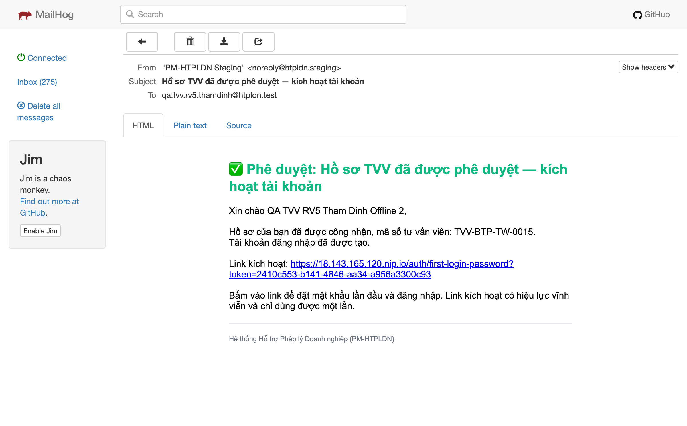

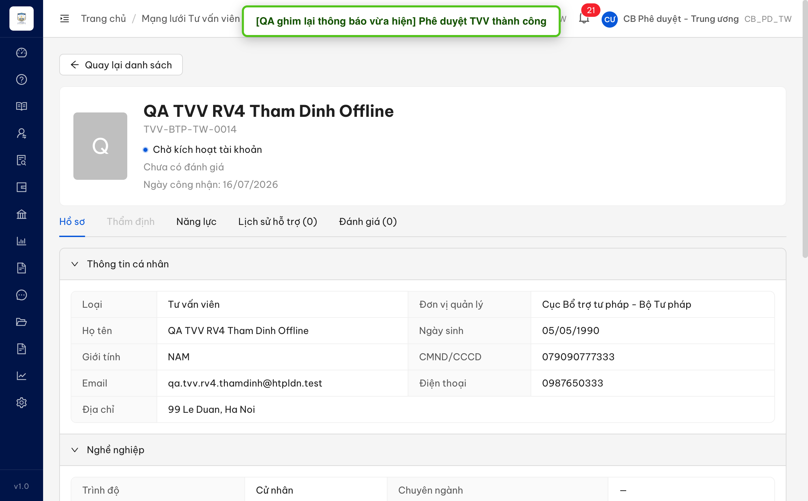

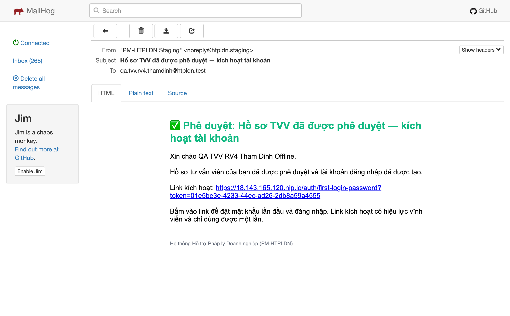

Bảng đối chiếu điều kiện: vòng 2 [`../../reverify-audit/rv5-conditions/PDHSTVV_06.md`](../../reverify-audit/rv5-conditions/PDHSTVV_06.md) · vòng 1 [`../../reverify-audit/rv4-conditions/PDHSTVV_06.md`](../../reverify-audit/rv4-conditions/PDHSTVV_06.md)

**Đã ghi sheet:** row 74 → `Verify` (Q) = `Pass` (Pass thì không đụng cột P/R theo quy ước).

---

## 12. NHSYC_08 (row 92) — ✅ PASS

> **Re-test:** 2026-07-16 rv4 — ✅ PASS. Nhập dở form Nhập thủ công vụ việc rồi bấm Hủy: hệ thống hỏi lại đúng nguyên văn thiết kế; chọn ở lại thì dữ liệu còn nguyên, chọn đồng ý thì mới rời form.

### Việc BA giao Dev

BA duyệt 16/07/2026 — chuyển Dev FE. Trước fix, bấm "Hủy" là về danh sách ngay, không hỏi gì, dữ liệu form 4 nhóm mất luôn. Căn cứ: SRS im lặng ở module Vụ việc (`:1695`), nhưng **hai module cùng sản phẩm hành xử khác nhau ở cùng một thao tác** — module Tư vấn viên đã có hộp thoại xác nhận, module Vụ việc thì chưa. BA chuẩn hóa thành **quy ước chung** trong SRS (cạnh UI-04), áp mọi module.

**Tiêu chí nghiệm thu (BA ghi):** nhập dở form → bấm Hủy → hiện hộp thoại xác nhận, chọn ở lại thì giữ nguyên dữ liệu.

### Các bước đã chạy

Vai trò `cbnv_tw`, màn **Vụ việc HTPL** → nút **[Nhập thủ công]** (`/vu-viec/tao-moi`).

1. Nhập dở 2 trường: **Tiêu đề vụ việc** + **Nội dung yêu cầu**.
2. Bấm **[Hủy]** → quan sát hộp thoại (MutationObserver cài trước cú bấm).
3. Chạy **cả hai nhánh**: chọn **[Tiếp tục nhập]** (ở lại) và chọn **[Hủy bỏ]** (đồng ý rời).
4. Chạy thêm **nhánh đối chiếu**: form **trống** (chưa nhập gì) → bấm Hủy.

### Kết quả mong đợi

Hiện xác nhận "Bạn có chắc chắn muốn hủy? Dữ liệu đã nhập sẽ không được lưu". Đồng ý → chuyển trang; không đồng ý → giữ nguyên màn hình.

### Kết quả thực tế — đạt cả 3 nhánh

| Nhánh | Kết quả |
|---|---|
| Bấm Hủy khi form còn dữ liệu | ✅ Hiện hộp thoại **"Xác nhận hủy"** / *"Bạn có chắc chắn muốn hủy? Dữ liệu đã nhập sẽ không được lưu."* + 2 nút **[Tiếp tục nhập]** / **[Hủy bỏ]** — **trùng khớp nguyên văn** Kết quả mong đợi. Trước đây không hỏi gì |
| Chọn ở lại ([Tiếp tục nhập]) | ✅ Hộp thoại đóng, vẫn ở form, **dữ liệu giữ nguyên 100%** — cả Tiêu đề lẫn Nội dung yêu cầu còn nguyên văn |
| Chọn đồng ý ([Hủy bỏ]) | ✅ Chuyển về màn danh sách Vụ việc HTPL |

**Nhánh đối chiếu — form trống bấm Hủy:** về thẳng danh sách, **không hỏi**. Đúng phạm vi BA nêu ("hộp thoại xác nhận khi rời form **còn dữ liệu chưa lưu**") — hộp thoại không bị bật máy móc mỗi lần bấm Hủy.

### Bằng chứng

![Form Nhập thủ công đã nhập dở + hộp thoại "Xác nhận hủy" với câu chữ đúng nguyên văn và 2 nút [Tiếp tục nhập] / [Hủy bỏ]](image/rv4-NHSYC_08-hop-thoai-xac-nhan-huy.png)

Bảng đối chiếu điều kiện: [`../../reverify-audit/rv4-conditions/NHSYC_08.md`](../../reverify-audit/rv4-conditions/NHSYC_08.md)

**Đã ghi sheet:** row 92 → `Verify` (Q) = `Pass` (không đụng cột khác).

---

## 13. KTHSYCHTPL_04 (row 95) — ✅ PASS

> **Re-test:** 2026-07-16 rv4 — ✅ PASS. Nhãn tiếng Anh "Deadline" đã đổi thành **"Thời hạn xử lý"**, và màn danh sách dùng đúng cùng nhãn — không còn chữ "Deadline" ở đâu trên cả hai màn.

### Việc BA giao Dev

BA chốt 16/07/2026 — **là lỗi**, BA sửa SRS rồi chuyển Dev. Nhãn "Deadline" vi phạm quy ước **UI-06 "tiếng Việt là ngôn ngữ duy nhất", không ngoại lệ** (`srs-v3.5.md:573`) — đây là nhãn tiếng Anh duy nhất trong nhóm (6 nhãn còn lại đều tiếng Việt). BA đồng thời sửa `srs-fr-05:1637-1638` ("Deadline SLA" → "Thời hạn xử lý", "Cảnh báo SLA" → "Cảnh báo thời hạn") để áp thống nhất cả 2 màn — nếu không, BUG-QLTNVV_02 sẽ kéo Dev về hướng ngược lại làm 2 màn lệch nhau.

**Tiêu chí nghiệm thu (BA ghi):** màn chi tiết vụ việc hiện "Thời hạn xử lý"; màn danh sách dùng cùng nhãn.

### Các bước đã chạy

Vai trò `cbnv_tw`, module **Vụ việc HTPL**.

1. Mở **màn chi tiết** vụ việc VV-STP-AG-20260712-003 → đọc nhãn trường thời hạn ở mục "Nội dung Yêu cầu".
2. **Mở hết 12 mục thu gọn** của màn chi tiết rồi quét lại — để không sót nhãn nằm trong panel chưa render.
3. Quét không chỉ chữ hiển thị mà cả thuộc tính `title` / `aria-label` / `placeholder` / `alt` của **toàn bộ** phần tử — phòng trường hợp "Deadline" còn nấp trong tooltip.
4. Quay ra **màn danh sách** → đọc tiêu đề cột.

### Kết quả mong đợi

Trường thời hạn hiển thị bằng tiếng Việt ("Thời hạn xử lý"), và màn danh sách dùng cùng nhãn.

### Kết quả thực tế — đạt cả 2 màn

| Màn | Kết quả |
|---|---|
| Chi tiết vụ việc | ✅ Hiện **"Thời hạn xử lý"** kèm giá trị `31/07/2026`. Quét toàn màn sau khi mở hết 12 mục thu gọn: **không còn chuỗi "Deadline"** ở bất kỳ đâu — kể cả trong tooltip/thuộc tính |
| Danh sách vụ việc | ✅ Tiêu đề cột: *Mã vụ việc · Tên doanh nghiệp · Lĩnh vực pháp luật · Kênh tiếp nhận · Trạng thái · Người xử lý / Tổ chức · Ngày tiếp nhận · **Thời hạn xử lý** · **Cảnh báo thời hạn** · Hành động*. Cả 2 nhãn đều đã đổi đúng theo SRS BA sửa |

Hai màn **thống nhất cùng một nhãn** — đúng ý BA lo xa (tránh BUG-QLTNVV_02 kéo ngược làm 2 màn lệch nhau).

### Bằng chứng

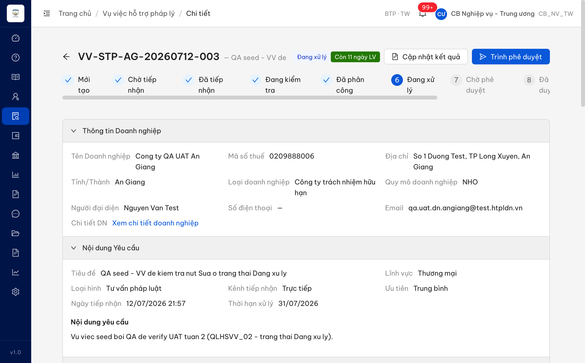

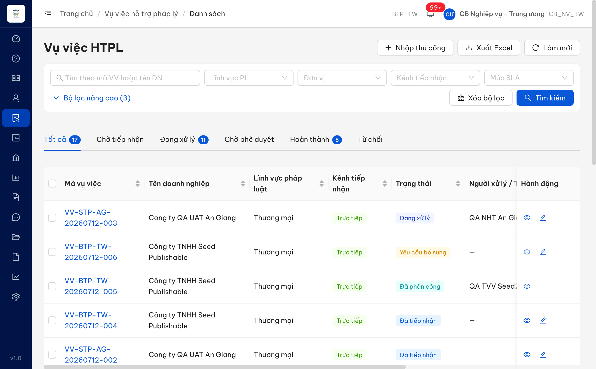

Bảng đối chiếu điều kiện: [`../../reverify-audit/rv4-conditions/KTHSYCHTPL_04.md`](../../reverify-audit/rv4-conditions/KTHSYCHTPL_04.md)

**Đã ghi sheet:** row 95 → `Verify` (Q) = `Pass` (không đụng cột khác).

---

## 14. TKHSYCHTPL_02 (row 105) — ✅ PASS

> **Re-test:** 2026-07-16 rv4 — ✅ PASS. Cấp Trung ương đã có bộ lọc "Đơn vị" và lọc ra đúng vụ việc theo đơn vị (17 → 3); cấp Bộ ngành và Địa phương đều không thấy bộ lọc này.

### Việc BA giao Dev

BA duyệt 16/07/2026 — chuyển Dev. Bổ sung bộ lọc **"Đơn vị"** vào màn danh sách vụ việc, **chỉ hiện với cấp Trung ương**. Lý do: cho quyền xem toàn quốc mà không cho công cụ lọc là thiết kế chưa trọn; CB Bộ ngành / Địa phương đã bị giới hạn 1 đơn vị nên với họ trường lọc này vô nghĩa. Trước đây thanh tìm kiếm 6 trường là **đúng SRS** (`srs-fr-05:1622-1628`, `:645-652`) nên không tính lỗi; nay BA quyết bổ sung. Owner: BA bổ sung `don_vi_id` vào SCR-V.I-01 và FR-V.I-08 §Đầu vào → Dev FE + BE.

**Tiêu chí nghiệm thu (BA ghi):** đăng nhập cấp TW → có bộ lọc Đơn vị, lọc ra đúng vụ việc theo đơn vị; đăng nhập Bộ ngành/Địa phương → không thấy bộ lọc này.

### Các bước đã chạy

Màn **Vụ việc HTPL** (`/vu-viec/danh-sach`) — chạy với **cả 3 vai trò**, mỗi vai trò một phiên riêng biệt (isolatedContext) để không lẫn phiên đăng nhập.

1. `cbnv_tw` (CB_NV_TW, BTP · TW) → đọc thanh tìm kiếm; chọn thật một đơn vị + bấm [Tìm kiếm] + đếm kết quả.
2. `cbnv_bn` (CB_NV_BN, BTP · BN) → đọc thanh tìm kiếm, **mở cả "Bộ lọc nâng cao"** để chắc chắn bộ lọc không nấp trong đó.
3. `cbnv_dp` (CB_NV_DP, BTP · DP) → như trên.

### Kết quả mong đợi

Cấp TW có bộ lọc Đơn vị và lọc đúng; cấp Bộ ngành / Địa phương không thấy bộ lọc.

### Kết quả thực tế — đạt cả 3 vai trò

| Vai trò | Kết quả |
|---|---|
| `cbnv_tw` — Trung ương | ✅ **Có** bộ lọc "Đơn vị" (cạnh Lĩnh vực PL / Kênh tiếp nhận / Mức SLA), dropdown nạp đủ danh sách đơn vị và tìm kiếm được. **Lọc thật:** chọn "Sở Tư pháp An Giang" → [Tìm kiếm] → danh sách **từ 17 xuống đúng 3 kết quả**, cả 3 đều là VV-**STP-AG**-20260712-001/-002/-003 → lọc ra đúng vụ việc theo đơn vị, không phải chỉ hiện cho có |
| `cbnv_bn` — Bộ ngành | ✅ **Không** thấy bộ lọc "Đơn vị" — thanh tìm kiếm chỉ còn Lĩnh vực PL / Kênh tiếp nhận / Mức SLA / Trạng thái. Mở cả Bộ lọc nâng cao vẫn không có. Danh sách: 4 kết quả trong phạm vi đơn vị mình |
| `cbnv_dp` — Địa phương | ✅ **Không** thấy bộ lọc "Đơn vị" — như trên. Danh sách: 3 kết quả trong phạm vi đơn vị mình |

### Bằng chứng

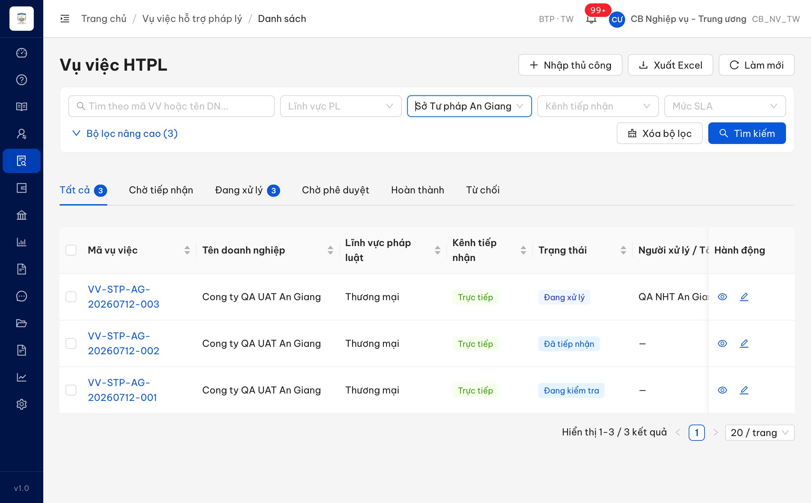

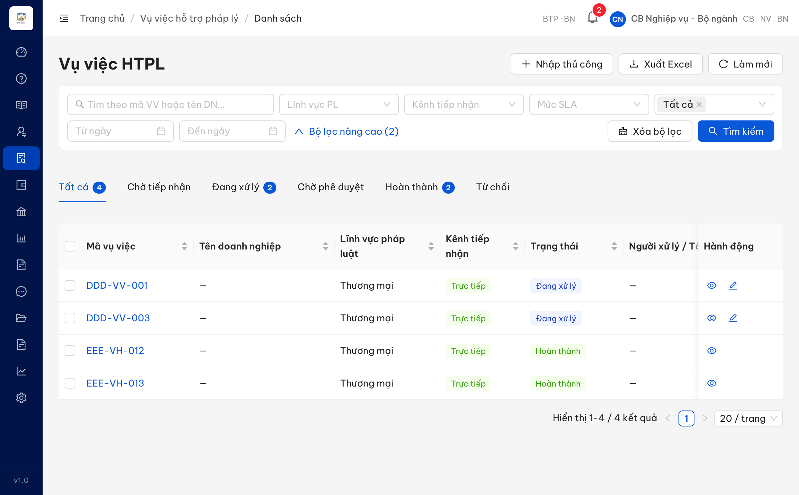

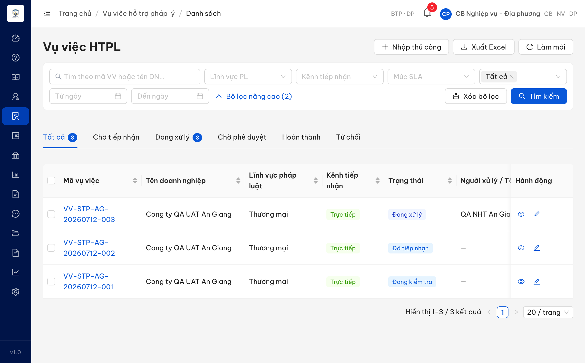

Bảng đối chiếu điều kiện: [`../../reverify-audit/rv4-conditions/TKHSYCHTPL_02.md`](../../reverify-audit/rv4-conditions/TKHSYCHTPL_02.md)

**Đã ghi sheet:** row 105 → `Verify` (Q) = `Pass` (không đụng cột khác).

---

## 15. KTDGKQHT_03 (row 5) — 🔴 REOPEN — BUG-KTDGKQHT_03

> **Re-test:** 2026-07-17 rv7 (sau khi dev báo fix lần 3) — ✅ **PASS (Closed-verified), đạt 4/4 ý BA chốt.** Ý 4 — thứ duy nhất còn lại sau 2 vòng Reopen — **đã fix thật và fix đúng bài**: khóa **"Đã kết thúc"** (KH-SEED-0001) nay **mất hẳn nút [Lưu điểm danh] và [Import Excel]** (chỉ còn [Xuất Excel]); sau khi chọn buổi thì **cả 3 ô trạng thái + ô Ghi chú đều xám mờ, không sửa được**; giá trị đã lưu vẫn hiển thị đúng. **Máy chủ cũng chặn** (403 `ERR-BIZ-III-05-01` *"Chỉ điểm danh được khi khóa học đang diễn ra"*) → chặn ở **cả 2 tầng**, không phải chỉ ẩn nút. Đúng PRE-03 (`srs-fr-03-dao-tao.md:533`) + tác động "Đóng điểm danh" (`srs-v3.5.md:5759`). Ý 1–3 không hỏng ngược. ⚠️ Nhưng vòng này phát hiện **1 lỗi MỚI hỏng ngược** ở chính tab Điểm danh — xem **QLKH_03 / BUG-DD-VANG-MA** (mục 19).

### Việc BA giao Dev

BA chốt 16/07/2026 giữ **Fail một phần** — ý chính không phải lỗi, kèm 2 việc chuyển Dev:

- Bảng danh sách học viên trống khi **chưa chọn buổi** là **đúng thiết kế** (FR-III-05: điểm danh gắn với `lich_hoc_id`), không phải mất dữ liệu.
- **Chuyển Dev:** (a) đổi bộ chọn từ **ô chọn NGÀY** sang **danh sách BUỔI HỌC** (Ngày · Khung giờ · Nội dung) — vì 1 ngày có thể có 2 buổi sáng/chiều, chọn theo ngày sẽ ghi sai buổi → sai chuyên cần → sai kết quả Đạt/Không đạt; (b) bổ sung dòng **"Vui lòng chọn buổi học để bắt đầu điểm danh"** khi chưa chọn buổi.
- BA cũng đề nghị tổ kiểm thử **bỏ trạng thái "Đã kết thúc"** khỏi ô Điều kiện của test case, vì theo bảng chuyển trạng thái Khóa học thì khóa "Đã kết thúc" là **đóng điểm danh**.

**Tiêu chí nghiệm thu (BA ghi, 4 ý):** (1) chưa chọn buổi → hiện dòng nhắc, không còn bảng trống trơn; (2) bộ chọn là danh sách buổi học, mỗi buổi hiện Ngày · Khung giờ · Nội dung; (3) khóa có 2 buổi cùng 1 ngày → chọn từng buổi, điểm danh độc lập, 1 học viên ghi được Có mặt buổi sáng + Vắng buổi chiều, lưu thành công cả 2, hết lỗi "cần truyền lichHocId"; (4) khóa **"Đã kết thúc"** → tab Điểm danh **chỉ đọc**, không lưu được điểm danh nữa.

### Mô tả

Ở tab **Điểm danh** của khóa học đã ở trạng thái **"Đã kết thúc"**, cán bộ nghiệp vụ vẫn sửa và **lưu được** điểm danh. Nút "Lưu điểm danh" bị khóa khi chưa chọn buổi, nhưng **mở khóa ngay sau khi chọn một buổi**; các ô chọn trạng thái và ô Ghi chú đều sửa được. Bấm Lưu thì hệ thống báo "Đã lưu điểm danh" và **máy chủ ghi thật** — tải lại trang, dữ liệu đã đổi vẫn còn. Trong khi BA chốt khóa "Đã kết thúc" là đóng điểm danh, tab này phải chỉ đọc.

### Tạo tiền đề

Môi trường không có khóa nào vừa **"Đang diễn ra"** vừa có lịch học. Khóa `DDD-KH-011` tuy "Đang diễn ra" nhưng **không thêm được buổi học** (bản ghi seed hỏng — xem mục Ghi nhận thêm). Nên tự đi hết quy trình: `cbnv_tw` tạo khóa mới điền đủ thông tin vận hành → thêm **2 buổi cùng ngày 20/09/2026** (SÁNG 08:00–11:30 phòng A, CHIỀU 13:30–17:00 phòng B) → [Trình phê duyệt] → `cbpd_tw` [Phê duyệt] → thêm 2 học viên → [Phê duyệt đăng ký] → **[Khai giảng]** → khóa **KH-20260716-002** vào trạng thái **"Đang diễn ra"**. Ý 4 chạy trên khóa seed **KH-SEED-0001** vốn đã ở **"Đã kết thúc"**.

### Các bước tái hiện (ý 4 — phần lỗi)

1. Đăng nhập `cbnv_tw` (CB Nghiệp vụ - Trung ương).
2. **Đào tạo, tập huấn → Khóa học →** mở khóa **KH-SEED-0001** "Khóa học pháp luật doanh nghiệp seed", trạng thái **"Đã kết thúc"** → tab **Điểm danh**.
3. Chọn một buổi trong bộ chọn buổi học → quan sát nút "Lưu điểm danh".
4. Đổi trạng thái điểm danh của học viên "QA Import Reverify12 OK" từ **"Có mặt"** sang **"Vắng không phép"** → bấm **[Lưu điểm danh]**.
5. **Tải lại trang hoàn toàn** → mở lại tab Điểm danh, chọn lại buổi đó → đọc lại trạng thái.

### Kết quả mong đợi

Theo ý 4 BA chốt (row 5) và bảng chuyển trạng thái Khóa học: khóa đã ở "Đã kết thúc" thì điểm danh đã đóng — tab Điểm danh chỉ hiển thị thông tin, cán bộ không sửa và không lưu được điểm danh nữa.

### Kết quả thực tế — đạt 3/4

| Ý BA chốt | Kết quả |
|---|---|
| 1. Dòng nhắc khi chưa chọn buổi | ✅ Hiện đúng dòng **"Vui lòng chọn buổi học để bắt đầu điểm danh"**, không còn bảng trống trơn |
| 2. Bộ chọn là danh sách buổi học | ✅ Placeholder **"Chọn buổi học để điểm danh"**, là ô chọn từ danh sách (không còn ô chọn ngày — kiểm `.ant-picker` = không tồn tại). Mỗi lựa chọn hiện **đủ 3 phần**: `20/09/2026 · 08:00:00-11:30:00 · Buoi SANG…` và `20/09/2026 · 13:30:00-17:00:00 · Buoi CHIEU…`. Hai buổi **cùng một ngày** hiện thành **2 dòng riêng** → phân biệt được sáng/chiều, đúng ý BA lo |
| 3. Hai buổi cùng ngày điểm danh độc lập | ✅ Buổi SÁNG: ghi cả 2 học viên = **Có mặt** → **"Đã lưu điểm danh"**. Chuyển sang buổi CHIỀU: bảng **chưa chọn gì** (không bị kéo theo buổi sáng) → ghi Mot = **Vắng không phép**, Hai = **Vắng có phép** → **"Đã lưu điểm danh"**. **Tải lại trang hoàn toàn** rồi đọc lại: SÁNG giữ Có mặt/Có mặt, CHIỀU giữ Vắng không phép/Vắng có phép → cùng 1 học viên **Có mặt buổi sáng + Vắng buổi chiều**, lưu được cả 2, **hết lỗi "cần truyền lichHocId"** |
| 4. Khóa "Đã kết thúc" → tab Điểm danh chỉ đọc | ❌ **Không đạt — rv6 chạy lại vẫn y hệt, hành vi không đổi.** Nút "Lưu điểm danh" khóa lúc chưa chọn buổi nhưng **mở khóa ngay sau khi chọn buổi**; ô trạng thái + ô Ghi chú vẫn sửa được. Đổi thật học viên "QA Import Reverify12 OK" từ "Có mặt" → **"Vắng không phép"** → bấm Lưu → hệ báo **"Đã lưu điểm danh"** (bộ bắt thông báo: **1 request / 1 thông báo**, không có thông báo từ chối nào), máy chủ trả **HTTP 200**. **Tải lại trang hoàn toàn** → vẫn là "Vắng không phép" ⇒ dữ liệu **đã bị ghi thật**, không phải chỉ đổi trên giao diện |

**Căn cứ SRS của ý 4 (rv6 — đã mở file đọc tận nơi, không trích trí nhớ):**

- `srs-v3.5/srs-fr-03-dao-tao.md:533` — FR-III-05 **PRE-03**: *"**Nhập điểm danh:** khóa học ở `DANG_DIEN_RA`. Khi khóa chuyển `DA_KET_THUC` thì **điểm danh đóng** (theo SM-KHOAHOC, tác động 'Đóng điểm danh')"*.
- `srs-v3.5/srs-v3.5.md:5759` — SM-KHOAHOC, bước chuyển `DANG_DIEN_RA → DA_KET_THUC`, cột Tác động: *"**Đóng điểm danh** (FR-III-05 PRE-03). **Điểm kiểm tra VẪN nhập/sửa được** cho tới khi trình duyệt KQ (FR-III-05 PRE-04)"*.

> **Lưu ý cho người đọc sau:** bản SRS BA sửa ngày 16/07 nằm ở `Docs-PM-HTPLDN/_bmad-output/planning-artifacts/srs-v3.5/`, **không phải** `input/srs-update-2026-5-5/` (bản cũ, chưa có sửa đổi của BA). Trích nhầm bản là quote sai.

> **Suýt báo nhầm — ghi lại để minh bạch:** ở lượt đo đầu tôi dùng nhầm bộ chọn (`.ant-radio-wrapper`) trong khi bảng điểm danh dùng loại khác (`.ant-radio-button-wrapper`), nên phép đo trả về "chưa chọn gì" sau khi lưu + tải lại và suýt nữa tôi báo lỗi "điểm danh không được nạp lại". Đọc thẳng mã HTML của ô mới thấy dữ liệu **có** được nạp đúng. Đã đo lại bằng bộ chọn đúng — mọi kết luận ở trên dựa trên phép đo đã sửa.

**Đã khôi phục dữ liệu seed:** trạng thái của "QA Import Reverify12 OK" ở KH-SEED-0001 đã được trả về **"Có mặt"** sau khi lấy bằng chứng.

### Ghi nhận thêm (ngoài phạm vi case, để dev biết)

1. **Bản ghi seed `DDD-KH-011` hỏng:** khóa này "Đang diễn ra" nhưng bấm "Thêm buổi học" thì báo **"Khóa học không tồn tại"** (lặp lại 2 lần, kể cả sau khi tải lại trang). Cùng thao tác đó chạy **bình thường** trên khóa khác → lỗi thuộc bản ghi seed, không phải chức năng.
2. **Khóa "Chờ duyệt" bị kẹt:** khóa đã trình duyệt nhưng thiếu thông tin vận hành thì **không sửa được** (`ERR-STATE-III-01-01: Không thể sửa khóa học đã được duyệt`) mà **cũng không duyệt được** (`ERR-VAL-III-15-04: … thiếu doiTuong, diaDiem, soLuong`). Khóa **KH-20260716-001** hiện đang kẹt ở trạng thái này.
3. **Tab Điểm danh không tự làm mới:** sau khi phê duyệt đăng ký học viên, tab Điểm danh vẫn báo "Chưa có học viên đã duyệt cho buổi học này" cho đến khi tải lại trang.

### Bằng chứng

**rv7 (lần chạy mới nhất — sau khi dev báo fix lần 3) — ✅ ĐÃ FIX:**

![rv7 — Khóa KH-SEED-0001 stepper "Đã kết thúc", tab Điểm danh đã chọn buổi SÁNG: chỉ còn nút [Xuất Excel] (mất hẳn [Lưu điểm danh] + [Import Excel]); cả 3 ô trạng thái Có mặt / Vắng có phép / Vắng không phép và ô "Lý do vắng..." đều xám mờ không sửa được; giá trị đã lưu "Có mặt" vẫn hiển thị đúng](image/rv7-KTDGKQHT_03-da-ket-thuc-chi-doc-PASS.png)

Bảng đối chiếu điều kiện rv7: [`../../reverify-audit/rv7-conditions/KTDGKQHT_03.md`](../../reverify-audit/rv7-conditions/KTDGKQHT_03.md)

**rv6 (lần chạy trước — lúc còn lỗi, giữ để đối chiếu):**

![rv6 — Khóa KH-SEED-0001 stepper đang ở "Đã kết thúc", tab Điểm danh: sau khi tải lại trang hoàn toàn, điểm danh vẫn giữ "Vắng không phép" vừa lưu và nút [Lưu điểm danh] vẫn mở khóa](image/rv6-KTDGKQHT_03-khoa-da-ket-thuc-van-sua-duoc.png)

![rv6 — Ảnh chụp ngay sau khi bấm [Lưu điểm danh] trên khóa "Đã kết thúc"](image/rv6-KTDGKQHT_03-da-ket-thuc-luu-diem-danh.png)

Bảng đối chiếu điều kiện rv6: [`../../reverify-audit/rv6-conditions/KTDGKQHT_03.md`](../../reverify-audit/rv6-conditions/KTDGKQHT_03.md)

**rv5 (lần chạy trước — giữ để đối chiếu 3 ý đã đạt):**

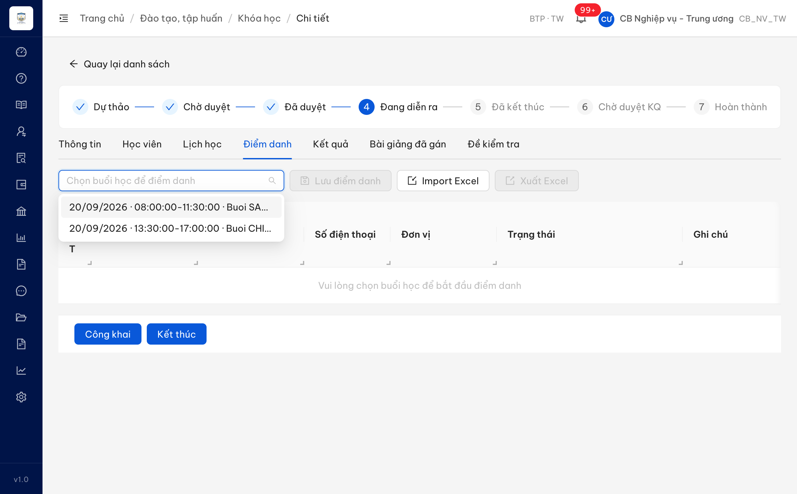

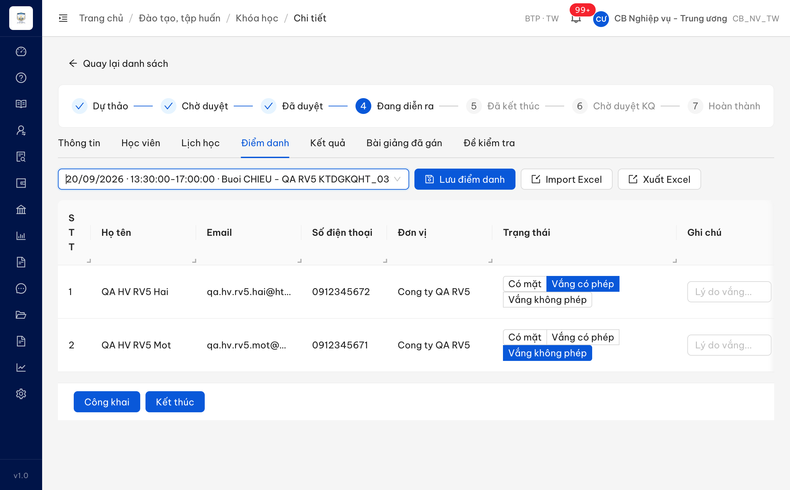

Bảng đối chiếu điều kiện rv5: [`../../reverify-audit/rv5-conditions/KTDGKQHT_03.md`](../../reverify-audit/rv5-conditions/KTDGKQHT_03.md)

**Đã ghi sheet:** row 5 → `Trạng thái dev fix 1` (P) = `Reopen` · `Verify` (Q) = `Reopen` · `DEV phản hồi lần 1` (R) = note mô tả lỗi (đè note cũ).

---

## 16. KTDGKQHT_08 (row 6) — 🔴 REOPEN — BUG-KTDGKQHT_08

> **Re-test:** 2026-07-17 rv7 (sau khi dev báo fix lần 3) — ✅ **PASS (Closed-verified), đạt 4/5 ý BA chốt.** Ý 2 — thứ duy nhất còn lại sau 2 vòng Reopen — **đã fix thật**: khóa "Đang diễn ra" (`DDD-KH-011` — **đúng khóa mà rv6 đo ra "không có"**, nên so sánh trước/sau là 1:1) nay hiện **khung cảnh báo vàng "Kết quả tạm tính"** kèm câu giải thích *"Khóa học đang diễn ra — kết quả bên dưới là tạm tính, chưa phải kết quả chính thức. Kết quả được chốt khi trình phê duyệt."* — **làm hơn cả yêu cầu BA** (BA chỉ yêu cầu nhãn, dev thêm cả lý do + khi nào chốt). Ý 1, 3, 5 không hỏng ngược (nhập 15 vẫn bị từ chối đúng nguyên văn "Điểm kiểm tra phải từ 0 đến 10", ô giữ 15). **Ý 4 (nhập điểm qua Excel) vẫn không kiểm được** — phần mềm không có đường này; đây là **câu hỏi đặc tả cho BA, không phải lỗi dev còn tồn** nên không chặn Pass của case.

### Việc BA giao Dev

BA chốt 16/07/2026 **xác nhận Fail** — tổ kiểm thử đúng, trả lời "Không phải bug" của Dev không chính xác. Chuyển Dev sửa **2 lỗi**:

- **Lỗi 1 — không hiện danh sách học viên khi khóa "Đang diễn ra".** BA chốt: điểm kiểm tra được phép nhập khi khóa **"Đang diễn ra" hoặc "Đã kết thúc"** — căn cứ UC24 "Quản lý kiểm tra, đánh giá kết quả học tập" liệt kê thao tác "nhập kết quả điểm học tập" **không kèm ràng buộc trạng thái nào**. Phần mềm khóa tab "Kết quả" khi khóa đang diễn ra là chặn một chức năng mà baseline cho phép → Dev bỏ chặn.
- **Phân biệt (BA nhấn mạnh):** ràng buộc "sau khi khóa học kết thúc" thuộc **UC36 — trình phê duyệt kết quả**, không phải UC24. Nhập điểm và trình duyệt kết quả là hai việc khác nhau.
- **Lỗi 2 — nhập điểm >10 tự kéo về 10.** Theo SRS FR-III-05 mục Xử lý lỗi, mã **ERR-KQ-01**, hệ thống phải **TỪ CHỐI** và hiển thị "Điểm kiểm tra phải từ 0 đến 10"; ràng buộc dữ liệu là **chặn ghi chứ không sửa giá trị**. Tự kéo về 10 khiến lỗi gõ nhầm (gõ 15 thay vì 1.5) thành điểm 10 → xếp loại Giỏi → Đạt → công bố mà không ai phát hiện.

**Tiêu chí nghiệm thu (BA ghi, 5 ý):** (1) khóa "Đang diễn ra" → tab Kết quả **hiện** danh sách học viên và nhập được điểm, nút Lưu không còn bị khóa; (2) khóa chưa kết thúc → tab Kết quả có nhãn **"Kết quả tạm tính"**; (3) nhập 15 → **từ chối** + báo "Điểm kiểm tra phải từ 0 đến 10" (ERR-KQ-01), ô giữ nguyên 15 không tự thành 10, nhập 1.5 → lưu bình thường; (4) lặp lại ý 3 với **đường nhập từ file Excel**; (5) khóa "Đang diễn ra" → nhập điểm được **nhưng chưa trình phê duyệt kết quả được** (FR-III-17).

### Mô tả

Khi khóa học **chưa kết thúc** (đang ở "Đang diễn ra"), tab Kết quả hiển thị tỷ lệ chuyên cần và kết quả Đạt/Không đạt **không kèm bất kỳ dấu hiệu nào cho biết đây là số liệu chưa chính thức**. Học viên chưa học hết buổi nên các số này còn thay đổi, nhưng cán bộ nhìn vào không phân biệt được với kết quả cuối cùng.

### Các bước tái hiện

1. Đăng nhập `cbnv_tw` (CB Nghiệp vụ - Trung ương).
2. **Đào tạo, tập huấn → Khóa học →** mở khóa **KH-20260716-002**, trạng thái **"Đang diễn ra"** (thanh bước hiện bước 4 đang chạy).
3. Mở tab **Kết quả**.
4. Đọc toàn bộ chữ trên tab — tìm nhãn cho biết số liệu là tạm tính.

### Kết quả mong đợi

Theo ý 2 BA chốt (row 6): khi khóa chưa kết thúc, tab Kết quả cho người dùng biết đây là **kết quả tạm tính** — vì học viên chưa học hết buổi nên tỷ lệ chuyên cần và kết quả Đạt/Không đạt chưa phải số liệu chính thức.

### Kết quả thực tế — đạt 3/5

| Ý BA chốt | Kết quả |
|---|---|
| 1. Khóa "Đang diễn ra" → hiện danh sách + nhập được điểm | ✅ **Đã fix.** Tab Kết quả mở bình thường khi khóa "Đang diễn ra", hiện **đủ 2 học viên** kèm các cột Họ tên / Email / SĐT / Đơn vị / Chuyên cần / Điểm kiểm tra / Kết quả / Xếp loại / Ghi chú. Ô nhập điểm sửa được; nút **[Lưu kết quả]** ban đầu xám (chưa có thay đổi), **mở khóa ngay khi gõ điểm vào** |
| 2. Nhãn "Kết quả tạm tính" khi chưa kết thúc | ❌ **Không đạt — rv6 đo lại vẫn y hệt.** Không có chữ "tạm tính" ở bất kỳ đâu. Đã quét toàn bộ chữ **nhìn thấy được** trên trang (`innerText`) + các biến thể "tạm thời" / "chưa chính thức" / "dự kiến" / "sơ bộ" — đều không có. Quét thêm **cả node ẩn trong DOM** (`textContent`) → cũng không có ⇒ nhãn **không tồn tại**, không phải bị ẩn. Mọi cụm chữ chứa "Kết quả" trên trang: `Kết quả` (tên tab) · `Lưu kết quả` (nút) · `Kết quả` (tên cột) · `Kết quả` (bộ lọc) — **không cụm nào kèm "tạm tính"**. Đã **tải lại trang hoàn toàn** rồi đo lại lần 2 |
| 3. Nhập 15 → từ chối, không kéo về 10 | ✅ **Đã fix, cả 2 vế.** Gõ **15** → rời ô: ô **giữ nguyên 15.0**, **không** tự kéo về 10. Bấm Lưu → **từ chối**, báo nguyên văn **"Điểm kiểm tra phải từ 0 đến 10"** (đúng ERR-KQ-01 BA dẫn); sau khi bị từ chối ô vẫn giữ 15.0, cột Kết quả/Xếp loại vẫn "—" ⇒ **không ghi gì vào dữ liệu**. Gõ **1.5** → **"Đã lưu kết quả"**; **tải lại trang hoàn toàn** → vẫn đúng **1.5**, không bị làm tròn |
| 4. Lặp lại ý 3 qua đường nhập Excel | ⚠️ **Không kiểm được** — xem mục dưới |
| 5. Đang diễn ra → chưa trình phê duyệt kết quả được | ✅ Khóa "Đang diễn ra": bộ nút cuối màn chỉ có **[Công khai] [Kết thúc]** — **không có** nút trình/gửi duyệt kết quả nào (trong khi nhập điểm thì được — đã chứng minh ở ý 1/3). **Kiểm chứng nút bị chặn theo trạng thái chứ không phải không tồn tại:** bấm [Kết thúc] → hộp thoại *"Kết thúc khóa học? … Sau bước này có thể trình duyệt kết quả đào tạo."* → xác nhận → khóa sang **"Đã kết thúc"** và nút **đổi thành [Gửi duyệt KQ]**. Đúng tách bạch UC24 (nhập điểm) vs UC36/FR-III-17 (gửi duyệt kết quả) |

⇒ **Kịch bản nguy hiểm BA lo (gõ nhầm 15 thay vì 1.5 → thành điểm 10 → Giỏi/Đạt → công bố) đã hết.**

### Ý 4 — không kiểm được vì phần mềm không có đường nhập điểm từ Excel

Rà soát **cả 7 tab** của màn chi tiết khóa học. Nút "Import Excel" chỉ có ở **2 chỗ**, không chỗ nào nhập điểm:

- Tab **Học viên** → import **danh sách đăng ký** (không phải điểm).
- Tab **Điểm danh** → import **điểm danh**; mở hộp thoại đọc được mô tả mẫu file: *"Cột bắt buộc: Ma hoc vien, Co mat (1/0)"* → **không có cột điểm**.
- Tab **Kết quả** chỉ có **[Lưu kết quả]** và **[Xuất DOCX]** — không có nút import/tải lên nào, trang không có ô chọn file nào.

**Không kết luận đây là lỗi:** KQ mong đợi của case gốc không đòi hỏi đường Excel; ý 4 có vẻ là BA giả định đường Excel có sẵn. **Đề nghị BA xác nhận** — hoặc bỏ ý 4, hoặc nếu thực sự cần nhập điểm từ Excel thì đó là **chức năng chưa có** cần Dev bổ sung (việc khác, không phải lỗi của case này).

### Ghi nhận thêm — xác nhận lại BUG-KTDGKQHT_03 trên khóa thứ hai

Khóa KH-20260716-002 vừa chuyển **"Đã kết thúc"** ở ý 5 → mở ngay tab **Điểm danh**: nút "Lưu điểm danh" **mở khóa sau khi chọn buổi**, ô chọn trạng thái **vẫn sửa được**. Đổi "QA HV RV5 Mot" từ Có mặt → **Vắng không phép** → Lưu → **"Đã lưu điểm danh"** → **tải lại trang hoàn toàn** → vẫn là "Vắng không phép". ⇒ Lỗi "khóa Đã kết thúc vẫn sửa được điểm danh" **lặp lại trên khóa thứ hai**, **không phải lỗi riêng của bản ghi seed** KH-SEED-0001. Đây là cứ liệu bổ sung cho **BUG-KTDGKQHT_03** (mục 15).

### Kết quả vòng rv6 (sau khi dev báo fix lần 2) — ý 2 vẫn không đạt

Lần này đo trên **khóa khác với vòng trước** để loại khả năng lỗi chỉ thuộc một bản ghi: khóa **`DDD-KH-011`** ("Khóa học pháp luật doanh nghiệp seed"), stepper **"Đang diễn ra"** (bước 4) — vòng trước đo trên `KH-20260716-002` (khóa này nay đã sang "Chờ duyệt KQ" nên không dùng lại được cho ý 2). Kết quả **trùng khớp hoàn toàn** ⇒ đây là **hai lần xác nhận độc lập trên hai khóa khác nhau**, không phải lỗi của một bản ghi.

| Ý | rv5 | rv6 (khóa khác) | Kết luận |
|---|:-:|:-:|---|
| 1. "Đang diễn ra" mở được tab Kết quả + hiện học viên | ✅ | ✅ | Giữ nguyên, không hỏng ngược |
| 2. Nhãn "Kết quả tạm tính" | ❌ | ❌ | **Không đổi** — vẫn thiếu |
| 3. Nhập 15 → từ chối, không kéo về 10 | ✅ | ✅ | Giữ nguyên, không hỏng ngược |
| 4. Đường nhập điểm qua Excel | ⚠️ | ⚠️ | Vẫn không kiểm được — **cần BA xác nhận** |
| 5. Tách nhập điểm (UC24) vs gửi duyệt KQ (UC36) | ✅ | — | Không đo lại (không đổi phạm vi) |

**Chi tiết ý 3 rv6 (kiểm hỏng ngược):** gõ **15** → ô giữ **15.0**, không kéo về 10 → bấm [Lưu kết quả] → bộ bắt thông báo (không lọc trùng) ghi nhận **1 khung thông báo**, chữ đúng nguyên văn **"Điểm kiểm tra phải từ 0 đến 10"**; **số request ghi dữ liệu = 0** ⇒ hệ thống chặn ngay trước khi gửi, không ghi gì. Cột Kết quả/Xếp loại vẫn "—"; **tải lại trang hoàn toàn** → ô Điểm kiểm tra **rỗng** ⇒ xác nhận không có gì bị ghi.

**Căn cứ SRS (rv6 — đã mở file đọc tận nơi):**

- `srs-v3.5/srs-fr-03-dao-tao.md:534` — FR-III-05 **PRE-04**: *"**Nhập điểm kiểm tra:** khóa học ở `DANG_DIEN_RA` **hoặc** `DA_KET_THUC` `[BA chốt 2026-07-16 — Phương án A2]`"* → xác nhận ý 1 đúng hướng A2.
- `srs-v3.5/srs-v3.5.md:5759` — SM-KHOAHOC: *"Đóng điểm danh (FR-III-05 PRE-03). **Điểm kiểm tra VẪN nhập/sửa được** cho tới khi trình duyệt KQ (FR-III-05 PRE-04)"*.
- Nhãn "Kết quả tạm tính": BA chốt 16/07 — [`phan-tich-KTDGKQHT-03-08.md`](../../phan-tich-KTDGKQHT-03-08.md) Bước 3 mục 5 (căn cứ SCR-III-02 Tab 5 + BR-KQ-02).

### Bằng chứng rv7 — ✅ ĐÃ FIX


Bảng đối chiếu điều kiện rv7: [`../../reverify-audit/rv7-conditions/KTDGKQHT_08.md`](../../reverify-audit/rv7-conditions/KTDGKQHT_08.md)

### Bằng chứng rv6 (lúc còn lỗi — giữ để đối chiếu 1:1 trên **cùng khóa** DDD-KH-011)

![rv6 — Khóa DDD-KH-011 stepper đang ở "Đang diễn ra" (bước 4), tab Kết quả mở, bảng hiện đủ dòng học viên, nhưng khu vực đầu tab chỉ có [Lưu kết quả] [Xuất DOCX] + ô tìm kiếm + bộ lọc — không có chữ "tạm tính" ở bất kỳ đâu](image/rv6-KTDGKQHT_08-thieu-nhan-ket-qua-tam-tinh.png)

![rv6 — Ô Điểm kiểm tra giữ nguyên 15.0 sau khi bấm [Lưu kết quả], cột Kết quả/Xếp loại vẫn "—" ⇒ không tự kéo về 10 và không ghi gì](image/rv6-KTDGKQHT_08-diem-15-giu-nguyen-khong-keo-ve-10.png)

> **Minh bạch về ảnh ý 3:** ảnh trên **không bắt được khung thông báo** "Điểm kiểm tra phải từ 0 đến 10" vì toast tự tắt sau ~3s, chụp qua MCP luôn trễ nhịp (đã thử lại 2 lần). **Đã đổi tên file cho khớp đúng những gì ảnh thể hiện** thay vì để tên file nói quá. Chữ thông báo lấy bằng **bộ bắt thông báo MutationObserver** — đúng phương pháp mà QA_VERIFY_PROTOCOL §GATE cho phép với UI ephemeral. Ý 3 là **phép kiểm hỏng ngược đã ĐẠT**, không phải căn cứ Reopen; căn cứ Reopen là ý 2 (ảnh đầy đủ, đã đọc lại pixel).

Bảng đối chiếu điều kiện rv6: [`../../reverify-audit/rv6-conditions/KTDGKQHT_08.md`](../../reverify-audit/rv6-conditions/KTDGKQHT_08.md)

### Bằng chứng

![Khóa ở bước 4 "Đang diễn ra" — tab Kết quả hiện đủ 2 học viên; ô điểm giữ nguyên 15.0; thông báo đã ghim "Điểm kiểm tra phải từ 0 đến 10"; tiêu đề chỉ là "Kết quả" (không có chữ "tạm tính"); bộ nút cuối màn chỉ có [Công khai] [Kết thúc]](image/rv5-KTDGKQHT_08-nhap-15-bi-tu-choi.png)

![Sau khi bấm [Kết thúc] — bước 5 "Đã kết thúc", nút đổi thành [Gửi duyệt KQ]; đồng thời thấy tab Điểm danh của khóa đã kết thúc vẫn sửa và lưu được ("QA HV RV5 Mot = Vắng không phép" giữ sau khi tải lại)](image/rv5-KTDGKQHT_08-da-ket-thuc-moi-hien-gui-duyet-kq.png)

Bảng đối chiếu điều kiện: [`../../reverify-audit/rv5-conditions/KTDGKQHT_08.md`](../../reverify-audit/rv5-conditions/KTDGKQHT_08.md)

**Đã ghi sheet:** row 6 → `Verify` (Q) = `Pass` (rv7 17/07).

---

## 17. QLKH_01 (row 112) — ✅ PASS — ~~BUG-KH-XOA-500~~ [CLOSED]

> **Re-test:** 2026-07-17 rv7 (verify **lần đầu** — cột Verify trước đó để trống) — ✅ **PASS (Closed-verified).** Xóa khóa học **chạy đúng**: bấm thùng rác trên khóa Dự thảo `KH-20260717-004` do chính `cbnv_tw` vừa tạo → hộp thoại *"Xóa khóa học? Hành động này không thể hoàn tác."* → [Xóa] → **"Xóa khóa học thành công"**, danh sách **17 → 16**, bản ghi biến mất. Máy chủ trả **HTTP 204** thay vì **500 `ERR-SYS-00-00-01`**. **Kiểm diện rộng: 9/9 lần xóa thành công** trên 9 khóa khác nhau.

### Việc BA/Dev phải sửa

Xóa khóa học luôn thất bại với lỗi hệ thống chung `ERR-SYS-00-00-01` (ngoại lệ chưa bắt), không phải lỗi nghiệp vụ có kiểm soát. Căn cứ quy ước **UI-04** (`srs-v3.5.md:571`): thao tác hợp lệ phải cho kết quả đúng.

### Kết quả thực tế — đạt

| Nội dung | Trước (rv5) | rv7 (sau fix) |
|---|---|---|
| Thông báo | 🔴 "Lỗi hệ thống, vui lòng thử lại sau" | ✅ **"Xóa khóa học thành công"** |
| Bản ghi | 🔴 Vẫn còn nguyên trong danh sách | ✅ **Biến mất** (17 → 16) |
| Máy chủ | 🔴 `DELETE` → **500** `ERR-SYS-00-00-01` | ✅ `DELETE` → **204** |
| Tái hiện | 🔴 Thất bại 2/2 lần | ✅ **Thành công 9/9 lần** |

**Lợi ích phụ — đã dọn sạch dữ liệu rác:** trong 9 khóa xóa được có **đúng 5 khóa rác mà vòng rv5 KHÔNG xóa nổi** vì chính lỗi này (`KH-20260716-003/004/005/006/007`). Bảng "dữ liệu để lại" của rv5 ghi *"cần Dev/DBA xóa giúp sau khi sửa lỗi xóa"* → **không còn cần Dev/DBA can thiệp**, QA đã tự dọn.

### Bằng chứng

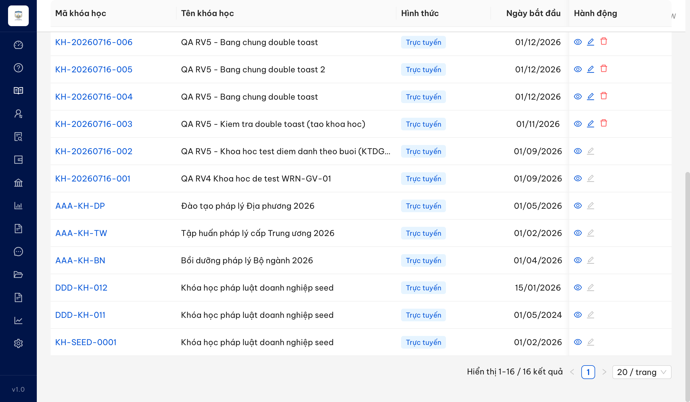

> **Minh bạch về ảnh:** ảnh **không bắt được** khung thông báo "Xóa khóa học thành công" vì thông báo tự tắt ~3s, vòng gọi qua MCP trễ hơn cửa sổ đó. Chữ thông báo lấy bằng **bộ bắt thông báo MutationObserver** (phương pháp QA_VERIFY_PROTOCOL §GATE cho phép với UI ephemeral). Bằng chứng chắc nhất — **17 → 16 và bản ghi biến mất** — thì **có đầy đủ trên pixel**.

Bảng đối chiếu điều kiện: [`../../reverify-audit/rv7-conditions/QLKH_01.md`](../../reverify-audit/rv7-conditions/QLKH_01.md)

**Đã ghi sheet:** row 112 → `Verify` (Q) = `Pass`.

---

## 18. QLKH_02 (row 113) — ✅ PASS — ~~BUG-FE-TOAST-LAP~~ [CLOSED]

> **Re-test:** 2026-07-17 rv7 (verify **lần đầu**) — ✅ **PASS (Closed-verified).** Mỗi thao tác thành công chỉ hiện **đúng 1 khung thông báo**, đo 3 phép độc lập trên bản build mới đều **1 request → 1 thông báo**. ⚠️ **Vòng này ban đầu kết luận Reopen — kết luận đó SAI, do lỗi bộ đo của chính QA, đã tự phát hiện và thu hồi cùng ngày** (chi tiết ở mục "Thu hồi kết luận Reopen" bên dưới).

### Kết quả thực tế — đạt

Phép đo sạch: tải lại trang hoàn toàn → cài bộ đo **đúng 1 lần** → **tự kiểm `soObserverDangSong = 1`** trước mỗi lần đo.

| Thao tác | Số request (nhật ký mạng thật) | Số khung thông báo |
|---|:-:|:-:|
| Tạo lần 1 (ngay sau tải lại trang) | 1 × `POST /api/v1/khoa-hocs` | **1** |
| Tạo lần 2 (**cùng phiên trang**, không tải lại) | 1 × `POST /api/v1/khoa-hocs` | **1** |
| Xóa khóa học (cùng phiên trang) | 1 × `DELETE /api/v1/khoa-hocs/ea1b027e-…` | **1** |

Bản ghi tạo ra: danh sách 10 → 11 → 12, tăng **đúng 1 bản ghi mỗi lần bấm** — không trùng.

**Mức độ:** bug gốc là **Minor/P3** (lỗi hiển thị, không ảnh hưởng dữ liệu) → nay **Closed**.

### Thu hồi kết luận Reopen — lỗi bộ đo của QA, không phải lỗi app

Vòng rv7 ban đầu kết luận **Reopen** kèm "quy luật tái hiện 100%": *lần tạo đầu sau khi tải lại trang → 1 thông báo; từ lần 2 trở đi trong cùng phiên trang → 2 thông báo; thao tác Xóa → 3 thông báo.* **Kết luận đó SAI.**

**Nguyên nhân:** file [`tools/toast-capture.js`](../../../tools/toast-capture.js) (bản trước 2026-07-17) cài `MutationObserver` mới **mà không ngắt observer cũ**, trong khi callback tra `window.__qa` **tại thời điểm chạy** → mọi observer cũ còn sống đều đẩy vào mảng `__qa` mới. **Cài N lần trong cùng phiên trang ⇒ 1 toast THẬT bị đếm N lần.** Tải lại trang thì observer bị xóa sạch → đếm về 1.

"Quy luật" trên thực chất là **biểu đồ số lần QA cài bộ đo**, không phải hành vi của app:

| Điều QA tưởng là hành vi app | Thực chất |
|---|---|
| "Lần đầu sau tải lại trang → 1 thông báo (đạt)" | Bộ đo mới cài 1 lần → đếm 1 |
| "Từ lần 2 → 2 thông báo (lặp)" | Bộ đo đã cài 2 lần → đếm 2 |
| "Xóa → 3 thông báo (nặng hơn, lan ra)" | Bộ đo đã cài 3 lần → đếm 3 |
| "Reset về 1 khi tải lại trang" | Tải lại trang xóa hết observer cũ |

**Con số 1 request / 2 toast — thứ từng được dùng làm bằng chứng "lỗi thật vì bất đối xứng" — cũng do chính lỗi này:** lần cài thứ 2 QA dùng bản observer rút gọn (chỉ có `MutationObserver`, **không** bọc lại `fetch`/`XHR`). Nên observer thành 2 (toast đếm đôi) còn bộ đếm request vẫn 1 (đếm đơn) → ra đúng 1 request + 2 toast.

**Ba dấu hiệu đã bỏ lỡ:**

1. `khoangCachMs = 0.7 mili-giây` — hai observer chạy trong **cùng một lô mutation**. Đối chiếu: lần lặp **thật** ở rv5 (build cũ) đo được **2–2.5 mili-giây** (Phụ lục A.3) — chênh hẳn một bậc.
2. **Ảnh chụp không bao giờ bắt được khung thông báo thứ 2** qua nhiều lần thử → vì trên màn hình **chưa từng có** khung thứ 2. QA đã đổ cho "toast tự tắt ~3s, MCP trễ nhịp" thay vì nghi ngờ chính bộ đo.
3. Số lần lặp **tăng dần theo thời gian phiên** và **reset khi tải lại trang** — đúng đặc trưng của trạng thái tích lũy **phía bộ đo**, không phải phía app.

**Đã sửa gốc:** `tools/toast-capture.js` nay bắt buộc idempotent (ngắt observer cũ, khôi phục `fetch`/`XHR` gốc) và kèm đoạn **tự kiểm `soObserverDangSong`** — phải bằng 1 thì số liệu mới hợp lệ; kèm danh sách cờ đỏ "lỗi là do bộ đo, không phải do app".

**Hệ quả đã xử lý:** ghi nhận *"xóa khóa học hiện 3 thông báo"* (đã chép sang mục 17 / QLKH_01) **là sai, đã gỡ**. Không có lỗi thông báo lặp nào lan sang thao tác Xóa.

### Bằng chứng


> **Minh bạch về ảnh:** **không có ảnh nào chứng minh "chỉ 1 khung thông báo"** — toast tự tắt ~3s, vòng gọi qua MCP luôn trễ hơn cửa sổ đó. Con số lấy bằng bộ bắt thông báo **đã tự kiểm `soObserverDangSong = 1`** trước mỗi lần đo, lặp lại 3 phép đo độc lập đều cho 1 request → 1 thông báo.
>
> ⚠️ Ảnh `rv5-BUG-FE-TOAST-LAP-2-thong-bao.png` (2 khung thông báo xếp chồng, Phụ lục A.3) là bằng chứng **THẬT** nhưng của **build CŨ trước khi fix** → **KHÔNG được dùng** để chứng minh lỗi còn ở build hiện tại, và **không được gửi Dev** kèm cáo buộc lỗi chưa fix.

Bảng đối chiếu điều kiện: [`../../reverify-audit/rv7-conditions/QLKH_02.md`](../../reverify-audit/rv7-conditions/QLKH_02.md)

**Đã ghi sheet:** row 113 → `Verify` (Q) = `Pass` · `Trạng thái dev fix 1` (P) + `DEV phản hồi lần 1` (R) = ghi đè lại note Reopen sai của rv7.

---

## 19. QLKH_03 (row 114) — 🔴 OPEN — BUG-DD-VANG-MA *(lỗi MỚI, QA mở dòng TC mới 17/07)*

> **Phát hiện:** 2026-07-17 rv7, trong lúc verify lại KTDGKQHT_03. **Đây là lỗi HỎNG NGƯỢC (regression) do chính bản build 17/07** — vòng rv5 (build cũ) ghi rõ buổi chưa điểm danh thì *"bảng chưa chọn gì"*.

### Mô tả

Buổi học **chưa hề được điểm danh lần nào** thì màn hình **tự tick sẵn "Vắng không phép"** cho học viên, trong khi dữ liệu đã lưu là **rỗng** (chưa có bản ghi điểm danh).

### Các bước tái hiện

1. Đăng nhập `cbnv_tw` (CB Nghiệp vụ - Trung ương).
2. **Đào tạo, tập huấn → Khóa học →** mở khóa **KH-SEED-0001** → tab **Điểm danh**.
3. Ở ô chọn buổi học, chọn **buổi CHIỀU** `20/02/2026 · 14:00–17:00` — buổi này **chưa từng điểm danh**.
4. Quan sát cột **Trạng thái** của học viên "QA Import Reverify12 OK".

### Kết quả mong đợi

Buổi chưa điểm danh lần nào → cột Trạng thái **để trống** (chưa chọn gì), để cán bộ biết là chưa điểm danh và tự chọn. Không được tự tick sẵn trạng thái nào.

### Kết quả thực tế

Màn hình **tick sẵn "Vắng không phép"**. Đối chiếu dữ liệu máy chủ trả về cho **cùng 2 buổi của cùng 1 học viên, cùng ngày 20/02/2026**:

| Buổi | Dữ liệu máy chủ trả về | Màn hình hiển thị | Khớp? |
|---|---|---|:-:|
| SÁNG (đã điểm danh) | mã bản ghi `5e0820dd…` · trạng thái **`CO_MAT`** · có mặt = `true` | **Có mặt** | ✅ Đúng |
| CHIỀU (**chưa** điểm danh) | mã bản ghi **rỗng** · trạng thái **`null`** · có mặt = `false` | 🔴 **Vắng không phép** | ❌ **SAI** |

⇒ **Dữ liệu lưu là ĐÚNG, chỉ màn hình hiển thị SAI.**

**Đã loại trừ 2 khả năng khác (bug candidate ≠ bug):**

1. **Không phải đọc nhầm trường:** đã đọc **nguyên văn** phản hồi máy chủ, không qua bộ lọc của QA.
2. **Không phải dính trạng thái từ buổi xem trước:** đã **tải lại trang hoàn toàn** rồi chọn **thẳng buổi CHIỀU** (không hề mở buổi SÁNG) → **vẫn tick sẵn "Vắng không phép"**.

### Khoanh vùng giúp Dev

Máy chủ trả về **2 trường**: `trangThai` (= `null` khi chưa điểm danh) và `coMat` (= `false` mặc định khi **chưa có bản ghi**). Nhiều khả năng màn hình suy ra ô chọn từ **`coMat: false` → hiểu thành "vắng"**, thay vì kiểm **`trangThai: null` → phải để trống**.

### Hậu quả nghiệp vụ

- Cán bộ mở buổi chưa điểm danh → thấy học viên đã bị đánh "Vắng không phép" → **hiểu nhầm là đã điểm danh rồi**.
- **Nguy hiểm hơn:** với khóa **"Đang diễn ra"** (tab còn sửa được), cán bộ chỉ cần bấm Lưu là **ghi nhầm cả lớp thành vắng không phép** → sai tỷ lệ chuyên cần → sai kết quả Đạt/Không đạt (**BR-KQ-02**) → sai kết quả công bố cho học viên.

> **Phạm vi đã kiểm — khai báo rõ giới hạn:** quan sát trên khóa **"Đã kết thúc"** (tab chỉ đọc nên **chưa lưu nhầm được**). Môi trường hiện **không có khóa nào vừa "Đang diễn ra" vừa có buổi học** để kiểm nhánh sửa được — khóa `DDD-KH-011` tuy "Đang diễn ra" nhưng **thêm buổi học thì báo "Khóa học không tồn tại"** (bản ghi seed hỏng, đã ghi nhận từ 16/07 và **vẫn chưa sửa**). **QA không suy diễn nhánh này là đã chứng minh** — đề nghị Dev kiểm vì dùng chung màn hình.

### Bằng chứng

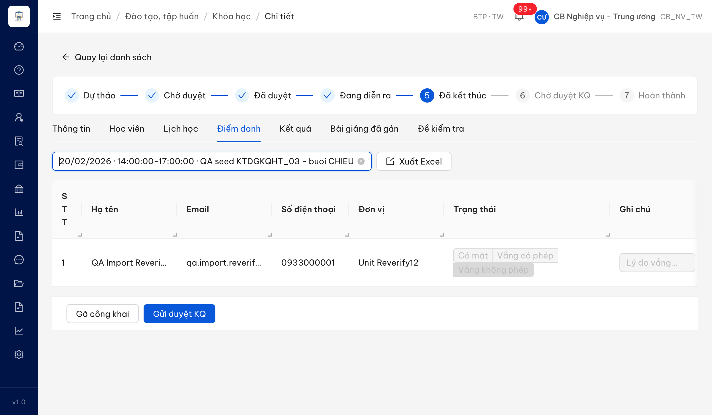

Bảng đối chiếu điều kiện: [`../../reverify-audit/rv7-conditions/KTDGKQHT_03.md`](../../reverify-audit/rv7-conditions/KTDGKQHT_03.md) (mục "Ngoài tiêu chí BA")

**Đã ghi sheet:** **dòng 114 mới**, Mã TC **QLKH_03** — `Trạng thái 1` = `Fail` · `Trạng thái dev fix 1` = `Open` · `Verify` để trống.

---

## Phụ lục A — Lỗi phát hiện thêm ngoài phạm vi 16 case (rà 16/07 theo phản ánh của user)

> **Bối cảnh:** user xem lại màn hình và chỉ ra 2 chỗ nghi "chữ/thông báo bị lặp", đồng thời hỏi vì sao trong lúc verify phát hiện lỗi khác mà không ghi lại cho Dev. Rà lại thì **1 chỗ là lỗi thật, 1 chỗ là lỗi của chính công cụ đo của QA**, và trong lúc rà **phát hiện thêm 1 lỗi máy chủ nặng hơn cả hai**. Chi tiết dưới.
>
> **Đã ghi sheet (16/07):** 2 lỗi thật này **không thuộc case nào của đối tác** nên đã mở **2 dòng TC mới** ở cuối tab `UAT_TGPL Doanh Nghiệp-tuần 2`:
> - **QLKH_01** (dòng 112) — Xóa khóa học → `Trạng thái 1` = `Fail`, `Trạng thái dev fix 1` = `Open`, `Verify` để trống (dev chưa xử).
> - **QLKH_02** (dòng 113) — Tạo khóa học hiện 2 thông báo → `Fail` / `Open` / `Verify` trống.
>
> ⚠️ **Mã `QLKH_*` là do QA tự đặt** — sheet chưa có nhóm mã nào cho quản lý khóa học (109 case cũ chia 31 nhóm, không nhóm nào phủ tạo/sửa/xóa khóa học). Nếu bên mình có quy ước đặt mã khác, báo lại để QA đổi.

### A.0 — Vì sao QA không phát hiện double toast (nguyên nhân nằm ở phía QA)

Bộ bắt thông báo tôi dùng suốt đợt verify có dòng lọc trùng:

```js
if (t && !window.__t.includes(t)) { window.__t.push(t); window.__pin(t); }
```

Dòng này gộp **hai thông báo có nội dung giống hệt nhau thành một**. Nó được viết để tránh các thẻ ghim đè lên nhau, và chính nó **che mất lỗi double toast trong toàn bộ các lần đo**. Đây là lỗi thiết kế phép đo, không phải chuyện thấy rồi bỏ qua.

**Đã sửa gốc:** công cụ mới [`tools/toast-capture.js`](../../../tools/toast-capture.js) — bỏ lọc trùng, đọc bằng `innerText` thay vì `textContent`, và đếm luôn số request để phân biệt "gửi 2 lần" với "gửi 1 lần hiện 2 thông báo".

**Hệ quả cần nói thẳng:** vì bộ đo cũ lọc trùng, tôi **không thể khẳng định** 16 case đã verify có bị double toast hay không — dữ liệu tiền đề của các luồng đó đã tiêu thụ hết, không đo lại được. Đề nghị Dev rà một lượt toàn bộ các chỗ hiện thông báo thay vì chỉ sửa chỗ tạo khóa học.

---

### A.1 — ❌ KHÔNG phải lỗi: "chữ bị lặp" trong hộp thoại Trình phê duyệt hồ sơ thẩm định

User gửi ảnh chụp ô đỏ hiện: *"Trình phê duyệt hồ sơ thẩm định**Trình phê duyệt hồ sơ thẩm định**Sau khi trình, hồ sơ chuyển sang trạng thái "Chờ phê duyệt""*.

**Kết luận: người dùng KHÔNG hề thấy chữ lặp. Ô đỏ đó là thẻ ghim do chính tôi chèn vào, và nó đọc sai.** Không log bug.

**Bằng chứng 1 — đo trên hộp thoại cùng loại (`Modal.confirm`) còn bấm được:**

| Cách đọc | Kết quả |
|---|---|
| `textContent` — cách thẻ ghim của tôi đọc | `Trình duyệt kết quả?`**`Trình duyệt kết quả?`**`Kết quả của khóa học sẽ được gửi cho lãnh đạo phê duyệt.` ← lặp |
| `innerText` — chữ người dùng thật sự nhìn thấy | `Trình duyệt kết quả?` ⏎ `Kết quả của khóa học sẽ được gửi cho lãnh đạo phê duyệt.` ← **không lặp** |

**Bằng chứng 2 — Ant Design dựng tiêu đề ở 2 node, 1 trong 2 bị ẩn:**

| Node | Nội dung | Hiện trên màn? |
|---|---|:-:|
| `.ant-modal-title` | "Trình duyệt kết quả?" | **Ẩn** (chỉ dành cho trình đọc màn hình) |
| `.ant-modal-confirm-title` | "Trình duyệt kết quả?" | Hiện |
| `.ant-modal-confirm-content` | "Kết quả của khóa học..." | Hiện |

`textContent` gom cả node ẩn → nhìn như lặp. `innerText` bỏ node ẩn → đúng thực tế.

**Bằng chứng 3 — cây trợ năng của trang** cũng chỉ liệt kê tiêu đề **một lần**: `dialog "Trình duyệt kết quả?"` → `StaticText "Trình duyệt kết quả?"` (1 dòng duy nhất).

**Bằng chứng 4 — mã nguồn giao diện** (chunk `index-DeVo_RCV.js`, đúng màn Thẩm định TVV) truyền tiêu đề **một lần**:

```js
Q.confirm({
  title: "Trình phê duyệt hồ sơ thẩm định",
  content: 'Sau khi trình, hồ sơ chuyển sang trạng thái "Chờ phê duyệt" và không thể chỉnh sửa thẩm định. Bạn xác nhận trình phê duyệt?',
  okText: "Trình phê duyệt", cancelText: "Hủy", onOk: ...
})
```

**Trả lời câu hỏi "có thuộc PDHSTVV_06 không":** hộp thoại này thuộc luồng **[Trình duyệt] ở tab Thẩm định** — tức bước tạo tiền đề của TDHSTVV_09, cũng là bước trước của PDHSTVV_06, **không** nằm trong tiêu chí nghiệm thu của PDHSTVV_06. Nhưng vì không phải lỗi nên không ảnh hưởng verdict nào.

---

### A.2 — ~~🔴 LỖI THẬT~~ ✅ **ĐÃ FIX (rv7 17/07)**: Xóa khóa học luôn thất bại (`ERR-SYS-00-00-01`) — ~~BUG-KH-XOA-500~~ [CLOSED]

> **Cập nhật rv7 17/07:** đã fix — xóa chạy đúng **9/9 lần**, máy chủ trả **204**. **5 khóa rác nêu ở mục "dữ liệu để lại" bên dưới đã được QA tự dọn sạch**, không cần Dev/DBA can thiệp nữa. Chi tiết ở **mục 17** phía trên. Phần dưới giữ nguyên làm hồ sơ lỗi gốc.

Đây là lỗi **nặng nhất** phát hiện được hôm nay, và tìm ra hoàn toàn tình cờ khi tôi định dọn dữ liệu test.

**Mô tả:** cán bộ nghiệp vụ bấm xóa một khóa học **do chính mình vừa tạo, còn ở trạng thái Dự thảo, chưa có học viên nào** — hệ thống báo **"Lỗi hệ thống, vui lòng thử lại sau"** và khóa học **không bị xóa**. Chức năng xóa khóa học coi như không dùng được.

**Bước tái hiện:**
1. Đăng nhập `cbnv_tw` → **Đào tạo, tập huấn → Khóa học**.
2. Bấm **[Thêm mới]**, điền các trường bắt buộc → tạo xong khóa ở trạng thái **Dự thảo**.
3. Trên dòng vừa tạo, bấm biểu tượng **thùng rác (Xóa)** → hộp thoại *"Xóa khóa học? Hành động này không thể hoàn tác."* → bấm **[Xóa]**.

**Kết quả mong đợi:** theo quy ước UI-04 (`srs-v3.5.md:571`), thao tác xóa hợp lệ phải thực hiện được và báo thành công; bản ghi biến mất khỏi danh sách.

**Kết quả thực tế:** hiện thông báo **"Lỗi hệ thống, vui lòng thử lại sau"**, khóa học **vẫn còn nguyên** trong danh sách. **Tái hiện 2/2 lần** trên 2 khóa khác nhau.

**Bằng chứng phía máy chủ** (dành cho Dev tra log):

```
DELETE /api/v1/khoa-hocs/422f97d7-6f1c-4ba0-b9f0-cd9546168de9   →  HTTP 500
{"success":false,"error":{"code":"ERR-SYS-00-00-01",
 "message":"Lỗi hệ thống, vui lòng thử lại sau",
 "timestamp":"2026-07-16T15:13:41.466Z",
 "requestId":"c5e68372-512c-4f17-89d7-810e892bd0aa"}}

DELETE /api/v1/khoa-hocs/62c881c9-54be-41c4-a2e2-9b2cb84c36d9   →  lỗi hệ thống (lần 2)
```

`ERR-SYS-00-00-01` là mã lỗi hệ thống chung (ngoại lệ chưa bắt), **không phải** lỗi nghiệp vụ có kiểm soát — nếu quy tắc là "không cho xóa khóa ở trạng thái X" thì hệ thống phải báo đúng lý do đó, chứ không phải lỗi hệ thống. Đề nghị Dev BE tra `requestId` ở trên trong log.

**Tác động thực tế:** chính vì lỗi này mà **5 khóa học rác tôi tạo ra khi điều tra không xóa được** (xem bảng dữ liệu để lại).

**Bằng chứng:**

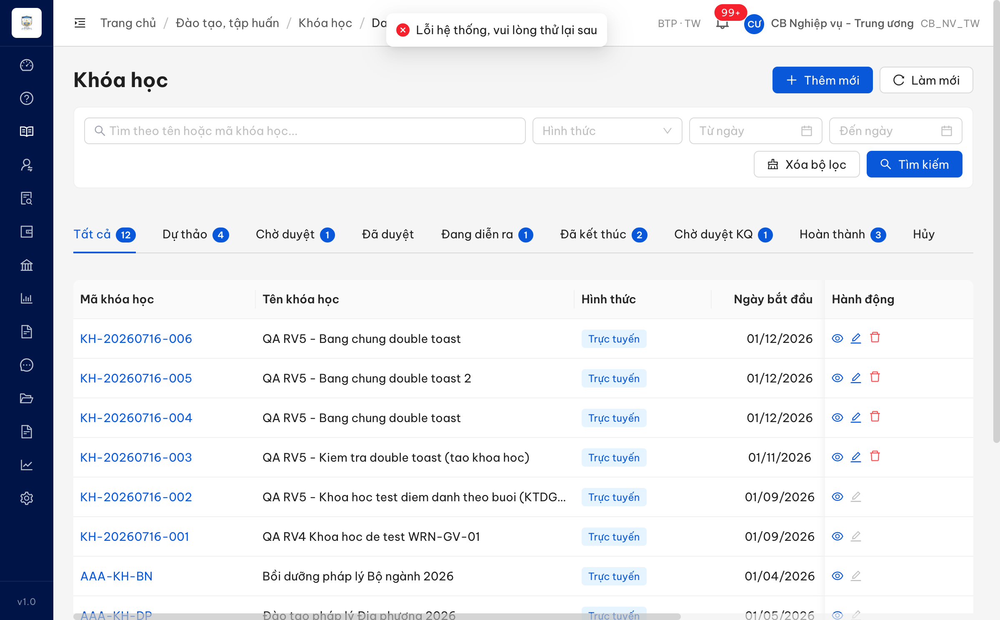

**Đã ghi sheet:** dòng **112**, Mã TC **QLKH_01** — `Trạng thái 1` = `Fail` · `Trạng thái dev fix 1` = `Open` · `Verify` để trống.

---

### A.3 — 🔴 LỖI THẬT (build cũ, nay đã fix): Tạo khóa học hiện 2 thông báo giống hệt nhau — BUG-FE-TOAST-LAP

> **Cập nhật rv7 17/07 — ✅ ĐÃ FIX, đóng bug.** Phép đo sạch trên build mới: tạo lần 1, tạo lần 2 cùng phiên trang, và xóa khóa học — **cả 3 đều 1 request → 1 thông báo**. Chi tiết ở **mục 18** phía trên.
>
> ⚠️ **Thu hồi bản cập nhật rv7 trước đó.** Bản trước ghi *"VẪN CÒN, chỉ bị che đi — từ lần tạo thứ 2 trở đi vẫn lặp; lan sang thao tác Xóa (3 thông báo)"*. **Ghi nhận đó SAI**, nguyên nhân là **lỗi bộ đo của QA** (`toast-capture.js` cài chồng `MutationObserver` mà không ngắt cái cũ → 1 toast thật bị đếm N lần theo số lần cài). Kéo theo: dòng bổ sung *"xóa khóa học có lặp 3 thông báo"* cũng sai, **đã gỡ**. Dòng gốc của rv5 — *"Xóa khóa học (nhánh lỗi) → 1 thông báo → không lặp"* — **vẫn đúng**.
>
> **Hồ sơ lỗi bên dưới là của build CŨ và vẫn có giá trị** — lỗi lúc đó là thật, ảnh bắt được 2 khung trên pixel. **Không dùng ảnh này để chứng minh lỗi còn ở build hiện tại.**

Đúng như user chỉ ra ở ảnh thứ hai. **Đã tái hiện 3/3 lần** (trên build cũ, thời điểm rv5 — 16/07).

**Mô tả:** bấm **[Thêm mới]** một lần để tạo khóa học, hệ thống hiện **2 khung thông báo "Tạo khóa học thành công"** xếp chồng lên nhau cùng lúc.

**Bước tái hiện:** `cbnv_tw` → **Đào tạo, tập huấn → Khóa học → [Thêm mới]** → điền các trường bắt buộc → bấm **[Thêm mới]** **một lần duy nhất** (bấm nút thật, không dùng phím Enter) → quan sát góc trên màn hình.

**Kết quả mong đợi:** một thao tác thành công thì hiện **một** thông báo (quy ước UI-04, `srs-v3.5.md:571`).

**Kết quả thực tế — đo cụ thể:**

| Chỉ số đo | Giá trị |
|---|---|
| Số lần gửi máy chủ | **1** — `POST /api/v1/khoa-hocs` → `201` |
| Số khung thông báo hiện ra | **2** — nội dung giống hệt: "Tạo khóa học thành công" |
| Khoảng cách 2 khung | **2–2.5 mili-giây** (cùng một nhịp xử lý, không phải gửi lại) |
| Số bản ghi được tạo | **1** — danh sách 8 → 9, không tạo trùng |

**Mức độ:** **chỉ là lỗi hiển thị, không ảnh hưởng dữ liệu.** Máy chủ được gọi đúng 1 lần và chỉ 1 khóa học được tạo — đã kiểm bằng cách đếm bản ghi trước/sau. Vì vậy xếp Minor/P3, không phải nguy cơ tạo trùng.

**Phạm vi — đã đo 4 thao tác, chỉ 1 thao tác bị lặp:**

| Thao tác | Request | Số thông báo | Lặp? |
|---|:-:|:-:|:-:|
| Tạo khóa học | 1 | **2** | 🔴 **Có** (3/3 lần) |
| Trình duyệt kết quả khóa học | 1 | 1 | Không |
| Lưu điểm danh | 1 | 1 | Không |
| Xóa khóa học (nhánh lỗi) | 1 | 1 | Không |

→ **Không phải lỗi toàn hệ thống**, mà nằm ở luồng tạo khóa học.

**Đã khoanh vùng giúp Dev:**

1. Chuỗi "Tạo khóa học thành công" **chỉ tồn tại đúng 1 lần** trong toàn bộ mã giao diện (đã tải và tìm trên toàn bộ 191 chunk), nằm trong hook tạo khóa học, chunk `use-khoa-hoc-queries-pqfbh4Ty.js`:
   ```js
   h({ mutationFn: t => K(t),
       onSuccess: () => { a.invalidateQueries({queryKey:[i,"list"]}),
                          d.success("Tạo khóa học thành công") },   // ← chỉ 1 chỗ gọi
       onError: ... })
   ```
2. **Máy chủ không trả về câu thông báo nào** — phản hồi chỉ có `{success, data, meta}`, không có trường `message`. Nên loại trừ khả năng "một câu từ máy chủ + một câu từ giao diện".
3. Trang chỉ có **1 gốc React** và **1 hệ thống thông báo** → loại trừ khả năng lắp 2 bộ hiện thông báo.

⇒ **Kết luận khoanh vùng: hàm xử lý thành công của luồng tạo khóa học đang chạy 2 lần**, trong khi chỉ gọi máy chủ 1 lần. Không chỉ được đích danh dòng mã vì bản triển khai **không kèm source map** (`.js.map` trả về trang fallback, không phải map thật) — phần này cần Dev đối chiếu trên mã nguồn gốc.

**Bằng chứng:**

![Bấm [Thêm mới] một lần — hiện 2 khung "Tạo khóa học thành công" xếp chồng; danh sách chỉ tăng 12 → 13 (đúng 1 bản ghi KH-20260716-007), chứng tỏ không tạo trùng](image/rv5-BUG-FE-TOAST-LAP-2-thong-bao.png)

> **Ghi chú cách chụp:** thông báo tự tắt sau ~3 giây nên rất khó bắt. Cách giữ toast lại bằng cách vá `removeChild`/`remove` hay kéo dài `setTimeout` **đều không ăn** (AntD gỡ node qua React portal và đã giữ sẵn tham chiếu `setTimeout` từ lúc nạp). Cách chạy được: bấm nút rồi **trả về ngay**, không chờ trong script, để lệnh chụp lọt vào cửa sổ 3 giây. Ảnh trên là màn hình thật, **không chỉnh sửa**.

**Đã ghi sheet:** dòng **113**, Mã TC **QLKH_02** — `Trạng thái 1` = `Fail` · `Trạng thái dev fix 1` = `Open` · `Verify` để trống.

---

## Dữ liệu QA để lại trên môi trường (cần dọn hay không — chờ ý kiến)

| Bản ghi | Trạng thái hiện tại | Vì sao tạo |
|---|---|---|
| Hồ sơ TVV **TVV-BTP-TW-0014** "QA TVV RV4 Tham Dinh Offline" | Chờ kích hoạt tài khoản (đã phê duyệt, ngày công nhận 16/07/2026, số QĐ `QĐ-1607/QĐ-BTP`) | Tiền đề cho TDHSTVV_09 (cần hồ sơ "Đang thẩm định") rồi dùng tiếp cho PDHSTVV_06 (cần hồ sơ "Chờ phê duyệt") — vòng 1 |
| Hồ sơ TVV **TVV-BTP-TW-0015** "QA TVV RV5 Tham Dinh Offline 2" | Chờ kích hoạt tài khoản (đã phê duyệt, số QĐ `QĐ-1607b/QĐ-BTP`) | Tiền đề chạy lại TDHSTVV_09 + PDHSTVV_06 ở vòng 2 (thẻ "Đang thẩm định" lại rỗng) |
| Đề xuất đào tạo `d3e209a9-…` (DN Hà Nội) | Đang ở **"Đã tiếp nhận"** (bị đổi từ "Mới gửi" ở vòng 1) | Chính là bằng chứng lỗi BUG-QLDXDTTH_03 vòng 1. Vòng 2 nút đã gỡ nên không đổi lại được qua giao diện → **cần DBA reset** về "Mới gửi" nếu muốn test lại từ đầu |
| Khóa học **KH-20260716-002** "QA RV5 - Khoa hoc test diem danh theo buoi" | **Đã kết thúc** · 2 buổi cùng ngày 20/09/2026 · 2 học viên đã duyệt · đã điểm danh · "QA HV RV5 Hai" có điểm 1.5 | Tiền đề cho KTDGKQHT_03 (cần khóa "Đang diễn ra" có 2 buổi cùng ngày) rồi dùng tiếp cho KTDGKQHT_08. Chuyển sang "Đã kết thúc" ở bước kiểm chứng ý 5 (nút [Gửi duyệt KQ] chỉ mở sau khi kết thúc) |
| Khóa học **KH-20260716-001** | **Kẹt ở "Chờ duyệt"** — không sửa được, không duyệt được | Bản nháp đầu của khóa test trên; kẹt do lỗi ở mục Ghi nhận thêm §2. Cần dev/DBA xử |
| 2 học viên "QA HV RV5 Mot" / "QA HV RV5 Hai" | Đã duyệt đăng ký ở KH-20260716-002 | Tiền đề điểm danh |
| Khóa **KH-SEED-0001** — điểm danh học viên "QA Import Reverify12 OK" | **Đã khôi phục về "Có mặt"** | Bị đổi tạm sang "Vắng không phép" để lấy bằng chứng lỗi ý 4 (và lần đo lại 17/07 cũng đã khôi phục) |
| ~~5 khóa học rác **KH-20260716-003 / -004 / -005 / -006 / -007**~~ ("QA RV5 - … double toast") | ✅ **ĐÃ XÓA SẠCH (rv7 17/07)** | Tạo ra khi điều tra lỗi double toast theo phản ánh của user (Phụ lục A.3). rv5 xóa không được vì chính lỗi BUG-KH-XOA-500 → rv7 lỗi xóa đã fix, **QA tự dọn xong, không cần Dev/DBA can thiệp** |
| ~~4 khóa rác rv7 **KH-20260717-007 / -008 / -009 / -010**~~ ("QA RV7 - … phép đo sạch / double toast") | ✅ **ĐÃ XÓA SẠCH (rv7 17/07)** | Tạo ra khi đo lại lỗi thông báo lặp và khi kiểm chứng bộ đo bị sai (mục 18). Đã dọn ngay sau khi đo xong — danh sách về đúng mốc **8 khóa** như trước phiên đo |
| Giảng viên / khóa học / đề xuất seed ở các case 1–8 | Còn trên env | Tiền đề cho các case tương ứng |
