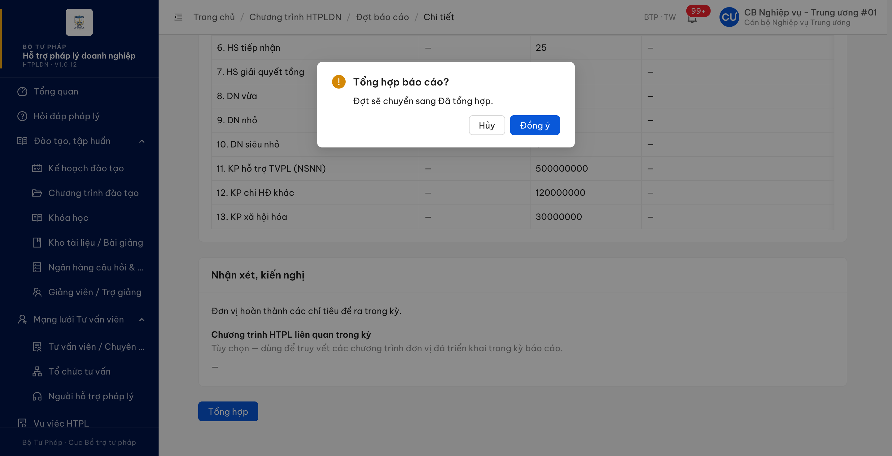
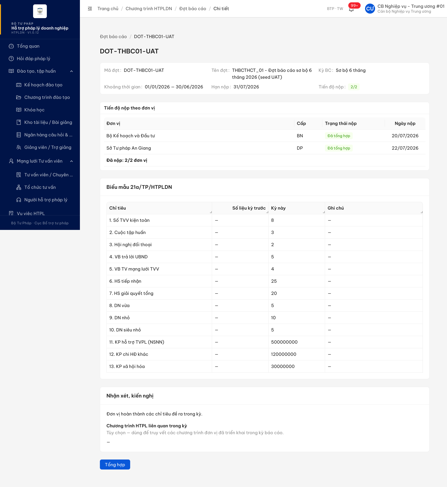
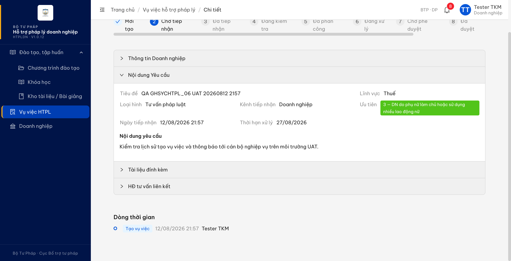
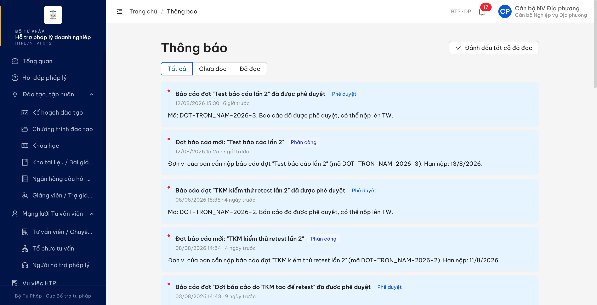

# Bug Report — UAT đối tác tuần 2

| Thông tin | Giá trị |
|-----------|---------|
| **Dự án** | PM Hỗ trợ pháp lý doanh nghiệp |
| **Môi trường** | DEV `https://18.143.165.120.nip.io`; UAT `https://htpldn-uat.ospgroup.vn` |
| **Người test** | QA Automation |
| **Ngày** | 2026-08-12 |
| **Loại test** | Functional / Workflow / Validation |
| **Round** | Verify bug đối tác vòng đầu |
| **Tài liệu tham chiếu** | `Docs-PM-HTPLDN/_bmad-output/planning-artifacts/srs-v3.5` |

---

## Tổng hợp

Phát hiện **4** lỗi có SRS reference cụ thể trong lô verify hiện tại.

### Severity breakdown

| Tổng | Critical | Major | Medium | Minor | Trivial | Closed | Open |
|------|----------|-------|--------|-------|---------|--------|------|
| 4 | 0 | 4 | 0 | 0 | 0 | 0 | 4 |

## Bug Summary Table

| Bug ID | Severity | Priority | Type | TC Ref | **SRS Reference** | Title | Status |
|--------|----------|----------|------|--------|-------------------|-------|--------|
| BUG-THBCTHCT_01 | Major | P1 | Workflow | THBCTHCT_01-new | `FR-XI-09 (UC170) §Inputs/Processing, dòng 984-1008` | Không có ô chọn báo cáo trước khi tổng hợp toàn quốc | Open |
| BUG-THBCTHCT_02 | Major | P1 | Workflow | THBCTHCT_02-new | `FR-XI-09 (UC170) §Mô tả/Processing/AC, dòng 984-1008, 1042-1043` | Bấm Tổng hợp chỉ mở xác nhận, không có form chỉnh sửa/bổ sung | Open |
| BUG-THBCTHCT_05 | Major | P1 | UI/UX | THBCTHCT_05-new | `FR-XI-09 (UC170) §Postconditions/Output, dòng 1011, 1022` | Không có chức năng xuất Excel/Word sau khi tổng hợp thành công | Open |
| BUG-GHSYCHTPL_06 | Major | P1 | Workflow | GHSYCHTPL_06 | `FR-V.I-02 (UC52) §Processing bước 8/Postconditions, dòng 200, 205-206` | Không gửi thông báo vụ việc mới cho cán bộ nghiệp vụ phụ trách | Open |

---

## BUG-THBCTHCT_01 — Không có ô chọn báo cáo trước khi tổng hợp toàn quốc

### Mô tả

CBNV TW mở chi tiết đợt có hai báo cáo đơn vị đã nộp nhưng không thể chọn báo cáo nào để tổng hợp. Trang hiển thị trực tiếp số liệu Biểu 21a và nút `Tổng hợp`, bỏ qua bước chọn nguồn báo cáo mà FR-XI-09 yêu cầu.

### Các bước tái hiện

1. Đăng nhập tài khoản `cbnv_tw_01`, role Cán bộ Nghiệp vụ Trung ương, có quyền tổng hợp báo cáo toàn quốc theo FR-XI-09/SCR-XI-01.
2. Chọn menu `Đợt báo cáo`.
3. Mở đợt `DOT-THBC01-UAT` tại `/ct-htpldn/dot-bao-cao/d7a62f6e-a119-4582-8b08-f935d25c534b`.
4. Xác nhận Bộ KH&ĐT và Sở Tư pháp An Giang đều ở trạng thái `Đã nộp`.
5. Quan sát bảng tiến độ và toàn trang: không có cột hoặc control checkbox để chọn báo cáo; kiểm tra DOM lần hai cũng cho `0` checkbox.

### Kết quả mong đợi

- Theo FR-XI-09 (UC170) dòng 984-998, CBNV TW xem danh sách báo cáo BN/ĐP đã gửi và chọn các báo cáo cần tổng hợp bằng checkbox (`bao_cao_ids`).
- Theo Processing dòng 1005-1008, sau khi chọn báo cáo và bấm `Tổng hợp`, hệ thống mới gợi ý số liệu Biểu 21a/21b và mở form cho phép chỉnh sửa/bổ sung.

### Kết quả thực tế

- Bảng chỉ có `Đơn vị`, `Cấp`, `Trạng thái nộp`, `Ngày nộp`; không có ô chọn.
- Trang hiển thị ngay số liệu Biểu 21a đã gộp và nút `Tổng hợp`, nên người dùng không thể xác định tập báo cáo nguồn theo SRS.

### Bằng chứng

### So sánh (Comparison)

| Điều kiện | SRS yêu cầu | Thực tế |
|---|---|---|
| CBNV TW, đợt có 2/2 báo cáo đã nộp | Có checkbox để chọn tập báo cáo nguồn | Không có checkbox; DOM xác nhận `0` checkbox |

---

## BUG-THBCTHCT_02 — Bấm Tổng hợp chỉ mở xác nhận, không có form chỉnh sửa/bổ sung

### Mô tả

CBNV TW bấm `Tổng hợp` trên đợt đã có dữ liệu báo cáo thì hệ thống chỉ mở modal xác nhận chuyển trạng thái. Không có form cho phép chỉnh sửa/bổ sung số liệu tổng hợp theo FR-XI-09.

### Các bước tái hiện

1. Đăng nhập tài khoản `cbnv_tw_01`, role Cán bộ Nghiệp vụ Trung ương, có quyền tổng hợp báo cáo toàn quốc theo FR-XI-09/SCR-XI-01.
2. Chọn menu `Đợt báo cáo`, mở `DOT-THBC01-UAT`.
3. Xác nhận trang có số liệu Biểu 21a và 2/2 đơn vị ở `Đã nộp`.
4. Bấm `Tổng hợp`.
5. Quan sát modal `Tổng hợp báo cáo? Đợt sẽ chuyển sang Đã tổng hợp.`; không có trường nhập hoặc form editable.

### Kết quả mong đợi

- Theo FR-XI-09 (UC170) dòng 984-1008 và AC dòng 1042-1043, hệ thống gợi ý số liệu rồi mở form tổng hợp TT17 để CBNV TW chỉnh sửa/bổ sung.
- Chỉ sau khi người dùng hoàn tất chỉnh sửa và lưu mới tạo báo cáo tổng hợp toàn quốc.

### Kết quả thực tế

- Hệ thống chỉ hiển thị modal xác nhận `Hủy`/`Đồng ý` và thông báo sẽ chuyển đợt sang `Đã tổng hợp`.
- Kiểm tra DOM lần hai không tìm thấy control editable nào trong trạng thái này.

### Bằng chứng

### So sánh (Comparison)

| Điều kiện | SRS yêu cầu | Thực tế |
|---|---|---|
| CBNV TW bấm `Tổng hợp` trên đợt đã có số liệu | Mở form TT17 cho chỉnh sửa/bổ sung | Chỉ mở modal `Hủy`/`Đồng ý`; không có control editable |

---

## BUG-THBCTHCT_05 — Không có chức năng xuất Excel/Word sau khi tổng hợp thành công

### Mô tả

CBNV TW hoàn tất tổng hợp báo cáo toàn quốc và nhận thông báo thành công, nhưng trang chi tiết không cung cấp chức năng xuất báo cáo tổng hợp ra Excel hoặc Word theo FR-XI-09.

### Các bước tái hiện

1. Đăng nhập tài khoản `cbnv_tw_01`, role Cán bộ Nghiệp vụ Trung ương.
2. Chọn menu `Đợt báo cáo`, mở đợt `DOT-THBC01-UAT` có 2/2 đơn vị đã nộp.
3. Bấm `Tổng hợp`, sau đó bấm `Đồng ý` trong hộp xác nhận.
4. Xác nhận toast `Tổng hợp báo cáo thành công` và hai đơn vị chuyển trạng thái `Đã tổng hợp`.
5. Quan sát toàn trang và các control: không có nút/link Xuất, Tải, Excel hoặc Word.

### Kết quả mong đợi

- Theo FR-XI-09 (UC170) dòng 1011, CBNV TW có thể xuất báo cáo tổng hợp ra Excel hoặc Word.
- Theo Output dòng 1022, hệ thống tạo file đầu ra `.xlsx` hoặc `.docx`.

### Kết quả thực tế

- Sau khi tổng hợp thành công, trang không hiển thị bất kỳ chức năng xuất/tải Excel hoặc Word nào.
- Kiểm tra DOM lần hai trên toàn bộ control nhìn thấy cho kết quả `totalExportControls=0`.

### Bằng chứng

### So sánh (Comparison)

| Điều kiện | SRS yêu cầu | Thực tế |
|---|---|---|
| CBNV TW, tổng hợp thành công, hai đơn vị `Đã tổng hợp` | Có thể xuất `.xlsx` hoặc `.docx` | Không có control Xuất/Tải Excel/Word; DOM xác nhận `0` control |

---

## BUG-GHSYCHTPL_06 — Không gửi thông báo vụ việc mới cho cán bộ nghiệp vụ phụ trách

### Mô tả

Doanh nghiệp gửi hồ sơ hỗ trợ pháp lý thành công trên UAT và hệ thống đã ghi lịch sử tạo vụ việc, nhưng cán bộ nghiệp vụ đúng đơn vị phụ trách không nhận được thông báo về hồ sơ mới. Lỗi lịch sử mà đối tác báo trước đây đã được sửa; lỗi thông báo vẫn còn.

### Các bước tái hiện

1. Đăng nhập tài khoản `0151554887`, role Doanh nghiệp, có quyền gửi hồ sơ yêu cầu HTPL theo FR-V.I-02 (UC52).
2. Tại `Vụ việc HTPL`, bấm `Gửi yêu cầu hỗ trợ pháp lý`; nhập tiêu đề duy nhất, nội dung, lĩnh vực, loại hình hỗ trợ và tải một tệp hợp lệ.
3. Bấm `Gửi yêu cầu`; ghi lại mã hồ sơ được sinh. Lượt kiểm thử này tạo `VV-STP-HN-20260812-001` lúc 21:57 ngày 12/08/2026.
4. Mở chi tiết hồ sơ và xác nhận dòng thời gian có `Tạo vụ việc` do `Tester TKM` thực hiện.
5. Đăng nhập `cbnv_dp`, role Cán bộ Nghiệp vụ Địa phương của Sở Tư pháp Hà Nội, là đơn vị phụ trách doanh nghiệp trên.
6. Mở `Thông báo` và kiểm tra danh sách mới nhất; kiểm tra lại qua API danh sách thông báo theo thứ tự thời gian giảm dần.

### Kết quả mong đợi

- Theo FR-V.I-02 (UC52) Processing bước 8 dòng 200, hệ thống gửi thông báo cho CB NV của đơn vị xác định theo `DOANH_NGHIEP.tinh_thanh_id`.
- Theo Postcondition dòng 205-206, sau khi hồ sơ được tạo và chờ tiếp nhận, CB NV phải nhận được thông báo gắn với hồ sơ mới.

### Kết quả thực tế

- Hồ sơ `VV-STP-HN-20260812-001` được tạo thành công; tệp đính kèm, mức ưu tiên và lịch sử `TAO_VV` đã được lưu đúng.
- Trang Thông báo của `cbnv_dp` lúc 21:59 không có thông báo về hồ sơ vừa tạo; thông báo mới nhất vẫn là dữ liệu lúc 15:30.
- API danh sách thông báo trả 18 bản ghi nhưng không có entity ID của hồ sơ, không có mã `VV-STP-HN-20260812-001`, và không có bản ghi nào được tạo sau thời điểm gửi hồ sơ.

### Bằng chứng

API lịch sử trả `hanhDong = TAO_VV`; API hồ sơ trả tệp `GHSYCHTPL_06-attachment.png` với trạng thái quét `SACH`. API thông báo không có bản ghi gắn với vụ việc `5c759371-0f52-45e7-9080-ce2855bafb28`.

### So sánh (Comparison)

| Hậu điều kiện | Kết quả UAT |
|---|---|
| Ghi lịch sử `TAO_VV`, người thực hiện là tài khoản role DN | ✅ Đã có `Tạo vụ việc — 12/08/2026 21:57 — Tester TKM` |
| Gửi thông báo cho CB NV Sở Tư pháp Hà Nội | ❌ Không có trên UI và API thông báo của `cbnv_dp` |

---

## Phụ lục — Môi trường test

| Thành phần | Giá trị |
|------------|---------|
| URL ứng dụng | DEV `https://18.143.165.120.nip.io`; UAT `https://htpldn-uat.ospgroup.vn` |
| OTP login | DEV: Gmail thật `diupt01@gmail.com` qua CDP `127.0.0.1:9223`; UAT: MailHog `https://htpldn-uat.ospgroup.vn/mailhog/` |
| Xác thực | Tên đăng nhập + mật khẩu + OTP email |
| Tool test | Chrome DevTools MCP |

---

*Bug report generated: 2026-08-12 | QA Automation*
