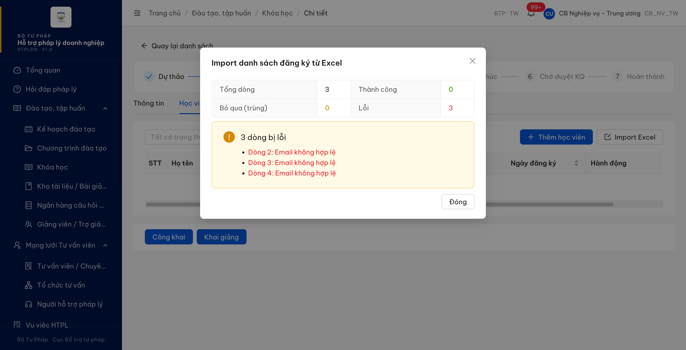
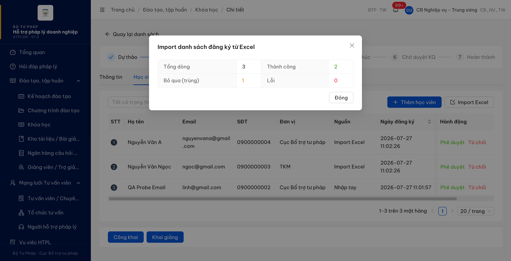
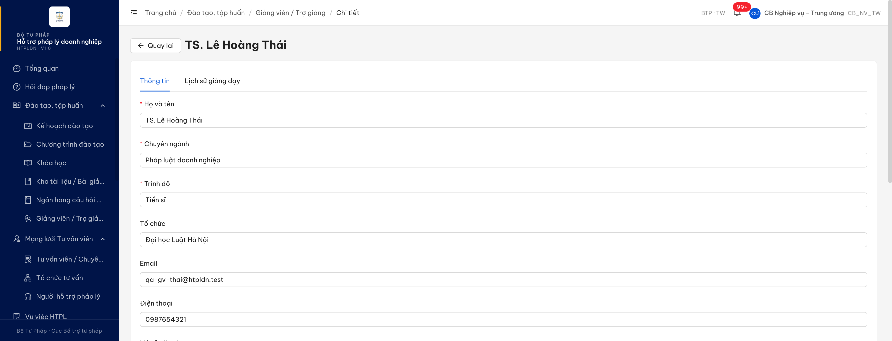
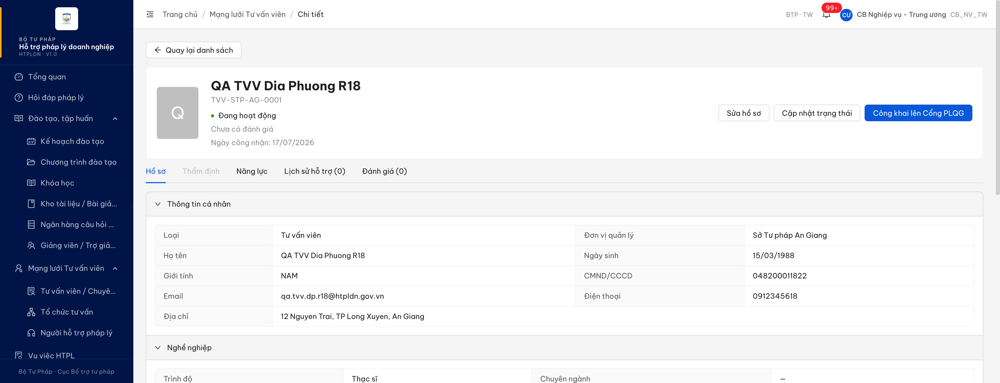

# Bug Report — Đào tạo, tập huấn (verify phản ánh vòng 2 của đối tác)

| Thông tin | Giá trị |
|-----------|---------|
| **Dự án** | PM HTPLDN |
| **Môi trường** | https://18.143.165.120.nip.io |
| **Người test** | QA Automation |
| **Ngày** | 2026-07-27 19:22:00 |
| **Loại test** | Functional — verify bug đối tác (vòng 2) |
| **Round** | Vòng 2 — tab `UAT_TGPL Doanh Nghiệp-tuần 2` |
| **Tài liệu tham chiếu** | `Docs-PM-HTPLDN/_bmad-output/planning-artifacts/srs-v3.5/srs-fr-03-dao-tao.md` · [QA_VERIFY_PROTOCOL.md](../../../QA_VERIFY_PROTOCOL.md) |

---

## Tổng hợp

Verify các phản ánh vòng 2 (`Trạng thái 2` = Fail) của đối tác trên module Đào tạo, tập huấn. Phát hiện **2** lỗi có SRS reference cụ thể.

> **R3 (27/07/2026) — re-test sau khi dev báo fix** (2 bug đều có `Trạng thái dev fix 2` = dev done).
> Tiến độ: **2/2 đã re-test** — Pass 2 (DKTGKH_12 · QLGVTG_07) · Reopen 0. Cả file đã đóng.

### Severity breakdown

| Tổng | Critical | Major | Medium | Minor | Trivial | Closed | Open |
|------|----------|-------|--------|-------|---------|--------|------|
| 2    | 0        | 2     | 0      | 0     | 0       | 2      | 0    |

## Bug Summary Table

| Bug ID | Severity | Priority | Type | TC Ref | **SRS Reference** | Title | Status |
|--------|----------|----------|------|--------|-------------------|-------|--------|
| BUG-DKTGKH_12 | Major | P1 | Negative | DKTGKH_12 | `FR-III-04 (UC23) §Inputs row 4` (srs-fr-03-dao-tao.md:461) · `§Processing bước 6` (:475) | Import Excel đăng ký: ô Email có liên kết `mailto:` bị đọc thành `[object Object]` → mọi dòng báo "Email không hợp lệ" | Closed |
| BUG-QLGVTG_07 | Major | P1 | Negative | QLGVTG_07 | `SCR-III-05 §Cột Hành động` (srs-fr-03-dao-tao.md:1924) · `§Nhãn theo chế độ` (:1926) · tiền lệ `srs-fr-04-chuyen-gia-tvv.md:1556` | Màn chi tiết giảng viên ở chế độ Xem vẫn là form sửa và lưu đè được dữ liệu (PATCH thành công) | Closed |

---

## ~~BUG-DKTGKH_12~~ [CLOSED] — Import danh sách đăng ký từ Excel từ chối toàn bộ dòng có ô Email dạng liên kết, báo "Email không hợp lệ"

> **Re-test:** 2026-07-27 19:20:00 R3 — ✅ PASS (Closed-verified). Dựng lại đúng file tái hiện của vòng trước (3 dòng, ô Email đều là liên kết `mailto:`) rồi chạy trọn luồng Chi tiết khóa học `KH-QAW7-HOINGHI` → tab Học viên → **Import Excel** → **Bắt đầu Import**: hộp thoại kết quả nay báo **Tổng dòng 3 · Thành công 3 · Bỏ qua (trùng) 0 · Lỗi 0**, không còn dòng nào bị loại. Máy chủ đã lấy đúng chữ trong ô — phản hồi của chính request import trả `"email":"qa.r3.mailto1@gmail.com"` (vòng trước là `"[object Object]"`) cho cả 3 dòng, `status":"success"`. Đọc lại danh sách học viên: đủ **3 bản ghi mới** (`QA R3 Mailto Mot/Hai/Ba`), cột Email hiện đúng địa chỉ, `Nguồn = Import Excel`, `trangThai = CHO_DUYET` ⇒ dữ liệu vào thật chứ không chỉ báo thành công trên màn hình. [Ảnh](image/DKTGKH_12-r3-import-mailto-thanh-cong.png)

### Mô tả

Ở màn Chi tiết khóa học → tab Học viên → **Import Excel**, khi ô cột Email trong file là ô có liên kết (`mailto:` — Excel **tự động** tạo ngay khi người dùng gõ địa chỉ email vào ô rồi rời ô), máy chủ không lấy được chữ trong ô mà đọc ra chuỗi `[object Object]`, rồi đem chuỗi đó đi kiểm định dạng email nên luôn trượt. Kết quả: 100% số dòng bị loại với lý do "Email không hợp lệ", `Thành công 0`. Cùng những email đó, nếu ô Email để text thường thì import chạy đúng; và cùng email đó nhập qua luồng nhập tay cũng tạo được bản ghi.

### Các bước tái hiện

1. Đăng nhập role **CB Nghiệp vụ - Trung ương** (`cbnv_tw` / CB_NV_TW, đơn vị Cục Bổ trợ tư pháp — role có quyền quản lý đăng ký khóa học theo SCR-III-02 tab Học viên).
2. Vào **Đào tạo, tập huấn → Khóa học** → mở khóa `KH-QAW7-HOINGHI` (`a7480002-0000-4000-8000-000000000002`, đang ở bước **Đã duyệt**) → tab **Học viên**.
3. Bấm **Import Excel** → bấm **Tải file mẫu** để lấy `dang-ky-dao-tao-template.xlsx`.
4. Mở file mẫu bằng Excel, điền 3 dòng, cột Email gõ `linh@gmail.com`, `ngoc@gmail.com`, `nguyenvana@gmail.com` (Excel tự biến ô thành liên kết `mailto:` — chữ chuyển xanh gạch chân). Lưu file.
5. Kéo file vào ô upload → bấm **Bắt đầu Import**.
6. Quan sát bảng kết quả trong hộp thoại.

### Kết quả mong đợi

- Theo `srs-fr-03-dao-tao.md:461` (FR-III-04 / UC23, Inputs row 4), `email` là trường bắt buộc kiểu text và không có ràng buộc nào hẹp hơn định dạng email thông thường ⇒ ba địa chỉ trên là hợp lệ và phải được chấp nhận.
- Theo `srs-fr-03-dao-tao.md:475` (Processing bước 6), hệ thống phải kiểm rồi nạp từng dòng và báo cáo kết quả đúng thực chất của từng dòng.
- Theo `srs-fr-03-dao-tao.md:443`, import Excel là một trong ba cách đăng ký ngang hàng với nhập tay ⇒ cùng một giá trị email không được cho ra kết quả trái ngược giữa hai đường nhập liệu.
- Định dạng hiển thị của ô (có liên kết hay không) không phải căn cứ nghiệp vụ để loại dòng.

### Kết quả thực tế

- Hộp thoại báo: `Tổng dòng 3 · Thành công 0 · Bỏ qua (trùng) 0 · **Lỗi 3**` — "Dòng 2: Email không hợp lệ / Dòng 3: Email không hợp lệ / Dòng 4: Email không hợp lệ".
- Response body của chính request import cho thấy máy chủ đọc ô Email ra `[object Object]`:
  `{"row":2,"email":"[object Object]","status":"error","reason":"Email không hợp lệ"}`.
- Đối chứng 1 — cùng 3 email, để ô Email là **text thường**: `Tổng dòng 3 · Thành công 2 · Bỏ qua (trùng) 1 · Lỗi 0`, bảng hiện đủ học viên.
- Đối chứng 2 — cùng `linh@gmail.com` qua luồng **nhập tay** (`POST .../dang-ky-dao-taos`): **HTTP 201 Created**, `trangThai=CHO_DUYET` ⇒ email hợp lệ theo chính rule của hệ thống.
- Đo thông báo bằng `tools/toast-capture.js` (`soObserverDangSong=1`): `SO_REQUEST=1` · `SO_KHUNG_THONG_BAO=1`, chữ hiển thị là **"Import hoàn tất"** — thông báo thành công vẫn hiện dù 100% số dòng bị loại.

### Bằng chứng

**1. Ảnh chụp:**





**2. API response:**

```json
{"success":true,"data":{"total":3,"success":0,"skipped":0,"errors":3,"details":[
  {"row":2,"email":"[object Object]","status":"error","reason":"Email không hợp lệ"},
  {"row":3,"email":"[object Object]","status":"error","reason":"Email không hợp lệ"},
  {"row":4,"email":"[object Object]","status":"error","reason":"Email không hợp lệ"}]},"meta":null}
```

`POST /api/v1/khoa-hocs/a7480002-0000-4000-8000-000000000002/dang-ky-dao-taos/import` → 201.
File tái hiện + log đầy đủ: [`../../reverify-audit/DKTGKH_12/`](../../reverify-audit/DKTGKH_12/).

---

## ~~BUG-QLGVTG_07~~ [CLOSED] — Màn chi tiết giảng viên mở bằng nút "Xem" vẫn là form sửa, bấm Lưu ghi đè được dữ liệu

> **Re-test:** 2026-07-27 19:15:00 R3 — ✅ PASS (Closed-verified). Mở bằng nút 👁 Xem (`/dao-tao/giang-vien/{id}`, breadcrumb dừng ở "Chi tiết"): tab "Thông tin" nay **chỉ đọc** — **0/9 ô nhập được** (trước là 10 ô mở), các nút trên màn còn đúng **["Quay lại"]**, **không còn "Hủy" / "Lưu"** ⇒ không còn đường ghi đè dữ liệu từ chế độ Xem. Lặp trên 2 bản ghi (`QA GV QLGVTG09` và `TS. Lê Hoàng Thái` — đúng bản ghi nêu ở vòng trước) kết quả giống nhau. Chế độ **Sửa vẫn hoạt động bình thường** (`/…/chinh-sua`, 8/9 ô sửa được, có nút Hủy + Lưu) ⇒ fix không làm hỏng luồng sửa. *Ghi nhận nhỏ (không chặn đóng bug):* khối "Tệp đính kèm" trên màn Xem vẫn cho chọn tệp và gửi lên máy chủ (`POST /giang-viens/upload` 201), nhưng tệp **không gắn vào hồ sơ** — tải lại trang không thấy, dữ liệu giảng viên không đổi. [Ảnh 1](image/QLGVTG_07-r3-man-xem-chi-doc.png) · [Ảnh 2](image/QLGVTG_07-r3-che-do-sua-van-hoat-dong.png)

### Mô tả

Ở màn **Đào tạo, tập huấn → Giảng viên / Trợ giảng**, bấm nút 👁 **Xem** ở cột Hành động thì hệ thống mở màn có nhãn "Chi tiết" (đường dẫn `/dao-tao/giang-vien/{id}`, không có `/chinh-sua`) — nhưng tab "Thông tin" bên trong là **form sửa đầy đủ**: mọi ô đều nhập được và có nút **Hủy** / **Lưu**. Bấm Lưu thì dữ liệu được ghi thật vào máy chủ. Như vậy chế độ Xem và chế độ Sửa chỉ khác nhau ở đường dẫn và nhãn, còn khả năng thay đổi dữ liệu là như nhau; người chỉ có ý định xem hồ sơ vẫn có thể sửa và lưu đè.

Cùng phần mềm, màn chi tiết **Tư vấn viên** — chính là module mà đặc tả chỉ định làm tiền lệ — đang làm đúng: chế độ Xem không có ô nhập nào, muốn sửa phải bấm nút "Sửa hồ sơ" riêng.

### Các bước tái hiện

1. Đăng nhập role **CB Nghiệp vụ - Trung ương** (`cbnv_tw` / CB_NV_TW, đơn vị Cục Bổ trợ tư pháp — role có quyền "Quản lý giảng viên" theo FR-III-11).
2. Vào **Đào tạo, tập huấn → Giảng viên / Trợ giảng**.
3. Ở một dòng bất kỳ, bấm nút 👁 **Xem** tại cột Hành động (KHÔNG bấm ✏ Sửa).
4. Quan sát breadcrumb (dừng ở "Chi tiết") và tab "Thông tin".
5. Sửa nội dung ô **Chuyên ngành** thành một giá trị khác.
6. Bấm **Lưu**, rồi mở lại chính bản ghi đó để xem dữ liệu.

### Kết quả mong đợi

- Theo `srs-fr-03-dao-tao.md:1924` (SCR-III-05, cột Hành động), **Xem** và **Sửa** là hai hành động riêng biệt, và ghi chú nguồn của chính dòng này nêu rõ nút "Xem" được bổ sung **"cho nhất quán với các màn danh sách khác"** ⇒ chế độ Xem phải hành xử như chế độ Xem của các màn danh sách khác trong phần mềm, tức trình bày hồ sơ để đọc chứ không phải để nhập.
- Theo `srs-fr-03-dao-tao.md:1926`, nhãn màn theo chế độ được quy định **"theo tiền lệ module Tư vấn viên"**; mà `srs-fr-04-chuyen-gia-tvv.md:1556` quy định tab "Hồ sơ" của màn chi tiết Tư vấn viên là "6 nhóm thu gọn được, **chỉ đọc**" ⇒ tiền lệ được viện dẫn là một màn chi tiết chỉ đọc.
- Do đó, ở chế độ Xem, người dùng không thay đổi được dữ liệu giảng viên; muốn sửa thì phải chuyển sang chế độ Sửa (hành động ✏ hoặc một nút chuyển chế độ ngay trên màn chi tiết).

### Kết quả thực tế

- Bấm 👁 Xem → `/dao-tao/giang-vien/f0fafafa-0000-4000-8000-000000000001`, breadcrumb `Trang chủ / Đào tạo, tập huấn / Giảng viên / Trợ giảng / **Chi tiết**`, tab "Thông tin" hiển thị **10 ô nhập, tất cả đều không bị khóa** (chỉ ô Trạng thái là chỉ đọc), kèm ô mô tả năng lực nhập được; các nút trên màn là **Quay lại · Hủy · Lưu**.
- Lặp trên bản ghi thứ hai (`QA GV QLGVTG09`, `fb261852-2362-4f0a-a540-215596fd521f`): kết quả giống hệt ⇒ không phụ thuộc bản ghi.
- **Sửa ô "Chuyên ngành" ngay tại màn Xem rồi bấm Lưu:** hệ thống gọi `PATCH /api/v1/giang-viens/fb261852-…` (đo bằng `tools/toast-capture.js`, `soObserverDangSong=1`, `SO_REQUEST=1`) và hiện thông báo **"Cập nhật giảng viên thành công"** (`SO_KHUNG_THONG_BAO=1`).
- **Đọc lại bản ghi sau khi lưu:** `chuyenNganh` = `"Luat kinh te - QA sua tu man XEM"` ⇒ dữ liệu bị ghi đè thật từ chế độ Xem, không phải chỉ đổi trên màn hình. (Đã khôi phục về `"Luật kinh tế"` ngay sau phép đo.)
- **Đối chứng trong cùng phần mềm** — màn chi tiết Tư vấn viên mở bằng nút "Xem": `/chuyen-gia-tvv/{id}`, breadcrumb dừng ở "Chi tiết", **0 ô nhập / 0 ô mô tả**, các nút là "Quay lại danh sách · Sửa hồ sơ · Cập nhật trạng thái · …".
- Chế độ Sửa riêng của màn Giảng viên vẫn tồn tại (`/dao-tao/giang-vien/{id}/chinh-sua`, breadcrumb `… / Chi tiết / Chỉnh sửa`) nhưng không khác gì chế độ Xem về khả năng ghi.

### Bằng chứng

**1. Ảnh chụp:**





**2. Kết quả đo khi bấm Lưu tại màn Xem:**

```json
{"giaTriTruoc":"Luật kinh tế","giaTriMoi":"Luat kinh te - QA sua tu man XEM",
 "SO_REQUEST":1,"request":["PATCH /api/v1/giang-viens/fb261852-2362-4f0a-a540-215596fd521f"],
 "SO_KHUNG_THONG_BAO":1,"chu":["Cập nhật giảng viên thành công"]}

Doc lai ban ghi sau khi luu:
{"chuyenNganh_sauKhiLuuTuManXem":"Luat kinh te - QA sua tu man XEM"}
```

Toàn bộ phép đo + đối chứng: [`../../reverify-audit/QLGVTG_07/audit.md`](../../reverify-audit/QLGVTG_07/audit.md).

---

## Phụ lục — Môi trường test

| Thành phần | Giá trị |
|------------|---------|
| URL ứng dụng | https://18.143.165.120.nip.io |
| OTP login | MailHog |
| MailHog (OTP inbox) | http://18.143.165.120:8025 |
| API base | https://18.143.165.120.nip.io/api/v1 |
| Frontend | React + Ant Design v5 |
| Xác thực | JWT (cookie) + OTP |
| Tool test | Chrome DevTools MCP |

---

*Bug report generated: 2026-07-27 19:22:00 | QA Automation via Claude Code*
