# Bug Report — Mạng lưới Tư vấn viên (verify phản ánh vòng 2 của đối tác)

| Thông tin | Giá trị |
|-----------|---------|
| **Dự án** | PM HTPLDN |
| **Môi trường** | https://18.143.165.120.nip.io |
| **Người test** | QA Automation |
| **Ngày** | 2026-07-30 23:26:00 |
| **Loại test** | Functional — verify bug đối tác (vòng 2) |
| **Round** | Vòng 2 — tab `UAT_TGPL Doanh Nghiệp-tuần 2` |
| **Tài liệu tham chiếu** | `Docs-PM-HTPLDN/_bmad-output/planning-artifacts/srs-v3.5/srs-fr-04-chuyen-gia-tvv.md` · [QA_VERIFY_PROTOCOL.md](../../../QA_VERIFY_PROTOCOL.md) |

---

## Tổng hợp

Verify các phản ánh vòng 2 (`Trạng thái 2` = Fail) của đối tác trên module Mạng lưới Tư vấn viên. Phát hiện **9** lỗi có SRS reference cụ thể.

> **R5 (30/07/2026) — re-test 3 bug `BA confirm` sau khi BA ra quyết định ngày 30/07 và dev báo fix.** Cả 3 đều PASS → đóng: DKTGMLTVV_03 (bỏ bắt buộc Tổ chức hành nghề chính) · QLHSTVV_03 (gỡ mục "Địa bàn", đưa Số quyết định công nhận lên thẻ đầu trang) · TDHSTVV_14 (tiêu đề thân thư hết chữ "Phê duyệt" + dấu tích xanh).
> Phát sinh **1 bug mới** ở chính luồng thẩm định: BUG-TDHSTVV_14b — thông báo hiện trên màn sau "Gửi KQ" không phản ánh kết luận vừa chọn. Đây là lý do ca `TDHSTVV_14` trên sheet đang ở trạng thái Reopen dù bug tiêu đề thư đã đóng.
> **R6 (30/07/2026 23:26) — re-test BUG-TDHSTVV_14b sau khi dev báo fix:** ✅ PASS, đạt đủ 5/5 tiêu chí, cả hai nhánh kết luận. Đo lại cả 3 tiêu chí vốn đã đạt, không cái nào hỏng ngược.
> Tiến độ: **9 bug — Closed 9 · Open 0.**

### Severity breakdown

| Tổng | Critical | Major | Medium | Minor | Trivial | Closed | Open |
|------|----------|-------|--------|-------|---------|--------|------|
| 9    | 0        | 5     | 2      | 2     | 0       | 9      | 0    |

## Bug Summary Table

| Bug ID | Severity | Priority | Type | TC Ref | **SRS Reference** | Title | Status |
|--------|----------|----------|------|--------|-------------------|-------|--------|
| BUG-QLTVV_02 | Medium | P2 | Negative | QLTVV_02 | `SCR-IV-01 §Thành phần bảng dòng 27` (srs-fr-04-chuyen-gia-tvv.md:1450) | Cột Hành động màn danh sách Tư vấn viên hiển thị liên kết chữ "Xem / Sửa / Xóa" thay vì nhóm icon theo đặc tả | Closed |
| ~~BUG-DKTGMLTVV_03~~ | Major | P1 | Negative | DKTGMLTVV_03 | `SCR-IV-02 §nhóm 3 mục 4.1` (srs-fr-04-chuyen-gia-tvv.md:1506) · `FR-IV-03 §Inputs #14` (:307) | Form Thêm mới Tư vấn viên bắt buộc nhập Tổ chức hành nghề chính, chặn luồng đăng ký tư vấn viên tự do mà đặc tả cho phép để trống  | Closed |
| BUG-CNHSNLTVV_02 | Major | P1 | Negative | CNHSNLTVV_02 | `FR-IV-04 §Màn hình + §Tác nhân + §AC` (srs-fr-04-chuyen-gia-tvv.md:368, :372, :429) · `SCR-IV-03 thẻ Đánh giá` (:1572) · `SCR-IV-03 thẻ Năng lực` (:1568) | Vai trò Người hỗ trợ pháp lý bị đẩy sang trang 403 khi mở chi tiết tư vấn viên cùng đơn vị, khiến chức năng Cập nhật năng lực không vai trò nào dùng được | Closed |
| ~~BUG-QLHSTVV_03~~ | Medium | P2 | Negative | QLHSTVV_03 | `Ghi chú v3.1 — bỏ TVV_DIA_BAN` (srs-fr-04-chuyen-gia-tvv.md:46) · `Entity TU_VAN_VIEN dòng 19` (:153) | Thẻ Hồ sơ màn chi tiết tư vấn viên hiển thị mục "Địa bàn" trong khi đặc tả đã bỏ hẳn khái niệm địa bàn của tư vấn viên  | Closed |
| BUG-TDHSTVV_08 | Major | P1 | Negative | TDHSTVV_08 | `SCR-IV-03 dòng 20b nút Lưu nháp` (srs-fr-04-chuyen-gia-tvv.md:1565) · `dòng 6 nút Bắt đầu thẩm định` (:1545) · `dòng 13 thẻ Thẩm định` (:1557) · `dòng 20c/20d nút Gửi kết quả / Trình phê duyệt` (:1566, :1567) · `Quy tắc tương tác` (:1581) · `SM-TVV` (:2283-:2286) | Luồng thẩm định hồ sơ tư vấn viên không đi theo máy trạng thái đặc tả: thiếu nút "Bắt đầu thẩm định", thẻ Thẩm định mở ngay ở "Mới đăng ký", "Gửi KQ" nhảy thẳng sang "Chờ phê duyệt" — hồ sơ không bao giờ ở trạng thái "Đang thẩm định"; trên bản đối tác nút "Lưu nháp" còn tự đổi trạng thái | Closed |
| BUG-QLTVV_24 | Major | P1 | Negative | QLTVV_24 | `FR-IV-03 §Inputs #2 — anh_chan_dung Bắt buộc = N` (srs-fr-04-chuyen-gia-tvv.md:136) · `SCR-IV-02 §nhóm 1 mục 2.3` (:1486) · `SCR-IV-03 dòng 3 — Thẻ thông tin chính` (:1543) · `bảng lỗi FR-IV-03` (:198-199) | Không gỡ được ảnh chân dung khỏi hồ sơ tư vấn viên: bấm Xóa trả về lỗi hệ thống chưa xử lý, trong khi đặc tả ghi ảnh chân dung là trường không bắt buộc; kèm theo màn chi tiết không hiển thị ảnh đã lưu | Closed |
| BUG-QLHSTVV_05 | Major | P1 | Negative | QLHSTVV_05 | `SCR-IV-03 dòng 22 — thẻ Lịch sử hỗ trợ, điều kiện hiển thị "Luôn"` (srs-fr-04-chuyen-gia-tvv.md:1569) · `dòng 6 — nút Bắt đầu thẩm định` (:1545) · `FR-IV-04 §Tác nhân` (:372, :368, :429) · `bảng lỗi` (:198-199, :422) | Vai trò Người hỗ trợ pháp lý bị đẩy sang trang 403 khi mở thẻ "Lịch sử hỗ trợ" của hồ sơ tư vấn viên cùng đơn vị; cùng màn còn hiện nút "Bắt đầu thẩm định" cho vai trò không được phép và trả thông báo tiếng Anh "Forbidden" | Closed |
| ~~BUG-TDHSTVV_14~~ | Minor | P3 | Negative | TDHSTVV_14 | `FR-IV-06 §Processing bước 6` (srs-fr-04-chuyen-gia-tvv.md:522) · `SM-TVV dòng DANG_THAM_DINH → TU_CHOI` (:2325) · `nguyên tắc thông báo nói đúng bản chất` (:198-199, :422) | Thư báo hồ sơ tư vấn viên bị từ chối lại mang tiêu đề "✅ Phê duyệt: Hồ sơ bị từ chối" — chữ "Phê duyệt" kèm dấu tích xanh trên một thư từ chối  | Closed |
| ~~BUG-TDHSTVV_14b~~ | Minor | P3 | Negative | TDHSTVV_14 | `SCR-IV-03 §Quy tắc tương tác — Thẩm định` (srs-fr-04-chuyen-gia-tvv.md:1589) · quyết định BA 30/07/2026 điểm 4 | Thông báo hiện trên màn sau khi gửi kết quả thẩm định luôn là "Đã lưu kết quả thẩm định", không cho biết kết luận vừa chọn là từ chối hay yêu cầu bổ sung | Closed |

---

## ~~BUG-QLTVV_02~~ [CLOSED] — Cột Hành động màn danh sách Tư vấn viên là liên kết chữ, không phải nhóm icon theo đặc tả

> **Re-test:** 2026-07-29 11:31:00 R4 — ✅ PASS (Closed-verified). Cột Hành động nay là **nhóm icon**: **5/5 dòng** tab "Đang hoạt động" hiện đúng 3 icon `mắt · bút chì · thùng rác`, **0 chữ**; lặp trên tab "Từ chối" (7 dòng) và "Mới đăng ký" (1 dòng) đều vậy. Đã bấm thật từng icon chứ không chỉ soi giao diện: **mắt** → mở màn chi tiết (`/chuyen-gia-tvv/{id}`, breadcrumb dừng ở "Chi tiết", 0 ô nhập); **bút chì** → mở màn sửa (`/…/chinh-sua`, breadcrumb "Chi tiết / Chỉnh sửa", 25 ô nhập + nút Hủy/Lưu); **thùng rác** → mở hộp thoại xác nhận *"Bạn có chắc muốn xóa tư vấn viên … Hành động này không thể hoàn tác"* với 2 nút Hủy / Xóa. Điều kiện **ẩn icon Sửa khi trạng thái Vô hiệu hóa** (vòng trước chưa kiểm được vì tab rỗng) nay đã kiểm: QA dựng một hồ sơ về "Vô hiệu hóa" rồi đọc lại danh sách — ô Hành động chỉ còn **mắt + thùng rác**, đúng `:1450`; sau phép đo đã khôi phục hồ sơ về "Đang hoạt động". *Giới hạn ghi nhận (không chặn đóng bug):* điều kiện "icon Xóa chỉ hiện khi không có vụ việc đang xử lý" chưa dựng được phản chứng vì không hồ sơ nào trong danh sách đang có vụ việc chưa hoàn thành. [Ảnh 1](image/QLTVV_02-r4-cot-hanh-dong-da-thanh-icon.png) · [Ảnh 2](image/QLTVV_02-r4-vo-hieu-hoa-an-icon-sua.png)

> **Phân biệt với bug cùng mã ở vòng 1:** `BUG-QLTVV_02` vòng 1 nói về cột "Loại" hiện mã viết tắt và cột "Điểm ĐG" theo thang /10 — đã đóng (Verify=Pass) và đã kiểm lại vẫn đúng. Entry này là **nội dung khác**, phát hiện khi soi cột Hành động mà đối tác phản ánh ở vòng 2.

### Mô tả

Ở màn **Mạng lưới Tư vấn viên → Tư vấn viên / Chuyên gia** (danh sách), cột **Hành động** đang hiển thị ba **liên kết chữ** "Xem", "Sửa", "Xóa". Theo đặc tả màn hình, cột này phải là **nhóm icon**: icon con mắt (Xem), icon bút chì (Sửa), icon thùng rác (Xóa). Cùng phần mềm, màn danh sách **Giảng viên / Trợ giảng** đã làm đúng kiểu icon.

Ngoài chuyện sai đặc tả, chữ chiếm nhiều chỗ hơn icon nên cột dễ bị ép khi dữ liệu dày — đây cũng là bối cảnh của phản ánh "nút Xem, Sửa bị xuống dòng" mà đối tác gửi kèm ảnh.

### Các bước tái hiện

1. Đăng nhập role **CB Nghiệp vụ - Trung ương** (`cbnv_tw` / CB_NV_TW, đơn vị Cục Bổ trợ tư pháp).
2. Vào **Mạng lưới Tư vấn viên → Tư vấn viên / Chuyên gia**.
3. Ở tab **Đang hoạt động**, cuộn bảng sang phải tới cột **Hành động**.
4. Quan sát nội dung ô Hành động của từng dòng.

### Kết quả mong đợi

- Theo `srs-fr-04-chuyen-gia-tvv.md:1450` (SCR-IV-01, §Thành phần màn hình dòng 27), cột "Hành động" là **nhóm icon**: Icon Xem (mắt) mở màn chi tiết SCR-IV-03; Icon Sửa (bút chì) mở màn sửa SCR-IV-02, ẩn khi trạng thái là Vô hiệu hóa; Icon Xóa (thùng rác) chỉ hiện khi tư vấn viên không có vụ việc đang xử lý và mở hộp thoại xác nhận.
- Cách thể hiện phải nhất quán với các màn danh sách khác trong phần mềm.

### Kết quả thực tế

- Ô Hành động chứa `<a>Xem</a>`, `<a>Sửa</a>`, `<button><span>Xóa</span></button>` — **không có phần tử icon nào**.
- Đo ở 3 chiều rộng cửa sổ (1920 · 1440 · 1280): cột Hành động rộng 160–165 px, ba nút chữ nằm trên 1 dòng (Xem 28,2 px · Sửa 24,3 px · Xóa 29,6 px).
- Đối chiếu trong cùng phần mềm: màn danh sách **Giảng viên / Trợ giảng** dùng icon 👁 ở cột Hành động.

### Bằng chứng

**1. Ảnh chụp:**

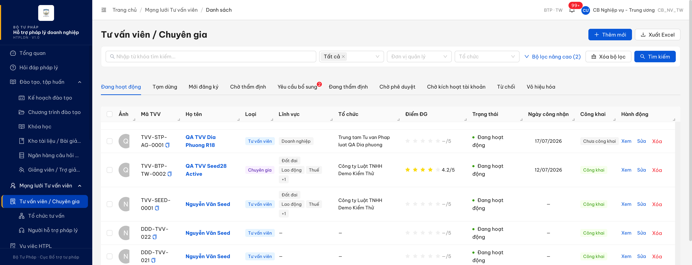

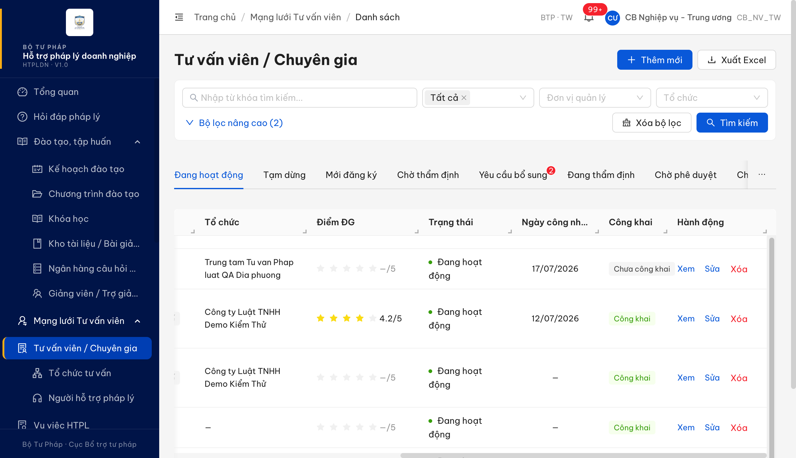

**2. Nội dung DOM của ô Hành động:**

```html
<div style="display: flex; align-items: center; gap: 8px;">
  <a href="/chuyen-gia-tvv/{id}">Xem</a>
  <a href="/chuyen-gia-tvv/{id}/chinh-sua">Sửa</a>
  <button type="button" class="ant-btn ant-btn-link ant-btn-dangerous"><span>Xóa</span></button>
</div>
```

Toàn bộ phép đo + đối chiếu 3 ý đối tác phản ánh: [`../../reverify-audit/QLTVV_02/audit.md`](../../reverify-audit/QLTVV_02/audit.md).

---

## ~~BUG-DKTGMLTVV_03~~ [CLOSED] — Form Thêm mới Tư vấn viên bắt buộc "Tổ chức hành nghề chính", chặn luồng đăng ký tư vấn viên tự do

> **Re-test:** 2026-07-30 R5 — ✅ PASS (Closed-verified). Nhãn "Tổ chức hành nghề chính" đã bỏ dấu bắt buộc; để trống vẫn tạo được hồ sơ (TVV-BTP-TW-0024, cột Tổ chức hiện "—"). Hai thay đổi BA chốt cùng form ngày 30/07 cũng đạt: form gộp về 5 nhóm, "Số QĐ công bố" / "Ngày QĐ công bố" nằm trong nhóm Nghề nghiệp. Chuyên ngành + Số năm kinh nghiệm nay bắt buộc ở luồng đăng ký mới nhưng KHÔNG bắt buộc ở luồng sửa — đúng phân biệt BA yêu cầu.

### Mô tả

Ở form **Thêm mới Tư vấn viên** (`/chuyen-gia-tvv/tao-moi`, vai trò Người hỗ trợ pháp lý), trường **"Tổ chức hành nghề chính"** ở nhóm "Tổ chức & Mạng lưới" đang được đặt là bắt buộc: để trống rồi bấm Lưu thì hệ thống chặn với thông báo **"Tổ chức chính là bắt buộc"**.

Theo đặc tả, đây là trường **tùy chọn** — chính đặc tả ghi rõ lý do: *"tư vấn viên tự do để trống"*. Vì vậy hệ thống đang chặn hẳn một luồng nghiệp vụ hợp lệ: không thể đăng ký tư vấn viên hành nghề tự do (không thuộc tổ chức tư vấn nào) vào mạng lưới.

### Các bước tái hiện

1. Đăng nhập role **Người hỗ trợ pháp lý** (`nht_qa_01` / NHT, Sở Tư pháp An Giang — role được đặc tả cho phép submit hồ sơ ứng viên TVV).
2. Vào **Mạng lưới Tư vấn viên → Tư vấn viên / Chuyên gia** → bấm **+ Thêm mới** (hoặc mở thẳng `/chuyen-gia-tvv/tao-moi`).
3. Nhập đầy đủ các trường bắt buộc khác (Họ tên, Ngày sinh, Giới tính, CCCD, Email, Số điện thoại, Địa chỉ, Trình độ học vấn, Lĩnh vực pháp luật).
4. **Để trống** trường "Tổ chức hành nghề chính" (tình huống tư vấn viên tự do).
5. Bấm **Lưu**.

### Kết quả mong đợi

- Theo `srs-fr-04-chuyen-gia-tvv.md:1506` (SCR-IV-02, nhóm 3 mục 4.1): "Tổ chức chính | dropdown có tìm kiếm | **Tùy chọn — tư vấn viên tự do để trống**" ⇒ để trống là hợp lệ.
- Theo `srs-fr-04-chuyen-gia-tvv.md:307` (FR-IV-03 / UC41, §Inputs #14): `to_chuc_id | identifier | **N**` (không bắt buộc), củng cố cùng kết luận.
- Do đó hệ thống phải chấp nhận hồ sơ không có tổ chức hành nghề chính và tạo bản ghi ở trạng thái "Mới đăng ký" như các hồ sơ khác.

### Kết quả thực tế

- Bấm Lưu trên form (để trống Tổ chức) → hệ thống chặn, hiển thị thông báo đỏ ngay dưới ô: **"Tổ chức chính là bắt buộc"**; nhãn trường có dấu sao đỏ bắt buộc.
- Đo bộ ràng buộc bằng cách bấm Lưu trên form trống: **10 trường** báo bắt buộc — Họ tên · Ngày sinh · Giới tính · Số CMND/CCCD · Email · Số điện thoại · Địa chỉ · Trình độ học vấn · **Tổ chức hành nghề chính** · Lĩnh vực pháp luật. Trong đó chỉ "Tổ chức hành nghề chính" là trường mà đặc tả ghi tùy chọn.
- Chiều ngược lại: "Chuyên ngành" và "Số năm kinh nghiệm" **không** bị bắt buộc trên web, trong khi `srs-fr-04-chuyen-gia-tvv.md:304`/`:305` ghi bắt buộc (Y) — điểm này còn vướng mâu thuẫn nội bộ đặc tả nên đã tách sang câu hỏi BA, không tính vào bug này.

### Bằng chứng

**1. Ảnh chụp:**

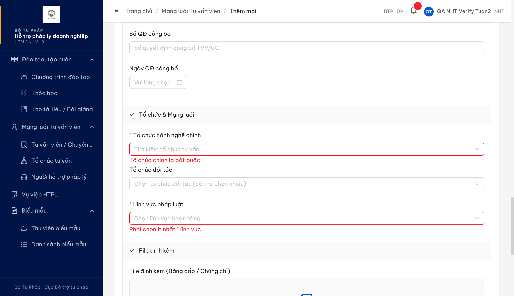

**2. Danh sách thông báo bắt buộc đọc từ giao diện khi bấm Lưu trên form trống:**

```
Họ tên là bắt buộc · Ngày sinh là bắt buộc · Giới tính là bắt buộc · CCCD là bắt buộc ·
Email là bắt buộc · Số điện thoại là bắt buộc · Địa chỉ là bắt buộc · Trình độ là bắt buộc ·
Tổ chức chính là bắt buộc   <-- trái với đặc tả (tùy chọn)
Phải chọn ít nhất 1 lĩnh vực
```

**3. Ràng buộc nằm ở cả tầng máy chủ, không chỉ ở giao diện:** bản mô tả giao diện lập trình mà hệ thống tự công bố (`/api/docs-json`) liệt kê `toChucChinhId` trong danh sách trường **bắt buộc** của khối dữ liệu tạo mới tư vấn viên. Nghĩa là dù bỏ ràng buộc ở màn nhập thì máy chủ vẫn từ chối — dev cần sửa cả hai phía.

Toàn bộ phép đo + đối chiếu phần đối tác phản ánh: [`../../reverify-audit/DKTGMLTVV_03/audit.md`](../../reverify-audit/DKTGMLTVV_03/audit.md).

---

## ~~BUG-CNHSNLTVV_02~~ [CLOSED] — Người hỗ trợ pháp lý bị đẩy sang trang 403 khi mở chi tiết tư vấn viên, chức năng "Cập nhật năng lực" không vai trò nào dùng được

> **Re-test:** 2026-07-29 12:02:00 R4 — ✅ PASS (Closed-verified). Chạy lại đúng vai trò **Người hỗ trợ pháp lý** (`nht_qa_01`) trên hồ sơ **cùng đơn vị** `TVV-STP-AG-0001`. **Hai điểm còn lỗi ở vòng trước nay đã hết:** (1) thẻ Năng lực chế độ xem **không còn** mục "Tóm tắt năng lực" — mục hiển thị mà không có ô nhập đã được gỡ; (2) tên các mục **đã nhất quán giữa hai chế độ**: chế độ xem liệt kê *Trình độ · Số năm kinh nghiệm · Bằng cấp chi tiết · Chứng chỉ chi tiết · Số thẻ hành nghề · Kinh nghiệm chi tiết · Chuyên ngành · Lĩnh vực pháp luật*, biểu mẫu cập nhật dùng **đúng 8 tên đó**, không còn cặp lệch *Kinh nghiệm ↔ Mô tả kinh nghiệm · Bằng cấp ↔ Bằng cấp chi tiết · Chứng chỉ ↔ Chứng chỉ chi tiết*. Ba tên hiện dùng khớp nguyên văn `srs-fr-04-chuyen-gia-tvv.md:1568` (*"Bằng cấp chi tiết, Chứng chỉ chi tiết, Kinh nghiệm chi tiết"*). **Không dừng ở quan sát giao diện — đã chạy hết luồng ghi:** sửa ô "Chuyên ngành" + nhập Ghi chú cập nhật → bấm **Lưu** → máy chủ nhận (`PATCH …/nang-luc` **200**) → **tải lại trang bằng bộ nhớ đệm sạch**: giá trị mới vẫn còn ⇒ dữ liệu vào thật. Phần đã đạt từ vòng trước kiểm lại vẫn đúng: vai trò NHT mở chi tiết cùng đơn vị bình thường, không bị đẩy `/403`; thẻ "Đánh giá" mở được. (Đã trả "Chuyên ngành" về giá trị cũ sau phép đo.) [Ảnh](image/CNHSNLTVV_02-r4-the-nang-luc-nhan-nhat-quan.png)

> **Đính chính bước tái hiện (đo lại 27/07 15:20):** giao diện đã đổi trong ngày — mở màn chi tiết **không còn** tự chuyển `/403`, vì lời gọi lấy số đếm đánh giá không còn được gọi lúc tải màn (gọi thẳng lời gọi đó **vẫn** trả 403). Việc vai trò NHT bị đẩy sang `/403` **vẫn còn**, chỉ chậm hơn một thao tác: bấm thẻ **"Lịch sử hỗ trợ"** trên chính màn đó là cả trang bị đẩy sang `/403`. Chi tiết + lời gọi gây lỗi: xem `BUG-QLHSTVV_05` phía dưới.

> **Phân biệt với bug cùng mã ở vòng 1:** `BUG-CNHSNLTVV_02` vòng 1 nói về form "Cập nhật năng lực" chỉ có 6 ô so với 11 ô đặc tả yêu cầu — đã đóng (Verify=Pass) và **kiểm lại vẫn đúng: form hiện có đủ 11 ô**. Entry này là **nội dung khác**, phát hiện khi verify phản ánh vòng 2 trên cùng màn.

### Mô tả

Vai trò **Người hỗ trợ pháp lý (NHT)** mở chi tiết một tư vấn viên **cùng đơn vị** (`/chuyen-gia-tvv/{id}`) thì màn chi tiết vừa render xong đã bị chuyển sang trang **403 Forbidden** (`ERR-PERM-SYS-00-01`, "Vai trò hiện tại: NHT"). Nguyên nhân quan sát được: lời gọi lấy số đếm của thẻ "Đánh giá" trên chính màn này bị từ chối với vai trò NHT, và cả trang bị điều hướng theo lỗi đó.

Hệ quả dây chuyền: chức năng **"Cập nhật năng lực"** (đặc tả giao cho đúng vai trò NHT, đặt ở thẻ Năng lực của màn này) **không thao tác được**. Vai trò duy nhất còn mở được màn — Cán bộ Nghiệp vụ cùng đơn vị — mở được biểu mẫu nhưng **bị chặn khi bấm Lưu** với thông báo "Chỉ Người hỗ trợ pháp lý mới được cập nhật hồ sơ năng lực". Tức là hiện **không vai trò nào** cập nhật được năng lực tư vấn viên qua giao diện.

Kèm theo, thẻ "Năng lực" hiển thị mục **"Tóm tắt năng lực"** nhưng biểu mẫu cập nhật không có ô tương ứng ⇒ mục này luôn hiển thị "—" và không ai nhập được; ba mục khác đổi tên giữa chế độ xem và chế độ sửa ("Kinh nghiệm" ↔ "Mô tả kinh nghiệm", "Bằng cấp" ↔ "Bằng cấp chi tiết", "Chứng chỉ" ↔ "Chứng chỉ chi tiết").

### Các bước tái hiện

1. Đăng nhập role **Người hỗ trợ pháp lý** (`nht_qa_01` / NHT, Sở Tư pháp An Giang).
2. Vào **Mạng lưới Tư vấn viên → Tư vấn viên / Chuyên gia**.
3. Bấm mở chi tiết một tư vấn viên **cùng đơn vị** với tài khoản đang đăng nhập (ví dụ `TVV-STP-AG-0001`).
4. Quan sát: màn chi tiết hiện ra rồi trang tự chuyển sang `/403`.
5. Đăng nhập lại bằng **CB Nghiệp vụ cùng đơn vị** (`cbnv_dp` / CB_NV_DP) → mở đúng bản ghi đó → thẻ **Năng lực** → bấm **Cập nhật năng lực** → sửa một ô bất kỳ → bấm **Lưu**.

### Kết quả mong đợi

- Theo `srs-fr-04-chuyen-gia-tvv.md:368` / `:372` / `:374` (FR-IV-04 — Cập nhật năng lực): màn hình là **SCR-IV-03 (Tab Năng lực)**, **tác nhân là Người hỗ trợ pháp lý**, điều kiện là **tư vấn viên cùng đơn vị với NHT**. Tiêu chí nghiệm thu `:429`: *"Given NHT xem chi tiết TVV cùng đơn vị **When** nhấn 'Cập nhật năng lực' **Then** form inline edit mở"* ⇒ NHT phải vào được màn chi tiết và thao tác được chức năng này.
- Theo `srs-fr-04-chuyen-gia-tvv.md:1572` (SCR-IV-03, thẻ "Đánh giá"): điều kiện hiển thị là **"Luôn"**, không giới hạn vai trò ⇒ thẻ này không được trở thành rào chắn khiến vai trò hợp lệ mất luôn cả màn.
- Theo `srs-fr-04-chuyen-gia-tvv.md:1568` (SCR-IV-03, thẻ "Năng lực"): nội dung thẻ là **Bằng cấp chi tiết, Chứng chỉ chi tiết, Kinh nghiệm chi tiết** + nút "Cập nhật năng lực" ⇒ những mục hiển thị ở chế độ xem phải có đường nhập tương ứng và gọi tên nhất quán giữa hai chế độ.

### Kết quả thực tế

- NHT mở chi tiết tư vấn viên **cùng đơn vị** (đã đối chiếu `donViId` trùng khít `…8002-000000000006`) → trang tự chuyển **`/403` — `ERR-PERM-SYS-00-01` — "Vai trò hiện tại: NHT"**.
- Nhật ký mạng của lần mở đó: lấy chi tiết tư vấn viên **200** · lấy lịch sử hỗ trợ **200** · lấy số đếm đánh giá **403 `ERR-PERM-SYS-00-01`** → ngay sau đó tải trang `/403`. Cùng bản ghi, đăng nhập CB Nghiệp vụ thì lời gọi số đếm đánh giá trả **200** ⇒ chặn theo **vai trò**, không theo trạng thái hồ sơ.
- CB Nghiệp vụ bấm **Lưu** trên biểu mẫu Cập nhật năng lực: **1 request**, **1 thông báo** — *"Chỉ Người hỗ trợ pháp lý mới được cập nhật hồ sơ năng lực"*; gọi thẳng cùng thao tác trả **403 `ERR-NL-01`**.
- Lưu ý về mã lỗi: `srs-fr-04-chuyen-gia-tvv.md:422` gán **ERR-NL-01** cho tình huống *"NHT không cùng đơn vị với TVV"* với thông báo *"Bạn không có quyền cập nhật hồ sơ tư vấn viên này (khác đơn vị)"* — web đang dùng cùng mã đó cho một tình huống khác nghĩa, gây khó truy vết.
- Đối chiếu nhãn cùng một bản ghi: thẻ **Năng lực** hiển thị *Tóm tắt năng lực · Trình độ · Số năm kinh nghiệm · Bằng cấp · Chứng chỉ · Số thẻ hành nghề · Kinh nghiệm · Chuyên ngành · Lĩnh vực pháp luật*; biểu mẫu **Cập nhật năng lực** có 11 ô *Trình độ · Số năm kinh nghiệm · Mô tả kinh nghiệm · Chuyên ngành · Số thẻ hành nghề · Bằng cấp chi tiết · Chứng chỉ chi tiết · Lĩnh vực pháp luật · Chứng chỉ hiện có · Thêm chứng chỉ mới (PDF) · Ghi chú cập nhật* ⇒ **"Tóm tắt năng lực" không có ô nhập**.
- **Không phải lỗi (đã loại):** phản ánh "Mô tả kinh nghiệm không nạp giá trị hiện tại" **không tái hiện**. Nạp dữ liệu mới rồi mở lại biểu mẫu thì ô này hiển thị đúng giá trị đang lưu, đúng với **cả hai** đường ghi (lưu từ biểu mẫu Năng lực và lưu từ màn Sửa hồ sơ).

### Bằng chứng

**1. Ảnh chụp:**

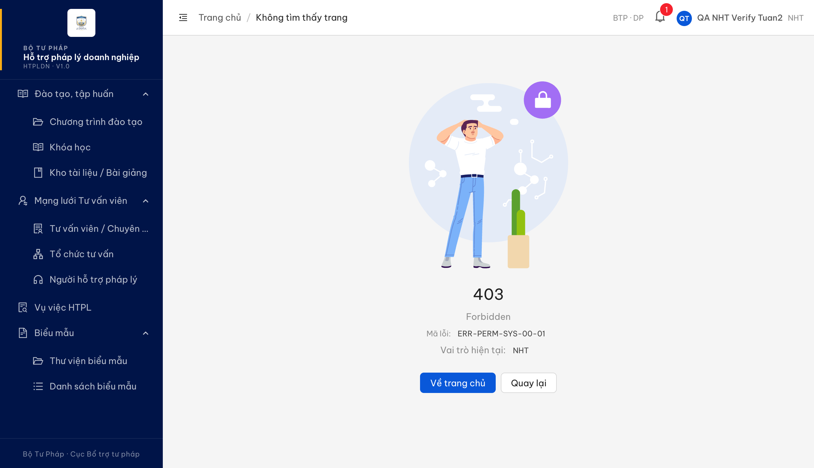

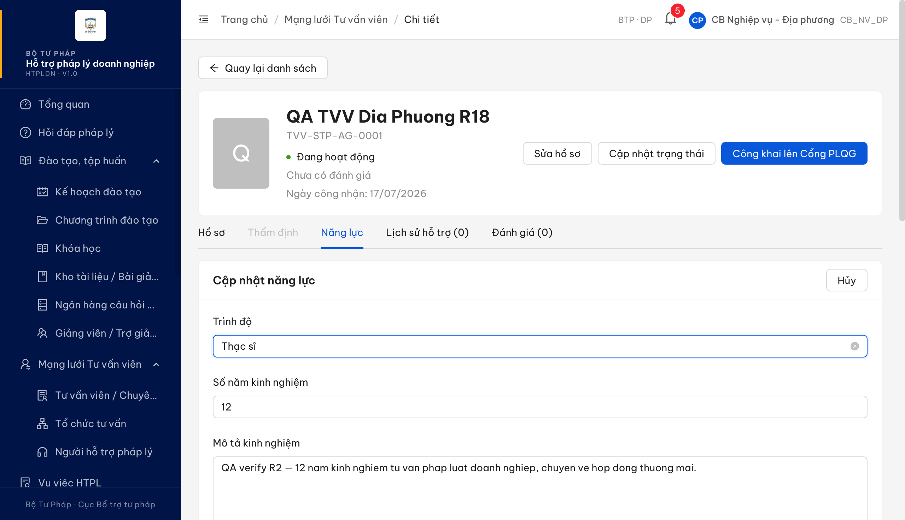

**2. Chuỗi lời gọi khi Người hỗ trợ pháp lý mở màn chi tiết:**

```
GET  /api/v1/tu-van-viens/{id}                          -> 200
GET  /api/v1/tu-van-viens/{id}/lich-su-ho-tro           -> 200
GET  /api/v1/tu-van-viens/{id}/danh-gia?page=1&pageSize=1 -> 403  ERR-PERM-SYS-00-01
GET  /403                                                -> 200   (trang bị điều hướng)
```

**3. Phản hồi khi Cán bộ Nghiệp vụ lưu năng lực:**

```
403  {"code":"ERR-PERM-SYS-00-01",
      "message":"ERR-NL-01: Chỉ Người hỗ trợ pháp lý mới được cập nhật hồ sơ năng lực"}
```

Toàn bộ phép đo + phần "không tái hiện" của ý Mô tả kinh nghiệm: [`../../reverify-audit/CNHSNLTVV_02/audit.md`](../../reverify-audit/CNHSNLTVV_02/audit.md).

---

## ~~BUG-QLHSTVV_03~~ [CLOSED] — Thẻ "Hồ sơ" màn chi tiết tư vấn viên hiển thị mục "Địa bàn" đã bị đặc tả khai tử

> **Re-test:** 2026-07-30 R5 — ✅ PASS (Closed-verified). Quét toàn màn chi tiết 2 hồ sơ (TVV-BTP-TW-0002 đã công khai + TVV-BTP-TW-0023 mới đăng ký): 0 lần khớp chuỗi "Địa bàn". Phần BA bổ sung 30/07 cũng đạt — "Số quyết định công nhận" đã lên thẻ đầu trang cạnh "Ngày công nhận", hiện đúng số của chính hồ sơ (QD-SEED28-2026); hồ sơ chưa qua phê duyệt để trống. Thẻ "Hồ sơ" 6 nhóm (gồm nhóm Thông tin công khai) là đúng theo BA.

> **Trạng thái tái hiện:** QA **không quan sát lại được** mục này trên bản đang kiểm (6 tổ hợp vai trò × bản ghi × trạng thái — xem [audit](../../reverify-audit/QLHSTVV_03/audit.md)). Vẫn log vì ảnh của đối tác đọc rõ nhãn "Địa bàn" trên đúng màn/đúng vai trò, và đặc tả **cấm** trường này tồn tại. Đề nghị dev rà trên bản build đang triển khai cho đối tác.

> **Phân biệt với bug cùng mã ở vòng 1:** `BUG-QLHSTVV_03` vòng 1 nói về **bố cục nhóm** (Lĩnh vực pháp luật bị gộp vào Tổ chức & Mạng lưới, phát sinh nhóm "Ghi chú", thiếu nhóm "Thông tin công khai") — đã đóng (Verify=Pass) và kiểm lại vẫn đúng: hiện có đủ nhóm "Lĩnh vực pháp luật" riêng. Entry này là **nội dung khác**.

### Mô tả

Ở màn **chi tiết tư vấn viên** (`/chuyen-gia-tvv/{id}`), thẻ **"Hồ sơ"**, nhóm **"Tổ chức & Mạng lưới"** hiển thị mục **"Địa bàn"**.

Đặc tả đã **bỏ hẳn** khái niệm địa bàn của tư vấn viên: thẻ tư vấn viên có hiệu lực **toàn quốc** theo NĐ 77/2008 Điều 19, nên field `dia_ban_ids[]` và bảng liên kết TVV_DIA_BAN đều bị gỡ khỏi hệ thống. Giữ lại mục "Địa bàn" trên hồ sơ khiến người dùng hiểu nhầm rằng tư vấn viên bị giới hạn phạm vi hành nghề theo tỉnh/thành — sai bản chất pháp lý của thẻ tư vấn viên.

### Các bước tái hiện

1. Đăng nhập role **CB Nghiệp vụ - Trung ương** (`cbnv_tw` / CB_NV_TW, badge "BTP · TW").
2. Vào **Mạng lưới Tư vấn viên → Tư vấn viên / Chuyên gia**.
3. Mở chi tiết một tư vấn viên bất kỳ.
4. Ở thẻ **Hồ sơ**, mở nhóm **"Tổ chức & Mạng lưới"** và đọc danh sách mục.

### Kết quả mong đợi

- Theo `srs-fr-04-chuyen-gia-tvv.md:46` (Ghi chú v3.1): *"Theo NĐ 77/2008 Điều 19, Thẻ TVV có hiệu lực **toàn quốc** — pháp luật không giới hạn TVV theo địa bàn. Hệ thống **bỏ field `dia_ban_ids[]`** và bảng junction TVV_DIA_BAN"*.
- Theo `srs-fr-04-chuyen-gia-tvv.md:153` (bảng entity TU_VAN_VIEN, dòng 19): `~~dia_ban_ids~~` — *"**Bỏ field này** — TVV không giới hạn theo địa bàn"*.
- Theo `srs-fr-04-chuyen-gia-tvv.md:1556` (SCR-IV-03, thẻ "Hồ sơ"): nhóm Tổ chức gồm *"tổ chức chính link hoặc 'Tự do', đối tác dạng thẻ"* — không có địa bàn.
- Do đó hồ sơ tư vấn viên **không được** có mục thể hiện phạm vi địa bàn hành nghề, ở bất kỳ chế độ hiển thị nào.

### Kết quả thực tế

- Ảnh đối tác gửi (25/07/2026 16:19, vai trò CB_NV_TW): nhóm "Tổ chức & Mạng lưới" gồm **3 mục** — Tổ chức chính · Đối tác · **Địa bàn `—`**. Mục "Địa bàn" hiển thị dù đang rỗng ⇒ do bố cục màn, không phụ thuộc dữ liệu bản ghi.
- QA kiểm lại trên bản đang chạy: nhóm này chỉ có **2 mục** (Tổ chức chính · Đối tác), **không có** "Địa bàn". Đã thử 6 tổ hợp: vai trò CB_NV_TW và CB_NV_DP × bản ghi `TVV-BTP-TW-0016` (Chờ kích hoạt, đã phê duyệt) và `TVV-STP-AG-0001` (Đang hoạt động) × cùng đơn vị và khác đơn vị.

### Bằng chứng

**1. Ảnh chụp:**


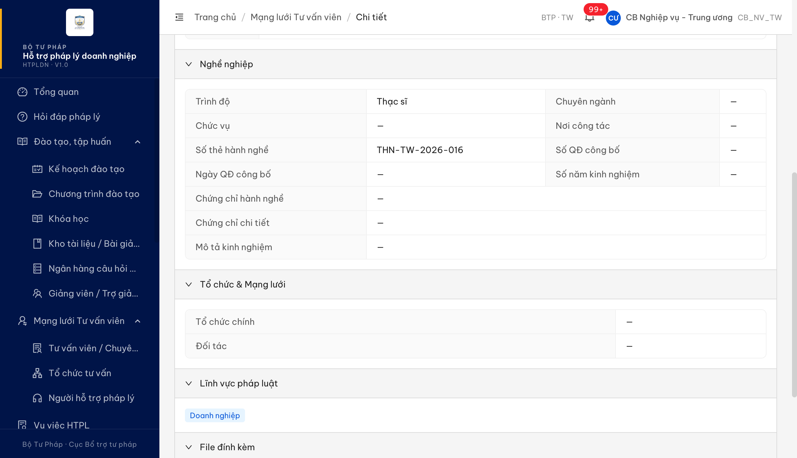

**2. Nhãn nhóm "Tổ chức & Mạng lưới" đọc từ giao diện:**

```
Ảnh đối tác        : Tổ chức chính · Đối tác · Địa bàn        <-- "Địa bàn" trái đặc tả
Bản QA kiểm lại    : Tổ chức chính · Đối tác
```

### So sánh với phần cần BA chốt (không nằm trong bug này)

Ý còn lại của đối tác — nhóm "Nghề nghiệp" thừa mục **"Số quyết định (công nhận)"** — **không** log thành bug: trường `so_quyet_dinh` là trường hợp lệ, bắt buộc nhập khi phê duyệt (`srs-fr-04-chuyen-gia-tvv.md:583`, mã lỗi ERR-PD-05 `:616`) và có trong mẫu xuất Phụ lục 1 (`:2027`); vướng mắc nằm ở chỗ danh sách thành phần `:1556` là danh sách đóng hay mô tả tóm tắt → đã chuyển thành câu hỏi BA, cùng gốc với câu hỏi ở `BUG-DKTGMLTVV_03`.

Toàn bộ phép đo + câu hỏi BA: [`../../reverify-audit/QLHSTVV_03/audit.md`](../../reverify-audit/QLHSTVV_03/audit.md).

---

## ~~BUG-TDHSTVV_08~~ [CLOSED] — Luồng thẩm định hồ sơ tư vấn viên không đi theo máy trạng thái đặc tả; nút "Lưu nháp" tự đổi trạng thái trên bản đối tác

> **Re-test:** 2026-07-27 18:20:00 R3 — ✅ PASS (Closed-verified). Chạy trọn luồng trên `TVV-BTP-TW-0020` (Mới đăng ký, cùng đơn vị, vai trò CB_NV_TW): (1) màn chi tiết ở "Mới đăng ký" **đã có** nút "Bắt đầu thẩm định" — trước thiếu; (2) thẻ "Thẩm định" **đã ẩn** ở "Mới đăng ký", chỉ hiện từ "Đang thẩm định" (`:1557`); (3) bấm "Bắt đầu thẩm định" → `POST …/bat-dau-tham-dinh` 200, trạng thái sang **Đang thẩm định** (`:1545`, `:2283`–`:2286`); (4) "Lưu nháp" giữ nguyên **Đang thẩm định** và **không còn** bị chặn khi chưa chọn kết luận (điểm Nhẹ cũ đã hết) (`:1565`); (5) "Trình duyệt" mở **modal xác nhận** "Bạn xác nhận trình phê duyệt?", xác nhận xong mới sang **Chờ phê duyệt** (`:1567`, `:1581`). Tải lại trang: vẫn "Chờ phê duyệt" ⇒ hồ sơ **đã đi qua** "Đang thẩm định", không còn nhảy thẳng. [Ảnh](image/TDHSTVV_08-r3-luong-tham-dinh-dung-state-machine.png)

**Severity:** Major | **Priority:** P1 | **Type:** Negative | **TC Ref:** TDHSTVV_08 | **Status:** Closed

**SRS Reference:** `SCR-IV-03 dòng 20b — nút Lưu nháp` (srs-fr-04-chuyen-gia-tvv.md:1565) · `dòng 6 — nút Bắt đầu thẩm định` (:1545) · `dòng 13 — thẻ Thẩm định` (:1557) · `dòng 20c — nút Gửi kết quả` (:1566) · `dòng 20d — nút Trình phê duyệt` (:1567) · `Quy tắc tương tác` (:1581) · `SM-TVV` (:2283–:2286, :2321–:2324)

### Mô tả

Đối tác phản ánh: bấm **"Lưu nháp"** ở thẻ Thẩm định thì hệ thống đổi trạng thái hồ sơ sang **"Đang thẩm định"**. Video của đối tác xác định được đúng nút "Lưu nháp" đã được bấm (2 khung hình liên tiếp, nút có viền tiêu điểm) và trạng thái đổi thật — kiểm chéo bằng 2 nguồn trong cùng video: badge ở màn chi tiết và số đếm tab "Mới đăng ký" ở danh sách giảm 27 → 26.

Trên bản đang chạy tại môi trường test, riêng hành vi của nút "Lưu nháp" là đúng đặc tả (không đổi trạng thái). Nhưng khi QA kiểm chính màn đó thì phát hiện **3 sai lệch khác cùng gốc** — máy trạng thái của luồng thẩm định chưa được dựng đúng, hồ sơ không bao giờ đi qua trạng thái "Đang thẩm định".

Ý "hệ thống không lưu nháp" mà đối tác nêu kèm **không** được log: chính video của đối tác (giây 54) cho thấy nội dung nháp vẫn còn sau khi rời màn và quay lại.

### Các bước tái hiện

1. Đăng nhập vai trò **Cán bộ Nghiệp vụ Trung ương** (`cbnv_tw`, badge "BTP · TW").
2. Mở màn chi tiết một tư vấn viên **cùng đơn vị** đang ở trạng thái **"Mới đăng ký"** (QA dùng bản ghi tự tạo `TVV-BTP-TW-0019` và `TVV-BTP-TW-0020`).
3. Quan sát vùng nút ở đầu màn và danh sách thẻ.
4. Mở thẻ **"Thẩm định"**, nhập 4 nhóm tiêu chí (Nhóm 1 đủ + Kết luận Pháp lý "Đạt"; Nhóm 2 điểm 3 + nhận xét; Nhóm 3 nhận xét; Nhóm 4 tích "Có tham gia mạng lưới"; Kết luận thẩm định "ĐẠT").
5. Bấm **"Lưu nháp"** → đọc lại trạng thái hồ sơ.
6. Bấm **"Gửi KQ"** → đọc lại trạng thái hồ sơ.

### Kết quả mong đợi

- Theo `:1545`, ở trạng thái "Mới đăng ký" và với vai trò Cán bộ Nghiệp vụ cùng đơn vị, màn chi tiết phải cho người dùng bắt đầu thẩm định bằng một thao tác riêng, và chính thao tác đó mới đưa hồ sơ sang "Đang thẩm định".
- Theo `:1557`, thẻ "Thẩm định" chỉ được hiển thị khi hồ sơ đã ở "Đang thẩm định" hoặc "Chờ phê duyệt".
- Theo `:1565`, thao tác lưu nháp phải lưu kết quả thẩm định tạm và **giữ nguyên trạng thái** hồ sơ.
- Theo `:1566` + `:1581`, gửi kết quả với kết luận "Đạt" chỉ mở ra khả năng trình phê duyệt, không tự đưa hồ sơ sang "Chờ phê duyệt"; theo `:1567` việc chuyển sang "Chờ phê duyệt" phải là một thao tác riêng có bước xác nhận.
- Theo `:2283`–`:2286`, hồ sơ phải đi qua trạng thái "Đang thẩm định" trước khi tới "Chờ phê duyệt".

### Kết quả thực tế

Đo trên bản đang chạy (mỗi bước đọc lại trạng thái + phiên bản bản ghi ngay trước và ngay sau thao tác):

1. **Thiếu thao tác bắt đầu thẩm định** — ở trạng thái "Mới đăng ký", màn chi tiết chỉ có `["Quay lại danh sách", "Sửa hồ sơ"]`.
2. **Thẻ Thẩm định mở quá sớm** — danh sách thẻ là `["Hồ sơ", "Thẩm định", "Năng lực", "Lịch sử hỗ trợ (0)", "Đánh giá (0)"]`, thao tác được ngay khi hồ sơ còn "Mới đăng ký".
3. **Lưu nháp** — `POST …/tham-dinh` trả 200, trạng thái giữ nguyên `MOI_DANG_KY` (phiên bản 1 → 2), thông báo "Đã lưu nháp kết quả thẩm định". **Đúng đặc tả trên bản này**; lặp lại trên bản ghi thứ hai với bộ dữ liệu y hệt video đối tác cho kết quả giống hệt. Trên bản đối tác thì trạng thái đổi sang "Đang thẩm định" — trái `:1565`.
4. **Gửi KQ với kết luận "ĐẠT"** — trạng thái nhảy thẳng `MOI_DANG_KY` → `CHO_PHE_DUYET` (phiên bản 2 → 3), thông báo "Đã trình hồ sơ lên cấp phê duyệt", không có bước xác nhận. Hồ sơ **không bao giờ** ở `DANG_THAM_DINH`.
5. *(mức Nhẹ)* Lưu nháp bị chặn khi chưa chọn Kết luận Pháp lý / Kết luận thẩm định ("Vui lòng chọn kết quả pháp lý", "Vui lòng chọn kết luận") — tức áp cùng điều kiện với gửi kết quả, trong khi `:1565` không đặt điều kiện đó cho lưu nháp còn `:1566` thì có.

### Bằng chứng

**1. Ảnh chụp:**

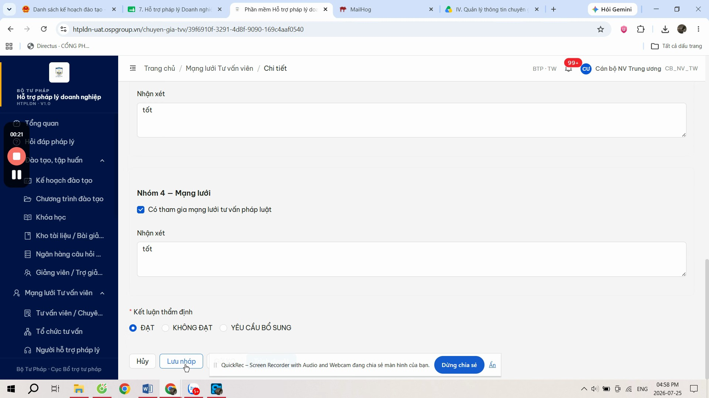

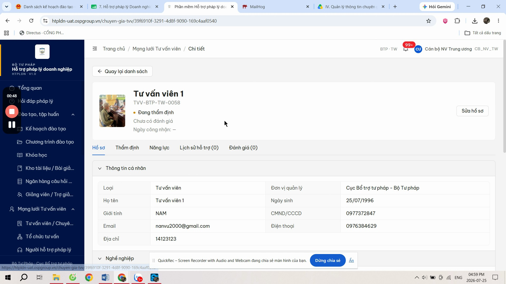

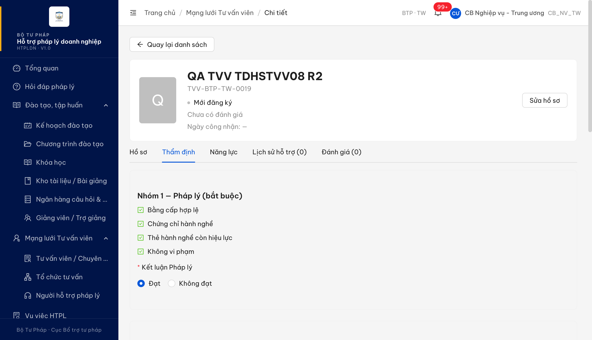

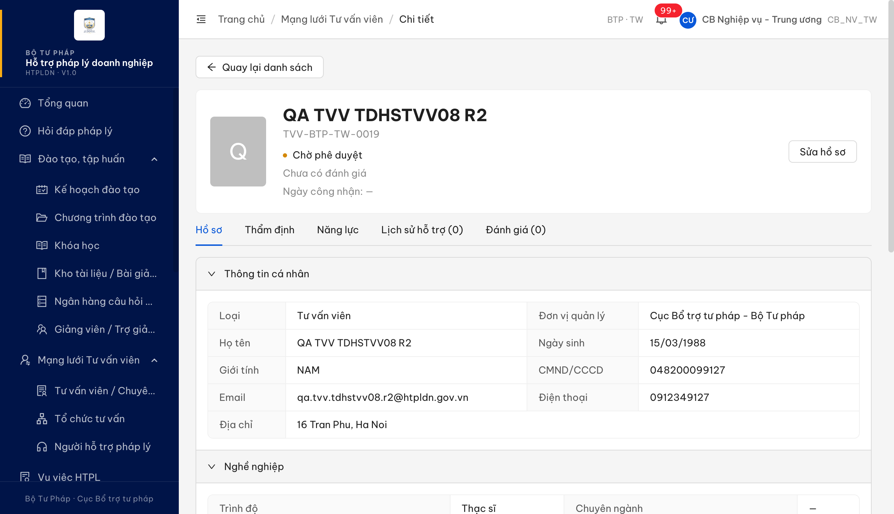

**2. Trạng thái + phiên bản bản ghi đọc trực tiếp trước/sau mỗi thao tác:**

```
TVV-BTP-TW-0019   truoc = MOI_DANG_KY  v1   --[Luu nhap]-->  sau = MOI_DANG_KY  v2
                                                             toast: "Da luu nhap ket qua tham dinh"
TVV-BTP-TW-0020   truoc = MOI_DANG_KY  v1   --[Luu nhap]-->  sau = MOI_DANG_KY  v2   (bo du lieu y het video doi tac)
TVV-BTP-TW-0019   truoc = MOI_DANG_KY  v2   --[Gui KQ]  -->  sau = CHO_PHE_DUYET v3
                                                             toast: "Da trinh ho so len cap phe duyet"
```

**3. Nút và thẻ đọc từ giao diện ở trạng thái "Mới đăng ký":**

```
Nut  : ["Quay lai danh sach", "Sua ho so"]                     <-- thieu "Bat dau tham dinh" (:1545)
The  : ["Ho so", "Tham dinh", "Nang luc", "Lich su ho tro (0)", "Danh gia (0)"]
                                                                <-- the "Tham dinh" khong duoc hien o trang thai nay (:1557)
```

Toàn bộ phép đo + đối chiếu SRS: [`../../reverify-audit/TDHSTVV_08/audit.md`](../../reverify-audit/TDHSTVV_08/audit.md).

---

## ~~BUG-QLTVV_24~~ [CLOSED] — Không gỡ được ảnh chân dung khỏi hồ sơ tư vấn viên: bấm "Xóa" trả về lỗi hệ thống

> **Re-test:** 2026-07-29 11:45:00 R4 — ✅ PASS (Closed-verified). Chạy trọn luồng trên đúng bản ghi nêu ở vòng trước (`TVV-BTP-TW-0020`) và trên **dữ liệu mới** chứ không đọc lại dữ liệu cũ. **(1) Gỡ ảnh:** bấm "Xóa" trên ảnh đang gắn hồ sơ → dòng tệp biến mất, máy chủ nhận thao tác thành công (**204**), không còn "Lỗi hệ thống, vui lòng thử lại sau". **(2) Hiển thị ảnh — điểm còn lỗi ở vòng trước, nay đã đạt:** tải lên một ảnh **mới hoàn toàn** (400×500 px, chưa từng có trong hệ thống) → bấm **Lưu** → mở màn chi tiết: ô ảnh ở thẻ thông tin chính **hiện đúng ảnh vừa lưu** (ảnh tải về thật, đúng kích thước gốc 400×500, khung hiển thị 78×98 ≈ 80×100 theo `:1543`), **không còn** chỉ hiện chữ cái đầu họ tên. Tải lại trang bằng bộ nhớ đệm sạch: ảnh **vẫn còn** ⇒ dữ liệu vào thật, không phải trạng thái tạm sau khi lưu. **(3) Lặp trọn vòng lần 2** (tải lên → Lưu → xem chi tiết → xóa): kết quả giống hệt, xóa vẫn 204 ⇒ fix ổn định, không phụ thuộc bản ghi cũ hay ảnh cũ. [Ảnh](image/QLTVV_24-r4-chi-tiet-da-hien-anh.png)
>
> *Ghi nhận ngoài phạm vi bug này (không chặn đóng, đề nghị dev xem sau):* ở **màn danh sách** tư vấn viên, cột "Ảnh" vẫn hiện chữ cái đầu họ tên kể cả với hồ sơ đã có ảnh chân dung — dữ liệu danh sách máy chủ trả về không kèm thông tin ảnh nào. Đây là màn khác (`srs-fr-04-chuyen-gia-tvv.md:1441`, SCR-IV-01) chứ không phải màn chi tiết mà ca kiểm thử này nêu, và không phải hệ quả của lần sửa vừa rồi.

**Severity:** Major | **Priority:** P1 | **Type:** Negative | **TC Ref:** QLTVV_24 | **Status:** Closed

**SRS Reference:** `FR-IV-03 §Inputs dòng 2 — anh_chan_dung, Bắt buộc = N` (srs-fr-04-chuyen-gia-tvv.md:136) · `SCR-IV-02 §nhóm 1 mục 2.3 — Ảnh chân dung` (:1486) · `SCR-IV-03 dòng 3 — Thẻ thông tin chính` (:1543) · `FR-IV-03 §bảng lỗi` (:198-199)

### Mô tả

Ở màn **Chỉnh sửa hồ sơ tư vấn viên** (`/chuyen-gia-tvv/{id}/chinh-sua`), khối **"Ảnh chân dung"**, người dùng bấm liên kết **"Xóa"** trên dòng ảnh **đã lưu** thì hệ thống hiện thông báo đỏ **"Lỗi hệ thống, vui lòng thử lại sau"**, ảnh vẫn còn nguyên trong hồ sơ.

Hệ quả: sau khi đã đính một ảnh chân dung, người dùng **không còn cách nào** đưa hồ sơ về trạng thái không có ảnh — trong khi đặc tả ghi rõ đây là trường **không bắt buộc**. Thông báo trả về cũng không nói lên điều gì để người dùng biết phải xử lý ra sao.

QA đã cô lập điều kiện gây lỗi bằng phép thử đối chứng: tệp ảnh **chưa** được hồ sơ tham chiếu thì xóa bình thường; **đã** được hồ sơ tham chiếu thì rơi vào lỗi hệ thống. Người dùng thật luôn ở vế thứ hai, vì nút "Xóa" chỉ xuất hiện sau khi ảnh đã lưu vào hồ sơ.

### Các bước tái hiện

1. Đăng nhập vai trò **CB Nghiệp vụ - Trung ương** (`cbnv_tw` / CB_NV_TW, badge "BTP · TW").
2. Vào **Mạng lưới Tư vấn viên → Tư vấn viên / Chuyên gia**, mở một hồ sơ **cùng đơn vị** rồi bấm **Sửa hồ sơ** (đường dẫn `/chuyen-gia-tvv/{id}/chinh-sua`).
3. Ở khối **"Ảnh chân dung"**, chọn một tệp .png hoặc .jpg dưới 5MB, rồi bấm **Lưu** → hồ sơ lưu thành công.
4. Mở lại màn **Chỉnh sửa** của chính hồ sơ đó → dòng tệp `Ảnh chân dung | Xem | Xóa` hiện sẵn.
5. Bấm liên kết **"Xóa"** trên dòng đó.

### Kết quả mong đợi

- Theo `srs-fr-04-chuyen-gia-tvv.md:136` (FR-IV-03, bảng Inputs dòng 2): `anh_chan_dung` có **Bắt buộc = N**, mặc định là *"Ảnh hệ thống"*. Trường không bắt buộc ⇒ người dùng phải đưa được hồ sơ về trạng thái không có ảnh chân dung, và khi đó hồ sơ quay lại dùng ảnh mặc định của hệ thống.
- Theo `srs-fr-04-chuyen-gia-tvv.md:1486` (SCR-IV-02, nhóm 1 mục 2.3), khối "Ảnh chân dung" trên màn sửa là nơi người dùng quản lý ảnh của hồ sơ ⇒ thao tác gỡ ảnh tại đây phải hoàn tất và giao diện phải phản ánh kết quả.
- Nếu có ràng buộc nghiệp vụ khiến không được phép gỡ ảnh, hệ thống phải nói rõ ràng buộc đó bằng thông báo nghiệp vụ đọc hiểu được — đúng cách đặc tả gắn thông báo cho từng tình huống lỗi ở `:198-199` (`ERR-TVV-01` "Họ tên là bắt buộc", `ERR-TVV-02` "Số Căn cước công dân đã tồn tại") và `:1487`, `:1490`. Câu lỗi hệ thống chung là dấu hiệu tình huống chưa được xử lý.
- Theo `srs-fr-04-chuyen-gia-tvv.md:1543` (SCR-IV-03, dòng 3 — Thẻ thông tin chính): thẻ đầu màn chi tiết gồm *"**Ảnh chân dung 80x100** + Họ tên (đậm 20px) + Mã tư vấn viên + Trạng thái + Điểm đánh giá trung bình + Ngày công nhận"* ⇒ ảnh đã lưu phải hiển thị được ở màn chi tiết.

### Kết quả thực tế

- Bấm **"Xóa"** → thông báo đỏ **"Lỗi hệ thống, vui lòng thử lại sau"**; dòng tệp **vẫn còn**; ảnh vẫn gắn với hồ sơ. Lời gọi xóa trả **HTTP 500**, mã `ERR-SYS-00-00-01`.
- Lặp lại thao tác nhiều lần và gọi thẳng máy chủ (không qua giao diện) đều cho **cùng một kết quả 500** ⇒ lỗi cố định, không phải trục trặc nhất thời.
- **Phép thử đối chứng** trên bản ghi thứ hai `TVV-BTP-TW-0018`, cùng một tệp ảnh, chỉ đổi một biến duy nhất:

| Lần | Tình huống | Kết quả xóa |
|---|---|---|
| A | Ảnh đã tải lên, **chưa** gắn vào hồ sơ | **Thành công** (204) |
| B | Ảnh đã tải lên, **đã** gắn vào hồ sơ | **Lỗi hệ thống** (500) |
| C | Vẫn tệp ở lần B, gỡ liên kết khỏi hồ sơ trước rồi mới xóa | **Thành công** (204) |

- **Đối chiếu nhánh tệp khác:** cùng thao tác "Xóa" trên dòng tệp PDF đính kèm của chính hồ sơ đó lại trả về **422** kèm thông báo nghiệp vụ *"Tệp đang được tham chiếu bởi bản ghi khác, không thể xoá"* ⇒ tình huống "tệp đang được tham chiếu" đã có nhánh xử lý tử tế cho tệp đính kèm, riêng ảnh chân dung thì không.
- **Ghi nhận kèm:** sau khi lưu ảnh thành công, mở màn **chi tiết** tư vấn viên → thẻ thông tin chính chỉ hiện chữ cái đầu của họ tên, **không** hiện ảnh chân dung; dữ liệu hồ sơ đọc từ máy chủ có mã tệp ảnh (`anhChanDungFileId` khác rỗng) nhưng trường ảnh dùng để hiển thị trả rỗng. Đây đúng phần đối tác đã nêu ở **vòng 1** của cùng ca kiểm thử, đề nghị dev xử lý một lượt.

### Bằng chứng

**1. Ảnh chụp:**

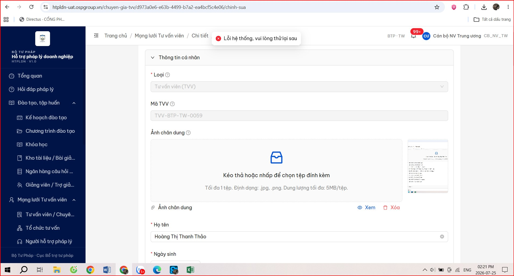

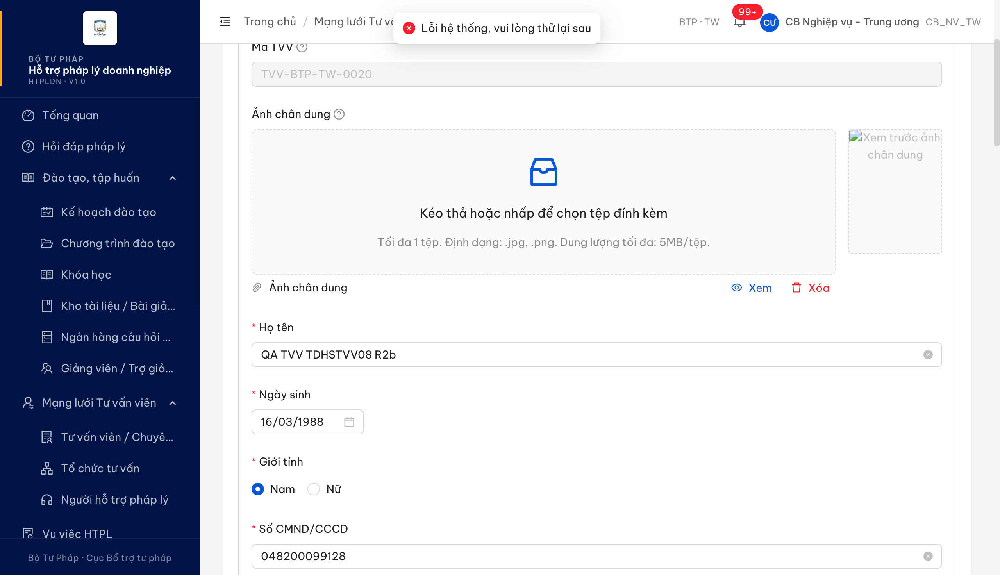

**2. Nội dung máy chủ trả về khi bấm "Xóa" ảnh chân dung:**

```
DELETE /api/v1/tu-van-viens/{id}/files/{fileId}
→ 500
{"success":false,"error":{"code":"ERR-SYS-00-00-01",
 "message":"Lỗi hệ thống, vui lòng thử lại sau",
 "requestId":"5ae22e43-bab8-4b72-8701-7658248e14c8"}}
```

**3. Cùng thao tác trên tệp đính kèm PDF của chính hồ sơ đó (để so sánh):**

```
DELETE /api/v1/tu-van-viens/{id}/files/{fileIdPdf}
→ 422
{"code":"ERR-VAL-FILE-08","message":"Tệp đang được tham chiếu bởi bản ghi khác, không thể xoá"}
```

**4. Kiểm hộp thông báo:** bộ bắt thông báo cài trước khi bấm (không lọc trùng) ghi nhận 2 khung cùng chữ; số hộp thông báo **cùng tồn tại** tại mọi thời điểm lấy mẫu (120 ms/lần) tối đa = **1** ⇒ chỉ có một hộp thông báo thật, **không** phải lỗi hiện thông báo trùng.

**5. Bản ghi để dev tái hiện trực tiếp:** `TVV-BTP-TW-0020` trên https://18.143.165.120.nip.io — ảnh chân dung đang gắn vào hồ sơ và vẫn không xóa được.

Toàn bộ phép đo + đối chiếu SRS: [`../../reverify-audit/QLTVV_24/audit.md`](../../reverify-audit/QLTVV_24/audit.md).

---

## ~~BUG-QLHSTVV_05~~ [CLOSED] — Người hỗ trợ pháp lý bị đẩy sang trang 403 khi mở thẻ "Lịch sử hỗ trợ"; cùng màn còn hiện nút "Bắt đầu thẩm định" cho vai trò không được phép

> **Re-test:** 2026-07-29 12:18:00 R4 — ✅ PASS (Closed-verified). Chạy lại vai trò **Người hỗ trợ pháp lý** (`nht_qa_01`) trên **cả 3** hồ sơ Sở Tư pháp An Giang (`TVV-STP-AG-0001` Đang hoạt động · `-0002` Từ chối · `-0003` Mới đăng ký), mỗi hồ sơ tải trang mới rồi bấm lần lượt **cả 4 thẻ**. **Điểm còn lỗi ở vòng trước nay đã hết:** nút **"Cập nhật trạng thái" không còn hiển thị** với vai trò NHT trên cả 3 hồ sơ — kể cả hồ sơ "Đang hoạt động" là đúng chỗ vòng trước còn sai — khớp điều kiện hiển thị *"Vai trò = Cán bộ Nghiệp vụ cùng đơn vị"* tại `srs-fr-04-chuyen-gia-tvv.md:1546`. Không còn đường nào để người dùng chạm vào thao tác bị từ chối, nên **hộp thông báo tiếng Anh "Forbidden" cũng không còn xuất hiện**: cài bộ bắt thông báo (không lọc trùng) rồi thao tác khắp màn — **0 thông báo tiếng Anh**. **Phần đã đạt từ vòng trước, kiểm lại vẫn đúng:** thẻ "Lịch sử hỗ trợ" mở bình thường trên cả 3 hồ sơ (`GET …/lich-su-ho-tro` **200**), **không hồ sơ nào bị đẩy sang `/403`**; lời gọi từng gây lỗi ở vòng trước không còn được gọi; nút "Bắt đầu thẩm định" và thẻ "Thẩm định" vẫn ẩn đúng với NHT. **Chạy hết luồng ghi để chắc không phải chỉ ẩn nút ngoài mặt:** NHT bấm "Sửa hồ sơ" → mở được màn sửa (25 ô) → bấm **Lưu** → thông báo **tiếng Việt** *"Cập nhật hồ sơ TVV thành công"*, không lỗi. [Ảnh](image/QLHSTVV_05-r4-nht-khong-con-nut-cap-nhat-trang-thai.png)

**Severity:** Major | **Priority:** P1 | **Type:** Negative | **TC Ref:** QLHSTVV_05 | **Status:** Closed

**SRS Reference:** `SCR-IV-03 dòng 22 — thẻ "Lịch sử hỗ trợ", điều kiện hiển thị "Luôn"` (srs-fr-04-chuyen-gia-tvv.md:1569) · `SCR-IV-03 dòng 6 — nút "Bắt đầu thẩm định"` (:1545) · `FR-IV-04 §Màn hình / §Tác nhân / §AC` (:368, :372, :429) · `bảng lỗi FR-IV-03 / FR-IV-04` (:198-199, :422)

> **Quan hệ với `BUG-CNHSNLTVV_02`:** cùng gốc "vai trò NHT bị chặn trên màn chi tiết tư vấn viên". Entry này ghi **điểm chặn chính xác trên bản đang chạy** (thẻ "Lịch sử hỗ trợ") cùng 2 sai lệch khác trên đúng màn của ca QLHSTVV_05. Sửa một chỗ nhiều khả năng chạm cả hai.

### Mô tả

Vai trò **Người hỗ trợ pháp lý (NHT)** mở chi tiết một tư vấn viên **cùng đơn vị** (`/chuyen-gia-tvv/{id}`) thì màn hiện bình thường, nhưng chỉ cần bấm thẻ **"Lịch sử hỗ trợ"** là **cả trang** bị đẩy sang **`/403 — Forbidden — ERR-PERM-SYS-00-01 — "Vai trò hiện tại: NHT"`**. Người dùng mất luôn hồ sơ đang xem, phải quay lại từ đầu.

Đặc tả ghi thẻ này có điều kiện hiển thị là **"Luôn"** — không giới hạn vai trò — nên nó không được phép trở thành rào chắn làm mất cả màn.

Trên cùng màn còn 2 sai lệch nữa: nút **"Bắt đầu thẩm định"** hiển thị với vai trò NHT (đặc tả chỉ cho Cán bộ Nghiệp vụ cùng đơn vị), và khi bấm thì hệ thống trả về hộp thông báo chỉ có đúng một chữ tiếng Anh **"Forbidden"**.

**Phần đã đúng, ghi nhận để dev không sửa nhầm:** tiêu chí gốc của ca QLHSTVV_05 — thẻ **"Thẩm định" phải ẩn hoàn toàn với NHT** — hiện **đã đạt**: danh sách thẻ khi đăng nhập NHT là *Hồ sơ · Năng lực · Lịch sử hỗ trợ (0) · Đánh giá (0)*, không còn thẻ "Thẩm định".

### Các bước tái hiện

1. Đăng nhập vai trò **Người hỗ trợ pháp lý** (`nht_qa_01` / NHT, Sở Tư pháp An Giang).
2. Vào **Mạng lưới Tư vấn viên → Tư vấn viên / Chuyên gia**, tab **"Mới đăng ký"**.
3. Bấm liên kết **"Xem"** ở cột Hành động của hồ sơ `TVV-STP-AG-0003` (cùng đơn vị) → màn chi tiết mở bình thường.
4. Bấm thẻ **"Lịch sử hỗ trợ"**.
5. *(sai lệch 2 & 3)* Quay lại màn chi tiết của cùng hồ sơ, bấm nút **"Bắt đầu thẩm định"** ở đầu màn.

### Kết quả mong đợi

- Theo `srs-fr-04-chuyen-gia-tvv.md:1569` (SCR-IV-03, dòng 22 — thẻ "Lịch sử hỗ trợ ({N})"): cột *Điều kiện hiển thị* = **"Luôn"** ⇒ vai trò nào mở được màn chi tiết thì cũng phải xem được thẻ này; nếu có phần dữ liệu vai trò đó không được đọc thì hệ thống phải xử lý trong phạm vi thẻ, **không** được làm người dùng mất cả màn đang xem.
- Theo `srs-fr-04-chuyen-gia-tvv.md:368` / `:372` / `:429` (FR-IV-04): màn hình là **SCR-IV-03**, tác nhân là **Người hỗ trợ pháp lý**, tiêu chí nghiệm thu *"Given NHT xem chi tiết TVV cùng đơn vị…"* ⇒ NHT phải dùng được màn chi tiết trọn vẹn.
- Theo `srs-fr-04-chuyen-gia-tvv.md:1545` (SCR-IV-03, dòng 6 — nút "Bắt đầu thẩm định"): cột *Điều kiện hiển thị* = **"Vai trò = Cán bộ Nghiệp vụ cùng đơn vị; trạng thái ∈ {Mới đăng ký, Chờ thẩm định}"** ⇒ vai trò NHT **không** được thấy nút này.
- Theo `srs-fr-04-chuyen-gia-tvv.md:198-199` và `:422`, mọi tình huống bị từ chối đều có **thông báo tiếng Việt cụ thể** ⇒ thông báo trả về phải nói rõ vì sao bị từ chối, bằng tiếng Việt.

### Kết quả thực tế

- **Thẻ "Lịch sử hỗ trợ":** bấm → trang thành `/403`, nội dung *"403 · Forbidden · Mã lỗi: ERR-PERM-SYS-00-01 · Vai trò hiện tại: NHT"*. Lặp trên **cả 3** hồ sơ của đơn vị (Đang hoạt động / Từ chối / Mới đăng ký) đều như nhau. Các thẻ còn lại (Hồ sơ, Năng lực, Đánh giá) mở bình thường.
- **Nút "Bắt đầu thẩm định":** danh sách nút ở đầu màn khi đăng nhập NHT là `["Quay lại danh sách", "Sửa hồ sơ", "Bắt đầu thẩm định"]`. Bấm nút → hộp thông báo hiện đúng chữ **"Forbidden"**; đọc lại hồ sơ ngay sau đó: trạng thái vẫn **Mới đăng ký**, phiên bản vẫn **1** ⇒ dữ liệu không đổi, nhưng người dùng không biết vì sao bị từ chối.
- **Danh sách:** cột Hành động của vai trò NHT hiển thị đủ **Xem · Sửa · Xóa** (khớp video đối tác).
- **Đính chính so với `BUG-CNHSNLTVV_02`:** sáng cùng ngày, màn chi tiết tự chuyển `/403` **ngay khi mở** (giao diện gọi lời gọi lấy số đếm đánh giá, trả 403). Đo lại lúc 15:20 thì lời gọi đó **không còn được gọi lúc tải màn** nên màn mở được — nhưng gọi thẳng vẫn trả **403**. Điểm chặn chuyển sang thẻ "Lịch sử hỗ trợ".

### Bằng chứng

**1. Ảnh chụp:**

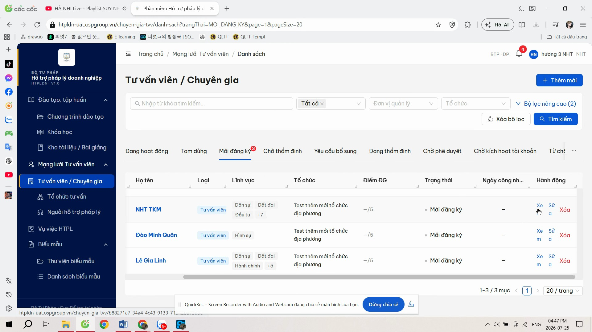


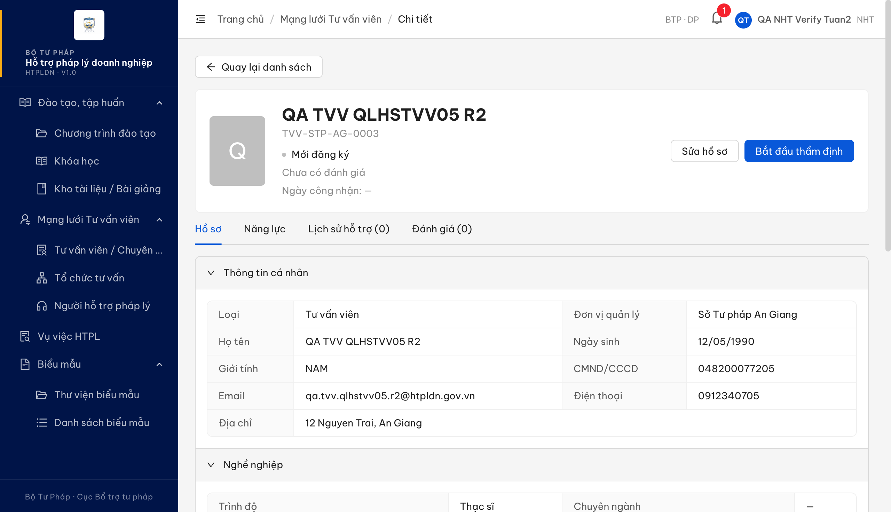

**2. Chuỗi lời gọi khi vai trò NHT bấm thẻ "Lịch sử hỗ trợ":**

```
GET /api/v1/tu-van-viens/{id}                            -> 200
GET /api/v1/tu-van-viens/{id}/lich-su-ho-tro?page=1&…    -> 200
GET /api/v1/hop-dong-tu-vans?tuVanVienId={id}&page=1&…   -> 403   <-- bị từ chối
GET /403                                                  -> trang lỗi
```

**3. Vai trò NHT gọi thẳng các lời gọi của màn chi tiết (không qua giao diện):**

```
TVV-STP-AG-0001 (Đang hoạt động) : chi tiết 200 · lịch sử 200 · đánh giá 403 ERR-PERM-SYS-00-01
TVV-STP-AG-0002 (Từ chối)        : chi tiết 200 · lịch sử 200 · đánh giá 403 ERR-PERM-SYS-00-01
TVV-STP-AG-0003 (Mới đăng ký)    : chi tiết 200 · lịch sử 200 · đánh giá 403 ERR-PERM-SYS-00-01
```

**4. Danh sách thẻ và nút đọc trực tiếp từ giao diện (vai trò NHT, hồ sơ Mới đăng ký):**

```
Thẻ : ["Hồ sơ", "Năng lực", "Lịch sử hỗ trợ (0)", "Đánh giá (0)"]
                                          <-- không còn "Thẩm định": tiêu chí gốc của ca ĐÃ ĐẠT
Nút : ["Quay lại danh sách", "Sửa hồ sơ", "Bắt đầu thẩm định"]
                                          <-- "Bắt đầu thẩm định" không được hiện với vai trò NHT (:1545)
```

**5. Kiểm hộp thông báo:** bộ bắt thông báo cài trước khi bấm (không lọc trùng) ghi nhận 2 khung cùng chữ "Forbidden"; số hộp **cùng tồn tại** tại mọi thời điểm lấy mẫu (120 ms/lần) tối đa = **1** ⇒ chỉ một hộp thông báo thật.

**6. Hồ sơ để dev tái hiện trực tiếp:** `TVV-STP-AG-0003 — QA TVV QLHSTVV05 R2` (Sở Tư pháp An Giang, trạng thái Mới đăng ký) trên https://18.143.165.120.nip.io.

Toàn bộ phép đo + đối chiếu SRS: [`../../reverify-audit/QLHSTVV_05/audit.md`](../../reverify-audit/QLHSTVV_05/audit.md).

---

## ~~BUG-TDHSTVV_14~~ [CLOSED] — Thư báo hồ sơ bị từ chối mang tiêu đề "✅ Phê duyệt: Hồ sơ bị từ chối"

> **Re-test:** 2026-07-30 R5 — ✅ PASS (Closed-verified) cho ĐÚNG phạm vi entry này. Thư từ chối nay mang tiêu đề thân thư `<h2 style="color:#1F2937">Hồ sơ bị từ chối</h2>` — hết dấu tích xanh và chữ "Phê duyệt". §Phạm vi bên dưới đã lỗi thời: BA chốt 30/07 rằng Người hỗ trợ ĐÚNG là phải nhận thông báo (Loại 4B), và phần đó nay chạy đúng ở cả 2 nhánh kết luận, cả 2 kênh. Ca `TDHSTVV_14` trên sheet vẫn Reopen nhưng vì lỗi KHÁC — xem BUG-TDHSTVV_14b.

**Severity:** Minor | **Priority:** P3 | **Type:** Negative | **TC Ref:** TDHSTVV_14 | **Status:** Closed

**SRS Reference:** `FR-IV-06 §Processing bước 6` (srs-fr-04-chuyen-gia-tvv.md:522) · `FR-IV-06 §Postconditions` (:548) · `SM-TVV dòng DANG_THAM_DINH → TU_CHOI` (:2325) · nguyên tắc thông báo nói đúng bản chất sự việc (`:198-199`, `:422`)

> **Phạm vi entry này:** ý chính đối tác phản ánh ở ca TDHSTVV_14 ("Người hỗ trợ không nhận được thông báo kèm lý do") **không** log thành bug — hệ thống làm đúng `:522`/`:548`/`:595`/`:2325`, đã chuyển thành câu hỏi BA (xem [audit](../../reverify-audit/TDHSTVV_14/audit.md) §Câu hỏi gửi BA). Entry này chỉ ghi **lỗi phụ** QA phát hiện khi soi nội dung thư ở đúng luồng đó.

### Mô tả

Khi Cán bộ Nghiệp vụ kết luận thẩm định **"Không đạt"** và bấm **"Gửi KQ"**, hệ thống gửi thư báo tới địa chỉ email khai trên hồ sơ ứng viên. Thư có tiêu đề (dòng chữ lớn đầu thân thư) là **"✅ Phê duyệt: Hồ sơ bị từ chối"** — mở đầu bằng dấu tích xanh và chữ **"Phê duyệt"**, trong khi nội dung ngay bên dưới báo hồ sơ **bị từ chối**.

Người nhận đọc lướt rất dễ hiểu ngược ý nghĩa của thư.

### Các bước tái hiện

1. Đăng nhập vai trò **Người hỗ trợ pháp lý** (`nht_qa_tw`), tạo mới một hồ sơ tư vấn viên → hồ sơ ở trạng thái **Mới đăng ký**.
2. Đăng nhập **CB Nghiệp vụ cùng đơn vị** (`cbnv_tw`), mở hồ sơ đó → bấm **"Bắt đầu thẩm định"**.
3. Thẻ **Thẩm định**: điền nhận xét các nhóm, chọn kết luận **KHÔNG ĐẠT**, nhập **Lý do** (≥ 10 ký tự).
4. Bấm **"Gửi KQ"**.
5. Mở hộp thư của địa chỉ email khai trên hồ sơ ứng viên, đọc thư vừa nhận.

### Kết quả mong đợi

- Theo `srs-fr-04-chuyen-gia-tvv.md:522` (FR-IV-06 §Processing bước 6) và `:2325` (SM-TVV): khi kết luận KHÔNG ĐẠT, hệ thống chuyển hồ sơ sang **TU_CHOI** và **gửi thông báo cho chủ hồ sơ kèm lý do**.
- Đặc tả luôn gắn thông báo **nói đúng bản chất sự việc** cho từng tình huống (ví dụ `:198-199`: `ERR-TVV-01` "Họ tên là bắt buộc"; `:422`: `ERR-NL-01` "Bạn không có quyền cập nhật hồ sơ tư vấn viên này (khác đơn vị)") ⇒ thư báo một kết quả **từ chối** phải thể hiện đúng là từ chối, không được mang dấu hiệu của một kết quả **được duyệt**.

### Kết quả thực tế

- Thư gửi đi đúng thời điểm bấm "Gửi KQ", đúng người nhận theo đặc tả (địa chỉ email khai trên hồ sơ), **có kèm nguyên văn lý do**.
- Nhưng dòng tiêu đề trong thân thư là **"✅ Phê duyệt: Hồ sơ bị từ chối"** — mở đầu bằng dấu tích xanh + chữ "Phê duyệt", màu chữ xanh lá (mã màu của trạng thái thành công), mâu thuẫn với nội dung ngay bên dưới.
- Tiêu đề thư (dòng Subject) thì **đúng**: "Hồ sơ bị từ chối". Sai lệch chỉ nằm ở phần thân thư.

### Bằng chứng

**1. Nội dung thư đọc được (đã giải mã):**

```html
<h2 style="color: #10B981;">✅ Phê duyệt: Hồ sơ bị từ chối</h2>
<p>Hồ sơ TVV của bạn đã bị từ chối: QA verify TDHSTVV_14 - ho so khong dat,
   thieu chung chi hanh nghe</p>
```

```
Tiêu đề thư (Subject) : Hồ sơ bị từ chối            <-- đúng
Tiêu đề trong thân thư: ✅ Phê duyệt: Hồ sơ bị từ chối   <-- sai bản chất
Người nhận            : địa chỉ email khai trên hồ sơ ứng viên
```

**2. Ảnh chụp (bối cảnh luồng — phần này thuộc câu hỏi BA, không phải bug):**

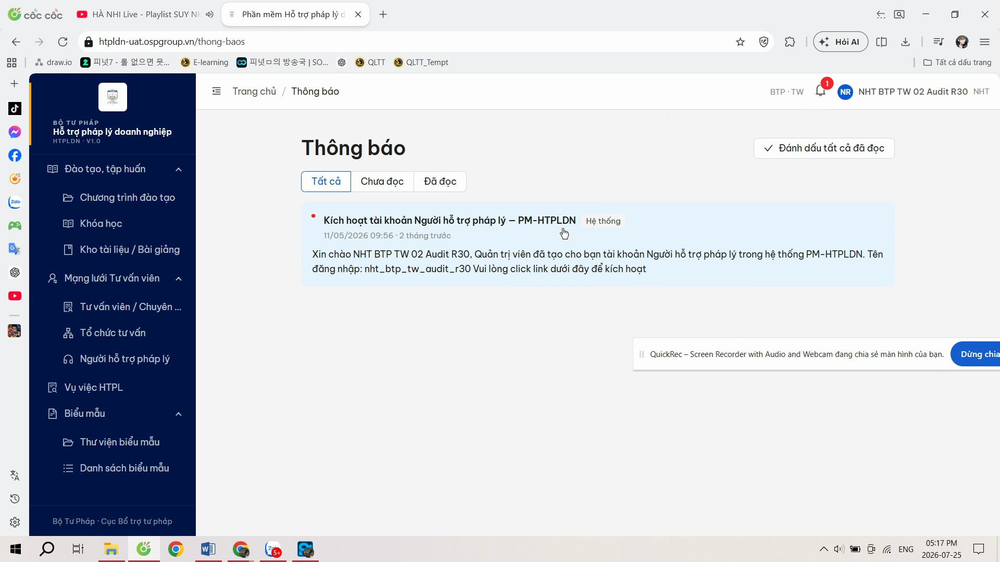

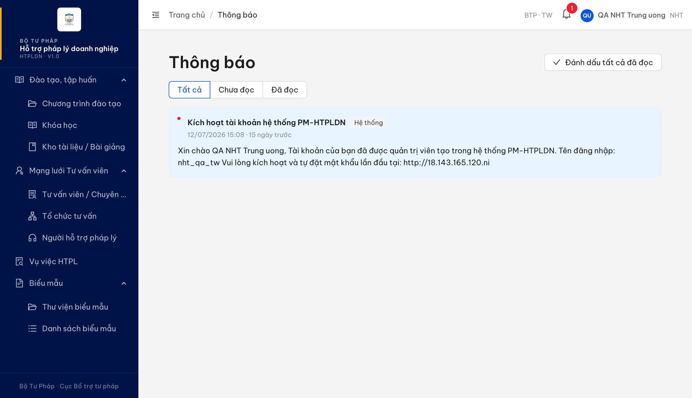

**3. Diễn biến dữ liệu hồ sơ khi bấm "Gửi KQ" (để dev đối chiếu, các phần này đều ĐÚNG đặc tả):**

```
truoc : DANG_THAM_DINH  (phien ban 2)
sau   : TU_CHOI         (phien ban 3)
luu   : ketLuan = KHONG_DAT · lyDo = <nguyen van ly do> · ngayThamDinh = <thoi diem>
thu   : gui toi email khai tren ho so ung vien, co kem ly do
```

**4. Hồ sơ để dev tái hiện trực tiếp:** `TVV-BTP-TW-0021 — QA TVV TDHSTVV14 R2` (Cục Bổ trợ tư pháp, trạng thái Từ chối) trên https://18.143.165.120.nip.io.

Toàn bộ phép đo + 4 câu hỏi gửi BA: [`../../reverify-audit/TDHSTVV_14/audit.md`](../../reverify-audit/TDHSTVV_14/audit.md).

---

## ~~BUG-TDHSTVV_14b~~ [CLOSED] — Thông báo sau khi gửi kết quả thẩm định không phản ánh kết luận vừa chọn

> **Re-test:** 2026-07-30 23:26 R6 — ✅ PASS (Closed-verified). Thông báo trên màn nay phản ánh đúng kết luận vừa chọn ở CẢ HAI nhánh: "Không đạt" → **"Đã từ chối hồ sơ"**; "Yêu cầu bổ sung" → **"Đã gửi yêu cầu bổ sung đến Người hỗ trợ"**. Không còn chuỗi "Đã lưu kết quả thẩm định". Đo trên 2 hồ sơ mới lập trọn luồng (TVV-BTP-TW-0028 · TVV-BTP-TW-0029) — bản ghi cũ đã ở trạng thái cuối nên không dùng lại được. Ba tiêu chí vốn đã đạt (thông báo trong phần mềm cho Người hỗ trợ, thư 2 kênh, tiêu đề thân thư) đo lại vẫn nguyên, không hỏng ngược.

**Severity:** Minor | **Priority:** P3 | **Type:** Negative | **TC Ref:** TDHSTVV_14 | **Status:** Closed

**SRS Reference:** `SCR-IV-03 §Quy tắc tương tác — Thẩm định` (srs-fr-04-chuyen-gia-tvv.md:1589) · quyết định BA ngày 30/07/2026 điểm 4 (ghi trong cột `DEV phản hồi lần 2` của ca TDHSTVV_14)

### Mô tả

Sau khi Cán bộ Nghiệp vụ chọn kết luận thẩm định rồi bấm **"Gửi KQ"**, dòng thông báo hiện trên màn luôn là **"Đã lưu kết quả thẩm định"** kèm dấu tích xanh, bất kể kết luận là **"Không đạt"** hay **"Yêu cầu bổ sung"**. Hồ sơ ngay sau đó chuyển đúng trạng thái, nhưng người thao tác không được cho biết kết quả vừa gửi là gì.

### Các bước tái hiện

1. Đăng nhập **`nht_qa_tw`** (Người hỗ trợ pháp lý, Cục Bổ trợ tư pháp) → tạo mới hồ sơ tư vấn viên → hồ sơ ở **Mới đăng ký**.
2. Đăng nhập **`cbnv_tw`** (CB Nghiệp vụ cùng đơn vị) → mở hồ sơ → bấm **"Bắt đầu thẩm định"**.
3. Thẻ **Thẩm định** → chọn kết luận **"Không đạt"**, nhập lý do `Thiếu bản sao thẻ hành nghề` → bấm **"Gửi KQ"** → đọc ngay dòng thông báo hiện trên màn.
4. Lặp bước 1-3 trên hồ sơ khác với kết luận **"Yêu cầu bổ sung"**, lý do `Bổ sung bằng tốt nghiệp`.

### Kết quả mong đợi

- `srs-fr-04-chuyen-gia-tvv.md:1589` (SCR-IV-03 §Quy tắc tương tác — Thẩm định): *"Khi gửi kết quả: nếu 'Yêu cầu bổ sung' → trạng thái Yêu cầu bổ sung; nếu 'Không đạt' → Đã từ chối"* — hai kết luận dẫn tới hai kết cục khác nhau.
- BA chốt ngày 30/07/2026 (điểm 4): kết luận **"Không đạt"** → thông báo phản ánh việc hồ sơ đã bị **từ chối**; kết luận **"Yêu cầu bổ sung"** → phản ánh việc đã gửi yêu cầu bổ sung đến Người hỗ trợ.
- ⇒ Thông báo hiện sau khi gửi kết quả phải cho biết kết luận vừa chọn, không dừng ở việc báo đã lưu.

### Kết quả thực tế

- Đo trên **3 hồ sơ** `TVV-BTP-TW-0025` · `TVV-BTP-TW-0026` · `TVV-BTP-TW-0027`, lúc 30/07/2026 22:29-22:36, kết quả giống nhau.
- Cả nhánh **"Không đạt"** lẫn nhánh **"Yêu cầu bổ sung"** đều chỉ hiện đúng một chuỗi: **"Đã lưu kết quả thẩm định"**, kiểu thành công (dấu tích xanh).
- Trạng thái hồ sơ đổi đúng ngay sau đó (**Từ chối** / **Yêu cầu bổ sung**), nên sai lệch chỉ nằm ở câu chữ thông báo.
- Các phần khác của luồng đã chạy đúng, **không cần sửa lại**: Người hỗ trợ đã nộp hồ sơ nhận đúng 1 thông báo trong phần mềm kèm nguyên văn lý do ở cả 2 nhánh; thư gửi Người hỗ trợ và thư gửi ứng viên đều có, thư ứng viên không bị thay thế; tiêu đề thân thư đã hết chữ "Phê duyệt" và dấu tích xanh.

### Bằng chứng


Thông báo tự tắt nên đo bằng bộ theo dõi thay đổi cài trước khi bấm, **không lọc trùng**; ảnh chụp đúng lúc thông báo còn hiển thị.

---

## Phụ lục — Môi trường test

| Thành phần | Giá trị |
|------------|---------|
| URL ứng dụng | https://18.143.165.120.nip.io |
| OTP login | MailHog |
| MailHog (OTP inbox) | http://18.143.165.120:8025 |
| API base | https://18.143.165.120.nip.io/api/v1 |
| Frontend | React + Ant Design v5 |
| Xác thực | JWT (cookie) + OTP |
| Tool test | Chrome DevTools MCP |

---

*Bug report generated: 2026-07-27 12:05:00 · cập nhật R6 2026-07-30 23:26 | QA Automation via Claude Code*
