# Bug Report — Đào tạo, tập huấn (verify vòng 1 bug đối tác, 2026-08-03)

| Thông tin | Giá trị |
|-----------|---------|
| **Dự án** | PM HTPLDN — UAT đối tác |
| **Môi trường** | https://18.143.165.120.nip.io (build hiển thị ở sidebar: HTPLDN · V1.0.5) |
| **Người test** | QA Automation (Claude Code) |
| **Ngày** | 2026-08-04 00:31:00 |
| **Loại test** | Verify bug đối tác (vòng 1) · **re-verify sau dev fix (2026-08-04)** |
| **Round** | **Re-verify sau dev fix — 2026-08-04, gói giao diện `index-BrKDNUvo.js`, tài khoản `cbnv_tw_01` · `0109998887` (DN) · `cbnv_hn` (CB_NV_DP)** (vòng 1 ngày 2026-08-03 chạy trên gói `index-RAuQ-eDH.js`) |
| **Tài liệu tham chiếu** | `Docs-PM-HTPLDN/_bmad-output/planning-artifacts/srs-v3.5/srs-fr-03-dao-tao.md` · [QA_VERIFY_PROTOCOL.md](../../../../QA_VERIFY_PROTOCOL.md) · Sheet `UAT_TGPL Doanh Nghiệp-tuần 2` |

---

## Tổng hợp

**Snapshot mới nhất — re-verify sau dev fix, 2026-08-04 (gói giao diện `index-BrKDNUvo.js`):** tổng **12** lỗi — **10 Closed · 2 Open**. Hai lỗi Open là `BUG-KTDGKQHT_02` (dòng 116) và `BUG-QLDXDTTH_11` (dòng 135) — hai dòng vốn treo `BA confirm`, **BA chốt là lỗi ngày 04/08/2026** nên nay mở entry; riêng `QLDXDTTH_11` đã được QA đo lại trên môi trường bàn giao trước khi chốt. Mười lỗi đóng trước đó giữ nguyên. Đợt cuối đóng nốt 3 lỗi nhóm Đề xuất đào tạo: `QLDXDTTH_12` + `QLDXDTTH_10` + `QLDXDTTH_13`, chạy bằng `0109998887` (vai trò DN) và `cbnv_hn` (CB_NV_DP · Sở Tư pháp Hà Nội) — đúng cặp vai của các bug gốc. 7 lỗi đóng trước đó (`QLKTLBG_09`, `QLKTLBG_10`, `QLLKHDTBD_09`, `QLLKHDTBD_50`, `KTDGKQHT_22`, `KTDGKQHT_21`, `KTDGKQHT_20`) chạy bằng `cbnv_tw_01`. Mọi lỗi đóng đều chạy lại trọn luồng trên dữ liệu dựng mới và đo tối thiểu 2 cách độc lập.

Bối cảnh phát hiện ban đầu (vòng 1, 2026-08-03) giữ nguyên bên dưới để tra cứu:

- 2 lỗi từ case `QLKTLBG_09` (row 117): lỗi thứ 2 (loại PDF) ngoài phạm vi case → đã mở dòng TC mới `QLKTLBG_10` (row 132).
- 3 lỗi từ case `QLDXDTTH_01` (row 118): **cả 3 đều NGOÀI phạm vi** case đối tác — bản thân case `QLDXDTTH_01` đã `Pass` (luồng gửi đề xuất chạy đúng end-to-end). 3 lỗi này phát hiện trong lúc verify → đã mở dòng TC mới `QLDXDTTH_10` (row 134), `QLDXDTTH_12` (row 136), `QLDXDTTH_13` (row 137).
- 1 lỗi từ case `QLLKHDTBD_09` (row 119): dev khai `Reject` "không tái hiện", QA verify vòng 1 **tái hiện 2/2 bộ lọc** trên bản dựng `V1.0.5` → QA ghi `Open` ở cột `Verify`, giữ nguyên `Reject` của dev ở cột `Trạng thái dev fix 1`.
- 1 lỗi từ vòng chốt nghi vấn 20:00 03/08 (`KTDGKQHT_02` → `KTDGKQHT_21`, row 147): tab "Kết quả" của màn chi tiết khóa học **thiếu cột "Đề kiểm tra"** mà `:1901` yêu cầu. Lần đo 17:00 đã cố ý **chưa log** vì chưa loại trừ được giả thuyết "cột chỉ render khi khóa đã gán đề" — vòng này đã dựng đề kiểm tra thật (`QA-DEKT-0803`), gán vào 2 khóa ở 2 trạng thái, nhập điểm để bản ghi kết quả trỏ đúng đề, và **cột vẫn không xuất hiện ở cả 4 tình huống** ⇒ đủ căn cứ log.
- 2 lỗi QA tự phát hiện ngoài phạm vi case, dev đã báo `dev done` nhưng **bug entry viết bổ sung ngày 2026-08-04** (trước đó chỉ có audit + bảng đối chiếu điều kiện, chưa có entry để dev đọc): `KTDGKQHT_20` (row 130, phát hiện khi verify `KTDGKQHT_02`) và `QLLKHDTBD_50` (row 144, phát hiện khi verify `PDKHDTTH_04`).
- 1 lỗi phát hiện kèm theo trong lúc dựng đề (`KTDGKQHT_22`, row 148): tab "Đề kiểm tra" của màn chi tiết khóa học **thiếu 4 cột** mà `:1908` liệt kê (STT · Mã đề · Lĩnh vực · Người thêm) và cột Hành động **không có thao tác "Xem chi tiết"**. Là lỗi **tĩnh** — danh sách cột không phụ thuộc vai trò hay trạng thái khóa.
- 2 nghi vấn còn lại của vòng chốt **KHÔNG log** (chi tiết + bằng chứng: [`../../reverify-audit/seed-de-kiem-tra-2026-08-03.md`](../../reverify-audit/seed-de-kiem-tra-2026-08-03.md)):
  - *"Xếp loại có giá trị trong khi Điểm kiểm tra trống"* — **không phải lỗi của phần mềm mà là lỗi phép đo**: ô Điểm kiểm tra là `<input>`, đọc bằng `td.innerText` luôn ra rỗng. Đọc `input.value` + đối chiếu API đều ra 9.0 / 8.0 / 6.5 / 4.0, khớp Xếp loại Giỏi / Khá / Trung bình / Không đạt theo **BR-KQ-01** (`srs-fr-03-dao-tao.md:2230`).
  - *"Tab Công bố kết quả thiếu 5 cột"* (row 146 `CBKQDTBD_02`) — lỗi **có thật lúc 17:55** nhưng **đã được sửa** ở gói giao diện triển khai lúc 19:51 cùng ngày; đo lại 20:00 trên đúng khóa đó thấy **đủ 12 cột**. Row 146 đã chuyển `Verify = Pass` + đính chính note.
- Ngoài ra còn 1 phát hiện **chưa log thành bug** vì đặc tả tự mâu thuẫn (cán bộ nghiệp vụ không có thao tác Tiếp nhận, xem `srs-fr-03:1045/:1875` vs ma trận quyền `srs-v3.5.md:1309`) → đã mở dòng `QLDXDTTH_11` (row 135) ở trạng thái `BA confirm`, chi tiết tại [`../../reverify-audit/QLDXDTTH_01.md`](../../reverify-audit/QLDXDTTH_01.md).

### Severity breakdown

| Tổng | Critical | Major | Medium | Minor | Trivial | Closed | Open |
|------|----------|-------|--------|-------|---------|--------|------|
| 12   | 0        | 6     | 4      | 1     | 1       | 10     | 2    |

## Bug Summary Table

| Bug ID | Severity | Priority | Type | TC Ref | **SRS Reference** | Title | Status |
|--------|----------|----------|------|--------|-------------------|-------|--------|
| BUG-KTDGKQHT_02 | Major | P1 | UI/UX | KTDGKQHT_02 (row 116, tuần 2) | `FR-III-05 (UC24)` §Outputs `srs-fr-03-dao-tao.md:618-621` · công thức `:622` · `BR-KQ-02` `:2269` | Màn kết quả học tập không cho đọc số buổi vắng có phép / vắng không phép — không kiểm chứng được kết luận Đạt / Không đạt | Open |
| BUG-QLDXDTTH_11 | Major | P1 | Chức năng | QLDXDTTH_11 (row 135, tuần 2 — QA mở mới) | `FR-III-13 (UC32)` §Mô tả `srs-fr-03-dao-tao.md:1068` · `SCR-III-01 Thành phần 8` `:1898` | Cột "Hành động" tab Đề xuất đào tạo trống ở mọi dòng — cán bộ nghiệp vụ không có đường tiếp nhận đề xuất, đề xuất đứng vĩnh viễn ở "Mới gửi" | Open |
| BUG-QLKTLBG_09 | Major | P1 | UI/UX | QLKTLBG_09 (row 117, tuần 2) | `FR-III-07 (UC26)` `srs-fr-03-dao-tao.md:726, :792` · `SCR-III-03` `:1951, :1955` | Bài giảng loại Slide (.pptx) không xem trực tuyến được: khung xem trước trắng, không có thông báo thay thế, không có nút "Tải về" | Closed |
| BUG-QLKTLBG_10 | Major | P1 | UI/UX | QLKTLBG_10 (row 132, tuần 2 — QA mở mới) | `FR-III-07 (UC26)` `srs-fr-03-dao-tao.md:726, :792` · `SCR-III-03` `:1951, :1955` | Bài giảng loại PDF cũng không xem trực tuyến được: khung xem trước báo "refused to connect", không có thông báo thay thế, không có nút "Tải về" | Closed |
| BUG-QLDXDTTH_10 | Medium | P2 | UI/UX | QLDXDTTH_10 (row 134, tuần 2 — QA mở mới) | `FR-III-13 (UC32)` · `SCR-III-01 Thành phần 8` `srs-fr-03-dao-tao.md:1875` | Tab "Đề xuất đào tạo" thiếu cột "Người đề xuất"; màn chi tiết cũng không hiện người gửi | Closed |
| BUG-QLDXDTTH_12 | Minor | P3 | UI/UX | QLDXDTTH_12 (row 136, tuần 2 — QA mở mới) | `FR-III-13 (UC32)` `srs-fr-03-dao-tao.md:1051` (Inputs `linh_vuc_id`) | Ô chọn Lĩnh vực và màn chi tiết lộ mã kỹ thuật ra người dùng ("DAN_SU - Dân sự"), lệch với cột Lĩnh vực của bảng | Closed |
| BUG-QLDXDTTH_13 | Trivial | P3 | UI/UX | QLDXDTTH_13 (row 137, tuần 2 — QA mở mới) | `FR-III-13 (UC32)` `srs-fr-03-dao-tao.md:1053, :1057` (Thông báo CB NV) | Thông báo "Đề xuất đào tạo mới" hiển thị bằng biểu tượng báo lỗi (X đỏ) thay vì biểu tượng thông tin | Closed |
| BUG-QLLKHDTBD_09 | Major | P1 | Chức năng | QLLKHDTBD_09 (row 119, tuần 2) | `FR-III-14 (UC33)` `srs-fr-03-dao-tao.md:1752, :1147, :1152` · `BR-DATA-06` `srs-v3.5.md:5524` | Xuất Excel danh sách Kế hoạch đào tạo bỏ qua bộ lọc đang đặt: màn 1 kết quả nhưng tệp xuất 13 dòng (toàn bộ danh sách) | Closed |
| BUG-QLLKHDTBD_50 | Medium | P2 | UI/UX | QLLKHDTBD_50 (row 144, tuần 2 — QA mở mới) | `SCR-III-00 Thành phần 3` `srs-fr-03-dao-tao.md:1761, :1765, :1770, :1772, :1773` · `:1769` (định dạng ngân sách) | Bảng danh sách Kế hoạch đào tạo thiếu 4 cột (Chọn dòng · Số chương trình · Người tạo · Ngày tạo); ngân sách hiện số thô `100000000.00` | Closed |
| BUG-KTDGKQHT_20 | Major | P1 | Chức năng | KTDGKQHT_20 (row 130, tuần 2 — QA mở mới) | `BR-KQ-02` `srs-fr-03-dao-tao.md:2246, :2251` · `SCR-III-02 Tab 5` `:1901` · `KHOA_HOC.ty_le_chuyen_can_toi_thieu` `:132` | Tỷ lệ chuyên cần lấy mẫu số = số buổi ĐÃ điểm danh thay vì tổng số buổi của khóa → 1/3 buổi vẫn hiện 100%, sai kết luận Đạt/Không đạt | Closed |
| BUG-KTDGKQHT_21 | Medium | P2 | UI/UX | KTDGKQHT_21 (row 147, tuần 2 — QA mở mới) | `FR-III-05 (UC24)` · `SCR-III-02 Tab 5` `srs-fr-03-dao-tao.md:1901` · Inputs `:550` · `BR-KQ-02` `:2246` | Tab "Kết quả" của màn chi tiết khóa học thiếu cột "Đề kiểm tra" — kể cả khi khóa đã gán đề và điểm đã gắn với đề đó | Closed |
| BUG-KTDGKQHT_22 | Medium | P2 | UI/UX | KTDGKQHT_22 (row 148, tuần 2 — QA mở mới) | `FR-III-05 (UC24)` · `SCR-III-02 Tab 7` `srs-fr-03-dao-tao.md:1908` | Tab "Đề kiểm tra" của màn chi tiết khóa học thiếu 4 cột (STT · Mã đề · Lĩnh vực · Người thêm) và không có thao tác "Xem chi tiết" đề | Closed |

---

## ~~BUG-QLKTLBG_09~~ [CLOSED] — Bài giảng loại Slide (.pptx): khung "Xem trước" trống, không trình chiếu nội dung, cũng không có lối tải về

> **Re-test:** 2026-08-03 23:16 — ✅ PASS (Closed-verified). Chạy lại trọn luồng bằng `cbnv_tw_01` (CB_NV_TW, `BTP · TW`) trên gói giao diện `index-BrKDNUvo.js`: tạo bài giảng mới `QA RETEST 04/08 - QLKTLBG_09 Slide PPTX cong khai` với tệp `.pptx` thật (2 slide có chữ, 28.5 KB) → bấm icon con mắt → **khu vực xem trước trình chiếu đúng nội dung slide ngay trong trang**, đọc được nguyên văn 5 dòng chữ của tệp (đo 2 cách khớp nhau: đọc chữ trong mã trang + ảnh chụp toàn cỡ). Hộp thoại nay có thêm nút **Tải về**; bấm thật → tệp về máy, mở bằng `python-pptx` ra đúng 2 slide, mã băm MD5 trùng khít tệp đã tải lên. Cột `Thao tác` của bảng cũng đã có mục **Tải về** (tooltip "Tải về") ở mọi dòng Slide/PDF và không có ở dòng Video, đúng `:1951`. Bản ghi Slide tạo TRƯỚC bản vá (`QA VERIFY 03/08 …`) cũng xem được → 2/2 bản ghi đạt. [Ảnh xem trước](image/QLKTLBG_09-retest-2026-08-04-xem-truoc-slide-hien-noi-dung.png) · [Ảnh cột Thao tác](image/QLKTLBG_09-retest-2026-08-04-cot-thao-tac-co-Tai-ve.png)

### Mô tả

Ở màn `Đào tạo, tập huấn → Kho tài liệu / Bài giảng`, Cán bộ nghiệp vụ bấm xem trước một bài giảng có `Loại tài liệu = Slide` (tệp `.pptx`) thì hộp thoại *"Xem trước: …"* mở ra nhưng **khu vực xem trước trắng hoàn toàn** — không trình chiếu nội dung slide. Đồng thời hệ thống **không** hiển thị thông báo thay thế *"Không thể xem trực tuyến"* và **không** cung cấp nút *"Tải về"*, nên người dùng không có bất kỳ cách nào tiếp cận nội dung bài giảng từ màn này. Đối chứng cùng hộp thoại: bài giảng loại Video hiển thị được khung YouTube, chứng tỏ thành phần xem trước bản thân nó hoạt động.

### Các bước tái hiện

1. Đăng nhập tài khoản **`cbnv_tw`** — vai trò **CB Nghiệp vụ Trung ương (`CB_NV_TW`)**, đơn vị `BTP · TW`. Theo `SCR-III-03` (`srs-fr-03-dao-tao.md:1918`) và `FR-III-07` (`:728` — *"Tác nhân: CB NV / CB PD"*, `:734` — quyền *"Quản lý tài liệu ĐT"*), đây đúng là vai trò được phép thao tác trên màn Kho tài liệu; tài khoản có `create_bai_giang` trong danh sách quyền trả về khi đăng nhập.
2. Vào menu `Đào tạo, tập huấn` → `Kho tài liệu / Bài giảng`.
3. Bấm `+ Thêm mới`, nhập `Tên bài giảng`, chọn `Loại tài liệu = Slide`, tải lên tệp PowerPoint thật đuôi `.pptx` (đã dùng `QLKTLBG_09-slide-that-QA.pptx`, 28.5 KB, 2 slide có chữ), tải lên `Ảnh đại diện`, bật công tắc `Công khai`, bấm `Thêm mới`. Hệ thống báo *"Tạo bài giảng thành công"*.
4. Ở dòng vừa tạo, cột `Thao tác`, bấm **icon con mắt** (xem trước).
5. Quan sát khu vực xem trước bên dưới khối thông tin `Công khai / Ảnh đại diện / Mô tả công khai`.

### Kết quả mong đợi

- Theo `srs-fr-03-dao-tao.md:1955` (*Thành phần 6 — Bảng xem trước*): **"Slide/PDF xem trực tiếp trong trình duyệt"** → nội dung slide phải hiển thị ngay trong trang.
- Theo `:792` (Acceptance Criteria): *"**Given** CB NV xem file **When** chọn preview **Then** hiển thị nội dung trên trình duyệt"*.
- Theo `:726`: *"3 loại: Slide (PPTX), PDF, Video (YouTube embed). **Preview inline**"* — và `:743` quy định tệp Slide đúng là `.pptx`, tức `.pptx` nằm trong nhóm phải xem được.
- Nếu hệ thống không hiển thị được nội dung, `:1955` vẫn bắt buộc nhánh dự phòng: hiển thị **"Không thể xem trực tuyến"** kèm **nút "Tải về"** (người dùng bấm mới tải).
- Theo `:1951`, cột `Hành động` của bảng tài liệu phải có mục **"Tải về" (chỉ Slide/PDF)** bên cạnh "Xem trực tuyến".

### Kết quả thực tế

- Hộp thoại `Xem trước: QA VERIFY 03/08 - QLKTLBG_09 Slide PPTX cong khai` mở ra; toàn bộ chữ trong hộp thoại chỉ gồm: `Công khai · Đã công khai · Ngày công khai · 03/08/2026 15:57 · Ảnh đại diện · Mô tả công khai · —`.
- Khu vực xem trước là một khung nhúng 752×500 trỏ tới tệp `.pptx` nhưng **rỗng hoàn toàn** (địa chỉ bên trong khung là `about:blank`, nội dung rỗng). Không thấy chữ *"Không thể xem trực tuyến"*; hộp thoại chỉ có **đúng 1 nút** là nút đóng.
- Cột `Thao tác` của bảng chỉ có 3 hành động: xem trước · Sửa · Xóa — **không có "Tải về"**.
- Không có thông báo nào hiện ra cho người dùng: bộ bắt thông báo ghi nhận **0 thông báo · 0 request ghi dữ liệu** cho thao tác này.
- Về phía mạng: yêu cầu tải tệp `.pptx` từ khung xem trước trả HTTP 200 nhưng bị **huỷ (`net::ERR_ABORTED`)**; phản hồi kèm `content-type: application/vnd.openxmlformats-officedocument.presentationml.presentation`, `content-disposition: inline`, **`x-frame-options: DENY`** và `content-security-policy: frame-ancestors 'none'`.
- Đối chứng cùng hộp thoại, cùng tài khoản: bản ghi **Video** hiển thị khung YouTube bình thường; bản ghi **PDF** cũng không xem được (hiện trang lỗi *"18.143.165.120.nip.io refused to connect."*) — phần PDF đã được tách thành dòng TC mới trên sheet vì nằm ngoài phạm vi case này.
- Đã đo trên **2 bản ghi Slide `.pptx` khác nhau** (`QA VERIFY 03/08 …` 28.5 KB `Đã công khai`, và `RECON 03/08 …` 4.5 KB `Chưa công khai`) — kết quả giống hệt nhau.

### Bằng chứng

**1. Ảnh chụp**

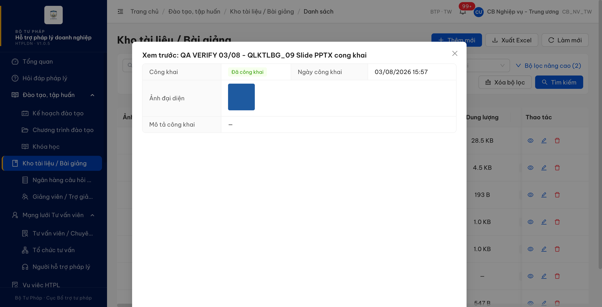

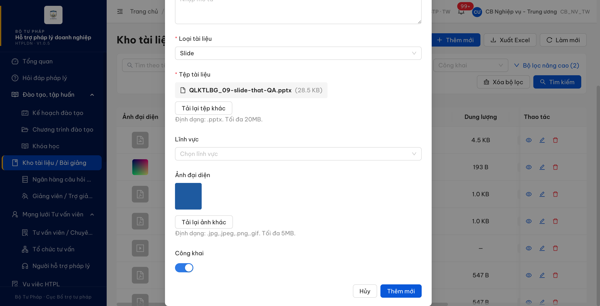

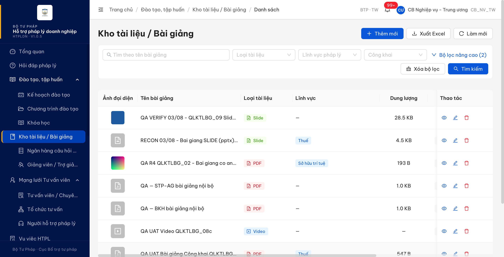

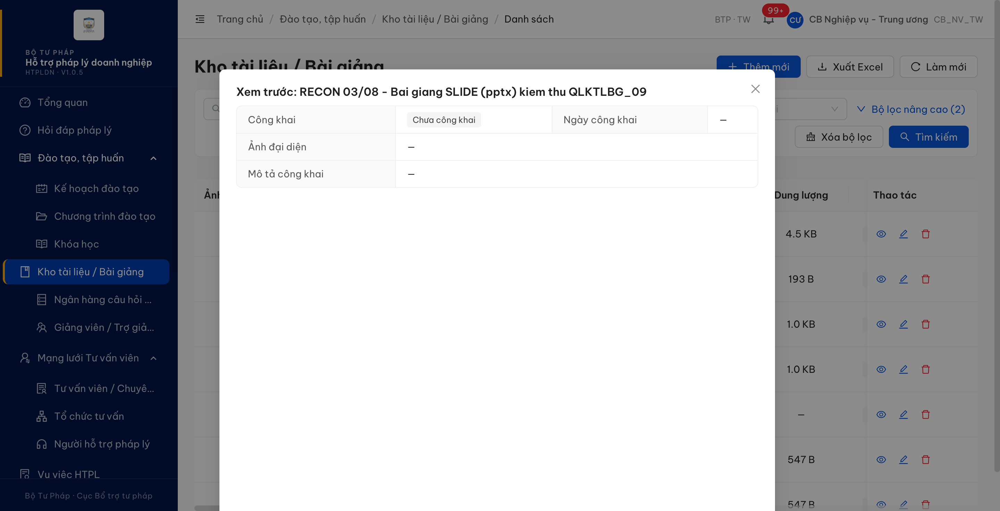


**2. Phản hồi mạng của chính thao tác bấm xem trước** *(phụ trợ)*

```
GET /api/v1/bai-giangs/9e7e90d7-0b6b-4a98-ad7f-11a8a7e64da2/preview-url        -> 200
GET .../QLKTLBG_09-slide-that-QA.pptx?response-content-disposition=inline...   -> 200
     content-type:              application/vnd.openxmlformats-officedocument.presentationml.presentation
     content-disposition:       inline
     x-frame-options:           DENY
     content-security-policy:   frame-ancestors 'none'; object-src 'none'; base-uri 'self'
     => Request failed with net::ERR_ABORTED   (khung xem trước không nhận được nội dung)
```

---

## ~~BUG-QLKTLBG_10~~ [CLOSED] — Bài giảng loại PDF cũng không xem trực tuyến được: khung "Xem trước" báo "refused to connect", không có lối tải về

> **Re-test:** 2026-08-03 23:22 — ✅ PASS (Closed-verified). Chạy lại trọn luồng bằng `cbnv_tw_01` (CB_NV_TW, `BTP · TW`) trên gói giao diện `index-BrKDNUvo.js`: tạo bài giảng mới `QA RETEST 04/08 - QLKTLBG_10 PDF that cong khai` với tệp `.pdf` thật (2 trang có chữ, 1.6 KB) → bấm icon con mắt → **khu vực xem trước hiển thị đúng trang PDF ngay trong trang**, không còn dòng "refused to connect". Đo 2 cách khớp nhau: (a) ảnh chụp toàn cỡ đọc rõ nguyên văn chữ trên trang 1 của tệp; (b) trình xem trong khung báo đúng **2 trang** (`1 / 2`, 2 ảnh thu nhỏ) — khớp số trang tệp đã tải lên. Hộp thoại nay có nút **Tải về**; bấm thật → tệp về máy, mở bằng PyMuPDF ra đúng 2 trang, mã băm MD5 trùng khít tệp đã tải lên. Bản ghi PDF tạo TRƯỚC bản vá (`QA VERIFY 03/08 …`, 979 B) cũng xem được nội dung → 2/2 bản ghi đạt. Cột `Thao tác` của bảng đã có mục **Tải về** ở mọi dòng Slide/PDF, đúng `:1951`. [Ảnh bản ghi mới](image/QLKTLBG_10-retest-2026-08-04-xem-truoc-pdf-hien-noi-dung.png) · [Ảnh bản ghi cũ](image/QLKTLBG_10-retest-2026-08-04-ban-ghi-cu-cung-xem-duoc.png)

### Mô tả

Cùng màn `Đào tạo, tập huấn → Kho tài liệu / Bài giảng`, bài giảng có `Loại tài liệu = PDF` cũng **không** hiển thị được nội dung trong khu vực xem trước: khung xem trước chỉ hiện biểu tượng tệp lỗi của trình duyệt kèm dòng chữ *"18.143.165.120.nip.io refused to connect."*. Hệ thống cũng không hiển thị thông báo thay thế *"Không thể xem trực tuyến"* và không có nút *"Tải về"*. Lỗi này **nằm ngoài phạm vi** phản ánh của đối tác ở case `QLKTLBG_09` (đối tác chỉ nói loại Slide) nên đã được mở thành dòng TC riêng `QLKTLBG_10` trên sheet.

### Các bước tái hiện

1. Đăng nhập tài khoản **`cbnv_tw`** — vai trò **CB Nghiệp vụ Trung ương (`CB_NV_TW`)**, đơn vị `BTP · TW`; đây là tác nhân được `FR-III-07` (`srs-fr-03-dao-tao.md:728`) và quyền *"Quản lý tài liệu ĐT"* (`:734`) cho phép thao tác trên màn Kho tài liệu.
2. Vào menu `Đào tạo, tập huấn` → `Kho tài liệu / Bài giảng`.
3. Bấm `+ Thêm mới`, chọn `Loại tài liệu = PDF`, tải lên tệp `.pdf` hợp lệ (đã dùng `QLKTLBG_10-pdf-that-QA.pdf` — PDF 2 trang có chữ đọc được, kiểm chứng bằng PyMuPDF), bật `Công khai`, bấm `Thêm mới`.
4. Ở dòng vừa tạo, cột `Thao tác`, bấm **icon con mắt** (xem trước).
5. Quan sát khu vực xem trước.

### Kết quả mong đợi

- `srs-fr-03-dao-tao.md:1955`: **"Slide/PDF xem trực tiếp trong trình duyệt"** → nội dung PDF phải hiển thị ngay trong trang.
- `:792`: *"**Given** CB NV xem file **When** chọn preview **Then** hiển thị nội dung trên trình duyệt"*.
- `:726`: *"Preview inline"* cho cả 3 loại tài liệu.
- Nếu không hiển thị được: `:1955` bắt buộc hiện **"Không thể xem trực tuyến"** kèm **nút "Tải về"**.
- `:1951`: cột `Hành động` phải có **"Tải về" (chỉ Slide/PDF)**.

### Kết quả thực tế

- Hộp thoại `Xem trước: QA VERIFY 03/08 - QLKTLBG_10 PDF that cong khai` mở ra với `Đã công khai`, `Ngày công khai 03/08/2026 16:09`; khu vực xem trước hiện **biểu tượng tệp lỗi + dòng chữ "18.143.165.120.nip.io refused to connect."** — không có trang PDF nào.
- Không có chữ *"Không thể xem trực tuyến"*, không có nút *"Tải về"*; hộp thoại chỉ có **1 nút** (đóng). Cột `Thao tác` cũng chỉ có xem trước · Sửa · Xóa.
- Không có thông báo nào cho người dùng (bộ bắt thông báo: **0 thông báo** cho thao tác xem trước).
- Tái hiện **3/3** trên 3 bài giảng PDF khác nhau (`QA VERIFY 03/08 …` 979 B — tệp PDF thật do QA tự tạo mới; `QA UAT Bài giảng Công khai QLKTLBG_08b` 547 B; `QA R4 QLKTLBG_02` 193 B) → không phải do tệp cũ hỏng.
- Về phía mạng: tệp PDF trả HTTP 200 kèm `content-type: application/pdf`, `content-disposition: inline`, nhưng có **`x-frame-options: DENY`** + `content-security-policy: frame-ancestors 'none'` → trình duyệt chặn (`net::ERR_BLOCKED_BY_RESPONSE`).
- Đối chứng: bài giảng loại **Video** vẫn nhúng và phát được khung YouTube trong chính hộp thoại này.

### Bằng chứng

**1. Ảnh chụp**

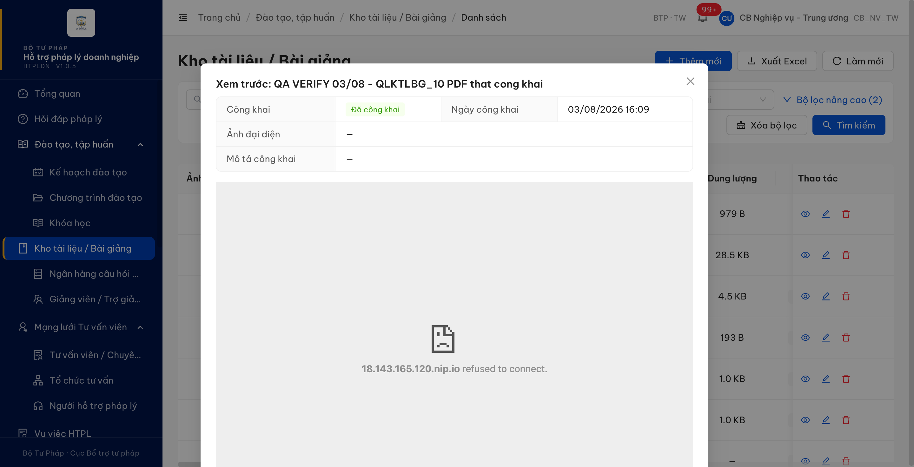

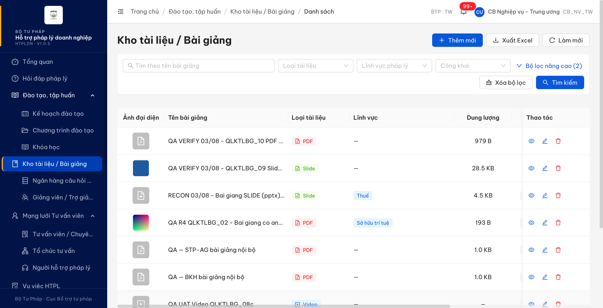


**2. Phản hồi mạng của chính thao tác bấm xem trước** *(phụ trợ)*

```
GET .../QLKTLBG_10-pdf-that-QA.pdf?response-content-disposition=inline...   -> 200
     content-type:              application/pdf
     content-disposition:       inline
     x-frame-options:           DENY
     content-security-policy:   frame-ancestors 'none'; object-src 'none'; base-uri 'self'
     => Request failed with net::ERR_BLOCKED_BY_RESPONSE
```

---

## ~~BUG-QLDXDTTH_10~~ [CLOSED] — Tab "Đề xuất đào tạo" không có cột "Người đề xuất", cán bộ không biết đề xuất là của ai

> **Re-test:** 2026-08-04 00:29 — ✅ PASS (Closed-verified). Chạy lại trọn luồng bằng tài khoản `cbnv_hn` (`QA CB Nghiep vu Ha Noi` · vai trò **CB_NV_DP** · Sở Tư pháp Hà Nội — đúng đơn vị tiếp nhận của các đề xuất) trên gói giao diện `index-BrKDNUvo.js`: `Đào tạo, tập huấn → Chương trình đào tạo → tab "Đề xuất đào tạo"`. Bảng nay có **9 cột** (`Nội dung · Lĩnh vực · Thời gian mong muốn · Địa điểm mong muốn · SL dự kiến · **Người đề xuất** · Trạng thái · Ngày tạo · Hành động`) — thêm đúng cột còn thiếu. Cột hiển thị **giá trị thật, không rỗng**: cả **3/3** dòng đều ghi `QA UAT Kiem Thu DN` kèm đơn vị `Sở Tư pháp Hà Nội`. Màn **chi tiết** đề xuất cũng đã có dòng `Người đề xuất  QA UAT Kiem Thu DN · Sở Tư pháp Hà Nội` — cả 2 chỗ mà bug gốc nêu đều đạt. Đo 2 cách khớp nhau: đọc dãy `th` bằng `evaluate_script` (9/9) + cuộn ngang hết cỡ rồi chụp ảnh. [Ảnh bảng](image/QLDXDTTH_10-retest-2026-08-04-tab-de-xuat-co-cot-nguoi-de-xuat.png) · [Ảnh cuộn hết phải](image/QLDXDTTH_10-retest-2026-08-04-cuon-het-phai-du-9-cot.png) · [Ảnh màn chi tiết](image/QLDXDTTH_10-retest-2026-08-04-man-chi-tiet-co-nguoi-de-xuat.png)

### Mô tả

Ở tab `Đề xuất đào tạo` của màn `Đào tạo, tập huấn → Chương trình đào tạo`, bảng danh sách đề xuất **không có cột "Người đề xuất"**. Cán bộ nghiệp vụ của đơn vị tiếp nhận nhìn danh sách không biết đề xuất do doanh nghiệp / người hỗ trợ nào gửi. Màn chi tiết đề xuất cũng không hiển thị thông tin người gửi.

### Các bước tái hiện

1. **Đăng nhập role `CB_NV_DP` (tài khoản `cbnv_hn`, quyền `R*` — đọc trong phạm vi đơn vị theo permission-matrix `srs-v3.5.md:1309`)**; đơn vị của tài khoản là `00000000-0000-4000-8002-000000000001`, trùng đơn vị tiếp nhận của bản ghi test.
2. Vào `Đào tạo, tập huấn → Chương trình đào tạo` → chọn tab **"Đề xuất đào tạo"**.
3. Cuộn **hết thanh ngang** của bảng (bảng có tràn ngang, cột cuối được ghim) để chắc chắn không bỏ sót cột bị khuất.
4. Bấm vào nội dung đề xuất `QA-VERIFY-0803…` để mở màn chi tiết `/dao-tao/de-xuat/b69a9545-59e4-4121-9760-91be29b65c19`.
5. Quan sát: không có cột / dòng nào nêu người đề xuất.

### Kết quả mong đợi

- Bảng tab "Đề xuất đào tạo" có cột **"Người đề xuất"**, theo `srs-fr-03-dao-tao.md:1875` — *"**Thành phần 8 — Tab "Đề xuất đào tạo":** … Bảng cột Lĩnh vực · Nội dung (cắt 150 ký tự) · **Người đề xuất** · Trạng thái … · Ngày tạo · Hành động …"*.
- Dữ liệu người đề xuất là bắt buộc ở tầng dữ liệu (`srs-v3.5.md:2661` — `nguoi_de_xuat_id … Bắt buộc Y`), nên thông tin này luôn có sẵn để hiển thị.

### Kết quả thực tế

- Bảng chỉ có **8 cột**, đo bằng `querySelectorAll('.ant-table-thead th')`: `Nội dung · Lĩnh vực · Thời gian mong muốn · Địa điểm mong muốn · SL dự kiến · Trạng thái · Ngày tạo · Hành động`. Không có "Người đề xuất".
- Đã cuộn hết thanh ngang và chụp lại → xác nhận không phải cột bị khuất.
- Màn chi tiết chỉ hiện: Lĩnh vực · Nội dung đề xuất · Thời gian mong muốn · Địa điểm mong muốn · Số lượng dự kiến · Trạng thái · Ngày tạo. Không có người gửi.
- Đối chiếu: máy chủ **có trả** `nguoiDeXuatId` trong phản hồi (`996cc5db-43c5-4903-b3d1-1c21adb2ece8`) ⇒ dữ liệu sẵn có, đây là chỗ giao diện chưa hiển thị.

### Bằng chứng

**1. Ảnh chụp**:

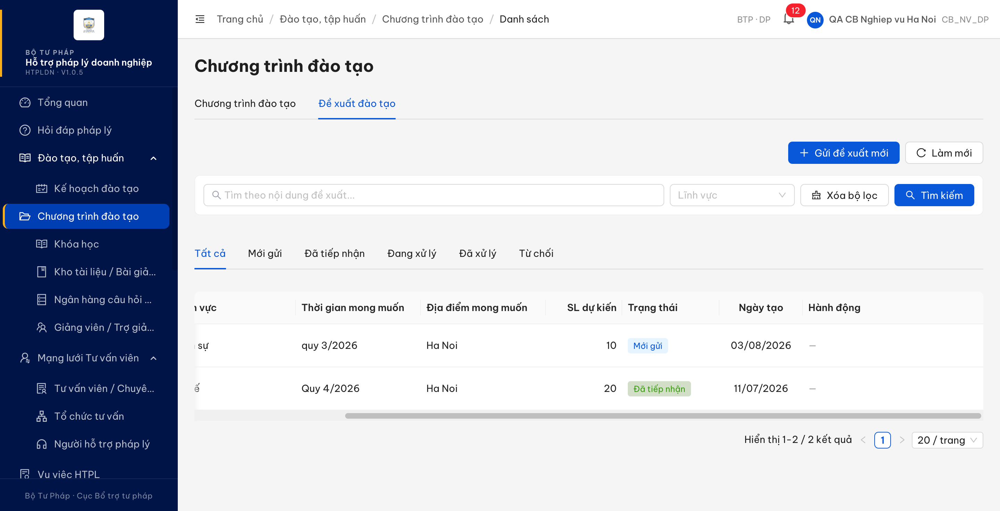
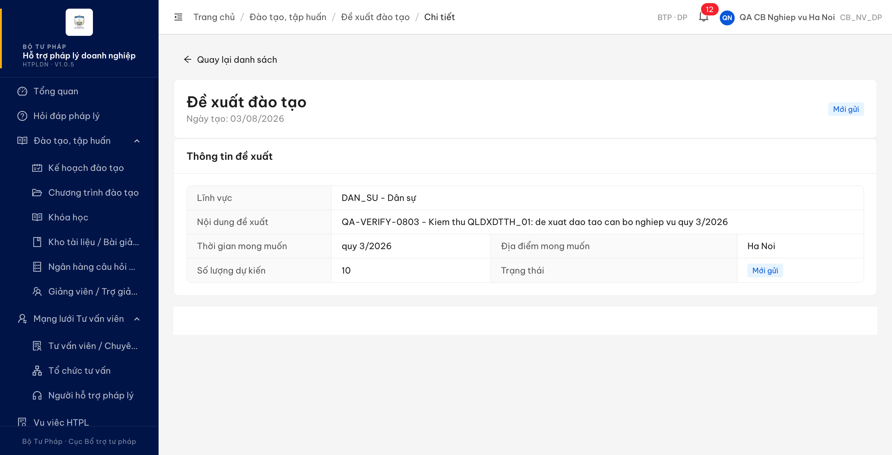

**2. Phản hồi máy chủ** *(chứng minh dữ liệu người đề xuất có sẵn)*:

```json
{"success":true,"data":{"id":"b69a9545-59e4-4121-9760-91be29b65c19",
 "nguoiDeXuatId":"996cc5db-43c5-4903-b3d1-1c21adb2ece8",
 "donViId":"00000000-0000-4000-8002-000000000001",
 "trangThai":"MOI_GUI"}}
```

---

## ~~BUG-QLDXDTTH_12~~ [CLOSED] — Ô chọn Lĩnh vực và màn chi tiết đề xuất lộ mã kỹ thuật ra người dùng

> **Re-test:** 2026-08-04 00:25 — ✅ PASS (Closed-verified). Chạy lại trọn luồng bằng tài khoản `0109998887` (`QA UAT Kiem Thu DN` · vai trò **DN** · `BTP · DP`) trên gói giao diện `index-BrKDNUvo.js`: mở `Đào tạo, tập huấn → Chương trình đào tạo → tab "Đề xuất đào tạo" → Gửi đề xuất mới` → bung ô chọn **Lĩnh vực** → **10/10 lựa chọn chỉ còn tên tiếng Việt** (`Thuế · Lao động · Đất đai · Dân sự · Thương mại · Hình sự · Hành chính · Sở hữu trí tuệ · Doanh nghiệp · Đầu tư`), không còn tiền tố mã kỹ thuật. Ô **lọc Lĩnh vực** ngoài danh sách cũng cho đúng 10 tên tiếng Việt đó. Màn **chi tiết** đề xuất `QA-VERIFY-0803…` hiện `Lĩnh vực  Dân sự` — quét toàn bộ chữ của màn không còn chuỗi mã kiểu `DAN_SU`. Đo 2 cách khớp nhau: đọc chữ hiển thị bằng `innerText` (kèm cả thuộc tính `title` của từng lựa chọn) + ảnh chụp toàn cỡ. [Ảnh ô chọn](image/QLDXDTTH_12-retest-2026-08-04-o-chon-linh-vuc-10-lua-chon-chi-tieng-viet.png) · [Ảnh ô lọc](image/QLDXDTTH_12-retest-2026-08-04-o-loc-linh-vuc-chi-tieng-viet.png) · [Ảnh màn chi tiết](image/QLDXDTTH_12-retest-2026-08-04-man-chi-tiet-linh-vuc-dan-su.png)

### Mô tả

Ở hộp thoại `Gửi đề xuất đào tạo`, ô chọn **Lĩnh vực** hiển thị kèm mã kỹ thuật của hệ thống: `DAN_SU - Dân sự`, `THUE - Thuế`, `LAO_DONG - Lao động`, `SHTT - Sở hữu trí tuệ`… Màn chi tiết đề xuất cũng hiển thị `Lĩnh vực: DAN_SU - Dân sự`. Trong khi đó cột "Lĩnh vực" của bảng danh sách lại hiển thị đúng `Dân sự` — không nhất quán ngay trong cùng một chức năng.

### Các bước tái hiện

1. **Đăng nhập role `DN` (tài khoản `0109998887`, quyền `C†RU*` trên đề xuất đào tạo theo permission-matrix `srs-v3.5.md:1309`).**
2. Vào `Đào tạo, tập huấn → Chương trình đào tạo` → tab **"Đề xuất đào tạo"** → bấm **"Gửi đề xuất mới"**.
3. Mở ô chọn **Lĩnh vực** → quan sát toàn bộ 10 lựa chọn.
4. Mở màn chi tiết một đề xuất bất kỳ → quan sát dòng **Lĩnh vực**.
5. Đối chiếu với cột **Lĩnh vực** ở bảng danh sách.

### Kết quả mong đợi

- Người dùng cuối chỉ nhìn thấy tên lĩnh vực bằng tiếng Việt (`Dân sự`, `Thuế`, `Lao động`…), đúng như cột "Lĩnh vực" của bảng danh sách đang hiển thị.
- `srs-fr-03-dao-tao.md:1051` định nghĩa đầu vào là `linh_vuc_id` (mã định danh) — mã định danh là thứ hệ thống dùng nội bộ, không phải thứ trình bày cho người dùng.

### Kết quả thực tế

- 10/10 lựa chọn trong ô chọn Lĩnh vực đều kèm mã kỹ thuật: `THUE - Thuế`, `LAO_DONG - Lao động`, `DAT_DAI - Đất đai`, `DAN_SU - Dân sự`, `THUONG_MAI - Thương mại`, `HINH_SU - Hình sự`, `HANH_CHINH - Hành chính`, `SHTT - Sở hữu trí tuệ`, `DOANH_NGHIEP - Doanh nghiệp`, `DAU_TU - Đầu tư`.
- Màn chi tiết đề xuất: `Lĩnh vực    DAN_SU - Dân sự`.
- Cùng lúc đó, cột "Lĩnh vực" của bảng danh sách hiển thị đúng `Dân sự` ⇒ lệch nhau trong cùng một chức năng.

### Bằng chứng

**1. Ảnh chụp**:

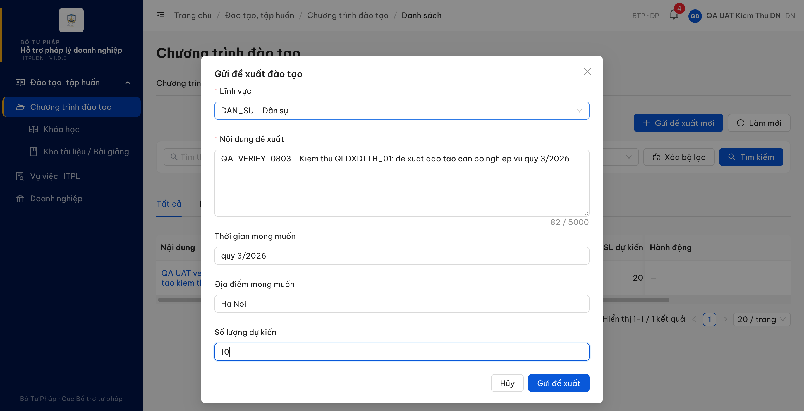

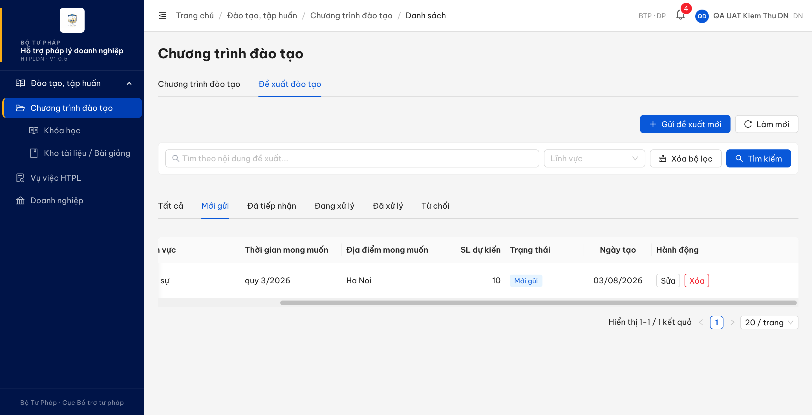

---

## ~~BUG-QLDXDTTH_13~~ [CLOSED] — Thông báo "Đề xuất đào tạo mới" dùng biểu tượng báo lỗi (X đỏ) thay vì biểu tượng thông tin

> **Re-test:** 2026-08-04 00:31 — ✅ PASS (Closed-verified). Chạy lại **đủ luồng 2 vai** trên gói giao diện `index-BrKDNUvo.js`: (a) đăng nhập `0109998887` (`QA UAT Kiem Thu DN` · **DN**) → gửi **đề xuất đào tạo MỚI** `QA-RETEST-0804 …` (lĩnh vực `Lao động`, trạng thái `Mới gửi`), thông báo thành công hiện đúng 1 lần; (b) đăng xuất sạch → đăng nhập `cbnv_hn` (`QA CB Nghiep vu Ha Noi` · **CB_NV_DP** · Sở Tư pháp Hà Nội) → bấm **biểu tượng chuông**; (c) dòng *"Đề xuất đào tạo mới — … 3 phút trước"* nay mang **biểu tượng chữ "i" trong vòng tròn xanh dương** (biểu tượng thông tin), **không còn** vòng tròn đỏ dấu X. Đo 2 cách khớp nhau: đọc lớp CSS + màu của biểu tượng bằng `evaluate_script` — dòng đề xuất là `anticon anticon-info-circle` màu `rgb(37, 99, 235)`, 3 dòng đối chứng cùng danh sách vẫn là `anticon anticon-check-circle` màu `rgb(5, 150, 105)` — **và** ảnh chụp màn hình. Dòng thông báo cũ (8 giờ trước) cũng đã đổi sang biểu tượng thông tin ⇒ **2/2 dòng đạt**, biểu tượng dựng lúc hiển thị nên bản ghi cũ cũng hưởng bản vá. [Ảnh hộp thông báo](image/QLDXDTTH_13-retest-2026-08-04-b-thong-bao-bieu-tuong-thong-tin.png) · [Ảnh bước gửi đề xuất mới](image/QLDXDTTH_13-retest-2026-08-04-a-DN-gui-de-xuat-moi.png)

### Mô tả

Khi doanh nghiệp gửi đề xuất đào tạo, cán bộ nghiệp vụ của đơn vị tiếp nhận nhận được thông báo trong ứng dụng — đúng yêu cầu. Nhưng dòng thông báo **"Đề xuất đào tạo mới"** được vẽ bằng **biểu tượng dấu X trong vòng tròn đỏ** (biểu tượng báo lỗi), trong khi các thông báo khác trong cùng danh sách dùng dấu tích xanh. Cán bộ dễ hiểu nhầm là hệ thống đang có sự cố thay vì có việc mới cần xử lý.

### Các bước tái hiện

1. **Đăng nhập role `DN` (tài khoản `0109998887`)** → gửi một đề xuất đào tạo.
2. Thoát phiên, **đăng nhập role `CB_NV_DP` (tài khoản `cbnv_hn`, quyền `R*` theo permission-matrix `srs-v3.5.md:1309`)** — đơn vị của tài khoản trùng đơn vị tiếp nhận của đề xuất.
3. Bấm biểu tượng chuông thông báo trên thanh đầu trang.
4. Quan sát biểu tượng bên trái dòng "Đề xuất đào tạo mới" và so với 4 dòng thông báo còn lại.

### Kết quả mong đợi

- `srs-fr-03-dao-tao.md:1053` (*"→ Thông báo CB NV"*) và `:1057` (*"CB NV nhận thông báo"*) yêu cầu hệ thống báo cho cán bộ biết có đề xuất mới. Đây là thông báo mang tính **thông tin / có việc mới**, nên cách trình bày phải cho người đọc hiểu đúng bản chất đó, không được trình bày như một sự cố hệ thống.

### Kết quả thực tế

- Dòng *"Đề xuất đào tạo mới — Có đề xuất đào tạo mới từ người dùng QA UAT Kiem Thu DN — 4 phút trước"* hiển thị vòng tròn đỏ có dấu X.
- Đọc lớp biểu tượng bằng mã: dòng này là `anticon anticon-close-circle`; 4 dòng còn lại trong cùng danh sách đều là `anticon anticon-check-circle`.
- Hai cách đo (ảnh chụp + đọc lớp biểu tượng) cho cùng kết quả.

### Bằng chứng

**1. Ảnh chụp**:

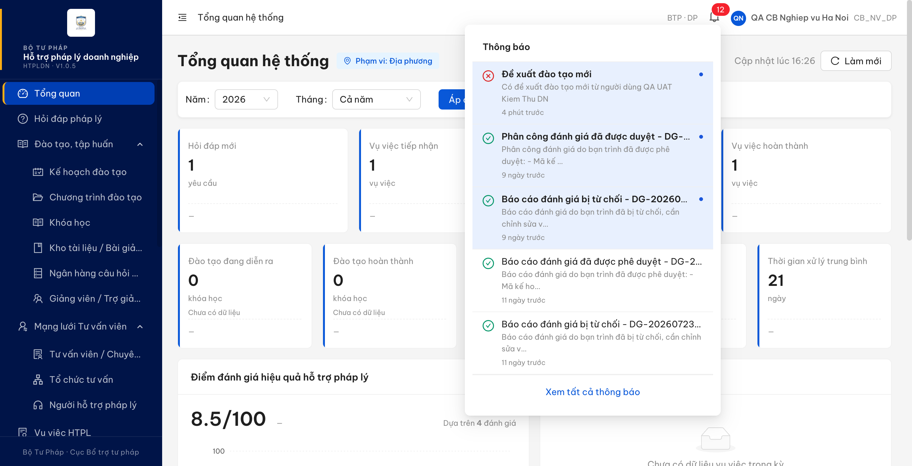

**2. Lớp biểu tượng đọc từ giao diện**:

```
Đề xuất đào tạo mới                       -> anticon anticon-close-circle   (X đỏ)
Phân công đánh giá đã được duyệt - DG-... -> anticon anticon-check-circle
Báo cáo đánh giá bị từ chối - DG-...      -> anticon anticon-check-circle
Báo cáo đánh giá đã được phê duyệt - ...  -> anticon anticon-check-circle
Báo cáo đánh giá bị từ chối - DG-...      -> anticon anticon-check-circle
```

## ~~BUG-QLLKHDTBD_09~~ [CLOSED] — Xuất Excel danh sách Kế hoạch đào tạo bỏ qua bộ lọc đang đặt, tệp luôn chứa toàn bộ danh sách

> **Re-test:** 2026-08-03 23:29 — ✅ PASS (Closed-verified). Chạy lại **đủ 3 phép đo** bằng `cbnv_tw_01` (CB_NV_TW, `BTP · TW`) trên gói giao diện `index-BrKDNUvo.js`, mỗi lần đều **mở tệp đếm số dòng dữ liệu** bằng `openpyxl` chứ không dừng ở "tải được tệp": Mốc 0 không lọc → màn **14** / tệp **14**; bộ lọc A `Từ ngày 01/07/2026`–`Đến ngày 31/07/2026` (địa chỉ trang đúng `…?tuNgay=2026-07-01&denNgay=2026-07-31&page=1`) → màn **1** / tệp **1**, đúng bản ghi `KH-20260803-0003`; bộ lọc B từ khoá `RECON` → màn **2** / tệp **2**, đúng 2 bản ghi có tên chứa `RECON`. Trước đây A ra 1 vs 13 và B ra 2 vs 13 — nay **số dòng trong tệp bằng đúng số bản ghi màn hình sau lọc ở cả 3 phép đo**. Tiền đề dữ liệu giữ nguyên như bug gốc (kho 14 kế hoạch, chỉ 1 nằm trong khoảng lọc). Toast "Xuất Excel thành công", 1 yêu cầu → 1 khung thông báo, không lặp. [Ảnh lọc A](image/QLLKHDTBD_09-retest-2026-08-04-locA-man-hinh-1-ket-qua.png) · [Ảnh lọc B](image/QLLKHDTBD_09-retest-2026-08-04-locB-man-hinh-2-ket-qua.png) · tệp: `../../fixtures/QLLKHDTBD_09/retest0804-*.xlsx`

### Mô tả

Ở màn `Đào tạo, tập huấn → Kế hoạch đào tạo → Danh sách`, Cán bộ nghiệp vụ đặt bộ lọc rồi bấm `Xuất Excel`. Danh sách trên màn thu hẹp đúng theo bộ lọc, nhưng **tệp `.xlsx` tải về vẫn chứa trọn danh sách** trong phạm vi quyền, không phải phần khớp bộ lọc. Đo trên 2 chiều lọc khác nhau (khoảng ngày và từ khoá tên kế hoạch) đều cho cùng kết quả: số dòng trong tệp luôn bằng tổng số bản ghi của kho, không bằng số hiển thị ở chân bảng.

Yêu cầu xuất tệp **có mang đủ tham số lọc** (`tuNgay`, `denNgay`, `keyword`), tức phần giao diện gửi đúng — sai lệch phát sinh ở bước dựng dữ liệu cho tệp.

> **Phạm vi có chủ ý:** entry này chỉ xét **số bản ghi trong tệp có khớp bộ lọc hay không**. Danh sách cột, thứ tự cột và định dạng bên trong tệp là vùng SRS không quy định → không nêu ở đây.

### Các bước tái hiện

1. Đăng nhập **`cbnv_tw`** — vai trò **CB Nghiệp vụ Trung ương (`CB_NV_TW`)**, đơn vị `BTP · TW` (đúng vai trò + cấp của đối tác trong video bằng chứng). Tài khoản có quyền `export_ke_hoach_dao_tao`.
2. Vào menu `Đào tạo, tập huấn` → `Kế hoạch đào tạo`. Ghi lại mốc đối chứng ở chân bảng khi **chưa lọc**.
3. **Tiền đề dữ liệu:** kho phải có ít nhất 1 kế hoạch **nằm trong** khoảng lọc và nhiều kế hoạch **nằm ngoài** — nếu không thì phép đo không phân biệt được. Trên môi trường test đã tạo `KH-20260803-0003` *"QA VERIFY QLLKHDTBD_09 - KHDT trong thang 7-2026"*, thời gian thực hiện `05/07/2026 – 25/07/2026` (bản ghi này vẫn còn trên môi trường để dev re-test).
4. **Bộ lọc A (đúng bộ lọc đối tác):** đặt `Từ ngày = 01/07/2026`, `Đến ngày = 31/07/2026`, ô tìm kiếm và `Năm kế hoạch` để trống, tab `Tất cả` → bấm `Tìm kiếm`. Địa chỉ trang phải thành `…/dao-tao/ke-hoach/danh-sach?tuNgay=2026-07-01&denNgay=2026-07-31&page=1`. Ghi số ở chân bảng.
5. Bấm `Xuất Excel` → **mở tệp ra đếm số dòng dữ liệu** (không dừng ở "tải được tệp") rồi so với số ở bước 4.
6. **Bộ lọc B (chiều lọc khác, để loại trừ trùng ngẫu nhiên):** bấm `Xóa bộ lọc`, nhập từ khoá `RECON` vào ô `Tìm theo tên hoặc mã kế hoạch` → `Tìm kiếm` (`…?keyword=RECON&page=1`) → `Xuất Excel` → mở tệp đếm dòng.

### Kết quả mong đợi

- `srs-fr-03-dao-tao.md:1752` (SCR-III-00, Thành phần 1): *"- Nút "Xuất Excel" (phụ): **xuất danh sách KH theo bộ lọc**, tối đa 10.000 dòng"* → tệp phải chỉ chứa các kế hoạch khớp bộ lọc đang đặt.
- `srs-fr-03-dao-tao.md:1147` (heading *"**Processing — Xuất Excel:**"*) và bước 2 tại `:1152`: *"| 2 | **Lấy danh sách theo filter**, tối đa 10.000 dòng | BR-DATA-06 |"* → ràng buộc bộ lọc nằm ngay trong luồng xử lý, không chỉ là mô tả giao diện.
- `srs-v3.5.md:5524` — BR-DATA-06, phạm vi *"Toàn bộ CRUD list"*: *"**Export Excel:** Mọi danh sách có tính năng xuất Excel. **File xuất theo bộ lọc hiện tại**, không vượt quá 10,000 rows/file"*.
- `srs-fr-03-dao-tao.md:2220` xác nhận BR-DATA-06 áp cho FR-III-14: *"| BR-DATA-06 | Export Excel | FR-III-01, FR-III-05, FR-III-06, **FR-III-14** |"*.

Nói gọn: **số dòng dữ liệu trong tệp phải bằng số bản ghi mà màn danh sách đang hiển thị sau lọc.**

### Kết quả thực tế

Bản dựng `HTPLDN · V1.0.5`, ngày 2026-08-03:

| # | Bộ lọc đặt trên màn | Chuỗi tham số của yêu cầu xuất | Trên màn | Trong tệp | Khớp? |
|:-:|---|---|:-:|:-:|:-:|
| 0 | Không lọc (mốc đối chứng) | `POST /api/v1/ke-hoach-dao-taos/export?page=1&pageSize=20` | **12** | **12** | ✅ |
| A | `Từ ngày 01/07/2026` + `Đến ngày 31/07/2026` | `…/export?tuNgay=2026-07-01&denNgay=2026-07-31&page=1&pageSize=20` | **1** | **13** | ❌ |
| B | Từ khoá tên kế hoạch `RECON` | `…/export?keyword=RECON&page=1&pageSize=20` | **2** | **13** | ❌ |

- Ở phép đo **A**, tệp chứa 13 dòng nhưng **chỉ 1 dòng** nằm trong khoảng `01/07/2026 – 31/07/2026`; 12 dòng còn lại nằm hoàn toàn ngoài khoảng (`01/09/2026–31/12/2026`, `01/01/2026–31/12/2026`, `01/11/2026–30/11/2026`, `01/03/2026–31/12/2026`…).
- Ở phép đo **B**, tệp chứa 13 dòng nhưng **chỉ 2 dòng** có tên chứa `RECON`.
- Con số **13** ở cả hai phép đo bằng đúng tổng số kế hoạch trong kho → tệp luôn lấy trọn danh sách, bất kể bộ lọc.
- Toast hiển thị *"Xuất Excel thành công"* ở cả hai lần (1 yêu cầu → 1 khung thông báo, không lặp).

**Đã đo lại bằng phương pháp thứ hai** (bug candidate ≠ bug): cùng tệp của phép đo A được đếm bằng (1) giải nén và đọc `xl/worksheets/sheet1.xml` ngay trong trình duyệt và (2) mở tệp đã tải về bằng `openpyxl` — **cùng ra 13 dòng dữ liệu**, không mâu thuẫn.

### Bằng chứng

| Nội dung | Đường dẫn |
|---|---|
| Baseline không lọc — 12 kết quả trên màn | 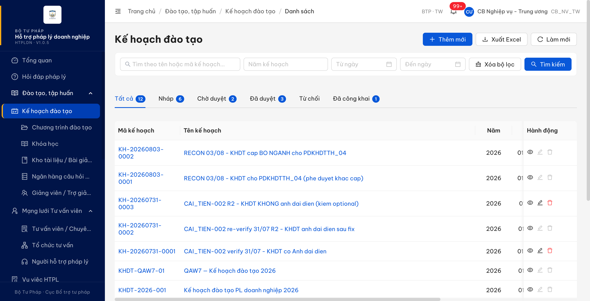 |
| Bộ lọc A `01/07/2026 – 31/07/2026` — chân bảng "Hiển thị 1-1 / 1 kết quả" | 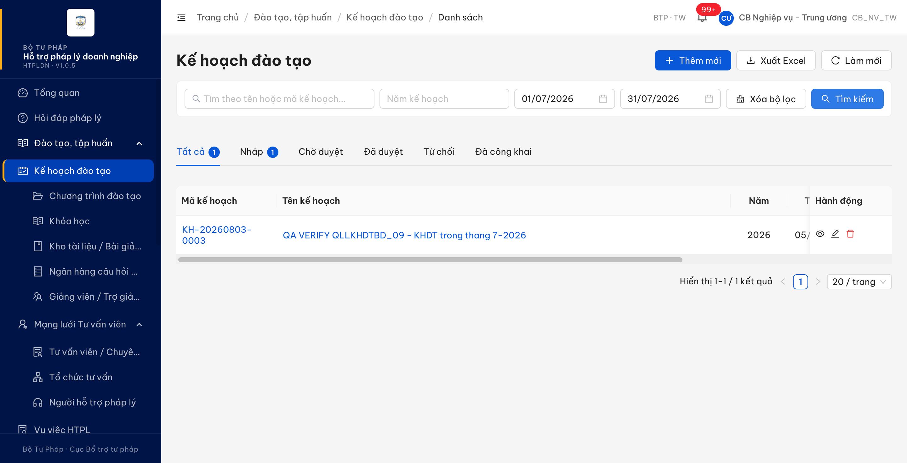 |
| Bộ lọc B từ khoá `RECON` — chân bảng "Hiển thị 1-2 / 2 kết quả" | 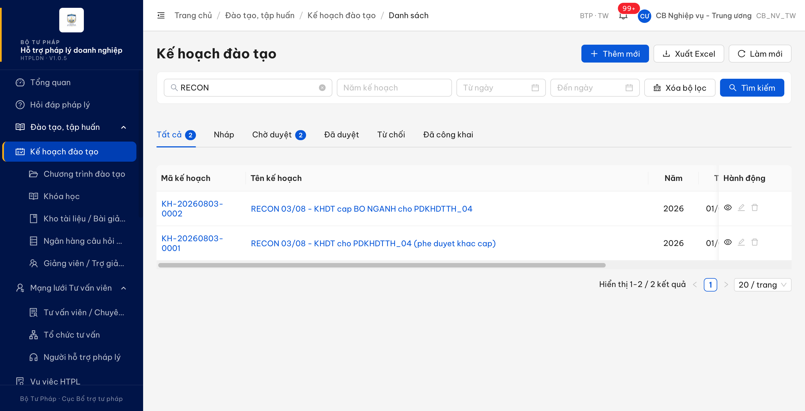 |
| Tệp Excel không lọc (12 dòng) | `../../fixtures/QLLKHDTBD_09/01-khong-loc-12-dong.xlsx` |
| Tệp Excel bộ lọc A (13 dòng) | `../../fixtures/QLLKHDTBD_09/02-loc-tungay-01.07-denngay-31.07.2026-man-1-file-13-dong.xlsx` |
| Tệp Excel bộ lọc B (13 dòng) | `../../fixtures/QLLKHDTBD_09/03-loc-tukhoa-RECON-man-2-file-13-dong.xlsx` |
| Ảnh seed dữ liệu tiền đề (form trước khi lưu · danh sách sau khi lưu) | `../../image/QLLKHDTBD_09-seed-form-truoc-luu.png` · `../../image/QLLKHDTBD_09-seed-sau-luu-13-ket-qua.png` |
| Video đối tác + frame lỗi (Excel 12 dòng trong khi màn 2 kết quả) | `../../partner-evidence/QLLKHDTBD_09.webm` · `../../frames/QLLKHDTBD_09/dense/t014.51s.jpg` |
| Bảng đối chiếu điều kiện (0 GAP) · Audit đầy đủ | `../../cond/QLLKHDTBD_09.md` · `../../reverify-audit/QLLKHDTBD_09.md` |

Nội dung tệp của phép đo A (đọc bằng `openpyxl`, sheet `Kế hoạch đào tạo`):

```
0  Mã KH            | Tên kế hoạch                                 | Từ ngày    | Đến ngày   | Trạng thái
1  KH-20260803-0003 | QA VERIFY QLLKHDTBD_09 - KHDT trong thang 7  | 05/07/2026 | 25/07/2026 | Nháp          ← DUY NHẤT khớp bộ lọc
2  KH-20260803-0002 | RECON 03/08 - KHDT cap BO NGANH …            | 01/09/2026 | 31/12/2026 | Chờ duyệt     ← ngoài khoảng
3  KH-20260803-0001 | RECON 03/08 - KHDT cho PDKHDTTH_04 …         | 01/09/2026 | 31/12/2026 | Chờ duyệt     ← ngoài khoảng
4  KH-20260731-0003 | CAI_TIEN-002 R2 - KHDT KHONG anh dai dien    | 01/11/2026 | 30/11/2026 | Nháp          ← ngoài khoảng
5  KH-20260731-0002 | CAI_TIEN-002 re-verify 31/07 R2 …            | 01/10/2026 | 31/10/2026 | Đã công khai  ← ngoài khoảng
6  KH-20260731-0001 | CAI_TIEN-002 verify 31/07 …                  | 01/09/2026 | 30/09/2026 | Nháp          ← ngoài khoảng
7  KHDT-QAW7-01     | QAW7 — Kế hoạch đào tạo 2026                 | 01/01/2026 | 31/12/2026 | Đã duyệt      ← ngoài khoảng
8  KHDT-2026-001    | Kế hoạch đào tạo PL doanh nghiệp 2026        | 01/01/2026 | 31/12/2026 | Đã duyệt      ← ngoài khoảng
9  KH-20260715-0002 | QA Reverify KH no budget 20260715 …          | 01/05/2026 | 30/11/2026 | Nháp          ← ngoài khoảng
10 KH-20260714-0001 | QA Reverify KH R2 devfix 20260714            | 01/03/2026 | 31/12/2026 | Nháp          ← ngoài khoảng
11 KH-20260712-0002 | QA Reverify KH file 20260712                 | 01/09/2026 | 30/09/2026 | Nháp          ← ngoài khoảng
12 KH-20260712-0001 | QA Re-verify KH 500 20260712                 | 01/08/2026 | 31/08/2026 | Nháp          ← ngoài khoảng
13 KHDT-SEED-0001   | Kế hoạch đào tạo seed 2026                   | 01/01/2026 | 31/12/2026 | Đã duyệt      ← ngoài khoảng
```

---

---

## ~~BUG-QLLKHDTBD_50~~ [CLOSED] — Bảng danh sách Kế hoạch đào tạo thiếu 4 cột đặc tả quy định, ngân sách hiển thị số thô

> **Re-test:** 2026-08-03 23:36 — ✅ PASS (Closed-verified). Đo bằng `cbnv_tw_01` (CB_NV_TW, `BTP · TW`) trên gói giao diện `index-BrKDNUvo.js`, **2 cách khớp nhau**: (1) liệt kê toàn bộ tiêu đề cột trong mã trang → đúng **12 cột** (trước là 8), không cột nào bị ẩn; (2) cuộn ngang **hết cỡ sang phải** rồi chụp lại + chụp ở vị trí trái → đọc bằng mắt ra đúng 12 tiêu đề đó. **Đủ cả 4 cột trước đây thiếu**: ô **tích chọn dòng** (có cả ô "chọn tất cả" ở tiêu đề và ô tích ở từng dòng) · **Số chương trình** · **Người tạo** · **Ngày tạo**. Cột `Ngân sách (VNĐ)` nay hiển thị **định dạng dấu chấm** — `100.000.000 đ` / `1.000.000 đ` / `2.000.000 đ`, kế hoạch không có ngân sách hiện `—`, hết số thô `100000000.00`. Đối chiếu màn **Chi tiết** cùng bản ghi `KH-20260803-0001`: `100.000.000 VNĐ` → nhất quán với màn Danh sách. [Ảnh cuộn hết phải](image/QLLKHDTBD_50-retest-2026-08-04-cuon-het-phai-du-12-cot.png) · [Ảnh ô tích chọn + định dạng ngân sách](image/QLLKHDTBD_50-retest-2026-08-04-co-o-tich-chon-va-ngan-sach-dinh-dang.png)

### Mô tả

Ở màn `Đào tạo, tập huấn → Kế hoạch đào tạo → Danh sách`, bảng danh sách chỉ dựng **8 cột**: `Mã kế hoạch · Tên kế hoạch · Năm · Từ ngày · Đến ngày · Ngân sách (VNĐ) · Trạng thái · Hành động`. So với bảng cột mà `SCR-III-00` Thành phần 3 quy định, bảng **thiếu 4 cột**: ô **tích chọn dòng**, **Số chương trình**, **Người tạo**, **Ngày tạo**. Ngoài ra cột ngân sách hiển thị số thô `100000000.00` thay vì định dạng dấu chấm mà cùng dòng đặc tả yêu cầu — trong khi màn **Chi tiết** của chính bản ghi đó lại hiển thị đúng `100.000.000 VNĐ`, tức hai màn không nhất quán.

Hệ quả nghiệp vụ trực tiếp: thiếu cột **"Người tạo"** là lý do người dùng **không đọc được kế hoạch thuộc đơn vị nào ngay trên màn danh sách** — đây chính là điểm vướng khi kiểm case `PDKHDTTH_04`. Thiếu ô **tích chọn dòng** thì không có đường vào cho thao tác hàng loạt.

### Các bước tái hiện

1. Đăng nhập vai trò **CB Nghiệp vụ Trung ương** (`CB_NV_TW`, đơn vị Cục Bổ trợ tư pháp · TW) — vai trò được `FR-III-14` cho phép thao tác trên màn Kế hoạch đào tạo.
2. Vào menu `Đào tạo, tập huấn` → `Kế hoạch đào tạo` → thẻ `Danh sách`.
3. Đọc dãy tiêu đề cột của bảng.
4. **Cuộn ngang hết cỡ sang phải** để loại trừ khả năng cột bị khuất, rồi chụp lại.
5. Đọc giá trị ô cột `Ngân sách` của một kế hoạch có ngân sách (vd `KHDT-QAW7-01`).
6. Mở màn **Chi tiết** của chính kế hoạch đó, đọc lại giá trị ngân sách để đối chiếu.

### Kết quả mong đợi

- Theo `srs-fr-03-dao-tao.md:1761` (`SCR-III-00` — **Thành phần 3 — Bảng kế hoạch**), bảng phải có các cột: `Chọn dòng` (`:1765` — *"hộp tích chọn nhiều bản ghi"*) · `Tên kế hoạch` · `Năm` · `Thời gian` · `Ngân sách dự kiến` · `Số chương trình` (`:1770` — *"COUNT CTDT thuộc kế hoạch năm"*) · `Trạng thái` · `Người tạo` (`:1772` — *"Họ tên cán bộ tạo"*) · `Ngày tạo` (`:1773` — *"dd/mm/yyyy"*) · `Hành động`.
- Theo `srs-fr-03-dao-tao.md:1769`, cột ngân sách phải theo **"Định dạng dấu chấm (vd \"500.000.000 đ\"); rỗng → \"—\""** ⇒ số thô `100000000.00` không đạt.
- Giá trị ngân sách hiển thị ở màn Danh sách và màn Chi tiết của cùng một bản ghi phải nhất quán.

### Kết quả thực tế

- Bảng chỉ có **8 cột**: `Mã kế hoạch · Tên kế hoạch · Năm · Từ ngày · Đến ngày · Ngân sách (VNĐ) · Trạng thái · Hành động`.
- Kiểm **2 cách đều khớp**: (1) liệt kê toàn bộ `th` trong mã trang → đúng 8 phần tử, không có cột ẩn; (2) ảnh chụp sau khi đã cuộn ngang hết sang phải → đúng 8 tiêu đề ⇒ không phải cột bị khuất.
- 4 cột đặc tả quy định **không tồn tại**: ô tích chọn dòng · Số chương trình · Người tạo · Ngày tạo.
- Cột `Ngân sách (VNĐ)` hiển thị `100000000.00`; màn Chi tiết cùng bản ghi hiển thị `100.000.000 VNĐ`.

### Bằng chứng

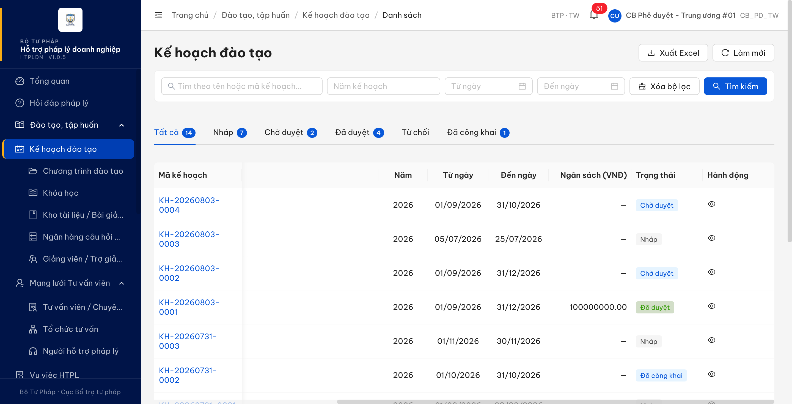

**Nguồn phát hiện**: [`../../reverify-audit/PDKHDTTH_04.md`](../../reverify-audit/PDKHDTTH_04.md) §phát hiện ngoài phạm vi, mục 1.

*(Không trùng row 31 `QLLKHDTBD_02` — dòng đó phản ánh lỗi "Lỗi hệ thống" khi tải danh sách, đã `Verify = Pass`, không đụng tới chuyện thiếu cột.)*

---

## ~~BUG-KTDGKQHT_20~~ [CLOSED] — Tỷ lệ chuyên cần lấy mẫu số là số buổi ĐÃ điểm danh, không phải tổng số buổi của khóa

> **Re-test:** 2026-08-04 00:17 — ✅ PASS (Closed-verified). Vì đây là **giá trị lưu trong CSDL**, phép thử quyết định được chạy trên **dữ liệu chuyên cần dựng mới hoàn toàn qua giao diện**, bằng `cbnv_tw_01` (CB_NV_TW, `BTP · TW`, `donViId …-8000-000000000001`) trên gói giao diện `index-BrKDNUvo.js`: chọn khóa `KH-20260730-001` **chưa từng điểm danh lần nào** (chụp lại tab "Kết quả" TRƯỚC khi thao tác — cột "Chuyên cần" của cả 3 học viên đều `—`), thêm **3 buổi** vào tab Lịch học, Khai giảng để khóa sang **Đang diễn ra**, rồi **chỉ điểm danh 1 buổi** (HV1 `Vắng có phép` · HV2 `Có mặt` · HV3 `Vắng không phép`, cố ý bỏ trống 2 buổi còn lại). Kết quả: mẫu số nay là **tổng số buổi của khóa (3)**, không còn là số buổi đã điểm danh (1) — HV1 `0/3 (33.33%)` · HV2 `1/3 (33.33%)` · HV3 `0/3 (0.00%)`, đúng **BR-KQ-02** (`srs-fr-03-dao-tao.md:2251`) cả về mẫu số lẫn việc `Vắng có phép` vẫn được tính vào tử số. Đo **2 cách khớp nhau**: (1) đọc ô "Chuyên cần" trên tab Kết quả + ảnh chụp toàn cỡ; (2) bấm **Xuất DOCX** rồi **mở đọc nội dung tệp** — cột `Tổng số buổi` = **3** ở cả 3 dòng, `Tỉ lệ chuyên cần (%)` = **33.33 / 33.33 / 0.00**, trùng khít màn hình (trước đây tệp ghi `Tổng số buổi` = 1 và `100.00`). **Bản ghi cũ giữ giá trị cũ, không dùng làm căn cứ:** khóa `KH-QAW7-HOINGHI` đo trong cùng phiên vẫn hiện `0/1 (100.00%)` / `1/1 (100.00%)` — đúng như dev đã lưu ý, khóa cũ chỉ tự đúng khi có lần điểm danh kế tiếp. [Ảnh trước khi điểm danh](image/KTDGKQHT_20-retest-2026-08-04-truoc-diem-danh-chuyen-can-trong.png) · [Ảnh điểm danh 1/3 buổi](image/KTDGKQHT_20-retest-2026-08-04-diem-danh-1-trong-3-buoi.png) · [Ảnh chuyên cần mẫu số 3](image/KTDGKQHT_20-retest-2026-08-04-chuyen-can-mau-so-3-buoi.png)

### Mô tả

Ở màn `Đào tạo, tập huấn → Khóa học → {khóa} → tab "Kết quả"`, ô **"Chuyên cần"** của học viên được tính với **mẫu số = số buổi đã điểm danh**, thay vì **tổng số buổi của khóa** như quy tắc nghiệp vụ quy định. Khóa có **3 buổi** nhưng mới điểm danh **1 buổi** thì học viên "Có mặt" buổi đó hiển thị `1/1 (100.00%)` — trong khi giá trị đúng phải là `1/3 (33.33%)`.

Đây không phải lỗi trình bày: tỷ lệ chuyên cần là **một trong hai điều kiện AND cứng** để chốt học viên Đạt / Không đạt khóa học, đối chiếu với ngưỡng mặc định 80%. Với cách tính hiện tại, học viên mới đi 1/3 buổi vẫn vượt ngưỡng ⇒ **kết luận Đạt/Không đạt sai** ngay khi khóa chưa điểm danh xong. Lỗi lan sang cả tệp DOCX xuất ra.

### Các bước tái hiện

1. Đăng nhập vai trò **CB Nghiệp vụ Trung ương** (`CB_NV_TW`, đơn vị Cục Bổ trợ tư pháp · TW) — vai trò được `FR-III-05` (`srs-fr-03-dao-tao.md:523`) cho phép nhập kết quả.
2. Vào `Đào tạo, tập huấn` → `Khóa học` → mở khóa `KH-QAW7-HOINGHI` (trạng thái **Đang diễn ra**, 2 học viên).
3. Tab **"Lịch học"**: bảo đảm khóa có **3 buổi**.
4. Tab **"Điểm danh"**: chọn **1 buổi** (buổi 1), điểm danh học viên 1 = **"Vắng có phép"**, học viên 2 = **"Có mặt"**. **Cố ý KHÔNG điểm danh 2 buổi còn lại.**
5. Sang tab **"Kết quả"**, đọc ô **"Chuyên cần"** của cả 2 học viên.
6. Bấm xuất tệp kết quả (DOCX), mở tệp và đọc cột "Tổng số buổi" + "Tỉ lệ chuyên cần (%)".

### Kết quả mong đợi

- Theo `srs-fr-03-dao-tao.md:2251` (`BR-KQ-02`, điều kiện 1): *"`ty_le_chuyen_can` = (số buổi Có mặt + số buổi Vắng có phép) / **tổng số buổi** × 100"* ⇒ mẫu số là **tổng số buổi của khóa** (3), không phải số buổi đã điểm danh (1).
- Với dữ liệu ở bước 4, cả 2 học viên phải là **1/3 = 33.33%** (Vắng có phép vẫn được tính vào tử số theo chính dòng này).
- Theo `srs-fr-03-dao-tao.md:2246` + `:132`, tỷ lệ này được đem so với `KHOA_HOC.ty_le_chuyen_can_toi_thieu` (mặc định 80%) để chốt `ket_qua` ⇒ sai mẫu số là sai kết luận Đạt/Không đạt, không chỉ sai con số hiển thị.
- Giá trị trong tệp DOCX xuất ra phải trùng giá trị trên màn hình và phải theo cùng công thức.

### Kết quả thực tế

Đo bằng **3 phương pháp độc lập, cùng một kết luận**:

| # | Phương pháp | Kết quả đo |
|:-:|---|---|
| 1 | Đọc ô "Chuyên cần" trên tab Kết quả | HV1 `0/1 (100.00%)` · HV2 `1/1 (100.00%)` |
| 2 | Mở đọc nội dung tệp DOCX xuất ra | cột "Tổng số buổi" = **1** · "Tỉ lệ chuyên cần (%)" = **100.00** |
| 3 | Dữ liệu máy chủ trả về cho màn hình | `tongBuoi = 1`, trong khi danh sách lịch học của chính khóa đó trả về **3 buổi** |

- Giá trị đúng theo `BR-KQ-02` phải là **33.33%** cho cả 2 học viên; hệ thống cho **100%**.
- Mẫu số bám theo **số buổi đã điểm danh**, nên tỷ lệ chuyên cần của một khóa đang diễn ra luôn bị đội lên và chỉ tiệm cận giá trị đúng khi đã điểm danh đủ mọi buổi.
- Ngưỡng đạt mặc định là 80% ⇒ với dữ liệu trên, cả 2 học viên đều bị xếp là **đủ điều kiện chuyên cần** trong khi thực tế mới đi 1/3 buổi.

### Bằng chứng

| Nội dung | Đường dẫn |
|---|---|
| Bảng đối chiếu điều kiện (0 GAP) — nêu đủ 3 phép đo độc lập | [`../../cond/KTDGKQHT_20.md`](../../cond/KTDGKQHT_20.md) |
| Audit + phản hồi dev nguyên văn (dev **công nhận đây là bug thật**, cảnh báo là **giá trị lưu trong CSDL**) | [`../../reverify-audit/KTDGKQHT_20.md`](../../reverify-audit/KTDGKQHT_20.md) |
| Nguồn phát hiện (khi verify `KTDGKQHT_02`) | [`../../reverify-audit/KTDGKQHT_02.md`](../../reverify-audit/KTDGKQHT_02.md) |

> **⚠️ Lưu ý bắt buộc khi re-test:** đây là **giá trị lưu trong CSDL**, không phải tính lại lúc hiển thị. Bản ghi tạo **trước** bản vá vẫn giữ giá trị cũ ⇒ re-test trên khóa `KH-QAW7-HOINGHI` cũ sẽ ra kết luận Reopen oan. Phải **dựng khóa MỚI**, thêm nhiều buổi, điểm danh một phần rồi mới đo.

---

## ~~BUG-KTDGKQHT_21~~ [CLOSED] — Tab "Kết quả" của màn chi tiết khóa học không có cột "Đề kiểm tra", kể cả khi khóa đã gán đề

> **Re-test:** 2026-08-04 00:06 — ✅ PASS (Closed-verified). Chạy lại bằng `cbnv_tw_01` (CB_NV_TW, `BTP · TW`, `donViId …-8000-000000000001`) trên gói giao diện `index-BrKDNUvo.js`, lặp **đủ 4 tình huống** như lúc phát hiện lỗi: bảng nay có **11 cột** và **cột "Đề kiểm tra" xuất hiện ở cả 4 tình huống** (trước là 10 cột, không có). Quan trọng hơn, cột hiển thị **đúng tên đề theo từng dòng điểm** chứ không rỗng: `KH-QAW7-HOINGHI` (Đang diễn ra, đã gán đề + đã lưu điểm 9.0/4.0) → cả 2 dòng hiện `QA-DEKT-0803 — Đề kiểm tra pháp lý DN (QA seed 03/08)`. Cột bám theo **từng bản ghi điểm** chứ không phải theo khóa: `AAA-KH-TW` tuy đã gán chính đề đó nhưng 4 dòng điểm cũ (nhập trước khi gán) vẫn hiện `—`; 2 khóa **chưa** gán đề (`DDD-KH-011` Đang diễn ra · `KH-2026-001` Hoàn thành) cũng có cột và hiện `—`. Đo **2 cách khớp nhau**: (1) đọc `thead th` + `colgroup col` = 11/11, không phần tử nào `display:none` hay `offsetWidth = 0`; (2) cuộn ngang hết cỡ sang phải rồi chụp ảnh toàn cỡ, đọc bằng mắt ra đúng dãy `STT · Họ tên · Email · Số điện thoại · Đơn vị · Đề kiểm tra · Chuyên cần · Điểm kiểm tra · Kết quả · Xếp loại · Ghi chú`. **Ghi nhận kèm (ngoài phạm vi lỗi này):** ô "Đề kiểm tra" vẫn là ô chỉ-đọc — trong tab "Kết quả" không có chỗ cho cán bộ chọn điểm thuộc đề nào, nên khi một khóa gán từ 2 đề trở lên thì chưa rõ hệ thống gắn điểm vào đề nào (`:550`). Cột "Chuyên cần" thừa so với đặc tả vẫn **cố ý** để ngoài phạm vi (chờ BA ở dòng 116 `KTDGKQHT_02`). [Ảnh (d) hiện đúng tên đề](image/KTDGKQHT_21-retest-2026-08-04-d-QAW7-cot-de-kiem-tra-hien-dung-ten-de.png) · [Ảnh (c) AAA-KH-TW](image/KTDGKQHT_21-retest-2026-08-04-c-AAA-KH-TW-co-cot-de-kiem-tra.png) · [Ảnh (b) chưa gán đề](image/KTDGKQHT_21-retest-2026-08-04-b-KH-2026-001-chua-gan-de-van-co-cot.png) · [Ảnh (a) chưa gán đề](image/KTDGKQHT_21-retest-2026-08-04-a-DDD-KH-011-chua-gan-de-van-co-cot.png)

### Mô tả

Ở màn `Đào tạo, tập huấn → Khóa học → {khóa} → tab "Kết quả"`, bảng học viên chỉ dựng **10 cột**: `STT · Họ tên · Email · Số điện thoại · Đơn vị · Chuyên cần · Điểm kiểm tra · Kết quả · Xếp loại · Ghi chú`. **Không có cột "Đề kiểm tra"** mà `SCR-III-02` Tab 5 (`srs-fr-03-dao-tao.md:1901`) liệt kê, nên cán bộ nghiệp vụ nhập/soát điểm không biết điểm đang chấm thuộc đề nào. Điều này có hệ quả nghiệp vụ thật vì ngưỡng "điểm đạt" dùng để suy ra `Kết quả (Đạt/Không đạt)` được lấy **theo từng đề** (`DE_KIEM_TRA.diem_dat`, BR-KQ-02 `:2246`), và bảng Inputs của chính FR-III-05 (`:550`) quy định `de_kiem_tra_id` là trường **bắt buộc khi nhập điểm kiểm tra**.

Lần đo trước (17:00 cùng ngày) đã cố ý **chưa log** vì cả 3 khóa mở ra đều chưa gán đề kiểm tra nào, nên chưa loại trừ được khả năng "cột chỉ render khi khóa có đề". Vòng này đã đóng đúng khoảng trống đó.

### Các bước tái hiện

1. Đăng nhập **`cbnv_tw_05`** — vai trò **CB Nghiệp vụ Trung ương (`CB_NV_TW`)**, đơn vị `Cục Bổ trợ tư pháp` (`donViId 00000000-0000-4000-8000-000000000001`). Đây là vai trò được `FR-III-05` (`:523` — *"Tác nhân: CB NV / CB PD"*) cho phép nhập kết quả. (`cbnv_tw` bị phiên QA khác đăng nhập chiếm giữa chừng → fallback đúng Rule 7: cùng vai trò, cùng đơn vị.)
2. Vào `Đào tạo, tập huấn` → `Ngân hàng câu hỏi & Đề kiểm tra` → thẻ `Đề kiểm tra`. Hệ thống đang có **0 đề** → bấm `Tạo đề kiểm tra`, cách tạo `Thủ công`, chọn 1 câu hỏi từ ngân hàng, `Thời gian làm bài = 30`, `Điểm đạt = 5.0` → `Thêm mới` → bấm nút kích hoạt. Đề `QA-DEKT-0803 — Đề kiểm tra pháp lý DN (QA seed 03/08)` chuyển trạng thái **Kích hoạt**.
3. Vào `Đào tạo, tập huấn` → `Khóa học` → mở `KH-QAW7-HOINGHI` (Đang diễn ra) → tab `Đề kiểm tra` → `Gán đề kiểm tra` → chọn đề vừa tạo → `Gán`.
4. Sang tab `Kết quả`, nhập điểm `9.0` và `4.0` cho 2 học viên → `Lưu kết quả`.
5. Tải lại trang **bỏ bộ nhớ đệm**, mở lại tab `Kết quả`, đọc dãy tiêu đề cột và **cuộn ngang hết cỡ sang phải**.
6. Lặp bước 3 và 5 trên khóa `AAA-KH-TW` (Hoàn thành, 4 học viên đã duyệt kết quả) để kiểm ở trạng thái khóa khác.

### Kết quả mong đợi

- `srs-fr-03-dao-tao.md:1901` (SCR-III-02 — Tab 5 "Kết quả kiểm tra"): *"Cột STT · **Họ tên** · **Email** · **Số điện thoại** · **Đơn vị** · Đề kiểm tra · Điểm · Xếp loại (Giỏi/Khá/Trung bình/Không đạt — auto BR-KQ-01) · Kết quả (Đạt/Không đạt — auto BR-KQ-02) · Ghi chú."* ⇒ bảng phải có cột cho biết **đề kiểm tra** ứng với điểm.
- `srs-fr-03-dao-tao.md:550` (FR-III-05 §Inputs, trường 7 `de_kiem_tra_id`): *"FK → DE_KIEM_TRA — đề kiểm tra ứng với điểm. **Bắt buộc khi nhập điểm kiểm tra**… Phải thuộc `KHOA_HOC_DE_KIEM_TRA` của khóa"* ⇒ đề kiểm tra là thông tin gắn liền với mỗi dòng điểm, không phải thông tin cấp khóa.
- `srs-fr-03-dao-tao.md:2246` (BR-KQ-02): `ket_qua = DAT` cần `diem_kiem_tra ≥ DE_KIEM_TRA.diem_dat` ⇒ không nhìn thấy đề thì không kiểm chứng được vì sao một điểm ra Đạt / Không đạt.

### Kết quả thực tế

Bảng chỉ có **10 cột**, **không có** cột "Đề kiểm tra", ở **cả 4 tình huống** đo trên cùng bản dựng `V1.0.5` / gói `index-RAuQ-eDH.js`:

| # | Tình huống | Khóa học · trạng thái | Số cột | Có cột "Đề kiểm tra"? |
|:-:|---|---|:-:|:-:|
| a | Khóa **chưa** gán đề | `KH-QAW7-HOINGHI` · Đang diễn ra | 10 | ❌ Không |
| b | Khóa **chưa** gán đề | `AAA-KH-TW` · Hoàn thành | 10 | ❌ Không |
| c | Khóa **đã** gán đề `QA-DEKT-0803` | `AAA-KH-TW` · Hoàn thành | 10 | ❌ Không |
| d | Khóa **đã** gán đề **và** bản ghi kết quả đã trỏ tới đề | `KH-QAW7-HOINGHI` · Đang diễn ra | 10 | ❌ Không |

- **Loại trừ cột bị ẩn / bị che:** đọc mã trang thấy `thead th` = 10 phần tử, `colgroup col` = 10, không phần tử nào `display:none` hay `offsetWidth = 0`. Bảng **có** thanh cuộn ngang (`scrollWidth 1315` vs `clientWidth 1128`) nên đã cuộn hết cỡ sang phải rồi chụp ảnh đọc lại bằng mắt — nhóm cột cuối là `… Chuyên cần · Điểm kiểm tra · Kết quả · Xếp loại · Ghi chú`.
- **Dữ liệu đề kiểm tra ĐÃ sẵn sàng cho giao diện** (nên đây là lỗi dựng cột, không phải thiếu dữ liệu): sau bước 4, `GET /api/v1/khoa-hocs/a7480002-0000-4000-8000-000000000002/ket-quas` trả về cho cả 2 học viên `"tenDeKiemTra": "QA-DEKT-0803 — Đề kiểm tra pháp lý DN (QA seed 03/08)"`.
- **Đối chứng dương tính trên cùng bản dựng, cùng khóa học:** tab `Công bố kết quả` **CÓ** cột "Đề kiểm tra" và hiển thị đúng tên đề đó ⇒ thành phần bảng và dữ liệu đều hoạt động, chỉ riêng tab "Kết quả" không có cột.
- **Không có ô nhập/chọn đề** ở tab "Kết quả": khóa có nhiều đề thì cán bộ không có cách nào chỉ định điểm thuộc đề nào (`:550` yêu cầu trường này bắt buộc khi nhập điểm).

**Cố ý loại khỏi phạm vi lỗi này:** cột **"Chuyên cần"** mà bản dựng thêm vào tab (SRS `:1901` không liệt kê) — việc gộp `số buổi có mặt / tổng buổi (tỷ lệ %)` vào một ô đang là **câu hỏi chờ BA** ở dòng 116 `KTDGKQHT_02`, không log trùng ở đây.

### Bằng chứng

| Nội dung | Đường dẫn |
|---|---|
| Seed 1 — form tạo đề kiểm tra trước khi lưu (Thủ công · 30 phút · điểm đạt 5.0 · 1 câu hỏi) | 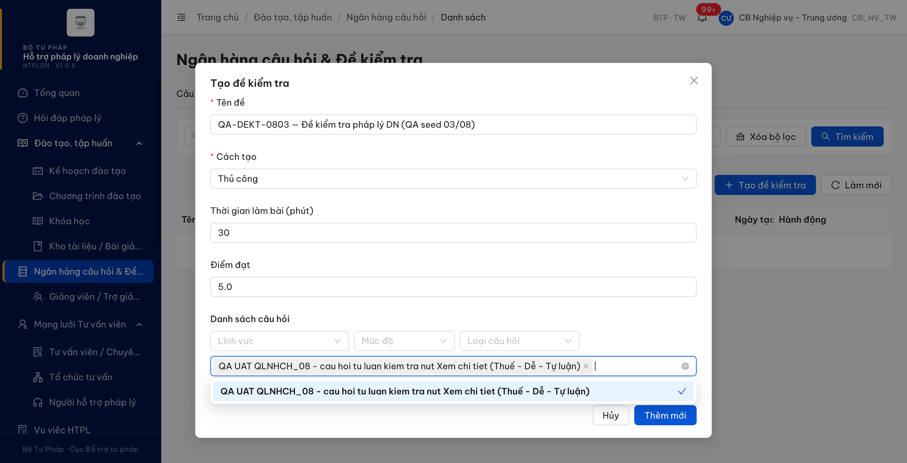 |
| Seed 2 — đề `QA-DEKT-0803` sau khi kích hoạt (trạng thái **Kích hoạt**) | 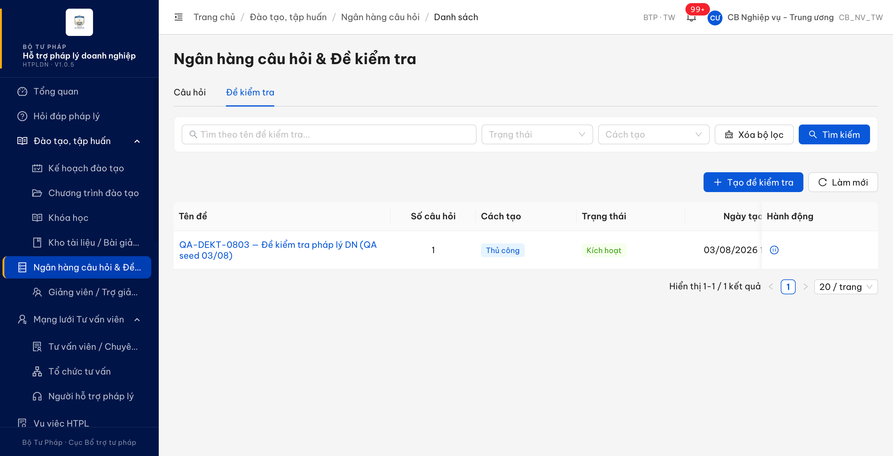 |
| Seed 3 — hộp thoại "Gán đề kiểm tra vào khóa học", danh sách chỉ liệt kê đề Kích hoạt | 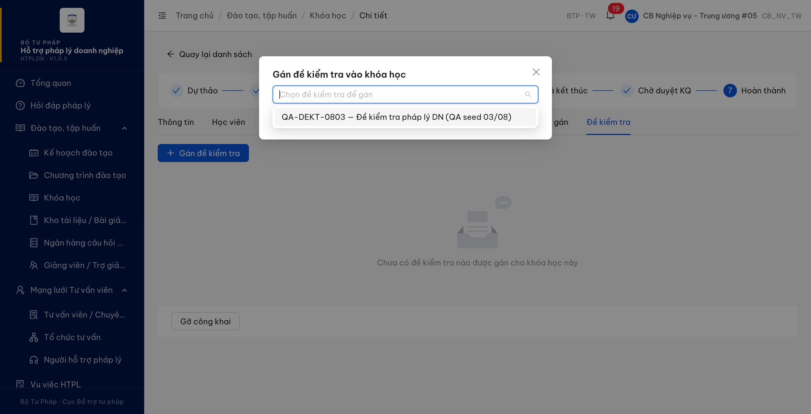 |
| Seed 4 — `AAA-KH-TW` sau khi gán đề (tab "Đề kiểm tra", mốc 03/08/2026 20:04) |  |
| Seed 5 — `KH-QAW7-HOINGHI` tab "Kết quả" trước khi bấm Lưu (đã gõ 9.0 / 4.0) | 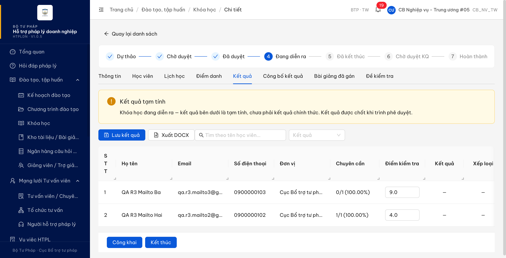 |
| **Đối chứng (a)** — tab "Kết quả" khóa **CHƯA** gán đề: 10 cột | 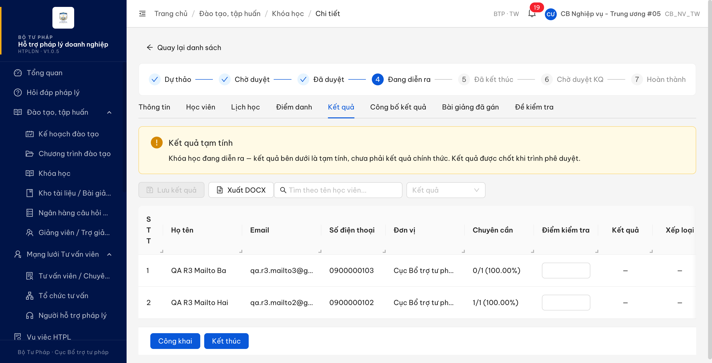 |
| **Lỗi (c)** — `AAA-KH-TW` **ĐÃ** gán đề, cuộn ngang hết cỡ: vẫn không có cột "Đề kiểm tra" | 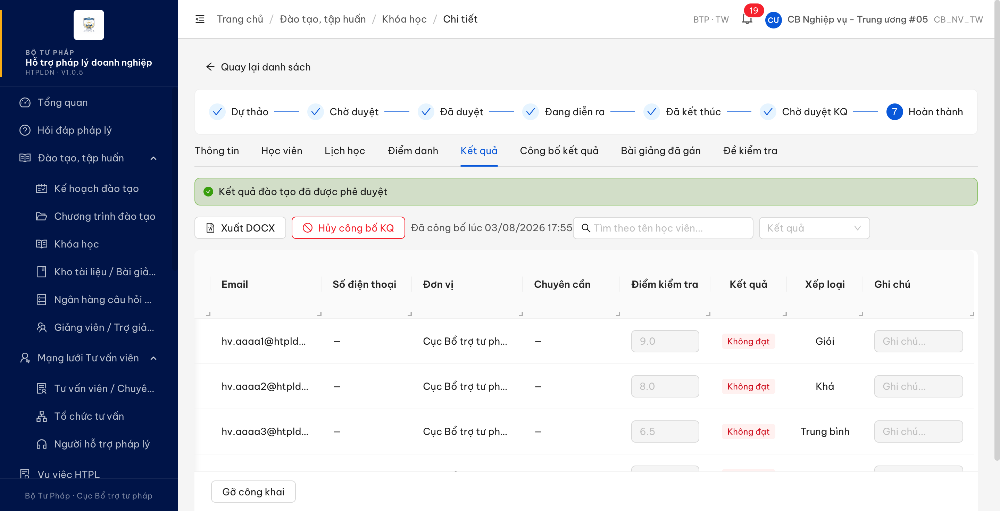 |
| **Lỗi (d)** — `KH-QAW7-HOINGHI` đã gán đề **và** đã lưu điểm: vẫn không có cột (điểm 9.0 → Đạt/Giỏi, 4.0 → Không đạt) | 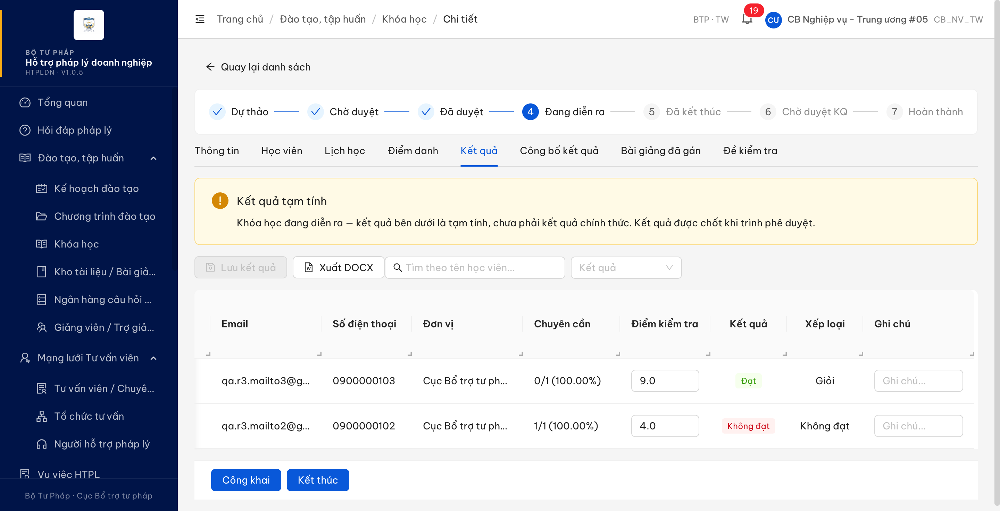 |
| **Đối chứng dương tính** — tab "Công bố kết quả" cùng khóa CÓ cột "Đề kiểm tra" kèm đúng tên đề | 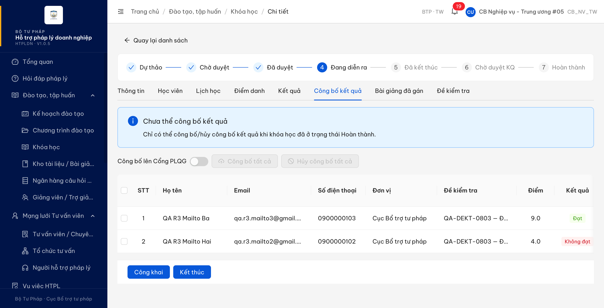 |
| Bảng đối chiếu điều kiện (0 GAP) · Audit đầy đủ | `../../cond/KTDGKQHT_21.md` · `../../reverify-audit/seed-de-kiem-tra-2026-08-03.md` |

Đo thông báo bằng `tools/toast-capture.js` (tự kiểm `soObserverDangSong = 1` trước mỗi thao tác) — **không** phát hiện lỗi thông báo lặp ở luồng seed:

| Thao tác | Request | Khung thông báo | Nội dung |
|---|:-:|:-:|---|
| Tạo đề kiểm tra | 1 — `POST /api/v1/de-kiem-tras` | 1 | "Tạo đề kiểm tra thành công" |
| Kích hoạt đề | 1 — `POST /api/v1/de-kiem-tras/{id}/kich-hoat` | 1 | "Đã kích hoạt đề kiểm tra" |
| Gán đề vào `AAA-KH-TW` | 1 — `POST /api/v1/khoa-hocs/{id}/de-kiem-tras/{deId}` | 1 | "Đã gán đề kiểm tra" |
| Gán đề vào `KH-QAW7-HOINGHI` | 1 — `POST /api/v1/khoa-hocs/{id}/de-kiem-tras/{deId}` | 1 | "Đã gán đề kiểm tra" |
| Lưu điểm (2 học viên) | 1 — `POST /api/v1/khoa-hocs/{id}/ket-quas/batch-update` | 1 | "Đã lưu kết quả" |

---

## ~~BUG-KTDGKQHT_22~~ [CLOSED] — Tab "Đề kiểm tra" của màn chi tiết khóa học thiếu 4 cột và không có thao tác "Xem chi tiết"

> **Re-test:** 2026-08-03 23:56 — ✅ PASS (Closed-verified). Chạy lại bằng `cbnv_tw_01` (CB_NV_TW, `BTP · TW`, `donViId …-8000-000000000001`) trên gói giao diện `index-BrKDNUvo.js`, trên đúng tiền đề của lỗi gốc: khóa `AAA-KH-TW` (Hoàn thành) vẫn đang gán đề `QA-DEKT-0803`. Bảng tab "Đề kiểm tra" nay có **9 cột**, **đủ cả 4 cột trước đây thiếu**: `STT` (giá trị 1) · `Mã đề` (`DKT-000001`) · `Lĩnh vực` (`Thuế`) · `Người thêm` (`CB Nghiệp vụ - Trung ương #05`), bên cạnh `Tên đề · Số câu hỏi · Trạng thái · Thời điểm thêm · Hành động`. Cột `Hành động` nay có **2 thao tác**: xem chi tiết (biểu tượng con mắt) + gỡ khỏi khóa; **bấm thật vào "Xem chi tiết"** → mở đúng màn chi tiết của đề `QA-DEKT-0803` (Cách tạo `Thủ công` · Số câu hỏi `1` · Thời gian làm bài `30 phút` · Điểm đạt `5` · Trạng thái `Kích hoạt` · Ngày tạo `03/08/2026`) ⇒ thao tác dùng được, không phải nút chết. Đo **2 cách khớp nhau**: (1) đọc dãy `th` trong mã trang → 9 tiêu đề, `colgroup col` = 9, không phần tử nào `display:none` / `offsetWidth = 0`; (2) ảnh chụp toàn cỡ đọc bằng mắt ra đúng 9 tiêu đề đó. [Ảnh bảng đủ cột](image/KTDGKQHT_22-retest-2026-08-04-tab7-du-4-cot-va-xem-chi-tiet.png) · [Ảnh Xem chi tiết mở được](image/KTDGKQHT_22-retest-2026-08-04-xem-chi-tiet-de-mo-duoc.png)

### Mô tả

Ở màn `Đào tạo, tập huấn → Khóa học → {khóa} → tab "Đề kiểm tra"`, bảng các đề đã gán cho khóa chỉ dựng **5 cột**: `Tên đề · Số câu hỏi · Trạng thái · Thời điểm thêm · Hành động`. So với `SCR-III-02` Tab 7 (`srs-fr-03-dao-tao.md:1908`), bảng **thiếu 4 cột**: `STT`, `Mã đề`, `Lĩnh vực`, `Người thêm`; cột `Hành động` cũng chỉ còn thao tác gỡ đề, **không có "Xem chi tiết"**.

Hệ quả nghiệp vụ: đặc tả cho phép một khóa gán **nhiều** đề (nút "Thêm đề kiểm tra" → danh sách chọn, `:1908`), nên khi khóa có từ 2 đề trở lên cán bộ không có mã đề để phân biệt, không thấy lĩnh vực của đề để đối chiếu với lĩnh vực khóa, không truy được ai đã thêm đề vào khóa, và không xem được nội dung đề trước khi quyết định gỡ.

Đây là **lỗi tĩnh**: danh sách cột do giao diện dựng cố định, không phụ thuộc vai trò người đăng nhập hay trạng thái khóa học.

### Các bước tái hiện

1. Đăng nhập **`cbnv_tw_05`** — vai trò **CB Nghiệp vụ Trung ương (`CB_NV_TW`)**, đơn vị `Cục Bổ trợ tư pháp`.
2. Vào `Đào tạo, tập huấn` → `Ngân hàng câu hỏi & Đề kiểm tra` → thẻ `Đề kiểm tra` → tạo và kích hoạt đề `QA-DEKT-0803` (hệ thống trước đó có **0 đề**).
3. Vào `Đào tạo, tập huấn` → `Khóa học` → mở `AAA-KH-TW` (Hoàn thành) → tab `Đề kiểm tra` → `Gán đề kiểm tra` → chọn đề vừa tạo → `Gán`.
4. Đọc dãy tiêu đề cột của bảng đề kiểm tra đã gán và các thao tác ở cột `Hành động`.

### Kết quả mong đợi

- `srs-fr-03-dao-tao.md:1908` (SCR-III-02 — Tab 7 "Đề kiểm tra"): *"Cột: STT · Mã đề · Tên đề · Số câu · Lĩnh vực · Người thêm · Thời điểm thêm · Hành động (Xem chi tiết · Gỡ khỏi khóa)."* ⇒ bảng phải cho cán bộ nhận diện đề theo **mã đề**, biết **lĩnh vực** của đề, biết **ai đã thêm** đề vào khóa, và **xem được nội dung đề** trước khi gỡ.
- Cùng dòng `:1908` quy định khóa có thể gán nhiều đề (*"Nút 'Thêm đề kiểm tra' → dropdown searchable chỉ liệt kê `DE_KIEM_TRA.trang_thai='KICH_HOAT'`"*) ⇒ các cột nhận diện ở trên là điều kiện để phân biệt khi khóa có nhiều đề.

### Kết quả thực tế

Bảng chỉ có **5 cột**, trên bản dựng `V1.0.5` / gói `index-RAuQ-eDH.js`:

| Cột theo `:1908` | Có trên giao diện? |
|---|:-:|
| STT | ❌ Không |
| Mã đề | ❌ Không |
| Tên đề | ✅ Có |
| Số câu | ✅ Có (nhãn "Số câu hỏi") |
| Lĩnh vực | ❌ Không |
| Người thêm | ❌ Không |
| Thời điểm thêm | ✅ Có |
| Hành động — Gỡ khỏi khóa | ✅ Có (biểu tượng thùng rác) |
| Hành động — Xem chi tiết | ❌ Không |

- **Cột thừa so với đặc tả:** bảng có thêm cột `Trạng thái` (hiển thị "Kích hoạt"). Ghi nhận để BA đối chiếu, **không tính vào lỗi này**.
- **Chưa kết luận, cần dev xác nhận:** ngay dưới bảng có nút **"Gỡ công khai"**; đặc tả Tab 7 không nhắc tới nút này. Không log thành lỗi vì chưa xác định nút thuộc chức năng nào.

### Bằng chứng

| Nội dung | Đường dẫn |
|---|---|
| Tab "Đề kiểm tra" của `AAA-KH-TW` sau khi gán đề `QA-DEKT-0803` — đọc rõ 5 tiêu đề cột và cột Hành động chỉ có biểu tượng gỡ | 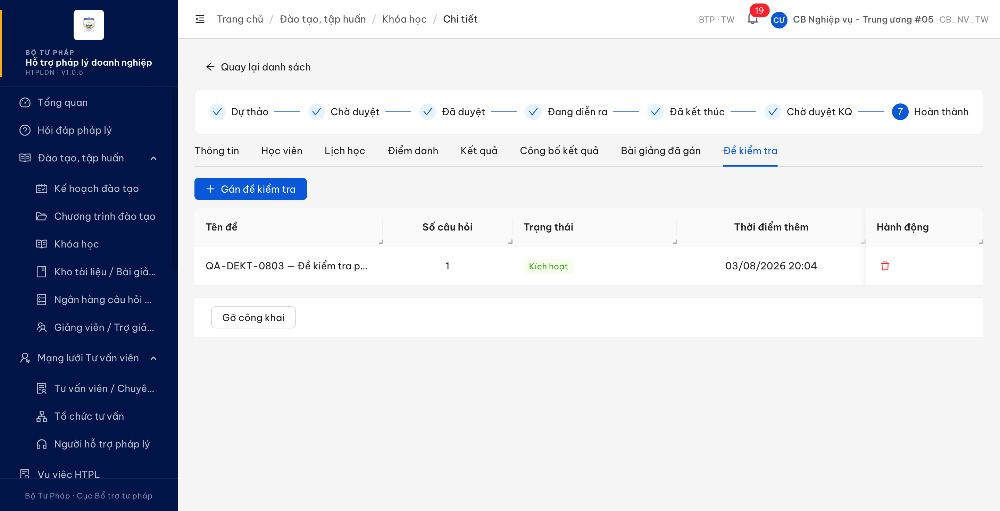 |
| Audit vòng dựng đề (nguồn phát hiện) | `../../reverify-audit/seed-de-kiem-tra-2026-08-03.md` |

---

## BUG-KTDGKQHT_02 — Màn kết quả học tập không cho đọc số buổi vắng có phép và vắng không phép, không kiểm chứng được kết luận Đạt / Không đạt

### Mô tả

Ở màn `Đào tạo, tập huấn → Khóa học → {khóa} → tab "Kết quả kiểm tra"`, thông tin chuyên cần của học viên chỉ hiển thị **gộp trong một ô** dạng `x/y (z%)`. Từ ô đó đọc được **số buổi có mặt** và **tổng số buổi**, nhưng **số buổi vắng có phép** và **số buổi vắng không phép** **không xuất hiện ở bất kỳ đâu** trên màn hình — cả tab "Kết quả kiểm tra" lẫn tab "Điểm danh".

Hai con số thiếu này không phải dữ liệu trang trí: chúng nằm trong §Outputs của chính chức năng và là thành phần trực tiếp của công thức tính tỷ lệ chuyên cần (buổi vắng **có phép** được tính vào tử số, vắng **không phép** thì không). Vì tỷ lệ chuyên cần là một trong hai điều kiện AND để chốt học viên Đạt / Không đạt, thiếu hai con số đó thì cán bộ lẫn học viên **không kiểm chứng được vì sao ra kết luận**.

BA chốt ngày 04/08/2026: **không bắt buộc tách thành bốn cột rời** — giữ ô gộp vẫn được, nhưng phải đọc được tách bạch đủ bốn con số (bản bàn giao mục 4.3.5.2.2 khai đây là thông tin chỉ đọc trên màn hình).

### Các bước tái hiện

1. Đăng nhập vai trò **CB Nghiệp vụ Trung ương** (`CB_NV_TW`, tài khoản `cbnv_tw`, đơn vị Cục Bổ trợ tư pháp) — vai trò được FR-III-05 (`srs-fr-03-dao-tao.md:523`) cho phép nhập và xem kết quả học tập.
2. Vào `Đào tạo, tập huấn` → `Khóa học` → mở một khóa trạng thái **Đang diễn ra**, có học viên và có ≥ 3 buổi trong tab "Lịch học".
3. Tab **"Điểm danh"**: điểm danh sao cho một học viên có **cả buổi Vắng có phép lẫn buổi Vắng không phép**.
4. Sang tab **"Kết quả kiểm tra"**, tìm đúng dòng học viên đó, đọc ô **"Chuyên cần"**.
5. Cuộn hết thanh ngang của bảng để chắc chắn không còn cột nào bị khuất; rê chuột lên ô "Chuyên cần" để kiểm xem có chú giải không.
6. Quay lại tab **"Điểm danh"**, đọc toàn bộ cột của bảng để kiểm xem hai con số đó có nằm ở đó không.

### Kết quả mong đợi

- §Outputs của FR-III-05 (UC24) liệt kê đủ bốn trường buổi học, mỗi trường một dòng riêng — `srs-fr-03-dao-tao.md:618` *"`so_buoi_co_mat` | number | Số buổi có mặt (CO_MAT)"*, `:619` *"`so_buoi_vang_phep` | number | Số buổi vắng có phép (VANG_PHEP)"*, `:620` *"`so_buoi_vang_khong_phep` | number | Số buổi vắng không phép (VANG_KHONG_PHEP)"*, `:621` *"`tong_buoi` | number | Tổng số buổi"*.
- Bốn con số đó phải **đọc được từ màn hình** — theo BA chốt 04/08/2026, được phép gộp trong một ô kèm chú giải, miễn tách bạch được từng con số.
- Tỷ lệ chuyên cần hiển thị phải đúng công thức tại `:622` — *"% chuyên cần = (so_buoi_co_mat + so_buoi_vang_phep) / tong_buoi × 100"*, tức buổi **vắng có phép vẫn được tính vào tử số**.
- Tỷ lệ này được đem so ngưỡng `ty_le_chuyen_can_toi_thieu` (mặc định 80%, `:134`) để chốt Đạt / Không đạt theo **BR-KQ-02** (`:2269`) ⇒ người dùng phải kiểm chứng được đầu vào của kết luận đó.

### Kết quả thực tế

- Tab **"Kết quả kiểm tra"** có 10 cột: STT · Họ tên · Email · Số điện thoại · Đơn vị · **Chuyên cần** · Điểm kiểm tra · Kết quả · Xếp loại · Ghi chú. Đã cuộn hết thanh ngang — cột khuất duy nhất là "Ghi chú", **không có** cột nào cho số buổi vắng.
- Ô **"Chuyên cần"** chỉ hiện dạng gộp `x/y (z%)` ⇒ suy ra được số buổi có mặt và tổng số buổi, **không suy ra được** số buổi vắng có phép và vắng không phép (hai giá trị khác nhau vẫn cho cùng một `x/y`).
- Tab **"Điểm danh"** chỉ có 7 cột: STT · Họ tên · Email · Số điện thoại · Đơn vị · Trạng thái · Ghi chú — **cũng không** chứa hai con số đó.
- Bộ cột giữ nguyên ở cả ba trạng thái khóa **Đang diễn ra**, **Đã kết thúc** và **Hoàn thành** ⇒ không phải trường hợp cột chỉ hiện ở một trạng thái.
- Hệ quả: với một học viên `1/3 (33.33%)`, người đọc **không phân biệt được** "có mặt 1, vắng phép 0, vắng không phép 2" với "có mặt 0, vắng phép 1, vắng không phép 2" — hai tình huống có ý nghĩa kỷ luật hoàn toàn khác nhau nhưng hiển thị y hệt.

### Bằng chứng

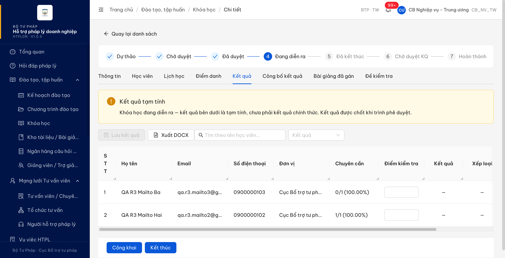

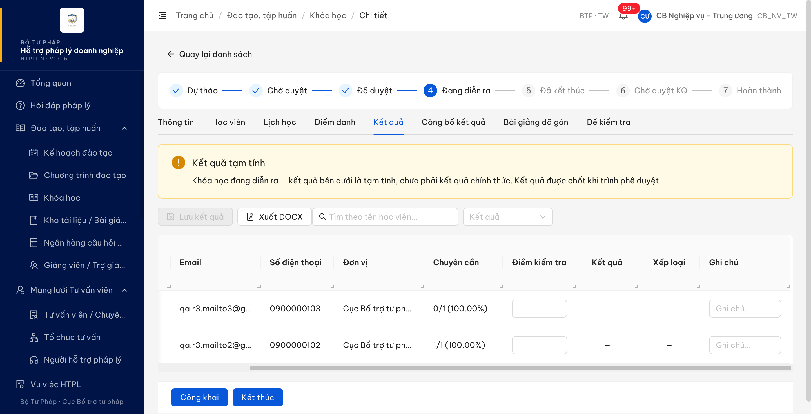

| Nội dung | Đường dẫn |
|---|---|
| Quyết định của BA (Vấn đề 12) | [`../../../../reverify-week-4/reverify-round-2026-08-04/phan-hoi-cac-diem-cho-BA-chot-2026-08-04.md`](../../../../reverify-week-4/reverify-round-2026-08-04/phan-hoi-cac-diem-cho-BA-chot-2026-08-04.md) |
| Note đã ghi lên sổ (dòng 116 tab tuần 2) | [`../../../../reverify-week-4/reverify-round-2026-08-04/notes-baapply/116-KTDGKQHT_02.txt`](../../../../reverify-week-4/reverify-round-2026-08-04/notes-baapply/116-KTDGKQHT_02.txt) |

> **⚠️ Lưu ý số dòng SRS:** các số dòng trên được mở file kiểm lại ngày **04/08/2026** trên bản `Docs-PM-HTPLDN/_bmad-output/planning-artifacts/srs-v3.5/`. Phiếu BA cùng ngày dẫn §Outputs ở `:600-603` và công thức ở `:604` — đó là vị trí **trước** khi BA chèn khối "Sửa đổi 2026-08-04 (KTDGKQHT_05)" vào đầu file, làm mọi mục bên dưới trôi xuống ~18 dòng. Nội dung trích dẫn không đổi, chỉ số dòng đổi.

---

## BUG-QLDXDTTH_11 — Cột "Hành động" tab Đề xuất đào tạo trống ở mọi dòng: cán bộ nghiệp vụ không có đường tiếp nhận đề xuất

### Mô tả

Ở màn `Đào tạo, tập huấn → Chương trình đào tạo → tab "Đề xuất đào tạo"`, cán bộ nghiệp vụ mở danh sách thì cột **"Hành động"** hiển thị dấu gạch ngang `—` ở **16/16 dòng**, kể cả **4 đề xuất trạng thái "Mới gửi" thuộc chính đơn vị của cán bộ đó**. Mở màn chi tiết của đúng những đề xuất đó cũng chỉ có nút **"Quay lại danh sách"**, không có thao tác nào khác.

Hệ quả nghiệp vụ: **không có đường nào** để cán bộ tiếp nhận hay đánh dấu thực hiện đề xuất ⇒ đề xuất do doanh nghiệp / người hỗ trợ gửi lên **đứng vĩnh viễn ở trạng thái "Mới gửi"**, luồng đề xuất đào tạo bị cụt.

Phần hỏng nằm ở **giao diện, không phải phân quyền** — xem mục "Kết quả thực tế" bên dưới.

### Các bước tái hiện

1. Đăng nhập vai trò **CB Nghiệp vụ Trung ương** (`CB_NV_TW`, tài khoản `cbnv_tw`, đơn vị Cục Bổ trợ tư pháp - Bộ Tư pháp, cấp TW). Đây là vai trò được `SCR-III-01 Thành phần 8` giao thao tác *"Xem · Tiếp nhận · Đánh dấu thực hiện"*, và máy chủ **đã cấp** quyền `receive_de_xuat_dao_tao` cho vai trò này.
2. Vào `Đào tạo, tập huấn` → `Chương trình đào tạo` → tab **"Đề xuất đào tạo"**.
3. Đọc cột **"Hành động"** của toàn bộ 16 dòng trong danh sách.
4. Lọc ra các dòng trạng thái **"Mới gửi"** thuộc **cùng đơn vị** với tài khoản đang đăng nhập (môi trường bàn giao có 4 dòng như vậy), đọc lại cột "Hành động" của riêng nhóm này.
5. Mở màn **chi tiết** của một trong 4 đề xuất đó, đọc toàn bộ vùng thao tác.

### Kết quả mong đợi

- `srs-fr-03-dao-tao.md:1068` (FR-III-13 — UC32, §Mô tả) — *"DN/NHT gửi đề xuất đào tạo. **CB NV tiếp nhận**. Sửa/xóa khi chưa tiếp nhận."*
- `srs-fr-03-dao-tao.md:1898` (SCR-III-01, **Thành phần 8 — Tab "Đề xuất đào tạo"**) — *"Tab phụ tiếp nhận đề xuất từ DN/NHT. Bảng cột Lĩnh vực · Nội dung (cắt 150 ký tự) · Người đề xuất · Trạng thái … · Ngày tạo · **Hành động (Xem · Tiếp nhận · Đánh dấu thực hiện)**."*
- Bản bàn giao mục 4.3.13.1 và 4.3.13.2.3 STT 4/5 quy định cùng nội dung.
- ⇒ Cán bộ nghiệp vụ phải có đường tiếp nhận đề xuất (trên danh sách hoặc trong màn chi tiết), và sau khi tiếp nhận thì trạng thái đề xuất phải chuyển khỏi "Mới gửi" và giữ nguyên sau khi tải lại trang.

### Kết quả thực tế

Đo ngày **04/08/2026** trên môi trường bàn giao `https://htpldn-uat.ospgroup.vn`, bản dựng **V1.0.5**, tài khoản `cbnv_tw`:

| # | Phương pháp đo | Kết quả |
|:-:|---|---|
| 1 | Đọc cột "Hành động" của danh sách | `—` ở **16/16 dòng**, gồm cả 4 dòng "Mới gửi" cùng đơn vị |
| 2 | Mở màn chi tiết đề xuất "Mới gửi" cùng đơn vị | Vùng thao tác chỉ có **"Quay lại danh sách"** |
| 3 | Đọc bản mô tả chức năng của chính bản triển khai | Máy chủ **có sẵn** chức năng tiếp nhận đề xuất |
| 4 | Đọc quyền của vai trò `CB_NV_TW` trên máy chủ | **Có** quyền tiếp nhận đề xuất đào tạo |
| 5 | Gọi chức năng tiếp nhận với **một mã bản ghi không tồn tại** (chọn cách này để không tạo hay đổi bản ghi nào) | Trả về **"không tìm thấy bản ghi"**, **không phải** "không có quyền" ⇒ yêu cầu đã **qua được lớp kiểm tra quyền** |

⇒ Phép đo 3-4-5 loại trừ giả thuyết "bị chặn do phân quyền": máy chủ có chức năng, vai trò có quyền, và yêu cầu đi lọt qua lớp quyền. Phần thiếu nằm ở **giao diện không dựng nút**.

**Về mâu thuẫn đặc tả từng nêu ở vòng trước — nay đã tự khép:** ba nguồn đều giao việc tiếp nhận cho cán bộ nghiệp vụ (`:1068`, `:1898`, bản bàn giao 4.3.13.1 + 4.3.13.2.3). Chỉ còn dòng Ma trận phân quyền `srs-v3.5.md:1310` — *"`DE_XUAT_DAO_TAO` | R | R | R\* | R\* | …"* — cấp cho mọi vai trò cán bộ chỉ quyền đọc, không có quyền sửa. Đó là **việc dọn tài liệu của BA**, không chặn Dev, vì bản thân đặc tả chức năng và đặc tả màn hình đều đã quy định thao tác tiếp nhận.

### Bằng chứng

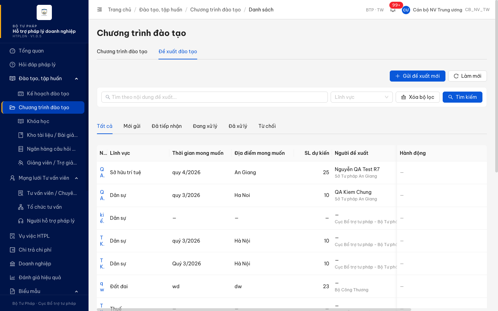

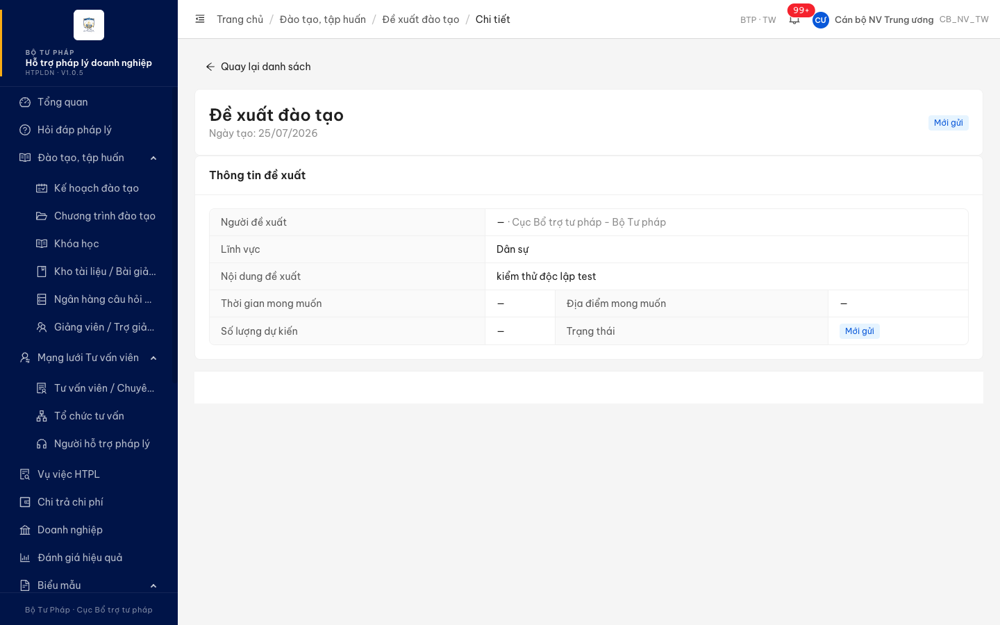

| Nội dung | Đường dẫn |
|---|---|
| Phiếu đo lại đầy đủ ngày 04/08/2026 (gồm cả 5 phép đo trên) | [`../../../../reverify-week-4/reverify-round-2026-08-04/do-lai-QLDXDTTH_11-2026-08-04.md`](../../../../reverify-week-4/reverify-round-2026-08-04/do-lai-QLDXDTTH_11-2026-08-04.md) |
| Quyết định của BA (Vấn đề 10 — *"cần đo lại"*) | [`../../../../reverify-week-4/reverify-round-2026-08-04/phan-hoi-cac-diem-cho-BA-chot-2026-08-04.md`](../../../../reverify-week-4/reverify-round-2026-08-04/phan-hoi-cac-diem-cho-BA-chot-2026-08-04.md) |
| Bối cảnh phát hiện vòng trước | [`../../reverify-audit/QLDXDTTH_01.md`](../../reverify-audit/QLDXDTTH_01.md) |

> **⚠️ Một ý phụ CHƯA được BA trả lời — tách riêng, KHÔNG chặn lỗi này:** vai trò cán bộ có được phép **GỬI** đề xuất đào tạo không? Máy chủ đang cấp quyền tạo, và trên môi trường có 4 đề xuất do *"CB Nghiệp vụ TW 01"* gửi; nhưng §Tác nhân của FR-III-13 (`srs-fr-03-dao-tao.md:1070`) chỉ ghi *"DN / NHT"*, bản bàn giao mục 4.3.13.2.3 STT 1 cũng vậy. **Khi re-test đừng chấm FAIL** vì nút "Gửi đề xuất mới" còn hiện với vai trò cán bộ — đó là điểm chờ BA, không thuộc phạm vi lỗi này.

> **⚠️ Lưu ý số dòng SRS:** các số dòng trên được mở file kiểm lại ngày **04/08/2026** trên bản `Docs-PM-HTPLDN/_bmad-output/planning-artifacts/srs-v3.5/`. Phiếu BA cùng ngày dẫn `:1045` (§Mô tả) và `:1875` (Thành phần 8) — đó là vị trí **trước** khi BA chèn khối "Sửa đổi 2026-08-04" vào đầu file. Nội dung trích dẫn không đổi, chỉ số dòng trôi xuống ~18–23 dòng.

---

## Phụ lục — Môi trường test

| Thành phần | Giá trị |
|------------|---------|
| URL ứng dụng | https://18.143.165.120.nip.io |
| OTP login | Lấy từ MailHog (không dùng mã bypass) |
| MailHog (OTP inbox) | http://18.143.165.120:8025 |
| API base | https://18.143.165.120.nip.io/api/v1 |
| Frontend | React + Ant Design (sidebar hiển thị `HTPLDN · V1.0.5`) |
| Xác thực | Tên đăng nhập/mật khẩu + OTP 6 số qua email |
| Tài khoản dùng ra verdict (nhóm QLKTLBG) | `cbnv_tw` — CB Nghiệp vụ Trung ương (`CB_NV_TW`), đơn vị BTP · TW |
| Tài khoản dùng ra verdict (nhóm QLDXDTTH) | `0109998887` — Doanh nghiệp (`DN`, người gửi) · `cbnv_hn` — CB Nghiệp vụ Địa phương (`CB_NV_DP`, đúng đơn vị tiếp nhận `00000000-0000-4000-8002-000000000001`) |
| Tài khoản dùng ra verdict (nhóm KTDGKQHT vòng chốt 20:00) | `cbnv_tw_05` — CB Nghiệp vụ Trung ương (`CB_NV_TW`), đơn vị Cục Bổ trợ tư pháp · TW |
| Gói mã giao diện lúc đo vòng chốt | `/assets/index-RAuQ-eDH.js` — `Last-Modified: Mon, 03 Aug 2026 12:51:29 GMT` (19:51 giờ VN) |
| Tool test | Chrome DevTools MCP |
| Dữ liệu QA dựng mới ngày 2026-08-04 (để dev re-test) | Khóa `KH-20260730-001` — đã thêm 3 buổi học (10/08 08:00, 11/08 08:00, 11/08 13:00), đã Khai giảng, **đã điểm danh đúng 1 buổi** (Vắng có phép / Có mặt / Vắng không phép) → dùng ra verdict `KTDGKQHT_20`. Ngoài ra 2 khóa QA tạo mới còn để lại: `KH-20260803-001` (Chờ duyệt, 3 buổi) và `KH-20260803-002` (Đã duyệt + Công khai, 3 buổi, 0 học viên) |
| Vì sao verdict `KTDGKQHT_20` không chạy trên khóa QA tự tạo | Theo `srs-fr-03-dao-tao.md:445, :455` đăng ký học viên là **luồng duy nhất** của DN/NHT trên chuyên trang Cổng Pháp luật quốc gia (bản v3.5 đã gỡ nhập tay / nhập tệp của cán bộ) ⇒ khóa mới tạo không thể có học viên từ bên trong phần mềm. Đã chọn khóa **chưa từng điểm danh** để mọi giá trị chuyên cần vẫn là giá trị mới sinh sau bản vá |

---

*Bug report generated: 2026-08-03 16:05:00 · cập nhật 2026-08-03 17:05:00 · bổ sung BUG-KTDGKQHT_21 lúc 2026-08-03 20:20:00 | QA Automation via Claude Code*
