# Bug Report — Mạng lưới Tư vấn viên

| Thông tin | Giá trị |
|-----------|---------|
| **Dự án** | PM HTPLDN — UAT đối tác |
| **Môi trường** | https://18.143.165.120.nip.io (bản dựng HTPLDN · V1.0.5) |
| **Người test** | QA Automation (Claude Code) |
| **Ngày** | 2026-08-04 00:50:00 |
| **Loại test** | Functional — verify bug đối tác vòng 1 |
| **Round** | verify1-conlai-2026-08-03 (tab `UAT_TGPL Doanh Nghiệp-tuần 2`) |
| **Tài liệu tham chiếu** | [QA_VERIFY_PROTOCOL.md](../../../QA_VERIFY_PROTOCOL.md) · SRS v3.5 `srs-fr-04-chuyen-gia-tvv.md` · audit [DKTGMLTVV_05.md](../../reverify-audit/DKTGMLTVV_05.md) · [QLLSHTCTVV_03.md](../../reverify-audit/QLLSHTCTVV_03.md) · [QLLSHTCTVV_04.md](../../reverify-audit/QLLSHTCTVV_04.md) |

---

## Tổng hợp

Phát hiện **10** lỗi có SRS reference cụ thể trong đợt verify vòng 1 tab `UAT_TGPL Doanh Nghiệp-tuần 2`: **5** lỗi gắn với 3 case đối tác (row 123 · 125 · 126) và **5** lỗi nằm ngoài phạm vi mọi dòng TC có sẵn, đã mở dòng TC mới (row 138 · 139 · 140 · 142 · 143).

> **Snapshot 2026-08-04 00:50 (LATEST):** re-verify sau dev fix trên gói `index-BrKDNUvo.js` — **5 Closed / 5 Open**. Đóng thêm 4 lỗi vòng này: `DKTGMLTVV_OOS_01` (row 138) · `CNDSMLTVV_OOS_01` (row 140) · `CNDSMLTVV_OOS_02` (row 142) · `CNDSMLTVV_OOS_03` (row 143) — tất cả ✅ Pass, đã ghi `Verify = Pass` lên sheet. 5 lỗi còn Open (`DKTGMLTVV_05`, `DKTGMLTVV_05-B`, `QLLSHTCTVV_03`, `QLLSHTCTVV_03-B`, `QLLSHTCTVV_04`) **chưa re-verify vòng này** — giữ nguyên trạng thái chờ BA theo quyết định phạm vi.

- `DKTGMLTVV_05` (row 123) — 2 lỗi ở nhóm 4 "File đính kèm", màn Thêm mới Tư vấn viên. Cả 2 đều **không phải** điều đối tác phản ánh; ý đối tác báo ("nhóm 4 thiếu Tệp thẻ hành nghề") đã chuyển **BA confirm** vì SRS tự liệt kê trường này ở cả nhóm 2 (`:1508`) lẫn nhóm 4 (`:1520`).
- `QLLSHTCTVV_03` (row 125) — 2 lỗi ở tab "Lịch sử hỗ trợ", màn Hồ sơ chi tiết Tư vấn viên. Lỗi bố cục cột "Đánh giá" **đúng như đối tác phản ánh**; lỗi thang điểm là phát hiện thêm trong cùng cột đó. Ý còn lại của case ("thiếu cột Trạng thái") chuyển **BA confirm** vì `SCR-IV-03:1578` không liệt kê cột này trong khi `FR-IV-10:792` lại khai `trang_thai` là dữ liệu đầu ra.
- `QLLSHTCTVV_04` (row 126) — 1 lỗi ở bộ lọc "Trạng thái vụ việc" của cùng tab "Lịch sử hỗ trợ". Lỗi này **không phải** điều đối tác phản ánh; ý đối tác báo ("dropdown chưa đủ giá trị so với nhóm Quản lý vụ việc") đã chuyển **BA confirm** vì `SCR-IV-03:1578` cố ý quy định tập rút gọn, đồng thời nhãn `"Đã hủy"` ở dòng đó không ánh xạ được trạng thái nào trong bảng `srs-fr-05-vu-viec.md:1498-1509`.

Năm lỗi mở dòng TC mới (`*_OOS_*`), phát hiện khi kiểm các màn hình liên quan trong cùng đợt:

- ~~`DKTGMLTVV_OOS_01` (row 138)~~ **[ĐÃ ĐÓNG 04/08 00:39]** — màn Thêm mới Tư vấn viên: ô "Số thẻ hành nghề" không bị áp ràng buộc bắt buộc dù Loại = Tư vấn viên. Cùng biểu mẫu, ô "File thẻ hành nghề" (`:1508`, cùng điều kiện) lại chặn đúng — nên là bỏ sót đúng 1 ô, không phải thiếu cơ chế.
- ~~`DKTGMLTVV_OOS_02` (row 139)~~ **[ĐÃ ĐÓNG 03/08 21:05]** — cùng màn: 3 nhãn lệch đặc tả (`:1495` · `:1500` · `:1503`). Dev sửa (commit `16a54e26a`), QA đo lại độc lập trên gói `index-B1e0L2GY.js` thấy **đúng cả 3** → `Verify = Pass`. Nghi vấn ban đầu "nhãn Số CMND/CCCD có phải thay đổi phạm vi giấy tờ" **đã được loại bỏ, KHÔNG cần BA**: mọi chuỗi hiển thị cho người dùng trong đặc tả đều dùng "Căn cước công dân" (`:1495`, `:202`, `:337`, `:1438`, `:1527`), `cmnd_cccd` chỉ còn là tên cột nội bộ.
- ~~`CNDSMLTVV_OOS_01` (row 140)~~ **[ĐÃ ĐÓNG 04/08 00:50]** — danh sách Tư vấn viên: hủy công khai hàng loạt không qua `MD-HUY-CONG-KHAI`. Chiều ngược lại (công khai hàng loạt) vẫn có hộp thoại.
- ~~`CNDSMLTVV_OOS_02` (row 142)~~ **[ĐÃ ĐÓNG 04/08 00:48]** — cùng thanh thao tác hàng loạt: hộp thoại công khai thiếu phần "Tệp đính kèm"; hộp thoại công khai mở từ màn chi tiết cùng hồ sơ, cùng tài khoản thì có đủ.
- ~~`CNDSMLTVV_OOS_03` (row 143)~~ **[ĐÃ ĐÓNG 04/08 00:43]** — hộp thoại công khai: bỏ trống mô tả hiện 2 dòng lỗi trùng nghĩa, cả 2 đều không dùng nội dung `ERR-CK-02`.

### Severity breakdown

| Tổng | Critical | Major | Medium | Minor | Trivial | Closed | Open |
|------|----------|-------|--------|-------|---------|--------|------|
| 10   | 0        | 4     | 3      | 3     | 0       | 5      | 5    |

## Bug Summary Table

| Bug ID | Severity | Priority | Type | TC Ref | **SRS Reference** | Title | Status |
|--------|----------|----------|------|--------|-------------------|-------|--------|
| BUG-DKTGMLTVV_05 | Major | P1 | Negative | DKTGMLTVV_05 (sheet tuần 2 row 123) | `SCR-IV-02 Thành phần row 5.1 (dòng 1519)` · `FR-IV-03 (UC41)` | Hồ sơ ứng viên mới lưu được dù bỏ trống "Bằng cấp / Chứng chỉ" — trường SRS quy định bắt buộc, giao diện cũng không đánh dấu bắt buộc | Open |
| BUG-DKTGMLTVV_05-B | Minor | P3 | UI/UX | DKTGMLTVV_05 (sheet tuần 2 row 123) | `SCR-IV-02 Thành phần row 5.3 (dòng 1521)` | Nút "Xóa" trong danh sách file đã tải gỡ file ngay, không hỏi xác nhận | Open |
| BUG-QLLSHTCTVV_03 | Major | P2 | UI/UX | QLLSHTCTVV_03 (sheet tuần 2 row 125) | `SCR-IV-03 Thành phần row 22 (dòng 1578)` · `FR-IV-10 (UC48)` | Cột "Đánh giá" tab Lịch sử hỗ trợ vỡ 2 dòng ở khung nhìn ≤ 1600px (ô hẹp hơn dãy 5 sao 8px) | Open |
| BUG-QLLSHTCTVV_03-B | Medium | P2 | Functional | QLLSHTCTVV_03 (sheet tuần 2 row 125) | `SCR-IV-03 row 22 mục (c) (dòng 1578)` · `FR-IV-10 (UC48) §Outputs (dòng 795)` | Cột "Đánh giá" luôn hiện 5/5 sao và ô "Điểm trung bình" hiện 8.9 — điểm thang 10 đổ vào hiển thị thang 5 | Open |
| BUG-QLLSHTCTVV_04 | Medium | P2 | Functional | QLLSHTCTVV_04 (sheet tuần 2 row 126) | `SCR-IV-03 Thành phần row 22 mục (a) (dòng 1578)` · `FR-IV-10 (UC48) §Inputs (dòng 773)` | Bộ lọc "Trạng thái vụ việc" tab Lịch sử hỗ trợ chỉ chọn được 1 giá trị, SRS quy định là bộ lọc chọn nhiều | Open |
| ~~BUG-DKTGMLTVV_OOS_01~~ | Major | P1 | Negative | DKTGMLTVV_OOS_01 (sheet tuần 2 row 138) | `SCR-IV-02 Danh sách trường mục 3.5 (dòng 1507)` | Ô "Số thẻ hành nghề" không được áp ràng buộc bắt buộc khi Loại = Tư vấn viên — hồ sơ lưu được dù để trống | **Closed** |
| ~~BUG-DKTGMLTVV_OOS_02~~ | Minor | P3 | UI/UX | DKTGMLTVV_OOS_02 (sheet tuần 2 row 139) | `SCR-IV-02 Danh sách trường (dòng 1495, 1500, 1503)` | Ba nhãn trên biểu mẫu Thêm mới Tư vấn viên lệch đặc tả ("Nghề nghiệp" · "Số CMND/CCCD" · "Trình độ học vấn") | **Closed** |
| ~~BUG-CNDSMLTVV_OOS_01~~ | Major | P1 | UI/UX | CNDSMLTVV_OOS_01 (sheet tuần 2 row 140) | `SCR-IV-01 Thao tác hàng loạt (dòng 1465)` · `§3.0b MD-HUY-CONG-KHAI (dòng 1407)` | Hủy công khai hàng loạt gỡ hồ sơ khỏi Cổng PLQG ngay khi bấm, không qua hộp thoại xác nhận | **Closed** |
| ~~BUG-CNDSMLTVV_OOS_02~~ | Medium | P2 | Functional | CNDSMLTVV_OOS_02 (sheet tuần 2 row 142) | `SCR-IV-01 Thao tác hàng loạt (dòng 1464)` · `§3.0b MD-CONG-KHAI (dòng 1406)` · `FR-IV-08 (dòng 657)` | Hộp thoại công khai hàng loạt thiếu hoàn toàn phần "Tệp đính kèm" mà MD-CONG-KHAI quy định | **Closed** |
| ~~BUG-CNDSMLTVV_OOS_03~~ | Minor | P3 | UI/UX | CNDSMLTVV_OOS_03 (sheet tuần 2 row 143) | `FR-IV-08 (UC46) §Xử lý lỗi E2 / ERR-CK-02 (dòng 682)` | Bỏ trống "Mô tả công khai" hiện 2 thông báo lỗi trùng nghĩa cho cùng một ô | **Closed** |

---

## BUG-DKTGMLTVV_05 — Hồ sơ ứng viên mới lưu được dù bỏ trống "Bằng cấp / Chứng chỉ"

### Mô tả

Trên màn "Thêm mới Tư vấn viên", nhóm 4 "File đính kèm", mục **"File đính kèm (Bằng cấp / Chứng chỉ)"** không được đánh dấu bắt buộc và hệ thống không chặn khi bỏ trống: Người hỗ trợ pháp lý đăng ký ứng viên mới vẫn tạo được hồ sơ mà không đính kèm bằng cấp / chứng chỉ nào. SRS quy định trường này bắt buộc đúng trong tình huống này.

### Các bước tái hiện

1. Đăng nhập vai trò **Người hỗ trợ pháp lý (NHT)** — tài khoản `nht_qa_tw` ("QA NHT Trung uong", đơn vị Cục Bổ trợ tư pháp - Bộ Tư pháp, cấp TW). Vai trò này có quyền `register_tu_van_vien` và theo `SCR-IV-02` §Quyền truy cập (dòng 1476) là vai duy nhất được submit hồ sơ ứng viên TVV/CG.
2. Vào **Mạng lưới Tư vấn viên → Tư vấn viên / Chuyên gia → tab "Mới đăng ký" → Thêm mới**.
3. Cuộn tới nhóm 4 "File đính kèm". Quan sát nhãn "File đính kèm (Bằng cấp / Chứng chỉ)" — **không có dấu `*`** (trong khi "Lĩnh vực pháp luật" ngay bên trên có dấu `*` đỏ).
4. Chọn **Loại = "Tư vấn viên (TVV)"**, điền đủ mọi trường bắt buộc còn lại (Họ tên, Ngày sinh, Giới tính, Số CMND/CCCD, Email, Số điện thoại, Địa chỉ, Trình độ học vấn, Chuyên ngành, Số năm kinh nghiệm, Lĩnh vực pháp luật), nạp "File thẻ hành nghề (PDF)" ở nhóm 2.
5. **Cố ý để nhóm 4 rỗng — không đính kèm bằng cấp / chứng chỉ nào.** Bấm **Lưu**.
6. Quan sát: hệ thống báo "Tạo hồ sơ TVV thành công" và chuyển sang danh sách.

### Kết quả mong đợi

- Theo `SCR-IV-02` bảng Thành phần màn hình dòng **1519** (mục 5.1): *"Bằng cấp / Chứng chỉ **\*** | tải nhiều file | **Bắt buộc khi Người hỗ trợ đăng ký ứng viên mới**"* — khi vai trò Người hỗ trợ đăng ký ứng viên mới mà chưa đính kèm bằng cấp / chứng chỉ, hệ thống phải từ chối lưu và báo cho người dùng biết thiếu gì.
- Nhãn của trường phải thể hiện là trường bắt buộc, thống nhất với cách các trường bắt buộc khác trên cùng biểu mẫu đang được đánh dấu.

### Kết quả thực tế

- Nhãn **không** được đánh dấu bắt buộc: thuộc tính đánh dấu bắt buộc của biểu mẫu (`ant-form-item-required`) trả `false`; cây trợ năng không có node `*` trước nhãn; ảnh chụp cũng không thấy dấu sao. (Đối chứng cùng phép đo: "Lĩnh vực pháp luật" trả `true` và có dấu sao đỏ → phép đo đúng.)
- Bấm Lưu khi nhóm 4 rỗng: **lưu thành công**. Bộ đếm ghi nhận **3 request · 1 thông báo** "Tạo hồ sơ TVV thành công", không có thông báo lỗi nào về bằng cấp / chứng chỉ:

```
POST  /api/v1/tu-van-viens
POST  /api/v1/tu-van-viens/455f3047-b164-4b7c-a697-59e47e5db153/files
PATCH /api/v1/tu-van-viens/455f3047-b164-4b7c-a697-59e47e5db153
```

- Bản ghi tạo ra: **TVV-BTP-TW-0030 — "QA Kiểm Thử Nhóm 4"**, trạng thái "Mới đăng ký".
- Đối chiếu: cùng biểu mẫu đó, khi thiếu **File thẻ hành nghề** thì hệ thống **có** chặn (0 request, thông báo *"File thẻ hành nghề là bắt buộc đối với Tư vấn viên"*) → cơ chế chặn tồn tại, chỉ riêng mục "Bằng cấp / Chứng chỉ" không được áp.

### Bằng chứng

**1. Ảnh chụp**:

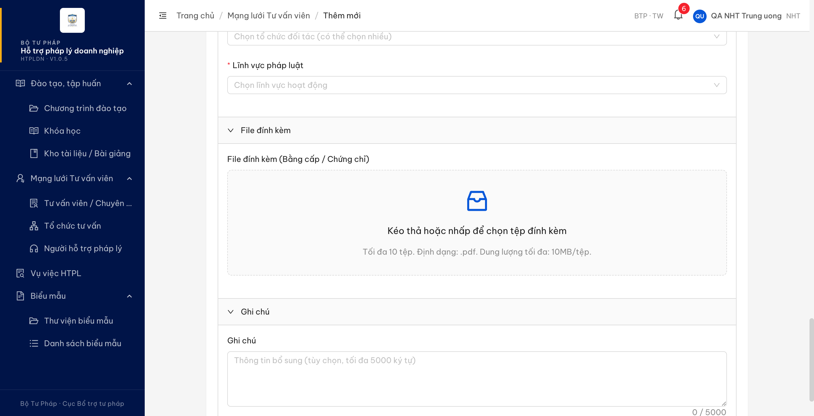

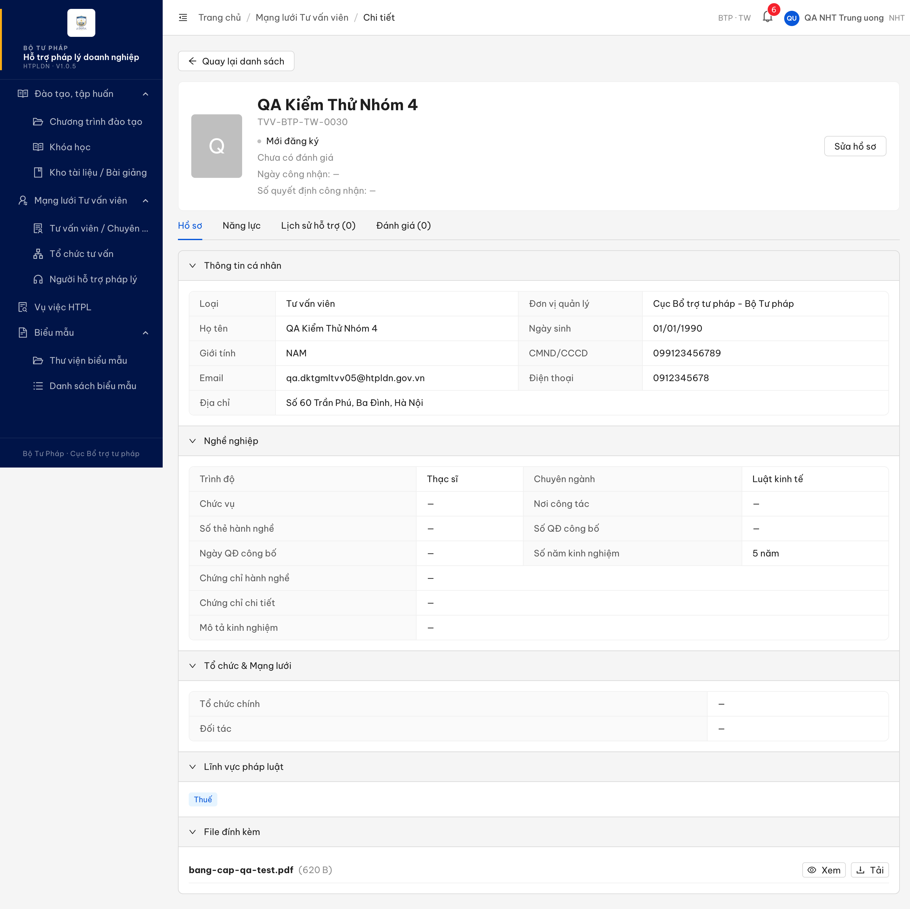

**2. API response** *(phụ trợ — xác minh file duy nhất trong hồ sơ chính là thẻ hành nghề, không có bằng cấp/chứng chỉ)*:

```json
{
  "fileTheHanhNgheId": "52ad3345-9553-4ecd-9e70-720eba73f738",
  "fileDinhKems": [
    { "id": "52ad3345-9553-4ecd-9e70-720eba73f738", "tenFile": "bang-cap-qa-test.pdf", "kichThuoc": 620 }
  ]
}
```

---

## BUG-DKTGMLTVV_05-B — Nút "Xóa" trong danh sách file đã tải gỡ file ngay, không hỏi xác nhận

### Mô tả

Trong nhóm 4 "File đính kèm" của màn Thêm mới / Chỉnh sửa Tư vấn viên, sau khi đính kèm file thì mỗi dòng file có nút "Xóa". Bấm "Xóa" gỡ file ngay lập tức, không có bước xác nhận, trong khi SRS quy định phải xác nhận trước khi xóa.

### Các bước tái hiện

1. Đăng nhập vai trò **Người hỗ trợ pháp lý (NHT)** — `nht_qa_tw` (quyền `register_tu_van_vien`, theo `SCR-IV-02` dòng 1476 là vai được thao tác biểu mẫu này).
2. Vào **Mạng lưới Tư vấn viên → Tư vấn viên / Chuyên gia → tab "Mới đăng ký" → Thêm mới**, cuộn tới nhóm 4 "File đính kèm".
3. Đính kèm 1 file PDF hợp lệ. Quan sát dòng file hiện ra kèm tên file, kích thước, nút "Xem", nút "Xóa".
4. Bấm **"Xóa"**.
5. Quan sát: file biến mất ngay, không có hộp thoại / popover xác nhận nào.

### Kết quả mong đợi

- Theo `SCR-IV-02` bảng Thành phần màn hình dòng **1521** (mục 5.3 "Danh sách file đã tải"), cột Hành vi: *"Xem: mở hộp xem PDF; **Xóa: xác nhận trước khi xóa**"* — hệ thống phải hỏi người dùng xác nhận trước khi gỡ file khỏi hồ sơ.

### Kết quả thực tế

- File bị gỡ ngay khi bấm "Xóa"; không xuất hiện hộp thoại hay popover xác nhận nào.
- Đã đo 2 lần bằng 2 cách khác nhau (kích hoạt bằng script và bằng thao tác chuột thật) — kết quả giống nhau, nên không phải sai lệch của công cụ đo.
- Ghi chú phạm vi đã đo: mới đo ở chế độ **Thêm mới** (file chưa lưu, xóa nhầm chỉ mất thao tác chọn lại). Cùng màn này còn chế độ **Chỉnh sửa** (`/chuyen-gia-tvv/:id/chinh-sua`) nơi file đã lưu — chưa đo, và đó mới là nơi thiếu xác nhận có thể gây mất dữ liệu thật.

### Bằng chứng

**1. Ảnh chụp**:

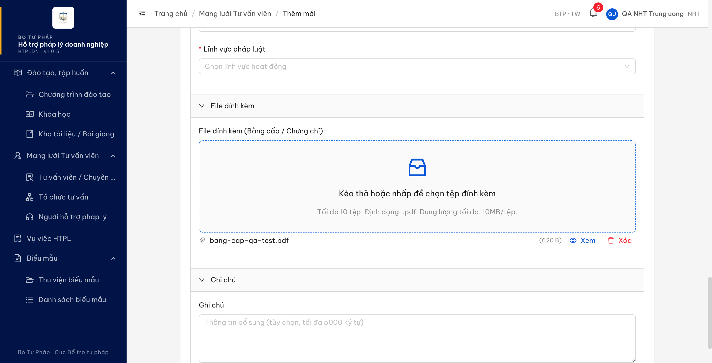

**2. Kết quả đo sau khi bấm "Xóa"** *(phụ trợ)*:

```json
{
  "coModalXacNhan": false,
  "textXacNhan": null,
  "conFile": false
}
```

---

## BUG-QLLSHTCTVV_03 — Cột "Đánh giá" của tab Lịch sử hỗ trợ vỡ 2 dòng ở khung nhìn ≤ 1600px

### Mô tả

Trong màn Hồ sơ chi tiết Tư vấn viên, tab **"Lịch sử hỗ trợ"**, ô của cột **"Đánh giá"** không đủ rộng để chứa dãy 5 ngôi sao trên một hàng. Ngôi sao thứ 5 bị đẩy xuống dòng thứ hai, làm mỗi dòng của bảng cao gấp đôi và dãy sao hiển thị vỡ. Hiện tượng xảy ra ở **mọi dòng của bảng**, tại các khung nhìn phổ thông (1440px, 1600px). Đây chính là hiện tượng bên kiểm thử đánh dấu trong ảnh của họ.

### Các bước tái hiện

1. Đăng nhập vai trò **Cán bộ Nghiệp vụ Trung ương** — tài khoản `cbnv_tw_02` (`CB_NV_TW`, đơn vị Cục Bổ trợ tư pháp - Bộ Tư pháp, cấp TW).
2. Đặt khung nhìn trình duyệt **1440×900** (khung nhìn chuẩn của dự án).
3. Vào **Mạng lưới Tư vấn viên → Tư vấn viên / Chuyên gia**, tab "Đang hoạt động".
4. Mở chi tiết tư vấn viên **`TVV-BTP-TW-0002`** ("QA TVV Seed28 Active") — tư vấn viên này có sẵn 6 bản ghi lịch sử hỗ trợ, trong đó 2 bản ghi đã có điểm đánh giá.
5. Chọn tab **"Lịch sử hỗ trợ (6)"**.
6. Cuộn bảng sang phải để nhìn thấy cột "Đánh giá" ở ngoài cùng bên phải.
7. Quan sát dãy sao ở từng dòng.

### Kết quả mong đợi

- Theo `SCR-IV-03` bảng Thành phần màn hình dòng **1578** (mục 22), cột cuối của bảng tab "Lịch sử hỗ trợ" là **"Đánh giá (sao)"** — dãy sao phải hiển thị trọn vẹn trên một hàng trong ô của nó.
- Theo tiêu chí chung của phiếu kiểm thử (cột "Kết quả mong đợi"): *"Dữ liệu hiển thị không bị tràn/đè lên nhau"*.

### Kết quả thực tế

- **6/6 dòng đều vỡ 2 hàng sao.** Đo toạ độ đỉnh của 5 ngôi sao ở dòng 1: `[616, 616, 616, 616, 637]` — 4 ngôi sao đầu cùng hàng, ngôi sao thứ 5 nằm ở hàng dưới. Kết quả giống hệt ở cả 6 dòng.
- Khung chứa sao cao **41px** thay vì **21px** (chiều cao một hàng sao).
- Nguyên nhân đo được: dãy 5 sao cần **132px** (5 sao × 20px + 4 khoảng cách × 8px). Ô "Đánh giá" rộng **140px**, trừ đệm trái/phải 8px mỗi bên còn **124px** khả dụng → **thiếu 8px**, ngôi sao thứ 5 phải xuống dòng.
- Đo ở 3 khung nhìn: **1440×900 → vỡ 6/6 dòng** · **1600×900 → vỡ 6/6 dòng** (ô vẫn 140px) · **1920×1000 → không vỡ** (ô giãn thành 162px, khung sao cao 21px, 1 hàng). Nghĩa là lỗi xảy ra trên gần như toàn bộ dải màn hình laptop thông dụng.
- Ghi chú: bảng **có** thanh cuộn ngang hoạt động bình thường và trang không bị tràn ngang (`document.scrollWidth` = `clientWidth` = 1432). Lỗi nằm ở **bề rộng ô quá hẹp làm vỡ dãy sao**, không phải bảng đẩy vượt trang.

### Bằng chứng

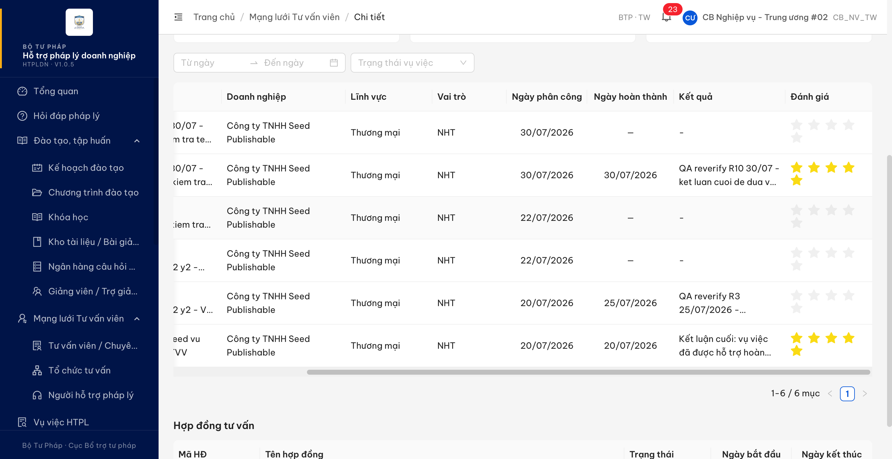

---

## BUG-QLLSHTCTVV_03-B — Cột "Đánh giá" luôn hiện 5/5 sao và ô "Điểm trung bình" hiện 8.9 — sai thang điểm

### Mô tả

Vẫn trong tab **"Lịch sử hỗ trợ"**, điểm đánh giá của vụ việc đang được lấy theo thang 10 nhưng đổ thẳng vào thành phần hiển thị sao thang 5 và vào ô thống kê "Điểm trung bình". Hậu quả: mọi vụ việc đã có đánh giá đều hiển thị **5/5 sao đầy** bất kể điểm thực là bao nhiêu, và ô "Điểm trung bình" hiện số **8.9** — vượt thang 5, mâu thuẫn ngay với điểm **4.1/5** hiển thị ở đầu cùng trang đó.

### Các bước tái hiện

1. Làm theo bước 1–5 của `BUG-QLLSHTCTVV_03` ở trên.
2. Đọc khối thống kê tóm tắt phía trên bảng: "Tổng vụ việc / Đã hoàn thành / Điểm trung bình".
3. Đối chiếu với điểm hiển thị ở phần đầu trang hồ sơ (cạnh tên tư vấn viên).
4. Quan sát dãy sao ở 2 dòng đã có đánh giá: `VV-BTP-TW-20260730-001` và `VV-BTP-TW-20260712-001`.

### Kết quả mong đợi

- Theo `SCR-IV-03` dòng **1578** mục (c): thống kê tóm tắt là *"Điểm trung bình: **{X}/5**"*.
- Theo `FR-IV-10 (UC48)` §Outputs dòng **795**: `diem_danh_gia` có định dạng **"1.0–5.0 (1 chữ số thập phân)"**.
- Hai vụ việc có điểm khác nhau phải hiển thị số sao khác nhau, và số sao phải phản ánh đúng điểm.

### Kết quả thực tế

- Ô "Điểm trung bình" hiển thị **8.9**, không kèm mẫu số. Cùng trang, phần đầu hồ sơ hiển thị **4.1/5** → hai con số mâu thuẫn nhau về thang.
- Hai vụ việc có điểm **9.0** và **8.7** (khác nhau) nhưng **cả hai đều hiển thị 5/5 sao đầy** — đo trên giao diện: `saoDay: 5, saoNua: 0, saoRong: 0` cho cả hai dòng. Người dùng không phân biệt được chất lượng giữa hai vụ việc.
- 4 dòng chưa có đánh giá hiển thị 5 sao rỗng, đúng.
- Đối chiếu nguồn dữ liệu: bản ghi trả về cho tab này mang `diemDanhGia` là `"9.0"` và `"8.7"`, và thống kê kèm theo là `diemTrungBinh: 8.9` — tức số liệu nguồn theo thang 10, trong khi màn hình đang trình bày theo thang 5.
- Hiện tượng này tái hiện độc lập với lỗi bố cục ở `BUG-QLLSHTCTVV_03`, và cũng quan sát được trong ảnh của bên kiểm thử (đầu trang 4.0/5 nhưng ô Điểm trung bình 8.3).

### Bằng chứng

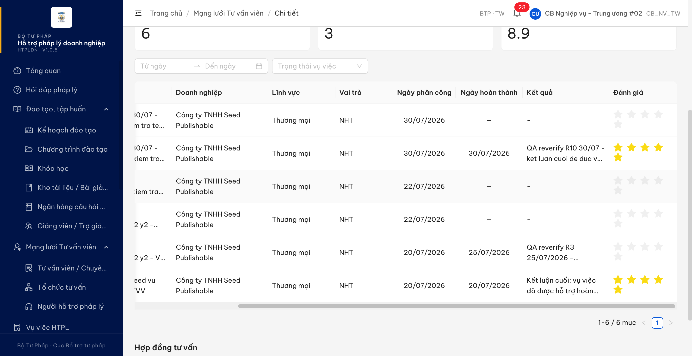

---

## BUG-QLLSHTCTVV_04 — Bộ lọc "Trạng thái vụ việc" tab Lịch sử hỗ trợ chỉ chọn được 1 giá trị

### Mô tả

Trong màn Hồ sơ chi tiết Tư vấn viên, tab **"Lịch sử hỗ trợ"**, bộ lọc **"Trạng thái vụ việc"** chỉ giữ được **một** giá trị tại một thời điểm: chọn giá trị thứ hai thì giá trị thứ nhất bị thay thế. SRS quy định đây là bộ lọc **chọn nhiều**, nên người dùng phải kết hợp được nhiều trạng thái trong cùng một lần lọc (ví dụ xem đồng thời các vụ việc "Đang xử lý" và "Hoàn thành").

### Các bước tái hiện

1. Đăng nhập vai trò **Cán bộ Nghiệp vụ** — tài khoản `cbnv_tw_02` ("CB Nghiệp vụ - Trung ương #02", vai trò `CB_NV_TW`, đơn vị Cục Bổ trợ tư pháp - Bộ Tư pháp, cấp TW). Vai trò này là tác nhân hợp lệ của `FR-IV-10` §Tác nhân (dòng 764).
2. Vào **Mạng lưới Tư vấn viên → Tư vấn viên / Chuyên gia**, mở chi tiết một tư vấn viên đã được công nhận và có lịch sử hỗ trợ — dùng `TVV-BTP-TW-0002` ("QA TVV Seed28 Active", trạng thái "Đang hoạt động", tab "Lịch sử hỗ trợ (6)").
3. Chọn tab **"Lịch sử hỗ trợ"**. Ghi nhận số dòng khi chưa lọc: **6 dòng** ("1-6 / 6 mục").
4. Mở bộ lọc **"Trạng thái vụ việc"**, chọn **"Đang xử lý"**. Bảng còn 1 dòng.
5. Mở lại bộ lọc đó, chọn tiếp **"Hoàn thành"** (không bỏ chọn giá trị trước).
6. Quan sát ô lọc và bảng kết quả.

### Kết quả mong đợi

- Theo `SCR-IV-03` bảng Thành phần màn hình dòng **1578**, mục (a): *"Bộ lọc: Khoảng ngày + Trạng thái vụ việc (**chọn nhiều**: "Tất cả" / "Đang xử lý" / "Hoàn thành" / "Đã hủy")"* — bộ lọc trạng thái phải cho phép giữ đồng thời nhiều giá trị, và kết quả trả về là hợp của các trạng thái đã chọn.
- Sau bước 5, bộ lọc phải còn giữ cả "Đang xử lý" lẫn "Hoàn thành", bảng hiển thị các vụ việc thuộc **cả hai** trạng thái (với dữ liệu test là 2 dòng).
- Cùng quy định "chọn nhiều" này được SRS lặp lại nguyên văn ở dòng **1856** cho bộ lọc trạng thái của tab "Vụ việc đã hỗ trợ" (màn Người hỗ trợ pháp lý), và cụm "dropdown chọn nhiều" được dùng như một kiểu điều khiển chính thức ở dòng 1516 / 1517 — nên đây là quy định có chủ ý, không phải diễn đạt tùy tiện.

### Kết quả thực tế

- Sau bước 5, giá trị mới **đè** giá trị cũ: ô lọc chỉ hiển thị **"Hoàn thành"**, không có giá trị thứ hai nào được giữ lại. Bảng còn **1 dòng** ("1-1 / 1 mục"), đúng bằng kết quả của riêng "Hoàn thành".
- Request gửi lên chỉ mang **một** trạng thái: `GET /api/v1/tu-van-viens/{id}/lich-su-ho-tro?page=1&pageSize=20&trangThaiVv=HOAN_THANH` — không có tham số thứ hai.
- Kiểm chéo bằng 3 cách độc lập, cùng kết luận là điều khiển chọn đơn:

  | # | Cách đo | Kết quả |
  |---|---|---|
  | 1 | Lớp CSS của điều khiển | `ant-select-single`, không có `ant-select-multiple` |
  | 2 | Thao tác thật (bước 4→5) | Giá trị sau đè giá trị trước, không tích lũy |
  | 3 | Thuộc tính trợ năng | `aria-multiselectable` = không có · 0 checkbox trong danh sách · 0 thẻ giá trị trong ô lọc |

- Số liệu lọc thực đo trên cùng bộ dữ liệu (baseline 6 dòng):

  | Giá trị chọn | Tham số gửi lên | Số dòng |
  |---|---|:-:|
  | *(không lọc)* | — | 6 |
  | Đang xử lý | `trangThaiVv=DANG_XU_LY` | 1 |
  | Hoàn thành | `trangThaiVv=HOAN_THANH` | 1 |
  | Từ chối | `trangThaiVv=TU_CHOI` | 0 |

- Console không có lỗi hay cảnh báo; mọi request đều 200/304; mỗi lần đổi bộ lọc phát đúng 1 request.

### Bằng chứng

**1. Ảnh chụp**:

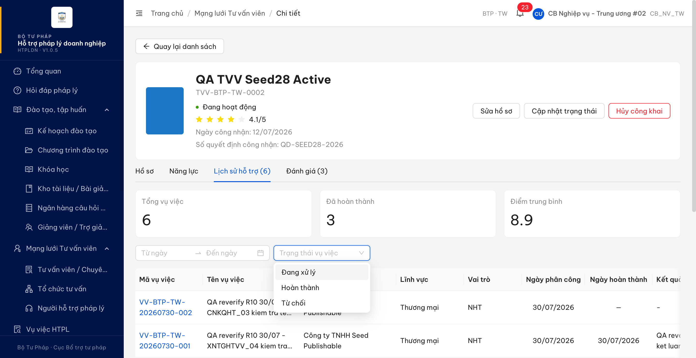

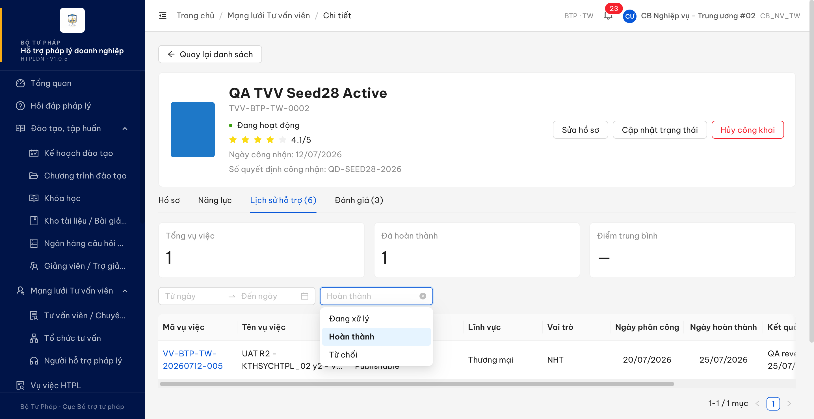

**2. Môi trường**: `https://18.143.165.120.nip.io`, bản dựng **HTPLDN · V1.0.5**, trang đã tải lại (bỏ cache) trước khi đo.

**3. Dữ liệu test**: `TVV-BTP-TW-0002` — 6 vụ việc trải 5 trạng thái (`DA_DUYET` 1 · `DA_DANH_GIA` 2 · `DA_PHAN_CONG` 1 · `DANG_XU_LY` 1 · `HOAN_THANH` 1). Không tạo / sửa / xóa bản ghi nào; bộ lọc đã gỡ về trạng thái ban đầu sau khi đo.

**4. Audit chi tiết**: [QLLSHTCTVV_04.md](../../reverify-audit/QLLSHTCTVV_04.md) — gồm cả 2 điểm đã tách sang **BA confirm** (tập giá trị rút gọn; nhãn "Đã hủy" ở `:1578` không ánh xạ được trạng thái nào trong bảng `srs-fr-05-vu-viec.md:1498-1509`).

---

## ~~BUG-DKTGMLTVV_OOS_01~~ [CLOSED] — Ô "Số thẻ hành nghề" không được áp ràng buộc bắt buộc khi Loại = Tư vấn viên

> **Re-test:** 2026-08-04 00:39 — ✅ PASS (Closed-verified). Chạy lại đúng luồng bug gốc trên gói `index-BrKDNUvo.js` (bản dựng V1.0.5, tài khoản `nht_qa_tw`, NHT · BTP·TW): Loại = "Tư vấn viên (TVV)", điền đủ 12/12 trường bắt buộc, **đã tải lên "File thẻ hành nghề (PDF)"** để cô lập biến số, giữ ô "Số thẻ hành nghề" trống → bấm [Lưu]. Hệ thống **từ chối lưu**: gửi **0 lệnh** ra máy chủ (đo 2 nguồn độc lập — bộ đếm gọi mạng cài trước khi bấm = 0, và nhật ký mạng của trình duyệt không có lệnh tạo hồ sơ nào), hiện **1** thông báo cản duy nhất *"Số thẻ hành nghề là bắt buộc đối với Tư vấn viên"* (592×22 → đo được 884×22 điểm ảnh, hiển thị thật), URL giữ nguyên ở màn Thêm mới. Nhãn ô nay **đã được đánh dấu bắt buộc** (dấu `*` đỏ, `ant-form-item-required` = `true`) — đối chứng cùng phép đo: "Chuyên ngành" (bắt buộc) = `true`, "Chức vụ" / "Nơi công tác" (tùy chọn) = `false`. Ràng buộc còn **đúng điều kiện** như `:1507` quy định: đổi Loại sang "Chuyên gia (CG)" thì dấu bắt buộc biến mất. Danh sách sau đó vẫn **5** hồ sơ "Mới đăng ký", không sinh bản ghi mới. Ảnh: [DKTGMLTVV_OOS_01-retest-2026-08-04-chan-luu-khi-trong-so-the.png](image/DKTGMLTVV_OOS_01-retest-2026-08-04-chan-luu-khi-trong-so-the.png)

### Mô tả

Trên màn "Thêm mới Tư vấn viên", nhóm 2 "Nghề nghiệp", ô **"Số thẻ hành nghề"** không được áp ràng buộc bắt buộc khi Loại = Tư vấn viên: hệ thống không báo hiệu đây là trường bắt buộc và vẫn lưu hồ sơ khi ô này để trống. SRS quy định trường này bắt buộc đúng trong tình huống đó, dẫn nguồn Nghị định 77/2008 Điều 20.

### Các bước tái hiện

1. Đăng nhập vai trò **Người hỗ trợ pháp lý (NHT)** — tài khoản `nht_qa_tw` ("QA NHT Trung uong", đơn vị Cục Bổ trợ tư pháp - Bộ Tư pháp, cấp TW).
2. Vào **Mạng lưới Tư vấn viên → Tư vấn viên / Chuyên gia → Thêm mới**.
3. Chọn **Loại = "Tư vấn viên (TVV)"** — đúng điều kiện kích hoạt ràng buộc ở `SCR-IV-02:1507`.
4. Cuộn tới nhóm 2 "Nghề nghiệp", quan sát ô "Số thẻ hành nghề": hệ thống không báo hiệu là trường bắt buộc (trong khi "Trình độ học vấn", "Chuyên ngành", "Số năm kinh nghiệm" cùng nhóm đều có dấu `*`).
5. Điền đủ mọi trường bắt buộc còn lại, **tải lên "File thẻ hành nghề (PDF)"** để loại trừ biến số này, **giữ ô "Số thẻ hành nghề" TRỐNG**.
6. Bấm **Lưu**.

### Kết quả mong đợi

- Theo `SCR-IV-02` bảng Danh sách trường dòng **1507** (mục 3.5): *"Số thẻ hành nghề | ô văn bản | **Bắt buộc nếu Loại = Tư vấn viên** (theo NĐ 77/2008 Đ.20)"* — khi Loại = Tư vấn viên mà ô này để trống, hệ thống phải từ chối lưu hồ sơ và cho người dùng biết đây là thông tin bắt buộc.

### Kết quả thực tế

- Hệ thống **lưu thành công**: tạo hồ sơ `TVV-BTP-TW-0031` — "QA OOS01 Khong So The Hanh Nghe", Loại = Tư vấn viên, trạng thái "Mới đăng ký". Thao tác gửi **3 lệnh**, hiện đúng **1 thông báo** "Tạo hồ sơ TVV thành công", không có thông báo cản nào.
- Mở lại hồ sơ ở màn chi tiết: ô "Số thẻ hành nghề" hiển thị `—`, ô "Loại" là "Tư vấn viên".
- **Cơ chế chặn có tồn tại và chạy đúng cho ô ngay bên cạnh**: ở lần bấm Lưu đầu tiên (chưa tải "File thẻ hành nghề"), hệ thống chặn ngay, gửi **0 lệnh** và báo *"File thẻ hành nghề là bắt buộc đối với Tư vấn viên"* — đúng ràng buộc mà `:1508` quy định với cùng điều kiện Loại = Tư vấn viên. Sau khi tải tệp lên, biểu mẫu chỉ còn đúng ô "Số thẻ hành nghề" trống và hồ sơ lưu được. Vậy đây là bỏ sót ràng buộc riêng cho ô "Số thẻ hành nghề", không phải thiếu cơ chế kiểm tra dữ liệu.
- Kiểm hai chiều: đọc lại hồ sơ bằng giao diện chi tiết và bằng dữ liệu hệ thống trả về đều cho cùng kết quả (`loaiTvv` = TVV, số thẻ hành nghề rỗng).

### Bằng chứng


**Dữ liệu test**: hồ sơ `TVV-BTP-TW-0031` do đợt kiểm thử tạo ra làm bằng chứng, hiện ở trạng thái "Mới đăng ký" — **chưa dọn**, xem mục Phụ lục.

---

## ~~BUG-DKTGMLTVV_OOS_02~~ [CLOSED] — Ba nhãn trên biểu mẫu Thêm mới Tư vấn viên lệch đặc tả

> **Re-test:** 2026-08-03 21:05 — ✅ PASS (Closed-verified). Dev sửa nhãn (commit `16a54e26a`); QA đo độc lập trên gói `index-B1e0L2GY.js` (bản dựng V1.0.5, tài khoản `nht_qa_tw`): nhóm 2 = "Thông tin nghề nghiệp" (`:1500`), ô giấy tờ = "Số Căn cước công dân" (`:1495`), ô trình độ = "Trình độ" (`:1503`) — đúng cả 3. Đề nghị BA xác nhận nêu lần trước **đã rút lại** (đặc tả nhất quán, không mâu thuẫn). Ghi nhận ngoài lỗi: ô nhập gợi ý "9-12 chữ số" trong khi `:1495` chỉ quy định "tối đa 12 ký tự" — không trái đặc tả. Ảnh: [DKTGMLTVV_OOS_02-retest-2026-08-03-ba-nhan-da-dung-dac-ta.png](image/DKTGMLTVV_OOS_02-retest-2026-08-03-ba-nhan-da-dung-dac-ta.png) · Audit: [../../reverify-audit/DKTGMLTVV_OOS_02.md](../../reverify-audit/DKTGMLTVV_OOS_02.md)

### Mô tả

Trên màn "Thêm mới Tư vấn viên", ba nhãn hiển thị khác với bảng Danh sách trường của `SCR-IV-02`: tên nhóm 2, nhãn ô giấy tờ tùy thân và nhãn ô trình độ.

### Các bước tái hiện

1. Đăng nhập `nht_qa_tw` (NHT, cấp TW, đơn vị Cục Bổ trợ tư pháp - Bộ Tư pháp).
2. Vào **Mạng lưới Tư vấn viên → Tư vấn viên / Chuyên gia → Thêm mới**.
3. Đọc tên nhóm thứ hai của biểu mẫu.
4. Đọc nhãn ô nhập số giấy tờ tùy thân ở nhóm thông tin cá nhân.
5. Đọc nhãn ô chọn trình độ ở nhóm thứ hai.
6. Đối chiếu với bảng Danh sách trường của `SCR-IV-02`. Không cần nhập dữ liệu — đọc trên biểu mẫu còn trống.

### Kết quả mong đợi

- `SCR-IV-02` dòng **1500**: nhóm 2 tên là *"Thông tin nghề nghiệp"*.
- `SCR-IV-02` dòng **1495** (mục 2.7): *"Số Căn cước công dân \*"*.
- `SCR-IV-02` dòng **1503** (mục 3.1): *"Trình độ \*"*.

### Kết quả thực tế

Cả 3 nhãn đều lệch:

| # | Đặc tả | Web hiển thị | Dòng SRS |
|---|--------|--------------|----------|
| 1 | Thông tin nghề nghiệp | **Nghề nghiệp** | `:1500` |
| 2 | Số Căn cước công dân | **Số CMND/CCCD** | `:1495` |
| 3 | Trình độ | **Trình độ học vấn** | `:1503` |

Điểm 2 không chỉ là rút gọn câu chữ: Chứng minh nhân dân và Căn cước công dân là hai loại giấy tờ khác nhau, nhãn hiện tại cho hiểu là chấp nhận cả số CMND trong khi đặc tả chỉ nêu Căn cước công dân. Màn hình chi tiết hồ sơ cũng hiển thị "CMND/CCCD" ở cùng trường. Điểm 1 và 3 là sai khác câu chữ.

### Bằng chứng

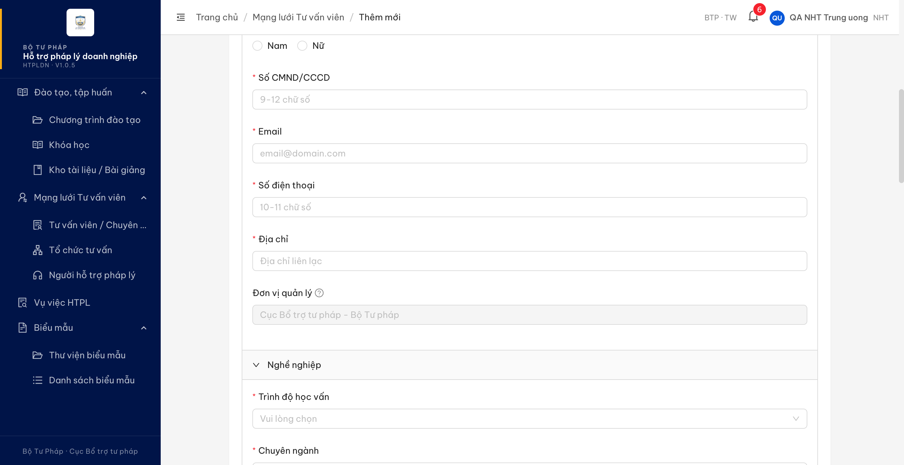

---

## ~~BUG-CNDSMLTVV_OOS_01~~ [CLOSED] — Hủy công khai hàng loạt gỡ hồ sơ khỏi Cổng PLQG ngay khi bấm, không hỏi xác nhận

> **Re-test:** 2026-08-04 00:50 — ✅ PASS (Closed-verified). Chạy lại đúng luồng bug gốc trên gói `index-BrKDNUvo.js` (bản dựng V1.0.5, tài khoản `cbnv_tw_01` — CB_NV_TW, đơn vị Cục Bổ trợ tư pháp - Bộ Tư pháp, cấp TW, cùng vai trò + cùng đơn vị với `cbnv_tw_02` của bug gốc). Tiền đề dựng lại **qua chính giao diện**: `TVV-SEED-0001` được đưa về trạng thái Công khai bằng luồng công khai hàng loạt của phần mềm. Tích chọn 1 dòng đang Công khai → bấm [Hủy công khai] trên thanh thao tác hàng loạt. Đo tại **đủ 7 mốc — 50 / 150 / 300 / 600 / 1000 / 1500 / 2200 mili-giây**: **7/7 mốc đều có hộp thoại xác nhận mở** đúng `MD-HUY-CONG-KHAI` — tiêu đề *"Xác nhận hủy công khai?"*, nội dung *"1 tư vấn viên đã chọn sẽ bị gỡ khỏi Cổng pháp luật quốc gia. Bạn có thể công khai lại bất kỳ lúc nào."*, nút chính (nhấn mạnh, màu cảnh báo) *"Hủy công khai"* cạnh nút phụ *"Hủy bỏ"*. Quan trọng nhất — **thứ tự đã đúng**: tại mốc **50ms** và cả 7 mốc, số lệnh gỡ công khai gửi đi = **0**; chỉ sau khi người dùng bấm xác nhận mới phát đúng **1** lệnh và hiện thông báo *"Đã hủy công khai tư vấn viên thành công"*, dòng chuyển sang "Chưa công khai". Đo 2 cách độc lập: bộ đếm gọi mạng theo mốc thời gian, và nhật ký lệnh trước/sau lúc xác nhận. **Dữ liệu đã hoàn trả**: `TVV-SEED-0001` kết thúc ở đúng trạng thái ban đầu **Chưa công khai** — màn chi tiết không còn khối "Thông tin công khai", nút quay lại thành [Công khai lên Cổng PLQG]. Các hồ sơ khác giữ nguyên (`TVV-BTP-TW-0002`, `DDD-TVV-022`, `DDD-TVV-021` vẫn Công khai; `TVV-STP-AG-0001` vẫn Chưa công khai). Ảnh: [CNDSMLTVV_OOS_01-retest-2026-08-04-hopthoai-xacnhan-huy-cong-khai.png](image/CNDSMLTVV_OOS_01-retest-2026-08-04-hopthoai-xacnhan-huy-cong-khai.png)

### Mô tả

Ở danh sách Tư vấn viên tab "Đang hoạt động", nút **"Hủy công khai"** trên thanh thao tác hàng loạt gỡ hồ sơ khỏi Cổng pháp luật quốc gia ngay khi bấm, không mở hộp thoại `MD-HUY-CONG-KHAI` để người dùng xác nhận.

### Các bước tái hiện

1. Đăng nhập vai trò **Cán bộ nghiệp vụ** — tài khoản `cbnv_tw_02` ("CB Nghiệp vụ - Trung ương #02", cấp TW, đơn vị Cục Bổ trợ tư pháp - Bộ Tư pháp).
2. Vào **Mạng lưới Tư vấn viên → Tư vấn viên / Chuyên gia**, tab **"Đang hoạt động"**.
3. Tích chọn 1 dòng đang ở trạng thái **Công khai** (dùng `TVV-SEED-0001`, được công khai ngay trước đó bằng chính luồng công khai hàng loạt của phần mềm).
4. Bấm nút **"Hủy công khai"** trên thanh thao tác hàng loạt.
5. Quan sát liên tục trong 2,2 giây kể từ lúc bấm xem có hộp thoại hỏi lại nào mở ra không.
6. Đọc trạng thái của dòng sau khi thao tác kết thúc.

### Kết quả mong đợi

- `SCR-IV-01` §Thao tác hàng loạt dòng **1465**: *"**Hủy công khai hàng loạt** (tab "Đang hoạt động"): chọn dòng đã công khai → nút "Hủy công khai" → **MD-HUY-CONG-KHAI** → đặt `cong_khai = 0`..."*
- Mẫu `MD-HUY-CONG-KHAI` ở §3.0b dòng **1407**: tiêu đề *"Xác nhận hủy công khai?"*, nội dung *"Thông tin **{tên}** sẽ bị gỡ khỏi Cổng pháp luật quốc gia. Bạn có thể công khai lại bất kỳ lúc nào."*, nút chính *"Hủy công khai"*.

### Kết quả thực tế

- **Không có bước hỏi lại nào.** Đo tại 7 mốc thời gian sau khi bấm — **50 / 150 / 300 / 600 / 1000 / 1500 / 2200 mili-giây** — cả 7 mốc đều không có hộp thoại nào mở ra (đo cả hộp thoại thường, hộp thoại xác nhận và bong bóng xác nhận).
- Ngay tại mốc **50 mili-giây**, lệnh gỡ công khai **đã được gửi đi** — hệ thống không hề chờ người dùng xác nhận.
- Toàn thao tác gửi đúng **1 lệnh** và hiện đúng **1 thông báo** *"Đã hủy công khai tư vấn viên thành công"*. Sau đó trạng thái dòng đổi thành "Chưa công khai".
- Tái hiện **3/3 lần**.
- **Đối chiếu trong cùng màn hình**: chiều ngược lại (công khai hàng loạt) **có** mở hộp thoại để người dùng xem lại trước khi xác nhận — nên việc thiếu bước hỏi lại chỉ xảy ra ở chiều hủy công khai.
- Nút "Hủy công khai" nằm ngay cạnh nút "Công khai lên Cổng PLQG" trên cùng thanh thao tác, nên bấm nhầm là thông tin bị gỡ khỏi Cổng pháp luật quốc gia ngay, không có bước nào để dừng lại.

### Bằng chứng

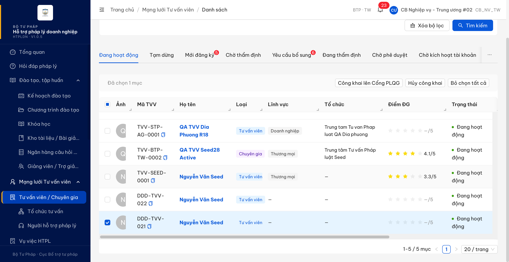

**Dữ liệu test**: `TVV-SEED-0001` đã được đưa về đúng trạng thái ban đầu (Chưa công khai) sau khi đo.

---

## ~~BUG-CNDSMLTVV_OOS_02~~ [CLOSED] — Hộp thoại công khai hàng loạt thiếu hoàn toàn phần "Tệp đính kèm"

> **Re-test:** 2026-08-04 00:48 — ✅ PASS (Closed-verified). Chạy lại đúng luồng bug gốc trên gói `index-BrKDNUvo.js` (bản dựng V1.0.5, tài khoản `cbnv_tw_01` — CB_NV_TW, đơn vị Cục Bổ trợ tư pháp - Bộ Tư pháp, cấp TW, cùng vai trò + cùng đơn vị với `cbnv_tw_02` của bug gốc), cùng hồ sơ `TVV-SEED-0001`. Hộp thoại **hàng loạt** nay **đã có** phần Tệp đính kèm đúng như `MD-CONG-KHAI` mục (b) quy định: nhãn *"Tệp đính kèm (tùy chọn)"*, **2** vùng tải tệp (trước là **0**), ô chọn tệp cho phép **nhiều tệp**, nhận đúng nhóm định dạng `.pdf, .doc, .docx, .xls, .xlsx`, kèm 2 dòng mô tả giới hạn *"Tối đa 10 tệp … Dung lượng tối đa: 20MB/tệp."*. **Phép đối chứng chạy lại đầy đủ**: mở hộp thoại công khai từ **màn chi tiết** cùng hồ sơ, cùng tài khoản, cùng phiên → cấu trúc **giống hệt** (2 vùng tải tệp · nhãn `["Mô tả công khai", "Tệp đính kèm (tùy chọn)"]` · cùng nhóm định dạng · cùng giới hạn) → hai đường vào đã đồng nhất. Không dừng ở quan sát giao diện: đã **chạy trọn luồng** — đính kèm 1 tệp PDF vào hộp thoại hàng loạt, nhập mô tả, bấm [Công khai] → gửi đúng **1 lệnh** công khai theo lô, hiện thông báo *"Đã công khai tư vấn viên thành công"*, và mở lại màn chi tiết thấy khối "Thông tin công khai" lưu đúng **File đính kèm công khai: `the-hanh-nghe-qa.pdf`** + Thời gian đăng tải 04/08/2026 → tệp được lưu thật, không chỉ hiện trên giao diện. Ảnh: [hộp thoại hàng loạt có Tệp đính kèm](image/CNDSMLTVV_OOS_02-retest-2026-08-04-hangloat-CO-tepdinhkem.png) · [đối chứng màn chi tiết](image/CNDSMLTVV_OOS_02-retest-2026-08-04-doichung-chitiet.png) · [tệp lưu thật sau khi công khai](image/CNDSMLTVV_OOS_02-retest-2026-08-04-tep-luu-that-sau-cong-khai.png)

### Mô tả

Hộp thoại mở từ nút **"Công khai lên Cổng PLQG"** trên thanh thao tác hàng loạt chỉ có ô "Mô tả công khai", thiếu hoàn toàn phần **File đính kèm** mà mẫu `MD-CONG-KHAI` quy định.

### Các bước tái hiện

1. Đăng nhập `cbnv_tw_02` (Cán bộ nghiệp vụ, cấp TW, đơn vị Cục Bổ trợ tư pháp - Bộ Tư pháp) — đúng vai trò mà `FR-IV-08:657` chỉ định là người tải tệp đính kèm.
2. Vào **Mạng lưới Tư vấn viên → Tư vấn viên / Chuyên gia**, tab **"Đang hoạt động"**.
3. Tích chọn 1 dòng (`TVV-SEED-0001`), bấm **"Công khai lên Cổng PLQG"** trên thanh thao tác hàng loạt.
4. Đếm số vùng tải tệp và đọc các nhãn trường trong hộp thoại vừa mở.
5. Đóng hộp thoại, mở **màn hình chi tiết** của chính hồ sơ đó rồi bấm **"Công khai lên Cổng PLQG"**.
6. So sánh các phần nhập của hai hộp thoại.

### Kết quả mong đợi

- `SCR-IV-01` §Thao tác hàng loạt dòng **1464**: *"**Công khai hàng loạt** ... → nút "Công khai lên Cổng pháp luật quốc gia" → **mở MD-CONG-KHAI**"*.
- Mẫu `MD-CONG-KHAI` §3.0b dòng **1406** gồm 3 phần: (a) Mô tả công khai — bắt buộc, tối đa 5000 ký tự; **(b) File đính kèm — PDF/DOC/DOCX/XLS/XLSX, max 20MB/file, nhiều file, tùy chọn**; (c) cảnh báo.
- Phần (b) cũng có trong `FR-IV-08` §Trường dữ liệu dòng **657**: `file_dinh_kem_cong_khai` — *"CB Nghiệp vụ upload (tùy chọn) trong modal MD-CONG-KHAI"*.

### Kết quả thực tế

| | Hộp thoại hàng loạt | Hộp thoại từ màn chi tiết |
|---|---|---|
| Tiêu đề | "Công khai hàng loạt lên Cổng PLQG" | "Công khai TVV "Nguyễn Văn Seed" lên Cổng PLQG" |
| Số vùng tải tệp | **0** | **2** |
| Nhãn trường | `["Mô tả công khai"]` | `["Mô tả công khai", "Tệp đính kèm (tùy chọn)"]` |
| Mô tả định dạng tệp | *(không có)* | "Tối đa 10 tệp. Định dạng: .pdf, .doc, .docx, .xls, .xlsx. Dung lượng tối đa: 20MB/tệp." |

- Hộp thoại hàng loạt chỉ có phần (a) và (c); toàn bộ chữ trong hộp thoại **không hề nhắc tới** tệp đính kèm hay định dạng tệp — thiếu hoàn toàn phần (b).
- Đối chứng đo **trong cùng phiên làm việc, cùng tài khoản, cùng hồ sơ**: phần tải tệp đính kèm đã được làm và chạy được, khớp đúng phần (b) của đặc tả. Vậy chỉ riêng đường vào từ thao tác hàng loạt là thiếu — không phải do tài khoản không có quyền đính kèm.
- Hệ quả: cán bộ nghiệp vụ công khai theo lô không đính kèm được tệp giới thiệu cho các hồ sơ trong lô, phải mở lại từng hồ sơ để bổ sung.

### Bằng chứng

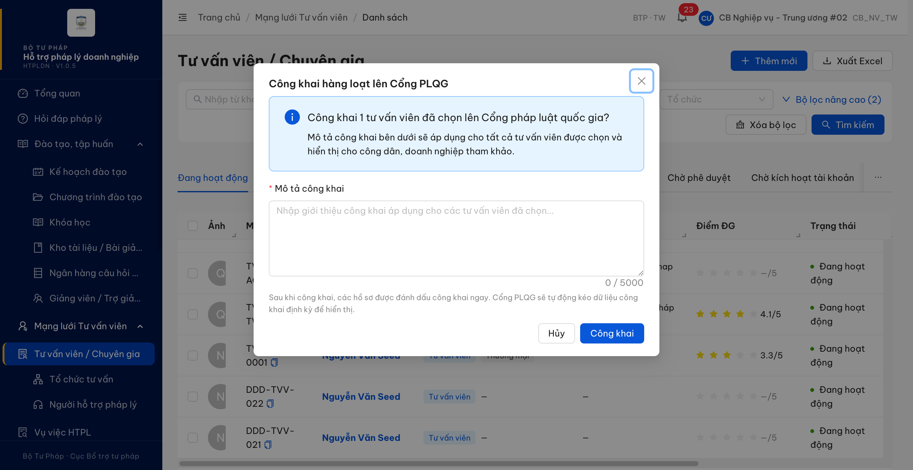

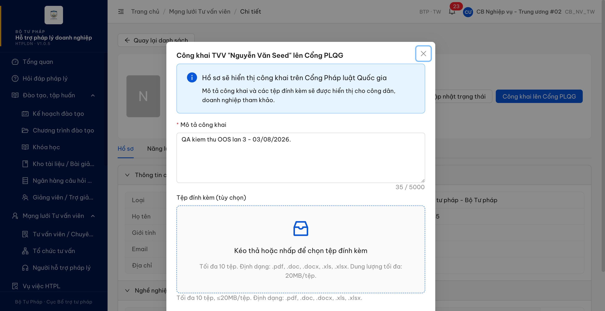

---

## ~~BUG-CNDSMLTVV_OOS_03~~ [CLOSED] — Bỏ trống "Mô tả công khai" hiện 2 thông báo lỗi trùng nghĩa

> **Re-test:** 2026-08-04 00:43 — ✅ PASS (Closed-verified). Chạy lại đúng luồng bug gốc trên gói `index-BrKDNUvo.js` (bản dựng V1.0.5, tài khoản `cbnv_tw_01` — CB_NV_TW, đơn vị Cục Bổ trợ tư pháp - Bộ Tư pháp, cấp TW, cùng vai trò + cùng đơn vị với `cbnv_tw_02` của bug gốc): tab "Đang hoạt động" → tích `TVV-SEED-0001` → [Công khai lên Cổng PLQG] → để trống ô "Mô tả công khai" (bộ đếm `0 / 5000`) → bấm [Công khai]. Hệ thống **chặn đúng** (gửi **0 lệnh** công khai — đo 2 nguồn độc lập: bộ đếm gọi mạng cài trước khi bấm chỉ ghi nhận 1 lệnh nền không liên quan là đếm thông báo chưa đọc, và nhật ký mạng trình duyệt không có lệnh công khai nào; hộp thoại vẫn mở) và nay chỉ hiện **1** dòng báo lỗi duy nhất. Đo diện tích chiếm chỗ thật bằng `innerText`: **1** node, **592×22** điểm ảnh, `display: block` · `visibility: visible` · `opacity: 1`; khối chứa thông báo cao **22px** (trước là 2 dòng). Đo lại bằng cách thứ hai — đếm phần tử con của khối chứa thông báo — cũng ra **1** con duy nhất. Nội dung câu chữ nay **khớp `ERR-CK-02`** ở `FR-IV-08:682`: *"Mô tả công khai là bắt buộc trước khi công khai lên Cổng pháp luật quốc gia"*. Dữ liệu không đổi: `TVV-SEED-0001` vẫn **Chưa công khai**. Ảnh: [CNDSMLTVV_OOS_03-retest-2026-08-04-mot-thong-bao-loi-duy-nhat.png](image/CNDSMLTVV_OOS_03-retest-2026-08-04-mot-thong-bao-loi-duy-nhat.png)

### Mô tả

Trong hộp thoại công khai lên Cổng pháp luật quốc gia, bỏ trống ô "Mô tả công khai" rồi xác nhận thì hệ thống chặn đúng nhưng hiện **2 dòng báo lỗi cùng nghĩa** cho cùng một ô, và cả 2 đều không dùng nội dung thông báo mà `ERR-CK-02` quy định.

### Các bước tái hiện

1. Đăng nhập `cbnv_tw_02` (Cán bộ nghiệp vụ, cấp TW, đơn vị Cục Bổ trợ tư pháp - Bộ Tư pháp).
2. Vào **Mạng lưới Tư vấn viên → Tư vấn viên / Chuyên gia**, tab **"Đang hoạt động"**.
3. Tích chọn 1 dòng, bấm **"Công khai lên Cổng PLQG"** để mở hộp thoại công khai.
4. **Để trống** ô "Mô tả công khai" (0 / 5000 ký tự).
5. Bấm nút xác nhận **"Công khai"**.
6. Đếm số dòng báo lỗi hiện ra dưới ô nhập.

### Kết quả mong đợi

- `FR-IV-08` §Xử lý lỗi dòng **682** định nghĩa **duy nhất một** mã lỗi cho tình huống này: trường hợp E2 *"Thiếu mô tả công khai khi CONG_KHAI"* → `ERR-CK-02` → *"Mô tả công khai là bắt buộc trước khi công khai lên Cổng pháp luật quốc gia"*.
- Hệ thống chặn thao tác và báo cho người dùng đúng một lần.

### Kết quả thực tế

- Hệ thống **chặn đúng** (gửi **0 lệnh** ra máy chủ, hộp thoại vẫn mở) nhưng hiện **2 dòng báo lỗi cùng nghĩa** cho cùng một ô, xếp chồng ngay dưới ô "Mô tả công khai":
  1. *"Vui lòng nhập mô tả công khai"*
  2. *"Mô tả công khai không được để trống"*
- Đã kiểm **cả 2 dòng đều thực sự hiển thị** trên màn hình: mỗi dòng chiếm một vùng riêng **592×22** điểm ảnh (đo diện tích chiếm chỗ thực tế), không phải chữ ẩn dành cho trình đọc màn hình — loại trừ khả năng đây là hiện tượng của công cụ đo.
- Ngoài việc lặp, cả 2 câu đều **không dùng** nội dung thông báo mà đặc tả quy định ở dòng 682.

### Bằng chứng

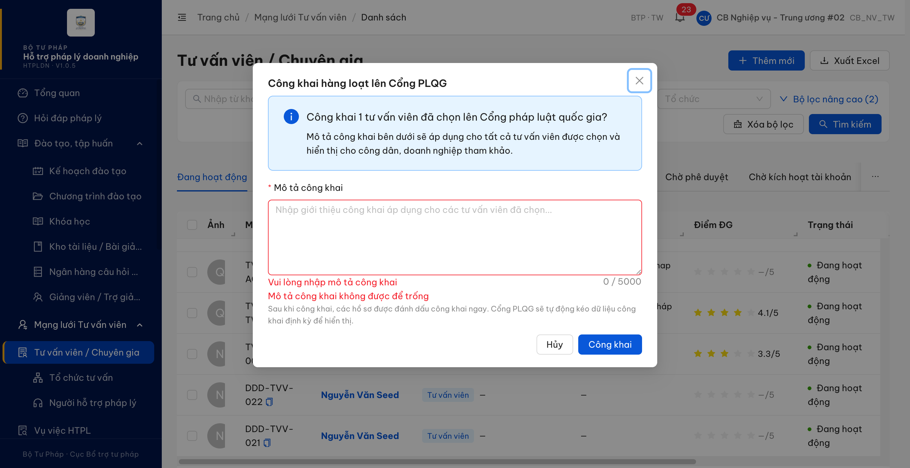

---

## Phụ lục — Môi trường test

| Thành phần | Giá trị |
|------------|---------|
| URL ứng dụng | https://18.143.165.120.nip.io |
| Bản dựng | HTPLDN · V1.0.5 |
| OTP login | OTP từ MailHog |
| MailHog (OTP inbox) | http://18.143.165.120:8025 |
| API base | https://18.143.165.120.nip.io/api/v1 |
| Frontend | React + Ant Design v5 |
| Xác thực | JWT + OTP |
| Tool test | Chrome DevTools MCP |
| Dữ liệu do đợt kiểm thử tạo ra (CHƯA dọn) | `TVV-BTP-TW-0031` — "QA OOS01 Khong So The Hanh Nghe", trạng thái **Mới đăng ký**, `laCongKhai = false`. Đây là bằng chứng của BUG-DKTGMLTVV_OOS_01 (hồ sơ lưu được dù trống "Số thẻ hành nghề") nên **cố ý giữ lại**; xóa đi là mất bằng chứng. Đề nghị dọn sau khi dev xác nhận lỗi. |
| Dữ liệu đã hoàn trả nguyên trạng | `TVV-SEED-0001` — công khai rồi hủy công khai trong lúc đo BUG-CNDSMLTVV_OOS_01 / _OOS_02 / _OOS_03 (cả vòng log 03/08 lẫn vòng re-verify 04/08), kết thúc ở đúng trạng thái ban đầu **Chưa công khai** (màn chi tiết không còn khối "Thông tin công khai"). Trường `moTaCongKhai` giữ chuỗi kiểm thử "QA kiem thu OOS lan 3 - 03/08/2026." — dữ liệu ngủ, KHÔNG hiển thị công khai (`laCongKhai = false`), và không gỡ được qua giao diện vì công khai với mô tả rỗng bị chặn theo thiết kế. |
| Hồ sơ KHÔNG bị đụng | `TVV-BTP-TW-0002`, `DDD-TVV-022`, `DDD-TVV-021` vẫn ở trạng thái Công khai; `TVV-STP-AG-0001` vẫn Chưa công khai — đúng như trước khi đo. |
| Tài khoản dùng ra verdict | `nht_qa_tw` (NHT, cấp TW) — BUG-DKTGMLTVV_05 / -B, BUG-DKTGMLTVV_OOS_01 / _OOS_02 · `cbnv_tw_02` (CB_NV_TW, BTP·TW) — BUG-QLLSHTCTVV_03 / -B / _04, BUG-CNDSMLTVV_OOS_01 / _OOS_02 / _OOS_03. Không dùng admin |

---

*Bug report generated: 2026-08-03 17:45:00 | QA Automation via Claude Code*

---
