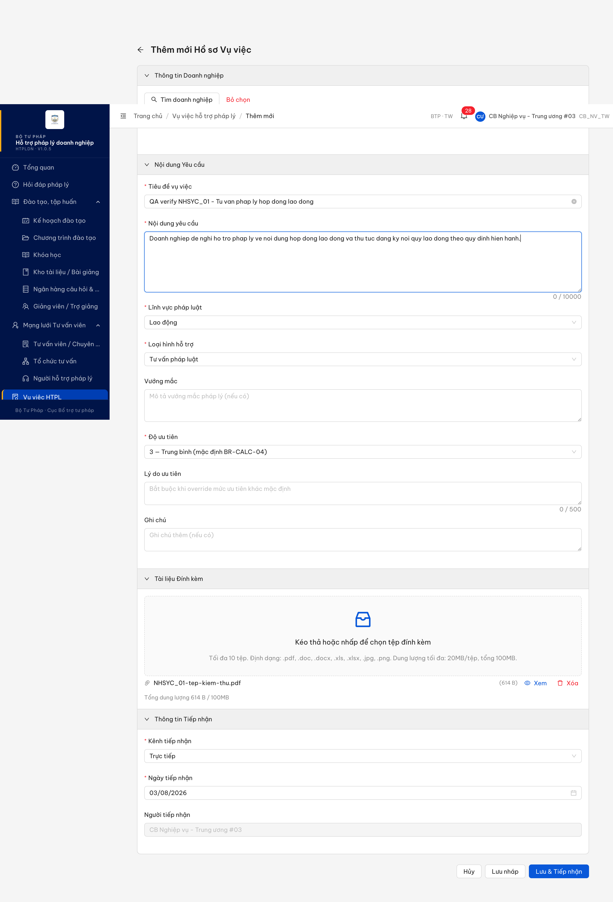
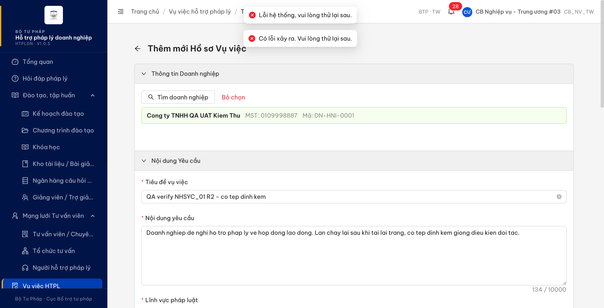
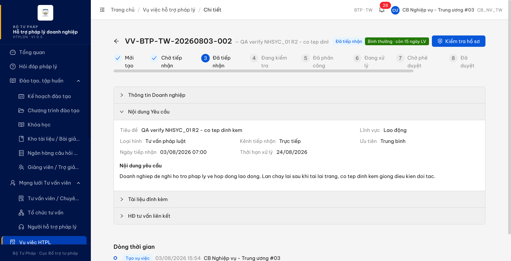
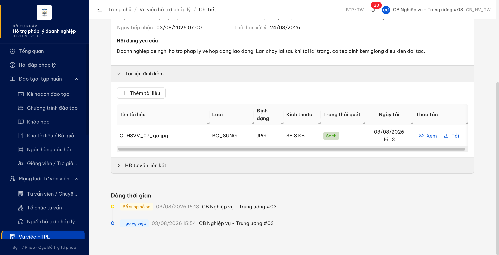
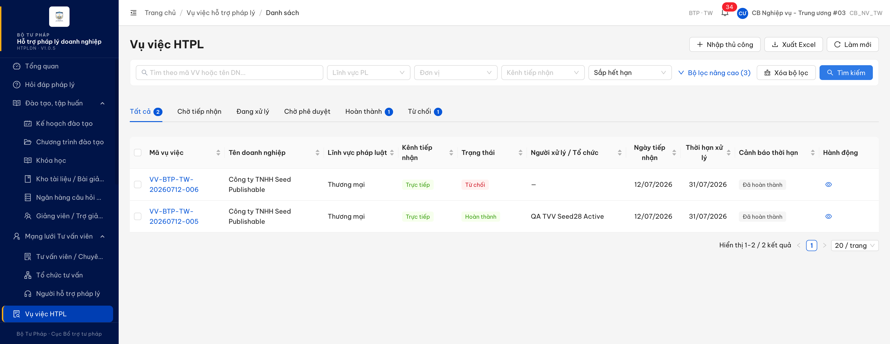

# Bug Report — Vụ việc hỗ trợ pháp lý (Nhập hồ sơ thủ công)

| Thông tin | Giá trị |
|-----------|---------|
| **Dự án** | PM HTPLDN — UAT đối tác |
| **Môi trường** | https://18.143.165.120.nip.io/ (FE hiển thị `HTPLDN · V1.0.5`) — dùng cho các lượt kiểm tới hết 04/08/2026 01:13.<br>https://htpldn-uat.ospgroup.vn/ (FE hiển thị `HTPLDN · V1.0.5`) — môi trường dev dựng bản vá, dùng cho lượt kiểm 04/08/2026 11:47 (BUG-NHSYC_01, BUG-NHSYC_01-B, BUG-NHSYC_01-C). Mỗi dòng Re-test đều ghi rõ môi trường đã dùng. |
| **Người test** | QA Automation (Claude Code) |
| **Ngày** | 2026-08-04 11:57:00 |
| **Loại test** | Re-verify sau dev fix (UAT tuần 2, vòng 1) |
| **Round** | Verify vòng 1 — `reverify-week-2/verify1-conlai-2026-08-03` |
| **Tài liệu tham chiếu** | `Docs-PM-HTPLDN/_bmad-output/planning-artifacts/srs-v3.5/srs-fr-05-vu-viec.md` · bảng điều kiện [NHSYC_01](../../cond/NHSYC_01.md) · [QLHSVV_07](../../cond/QLHSVV_07.md) · bảng điều kiện lượt UAT [NHSYC_01-uat](../../cond/NHSYC_01-uat.md) · audit [NHSYC_01](../../reverify-audit/NHSYC_01.md) · [bản sao note dev row 127](../../reverify-audit/NHSYC_01-row127-note-dev-truoc-khi-ghi-de-2026-08-04.md) · [QLHSVV_07](../../reverify-audit/QLHSVV_07.md) |

---

## Tổng hợp

> **Verify vòng 1 (2026-08-03) — NHSYC_01:** dev báo `dev done` cho lỗi `ngayTiepNhan must be a valid ISO 8601 date string`. Lỗi định dạng ngày ĐÃ hết (FE gửi `"ngayTiepNhan":"2026-08-03"`, không còn 422). Nhưng đúng điều kiện của đối tác (**hồ sơ CÓ tệp đính kèm**) thì vẫn **không tạo được hồ sơ** — máy chủ trả lỗi hệ thống. Mở 2 bug: 1 Critical (không tạo được hồ sơ khi có tệp đính kèm) + 1 Medium (điểm ưu tiên không tự tính theo quy tắc NĐ 55/2019 Điều 4).
> **Bug entry bổ sung 2026-08-04 — NHSYC_OOS_01 (row 131):** lỗi QA tự phát hiện khi verify NHSYC_01, trước đó chỉ có audit + bảng đối chiếu điều kiện mà **chưa có bug entry** để dev đọc. Viết bổ sung để re-verify được vòng này (dev đã báo `dev done`).
> **Verify vòng 1 (2026-08-03) — QLHSVV_07:** case chính (nút [Tải] tệp đính kèm) **PASS** — bản V1.0.5 đã tách 2 nút [Xem] / [Tải] đúng `SCR-V.I-03 dòng 1729`, [Tải] tải tệp về máy thật (MD5 trùng khít, 3/3 lần) ⇒ **không mở bug cho case này**. Phát hiện thêm 1 lỗi **ngoài phạm vi case** ở cùng màn: cột "Loại" của bảng tài liệu đính kèm lộ mã nội bộ `BO_SUNG` (Minor, đã mở dòng sheet `QLHSVV_OOS_01` row 133).

### Severity breakdown

| Tổng | Critical | Major | Medium | Minor | Trivial | Closed | Open |
|------|----------|-------|--------|-------|---------|--------|------|
| 6    | 1        | 1     | 1      | 3     | 0       | 2      | 4    |

## Bug Summary Table

| Bug ID | Severity | Priority | Type | TC Ref | **SRS Reference** | Title | Status |
|--------|----------|----------|------|--------|-------------------|-------|--------|
| BUG-TKHSYCHTPL_OOS_01 | Minor | P3 | UI/UX | TKHSYCHTPL_OOS_01 (row 145, tuần 2 — QA mở mới) | `FR-V.I` §cột danh sách `srs-fr-05-vu-viec.md:1656` · thực thể `muc_do_canh_bao` `:2031` | Cột "Cảnh báo thời hạn" hiển thị nhãn "Đã hoàn thành" — một mức không tồn tại trong hệ thống (chỉ có 4 mức hợp lệ) | Open |
| BUG-NHSYC_01 | Critical | P0 | Happy | NHSYC_01 | `FR-V.I-04 (UC54) §Processing bước 7 (dòng 342)` · `SCR-V.I-02 Thành phần row 15 (dòng 1694)` | Nhập hồ sơ thủ công có tệp đính kèm: bấm [Lưu & Tiếp nhận] không tạo được hồ sơ, hệ thống báo lỗi hệ thống | Open |
| BUG-NHSYC_01-B | Medium | P2 | Data | NHSYC_01 | `FR-V.I-04 §Processing bước 6 (dòng 341)` · `BR-CALC-07 (dòng 2412)` · `SCR-V.I-02 Quy tắc tương tác (dòng 1709)` | Điểm ưu tiên vụ việc luôn = 3 (Trung bình), không tự tính theo hồ sơ doanh nghiệp | Open |
| BUG-NHSYC_01-C | Major | P1 | Data | NHSYC_01 | `HO_SO_VU_VIEC ten_tai_lieu (dòng 2057)` · `duong_dan_file (dòng 2059)` · `FILE_DINH_KEM ten_file (dòng 2223)` · `SCR-V.I-02 thành phần row 16 (dòng 1695)` | Tệp đính kèm ngay tại biểu mẫu tạo hồ sơ không được gắn vào hồ sơ: mất tên gốc, mất định dạng, mất dung lượng và không xem / tải lại được | Open |
| BUG-NHSYC_OOS_01 | Minor | P3 | UI/UX | NHSYC_OOS_01 (sheet tuần 2 row 131 — QA mở mới) | `FR-V.I-04 (UC54) §Error Handling (dòng 356-362)` · `UI-04` `srs-v3.5.md:575` | Một lần bấm [Lưu & Tiếp nhận] rơi vào nhánh lỗi sinh HAI khung thông báo cùng lúc với hai câu chữ khác nhau | Closed |
| BUG-QLHSVV_OOS_01 | Minor | P3 | UI/UX | QLHSVV_OOS_01 (phát hiện khi verify QLHSVV_07) | `FR-V.I-07 (UC57)` · `SCR-V.I-03 Thành phần row 6 (dòng 1729)` | Cột "Loại" bảng tài liệu đính kèm hiển thị mã nội bộ `BO_SUNG` thay vì nhãn tiếng Việt | Closed |

---

## BUG-NHSYC_01 — Nhập hồ sơ thủ công có tệp đính kèm: không tạo được hồ sơ, hệ thống báo lỗi hệ thống

> **Re-test:** 2026-08-04 11:47 — ⚠️ Một phần. Kiểm trên môi trường `https://htpldn-uat.ospgroup.vn` (bản dựng V1.0.5), vai trò `cbnv_tw` (CB_NV_TW, BTP · TW). Triệu chứng gốc **hết**: lưu hồ sơ có tệp đính kèm không còn báo lỗi hệ thống, hồ sơ tạo được (`VV-BTP-TW-20260804-001`, `VV-BTP-TW-20260804-002`, đều ở trạng thái "Đã tiếp nhận"). Nhưng mục tiêu nghiệp vụ của case vẫn **chưa đạt**: tệp đính kèm không gắn được vào hồ sơ ⇒ mở BUG-NHSYC_01-C. Giữ Open cho tới khi tệp dùng được.

### Mô tả

Cán bộ nghiệp vụ nhập hồ sơ vụ việc thủ công, điền đủ thông tin hợp lệ **và đính kèm một tệp PDF**, rồi bấm [Lưu & Tiếp nhận]. Hệ thống không tạo hồ sơ, không chuyển sang màn Chi tiết, mà hiển thị hai thông báo lỗi cùng lúc: "Lỗi hệ thống, vui lòng thử lại sau." và "Có lỗi xảy ra. Vui lòng thử lại sau.". Nếu gỡ tệp đính kèm ra rồi bấm lại với đúng phần thông tin còn lại thì hồ sơ được tạo bình thường — nên tệp đính kèm là yếu tố quyết định. Tệp đã upload thành công trước đó (bước upload trả 201), lỗi chỉ xảy ra ở bước lưu hồ sơ.

### Các bước tái hiện

1. Đăng nhập tài khoản `cbnv_tw_03` — vai trò **CB Nghiệp vụ Trung ương (CB_NV_TW)**, đơn vị Bộ Tư pháp · TW; vai trò này có quyền "Nhập hồ sơ VV" theo `srs-fr-05-vu-viec.md:311` (PRE-01) nên được phép thao tác trên màn SCR-V.I-02.
2. Vào menu **Vụ việc HTPL** → bấm nút **[+ Nhập thủ công]**.
3. Nhóm "Thông tin Doanh nghiệp": bấm [Tìm doanh nghiệp], tìm "QA UAT", chọn `Cong ty TNHH QA UAT Kiem Thu` (MST 0109998887, mã DN-HNI-0001).
4. Nhóm "Nội dung Yêu cầu": nhập Tiêu đề, Nội dung yêu cầu; chọn Lĩnh vực = **Lao động**, Loại hình hỗ trợ = **Tư vấn pháp luật**; để Độ ưu tiên nguyên giá trị mặc định.
5. Nhóm "Tài liệu Đính kèm": chọn một tệp **PDF** (đã thử 2 tệp khác nhau, 614 B). Đợi tệp hiện trong danh sách kèm nút [Xem] [Xóa].
6. Nhóm "Thông tin Tiếp nhận": để nguyên Kênh tiếp nhận = **Trực tiếp**, Ngày tiếp nhận = **ngày hiện tại** (giá trị mặc định form, không sửa tay).
7. Bấm **[Lưu & Tiếp nhận]**.
8. Quan sát: hai khung thông báo lỗi hiện ở đỉnh màn hình, màn hình vẫn đứng ở "Thêm mới Hồ sơ Vụ việc", không sinh mã hồ sơ.
9. Đối chứng: bấm [Gỡ bỏ tập tin] để bỏ tệp đính kèm rồi bấm lại [Lưu & Tiếp nhận] — hồ sơ được tạo, chuyển sang màn Chi tiết.

### Kết quả mong đợi

- Theo `srs-fr-05-vu-viec.md:342` (FR-V.I-04 §Processing bước 7), khi cán bộ nghiệp vụ nhập hồ sơ thủ công với dữ liệu hợp lệ thì hệ thống phải tạo được vụ việc ở trạng thái `DA_TIEP_NHAN`.
- Theo `srs-fr-05-vu-viec.md:1694` (SCR-V.I-02 thành phần row 15), tệp PDF trong hạn mức cho phép (tối đa 20MB/tệp, tổng 100MB, tối đa 10 tệp) là dữ liệu hợp lệ của màn này, nên việc đính kèm tệp không được làm hỏng thao tác lưu hồ sơ.
- Theo `srs-fr-05-vu-viec.md:344` (§Processing bước 9), tài liệu đính kèm phải được lưu cùng hồ sơ.
- Nếu vì lý do nghiệp vụ nào đó mà tệp bị từ chối, hệ thống phải báo đúng nguyên nhân cho người dùng (mục §Error Handling của FR-V.I-04 quy định các thông báo lỗi cụ thể theo từng điều kiện), chứ không dừng ở thông báo lỗi hệ thống chung chung.

### Kết quả thực tế

- Hồ sơ **không được tạo**; màn hình vẫn ở "Thêm mới Hồ sơ Vụ việc", không sinh mã vụ việc, không chuyển màn Chi tiết.
- Hai thông báo lỗi hiển thị cùng lúc cho **một** lần gửi dữ liệu: "Lỗi hệ thống, vui lòng thử lại sau." và "Có lỗi xảy ra. Vui lòng thử lại sau." (đo bằng `tools/toast-capture.js`, tự kiểm số observer = 1, số request ghi dữ liệu = 1).
- Máy chủ trả **HTTP 500** với mã lỗi `ERR-SYS-00-00-01` — lỗi hệ thống, không phải lỗi nghiệp vụ.
- Tái hiện **3/3 lần** trên giao diện (trong đó 1 lần sau khi tải lại trang bỏ cache) và **1/1 lần** khi gọi thẳng dịch vụ với cùng dữ liệu.
- Đối chứng cô lập nguyên nhân: cùng dữ liệu nhưng **bỏ phần tệp đính kèm** thì tạo được hồ sơ `VV-BTP-TW-20260803-002`, trạng thái "Đã tiếp nhận", thời hạn xử lý 24/08/2026.
- Lỗi cũ mà đối tác báo (`ngayTiepNhan must be a valid ISO 8601 date string`) **đã hết**: dữ liệu gửi lên có `"ngayTiepNhan":"2026-08-03"` đúng định dạng, không còn lỗi 422.

### Bằng chứng

**1. Ảnh chụp**







**2. API response / log**

Dữ liệu gửi lên (`POST /api/v1/vu-viecs/manual`) — trường ngày đã đúng định dạng ISO:

```json
{
  "tieuDe": "QA verify NHSYC_01 - Tu van phap ly hop dong lao dong",
  "linhVucId": "bbbbbbbb-0000-4000-8000-000000000013",
  "loaiHinhHtId": "4f09df19-224f-4a00-bcf7-479f8d77f476",
  "kenhTiepNhan": "TRUC_TIEP",
  "ngayTiepNhan": "2026-08-03",
  "doanhNghiepId": "829abcac-b0af-4cde-9af9-ec51bc79014c",
  "fileDinhKemIds": ["0c1fd442-35ca-4f8a-8500-500d34aaa0b4"],
  "uuTien": 3
}
```

Phản hồi — HTTP 500:

```json
{
  "success": false,
  "error": {
    "code": "ERR-SYS-00-00-01",
    "message": "Lỗi hệ thống, vui lòng thử lại sau",
    "timestamp": "2026-08-03T08:46:16.404Z",
    "requestId": "ab057393-e921-47d0-a118-8123bfbbdffe"
  }
}
```

Đối chứng cùng dữ liệu nhưng bỏ phần tệp đính kèm — HTTP 201:

```json
{
  "success": true,
  "data": {
    "maVuViec": "VV-BTP-TW-20260803-001",
    "trangThai": "DA_TIEP_NHAN",
    "ngayTiepNhan": "2026-08-03T00:00:00.000Z",
    "deadline": "2026-08-24T00:00:00.000Z",
    "uuTien": 3
  }
}
```

---

## BUG-NHSYC_01-B — Điểm ưu tiên vụ việc luôn = 3 (Trung bình), không tự tính theo hồ sơ doanh nghiệp

> **Re-test:** 2026-08-04 11:57 — ⚠️ Một phần. Cùng môi trường / vai trò như trên. Phần **tính** đã đúng: DN `Công ty TNHH Mẫu Test` không có dữ liệu ưu tiên nào (quy mô, số lao động, số lao động nữ, số lao động khuyết tật đều trống, không phải nữ làm chủ) ⇒ hệ thống lưu `uuTien = 1`, khớp `srs-fr-05-vu-viec.md:196` ("Tối thiểu `uu_tien=1` (FIFO)"); ô "Độ ưu tiên" cũng đã bỏ mã quy tắc nội bộ, nay ghi "Để trống để hệ thống tự tính theo hồ sơ doanh nghiệp". Phần **hiển thị** vẫn sai: giao diện gắn nhãn "Rất cao" cho giá trị 1, trong khi `srs-fr-05-vu-viec.md:1526` quy định 1 → "Thấp" và thang chạy 1–5 với 1 là đầu thấp nhất (`:326`). ⚠️ Bộ chữ hiển thị cần BA chốt vì `:1522` ghi bảng nhãn là đề xuất — nhưng **chiều** của thang thì không mơ hồ. Đo 2 lần, cả 2 hồ sơ đều `uuTien = 1` mà màn hình ghi "Rất cao".

### Mô tả

Khi tạo hồ sơ vụ việc thủ công, ô "Độ ưu tiên" luôn để sẵn giá trị `3 — Trung bình` và hồ sơ tạo ra luôn mang mức ưu tiên 3, bất kể hồ sơ doanh nghiệp có thuộc diện được ưu tiên hay không. Kể cả khi không gửi giá trị ưu tiên nào lên, hệ thống vẫn trả về 3 — tức mức ưu tiên là một giá trị mặc định cố định chứ không phải kết quả tính theo hồ sơ doanh nghiệp. Nhãn của ô này còn hiển thị mã quy tắc nội bộ đã lỗi thời ("mặc định BR-CALC-04") ngay trên giao diện người dùng.

### Các bước tái hiện

1. Đăng nhập `cbnv_tw_03` — vai trò **CB Nghiệp vụ Trung ương (CB_NV_TW)**, có quyền "Nhập hồ sơ VV" theo `srs-fr-05-vu-viec.md:311`.
2. Vào **Vụ việc HTPL** → **[+ Nhập thủ công]**.
3. Chọn doanh nghiệp `Cong ty TNHH QA UAT Kiem Thu` (MST 0109998887) — hồ sơ doanh nghiệp này **không** do phụ nữ làm chủ, **không** có số lao động nữ, **không** có số lao động khuyết tật (đều để trống).
4. Quan sát ô "Độ ưu tiên": hiển thị sẵn `3 — Trung bình (mặc định BR-CALC-04)`.
5. Điền các trường bắt buộc còn lại, không đính kèm tệp, bấm [Lưu & Tiếp nhận].
6. Mở màn Chi tiết hồ sơ vừa tạo, xem dòng "Ưu tiên".

### Kết quả mong đợi

- Theo `srs-fr-05-vu-viec.md:341` (FR-V.I-04 §Processing bước 6), hệ thống phải tự tính mức ưu tiên theo BR-CALC-07 dựa trên hồ sơ doanh nghiệp, cán bộ chỉ ghi đè khi có lý do.
- Theo `srs-fr-05-vu-viec.md:2412` (BR-CALC-07 — NĐ 55/2019 Điều 4), mức ưu tiên được cộng điểm theo từng yếu tố: doanh nghiệp do phụ nữ làm chủ +3, nhiều lao động nữ +2, từ 30% lao động khuyết tật +2, và +1 theo thứ tự đến trước.
- Theo `srs-fr-05-vu-viec.md:1709` (SCR-V.I-02 §Quy tắc tương tác), khi hồ sơ doanh nghiệp thiếu các thông tin ưu tiên thì kết quả tính phải ra mức thấp nhất (1) chứ không chặn việc tạo hồ sơ.
- Với doanh nghiệp ở bước 3 (không có yếu tố ưu tiên nào), mức ưu tiên của hồ sơ phải là **1**.
- Giao diện người dùng không nên hiển thị mã quy tắc nội bộ; nếu vẫn giữ thì phải là mã đang có hiệu lực — mã cũ đã được đổi sang BR-CALC-07 từ bản SRS v3.5 (`CHANGELOG-v3-to-v3.5.md:2667`), còn mã cũ hiện đang dùng cho nghiệp vụ khác (trọng số tiêu chí đánh giá).

### Kết quả thực tế

- Ô "Độ ưu tiên" luôn để sẵn `3 — Trung bình (mặc định BR-CALC-04)`; giá trị **không đổi** sau khi chọn doanh nghiệp.
- Hồ sơ tạo ra có mức ưu tiên **3** ("Trung bình" trên màn Chi tiết), trong khi theo quy tắc phải là **1**.
- Gọi thẳng dịch vụ tạo hồ sơ **không kèm** trường ưu tiên, hệ thống vẫn trả về mức ưu tiên **3** → không có bước tự tính theo hồ sơ doanh nghiệp.
- Nhãn trên giao diện lộ mã quy tắc nội bộ và là mã đã lỗi thời.

### Bằng chứng

**1. Ảnh chụp**


**2. API response / log**

Hồ sơ doanh nghiệp dùng để tạo — không có yếu tố ưu tiên nào:

```json
{
  "tenDoanhNghiep": "Cong ty TNHH QA UAT Kiem Thu",
  "maSoThue": "0109998887",
  "laNuLamChu": false,
  "soLaoDong": null,
  "soLaoDongNu": null,
  "soLaoDongKhuyetTat": null
}
```

Tạo hồ sơ **không gửi** trường ưu tiên — hệ thống vẫn trả về 3:

```json
{
  "success": true,
  "data": {
    "maVuViec": "VV-BTP-TW-20260803-003",
    "trangThai": "DA_TIEP_NHAN",
    "uuTien": 3,
    "deadline": "2026-08-24T00:00:00.000Z"
  }
}
```

---

## BUG-NHSYC_01-C — Tệp đính kèm tại biểu mẫu tạo hồ sơ không được gắn vào hồ sơ: mất tên gốc, mất định dạng, mất dung lượng, không xem / tải lại được

### Mô tả

Cán bộ nghiệp vụ nhập hồ sơ vụ việc thủ công và đính kèm một tệp PDF ngay tại biểu mẫu, rồi bấm [Lưu & Tiếp nhận]. Hồ sơ được tạo, nhưng tệp vừa đính kèm coi như mất: bảng "Tài liệu đính kèm" của hồ sơ hiện một dòng mang tên máy sinh dạng "File đính kèm 3131f695" thay vì tên tệp người dùng đã chọn, cột "Định dạng" bỏ trống, cột "Kích thước" hiện dấu gạch; bấm [Xem] báo "Không thể tải file", bấm [Tải] báo "Không kết nối được máy chủ.". Bước tải tệp lên trước đó chạy đúng — máy chủ nhận đủ tên gốc, định dạng và dung lượng — nên thông tin bị mất ở bước gắn tệp vào hồ sơ chứ không phải ở bước tải lên.

Lỗi này **không** phải sự cố kho lưu trữ: ngay trong cùng phiên, cùng môi trường, hồ sơ `VV-BTP-TW-20260803-002` có 4 tài liệu vẫn hiện đúng tên gốc (`2K15 T3 (4.8) & CN (9.8).pdf`, `Báo cáo mẫu.docx`…), đúng định dạng (PDF, DOCX), đúng dung lượng (264.361 B, 19.725 B) và tải về được bình thường.

### Các bước tái hiện

1. Đăng nhập `cbnv_tw` — vai trò **CB Nghiệp vụ Trung ương (CB_NV_TW)**, đơn vị Bộ Tư pháp · TW, trên `https://htpldn-uat.ospgroup.vn` (bản dựng ghi ở thanh bên: `HTPLDN · V1.0.5`).
2. Vào menu **Vụ việc HTPL** → bấm **[+ Nhập thủ công]**.
3. Nhóm "Thông tin Doanh nghiệp": bấm [Tìm doanh nghiệp], tìm "Mẫu Test", chọn `Công ty TNHH Mẫu Test` (MST 0101234567, mã DN-XX-0005).
4. Nhóm "Nội dung Yêu cầu": nhập Tiêu đề và Nội dung yêu cầu; chọn Lĩnh vực và Loại hình hỗ trợ bất kỳ.
5. Nhóm "Tài liệu Đính kèm": chọn một tệp **PDF** hợp lệ. Đợi tệp hiện trong danh sách kèm dung lượng — ở bước này biểu mẫu hiển thị **đúng** tên tệp và dung lượng.
6. Bấm **[Lưu & Tiếp nhận]** → hồ sơ được tạo, màn hình chuyển sang Chi tiết.
7. Mở khối **"Tài liệu đính kèm"** trên màn Chi tiết. Quan sát cột "Tên tài liệu", "Định dạng", "Kích thước".
8. Bấm [Xem], rồi bấm [Tải].

### Kết quả mong đợi

- Theo `srs-fr-05-vu-viec.md:2057`, `ten_tai_lieu` là trường **bắt buộc** của tài liệu hồ sơ vụ việc, mang nghĩa "Tên tài liệu" — nên phải là tên do người dùng tải lên, không phải chuỗi máy sinh.
- Theo `srs-fr-05-vu-viec.md:2223`, `ten_file` là trường **bắt buộc**, mô tả rõ là "**Tên file gốc**".
- Theo `srs-fr-05-vu-viec.md:1695` (SCR-V.I-02 thành phần row 16), danh sách tệp đã tải lên phải nêu **Tên file, Kích thước, Ngày upload**.
- Theo `srs-fr-05-vu-viec.md:2059`, `duong_dan_file` là trường **bắt buộc** — đường dẫn phải trỏ tới tệp thật để người dùng xem / tải lại được.

### Kết quả thực tế

- Cột "Tên tài liệu" hiện `File đính kèm 3131f695` (lần 1) và `File đính kèm f71dff61` (lần 2) — đều là chuỗi sinh từ mã tệp.
- Cột "Định dạng" trống, cột "Kích thước" hiện `—`.
- Bấm [Xem] → thông báo "Không thể tải file". Bấm [Tải] → thông báo "Không kết nối được máy chủ.".
- Ở tầng dữ liệu: bản ghi tệp vẫn giữ đúng `tenFile = uat-dinh-kem-nhsyc01.pdf`, `dungLuong = 402`, `loaiFile = application/pdf`, nhưng `entityType` và `entityId` đều để **trống** kể cả sau khi hồ sơ đã được tạo — tức tệp chưa bao giờ được gắn vào hồ sơ. Khi tải trực tiếp, máy chủ từ chối với thông điệp "Tệp chưa gắn với đối tượng — bản ghi cũ, cần backfill" (`ERR-PERM-FILE-03`); còn đường dẫn mà màn Chi tiết dùng thì trỏ vào một khóa không tồn tại trong kho (`NoSuchKey`).

### Bằng chứng

- [Bảng tài liệu hiện tên máy sinh, thiếu định dạng và dung lượng](image/NHSYC_01-uat-tep-dinh-kem-mat-ten-that-0408.png)
- [Bấm Tải → thông báo lỗi](image/NHSYC_01-uat-tai-tep-that-bai-0408.png)
- [Tái hiện lần 2 trên hồ sơ khác, tệp khác](image/NHSYC_01-uat-tai-hien-lan2-0408.png)
- Bảng đối chiếu điều kiện: [`cond/NHSYC_01-uat.md`](../../cond/NHSYC_01-uat.md) — 0 ô lệch.

---

## ~~BUG-NHSYC_OOS_01~~ [CLOSED] — Một lần bấm [Lưu & Tiếp nhận] rơi vào nhánh lỗi hiện HAI khung thông báo cùng lúc

> **Re-test:** 2026-08-04 01:13 — ✅ PASS (Closed-verified). Đăng nhập `cbnv_tw_01` (CB_NV_TW, đơn vị BTP · TW — cùng vai trò + cùng `donViId` với tài khoản bug gốc), chạy lại đúng luồng `Vụ việc HTPL` → `[+ Nhập thủ công]` → cùng DN `Cong ty TNHH QA UAT Kiem Thu` (MST 0109998887) → **đính kèm 1 tệp PDF** → `[Lưu & Tiếp nhận]`. 🔴 **Nhánh lỗi của bug gốc đã không còn kích hoạt được:** cùng điều kiện đó nay **tạo được hồ sơ** `VV-BTP-TW-20260804-001` (trạng thái "Đã tiếp nhận", tệp đính kèm lưu cùng hồ sơ) ⇒ phải đo trên **nhánh lỗi khác của chính màn đó** — giữ nguyên ngày tiếp nhận mặc định của biểu mẫu (04/08/2026) để máy chủ từ chối ("Ngày tiếp nhận không được ở tương lai"). Kết quả: **1 lượt bấm → 1 lệnh gửi lên máy chủ → đúng 1 khung thông báo** (1432×40 px, diện tích chiếm chỗ thật), lặp 4 lượt bấm rời rạc đều 1/1; thêm 1 loạt 8 lượt bấm cách nhau 3,5 s cho **8 lệnh gửi → đúng 8 khung**, khoảng cách nhỏ nhất giữa 2 khung 3.475 ms = đúng nhịp bấm ⇒ không cặp khung nào sinh từ cùng 1 lượt bấm. Trước mỗi lượt đều tự kiểm chỉ 1 bộ đo đang chạy, bộ đo không lọc trùng, đọc bằng `innerText`; ảnh chụp full-res cũng chỉ thấy **1** khung. Bản dựng `HTPLDN · V1.0.5`, gói giao diện `index-BrKDNUvo.js`, đã tải lại trang bỏ bộ nhớ đệm. [Ảnh nhánh lỗi 1 khung](image/NHSYC_OOS_01-retest-2026-08-04-04-nhanh-loi-chi-1-khung-thong-bao.png) · [Ảnh hồ sơ tạo được khi có tệp đính kèm](image/NHSYC_OOS_01-retest-2026-08-04-03-luu-thanh-cong-1-khung.png) · [Ảnh biểu mẫu có tệp đính kèm trước khi bấm](image/NHSYC_OOS_01-retest-2026-08-04-01-form-co-tep-truoc-khi-bam.png)

### Mô tả

Trên màn "Thêm mới Hồ sơ Vụ việc", khi thao tác lưu rơi vào nhánh lỗi, **một** lần bấm [Lưu & Tiếp nhận] sinh ra **hai** khung thông báo lỗi hiện cùng lúc ở đỉnh màn hình, với **hai câu chữ khác nhau**: *"Lỗi hệ thống, vui lòng thử lại sau."* và *"Có lỗi xảy ra. Vui lòng thử lại sau."*. Đếm được đúng **1** lần gửi dữ liệu lên máy chủ cho lượt bấm đó ⇒ một sự kiện lỗi nhưng báo cho người dùng hai lần. Người dùng dễ hiểu nhầm là có hai lỗi khác nhau vừa xảy ra.

Lỗi này được phát hiện khi verify case `NHSYC_01`, nằm ngoài tiêu chí của phiếu đó (phiếu nói về định dạng ngày) nên mở dòng TC riêng `NHSYC_OOS_01` (row 131).

### Các bước tái hiện

1. Đăng nhập vai trò **CB Nghiệp vụ Trung ương** (`CB_NV_TW`, đơn vị Bộ Tư pháp · TW) — vai trò có quyền "Nhập hồ sơ VV" theo `srs-fr-05-vu-viec.md:311` (PRE-01).
2. Vào menu **Vụ việc HTPL** → bấm **[+ Nhập thủ công]**.
3. Điền đủ các trường bắt buộc: chọn doanh nghiệp `Cong ty TNHH QA UAT Kiem Thu` (MST 0109998887), Tiêu đề, Nội dung yêu cầu, Lĩnh vực, Loại hình hỗ trợ.
4. Nhóm "Tài liệu Đính kèm": **đính kèm 1 tệp PDF** và đợi tệp lên xong (đây là điều kiện đưa thao tác lưu vào nhánh lỗi — xem `BUG-NHSYC_01`).
5. Bấm **[Lưu & Tiếp nhận]** đúng **một** lần.
6. Đếm số khung thông báo hiện ra ở đỉnh màn hình và đọc nội dung từng khung.

### Kết quả mong đợi

- Theo `srs-fr-05-vu-viec.md:356-362` (`FR-V.I-04` §Error Handling), mỗi điều kiện lỗi được khai đúng **một** giá trị ở cột "Phản hồi hệ thống" ⇒ một sự kiện lỗi phải cho người dùng **một** thông báo, không phải hai.
- Theo `srs-v3.5.md:575` (`UI-04` — Error display), thông báo lỗi là kênh nói cho người dùng biết chuyện gì vừa xảy ra; lặp hai câu khác chữ cho cùng một sự kiện làm người đọc hiểu sai số lượng và bản chất lỗi.
- Nội dung thông báo cũng phải phản ánh đúng nguyên nhân theo bảng §Error Handling, không dừng ở câu báo lỗi hệ thống chung chung.

### Kết quả thực tế

- **Hai** khung thông báo hiện cùng lúc cho **một** lượt bấm: *"Lỗi hệ thống, vui lòng thử lại sau."* + *"Có lỗi xảy ra. Vui lòng thử lại sau."*.
- Đếm được đúng **1** lần gửi dữ liệu lên máy chủ cho lượt bấm đó ⇒ không phải người dùng bấm hai lần.
- **Đã loại trừ lỗi phép đo** (4 cách):
  1. Tự kiểm chỉ có **1** bộ đo đang chạy trước mỗi lượt bấm (bộ đo bị nhân bản sẽ đếm trùng).
  2. Nội dung 2 khung **khác nhau** — nếu do bộ đo nhân bản thì hai dòng chữ phải giống hệt.
  3. Đọc trực tiếp nội dung đang hiển thị trên màn hình cũng ra **2** khung.
  4. Ảnh chụp full-res bắt được đủ **2** khung cùng khung hình.
- Đối chứng cô lập nhánh: cùng màn, cùng tài khoản, **bỏ tệp đính kèm** → thao tác lưu **thành công** và chỉ hiện **1** khung thông báo ⇒ hành vi 2 khung gắn với nhánh lỗi, không phải mọi lượt bấm.
- Tái hiện **3/3 lần** trên bản dựng `V1.0.5`, trong đó có lần chạy sau khi tải lại trang bỏ bộ nhớ đệm.

### Bằng chứng

![BUG-NHSYC_OOS_01 — Một lượt bấm [Lưu & Tiếp nhận] nhưng hai khung thông báo lỗi hiện cùng lúc với hai câu chữ khác nhau](image/BUG-NHSYC_01-toast-loi-he-thong.png)

| Nội dung | Đường dẫn |
|---|---|
| Bảng đối chiếu điều kiện (0 GAP) | [`../../cond/NHSYC_OOS_01.md`](../../cond/NHSYC_OOS_01.md) |
| Audit (gồm phản hồi dev nguyên văn trước khi cột R bị ghi đè) | [`../../reverify-audit/NHSYC_OOS_01.md`](../../reverify-audit/NHSYC_OOS_01.md) |

> **Quan hệ với `BUG-NHSYC_01`:** hai lỗi độc lập nhau. `BUG-NHSYC_01` là **không tạo được hồ sơ** khi có tệp đính kèm (lỗi chức năng); entry này là **cách báo lỗi** cho người dùng (lặp thông báo). Sửa xong `BUG-NHSYC_01` thì nhánh lỗi vẫn còn tồn tại ở các tình huống lỗi khác, nên vẫn cần kiểm riêng.

---

## ~~BUG-QLHSVV_OOS_01~~ [CLOSED] — Cột "Loại" bảng tài liệu đính kèm hiển thị mã nội bộ `BO_SUNG` thay vì nhãn tiếng Việt

> **Re-test:** 2026-08-04 00:58 — ✅ PASS (Closed-verified). Đăng nhập `cbnv_tw_01` (CB_NV_TW, đơn vị BTP · TW — cùng vai trò + cùng `donViId` với tài khoản của bug gốc), mở **đúng hồ sơ `VV-BTP-TW-20260803-002`** (trạng thái "Đã tiếp nhận") → bung nhóm "Tài liệu đính kèm": cột "Loại" của tệp `QLHSVV_07_qa.jpg` nay hiển thị nhãn tiếng Việt **"Bổ sung"**, không còn mã in-hoa gạch dưới. Đo 2 cách khớp nhau: `innerText` từng ô của hàng trả `["QLHSVV_07_qa.jpg", "Bổ sung", "JPG", "38.8 KB", "Sạch", "03/08/2026 16:13", "Xem\nTải"]` (ô cột "Loại" chiếm chỗ thật 128×61 px, đã loại hàng đo ẩn cao 0 px) + ảnh chụp full-res đọc bằng mắt cũng ra "Bổ sung"; đối chứng cùng hàng cột "Trạng thái quét" vẫn hiện "Sạch". Máy chủ vẫn trả nguyên `loaiTaiLieu: "BO_SUNG"` / `trangThaiQuet: "SACH"` ⇒ dữ liệu gốc không đổi, lớp hiển thị đã map nhãn cho cả hai cột. Bản dựng `HTPLDN · V1.0.5`, gói giao diện `index-BrKDNUvo.js`, đã tải lại trang bỏ bộ nhớ đệm trước khi đo. [Ảnh](image/QLHSVV_OOS_01-retest-2026-08-04-cot-Loai-hien-nhan-Bo-sung.png)

### Mô tả

Trên màn Chi tiết vụ việc, nhóm "Tài liệu đính kèm", cột **"Loại"** của bảng danh sách tệp hiển thị nguyên mã nội bộ viết hoa kèm gạch dưới — `BO_SUNG` — thay vì một nhãn tiếng Việt cho người dùng nghiệp vụ đọc. Ngay trong **cùng một hàng của cùng bảng đó**, cột "Trạng thái quét" lại đã được đổi sang nhãn tiếng Việt ("Sạch"), nên đây là chỗ bị bỏ sót chứ không phải quy ước chung của bảng. Lỗi được phát hiện khi verify case QLHSVV_07 (nút [Tải] tệp đính kèm) — nằm ngoài tiêu chí của case đó nên mở dòng sheet riêng `QLHSVV_OOS_01` (row 133).

### Các bước tái hiện

1. Đăng nhập tài khoản `cbnv_tw_03` — vai trò **CB Nghiệp vụ Trung ương (CB_NV_TW)**, đơn vị Bộ Tư pháp · TW. Vai trò này có quyền `read_vu_viec` / `update_vu_viec` nên được phép mở màn SCR-V.I-03 và thao tác tài liệu đính kèm.
2. Vào menu **Vụ việc HTPL** → mở hồ sơ `VV-BTP-TW-20260803-002` (trạng thái "Đã tiếp nhận").
3. Bung nhóm **"Tài liệu đính kèm"** (hồ sơ này có 1 tệp `QLHSVV_07_qa.jpg`, JPG, 38.8 KB, trạng thái quét "Sạch").
4. Quan sát giá trị ở cột **"Loại"** trên hàng tệp.

### Kết quả mong đợi

- Theo `srs-fr-05-vu-viec.md:1729` (SCR-V.I-03 §Thành phần màn hình row 6), Accordion 3 hiển thị cho cán bộ nghiệp vụ "Danh sách file: tên file, **loại**, kích thước, ngày upload, nút [Xem] [Tải]" — cột "loại" là thông tin dành cho người dùng đọc, nên giá trị phải là nhãn đọc được, không phải mã hệ thống.
- Cách hiển thị phải nhất quán với chính bảng đó: cột "Trạng thái quét" đã hiển thị nhãn "Sạch", nên cột "Loại" cũng phải hiển thị nhãn tương ứng.
- Phần mềm đã có sẵn cách diễn đạt tiếng Việt cho khái niệm này: khối "Dòng thời gian" ngay bên dưới cùng màn hình gọi hành động này là **"Bổ sung hồ sơ"**.

### Kết quả thực tế

- Cột "Loại" hiển thị **`BO_SUNG`** — mã nội bộ viết hoa có gạch dưới.
- Đo 2 cách đều khớp: đọc `outerHTML` của ô trả về `BO_SUNG`; điểm ảnh trong ảnh chụp full-res cũng đọc ra `BO_SUNG` (không dùng `textContent` để đọc chữ hiển thị).
- Đối chứng trong cùng hàng: `trangThaiQuet` = `SACH` được hiển thị thành **"Sạch"**, `dinhDang` hiển thị "JPG" — tức lớp hiển thị có xử lý nhãn cho các cột khác, riêng cột "Loại" thì không.
- Quan sát ổn định 3/3 lần mở màn hình, trong đó 2 lần sau khi tải lại trang bỏ bộ nhớ đệm.
- Lỗi **có mặt ở cả bản dựng cũ** mà đối tác ghi phiếu: khung hình `frames/QLHSVV_07/t000.00s.jpg` (bản `HTPLDN · V1.0.2`) cũng hiện `BO_SUNG` ⇒ không phải do bản vá lần này gây ra.

### Bằng chứng

**1. Ảnh chụp**



**2. API response / log**

Dữ liệu máy chủ trả về cho bảng (`GET /api/v1/vu-viecs/{id}/ho-so`) — hai trường enum nằm cạnh nhau, chỉ một trường được đổi thành nhãn khi hiển thị:

```json
{
  "tenTaiLieu": "QLHSVV_07_qa.jpg",
  "loaiTaiLieu": "BO_SUNG",
  "dinhDang": "JPG",
  "kichThuoc": 39772,
  "trangThaiQuet": "SACH"
}
```

Giá trị đọc được từ giao diện (`innerText` từng ô của hàng):

```json
["QLHSVV_07_qa.jpg", "BO_SUNG", "JPG", "38.8 KB", "Sạch", "03/08/2026 16:13", "Xem\nTải"]
```

---

## BUG-TKHSYCHTPL_OOS_01 — Cột "Cảnh báo thời hạn" hiển thị nhãn "Đã hoàn thành", một mức không có trong hệ thống

### Mô tả

Ở màn danh sách vụ việc, cột **"Cảnh báo thời hạn"** đang hiển thị nhãn **"Đã hoàn thành"** cho một số hồ sơ. Đây là **giá trị không tồn tại** trong tập giá trị của cột này: cả đặc tả màn hình lẫn ràng buộc dữ liệu đều chỉ cho phép đúng **bốn mức** — *Bình thường · Sắp hết hạn · Quá hạn · Quá hạn nghiêm trọng*.

Nhãn "Đã hoàn thành" là **trạng thái xử lý của vụ việc**, bị đem hiển thị nhầm vào cột đo mức cảnh báo thời hạn. Hệ quả là bảng trộn hai khái niệm khác nhau trong cùng một cột, và người đọc mất khả năng biết hồ sơ đó đang ở mức cảnh báo nào.

**BA chốt ngày 04/08/2026 rõ hai phần CÒN LẠI của phiếu là ĐÚNG, Dev không đụng:**

- **(a) Giữ nguyên mức cảnh báo của hồ sơ đã đóng là đúng** — công việc tự động chỉ quét vụ việc **đang hoạt động** (`srs-fr-05-vu-viec.md:1436`), nên hồ sơ đóng rồi thì mức cảnh báo dừng lại ở giá trị tại thời điểm đóng.
- **(b) Bộ lọc trả về cả hồ sơ đã đóng cũng đúng** — bộ lọc chạy trên **giá trị đã lưu**. Việc loại hồ sơ đã đóng khỏi bộ lọc là **yêu cầu cải tiến**, mở phiếu riêng nếu BA muốn, không phải lỗi.

### Các bước tái hiện

1. Đăng nhập vai trò **CB Nghiệp vụ Trung ương** (`CB_NV_TW`, tài khoản `cbnv_tw`) — vai trò có quyền xem danh sách vụ việc theo `FR-V.I`.
2. Mở màn **danh sách vụ việc**.
3. Đặt bộ lọc **"Mức SLA" = "Sắp hết hạn"**, bấm Tìm kiếm.
4. Đọc cột **"Cảnh báo thời hạn"** của từng dòng kết quả — chú ý hai hồ sơ đã đóng `VV-BTP-TW-20260712-006` (Từ chối) và `VV-BTP-TW-20260712-005` (Hoàn thành).
5. Bỏ lọc, duyệt danh sách và đọc cột này ở cả hồ sơ đang xử lý lẫn hồ sơ đã đóng.

### Kết quả mong đợi

- `srs-fr-05-vu-viec.md:1656` (bảng thành phần màn hình, dòng 21) — *"| 21 | table | Cảnh báo thời hạn | C07 | **4 mức màu: 🟢 BINH_THUONG / 🟡 SAP_HET / 🔴 QUA_HAN / ⚫ QUA_HAN_NGHIEM_TRONG** (80px) | — | **Luôn** |"*. Điều kiện hiển thị là *"Luôn"* ⇒ cột phải có giá trị ở mọi dòng, và giá trị phải nằm trong đúng bốn mức đó.
- `srs-fr-05-vu-viec.md:2031` (thực thể vụ việc) — *"`muc_do_canh_bao` | text | N | **CHECK IN ('BINH_THUONG','SAP_HET','QUA_HAN','QUA_HAN_NGHIEM_TRONG')** | 'BINH_THUONG' | Mức cảnh báo SLA"* ⇒ tập giá trị là tập đóng, không có giá trị nào mang nghĩa "đã hoàn thành".
- ⇒ Mọi nhãn xuất hiện ở cột này phải là một trong bốn mức trên. Hồ sơ đã đóng hiển thị **mức đang lưu tại thời điểm đóng** (với hai hồ sơ ở bước 4 là *"Sắp hết hạn"*), **không** hiển thị trạng thái xử lý.

### Kết quả thực tế

- Cột "Cảnh báo thời hạn" hiển thị nhãn **"Đã hoàn thành"** — nhãn này **không thuộc** bốn mức tại `:1656` và **không thuộc** tập giá trị hợp lệ tại `:2031`.
- Với hai hồ sơ đã đóng mà QA quan sát, giá trị **đang lưu** là *"Sắp hết hạn"* — đúng như bộ lọc ở bước 3 đã chọn ⇒ dữ liệu bên dưới đúng, **chỉ phần hiển thị sai**.
- Vì cột trộn hai khái niệm (mức cảnh báo thời hạn ↔ trạng thái xử lý), người đọc danh sách không phân biệt được hồ sơ nào đang ở mức cảnh báo nào.

### Bằng chứng



| Nội dung | Đường dẫn |
|---|---|
| Quyết định của BA | [`../../../../reverify-week-4/reverify-round-2026-08-04/phan-hoi-cac-diem-cho-BA-chot-2026-08-04.md`](../../../../reverify-week-4/reverify-round-2026-08-04/phan-hoi-cac-diem-cho-BA-chot-2026-08-04.md) |
| Note đã ghi lên sổ (dòng 145 tab tuần 2) | [`../../../../reverify-week-4/reverify-round-2026-08-04/notes-baapply/145-TKHSYCHTPL_OOS_01.txt`](../../../../reverify-week-4/reverify-round-2026-08-04/notes-baapply/145-TKHSYCHTPL_OOS_01.txt) |

> **⚠️ Bẫy khi re-test — đừng chấm FAIL nhầm:** sau khi sửa, hồ sơ trạng thái **Hoàn thành** SẼ hiển thị *"Sắp hết hạn"* ở cột này. Đó là kết quả **ĐÚNG** theo đặc tả hiện hành — mức cảnh báo được giữ nguyên tại thời điểm hồ sơ đóng (`:1436`). Đừng chấm FAIL và đừng mở bug mới vì điều đó.

---

## Phụ lục — Môi trường test

| Thành phần | Giá trị |
|------------|---------|
| URL ứng dụng | https://18.143.165.120.nip.io/ |
| OTP login | Lấy từ MailHog (không có mã bypass trên env này) |
| MailHog (OTP inbox) | http://18.143.165.120:8025/ |
| API base | https://18.143.165.120.nip.io/api/v1 |
| Frontend | React + Ant Design (bản dựng `HTPLDN · V1.0.5`) |
| Xác thực | JWT trong cookie + OTP qua email |
| Tool test | Chrome DevTools MCP + `tools/toast-capture.js` |
| Gói giao diện đang chạy (04/08) | `/assets/index-BrKDNUvo.js` — đã tải lại trang bỏ bộ nhớ đệm trước khi đo |
| Tài khoản dùng ở lượt kiểm tra lại 04/08 | `cbnv_tw_01` — "CB Nghiệp vụ - Trung ương #01", vai trò `CB_NV_TW`, đơn vị `BTP · TW` (`donViId = 00000000-0000-4000-8000-000000000001`) |
| Hồ sơ vụ việc QA tạo mới ở lượt 04/08 | `VV-BTP-TW-20260804-001` (id `d4d3b6f2-3331-4c88-b101-3c487a4ba1b2`) — tạo qua luồng [+ Nhập thủ công] **có tệp đính kèm**, trạng thái "Đã tiếp nhận" |
| Tệp đính kèm dùng để dựng tiền đề 04/08 | `fixtures/NHSYC_OOS_01-tep-dinh-kem-retest0804.pdf` (PDF, 605 B) |

---

*Bug report generated: 2026-08-03 16:24:00 | QA Automation via Claude Code*
