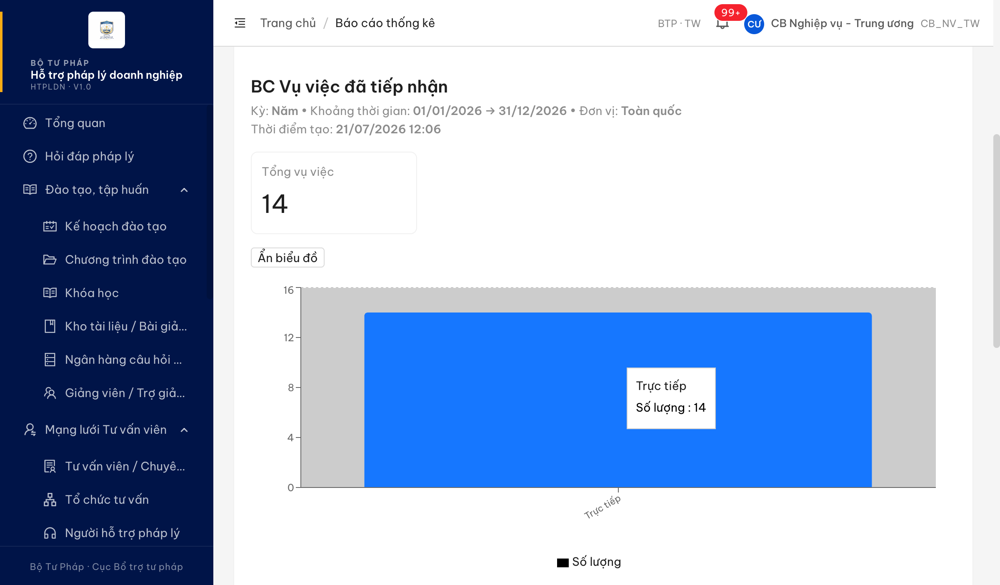
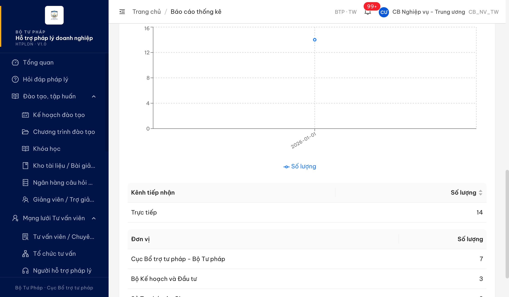
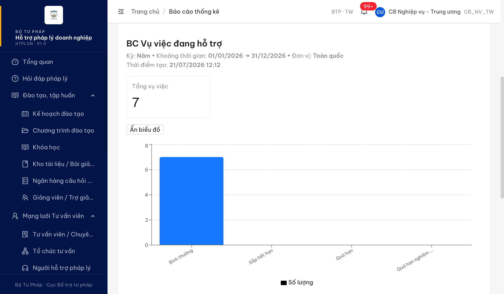
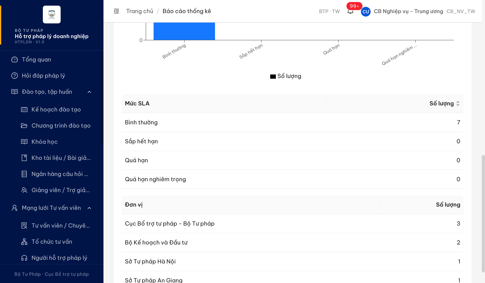
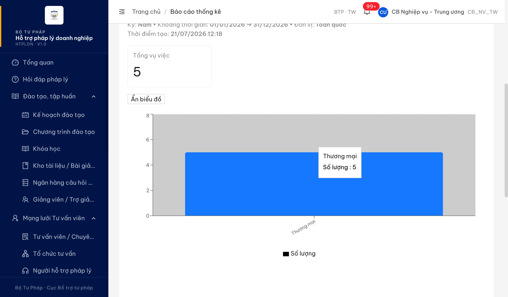
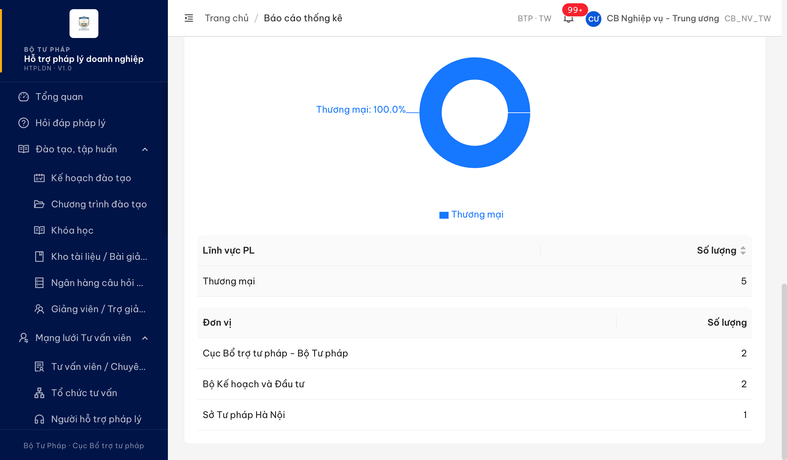
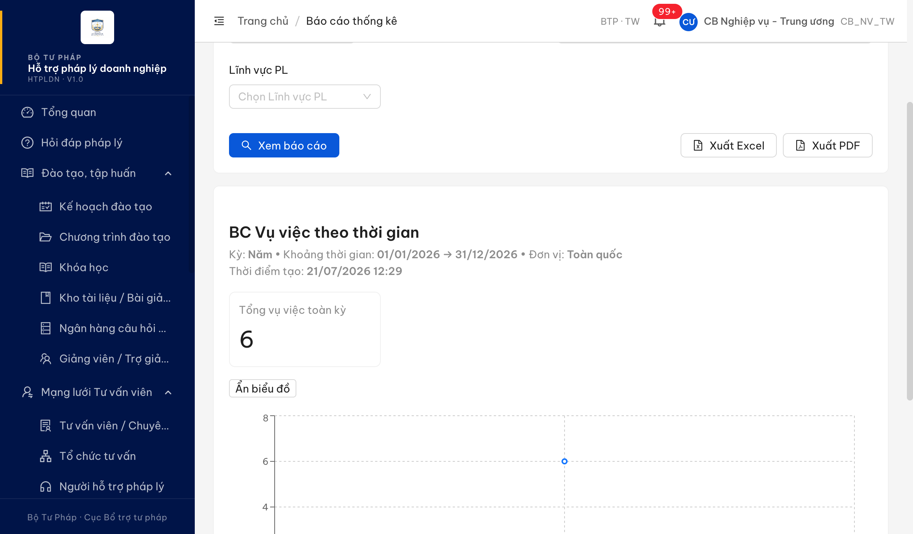
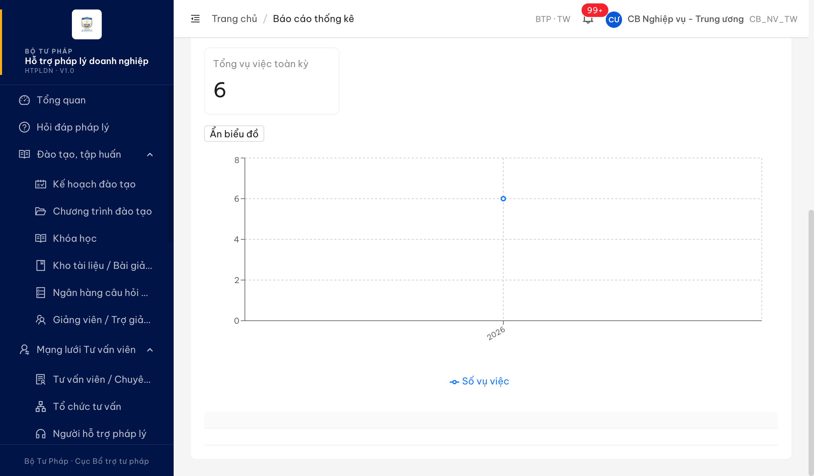

# Bug Report — Báo cáo Thống kê (BCTK Batch 1 — DISPLAY họ Vụ việc nhóm 1)

| Thông tin | Giá trị |
|-----------|---------|
| **Dự án** | PM HTPLDN — UAT đối tác tuần 3 (reverify) |
| **Môi trường** | https://18.143.165.120.nip.io |
| **Người test** | QA (Chrome DevTools MCP) |
| **Ngày** | 2026-07-23 07:47:00 |
| **Loại test** | Functional / Display (reverify bug đối tác) |
| **Round** | Reverify tuần 3 — Batch 1 |
| **Tài liệu tham chiếu** | `srs-v3.5/srs-fr-11-bao-cao.md` (FR-IX, SCR-IX-01) |

---

## Tổng hợp

Phát hiện **5** lỗi có SRS reference cụ thể trong quá trình verify batch 1 (8 case DISPLAY họ Vụ việc nhóm 1). Các case còn lại (SLHDVM_03, VVDHT_03, VVTTG_02): web đúng/không vi phạm SRS, khác biệt thuộc đặc tả PTYC → chuyển `../../ba-confirm/bctk/ba-confirmation-needed-bctk-batch1.md`.

### Severity breakdown

| Tổng | Critical | Major | Medium | Minor | Trivial | Closed | Open |
|------|----------|-------|--------|-------|---------|--------|------|
| 5    | 0        | 5     | 0      | 0     | 0       | 5      | 0    |

## Bug Summary Table

| Bug ID | Severity | Priority | Type | TC Ref | **SRS Reference** | Title | Status |
|--------|----------|----------|------|--------|-------------------|-------|--------|
| ~~BUG-VVDTN_04~~ | Major | P1 | UI/UX | VVDTN_04 (row 195) | `srs-fr-11-bao-cao.md:215 §Output FR-IX-02` / `:1061 Mapping` | BC Vụ việc đã tiếp nhận không hiển thị thống kê theo lĩnh vực dù BE trả data | Closed |
| ~~BUG-VVDHT_04~~ | Major | P1 | UI/UX | VVDHT_04 (row 202) | `srs-fr-11-bao-cao.md:261 §Output FR-IX-03` / `:1062 Mapping` | BC Vụ việc đang hỗ trợ không hiển thị biểu đồ/bảng theo người hỗ trợ dù BE trả theoNht | Closed |
| ~~BUG-VVDHTHT_03~~ | Major | P1 | UI/UX | VVDHTHT_03 (row 207) | `srs-fr-11-bao-cao.md:300-303 §Output FR-IX-04` | BC Vụ việc đã hoàn thành không hiển thị chỉ số Thành công / Không thành công / Tỷ lệ thành công dù BE trả theoKetQua | Closed |
| ~~BUG-VVDHTHT_04~~ | Major | P1 | UI/UX | VVDHTHT_04 (row 208) | `srs-fr-11-bao-cao.md:1063 Mapping` / `:279 mô tả FR-IX-04` | BC Vụ việc đã hoàn thành: Bar + Donut đều theo lĩnh vực, không có biểu đồ chiều kết quả dù BE trả theoKetQua | Closed |
| ~~BUG-VVTTG_03~~ | Major | P1 | UI/UX | VVTTG_03 (row 215) | `srs-fr-11-bao-cao.md:337-338 §Output FR-IX-05` / `:342 AC` | BC Vụ việc theo thời gian: biểu đồ trend chỉ 1 chuỗi (thiếu tiếp nhận/hoàn thành) + không có bảng theo đơn vị | Closed |

---

## ~~BUG-VVDTN_04~~ [CLOSED] — BC Vụ việc đã tiếp nhận: thiếu mục thống kê "theo lĩnh vực" (FE bỏ render dù BE có data)

> **Re-test:** 2026-07-23 07:45 (reverify tuần 3) — ✅ PASS. Chạy lại đủ luồng (cbnv_tw_05, BC Vụ việc đã tiếp nhận, Kỳ Năm, Toàn quốc): khu vực kết quả nay có heading "Thống kê theo lĩnh vực pháp luật" + bảng Lĩnh vực PL/Số lượng/Tỷ lệ (Thương mại 14 · 100%). FE đã render mục lĩnh vực từ `theoLinhVuc` — đúng KQ mong đợi. Bằng chứng: `image/BUG-VVDTN_04-retest-pass-linhvuc.png`.

### Mô tả

Tại BC Vụ việc đã tiếp nhận (UC125), giao diện chỉ hiển thị thống kê **theo kênh tiếp nhận** và **theo đơn vị** + biểu đồ cột theo kênh + biểu đồ xu hướng theo kỳ. Hoàn toàn **không có mục thống kê theo lĩnh vực pháp luật** (không bảng, không biểu đồ). Trong khi API backend `/api/v1/bao-cao/vu-viec-tiep-nhan` **đã trả về** trường `theoLinhVuc` với dữ liệu (Thương mại: 14) → FE nhận data nhưng không dựng phần lĩnh vực.

### Các bước tái hiện

1. Đăng nhập role `cbnv_tw` (CB Nghiệp vụ - Trung ương, phạm vi Toàn quốc — có quyền xem báo cáo theo SCR-IX-01 processing bước 1).
2. Vào **Báo cáo thống kê** → Loại báo cáo = "BC Vụ việc đã tiếp nhận".
3. Kỳ = Năm, Thời gian 01/01/2026 → 31/12/2026, Đơn vị = Toàn quốc → **Xem báo cáo**.
4. Quan sát khu vực kết quả: chỉ có bảng "Kênh tiếp nhận" + "Đơn vị"; biểu đồ cột theo kênh + biểu đồ xu hướng. **Không có bảng/biểu đồ "theo lĩnh vực".**
5. Mở Network → `GET /api/v1/bao-cao/vu-viec-tiep-nhan` trả `theoLinhVuc: [{ten: "Thương mại", soLuong: 14}]` → data có nhưng UI không vẽ.

### Kết quả mong đợi

- Theo SRS FR-IX-02 §Output (dòng 215), báo cáo **luôn** phải có mục tổng hợp `theo_linh_vuc[]` = {lĩnh vực, tên, số lượng} → cần hiển thị bảng và/hoặc biểu đồ thống kê theo lĩnh vực pháp luật.
- Theo bảng Mapping biểu đồ (dòng 1061), báo cáo này dùng biểu đồ **Bar + Trend**; mục lĩnh vực có thể thể hiện bằng bảng hoặc biểu đồ cột theo lĩnh vực.

### Kết quả thực tế

- UI chỉ có: KPI Tổng vụ việc = 14; biểu đồ cột theo kênh (Trực tiếp: 14); biểu đồ xu hướng theo kỳ; bảng "Kênh tiếp nhận / Số lượng" (Trực tiếp 14); bảng "Đơn vị / Số lượng" (Cục Bổ trợ 7, Bộ KH&ĐT 3, STP An Giang 3, STP Hà Nội 1).
- **Thiếu hoàn toàn mục "theo lĩnh vực"** dù BE trả `theoLinhVuc: [{"ten":"Thương mại","soLuong":14}]`.
- (Đối tác cũng báo "thiếu cột Theo kênh" — thực tế web ĐÃ có bảng "Kênh tiếp nhận" nên phần này không tái hiện; chỉ thiếu phần lĩnh vực.)

### Bằng chứng

**1. Ảnh chụp**:




**2. API response** (BE trả theoLinhVuc nhưng UI không render):

```json
{"success":true,"data":{"tongVuViec":14,"theoKenh":[{"kenh":"Trực tiếp","soLuong":14}],"theoLinhVuc":[{"ten":"Thương mại","soLuong":14}],"theoDonVi":[{"ten":"Cục Bổ trợ tư pháp - Bộ Tư pháp","soLuong":7},{"ten":"Bộ Kế hoạch và Đầu tư","soLuong":3},{"ten":"Sở Tư pháp An Giang","soLuong":3},{"ten":"Sở Tư pháp Hà Nội","soLuong":1}],"theoKy":[{"ky":"2026-01-01","soLuong":14}]}}
```

---

## ~~BUG-VVDHT_04~~ [CLOSED] — BC Vụ việc đang hỗ trợ: thiếu biểu đồ + bảng "theo người hỗ trợ" (FE bỏ render dù BE trả theoNht)

> **Re-test:** 2026-07-23 07:47 (reverify tuần 3) — ✅ PASS. Chạy lại đủ luồng (cbnv_tw_05, BC Vụ việc đang hỗ trợ, Kỳ Năm, Toàn quốc): nay có heading "Thống kê theo người hỗ trợ" + bảng Người hỗ trợ/Số lượng/Số quá hạn/Tỷ lệ (QA TVV Seed28 · 2 · 0 · 100%); bảng "Đơn vị" đã bổ sung cột "Số quá hạn". FE render đủ `theoNht` + cột số quá hạn — đúng KQ mong đợi. Bằng chứng: `image/BUG-VVDHT_04-retest-pass-nht.png`.

### Mô tả

Tại BC Vụ việc đang hỗ trợ (UC126), giao diện chỉ hiển thị 1 biểu đồ cột theo mức SLA + bảng "Mức SLA" + bảng "Đơn vị". Hoàn toàn **không có biểu đồ cột theo người hỗ trợ, cũng không có bảng "Người hỗ trợ"** (Số vụ việc, Số quá hạn). Trong khi API backend `/api/v1/bao-cao/vu-viec-dang-ho-tro` **đã trả** trường `theoNht` (1 người hỗ trợ, số lượng 1) → FE nhận data nhưng không dựng. Ngoài ra bảng "Đơn vị" chỉ có cột Số lượng, thiếu cột "Số quá hạn" mà SRS §Output theo_don_vi quy định.

### Các bước tái hiện

1. Đăng nhập role `cbnv_tw` (CB Nghiệp vụ - Trung ương, Toàn quốc — có quyền xem báo cáo theo SCR-IX-01).
2. Vào **Báo cáo thống kê** → Loại báo cáo = "BC Vụ việc đang hỗ trợ".
3. Kỳ = Năm 2026, Đơn vị = Toàn quốc → **Xem báo cáo**.
4. Quan sát: chỉ có biểu đồ cột theo mức SLA + bảng "Mức SLA" + bảng "Đơn vị". **Không có biểu đồ/bảng "theo người hỗ trợ".**
5. Mở Network → `GET /api/v1/bao-cao/vu-viec-dang-ho-tro` trả `theoNht: [{nhtId, ten:"", soLuong:1}]` → data có nhưng UI không vẽ.

### Kết quả mong đợi

- Theo SRS FR-IX-03 §Output (dòng 261), báo cáo **luôn** phải có `theo_nht[]` = {nht_id, ho_ten, số vụ việc, số quá hạn} → cần hiển thị bảng và/hoặc biểu đồ cột thống kê theo người hỗ trợ (NHT phân công).
- Theo dimensions FR-IX-03 (dòng 249) và bảng Mapping (dòng 1062 — Bar snapshot), NHT phân công là 1 chiều phân tích bắt buộc.
- Bảng theo đơn vị theo SRS §Output (dòng 262) gồm cột số lượng + số quá hạn.

### Kết quả thực tế

- UI chỉ có: KPI Tổng vụ việc = 7; 1 biểu đồ cột theo mức SLA; bảng "Mức SLA" (Bình thường 7, Sắp hết hạn 0, Quá hạn 0, Quá hạn nghiêm trọng 0); bảng "Đơn vị" (chỉ cột Số lượng).
- **Thiếu hoàn toàn biểu đồ + bảng "theo người hỗ trợ"** dù BE trả `theoNht: [{"ten":"","soLuong":1}]`.
- Bảng "Đơn vị" thiếu cột "Số quá hạn" (chỉ có "Số lượng").

### Bằng chứng

**1. Ảnh chụp**:




**2. API response** (BE trả theoNht nhưng UI không render):

```json
{"success":true,"data":{"tongVuViec":7,"theoMucSla":[{"mucSla":"BINH_THUONG","soLuong":7},{"mucSla":"SAP_HET","soLuong":0},{"mucSla":"QUA_HAN","soLuong":0},{"mucSla":"QUA_HAN_NGHIEM_TRONG","soLuong":0}],"theoNht":[{"nhtId":"5432719c-c542-4a5d-8c3a-db1b8a918bbf","ten":"","soLuong":1}],"theoDonVi":[{"ten":"Cục Bổ trợ tư pháp - Bộ Tư pháp","soLuong":3},{"ten":"Bộ Kế hoạch và Đầu tư","soLuong":2},{"ten":"Sở Tư pháp Hà Nội","soLuong":1},{"ten":"Sở Tư pháp An Giang","soLuong":1}]}}
```

---

## ~~BUG-VVDHTHT_03~~ [CLOSED] — BC Vụ việc đã hoàn thành: thiếu chỉ số Thành công / Không thành công / Tỷ lệ thành công (FE bỏ render dù BE trả theoKetQua)

> **Re-test:** 2026-07-23 07:49 (reverify tuần 3) — ✅ PASS. Chạy lại đủ luồng (cbnv_tw_05, BC Vụ việc đã hoàn thành, Kỳ Năm, Toàn quốc): nay có 3 thẻ KPI Thành công (1) / Không thành công (0) / Tỷ lệ thành công (20.0%) + bảng "Thống kê theo kết quả" (Chưa xác định 4/80%, Thành công 1/20%). FE đã render `theoKetQua` — đúng KQ mong đợi. Bằng chứng: `image/BUG-VVDHTHT-retest-pass-ketqua.png`.

### Mô tả

Tại BC Vụ việc đã hoàn thành (UC127), khu vực kết quả chỉ hiển thị **1 thẻ chỉ số "Tổng vụ việc = 5"** + biểu đồ cột theo lĩnh vực + biểu đồ tròn theo lĩnh vực + bảng "Lĩnh vực PL" + bảng "Đơn vị". Hoàn toàn **không có chỉ số Thành công / Không thành công / Tỷ lệ thành công** (không thẻ KPI, không bảng, không biểu đồ). Kiểm tra a11y/DOM: không có text "thành công" trong khu vực kết quả (chỉ "Kết quả" là nhãn bộ lọc đầu vào). Trong khi API backend `/api/v1/bao-cao/vu-viec-hoan-thanh` **đã trả** trường `theoKetQua` (THANH_CONG: 1, CHUA_XAC_DINH: 4) → FE nhận data nhưng không dựng phần kết quả.

### Các bước tái hiện

1. Đăng nhập role `cbnv_tw` (CB Nghiệp vụ - Trung ương, phạm vi Toàn quốc — có quyền xem báo cáo theo SCR-IX-01).
2. Vào **Báo cáo thống kê** → Loại báo cáo = "BC Vụ việc đã hoàn thành".
3. Kỳ = Năm, Thời gian 01/01/2026 → 31/12/2026, Đơn vị = Toàn quốc → **Xem báo cáo**.
4. Quan sát khu vực kết quả: chỉ có 1 thẻ "Tổng vụ việc = 5"; biểu đồ + bảng đều theo lĩnh vực/đơn vị. **Không có chỉ số/bảng "Thành công", "Không thành công", "Tỷ lệ thành công".**
5. Mở Network → `GET /api/v1/bao-cao/vu-viec-hoan-thanh` trả `theoKetQua: [{"ketQua":"CHUA_XAC_DINH","soLuong":4},{"ketQua":"THANH_CONG","soLuong":1}]` → data có nhưng UI không vẽ.

### Kết quả mong đợi

- Theo SRS FR-IX-04 §Output (dòng 300–303), báo cáo **luôn** phải hiển thị các trị `tong_hoan_thanh`, `thanh_cong` (số VV thành công), `khong_thanh_cong` (số VV không thành công), `ty_le_thanh_cong` (% thành công).
- Mô tả FR-IX-04 (dòng 279): báo cáo phân theo lĩnh vực, **kết quả (thành công/không)**, đơn vị → phần kết quả là output bắt buộc.

### Kết quả thực tế

- UI chỉ có: 1 thẻ "Tổng vụ việc = 5"; biểu đồ cột theo lĩnh vực (Thương mại 5); biểu đồ tròn theo lĩnh vực (Thương mại 100%); bảng "Lĩnh vực PL / Số lượng" (Thương mại 5); bảng "Đơn vị / Số lượng" (Cục Bổ trợ 2, Bộ KH&ĐT 2, STP Hà Nội 1).
- **Thiếu hoàn toàn** các chỉ số Thành công / Không thành công / Tỷ lệ thành công dù BE trả `theoKetQua`.

### Bằng chứng

**1. Ảnh chụp**:




**2. API response** (BE trả theoKetQua nhưng UI không render):

```json
{"success":true,"data":{"tongVuViec":5,"theoLinhVuc":[{"ten":"Thương mại","soLuong":5}],"theoKetQua":[{"ketQua":"CHUA_XAC_DINH","soLuong":4},{"ketQua":"THANH_CONG","soLuong":1}],"theoDonVi":[{"ten":"Cục Bổ trợ tư pháp - Bộ Tư pháp","soLuong":2},{"ten":"Bộ Kế hoạch và Đầu tư","soLuong":2},{"ten":"Sở Tư pháp Hà Nội","soLuong":1}],"theoKy":[{"ky":"2026-01-01","soLuong":5}]}}
```

---

## ~~BUG-VVDHTHT_04~~ [CLOSED] — BC Vụ việc đã hoàn thành: biểu đồ Bar + Donut đều theo lĩnh vực, thiếu biểu đồ chiều kết quả (FE bỏ render dù BE trả theoKetQua)

> **Re-test:** 2026-07-23 07:49 (reverify tuần 3) — ✅ PASS. Chạy lại đủ luồng (cbnv_tw_05, BC Vụ việc đã hoàn thành, Kỳ Năm, Toàn quốc): biểu đồ cột giữ chiều lĩnh vực (Thương mại), biểu đồ tròn nay thể hiện chiều KẾT QUẢ (Chưa xác định 80.0% / Thành công 20.0%) + bảng "Thống kê theo kết quả". Chiều kết quả đã được trực quan hóa — đúng KQ mong đợi. Bằng chứng: `image/BUG-VVDHTHT-retest-pass-ketqua.png`.

### Mô tả

Tại BC Vụ việc đã hoàn thành (UC127), giao diện render **cả biểu đồ cột (Bar) lẫn biểu đồ tròn (Donut) theo cùng một chiều "lĩnh vực"** (Thương mại: 100.0%). **Không có biểu đồ nào thể hiện chiều "kết quả"** (thành công / không thành công) — trong khi đây là chiều phân tích đặc trưng của báo cáo này. Bảng Mapping (dòng 1063) quy định UC127 dùng **Bar + Donut** với chiều phân tích gồm "Lĩnh vực PL, **Kết quả**"; mô tả FR-IX-04 (dòng 279) nêu báo cáo phân theo "lĩnh vực, **kết quả (thành công/không)**, đơn vị". API backend đã trả `theoKetQua` nhưng FE không dựng chiều kết quả.

### Các bước tái hiện

1. Đăng nhập role `cbnv_tw` (Toàn quốc) → **Báo cáo thống kê** → Loại báo cáo = "BC Vụ việc đã hoàn thành".
2. Kỳ = Năm 2026, Đơn vị = Toàn quốc → **Xem báo cáo**.
3. Quan sát khu vực biểu đồ: biểu đồ cột = lĩnh vực (Thương mại 5); biểu đồ tròn = lĩnh vực (Thương mại 100%). **Cả 2 biểu đồ trùng chiều lĩnh vực; không biểu đồ nào theo kết quả.**
4. Mở Network → `theoKetQua` có data (THANH_CONG 1, CHUA_XAC_DINH 4) nhưng không được vẽ.

### Kết quả mong đợi

- Theo Mapping (dòng 1063) + mô tả FR-IX-04 (dòng 279), báo cáo phải thể hiện được chiều **kết quả** (thành công/không thành công) — không chỉ lặp lại chiều lĩnh vực ở cả 2 biểu đồ.
- Chiều kết quả (`theoKetQua`) mà BE đã trả cần được trực quan hóa (biểu đồ và/hoặc bảng), phù hợp §Output FR-IX-04 (thanh_cong / khong_thanh_cong / ty_le_thanh_cong).

### Kết quả thực tế

- Biểu đồ cột: theo lĩnh vực (1 cột Thương mại = 5).
- Biểu đồ tròn: theo lĩnh vực (Thương mại 100%).
- **Không có biểu đồ/bảng nào theo chiều kết quả** dù BE trả `theoKetQua`.
- *(Ý phụ đối tác "thiếu cột theo mức thời hạn": §Output FR-IX-04 KHÔNG có chiều mức thời hạn/SLA — đó là output của FR-IX-03 (BC Vụ việc đang hỗ trợ) → ý phụ này không phải yêu cầu SRS cho báo cáo này, không tính là lỗi.)*

### Bằng chứng

**1. Ảnh chụp**:


**2. API response** (BE trả theoKetQua nhưng UI chỉ vẽ theo lĩnh vực):

```json
{"success":true,"data":{"tongVuViec":5,"theoLinhVuc":[{"ten":"Thương mại","soLuong":5}],"theoKetQua":[{"ketQua":"CHUA_XAC_DINH","soLuong":4},{"ketQua":"THANH_CONG","soLuong":1}],"theoDonVi":[{"ten":"Cục Bổ trợ tư pháp - Bộ Tư pháp","soLuong":2},{"ten":"Bộ Kế hoạch và Đầu tư","soLuong":2},{"ten":"Sở Tư pháp Hà Nội","soLuong":1}]}}
```

---

## ~~BUG-VVTTG_03~~ [CLOSED] — BC Vụ việc theo thời gian: biểu đồ trend chỉ 1 chuỗi + không có bảng theo đơn vị (thiếu output §Output FR-IX-05)

> **Re-test:** 2026-07-23 07:51 (reverify tuần 3) — ✅ PASS. Chạy lại đủ luồng (cbnv_tw_05, BC Vụ việc theo thời gian, Kỳ Năm, Toàn quốc): biểu đồ trend nay có 2 chuỗi "Tiếp nhận" + "Hoàn thành"; dưới biểu đồ có bảng "Kỳ/Tiếp nhận/Hoàn thành" (2026: 6/5) + bảng "Đơn vị/Số lượng" (Cục Bổ trợ 3, Bộ KH&ĐT 2, STP Hà Nội 1). Cả 2 defect gốc đã hết — đúng KQ mong đợi. Bằng chứng: `image/BUG-VVTTG_03-retest-pass-trend-tables.png`.

### Mô tả

Tại BC Vụ việc theo thời gian (UC128), khu vực kết quả chỉ có: 1 thẻ "Tổng vụ việc toàn kỳ" + 1 biểu đồ đường (line) với **duy nhất một chuỗi "Số vụ việc"**. Hai điểm thiếu so SRS FR-IX-05 §Output:

1. Biểu đồ trend chỉ vẽ 1 chuỗi `soVuViec` (tổng vụ việc/kỳ). SRS §Output (dòng 337) quy định `trend_data[]` mỗi kỳ gồm `{ky_label, tiep_nhan, hoan_thanh}` — tức phải có **2 chuỗi**: số vụ việc *tiếp nhận* và số *hoàn thành* theo thời gian. BE chỉ trả `soVuViec`.
2. **Không có bảng chi tiết/tổng hợp nào** dưới biểu đồ. SRS §Output (dòng 338) yêu cầu `theo_don_vi[] {don_vi, ten, trend_data[]}` điều kiện "Luôn"; AC (dòng 342) yêu cầu "hiển thị biểu đồ trend + **bảng chi tiết**". BE không trả `theoDonVi`, UI không render bảng.

### Các bước tái hiện

1. Đăng nhập role `cbnv_tw` (Toàn quốc) → **Báo cáo thống kê** → Loại báo cáo = "BC Vụ việc theo thời gian".
2. Kỳ = Năm 2026 (01/01/2026 → 31/12/2026), Đơn vị = Toàn quốc → **Xem báo cáo**.
3. Quan sát: 1 thẻ "Tổng vụ việc toàn kỳ = 6"; biểu đồ đường 1 chuỗi "Số vụ việc"; **không có bảng nào** phía dưới.
4. Mở Network → `GET /api/v1/bao-cao/vu-viec-theo-thoi-gian` trả `data[].soVuViec` (không có `tiepNhan`/`hoanThanh`), không có `theoDonVi`.

### Kết quả mong đợi

- Theo SRS FR-IX-05 §Output (dòng 337), biểu đồ trend phải thể hiện được **cả số tiếp nhận và số hoàn thành** theo thời gian (2 chuỗi), không chỉ 1 chuỗi tổng.
- Theo §Output (dòng 338) + AC (dòng 342), phải có **bảng chi tiết theo đơn vị** kèm trend_data cho từng đơn vị.

### Kết quả thực tế

- Biểu đồ đường chỉ 1 chuỗi "Số vụ việc" = `soVuViec`; thiếu chuỗi tiếp nhận/hoàn thành.
- Không có bảng chi tiết/theo đơn vị nào (trang kết thúc ngay sau chú thích biểu đồ).
- *(Đối tác báo "biểu đồ không thể hiện xu hướng": đây là do khoảng kỳ 1 điểm — Kỳ=Năm cho 1 điểm/năm, Kỳ=Tháng mặc định range 1 tháng cho 1 điểm. Khi gọi API Kỳ=Tháng với range cả năm (01/01→31/12/2026) BE trả 12 điểm T01–T12 → đường trend CÓ dựng nhiều điểm. Vậy phần "không có xu hướng" là do khoảng kỳ/range mặc định, không phải lỗi render — không tính là lỗi con riêng.)*

### Bằng chứng

**1. Ảnh chụp**:




**2. API response** (BE thiếu tiepNhan/hoanThanh + không có theoDonVi):

```json
{"success":true,"data":{"tenBaoCao":"BC Vụ việc theo thời gian","kyBaoCao":"NAM","tongVuViecToanKy":6,"data":[{"kyLabel":"2026","soVuViec":6}],"chartType":"LINE"}}
```

Kỳ=Tháng (range cả năm) → 12 điểm, vẫn chỉ có `soVuViec`, không `theoDonVi`:

```json
{"data":{"tongVuViecToanKy":6,"chartType":"LINE","data":[{"kyLabel":"T01/2026","soVuViec":1},{"kyLabel":"T02/2026","soVuViec":1},{"kyLabel":"T03/2026","soVuViec":2},{"kyLabel":"T04/2026","soVuViec":1},{"kyLabel":"T05/2026","soVuViec":0},{"kyLabel":"T06/2026","soVuViec":0},{"kyLabel":"T07/2026","soVuViec":1},{"kyLabel":"T08/2026","soVuViec":0},{"kyLabel":"T09/2026","soVuViec":0},{"kyLabel":"T10/2026","soVuViec":0},{"kyLabel":"T11/2026","soVuViec":0},{"kyLabel":"T12/2026","soVuViec":0}]}}
```

---

## Phụ lục — Môi trường test

| Thành phần | Giá trị |
|------------|---------|
| URL ứng dụng | https://18.143.165.120.nip.io/bao-cao |
| Tài khoản verdict | `cbnv_tw` / CB_NV_TW (Toàn quốc) |
| OTP login | MailHog `http://18.143.165.120:8025/` |
| API base | https://18.143.165.120.nip.io/api/v1 |
| Frontend | React + Ant Design + Recharts |
| Tool test | Chrome DevTools MCP |

---

*Bug report generated: 2026-07-21 | QA Automation via Claude Code*
