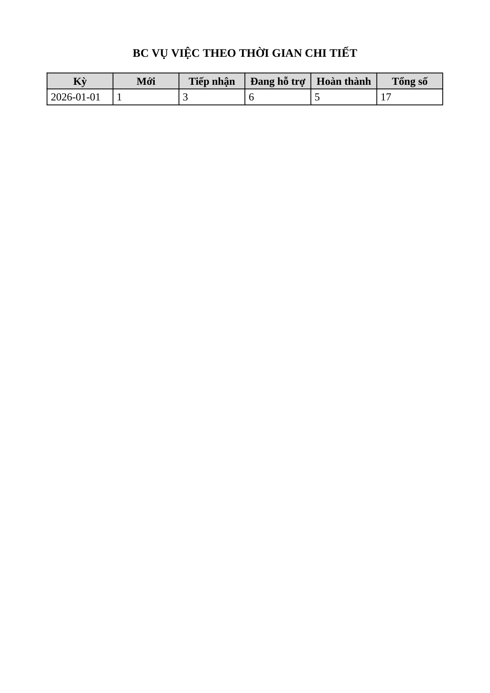
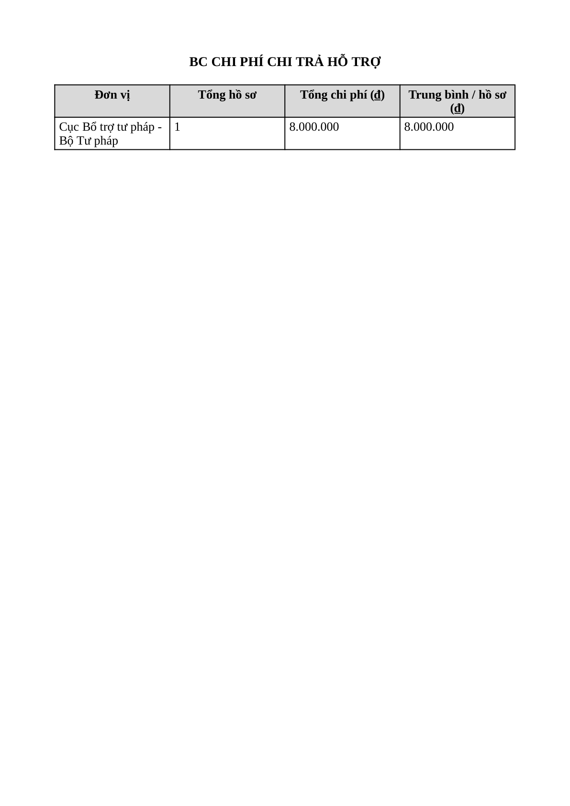

# Bug Report — Báo cáo Thống kê (BCTK Batch 10 — EXPORT nội dung file Excel/PDF)

| Thông tin | Giá trị |
|-----------|---------|
| **Dự án** | PM Hỗ trợ pháp lý doanh nghiệp (HTPLDN) |
| **Môi trường** | https://18.143.165.120.nip.io |
| **Người test** | QA (Chrome DevTools MCP + đọc nội dung file: openpyxl / PyMuPDF / render ảnh) |
| **Ngày** | 2026-07-23 09:34:28 |
| **Loại test** | UAT verify (vòng 1) + Re-verify R1 — Functional / Export content |
| **Round** | Reverify tuần 3 — batch BCTK-10 (EXPORT) — R1 re-verify: ✅ Closed |
| **Tài liệu tham chiếu** | `input/srs-update-2026-5-5/srs-fr-11-bao-cao.md` (FR-IX §Quy tắc tương tác dòng 1088; ERR-RPT-04 dòng 116; FR-IX-12/13/14/15 dòng 593/626/665/697) |

---

## Tổng hợp

> **R1 reverify tuần 3 (2026-07-23 09:34) — ✅ PASS / CLOSED.** Dev đã bổ sung khối header vào template PDF dùng chung. Chạy lại đủ luồng **Xuất PDF** cho cả **4 loại báo cáo** batch 10 (`cbnv_tw_03`, kỳ Năm 2026, Toàn quốc): mọi file PDF nay có đủ 4 trường header (tiêu đề + Kỳ báo cáo + Đơn vị + Ngày tạo) như bản Excel. 4/4 `POST /bao-cao/export` trả **200**, không ERR-RPT-04. Đọc nội dung file thực (PyMuPDF text-extract + render ảnh), không kết luận tĩnh.
> **Breakdown:** Open 0 · Closed 1 (1/1 bug). 4 case Excel đối chứng (VVTLV_05 / VVTLHDN_05 / VVTTGCT_05 / CPHTCT_06) giữ **Reject** như vòng trước — nội dung Excel vốn đã đúng, không đổi.

Bối cảnh gốc (vòng 1, 2026-07-21): lỗi đối tác báo ERR-RPT-04 KHÔNG tái hiện; bản Excel đủ header → Reject; bản PDF thiếu 3/4 trường header (Kỳ / Đơn vị / Ngày tạo) → log BUG-EXPORT-PDF-HEADER (Major). Nay đã fix.

> **Ghi chú nguồn SRS:** SRS v3.5 `srs-fr-11-bao-cao.md:1088` (§Quy tắc tương tác) — quy tắc "Export XLSX/PDF chèn tiêu đề + kỳ + đơn vị + ngày tạo vào header file" áp dụng cho **cả XLSX lẫn PDF**. File PDF nay tuân thủ đủ.

### Severity breakdown

| Tổng | Critical | Major | Medium | Minor | Trivial | Closed | Open |
|------|----------|-------|--------|-------|---------|--------|------|
| 1    | 0        | 1     | 0      | 0     | 0       | 1      | 0    |

## Bug Summary Table

| Bug ID | Severity | Priority | Type | TC Ref | **SRS Reference** | Title | Status |
|--------|----------|----------|------|--------|-------------------|-------|--------|
| BUG-EXPORT-PDF-HEADER | Major | P1 | UI/UX | **Batch10:** VVTLV_06 (row 244), VVTLHDN_06 (247), VVTTGCT_06 (249), CPHTCT_07 (251) — cộng dồn 11 loại BC (xem batch7+8) | `srs-fr-11-bao-cao.md:1088` (§Quy tắc tương tác) | File PDF xuất ra thiếu header bắt buộc (Kỳ báo cáo / Đơn vị / Ngày tạo) — bản Excel có đủ | Closed |

---

## ~~BUG-EXPORT-PDF-HEADER~~ [CLOSED] — File PDF xuất ra thiếu header bắt buộc (Kỳ báo cáo / Đơn vị / Ngày tạo)

> **Re-test:** 2026-07-23 09:34:28 R1 — ✅ PASS (Closed-verified). Chạy lại đủ luồng Xuất PDF cho cả 4 loại BC batch 10 (VVTLV_06 / VVTLHDN_06 / VVTTGCT_06 / CPHTCT_07) bằng `cbnv_tw_03`, kỳ Năm 2026, Toàn quốc. Đọc nội dung file (PyMuPDF): mọi PDF nay đủ 4 trường header — tiêu đề + `Kỳ báo cáo: Năm (từ 01/01/2026 đến 31/12/2026)` + `Đơn vị: Toàn quốc` + `Ngày tạo: 23/07/2026`; riêng CPHTCT_07 có dòng header phạm vi "Đơn vị: Toàn quốc" tách biệt với cột "Đơn vị" của bảng. 4/4 `POST /bao-cao/export` trả 200, không ERR-RPT-04. Bằng chứng: [VVTLV](image/BUG-EXPORT-PDF-HEADER-VVTLV-reverify-pass.png) · [VVTLHDN](image/BUG-EXPORT-PDF-HEADER-VVTLHDN-reverify-pass.png) · [VVTTGCT](image/BUG-EXPORT-PDF-HEADER-VVTTGCT-reverify-pass.png) · [CPHTCT](image/BUG-EXPORT-PDF-HEADER-CPHTCT-reverify-pass.png).

### Mô tả

Khi xuất báo cáo thống kê ra **PDF**, file tạo ra chỉ có **tiêu đề báo cáo** rồi nhảy thẳng vào bảng số liệu. Thiếu **3/4 trường header bắt buộc** mà SRS yêu cầu: **kỳ báo cáo, đơn vị, ngày tạo**. Cùng dữ liệu đó, bản **Excel (XLSX) xuất ra ĐỦ cả 4 trường** — chứng minh back-end có sẵn dữ liệu header và đây là lỗi riêng của luồng dựng file PDF (template PDF bỏ khối header). Batch 10 tái hiện đồng nhất ở **4 loại báo cáo mới** (Vụ việc theo lĩnh vực, Vụ việc theo loại hình DN, Vụ việc theo thời gian chi tiết, Chi phí chi trả hỗ trợ) — cộng dồn 3 batch (7+8+10) là **11 loại báo cáo** → khẳng định lỗi hệ thống của template PDF dùng chung toàn module.

### Các bước tái hiện

1. Đăng nhập role **CB Nghiệp vụ - Trung ương** (`cbnv_tw_01` / `Test@1234`) — quyền xem + xuất báo cáo thống kê phạm vi Toàn quốc theo SCR-IX-01.
2. Vào **Báo cáo thống kê** → chọn loại (vd **BC Vụ việc theo lĩnh vực**) → Kỳ **Năm** (01/01/2026 – 31/12/2026) → Đơn vị **Toàn quốc** → **Xem báo cáo** (báo cáo có data: Thuế 1 + Thương mại 16, Tổng 17).
3. Bấm **Xuất PDF** → hộp thoại "Tùy chọn in báo cáo PDF" (A4, Dọc) → **Xuất file** → `POST /api/v1/bao-cao/export` trả **200**, tải về `bao-cao-vu-viec-theo-linh-vuc-2026-07-21.pdf` (toast "Đang tạo file...", KHÔNG có ERR-RPT-04).
4. Mở file PDF: chỉ có tiêu đề "BC VỤ VIỆC THEO LĨNH VỰC" + bảng số liệu. **Không có** dòng Kỳ báo cáo / Đơn vị / Ngày tạo.
5. So sánh: xuất cùng báo cáo ra **Excel** (`Xuất Excel`) → file XLSX có đủ 4 dòng header: tiêu đề + `Kỳ báo cáo: Năm (từ 01/01/2026 đến 31/12/2026)` + `Đơn vị: Toàn quốc` + `Ngày tạo: 21/07/2026`.
6. Lặp lại cho 3 loại còn lại (Loại hình DN, Thời gian chi tiết, Chi phí chi trả hỗ trợ) → PDF nào cũng thiếu 3 dòng header, Excel nào cũng đủ.

### Kết quả mong đợi

- Theo SRS v3.5 `srs-fr-11-bao-cao.md:1088` (§Quy tắc tương tác): *"Export XLSX/PDF chèn tiêu đề BC + thông tin kỳ + đơn vị + ngày tạo vào header file"* — quy tắc áp dụng cho **cả XLSX lẫn PDF**.
- File PDF xuất ra phải có ở phần đầu: tiêu đề báo cáo + kỳ báo cáo + đơn vị + ngày tạo (như bản Excel).

### Kết quả thực tế

- 4 file PDF chỉ có tiêu đề báo cáo + bảng số liệu; **thiếu 3 trường**: Kỳ báo cáo, Đơn vị, Ngày tạo. Trích text thực (PyMuPDF):
  - **VVTLV_06** (`bao-cao-vu-viec-theo-linh-vuc-2026-07-21.pdf`): `BC VỤ VIỆC THEO LĨNH VỰC` → thẳng vào bảng (Thuế 1, Thương mại 16). Không có "Kỳ báo cáo"/"Đơn vị"/"Ngày tạo".
  - **VVTLHDN_06** (`bao-cao-vu-viec-theo-loai-dn-2026-07-21.pdf`): `BC VỤ VIỆC THEO LOẠI HÌNH DN` → thẳng vào bảng (Nhỏ 3, Siêu nhỏ 14). Thiếu header.
  - **VVTTGCT_06** (`bao-cao-vu-viec-theo-tg-chi-tiet-2026-07-21.pdf`): `BC VỤ VIỆC THEO THỜI GIAN CHI TIẾT` → thẳng vào bảng (2026-01-01: 1/3/6/5, Tổng 17). Thiếu header.
  - **CPHTCT_07** (`bao-cao-chi-phi-chi-tra-2026-07-21.pdf`): `BC CHI PHÍ CHI TRẢ HỖ TRỢ` → thẳng vào bảng (Cục Bổ trợ tư pháp 1 HS, 8.000.000đ). Thiếu header (chữ "Đơn vị" trong file là tên cột bảng, không phải dòng header phạm vi).
- Cả 4 file: A4 (210×297mm) + font Tinos (Times New Roman-tương thích) cỡ 13 → **2/2 yêu cầu định dạng SRS đạt**, số liệu đúng — chỉ thiếu khối header.
- Bản Excel cùng báo cáo (đối chứng) có đủ 4 trường: tiêu đề · `Kỳ báo cáo: Năm (từ 01/01/2026 đến 31/12/2026)` · `Đơn vị: Toàn quốc` · `Ngày tạo: 21/07/2026`.
- Tái hiện cộng dồn **11 báo cáo**: (batch7) SLHDVM_07, VVDTN_07, VVDHT_07, VVDHTHT_07 + (batch8) VVTTG_06, CLDTBDDDR_07, LDTBDDDR_07 + (batch10) VVTLV_06, VVTLHDN_06, VVTTGCT_06, CPHTCT_07.

### Bằng chứng






**Request/response** (giống nhau cho mọi loại báo cáo, chỉ khác `loaiBaoCao`):

```json
// Request (vd BC Vụ việc theo lĩnh vực)
{"loaiBaoCao":"BC_VU_VIEC_THEO_LINH_VUC","kyBaoCao":"NAM","tuNgay":"2026-01-01","denNgay":"2026-12-31","filterDacThu":{},"formatXuat":"PDF","khoGiay":"A4","huongGiay":"portrait"}
// Response: 200, content-type: application/pdf, content-disposition: attachment; filename="bao-cao-vu-viec-theo-linh-vuc-2026-07-21.pdf"
// → file PDF tạo được nhưng nội dung thiếu khối header
// Batch10: loaiBaoCao ∈ {BC_VU_VIEC_THEO_LINH_VUC, BC_VU_VIEC_THEO_LOAI_DN, BC_VU_VIEC_THEO_THOI_GIAN_CHI_TIET, BC_CHI_PHI_CHI_TRA} → 200 + PDF, cùng thiếu header
```

---

## Phụ lục — Môi trường test

| Thành phần | Giá trị |
|------------|---------|
| URL ứng dụng | https://18.143.165.120.nip.io |
| OTP login | MailHog `http://18.143.165.120:8025` |
| API base | https://18.143.165.120.nip.io/api/v1 |
| Frontend | React + Ant Design |
| Xác thực | JWT + OTP (email) |
| Tool test | Chrome DevTools MCP; đọc file: openpyxl / PyMuPDF (render + text-extract) |
| Tài khoản verdict | `cbnv_tw_01` (CB Nghiệp vụ - Trung ương, phạm vi Toàn quốc) |
| File gốc đã dump | `reverify-audit/_export-check/{VVTLV_05.xlsx, VVTLV_06.pdf, VVTLHDN_05.xlsx, VVTLHDN_06.pdf, VVTTGCT_05.xlsx, VVTTGCT_06.pdf, CPHTCT_06.xlsx, CPHTCT_07.pdf}` (8 file, từ response body của `POST /bao-cao/export`) |

---

*Bug report generated: 2026-07-21 17:10:00 | QA via Claude Code*
