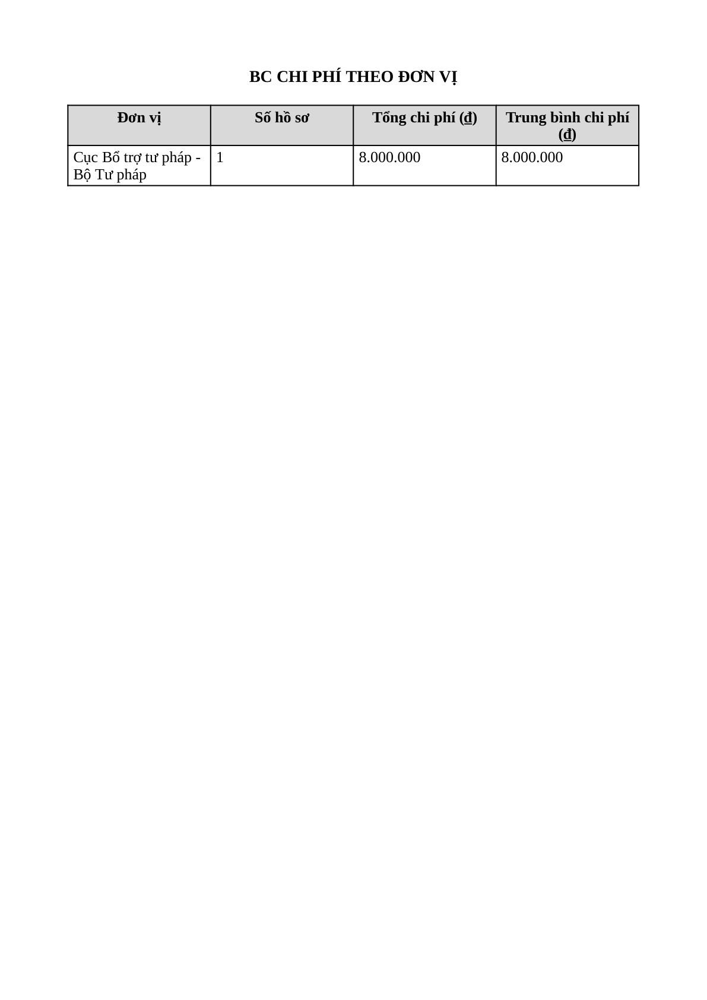
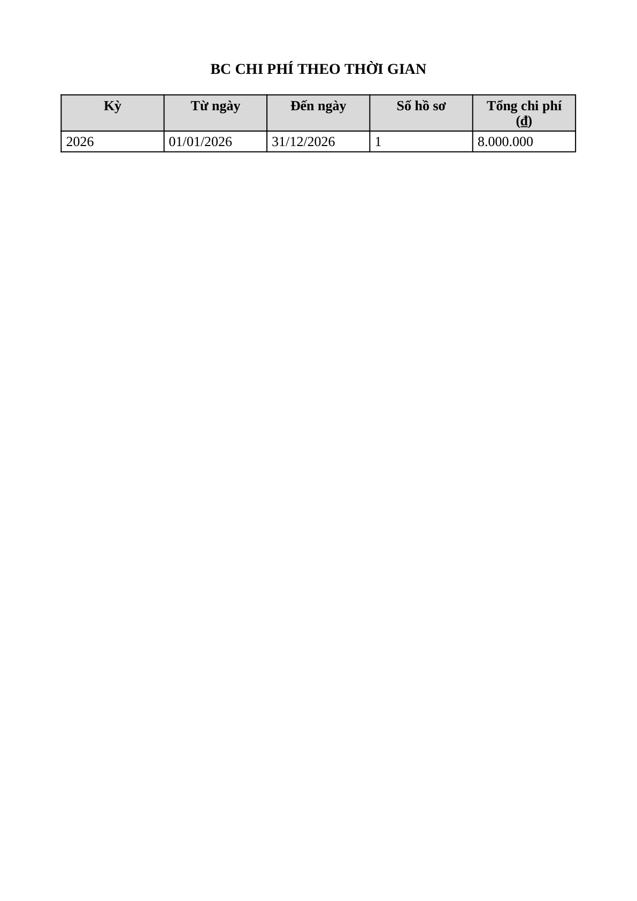

# Bug Report — Báo cáo Thống kê (BCTK Batch 11 — EXPORT: Chi phí chi tiết + Số lượng CT)

| Thông tin | Giá trị |
|-----------|---------|
| **Dự án** | PM Hỗ trợ pháp lý doanh nghiệp (HTPLDN) |
| **Môi trường** | https://18.143.165.120.nip.io |
| **Người test** | QA (Chrome DevTools MCP + đọc nội dung file: openpyxl / PyMuPDF) |
| **Ngày** | 2026-07-23 09:37:15 |
| **Loại test** | UAT verify (vòng 1) — Functional / Export content |
| **Round** | Reverify tuần 3 — batch BCTK-11 (EXPORT) |
| **Tài khoản** | `cbnv_tw_02` (CB Nghiệp vụ - Trung ương, phạm vi Toàn quốc) |
| **Tài liệu tham chiếu** | `input/srs-update-2026-5-5/srs-fr-11-bao-cao.md` (SCR-IX-01 §Quy tắc tương tác dòng 1088; AC Xuất PDF dòng 124; E6 ERR-RPT-04 dòng 116) |

---

## Tổng hợp

Batch 11 verify cụm "Xuất Excel/PDF" (8 case: 4 báo cáo × Excel + PDF) — họ Chi phí chi tiết (FR-IX-16/18/19) + Số lượng CT hỗ trợ (FR-IX-20). Lỗi đối tác báo — ERR-RPT-04 *"Không thể tạo file xuất. Vui lòng thử lại."* — **KHÔNG tái hiện**: mọi thao tác xuất đều trả HTTP 200 + file thật tải về.

Tuy nhiên khi **kiểm tra nội dung file thực xuất ra** (không chỉ xác nhận file được tạo), phát hiện lỗi tái hiện đồng nhất với cụm EXPORT các batch trước (batch 7/8): **file PDF thiếu 3/4 dòng header bắt buộc** (Kỳ báo cáo / Đơn vị / Ngày tạo) — bản Excel cùng báo cáo có đủ.

- **Bản Excel (4 file _05/_06):** đúng — header TT17 đủ 4/4 trường + số liệu khớp màn hình → **Reject** (nội dung đúng, lỗi đối tác báo không tái hiện).
- **Bản PDF (4 file _06/_07):** trước đây thiếu 3/4 header → **BUG-EXPORT-PDF-HEADER** (template PDF dùng chung toàn module). Reverify tuần 3: dev đã bổ sung khối header → nay ✅ **Closed** (4/4 loại BC xuất PDF đủ header).

> **Verdict (reverify tuần 3 — 2026-07-23):** 4 case Excel = Reject (giữ nguyên). 4 case PDF = ✅ **Pass** — dev fix header PDF, **BUG-EXPORT-PDF-HEADER Closed**; verify lại 4/4 loại BC (Chi phí theo đơn vị / loại hình DN / thời gian + Số lượng CT) đều đủ 3 dòng Kỳ báo cáo / Đơn vị / Ngày tạo.

> **Cross-ref cụm gốc chung:** BUG-EXPORT-PDF-HEADER đã log tại `Pass-bug-report-bctk-batch7-export.md` (7 loại báo cáo batch 7/8). Batch 11 mở rộng thêm 4 loại báo cáo Chi phí/CT → xác nhận là **lỗi template PDF dùng chung toàn module**, không phải lỗi cục bộ 1 báo cáo.

### Severity breakdown

| Tổng | Critical | Major | Medium | Minor | Trivial | Closed | Open |
|------|----------|-------|--------|-------|---------|--------|------|
| 1    | 0        | 1     | 0      | 0     | 0       | 1      | 0    |

## Bug Summary Table

| Bug ID | Severity | Priority | Type | TC Ref | **SRS Reference** | Title | Status |
|--------|----------|----------|------|--------|-------------------|-------|--------|
| BUG-EXPORT-PDF-HEADER | Major | P1 | UI/UX | **Batch11:** CPCTHTTDVQL_07 (row 254), CPCTHTTLHDN_07 (row 258), CPCTHTTTG_06 (row 261), SLCTHT_07 (row 265) — 4 loại BC · **cùng gốc batch7/8** (7 loại BC) → tổng 11 loại BC | `srs-fr-11-bao-cao.md:1088` (§Quy tắc tương tác) | File PDF xuất ra thiếu header bắt buộc (Kỳ báo cáo / Đơn vị / Ngày tạo) — bản Excel có đủ | ~~Closed~~ (reverify 2026-07-23) |

---

## ~~BUG-EXPORT-PDF-HEADER~~ [CLOSED] — File PDF xuất ra thiếu header bắt buộc (Kỳ báo cáo / Đơn vị / Ngày tạo)

> **Re-test:** 2026-07-23 09:37:15 (reverify tuần 3 — dev done) — ✅ PASS (Closed-verified). Dev đã bổ sung khối header vào template PDF. Chạy lại đủ 4 luồng xuất PDF (cbnv_tw_04, kỳ Năm 2026, Toàn quốc) → cả 4 file đều có đủ 3 dòng `Kỳ báo cáo` / `Đơn vị` / `Ngày tạo` như bản Excel (trích PyMuPDF xác nhận).

### Mô tả

Khi xuất báo cáo thống kê ra **PDF**, file tạo ra chỉ có **tiêu đề báo cáo** rồi nhảy thẳng vào bảng số liệu. Thiếu **3/4 trường header bắt buộc** mà SRS yêu cầu: **thông tin kỳ báo cáo, đơn vị, ngày tạo**. Cùng dữ liệu đó, bản **Excel (XLSX) xuất ra ĐỦ cả 4 trường** — chứng minh back-end có sẵn dữ liệu header, đây là lỗi riêng của luồng dựng file PDF (template PDF bỏ khối header). Lỗi lặp lại đồng nhất trên các báo cáo Chi phí + Số lượng CT được test batch 11, cùng gốc với 7 báo cáo đã ghi nhận ở batch 7/8 → lỗi hệ thống của template PDF dùng chung toàn module báo cáo.

### Các bước tái hiện

1. Đăng nhập role **CB Nghiệp vụ - Trung ương** (`cbnv_tw_02` / `Test@1234`) — quyền xem báo cáo thống kê phạm vi Toàn quốc theo SCR-IX-01.
2. Vào **Báo cáo thống kê** → chọn loại **BC Chi phí theo đơn vị** → Kỳ **Năm** (01/01/2026 – 31/12/2026) → Đơn vị **Toàn quốc** → **Xem báo cáo** (báo cáo có data: Tổng hồ sơ 1, Tổng chi phí 8.000.000 ₫).
3. Bấm **Xuất PDF** → hộp thoại "Tùy chọn in báo cáo PDF" (A4, Dọc) → **Xuất file** → `POST /api/v1/bao-cao/export` trả **200**, tải về `bao-cao-chi-phi-theo-don-vi-2026-07-21.pdf`.
4. Mở file PDF: chỉ có tiêu đề "BC CHI PHÍ THEO ĐƠN VỊ" + bảng số liệu. **Không có** dòng Kỳ báo cáo / Đơn vị / Ngày tạo.
5. So sánh: xuất cùng báo cáo ra **Excel** → file XLSX có đủ 4 dòng header: tiêu đề + `Kỳ báo cáo: Năm (từ 01/01/2026 đến 31/12/2026)` + `Đơn vị: Toàn quốc` + `Ngày tạo: 21/07/2026`.

### Kết quả mong đợi

- Theo SRS v3.5 `srs-fr-11-bao-cao.md:1088` (§Quy tắc tương tác): *"Export XLSX/PDF chèn tiêu đề BC + thông tin kỳ + đơn vị + ngày tạo vào header file"* — quy tắc áp dụng cho **cả XLSX lẫn PDF**.
- File PDF xuất ra phải có ở phần đầu: tiêu đề báo cáo + kỳ báo cáo + đơn vị + ngày tạo (như bản Excel).

### Kết quả thực tế

- File PDF chỉ có tiêu đề báo cáo + bảng số liệu; **thiếu 3 trường**: Kỳ báo cáo, Đơn vị, Ngày tạo. Tái hiện đồng nhất trên cả 4 loại báo cáo batch 11.
- File PDF đạt A4 (210×297mm) + font Tinos (Times New Roman-tương thích) cỡ 13 — 2 yêu cầu định dạng TT17 đạt; chỉ thiếu khối header.
- Trích text thực (PyMuPDF) từng file — không file nào có chuỗi "Kỳ báo cáo" / "Đơn vị: Toàn quốc" / "Ngày tạo":
  - `bao-cao-chi-phi-theo-don-vi-2026-07-21.pdf` (CPCTHTTDVQL_07): `BC CHI PHÍ THEO ĐƠN VỊ` → bảng (Đơn vị · Số hồ sơ · Tổng chi phí · Trung bình chi phí) → `Cục Bổ trợ tư pháp - Bộ Tư pháp 1 8.000.000 8.000.000`.
  - `bao-cao-chi-phi-theo-loai-dn-2026-07-21.pdf` (CPCTHTTLHDN_07): `BC CHI PHÍ THEO LOẠI HÌNH DN` → bảng (Quy mô DN · Số hồ sơ · Tổng chi phí · Mức hỗ trợ % · Trần/hồ sơ · Trần chi phí · Chênh lệch) → `Siêu nhỏ 1 8.000.000 100 30.000.000 30.000.000 -22.000.000`.
  - `bao-cao-chi-phi-theo-thoi-gian-2026-07-21.pdf` (CPCTHTTTG_06): `BC CHI PHÍ THEO THỜI GIAN` → bảng (Kỳ · Từ ngày · Đến ngày · Số hồ sơ · Tổng chi phí) → `2026 01/01/2026 31/12/2026 1 8.000.000` (cột "Kỳ" là cột bảng, không phải dòng metadata "Kỳ báo cáo:").
  - `bao-cao-so-luong-ct-ho-tro-2026-07-21.pdf` (SLCTHT_07): `BC SỐ LƯỢNG CHƯƠNG TRÌNH HỖ TRỢ` → bảng (Trạng thái · Số chương trình) → `Đã phê duyệt 2 · Đang thực hiện 1 · Hoàn thành 1`.
- Bản Excel cùng báo cáo (đối chứng) có đủ 4 dòng: tiêu đề · `Kỳ báo cáo: Năm (từ 01/01/2026 đến 31/12/2026)` · `Đơn vị: Toàn quốc` · `Ngày tạo: 21/07/2026`.

### Bằng chứng







**Request/response** (giống nhau cho mọi loại báo cáo, chỉ khác `loaiBaoCao` ∈ {BC_CHI_PHI_THEO_DON_VI, BC_CHI_PHI_THEO_LOAI_DN, BC_CHI_PHI_THEO_THOI_GIAN, BC_SO_LUONG_CT_HO_TRO}):

```json
// Request (vd BC_CHI_PHI_THEO_DON_VI)
{"loaiBaoCao":"BC_CHI_PHI_THEO_DON_VI","kyBaoCao":"NAM","tuNgay":"2026-01-01","denNgay":"2026-12-31","formatXuat":"PDF","khoGiay":"A4","huongGiay":"portrait"}
// Response: 200, content-type: application/pdf, content-disposition: attachment; filename="bao-cao-*-2026-07-21.pdf"
// → cả 4 file PDF tạo được (200) nhưng nội dung thiếu khối header
```

---

## Phụ lục — Môi trường test

| Thành phần | Giá trị |
|------------|---------|
| URL ứng dụng | https://18.143.165.120.nip.io |
| OTP login | MailHog `http://18.143.165.120:8025` |
| API base | https://18.143.165.120.nip.io/api/v1 |
| Tool test | Chrome DevTools MCP; đọc file: openpyxl 3.1.5 / PyMuPDF 1.26.5 |
| Tài khoản verdict | `cbnv_tw_02` (CB Nghiệp vụ - Trung ương, phạm vi Toàn quốc) |
| File gốc đã dump | `reverify-audit/_export-check-batch11/*.xlsx` · `*.pdf` |

---

*Bug report generated: 2026-07-21 17:05:00 | QA via Claude Code*
