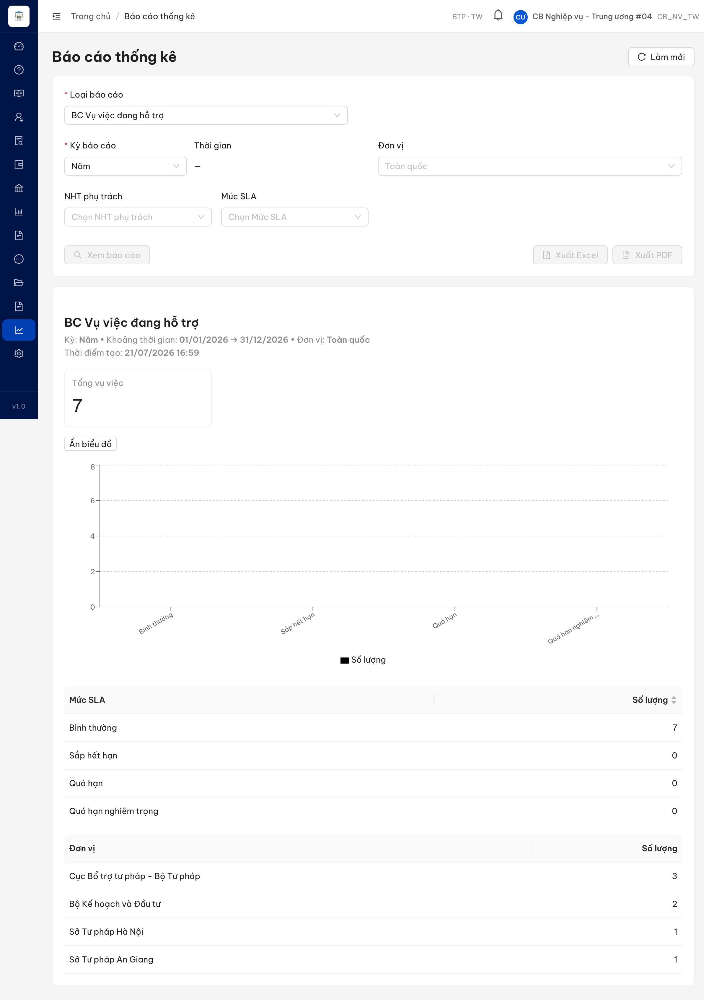
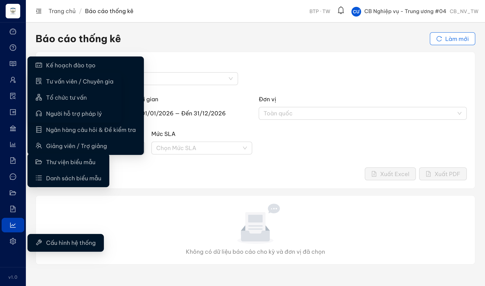

# Bug Report — Báo cáo Thống kê (BCTK Batch 13 — DATA / số liệu chính xác _01)

| Thông tin | Giá trị |
|-----------|---------|
| **Dự án** | PM HTPLDN — UAT đối tác tuần 3 (reverify) |
| **Môi trường** | https://18.143.165.120.nip.io |
| **Người test** | QA (Chrome DevTools MCP) |
| **Ngày** | 2026-07-23 14:44:00 |
| **Loại test** | Functional / Data accuracy (reverify bug đối tác) |
| **Round** | Reverify tuần 3 — Batch 13 (DATA _01, 4 case) |
| **Tài khoản verdict** | `cbnv_tw_04` (CB Nghiệp vụ - Trung ương, Toàn quốc) |
| **Tài liệu tham chiếu** | `srs-v3.5/srs-fr-11-bao-cao.md` (FR-IX-03/05/12/22, SCR-IX-01) |

---

## Tổng hợp

Batch 13 verify 4 case số liệu (VVDHT_01 r200, VVTTG_01 r213, VVTLV_01 r241, CTTLV_01 r270). File này chứa các case **Open** (có SRS reference). Case `Reject` / `BA confirm` lưu ở `reverify-audit/` + `ba-confirm/bctk/`.

- **VVDHT_01 (r200)** — ✅ Closed (re-test 2026-07-23 R1 PASS), entry đầy đủ bên dưới (đếm ở Severity breakdown).
- **VVTTG_01 (r213)** — ✅ **Closed** (re-test 2026-07-23 R2 PASS: số "Tiếp nhận" nay = **14** khớp BC đã tiếp nhận, Hoàn thành = **5** khớp BC đã hoàn thành; biểu đồ 2 chuỗi + bảng chi tiết theo kỳ & theo đơn vị đầy đủ, UI = API). TRÙNG gốc `BUG-VVTTG_03` (`Pass-bug-report-bctk-batch1.md`). Không log entry mới, không đếm vào Severity breakdown; chi tiết ở §"VVTTG_01 — tham chiếu" cuối file.
- **VVTLV_01 (r241)** — ✅ **Closed** (re-test 2026-07-23 R1 PASS: biểu đồ nay grouped bar 4 đơn vị khớp bảng cross-tab). TRÙNG gốc `BUG-VVTLV_03` (`Pass-bug-report-bctk-batch3.md`). Không log entry mới, không đếm vào Severity breakdown; chi tiết ở §"VVTLV_01 — tham chiếu" cuối file.

### Severity breakdown

| Tổng | Critical | Major | Medium | Minor | Trivial | Closed | Open |
|------|----------|-------|--------|-------|---------|--------|------|
| 1    | 0        | 1     | 0      | 0     | 0       | 1      | 0    |

## Bug Summary Table

| Bug ID | Severity | Priority | Type | TC Ref | **SRS Reference** | Title | Status |
|--------|----------|----------|------|--------|-------------------|-------|--------|
| ~~BUG-VVDHT_01~~ | Major | P1 | Filter/BE | VVDHT_01 (row 200) | `srs-fr-11-bao-cao.md:244 §Input FR-IX-03` / `:266 AC` | BC Vụ việc đang hỗ trợ: lọc theo NHT phụ trách luôn trả rỗng do FE gửi id thực thể TVV, BE khớp theo user-id | Closed |

---

## ~~BUG-VVDHT_01~~ [CLOSED] — BC Vụ việc đang hỗ trợ: bộ lọc "NHT phụ trách" luôn trả "Không có dữ liệu" dù NHT đó đang phụ trách vụ việc trong phạm vi

> **Re-test:** 2026-07-23 10:00:00 R1 — ✅ PASS. Chạy lại đủ luồng (cbnv_tw_04, BC Vụ việc đang hỗ trợ, Kỳ Năm 2026, Toàn quốc): baseline 6 VV; chọn NHT "QA TVV Seed28 Active" → **Xem báo cáo** trả Tổng vụ việc = **2** (đúng số VV do NHT này phụ trách, khớp bảng "Thống kê theo người hỗ trợ"), filter thu hẹp 6→2 chỉ đơn vị Cục Bổ trợ tư pháp. Không còn "Không có dữ liệu". Bằng chứng: `image/BUG-VVDHT_01-retest-pass-filter-nht-2vv.png`.

### Mô tả

Tại BC Vụ việc đang hỗ trợ (UC126 / FR-IX-03), khi chưa lọc theo "NHT phụ trách" báo cáo hiển thị đầy đủ (Toàn quốc: 7 vụ việc đang xử lý). Nhưng khi chọn một NHT trong dropdown "NHT phụ trách" và Xem báo cáo → hệ thống trả về "Không có dữ liệu báo cáo cho kỳ và đơn vị đã chọn", **kể cả khi chọn đúng NHT đang thực sự phụ trách vụ việc trong phạm vi**. Bộ lọc theo người hỗ trợ thực chất không dùng được.

Nguyên nhân quan sát được: dropdown "NHT phụ trách" lấy dữ liệu từ `GET /api/v1/tu-van-viens`, mỗi mục có `id` = **định danh thực thể Tư vấn viên** (vd "QA TVV Seed28 Active" → `98cfd963-…`). Khi user chọn, FE gửi `nhtId=98cfd963-…` (id thực thể TVV). Trong khi báo cáo khớp người hỗ trợ theo **định danh người dùng (NGUOI_DUNG / taiKhoanId)** — chính là `5432719c-…` mà API trả trong `theoNht`. Hai định danh khác nhau nên bộ lọc không khớp bất kỳ vụ việc nào → luôn rỗng.

### Các bước tái hiện

1. Đăng nhập `cbnv_tw_04` (CB Nghiệp vụ - Trung ương, phạm vi Toàn quốc).
2. Vào **Báo cáo thống kê** → Loại báo cáo = "BC Vụ việc đang hỗ trợ", Kỳ = Năm (01/01/2026 → 31/12/2026), Đơn vị = Toàn quốc.
3. Bấm **Xem báo cáo** (chưa lọc NHT) → hiển thị Tổng vụ việc = **7** (Cục Bổ trợ tư pháp 3, Bộ KH&ĐT 2, STP Hà Nội 1, STP An Giang 1). Tiền đề: có ≥1 VV đang hỗ trợ được 1 NHT phụ trách (API `theoNht:[{nhtId:"5432719c-…", soLuong:1}]` = NHT "QA TVV Seed28 Active").
4. Chọn **NHT phụ trách = "QA TVV Seed28 Active"** (chính NHT đang phụ trách 1 VV ở bước 3) → **Xem báo cáo**.
5. Kết quả: "Không có dữ liệu báo cáo cho kỳ và đơn vị đã chọn". Nút Xuất Excel/PDF bị vô hiệu (không có data).

### Kết quả mong đợi

- Theo FR-IX-03 §Input (dòng 244), `nht_id` là khóa ngoại tới NGUOI_DUNG; khi lọc theo một NHT đang phụ trách vụ việc trong phạm vi thì báo cáo phải trả về đúng các vụ việc do NHT đó phụ trách.
- Theo AC (dòng 266), khi áp bộ lọc, chỉ hiển thị các vụ việc thỏa điều kiện filter — không được trả rỗng khi thực sự tồn tại vụ việc khớp.
- Với dữ liệu hiện có, lọc theo "QA TVV Seed28 Active" phải trả về **1 vụ việc** (NHT này đang phụ trách 1 VV).

### Kết quả thực tế

- Lọc theo "QA TVV Seed28 Active" → **0 vụ việc**, "Không có dữ liệu".
- Đo API cùng thao tác (kỳ Năm 2026, Toàn quốc):
  - Không lọc → `tongVuViec: 7`, `theoNht:[{"nhtId":"5432719c-c542-4a5d-8c3a-db1b8a918bbf","ten":"","soLuong":1}]`.
  - `&nhtId=98cfd963-3cd3-4c8a-bfa9-625460824d6d` (id TVV — **đúng giá trị FE gửi**) → `tongVuViec: 0`, `theoNht:[]`, `theoDonVi:[]`.
  - `&nhtId=5432719c-c542-4a5d-8c3a-db1b8a918bbf` (user-id NGUOI_DUNG) → `tongVuViec: 1`.
- Request thực FE phát khi chọn NHT: `GET …/vu-viec-dang-ho-tro?...&nhtId=98cfd963-…` (id thực thể TVV, không phải taiKhoanId).
- (Ngoài phạm vi filter: báo cáo cũng không dựng bảng/biểu đồ "theo NHT" trên UI dù API trả `theoNht` — đã ghi ở BUG-VVDHT_04 batch1, không lặp ở đây.)

### Bằng chứng

Đối chiếu API (2 phương pháp) + FE request URL: xem `cond/VVDHT_01.md`.

---

## VVTTG_01 — tham chiếu (✅ Closed, TRÙNG gốc `BUG-VVTTG_03` batch1)

**✅ Re-test 2026-07-23 14:44:00 R2 — PASS (Closed).** Chạy lại đủ luồng (cbnv_tw_04, BC Vụ việc theo thời gian, Kỳ Năm 2026, Toàn quốc): biểu đồ **2 chuỗi** "Tiếp nhận" + "Hoàn thành" + bảng chi tiết Kỳ (2026: TN 14 / HT 5) + bảng theo đơn vị (Cục Bổ trợ 7, Bộ KH&ĐT 3, STP HN 1, STP AG 3 = 14). **Số liệu nay chính xác:** thẻ "Tổng vụ việc toàn kỳ" = 14, chuỗi "Tiếp nhận" = **14** khớp "BC Vụ việc đã tiếp nhận" (14) và dashboard (14); chuỗi "Hoàn thành" = **5** khớp "BC Vụ việc đã hoàn thành" (5). Hết mâu thuẫn 6 vs 14 của vòng trước. Bằng chứng: `reverify-audit/VVTTG_01/reverify2-VVTTG_01-2series-14-5.png`.

**Không log entry mới** vì cùng gốc lỗi với `BUG-VVTTG_03` (`Pass-bug-report-bctk-batch1.md`, row 215) — gốc đã Closed.

- **Đối tác phản ánh (row 213):** "Số liệu thống kê không chính xác" trên BC Vụ việc theo thời gian.
- **Verify `cbnv_tw_04`, kỳ Năm 2026, Toàn quốc (UI + API, 2 phương pháp):**
  - UI: thẻ "Tổng vụ việc toàn kỳ" = 14; biểu đồ 2 chuỗi; bảng Kỳ 2026 → Tiếp nhận 14 / Hoàn thành 5.
  - API `bao-cao/vu-viec-theo-thoi-gian` (Năm 2026): `tongVuViecToanKy:14`, `data[0]={soVuViec:14, tiepNhan:14, hoanThanh:5}`, `theoDonVi[]` đủ 4 đơn vị (Σ tiepNhan 7+3+1+3=14, Σ hoanThanh 2+2+1+0=5) — nay có đủ trường `tiepNhan`/`hoanThanh` theo §Output FR-IX-05 (dòng 337).
  - Cross-check: `bao-cao/vu-viec-tiep-nhan` = 14 (khớp) · `bao-cao/vu-viec-hoan-thanh` = 5 (khớp). UI = API, số liệu nhất quán giữa các báo cáo.
- **Lịch sử:** vòng gốc trả 1 chỉ số `soVuViec=6` (không khớp 14 hay 5); nay báo cáo trả đúng 2 chuỗi `{tiepNhan:14, hoanThanh:5}` theo SRS FR-IX-05 §Output → số liệu tự khớp, defect cấu trúc `BUG-VVTTG_03` đã được fix.
- **Bằng chứng + reconciliation:** `reverify-audit/VVTTG_01/reverify2-VVTTG_01-2series-14-5.png` (R2 PASS), `reverify-audit/VVTTG_01/reconciliation.md`, `cond/VVTTG_01.md`.
- **Owner:** cùng `BUG-VVTTG_03` (Dev FE/BE — đã bổ sung chuỗi tiếp nhận/hoàn thành theo §Output FR-IX-05).

---

## VVTLV_01 — tham chiếu (Closed, TRÙNG gốc `BUG-VVTLV_03` batch3)

**✅ Re-test 2026-07-23 10:15:00 R1 — PASS.** Chạy lại đủ luồng (cbnv_tw_04, BC Vụ việc theo lĩnh vực, Kỳ Năm 2026, Toàn quốc): biểu đồ nay là **grouped bar 4 chuỗi đơn vị** (Cục Bổ trợ, Bộ KH&ĐT, STP Hà Nội, STP An Giang) + bảng **cross-tab đủ cột từng đơn vị**: Thuế 1/0/0/0 = 1; Thương mại 7/4/2/3 = 16. Biểu đồ (4 bar/lĩnh vực) khớp bảng (Thương mại 4 cột đơn vị = Tổng 16) — không còn "biểu đồ ≠ bảng tổng hợp". Bằng chứng: `image/VVTLV_01-retest-pass-groupedbar-crosstab.png`.

**Không log entry mới** vì cùng gốc lỗi với `BUG-VVTLV_03` (`Pass-bug-report-bctk-batch3.md`, row 242).

- **Đối tác phản ánh (row 241):** "Biểu đồ ≠ bảng tổng hợp" trên BC Vụ việc theo lĩnh vực.
- **Verify `cbnv_tw_04`, kỳ Năm 2026, Toàn quốc:** lĩnh vực "Thương mại" — **biểu đồ** chỉ 1 chuỗi legend "Cục Bổ trợ tư pháp - Bộ Tư pháp", hover cột Thương mại = **7** (chỉ đơn vị Cục Bổ trợ); **bảng tổng hợp** cột Tổng số = **16**. API `vu-viec-theo-linh-vuc` trả `chartType:"GROUPED_BAR"` + `theoDonVi[]` đủ 4 đơn vị (7+4+2+3=16) → biểu đồ chỉ vẽ 1 đơn vị, bỏ 3 đơn vị (Bộ KH&ĐT, STP HN, STP AG) → biểu đồ (7) ≠ bảng (16).
- **Bản chất:** đây là triệu chứng "biểu đồ ≠ bảng" của cùng defect mà `BUG-VVTLV_03` đã mô tả (FE không dựng cross-tab theo đơn vị: biểu đồ 1 chuỗi + bảng chỉ cột Tổng, dù BE trả `theoDonVi[]`). Khi FE dựng đúng Grouped bar nhiều đơn vị theo SRS FR-IX-12 → biểu đồ khớp bảng.
- **Bằng chứng + reconciliation:** `reverify-audit/VVTLV_01/reconciliation.md`, `reverify-audit/VVTLV_01/vvtlv-chart-vs-table.png`, `cond/VVTLV_01.md`; ảnh gốc `image/BUG-VVTLV_03-web.png`.
- **Owner:** cùng `BUG-VVTLV_03` (Dev FE — dựng biểu đồ Grouped bar đủ đơn vị + bảng cross-tab theo §Output/AC FR-IX-12).
