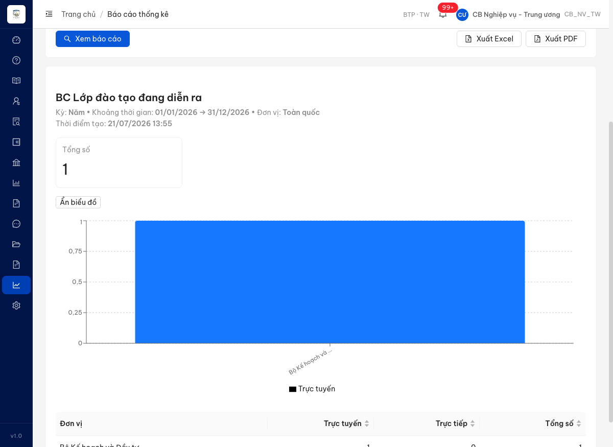
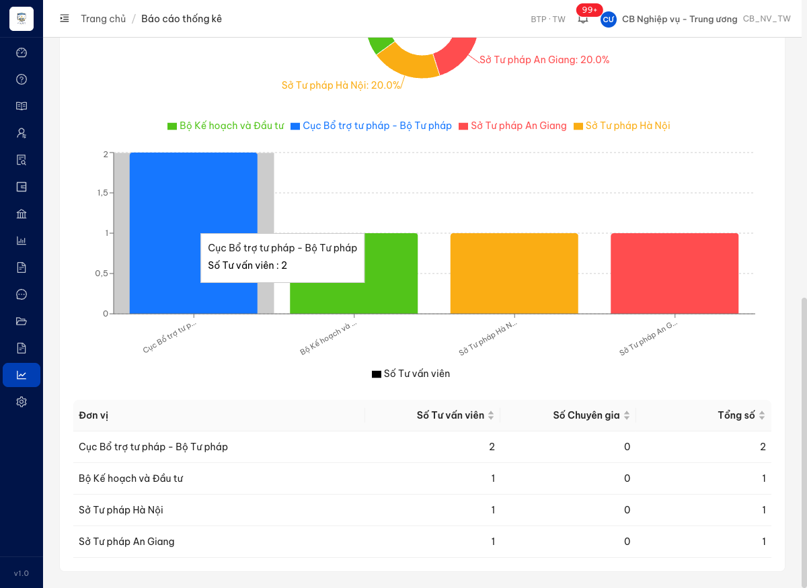
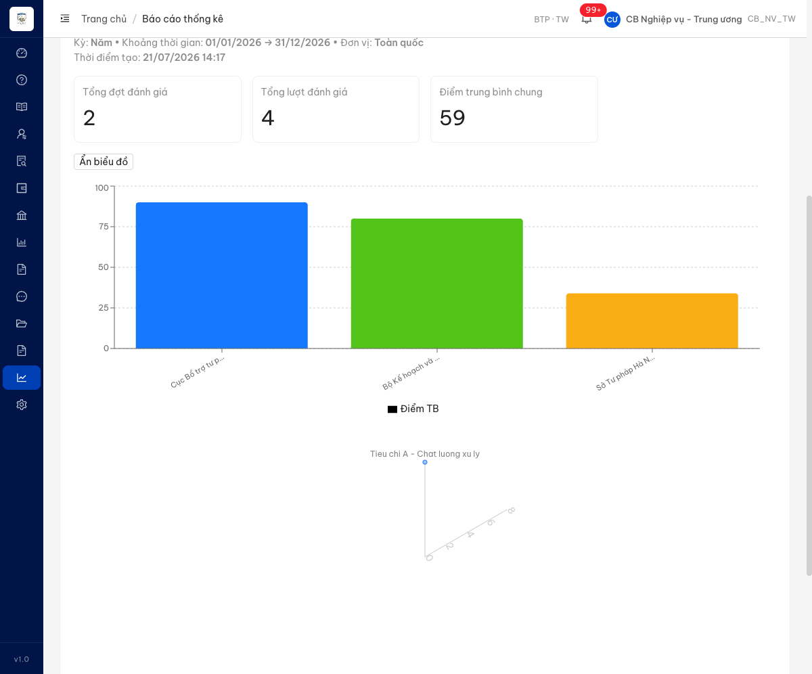
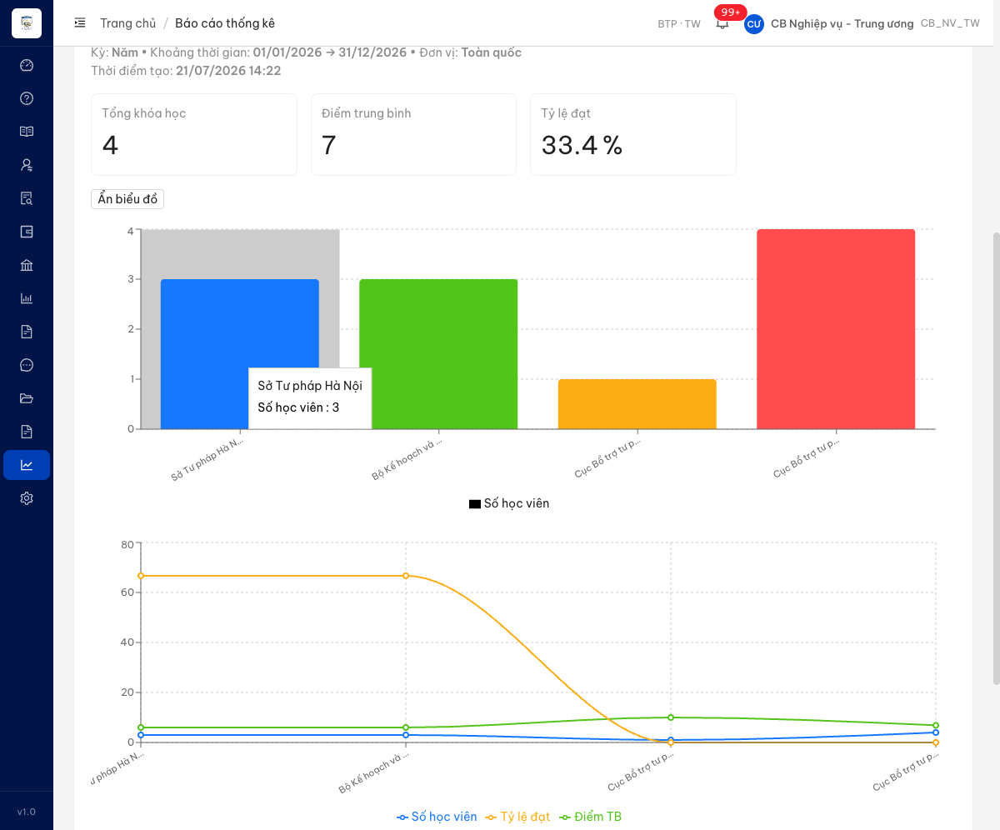

# Bug Report — Báo cáo Thống kê (BCTK Batch 2 — DISPLAY họ Đào tạo / CG-TVV / Đánh giá)

| Thông tin | Giá trị |
|-----------|---------|
| **Dự án** | PM HTPLDN — UAT đối tác tuần 3 (reverify) |
| **Môi trường** | https://18.143.165.120.nip.io |
| **Người test** | QA (Chrome DevTools MCP) |
| **Ngày** | 2026-07-23 07:54:00 |
| **Loại test** | Functional / Display (reverify bug đối tác) |
| **Round** | Reverify tuần 3 — Batch 2 |
| **Tài liệu tham chiếu** | `srs-v3.5/srs-fr-11-bao-cao.md` (FR-IX-06→10, SCR-IX-01) |

---

## Tổng hợp

Verify 7 case DISPLAY họ Đào tạo / CG-TVV / Đánh giá (rows 220–236). Các bug có SRS reference cụ thể được log dưới đây; case web đúng SRS / khác biệt đặc tả → chuyển `../../ba-confirm/bctk/ba-confirmation-needed-bctk-batch2.md`.

### Severity breakdown

| Tổng | Critical | Major | Medium | Minor | Trivial | Closed | Open |
|------|----------|-------|--------|-------|---------|--------|------|
| 4 | 0 | 4 | 0 | 0 | 0 | 4 | 0 |

## Bug Summary Table

| Bug ID | Severity | Priority | Type | TC Ref | **SRS Reference** | Title | Status |
|--------|----------|----------|------|--------|-------------------|-------|--------|
| BUG-CLDTBDDDR_03 | Major | P1 | UI/UX | CLDTBDDDR_03 (row 220) | `srs-fr-11-bao-cao.md:377-378 §Output FR-IX-06` | BC Lớp đào tạo đang diễn ra: thiếu 2 chỉ số "Số trực tuyến" / "Số trực tiếp" (chỉ hiện thẻ Tổng số) | Closed |
| BUG-CGTVPL-LINHVUC | Major | P1 | UI/UX | CGTVPL_04 (row 229) — phát hiện ngoài phạm vi | `srs-fr-11-bao-cao.md:465 §Output FR-IX-08 #6` | BC Số lượng CG/TVV: không hiển thị mục thống kê "theo lĩnh vực" dù BE trả theoLinhVuc | Closed |
| BUG-DGHQHTPL_03 | Major | P1 | UI/UX | DGHQHTPL_03 (row 232) | `srs-fr-11-bao-cao.md:504 §Output FR-IX-09 #2` | BC Đánh giá hiệu quả HTPL: thiếu thẻ chỉ số tổng "Tổng số vụ việc đã đánh giá" (so_vu_viec_danh_gia) | Closed |
| BUG-CLDTBDPL_03 | Major | P1 | UI/UX | CLDTBDPL_03 (row 235) | `srs-fr-11-bao-cao.md:546 §Output FR-IX-10 #3` | BC Chất lượng đào tạo: thiếu thẻ chỉ số tổng "Tổng số học viên" (tong_hoc_vien) | Closed |

---

## ~~BUG-CLDTBDDDR_03~~ [CLOSED] — BC Lớp đào tạo đang diễn ra: thiếu chỉ số "Số trực tuyến" / "Số trực tiếp"

> **Re-test:** 2026-07-23 07:45:00 R (reverify tuần 3) — ✅ PASS (Closed-verified). Chạy lại luồng (cbnv_tw_04 · Năm 01/01–31/12/2026 · Toàn quốc): báo cáo hiển thị đủ 3 thẻ chỉ số **Tổng số=1 · Số trực tuyến=1 · Số trực tiếp=0**, khớp bảng chi tiết theo đơn vị. BE trả `trucTuyen`/`trucTiep` ở cấp tổng, FE render 2 thẻ mới.

### Mô tả

Tại BC Lớp đào tạo đang diễn ra (UC129), khu vực kết quả chỉ hiển thị **1 thẻ chỉ số "Tổng số = 1"**. Không có thẻ chỉ số riêng cho **Số trực tuyến** và **Số trực tiếp**. Hai giá trị này chỉ tồn tại dưới dạng **cột trong bảng chi tiết theo đơn vị** (Trực tuyến / Trực tiếp) và làm legend của biểu đồ cột, KHÔNG có thẻ chỉ số (KPI card) tổng ở đầu báo cáo. SRS FR-IX-06 §Output liệt kê rõ `truc_tuyen` (Số KH trực tuyến) và `truc_tiep` (Số KH trực tiếp) là output "Luôn", riêng biệt với `theo_don_vi[]`.

### Các bước tái hiện

1. Đăng nhập role `cbnv_tw` (CB Nghiệp vụ - Trung ương, phạm vi Toàn quốc — có quyền xem báo cáo theo SCR-IX-01 processing bước 1).
2. Vào **Báo cáo thống kê** → Loại báo cáo = "BC Lớp đào tạo đang diễn ra".
3. Kỳ = Năm, Thời gian 01/01/2026 → 31/12/2026, Đơn vị = Toàn quốc → **Xem báo cáo**.
4. Quan sát khu vực kết quả: chỉ có 1 thẻ "Tổng số = 1"; biểu đồ cột theo đơn vị (legend "Trực tuyến"); bảng "Đơn vị / Trực tuyến / Trực tiếp / Tổng số". **Không có thẻ chỉ số "Số trực tuyến", "Số trực tiếp".**
5. Mở Network → `GET /api/v1/bao-cao/lop-dao-tao-dang-dien-ra` trả `tongSo: 1` ở cấp tổng + `trucTuyen`/`trucTiep` chỉ nằm per-đơn-vị trong `theoDonVi[]`.

### Kết quả mong đợi

- Theo SRS FR-IX-06 §Output, báo cáo **luôn** hiển thị 3 chỉ số: `tong_dang_dien_ra` (Tổng KH đang diễn ra), `truc_tuyen` (dòng 377 — Số KH trực tuyến), `truc_tiep` (dòng 378 — Số KH trực tiếp).
- 3 output này là scalar tổng, riêng biệt với `theo_don_vi[]` (#4). Cần hiển thị đủ 3 thẻ chỉ số ở đầu báo cáo.

### Kết quả thực tế

- UI chỉ có 1 thẻ chỉ số "Tổng số = 1".
- **Thiếu thẻ "Số trực tuyến" và "Số trực tiếp"** — 2 giá trị này chỉ hiện trong bảng chi tiết (Bộ KH&ĐT: Trực tuyến 1, Trực tiếp 0) và legend biểu đồ, không phải thẻ chỉ số tổng.

### Bằng chứng

**1. Ảnh chụp**:



**2. API response** (BE trả tongSo tổng + trucTuyen/trucTiep chỉ per-đơn-vị):

```json
{"success":true,"data":{"tenBaoCao":"BC Lớp đào tạo đang diễn ra","tongSo":1,"theoDonVi":[{"tenDonVi":"Bộ Kế hoạch và Đầu tư","trucTuyen":1,"trucTiep":0,"tongSo":1}],"chartType":"BAR"}}
```

---

## ~~BUG-CGTVPL-LINHVUC~~ [CLOSED] — BC Số lượng CG/TVV: thiếu mục thống kê "theo lĩnh vực" (FE bỏ render dù BE trả theoLinhVuc)

> **Re-test:** 2026-07-23 07:50:00 R (reverify tuần 3) — ✅ PASS (Closed-verified). Chạy lại luồng (cbnv_tw_04 · Năm 01/01–31/12/2026 · Toàn quốc): báo cáo nay có mục **"Thống kê theo lĩnh vực pháp luật"** với bảng **Thương mại 2 (66,7%) · Doanh nghiệp 1 (33,3%)**, khớp `theoLinhVuc` BE trả. FE đã render mục lĩnh vực.

> Lỗi phát hiện ngoài phạm vi câu hỏi đối tác ở CGTVPL_04 (đối tác chỉ hỏi về biểu đồ tròn/cột). Log theo quy trình "bug ngoài phạm vi cũng phải log".

### Mô tả

Tại BC Số lượng CG/TVV (UC131), khu vực kết quả chỉ hiển thị các mục theo **đơn vị** (biểu đồ tròn theo đơn vị, biểu đồ cột theo đơn vị, bảng theo đơn vị) + 3 thẻ chỉ số (Tổng TVV / Số TVV / Số CG). Hoàn toàn **không có mục thống kê "theo lĩnh vực chuyên môn"** (không bảng, không biểu đồ). Trong khi API backend `/api/v1/bao-cao/so-luong-cg-tvv` **đã trả về** trường `theoLinhVuc` với dữ liệu (Thương mại: 2, Doanh nghiệp: 1) → FE nhận data nhưng không dựng phần lĩnh vực.

### Các bước tái hiện

1. Đăng nhập role `cbnv_tw` (CB Nghiệp vụ - Trung ương, phạm vi Toàn quốc — có quyền xem báo cáo theo SCR-IX-01 processing bước 1).
2. Vào **Báo cáo thống kê** → Loại báo cáo = "BC Số lượng CG/TVV".
3. Kỳ = Năm, Thời gian 01/01/2026 → 31/12/2026, Đơn vị = Toàn quốc → **Xem báo cáo**.
4. Quan sát khu vực kết quả: chỉ có thẻ chỉ số + biểu đồ tròn/cột theo đơn vị + bảng theo đơn vị. **Không có bảng/biểu đồ "theo lĩnh vực".** Kiểm tra DOM: không tồn tại text "Thương mại" trong trang.
5. Mở Network → `GET /api/v1/bao-cao/so-luong-cg-tvv` trả `theoLinhVuc: [{ten:"Thương mại", soLuong:2}, {ten:"Doanh nghiệp", soLuong:1}]` → data có nhưng UI không vẽ.

### Kết quả mong đợi

- Theo SRS FR-IX-08 §Output #6 (dòng 465), báo cáo **luôn** phải có mục tổng hợp `theo_linh_vuc[]` = {lĩnh vực, tên, số lượng} → cần hiển thị bảng và/hoặc biểu đồ thống kê theo lĩnh vực chuyên môn.

### Kết quả thực tế

- UI chỉ có mục theo đơn vị (biểu đồ tròn 40/20/20/20 theo đơn vị, biểu đồ cột theo đơn vị, bảng đơn vị) + 3 thẻ chỉ số.
- **Thiếu hoàn toàn mục "theo lĩnh vực"** dù BE trả `theoLinhVuc: [{"tenLinhVuc":"Thương mại","soLuong":2},{"tenLinhVuc":"Doanh nghiệp","soLuong":1}]`.

### Bằng chứng

**1. Ảnh chụp** (bảng chỉ có cột theo đơn vị, kết thúc trang — không có mục lĩnh vực):



**2. API response** (BE trả theoLinhVuc nhưng UI không render):

```json
{"success":true,"data":{"tenBaoCao":"BC Số lượng CG/TVV","tongTvv":5,"soTvv":5,"soCg":0,"theoDonVi":[{"tenDonVi":"Cục Bổ trợ tư pháp - Bộ Tư pháp","soTvv":2,"soCg":0,"tongSo":2},{"tenDonVi":"Bộ Kế hoạch và Đầu tư","soTvv":1,"soCg":0,"tongSo":1},{"tenDonVi":"Sở Tư pháp Hà Nội","soTvv":1,"soCg":0,"tongSo":1},{"tenDonVi":"Sở Tư pháp An Giang","soTvv":1,"soCg":0,"tongSo":1}],"theoLinhVuc":[{"tenLinhVuc":"Thương mại","soLuong":2},{"tenLinhVuc":"Doanh nghiệp","soLuong":1}],"chartType":"DONUT_BAR"}}
```

---

## ~~BUG-DGHQHTPL_03~~ [CLOSED] — BC Đánh giá hiệu quả HTPL: thiếu thẻ chỉ số tổng "Tổng số vụ việc đã đánh giá"

> **Re-test:** 2026-07-23 07:52:00 R (reverify tuần 3) — ✅ PASS (Closed-verified). Chạy lại luồng (cbnv_tw_04 · Năm 01/01–31/12/2026 · Toàn quốc): báo cáo nay có 4 thẻ chỉ số gồm **"Tổng số vụ việc đã đánh giá = 4"** (đúng tổng số VV per-đơn-vị 1+1+2). BE trả field tổng `soVuViecDanhGia` (trước thiếu cả BE lẫn UI), FE render thẻ mới.

### Mô tả

Tại BC Đánh giá hiệu quả HTPL (UC132), khu vực kết quả chỉ hiển thị **3 thẻ chỉ số**: "Tổng đợt đánh giá = 2", "Tổng lượt đánh giá = 4", "Điểm trung bình chung = 59". **Không có thẻ chỉ số "Tổng số vụ việc đã đánh giá".** SRS FR-IX-09 §Output liệt kê `so_vu_viec_danh_gia` (Tổng VV được đánh giá) là output "Luôn", tách biệt với `theo_don_vi[]`. Hai thẻ "Tổng đợt đánh giá" / "Tổng lượt đánh giá" hiện có KHÔNG nằm trong danh sách output SRS và khác khái niệm với "số vụ việc" (một vụ việc có thể có nhiều lượt/đợt đánh giá).

### Các bước tái hiện

1. Đăng nhập role `cbnv_tw` (CB Nghiệp vụ - Trung ương, phạm vi Toàn quốc — có quyền xem báo cáo theo SCR-IX-01 processing bước 1).
2. Vào **Báo cáo thống kê** → Loại báo cáo = "BC Đánh giá hiệu quả HTPL".
3. Kỳ = Năm, Thời gian 01/01/2026 → 31/12/2026, Đơn vị = Toàn quốc → **Xem báo cáo**.
4. Quan sát khu vực kết quả: chỉ có 3 thẻ chỉ số (Tổng đợt đánh giá / Tổng lượt đánh giá / Điểm trung bình chung); biểu đồ cột Điểm TB theo đơn vị; biểu đồ theo tiêu chí; bảng theo đơn vị (cột Điểm TB / Số lượt đánh giá / Số vụ việc). **Không có thẻ chỉ số "Tổng số vụ việc đã đánh giá".**
5. Mở Network → `GET /api/v1/bao-cao/danh-gia-hieu-qua` trả `tongDotDanhGia`, `tongLuotDanhGia`, `diemTrungBinhChung` ở cấp tổng + `soVuViec` chỉ nằm per-đơn-vị trong `theoDonVi[]`; **không có trường tổng `so_vu_viec_danh_gia`**.

### Kết quả mong đợi

- Theo SRS FR-IX-09 §Output (dòng 504), báo cáo **luôn** hiển thị chỉ số `so_vu_viec_danh_gia` (Tổng VV được đánh giá) — là output scalar tổng, tách biệt với `theo_don_vi[]` (#3).
- Cần có thẻ chỉ số "Tổng số vụ việc đã đánh giá" ở đầu báo cáo (song song với thẻ "Điểm trung bình chung" đã có = `diem_trung_binh` dòng 503).

### Kết quả thực tế

- UI có 3 thẻ chỉ số: Tổng đợt đánh giá (2), Tổng lượt đánh giá (4), Điểm trung bình chung (59).
- **Thiếu thẻ "Tổng số vụ việc đã đánh giá"** — giá trị số vụ việc chỉ hiện trong cột bảng chi tiết per-đơn-vị (Cục Bổ trợ 1, Bộ KH&ĐT 1, Sở TP Hà Nội 2 → tổng 4), không phải thẻ chỉ số tổng.
- API cũng không trả trường tổng `so_vu_viec_danh_gia` (chỉ có `soVuViec` per-đơn-vị) → thiếu ở cả BE lẫn UI.

### Bằng chứng

**1. Ảnh chụp** (3 thẻ chỉ số: Tổng đợt / Tổng lượt / Điểm TB — không có thẻ Tổng số vụ việc đã đánh giá):



**2. API response** (BE trả đợt/lượt/điểm TB tổng + soVuViec chỉ per-đơn-vị, không có so_vu_viec_danh_gia tổng):

```json
{"success":true,"data":{"tenBaoCao":"BC Đánh giá hiệu quả HTPL","tongDotDanhGia":2,"tongLuotDanhGia":4,"diemTrungBinhChung":59.5,"theoDonVi":[{"tenDonVi":"Cục Bổ trợ tư pháp - Bộ Tư pháp","diemTrungBinh":90,"soLuotDanhGia":1,"soVuViec":1},{"tenDonVi":"Bộ Kế hoạch và Đầu tư","diemTrungBinh":80,"soLuotDanhGia":1,"soVuViec":1},{"tenDonVi":"Sở Tư pháp Hà Nội","diemTrungBinh":34,"soLuotDanhGia":2,"soVuViec":2}],"theoTieuChi":[{"tenTieuChi":"Tieu chi A - Chat luong xu ly","trongSo":100,"diemTrungBinh":8}],"chartTypes":["BAR","RADAR"]}}
```

---

## ~~BUG-CLDTBDPL_03~~ [CLOSED] — BC Chất lượng đào tạo: thiếu thẻ chỉ số tổng "Tổng số học viên"

> **Re-test:** 2026-07-23 07:54:00 R (reverify tuần 3) — ✅ PASS (Closed-verified). Chạy lại luồng (cbnv_tw_04 · Năm 01/01–31/12/2026 · Toàn quốc): báo cáo nay có 4 thẻ chỉ số gồm **"Tổng học viên = 11"** (đúng tổng soHocVien 4 khóa: 3+3+1+4). BE trả field tổng `tongHocVien` (trước thiếu cả BE lẫn UI), FE render thẻ mới.

### Mô tả

Tại BC Chất lượng đào tạo (UC133), khu vực kết quả chỉ hiển thị **3 thẻ chỉ số**: "Tổng khóa học = 4", "Điểm trung bình = 7", "Tỷ lệ đạt = 33.4%". **Không có thẻ chỉ số "Tổng số học viên".** SRS FR-IX-10 §Output liệt kê `tong_hoc_vien` (Tổng HV tham gia) là output "Luôn", tách biệt với `theo_khoa_hoc[]`. Thẻ "Tổng khóa học" hiện có KHÔNG nằm trong danh sách output SRS (số khóa học ≠ số học viên).

### Các bước tái hiện

1. Đăng nhập role `cbnv_tw` (CB Nghiệp vụ - Trung ương, phạm vi Toàn quốc — có quyền xem báo cáo theo SCR-IX-01 processing bước 1).
2. Vào **Báo cáo thống kê** → Loại báo cáo = "BC Chất lượng đào tạo".
3. Kỳ = Năm, Thời gian 01/01/2026 → 31/12/2026, Đơn vị = Toàn quốc → **Xem báo cáo**.
4. Quan sát khu vực kết quả: chỉ có 3 thẻ chỉ số (Tổng khóa học / Điểm trung bình / Tỷ lệ đạt); biểu đồ cột Số học viên; biểu đồ combo Số học viên/Tỷ lệ đạt/Điểm TB; bảng theo khóa học (cột Mã KH / Tên KH / Đơn vị / Số học viên / Điểm TB / Tỷ lệ đạt). **Không có thẻ chỉ số "Tổng số học viên".**
5. Mở Network → `GET /api/v1/bao-cao/chat-luong-dao-tao` trả `tongKhoaHoc`, `diemTrungBinhTong`, `tyLeDatTong` ở cấp tổng + `soHocVien` chỉ nằm per-khóa-học trong `danhSachKhoaHoc[]`; **không có trường tổng `tong_hoc_vien`**.

### Kết quả mong đợi

- Theo SRS FR-IX-10 §Output (dòng 546), báo cáo **luôn** hiển thị chỉ số `tong_hoc_vien` (Tổng HV tham gia) — là output scalar tổng, tách biệt với `theo_khoa_hoc[]` (#4).
- Cần có thẻ chỉ số "Tổng số học viên" ở đầu báo cáo (song song với các thẻ "Điểm trung bình" = `diem_trung_binh` dòng 544 và "Tỷ lệ đạt" = `ty_le_dat` dòng 545 đã có).

### Kết quả thực tế

- UI có 3 thẻ chỉ số: Tổng khóa học (4), Điểm trung bình (7), Tỷ lệ đạt (33.4%).
- **Thiếu thẻ "Tổng số học viên"** — giá trị số học viên chỉ hiện trong cột bảng chi tiết per-khóa-học (3 + 3 + 1 + 4 → tổng 11), không phải thẻ chỉ số tổng.
- API cũng không trả trường tổng `tong_hoc_vien` (chỉ có `soHocVien` per-khóa-học) → thiếu ở cả BE lẫn UI.

### Bằng chứng

**1. Ảnh chụp** (3 thẻ chỉ số: Tổng khóa học / Điểm trung bình / Tỷ lệ đạt — không có thẻ Tổng số học viên):



**2. API response** (BE trả tổng khóa học/điểm TB/tỷ lệ đạt + soHocVien chỉ per-khóa-học, không có tong_hoc_vien tổng):

```json
{"success":true,"data":{"tenBaoCao":"BC Chất lượng đào tạo","tongKhoaHoc":4,"diemTrungBinhTong":7.22,"tyLeDatTong":33.4,"danhSachKhoaHoc":[{"maKhoaHoc":"AAA-KH-DP","tenKhoaHoc":"Đào tạo pháp lý Địa phương 2026","soHocVien":3,"diemTrungBinh":6,"tyLeDat":66.7,"tenDonVi":"Sở Tư pháp Hà Nội"},{"maKhoaHoc":"AAA-KH-BN","soHocVien":3,"diemTrungBinh":6,"tyLeDat":66.7,"tenDonVi":"Bộ Kế hoạch và Đầu tư"},{"maKhoaHoc":"KH-SEED-0001","soHocVien":1,"diemTrungBinh":10,"tyLeDat":0,"tenDonVi":"Cục Bổ trợ tư pháp - Bộ Tư pháp"},{"maKhoaHoc":"AAA-KH-TW","soHocVien":4,"diemTrungBinh":6.88,"tyLeDat":0,"tenDonVi":"Cục Bổ trợ tư pháp - Bộ Tư pháp"}],"chartType":"BAR_LINE"}}
```

---

## Phụ lục — Môi trường test

| Thành phần | Giá trị |
|------------|---------|
| URL ứng dụng | https://18.143.165.120.nip.io/bao-cao |
| Tài khoản verdict | `cbnv_tw` / CB_NV_TW (Toàn quốc) |
| OTP login | MailHog `http://18.143.165.120:8025/` |
| API base | https://18.143.165.120.nip.io/api/v1 |
| Frontend | React + Ant Design + Recharts |
| Tool test | Chrome DevTools MCP |

---

*Bug report generated: 2026-07-21 | QA Automation via Claude Code*
