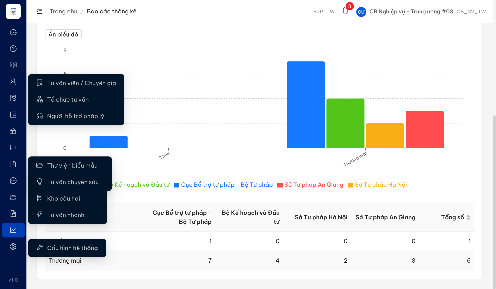
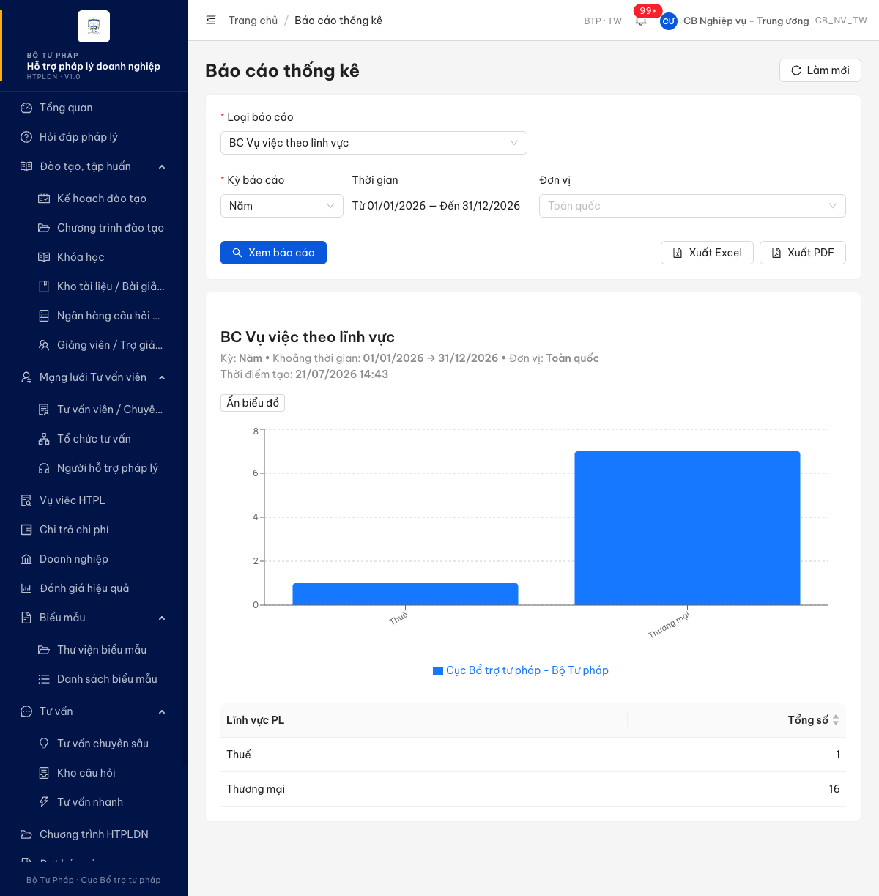
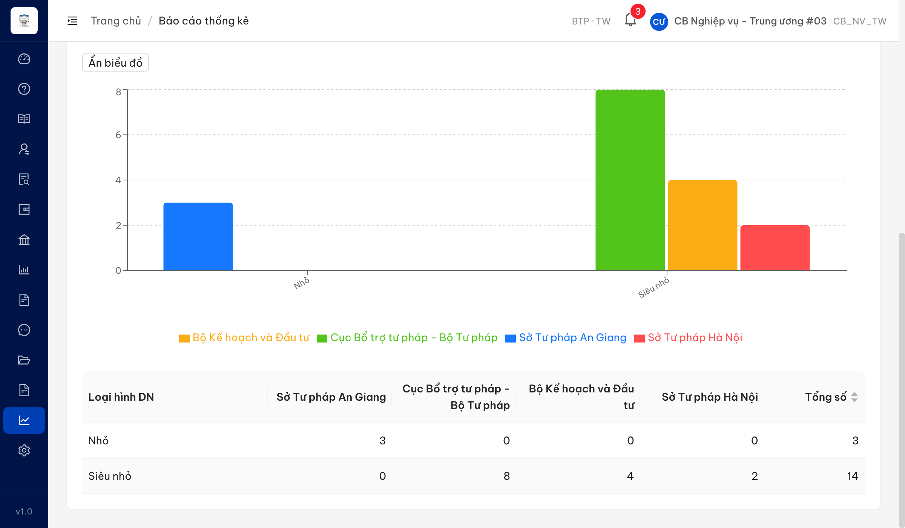
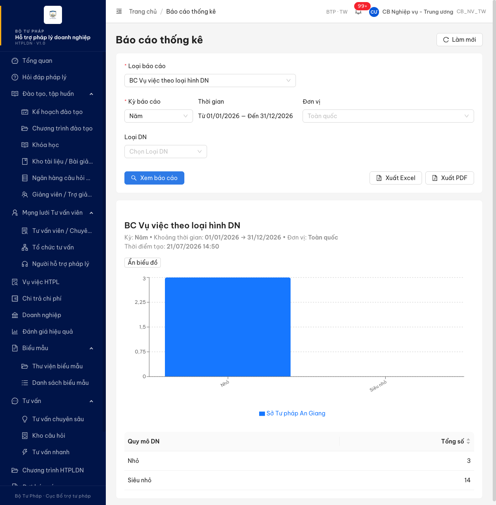
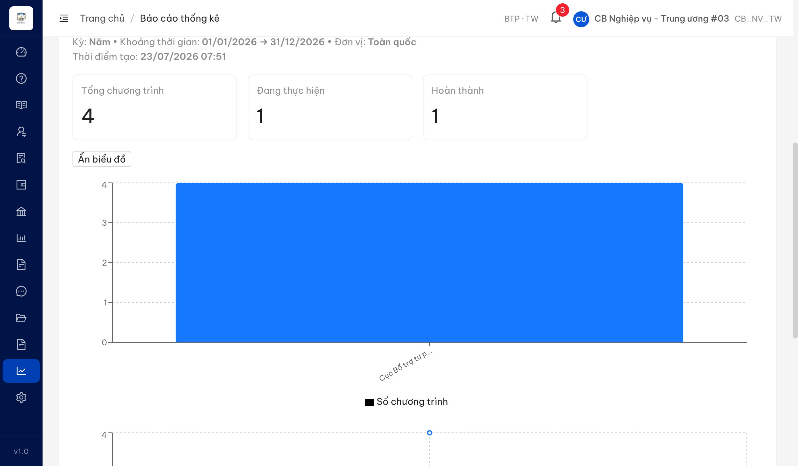
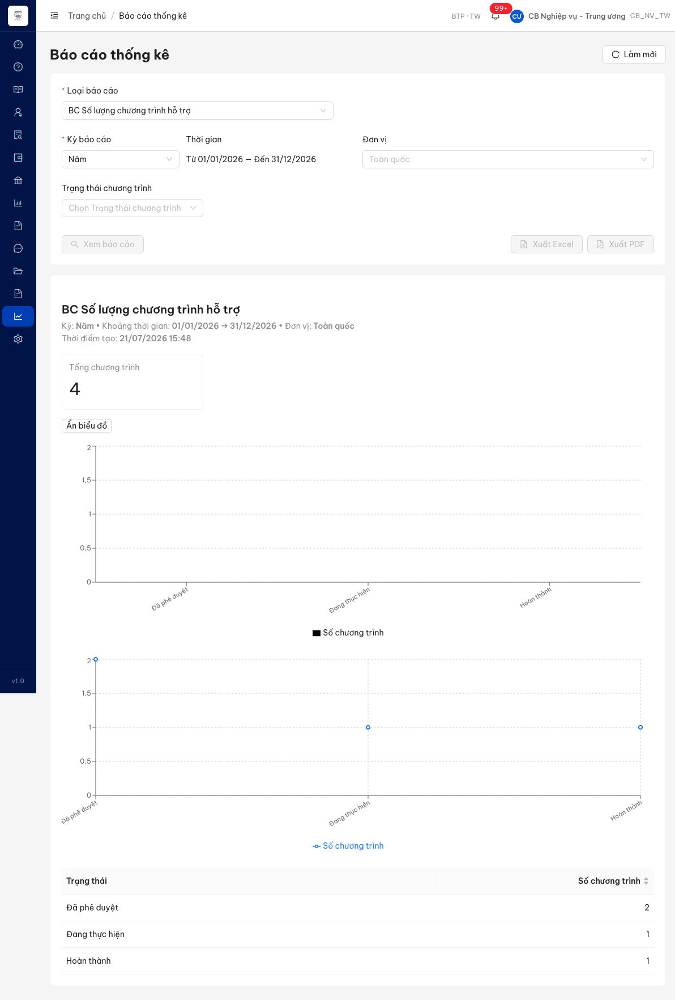
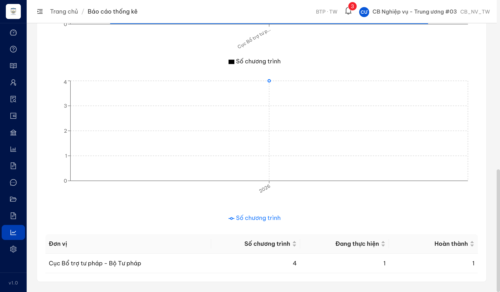

# Bug Report — Báo cáo Thống kê (BCTK Batch 3 — DISPLAY: VV theo chiều + Chi phí + Số lượng CT)

| Thông tin | Giá trị |
|-----------|---------|
| **Dự án** | PM HTPLDN — UAT đối tác tuần 3 (reverify) |
| **Môi trường** | https://18.143.165.120.nip.io |
| **Người test** | QA (Chrome DevTools MCP) |
| **Ngày** | 2026-07-23 07:52:00 |
| **Loại test** | Functional / Display (reverify bug đối tác) |
| **Round** | Reverify tuần 3 — Batch 3 |
| **Tài liệu tham chiếu** | `srs-v3.5/srs-fr-11-bao-cao.md` (FR-IX-12/13/16/18/19/20, SCR-IX-01) |

---

## Tổng hợp

Verify 8 case DISPLAY batch 3 (rows 242–263). Ghi nhận các lỗi có SRS reference cụ thể trong file này; case web đúng SRS / khác biệt thuộc đặc tả → chuyển `../../ba-confirm/bctk/ba-confirmation-needed-bctk-batch3.md`.

> **Reverify R1 (2026-07-23):** 4/4 bug đã **Closed** — Dev fix xác nhận qua UI (cbnv_tw_03). BC theo lĩnh vực + theo loại hình DN nay dựng grouped bar + bảng cross-tab theo đơn vị; BC Số lượng CT có đủ 3 thẻ chỉ số + biểu đồ cột theo đơn vị + đường trend theo kỳ + bảng cột {Đơn vị, Số CT, Đang thực hiện, Hoàn thành}. Còn Open: 0.

### Severity breakdown

| Tổng | Critical | Major | Medium | Minor | Trivial | Closed | Open |
|------|----------|-------|--------|-------|---------|--------|------|
| 4    | 0        | 4     | 0      | 0     | 0       | 4      | 0    |

## Bug Summary Table

| Bug ID | Severity | Priority | Type | TC Ref | **SRS Reference** | Title | Status |
|--------|----------|----------|------|--------|-------------------|-------|--------|
| BUG-VVTLV_03 | Major | P1 | UI/UX | VVTLV_03 (row 242) | `srs-fr-11-bao-cao.md:619,622 §Output/AC FR-IX-12` / `:1071 Mapping` / `:1051-1052 SCR-IX-01` | BC Vụ việc theo lĩnh vực: bảng chỉ có cột "Tổng số", biểu đồ chỉ 1 chuỗi đơn vị — không dựng cross-tab theo đơn vị dù BE trả `theoDonVi[]` | Closed |
| BUG-VVTLHDN_03 | Major | P1 | UI/UX | VVTLHDN_03 (row 245) | `srs-fr-11-bao-cao.md:658,661 §Output/AC FR-IX-13` / `:1072 Mapping` / `:1051-1052 SCR-IX-01` | BC Vụ việc theo loại hình DN: bảng chỉ có cột "Tổng số", biểu đồ chỉ 1 chuỗi đơn vị — không dựng cross-tab theo đơn vị dù BE trả `theoDonVi[]` | Closed |
| BUG-SLCTHT_03 | Major | P1 | UI/UX | SLCTHT_03 (row 262) | `srs-fr-11-bao-cao.md:907-909 §Output FR-IX-20` / `:1051 SCR-IX-01` | BC Số lượng CT hỗ trợ: khu Chỉ số tổng hợp chỉ có "Tổng chương trình", thiếu 2 chỉ số "Đang thực hiện" + "Hoàn thành" (§Output yêu cầu cả 3, điều kiện "Luôn") | Closed |
| BUG-SLCTHT_04 | Major | P1 | UI/UX | SLCTHT_04 (row 263) | `srs-fr-11-bao-cao.md:910-911 §Output FR-IX-20` / `:1079 Mapping` | BC Số lượng CT hỗ trợ: cả 2 biểu đồ + bảng đều theo TRẠNG THÁI; thiếu chiều đơn vị (biểu đồ cột) + kỳ (biểu đồ đường) + cột bảng {Đơn vị, Đang thực hiện, Hoàn thành} theo §Output theo_don_vi/theo_ky | Closed |

---

## ~~BUG-VVTLV_03~~ [CLOSED] — BC Vụ việc theo lĩnh vực: thiếu breakdown "theo đơn vị" ở cả bảng và biểu đồ (FE bỏ render dù BE trả theoDonVi)

> **Re-test:** 2026-07-23 07:46 R1 — ✅ PASS. Chạy lại luồng (cbnv_tw_03, Kỳ Năm 01/01→31/12/2026, Toàn quốc). FE nay dựng biểu đồ **grouped bar 4 chuỗi đơn vị** + bảng **cross-tab đủ cột từng đơn vị**: Thuế 1/0/0/0 = Tổng 1; Thương mại 7/4/2/3 = Tổng 16. Khớp KQ mong đợi (hàng = lĩnh vực × cột = đơn vị). 

### Mô tả

Tại BC Vụ việc theo lĩnh vực (UC135), SRS quy định báo cáo dạng **cross-tab: hàng = lĩnh vực, cột = đơn vị** với biểu đồ **Grouped bar** (nhóm theo lĩnh vực × đơn vị). Thực tế UI chỉ dựng bảng 2 cột "Lĩnh vực PL / Tổng số" và biểu đồ cột **chỉ 1 chuỗi đơn vị**. API `GET /api/v1/bao-cao/vu-viec-theo-linh-vuc` **đã trả** `chartType:"GROUPED_BAR"` + đầy đủ mảng `theoDonVi[]` cho từng lĩnh vực (riêng "Thương mại" tổng 16 gồm 4 đơn vị: Cục Bổ trợ 7, Bộ KH&ĐT 4, STP Hà Nội 2, STP An Giang 3) → FE nhận data nhưng không dựng phần breakdown theo đơn vị.

### Các bước tái hiện

1. Đăng nhập role `cbnv_tw` (CB Nghiệp vụ - Trung ương, phạm vi Toàn quốc — có quyền xem báo cáo theo SCR-IX-01 processing bước 1).
2. Vào **Báo cáo thống kê** → Loại báo cáo = "BC Vụ việc theo lĩnh vực".
3. Kỳ = Năm, Thời gian 01/01/2026 → 31/12/2026, Đơn vị = Toàn quốc → **Xem báo cáo**.
4. Quan sát khu vực kết quả: biểu đồ cột chỉ có **1 chuỗi** (legend duy nhất "Cục Bổ trợ tư pháp - Bộ Tư pháp"); bảng chỉ có 2 cột "Lĩnh vực PL / Tổng số" (Thuế 1, Thương mại 16).
5. Mở Network → `GET /api/v1/bao-cao/vu-viec-theo-linh-vuc` trả `chartType:"GROUPED_BAR"` + `theoDonVi[]` 4 đơn vị cho "Thương mại" → data có nhưng UI không dựng cột/chuỗi theo đơn vị.

### Kết quả mong đợi

- Theo SRS FR-IX-12 §Output (dòng 619) `theo_don_vi[]` = {don_vi, ten, so_luong} là trường **Luôn** có; AC (dòng 622): "cross-tab: hàng = lĩnh vực, cột = đơn vị" → bảng phải có cột breakdown cho từng đơn vị (ngoài cột Tổng).
- Theo bảng Mapping SCR-IX-01 (dòng 1071) báo cáo này dùng biểu đồ **Grouped bar** → biểu đồ phải nhóm cột theo lĩnh vực × nhiều đơn vị (mỗi đơn vị 1 chuỗi màu).
- SCR-IX-01 item 11 (dòng 1052): bảng dữ liệu "nhóm theo chiều phân tích tùy loại BC".

### Kết quả thực tế

- Biểu đồ: 2 cột theo lĩnh vực (Thuế, Thương mại), **chỉ 1 chuỗi** = "Cục Bổ trợ tư pháp - Bộ Tư pháp"; cột "Thương mại" cao ~7 (bằng đúng số của riêng đơn vị Cục Bổ trợ, **không phải** tổng 16) → biểu đồ chỉ vẽ dữ liệu 1 đơn vị.
- Bảng: chỉ 2 cột `["Lĩnh vực PL","Tổng số"]` (Thuế 1, Thương mại 16) — **không có** cột breakdown theo đơn vị.
- 3 đơn vị còn lại (Bộ KH&ĐT, STP Hà Nội, STP An Giang) **không xuất hiện** trong trang (`inPage=false`) dù BE trả về.

### Bằng chứng

**1. Ảnh chụp**:



**2. API response** (BE trả GROUPED_BAR + theoDonVi 4 đơn vị nhưng UI không render):

```json
{"success":true,"data":{"theoLinhVuc":[{"tenLinhVuc":"Thuế","theoDonVi":[{"tenDonVi":"Cục Bổ trợ tư pháp - Bộ Tư pháp","soLuong":1}],"tongSo":1},{"tenLinhVuc":"Thương mại","theoDonVi":[{"tenDonVi":"Cục Bổ trợ tư pháp - Bộ Tư pháp","soLuong":7},{"tenDonVi":"Bộ Kế hoạch và Đầu tư","soLuong":4},{"tenDonVi":"Sở Tư pháp Hà Nội","soLuong":2},{"tenDonVi":"Sở Tư pháp An Giang","soLuong":3}],"tongSo":16}],"tongBanGhi":17,"chartType":"GROUPED_BAR"}}
```

---

## ~~BUG-VVTLHDN_03~~ [CLOSED] — BC Vụ việc theo loại hình DN: thiếu breakdown "theo đơn vị" ở cả bảng và biểu đồ (FE bỏ render dù BE trả theoDonVi)

> **Re-test:** 2026-07-23 07:49 R1 — ✅ PASS. Chạy lại luồng (cbnv_tw_03, Kỳ Năm 01/01→31/12/2026, Toàn quốc). FE nay dựng biểu đồ **grouped bar 4 chuỗi đơn vị** + bảng **cross-tab đủ cột từng đơn vị**: Nhỏ 3/0/0/0 = Tổng 3; Siêu nhỏ 0/8/4/2 = Tổng 14 (cột Siêu nhỏ có đủ bar). Khớp KQ mong đợi (hàng = loại DN × cột = đơn vị). 

### Mô tả

Tại BC Vụ việc theo loại hình DN (UC136), SRS quy định báo cáo dạng **cross-tab: hàng = loại DN, cột = đơn vị** với biểu đồ **Grouped bar**. Thực tế UI chỉ dựng bảng 2 cột "Quy mô DN / Tổng số" và biểu đồ cột **chỉ 1 chuỗi đơn vị** (Sở Tư pháp An Giang). API `GET /api/v1/bao-cao/vu-viec-theo-loai-dn` **đã trả** `chartType:"GROUPED_BAR"` + đầy đủ `theoDonVi[]` cho từng loại hình (riêng "Siêu nhỏ" tổng 14 gồm 3 đơn vị: Cục Bổ trợ 8, Bộ KH&ĐT 4, STP Hà Nội 2) → FE nhận data nhưng không dựng breakdown theo đơn vị.

### Các bước tái hiện

1. Đăng nhập role `cbnv_tw` (CB Nghiệp vụ - Trung ương, phạm vi Toàn quốc — có quyền xem báo cáo theo SCR-IX-01 processing bước 1).
2. Vào **Báo cáo thống kê** → Loại báo cáo = "BC Vụ việc theo loại hình DN".
3. Kỳ = Năm, Thời gian 01/01/2026 → 31/12/2026, Đơn vị = Toàn quốc → **Xem báo cáo**.
4. Quan sát: biểu đồ cột chỉ có **1 chuỗi** (legend duy nhất "Sở Tư pháp An Giang") — chỉ vẽ 1 cột "Nhỏ"=3, cột "Siêu nhỏ" **trống** trên biểu đồ dù bảng ghi Siêu nhỏ=14; bảng chỉ 2 cột "Quy mô DN / Tổng số".
5. Mở Network → `GET /api/v1/bao-cao/vu-viec-theo-loai-dn` trả `chartType:"GROUPED_BAR"` + `theoDonVi[]` 3 đơn vị cho "Siêu nhỏ" → data có nhưng UI không dựng cột/chuỗi theo đơn vị.

### Kết quả mong đợi

- Theo SRS FR-IX-13 §Output (dòng 658) `theo_don_vi[]` = {don_vi, ten, so_luong} là trường **Luôn** có; AC (dòng 661): "cross-tab: hàng = loại DN, cột = đơn vị" → bảng phải có cột breakdown cho từng đơn vị (ngoài cột Tổng).
- Theo bảng Mapping SCR-IX-01 (dòng 1072) báo cáo này dùng biểu đồ **Grouped bar** → biểu đồ phải nhóm cột theo loại hình × nhiều đơn vị (mỗi đơn vị 1 chuỗi màu).

### Kết quả thực tế

- Biểu đồ: chỉ 1 chuỗi "Sở Tư pháp An Giang"; chỉ hiển thị cột "Nhỏ" (=3, đúng số của riêng An Giang), cột "Siêu nhỏ" **không có bar** dù bảng Siêu nhỏ=14 → biểu đồ chỉ vẽ dữ liệu 1 đơn vị.
- Bảng: chỉ 2 cột `["Quy mô DN","Tổng số"]` (Nhỏ 3, Siêu nhỏ 14) — **không có** cột breakdown theo đơn vị.
- Các đơn vị của "Siêu nhỏ" (Bộ KH&ĐT, STP Hà Nội) **không xuất hiện** trong khu vực kết quả dù BE trả về.

### Bằng chứng

**1. Ảnh chụp**:



**2. API response** (BE trả GROUPED_BAR + theoDonVi 3 đơn vị cho Siêu nhỏ nhưng UI không render):

```json
{"success":true,"data":{"theoLoaiDn":[{"quyMo":"NHO","tenQuyMo":"Nhỏ","theoDonVi":[{"tenDonVi":"Sở Tư pháp An Giang","soLuong":3}],"tongSo":3},{"quyMo":"SIEU_NHO","tenQuyMo":"Siêu nhỏ","theoDonVi":[{"tenDonVi":"Cục Bổ trợ tư pháp - Bộ Tư pháp","soLuong":8},{"tenDonVi":"Bộ Kế hoạch và Đầu tư","soLuong":4},{"tenDonVi":"Sở Tư pháp Hà Nội","soLuong":2}],"tongSo":14}],"tongBanGhi":17,"chartType":"GROUPED_BAR"}}
```

---

## ~~BUG-SLCTHT_03~~ [CLOSED] — BC Số lượng CT hỗ trợ: khu Chỉ số tổng hợp chỉ hiện "Tổng chương trình", thiếu 2 chỉ số "Đang thực hiện" + "Hoàn thành"

> **Re-test:** 2026-07-23 07:51 R1 — ✅ PASS. Chạy lại luồng (cbnv_tw_03, Kỳ Năm 01/01→31/12/2026, Toàn quốc). Khu Chỉ số tổng hợp nay có **đủ 3 thẻ**: Tổng chương trình = 4, Đang thực hiện = 1, Hoàn thành = 1. Khớp §Output FR-IX-20 (cả 3 chỉ số điều kiện "Luôn"). 

### Mô tả

Tại BC Số lượng chương trình hỗ trợ (UC143 / FR-IX-20), SRS §Output quy định báo cáo phải xuất **cả 3 chỉ số** với điều kiện "Luôn": `tong_ct` (Tổng số CT), `dang_thuc_hien` (CT đang thực hiện), `hoan_thanh` (CT hoàn thành). Thực tế khu "Chỉ số tổng hợp" của UI **chỉ hiển thị 1 thẻ "Tổng chương trình"**; hai số "Đang thực hiện" và "Hoàn thành" không có thẻ chỉ số riêng (chỉ xuất hiện gián tiếp dưới dạng cột/điểm trong biểu đồ theo trạng thái). Đúng như đối tác phản ánh.

### Các bước tái hiện

1. Đăng nhập role `cbnv_tw` (CB Nghiệp vụ - Trung ương, phạm vi Toàn quốc).
2. Vào **Báo cáo thống kê** → Loại báo cáo = "BC Số lượng chương trình hỗ trợ".
3. Kỳ = Năm, Thời gian 01/01/2026 → 31/12/2026, Đơn vị = Toàn quốc → **Xem báo cáo** (cần ≥1 chương trình HTPLDN trong hệ thống — đã seed qua API để render).
4. Quan sát khu "Chỉ số tổng hợp" phía trên biểu đồ.

### Kết quả mong đợi

- Theo SRS FR-IX-20 §Output (dòng 907-909): khu chỉ số tổng hợp phải có **cả 3 số** (điều kiện "Luôn"): `tong_ct`, `dang_thuc_hien`, `hoan_thanh` → hiển thị đủ Tổng chương trình + Đang thực hiện + Hoàn thành.

### Kết quả thực tế

- Khu Chỉ số tổng hợp **chỉ có 1 thẻ "Tổng chương trình" = 4**. Không có thẻ "Đang thực hiện", không có thẻ "Hoàn thành".
- Hai số này chỉ hiện gián tiếp trong biểu đồ/bảng theo trạng thái (Đang thực hiện = 1, Hoàn thành = 1) — không phải chỉ số tổng hợp như §Output yêu cầu.

### Bằng chứng



> Dữ liệu đã seed qua API (`POST /api/v1/chuong-trinh-htpls` + chuỗi submit/approve/publish/activate/complete): 1 CT `DANG_THUC_HIEN` + 1 CT `HOAN_THANH` (+ CT có sẵn `DA_DUYET`). Verify hiển thị qua UI role `cbnv_tw`.

---

## ~~BUG-SLCTHT_04~~ [CLOSED] — BC Số lượng CT hỗ trợ: biểu đồ + bảng đều theo TRẠNG THÁI; thiếu chiều đơn vị (cột) + kỳ (đường) + cột bảng theo §Output

> **Re-test:** 2026-07-23 07:52 R1 — ✅ PASS. Chạy lại luồng (cbnv_tw_03, Kỳ Năm 01/01→31/12/2026, Toàn quốc). Nay biểu đồ **cột theo đơn vị** (Cục Bổ trợ = 4) + biểu đồ **đường trend theo kỳ** (2026) + bảng cột **{Đơn vị, Số chương trình, Đang thực hiện, Hoàn thành}** = 4/1/1 — đã bỏ chiều "trạng thái". Khớp §Output theo_don_vi/theo_ky + Mapping "Bar + Trend". 

### Mô tả

Tại BC Số lượng chương trình hỗ trợ (UC143 / FR-IX-20), SRS §Output quy định 2 mảng structured "Luôn": `theo_don_vi[]` = {don_vi, ten, so_ct, dang_thuc_hien, hoan_thanh} và `theo_ky[]` = {ky, so_ct}; Mapping (dòng 1079) là **Bar + Trend** (biểu đồ cột theo đơn vị + biểu đồ đường trend theo kỳ). Thực tế UI dựng **cả biểu đồ cột lẫn biểu đồ đường đều theo TRẠNG THÁI** (Đã phê duyệt / Đang thực hiện / Hoàn thành) và **bảng tổng hợp chỉ 2 cột {Trạng thái, Số chương trình}** — hoàn toàn thiếu chiều đơn vị và chiều kỳ. Đúng như đối tác phản ánh ("biểu đồ hiển thị theo trạng thái; bảng tổng hợp không giống thiết kế").

### Các bước tái hiện

1. Đăng nhập role `cbnv_tw` (Toàn quốc).
2. **Báo cáo thống kê** → "BC Số lượng chương trình hỗ trợ" → Kỳ Năm 01/01/2026–31/12/2026 → Toàn quốc → **Xem báo cáo** (cần ≥1 CT trong hệ thống — đã seed qua API).
3. Quan sát 2 biểu đồ + bảng tổng hợp phía dưới.

### Kết quả mong đợi

- Theo SRS FR-IX-20 §Output (dòng 910): `theo_don_vi[]` {don_vi, ten, so_ct, dang_thuc_hien, hoan_thanh} → **biểu đồ cột theo đơn vị** + **bảng có cột {Đơn vị, Số chương trình, Đang thực hiện, Hoàn thành}**.
- §Output (dòng 911): `theo_ky[]` {ky, so_ct} → **biểu đồ đường (trend) theo kỳ thời gian**.
- Mapping (dòng 1079): biểu đồ "Bar + Trend" (cột theo đơn vị + đường trend theo kỳ).

### Kết quả thực tế

- **Biểu đồ cột**: trục hoành = 3 trạng thái (Đã phê duyệt, Đang thực hiện, Hoàn thành) — **theo trạng thái, không theo đơn vị**.
- **Biểu đồ đường**: trục hoành cũng = 3 trạng thái (Đã phê duyệt → Đang thực hiện → Hoàn thành) — **theo trạng thái, không theo kỳ thời gian**.
- **Bảng tổng hợp**: chỉ 2 cột `{Trạng thái, Số chương trình}` (Đã phê duyệt 2, Đang thực hiện 1, Hoàn thành 1) — **không có** cột Đơn vị, không tách Đang thực hiện / Hoàn thành theo đơn vị như §Output.

### Bằng chứng


> Network `GET /api/v1/bao-cao/so-luong-ct-ho-tro` trả `{"tongCt":..,"data":[{trangThai,tenTrangThai,soCt}...],"chartType":"BAR"}` — BE gom theo trạng thái, KHÔNG có `theoDonVi[]`/`theoKy[]` như §Output. Lỗi ở cả BE (contract thiếu chiều) lẫn FE (dựng theo trạng thái). Dữ liệu seed qua API, verify qua UI role `cbnv_tw`.

---

## Phụ lục — Môi trường test

| Thành phần | Giá trị |
|------------|---------|
| URL ứng dụng | https://18.143.165.120.nip.io |
| Tài khoản verify | `cbnv_tw` / Test@1234 (CB Nghiệp vụ - Trung ương, Toàn quốc) |
| MailHog (OTP inbox) | http://18.143.165.120:8025/ |
| API base | https://18.143.165.120.nip.io/api/v1 |
| Tool test | Chrome DevTools MCP |

---

*Bug report generated: 2026-07-21 14:50:00 | QA via Claude Code*
