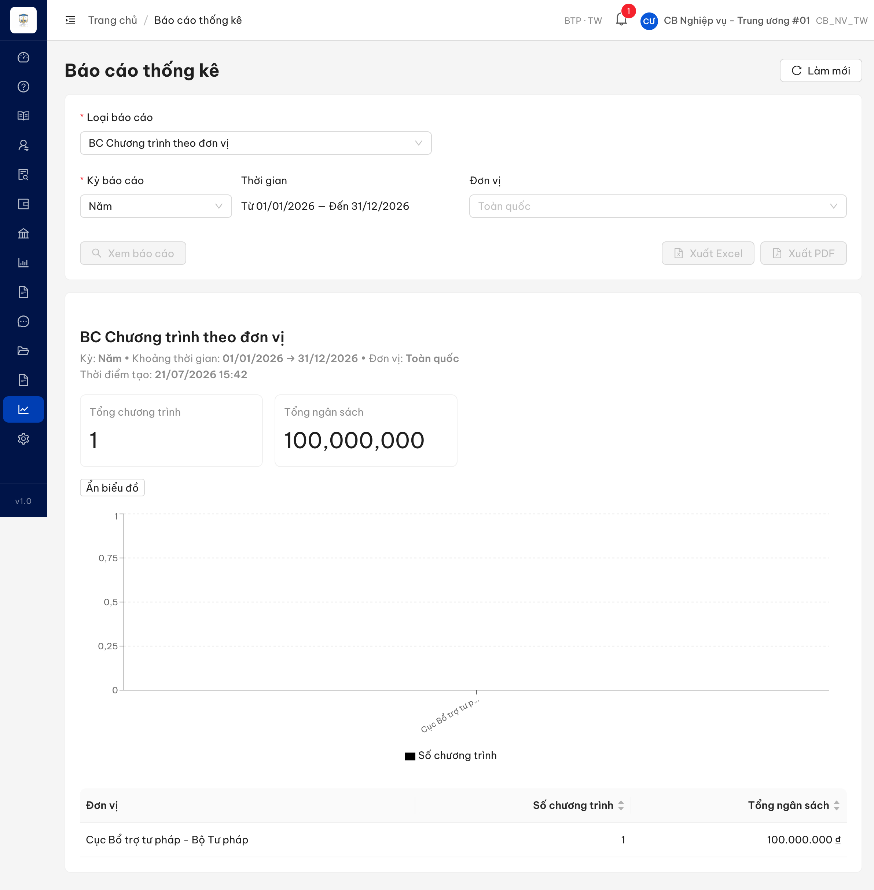

# Bug Report — Báo cáo Thống kê (BCTK Batch 4 — DISPLAY họ Chương trình HTPLDN)

| Thông tin | Giá trị |
|-----------|---------|
| **Dự án** | PM Hỗ trợ pháp lý doanh nghiệp (HTPLDN) |
| **Môi trường** | https://18.143.165.120.nip.io |
| **Người test** | QA (Chrome DevTools MCP) |
| **Ngày** | 2026-07-23 07:47:55 |
| **Loại test** | UAT verify (vòng 1) — Functional / Display |
| **Round** | Reverify tuần 3 — batch BCTK-4 |
| **Tài liệu tham chiếu** | `Docs-PM-HTPLDN/.../srs-v3.5/srs-fr-11-bao-cao.md` (FR-IX-21 / SCR-IX-01) |

---

## Tổng hợp

Phát hiện **1** lỗi có SRS reference cụ thể trong quá trình verify batch 4 (4 case: CTTDVQL_02, CTTDVQL_03, CTTLV_03, CTTLV_04).

- CTTDVQL_03 → **Closed** (bug này) — re-test 2026-07-23 R1 ✅ PASS: cột "Cấp đơn vị" đã hiển thị.
- CTTDVQL_02, CTTLV_03 → BA confirm (xem `../../ba-confirm/bctk/ba-confirmation-needed-bctk-batch4.md`).
- CTTLV_04 → Reject (xem `reverify-audit/CTTLV_04/` + `cond/CTTLV_04.md`).

### Severity breakdown

| Tổng | Critical | Major | Medium | Minor | Trivial | Closed | Open |
|------|----------|-------|--------|-------|---------|--------|------|
| 1    | 0        | 0     | 1      | 0     | 0       | 1      | 0    |

## Bug Summary Table

| Bug ID | Severity | Priority | Type | TC Ref | **SRS Reference** | Title | Status |
|--------|----------|----------|------|--------|-------------------|-------|--------|
| BUG-CTTDVQL_03 | Medium | P2 | UI/UX | CTTDVQL_03 (row 267) | `FR-IX-21 §Output đặc thù` (srs-fr-11-bao-cao.md:943) | Bảng "BC Chương trình theo đơn vị" thiếu cột "Cấp đơn vị" dù SRS yêu cầu và BE đã trả capDonVi | Closed |

---

## ~~BUG-CTTDVQL_03~~ [CLOSED] — Bảng "BC Chương trình theo đơn vị" thiếu cột "Cấp đơn vị"

> **Re-test:** 2026-07-23 07:47:55 R1 — ✅ PASS (Closed-verified). Bảng "BC Chương trình theo đơn vị" nay có cột **"Cấp đơn vị"** hiển thị đúng giá trị **TW** bên cạnh Đơn vị · Số chương trình · Tổng ngân sách. Verify `cbnv_tw_02`, kỳ Năm 2026, Toàn quốc (4 CT / 300.000.000 ₫). [ảnh](image/BUG-CTTDVQL_03-reverify-pass-capdonvi.png)

### Mô tả

Trên báo cáo **BC Chương trình theo đơn vị** (FR-IX-21 / UC144, màn SCR-IX-01), bảng dữ liệu tổng hợp chỉ hiển thị 3 cột: **Đơn vị · Số chương trình · Tổng ngân sách**. **Thiếu cột "Cấp đơn vị" (TW/BN/ĐP)** mà §Output đặc thù của FR-IX-21 (srs-fr-11-bao-cao.md:943) liệt kê là trường bắt buộc `cap_don_vi`. Đáng chú ý: back-end đã trả trường `capDonVi` ("TW") trong response API, nhưng giao diện không render trường này thành cột → lỗi phía FE (thiếu cột).

### Các bước tái hiện

1. Đăng nhập role **CB Nghiệp vụ - Trung ương** (`cbnv_tw_01` / `Test@1234`) — quyền xem báo cáo thống kê phạm vi Toàn quốc theo SCR-IX-01 (item 5, phân quyền 2-tier: TW = Toàn quốc).
2. (Tiền đề) Đã seed ≥1 chương trình HTPLDN đã duyệt có đơn vị + ngân sách (báo cáo chỉ đếm chương trình ở trạng thái ≥ Đã duyệt).
3. Vào menu **Báo cáo thống kê** → chọn loại **BC Chương trình theo đơn vị** → Kỳ **Năm** (01/01/2026 – 31/12/2026) → Đơn vị **Toàn quốc** → nhấn **Xem báo cáo**.
4. Quan sát bảng dữ liệu tổng hợp phía dưới biểu đồ: chỉ có 3 cột **Đơn vị · Số chương trình · Tổng ngân sách**, không có cột "Cấp đơn vị".

### Kết quả mong đợi

- Theo §Output đặc thù của FR-IX-21 (srs-fr-11-bao-cao.md:943), bảng phải có cột **`cap_don_vi` = "Cấp đơn vị"** (giá trị TW / BN / ĐP) bên cạnh Đơn vị, Số CT, Tổng ngân sách.

### Kết quả thực tế

- Bảng chỉ có 3 cột: **Đơn vị · Số chương trình · Tổng ngân sách**. Cột "Cấp đơn vị" bị thiếu.
- API back-end `GET /api/v1/bao-cao/ct-theo-don-vi` ĐÃ trả trường `capDonVi` cho từng đơn vị, nhưng FE không dựng thành cột:

```json
{"success":true,"data":{"tenBaoCao":"BC Chương trình HTPLDN theo đơn vị","tongCt":1,"tongNganSach":100000000,
 "data":[{"donViId":"00000000-0000-4000-8000-000000000001","tenDonVi":"Cục Bổ trợ tư pháp - Bộ Tư pháp",
 "capDonVi":"TW","soCt":1,"tongNganSach":100000000}],"chartType":"BAR_CROSS_TAB"}}
```

### Bằng chứng



**API response** (trường `capDonVi` có ở BE nhưng FE không render cột):

```json
{"donViId":"00000000-0000-4000-8000-000000000001","tenDonVi":"Cục Bổ trợ tư pháp - Bộ Tư pháp","capDonVi":"TW","soCt":1,"tongNganSach":100000000}
```

---

## Phụ lục — Môi trường test

| Thành phần | Giá trị |
|------------|---------|
| URL ứng dụng | https://18.143.165.120.nip.io |
| OTP login | MailHog `http://18.143.165.120:8025` |
| API base | https://18.143.165.120.nip.io/api/v1 |
| Frontend | React + Ant Design |
| Xác thực | JWT + OTP (email) |
| Tool test | Chrome DevTools MCP |
| Tài khoản verdict | `cbnv_tw_01` (CB Nghiệp vụ - Trung ương) |

---

*Bug report generated: 2026-07-21 15:50:00 | QA via Claude Code*
