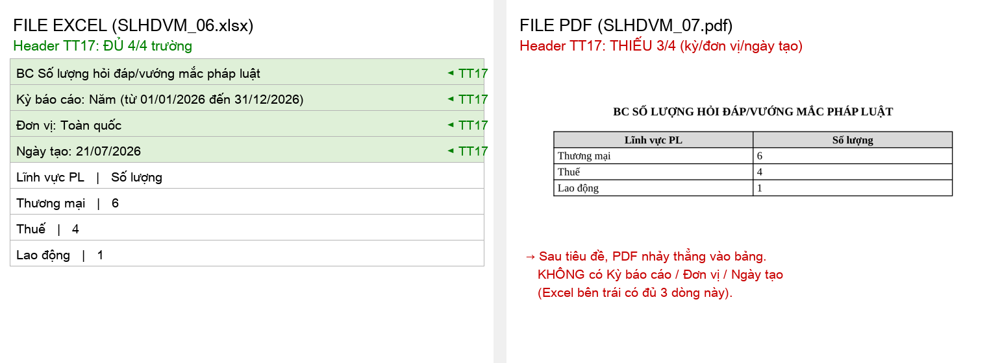
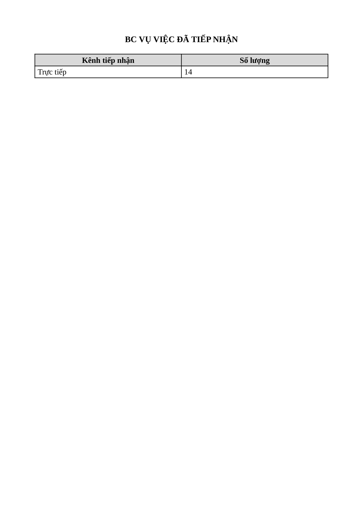
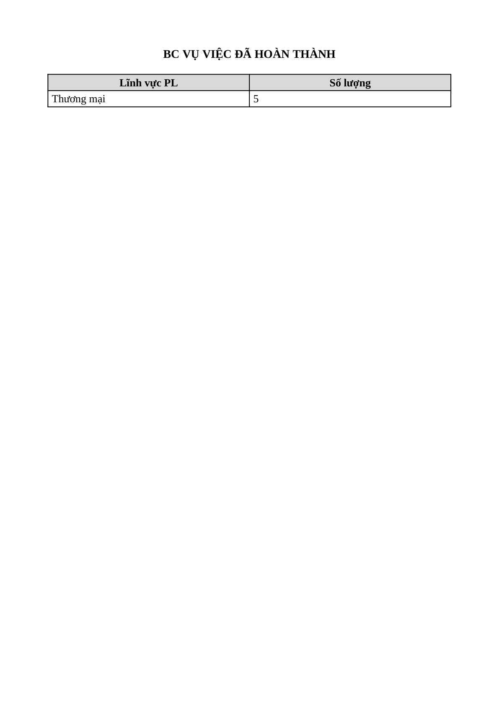
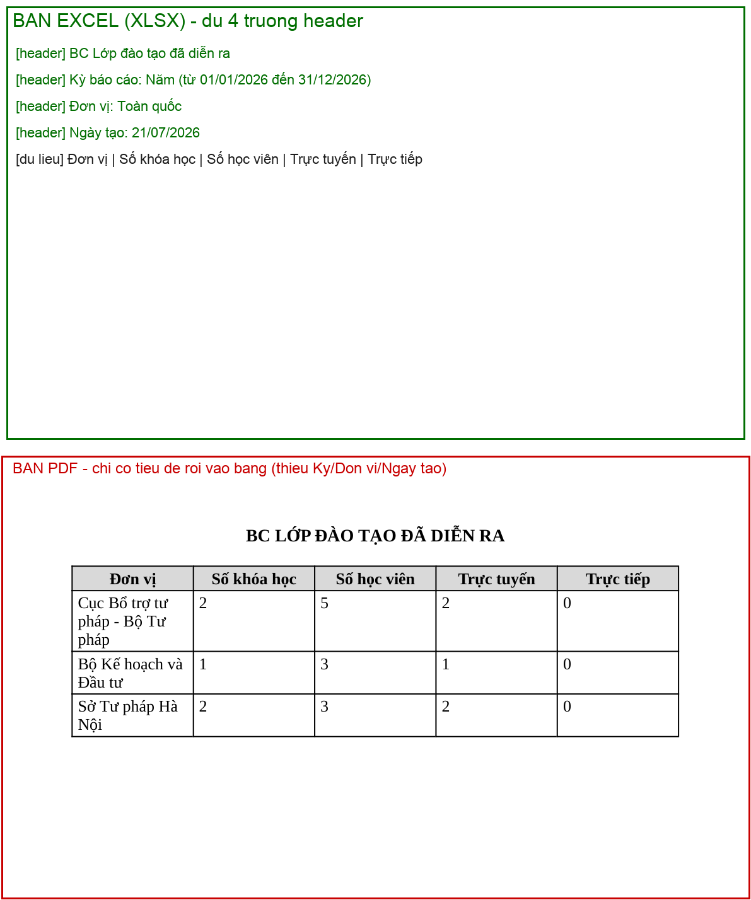
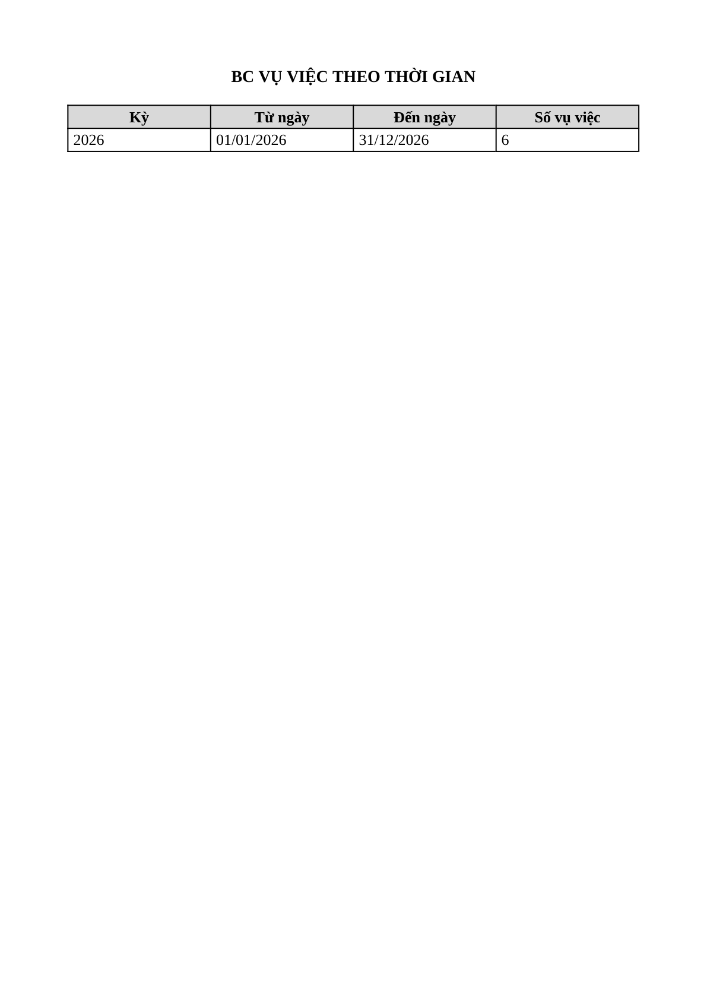
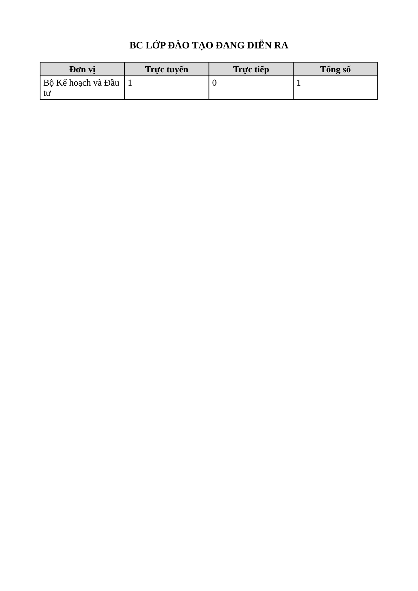
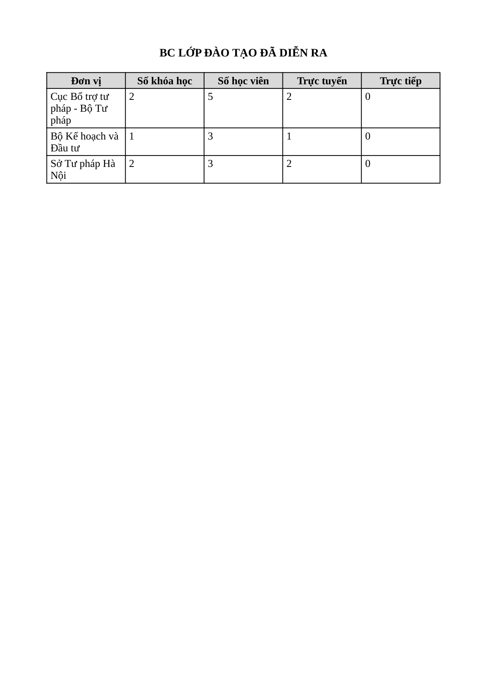
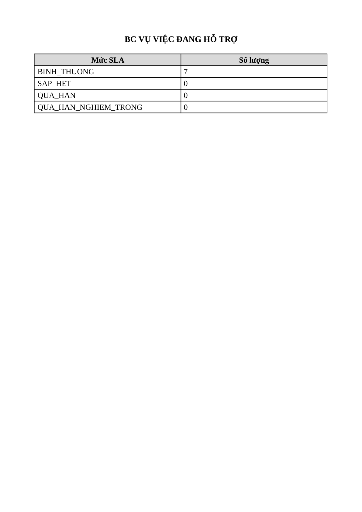

# Bug Report — Báo cáo Thống kê (BCTK Batch 7 — EXPORT nội dung file Excel/PDF)

| Thông tin | Giá trị |
|-----------|---------|
| **Dự án** | PM Hỗ trợ pháp lý doanh nghiệp (HTPLDN) |
| **Môi trường** | https://18.143.165.120.nip.io |
| **Người test** | QA (Chrome DevTools MCP + đọc nội dung file: openpyxl / PyMuPDF / render ảnh) |
| **Ngày** | 2026-07-23 10:12:00 |
| **Loại test** | UAT verify (vòng 1) — Functional / Export content |
| **Round** | Reverify tuần 3 — batch BCTK-7 (EXPORT) |
| **Tài liệu tham chiếu** | `input/srs-update-2026-5-5/srs-fr-11-bao-cao.md` (FR-IX §Quy tắc tương tác dòng 1088; BR-SLA-02 dòng 1282; FR-IX-03 Dimensions dòng 249) |

---

## Tổng hợp

> **Re-verify tuần 3 (2026-07-23, cbnv_tw_01):** dev báo đã fix → chạy lại đủ luồng Xuất PDF/Excel. **Cả 2 bug ĐÓNG (2/2 Closed, 0 Open).** BUG-EXPORT-PDF-HEADER: 7/7 loại báo cáo giờ có đủ 3/3 header (Kỳ/Đơn vị/Ngày tạo). BUG-EXPORT-SLA-ENUM: cột Mức SLA in nhãn tiếng Việt cả PDF lẫn Excel. Sheet: 7 dòng PDF (192/197/204/210/217/223/228) = Pass.

Batch 7 verify cụm "Xuất Excel/PDF" (8 case, họ Vụ việc nhóm 1). Lỗi đối tác báo — ERR-RPT-04 *"Không thể tạo file xuất. Vui lòng thử lại."* — **KHÔNG tái hiện**: cả 8 thao tác xuất đều trả HTTP 200 + file thật tải về. Tuy nhiên khi **kiểm tra nội dung file thực xuất ra** (không chỉ xác nhận file được tạo), phát hiện **2 lỗi** có SRS reference cụ thể:

- **Bản Excel (4 file _06):** đúng — header TT17 đủ 4/4 trường + số liệu khớp màn hình 100%.
- **Bản PDF (4 file _07):** thiếu 3/4 trường header bắt buộc → **BUG-EXPORT-PDF-HEADER** (Open, Major).
- **Báo cáo VVDHT (cả Excel + PDF):** cột Mức SLA in enum thô `BINH_THUONG` thay vì nhãn tiếng Việt → **BUG-EXPORT-SLA-ENUM** (Open, Minor).

> **Verdict sheet đối tác:** 4 case Excel = Reject (nội dung đúng). 4 case PDF (SLHDVM_07, VVDTN_07, VVDHT_07, VVDHTHT_07) = **Open** vì file PDF tạo ra sai chuẩn (thiếu header) — lỗi khác lỗi đối tác báo.

> **Mở rộng batch-8 (cập nhật 21/07/2026, account `cbnv_tw_05`):** verify tiếp cụm Xuất Excel/PDF họ **Vụ việc theo thời gian + Lớp đào tạo** (6 case: VVTTG_05/06, CLDTBDDDR_06/07, LDTBDDDR_06/07). Kết quả **đồng nhất batch 7**: 3 file Excel (_05/_06) đủ 4/4 header + số liệu đúng → **Reject**; 3 file PDF (VVTTG_06 row 217, CLDTBDDDR_07 row 223, LDTBDDDR_07 row 228) **thiếu 3/4 header (Kỳ/Đơn vị/Ngày tạo)** y hệt → **Open**, tái hiện cùng **BUG-EXPORT-PDF-HEADER**. Tổng cộng lỗi header PDF đã tái hiện trên **7 loại báo cáo khác nhau** → xác nhận là **lỗi template PDF dùng chung toàn module Báo cáo thống kê**, không phải lỗi cục bộ 1 báo cáo. (BUG-EXPORT-SLA-ENUM không áp dụng cho họ này — các báo cáo VVTTG/Lớp đào tạo không có cột Mức SLA.)

> **Ghi chú nguồn SRS:** verify local SRS v3.5 (mở file, quote nguyên văn dòng). Nguồn 2 (NotebookLM HTPLDN) không query được do chưa auth (`nlm login`) tại thời điểm test — dòng 1088 & BR-SLA-02 rõ ràng, không mơ hồ nên đủ cơ sở log.

### Severity breakdown

| Tổng | Critical | Major | Medium | Minor | Trivial | Closed | Open |
|------|----------|-------|--------|-------|---------|--------|------|
| 2    | 0        | 1     | 0      | 1     | 0       | 2      | 0    |

## Bug Summary Table

| Bug ID | Severity | Priority | Type | TC Ref | **SRS Reference** | Title | Status |
|--------|----------|----------|------|--------|-------------------|-------|--------|
| ~~BUG-EXPORT-PDF-HEADER~~ | Major | P1 | UI/UX | **Batch7:** SLHDVM_07 (row 192), VVDTN_07 (197), VVDHT_07 (204), VVDHTHT_07 (210) · **Batch8:** VVTTG_06 (217), CLDTBDDDR_07 (223), LDTBDDDR_07 (228) — 7 loại BC | `srs-fr-11-bao-cao.md:1088` (§Quy tắc tương tác) | File PDF xuất ra thiếu header bắt buộc (Kỳ báo cáo / Đơn vị / Ngày tạo) — bản Excel có đủ | Closed |
| ~~BUG-EXPORT-SLA-ENUM~~ | Minor | P3 | UI/UX | VVDHT_06 (row 203), VVDHT_07 (row 204) | `srs-fr-11-bao-cao.md:249` §Dimensions + `BR-SLA-02:1282` | Cột Mức SLA trong file xuất in mã enum thô (BINH_THUONG…) thay vì nhãn tiếng Việt (Bình thường…) | Closed |

---

## ~~BUG-EXPORT-PDF-HEADER~~ [CLOSED] — File PDF xuất ra thiếu header bắt buộc (Kỳ báo cáo / Đơn vị / Ngày tạo)

> **Re-test:** 2026-07-23 10:12:00 R1 — ✅ PASS (Closed-verified, cbnv_tw_01). Chạy lại đủ luồng Xuất PDF (A4, Dọc) trên **cả 7 loại báo cáo** (SLHDVM_07, VVDTN_07, VVDHT_07, VVDHTHT_07, VVTTG_06, CLDTBDDDR_07, LDTBDDDR_07), kỳ Năm 2026 / Toàn quốc. File PDF nào cũng có đủ **3/3 header** ngay dưới tiêu đề: `Kỳ báo cáo: Năm (từ 01/01/2026 đến 31/12/2026)` · `Đơn vị: Toàn quốc` · `Ngày tạo: 23/07/2026`, rồi mới tới bảng số liệu — đọc file render qua Chrome PDF viewer (7 ảnh `retest-*-pdf-header-ok.png`).

### Mô tả

Khi xuất báo cáo thống kê ra **PDF**, file tạo ra chỉ có **tiêu đề báo cáo** rồi nhảy thẳng vào bảng số liệu. Thiếu **3/4 trường header bắt buộc** mà SRS yêu cầu: **thông tin kỳ báo cáo, đơn vị, ngày tạo**. Cùng dữ liệu đó, bản **Excel (XLSX) xuất ra ĐỦ cả 4 trường** — chứng minh back-end có sẵn dữ liệu header và đây là lỗi riêng của luồng dựng file PDF (FE/BE template PDF bỏ khối header). Lỗi lặp lại đồng nhất ở cả 4 loại báo cáo được test (Số lượng hỏi đáp, VV đã tiếp nhận, VV đang hỗ trợ, VV đã hoàn thành) → nhiều khả năng là lỗi hệ thống của template PDF dùng chung cho toàn module báo cáo.

### Các bước tái hiện

1. Đăng nhập role **CB Nghiệp vụ - Trung ương** (`cbnv_tw_04` / `Test@1234`) — quyền xem báo cáo thống kê phạm vi Toàn quốc theo SCR-IX-01.
2. Vào **Báo cáo thống kê** → chọn loại **BC Số lượng hỏi đáp/vướng mắc pháp luật** → Kỳ **Năm** (01/01/2026 – 31/12/2026) → Đơn vị **Toàn quốc** → **Xem báo cáo** (báo cáo có data: Tổng 11).
3. Bấm **Xuất PDF** → hộp thoại "Tùy chọn in báo cáo PDF" (A4, Dọc) → **Xuất file** → `POST /api/v1/bao-cao/export` trả **200**, tải về `bao-cao-hoi-dap-2026-07-21.pdf`.
4. Mở file PDF: chỉ có tiêu đề "BC SỐ LƯỢNG HỎI ĐÁP/VƯỚNG MẮC PHÁP LUẬT" + bảng Lĩnh vực PL. **Không có** dòng Kỳ báo cáo / Đơn vị / Ngày tạo.
5. So sánh: xuất cùng báo cáo ra **Excel** (`Xuất Excel`) → file XLSX có đủ 4 dòng header: tiêu đề + `Kỳ báo cáo: Năm (từ 01/01/2026 đến 31/12/2026)` + `Đơn vị: Toàn quốc` + `Ngày tạo: 21/07/2026`.

### Kết quả mong đợi

- Theo SRS v3.5 `srs-fr-11-bao-cao.md:1088` (§Quy tắc tương tác): *"Export XLSX/PDF chèn tiêu đề BC + thông tin kỳ + đơn vị + ngày tạo vào header file"* — quy tắc áp dụng cho **cả XLSX lẫn PDF**.
- File PDF xuất ra phải có ở phần đầu: tiêu đề báo cáo + kỳ báo cáo + đơn vị + ngày tạo (như bản Excel).

### Kết quả thực tế

- File PDF chỉ có tiêu đề báo cáo + bảng số liệu; **thiếu 3 trường**: Kỳ báo cáo, Đơn vị, Ngày tạo.
- Trích text thực từ file PDF (`bao-cao-hoi-dap-2026-07-21.pdf`, PyMuPDF): `BC SỐ LƯỢNG HỎI ĐÁP/VƯỚNG MẮC PHÁP LUẬT` → `Lĩnh vực PL` → `Số lượng` → `Thương mại 6` → `Thuế 4` → `Lao động 1`. Không có chuỗi "Kỳ báo cáo" / "Đơn vị" / "Ngày tạo".
- Bản Excel cùng báo cáo (đối chứng) có đủ: `BC Số lượng hỏi đáp/vướng mắc pháp luật` · `Kỳ báo cáo: Năm (từ 01/01/2026 đến 31/12/2026)` · `Đơn vị: Toàn quốc` · `Ngày tạo: 21/07/2026`.
- Tái hiện đồng nhất ở **7 báo cáo**: (batch7) SLHDVM_07, VVDTN_07, VVDHT_07, VVDHTHT_07 + (batch8) VVTTG_06, CLDTBDDDR_07, LDTBDDDR_07 — PDF nào cũng thiếu 3 dòng header.
- **Batch8 (account `cbnv_tw_05`, PyMuPDF text+toạ độ+page size+font):** cả 3 file PDF đều A4 (210×297mm) + font Tinos (Times New Roman-tương thích) cỡ 13 (2/2 yêu cầu SRS nêu cụ thể đạt), số liệu đúng; nhưng dòng đầu chỉ có tiêu đề rồi vào thẳng bảng — không có Kỳ báo cáo / Đơn vị / Ngày tạo (bản Excel cùng báo cáo đủ 4 trường).

### Bằng chứng








**Batch8 — Vụ việc theo thời gian + Lớp đào tạo:**









**Request/response** (giống nhau cho mọi loại báo cáo, chỉ khác `loaiBaoCao`):

```json
// Request (vd batch7 BC_HOI_DAP)
{"loaiBaoCao":"BC_HOI_DAP","kyBaoCao":"NAM","tuNgay":"2026-01-01","denNgay":"2026-12-31","filterDacThu":{},"formatXuat":"PDF","khoGiay":"A4","huongGiay":"portrait"}
// Response: 200, content-type: application/pdf, content-disposition: attachment; filename="bao-cao-hoi-dap-2026-07-21.pdf"
// → file PDF tạo được nhưng nội dung thiếu khối header
// Batch8: loaiBaoCao ∈ {BC_VU_VIEC_THEO_THOI_GIAN, BC_LOP_DAO_TAO_DANG_DIEN_RA, BC_LOP_DAO_TAO_DA_DIEN_RA} → 200 + PDF, cùng thiếu header
```

---

## ~~BUG-EXPORT-SLA-ENUM~~ [CLOSED] — Cột Mức SLA trong file xuất in mã enum thô thay vì nhãn tiếng Việt

> **Re-test:** 2026-07-23 09:57:47 R1 — ✅ PASS (Closed-verified, cbnv_tw_01). Xuất lại **BC Vụ việc đang hỗ trợ** kỳ Năm 2026 / Toàn quốc qua UI: cột Mức SLA trong **cả PDF lẫn Excel** đã hiển thị nhãn tiếng Việt `Bình thường / Sắp hết hạn / Quá hạn / Quá hạn nghiêm trọng` (số đếm 3/3/0/0) — không còn mã enum thô. Excel đọc bằng openpyxl xác nhận `<v>Bình thường</v>…`; PDF đọc qua Chrome viewer + PyMuPDF khớp.

### Mô tả

Trên báo cáo **BC Vụ việc đang hỗ trợ** (FR-IX-03 / UC126), file xuất ra (cả **Excel** lẫn **PDF**) in cột Mức SLA bằng **mã enum thô**: `BINH_THUONG`, `SAP_HET`, `QUA_HAN`, `QUA_HAN_NGHIEM_TRONG`. Trong khi **màn hình web đã hiển thị đúng nhãn tiếng Việt** ("Bình thường", …) và SRS định nghĩa tên hiển thị tiếng Việt cho 4 mức SLA. App đã có sẵn mapping enum→nhãn (dùng ở UI) nhưng luồng xuất file không áp dụng → người đọc file nhận mã kỹ thuật thay vì nhãn nghiệp vụ.

### Các bước tái hiện

1. Đăng nhập role **CB Nghiệp vụ - Trung ương** (`cbnv_tw_04` / `Test@1234`).
2. **Báo cáo thống kê** → **BC Vụ việc đang hỗ trợ** → Kỳ **Năm** → Đơn vị **Toàn quốc** → **Xem báo cáo** (Tổng 7; web hiển thị "SLA Bình thường 7").
3. **Xuất Excel** (và **Xuất PDF**) → mở file: cột Mức SLA hiện `BINH_THUONG / SAP_HET / QUA_HAN / QUA_HAN_NGHIEM_TRONG`.

### Kết quả mong đợi

- Theo SRS `srs-fr-11-bao-cao.md:249` (Dimensions BC Vụ việc đang hỗ trợ liệt kê SLA là *"bình thường / sắp hết hạn / quá hạn / quá hạn nghiêm trọng"*) và **BR-SLA-02** (`:1282`: *"4 mức: Bình thường, Sắp hết hạn, Quá hạn, Quá hạn nghiêm trọng"*), cột Mức SLA phải hiển thị nhãn tiếng Việt, đồng nhất với màn hình web.

### Kết quả thực tế

- File xuất in mã enum thô: `BINH_THUONG / SAP_HET / QUA_HAN / QUA_HAN_NGHIEM_TRONG` (giá trị số đếm đúng: 7/0/0/0).
- Không đồng nhất với web (web hiển thị "Bình thường").

### Bằng chứng



---

## Phụ lục — Môi trường test

| Thành phần | Giá trị |
|------------|---------|
| URL ứng dụng | https://18.143.165.120.nip.io |
| OTP login | MailHog `http://18.143.165.120:8025` |
| API base | https://18.143.165.120.nip.io/api/v1 |
| Frontend | React + Ant Design |
| Xác thực | JWT + OTP (email) |
| Tool test | Chrome DevTools MCP; đọc file: openpyxl 3.1.5 / PyMuPDF 1.26.5 (render + text-extract) |
| Tài khoản verdict | `cbnv_tw_04` (CB Nghiệp vụ - Trung ương, phạm vi Toàn quốc) |
| File gốc đã dump | `reverify-audit/_export-check/*.xlsx` · `*.pdf` (8 file, từ response body của `POST /bao-cao/export`) |

---

*Bug report generated: 2026-07-21 16:10:00 | QA via Claude Code*
