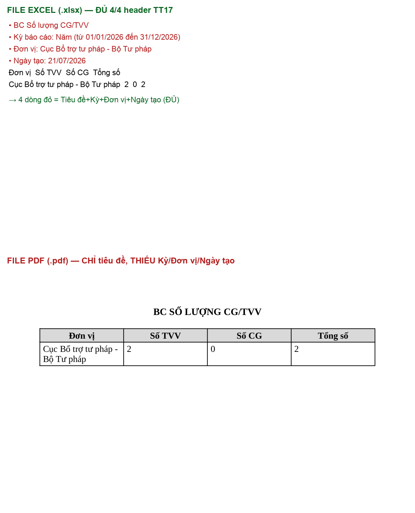
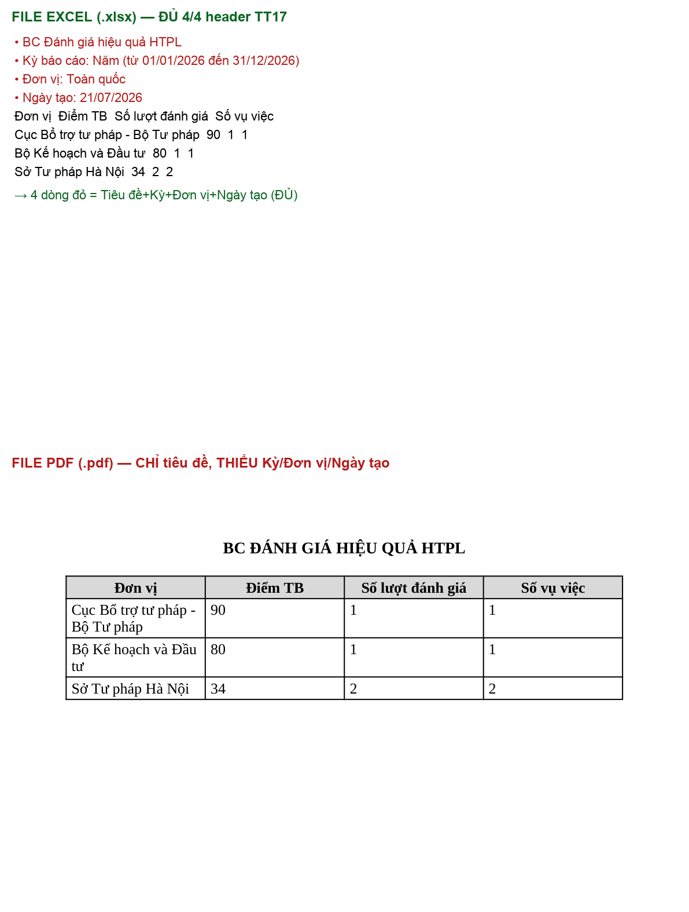
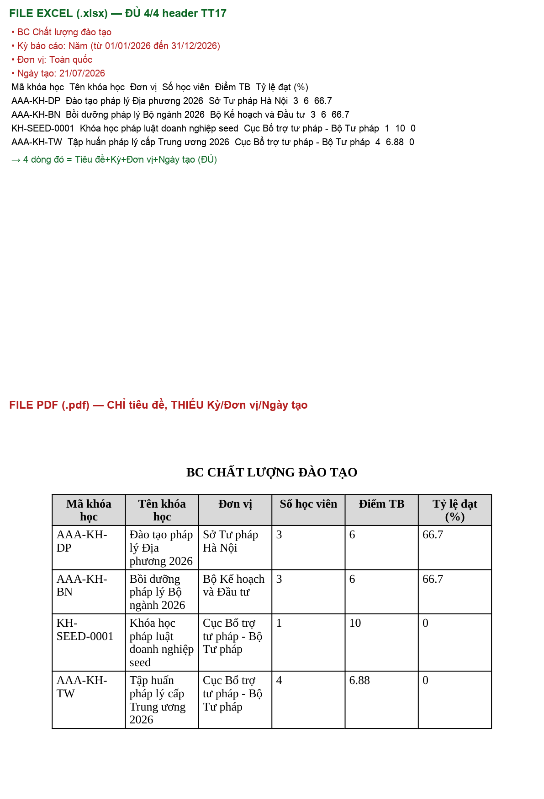
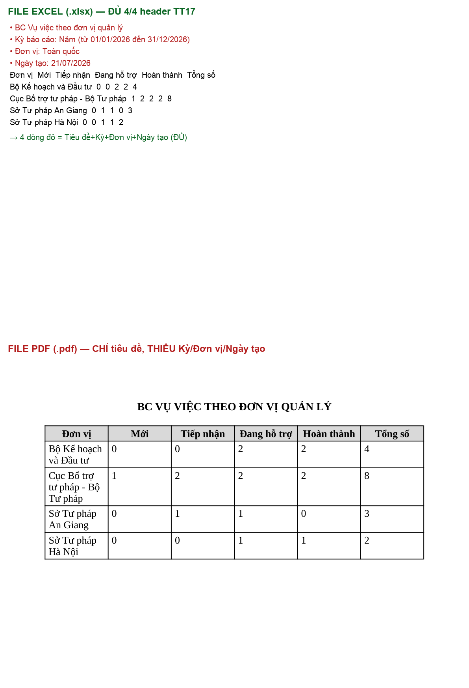
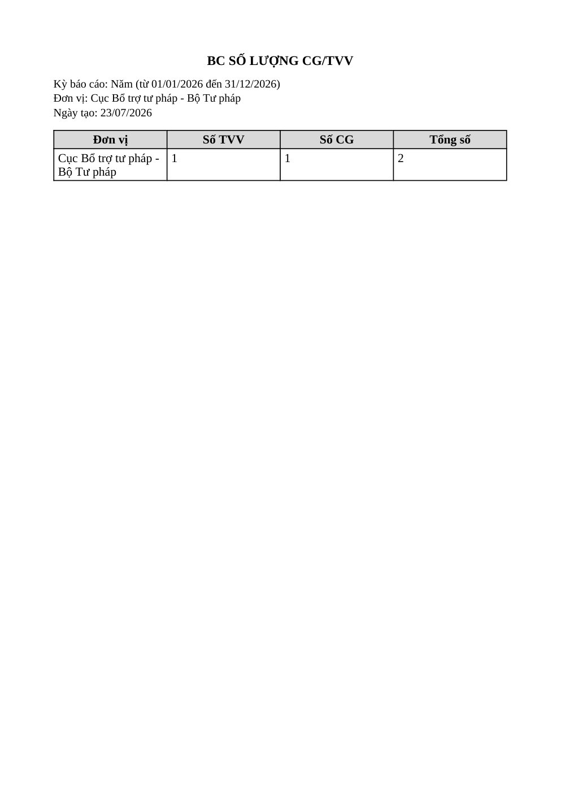
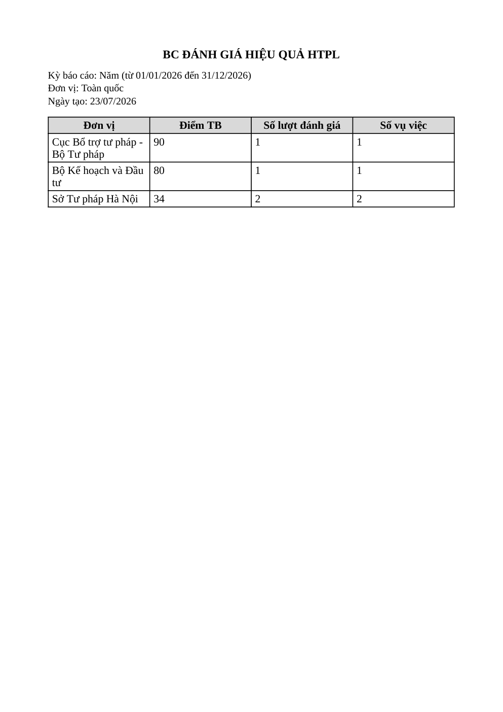
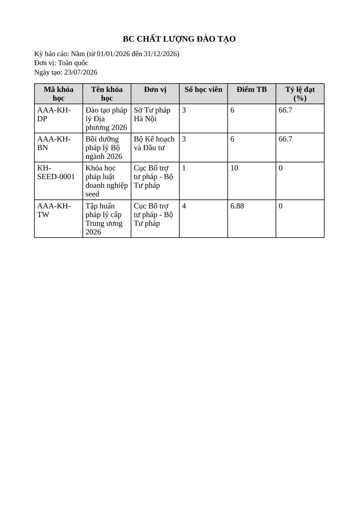
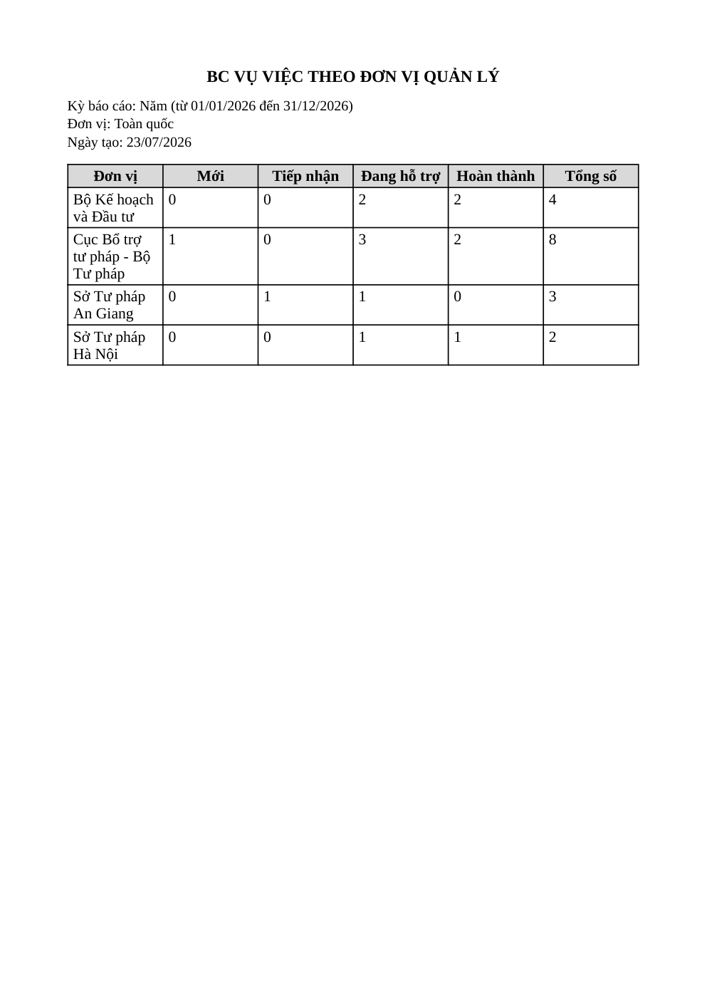

# Bug Report — Báo cáo Thống kê (BCTK Batch 9 — EXPORT CG/TVV + Đánh giá + Chất lượng ĐT + VV theo ĐVQL)

| Thông tin | Giá trị |
|-----------|---------|
| **Dự án** | PM Hỗ trợ pháp lý doanh nghiệp (HTPLDN) |
| **Môi trường** | https://18.143.165.120.nip.io |
| **Người test** | QA (Chrome DevTools MCP + đọc nội dung file: openpyxl 3.1.5 / PyMuPDF 1.26.5) |
| **Ngày** | 2026-07-23 09:33:00 |
| **Loại test** | UAT re-verify (sau dev fix) — Functional / Export content |
| **Round** | Reverify tuần 3 — batch BCTK-9 (EXPORT) |
| **Tài liệu tham chiếu** | `input/srs-update-2026-5-5/srs-fr-11-bao-cao.md` (§Quy tắc tương tác dòng 1088; SCR-IX-01 item 8/9 dòng 1048–1049; E6 ERR-RPT-04 dòng 116) |

---

## Tổng hợp

> **Re-verify 2026-07-23 (reverify tuần 3, sau dev fix):** ✅ **PASS — bug đã ĐÓNG.** Chạy lại đủ luồng Xuất PDF cho cả 4 loại BC qua UI (login `cbnv_tw_02` → chọn loại BC + Kỳ Năm 2026 + Đơn vị → Xem báo cáo → Xuất PDF → mở đọc file PDF thực bằng PyMuPDF). Cả 4 file PDF nay có **đủ 4/4 trường header** (tiêu đề + Kỳ báo cáo + Đơn vị + Ngày tạo) — khối header đã được bổ sung vào template PDF. Breakdown: **Open 0 / Closed 1**.

Batch 9 verify cụm "Xuất Excel/PDF" cho 4 loại báo cáo (8 case): BC Số lượng CG/TVV (FR-IX-08), BC Đánh giá hiệu quả HTPL (FR-IX-09), BC Chất lượng đào tạo (FR-IX-10), BC Vụ việc theo đơn vị quản lý (FR-IX-11). Lỗi đối tác báo — ERR-RPT-04 *"Không thể tạo file xuất. Vui lòng thử lại."* — **KHÔNG tái hiện**: mọi thao tác Xuất Excel/PDF đều trả HTTP 200 + toast "Tạo file thành công" + file thật tải về.

Khi **kiểm tra nội dung file thực xuất ra** (không chỉ xác nhận file tạo được):
- **Bản Excel (4 file _06):** đúng — header TT17 đủ 4/4 trường (tiêu đề + kỳ + đơn vị + ngày tạo) + số liệu khớp màn hình → **Reject** từng case.
- **Bản PDF (4 file _07):** vòng 1 thiếu 3/4 trường header bắt buộc (Kỳ báo cáo / Đơn vị / Ngày tạo) → **BUG-EXPORT-PDF-HEADER**. Re-verify 2026-07-23 sau dev fix: **đủ 4/4 header → Closed.**

> **Verdict sheet đối tác:** 4 case Excel (CGTVPL_06, DGHQHTPL_06, CLDTBDPL_06, VVTDVQL_06) = **Reject** (nội dung đúng). 4 case PDF (CGTVPL_07, DGHQHTPL_07, CLDTBDPL_07, VVTDVQL_07) = **Verify Pass** (dev đã bổ sung header PDF).

### Severity breakdown

| Tổng | Critical | Major | Medium | Minor | Trivial | Closed | Open |
|------|----------|-------|--------|-------|---------|--------|------|
| 1    | 0        | 1     | 0      | 0     | 0       | 1      | 0    |

## Bug Summary Table

| Bug ID | Severity | Priority | Type | TC Ref | **SRS Reference** | Title | Status |
|--------|----------|----------|------|--------|-------------------|-------|--------|
| BUG-EXPORT-PDF-HEADER (batch9) | Major | P1 | UI/UX | CGTVPL_07 (r231), DGHQHTPL_07 (r234), CLDTBDPL_07 (r238), VVTDVQL_07 (r240) | `srs-fr-11-bao-cao.md:1088` (§Quy tắc tương tác) | File PDF xuất ra thiếu header bắt buộc (Kỳ báo cáo / Đơn vị / Ngày tạo) — bản Excel có đủ | Closed |

---

## ~~BUG-EXPORT-PDF-HEADER~~ [CLOSED] — File PDF xuất ra thiếu header bắt buộc (Kỳ báo cáo / Đơn vị / Ngày tạo)

> **Re-test:** 2026-07-23 09:33:00 (reverify tuần 3) — ✅ PASS (Closed-verified). Chạy lại đủ luồng Xuất PDF cả 4 loại BC qua UI bằng `cbnv_tw_02`, đọc file PDF thực bằng PyMuPDF: cả 4 file nay có đủ 4/4 trường header (tiêu đề + Kỳ báo cáo + Đơn vị + Ngày tạo). Bằng chứng: 4 ảnh `*-reverify-pass` mục Bằng chứng.

### Mô tả

Khi xuất báo cáo thống kê ra **PDF**, file tạo ra chỉ có **tiêu đề báo cáo** rồi nhảy thẳng vào bảng số liệu, thiếu **3/4 trường header bắt buộc** SRS yêu cầu: thông tin **kỳ báo cáo, đơn vị, ngày tạo**. Cùng dữ liệu đó, bản **Excel (XLSX) xuất ra ĐỦ cả 4 trường** — chứng minh back-end có sẵn dữ liệu header, đây là lỗi riêng của luồng dựng file PDF (template PDF bỏ khối header). Lỗi lặp đồng nhất ở cả 4 loại báo cáo batch 9 (CG/TVV, Đánh giá hiệu quả HTPL, Chất lượng đào tạo, VV theo đơn vị quản lý), cộng 7 loại đã phát hiện batch 7/8 → lỗi hệ thống của template PDF dùng chung cho toàn module.

### Các bước tái hiện

1. Đăng nhập role **CB Nghiệp vụ - Trung ương** (`cbnv_tw` / `Test@1234`) — quyền xem báo cáo phạm vi Toàn quốc (SCR-IX-01).
2. Vào **Báo cáo thống kê** → chọn 1 trong 4 loại BC (vd **BC Số lượng CG/TVV**) → Kỳ **Năm** (01/01/2026 – 31/12/2026) → Đơn vị (vd **Cục Bổ trợ tư pháp**) → bộ lọc đặc thù nếu có → **Xem báo cáo** (báo cáo có data).
3. Bấm **Xuất PDF** → hộp thoại "Tùy chọn in báo cáo PDF" (A4, Dọc) → **Xuất file** → `POST /api/v1/bao-cao/export` trả **200** + toast "Tạo file thành công", tải về file `.pdf`.
4. Mở file PDF: chỉ có tiêu đề báo cáo + bảng số liệu. **Không có** dòng Kỳ báo cáo / Đơn vị / Ngày tạo.
5. So sánh: xuất cùng báo cáo ra **Excel** → file XLSX có đủ 4 dòng header (tiêu đề + `Kỳ báo cáo: ...` + `Đơn vị: ...` + `Ngày tạo: ...`).

### Kết quả mong đợi

- Theo SRS v3.5 `srs-fr-11-bao-cao.md:1088` (§Quy tắc tương tác): *"Export XLSX/PDF chèn tiêu đề BC + thông tin kỳ + đơn vị + ngày tạo vào header file"* — quy tắc áp dụng cho **cả XLSX lẫn PDF**.
- File PDF xuất ra phải có ở phần đầu: tiêu đề báo cáo + kỳ báo cáo + đơn vị + ngày tạo (như bản Excel).

### Kết quả thực tế

File PDF chỉ có tiêu đề + bảng số liệu; **thiếu 3 trường** header: Kỳ báo cáo, Đơn vị, Ngày tạo. Kiểm chứng bằng đọc nội dung file thực (PyMuPDF cho PDF, openpyxl cho Excel) — grep 3 chuỗi "Kỳ báo cáo" / "Đơn vị:" / "Ngày tạo" trong PDF đều **MISSING**, trong khi Excel cùng báo cáo có đủ 4/4:

| Loại BC | Case PDF | Excel (4/4 header) | PDF (grep 3 trường) |
|---|---|---|---|
| Số lượng CG/TVV (FR-IX-08) | CGTVPL_07 (r231) | ✅ `Kỳ báo cáo: Năm...` · `Đơn vị: Cục Bổ trợ tư pháp - Bộ Tư pháp` · `Ngày tạo: 21/07/2026` | ❌ cả 3 MISSING (chỉ tiêu đề → thẳng bảng) |
| Đánh giá hiệu quả HTPL (FR-IX-09) | DGHQHTPL_07 (r234) | ✅ `Kỳ báo cáo: Năm...` · `Đơn vị: Toàn quốc` · `Ngày tạo: 21/07/2026` | ❌ cả 3 MISSING |
| Chất lượng đào tạo (FR-IX-10) | CLDTBDPL_07 (r238) | ✅ `Kỳ báo cáo: Năm...` · `Đơn vị: Toàn quốc` · `Ngày tạo: 21/07/2026` | ❌ cả 3 MISSING |
| VV theo đơn vị quản lý (FR-IX-11) | VVTDVQL_07 (r240) | ✅ `Kỳ báo cáo: Năm...` · `Đơn vị: Toàn quốc` · `Ngày tạo: 21/07/2026` | ❌ cả 3 MISSING |

Trong cả 4 trường hợp, số liệu bảng của bản PDF khớp đúng bản Excel và khớp màn hình — chỉ khác duy nhất ở khối header bị bỏ.

### Bằng chứng

**1. BC Số lượng CG/TVV (CGTVPL_07):**



**2. BC Đánh giá hiệu quả HTPL (DGHQHTPL_07):**



**3. BC Chất lượng đào tạo (CLDTBDPL_07):**



**4. BC Vụ việc theo đơn vị quản lý (VVTDVQL_07):**



**Bằng chứng re-test 2026-07-23 (file PDF sau fix — đủ 4/4 header):**









**Request/response** (giống nhau cho mọi loại BC, chỉ khác `loaiBaoCao`):

```json
// Request PDF — chỉ khác nhau ở "loaiBaoCao", cùng trả 200 + file PDF thiếu header:
//   CG/TVV        : "loaiBaoCao":"BC_SO_LUONG_CG_TVV"      (kèm donViId + filterDacThu.linhVucCm)
//   Đánh giá HQ   : "loaiBaoCao":"BC_DANH_GIA_HIEU_QUA"
//   Chất lượng ĐT : "loaiBaoCao":"BC_CHAT_LUONG_DAO_TAO"
//   VV theo ĐVQL  : "loaiBaoCao":"BC_VU_VIEC_THEO_DON_VI"
{"loaiBaoCao":"BC_VU_VIEC_THEO_DON_VI","kyBaoCao":"NAM","tuNgay":"2026-01-01","denNgay":"2026-12-31","formatXuat":"PDF","khoGiay":"A4","huongGiay":"portrait"}
// Response: 200, content-type: application/pdf, filename="bao-cao-vu-viec-theo-don-vi-2026-07-21.pdf"
// → file PDF tạo được (KHÔNG có ERR-RPT-04) nhưng nội dung thiếu khối header
```

---

*Bug report generated: 2026-07-21 | QA via Claude Code — verify đủ 4/4 loại BC batch 9 (CGTVPL, DGHQHTPL, CLDTBDPL, VVTDVQL) bằng đọc nội dung file thực.*
