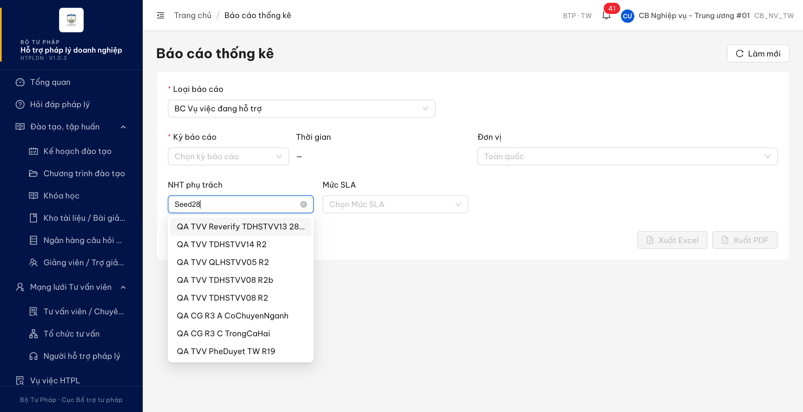

# Bug Report — Báo cáo thống kê: lọc "NHT phụ trách" (BC Vụ việc đang hỗ trợ)

| Thông tin | Giá trị |
|-----------|---------|
| **Dự án** | PM HTPLDN |
| **Môi trường** | https://18.143.165.120.nip.io · MailHog http://18.143.165.120:8025 |
| **Người test** | QA Automation (Claude Code) |
| **Ngày** | 2026-07-30 20:27:39 |
| **Loại test** | Re-verify bug đối tác sau dev fix (case VVDHT_01) |
| **Round** | Re-verify tuần 3 — R11 (2026-07-30 20:27; round trước: R10 cùng ngày) |
| **Tài liệu tham chiếu** | SRS v3.5 bản chuẩn `srs-v3.5/srs-fr-11-bao-cao.md` (FR-IX-03 / UC126, dòng 225–268) · [KET-QUA-reverify-24-case-reopent.md](../../dev-fix-reverify-round-10-2026-07-30/KET-QUA-reverify-24-case-reopent.md) · [Pass-bug-report-bctk-batch13.md](Pass-bug-report-bctk-batch13.md) (bug gốc đã đóng 23/07) |

---

**Nguồn SRS:** mọi trích dẫn dạng `srs-v3.5/<file>:<dòng>` lấy từ `Docs-PM-HTPLDN/_bmad-output/planning-artifacts/srs-v3.5/` (bản chuẩn duy nhất). Bản `input/srs-update-2026-5-5/` lệch số dòng ở chính các mục dưới đây (vd cùng nội dung "Đăng xuất thành công": bản chuẩn dòng 1011 · bản cũ dòng 1002) nên KHÔNG dùng để đối chiếu.

## Tổng hợp

> **R11 re-verify 2026-07-30 (LATEST):** Dev đã fix **cả 2 điểm** của `BUG-BCTK-NHT-01`. Chạy lại trọn luồng bằng chuột thật trên giao diện: dropdown "NHT phụ trách" nạp đủ **27/27** bản ghi (đã có `QA TVV Seed28 Active`), gõ `Seed28` thì danh sách thu hẹp còn đúng 1 người, chọn xong bấm **Xem báo cáo** ra dữ liệu thật (`Tổng vụ việc = 3`, bảng theo người hỗ trợ `QA TVV Seed28 Active · 3 · 0 · 100%`), không còn "Không có dữ liệu". **1 bug — 1 Closed · 0 Open.** Case UAT `VVDHT_01` nhờ đó chạy được trọn vẹn.

### Severity breakdown

| Tổng | Critical | Major | Medium | Minor | Trivial | Closed | Open |
|------|----------|-------|--------|-------|---------|--------|------|
| 1    | 0        | 1     | 0      | 0     | 0       | 1      | 0    |

## Bug Summary Table

| Bug ID | Severity | Priority | Type | TC Ref | **SRS Reference** | Title | Status |
|--------|----------|----------|------|--------|-------------------|-------|--------|
| BUG-BCTK-NHT-01 | Major | P1 | UI/UX | VVDHT_01 | `FR-IX-03 (UC126) §Input đặc thù row 1` (`srs-v3.5/srs-fr-11-bao-cao.md:244`) · `§Output đặc thù row 5` (`srs-v3.5/srs-fr-11-bao-cao.md:261`) | Bộ lọc "NHT phụ trách" của BC Vụ việc đang hỗ trợ không chọn được người ngoài 20 mục đầu và ô tìm kiếm không lọc | Closed |

---

## ~~BUG-BCTK-NHT-01~~ [CLOSED] — Bộ lọc "NHT phụ trách" không chọn được người ngoài 20 mục đầu, ô tìm kiếm không lọc

> **Re-test:** 2026-07-30 20:27:39 R11 — ✅ PASS (Closed-verified). Chạy lại trọn luồng trên giao diện với `cbnv_tw_01`: dropdown "NHT phụ trách" nay nạp đủ **27/27** bản ghi và có `QA TVV Seed28 Active`; gõ `Seed28` vào ô tìm kiếm thì danh sách thu hẹp còn đúng 1 người. Chọn người đó → **Xem báo cáo** (Năm 2026 · Toàn quốc) ra dữ liệu thật: `Tổng vụ việc = 3`, bảng "Thống kê theo người hỗ trợ" hiện `QA TVV Seed28 Active · 3 · 0 · 100%`, không còn "Không có dữ liệu". Hai tham số sai đã sửa: giao diện gọi `/api/v1/tu-van-viens?page=1&pageSize=100` (trước không kèm phân trang) và `?page=1&pageSize=100&tuKhoa=Seed28` (trước gửi `keyword=`). Ảnh: [image/BCTK-NHT-01-r11-go-Seed28-dropdown-loc-dung-1-nguoi.png](image/BCTK-NHT-01-r11-go-Seed28-dropdown-loc-dung-1-nguoi.png) · [image/BCTK-NHT-01-r11-chon-duoc-NHT-va-bao-cao-ra-du-lieu.png](image/BCTK-NHT-01-r11-chon-duoc-NHT-va-bao-cao-ra-du-lieu.png).

### Mô tả

Theo `srs-v3.5/srs-fr-11-bao-cao.md:244` (FR-IX-03 UC126, §Input đặc thù row 1), báo cáo "BC Vụ việc đang hỗ trợ" có tham số đầu vào `nht_id` với **Nguồn = "Chọn"**, tức người dùng phải chọn được người hỗ trợ cần xem từ giao diện. `srs-v3.5/srs-fr-11-bao-cao.md:261` (§Output đặc thù row 5) quy định báo cáo trả `theo_nht[]` gồm `{nht_id, ho_ten, so_vv, qua_han}`.

Trên môi trường được giao, danh sách người hỗ trợ có **27 bản ghi**, nhưng dropdown "NHT phụ trách" chỉ nạp **trang đầu 20 bản ghi**. Người **duy nhất** đang có vụ việc trong kỳ (`QA TVV Seed28 Active`) nằm ở vị trí thứ 4 của trang 2 nên không xuất hiện trong dropdown; ô tìm kiếm trong dropdown cũng không lọc được vì giao diện gửi tham số `keyword=` trong khi API khai báo tham số tìm kiếm là `tuKhoa`. Kết quả: không có cách nào chọn đúng người cần xem, mọi lựa chọn từ giao diện đều ra báo cáo trống.

Đây **không phải** lỗi lệch mã đã ghi ở `BUG-VVDHT_01` ([Pass-bug-report-bctk-batch13.md](Pass-bug-report-bctk-batch13.md), đóng 2026-07-23): lỗi đó đã fix, kiểm lại vẫn đạt (xem §So sánh).

### Các bước tái hiện

1. Đăng nhập `cbnv_tw_01` / `Test@1234` — vai trò **CB Nghiệp vụ Trung ương**, có quyền xem báo cáo thống kê (`/auth/me` xác nhận vai trò `CB_NV_TW`, mở được `/bao-cao`).
2. Mở **Báo cáo thống kê** → **Loại báo cáo** = "BC Vụ việc đang hỗ trợ" → form hiện thêm 2 bộ lọc "NHT phụ trách" và "Mức SLA".
3. Mở dropdown **NHT phụ trách**, cuộn hết danh sách → đếm số mục.
4. Gõ `Seed28` vào ô tìm kiếm của dropdown (tên người duy nhất đang có vụ việc) → quan sát danh sách.

### Kết quả mong đợi

- Theo `srs-v3.5/srs-fr-11-bao-cao.md:244`, người dùng **chọn được** bất kỳ người hỗ trợ nào trong phạm vi đơn vị của mình, kể cả người thứ 21 trở đi trong tổng 27, để lọc báo cáo theo `nht_id`.
- Khi gõ từ khóa vào ô tìm kiếm của bộ lọc, danh sách phải thu hẹp theo từ khóa để tìm được người cần chọn.

### Kết quả thực tế

- **Dropdown chỉ nạp trang 1.** Giao diện gọi `GET /api/v1/tu-van-viens` **không kèm tham số phân trang** (bắt được nguyên văn `{"xhr":true,"url":"/api/v1/tu-van-viens"}`), server áp mặc định `page=1, pageSize=20` trong khi `total = 27`:
  - `GET /api/v1/tu-van-viens?page=1&pageSize=20` → HTTP 200, trả 20 bản ghi, `meta = {"page":1,"pageSize":20,"total":27,"totalPages":2}`.
  - `GET /api/v1/tu-van-viens?page=2&pageSize=20` → HTTP 200, trả 7 bản ghi, trong đó vị trí thứ 4 là **`QA TVV Seed28 Active`**.
- **Ô tìm kiếm gửi sai tên tham số.** Gõ `Seed28`, giao diện gọi `GET /api/v1/tu-van-viens?keyword=Seed28`; API khai báo tham số tìm kiếm là `tuKhoa` (đọc `/api/docs-json`: `tuKhoa`, `linhVucIds`, `toChucId`, `donViId`, `trangThai`, `loaiTvv`, `tuNgay`, `denNgay`, `dateField` — **không có** `keyword`). Server bỏ qua tham số lạ và trả nguyên trang 1, nên danh sách sau khi gõ vẫn là 20 người cũ (`QA TVV Reverify TDHSTVV13 2807`, `QA TVV TDHSTVV14 R2`, …) và **không có** `QA TVV Seed28 Active`.
  - Đối chứng cùng endpoint, đúng tên tham số: `GET /api/v1/tu-van-viens?tuKhoa=Seed28` → HTTP 200, `total = 1`, trả đúng `QA TVV Seed28 Active`.
- **Hệ quả:** người dùng không thể lọc báo cáo theo người hỗ trợ đang thực sự có vụ việc; chọn bất kỳ ai trong 20 mục hiển thị đều ra "Không có dữ liệu" (cả 20 người đó đang có 0 vụ).

### Bằng chứng

- 
- 
- Log request bắt tại trang `/bao-cao` (patch `fetch` + `XMLHttpRequest.open`):
  ```
  {"xhr":true,"url":"/api/v1/tu-van-viens"}
  {"xhr":true,"url":"/api/v1/tu-van-viens?keyword=Seed28"}
  ```
- Đo API trực tiếp (tài khoản `cbnv_tw_02`, cookie riêng):
  ```
  /api/v1/tu-van-viens?page=1&pageSize=20 → 200 · 20 bản ghi · total 27 · totalPages 2
  /api/v1/tu-van-viens?page=2&pageSize=20 → 200 ·  7 bản ghi · có "QA TVV Seed28 Active" (thứ 4)
  /api/v1/tu-van-viens?tuKhoa=Seed28      → 200 ·  1 bản ghi · "QA TVV Seed28 Active"
  /api/v1/tu-van-viens?keyword=Seed28     → 200 · trả nguyên trang 1 (tham số bị bỏ qua)
  ```

### So sánh

Kiểm bằng phương pháp thứ hai (gọi API báo cáo trực tiếp, kỳ Năm 2026, phạm vi Toàn quốc) để tách phần backend đã fix ra khỏi phần giao diện còn lỗi:

| Cách gọi | Kết quả |
|---|---|
| Không lọc NHT | HTTP 200 · `tongVuViec = 7` · `theoNht = [{nhtId: 5432719c…, ten: "QA TVV Seed28 Active", soLuong: 3, soQuaHan: 0}]` — chỉ 1 người có vụ việc |
| `nhtId` = id TVV (`98cfd963…`) | HTTP 200 · `tongVuViec = 3` ✅ |
| `nhtId` = id tài khoản (`5432719c…`) | HTTP 200 · `tongVuViec = 3` ✅ |

→ Backend nhận **cả 2 kiểu id** và lọc đúng ⇒ `BUG-VVDHT_01` (lệch mã) vẫn đóng, không mở lại. Điểm chặn duy nhất còn lại là giao diện không đưa được người đó vào dropdown để chọn. Lưu ý thêm: `theoNht[].nhtId` trả về là **id tài khoản**, còn dropdown dựng từ danh sách TVV (id TVV) — dev nên chốt 1 kiểu id cho cả 2 đầu để tránh lệch trở lại.
