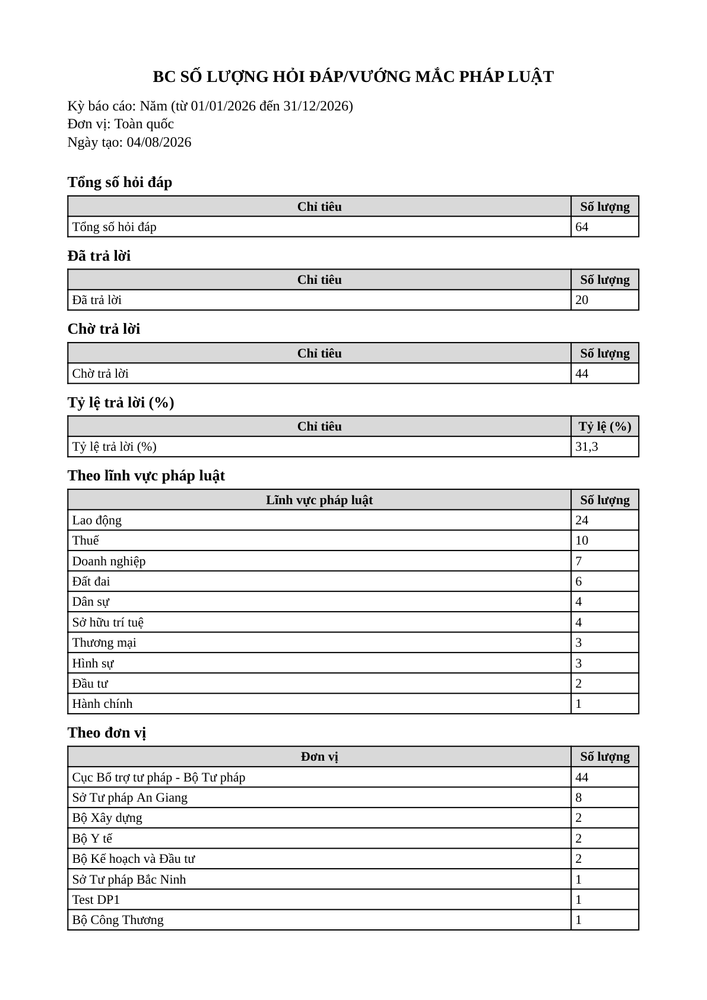
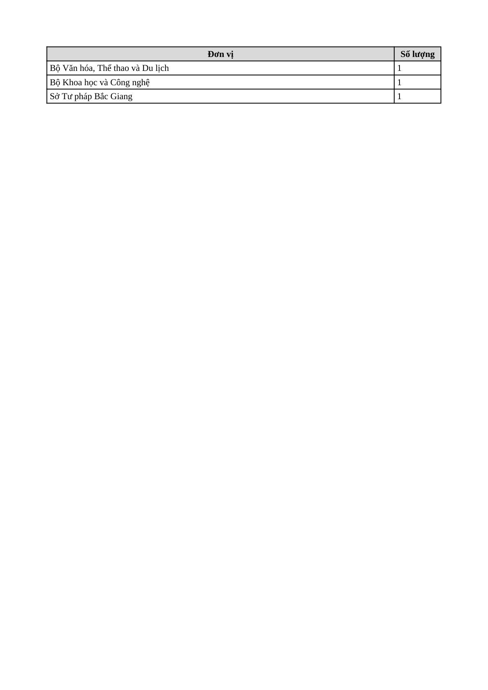

# Bug Report — Báo cáo thống kê (nhóm IX): Xuất PDF thiếu khung văn bản hành chính và sai khuôn tên tệp

| Thông tin | Giá trị |
|-----------|---------|
| **Dự án** | PM HTPLDN — UAT đối tác |
| **Môi trường** | `https://htpldn-uat.ospgroup.vn` — **môi trường bàn giao** (bản dựng hiển thị ở thanh bên trái: `HTPLDN · V1.0.5`) |
| **Người test** | QA Automation (Claude Code) |
| **Ngày** | 2026-08-04 18:03:00 |
| **Loại test** | Verify bug đối tác — **vòng 2** (re-verify sau khi dev đánh `dev done`), áp quyết định BA ngày 04/08/2026 |
| **Round** | BƯỚC 2 — áp quyết định BA (`QA_BA_APPLY_PROTOCOL`) |
| **Tài liệu tham chiếu** | `Docs-PM-HTPLDN/_bmad-output/planning-artifacts/srs-v3.5/srs-fr-11-bao-cao.md` · [QA_BA_APPLY_PROTOCOL.md](../../../QA_BA_APPLY_PROTOCOL.md) · Sheet tab `UAT_TGPL Doanh Nghiệp-tuần 3` |

---

## Tổng hợp

File này mở **2 bug** cho **nhóm 21 phiếu Xuất PDF** của báo cáo nhóm IX (tab tuần 3), tất cả đã được ghi `Verify 2 = Reopen` ngày 04/08/2026.

**Vì sao 21 phiếu chỉ cần 2 bug entry:** ba điểm tranh chấp của nhóm (khung văn bản hành chính · khuôn tên tệp · ký số điện tử) đều do **cùng một bộ sinh tệp** của nhóm IX tạo ra, không phụ thuộc loại báo cáo. Một phép đo trên phiếu đại diện `SLHDVM_07` (row 192, *BC Số lượng hỏi đáp/vướng mắc pháp luật*) phủ được cả nhóm — lập luận này đã ghi trong bảng đối chiếu điều kiện, 0 GAP.

**21 dòng thuộc phạm vi (tab tuần 3):** 192 `SLHDVM_07` · 197 `VVDTN_07` · 204 `VVDHT_07` · 210 `VVDHTHT_07` · 217 `VVTTG_06` · 223 `CLDTBDDDR_07` · 228 `LDTBDDDR_07` · 231 `CGTVPL_07` · 234 `DGHQHTPL_07` · 240 `VVTDVQL_07` · 244 `VVTLV_06` · 247 `VVTLHDN_06` · 249 `VVTTGCT_06` · 251 `CPHTCT_07` · 254 `CPCTHTTDVQL_07` · 258 `CPCTHTTLHDN_07` · 261 `CPCTHTTTG_06` · 265 `SLCTHT_07` · 269 `CTTDVQL_05` · 274 `CTTLV_06` · 276 `CTTTG_05`.

> **⚠️ Điểm thứ ba của nhóm — ký số điện tử — KHÔNG phải lỗi, không có bug entry.** BA chốt 04/08/2026: nhóm báo cáo thống kê **không áp** ký số; trong toàn bộ tài liệu, ký số chỉ đặt ra cho một chức năng duy nhất là xuất hồ sơ chương trình đào tạo. QA đo lại xác nhận tệp **không có** trường chữ ký điện tử nào — đúng như BA chốt. Đây là điểm đối tác cần cập nhật lại Kết quả mong đợi, không phải việc của Dev.

> **Vì sao phải đo lại thay vì dùng kết quả cũ:** quyết định của BA dựa trên phép đo ngày **03/08 trên bản dựng V1.0.4**. Ghi `Reopen` cho 21 phiếu mà không kiểm lại hiện trạng là chấm theo trí nhớ — đúng kiểu đã từng báo Reopen oan. Toàn bộ số liệu dưới đây đo lại ngày **04/08/2026 trên bản dựng V1.0.5 đang chạy**.

> **Ghi nhận phần phần mềm ĐÃ ĐẠT (không mở bug):** tệp xuất ra đúng **khổ A4** (595 × 842 pt), đúng **phông Times New Roman** (phông nhúng `Tinos-Regular` / `Tinos-Bold` — bản tương thích số đo), và có đủ **bốn mục đầu tệp**: tên báo cáo · kỳ báo cáo · đơn vị · ngày tạo. Lỗi *"Không thể tạo file xuất"* của vòng trước đã hết — tệp tải về được, mở được, số liệu khớp màn hình.

### Severity breakdown

| Tổng | Critical | Major | Medium | Minor | Trivial | Closed | Open |
|------|----------|-------|--------|-------|---------|--------|------|
| 2    | 0        | 1     | 0      | 1     | 0       | 0      | 2    |

## Bug Summary Table

| Bug ID | Severity | Priority | Type | TC Ref | **SRS Reference** | Title | Status |
|--------|----------|----------|------|--------|-------------------|-------|--------|
| BUG-BCTK-XUATPDF-KHUNG-VAN-BAN | Major | P1 | UI/UX | Nhóm 21 phiếu Xuất PDF, đại diện `SLHDVM_07` (tuần 3 row 192) | `TPL-REPORT-FULL §Processing bước 8` `srs-fr-11-bao-cao.md:86` · `§Tiêu chí chấp nhận` `:124` · `SCR-IX-01` `:1092` | Tệp PDF xuất ra thiếu toàn bộ khung văn bản hành chính TT 17/2025: không có quốc hiệu, tiêu ngữ, tên cơ quan ban hành ở đầu trang và không có khối ký ở cuối trang | Reopen |
| BUG-BCTK-XUATPDF-TEN-TEP | Minor | P3 | Data | Nhóm 21 phiếu Xuất PDF, đại diện `SLHDVM_07` (tuần 3 row 192) | `TPL-REPORT-FULL §Processing bước 8` `srs-fr-11-bao-cao.md:86` · `§Tiêu chí chấp nhận` `:124` · `SCR-IX-01` `:1092` | Tên tệp PDF thiếu phần giờ-phút: xuất hai lần trong cùng một ngày cho ra trùng tên tệp, tệp sau đè tệp trước | Reopen |

---

## BUG-BCTK-XUATPDF-KHUNG-VAN-BAN — Tệp PDF xuất ra thiếu toàn bộ khung văn bản hành chính: không quốc hiệu, không tên cơ quan, không khối ký

### Mô tả

Tệp PDF do chức năng **Xuất PDF** của báo cáo thống kê (nhóm IX) tạo ra **thiếu toàn bộ khung văn bản hành chính** theo Thông tư 17/2025: **không có quốc hiệu và tiêu ngữ**, **không có tên cơ quan ban hành** ở đầu trang, và **không có khối ký** (ngày ký · họ tên cán bộ xuất báo cáo · chỗ trống cho con dấu) ở cuối trang.

Tệp mở đầu thẳng bằng tên báo cáo và kết thúc thẳng bằng một dòng số liệu. Hệ quả nghiệp vụ: bản in ra **không dùng được như một văn bản hành chính** — không có chỗ ký, không có chỗ đóng dấu, không xác định được cơ quan phát hành.

Phần khổ giấy, phông chữ và bốn mục đầu tệp thì **đã đạt** — xem "Kết quả thực tế".

### Các bước tái hiện

1. Đăng nhập vai trò **CB Nghiệp vụ Trung ương** (`CB_NV_TW`, tài khoản `cbnv_tw`, đơn vị Cục Bổ trợ tư pháp - Bộ Tư pháp) — vai trò có quyền xem và xuất báo cáo thống kê.
2. Vào màn **Báo cáo thống kê**, chọn loại báo cáo **"BC Số lượng hỏi đáp/vướng mắc pháp luật"** (loại của phiếu đại diện `SLHDVM_07`).
3. Đặt tham số: Kỳ **Năm**, từ **01/01/2026** đến **31/12/2026**, Đơn vị **Toàn quốc**.
4. Bấm **Xem báo cáo** — xác nhận báo cáo có số liệu thật (không rơi vào trường hợp báo cáo rỗng làm mất khối đầu/cuối trang).
5. Bấm **Xuất PDF**, lưu tệp về máy.
6. Mở tệp, đọc **phần đầu trang đầu** và **phần cuối trang cuối**; tra từ khóa trên **toàn văn** cả 2 trang.

### Kết quả mong đợi

- `srs-fr-11-bao-cao.md:86` (`TPL-REPORT-FULL` §Processing, bước 8) — *"Nếu xuất PDF: tạo file .pdf theo khung văn bản hành chính Thông tư 17/2025 — khổ A4, font Times New Roman cỡ 13; **đầu trang** có quốc hiệu, tiêu ngữ và tên cơ quan ban hành; **cuối trang** có ngày ký, họ tên cán bộ xuất báo cáo và chỗ trống cho con dấu khi in chính thức. **Không in dòng chức danh người ký** — hồ sơ tài khoản không lưu chức vụ … `[BA chốt 2026-08-04]`"*
- `:124` (§Tiêu chí chấp nhận) — *"**Given** CB nhấn "Xuất PDF" **When** click **Then** tải file .pdf có đủ quốc hiệu + tiêu ngữ + tên cơ quan ở đầu trang, ngày ký + họ tên cán bộ xuất báo cáo + chỗ trống con dấu ở cuối trang, không có dòng chức danh, khổ A4 Times New Roman 13 …"*
- `:1092` (`SCR-IX-01`) — *"Export XLSX/PDF chèn tiêu đề BC + thông tin kỳ + đơn vị + ngày tạo vào header file. Riêng PDF bổ sung khung văn bản hành chính: quốc hiệu + tên cơ quan ở đầu trang, ngày ký + họ tên cán bộ xuất báo cáo + chỗ con dấu ở cuối trang (không có dòng chức danh)."*

### Kết quả thực tế

Đo ngày **04/08/2026**, môi trường bàn giao, bản dựng **V1.0.5**. Tệp thu được: 28.741 byte, **2 trang**.

| Thành phần khung văn bản | Yêu cầu | Đo được |
|---|:-:|:-:|
| Khổ A4 | Có | ✅ 595 × 842 pt — đúng A4 dọc |
| Phông Times New Roman cỡ 13 | Có | ✅ phông nhúng `Tinos-Regular` / `Tinos-Bold` |
| Tên báo cáo · kỳ báo cáo · đơn vị · ngày tạo | Có | ✅ đủ 4 mục, ngay đầu tệp |
| **Quốc hiệu + tiêu ngữ** | Có | ❌ **KHÔNG có** |
| **Tên cơ quan ban hành** | Có | ❌ **KHÔNG có** ở đầu trang |
| Khối ký — **ngày ký + họ tên cán bộ xuất báo cáo** | Có | ❌ **KHÔNG có** ở cuối trang |
| **Chỗ trống cho con dấu** | Có | ❌ **KHÔNG có** |
| Dòng chức danh người ký | **Không** được in | ✅ không có — đúng yêu cầu |

Chi tiết đo, bằng cách đọc **toàn văn cả 2 trang** (không nhìn lướt 1 trang):

- **Ba dòng đầu tệp:** `BC SỐ LƯỢNG HỎI ĐÁP/VƯỚNG MẮC PHÁP LUẬT` · `Kỳ báo cáo: Năm (từ 01/01/2026 đến 31/12/2026)` · `Đơn vị: Toàn quốc` ⇒ **không có dòng quốc hiệu nào phía trên tên báo cáo**.
- Tra toàn văn cụm **"CỘNG HÒA"** và **"Độc lập"** ⇒ **không có kết quả nào**.
- Cụm **"Bộ Tư pháp"** có xuất hiện, nhưng **nằm bên trong bảng số liệu** (dòng *"Cục Bổ trợ tư pháp - Bộ Tư pháp — 44"*), **không phải** phần tên cơ quan ban hành ở đầu trang.
- Tra toàn văn **"Người xuất"**, **"Ngày ký"**, **"ký tên"** ⇒ **không có kết quả nào**.
- **Ba dòng cuối tệp:** `1` · `Sở Tư pháp Bắc Giang` · `1` — đều là **dòng số liệu**, không có khối ký.

### Bằng chứng





| Nội dung | Đường dẫn |
|---|---|
| Tệp PDF gốc đã đo (28.741 byte, 2 trang) | [`../../../reverify-week-4/reverify-round-2026-08-04/evidence/bao-cao-hoi-dap-2026-08-04.pdf`](../../../reverify-week-4/reverify-round-2026-08-04/evidence/bao-cao-hoi-dap-2026-08-04.pdf) |
| Phiếu đo lại đầy đủ 04/08/2026 (mục A) | [`../../../reverify-week-4/reverify-round-2026-08-04/do-lai-nhom-xuat-pdf-va-row339-2026-08-04.md`](../../../reverify-week-4/reverify-round-2026-08-04/do-lai-nhom-xuat-pdf-va-row339-2026-08-04.md) |
| Bảng đối chiếu điều kiện (8 dòng, 0 GAP) | [`../../../reverify-week-4/reverify-round-2026-08-04/cond/xuat-pdf-21-phieu.md`](../../../reverify-week-4/reverify-round-2026-08-04/cond/xuat-pdf-21-phieu.md) |
| Quyết định của BA (Vấn đề 16) | [`../../../reverify-week-4/reverify-round-2026-08-04/phan-hoi-cac-diem-cho-BA-chot-2026-08-04.md`](../../../reverify-week-4/reverify-round-2026-08-04/phan-hoi-cac-diem-cho-BA-chot-2026-08-04.md) |

> **⚠️ Bẫy khi re-test — hai điều dễ chấm nhầm:**
> 1. **Đừng chấm FAIL vì tệp không có dòng chức danh người ký.** `:86` ghi rõ **không in** dòng chức danh, vì hồ sơ tài khoản không lưu chức vụ — người ký ghi tay khi ký.
> 2. **Đừng chấm FAIL vì tệp không có chữ ký số.** Nhóm báo cáo thống kê **không áp** ký số theo BA chốt 04/08/2026.

---

## BUG-BCTK-XUATPDF-TEN-TEP — Tên tệp PDF thiếu giờ-phút: xuất hai lần trong cùng ngày cho ra trùng tên, tệp sau đè tệp trước

### Mô tả

Tên tệp PDF do chức năng Xuất PDF trả về **chỉ có phần ngày, thiếu phần giờ-phút**. Vì phần giờ-phút chính là thứ phân biệt các lần xuất trong cùng một ngày, người dùng xuất báo cáo **hai lần trong cùng ngày sẽ nhận hai tệp trùng tên** — tệp tải sau đè tệp tải trước trong thư mục tải về, mất bản đã tải.

Lỗi thuộc **bộ sinh tệp chung của nhóm IX**, nên áp cho **mọi định dạng xuất** của nhóm, không riêng PDF.

### Các bước tái hiện

1. Đăng nhập vai trò **CB Nghiệp vụ Trung ương** (`CB_NV_TW`, tài khoản `cbnv_tw`) — vai trò có quyền xuất báo cáo thống kê.
2. Vào **Báo cáo thống kê** → loại **"BC Số lượng hỏi đáp/vướng mắc pháp luật"** → Kỳ **Năm** 01/01/2026–31/12/2026 → Đơn vị **Toàn quốc** → **Xem báo cáo**.
3. Bấm **Xuất PDF**, lưu tệp, **đọc tên tệp** vừa tải về.
4. Lặp lại bước 3 **một lần nữa trong cùng ngày**, so tên hai tệp.

### Kết quả mong đợi

- `srs-fr-11-bao-cao.md:86` (§Processing bước 8) — *"Tên tệp `{TenBaoCao}_{YYYYMMDD_HHmm}.pdf` `[BA chốt 2026-08-04]` — `{TenBaoCao}` là tên loại báo cáo viết liền kiểu PascalCase, bỏ dấu tiếng Việt và bỏ mọi ký tự không phải chữ/số (dấu `/`, khoảng trắng, dấu câu)"*.
- `:85` (bước 7, cùng khuôn cho Excel) nêu rõ lý do — *"phần giờ-phút **bắt buộc** để xuất hai lần trong ngày không đè tệp `[BA chốt 2026-08-04]`"*.
- `:124` (§Tiêu chí chấp nhận) — *"… tên tệp đúng khuôn `{TenBaoCao}_{YYYYMMDD_HHmm}.pdf`"*.
- ⇒ Hai lần xuất trong cùng ngày phải cho ra **hai tên tệp khác nhau**.

### Kết quả thực tế

Tên tệp lấy từ **phần đầu phản hồi của máy chủ** (`content-disposition`) — đây là nguồn quyết định tên tệp khi tải về, không suy từ tên hiển thị trên trình duyệt:

```
content-disposition: attachment; filename="bao-cao-hoi-dap-2026-08-04.pdf"
```

Đối chiếu với khuôn `{TenBaoCao}_{YYYYMMDD_HHmm}.pdf`:

| Thành phần khuôn | Yêu cầu | Tên tệp thực tế |
|---|---|---|
| `{TenBaoCao}` | PascalCase, bỏ dấu, bỏ ký tự không phải chữ/số | `bao-cao-hoi-dap` — chữ thường, có dấu gạch nối |
| Dấu phân cách | `_` | `-` |
| `{YYYYMMDD}` | `20260804` | `2026-08-04` — có dấu gạch nối |
| **`{HHmm}`** | **bắt buộc** | ❌ **KHÔNG có** |

⇒ Sai khuôn ở cả bốn thành phần, nhưng **hệ quả nghiệp vụ nằm ở phần thiếu giờ-phút**: xuất hai lần trong cùng ngày cho ra **cùng một tên tệp**, đúng rủi ro mà đặc tả nêu ở `:85`.

### Bằng chứng


| Nội dung | Đường dẫn |
|---|---|
| Phần đầu phản hồi của máy chủ (nguồn quyết định tên tệp) | [`../../../reverify-week-4/reverify-round-2026-08-04/evidence/xuat-pdf-header-phan-hoi-2026-08-04.json`](../../../reverify-week-4/reverify-round-2026-08-04/evidence/xuat-pdf-header-phan-hoi-2026-08-04.json) |
| Phiếu đo lại đầy đủ 04/08/2026 (mục A — Tên tệp) | [`../../../reverify-week-4/reverify-round-2026-08-04/do-lai-nhom-xuat-pdf-va-row339-2026-08-04.md`](../../../reverify-week-4/reverify-round-2026-08-04/do-lai-nhom-xuat-pdf-va-row339-2026-08-04.md) |
| Quyết định của BA (Vấn đề 17) | [`../../../reverify-week-4/reverify-round-2026-08-04/phan-hoi-cac-diem-cho-BA-chot-2026-08-04.md`](../../../reverify-week-4/reverify-round-2026-08-04/phan-hoi-cac-diem-cho-BA-chot-2026-08-04.md) |

> **⚠️ Khi re-test phải bấm nút "Xuất PDF" trên giao diện, không gọi thẳng máy chủ.** Tệp dùng cho phép đo 04/08 lấy bằng cách gọi thẳng máy chủ, nên chứng minh được nội dung tệp nhưng **không chứng minh được nút giao diện có chạy hay không**. Ghi chú này đã lưu ở mục D của phiếu đo lại.

---

## Phụ lục — Môi trường test

| Thành phần | Giá trị |
|------------|---------|
| URL ứng dụng | `https://htpldn-uat.ospgroup.vn` — môi trường bàn giao (**không** phải `18.143.165.120.nip.io`) |
| Bản dựng | `HTPLDN · V1.0.5` — đọc trực tiếp từ thanh bên trái, không lấy từ trí nhớ |
| Đăng nhập | Tên đăng nhập + mật khẩu, **không có bước OTP** trên môi trường này |
| Tài khoản dùng ra verdict | `cbnv_tw` — CB Nghiệp vụ Trung ương (`CB_NV_TW`), Cục Bổ trợ tư pháp - Bộ Tư pháp, cấp TW |
| Tham số báo cáo khi đo | Loại *BC Số lượng hỏi đáp/vướng mắc pháp luật* · Kỳ **Năm** 01/01/2026–31/12/2026 · Đơn vị **Toàn quốc** (64 hỏi đáp, 2 trang) |
| Cách đọc nội dung tệp | Trình phân tích PDF — đọc khổ giấy, phông nhúng, **toàn văn cả 2 trang**, và cờ chữ ký số của tệp |
| Tool test | Chrome DevTools MCP |
| ⚠️ Lưu ý phiên đăng nhập | Môi trường này **rớt phiên rất nhanh**; hai lần bấm nút "Xuất PDF" trên giao diện đều rơi đúng lúc rớt phiên nên chưa phân định được nút giao diện có chạy không — đã ghi ở mục D phiếu đo lại, **chưa log thành lỗi** |

---

*Bug report generated: 2026-08-04 | QA Automation via Claude Code*
