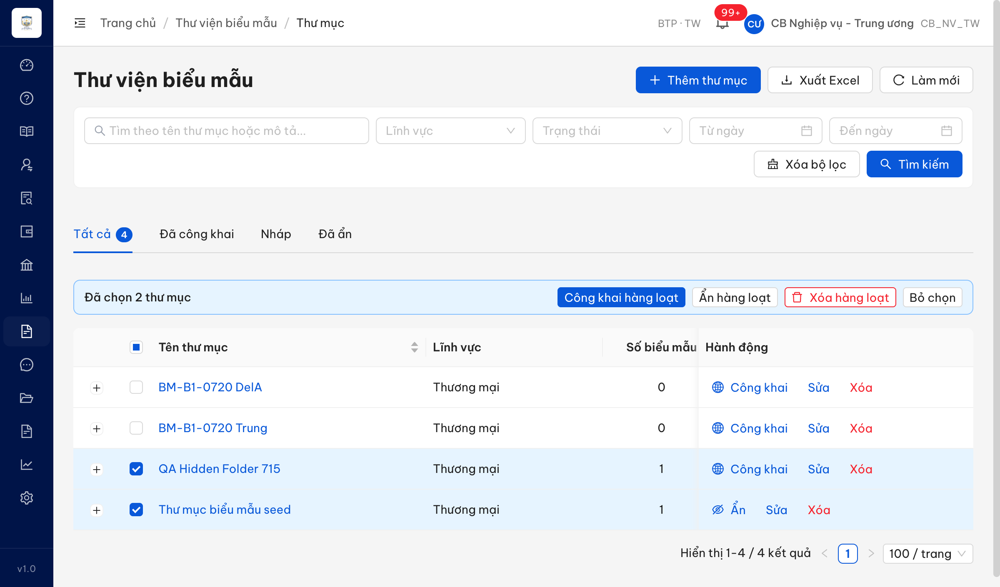
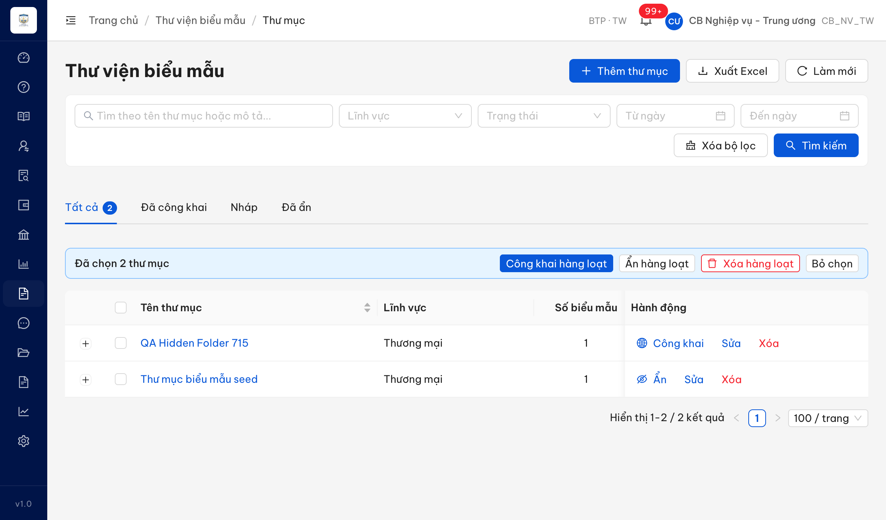
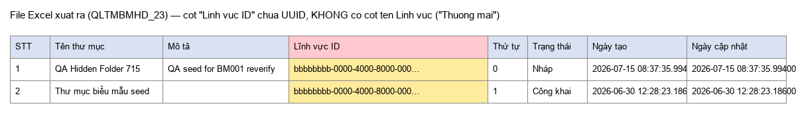
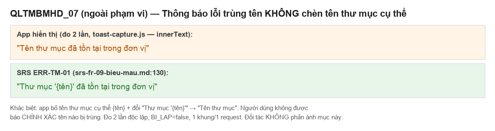
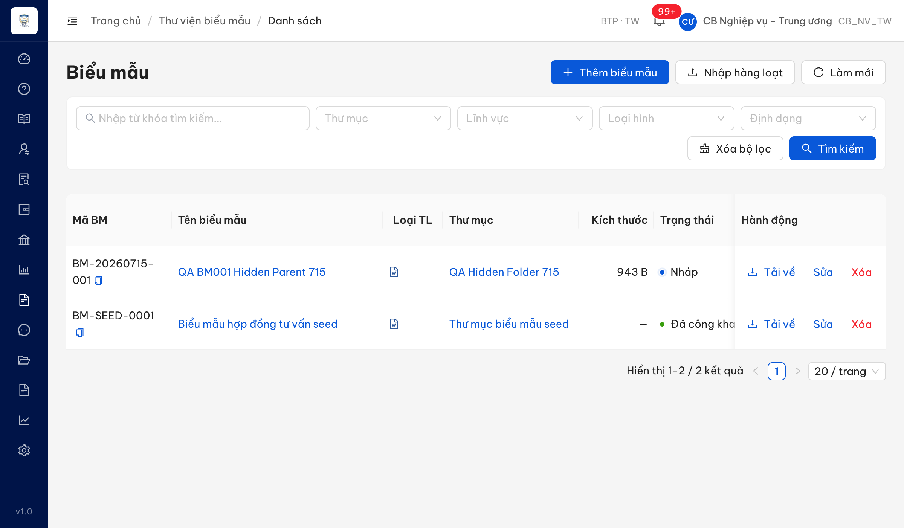
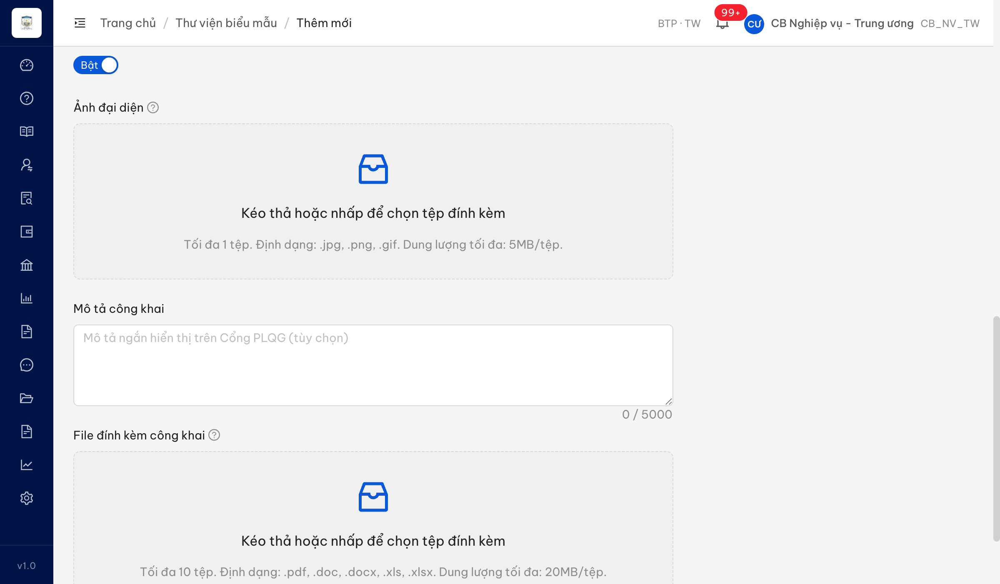

# Bug Report — Biểu mẫu (TỔNG HỢP Batch 1–5) — gửi Dev

| Thông tin | Giá trị |
|-----------|---------|
| **Dự án** | PM HTPLDN — Verify bug đối tác (UAT tuần 3) |
| **Môi trường** | https://18.143.165.120.nip.io/ |
| **Người test** | QA Automation (Chrome DevTools MCP, Claude Code) |
| **Ngày** | 2026-07-20 |
| **Loại test** | Functional (verify bug đối tác — vòng 1) |
| **Round** | Reverify week-3 — Batch 1 → 5 (module Biểu mẫu) |
| **Tài liệu tham chiếu** | `srs-v3.5/srs-fr-09-bieu-mau.md` (FR-VII-01 → 05, SCR-VII-01/02, BR-DATA-07) |
| **Tài khoản test** | `cbnv_tw` / Test@1234 (CB Nghiệp vụ - Trung ương, BTP·TW) |

> **File này gộp toàn bộ bug Open của 5 batch Biểu mẫu** (batch1–batch5) thành 1 tài liệu để chuyển Dev. Nội dung, ảnh, SRS reference giữ nguyên từng bug gốc. Các case verdict **BA confirm** / **Reject** không nằm ở đây (xem các file `ba-confirmation-needed-week-3-bieu-mau-batch*.md`).

---

## Tổng hợp

Tổng **12** lỗi có SRS reference cụ thể qua 5 batch verify module Biểu mẫu:

> **Snapshot LATEST (2026-07-27):** **12 tổng · 12 Closed · 0 Open.** Bằng chứng reverify PASS nằm ở [`batch1`](Pass-bug-report-bieu-mau-batch1.md) · [`batch2`](Pass-bug-report-bieu-mau-batch2.md) · [`batch3`](Pass-bug-report-bieu-mau-batch3.md) · [`batch4`](Pass-bug-report-bieu-mau-batch4.md) · [`batch5`](Pass-bug-report-bieu-mau-batch5.md).

| Batch | Màn / Chức năng | Số bug | Bug ID |
|-------|-----------------|--------|--------|
| 1 | QLTMBMHD — Quản lý thư mục biểu mẫu | 4 | BUG-QLTMBMHD_13 · _19 · _23 · BUG-QLTMBMHD_OOS_01 |
| 2 | TKTMBMHD + TKBMHD — Tìm kiếm thư mục & biểu mẫu | 3 | BUG-TKTMBMHD_02 · _06 · BUG-TKBMHD_04 |
| 3 | CKTMBMHDLCTT — Công khai/Ẩn thư mục hàng loạt | 1 | BUG-CKTMBMHDLCTT_02 |
| 4 | QLBMHD — Tạo mới + Upload/Validation | 2 | BUG-QLBMHD_02 · _03 |
| 5 | QLBMHD — Sửa/Xem/Xem trước/Tải về | 2 | BUG-BM-B5-01 · BUG-BM-B5-02 |

### Severity breakdown (toàn bộ)

| Tổng | Critical | Major | Medium | Minor | Trivial | Closed | Open |
|------|----------|-------|--------|-------|---------|--------|------|
| 12   | 0        | 1     | 7      | 4     | 0       | 12     | 0    |

> **R2 reverify 2026-07-22:** Batch 1 (QLTMBMHD) — dev báo fix xong 4 bug (`_13 · _19 · _23 · _OOS_01`), re-verify qua Chrome DevTools MCP: **4/4 PASS → Closed**. Còn 8 bug Open thuộc batch 2–5. Chi tiết Closed: [`Pass-bug-report-bieu-mau-batch1.md`](Pass-bug-report-bieu-mau-batch1.md).
>
> **R3 reverify 2026-07-23:** Batch 5 — BUG-BM-B5-02 (Xem trước, đóng 22/07) + BUG-BM-B5-01 (Tải về giữ tên file gốc, verify lại trên **dữ liệu mới** 23/07) → **2/2 Closed**. Còn **6** bug Open (batch 2–4). Chi tiết batch 5: [`Pass-bug-report-bieu-mau-batch5.md`](Pass-bug-report-bieu-mau-batch5.md).

### Ghi chú quan hệ giữa các bug (giúp Dev gom fix)

- **Cụm "nút hành động sai điều kiện" (SCR-VII-01 #13, `srs-fr-09:615`):** BUG-QLTMBMHD_13 (nút Xóa) + BUG-CKTMBMHDLCTT_02 (nút Công khai) cùng gốc — logic hiển thị nút theo trạng thái/độ rỗng thư mục.
- **Cụm "selection không reset sau thao tác hàng loạt":** BUG-QLTMBMHD_19 (bulk delete). Case bulk công khai/ẩn (batch 3) tái hiện cùng hiện tượng nhưng SRS im lặng → chuyển BA confirm, đề nghị BA ra 1 quyết định chung.
- **Cụm "thiếu Cơ quan ban hành":** BUG-QLBMHD_02 (cột danh sách) + BUG-QLBMHD_03 (trường form) cùng SCR-VII-02.
- **Cụm "thông báo rỗng/không kết quả":** BUG-TKTMBMHD_06 + BUG-TKBMHD_04 cùng pattern hiện "Trống" thay vì message SRS.

---

## Bug Summary Table (toàn bộ 12 bug)

| Bug ID | Batch | Severity | Priority | Type | TC Ref | **SRS Reference** | Title | Status |
|--------|-------|----------|----------|------|--------|-------------------|-------|--------|
| ~~BUG-TKTMBMHD_02~~ | 2 | Minor | P2 | UI/UX | TKTMBMHD_02 | `BR-DATA-07 (srs-fr-09:917)` · `SCR-VII-01 (srs-fr-09:623)` | Phân trang màn Tìm kiếm thư mục mặc định 100 mục/trang thay vì 20 | **Closed** |
| ~~BUG-TKTMBMHD_06~~ | 2 | Minor | P2 | UI/UX | TKTMBMHD_06 | `FR-VII-02 §Error Handling E2 (srs-fr-09:199) INF-TM-TK-01` | Tìm thư mục 0 kết quả hiện "Trống" thay vì "Không tìm thấy thư mục phù hợp" | **Closed** |
| ~~BUG-TKBMHD_04~~ | 2 | Minor | P2 | UI/UX | TKBMHD_04 | `FR-VII-05 §Error Handling E1 (srs-fr-09:435) INF-BM-TK-01` | Tìm biểu mẫu 0 kết quả hiện "Trống" thay vì "Không tìm thấy biểu mẫu phù hợp" | **Closed** |
| ~~BUG-CKTMBMHDLCTT_02~~ | 3 | Medium | P2 | UI/UX | CKTMBMHDLCTT_02 | `SCR-VII-01 #13` (`srs-fr-09:615`) | Nút "Công khai" hiển thị trên thư mục rỗng (0 biểu mẫu) — sai điều kiện "có BM" | **Closed** |
| ~~BUG-QLBMHD_02~~ | 4 | Medium | P2 | UI/UX | QLBMHD_02 | `SCR-VII-02 #20` (`srs-fr-09:657`) | Danh sách biểu mẫu thiếu cột "Cơ quan ban hành" (SRS quy định luôn hiển thị) | **Closed** |
| ~~BUG-QLBMHD_03~~ | 4 | Medium | P2 | UI/UX | QLBMHD_03 | `SCR-VII-02 #21` (`srs-fr-09:658`) | Form Thêm/Sửa biểu mẫu thiếu trường "Cơ quan ban hành" (read-only auto theo SRS) | **Closed** |
| ~~BUG-BM-B5-01~~ | 5 | Medium | P2 | Data | QLBMHD_16 | `FR-VII-04 §Processing Tải về Bước 3` (`srs-fr-09:335`) + Outputs #5 `file_ten` (`:356`) | Tải về không giữ nguyên tên file gốc — hệ thống ép tên = tên biểu mẫu | **Closed** ✅ (R3, dữ liệu mới) |
| ~~BUG-BM-B5-02~~ | 5 | Major | P1 | UI/UX | QLBMHD_17, _18, _19 | `FR-VII-04 §Processing Xem trực tuyến Bước 2–4` (`srs-fr-09:320–327`) | "Xem trước" mở file thô (trình duyệt tải về) thay vì xem trước trực tuyến (DOCX→PDF, XLSX→bảng read-only) | **Closed** ✅ (R2) |
| ~~BUG-QLTMBMHD_13~~ | 1 | Medium | P2 | UI/UX | QLTMBMHD_13 | `SCR-VII-01 #13` (`srs-fr-09:615`) | Nút "Xóa" hiển thị sai điều kiện — hiện trên thư mục Công khai và thư mục còn biểu mẫu | **Closed** ✅ (R2) |
| ~~BUG-QLTMBMHD_19~~ | 1 | Medium | P2 | UI/UX | QLTMBMHD_19, _20 | `SCR-VII-01 #14` (`srs-fr-09:616`) | Sau khi xóa hàng loạt thành công, thanh "Đã chọn N thư mục" + nút hành động hàng loạt không tự xóa (count cũ) | **Closed** ✅ (R2) |
| ~~BUG-QLTMBMHD_23~~ | 1 | Medium | P2 | Data | QLTMBMHD_23 | `SCR-VII-01 Outputs #3 ten_linh_vuc` (`srs-fr-09:120`) | File Excel xuất ra không có cột tên Lĩnh vực — chỉ có "Lĩnh vực ID" (UUID) | **Closed** ✅ (R2) |
| ~~BUG-QLTMBMHD_OOS_01~~ | 1 | Minor | P3 | UI/Content | QLTMBMHD_OOS_01 | `ERR-TM-01` (`srs-fr-09:130`) | Thông báo lỗi trùng tên không chèn tên thư mục cụ thể `{tên}` theo mẫu ERR-TM-01 | **Closed** ✅ (R2) |

---
---

# BATCH 1 · QLTMBMHD — Quản lý thư mục biểu mẫu

*Tài liệu tham chiếu: `srs-v3.5/srs-fr-09-bieu-mau.md` (FR-VII-01 / SCR-VII-01)*

> Các case khác: QLTMBMHD_07 → Reject (thông báo trùng tên không nhân đôi); QLTMBMHD_08 / _10 / _17 → BA confirm (`../../ba-confirm/bieu-mau/ba-confirmation-needed-week-3-bieu-mau-batch1.md`). QLTMBMHD_20 → Open (BUG-QLTMBMHD_19 bên dưới) **kèm** BA confirm (wording thông báo xóa một phần).

## ~~BUG-QLTMBMHD_13~~ [CLOSED] — Nút "Xóa" hiển thị trên thư mục Công khai và thư mục còn biểu mẫu (sai điều kiện SCR-VII-01)

> **Re-test:** 2026-07-22 R2 — ✅ PASS. Nút Xóa nay chỉ hiện khi thư mục Nháp/Ẩn VÀ rỗng; thư mục Công khai + thư mục còn biểu mẫu đều ẩn nút Xóa. Chi tiết: [`Pass-bug-report-bieu-mau-batch1.md`](Pass-bug-report-bieu-mau-batch1.md).

### Mô tả

Trên màn Quản lý thư mục biểu mẫu, nút hành động **Xóa** hiển thị trên MỌI hàng thư mục bất kể trạng thái và độ rỗng. Theo SRS SCR-VII-01, nút Xóa chỉ được hiển thị khi thư mục ở trạng thái Nháp/Ẩn VÀ rỗng (0 biểu mẫu). Thực tế nút Xóa xuất hiện cả trên thư mục **Đã công khai** và thư mục **còn biểu mẫu bên trong**.

### Các bước tái hiện

1. Đăng nhập role **CB Nghiệp vụ - Trung ương** (`cbnv_tw`, quyền quản lý thư mục biểu mẫu theo SCR-VII-01, đơn vị BTP·TW).
2. Vào **Biểu mẫu → Thư viện biểu mẫu** (`/bieu-mau/thu-muc`), tab **Tất cả**.
3. Quan sát cột **Hành động** trên hàng "Thư mục biểu mẫu seed" (Đã công khai, 1 biểu mẫu) và "QA Hidden Folder 715" (Nháp, 1 biểu mẫu).
4. Quan sát: nút **Xóa** hiển thị trên cả hai hàng.

### Kết quả mong đợi

- Theo SRS `srs-fr-09-bieu-mau.md:615` (SCR-VII-01 #13 — "... / Xóa (khi NHAP/AN, rỗng)"): nút Xóa chỉ hiển thị khi thư mục ở trạng thái Nháp hoặc Ẩn VÀ rỗng (0 biểu mẫu).
- Trên thư mục Đã công khai, hoặc thư mục còn biểu mẫu → nút Xóa không được hiển thị.

### Kết quả thực tế

- Nút **Xóa** hiển thị trên hàng "Thư mục biểu mẫu seed" (Đã công khai) — vi phạm điều kiện trạng thái.
- Nút **Xóa** hiển thị trên hàng "QA Hidden Folder 715" (Nháp, còn 1 biểu mẫu) — vi phạm điều kiện rỗng.

### Bằng chứng



```json
[{"Tên":"Thư mục biểu mẫu seed","Trạng thái":"Đã công khai","Số biểu mẫu":"1","actions":["Ẩn","Sửa","Xóa"]},
 {"Tên":"QA Hidden Folder 715","Trạng thái":"Nháp","Số biểu mẫu":"1","actions":["Công khai","Sửa","Xóa"]}]
```

---

## ~~BUG-QLTMBMHD_19~~ [CLOSED] — Sau khi xóa hàng loạt thành công, thanh "Đã chọn N thư mục" + nút hành động hàng loạt không tự xóa

> **Re-test:** 2026-07-22 R2 — ✅ PASS. Sau xóa hàng loạt (2 DELETE 204): thanh "Đã chọn N thư mục" + nút bulk biến mất, 0 checkbox tích, Select all reset. Chi tiết: [`Pass-bug-report-bieu-mau-batch1.md`](Pass-bug-report-bieu-mau-batch1.md).

### Mô tả

Sau khi xóa hàng loạt thành công, hệ thống KHÔNG reset trạng thái chọn: thanh "Đã chọn N thư mục" vẫn hiển thị với **số đếm CŨ** (số thư mục đã chọn trước khi xóa, nay đã bị xóa), kèm các nút [Công khai hàng loạt] [Ẩn hàng loạt] [Xóa hàng loạt] [Bỏ chọn]. Xảy ra cả khi xóa toàn bộ (QLTMBMHD_19) lẫn xóa một phần (QLTMBMHD_20).

### Các bước tái hiện

1. Đăng nhập role **CB Nghiệp vụ - Trung ương** (`cbnv_tw`, BTP·TW).
2. Vào **Biểu mẫu → Thư viện biểu mẫu**, tab Tất cả.
3. Tích chọn 2 thư mục Nháp rỗng ("BM-B1-0720 DelA", "BM-B1-0720 Trung") → bấm **Xóa hàng loạt** → xác nhận **Xóa**.
4. Sau khi thông báo "Đã xóa 2 thư mục." hiện + danh sách còn lại cập nhật (2 thư mục kia biến mất).
5. Quan sát thanh chọn phía trên bảng.

### Kết quả mong đợi

- Theo SRS `srs-fr-09-bieu-mau.md:616` (SCR-VII-01 #14 — Hành động hàng loạt: điều kiện hiển thị **"khi chọn nhiều"**): sau khi xóa xong, không còn thư mục nào được chọn → thanh "Đã chọn N thư mục" và các nút hành động hàng loạt phải tự ẩn / reset về 0.

### Kết quả thực tế

- Thanh **"Đã chọn 2 thư mục"** vẫn hiển thị sau khi xóa xong, với số đếm **2 (cũ, đã stale)** — trong khi thực tế 0 dòng còn được tích (`checkboxesStillChecked=0`).
- Các nút [Công khai hàng loạt] [Ẩn hàng loạt] [Xóa hàng loạt] [Bỏ chọn] vẫn hiển thị.
- Ở luồng xóa một phần (QLTMBMHD_20): thanh vẫn hiện "Đã chọn 2 thư mục" và thư mục bị bỏ qua ("QA Hidden Folder 715") vẫn ở trạng thái tích chọn (`checkboxesStillChecked=1`).

### Bằng chứng



```
Xóa hàng loạt 2 thư mục Nháp rỗng:
  toast: "Đã xóa 2 thư mục." (1 khung, không nhân đôi, 2 DELETE request = 2 thư mục)
  post-state: selectionBar="Đã chọn 2 thư mục" (STALE), bulkButtons=hiện, checkboxesChecked=0, remainingRows=2
```

---

## ~~BUG-QLTMBMHD_23~~ [CLOSED] — File Excel xuất ra không có cột tên Lĩnh vực (chỉ có "Lĩnh vực ID" chứa UUID)

> **Re-test:** 2026-07-22 R2 — ✅ PASS. File "Xuất Excel" nay có cột "Lĩnh vực" với tên đọc được (Thuế/Lao động/Thương mại), bỏ UUID. Chi tiết: [`Pass-bug-report-bieu-mau-batch1.md`](Pass-bug-report-bieu-mau-batch1.md).

### Mô tả

Chức năng "Xuất Excel" trên màn Quản lý thư mục biểu mẫu xuất file XLSX có cột **"Lĩnh vực ID"** chứa mã định danh UUID (vd `bbbbbbbb-0000-4000-8000-00000000001c`), KHÔNG có cột tên lĩnh vực đọc được (vd "Thương mại"). Trên UI danh sách, cột "Lĩnh vực" hiển thị tên ("Thương mại"), nhưng file xuất ra thay tên bằng UUID → người dùng không đọc được lĩnh vực.

### Các bước tái hiện

1. Đăng nhập role **CB Nghiệp vụ - Trung ương** (`cbnv_tw`, BTP·TW).
2. Vào **Biểu mẫu → Thư viện biểu mẫu**.
3. Bấm nút **Xuất Excel** (POST `/api/v1/thu-muc-bieu-maus/export`) → tải file `thu-muc-bieu-mau-*.xlsx`.
4. Mở file, xem hàng tiêu đề + dữ liệu cột lĩnh vực.

### Kết quả mong đợi

- Theo SRS `srs-fr-09-bieu-mau.md:120` (SCR-VII-01 Outputs #3 — `ten_linh_vuc | text`): danh sách thư mục có trường **tên lĩnh vực** (hiển thị "Thương mại" trên UI).
- File Excel xuất ra phải có cột **tên Lĩnh vực đọc được** (như cột hiển thị trên UI).

### Kết quả thực tế

- Hàng tiêu đề file: `STT | Tên thư mục | Mô tả | Lĩnh vực ID | Thứ tự | Trạng thái | Ngày tạo | Ngày cập nhật`.
- Cột "Lĩnh vực ID" chứa **UUID** (`bbbbbbbb-0000-4000-8000-00000000001c`), KHÔNG có cột tên lĩnh vực ("Thương mại").

### Bằng chứng



*(File gốc: `reverify-audit/QLTMBMHD_23/export-thu-muc.xlsx`)*

```
Header: ('STT','Tên thư mục','Mô tả','Lĩnh vực ID','Thứ tự','Trạng thái','Ngày tạo','Ngày cập nhật')
Row1  : (1,'QA Hidden Folder 715','QA seed...','bbbbbbbb-0000-4000-8000-00000000001c',0,'Nháp',...)
```

---

## ~~BUG-QLTMBMHD_OOS_01~~ [CLOSED] — Thông báo lỗi trùng tên không chèn tên thư mục cụ thể theo mẫu ERR-TM-01

> **Re-test:** 2026-07-22 R2 — ✅ PASS. Toast trùng tên nay là "Thư mục '{tên}' đã tồn tại trong đơn vị" (chèn tên cụ thể) theo ERR-TM-01. Chi tiết: [`Pass-bug-report-bieu-mau-batch1.md`](Pass-bug-report-bieu-mau-batch1.md).

> **Ghi chú phạm vi:** phát hiện tình cờ khi verify QLTMBMHD_07 (case thông báo trùng tên nhân đôi), sau đó được tách thành case riêng `QLTMBMHD_OOS_01` (sheet row 302). Log theo quy tắc "bug ngoài phạm vi cũng log".

### Mô tả

Khi tạo thư mục với tên trùng thư mục đã có trong đơn vị, hệ thống hiển thị thông báo lỗi **"Tên thư mục đã tồn tại trong đơn vị"** — thông báo chung, KHÔNG chèn tên thư mục cụ thể bị trùng. Theo SRS ERR-TM-01, thông báo phải nêu đúng tên thư mục bị trùng (`{tên}`), giúp người dùng biết chính xác tên nào xung đột.

### Các bước tái hiện

1. Đăng nhập role **CB Nghiệp vụ - Trung ương** (`cbnv_tw`, BTP·TW).
2. Vào **Biểu mẫu → Thư viện biểu mẫu** → **+ Thêm thư mục**.
3. Nhập tên trùng một thư mục đã tồn tại (vd "BM-B1-0720 Trung") → **Lưu**.
4. Quan sát thông báo lỗi.

### Kết quả mong đợi

- Theo SRS `srs-fr-09-bieu-mau.md:130` (ERR-TM-01): thông báo báo đúng tên thư mục bị trùng — **"Thư mục '{tên}' đã tồn tại trong đơn vị"** (chèn tên cụ thể).

### Kết quả thực tế

- App hiển thị **"Tên thư mục đã tồn tại trong đơn vị"** — không chèn tên thư mục cụ thể, đổi mẫu "Thư mục '{tên}'" → "Tên thư mục".
- Đo bằng `tools/toast-capture.js` 2 lần độc lập: mỗi lần 1 khung thông báo / 1 request, `BI_LAP=false`, `innerText` nhất quán → nội dung wording ổn định (không phải lỗi render ngẫu nhiên).

### Bằng chứng



*(Đo chi tiết: `reverify-audit/QLTMBMHD_07/toast-measurement.md` — mục "Ghi chú phụ (ngoài tiêu chí case — wording)")*

---
---

# BATCH 2 · TKTMBMHD + TKBMHD — Tìm kiếm thư mục & biểu mẫu

*Tài liệu tham chiếu: `srs-v3.5/srs-fr-09-bieu-mau.md` (FR-VII-02/UC93, FR-VII-05/UC96, SCR-VII-01/02, BR-DATA-07)*

## ~~BUG-TKTMBMHD_02~~ [CLOSED] — Phân trang danh sách thư mục mặc định 100 mục/trang (SRS quy định 20)

> **Re-test:** 2026-07-22 23:15:44 — ✅ PASS (Closed). Mở fresh màn Thư viện biểu mẫu → Thư mục (`/bieu-mau/thu-muc`), role CB_NV_TW, chưa thao tác gì: bộ chọn kích thước trang mặc định nay = **"20 / trang"** (đúng BR-DATA-07 / SCR-VII-01), không còn "100 / trang". Sắp xếp Ngày tạo giảm dần vẫn đúng. *(nguồn: `Pass-bug-report-bieu-mau-batch2.md`)*


### Mô tả

Màn "Thư viện biểu mẫu → Thư mục" (tìm kiếm thư mục, SCR-VII-01) khi tải danh sách kết quả để bộ chọn kích thước trang **mặc định = "100 / trang"**. Theo SRS, danh sách phân trang mặc định phải là **20 mục/trang** (tối đa 100). Phần **sắp xếp theo Ngày tạo giảm dần** hệ thống làm ĐÚNG — không phải lỗi.

### Các bước tái hiện

1. Đăng nhập role **CB Nghiệp vụ - Trung ương** (`CB_NV_TW`, quyền xem Thư viện biểu mẫu theo SCR-VII-01).
2. Vào menu **Biểu mẫu → Thư viện biểu mẫu** (`/bieu-mau/thu-muc`).
3. Quan sát bộ chọn kích thước trang ở góc dưới phải bảng kết quả.
4. Quan sát: dropdown hiển thị **"100 / trang"** (mặc định), "Hiển thị 1-4 / 4 kết quả".

### Kết quả mong đợi

- Theo **BR-DATA-07** (`srs-fr-09:917`): "Mọi danh sách sử dụng phân trang. Default: **20 rows/page**, max: 100 rows/page".
- Theo **SCR-VII-01 §Quy tắc tương tác** (`srs-fr-09:623`): "Phân trang **20 mục/trang**".
- ⇒ Kích thước trang mặc định phải là **20 / trang**.

### Kết quả thực tế

- Bộ chọn kích thước trang mặc định = **"100 / trang"** ngay khi tải màn (chưa thao tác gì).
- Sắp xếp Ngày tạo: 20/07/2026 → 20/07/2026 → 15/07/2026 → 30/06/2026 = **giảm dần** (đúng SRS).

### Bằng chứng

**1. Ảnh chụp** (env test, role CB_NV_TW):


Đối chiếu evidence đối tác (env ospgroup.vn) cùng hiện tượng "100 / trang": `../../partner-evidence/TKTMBMHD_02.jpg`.

---

## ~~BUG-TKTMBMHD_06~~ [CLOSED] — Tìm kiếm thư mục 0 kết quả hiển thị "Trống" thay vì thông báo SRS quy định

> **Re-test:** 2026-07-22 23:15:44 — ✅ PASS (Closed). Màn Thư viện biểu mẫu → Thư mục, role CB_NV_TW, tìm từ khóa `zzzqa123khongtontai` (0 kết quả): vùng danh sách nay hiển thị **"Không tìm thấy thư mục phù hợp"** (đúng FR-VII-02 §E2 / INF-TM-TK-01), không còn "Trống". *(nguồn: `Pass-bug-report-bieu-mau-batch2.md`)*


### Mô tả

Màn "Thư viện biểu mẫu → Thư mục" (tìm kiếm thư mục): khi nhập từ khóa không khớp bản ghi nào (0 kết quả), vùng danh sách hiển thị thông báo rỗng mặc định của thư viện UI = **"Trống"**, thay vì thông báo mà SRS quy định cho trường hợp không có kết quả.

### Các bước tái hiện

1. Đăng nhập role **CB Nghiệp vụ - Trung ương** (`CB_NV_TW`, quyền xem Thư viện biểu mẫu theo SCR-VII-01).
2. Vào **Biểu mẫu → Thư viện biểu mẫu** (`/bieu-mau/thu-muc`).
3. Nhập từ khóa chắc chắn 0 kết quả (vd `zzzqa123khongtontai`) → bấm **Tìm kiếm**.
4. Quan sát: vùng danh sách hiển thị icon rỗng + chữ **"Trống"**.

### Kết quả mong đợi

- Theo **FR-VII-02 §Error Handling E2** (`srs-fr-09:199`, mã `INF-TM-TK-01`): khi không có kết quả, hệ thống hiển thị thông báo **"Không tìm thấy thư mục phù hợp"**.

### Kết quả thực tế

- Vùng danh sách hiển thị **"Trống"** (empty description mặc định của AntD), 0 dòng.
- URL: `/bieu-mau/thu-muc?keyword=zzzqa123khongtontai&page=1`.

### Bằng chứng


---

## ~~BUG-TKBMHD_04~~ [CLOSED] — Tìm kiếm biểu mẫu 0 kết quả hiển thị "Trống" thay vì thông báo SRS quy định

> **Re-test:** 2026-07-22 23:15:44 — ✅ PASS (Closed). Màn Biểu mẫu → Danh sách biểu mẫu (`/bieu-mau/danh-sach`), role CB_NV_TW, tìm từ khóa `zzzqa123khongtontai` (0 kết quả, 0 dòng bảng): vùng danh sách nay hiển thị **"Không tìm thấy biểu mẫu phù hợp"** (đúng FR-VII-05 §E1 / INF-BM-TK-01), không còn "Trống". *(nguồn: `Pass-bug-report-bieu-mau-batch2.md`)*


### Mô tả

Màn "Biểu mẫu → Danh sách biểu mẫu" (tìm kiếm biểu mẫu, SCR-VII-02): khi nhập từ khóa không khớp bản ghi nào (0 kết quả), vùng danh sách hiển thị thông báo rỗng mặc định = **"Trống"**, thay vì thông báo SRS quy định cho trường hợp không có kết quả.

### Các bước tái hiện

1. Đăng nhập role **CB Nghiệp vụ - Trung ương** (`CB_NV_TW`, quyền xem Danh sách biểu mẫu theo SCR-VII-02).
2. Vào **Biểu mẫu → Danh sách biểu mẫu** (`/bieu-mau/danh-sach`).
3. Nhập từ khóa chắc chắn 0 kết quả (vd `zzzqa123khongtontai`) → Tìm kiếm.
4. Quan sát: vùng danh sách hiển thị icon rỗng + chữ **"Trống"**.

### Kết quả mong đợi

- Theo **FR-VII-05 §Error Handling E1** (`srs-fr-09:435`, mã `INF-BM-TK-01`): khi không có kết quả, hệ thống hiển thị thông báo **"Không tìm thấy biểu mẫu phù hợp"**.

### Kết quả thực tế

- Vùng danh sách hiển thị **"Trống"** (empty description mặc định AntD), 0 dòng.
- URL: `/bieu-mau/danh-sach?keyword=zzzqa123khongtontai`.

### Bằng chứng


---
---

# BATCH 3 · CKTMBMHDLCTT — Công khai/Ẩn thư mục hàng loạt

*Tài liệu tham chiếu: `srs-v3.5/srs-fr-09-bieu-mau.md` (FR-VII-03 / UC94 / SCR-VII-01)*

> **Chỉ 1 bug Open** trong batch này (case 92). Case 93/95/96 (selection không xóa sau bulk + wording "X/Y thất bại") **tái hiện đúng** nhưng SRS **im lặng** (SCR-VII-01 #14 chỉ định điều kiện hiển thị bar bulk "khi chọn nhiều", KHÔNG quy định deselect sau thao tác; FR-VII-03 Error Handling không có message bulk partial) → chuyển **BA confirm** (`../../ba-confirm/bieu-mau/ba-confirmation-needed-week-3-bieu-mau-batch3.md`), không log Open để tránh quote sai SRS. Cụm selection (93/95) cùng gốc **BUG-QLTMBMHD_19** (Batch 1, bulk delete) — đề nghị BA ra 1 quyết định chung cho cả 3 thao tác bulk.

## ~~BUG-CKTMBMHDLCTT_02~~ [CLOSED] — Nút "Công khai" hiển thị trên thư mục rỗng (0 biểu mẫu), sai điều kiện SCR-VII-01

> **Re-test:** 2026-07-22 23:19:54 R1 — ✅ PASS (Closed-verified, cbnv_tw_02). Nút "Công khai" KHÔNG còn hiển thị trên thư mục rỗng "BM-B3-0720-Rong-1" (Nháp, 0 BM) — cột Hành động chỉ còn [Sửa][Xóa], khớp SRS #13. BE cũng chặn công khai thư mục rỗng qua luồng bulk (toast "Công khai 0/1 thư mục, 1 thất bại", thư mục giữ trạng thái Nháp). Bằng chứng: `image/BUG-CKTMBMHDLCTT_02-reverify.png`. *(nguồn: `Pass-bug-report-bieu-mau-batch3.md`)*


### Mô tả

Trên màn Thư viện biểu mẫu (Quản lý thư mục), nút hành động **Công khai** hiển thị trên thư mục ở trạng thái Nháp **dù thư mục không có biểu mẫu nào (Số biểu mẫu = 0)**. Theo SRS SCR-VII-01, nút Công khai chỉ được hiển thị khi thư mục ở trạng thái Nháp/Ẩn VÀ có ≥1 biểu mẫu. Thư mục rỗng không đủ điều kiện công khai (FR-VII-03 Preconditions: "Thư mục tồn tại, không rỗng").

### Các bước tái hiện

1. Đăng nhập role **CB Nghiệp vụ - Trung ương** (`cbnv_tw`, quyền "Công khai biểu mẫu" theo SCR-VII-01, đơn vị BTP·TW).
2. Vào **Biểu mẫu → Thư viện biểu mẫu** (`/bieu-mau/thu-muc`), tab **Tất cả**.
3. Tạo/chọn một thư mục rỗng ở trạng thái Nháp (vd "BM-B3-0720-Rong-1", Lĩnh vực Lao động, Số biểu mẫu = 0).
4. Quan sát cột **Hành động** trên hàng thư mục rỗng đó.

### Kết quả mong đợi

- Theo SRS `srs-fr-09-bieu-mau.md:615` (SCR-VII-01 #13 — "Công khai (khi NHAP/AN, **có BM**) / ..."): nút Công khai chỉ hiển thị khi thư mục ở Nháp/Ẩn VÀ có ≥1 biểu mẫu.
- Theo `srs-fr-09-bieu-mau.md:220` (FR-VII-03 Preconditions): "Thư mục tồn tại, không rỗng (có >= 1 biểu mẫu)".
- Trên thư mục rỗng (0 biểu mẫu) → nút Công khai không được hiển thị.

### Kết quả thực tế

- Nút **Công khai** hiển thị trên hàng "BM-B3-0720-Rong-1" (Nháp, Số biểu mẫu = 0) — vi phạm điều kiện "có BM".
- Đối chứng: hàng "QA Hidden Folder 715" (Nháp, 1 biểu mẫu) hiển thị Công khai (đúng); hàng "Thư mục biểu mẫu seed" (Đã công khai) hiển thị Ẩn (đúng).

### Bằng chứng


```json
[{"name":"BM-B3-0720-Rong-1","soBieuMau":"0","trangThai":"Nháp","actionButtons":["Công khai","Sửa","Xóa"]},
 {"name":"QA Hidden Folder 715","soBieuMau":"1","trangThai":"Nháp","actionButtons":["Công khai","Sửa","Xóa"]},
 {"name":"Thư mục biểu mẫu seed","soBieuMau":"1","trangThai":"Đã công khai","actionButtons":["Ẩn","Sửa","Xóa"]}]
```

---
---

# BATCH 4 · QLBMHD — Tạo mới + Upload/Validation

*Tài liệu tham chiếu: `srs-v3.5/srs-fr-09-bieu-mau.md` (FR-VII-04 / UC95 / SCR-VII-02)*

> **QLBMHD_08 (không quét virus file đính kèm — rủi ro bảo mật):** verdict **BA confirm** (chờ Dev/Security xác nhận pipeline AV) → chi tiết ở `../../ba-confirm/bieu-mau/ba-confirmation-needed-week-3-bieu-mau-batch4.md` mục QLBMHD_08, KHÔNG log Open ở đây. Các case Reject / BA confirm / ô TRỐNG khác xem cùng file + audit `reverify-audit/<mã TC>/`.

## ~~BUG-QLBMHD_02~~ [CLOSED] — Danh sách biểu mẫu thiếu cột "Cơ quan ban hành"

> **Re-test:** 2026-07-22 R2 (reverify-week-3) — ✅ PASS. Login `cbnv_tw_03` (CB_NV_TW, BTP·TW) → `/bieu-mau/danh-sach`: header nay 12 cột (trước 11), có cột **"Cơ quan ban hành"** ở vị trí #5, hiển thị tên đơn vị ban hành thực cho 8/8 dòng ("Cục Bổ trợ tư pháp - Bộ Tư pháp", "Bộ Kế hoạch và Đầu tư"). Khớp KQ mong đợi (SCR-VII-02 #20). Bằng chứng: `image/BUG-QLBMHD_02-retest-pass.png`. *(nguồn: `Pass-bug-report-bieu-mau-batch4.md`)*


### Mô tả

Trên màn **Danh sách biểu mẫu** (`/bieu-mau/danh-sach`), bảng danh sách KHÔNG có cột **"Cơ quan ban hành"**. Theo SRS SCR-VII-02 (`srs-fr-09:657`), cột "Cơ quan ban hành" (tên đơn vị ban hành, `don_vi_id → DON_VI`) phải **luôn hiển thị** trong danh sách. Web hiện có 11 cột nhưng thiếu cột này.

### Các bước tái hiện

1. Đăng nhập role **CB Nghiệp vụ - Trung ương** (`cbnv_tw`, quyền "Quản lý biểu mẫu" theo FR-VII-04, đơn vị BTP·TW — vai trò NV phạm vi toàn quốc, rộng nhất trong các role NV).
2. Vào **Biểu mẫu → Danh sách biểu mẫu** (`/bieu-mau/danh-sach`).
3. Quan sát tiêu đề các cột của bảng danh sách (trích DOM `table thead th`).
4. Quan sát: không có cột "Cơ quan ban hành".

### Kết quả mong đợi

- Theo SRS `srs-fr-09-bieu-mau.md:657` (SCR-VII-02 thành phần #20 — "Cột Cơ quan ban hành … luôn hiển thị `[STT12]`"): danh sách biểu mẫu phải có cột "Cơ quan ban hành" hiển thị tên đơn vị ban hành.

### Kết quả thực tế

- Danh sách có 11 cột, KHÔNG có "Cơ quan ban hành": `Mã BM · Tên biểu mẫu · Loại TL · Thư mục · Kích thước · Trạng thái · Đã công khai · Ảnh đại diện · Ngày tạo · Sync Cổng · Hành động`.
- Bộ lọc "Định dạng" (đối tác cũng phản ánh) thực tế **CÓ** trên thanh lọc → không thiếu; "ô chọn biểu mẫu" (checkbox chọn dòng) SRS không quy định cho màn biểu mẫu → tách sang BA confirm.

### Bằng chứng



```json
// DOM: [...document.querySelectorAll('table thead th')].map(th=>th.innerText.trim())
["Mã BM","Tên biểu mẫu","Loại TL","Thư mục","Kích thước","Trạng thái","Đã công khai","Ảnh đại diện","Ngày tạo","Sync Cổng","Hành động"]
```

---

## ~~BUG-QLBMHD_03~~ [CLOSED] — Form Thêm/Sửa biểu mẫu thiếu trường "Cơ quan ban hành" (read-only)

> **Re-test:** 2026-07-22 R2 (reverify-week-3) — ✅ PASS. Login `cbnv_tw_03` (CB_NV_TW, BTP·TW) → `/bieu-mau/them-moi`: form nay CÓ trường **"Cơ quan ban hành"** (input `disabled` = read-only) auto điền value **"Cục Bổ trợ tư pháp - Bộ Tư pháp"** (đúng đơn vị tài khoản). Trường hiển thị ở CẢ 2 trạng thái switch "Công khai trên Cổng PLQG" (OFF và ON). Giá trị persist được xác nhận qua cột "Cơ quan ban hành" ở danh sách (BUG-QLBMHD_02). Khớp KQ mong đợi (SCR-VII-02 #21 + Inputs #14). Bằng chứng: `image/BUG-QLBMHD_03-retest-pass.png`. *(nguồn: `Pass-bug-report-bieu-mau-batch4.md`)*


### Mô tả

Trên form **Thêm biểu mẫu** (`/bieu-mau/them-moi`), KHÔNG có trường **"Cơ quan ban hành"** (read-only, auto = đơn vị của tài khoản đăng nhập). Trường thiếu cả khi switch "Công khai trên Cổng PLQG" tắt lẫn bật. Theo SRS SCR-VII-02 #21 (`srs-fr-09:658`) + Inputs #14 (`srs-fr-09:304`), form tạo/sửa biểu mẫu phải hiển thị trường "Cơ quan ban hành" read-only.

### Các bước tái hiện

1. Đăng nhập role **CB Nghiệp vụ - Trung ương** (`cbnv_tw`, quyền "Quản lý biểu mẫu" theo FR-VII-04, đơn vị BTP·TW).
2. Vào **Biểu mẫu → Danh sách biểu mẫu → + Thêm biểu mẫu** (`/bieu-mau/them-moi`).
3. Quan sát các trường của form (label). Bật switch "Công khai trên Cổng PLQG" → quan sát phần "Nội dung công khai".
4. Quan sát: không có trường "Cơ quan ban hành" ở bất kỳ vị trí nào của form.

### Kết quả mong đợi

- Theo SRS `srs-fr-09-bieu-mau.md:658` (SCR-VII-02 #21 — "form / Cơ quan ban hành / text (read-only) / Auto = đơn vị tài khoản / khi tạo/sửa `[STT12]`") + `:304` (Inputs #14 — co_quan_ban_hanh bắt buộc, auto, read-only): form phải hiển thị trường "Cơ quan ban hành" read-only để người dùng thấy đơn vị ban hành sẽ được ghi.

### Kết quả thực tế

- Form có các trường: Thư mục, Tên biểu mẫu, Lĩnh vực, Loại hình, Mô tả, Thứ tự hiển thị, File biểu mẫu; khi bật Công khai thêm: Ảnh đại diện, Mô tả công khai, File đính kèm công khai. **KHÔNG có "Cơ quan ban hành"** (`hasCoQuanBanHanh=false` khi kiểm toàn bộ text form).
- Ghi chú ý phụ (đối tác cũng phản ánh): trường **File đính kèm công khai** hiện chỉ nhận `.pdf,.doc,.docx,.xls,.xlsx` (đúng SRS #19) — lỗi "cho phép .jpg/.png/.gif" đối tác báo KHÔNG tái hiện trên build này (Reject ý phụ).

### Bằng chứng



```json
// DOM form them-moi, switch Công khai ON (evaluate_script)
{"hasCoQuanBanHanh": false,
 "labels": ["Thư mục","Tên biểu mẫu","Lĩnh vực","Loại hình","Mô tả","Thứ tự hiển thị","File biểu mẫu","Nội dung công khai trên Cổng PLQG","Công khai trên Cổng PLQG","Ảnh đại diện","Mô tả công khai","File đính kèm công khai"],
 "fileInputs_accept": [{"File biểu mẫu":".doc,.docx,.xls,.xlsx"},{"Ảnh đại diện":".jpg,.png,.gif"},{"File đính kèm công khai":".pdf,.doc,.docx,.xls,.xlsx"}]}
```

---
---

# BATCH 5 · QLBMHD — Sửa/Xem/Xem trước/Tải về

*Tài liệu tham chiếu: `srs-v3.5/srs-fr-09-bieu-mau.md` (FR-VII-04 / UC95 / SCR-VII-02)*

## ~~BUG-BM-B5-01~~ [CLOSED] — Tải về biểu mẫu không giữ nguyên tên file gốc (đặt tên theo tên biểu mẫu)

> **Re-test:** 2026-07-23 09:47 Reverify-tuần3 (`cbnv_tw`) — ✅ PASS (Closed-verified) trên DỮ LIỆU MỚI. Tạo BM mới BM-20260723-001 upload file gốc `GOCFILE-abc123-QLBMHD16.xlsx` (khác tên BM) → Tải về: `/download` 302, `content-disposition` = `GOCFILE-abc123-QLBMHD16.xlsx` = ĐÚNG TÊN FILE GỐC (SRS :335). Fix: luồng upload nay lưu đúng tên gốc vào `tenFile`. Caveat: record cũ pre-fix vẫn tải tên BM — cần dev migrate `tenFile`. Bằng chứng: `../../reverify-audit/QLBMHD_16/reverify-newdata-2026-07-23.md`.

### Mô tả

CB Nghiệp vụ bấm nút "Tải về" một biểu mẫu ở màn Chi tiết. Theo SRS, file tải xuống phải giữ nguyên **tên file gốc** đã upload. Thực tế hệ thống ép tên file tải về thành **tên biểu mẫu**, không phải tên file gốc.

### Các bước tái hiện

1. Đăng nhập role **CB Nghiệp vụ - Trung ương** (`cbnv_tw`, có quyền Xem/Tải biểu mẫu theo SCR-VII-02).
2. Mở màn Chi tiết biểu mẫu **BM-20260715-001** ("QA BM001 Hidden Parent 715"), có file gốc là `valid.docx` (trường `duongDanFile` lưu `.../../valid.docx`).
3. Bấm nút **Tải về**. FE gọi `window.open('/api/v1/bieu-maus/28104008-7b0d-4783-9825-a188ad11a289/download', '_blank')`.
4. Quan sát header `location` (302) của endpoint `/download` — phần `response-content-disposition`.

### Kết quả mong đợi

- Theo SRS `srs-fr-09-bieu-mau.md:335` (Processing Tải về, Bước 3): "Truyền file gốc về máy người dùng (giữ nguyên tên file gốc)". Tên file tải xuống phải là tên file gốc (`valid.docx`).
- Hệ thống có sẵn tên file gốc để dùng: Outputs #5 `file_ten` = "Tên file gốc" (`:356`).

### Kết quả thực tế

- `GET /api/v1/bieu-maus/28104008-.../../download` → **302**, `location` trỏ tới object gốc `.../../valid.docx` nhưng kèm tham số ép tên tải về:
  `response-content-disposition=attachment; filename*=UTF-8''QA%20BM001%20Hidden%20Parent%20715.docx`
- → Tên file tải xuống = **"QA BM001 Hidden Parent 715.docx"** = **tên biểu mẫu** (`tenBieuMau`), KHÔNG phải tên file gốc `valid.docx`.

### Bằng chứng


**Network (get_network_request reqid=937) — `location` header của `/download`:**

```
http://18.143.165.120:9000/htpldn/.../../valid.docx?response-content-disposition=attachment%3B%20filename%2A%3DUTF-8%27%27QA%2520BM001%2520Hidden%2520Parent%2520715.docx&X-Amz-Algorithm=...
```
Giải mã `response-content-disposition` = `attachment; filename*=UTF-8''QA BM001 Hidden Parent 715.docx`.
Object gốc trên storage: `valid.docx`. Chi tiết: `../../reverify-audit/QLBMHD_16/network-evidence-download-filename.md`.

---

## ~~BUG-BM-B5-02~~ [CLOSED] — "Xem trước" mở file thô để tải thay vì xem trước trực tuyến (DOCX→PDF, XLSX→bảng read-only)

> **Re-test:** 2026-07-22 Reverify-tuần3 — ✅ PASS (Closed-verified). "Xem trước" nay mở modal xem trước IN-APP (endpoint `/preview-content`, `content-disposition: inline`); DOCX render nội dung, XLSX render bảng read-only. Bằng chứng: `image/QLBMHD_17-18-reverify-docx-preview-modal.png` + `image/QLBMHD_19-reverify-xlsx-preview-table.png`.

### Mô tả

CB Nghiệp vụ bấm nút "Xem trước" một biểu mẫu (DOCX hoặc XLSX) ở màn Chi tiết. Theo SRS, hệ thống phải xem trước trực tuyến: DOC/DOCX chuyển đổi sang PDF preview, XLS/XLSX hiển thị bảng read-only. Thực tế hệ thống mở thẳng file thô khiến trình duyệt hiện hộp thoại tải về — không có khung xem trước. (Gộp 3 phản ánh QLBMHD_17 generic / QLBMHD_18 DOCX / QLBMHD_19 XLSX — cùng một gốc lỗi.)

### Các bước tái hiện

1. Đăng nhập role **CB Nghiệp vụ - Trung ương** (`cbnv_tw`, có quyền Xem trước biểu mẫu theo SCR-VII-02).
2. Mở màn Chi tiết một biểu mẫu **DOCX** (BM-20260715-001) và một biểu mẫu **XLSX** (BM-B6-valid-2, id `ad4258c3-...`).
3. Bấm nút **Xem trước**. FE gọi `window.open('/api/v1/bieu-maus/<id>/preview', '_blank')` (không render khung xem trước in-app: không `ant-modal`/`iframe`/PDF viewer).
4. Quan sát endpoint `/preview` và tab mới.

### Kết quả mong đợi

- Theo SRS `srs-fr-09-bieu-mau.md:320–327` (Processing Xem trực tuyến):
  - `:325` Bước 2: doc/docx → chuyển đổi sang **PDF preview**.
  - `:326` Bước 3: xls/xlsx → hiển thị **preview dạng bảng (read-only)**.
  - `:327` Bước 4: nếu không hỗ trợ preview → **thông báo + chuyển sang tải về**.
- Khi bấm "Xem trước", hệ thống phải cho người dùng xem nội dung trực tuyến (không phải tải file thô về máy).

### Kết quả thực tế

- `GET /api/v1/bieu-maus/<id>/preview` → **302**, redirect thẳng tới **file thô** phục vụ `inline`, KHÔNG convert:
  - DOCX (reqid=1005): `location` = `http://18.143.165.120:9000/.../../valid.docx?response-content-disposition=inline&...` (file .docx thô, không PDF).
  - XLSX (reqid=1008): `location` = `http://18.143.165.120:9000/.../../BM-B6-valid-2.xlsx?response-content-disposition=inline&...` (file .xlsx thô, không bảng read-only).
- Trình duyệt không hiển thị inline được file Office → hiện hộp thoại tải về. FE không có khung xem trước. Không có "thông báo" theo Bước 4.

### Bằng chứng


**Network (get_network_request reqid=1005 DOCX, reqid=1008 XLSX) — `location` header của `/preview`:**

```
DOCX: http://18.143.165.120:9000/.../../valid.docx?response-content-disposition=inline&X-Amz-...
XLSX: http://18.143.165.120:9000/.../../BM-B6-valid-2.xlsx?response-content-disposition=inline&X-Amz-...
```
Cả hai trỏ tới file gốc thô (`inline`), không có bước convert. Chi tiết: `../../reverify-audit/QLBMHD_17/network-evidence-preview.md`.

---
---

## Phụ lục — Môi trường test

| Thành phần | Giá trị |
|------------|---------|
| URL ứng dụng | https://18.143.165.120.nip.io/ |
| OTP login | MailHog `http://18.143.165.120:8025/` |
| API base | `https://18.143.165.120.nip.io/api/v1` |
| Object storage | MinIO `http://18.143.165.120:9000` (presigned URL) |
| Frontend | React + Ant Design v5 |
| Xác thực | JWT (cookie `access_token`) + OTP (token TTL ngắn ~90s) |
| Tài khoản | `cbnv_tw` / Test@1234 (CB Nghiệp vụ - Trung ương, BTP·TW) |
| Tool test | Chrome DevTools MCP |

---

*Bug report tổng hợp (gộp batch 1–5) — generated: 2026-07-20 | QA Automation via Claude Code*
