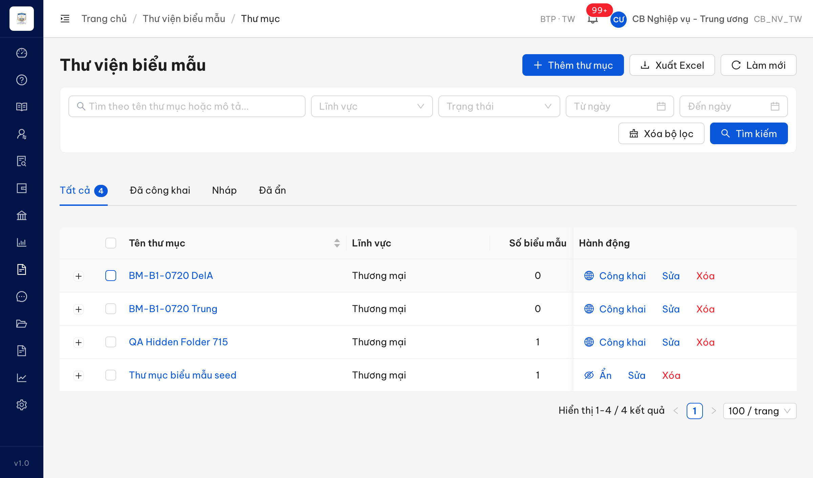
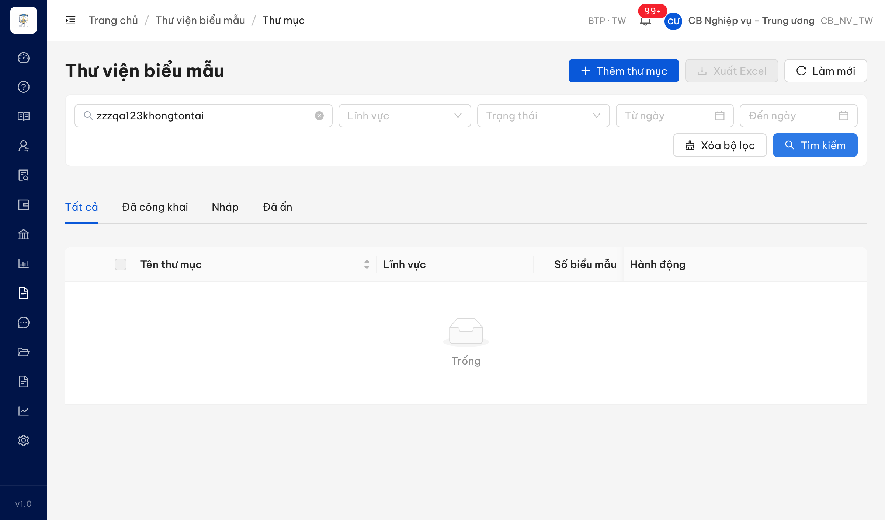
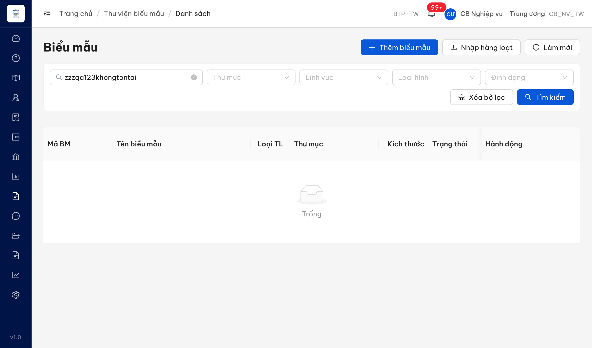

# Bug Report — Biểu mẫu (Batch 2: Tìm kiếm thư mục & biểu mẫu — TKTMBMHD + TKBMHD)

| Thông tin | Giá trị |
|-----------|---------|
| **Dự án** | PM HTPLDN — UAT đối tác tuần 3 |
| **Môi trường** | https://18.143.165.120.nip.io |
| **Người test** | QA (Chrome DevTools MCP) |
| **Ngày** | 2026-07-22 23:15:44 |
| **Loại test** | Functional (verify bug đối tác — vòng 1) |
| **Round** | Reverify week-3 · Batch 2 |
| **Tài liệu tham chiếu** | `srs-v3.5/srs-fr-09-bieu-mau.md` (FR-VII-02/UC93, FR-VII-05/UC96, SCR-VII-01/02, BR-DATA-07) |

---

## Tổng hợp

Verify 6 case Batch 2 (TKTMBMHD_02/04/06/07 + TKBMHD_03/04); log 3 bug Minor.

> **R1 reverify 2026-07-22:** 3/3 bug dev fix đã ✅ PASS (Closed), Open còn 0. Phân trang màn Thư mục mặc định về **"20 / trang"**; tìm 0 kết quả ở Thư mục & Danh sách biểu mẫu hiển thị đúng **"Không tìm thấy thư mục/biểu mẫu phù hợp"** thay cho "Trống".

### Severity breakdown

| Tổng | Critical | Major | Medium | Minor | Trivial | Closed | Open |
|------|----------|-------|--------|-------|---------|--------|------|
| 3    | 0        | 0     | 0      | 3     | 0       | 3      | 0    |

## Bug Summary Table

| Bug ID | Severity | Priority | Type | TC Ref | **SRS Reference** | Title | Status |
|--------|----------|----------|------|--------|-------------------|-------|--------|
| ~~BUG-TKBMHD_04~~ | Minor | P2 | UI/UX | TKBMHD_04 | `FR-VII-05 §Error Handling E1 (srs-fr-09:435) INF-BM-TK-01` | Tìm biểu mẫu 0 kết quả hiện "Trống" thay vì "Không tìm thấy biểu mẫu phù hợp" | Closed |
| ~~BUG-TKTMBMHD_06~~ | Minor | P2 | UI/UX | TKTMBMHD_06 | `FR-VII-02 §Error Handling E2 (srs-fr-09:199) INF-TM-TK-01` | Tìm thư mục 0 kết quả hiện "Trống" thay vì "Không tìm thấy thư mục phù hợp" | Closed |
| ~~BUG-TKTMBMHD_02~~ | Minor | P2 | UI/UX | TKTMBMHD_02 | `BR-DATA-07 (srs-fr-09:917)` · `SCR-VII-01 (srs-fr-09:623)` | Phân trang màn Tìm kiếm thư mục mặc định 100 mục/trang thay vì 20 | Closed |

---

## ~~BUG-TKTMBMHD_02~~ [CLOSED] — Phân trang danh sách thư mục mặc định 100 mục/trang (SRS quy định 20)

> **Re-test:** 2026-07-22 23:15:44 — ✅ PASS (Closed). Mở fresh màn Thư viện biểu mẫu → Thư mục (`/bieu-mau/thu-muc`), role CB_NV_TW, chưa thao tác gì: bộ chọn kích thước trang mặc định nay = **"20 / trang"** (đúng BR-DATA-07 / SCR-VII-01), không còn "100 / trang". Sắp xếp Ngày tạo giảm dần vẫn đúng.

### Mô tả

Màn "Thư viện biểu mẫu → Thư mục" (tìm kiếm thư mục, SCR-VII-01) khi tải danh sách kết quả để bộ chọn kích thước trang **mặc định = "100 / trang"**. Theo SRS, danh sách phân trang mặc định phải là **20 mục/trang** (tối đa 100). Phần **sắp xếp theo Ngày tạo giảm dần** hệ thống làm ĐÚNG — không phải lỗi.

### Các bước tái hiện

1. Đăng nhập role **CB Nghiệp vụ - Trung ương** (`CB_NV_TW`, quyền xem Thư viện biểu mẫu theo SCR-VII-01).
2. Vào menu **Biểu mẫu → Thư viện biểu mẫu** (`/bieu-mau/thu-muc`).
3. Quan sát bộ chọn kích thước trang ở góc dưới phải bảng kết quả.
4. Quan sát: dropdown hiển thị **"100 / trang"** (mặc định), "Hiển thị 1-4 / 4 kết quả".

### Kết quả mong đợi

- Theo **BR-DATA-07** (`srs-fr-09:917`): "Mọi danh sách sử dụng phân trang. Default: **20 rows/page**, max: 100 rows/page".
- Theo **SCR-VII-01 §Quy tắc tương tác** (`srs-fr-09:623`): "Phân trang **20 mục/trang**".
- ⇒ Kích thước trang mặc định phải là **20 / trang**.

### Kết quả thực tế

- Bộ chọn kích thước trang mặc định = **"100 / trang"** ngay khi tải màn (chưa thao tác gì).
- Sắp xếp Ngày tạo: 20/07/2026 → 20/07/2026 → 15/07/2026 → 30/06/2026 = **giảm dần** (đúng SRS).

### Bằng chứng

**1. Ảnh chụp** (env test, role CB_NV_TW):

Đối chiếu evidence đối tác (env ospgroup.vn) cùng hiện tượng "100 / trang": `../../partner-evidence/TKTMBMHD_02.jpg`.

---

## ~~BUG-TKTMBMHD_06~~ [CLOSED] — Tìm kiếm thư mục 0 kết quả hiển thị "Trống" thay vì thông báo SRS quy định

> **Re-test:** 2026-07-22 23:15:44 — ✅ PASS (Closed). Màn Thư viện biểu mẫu → Thư mục, role CB_NV_TW, tìm từ khóa `zzzqa123khongtontai` (0 kết quả): vùng danh sách nay hiển thị **"Không tìm thấy thư mục phù hợp"** (đúng FR-VII-02 §E2 / INF-TM-TK-01), không còn "Trống".

### Mô tả

Màn "Thư viện biểu mẫu → Thư mục" (tìm kiếm thư mục): khi nhập từ khóa không khớp bản ghi nào (0 kết quả), vùng danh sách hiển thị thông báo rỗng mặc định của thư viện UI = **"Trống"**, thay vì thông báo mà SRS quy định cho trường hợp không có kết quả.

### Các bước tái hiện

1. Đăng nhập role **CB Nghiệp vụ - Trung ương** (`CB_NV_TW`, quyền xem Thư viện biểu mẫu theo SCR-VII-01).
2. Vào **Biểu mẫu → Thư viện biểu mẫu** (`/bieu-mau/thu-muc`).
3. Nhập từ khóa chắc chắn 0 kết quả (vd `zzzqa123khongtontai`) → bấm **Tìm kiếm**.
4. Quan sát: vùng danh sách hiển thị icon rỗng + chữ **"Trống"**.

### Kết quả mong đợi

- Theo **FR-VII-02 §Error Handling E2** (`srs-fr-09:199`, mã `INF-TM-TK-01`): khi không có kết quả, hệ thống hiển thị thông báo **"Không tìm thấy thư mục phù hợp"**.

### Kết quả thực tế

- Vùng danh sách hiển thị **"Trống"** (empty description mặc định của AntD), 0 dòng.
- URL: `/bieu-mau/thu-muc?keyword=zzzqa123khongtontai&page=1`.

### Bằng chứng

---

## ~~BUG-TKBMHD_04~~ [CLOSED] — Tìm kiếm biểu mẫu 0 kết quả hiển thị "Trống" thay vì thông báo SRS quy định

> **Re-test:** 2026-07-22 23:15:44 — ✅ PASS (Closed). Màn Biểu mẫu → Danh sách biểu mẫu (`/bieu-mau/danh-sach`), role CB_NV_TW, tìm từ khóa `zzzqa123khongtontai` (0 kết quả, 0 dòng bảng): vùng danh sách nay hiển thị **"Không tìm thấy biểu mẫu phù hợp"** (đúng FR-VII-05 §E1 / INF-BM-TK-01), không còn "Trống".

### Mô tả

Màn "Biểu mẫu → Danh sách biểu mẫu" (tìm kiếm biểu mẫu, SCR-VII-02): khi nhập từ khóa không khớp bản ghi nào (0 kết quả), vùng danh sách hiển thị thông báo rỗng mặc định = **"Trống"**, thay vì thông báo SRS quy định cho trường hợp không có kết quả.

### Các bước tái hiện

1. Đăng nhập role **CB Nghiệp vụ - Trung ương** (`CB_NV_TW`, quyền xem Danh sách biểu mẫu theo SCR-VII-02).
2. Vào **Biểu mẫu → Danh sách biểu mẫu** (`/bieu-mau/danh-sach`).
3. Nhập từ khóa chắc chắn 0 kết quả (vd `zzzqa123khongtontai`) → Tìm kiếm.
4. Quan sát: vùng danh sách hiển thị icon rỗng + chữ **"Trống"**.

### Kết quả mong đợi

- Theo **FR-VII-05 §Error Handling E1** (`srs-fr-09:435`, mã `INF-BM-TK-01`): khi không có kết quả, hệ thống hiển thị thông báo **"Không tìm thấy biểu mẫu phù hợp"**.

### Kết quả thực tế

- Vùng danh sách hiển thị **"Trống"** (empty description mặc định AntD), 0 dòng.
- URL: `/bieu-mau/danh-sach?keyword=zzzqa123khongtontai`.

### Bằng chứng

---

## Phụ lục — Môi trường test

| Thành phần | Giá trị |
|------------|---------|
| URL ứng dụng | https://18.143.165.120.nip.io |
| OTP login | MailHog `http://18.143.165.120:8025` |
| Tool test | Chrome DevTools MCP |
| Tài khoản | `cbnv_tw` / Test@1234 (CB_NV_TW) |

---

*Bug report generated: 2026-07-20 19:45:58 | QA via Claude Code*
