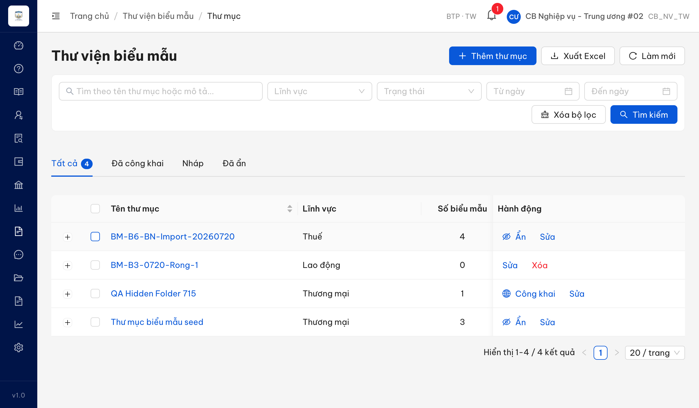
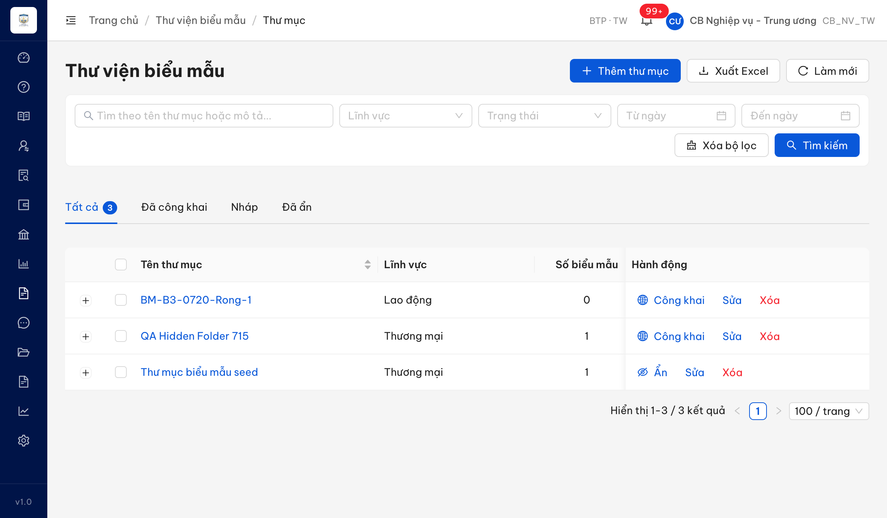

# Bug Report — Biểu mẫu (Batch 3 · CKTMBMHDLCTT — Công khai/Ẩn thư mục hàng loạt)

| Thông tin | Giá trị |
|-----------|---------|
| **Dự án** | PM HTPLDN — Verify bug đối tác (UAT tuần 3) |
| **Môi trường** | https://18.143.165.120.nip.io/ |
| **Người test** | QA Automation (Claude Code) |
| **Ngày** | 2026-07-22 23:19:54 |
| **Loại test** | Functional (verify bug đối tác vòng 1) |
| **Round** | Reverify week-3 — Batch 3 |
| **Tài liệu tham chiếu** | `srs-v3.5/srs-fr-09-bieu-mau.md` (FR-VII-03 / UC94 / SCR-VII-01) |

---

## Tổng hợp

Verify 5 case đối tác Batch 3 (CKTMBMHDLCTT, rows 92–96, màn Công khai/Ẩn thư mục hàng loạt).

> **Re-test 2026-07-22 R1 (reverify tuần 3, cbnv_tw_02):** BUG-CKTMBMHDLCTT_02 → ✅ **PASS / Closed**. Nút "Công khai" đã ẩn trên thư mục rỗng (chỉ còn [Sửa][Xóa]); BE chặn cả luồng bulk (toast "Công khai 0/1 thư mục, 1 thất bại", thư mục giữ Nháp). Batch 3: **Open 0 / Closed 1** + 4 case BA confirm (không đổi).

**Kết quả 5 case (verify gốc 2026-07-20, tài khoản cbnv_tw / CB_NV_TW):**

| Row | Mã TC | Verdict | Nơi lưu |
|---|---|---|---|
| 92 | CKTMBMHDLCTT_02 | **Closed** ✅ (đã fix) | file này (BUG-CKTMBMHDLCTT_02) |
| 93 | CKTMBMHDLCTT_07 | BA confirm | `../../ba-confirm/bieu-mau/ba-confirmation-needed-week-3-bieu-mau-batch3.md` |
| 94 | CKTMBMHDLCTT_08 | BA confirm | `../../ba-confirm/bieu-mau/ba-confirmation-needed-week-3-bieu-mau-batch3.md` |
| 95 | CKTMBMHDLCTT_10 | BA confirm | `../../ba-confirm/bieu-mau/ba-confirmation-needed-week-3-bieu-mau-batch3.md` |
| 96 | CKTMBMHDLCTT_11 | BA confirm | `../../ba-confirm/bieu-mau/ba-confirmation-needed-week-3-bieu-mau-batch3.md` |

> **Chỉ 1 bug Open** trong batch này (case 92). Case 93/95/96 (selection không xóa sau bulk + wording "X/Y thất bại") **tái hiện đúng** nhưng SRS **im lặng** (SCR-VII-01 #14 chỉ định điều kiện hiển thị bar bulk "khi chọn nhiều", KHÔNG quy định deselect sau thao tác; FR-VII-03 Error Handling không có message bulk partial) → chuyển **BA confirm**, không log Open để tránh quote sai SRS. Cụm selection (93/95) cùng gốc **BUG-QLTMBMHD_19** (Batch 1, bulk delete) — đề nghị BA ra 1 quyết định chung cho cả 3 thao tác bulk (chi tiết trong file BA confirm).
>
> Case 92 (nút Công khai sai điều kiện "có BM") là sibling của **BUG-QLTMBMHD_13** (Batch 1, nút Xóa sai điều kiện) — cùng SCR-VII-01 #13 (`srs-fr-09:615`).

### Severity breakdown

| Tổng | Critical | Major | Medium | Minor | Trivial | Closed | Open |
|------|----------|-------|--------|-------|---------|--------|------|
| 1    | 0        | 0     | 1      | 0     | 0       | 1      | 0    |

## Bug Summary Table

| Bug ID | Severity | Priority | Type | TC Ref | **SRS Reference** | Title | Status |
|--------|----------|----------|------|--------|-------------------|-------|--------|
| ~~BUG-CKTMBMHDLCTT_02~~ | Medium | P2 | UI/UX | CKTMBMHDLCTT_02 | `SCR-VII-01 #13` (`srs-fr-09:615`) | Nút "Công khai" hiển thị trên thư mục rỗng (0 biểu mẫu) — sai điều kiện "có BM" | Closed |

---

## ~~BUG-CKTMBMHDLCTT_02~~ [CLOSED] — Nút "Công khai" hiển thị trên thư mục rỗng (0 biểu mẫu), sai điều kiện SCR-VII-01

> **Re-test:** 2026-07-22 23:19:54 R1 — ✅ PASS (Closed-verified, cbnv_tw_02). Nút "Công khai" KHÔNG còn hiển thị trên thư mục rỗng "BM-B3-0720-Rong-1" (Nháp, 0 BM) — cột Hành động chỉ còn [Sửa][Xóa], khớp SRS #13. BE cũng chặn công khai thư mục rỗng qua luồng bulk (toast "Công khai 0/1 thư mục, 1 thất bại", thư mục giữ trạng thái Nháp). Bằng chứng: `image/BUG-CKTMBMHDLCTT_02-reverify.png`.

### Mô tả

Trên màn Thư viện biểu mẫu (Quản lý thư mục), nút hành động **Công khai** hiển thị trên thư mục ở trạng thái Nháp **dù thư mục không có biểu mẫu nào (Số biểu mẫu = 0)**. Theo SRS SCR-VII-01, nút Công khai chỉ được hiển thị khi thư mục ở trạng thái Nháp/Ẩn VÀ có ≥1 biểu mẫu. Thư mục rỗng không đủ điều kiện công khai (FR-VII-03 Preconditions: "Thư mục tồn tại, không rỗng").

### Các bước tái hiện

1. Đăng nhập role **CB Nghiệp vụ - Trung ương** (`cbnv_tw`, quyền "Công khai biểu mẫu" theo SCR-VII-01, đơn vị BTP·TW).
2. Vào **Biểu mẫu → Thư viện biểu mẫu** (`/bieu-mau/thu-muc`), tab **Tất cả**.
3. Tạo/chọn một thư mục rỗng ở trạng thái Nháp (vd "BM-B3-0720-Rong-1", Lĩnh vực Lao động, Số biểu mẫu = 0).
4. Quan sát cột **Hành động** trên hàng thư mục rỗng đó.

### Kết quả mong đợi

- Theo SRS `srs-fr-09-bieu-mau.md:615` (SCR-VII-01 #13 — "Công khai (khi NHAP/AN, **có BM**) / ..."): nút Công khai chỉ hiển thị khi thư mục ở Nháp/Ẩn VÀ có ≥1 biểu mẫu.
- Theo `srs-fr-09-bieu-mau.md:220` (FR-VII-03 Preconditions): "Thư mục tồn tại, không rỗng (có >= 1 biểu mẫu)".
- Trên thư mục rỗng (0 biểu mẫu) → nút Công khai không được hiển thị.

### Kết quả thực tế

- Nút **Công khai** hiển thị trên hàng "BM-B3-0720-Rong-1" (Nháp, Số biểu mẫu = 0) — vi phạm điều kiện "có BM".
- Đối chứng: hàng "QA Hidden Folder 715" (Nháp, 1 biểu mẫu) hiển thị Công khai (đúng); hàng "Thư mục biểu mẫu seed" (Đã công khai) hiển thị Ẩn (đúng).

### Bằng chứng

**Re-test 2026-07-22 (đã fix) — thư mục rỗng chỉ còn [Sửa][Xóa], không còn "Công khai":**



```json
// Re-test 2026-07-22 — DOM action buttons theo từng hàng (BE bulk publish thư mục rỗng: "Công khai 0/1 thư mục, 1 thất bại")
[{"name":"BM-B3-0720-Rong-1","soBieuMau":"0","trangThai":"Nháp","actionButtons":["Sửa","Xóa"]},
 {"name":"QA Hidden Folder 715","soBieuMau":"1","trangThai":"Đã ẩn","actionButtons":["Công khai","Sửa"]},
 {"name":"Thư mục biểu mẫu seed","soBieuMau":"3","trangThai":"Đã công khai","actionButtons":["Ẩn","Sửa"]}]
```

**Ảnh bug gốc 2026-07-20 (trước fix — thư mục rỗng vẫn có "Công khai"):**



```json
// Bug gốc 2026-07-20 — thư mục rỗng có "Công khai" (sai)
[{"name":"BM-B3-0720-Rong-1","soBieuMau":"0","trangThai":"Nháp","actionButtons":["Công khai","Sửa","Xóa"]},
 {"name":"QA Hidden Folder 715","soBieuMau":"1","trangThai":"Nháp","actionButtons":["Công khai","Sửa","Xóa"]},
 {"name":"Thư mục biểu mẫu seed","soBieuMau":"1","trangThai":"Đã công khai","actionButtons":["Ẩn","Sửa","Xóa"]}]
```

---

## Phụ lục — Môi trường test

| Thành phần | Giá trị |
|------------|---------|
| URL ứng dụng | https://18.143.165.120.nip.io/ |
| OTP login | MailHog (http://18.143.165.120:8025/) |
| API base | `/api/v1/` |
| Frontend | React + Ant Design |
| Xác thực | JWT + OTP (token TTL ngắn ~90s) |
| Tool test | Chrome DevTools MCP |

---

*Bug report generated: 2026-07-20 | Re-test: 2026-07-22 | QA Automation via Claude Code*
