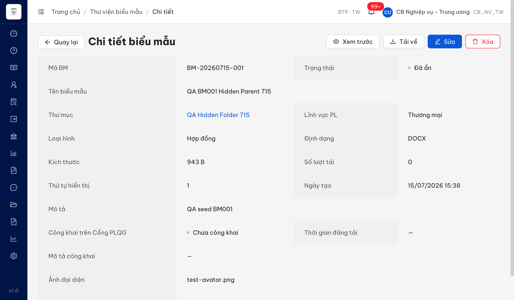
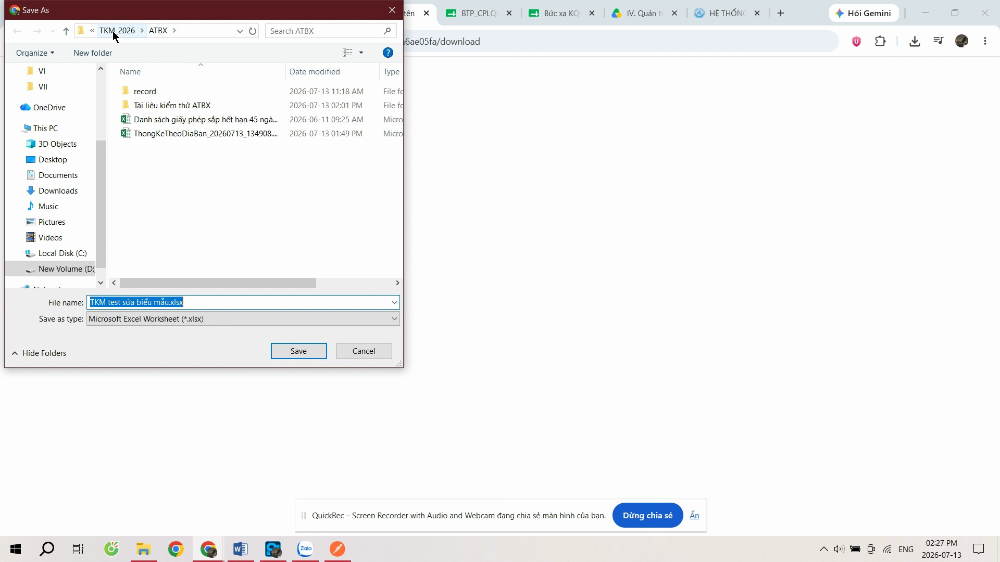
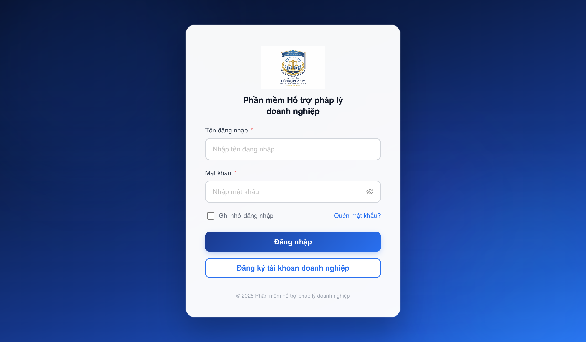
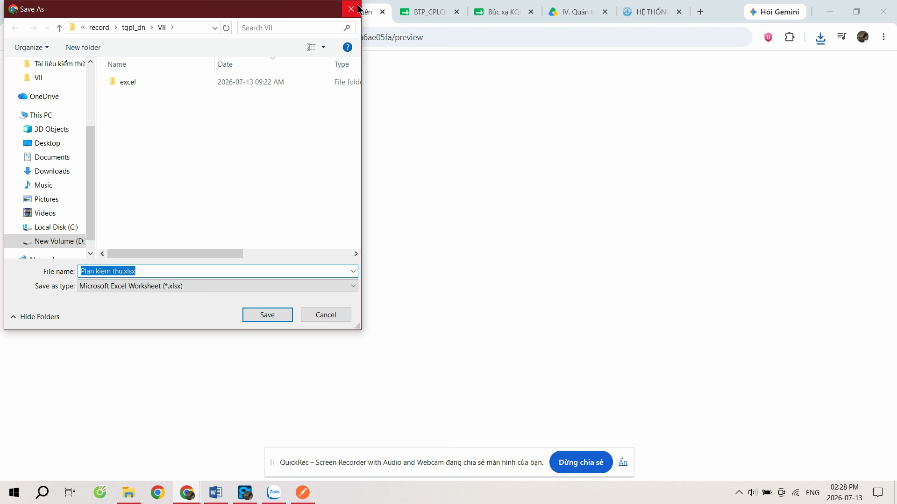

# Bug Report — Biểu mẫu (Batch 5: QLBMHD Sửa/Xem/Xem trước/Tải về)

| Thông tin | Giá trị |
|-----------|---------|
| **Dự án** | PM HTPLDN — UAT đối tác (reverify tuần 3) |
| **Môi trường** | https://18.143.165.120.nip.io |
| **Người test** | QA Automation via Claude Code |
| **Ngày** | 2026-07-23 09:45:52 |
| **Loại test** | Functional / UAT reverify |
| **Round** | Reverify tuần 3 — Batch 5 (rows 105–112) |
| **Tài liệu tham chiếu** | `Docs-PM-HTPLDN/_bmad-output/planning-artifacts/srs-v3.5/srs-fr-09-bieu-mau.md` (FR-VII-04 / UC95 / SCR-VII-02) |

---

## Tổng hợp

Phát hiện **2** lỗi có SRS reference cụ thể khi verify Batch 5 (phần Xem trước + Tải về của Quản lý biểu mẫu).

### Severity breakdown

| Tổng | Critical | Major | Medium | Minor | Trivial | Closed | Open |
|------|----------|-------|--------|-------|---------|--------|------|
| 2    | 0        | 1     | 1      | 0     | 0       | 2      | 0    |

## Bug Summary Table

| Bug ID | Severity | Priority | Type | TC Ref | **SRS Reference** | Title | Status |
|--------|----------|----------|------|--------|-------------------|-------|--------|
| BUG-BM-B5-01 | Medium | P2 | Data | QLBMHD_16 | `FR-VII-04 §Processing Tải về Bước 3` (srs-fr-09-bieu-mau.md:335) + Outputs #5 `file_ten` (:356) | Tải về không giữ nguyên tên file gốc — hệ thống ép tên = tên biểu mẫu | Closed |
| BUG-BM-B5-02 | Major | P1 | UI/UX | QLBMHD_17, QLBMHD_18, QLBMHD_19 | `FR-VII-04 §Processing Xem trực tuyến Bước 2–4` (srs-fr-09-bieu-mau.md:320–327) | "Xem trước" mở file thô (trình duyệt tải về) thay vì xem trước trực tuyến (DOCX→PDF, XLSX→bảng read-only) | Closed |

---

## ~~BUG-BM-B5-01~~ [CLOSED] — Tải về biểu mẫu không giữ nguyên tên file gốc (đặt tên theo tên biểu mẫu)

> **Re-test:** 2026-07-23 09:45 Reverify-tuần3 (`cbnv_tw`) — ✅ PASS (Closed-verified) trên DỮ LIỆU MỚI. Tạo biểu mẫu mới BM-20260723-001 upload file gốc `GOCFILE-abc123-QLBMHD16.xlsx` (khác tên biểu mẫu) → bấm Tải về: `/download` 302, `content-disposition` = `GOCFILE-abc123-QLBMHD16.xlsx` = ĐÚNG TÊN FILE GỐC (SRS :335). Fix: luồng upload nay lưu đúng tên gốc vào trường `tenFile`. Reopen 22/07 test nhầm record CŨ (tenFile lỗi từ trước fix). Caveat: record cũ pre-fix vẫn tải ra tên biểu mẫu — cần dev migrate `tenFile`. Bằng chứng: `../../reverify-audit/QLBMHD_16/reverify-newdata-2026-07-23.md` + `image/QLBMHD_16-reverify-0723-newdata-detail.png`.

### Mô tả

CB Nghiệp vụ bấm nút "Tải về" một biểu mẫu ở màn Chi tiết. Theo SRS, file tải xuống phải giữ nguyên **tên file gốc** đã upload. Thực tế hệ thống ép tên file tải về thành **tên biểu mẫu**, không phải tên file gốc.

### Các bước tái hiện

1. Đăng nhập role **CB Nghiệp vụ - Trung ương** (`cbnv_tw`, có quyền Xem/Tải biểu mẫu theo SCR-VII-02).
2. Mở màn Chi tiết biểu mẫu **BM-20260715-001** ("QA BM001 Hidden Parent 715"), có file gốc là `valid.docx` (trường `duongDanFile` lưu `.../../valid.docx`).
3. Bấm nút **Tải về**. FE gọi `window.open('/api/v1/bieu-maus/28104008-7b0d-4783-9825-a188ad11a289/download', '_blank')`.
4. Quan sát header `location` (302) của endpoint `/download` — phần `response-content-disposition`.

### Kết quả mong đợi

- Theo SRS `srs-fr-09-bieu-mau.md:335` (Processing Tải về, Bước 3): "Truyền file gốc về máy người dùng (giữ nguyên tên file gốc)". Tên file tải xuống phải là tên file gốc (`valid.docx`).
- Hệ thống có sẵn tên file gốc để dùng: Outputs #5 `file_ten` = "Tên file gốc" (`:356`).

### Kết quả thực tế

- `GET /api/v1/bieu-maus/28104008-.../../download` → **302**, `location` trỏ tới object gốc `.../../valid.docx` nhưng kèm tham số ép tên tải về:
  `response-content-disposition=attachment; filename*=UTF-8''QA%20BM001%20Hidden%20Parent%20715.docx`
- → Tên file tải xuống = **"QA BM001 Hidden Parent 715.docx"** = **tên biểu mẫu** (`tenBieuMau`), KHÔNG phải tên file gốc `valid.docx`.

### Bằng chứng





**Network (get_network_request reqid=937) — `location` header của `/download`:**

```
http://18.143.165.120:9000/htpldn/.../../valid.docx?response-content-disposition=attachment%3B%20filename%2A%3DUTF-8%27%27QA%2520BM001%2520Hidden%2520Parent%2520715.docx&X-Amz-Algorithm=...
```
Giải mã `response-content-disposition` = `attachment; filename*=UTF-8''QA BM001 Hidden Parent 715.docx`.
Object gốc trên storage: `valid.docx`. Chi tiết: `../../reverify-audit/QLBMHD_16/network-evidence-download-filename.md`.

---

## ~~BUG-BM-B5-02~~ [CLOSED] — "Xem trước" mở file thô để tải thay vì xem trước trực tuyến (DOCX→PDF, XLSX→bảng read-only)

> **Re-test:** 2026-07-22 23:23:59 Reverify-tuần3 (`cbnv_tw_04`) — ✅ PASS (Closed-verified). Bấm "Xem trước" nay mở modal xem trước IN-APP, KHÔNG còn `window.open`/file thô/hộp thoại tải. DOCX (BM-20260715-001) render nội dung tài liệu trong modal; XLSX (BM-B6-valid-2) render bảng read-only (sheet + cột + ô). FE gọi endpoint mới `GET /api/v1/bieu-maus/<id>/preview-content` → 200, `content-disposition: inline`. Bằng chứng: `image/QLBMHD_17-18-reverify-docx-preview-modal.png` + `image/QLBMHD_19-reverify-xlsx-preview-table.png`.

### Mô tả

CB Nghiệp vụ bấm nút "Xem trước" một biểu mẫu (DOCX hoặc XLSX) ở màn Chi tiết. Theo SRS, hệ thống phải xem trước trực tuyến: DOC/DOCX chuyển đổi sang PDF preview, XLS/XLSX hiển thị bảng read-only. Thực tế hệ thống mở thẳng file thô khiến trình duyệt hiện hộp thoại tải về — không có khung xem trước. (Gộp 3 phản ánh QLBMHD_17 generic / QLBMHD_18 DOCX / QLBMHD_19 XLSX — cùng một gốc lỗi.)

### Các bước tái hiện

1. Đăng nhập role **CB Nghiệp vụ - Trung ương** (`cbnv_tw`, có quyền Xem trước biểu mẫu theo SCR-VII-02).
2. Mở màn Chi tiết một biểu mẫu **DOCX** (BM-20260715-001) và một biểu mẫu **XLSX** (BM-B6-valid-2, id `ad4258c3-...`).
3. Bấm nút **Xem trước**. FE gọi `window.open('/api/v1/bieu-maus/<id>/preview', '_blank')` (không render khung xem trước in-app: không `ant-modal`/`iframe`/PDF viewer).
4. Quan sát endpoint `/preview` và tab mới.

### Kết quả mong đợi

- Theo SRS `srs-fr-09-bieu-mau.md:320–327` (Processing Xem trực tuyến):
  - `:325` Bước 2: doc/docx → chuyển đổi sang **PDF preview**.
  - `:326` Bước 3: xls/xlsx → hiển thị **preview dạng bảng (read-only)**.
  - `:327` Bước 4: nếu không hỗ trợ preview → **thông báo + chuyển sang tải về**.
- Khi bấm "Xem trước", hệ thống phải cho người dùng xem nội dung trực tuyến (không phải tải file thô về máy).

### Kết quả thực tế

- `GET /api/v1/bieu-maus/<id>/preview` → **302**, redirect thẳng tới **file thô** phục vụ `inline`, KHÔNG convert:
  - DOCX (reqid=1005): `location` = `http://18.143.165.120:9000/.../../valid.docx?response-content-disposition=inline&...` (file .docx thô, không PDF).
  - XLSX (reqid=1008): `location` = `http://18.143.165.120:9000/.../../BM-B6-valid-2.xlsx?response-content-disposition=inline&...` (file .xlsx thô, không bảng read-only).
- Trình duyệt không hiển thị inline được file Office → hiện hộp thoại tải về. FE không có khung xem trước. Không có "thông báo" theo Bước 4.

### Bằng chứng





**Network (get_network_request reqid=1005 DOCX, reqid=1008 XLSX) — `location` header của `/preview`:**

```
DOCX: http://18.143.165.120:9000/.../../valid.docx?response-content-disposition=inline&X-Amz-...
XLSX: http://18.143.165.120:9000/.../../BM-B6-valid-2.xlsx?response-content-disposition=inline&X-Amz-...
```
Cả hai trỏ tới file gốc thô (`inline`), không có bước convert. Chi tiết: `../../reverify-audit/QLBMHD_17/network-evidence-preview.md`.

---

## Phụ lục — Môi trường test

| Thành phần | Giá trị |
|------------|---------|
| URL ứng dụng | https://18.143.165.120.nip.io |
| OTP login | MailHog `http://18.143.165.120:8025` |
| API base | `https://18.143.165.120.nip.io/api/v1` |
| Object storage | MinIO `http://18.143.165.120:9000` (presigned URL) |
| Frontend | React + Ant Design |
| Xác thực | JWT (cookie `access_token`) + OTP |
| Tool test | Chrome DevTools MCP |

---

*Bug report generated: 2026-07-20 23:05:00 | QA Automation via Claude Code*
