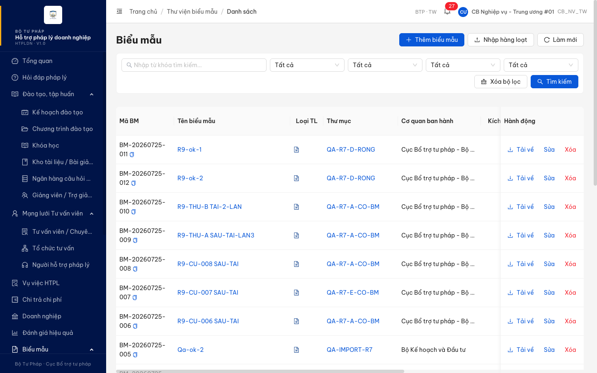
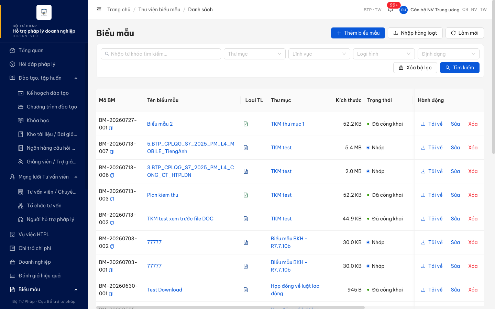

# QLBMHD_02 — Verify 2 môi trường (2026-07-28)

**Case:** Màn "Danh sách biểu mẫu" (SCR-VII-02) — kiểm tra hiển thị các trường thông tin.
**Đối tác Reopent 27/7:** *"Thiếu cột 'Cơ quan ban hành'"*.
**Tài khoản dùng:** dev = `cbnv_tw_01` (fallback Rule 7 — `cbnv_tw` bị `ERR-AUTH-LOCKED-01`), UAT = `cbnv_tw`. Cùng vai trò CB_NV_TW, cùng đơn vị Cục Bổ trợ tư pháp.

## Kết luận

| Môi trường | Cột "Cơ quan ban hành" | Kết quả |
|---|---|---|
| Dev — `18.143.165.120.nip.io` | **CÓ** (cột thứ 5, có dữ liệu "Cục Bổ trợ tư pháp - Bộ Tư pháp" / "Bộ Kế hoạch và Đầu tư") | ✅ PASS |
| UAT — `htpldn-uat.ospgroup.vn` | **KHÔNG có** | ❌ FAIL — đối tác báo đúng |

Cột theo đặc tả: `srs-v3.5/srs-fr-09-bieu-mau.md:671` — `| 20 | content | Cột Cơ quan ban hành | table-column | Tên đơn vị ban hành (don_vi_id → DON_VI) | — | luôn hiển thị [STT12] |`.

Cột bảng thực tế:
- Dev (12 cột): Mã BM · Tên biểu mẫu · Loại TL · Thư mục · **Cơ quan ban hành** · Kích thước · Trạng thái · Đã công khai · Ảnh đại diện · Ngày tạo · Sync Cổng · Hành động
- UAT (11 cột): giống hệt nhưng **thiếu Cơ quan ban hành**

> Ý "thiếu cột Định dạng" trong Kết quả thực tế gốc KHÔNG có căn cứ đặc tả: SCR-VII-02 chỉ quy định *bộ lọc* Định dạng (dòng 650) và cột "Loại tài liệu" (dòng 653), không có cột Định dạng. Phần Reopen hợp lệ chỉ còn cột Cơ quan ban hành.

## Nguyên nhân UAT không pass

Không phải lỗi dữ liệu hay phân quyền — **hai môi trường chạy 2 bản build khác nhau, bản trên UAT chưa có phần fix này** (cả BE lẫn FE).

| Bằng chứng | Dev | UAT |
|---|---|---|
| `GET /api/v1/bieu-maus` trả field `coQuanBanHanh` | Có — giá trị `"Cục Bổ trợ tư pháp - Bộ Tư pháp"` | **Không có field** |
| Swagger `BieuMauEntity` chứa `coQuanBanHanh` | Có | **Không** (30 field, thiếu đúng field này) |
| Bundle FE chứa chuỗi "Cơ quan ban hành" | `bieu-mau-columns-CyLCWbKi.js` | **Không bundle nào** trong 43 file JS |

UAT **không phải bản cũ hơn toàn cục** — nó có nhiều endpoint hơn dev (568 vs 532 path), gồm cụm LGSP `/api/v1/ho-so-lgsp` + menu "Đồng bộ LGSP" mà dev không có. Tức 2 env đang ở 2 nhánh khác nhau, phần fix cột Cơ quan ban hành nằm ở nhánh dev, chưa có ở nhánh đang deploy lên UAT.

Riêng trên UAT, `coQuanBanHanh` CÓ tồn tại nhưng chỉ ở nhóm endpoint chuyên trang công khai — `/api/v1/public/bieu-maus`, `/api/v1/public/bieu-maus/search`, `/api/v1/bieu-mau`, `/api/v1/bieu-mau/search` — KHÔNG có ở `/api/v1/bieu-maus` (endpoint màn quản lý dùng). Nên kể cả khi FE UAT được cập nhật, vẫn cần BE bổ sung field cho endpoint danh sách quản lý.

## Việc cần làm

1. **Deploy** nhánh chứa fix cột Cơ quan ban hành lên UAT (cả BE `BieuMauEntity` + FE `bieu-mau-columns`).
2. Sau deploy, re-verify lại trên chính UAT — hiện tại verify trên dev là PASS nhưng đối tác chỉ nhìn UAT nên vẫn Reopen.

## Bằng chứng

