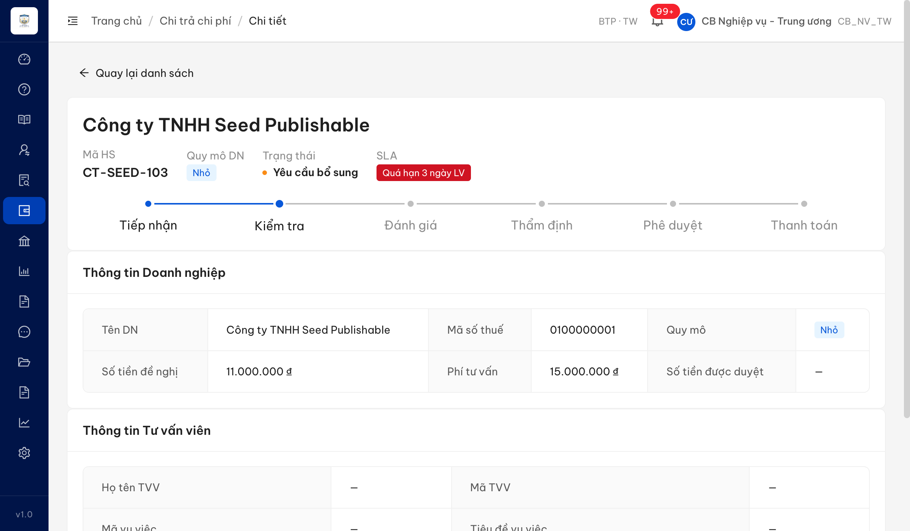
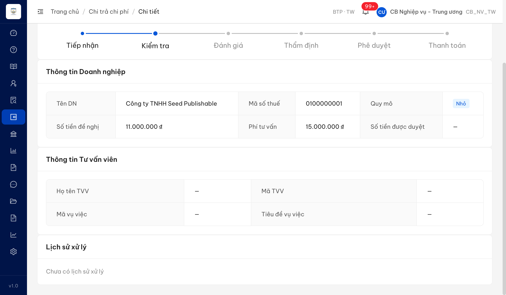
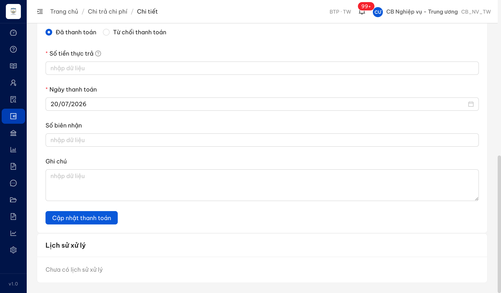

# Bug Report — UAT đối tác tuần 3 (Chi trả chi phí)

| Thông tin | Giá trị |
|-----------|---------|
| **Dự án** | PM HTPLDN |
| **Môi trường** | https://18.143.165.120.nip.io |
| **Người test** | QA Automation (Claude Code) |
| **Ngày** | 2026-07-22 17:36:00 |
| **Loại test** | Verify bug đối tác — vòng đầu (module Chi trả chi phí) |
| **Round** | Reverify tuần 3 |
| **Tài liệu tham chiếu** | [QA_VERIFY_PROTOCOL.md](../../../QA_VERIFY_PROTOCOL.md) · SRS v3.5 `srs-fr-06-chi-tra.md` · Sheet tab `UAT_TGPL Doanh Nghiệp-tuần 3` |

---

## Tổng hợp

> **Round hiện tại (LATEST):** Reverify tuần 3 (Dev báo "dev done" → QA re-verify qua Chrome DevTools MCP, tài khoản `cbnv_tw_01`). Module **Chi trả chi phí**, 3 bug: QLHSDNHTCP_11/12/13. Kết quả: **3 Closed / 0 Open — toàn bộ PASS**. ✅ _11 (Thông tin DN đủ 6 trường + dữ liệu thật), ✅ _12 (Thông tin TVV đủ 5 trường + surface hợp đồng/đề nghị/phí), ✅ _13 (section Thông tin phê duyệt hiện đủ + populate data trên CT-SEED-107 Đã duyệt). Các case BA confirm (_03/_09/_10) ở [`../../ba-confirm/chi-tra/ba-confirmation-needed-chi-tra.md`](../../ba-confirm/chi-tra/ba-confirmation-needed-chi-tra.md); case Reject (_04) không log bug.

### Severity breakdown

| Tổng | Critical | Major | Medium | Minor | Trivial | Closed | Open |
|------|----------|-------|--------|-------|---------|--------|------|
| 3    | 0        | 3     | 0      | 0     | 0       | 3      | 0    |

## Bug Summary Table

| Bug ID | Severity | Priority | Type | TC Ref | **SRS Reference** | Title | Status |
|--------|----------|----------|------|--------|-------------------|-------|--------|
| ~~BUG-QLHSDNHTCP_13~~ | Major | P2 | UI/Data | QLHSDNHTCP_13 | `SCR-V.II-02 §Thành phần màn hình row 35 — section-8 Thông tin phê duyệt & Lịch sử` (`srs-fr-06-chi-tra.md:1011`) | Màn Chi tiết hồ sơ chi trả thiếu hẳn section "Thông tin phê duyệt" (Ngày/Người tiếp nhận, Thời gian/Người phê duyệt...) — kể cả hồ sơ Đã duyệt có đủ dữ liệu | Closed |
| ~~BUG-QLHSDNHTCP_12~~ | Major | P2 | UI/Data | QLHSDNHTCP_12 | `SCR-V.II-02 §Thành phần màn hình row 6 — Accordion II Thông tin tư vấn` (`srs-fr-06-chi-tra.md:982`) | Màn Chi tiết hồ sơ chi trả — mục Thông tin Tư vấn viên thiếu 5 trường (Thời điểm phát sinh / Tổ chức hành nghề / Địa chỉ TVV / SĐT TVV / Số ngày HĐ TVPL) và không hiển thị thông tin hợp đồng/đề nghị đã có trong dữ liệu | Closed |
| ~~BUG-QLHSDNHTCP_11~~ | Major | P2 | UI/Data | QLHSDNHTCP_11 | `SCR-V.II-02 §Thành phần màn hình row 5 — Accordion I Thông tin doanh nghiệp` (`srs-fr-06-chi-tra.md:981`) | Màn Chi tiết hồ sơ chi trả — mục Thông tin Doanh nghiệp thiếu 6 trường (Địa chỉ / SĐT-Fax-Email / Giấy CN ĐKKD / Ngành nghề / Người đại diện / Loại hình DN) dù dữ liệu đã có trong hệ thống | Closed |

---

## ~~BUG-QLHSDNHTCP_11~~ [CLOSED] — Mục Thông tin Doanh nghiệp (màn Chi tiết chi trả) thiếu 6 trường SRS yêu cầu dù dữ liệu đã có

> **Re-test:** 2026-07-22 17:31:00 (reverify tuần 3) — ✅ PASS (Closed-verified). Chạy lại luồng cbnv_tw_01 → Chi trả chi phí → CT-SEED-103. Mục "Thông tin Doanh nghiệp" nay hiển thị đủ 9 trường; 6 trường trước đây thiếu đều có dữ liệu thật: Địa chỉ = "So 10 Pho Test, Quan Ba Dinh, Ha Noi", SĐT/Fax/Email = "0243777888 / — / seed.publishable@test.htpldn.vn", Ngành nghề = "Thương mại, dịch vụ", Người đại diện = "Nguyen Van Seed", Loại hình DN = "Công ty trách nhiệm hữu hạn" (Giấy CN ĐKKD = "—" do nguồn không có). Ảnh: `image/QLHSDNHTCP_11-retest-dn-fields.png`.

### Mô tả

Trên màn **Chi tiết hồ sơ chi trả** (SCR-V.II-02), mục **"Thông tin Doanh nghiệp"** (tương ứng Accordion I theo SRS) chỉ hiển thị 3 trường thông tin doanh nghiệp (Tên DN, Mã số thuế, Quy mô) cộng thêm các trường tiền (Số tiền đề nghị, Phí tư vấn, Số tiền được duyệt). Thiếu **6 trường** mà SRS component #5 (`srs-fr-06-chi-tra.md:981`, điều kiện hiển thị "Luôn") yêu cầu: **Địa chỉ**, **Số điện thoại / Fax / Email**, **Giấy chứng nhận đăng ký kinh doanh**, **Ngành nghề**, **Người đại diện**, **Loại hình doanh nghiệp**.

Đây **không phải** thiếu dữ liệu nguồn: bản ghi Doanh nghiệp tương ứng trong hệ thống **đã có** đầy đủ các trường này (địa chỉ, điện thoại, email, ngành nghề, người đại diện, loại hình) — nhưng API chi tiết hồ sơ chi trả chỉ trả về `{id, tên, mã số thuế}` cho khối doanh nghiệp nên màn hình không có dữ liệu để hiển thị.

### Các bước tái hiện

1. Đăng nhập tài khoản `cbnv_tw` — vai trò **Cán bộ Nghiệp vụ Trung ương (CB_NV_TW)**, có quyền xem chi tiết hồ sơ chi trả theo SCR-V.II-02 (màn hiển thị đầy đủ cho vai trò nghiệp vụ xử lý hồ sơ).
2. Vào menu **Chi trả chi phí** → danh sách hồ sơ.
3. Mở hồ sơ **CT-SEED-103** (`/chi-tra/3cc417aa-7311-4ab8-8dff-c9e979f1c068`, trạng thái Yêu cầu bổ sung).
4. Cuộn tới mục **"Thông tin Doanh nghiệp"**.
5. Quan sát: mục chỉ có Tên DN / Mã số thuế / Quy mô / Số tiền đề nghị / Phí tư vấn / Số tiền được duyệt — **không có** Địa chỉ, SĐT-Fax-Email, Giấy CN ĐKKD, Ngành nghề, Người đại diện, Loại hình DN.

### Kết quả mong đợi

- Theo `srs-fr-06-chi-tra.md:981` (SCR-V.II-02 component #5 — Accordion I "Thông tin doanh nghiệp", chỉ đọc, điều kiện hiển thị **"Luôn"**), mục này phải hiển thị đầy đủ các trường với nhãn tiếng Việt: "Tên doanh nghiệp", **"Địa chỉ"**, **"Số điện thoại / Fax / Email"**, "Mã số doanh nghiệp", **"Giấy chứng nhận đăng ký kinh doanh"**, **"Ngành nghề"**, **"Người đại diện"**, **"Loại hình doanh nghiệp"**, "Quy mô doanh nghiệp" — tất cả tự động lấy từ Cổng Dịch vụ công.

### Kết quả thực tế

- Mục "Thông tin Doanh nghiệp" chỉ hiển thị: Tên DN ("Công ty TNHH Seed Publishable"), Mã số thuế ("0100000001"), Quy mô ("Nhỏ") + Số tiền đề nghị, Phí tư vấn, Số tiền được duyệt. Thiếu 6 trường DVC nêu trên.
- Dữ liệu nguồn đã có: bản ghi Doanh nghiệp `5eed0010-0000-4000-8000-000000000001` (GET `/api/v1/doanh-nghieps/{id}`) trả về `diaChi` = "So 10 Pho Test, Quan Ba Dinh, Ha Noi", `dienThoai` = "0243777888", `email` = "seed.publishable@test.htpldn.vn", `nganhNghe` = "THUONG_MAI", `nguoiDaiDien` = "Nguyen Van Seed", `loaiDnId` có giá trị.
- Nhưng GET `/api/v1/ho-so-chi-tras/{id}` (data màn chi tiết) chỉ trả khối `doanhNghiep` = `{id, ten, maSoThue}` → màn hình không có dữ liệu 6 trường còn lại để hiển thị.

### Bằng chứng



**API response (phụ trợ):**

```json
// GET /api/v1/ho-so-chi-tras/3cc417aa-... → khối doanhNghiep (thiếu trường)
"doanhNghiep": { "id": "5eed0010-...", "ten": "Công ty TNHH Seed Publishable", "maSoThue": "0100000001" }

// GET /api/v1/doanh-nghieps/5eed0010-... → bản ghi DN gốc (ĐÃ CÓ đủ trường)
{ "diaChi": "So 10 Pho Test, Quan Ba Dinh, Ha Noi", "dienThoai": "0243777888",
  "email": "seed.publishable@test.htpldn.vn", "nganhNghe": "THUONG_MAI",
  "nguoiDaiDien": "Nguyen Van Seed", "loaiDnId": "07a9d620-647d-4858-9b8d-5db754e914cc" }
```

---

## ~~BUG-QLHSDNHTCP_12~~ [CLOSED] — Mục Thông tin Tư vấn viên (màn Chi tiết chi trả) thiếu 5 trường SRS yêu cầu + không hiển thị thông tin hợp đồng/đề nghị đã có

> **Re-test:** 2026-07-22 17:33:00 (reverify tuần 3) — ✅ PASS (Closed-verified). Chạy lại luồng cbnv_tw_01 → Chi trả chi phí → CT-SEED-103. Mục "Thông tin Tư vấn viên" nay có đủ 5 trường trước đây thiếu (Thời điểm phát sinh, Tổ chức hành nghề, Địa chỉ TVV, SĐT TVV — hiển thị "—" do hồ sơ chưa gắn TVV). Dữ liệu hợp đồng/đề nghị đã hiển thị: "Số / ngày hợp đồng tư vấn pháp luật" = "HDTV-2026-103 — 10/06/2026", "Nội dung đề nghị thanh toán" = "Đề nghị thanh toán phí tư vấn sở hữu trí tuệ". "Phí tư vấn" (15.000.000₫) + "Số tiền đề nghị hỗ trợ" (11.000.000₫) nay nằm đúng section Tư vấn viên. Ảnh: `image/QLHSDNHTCP_12-retest-tvv-fields.png`.

### Mô tả

Trên màn **Chi tiết hồ sơ chi trả** (SCR-V.II-02), mục **"Thông tin Tư vấn viên"** (tương ứng Accordion II theo SRS) chỉ có 4 trường: Họ tên TVV, Mã TVV, Mã vụ việc, Tiêu đề vụ việc. Thiếu **5 trường** mà SRS component #6 (`srs-fr-06-chi-tra.md:982`, điều kiện hiển thị "Luôn") yêu cầu: **Thời điểm phát sinh**, **Tổ chức hành nghề**, **Địa chỉ tư vấn viên**, **Số điện thoại tư vấn viên**, **Số ngày hợp đồng tư vấn pháp luật**. Hai trường "Phí tư vấn" và "Số tiền đề nghị hỗ trợ" (SRS đặt ở Accordion II) app hiển thị ở mục Thông tin Doanh nghiệp (sai vị trí).

Ngoài ra, thông tin **hợp đồng và nội dung đề nghị đã có trong dữ liệu hồ sơ** không được hiển thị: hồ sơ CT-SEED-103 có `soHopDongTvpl` = "HDTV-2026-103", `ngayHopDong` = "2026-06-10", `noiDungDeNghiTt` = "Đề nghị thanh toán phí tư vấn sở hữu trí tuệ" — nhưng màn chi tiết không hiển thị các thông tin này ở bất kỳ mục nào.

### Các bước tái hiện

1. Đăng nhập tài khoản `cbnv_tw` — vai trò **Cán bộ Nghiệp vụ Trung ương (CB_NV_TW)**, có quyền xem chi tiết hồ sơ chi trả theo SCR-V.II-02.
2. Vào menu **Chi trả chi phí** → mở hồ sơ **CT-SEED-103** (`/chi-tra/3cc417aa-7311-4ab8-8dff-c9e979f1c068`).
3. Cuộn tới mục **"Thông tin Tư vấn viên"**.
4. Quan sát: mục chỉ có 4 dòng Họ tên TVV / Mã TVV / Mã vụ việc / Tiêu đề vụ việc — **không có** Thời điểm phát sinh, Tổ chức hành nghề, Địa chỉ TVV, SĐT TVV, Số ngày HĐ TVPL; cũng không hiển thị số hợp đồng / ngày hợp đồng / nội dung đề nghị thanh toán dù dữ liệu đã có.

### Kết quả mong đợi

- Theo `srs-fr-06-chi-tra.md:982` (SCR-V.II-02 component #6 — Accordion II "Thông tin tư vấn", chỉ đọc, điều kiện hiển thị **"Luôn"**), mục này phải hiển thị đầy đủ các trường với nhãn tiếng Việt: "Vụ việc vướng mắc", **"Thời điểm phát sinh"**, "Tên tư vấn viên", **"Tổ chức hành nghề"**, **"Địa chỉ tư vấn viên"**, **"Số điện thoại tư vấn viên"**, **"Số ngày hợp đồng tư vấn pháp luật"**, "Phí tư vấn", "Số tiền đề nghị hỗ trợ" — tự động lấy từ Cổng Dịch vụ công.

### Kết quả thực tế

- Mục "Thông tin Tư vấn viên" chỉ hiển thị 4 dòng (Họ tên TVV, Mã TVV, Mã vụ việc, Tiêu đề vụ việc) — đều "—" với hồ sơ CT-SEED-103.
- Thiếu 5 trường: Thời điểm phát sinh, Tổ chức hành nghề, Địa chỉ TVV, SĐT TVV, Số ngày HĐ TVPL. "Phí tư vấn" + "Số tiền đề nghị" hiển thị ở mục Thông tin Doanh nghiệp (sai vị trí theo SRS).
- Thông tin hợp đồng/đề nghị đã có trong dữ liệu (`soHopDongTvpl`, `ngayHopDong`, `noiDungDeNghiTt`) không được hiển thị trên màn chi tiết.
- Ghi chú: cả 10 hồ sơ seed đều chưa gắn Tư vấn viên (`tuVanVienId` = null) nên các giá trị TVV hiển thị "—"; tuy nhiên phần **thiếu nhãn trường** (structural) tái hiện độc lập dữ liệu — mục chỉ render 4 nhãn cố định, không có nhãn 5 trường còn lại dù có/không có TVV.

### Bằng chứng



**Dữ liệu hồ sơ có nhưng không hiển thị (phụ trợ):**

```json
// GET /api/v1/ho-so-chi-tras/3cc417aa-... — các trường đã có, không surface trên UI
{ "soHopDongTvpl": "HDTV-2026-103", "ngayHopDong": "2026-06-10",
  "noiDungDeNghiTt": "Đề nghị thanh toán phí tư vấn sở hữu trí tuệ",
  "tuVanVienId": null, "vuViecId": null }
```

---

## ~~BUG-QLHSDNHTCP_13~~ [CLOSED] — Màn Chi tiết chi trả thiếu hẳn section "Thông tin phê duyệt" dù dữ liệu đã có (kể cả hồ sơ Đã duyệt)

> **Re-test:** 2026-07-22 17:36:00 (reverify tuần 3) — ✅ PASS (Closed-verified). Chạy lại đúng luồng cbnv_tw_01 → Chi trả chi phí → CT-SEED-107 (trạng thái **Đã duyệt**). Màn chi tiết nay CÓ section "Thông tin phê duyệt" với dữ liệu populate thật: Ngày tiếp nhận = "26/06/2026 08:00", Người tiếp nhận = "CB Nghiệp vụ - Trung ương", Thời gian phê duyệt = "03/07/2026 11:00", Người phê duyệt = "CB Phê duyệt - Trung ương" (các trường từ chối/hủy = "—" đúng vì hồ sơ được duyệt, không bị từ chối). Ảnh: `image/QLHSDNHTCP_13-retest-phe-duyet.png`. (Ghi chú: "Lịch sử xử lý" vẫn "Chưa có lịch sử xử lý" — đúng phạm vi ngoài bug này như đã nêu ở KQ thực tế.)

### Mô tả

Trên màn **Chi tiết hồ sơ chi trả** (SCR-V.II-02), **không có** section **"Thông tin phê duyệt"** (tương ứng section-8 theo SRS) — bao gồm các trường Ngày tiếp nhận, Người tiếp nhận, Thời gian phê duyệt, Người phê duyệt, Thời gian/Người/Lý do từ chối, Lý do hủy. Màn chỉ có mục "Lịch sử xử lý" ở cuối.

Kiểm tra trên hồ sơ **CT-SEED-107 (trạng thái Đã duyệt)** — có đầy đủ dữ liệu phê duyệt trong hệ thống (`ngayTiepNhan`, `nguoiTiepNhanId`, `nguoiDuyetId`, `ngayDuyet`, `nguoiGuiDuyetId`, `ngayGuiDuyet`) — nhưng màn chi tiết **vẫn không hiển thị** các thông tin này ở bất kỳ đâu. Section-8 theo SRS có điều kiện hiển thị "Luôn".

### Các bước tái hiện

1. Đăng nhập tài khoản `cbnv_tw` — vai trò **Cán bộ Nghiệp vụ Trung ương (CB_NV_TW)**, có quyền xem chi tiết hồ sơ chi trả theo SCR-V.II-02.
2. Vào menu **Chi trả chi phí** → mở hồ sơ **CT-SEED-107** (`/chi-tra/07e3d4df-9aa1-4369-bd89-c45c52ca1c4a`, trạng thái **Đã duyệt**).
3. Cuộn hết trang, quan sát danh sách các mục.
4. Quan sát: các mục hiển thị là Thông tin Doanh nghiệp → Thông tin Tư vấn viên → Cập nhật thanh toán (form) → **Lịch sử xử lý**. **Không có** mục "Thông tin phê duyệt" với các trường Ngày/Người tiếp nhận, Thời gian/Người phê duyệt.

### Kết quả mong đợi

- Theo `srs-fr-06-chi-tra.md:1011` (SCR-V.II-02 component #35 — section-8 "Thông tin phê duyệt & Lịch sử", Accordion, điều kiện hiển thị **"Luôn"**), màn chi tiết phải hiển thị các trường với nhãn tiếng Việt: "Ngày tiếp nhận", "Người tiếp nhận", "Thời gian phê duyệt", "Người phê duyệt", "Thời gian từ chối", "Người từ chối", "Lý do từ chối", "Lý do hủy".

### Kết quả thực tế

- Màn chi tiết CT-SEED-107 (Đã duyệt) không có section "Thông tin phê duyệt". Các trường phê duyệt/tiếp nhận không hiển thị dù dữ liệu đã có.
- Dữ liệu nguồn đã có (GET `/api/v1/ho-so-chi-tras/07e3d4df-...`): `ngayTiepNhan` = "2026-06-26T01:00:00Z", `nguoiTiepNhanId` = "f2e93500-…", `nguoiDuyetId` = "4101cf26-…", `ngayDuyet` = "2026-07-03T04:00:00Z", `nguoiGuiDuyetId` = "f2e93500-…", `ngayGuiDuyet` = "2026-07-01T03:00:00Z".
- Ghi chú: mục "Lịch sử xử lý" (Timeline, component #36) có tồn tại nhưng trống ("Chưa có lịch sử xử lý") do dữ liệu AUDIT_LOG (`lichSu`) rỗng — đây là phần khác, không thuộc bug này (thiếu section Thông tin phê duyệt).

### Bằng chứng



**API response (phụ trợ) — dữ liệu phê duyệt đã có, không hiển thị:**

```json
// GET /api/v1/ho-so-chi-tras/07e3d4df-... (CT-SEED-107, DA_DUYET)
{ "trangThai": "DA_DUYET",
  "ngayTiepNhan": "2026-06-26T01:00:00.000Z", "nguoiTiepNhanId": "f2e93500-...",
  "nguoiDuyetId": "4101cf26-cdbd-4f00-ae38-bc3e380366a3", "ngayDuyet": "2026-07-03T04:00:00.000Z",
  "nguoiGuiDuyetId": "f2e93500-...", "ngayGuiDuyet": "2026-07-01T03:00:00.000Z" }
```

---

## Phụ lục — Môi trường test

| Thành phần | Giá trị |
|------------|---------|
| URL ứng dụng | https://18.143.165.120.nip.io |
| OTP login | OTP từ MailHog `http://18.143.165.120:8025` |
| API base | https://18.143.165.120.nip.io/api/v1 |
| Frontend | React + Ant Design |
| Xác thực | JWT + OTP (localStorage auth-store + refresh cookie) |
| Tool test | Chrome DevTools MCP |

---

*Bug report generated: 2026-07-20 18:30:00 | QA Automation via Claude Code*
