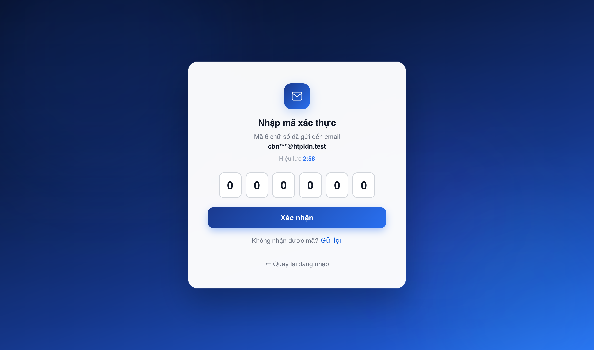
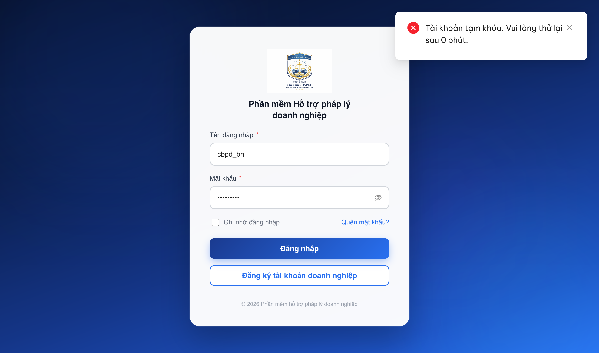
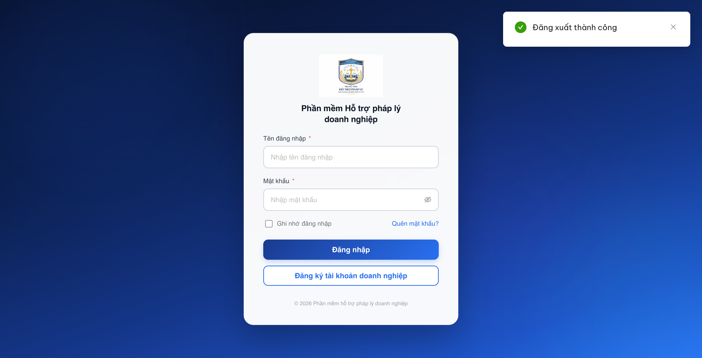
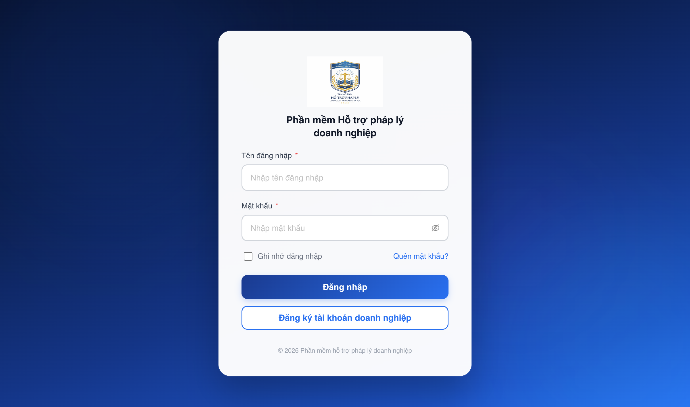

# Bug Report — UAT đối tác tuần 3 (Đăng nhập / Đăng xuất — Quản lý phiên)

| Thông tin | Giá trị |
|-----------|---------|
| **Dự án** | PM HTPLDN |
| **Môi trường** | https://18.143.165.120.nip.io (env được giao). Evidence đối tác chụp trên https://htpldn-uat.ospgroup.vn — build FE khác, cùng backend (đã đối chiếu). |
| **Người test** | QA Automation (Claude Code) |
| **Ngày** | 2026-07-30 21:58:00 |
| **Loại test** | Reverify bug đối tác sau dev fix (Đăng nhập/Đăng xuất, dòng sheet 179–184) |
| **Round** | Reverify tuần 3 — R12 (2026-07-30 21:58; các round trước: R11 · R10 cùng ngày · R2 22/07) |
| **Tài liệu tham chiếu** | [QA_VERIFY_PROTOCOL.md](../../../QA_VERIFY_PROTOCOL.md) · SRS v3.5 bản chuẩn `srs-v3.5/srs-fr-10-quan-tri.md` (FR-VIII-20 dòng ~905-970 · FR-VIII-21 dòng 975-1020 · SCR-VIII-09 dòng 1951-1960) · Sheet tab `UAT_TGPL Doanh Nghiệp-tuần 3` |

---

**Nguồn SRS:** mọi trích dẫn dạng `srs-v3.5/<file>:<dòng>` lấy từ `Docs-PM-HTPLDN/_bmad-output/planning-artifacts/srs-v3.5/` (bản chuẩn duy nhất). Bản `input/srs-update-2026-5-5/` lệch số dòng ở chính các mục dưới đây (vd cùng nội dung "Đăng xuất thành công": bản chuẩn dòng 1011 · bản cũ dòng 1002) nên KHÔNG dùng để đối chiếu.

## Tổng hợp

> **Round hiện tại (LATEST) — R12 re-verify 2026-07-30 21:45→21:58:** Dev báo đã sửa `BUG-QLDX_01`. **Xóa toàn bộ bộ nhớ đệm trình duyệt trước khi thử lại** — kiểm chứng cho thấy trình duyệt vẫn đang giữ **bản giao diện cũ** (`index-CSrYSC-j.js`), sau khi xóa mới nhận bản mới (`index-DHPcPfcs.js`); nghĩa là các lần thử trước đó chạy trên bản chưa có bản sửa. Chạy lại **4 lượt** đăng nhập–đăng xuất với `cbnv_tw_01`: **4/4 lượt** trang đăng nhập hiện khung thông báo *"Đăng xuất thành công"*. `BUG-QLDX_01` → **Closed**. Breakdown: **6 bug — 6 Closed · 0 Open.**

### Severity breakdown

| Tổng | Critical | Major | Medium | Minor | Trivial | Closed | Open |
|------|----------|-------|--------|-------|---------|--------|------|
| 6    | 0        | 0     | 5      | 1     | 0       | 6      | 0    |

## Bug Summary Table

| Bug ID | Severity | Priority | Type | TC Ref | **SRS Reference** | Title | Status |
|--------|----------|----------|------|--------|-------------------|-------|--------|
| BUG-QLDN_07 | Medium | P2 | UI/Copy | QLDN_07 | `FR-VIII-20 (UC118) §Error Handling E6` (`srs-v3.5/srs-fr-10-quan-tri.md:965`) | Nhập sai mã OTP: hệ thống báo chung chung "Đã có lỗi xảy ra" thay vì thông báo "Mã xác thực không đúng hoặc đã hết hạn" theo thiết kế | Closed |
| BUG-QLDN_10 | Medium | P2 | UI/Copy | QLDN_10 | `FR-VIII-20 (UC118) §Error Handling E3` (`srs-v3.5/srs-fr-10-quan-tri.md:962`) | Đăng nhập tài khoản Vô hiệu hóa: hệ thống báo tiếng Anh "Account disabled" thay vì "Tài khoản đã bị vô hiệu hóa" theo thiết kế | Closed |
| BUG-QLDN_12 | Medium | P2 | UI/Copy | QLDN_12 | `FR-VIII-20 (UC118) §Error Handling E2` (`srs-v3.5/srs-fr-10-quan-tri.md:961`) | Đăng nhập tài khoản Tạm khóa (do QTHT): hệ thống báo "Tài khoản tạm khóa. Vui lòng thử lại sau 0 phút." thay vì "Tài khoản đã bị tạm khóa. Vui lòng liên hệ QTHT" theo thiết kế | Closed |
| BUG-QLDX_01 | Medium | P2 | Chức năng | QLDX_01 | `FR-VIII-21 (UC119) §Outputs #2` (`srs-v3.5/srs-fr-10-quan-tri.md:1011`) | Đăng xuất không hiển thị thông báo "Đăng xuất thành công" theo thiết kế | Closed |
| BUG-QLDX_02 | Medium | P2 | Chức năng | QLDX_02 | `SCR-VIII-09 §Quy tắc tương tác` (`srs-v3.5/srs-fr-10-quan-tri.md:1958`) | Nhấn "Đăng xuất" đăng xuất ngay, thiếu hộp thoại xác nhận đăng xuất theo thiết kế | Closed |
| BUG-DXUAT-TOAST-01 | Minor | P3 | UI/UX | QLDX_01 | `FR-VIII-21 (UC119) §Processing Bước 5` (`srs-v3.5/srs-fr-10-quan-tri.md:1004`) · `§Outputs #2` (`srs-v3.5/srs-fr-10-quan-tri.md:1011`) | Đăng xuất hợp lệ nhưng hiện thông báo "Bạn không có quyền truy cập chức năng này." | Closed |

---

## ~~BUG-QLDN_07~~ [CLOSED] — Nhập sai mã OTP: hệ thống báo "Đã có lỗi xảy ra" thay vì thông báo cụ thể theo thiết kế

> **Re-test:** 2026-07-22 R2 — ✅ PASS (Closed). Đăng nhập `cbnv_tw_02` → màn OTP → nhập mã sai `000000` → hệ thống hiển thị đúng thông báo **"Mã xác thực không đúng hoặc đã hết hạn."** (MutationObserver bắt 2/2 lần, ant-notification-error) thay cho "Đã có lỗi xảy ra" cũ. Khớp KQ mong đợi. Ảnh: [image/reverify-QLDN_07-otp-fixed.png](image/reverify-QLDN_07-otp-fixed.png).

### Mô tả

Ở bước nhập mã xác thực (OTP) khi đăng nhập, nếu người dùng nhập **mã sai hoặc đã hết hạn**, hệ thống chỉ hiển thị một thông báo lỗi **chung chung "Đã có lỗi xảy ra"** — không cho người dùng biết là do mã OTP sai/hết hạn. Theo thiết kế phải hiển thị "Mã xác thực không đúng hoặc đã hết hạn".

Đối tác nêu thêm ý phụ: hệ thống **không tự động xóa** mã đã nhập để người dùng nhập lại (các ô OTP vẫn giữ nguyên mã sai). SRS không quy định hành vi tự xóa ô nhập nên ý phụ này chỉ ghi nhận; ưu tiên sửa là nội dung thông báo.

Tái hiện **trực tiếp trên env được giao** (nip.io), đúng vai trò của đối tác (Cán bộ Nghiệp vụ).

### Các bước tái hiện

1. Mở https://18.143.165.120.nip.io/login, đăng nhập `cbnv_tw` / `Test@1234` (Cán bộ Nghiệp vụ - Trung ương) → hệ thống chuyển sang màn "Nhập mã xác thực" (mã 6 số gửi tới email).
2. Nhập một mã OTP **sai** (ví dụ `000000`) vào 6 ô → khi đủ 6 số, form tự gửi (auto-submit).
3. Quan sát thông báo lỗi + trạng thái các ô OTP sau khi lỗi.

### Kết quả mong đợi

- Theo `srs-v3.5/srs-fr-10-quan-tri.md:965` (FR-VIII-20 UC118, §Error Handling E6 — "Mã TOTP sai hoặc hết hạn"): hệ thống phải hiển thị thông báo **"Mã xác thực không đúng hoặc đã hết hạn"** để người dùng hiểu nguyên nhân và nhập lại.

### Kết quả thực tế

- Thông báo hiển thị là **"Đã có lỗi xảy ra"** (toast đỏ) — chung chung, không cho biết mã OTP sai/hết hạn.
- Đo bằng `tools/toast-capture.js` (tự kiểm observer = 1, không lọc trùng, đọc `innerText`): **1 request** `POST /api/v1/auth/verify-otp` · **1 khung thông báo** "Đã có lỗi xảy ra" · không lặp.
- Kiểm chứng phương pháp thứ hai (đọc response API của chính thao tác): `POST /api/v1/auth/verify-otp` trả **HTTP 401**, body `{"error":{"code":"ERR-AUTH-VIII-20-06","message":"Đã có lỗi xảy ra"}}` → backend trả sẵn nội dung chung chung, không phải FE dịch sai. Mã lỗi `ERR-AUTH-VIII-20-06` khớp đúng slot lỗi E6 của FR-VIII-20 nhưng **nội dung thông báo sai** so với đặc tả.
- Ý phụ (không tự xóa mã): sau lỗi, 6 ô OTP vẫn giữ nguyên "000000" (đọc trực tiếp value các ô = `["0","0","0","0","0","0"]`).

### Bằng chứng



---

## ~~BUG-QLDN_10~~ [CLOSED] — Đăng nhập tài khoản Vô hiệu hóa: hệ thống báo "Account disabled" (tiếng Anh) thay vì thông báo tiếng Việt theo thiết kế

> **Re-test:** 2026-07-22 R2 — ✅ PASS (Closed). QTHT vô hiệu hóa `cbnv_bn_02` (màn Tài khoản & phân quyền) → đăng nhập lại tài khoản đó → hệ thống hiển thị tiếng Việt **"Tài khoản đã bị vô hiệu hóa. Vui lòng liên hệ Quản trị hệ thống."** (MutationObserver bắt 2/2 lần, ant-notification-error) thay cho "Account disabled" cũ. Khớp KQ mong đợi. Ảnh: [image/reverify-QLDN_10-disabled-vi.png](image/reverify-QLDN_10-disabled-vi.png).

### Mô tả

Khi người dùng đăng nhập bằng một **tài khoản đã bị vô hiệu hóa** (trạng thái "Vô hiệu hóa"), hệ thống hiển thị thông báo lỗi bằng **tiếng Anh "Account disabled"** — không đồng nhất với ngôn ngữ giao diện (tiếng Việt). Theo thiết kế phải hiển thị "Tài khoản đã bị vô hiệu hóa".

Tái hiện **trực tiếp trên env được giao** (nip.io): thông báo trả về trùng khớp **từng chữ** với chuỗi đối tác báo cáo ("Account disabled").

### Các bước tái hiện

1. QTHT đặt một tài khoản về trạng thái **Vô hiệu hóa** (màn "Tài khoản & phân quyền" → nút "Vô hiệu hóa").
2. Đăng xuất QTHT, mở https://18.143.165.120.nip.io/login.
3. Nhập đúng tên đăng nhập + mật khẩu của tài khoản vừa bị vô hiệu hóa → bấm "Đăng nhập".
4. Quan sát thông báo lỗi.

### Kết quả mong đợi

- Theo `srs-v3.5/srs-fr-10-quan-tri.md:962` (FR-VIII-20 UC118, §Error Handling E3 — "TK bị vô hiệu hóa", ERR-DN-03): hệ thống phải hiển thị thông báo tiếng Việt **"Tài khoản đã bị vô hiệu hóa"**.

### Kết quả thực tế

- Thông báo hiển thị là **"Account disabled"** (tiếng Anh) — sai ngôn ngữ, không đồng nhất với giao diện tiếng Việt.
- Đo bằng `tools/toast-capture.js` (tự kiểm observer = 1, không lọc trùng, đọc `innerText`): **1 request** `POST /api/v1/auth/login` · **1 khung thông báo** "Account disabled" · không lặp.
- Kiểm chứng phương pháp thứ hai (đọc response API của chính thao tác): `POST /api/v1/auth/login` trả **HTTP 401**, body `{"error":{"code":"ERR-AUTH-LOGIN-04","message":"Account disabled"}}` → backend trả sẵn chuỗi tiếng Anh, không phải FE dịch sai.

### Bằng chứng


---

## ~~BUG-QLDN_12~~ [CLOSED] — Đăng nhập tài khoản Tạm khóa (do QTHT): thông báo "Tài khoản tạm khóa. Vui lòng thử lại sau 0 phút." không đúng thiết kế

> **Re-test:** 2026-07-22 R2 — ✅ PASS (Closed). QTHT tạm khóa `cbnv_dp_02` (nút "Khóa TK" màn Tài khoản & phân quyền) → đăng nhập lại → hệ thống hiển thị **"Tài khoản đã bị tạm khóa. Vui lòng liên hệ Quản trị hệ thống."** (MutationObserver bắt 2/2 lần, ant-notification-error), KHÔNG còn "thử lại sau 0 phút". Khớp KQ mong đợi. Ảnh: [image/reverify-QLDN_12-locked-vi.png](image/reverify-QLDN_12-locked-vi.png).

### Mô tả

Khi người dùng đăng nhập bằng một **tài khoản bị QTHT chủ động tạm khóa** (trạng thái "Tạm khóa"), hệ thống hiển thị thông báo **"Tài khoản tạm khóa. Vui lòng thử lại sau 0 phút."** Thông báo này không đúng thiết kế và còn chứa nội dung vô nghĩa: tài khoản bị QTHT khóa **không có mốc tự mở khóa**, nên việc hiển thị đồng hồ đếm ngược "thử lại sau X phút" là sai bản chất; ngoài ra hiển thị **"0 phút"** (tức bảo người dùng thử lại ngay) là mâu thuẫn với việc tài khoản đang bị khóa.

Tái hiện **trực tiếp trên env được giao** (nip.io), đúng kịch bản đối tác (khóa do QTHT cập nhật trạng thái, không phải do đăng nhập sai 5 lần).

### Các bước tái hiện

1. QTHT đặt một tài khoản về trạng thái **Tạm khóa** (màn "Tài khoản & phân quyền" → nút "Khóa TK").
2. Đăng xuất QTHT, mở https://18.143.165.120.nip.io/login.
3. Nhập đúng tên đăng nhập + mật khẩu của tài khoản vừa bị tạm khóa → bấm "Đăng nhập".
4. Quan sát thông báo lỗi.

### Kết quả mong đợi

- Theo `srs-v3.5/srs-fr-10-quan-tri.md:961` (FR-VIII-20 UC118, §Error Handling E2 — "TK bị tạm khóa", ERR-DN-02): hệ thống phải hiển thị **"Tài khoản đã bị tạm khóa. Vui lòng liên hệ QTHT"** (liên hệ Quản trị hệ thống), KHÔNG hiển thị đồng hồ đếm ngược "thử lại sau X phút" cho tài khoản bị admin khóa.

### Kết quả thực tế

- Thông báo hiển thị là **"Tài khoản tạm khóa. Vui lòng thử lại sau 0 phút."** — sai nội dung thiết kế + vô nghĩa ("0 phút").
- Đo bằng `tools/toast-capture.js` (không lọc trùng, đọc `innerText`): **1 request** `POST /api/v1/auth/login` · **1 khung thông báo** đúng chuỗi trên · không lặp.
- Kiểm chứng phương pháp thứ hai (đọc response API của chính thao tác): `POST /api/v1/auth/login` trả **HTTP 401**, body `{"error":{"code":"ERR-AUTH-LOCKED-01","message":"Tài khoản tạm khóa. Vui lòng thử lại sau 0 phút.","retry_after_seconds":0}}` → backend đang coi tài khoản bị QTHT khóa như bị **rate-limit tạm khóa** (đếm ngược `retry_after_seconds=0`) thay vì trạng thái admin-lock cần liên hệ QTHT.

### Bằng chứng



---

## ~~BUG-QLDX_01~~ [CLOSED] — Đăng xuất không hiển thị thông báo "Đăng xuất thành công"

> **Re-test:** 2026-07-30 21:58 R12 — ✅ PASS (Closed-verified). **Xóa sạch bộ nhớ đệm trình duyệt rồi tải lại** trước khi thử: kiểm chứng cho thấy trình duyệt đang giữ bản giao diện cũ (`index-CSrYSC-j.js`) và chỉ sau khi xóa mới nhận bản mới (`index-DHPcPfcs.js`) — tức các lượt đo ở R11 chạy trên bản **chưa có bản sửa**. Chạy lại trọn luồng **4 lượt** đăng nhập–đăng xuất với `cbnv_tw_01` (menu avatar → "Đăng xuất" → hộp thoại xác nhận → "Đồng ý"), các lượt lúc 21:51:33 · 21:53:01 · 21:54:16 · 21:56:37: **4/4 lượt** trang đăng nhập hiện khung thông báo *"Đăng xuất thành công"* (khung có biểu tượng dấu tích và nút đóng), đọc trực tiếp từ cây trợ năng của trang đang chạy:
> ```
> url = https://18.143.165.120.nip.io/login
>   alert  atomic  live="assertive"
>     image "check-circle"
>     StaticText "Đăng xuất thành công"
>     button "close"
> ```
> **Lưu ý về cách đo:** khung thông báo tự tắt sau ~3 giây, trong khi mọi lệnh chụp ảnh/quét DOM của công cụ kiểm thử đều phải đợi trang tải xong (đo được +7,3 đến +10,2 giây) nên **luôn tới sau khi khung đã tắt** — đây là giới hạn của công cụ, không phải của phần mềm. Con số "1/7 lượt" ở R11 vì vậy phản ánh độ trễ của phép đo chứ không phải tần suất lỗi thật; R12 dùng lệnh chờ chủ động nên bắt được đủ 4/4.

### Mô tả

Khi người dùng đăng xuất chủ động (menu avatar → "Đăng xuất"), hệ thống chuyển về trang đăng nhập nhưng **không hiển thị thông báo "Đăng xuất thành công"** như thiết kế.

### Các bước tái hiện

1. Đăng nhập thành công vào hệ thống.
2. Mở menu avatar (góc trên phải) → nhấn "Đăng xuất".
3. Quan sát có thông báo "Đăng xuất thành công" khi chuyển về trang đăng nhập không.

### Kết quả mong đợi

- Theo `srs-v3.5/srs-fr-10-quan-tri.md:1011` (FR-VIII-21 UC119, §Outputs #2 — message "Đăng xuất thành công"): hệ thống phải hiển thị thông báo **"Đăng xuất thành công"** khi đăng xuất, và theo `srs-v3.5/srs-fr-10-quan-tri.md:1004` (§Processing Bước 5) chuyển hướng về **màn hình đăng nhập**. Thông báo phải hiện **ổn định ở mọi lần đăng xuất**, không phụ thuộc thời điểm trang mới tải xong.

### Kết quả thực tế

Đo lại ở R11 (2026-07-30 20:29→20:43), **8 lượt** đăng nhập–đăng xuất liên tiếp với `cbnv_tw_01`, thao tác qua giao diện (menu avatar → "Đăng xuất" → hộp thoại xác nhận → "Đồng ý"):

- Thông báo "Đăng xuất thành công" **chỉ bắt được 1/7 lượt kết luận được** — vẫn không ổn định:
  - **1 lượt CÓ** (lượt 3): ảnh chụp trang `/login` ngay sau khi chuyển trang thấy rõ khung thông báo xanh "Đăng xuất thành công" ở góc trên phải.
  - **6 lượt KHÔNG** (lượt 1, 2, 4, 6, 7, 8): trang `/login` hiện ra không kèm thông báo. Trong đó 3 lượt đo bằng ảnh chụp ngay sau cú bấm, 3 lượt đo bằng quét DOM + MutationObserver + poll 120ms/lần suốt 7–8 giây trên trang `/login` → không bắt được khung thông báo nào.
  - 1 lượt (lượt 5) không kết luận được do bộ đo không khởi động lại được sau khi trang tải cứng.
- **Đã sửa được so với R10 — vòng `/profile` biến mất:** 4 lượt có gắn bộ theo dõi điều hướng (`history.pushState/replaceState` + `fetch`) đều cho cùng chuỗi:
  ```
  13:36:43.517  bấm "Đồng ý"
  13:36:43.572  POST /api/v1/auth/logout   → 200
  13:36:43.572  rời trang /dashboard, tải thẳng /login   (KHÔNG qua /profile)
  ```
  0/4 lượt có `replaceState → /profile`, 0/8 lượt có thông báo lỗi "Bạn không có quyền truy cập chức năng này.".
- Trong toàn luồng đăng xuất chỉ có **1 request duy nhất** và nó trả **200** — không có request nào 4xx.
- Vì hệ thống rời trang ngay trong **cùng một mili-giây** với lúc nhận phản hồi đăng xuất, thông báo thành công phải do trang đăng nhập mới phát; nó đua với lần tải trang nên **lúc hiện lúc không**.

### Bằng chứng



> Hai ảnh "lượt không có thông báo" chụp ở R11 đã được gỡ khỏi mục này: kiểm chứng ở R12 cho thấy chúng chụp sau khi khung thông báo tự tắt, nên không chứng minh được là thông báo không hiện.

---

## ~~BUG-DXUAT-TOAST-01~~ [CLOSED] — Đăng xuất hợp lệ nhưng hệ thống hiện thông báo "Bạn không có quyền truy cập chức năng này."

> **Re-test:** 2026-07-30 20:43 R11 — ✅ PASS (Closed-verified). Chạy lại trọn luồng **8 lượt** đăng nhập–đăng xuất với `cbnv_tw_01` (menu avatar → "Đăng xuất" → hộp thoại xác nhận → "Đồng ý"): **0/8 lượt** xuất hiện thông báo "Bạn không có quyền truy cập chức năng này.". Nguyên nhân gốc cũng đã hết — 4 lượt có gắn bộ theo dõi `history.pushState/replaceState` cho thấy **0/4 lượt** đi vòng qua `/profile`; sau khi `POST /api/v1/auth/logout` trả 200, hệ thống rời `/dashboard` và tải thẳng `/login` trong cùng mili-giây. Toàn luồng chỉ 1 request và trả 200, không có request 4xx. Lỗi thiếu thông báo thành công là vấn đề riêng, còn Open ở `BUG-QLDX_01`.

### Mô tả

Theo `srs-v3.5/srs-fr-10-quan-tri.md:1004` (FR-VIII-21 UC119, §Processing Bước 5), sau khi hủy phiên hệ thống phải **chuyển hướng về màn hình đăng nhập**; `srs-v3.5/srs-fr-10-quan-tri.md:1011` (§Outputs #2) quy định thông báo trả về là "Đăng xuất thành công" / "Phiên hết hạn".

Thực tế, mỗi lần người dùng đăng xuất **đúng luồng và thành công**, hệ thống lại hiển thị một thông báo **lỗi** mang bản chất khác hoàn toàn — "Bạn không có quyền truy cập chức năng này." — khiến người dùng hiểu rằng thao tác bị chặn vì thiếu quyền, trong khi phiên đã được hủy bình thường. Nguyên nhân đo được: ngay sau khi API đăng xuất trả 200, giao diện chuyển tạm sang `/profile` (một màn cần đăng nhập) rồi mới về `/login`; chốt quyền của `/profile` chạy khi phiên đã hủy nên bắn thông báo từ chối truy cập.

### Các bước tái hiện

1. Đăng nhập `cbnv_tw_01` / `Test@1234` — vai trò **CB Nghiệp vụ Trung ương**, phiên hợp lệ, có quyền dùng chức năng đăng xuất (đăng xuất áp dụng cho **mọi vai trò** theo `srs-v3.5/srs-fr-10-quan-tri.md:985` (FR-VIII-21 §Tác nhân = ALL)).
2. Mở menu avatar → **Đăng xuất** → hộp thoại "Xác nhận đăng xuất" → bấm **Đồng ý** (click chuột thật).
3. Quan sát thông báo hiện ra và đường dẫn trang trong khoảng 1 giây ngay sau đó.

### Kết quả mong đợi

- Theo `srs-fr-10-quan-tri.md:1004` + `:1011`: đăng xuất thành công thì hệ thống chuyển về **màn hình đăng nhập** và thông báo cho người dùng biết **đã đăng xuất thành công**. Không được xuất hiện thông báo mang nghĩa "bị từ chối vì thiếu quyền" cho một thao tác đã thành công.

### Kết quả thực tế

- **Xuất hiện 4/4 lượt đo** (kể cả các lượt có thông báo thành công): khung `ant-message-notice ant-message-notice-error` nội dung **"Bạn không có quyền truy cập chức năng này."**
- Đường dẫn đi qua `/profile` trước khi về `/login` — bắt được bằng patch `history.replaceState`:
  ```
  POST /api/v1/auth/logout           → 200 · message "Đăng xuất thành công"
  history.replaceState → /profile     (+8ms)
  toast lỗi "Bạn không có quyền truy cập chức năng này."  (+30ms)
  → sau đó mới tải /login
  ```
- Trong toàn luồng **không có request nào trả 4xx** (chỉ 1 request duy nhất, trả 200) ⇒ thông báo lỗi do lớp giao diện tự phát, không phải do backend từ chối.
- Bộ bắt thông báo cài trên `document.body`, **không lọc trùng** theo memory `feedback-log-incidental-bugs-and-no-dedupe-toast`: mỗi lượt ghi 2–3 node (`…-wrapper` + `…-notice`) của **cùng 1 khung**, đối chiếu số request (1) ⇒ 1 thông báo/lượt, không phải double toast.

### Bằng chứng

- Log MutationObserver + patch điều hướng (ghi sang `localStorage` để sống qua lần tải trang mới):
  ```json
  [{"t":"09:07:15.859","doc":"/profile","kind":"toast",
    "cls":"ant-message-notice ant-message-notice-error",
    "text":"Bạn không có quyền truy cập chức năng này."}]
  ```
- Chi tiết phép đo + chuỗi thời gian đầy đủ: [KET-QUA-reverify-24-case-reopent.md §Ghi chú kiểm chứng](../../dev-fix-reverify-round-10-2026-07-30/KET-QUA-reverify-24-case-reopent.md)

---

## ~~BUG-QLDX_02~~ [CLOSED] — Nhấn "Đăng xuất" đăng xuất ngay, thiếu hộp thoại xác nhận

> **Re-test:** 2026-07-22 R2 — ✅ PASS (Closed). Đăng nhập `cbnv_tw_02` → avatar → "Đăng xuất" → hệ thống hiển thị **hộp thoại xác nhận** "Xác nhận đăng xuất — Bạn có chắc muốn đăng xuất khỏi hệ thống?" (nút Hủy/Đồng ý), URL vẫn ở `/dashboard` cho tới khi bấm "Đồng ý" mới đăng xuất. Lặp lại với QTHT cho kết quả giống (độc lập vai trò). Khớp KQ mong đợi. Ảnh: [image/reverify-QLDX_02-logout-confirm-modal.png](image/reverify-QLDX_02-logout-confirm-modal.png).

### Mô tả

Khi người dùng nhấn "Đăng xuất" trong menu avatar, hệ thống **đăng xuất ngay lập tức** và chuyển về trang đăng nhập, **không hiển thị hộp thoại xác nhận** ("Bạn có chắc muốn đăng xuất khỏi hệ thống?") như thiết kế.

### Các bước tái hiện

1. Đăng nhập thành công vào hệ thống.
2. Mở menu avatar (góc trên phải) → nhấn "Đăng xuất".
3. Quan sát có hộp thoại xác nhận (nút "Đồng ý"/"Hủy") hiện ra trước khi đăng xuất không.

### Kết quả mong đợi

- Theo `srs-v3.5/srs-fr-10-quan-tri.md:1958` (SCR-VIII-09, §Quy tắc tương tác — "Đăng xuất chủ động: Avatar → dropdown → 'Đăng xuất' → **Modal xác nhận** → Hủy JWT → Redirect"): hệ thống phải hiển thị hộp thoại xác nhận trước khi kết thúc phiên.

### Kết quả thực tế

- KHÔNG có hộp thoại xác nhận; nhấn "Đăng xuất" chuyển thẳng về trang đăng nhập.
- Đo bằng MutationObserver (Rule 8) còn sống suốt thao tác, bắt cả node `ant-modal-*`: **0 modal**. Lặp lại với 2 tài khoản (CB Phê duyệt TW + Quản trị hệ thống) → kết quả giống nhau (độc lập vai trò). Chi tiết: [measure/QLDX_02-logout-modal-measure.md](../../measure/QLDX_02-logout-modal-measure.md).

### Bằng chứng



---
